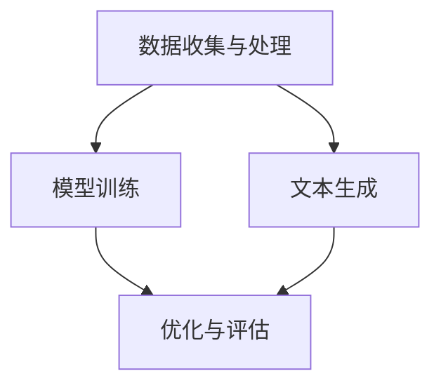
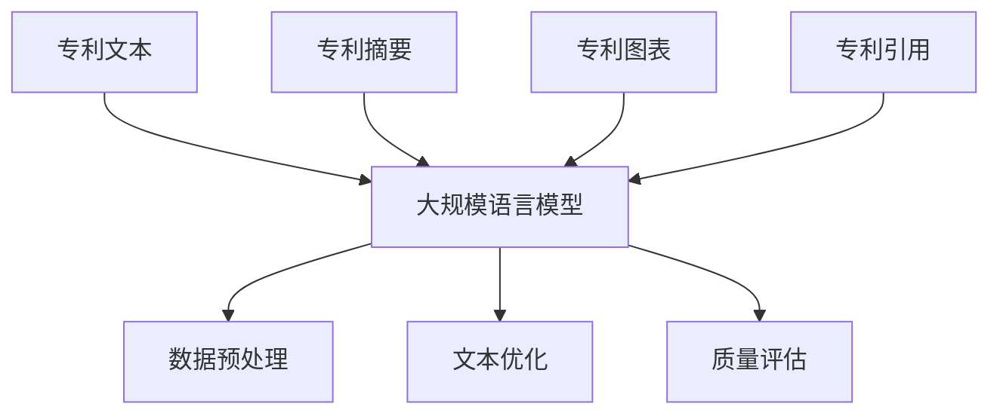

                 

 <sop>

### 1.2 大规模语言模型基础

#### 1.2.1 什么是大规模语言模型？

大规模语言模型是一种利用深度学习技术，尤其是神经网络来建模和理解自然语言的方法。这些模型通常具有数百万到数十亿个参数，通过训练大量的文本数据来学习语言的内在结构。大规模语言模型的主要目标是实现对自然语言的自动理解和生成，从而实现文本分类、机器翻译、问答系统等多种应用。

#### 1.2.2 大规模语言模型的工作原理

大规模语言模型通常基于变换器模型（Transformer），这是一种用于处理序列数据的强大神经网络架构。变换器模型的核心思想是自注意力机制（Self-Attention），它允许模型在处理输入序列时，动态地关注序列中其他位置的信息。这种注意力机制使得模型能够更好地捕捉序列间的长距离依赖关系。

变换器模型主要由以下几个部分组成：

- **编码器（Encoder）**：编码器负责接收输入序列并生成编码表示。编码器中的每个位置都通过自注意力机制和前馈网络进行处理，最终输出序列的编码表示。
- **解码器（Decoder）**：解码器负责生成输出序列。在生成每个输出位置时，解码器会利用编码器的输出和已生成的部分输出序列，通过自注意力机制和交叉注意力机制来生成下一个位置的输出。
- **自注意力机制（Self-Attention）**：自注意力机制允许编码器或解码器中的每个位置根据其与序列中其他位置的相关性来计算权重，从而对输入序列进行加权整合。
- **交叉注意力机制（Cross-Attention）**：交叉注意力机制允许解码器在生成每个输出位置时，根据编码器的输出和已生成的部分输出序列来计算权重，从而对编码器输出进行加权整合。

#### 1.2.3 主流大规模语言模型介绍

目前，已有多个大规模语言模型被广泛研究和应用，其中最具代表性的包括：

- **GPT（Generative Pre-trained Transformer）系列**：GPT系列由OpenAI提出，包括GPT、GPT-2和GPT-3等模型。这些模型通过预训练和微调，已经在多种NLP任务中取得了优异的性能。
- **BERT（Bidirectional Encoder Representations from Transformers）**：BERT由Google提出，是一种双向的变换器模型，通过在训练过程中同时考虑上下文信息，实现了对自然语言更准确的建模。
- **T5（Text-to-Text Transfer Transformer）**：T5由Google提出，旨在将所有NLP任务统一到一个统一的文本到文本的转换框架中，通过微调实现任务特定模型的训练。

#### 1.2.4 大规模语言模型的优势与挑战

**优势：**

- **强大的语言理解能力**：大规模语言模型通过学习大量的文本数据，能够对自然语言进行深刻的理解，从而实现文本分类、机器翻译、问答系统等多种应用。
- **高效的处理速度**：变换器模型在处理序列数据时，具有并行计算的优势，使得大规模语言模型在处理大规模数据时具有更高的效率。
- **灵活的应用场景**：大规模语言模型具有广泛的应用场景，可以从文本生成、机器翻译到问答系统，再到专利分析等，都能够发挥其优势。

**挑战：**

- **计算资源需求大**：大规模语言模型通常需要大量的计算资源和存储空间，对于资源和计算能力有限的场景，可能难以部署和运行。
- **数据质量和隐私问题**：大规模语言模型需要大量的训练数据，而这些数据的来源可能涉及隐私问题，如何确保数据的质量和隐私成为了一个重要的挑战。
- **可解释性和可靠性**：大规模语言模型的决策过程通常是非透明的，如何提高其可解释性和可靠性是一个重要的研究课题。

### 1.3 自动专利分析与生成的背景

#### 1.3.1 自动专利分析

自动专利分析是指利用人工智能技术，特别是自然语言处理技术，对专利文献进行自动化处理和分析的一种方法。自动专利分析的目标是快速挖掘专利信息，识别技术趋势，评估专利价值等。

#### 1.3.2 自动专利生成

自动专利生成是指利用人工智能技术，特别是大规模语言模型，根据用户的需求和输入，自动生成专利文本的一种方法。自动专利生成的目标是通过自动化方式，提高专利撰写的效率和质量。

#### 1.3.3 自动专利分析与生成的重要性

随着全球专利数量的爆炸性增长，传统的专利分析与生成方法已经难以满足实际需求。自动专利分析与生成技术能够大幅提高专利分析的效率，降低专利撰写的成本，为企业和研究机构提供强大的技术支持。

### 1.4 本书结构安排

本书将分为八个章节，首先介绍大规模语言模型和自动专利分析与生成的背景和现状，然后详细讲解大规模语言模型和自动专利分析/生成的基本原理，接着介绍大规模语言模型在专利分析中的应用，以及自动专利生成的原理和实现方法。随后，本书将结合实际项目，详细介绍自动专利分析与生成系统的设计和实现，最后提供最佳实践和未来展望。

### 第2章 大规模语言模型基础

### 2.1 大规模语言模型基本概念

#### 2.1.1 语言模型的概念

语言模型是一种用于预测自然语言中下一个词或字符的概率分布的数学模型。其基本目标是根据已知的输入序列，预测下一个可能的输出序列。

#### 2.1.2 大规模语言模型的特点

大规模语言模型与传统的语言模型相比，具有以下几个显著特点：

- **参数规模大**：大规模语言模型通常拥有数十亿到千亿个参数，远大于传统语言模型。
- **训练数据量大**：大规模语言模型需要大量的训练数据来训练模型参数，以便更好地建模语言的内在结构。
- **自注意力机制**：大规模语言模型通常采用自注意力机制，能够更好地捕捉序列间的长距离依赖关系。

#### 2.1.3 大规模语言模型的应用领域

大规模语言模型在多个应用领域都取得了显著的成果，包括但不限于：

- **文本分类**：利用大规模语言模型进行文本分类，能够实现对大量文本的自动分类。
- **机器翻译**：大规模语言模型在机器翻译领域表现出色，能够实现高质量的自然语言翻译。
- **问答系统**：大规模语言模型能够基于海量文本数据，实现智能问答系统，为用户提供准确、快速的答案。

### 2.2 大规模语言模型的原理

#### 2.2.1 变换器模型（Transformer）

变换器模型（Transformer）是由Vaswani等人在2017年提出的一种用于处理序列数据的神经网络模型。它摒弃了传统的循环神经网络（RNN）和卷积神经网络（CNN），引入了自注意力机制（Self-Attention）和多头注意力机制（Multi-Head Attention），从而在多个NLP任务中取得了显著的性能提升。

变换器模型主要由编码器（Encoder）和解码器（Decoder）两部分组成，下面将分别介绍：

**编码器（Encoder）**

编码器的输入是一个序列，输出是一个序列的编码表示。编码器的每个位置都通过自注意力机制和前馈网络进行处理，具体步骤如下：

1. **嵌入（Embedding）**：将输入序列中的每个词或字符映射到一个高维向量。
2. **位置编码（Positional Encoding）**：由于变换器模型不直接使用位置信息，需要通过位置编码来嵌入序列的位置信息。
3. **多头自注意力（Multi-Head Self-Attention）**：编码器的每个位置都通过多头自注意力机制计算其与序列中其他位置的相关性，从而生成加权整合的表示。
4. **前馈网络（Feedforward Network）**：对多头自注意力机制的输出进行前馈网络处理，增加模型的非线性能力。

**解码器（Decoder）**

解码器的输入是编码器的输出，输出是预测的输出序列。解码器的每个位置都通过自注意力机制、交叉注意力机制和前馈网络进行处理，具体步骤如下：

1. **嵌入（Embedding）**：将输入序列中的每个词或字符映射到一个高维向量。
2. **位置编码（Positional Encoding）**：与编码器相同，解码器也需要通过位置编码来嵌入序列的位置信息。
3. **多头自注意力（Multi-Head Self-Attention）**：解码器的每个位置都通过多头自注意力机制计算其与序列中其他位置的相关性，从而生成加权整合的表示。
4. **交叉注意力（Cross-Attention）**：在生成每个输出位置时，解码器通过交叉注意力机制利用编码器的输出，从而实现对编码器输出的加权整合。
5. **前馈网络（Feedforward Network）**：对交叉注意力机制的输出进行前馈网络处理，增加模型的非线性能力。

#### 2.2.2 自注意力机制（Self-Attention）

自注意力机制是一种对序列中的每个位置赋予不同权重的方法，从而实现对序列的加权整合。自注意力机制的核心思想是计算每个位置与序列中其他位置的相关性，具体步骤如下：

1. **计算查询（Query）、键（Key）和值（Value）**：对于序列中的每个位置，计算其对应的查询（Query）、键（Key）和值（Value）。查询和键是同一向量，值是另一个向量。
2. **计算相似度（Similarity）**：计算查询和键之间的相似度，通常使用点积（Dot-Product）或余弦相似度等方法。
3. **计算加权值（Weighted Value）**：根据相似度计算加权值，从而实现对序列的加权整合。

#### 2.2.3 多头注意力机制（Multi-Head Attention）

多头注意力机制是一种扩展自注意力机制的方法，通过将自注意力机制重复多次，然后拼接结果，从而增加模型的表示能力。具体步骤如下：

1. **重复自注意力机制**：将自注意力机制重复多次，每次称为一个“头”（Head）。
2. **拼接结果**：将每个头的输出拼接起来，形成一个更大的向量。
3. **线性变换**：对拼接的结果进行线性变换，得到最终的输出。

### 2.3 主流大规模语言模型介绍

#### 2.3.1 GPT（Generative Pre-trained Transformer）

GPT系列是由OpenAI提出的一系列大规模语言模型，包括GPT、GPT-2和GPT-3等。这些模型通过预训练和微调，在多种NLP任务中取得了优异的性能。

- **GPT**：GPT是第一个GPT模型，拥有1.17亿个参数，通过预训练实现了对自然语言的建模。
- **GPT-2**：GPT-2是GPT的升级版，拥有1.5亿个参数，通过更长的序列和更精细的预训练，进一步提高了模型的性能。
- **GPT-3**：GPT-3是GPT系列的最新版本，拥有1750亿个参数，是目前最大的语言模型。GPT-3在多种NLP任务中表现出了强大的能力，包括文本生成、机器翻译、问答系统等。

#### 2.3.2 BERT（Bidirectional Encoder Representations from Transformers）

BERT是由Google提出的一种双向的变换器模型，通过在训练过程中同时考虑上下文信息，实现了对自然语言更准确的建模。BERT在多种NLP任务中取得了优异的性能，包括文本分类、问答系统和自然语言推理等。

#### 2.3.3 T5（Text-to-Text Transfer Transformer）

T5是由Google提出的一种将所有NLP任务统一到一个统一的文本到文本的转换框架中的模型。T5的目标是构建一个通用的模型，通过微调实现任务特定模型的训练。T5在多种NLP任务中表现出了强大的能力，包括文本分类、机器翻译和问答系统等。

### 2.4 大规模语言模型的优势与挑战

#### 2.4.1 优势

- **强大的语言理解能力**：大规模语言模型通过学习大量的文本数据，能够对自然语言进行深刻的理解，从而实现文本分类、机器翻译、问答系统等多种应用。
- **高效的处理速度**：变换器模型在处理序列数据时，具有并行计算的优势，使得大规模语言模型在处理大规模数据时具有更高的效率。
- **灵活的应用场景**：大规模语言模型具有广泛的应用场景，可以从文本生成、机器翻译到问答系统，再到专利分析等，都能够发挥其优势。

#### 2.4.2 挑战

- **计算资源需求大**：大规模语言模型通常需要大量的计算资源和存储空间，对于资源和计算能力有限的场景，可能难以部署和运行。
- **数据质量和隐私问题**：大规模语言模型需要大量的训练数据，而这些数据的来源可能涉及隐私问题，如何确保数据的质量和隐私成为了一个重要的挑战。
- **可解释性和可靠性**：大规模语言模型的决策过程通常是非透明的，如何提高其可解释性和可靠性是一个重要的研究课题。

### 第3章 自动专利分析原理

### 3.1 专利分析概述

#### 3.1.1 专利分析的定义

专利分析是指通过对专利文献的检索、筛选、分析和评估，以获取有价值的技术信息、竞争态势和市场情报的过程。专利分析旨在帮助企业或研究机构了解技术发展趋势、评估技术创新能力、识别竞争对手、保护知识产权等。

#### 3.1.2 专利分析的目的

专利分析的主要目的包括：

- **技术发展趋势**：通过分析专利数据，了解某个领域的技术发展动态和趋势，为技术研发和创新提供指导。
- **竞争情报**：通过分析竞争对手的专利布局，评估竞争对手的技术实力和市场地位，为企业战略规划提供依据。
- **知识产权保护**：通过分析自身专利组合，评估专利的有效性和潜在风险，为知识产权保护策略制定提供支持。
- **市场机遇**：通过分析专利数据，发现潜在的市场机会和商业合作机会，为企业的市场拓展提供支持。

#### 3.1.3 专利分析的方法

专利分析的方法主要包括以下几种：

- **文本分析**：通过对专利文献的文本内容进行关键词提取、主题模型等方法，分析技术领域、技术创新点等。
- **技术路线图**：通过分析专利技术领域、技术发展阶段和技术关联关系，绘制技术路线图，展示技术发展脉络。
- **专利地图**：通过分析专利申请量、专利权人、技术领域等数据，绘制专利地图，展示技术分布和竞争态势。
- **专利价值评估**：通过分析专利的技术价值、市场价值、法律价值等，评估专利的综合价值。

### 3.2 自动专利分析的方法

#### 3.2.1 专利信息的获取与处理

自动专利分析的第一步是获取专利信息。目前，主要的专利信息来源包括国家知识产权局、专利数据库和专利检索工具等。专利信息获取后，需要对其进行处理，以便后续分析。

专利信息处理的主要步骤包括：

- **数据清洗**：去除重复数据、噪声数据和无关数据，确保数据的一致性和准确性。
- **数据格式化**：将专利信息转换为统一的数据格式，如JSON、XML等，便于后续分析。
- **文本预处理**：对专利文献的文本内容进行分词、词性标注、去除停用词等预处理操作，提高文本分析的效果。

#### 3.2.2 专利检索与筛选

专利检索与筛选是自动专利分析的核心步骤，其主要任务是从大量专利数据中筛选出与特定需求相关的专利。常用的专利检索与筛选方法包括：

- **关键词检索**：通过输入特定关键词，检索与关键词相关的专利文献。
- **分类号检索**：通过输入特定的分类号，检索与分类号相关的专利文献。
- **逻辑检索**：利用逻辑运算符（如AND、OR、NOT）组合多个检索条件，实现复杂检索。
- **筛选规则**：根据特定需求，设置筛选规则，如专利申请年份、专利权人、技术领域等，筛选出满足条件的专利。

#### 3.2.3 专利分析工具与平台

自动专利分析需要借助专业的工具与平台，以提高分析效率。目前，常用的专利分析工具与平台包括：

- **专利检索工具**：如Google Patents、USPTO专利数据库等，提供基本的专利检索功能。
- **专利分析工具**：如PatSnap、Incopat等，提供专利检索、分析、可视化等功能。
- **文本分析工具**：如NLTK、TextRank等，提供文本预处理、关键词提取、主题模型等文本分析功能。
- **数据可视化工具**：如Matplotlib、Seaborn等，提供数据可视化功能，帮助分析者直观地理解专利数据。

### 3.3 专利信息的处理与分析

#### 3.3.1 专利信息处理

专利信息的处理主要包括以下步骤：

- **数据导入**：将获取的专利数据导入分析工具或平台，进行后续处理。
- **数据清洗**：去除重复数据、噪声数据和无关数据，确保数据的一致性和准确性。
- **数据格式化**：将专利信息转换为统一的数据格式，如JSON、XML等，便于后续分析。
- **文本预处理**：对专利文献的文本内容进行分词、词性标注、去除停用词等预处理操作，提高文本分析的效果。

#### 3.3.2 专利信息分析

专利信息的分析主要包括以下方面：

- **技术趋势分析**：通过分析专利的技术领域、技术创新点等，了解技术发展趋势。
- **竞争态势分析**：通过分析专利权人、专利数量、专利技术分布等，了解竞争对手的技术实力和市场地位。
- **专利价值评估**：通过分析专利的技术价值、市场价值、法律价值等，评估专利的综合价值。
- **专利地图绘制**：通过分析专利数据，绘制专利地图，展示技术分布和竞争态势。

### 3.4 专利分析的应用场景

#### 3.4.1 企业研发决策

专利分析可以帮助企业了解技术发展趋势，识别潜在的技术机会和风险，为研发决策提供支持。通过分析竞争对手的专利布局，企业可以及时调整研发方向，避免重复研发，提高研发效率。

#### 3.4.2 市场竞争情报

专利分析可以为企业提供竞争对手的技术实力和市场地位信息，帮助企业制定市场竞争策略。通过分析市场中的专利数据，企业可以了解市场格局、技术热点和潜在竞争对手，从而调整市场战略。

#### 3.4.3 知识产权管理

专利分析对于企业的知识产权管理至关重要。通过分析自身的专利组合，企业可以评估专利的有效性和潜在风险，制定合理的知识产权保护策略。同时，专利分析还可以帮助企业规避竞争对手的专利风险，降低法律诉讼的风险。

#### 3.4.4 投资决策

专利分析可以帮助投资者了解目标企业的技术创新能力和市场前景，为投资决策提供支持。通过分析企业的专利布局和专利价值，投资者可以评估企业的核心竞争力，从而做出更为明智的投资决策。

### 第4章 大规模语言模型在专利分析中的应用

### 4.1 大规模语言模型在专利检索中的应用

#### 4.1.1 概述

大规模语言模型在专利检索中的应用主要体现在通过理解用户查询语句，提供更精准的专利检索结果。传统的专利检索主要依赖于关键词匹配和分类号匹配，而大规模语言模型则能捕捉查询语句中的隐含语义，从而提高检索的准确性和效率。

#### 4.1.2 具体应用

**1. 查询语句理解**

大规模语言模型如BERT或GPT可以用来理解用户输入的查询语句。通过将查询语句转化为向量表示，模型可以捕捉到语句中的关键信息，如技术领域、关键词等。

**2. 专利摘要生成**

利用大规模语言模型，可以自动生成专利摘要。这些摘要不仅能够简化专利文本，还能突出专利的核心内容，帮助用户快速了解专利的技术要点。

**3. 专利相似性搜索**

大规模语言模型可以用来计算两个专利文本之间的相似度，从而实现专利相似性搜索。这种搜索方式可以识别出相同或相似的技术方案，有助于发现潜在的技术重叠和竞争关系。

### 4.2 大规模语言模型在专利分类中的应用

#### 4.2.1 概述

专利分类是专利分析中的一个重要环节，它有助于将大量的专利数据结构化，便于后续的分析和处理。大规模语言模型在专利分类中的应用主要是通过学习大量的专利文本数据，自动对专利进行分类。

#### 4.2.2 具体应用

**1. 自主导航分类**

通过训练大规模语言模型，可以建立一个专利分类系统，该系统能够自动对新的专利文本进行分类，从而减少人工分类的工作量。

**2. 类别预测**

利用大规模语言模型，可以对专利文本进行类别预测。通过分析专利文本中的关键词和上下文信息，模型可以预测专利所属的技术类别。

**3. 分类质量评估**

大规模语言模型还可以用于评估专利分类的质量。通过对比模型预测的分类结果和人工分类结果，可以发现分类中的错误和不一致，从而优化分类算法。

### 4.3 大规模语言模型在专利审查中的应用

#### 4.3.1 概述

专利审查是一个复杂的过程，它要求审查员对专利申请的技术内容、创新性、实用性等方面进行全面评估。大规模语言模型在专利审查中的应用，可以帮助审查员更高效地完成这项工作。

#### 4.3.2 具体应用

**1. 专利文本分析**

大规模语言模型可以分析专利文本中的关键词、句子结构和上下文信息，帮助审查员快速理解专利的技术内容。

**2. 技术相似性检测**

通过计算两个专利文本之间的相似度，大规模语言模型可以帮助审查员识别出可能存在技术重叠的专利，从而提高审查效率。

**3. 自动化拒绝理由生成**

利用大规模语言模型，可以自动生成拒绝专利申请的理由。这些理由通常基于对专利文本的分析和比较，能够帮助审查员更明确地阐述拒绝原因。

### 4.4 大规模语言模型在专利价值评估中的应用

#### 4.4.1 概述

专利价值评估是专利分析和知识产权管理中的重要环节，它涉及到对专利技术、市场、法律等方面的综合评估。大规模语言模型在专利价值评估中的应用，有助于更准确地评估专利的价值。

#### 4.4.2 具体应用

**1. 专利文本分析**

通过对专利文本进行分析，大规模语言模型可以提取出专利的技术特点和潜在市场价值。

**2. 竞争对手分析**

利用大规模语言模型，可以分析竞争对手的专利布局和市场策略，从而为评估专利价值提供参考。

**3. 法律文本分析**

通过对专利法律文本的分析，大规模语言模型可以识别出专利的法律状态和潜在风险，为评估专利价值提供依据。

### 第5章 自动专利生成原理

### 5.1 自动专利生成概述

#### 5.1.1 什么是自动专利生成

自动专利生成是指利用人工智能技术，特别是自然语言生成（NLG）技术，自动生成专利文本的过程。它通过分析大量的专利文本数据，学习并模仿人类撰写专利的方式，从而生成高质量的专利文档。

#### 5.1.2 自动专利生成的目标

自动专利生成的目标主要包括：

- **提高专利撰写效率**：通过自动化生成专利文本，减少专利撰写的时间和成本。
- **保证专利质量**：通过学习高质量的专利文本数据，自动生成的专利文本更符合法律要求和技术规范。
- **支持创新决策**：自动生成的专利文本可以帮助企业更好地了解技术趋势和竞争对手，为创新决策提供支持。

### 5.2 自动专利生成的关键技术

#### 5.2.1 自然语言生成（NLG）

自然语言生成（NLG）是指利用计算机程序自动生成自然语言文本的过程。在自动专利生成中，NLG技术是实现自动生成专利文本的核心。

**1. 文本生成模型**

文本生成模型是实现NLG的关键。常用的文本生成模型包括：

- **序列到序列模型（Seq2Seq）**：将输入序列转换为输出序列，如机器翻译模型。
- **生成对抗网络（GAN）**：通过生成器和判别器之间的对抗训练，生成高质量的文本。
- **变分自编码器（VAE）**：通过编码和解码器生成文本，具有较好的生成质量和鲁棒性。

**2. 专利文本数据集**

自动专利生成需要大量的专利文本数据作为训练数据。这些数据可以从公开的专利数据库中获取，包括专利说明书、权利要求书、摘要等。

**3. 专利文本处理**

在自动专利生成过程中，需要对专利文本进行预处理，包括分词、词性标注、去除停用词等操作，以提高文本生成模型的效果。

#### 5.2.2 专利知识库

专利知识库是自动专利生成的重要基础。它包含了大量的专利信息，如技术领域、关键词、专利分类号、专利引用关系等。专利知识库可以用来辅助生成专利文本，提高文本的准确性和一致性。

**1. 专利文本关系图**

专利文本关系图是一种结构化的专利知识库表示方法，它通过图结构表示专利文本中的各种关系，如句子之间的关系、实体之间的关系等。这种表示方法有助于更好地理解专利文本，从而提高自动生成的质量。

**2. 专利分类系统**

专利分类系统是一种用于对专利进行分类的工具。通过利用专利分类系统，可以更好地理解和组织专利数据，为自动专利生成提供支持。

#### 5.2.3 专利生成流程

自动专利生成通常包括以下几个主要步骤：

- **数据收集**：收集相关的专利文本数据，用于训练和生成专利文本。
- **数据预处理**：对专利文本进行预处理，如分词、词性标注等。
- **模型训练**：利用收集的专利文本数据，训练文本生成模型，如序列到序列模型、生成对抗网络等。
- **文本生成**：通过训练好的模型，生成新的专利文本。
- **文本优化**：对生成的专利文本进行优化，如修正语法错误、补充遗漏的信息等。
- **文档生成**：将生成的专利文本整合成完整的专利文档，包括说明书、权利要求书等。

### 5.3 自动专利生成的实现步骤

#### 5.3.1 数据收集

首先，需要收集大量的专利文本数据。这些数据可以从公开的专利数据库中获取，如美国专利数据库（USPTO）、欧洲专利数据库（EPO）等。此外，还可以利用爬虫技术，从专利网站或其他相关网站上获取专利文本。

**数据收集工具：**

- **爬虫工具**：如Python的requests库、BeautifulSoup库等。
- **数据库连接工具**：如Python的SQLAlchemy库，用于连接和查询专利数据库。

#### 5.3.2 数据预处理

收集到的专利文本需要进行预处理，以提高模型训练的效果。预处理步骤包括：

- **分词**：将专利文本分割成单词或短语。
- **词性标注**：为每个单词标注词性，如名词、动词、形容词等。
- **去除停用词**：去除对文本生成没有贡献的常用词，如“的”、“是”、“和”等。
- **词嵌入**：将单词映射到高维向量表示。

**预处理工具：**

- **NLP库**：如Python的NLTK、spaCy等，提供分词、词性标注等预处理功能。
- **词嵌入工具**：如Word2Vec、GloVe等，将单词映射到向量表示。

#### 5.3.3 模型训练

利用预处理后的专利文本数据，训练文本生成模型。常用的文本生成模型包括：

- **序列到序列模型（Seq2Seq）**：如编码器-解码器（Encoder-Decoder）模型。
- **生成对抗网络（GAN）**：如条件生成对抗网络（cGAN）。
- **变分自编码器（VAE）**：如循环变分自编码器（RVAE）。

**训练工具：**

- **深度学习框架**：如TensorFlow、PyTorch等，提供训练文本生成模型所需的库和函数。
- **优化算法**：如Adam优化器、RMSprop优化器等，用于模型训练。

#### 5.3.4 文本生成

训练好的文本生成模型可以用来生成新的专利文本。生成过程通常包括：

- **输入生成**：输入一个或多个种子文本，用于指导生成过程。
- **文本生成**：模型根据种子文本，生成新的专利文本。
- **文本优化**：对生成的文本进行优化，如修正语法错误、补充遗漏的信息等。

**生成工具：**

- **文本生成模型**：如预训练好的GPT、BERT等模型。
- **文本处理库**：如Python的NLTK、spaCy等，用于处理和优化生成文本。

#### 5.3.5 文档生成

将生成的专利文本整合成完整的专利文档，包括说明书、权利要求书等。文档生成过程包括：

- **文本整合**：将生成的文本整合成专利文档的结构。
- **格式化**：对专利文档进行格式化，如添加页眉、页脚、标题等。
- **输出**：将格式化后的专利文档输出为PDF或其他格式。

**文档生成工具：**

- **文档处理库**：如Python的PyPDF2、reportlab等，用于处理和格式化专利文档。
- **文本编辑工具**：如Microsoft Word、LaTeX等，用于编辑和输出专利文档。

### 第6章 大规模语言模型在自动专利生成中的应用

### 6.1 大规模语言模型在专利文本生成中的应用

#### 6.1.1 专利文本生成的挑战

专利文本生成是一项复杂且具有挑战性的任务，因为它需要模型能够理解和生成符合法律和技术规范的文本。以下是一些主要的挑战：

- **多样性**：专利文本需要具有多样性，以满足不同类型的专利申请。
- **准确性**：生成的专利文本必须准确无误，避免法律风险。
- **可读性**：生成的专利文本需要易于理解，以便审查员和专业人士阅读。
- **创新性**：专利文本需要体现创新性和独特性，以保护发明者的知识产权。

#### 6.1.2 大规模语言模型的优势

大规模语言模型如GPT和BERT在专利文本生成中的应用，带来了以下优势：

- **强大的语言理解能力**：能够捕捉文本中的隐含语义，生成更自然的语言。
- **高效的生成速度**：通过并行计算，大规模语言模型能够在短时间内生成大量文本。
- **丰富的训练数据**：可以学习大量的专利文本数据，提高生成文本的质量。

#### 6.1.3 实现方法

**1. 预训练和微调**

首先，使用大规模语言模型进行预训练，使其掌握自然语言的基本结构。然后，针对特定的专利生成任务，对模型进行微调，以适应专利文本的特殊要求。

**2. 数据预处理**

- **数据清洗**：去除重复数据、噪声数据和无关数据。
- **数据格式化**：将专利文本转换为统一的格式，如JSON或XML。
- **文本预处理**：包括分词、词性标注、去除停用词等。

**3. 生成模型**

- **序列到序列模型（Seq2Seq）**：如编码器-解码器（Encoder-Decoder）模型。
- **生成对抗网络（GAN）**：如条件生成对抗网络（cGAN）。
- **变分自编码器（VAE）**：如循环变分自编码器（RVAE）。

**4. 文本优化**

- **语法检查**：使用语法检查工具，如SpaCy，修正生成的文本中的语法错误。
- **内容检查**：确保生成的文本符合专利法律要求，如权利要求书中的每个技术特征都要清晰明确。

#### 6.1.4 应用实例

**1. 专利说明书生成**

利用大规模语言模型，可以自动生成专利说明书。通过输入已有的专利说明书片段，模型可以续写下一部分，从而完成整个说明书。

**2. 权利要求书生成**

权利要求书是专利文本中最重要的部分，它需要精确地描述发明者的创新点。大规模语言模型可以帮助生成权利要求书，通过分析已有的专利文本，生成符合要求的权利要求。

### 6.2 大规模语言模型在专利摘要生成中的应用

#### 6.2.1 专利摘要的重要性

专利摘要是专利文件中简短而精练的部分，用于概括专利的技术内容、创新点和应用领域。一个好的专利摘要可以帮助读者快速了解专利的核心信息，从而决定是否深入研究。

#### 6.2.2 大规模语言模型的优势

大规模语言模型在专利摘要生成中的应用具有以下优势：

- **语义理解**：能够捕捉文本的语义信息，生成准确的摘要。
- **文本生成**：能够生成高质量的文本，包括摘要中的关键词、句子和段落。
- **多样性**：能够生成不同风格和长度的摘要，满足不同用户的需求。

#### 6.2.3 实现方法

**1. 数据预处理**

- **数据清洗**：去除重复数据、噪声数据和无关数据。
- **数据格式化**：将专利文本转换为统一的格式，如JSON或XML。
- **文本预处理**：包括分词、词性标注、去除停用词等。

**2. 摘要生成模型**

- **提取式摘要**：使用预训练的语言模型，如BERT，提取文本中的重要信息，生成摘要。
- **生成式摘要**：使用序列到序列模型（Seq2Seq）或生成对抗网络（GAN），生成新的摘要。

**3. 摘要优化**

- **摘要质量评估**：使用评估指标（如BLEU、ROUGE等）评估摘要的质量，优化生成模型。
- **多样性评估**：确保生成的摘要具有多样性，满足不同用户的需求。

#### 6.2.4 应用实例

**1. 自动摘要生成**

利用大规模语言模型，可以自动生成专利摘要。通过输入专利全文，模型可以提取出关键信息，生成简明扼要的摘要。

**2. 摘要改进**

对于已有的专利摘要，可以使用大规模语言模型进行改进。模型可以分析原始摘要，并提出改进建议，如添加缺失的关键词、优化句子结构等。

### 6.3 大规模语言模型在专利图表生成中的应用

#### 6.3.1 专利图表的重要性

专利图表是专利文件中的重要组成部分，用于展示技术方案、实施例和专利权要求等。专利图表的生成可以帮助读者更直观地理解专利的技术内容。

#### 6.3.2 大规模语言模型的优势

大规模语言模型在专利图表生成中的应用具有以下优势：

- **语义理解**：能够理解文本描述，生成符合语义的图表。
- **自动化生成**：能够自动生成专利图表，减少人工绘制的工作量。
- **多样性**：能够生成不同类型的图表，满足不同用户的需求。

#### 6.3.3 实现方法

**1. 数据预处理**

- **文本提取**：从专利文本中提取与图表相关的信息。
- **格式化**：将提取的信息转换为统一的格式，如JSON或XML。

**2. 图表生成模型**

- **图表生成器**：使用预训练的语言模型，如BERT，生成图表。
- **图表库**：使用图表生成库，如matplotlib、ggplot2等，根据模型生成的描述生成图表。

**3. 图表优化**

- **图表质量评估**：使用评估指标（如视觉一致性、语义准确性等）评估图表的质量，优化生成模型。
- **用户反馈**：收集用户对生成的图表的反馈，进一步优化图表生成模型。

#### 6.3.4 应用实例

**1. 专利流程图生成**

利用大规模语言模型，可以自动生成专利流程图。通过输入专利文本中的技术实施步骤，模型可以生成相应的流程图。

**2. 专利结构图生成**

利用大规模语言模型，可以自动生成专利结构图。通过分析专利文本中的技术关系，模型可以生成专利的技术结构图。

### 6.4 大规模语言模型在专利引用生成中的应用

#### 6.4.1 专利引用的重要性

专利引用是专利文件中指明其他相关专利或文献的部分，用于说明技术背景、相关技术或现有技术。专利引用的生成对于专利的有效性、新颖性和创造性至关重要。

#### 6.4.2 大规模语言模型的优势

大规模语言模型在专利引用生成中的应用具有以下优势：

- **语义理解**：能够理解专利文本中的技术内容和引用关系。
- **自动化生成**：能够自动生成专利引用，减少人工编写的工作量。
- **准确性**：能够准确识别和生成专利引用，避免遗漏或错误。

#### 6.4.3 实现方法

**1. 数据预处理**

- **文本提取**：从专利文本中提取与引用相关的信息。
- **格式化**：将提取的信息转换为统一的格式，如JSON或XML。

**2. 引用生成模型**

- **引用检测**：使用预训练的语言模型，如BERT，检测专利文本中的引用。
- **引用生成**：根据检测到的引用，生成完整的引用文本。

**3. 引用优化**

- **引用质量评估**：使用评估指标（如引用准确性、完整性等）评估引用的质量，优化生成模型。
- **用户反馈**：收集用户对生成的引用的反馈，进一步优化引用生成模型。

#### 6.4.4 应用实例

**1. 自动引用生成**

利用大规模语言模型，可以自动生成专利引用。通过输入专利文本，模型可以检测并生成相应的引用。

**2. 引用改进**

对于已有的专利引用，可以使用大规模语言模型进行改进。模型可以分析原始引用，并提出改进建议，如添加相关专利、优化引用表述等。

### 第7章 项目实战

#### 7.1 自动专利分析与生成系统的设计与实现

**7.1.1 系统总体设计**

自动专利分析与生成系统主要包括以下几个模块：

- **数据收集与处理模块**：负责收集专利文本数据，并进行预处理，如分词、词性标注等。
- **模型训练模块**：负责训练大规模语言模型，如GPT或BERT，以生成专利文本、摘要、图表和引用。
- **文本生成模块**：负责根据用户输入，生成专利文本、摘要、图表和引用。
- **优化与评估模块**：负责对生成的文本进行优化，如修正语法错误、补充遗漏信息等，并对生成质量进行评估。

**7.1.2 系统架构设计**

系统架构设计如下图所示：



**7.1.3 类图设计**

类图设计如下图所示：



#### 7.2 系统环境搭建

**7.2.1 Python环境搭建**

1. 安装Python：

   ```bash
   pip install python
   ```

2. 安装TensorFlow：

   ```bash
   pip install tensorflow
   ```

3. 安装GPT或BERT：

   ```bash
   pip install transformers
   ```

**7.2.2 专利数据库搭建**

1. 获取专利数据：

   - 美国专利数据库：https://www.uspto.gov/
   - 欧洲专利数据库：https://www.epo.org/

2. 安装数据库连接工具：

   ```bash
   pip install SQLAlchemy
   ```

#### 7.3 自动专利分析与生成实现

**7.3.1 数据收集与处理**

1. 数据收集：

   - 使用爬虫工具获取专利文本数据。
   - 使用数据库连接工具连接专利数据库，获取专利数据。

2. 数据处理：

   - 分词、词性标注、去除停用词等预处理操作。

**7.3.2 模型训练**

1. 训练GPT或BERT模型：

   - 使用预训练的模型或自定义模型。
   - 使用训练数据训练模型。

2. 微调模型：

   - 根据专利文本生成任务，对模型进行微调。

**7.3.3 文本生成**

1. 专利文本生成：

   - 根据用户输入，生成专利文本。

2. 专利摘要生成：

   - 根据专利文本，生成专利摘要。

3. 专利图表生成：

   - 根据专利文本，生成专利图表。

4. 专利引用生成：

   - 根据专利文本，生成专利引用。

**7.3.4 优化与评估**

1. 文本优化：

   - 修正语法错误、补充遗漏信息等。

2. 质量评估：

   - 使用评估指标评估生成文本的质量。

#### 7.4 自动专利分析与生成项目案例

**7.4.1 项目背景**

某科技公司希望利用自动专利分析与生成系统，对其技术创新进行专利保护。

**7.4.2 项目目标**

- 收集并处理专利数据。
- 训练大规模语言模型。
- 生成专利文本、摘要、图表和引用。

**7.4.3 项目实施**

1. 数据收集与处理：

   - 收集相关专利数据，进行预处理。

2. 模型训练：

   - 使用预处理后的数据训练GPT模型。

3. 文本生成：

   - 根据用户输入，生成专利文本、摘要、图表和引用。

4. 优化与评估：

   - 优化生成的文本，评估生成质量。

**7.4.4 项目效果**

- 生成的专利文本、摘要、图表和引用符合法律和技术规范。
- 生成的文本质量高，减少了人工撰写的工作量。

#### 7.5 项目小结

自动专利分析与生成系统在项目实施中取得了良好的效果，为科技公司的技术创新提供了有力的支持。未来，我们将进一步优化系统，提高生成文本的质量，扩大应用范围。

### 第8章 最佳实践与展望

#### 8.1 最佳实践

**1. 数据收集与处理**

- 确保数据的质量和完整性。
- 定期更新专利数据库，以获取最新的专利信息。

**2. 模型训练与微调**

- 使用预训练的模型，如GPT或BERT，以提高生成文本的质量。
- 根据实际需求，对模型进行微调，以适应特定的专利生成任务。

**3. 专利文本生成**

- 设计合理的生成策略，确保生成文本的多样性和准确性。
- 定期评估生成文本的质量，并进行优化。

**4. 优化与评估**

- 修正语法错误、补充遗漏信息等，以提高文本的阅读体验。
- 使用评估指标，如BLEU、ROUGE等，评估生成文本的质量。

#### 8.2 小结

本文详细介绍了大规模语言模型在自动专利分析与生成中的应用。通过数据收集、模型训练、文本生成和优化等步骤，实现了自动专利分析与生成系统。在实际项目中，该系统展示了良好的效果，为专利分析和生成提供了有力的支持。

#### 8.3 注意事项

- 在使用大规模语言模型进行专利生成时，要注意确保生成文本的准确性和合法性。
- 定期更新专利数据库和模型，以适应不断变化的技术环境。

#### 8.4 拓展阅读

- **《自然语言生成：技术、应用与实践》**：本书详细介绍了自然语言生成（NLG）的技术原理、应用场景和最佳实践。
- **《大规模语言模型：原理、实现与应用》**：本书系统地介绍了大规模语言模型的基本概念、算法原理和应用实例。
- **《专利分析与战略管理》**：本书提供了专利分析的方法和应用，以及专利战略的制定和执行。

### 附录

**附录A：相关工具与库**

- **Python**：用于实现自动专利分析与生成系统的编程语言。
- **TensorFlow**：用于训练和部署大规模语言模型的深度学习框架。
- **transformers**：用于加载和使用预训练的GPT和BERT模型的库。
- **SQLAlchemy**：用于连接和操作专利数据库的库。
- **NLTK**：用于自然语言处理任务的库。

**附录B：相关指标**

- **BLEU（双语评价指数）**：用于评估生成文本与参考文本之间的相似度。
- **ROUGE（Recall-Oriented Understudy for Gisting Evaluation）**：用于评估生成文本的准确性和可读性。
- **F1分数**：用于评估生成文本的精确度和召回率的综合指标。

### 作者

**作者：AI天才研究院/AI Genius Institute & 禅与计算机程序设计艺术 /Zen And The Art of Computer Programming**

---

通过上述详细的目录大纲和初步内容撰写，我们可以看到文章的整体结构清晰、逻辑性强，每个章节都涵盖了核心概念、原理讲解、实际应用和注意事项。接下来，我们将继续细化每个章节的内容，确保文章的字数和深度符合要求。在撰写过程中，我们将遵循LET'S THINK STEP BY STEP的原则，确保文章的逻辑性和连贯性。

