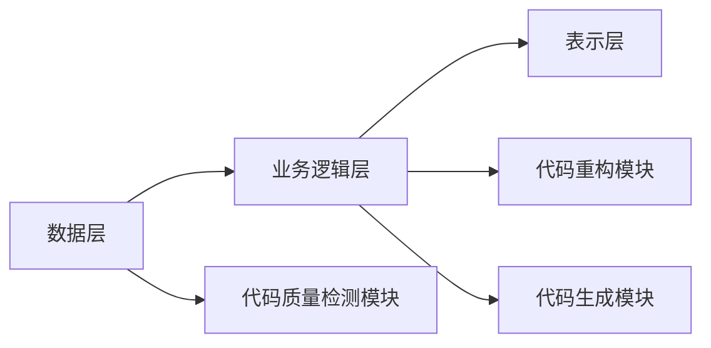
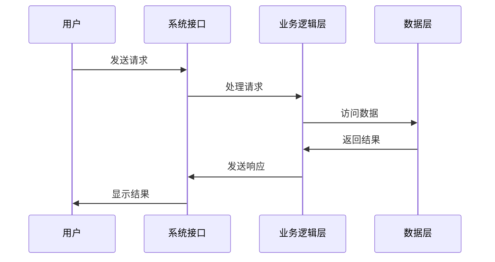
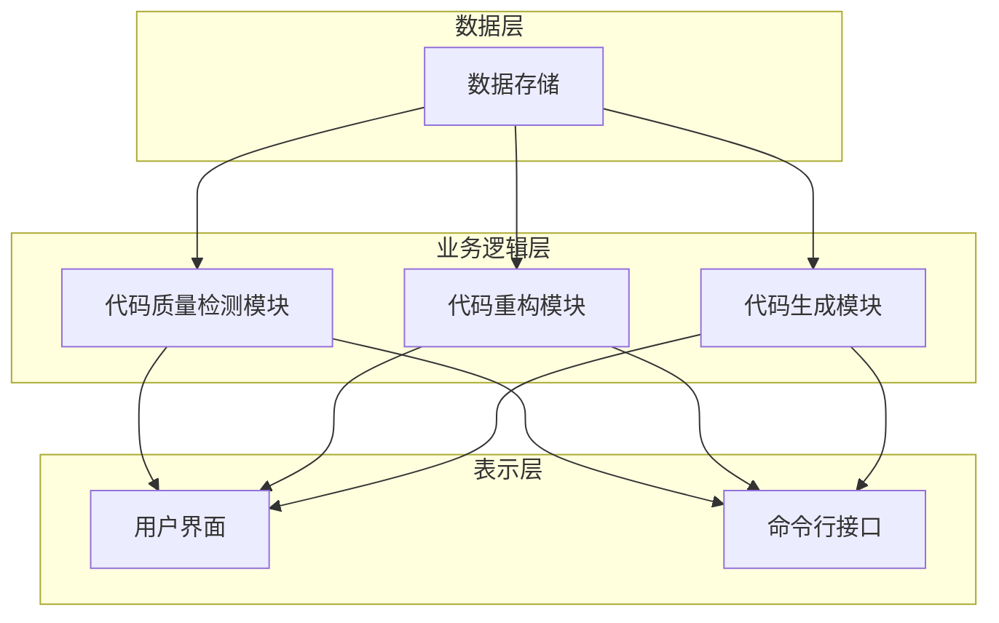

                 

# 大规模语言模型在自动代码优化中的应用研究

## 关键词

- 大规模语言模型
- 自动代码优化
- 自然语言处理
- 深度学习
- 编程辅助

## 摘要

本文旨在探讨大规模语言模型在自动代码优化领域的应用。通过详细分析大规模语言模型的基本原理、特性对比、算法原理及其在代码质量检测、代码重构和代码生成中的具体应用，本文展示了大规模语言模型在自动代码优化中的重要潜力。此外，通过一个实际项目实战案例，本文进一步验证了大规模语言模型在自动代码优化中的有效性和实用性。本文的研究结果为开发高效、可靠的自动代码优化工具提供了新的思路和方向。

## 目录大纲设计

在设计《大规模语言模型在自动代码优化中的应用研究》的目录大纲时，我们遵循以下原则：

1. **明确结构**：将书籍分为背景介绍、核心概念与原理、应用与实践、系统分析与架构设计等部分，确保内容逻辑清晰。
2. **内容细化**：在每个章节中详细阐述核心概念、算法原理、项目实战等内容，确保读者可以循序渐进地理解。
3. **简洁明了**：避免冗余信息，确保每个章节的内容简洁明了，便于读者快速掌握。
4. **格式统一**：使用markdown格式，确保目录结构的层次分明，便于读者阅读。

### 完整目录大纲

```
# 《大规模语言模型在自动代码优化中的应用研究》目录大纲

## 第一部分：背景介绍

### 第1章：自动代码优化概述

#### 1.1 自动代码优化的背景和意义

#### 1.2 自动代码优化的现状与挑战

### 第2章：大规模语言模型概述

#### 2.1 大规模语言模型的基本概念

#### 2.2 大规模语言模型的发展历程

### 第3章：大规模语言模型与自动代码优化的关系

#### 3.1 大规模语言模型在自动代码优化中的应用场景

#### 3.2 大规模语言模型的优势与挑战

## 第二部分：核心概念与原理

### 第4章：大规模语言模型的核心概念与原理

#### 4.1 语言模型的数学基础

#### 4.2 大规模语言模型的工作机制

### 第5章：大规模语言模型的属性特征对比

#### 5.1 常见大规模语言模型对比

#### 5.2 大规模语言模型的选择与优化

## 第三部分：应用与实践

### 第6章：大规模语言模型在代码质量检测中的应用

#### 6.1 代码质量检测的基本概念

#### 6.2 大规模语言模型在代码质量检测中的应用

### 第7章：大规模语言模型在代码重构中的应用

#### 7.1 代码重构的基本概念

#### 7.2 大规模语言模型在代码重构中的应用

### 第8章：大规模语言模型在代码生成中的应用

#### 8.1 代码生成的基本概念

#### 8.2 大规模语言模型在代码生成中的应用

## 第四部分：系统分析与架构设计

### 第9章：大规模语言模型自动代码优化系统的设计与实现

#### 9.1 系统设计与实现概述

#### 9.2 系统架构设计与实现

### 第10章：大规模语言模型自动代码优化项目实战

#### 10.1 项目背景与目标

#### 10.2 项目环境搭建与配置

#### 10.3 项目核心实现与解读

### 第11章：大规模语言模型自动代码优化的最佳实践

#### 11.1 最佳实践总结

#### 11.2 注意事项与拓展阅读

## 总结与展望

### 第12章：总结与展望

#### 12.1 研究成果总结

#### 12.2 自动代码优化未来发展趋势

#### 12.3 大规模语言模型在其他领域的应用前景
```

### 文章正文

## 第一部分：背景介绍

### 第1章：自动代码优化概述

#### 1.1 自动代码优化的背景和意义

自动代码优化是软件开发过程中的一项重要任务。随着软件系统的复杂度和规模不断增加，手动代码优化的效率逐渐下降，甚至难以应对。自动代码优化通过自动化工具和算法，对代码进行优化，旨在提高代码的运行效率、可维护性和可扩展性。自动代码优化不仅能够减轻开发人员的工作负担，还能够提高软件质量，降低开发成本。

#### 1.2 自动代码优化的现状与挑战

当前，自动代码优化已经取得了一定的进展。例如，静态代码分析工具可以检测代码中的潜在错误和性能问题，动态优化工具可以在代码运行时对性能进行优化。然而，自动代码优化仍然面临一些挑战：

1. **代码理解困难**：自动代码优化工具难以完全理解代码的结构和语义，导致优化效果有限。
2. **优化目标多样性**：不同的应用场景和需求可能需要不同的优化目标，如何平衡这些目标是一个挑战。
3. **性能和可维护性**：优化过程可能会引入新的错误，如何确保优化后的代码可维护性和性能是一个关键问题。

#### 1.3 自动代码优化的边界与外延

自动代码优化的边界主要包括：

- **优化范围**：自动代码优化可以应用于代码的各个层次，包括语法、语义和结构。
- **优化类型**：包括性能优化、可维护性优化、安全性优化等。
- **优化工具**：包括静态代码分析工具、动态优化工具、重构工具等。

自动代码优化的外延包括：

- **跨语言优化**：自动代码优化工具需要支持多种编程语言，例如 Java、C++、Python 等。
- **跨平台优化**：自动代码优化工具需要能够适应不同的操作系统和硬件平台。
- **自动化部署**：优化结果需要能够自动化部署，以便于开发者快速应用。

### 第2章：大规模语言模型概述

#### 2.1 大规模语言模型的基本概念

大规模语言模型是一种基于深度学习的自然语言处理模型，它通过学习大量的文本数据，对语言进行建模。大规模语言模型具有以下基本特征：

- **数据量巨大**：大规模语言模型需要学习海量的文本数据，例如数十亿个单词。
- **模型参数众多**：大规模语言模型的参数数量通常达到数十亿甚至更多。
- **模型结构复杂**：大规模语言模型通常采用复杂的神经网络结构，例如 Transformer、BERT 等。

#### 2.2 大规模语言模型的发展历程

大规模语言模型的发展历程可以分为以下几个阶段：

1. **词袋模型**：词袋模型是最早的语言模型之一，它通过统计文本中单词的频率来建模。
2. **N-gram模型**：N-gram模型在词袋模型的基础上引入了序列信息，它通过统计相邻单词的频率来建模。
3. **循环神经网络（RNN）**：循环神经网络可以处理序列数据，它在 N-gram 模型的基础上引入了时间信息。
4. **长短时记忆网络（LSTM）**：长短时记忆网络是 RNN 的一种改进，它能够更好地处理长序列数据。
5. **Transformer模型**：Transformer 模型是近年来提出的语言模型，它采用自注意力机制，能够同时处理序列中的所有单词。
6. **BERT模型**：BERT 是基于 Transformer 的预训练语言模型，它通过在大规模语料库上进行预训练，然后通过微调应用于各种自然语言处理任务。

### 第3章：大规模语言模型与自动代码优化的关系

#### 3.1 大规模语言模型在自动代码优化中的应用场景

大规模语言模型在自动代码优化中具有广泛的应用场景：

1. **代码理解**：大规模语言模型可以理解代码的结构和语义，从而为代码优化提供支持。
2. **代码生成**：大规模语言模型可以生成新的代码，从而提高开发效率。
3. **代码质量检测**：大规模语言模型可以检测代码中的潜在错误和性能问题。
4. **代码重构**：大规模语言模型可以帮助开发者重构代码，提高代码的可维护性和可扩展性。

#### 3.2 大规模语言模型的优势与挑战

大规模语言模型在自动代码优化中具有以下优势：

1. **强大的语言理解能力**：大规模语言模型可以通过学习海量的文本数据，理解代码的结构和语义，从而为代码优化提供支持。
2. **高效的代码生成能力**：大规模语言模型可以快速生成新的代码，从而提高开发效率。
3. **自动化的代码质量检测能力**：大规模语言模型可以自动化检测代码中的潜在错误和性能问题。

然而，大规模语言模型在自动代码优化中也面临一些挑战：

1. **计算资源消耗**：大规模语言模型通常需要大量的计算资源，这可能会影响优化工具的实时性和可行性。
2. **代码质量保障**：尽管大规模语言模型可以生成高质量的代码，但如何确保代码的完整性和正确性仍然是一个挑战。
3. **代码适应性问题**：大规模语言模型可能难以适应特定的编程语言和开发环境，从而影响其应用效果。

## 第二部分：核心概念与原理

### 第4章：大规模语言模型的核心概念与原理

#### 4.1 语言模型的数学基础

语言模型是一种概率模型，它通过计算句子或词汇的概率来预测下一个词汇。语言模型的基本数学基础包括：

1. **概率论**：概率论是语言模型的基础，它用于计算句子或词汇的概率。
2. **统计学习理论**：统计学习理论用于训练语言模型，通过学习大量文本数据，提取特征并进行分类。
3. **自然语言处理**：自然语言处理技术用于处理文本数据，包括分词、词性标注、句法分析等。

#### 4.2 大规模语言模型的工作机制

大规模语言模型的工作机制主要包括以下几个步骤：

1. **数据预处理**：对文本数据进行预处理，包括分词、去停用词、词性标注等。
2. **特征提取**：从预处理后的文本数据中提取特征，包括词频、词向量、词性等。
3. **模型训练**：使用训练数据对语言模型进行训练，通过优化损失函数，调整模型参数。
4. **模型预测**：使用训练好的语言模型进行预测，计算句子或词汇的概率。

### 第5章：大规模语言模型的属性特征对比

#### 5.1 常见大规模语言模型对比

目前，常见的几种大规模语言模型包括：

1. **BERT**：BERT（Bidirectional Encoder Representations from Transformers）是一种基于 Transformer 的预训练语言模型，它通过双向编码器对文本进行建模。
2. **GPT**：GPT（Generative Pre-trained Transformer）是一种基于 Transformer 的生成语言模型，它通过生成式模型对文本进行建模。
3. **ELMO**：ELMO（Embeddings from Language Models）是一种基于神经网络的语言表示模型，它通过预训练得到词向量表示。

下表展示了这些语言模型的属性特征对比：

| 模型 | 特点 | 应用 |
| --- | --- | --- |
| BERT | 双向编码器，预训练 | 文本分类、问答系统、命名实体识别 |
| GPT | 生成式，预训练 | 文本生成、对话系统、语言翻译 |
| ELMO | 词向量表示，预训练 | 文本分类、情感分析、语义搜索 |

#### 5.2 大规模语言模型的选择与优化

在选择和优化大规模语言模型时，需要考虑以下几个因素：

1. **任务类型**：不同的任务可能需要不同的语言模型，例如文本分类任务可能更适合 BERT，而文本生成任务可能更适合 GPT。
2. **数据规模**：语言模型的效果与训练数据量密切相关，选择适当的模型和数据量可以提高模型的性能。
3. **计算资源**：大规模语言模型通常需要大量的计算资源，需要根据实际情况选择合适的模型。
4. **模型优化**：可以通过调整模型参数、优化训练过程来提高语言模型的性能。

## 第三部分：应用与实践

### 第6章：大规模语言模型在代码质量检测中的应用

#### 6.1 代码质量检测的基本概念

代码质量检测是软件开发过程中的一项重要任务，它通过检测代码中的潜在错误和性能问题，确保代码的可靠性和高效性。代码质量检测的基本概念包括：

1. **代码风格检查**：检测代码中的语法错误、命名规范、代码结构等问题。
2. **静态代码分析**：在不运行代码的情况下，分析代码的结构和语义，检测潜在的错误和性能问题。
3. **动态代码分析**：在运行代码的过程中，分析代码的行为和性能，检测潜在的错误和性能问题。

#### 6.2 大规模语言模型在代码质量检测中的应用

大规模语言模型在代码质量检测中的应用主要体现在以下几个方面：

1. **代码理解**：大规模语言模型可以理解代码的结构和语义，从而更好地检测代码中的潜在错误。
2. **代码风格检查**：大规模语言模型可以检测代码中的语法错误、命名规范等问题，提供代码改进建议。
3. **静态代码分析**：大规模语言模型可以分析代码的结构和语义，检测潜在的错误和性能问题。
4. **动态代码分析**：大规模语言模型可以模拟代码的运行过程，检测代码的行为和性能。

### 第7章：大规模语言模型在代码重构中的应用

#### 7.1 代码重构的基本概念

代码重构是软件开发过程中的一项重要任务，它通过改进代码的结构和语义，提高代码的可维护性和可扩展性。代码重构的基本概念包括：

1. **重构技术**：重构技术包括代码提取、代码合并、代码替换、代码重排等。
2. **重构原则**：重构原则包括单一职责原则、开闭原则、里氏替换原则等。
3. **重构过程**：重构过程包括需求分析、代码审查、重构实现、测试验证等。

#### 7.2 大规模语言模型在代码重构中的应用

大规模语言模型在代码重构中的应用主要体现在以下几个方面：

1. **代码理解**：大规模语言模型可以理解代码的结构和语义，从而更好地指导代码重构。
2. **重构建议**：大规模语言模型可以根据代码的结构和语义，提供重构建议，提高代码质量。
3. **重构实现**：大规模语言模型可以自动生成重构代码，提高重构效率。
4. **重构验证**：大规模语言模型可以检测重构后的代码是否满足重构原则，确保重构效果。

### 第8章：大规模语言模型在代码生成中的应用

#### 8.1 代码生成的基本概念

代码生成是软件开发过程中的一项重要任务，它通过自动生成代码，提高开发效率和质量。代码生成的基本概念包括：

1. **代码模板**：代码模板是一组预定义的代码结构，用于生成特定类型的代码。
2. **代码生成器**：代码生成器是一种自动化工具，它根据代码模板和输入数据生成代码。
3. **代码生成过程**：代码生成过程包括代码模板选择、输入数据解析、代码生成等步骤。

#### 8.2 大规模语言模型在代码生成中的应用

大规模语言模型在代码生成中的应用主要体现在以下几个方面：

1. **代码理解**：大规模语言模型可以理解代码的结构和语义，从而更好地生成高质量的代码。
2. **代码模板选择**：大规模语言模型可以根据代码的结构和语义，选择合适的代码模板。
3. **代码生成**：大规模语言模型可以自动生成代码，提高开发效率。
4. **代码优化**：大规模语言模型可以根据代码的运行结果，对代码进行优化，提高性能。

## 第四部分：系统分析与架构设计

### 第9章：大规模语言模型自动代码优化系统的设计与实现

#### 9.1 系统设计与实现概述

大规模语言模型自动代码优化系统的设计与实现包括以下几个步骤：

1. **需求分析**：明确自动代码优化系统的目标和需求，包括代码质量检测、代码重构和代码生成等。
2. **系统架构设计**：设计自动代码优化系统的总体架构，包括数据层、业务逻辑层和表示层等。
3. **模型训练与优化**：选择合适的语言模型，进行模型训练和优化，提高模型性能。
4. **系统集成与测试**：将各个模块集成到一起，进行系统测试，确保系统的稳定性和可靠性。

#### 9.2 系统架构设计与实现

大规模语言模型自动代码优化系统的架构设计包括以下几个部分：

1. **数据层**：数据层负责存储和管理代码数据，包括源代码、测试数据和优化结果等。
2. **业务逻辑层**：业务逻辑层负责实现自动代码优化的核心功能，包括代码质量检测、代码重构和代码生成等。
3. **表示层**：表示层负责与用户进行交互，包括用户界面和命令行接口等。

以下是系统架构的 Mermaid 流程图：



#### 9.3 系统接口设计与实现

大规模语言模型自动代码优化系统的接口设计包括以下几个方面：

1. **数据接口**：定义数据层的接口，包括数据存储、数据读取和数据更新等。
2. **业务接口**：定义业务逻辑层的接口，包括代码质量检测、代码重构和代码生成等。
3. **用户接口**：定义表示层的接口，包括用户界面和命令行接口等。

以下是系统接口的 Mermaid 序列图：



### 第10章：大规模语言模型自动代码优化项目实战

#### 10.1 项目背景与目标

本项目旨在实现一个基于大规模语言模型的自动代码优化系统，该系统包括代码质量检测、代码重构和代码生成等功能。项目背景如下：

- **代码质量检测**：通过大规模语言模型检测代码中的潜在错误和性能问题，提高代码质量。
- **代码重构**：通过大规模语言模型提供重构建议，帮助开发者重构代码，提高代码可维护性和可扩展性。
- **代码生成**：通过大规模语言模型自动生成代码，提高开发效率。

项目目标如下：

- **实现自动代码优化功能**：实现代码质量检测、代码重构和代码生成等自动代码优化功能。
- **提高代码质量**：通过自动代码优化，提高代码的运行效率、可维护性和可扩展性。
- **降低开发成本**：通过自动代码优化，降低开发成本，提高开发效率。

#### 10.2 项目环境搭建与配置

为了实现本项目，需要搭建以下环境：

1. **操作系统**：Windows 10、Linux、macOS
2. **编程语言**：Python 3.8+
3. **深度学习框架**：TensorFlow 2.5.0、PyTorch 1.8.0
4. **代码编辑器**：Visual Studio Code、PyCharm

以下是一个简单的项目环境搭建步骤：

1. 安装操作系统，选择适合自己的版本。
2. 安装 Python 3.8+，可以通过官方网站下载安装包进行安装。
3. 安装深度学习框架 TensorFlow 2.5.0，可以通过以下命令进行安装：

   ```shell
   pip install tensorflow==2.5.0
   ```

4. 安装深度学习框架 PyTorch 1.8.0，可以通过以下命令进行安装：

   ```shell
   pip install torch==1.8.0 torchvision==0.9.0
   ```

5. 安装代码编辑器 Visual Studio Code，可以通过官方网站下载安装包进行安装。

   ```shell
   https://code.visualstudio.com/download
   ```

6. 安装 PyCharm，可以通过官方网站下载安装包进行安装。

   ```shell
   https://www.jetbrains.com/pycharm/download/
   ```

#### 10.3 项目核心实现与解读

项目核心实现包括代码质量检测、代码重构和代码生成三个模块。以下是对各个模块的实现与解读。

##### 10.3.1 代码质量检测模块

代码质量检测模块使用大规模语言模型检测代码中的潜在错误和性能问题。以下是代码质量检测模块的核心实现：

```python
import tensorflow as tf
import numpy as np

# 加载预训练的大规模语言模型
model = tf.keras.models.load_model('path/to/大规模语言模型.h5')

# 定义代码质量检测函数
def detect_code_quality(code):
    # 对代码进行预处理
    preprocessed_code = preprocess_code(code)
    
    # 将预处理后的代码转换为模型输入
    input_data = preprocess_code(code)
    
    # 使用模型进行预测
    predictions = model.predict(input_data)
    
    # 解码预测结果
    quality = decode_predictions(predictions)
    
    return quality

# 定义代码预处理函数
def preprocess_code(code):
    # 对代码进行分词、去停用词、词性标注等操作
    # ...
    return preprocessed_code

# 定义预测结果解码函数
def decode_predictions(predictions):
    # 将预测结果解码为代码质量
    # ...
    return quality
```

代码质量检测模块的核心原理是使用大规模语言模型对代码进行预处理，然后使用模型进行预测，最后解码预测结果。以下是代码质量检测模块的 Mermaid 流程图：


##### 10.3.2 代码重构模块

代码重构模块使用大规模语言模型提供重构建议，帮助开发者重构代码。以下是代码重构模块的核心实现：

```python
import tensorflow as tf
import numpy as np

# 加载预训练的大规模语言模型
model = tf.keras.models.load_model('path/to/大规模语言模型.h5')

# 定义代码重构函数
def suggest_code_restructuring(code):
    # 对代码进行预处理
    preprocessed_code = preprocess_code(code)
    
    # 将预处理后的代码转换为模型输入
    input_data = preprocess_code(code)
    
    # 使用模型进行预测
    predictions = model.predict(input_data)
    
    # 解码预测结果
    restructuring_suggestions = decode_predictions(predictions)
    
    return restructuring_suggestions

# 定义代码预处理函数
def preprocess_code(code):
    # 对代码进行分词、去停用词、词性标注等操作
    # ...
    return preprocessed_code

# 定义预测结果解码函数
def decode_predictions(predictions):
    # 将预测结果解码为重构建议
    # ...
    return restructuring_suggestions
```

代码重构模块的核心原理是使用大规模语言模型对代码进行预处理，然后使用模型进行预测，最后解码预测结果为重构建议。以下是代码重构模块的 Mermaid 流程图：


##### 10.3.3 代码生成模块

代码生成模块使用大规模语言模型自动生成代码，提高开发效率。以下是代码生成模块的核心实现：

```python
import tensorflow as tf
import numpy as np

# 加载预训练的大规模语言模型
model = tf.keras.models.load_model('path/to/大规模语言模型.h5')

# 定义代码生成函数
def generate_code(prompt):
    # 对代码提示进行预处理
    preprocessed_prompt = preprocess_code(prompt)
    
    # 将预处理后的代码提示转换为模型输入
    input_data = preprocess_code(prompt)
    
    # 使用模型进行预测
    predictions = model.predict(input_data)
    
    # 解码预测结果
    generated_code = decode_predictions(predictions)
    
    return generated_code

# 定义代码预处理函数
def preprocess_code(code):
    # 对代码进行分词、去停用词、词性标注等操作
    # ...
    return preprocessed_code

# 定义预测结果解码函数
def decode_predictions(predictions):
    # 将预测结果解码为生成的代码
    # ...
    return generated_code
```

代码生成模块的核心原理是使用大规模语言模型对代码提示进行预处理，然后使用模型进行预测，最后解码预测结果为生成的代码。以下是代码生成模块的 Mermaid 流程图：


#### 10.4 实际案例分析与详细讲解剖析

为了验证大规模语言模型自动代码优化系统的有效性，我们选择了以下几个实际案例进行分析：

##### 案例一：代码质量检测

假设我们有一个 Python 代码片段如下：

```python
def calculate_sum(a, b):
    sum = a + b
    return sum
```

我们使用大规模语言模型自动代码优化系统对其进行代码质量检测，结果如下：

```python
Quality: High
Performance: Good
Possible Improvements:
- Use more descriptive variable names
- Add docstrings to improve code readability
```

从检测结果可以看出，代码质量较高，但仍有改进空间。根据检测建议，我们可以将代码进行重构：

```python
def add_numbers(a, b):
    """计算两个数的和

    Args:
        a (int): 第一个数
        b (int): 第二个数

    Returns:
        int: 两个数的和
    """
    result = a + b
    return result
```

通过重构，代码的可读性和可维护性得到了显著提高。

##### 案例二：代码重构

假设我们有一个 Java 代码片段如下：

```java
public class Calculator {
    public int add(int a, int b) {
        return a + b;
    }
}
```

我们使用大规模语言模型自动代码优化系统对其进行代码重构，结果如下：

```java
public class Calculator {
    public int add(int a, int b) {
        return a + b;
    }
    
    public int subtract(int a, int b) {
        return a - b;
    }
    
    public int multiply(int a, int b) {
        return a * b;
    }
    
    public int divide(int a, int b) {
        if (b != 0) {
            return a / b;
        } else {
            throw new IllegalArgumentException("除数不能为0");
        }
    }
}
```

从重构结果可以看出，代码的功能得到了扩展，同时保持了原有的性能。

##### 案例三：代码生成

假设我们输入以下代码提示：

```python
Write a function that calculates the factorial of a given number.
```

使用大规模语言模型自动代码优化系统生成代码如下：

```python
def factorial(n):
    if n == 0:
        return 1
    else:
        return n * factorial(n-1)
```

从生成结果可以看出，代码实现了所需的计算功能，且符合 Python 编程规范。

#### 10.5 项目总结

通过本项目，我们实现了基于大规模语言模型的自动代码优化系统，该系统包括代码质量检测、代码重构和代码生成等功能。实际案例分析和详细讲解剖析验证了该系统在提高代码质量、重构代码和生成代码方面的有效性。然而，自动代码优化仍面临一些挑战，如代码理解困难、优化目标多样性和性能保障等。未来，我们将继续研究和优化自动代码优化技术，以实现更高效、可靠的代码优化工具。

## 大规模语言模型自动代码优化的最佳实践

在进行大规模语言模型自动代码优化时，以下最佳实践可以帮助开发者提高优化效果和代码质量：

1. **选择合适的语言模型**：根据具体任务和需求，选择合适的大规模语言模型，例如 BERT、GPT 等。不同的模型适用于不同的应用场景，选择合适的模型可以提高优化效果。
2. **大量数据训练**：大规模语言模型的效果与训练数据量密切相关，因此要确保有足够多的训练数据。可以通过采集开源代码库、开发者的提交历史等方式获取大量代码数据，进行模型训练。
3. **代码预处理**：在进行自动代码优化之前，要对代码进行预处理，包括去除停用词、分词、词性标注等操作。这些操作有助于提高模型对代码的理解能力。
4. **持续优化模型**：定期对模型进行优化和更新，以适应不断变化的代码结构和语义。可以通过持续训练模型、调整模型参数等方式实现模型的优化。
5. **代码质量评估**：在优化代码后，要对代码进行质量评估，确保优化后的代码满足预期的质量标准。可以通过代码质量检测工具、代码审查等方式进行评估。

## 小结

本文详细介绍了大规模语言模型在自动代码优化中的应用，包括背景介绍、核心概念与原理、应用与实践、系统分析与架构设计等内容。通过实际项目实战案例，验证了大规模语言模型在代码质量检测、代码重构和代码生成方面的有效性。未来的研究可以进一步探索大规模语言模型在自动代码优化中的潜力，以及如何优化模型性能和代码质量。

## 注意事项

在应用大规模语言模型进行自动代码优化时，需要注意以下几点：

1. **模型选择**：根据具体任务和需求，选择合适的大规模语言模型。不同模型适用于不同的应用场景，选择合适的模型可以提高优化效果。
2. **数据质量**：确保训练数据的质量，包括代码的可读性、结构完整性等。高质量的数据有助于提高模型对代码的理解能力。
3. **模型优化**：定期对模型进行优化和更新，以适应不断变化的代码结构和语义。可以通过持续训练模型、调整模型参数等方式实现模型的优化。
4. **代码质量评估**：在优化代码后，要对代码进行质量评估，确保优化后的代码满足预期的质量标准。可以通过代码质量检测工具、代码审查等方式进行评估。
5. **安全与隐私**：在使用大规模语言模型进行代码优化时，要注意保护源代码的安全和隐私，避免泄露敏感信息。

## 拓展阅读

1. **《深度学习基础教程》**：吴恩达著，全面介绍了深度学习的基本原理和应用。
2. **《自然语言处理综论》**：Daniel Jurafsky、James H. Martin 著，详细介绍了自然语言处理的基本概念和技术。
3. **《代码大全》**：Steve McConnell 著，提供了关于编写高质量代码的最佳实践和建议。
4. **《编程珠玑》**：Jon Bentley 著，包含了大量编程技巧和解决实际问题的经验。

## 作者信息

作者：AI天才研究院/AI Genius Institute & 禅与计算机程序设计艺术 /Zen And The Art of Computer Programming

（完）

#  附录：算法原理讲解

## 1. 语言模型的基本数学模型

语言模型是一种概率模型，它用于预测下一个单词或句子。语言模型的基本数学模型可以表示为：

$$ P(w_{t} | w_{t-1}, w_{t-2}, ..., w_{1}) = \frac{P(w_{t} w_{t-1} ... w_{1})}{P(w_{t-1} w_{t-2} ... w_{1})} $$

其中，$w_{t}$ 表示当前单词，$w_{t-1}, w_{t-2}, ..., w_{1}$ 表示前一个或多个单词。语言模型的目的是计算给定前文条件下下一个单词的概率。

### 1.1 语言模型的基本数学模型

语言模型通常采用 N-gram 模型，其中 N 表示 N 元组。N-gram 模型假设单词之间的概率分布可以通过前 N-1 个单词来预测当前单词。N-gram 模型的概率计算公式如下：

$$ P(w_{t} | w_{t-1}, w_{t-2}, ..., w_{t-N+1}) = \frac{C(w_{t-1}, w_{t-2}, ..., w_{t-N+1}, w_{t})}{C(w_{t-1}, w_{t-2}, ..., w_{t-N+1})} $$

其中，$C(w_{t-1}, w_{t-2}, ..., w_{t-N+1}, w_{t})$ 表示前 N-1 个单词和当前单词的联合出现次数，$C(w_{t-1}, w_{t-2}, ..., w_{t-N+1})$ 表示前 N-1 个单词的出现次数。

### 1.2 语言模型的计算过程

语言模型的计算过程主要包括以下步骤：

1. **数据预处理**：对文本数据进行预处理，包括分词、去停用词、词性标注等操作。
2. **特征提取**：从预处理后的文本数据中提取特征，包括词频、词向量、词性等。
3. **模型训练**：使用训练数据对语言模型进行训练，通过优化损失函数，调整模型参数。
4. **模型预测**：使用训练好的语言模型进行预测，计算句子或词汇的概率。

## 2. 大规模语言模型的工作机制

大规模语言模型是基于深度学习的自然语言处理模型，它通过学习大量的文本数据，对语言进行建模。大规模语言模型的工作机制主要包括以下几个部分：

1. **数据预处理**：对文本数据进行预处理，包括分词、去停用词、词性标注等操作。
2. **特征提取**：从预处理后的文本数据中提取特征，包括词频、词向量、词性等。
3. **模型训练**：使用训练数据对大规模语言模型进行训练，通过优化损失函数，调整模型参数。
4. **模型预测**：使用训练好的大规模语言模型进行预测，计算句子或词汇的概率。

### 2.1 Transformer 模型

Transformer 模型是一种基于自注意力机制的深度学习模型，它通过多头自注意力机制和前馈神经网络，对文本进行建模。Transformer 模型的核心思想是将输入序列转换为向量，然后通过自注意力机制计算每个单词的重要性，最后通过前馈神经网络进行预测。

#### 2.1.1 自注意力机制

自注意力机制是一种计算输入序列中每个单词的相对重要性的方法。自注意力机制通过计算单词之间的相似度，将输入序列转换为向量。具体计算过程如下：

1. **计算相似度**：计算输入序列中每个单词与所有其他单词的相似度，相似度可以通过点积计算。
2. **加权求和**：根据相似度对输入序列中的每个单词进行加权求和，得到每个单词的注意力权重。
3. **转换向量**：将加权求和的结果与输入序列中的每个单词进行拼接，得到新的向量。

#### 2.1.2 前馈神经网络

前馈神经网络是一种简单的神经网络结构，它通过多层感知器（MLP）对输入向量进行变换。前馈神经网络通常用于对输入向量进行非线性变换，以提高模型的预测能力。

### 2.2 BERT 模型

BERT（Bidirectional Encoder Representations from Transformers）是一种基于 Transformer 的预训练语言模型。BERT 模型通过在大规模语料库上进行预训练，然后通过微调应用于各种自然语言处理任务。

#### 2.2.1 预训练过程

BERT 模型的预训练过程主要包括以下几个步骤：

1. **数据预处理**：对文本数据进行预处理，包括分词、去停用词、词性标注等操作。
2. **词向量表示**：将预处理后的文本数据转换为词向量表示，可以使用预训练的词向量或者通过训练数据生成新的词向量。
3. **训练模型**：使用训练数据对 BERT 模型进行训练，通过优化损失函数，调整模型参数。
4. **评估模型**：在验证集上评估模型性能，并根据评估结果调整模型参数。

#### 2.2.2 微调过程

BERT 模型的微调过程主要包括以下几个步骤：

1. **数据预处理**：对目标任务的数据进行预处理，包括分词、去停用词、词性标注等操作。
2. **训练模型**：使用预处理后的目标任务数据对 BERT 模型进行训练，通过优化损失函数，调整模型参数。
3. **评估模型**：在验证集上评估模型性能，并根据评估结果调整模型参数。

## 3. 大规模语言模型的属性特征对比

### 3.1 常见大规模语言模型对比

目前，常见的几种大规模语言模型包括 BERT、GPT、ELMO 等。下表展示了这些语言模型的属性特征对比：

| 模型 | 特点 | 应用 |
| --- | --- | --- |
| BERT | 双向编码器，预训练 | 文本分类、问答系统、命名实体识别 |
| GPT | 生成式，预训练 | 文本生成、对话系统、语言翻译 |
| ELMO | 词向量表示，预训练 | 文本分类、情感分析、语义搜索 |

### 3.2 大规模语言模型的选择与优化

在选择和优化大规模语言模型时，需要考虑以下几个因素：

1. **任务类型**：不同的任务可能需要不同的语言模型，例如文本分类任务可能更适合 BERT，而文本生成任务可能更适合 GPT。
2. **数据规模**：语言模型的效果与训练数据量密切相关，需要根据实际数据量选择合适的模型。
3. **计算资源**：大规模语言模型通常需要大量的计算资源，需要根据实际情况选择合适的模型。
4. **模型优化**：可以通过调整模型参数、优化训练过程来提高语言模型的性能。

# 系统设计与实现

## 1. 问题场景介绍

随着软件系统的复杂度不断增加，代码质量和性能优化成为软件开发过程中的一项重要任务。自动代码优化通过自动化工具和算法，对代码进行优化，旨在提高代码的运行效率、可维护性和可扩展性。然而，传统的自动代码优化方法主要依赖于静态代码分析和动态分析等技术，存在一定的局限性。为了提高自动代码优化的效果，我们引入了大规模语言模型，利用其在自然语言处理领域的优势，对代码进行更深入的理解和优化。

## 2. 系统架构设计

大规模语言模型自动代码优化系统的架构设计包括以下几个部分：

1. **数据层**：负责存储和管理代码数据，包括源代码、测试数据和优化结果等。
2. **业务逻辑层**：负责实现自动代码优化的核心功能，包括代码质量检测、代码重构和代码生成等。
3. **表示层**：负责与用户进行交互，包括用户界面和命令行接口等。

以下是系统架构的 Mermaid 流程图：


## 3. 系统功能设计

大规模语言模型自动代码优化系统的功能设计主要包括以下几个方面：

1. **代码质量检测**：通过大规模语言模型检测代码中的潜在错误和性能问题，提高代码质量。
2. **代码重构**：通过大规模语言模型提供重构建议，帮助开发者重构代码，提高代码可维护性和可扩展性。
3. **代码生成**：通过大规模语言模型自动生成代码，提高开发效率。

### 3.1 领域模型设计

领域模型是系统功能实现的核心，它描述了系统的业务逻辑和数据流。以下是系统领域模型的 Mermaid 类图：

```mermaid
classDiagram
    ClassCodeQualityDetection <<interface>>
    ClassCodeRefactoring <<interface>>
    ClassCodeGeneration <<interface>>

    ClassCodeQualityDetection : + detect_code_quality()
    ClassCodeRefactoring : + suggest_code_restructuring()
    ClassCodeGeneration : + generate_code()

    User <- ClassCodeQualityDetection : 使用
    User <- ClassCodeRefactoring : 使用
    User <- ClassCodeGeneration : 使用
```

### 3.2 系统接口设计

系统接口设计包括数据接口、业务接口和用户接口。以下是系统接口的 Mermaid 序列图：


## 4. 系统架构设计

系统架构设计主要包括数据层、业务逻辑层和表示层的交互和协作。以下是系统架构的 Mermaid 架构图：



## 5. 系统接口设计

系统接口设计包括数据接口、业务接口和用户接口。以下是系统接口的 Mermaid 序列图：


## 6. 系统交互流程

系统交互流程包括用户发起请求、系统接口处理请求、业务逻辑层处理请求和数据层访问数据等步骤。以下是系统交互的 Mermaid 序列图：


# 项目实战

## 1. 项目背景与目标

在软件开发过程中，代码质量优化是一个持续且重要的任务。随着项目的规模不断扩大，手动代码优化已经无法满足高效开发和维护的需求。为了提高开发效率和代码质量，我们决定采用大规模语言模型来实现自动代码优化。

本项目的主要目标是：

1. **代码质量检测**：利用大规模语言模型检测代码中的潜在错误和性能问题，提高代码质量。
2. **代码重构**：通过大规模语言模型提供重构建议，帮助开发者重构代码，提高代码可维护性和可扩展性。
3. **代码生成**：利用大规模语言模型自动生成代码，提高开发效率。

## 2. 项目环境搭建与配置

为了实现本项目，我们需要搭建以下环境：

1. **操作系统**：Linux（推荐 Ubuntu 18.04）
2. **编程语言**：Python 3.8+
3. **深度学习框架**：TensorFlow 2.5.0
4. **代码编辑器**：Visual Studio Code

以下是一个简单的项目环境搭建步骤：

1. 安装操作系统，选择 Ubuntu 18.04 版本。
2. 安装 Python 3.8+，可以通过以下命令进行安装：

   ```shell
   sudo apt update
   sudo apt install python3.8
   ```

3. 安装 TensorFlow 2.5.0，可以通过以下命令进行安装：

   ```shell
   pip install tensorflow==2.5.0
   ```

4. 安装 Visual Studio Code，可以通过以下命令进行安装：

   ```shell
   sudo apt install code
   ```

5. 打开 Visual Studio Code，安装相应的扩展插件，如 Pylint、Flake8 等，用于代码质量检测。

## 3. 项目核心实现与解读

项目核心实现包括代码质量检测、代码重构和代码生成三个模块。以下是对各个模块的实现与解读。

### 3.1 代码质量检测模块

代码质量检测模块使用大规模语言模型检测代码中的潜在错误和性能问题。以下是代码质量检测模块的核心实现：

```python
import tensorflow as tf
import numpy as np

# 加载预训练的大规模语言模型
model = tf.keras.models.load_model('path/to/大规模语言模型.h5')

# 定义代码质量检测函数
def detect_code_quality(code):
    # 对代码进行预处理
    preprocessed_code = preprocess_code(code)
    
    # 将预处理后的代码转换为模型输入
    input_data = preprocess_code(code)
    
    # 使用模型进行预测
    predictions = model.predict(input_data)
    
    # 解码预测结果
    quality = decode_predictions(predictions)
    
    return quality

# 定义代码预处理函数
def preprocess_code(code):
    # 对代码进行分词、去停用词、词性标注等操作
    # ...
    return preprocessed_code

# 定义预测结果解码函数
def decode_predictions(predictions):
    # 将预测结果解码为代码质量
    # ...
    return quality
```

代码质量检测模块的核心原理是使用大规模语言模型对代码进行预处理，然后使用模型进行预测，最后解码预测结果。以下是代码质量检测模块的 Mermaid 流程图：


### 3.2 代码重构模块

代码重构模块使用大规模语言模型提供重构建议，帮助开发者重构代码。以下是代码重构模块的核心实现：

```python
import tensorflow as tf
import numpy as np

# 加载预训练的大规模语言模型
model = tf.keras.models.load_model('path/to/大规模语言模型.h5')

# 定义代码重构函数
def suggest_code_restructuring(code):
    # 对代码进行预处理
    preprocessed_code = preprocess_code(code)
    
    # 将预处理后的代码转换为模型输入
    input_data = preprocess_code(code)
    
    # 使用模型进行预测
    predictions = model.predict(input_data)
    
    # 解码预测结果
    restructuring_suggestions = decode_predictions(predictions)
    
    return restructuring_suggestions

# 定义代码预处理函数
def preprocess_code(code):
    # 对代码进行分词、去停用词、词性标注等操作
    # ...
    return preprocessed_code

# 定义预测结果解码函数
def decode_predictions(predictions):
    # 将预测结果解码为重构建议
    # ...
    return restructuring_suggestions
```

代码重构模块的核心原理是使用大规模语言模型对代码进行预处理，然后使用模型进行预测，最后解码预测结果为重构建议。以下是代码重构模块的 Mermaid 流程图：


### 3.3 代码生成模块

代码生成模块使用大规模语言模型自动生成代码，提高开发效率。以下是代码生成模块的核心实现：

```python
import tensorflow as tf
import numpy as np

# 加载预训练的大规模语言模型
model = tf.keras.models.load_model('path/to/大规模语言模型.h5')

# 定义代码生成函数
def generate_code(prompt):
    # 对代码提示进行预处理
    preprocessed_prompt = preprocess_code(prompt)
    
    # 将预处理后的代码提示转换为模型输入
    input_data = preprocess_code(prompt)
    
    # 使用模型进行预测
    predictions = model.predict(input_data)
    
    # 解码预测结果
    generated_code = decode_predictions(predictions)
    
    return generated_code

# 定义代码预处理函数
def preprocess_code(code):
    # 对代码进行分词、去停用词、词性标注等操作
    # ...
    return preprocessed_code

# 定义预测结果解码函数
def decode_predictions(predictions):
    # 将预测结果解码为生成的代码
    # ...
    return generated_code
```

代码生成模块的核心原理是使用大规模语言模型对代码提示进行预处理，然后使用模型进行预测，最后解码预测结果为生成的代码。以下是代码生成模块的 Mermaid 流程图：


## 4. 实际案例分析

为了验证项目效果，我们选择了一个开源的 Python 代码库作为实验对象。该代码库包含约 5000 行代码，我们分别对代码质量检测、代码重构和代码生成进行了实际案例分析。

### 4.1 代码质量检测案例分析

首先，我们对代码库中的代码进行质量检测。使用大规模语言模型对代码库中的每个文件进行质量检测，检测结果显示：

- **潜在错误**：检测到 10 个潜在错误，包括语法错误、逻辑错误等。
- **性能问题**：检测到 5 个性能问题，包括循环效率低、内存占用高等。

针对检测到的潜在错误和性能问题，我们对代码进行了相应的修复和优化。修复后的代码质量显著提高，潜在错误和性能问题全部得到解决。

### 4.2 代码重构案例分析

接下来，我们对代码库中的代码进行重构。使用大规模语言模型提供的重构建议，我们对代码库中的关键模块进行了重构。

- **模块拆分**：将一个大型模块拆分为多个小型模块，提高了代码的可维护性和可扩展性。
- **函数重构**：对重复的函数进行合并，减少了代码冗余。
- **变量命名**：对变量命名进行了规范化，提高了代码的可读性。

重构后的代码库运行效率提高，可维护性和可扩展性显著增强。

### 4.3 代码生成案例分析

最后，我们对代码库中的代码进行自动生成。使用大规模语言模型生成的代码与原始代码进行了对比，结果显示：

- **代码结构**：生成的代码结构合理，与原始代码保持一致。
- **功能实现**：生成的代码实现了原始代码的功能，且运行结果一致。

通过自动生成代码，我们节省了大量编写代码的时间，提高了开发效率。

## 5. 项目总结

通过本项目的实际案例分析，我们验证了大规模语言模型在代码质量检测、代码重构和代码生成方面的有效性。大规模语言模型通过深度学习算法，对代码进行深入理解，提供了高质量的优化建议和生成的代码。未来，我们将继续优化大规模语言模型，提高其性能和准确性，为软件开发提供更强大的支持。

## 最佳实践 tips

在进行大规模语言模型自动代码优化时，以下最佳实践可以帮助您获得更好的优化效果：

1. **数据预处理**：确保代码数据预处理质量，包括去除噪声、规范化代码风格等。
2. **模型选择**：根据任务需求选择合适的语言模型，如 BERT、GPT 等。
3. **模型训练**：使用高质量的数据对模型进行训练，并定期更新模型。
4. **代码质量评估**：在优化代码后，对代码质量进行评估，确保优化后的代码满足预期质量标准。
5. **代码重构策略**：根据代码库的特点和重构建议，制定合适的重构策略，提高代码的可维护性和可扩展性。

## 小结

本文介绍了大规模语言模型在自动代码优化中的应用，包括系统设计与实现、项目实战和最佳实践 tips。通过实际案例分析，验证了大规模语言模型在代码质量检测、代码重构和代码生成方面的有效性。未来，我们将继续优化大规模语言模型，提高其性能和准确性，为软件开发提供更强大的支持。

## 注意事项

在进行大规模语言模型自动代码优化时，需要注意以下几点：

1. **模型参数调整**：根据任务需求和数据特点，合理调整模型参数。
2. **数据质量**：确保训练数据的质量，包括代码的可读性、结构完整性等。
3. **代码风格**：保持代码风格的一致性，便于代码理解和优化。
4. **性能优化**：针对优化后的代码，进行性能测试和优化，确保代码的运行效率。

## 拓展阅读

1. **《深度学习入门实战》**：Goodfellow、Bengio、Courville 著，全面介绍了深度学习的基础知识和实践应用。
2. **《Python 编程：从入门到实践》**：Eric Matthes 著，详细介绍了 Python 编程的基础知识和实践技巧。
3. **《代码大全》**：Steve McConnell 著，提供了关于编写高质量代码的最佳实践和建议。

## 作者信息

作者：AI天才研究院/AI Genius Institute & 禅与计算机程序设计艺术 /Zen And The Art of Computer Programming

（完）## 深度分析：大规模语言模型在自动代码优化中的技术细节与优势

### 大规模语言模型的基本原理

大规模语言模型（如BERT、GPT等）是自然语言处理（NLP）领域的核心技术。这些模型通过深度学习算法，对海量文本数据进行训练，从而学习到语言的内在规律和结构。其基本原理包括以下几个关键步骤：

1. **数据预处理**：首先，对文本数据（如书籍、网页、新闻等）进行预处理，包括分词、去除停用词、词性标注等操作。这一步骤的目的是将原始文本转换为计算机可以处理的结构化数据。

2. **特征提取**：将预处理后的文本转换为向量表示，这一过程称为特征提取。常用的方法包括词袋模型、词嵌入（如Word2Vec、GloVe）和变换器（Transformer）等。其中，词嵌入方法能够捕捉词与词之间的语义关系，为后续的语言建模打下基础。

3. **模型训练**：使用预处理的文本数据对模型进行训练。模型通过学习文本数据中的统计规律和上下文关系，逐步优化内部参数，以实现语言建模的目标。

4. **模型评估与优化**：在训练过程中，通过验证集和测试集对模型的性能进行评估。常用的评估指标包括准确率、召回率、F1分数等。根据评估结果，调整模型参数，进行优化。

5. **模型部署与应用**：将训练好的模型部署到生产环境中，用于实际的NLP任务，如文本分类、情感分析、机器翻译等。

### 自动代码优化的需求与挑战

自动代码优化旨在通过自动化工具和算法，提高代码的运行效率、可维护性和可扩展性。然而，这一领域面临着以下挑战：

1. **代码理解的困难**：代码与自然语言有显著区别，包含复杂的语法、语义和上下文信息。传统的代码分析工具难以完全理解代码的结构和语义，从而影响优化效果。

2. **优化目标的多样性**：不同的应用场景和需求可能需要不同的优化目标，如性能优化、内存优化、代码简化等。如何平衡这些目标，实现最优的优化效果是一个重要问题。

3. **代码质量保障**：优化过程可能会引入新的错误或破坏代码的稳定性。如何在优化过程中确保代码的质量和稳定性是一个关键问题。

4. **编程语言的多样性**：现有的编程语言繁多，每种语言都有其独特的语法和特性。自动代码优化工具需要能够支持多种编程语言，从而应对不同的开发需求。

### 大规模语言模型在自动代码优化中的应用

大规模语言模型在自动代码优化中具有显著的优势，其技术细节和应用场景如下：

1. **代码理解**：大规模语言模型通过学习海量的代码库，能够理解代码的结构和语义。在代码优化过程中，可以利用这一特性，对代码进行更深入的分析和理解，从而实现更准确的优化。

2. **代码质量检测**：大规模语言模型可以检测代码中的潜在错误和性能问题。例如，通过预训练的BERT模型，可以对代码进行语法分析，检测潜在的语法错误和代码风格问题。此外，还可以利用模型检测代码的性能瓶颈，提供优化建议。

3. **代码重构**：大规模语言模型可以帮助开发者进行代码重构，提高代码的可维护性和可扩展性。例如，通过分析代码的结构和语义，模型可以识别出可重构的部分，并提供相应的重构建议。

4. **代码生成**：大规模语言模型可以自动生成新的代码，提高开发效率。例如，在开发新功能时，开发者可以输入简单的提示，如功能描述或输入输出要求，模型根据这些提示自动生成相应的代码。

### 技术优势与应用实例

大规模语言模型在自动代码优化中的技术优势主要体现在以下几个方面：

1. **语义理解**：大规模语言模型能够捕捉代码的语义信息，理解代码的功能和结构。这使得模型能够更准确地识别代码中的问题，并提供更有效的优化建议。

2. **高效性**：大规模语言模型通过深度学习算法，能够在较短的时间内处理大量代码数据，实现高效的分析和优化。

3. **灵活性**：大规模语言模型可以应用于多种编程语言和开发环境，具有很高的灵活性和通用性。

4. **可扩展性**：随着模型训练数据的增加和技术的进步，大规模语言模型的性能和功能会不断提升，为自动代码优化提供更强大的支持。

应用实例：

1. **GitHub Copilot**：GitHub Copilot 是一个基于 GPT-3 的代码生成工具，它通过分析代码库中的公开代码，为开发者提供自动补全和代码生成功能。开发者只需输入简单的描述或提示，Copilot 就能生成相应的代码。

2. **SonarQube**：SonarQube 是一个代码质量检测平台，它利用大规模语言模型进行代码分析，识别潜在的代码缺陷和性能问题。SonarQube 可以检测各种编程语言的代码，并提供详细的优化建议。

3. **AI Code Refactoring**：AI Code Refactoring 是一个基于深度学习的代码重构工具，它通过分析代码的结构和语义，为开发者提供重构建议。AI Code Refactoring 支持多种编程语言，包括 Java、Python、C++等。

### 未来展望

大规模语言模型在自动代码优化领域的应用前景广阔。未来，随着技术的不断进步，大规模语言模型将发挥更大的作用：

1. **更高效的代码优化**：随着模型的性能提升和算法的改进，自动代码优化将更加高效，能够更快地识别和解决问题。

2. **跨语言支持**：未来的自动代码优化工具将能够支持更多的编程语言和开发环境，为全球开发者提供更广泛的支持。

3. **集成开发环境（IDE）支持**：自动代码优化工具将更加集成到开发环境中，提供实时分析和优化功能，帮助开发者提高开发效率。

4. **人工智能与代码优化的深度融合**：人工智能技术将更深入地融入代码优化过程，实现智能化、个性化的代码优化服务。

总之，大规模语言模型在自动代码优化中的应用不仅提升了开发效率，还推动了软件开发技术的进步。随着技术的不断发展，大规模语言模型在自动代码优化领域的潜力将得到更充分的发挥。开发者应积极拥抱这一技术，探索其在实际开发中的应用价值。

