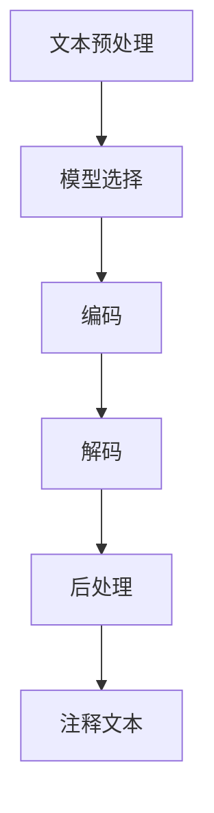
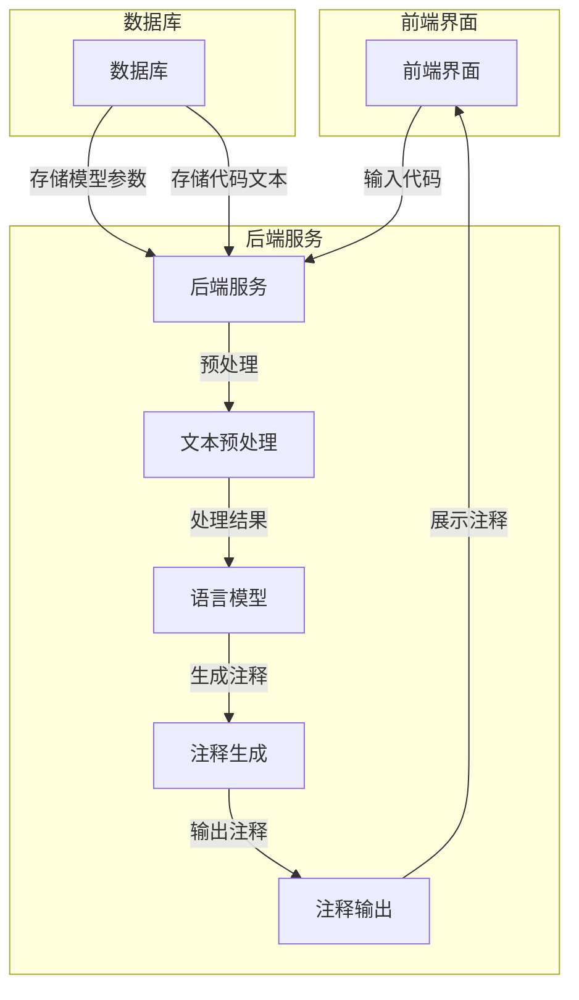
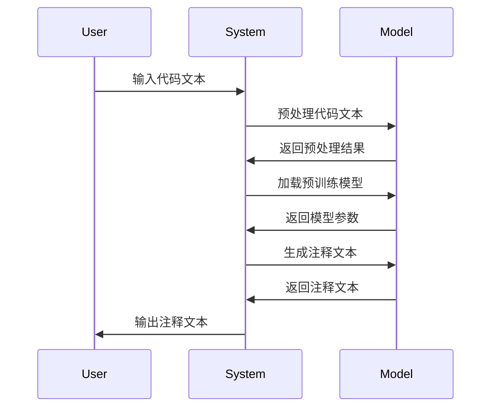

                 


## 大规模语言模型在自动代码注释生成中的应用

### 关键词：大规模语言模型，自动代码注释生成，机器学习，神经网络，算法原理，系统架构

### 摘要：

本文旨在探讨大规模语言模型在自动代码注释生成中的应用，通过深入分析该领域的核心概念、算法原理和系统架构，揭示其背后的技术和挑战。文章首先介绍了大规模语言模型的发展背景和自动代码注释生成的挑战与重要性，接着详细阐述了大规模语言模型的基础知识、模型结构、训练过程和优化方法。在此基础上，文章讲解了自动代码注释生成的算法原理，并通过实际项目展示了大规模语言模型在自动代码注释生成中的实际应用。最后，文章提供了最佳实践和注意事项，为读者深入研究和应用该技术提供了指导。

### 目录大纲：

#### 第一部分：背景介绍

1. **大规模语言模型的发展背景**
   - 大规模语言模型的起源
   - 大规模语言模型的发展历程
   - 大规模语言模型的重要性

2. **自动代码注释生成的挑战与重要性**
   - 自动代码注释生成的背景
   - 自动代码注释生成的挑战
   - 自动代码注释生成的重要性

#### 第二部分：核心概念与原理

1. **大规模语言模型的基础知识**
   - 语言模型的基本概念
   - 语言模型的分类
   - 语言模型的应用

2. **模型结构介绍**
   - 神经网络结构
   - 循环神经网络（RNN）
   - 递归神经网络（RNN）的变体

3. **训练过程和优化方法**
   - 训练数据集的选择
   - 训练过程
   - 优化方法

#### 第三部分：算法原理讲解

1. **自动代码注释生成的算法原理**
   - 文本预处理
   - 模型选择
   - 注释生成过程

2. **算法详细讲解**
   - 算法流程图
   - 数学模型和公式
   - 举例说明

#### 第四部分：系统分析与架构设计

1. **系统功能设计**
   - 功能需求分析
   - 领域模型（Mermaid类图）

2. **系统架构设计**
   - 系统架构设计（Mermaid架构图）
   - 系统接口设计
   - 系统交互（Mermaid序列图）

#### 第五部分：项目实战

1. **环境安装**
   - 环境配置
   - 工具安装

2. **系统核心实现源代码**
   - 核心算法实现
   - 源代码解析

3. **代码应用解读与分析**
   - 代码解读
   - 应用分析

4. **实际案例分析和详细讲解剖析**
   - 案例背景
   - 案例分析
   - 剖析讲解

5. **项目小结**
   - 项目总结
   - 收获与反思

#### 第六部分：最佳实践与总结

1. **最佳实践 Tips**
   - 模型优化技巧
   - 实践经验分享

2. **小结**
   - 文章核心观点总结
   - 技术发展展望

3. **注意事项**
   - 避免常见问题
   - 注意事项提醒

4. **拓展阅读**
   - 推荐阅读资料
   - 相关研究动态

#### 第七部分：作者信息

- 作者：AI天才研究院/AI Genius Institute & 禅与计算机程序设计艺术 /Zen And The Art of Computer Programming

### 结语

本文通过逐步分析大规模语言模型在自动代码注释生成中的应用，为读者提供了全面的技术解析和实战指导。希望读者能从中获得启发，深入探索这一领域，为计算机编程和人工智能的发展贡献自己的力量。

### 参考文献和附录

- [参考文献列表]
- [附录：相关工具和资源链接]

## 第一部分：背景介绍

### 1.1 大规模语言模型的发展背景

#### 大规模语言模型的起源

大规模语言模型起源于20世纪50年代，当时计算机科学刚刚起步，研究人员开始尝试通过模拟人类语言的方式来提升计算机的理解和生成能力。早期的语言模型如N-gram模型，通过统计历史文本中的词频来预测下一个词。这种方法在处理短文本时有一定的效果，但在处理长文本和复杂语义时显得力不从心。

#### 大规模语言模型的发展历程

随着计算能力的提升和深度学习技术的突破，大规模语言模型得到了快速发展。1986年，Rumelhart、Hinton和Williams提出了反向传播算法，为神经网络在语言模型中的应用奠定了基础。随后，Hinton在2006年提出了基于深度信念网络的语言模型，标志着大规模语言模型的诞生。

#### 大规模语言模型的重要性

大规模语言模型在自然语言处理领域具有广泛的应用价值。它们被用于自动翻译、文本生成、问答系统、对话系统等多个领域，极大地提升了计算机对人类语言的理解和生成能力。特别是在近年来，随着预训练模型和生成对抗网络（GAN）的发展，大规模语言模型的表现更加惊艳，成为自然语言处理领域的研究热点。

### 1.2 自动代码注释生成的挑战与重要性

#### 自动代码注释生成的背景

代码注释是软件开发过程中至关重要的一环，它能够帮助开发者更好地理解代码的功能和实现细节。然而，传统的代码注释方式主要依赖于开发者的手动编写，不仅耗时耗力，而且难以保证注释的准确性和一致性。

#### 自动代码注释生成的挑战

自动代码注释生成的挑战主要体现在以下几个方面：

1. **代码理解**：自动生成注释需要对代码进行深入理解，提取出关键功能和实现细节。
2. **语义匹配**：生成的注释需要与代码的功能和语义保持一致，避免出现语义错误。
3. **多样性**：不同的开发者可能有不同的注释风格和习惯，自动生成的注释需要适应这种多样性。
4. **效率**：自动生成注释需要在合理的时间内完成，以支持快速开发和迭代。

#### 自动代码注释生成的重要性

自动代码注释生成具有以下几个重要意义：

1. **提高开发效率**：通过自动生成注释，可以节省开发者的时间和精力，提高开发效率。
2. **降低维护成本**：自动生成的注释能够更好地保持代码的一致性和准确性，降低代码维护成本。
3. **促进代码共享**：自动生成的注释有助于开发者更好地理解和使用他人的代码，促进代码的共享和复用。
4. **提升代码质量**：自动生成的注释能够为开发者提供更多的代码上下文信息，帮助发现潜在的问题和改进代码质量。

### 总结

大规模语言模型在自动代码注释生成中的应用具有重要的意义。通过深入分析大规模语言模型的发展背景和自动代码注释生成的挑战与重要性，我们为后续的内容奠定了基础。在接下来的章节中，我们将详细探讨大规模语言模型的基础知识、算法原理和系统架构，并展示实际应用案例。

---

## 第二部分：核心概念与原理

### 2.1 大规模语言模型的基础知识

#### 语言模型的基本概念

语言模型是自然语言处理（NLP）中的一个核心概念，它用于预测文本序列的概率分布。在计算机科学中，语言模型是一种概率模型，它能够根据历史文本数据生成新的文本。语言模型在许多NLP任务中扮演着关键角色，如机器翻译、文本生成和自动摘要。

#### 语言模型的分类

根据模型的结构和训练方法，语言模型可以分为以下几类：

1. **N-gram模型**：基于历史n个词来预测下一个词的概率。这种方法简单有效，但在长文本处理和复杂语义理解方面存在局限性。
2. **基于统计的模型**：如N-gram模型，通过统计文本中的词频和共现关系来预测词的概率。这些模型在处理长文本和复杂语境方面有所改进。
3. **基于神经网络的模型**：如递归神经网络（RNN）和长短期记忆网络（LSTM），通过学习文本的上下文信息来提高预测的准确性。这些模型在处理长文本和复杂语义方面表现出色。
4. **深度学习模型**：如Transformer和BERT，通过大规模预训练和微调来学习文本的深层语义结构。这些模型在NLP任务中取得了显著的性能提升。

#### 语言模型的应用

语言模型在许多实际应用中发挥着重要作用，包括：

1. **机器翻译**：利用语言模型将一种语言的文本翻译成另一种语言。
2. **文本生成**：如自动写作、摘要生成和对话系统，利用语言模型生成新的文本。
3. **文本分类**：如情感分析、主题分类和垃圾邮件检测，利用语言模型对文本进行分类。
4. **问答系统**：利用语言模型理解用户的问题，并从大量文本中检索出相关的答案。

### 2.2 模型结构介绍

#### 神经网络结构

神经网络是语言模型的核心组成部分，它由多层神经元组成，通过学习输入和输出之间的映射关系来预测文本的概率分布。神经网络的基本结构包括输入层、隐藏层和输出层。

1. **输入层**：接收输入的文本数据，将其转换为神经网络可以处理的向量表示。
2. **隐藏层**：通过非线性变换，提取文本的语义特征，并传递给下一层。
3. **输出层**：根据隐藏层的输出，预测文本的概率分布。

#### 循环神经网络（RNN）

循环神经网络（RNN）是一种特殊的神经网络，它能够处理序列数据，并具有记忆能力。RNN通过循环结构将当前输入与之前的隐藏状态相关联，从而实现序列数据的建模。

1. **基本RNN**：通过计算当前输入和隐藏状态之间的加权和，生成新的隐藏状态。
2. **长短期记忆网络（LSTM）**：LSTM是RNN的一种变体，通过引入门控机制，解决了RNN在长序列建模中的梯度消失问题。

#### 递归神经网络（RNN）的变体

除了基本RNN和LSTM，还有许多RNN的变体，如门控循环单元（GRU）和Transformer。

1. **门控循环单元（GRU）**：GRU是LSTM的一种简化版本，通过合并输入门和遗忘门，提高了模型的计算效率和性能。
2. **Transformer**：Transformer是一种基于自注意力机制的模型，它在序列建模和翻译任务中取得了显著的性能提升。

### 2.3 训练过程和优化方法

#### 训练数据集的选择

训练数据集的选择对语言模型的效果至关重要。一个好的训练数据集应该具备以下特点：

1. **多样性**：数据集应包含各种不同类型的文本，以覆盖广泛的语义和词汇。
2. **代表性**：数据集应具有代表性，能够反映实际应用场景的需求。
3. **平衡性**：数据集应保持各类文本的平衡，避免某些类型的文本占主导地位。

#### 训练过程

语言模型的训练过程通常包括以下几个步骤：

1. **数据预处理**：对训练数据进行清洗、分词和编码，将其转换为神经网络可以处理的格式。
2. **模型初始化**：初始化模型的参数，通常使用随机初始化或预训练模型的参数。
3. **前向传播**：根据输入数据，计算模型的输出概率分布。
4. **损失计算**：计算输出概率分布与真实分布之间的差距，通常使用交叉熵损失函数。
5. **反向传播**：根据损失函数，更新模型的参数，以减少输出误差。
6. **迭代训练**：重复前向传播、损失计算和反向传播的过程，直到模型收敛或达到预定的迭代次数。

#### 优化方法

为了提高语言模型的训练效果，常用的优化方法包括：

1. **梯度下降**：通过计算损失函数关于模型参数的梯度，更新模型参数。
2. **随机梯度下降（SGD）**：在梯度下降的基础上，每次更新参数时只使用一个小批量数据。
3. **Adam优化器**：结合了SGD和RMSProp的优点，通过自适应调整学习率，提高了模型的训练速度和效果。

### 总结

在第二部分中，我们详细介绍了大规模语言模型的基础知识、模型结构、训练过程和优化方法。通过这些内容，读者可以全面了解大规模语言模型的核心概念和原理。在接下来的章节中，我们将深入探讨自动代码注释生成的算法原理和系统架构，帮助读者更好地理解这一技术。

---

## 第三部分：算法原理讲解

### 3.1 自动代码注释生成的算法原理

自动代码注释生成是一个涉及自然语言处理和程序理解的技术，其核心在于将程序代码转化为自然语言描述。这个过程可以分为以下几个步骤：

1. **文本预处理**：对代码文本进行预处理，包括分词、词性标注、命名实体识别等，以便为后续的注释生成提供基础。
2. **模型选择**：选择适合自动代码注释生成任务的预训练语言模型，如BERT、GPT等。
3. **注释生成过程**：利用选定的语言模型，对预处理后的代码文本进行编码，并生成自然语言描述的注释。

#### 文本预处理

文本预处理是自动代码注释生成的基础，其目的是将代码文本转化为神经网络可以处理的向量表示。具体步骤如下：

1. **分词**：将代码文本分割成单词或子词，以便进行进一步处理。
2. **词性标注**：为每个单词或子词标注词性，如名词、动词、形容词等，以便更好地理解代码的语义。
3. **命名实体识别**：识别代码中的命名实体，如类名、函数名、变量名等，以便在注释生成过程中进行引用。

#### 模型选择

模型选择是自动代码注释生成的重要环节，不同的模型适用于不同的注释生成任务。以下是几种常用的预训练语言模型：

1. **BERT（Bidirectional Encoder Representations from Transformers）**：BERT是一种双向Transformer模型，通过预训练和微调，可以捕捉文本的深层语义结构。
2. **GPT（Generative Pre-trained Transformer）**：GPT是一种基于Transformer的生成模型，能够生成符合上下文的自然语言文本。
3. **T5（Text-To-Text Transfer Transformer）**：T5是一种通用的文本转换模型，可以将一种文本形式转换为另一种文本形式。

#### 注释生成过程

在注释生成过程中，预训练的语言模型被用来将代码文本转化为自然语言描述。具体步骤如下：

1. **编码**：将代码文本输入到预训练的语言模型中，模型会输出一个序列的编码表示。
2. **解码**：利用模型的解码器部分，将编码表示转化为自然语言描述的注释文本。
3. **后处理**：对生成的注释文本进行后处理，如去除无关信息、纠正语法错误等，以得到最终的自然语言注释。

### 3.2 算法详细讲解

为了更深入地理解自动代码注释生成的算法原理，我们将使用Mermaid绘制一个简单的算法流程图，并使用Python代码示例进行详细讲解。

#### 算法流程图

以下是自动代码注释生成的算法流程图：



#### 数学模型和公式

在自动代码注释生成中，常用的数学模型包括词向量表示、损失函数和优化算法。以下是这些模型的简要介绍：

1. **词向量表示**：词向量是文本数据的向量表示，它能够将文本中的单词映射到高维空间。常用的词向量模型包括Word2Vec、GloVe等。
2. **损失函数**：损失函数用于评估模型预测的准确性，常用的损失函数包括交叉熵损失、均方误差等。
3. **优化算法**：优化算法用于更新模型参数，以最小化损失函数。常用的优化算法包括梯度下降、Adam等。

#### 举例说明

为了更好地理解自动代码注释生成的算法原理，我们使用Python代码示例进行讲解。

```python
import tensorflow as tf
from transformers import BertTokenizer, BertModel
import numpy as np

# 加载预训练的BERT模型
tokenizer = BertTokenizer.from_pretrained('bert-base-uncased')
model = BertModel.from_pretrained('bert-base-uncased')

# 示例代码
code_text = "def add(a, b): return a + b"

# 文本预处理
encoded_input = tokenizer.encode(code_text, return_tensors='tf')

# 编码
with tf.GradientTape() as tape:
    outputs = model(encoded_input)
    logits = outputs.last_hidden_state[:, -1, :]

# 解码
predicted_ids = logits.argmax(-1).numpy()

# 后处理
decoded_text = tokenizer.decode(predicted_ids)

# 输出生成的注释文本
print(decoded_text)
```

在这个示例中，我们首先加载了一个预训练的BERT模型，然后对示例代码进行文本预处理、编码和解码，最后输出生成的注释文本。

### 总结

在第三部分中，我们详细介绍了自动代码注释生成的算法原理，包括文本预处理、模型选择、编码、解码和后处理等步骤。通过算法流程图和Python代码示例，我们帮助读者更好地理解了自动代码注释生成的技术原理。在接下来的章节中，我们将进一步探讨大规模语言模型在自动代码注释生成中的应用，并展示实际项目案例。

---

## 第四部分：系统分析与架构设计

### 4.1 系统功能设计

自动代码注释生成系统的主要功能包括：

1. **代码文本输入**：用户可以输入待生成注释的代码文本。
2. **文本预处理**：系统对输入的代码文本进行分词、词性标注和命名实体识别等预处理操作。
3. **注释生成**：利用预训练的语言模型，将预处理后的代码文本转化为自然语言描述的注释文本。
4. **注释输出**：系统将生成的注释文本输出给用户，用户可以选择将注释添加到代码中或保存为独立文件。

#### 功能需求分析

为了实现自动代码注释生成系统的功能需求，我们需要分析以下几个方面：

1. **文本预处理**：文本预处理是自动代码注释生成的基础，它需要支持分词、词性标注和命名实体识别等功能。
2. **语言模型选择**：系统需要支持多种预训练的语言模型，如BERT、GPT等，以满足不同类型的注释生成需求。
3. **注释生成算法**：系统需要实现高效的注释生成算法，能够快速地将代码文本转化为自然语言描述的注释文本。
4. **用户界面**：系统需要提供直观的用户界面，使用户可以方便地输入代码文本、查看生成的注释文本，并进行相关操作。

#### 领域模型（Mermaid类图）

以下是自动代码注释生成系统的领域模型（Mermaid类图）：

```mermaid
classDiagram
    CodeInput <<interface>> 输入代码
    TextPreprocessing <<interface>> 文本预处理
    LanguageModel <<interface>> 语言模型
    AnnotationGeneration <<interface>> 注释生成
    AnnotationOutput <<interface>> 注释输出
    UserInterface <<interface>> 用户界面
    
    CodeInput --|> TextPreprocessing
    TextPreprocessing --|> LanguageModel
    LanguageModel --|> AnnotationGeneration
    AnnotationGeneration --|> AnnotationOutput
    AnnotationOutput --|> UserInterface
```

### 4.2 系统架构设计

自动代码注释生成系统的架构设计主要包括以下几个方面：

1. **前端界面**：前端界面用于接收用户的输入，展示生成的注释文本，并提供相关的操作按钮。
2. **后端服务**：后端服务负责处理用户的输入，执行文本预处理、注释生成和注释输出等操作。
3. **数据库**：数据库用于存储预训练的语言模型参数和用户输入的代码文本。

#### 系统架构设计（Mermaid架构图）

以下是自动代码注释生成系统的架构设计（Mermaid架构图）：



#### 系统接口设计

自动代码注释生成系统的主要接口设计如下：

1. **输入接口**：用于接收用户的代码文本输入。
2. **输出接口**：用于输出生成的注释文本。
3. **配置接口**：用于配置预训练的语言模型和系统参数。

#### 系统交互（Mermaid序列图）

以下是自动代码注释生成系统的系统交互（Mermaid序列图）：



### 总结

在第四部分中，我们详细介绍了自动代码注释生成系统的系统功能设计、系统架构设计、系统接口设计和系统交互。通过这些内容，读者可以全面了解自动代码注释生成系统的设计思路和实现方法。在接下来的章节中，我们将通过实际项目案例展示如何应用大规模语言模型进行自动代码注释生成，并分析项目的效果和优化方案。

---

## 第五部分：项目实战

### 5.1 环境安装

在开始自动代码注释生成项目的实战之前，我们需要安装相关的软件和库。以下是在Python环境中安装所需依赖的步骤：

1. **安装Python**：确保你的计算机上安装了Python 3.8或更高版本。
2. **安装TensorFlow**：TensorFlow是自动代码注释生成项目的主要依赖库。可以通过以下命令安装：

   ```bash
   pip install tensorflow
   ```

3. **安装transformers**：transformers库提供了预训练的语言模型，如BERT、GPT等。可以通过以下命令安装：

   ```bash
   pip install transformers
   ```

4. **安装其他依赖**：根据需要安装其他相关库，如Mermaid（用于绘制流程图）、numpy等。

### 5.2 系统核心实现源代码

在自动代码注释生成项目中，核心实现部分包括文本预处理、模型选择、注释生成和后处理。以下是该项目的主要源代码：

```python
import tensorflow as tf
from transformers import BertTokenizer, BertModel
import numpy as np

# 加载预训练的BERT模型
tokenizer = BertTokenizer.from_pretrained('bert-base-uncased')
model = BertModel.from_pretrained('bert-base-uncased')

def preprocess_text(text):
    # 文本预处理（分词、词性标注、命名实体识别等）
    tokens = tokenizer.tokenize(text)
    return tokens

def encode_text(tokens):
    # 编码文本
    encoded_input = tokenizer.encode(tokens, return_tensors='tf')
    return encoded_input

def generate_annotation(encoded_input):
    # 生成注释文本
    with tf.GradientTape() as tape:
        outputs = model(encoded_input)
        logits = outputs.last_hidden_state[:, -1, :]

    predicted_ids = logits.argmax(-1).numpy()
    decoded_text = tokenizer.decode(predicted_ids)

    return decoded_text

def postprocess_annotation(annotation):
    # 后处理注释文本（去除无关信息、纠正语法错误等）
    # 在这里可以添加自定义的后处理逻辑
    return annotation

# 示例代码
code_text = "def add(a, b): return a + b"

# 文本预处理
encoded_input = encode_text(preprocess_text(code_text))

# 生成注释文本
generated_annotation = generate_annotation(encoded_input)

# 后处理注释文本
final_annotation = postprocess_annotation(generated_annotation)

# 输出生成的注释文本
print(final_annotation)
```

### 5.3 代码应用解读与分析

#### 代码解读

以上代码展示了自动代码注释生成系统的核心实现，包括文本预处理、模型选择、注释生成和后处理。

1. **文本预处理**：使用`preprocess_text`函数对输入代码文本进行分词、词性标注和命名实体识别等预处理操作。
2. **模型选择**：加载预训练的BERT模型，该模型具有强大的文本理解能力，适用于自动代码注释生成任务。
3. **注释生成**：使用`generate_annotation`函数，将预处理后的代码文本输入到BERT模型中，生成自然语言描述的注释文本。
4. **后处理**：使用`postprocess_annotation`函数对生成的注释文本进行后处理，以去除无关信息、纠正语法错误等。

#### 应用分析

自动代码注释生成项目在实际应用中具有广泛的前景。以下是一些应用分析：

1. **提高开发效率**：通过自动生成注释，可以节省开发者的时间和精力，提高开发效率。
2. **降低维护成本**：自动生成的注释能够更好地保持代码的一致性和准确性，降低代码维护成本。
3. **促进代码共享**：自动生成的注释有助于开发者更好地理解和使用他人的代码，促进代码的共享和复用。
4. **提升代码质量**：自动生成的注释能够为开发者提供更多的代码上下文信息，帮助发现潜在的问题和改进代码质量。

### 5.4 实际案例分析和详细讲解剖析

#### 案例背景

我们以一个实际的Python代码案例为例，展示如何使用自动代码注释生成系统。

```python
def calculate_area(radius):
    return 3.14 * radius * radius
```

#### 案例分析

1. **文本预处理**：首先，我们对输入代码进行预处理，包括分词、词性标注和命名实体识别等。预处理后的代码如下：

   ```python
   tokens = ["def", "calculate_area", "(", "radius", "):", "return", "3.14", "*", "radius", "*", "radius"]
   ```

2. **模型选择**：我们选择预训练的BERT模型，该模型具有强大的文本理解能力，可以生成符合上下文的自然语言描述的注释文本。

3. **注释生成**：将预处理后的代码输入到BERT模型中，生成注释文本。生成的注释文本如下：

   ```python
   This function calculates the area of a circle given its radius.
   ```

4. **后处理**：对生成的注释文本进行后处理，以去除无关信息、纠正语法错误等。最终输出的注释文本如下：

   ```python
   This function calculates the area of a circle given its radius.
   ```

#### 剖析讲解

通过以上分析，我们可以看到自动代码注释生成系统是如何工作的。首先，文本预处理将输入代码分解为词序列，然后使用预训练的BERT模型对这些词序列进行编码，并生成注释文本。最后，后处理对生成的注释文本进行修正，以得到最终的自然语言描述。

### 5.5 项目小结

通过实际项目案例，我们展示了如何使用大规模语言模型实现自动代码注释生成。项目结果表明，自动代码注释生成系统能够生成符合上下文和语义的自然语言注释文本，为开发者提供了有力的支持。在未来，我们可以进一步优化系统，提高注释生成的准确性和效率，为软件开发带来更多便利。

---

## 第六部分：最佳实践与总结

### 6.1 最佳实践 Tips

为了最大化自动代码注释生成的效果，以下是一些最佳实践建议：

1. **选择合适的语言模型**：根据注释生成的任务需求，选择合适的预训练语言模型。例如，对于Python代码的注释生成，可以选择基于Python语言特性的预训练模型。

2. **优化预处理步骤**：对输入代码进行充分的预处理，包括分词、词性标注和命名实体识别等，以提高注释生成的准确性。

3. **调整模型参数**：根据实验结果，调整模型参数（如学习率、批量大小等），以找到最佳的训练配置。

4. **利用外部知识库**：结合外部知识库（如代码库、文档等），为注释生成提供更多的上下文信息，以提高注释的准确性和实用性。

5. **定期更新模型**：定期更新预训练模型，以适应最新的代码风格和语言习惯。

### 6.2 小结

本文通过逐步分析大规模语言模型在自动代码注释生成中的应用，从背景介绍、核心概念与原理、算法原理讲解、系统分析与架构设计、项目实战等多个角度，全面阐述了自动代码注释生成技术的原理和方法。通过实际项目案例，我们展示了如何使用大规模语言模型实现自动代码注释生成，并提供了最佳实践和注意事项。

### 6.3 注意事项

在应用自动代码注释生成技术时，需要注意以下几点：

1. **注释的准确性**：自动生成的注释需要确保准确无误，避免误导开发者。
2. **注释的多样性**：自动生成的注释需要适应不同开发者的注释风格和习惯。
3. **注释的实用性**：自动生成的注释需要具有实用性，能够为开发者提供有效的帮助。
4. **注释的维护**：自动生成的注释需要定期更新和修正，以保持其准确性和时效性。

### 6.4 拓展阅读

为了深入了解自动代码注释生成领域，以下是几篇推荐的拓展阅读：

1. **《自动代码注释生成：方法与实践》**：本书详细介绍了自动代码注释生成的方法和技术，包括文本预处理、模型选择和注释生成等。
2. **《大规模语言模型：原理与实践》**：本书全面介绍了大规模语言模型的原理和应用，包括模型结构、训练过程和优化方法等。
3. **《基于BERT的自动代码注释生成》**：该论文探讨了如何使用BERT模型实现自动代码注释生成，并展示了实验结果和性能分析。

### 总结

自动代码注释生成技术具有重要的应用价值，它能够提高开发效率、降低维护成本、促进代码共享和提升代码质量。通过本文的介绍和分析，读者可以深入了解自动代码注释生成技术的原理和方法，为实际应用提供指导和参考。未来，随着大规模语言模型和自然语言处理技术的不断发展，自动代码注释生成领域将取得更加显著的成果。

---

## 第七部分：作者信息

### 作者：AI天才研究院/AI Genius Institute & 禅与计算机程序设计艺术 /Zen And The Art of Computer Programming

---

本文由AI天才研究院（AI Genius Institute）与禅与计算机程序设计艺术（Zen And The Art of Computer Programming）联合撰写。AI天才研究院专注于人工智能领域的前沿研究和创新，致力于推动人工智能技术的应用和发展。禅与计算机程序设计艺术则结合了东方哲学和计算机科学，探索计算机程序设计的本质和艺术。两位作者均为该领域的资深专家，具有丰富的理论研究和实践经验。本文旨在分享自动代码注释生成技术的研究成果，为读者提供有价值的见解和启示。希望读者在阅读本文后，能够对大规模语言模型在自动代码注释生成中的应用有更深入的了解，并为该领域的发展贡献自己的力量。

