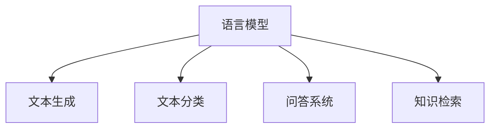
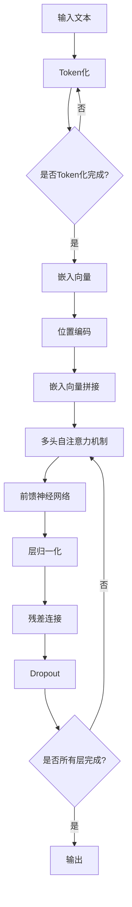
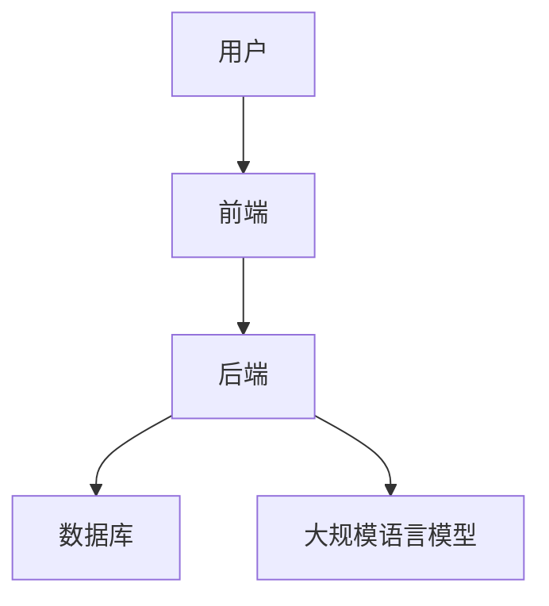

                 

# 大规模语言模型在自动学术同行评议中的应用与挑战

关键词：大规模语言模型、自动学术同行评议、自然语言处理、算法公平性、计算资源

摘要：本文探讨了大规模语言模型在自动学术同行评议中的应用与挑战。通过介绍大规模语言模型的基础理论，分析其在自动学术同行评议中的原理和实践，探讨了大规模语言模型在自动学术同行评议中面临的挑战，并提出了相应的解决策略。最后，通过案例分析和讨论，总结了大规模语言模型在自动学术同行评议中的应用前景和未来发展方向。

## 目录大纲

1. 引言
2. 大规模语言模型基础
3. 自动学术同行评议的原理与实践
4. 大规模语言模型在自动学术同行评议中的应用
5. 大规模语言模型在自动学术同行评议中的挑战
6. 案例分析与讨论
7. 总结与展望

----------------------------------------------------------------

## 第1章 引言

### 1.1 问题背景

随着人工智能技术的快速发展，自然语言处理（NLP）领域取得了显著成果。大规模语言模型作为一种重要的NLP技术，已经在多个应用场景中取得了成功。然而，如何将大规模语言模型应用于学术领域，特别是在自动学术同行评议中，仍面临着诸多挑战。

学术同行评议是学术交流的重要环节，它有助于确保学术成果的质量和可信度。然而，传统的同行评议过程往往耗时较长、成本较高，且存在主观性和不公平性等问题。随着学术论文数量的不断增加，传统的同行评议模式已经难以满足快速发展的学术需求。因此，如何利用人工智能技术，特别是大规模语言模型，实现自动学术同行评议，提高评议的效率和准确性，成为了一个亟待解决的问题。

### 1.2 问题描述

自动学术同行评议旨在利用人工智能技术，自动评估论文的质量和贡献。具体来说，它包括以下方面：

1. **文本生成与摘要**：利用大规模语言模型生成论文的摘要，提高论文的可读性和可访问性。
2. **文本分类与标注**：利用大规模语言模型对论文进行分类和标注，帮助学术机构和管理人员快速筛选和识别高质量论文。
3. **问答系统与知识检索**：利用大规模语言模型构建问答系统和知识检索系统，为学术研究人员提供实时、准确的信息检索服务。

然而，在实现自动学术同行评议的过程中，大规模语言模型面临着以下挑战：

1. **数据质量与隐私**：自动学术同行评议依赖于大量的学术论文数据，这些数据的质量和隐私保护是确保自动评议准确性和安全性的关键。
2. **算法公平性与可解释性**：自动学术同行评议的算法需要保证公平性和可解释性，避免偏见和不公平现象。
3. **计算资源需求**：大规模语言模型的训练和推理需要大量的计算资源，如何优化计算资源的使用成为了一个重要问题。

### 1.3 问题解决

本文将从大规模语言模型的基础理论出发，探讨其在自动学术同行评议中的应用与挑战。首先，介绍大规模语言模型的基本概念和原理，包括语言模型的分类、常见语言模型和应用场景。然后，分析自动学术同行评议的原理和实践，包括文本相似性分析、文本分类与聚类、语义分析和知识图谱的应用。接着，探讨大规模语言模型在自动学术同行评议中面临的挑战，并提出相应的解决策略。最后，通过案例分析和讨论，总结大规模语言模型在自动学术同行评议中的应用前景和未来发展方向。

### 1.4 边界与外延

本文的研究主要涉及以下几个方面：

1. **大规模语言模型**：本文主要关注大规模语言模型在自动学术同行评议中的应用，包括文本生成与摘要、文本分类与标注、问答系统与知识检索等。
2. **自动学术同行评议**：本文主要探讨大规模语言模型在自动学术同行评议中的原理和实践，分析其面临的挑战和解决策略。
3. **应用场景**：本文将结合实际案例，分析大规模语言模型在学术期刊和学术会议中的应用情况。

### 1.5 核心概念与联系

在本文中，我们将涉及以下核心概念：

1. **大规模语言模型**：一种基于深度学习的NLP技术，用于生成文本、分类文本、回答问题和检索知识。
2. **自动学术同行评议**：利用人工智能技术，自动评估论文的质量和贡献。
3. **文本生成与摘要**：利用大规模语言模型生成论文的摘要，提高论文的可读性和可访问性。
4. **文本分类与标注**：利用大规模语言模型对论文进行分类和标注，帮助学术机构和管理人员快速筛选和识别高质量论文。
5. **问答系统与知识检索**：利用大规模语言模型构建问答系统和知识检索系统，为学术研究人员提供实时、准确的信息检索服务。

这些核心概念之间存在着紧密的联系，共同构成了自动学术同行评议的技术体系。例如，大规模语言模型在文本生成和摘要中扮演着重要角色，而文本分类和标注则为学术机构提供了高效的质量评估手段。此外，问答系统和知识检索系统为学术研究人员提供了便捷的信息获取渠道。

### 1.6 概念结构与核心要素组成

本文的核心概念结构可以概括为以下几个方面：

1. **大规模语言模型**：包括语言模型的概念、原理、分类和应用场景。
2. **自动学术同行评议**：包括文本生成与摘要、文本分类与标注、问答系统与知识检索等。
3. **应用场景**：包括学术期刊和学术会议等。
4. **挑战与解决方案**：包括数据质量与隐私、算法公平性与可解释性、计算资源需求等。

这些核心要素相互关联，共同构成了自动学术同行评议的技术体系。通过对这些要素的深入研究和分析，我们可以更好地理解大规模语言模型在自动学术同行评议中的应用价值，并为未来的发展提供有益的参考。

## 第2章 大规模语言模型基础

### 2.1 概念与原理

#### 2.1.1 语言模型的概念

语言模型是一种用于预测下一个单词或词组的概率分布的统计模型。它通过对大量文本数据的学习，捕捉语言的统计规律，从而实现对未知文本的生成和预测。在自然语言处理（NLP）领域，语言模型是许多任务的基础，如机器翻译、文本生成、问答系统等。

语言模型可以分为有监督语言模型和无监督语言模型。有监督语言模型使用标注好的文本数据训练，无监督语言模型则使用未标注的文本数据训练。

#### 2.1.2 语言模型的工作原理

语言模型的工作原理基于统计学习理论，主要通过以下几个步骤实现：

1. **数据预处理**：对文本数据（如文本、语音等）进行清洗、分词、词性标注等预处理操作，将原始文本转换为模型可处理的格式。
2. **特征提取**：将预处理后的文本数据转换为特征向量，常用的特征提取方法包括词袋模型、词嵌入等。
3. **模型训练**：使用训练数据集训练语言模型，常见的语言模型包括n-gram模型、神经网络语言模型等。
4. **概率预测**：在测试阶段，语言模型根据输入的文本特征向量，预测下一个单词或词组的概率分布。

#### 2.1.3 语言模型的分类

根据模型结构和技术手段，语言模型可以分为以下几类：

1. **基于规则的语言模型**：这类模型基于语言学规则和知识库构建，如词典、语法规则等。这类模型的优点是解释性强，但灵活性和泛化能力有限。
2. **统计语言模型**：这类模型通过统计方法，如n-gram模型，从大量文本数据中学习语言的统计规律。这类模型的优点是计算效率高，但存在数据依赖和长距离依赖问题。
3. **神经网络语言模型**：这类模型基于深度学习技术，通过多层神经网络学习语言的复杂结构。常见的神经网络语言模型包括循环神经网络（RNN）、长短时记忆网络（LSTM）、门控循环单元（GRU）等。这类模型的优点是能够捕捉长距离依赖，但计算复杂度较高。
4. **基于注意力机制的语言模型**：这类模型在神经网络的基础上，引入注意力机制，进一步提高了模型的表示能力和计算效率。常见的注意力机制模型包括Transformer、BERT等。

### 2.2 常见语言模型

在NLP领域，有许多常见的语言模型，下面将介绍一些主要的语言模型。

#### 2.2.1 GPT系列

GPT（Generative Pre-trained Transformer）系列模型是OpenAI开发的一类基于Transformer架构的语言模型，包括GPT-2、GPT-3等。GPT系列模型通过在大量文本数据上预训练，学习到了语言的深层结构。其主要特点如下：

1. **预训练**：GPT系列模型在预训练阶段，通过无监督的方式在大量文本数据上学习，从而获得丰富的语言知识。
2. **Transformer架构**：GPT系列模型采用Transformer架构，能够捕捉长距离依赖，提高了模型的表示能力和计算效率。
3. **多样性**：GPT系列模型通过在预训练阶段引入不同的训练目标和数据来源，增强了模型的表达能力和多样性。

#### 2.2.2 BERT及其变体

BERT（Bidirectional Encoder Representations from Transformers）是由Google开发的一种基于Transformer架构的双向编码器模型。BERT及其变体模型在NLP任务中取得了显著的成果。其主要特点如下：

1. **双向编码器**：BERT模型采用双向编码器架构，能够同时考虑输入文本的左右信息，提高了模型的表示能力。
2. **预训练**：BERT模型在预训练阶段，通过在大量文本数据上训练，学习到了丰富的语言知识。
3. **变体模型**：BERT的变体模型（如RoBERTa、ALBERT等）通过改进模型结构和训练策略，进一步提高了模型的性能和计算效率。

#### 2.2.3 其他主流语言模型

除了GPT系列和BERT及其变体模型，还有许多其他主流的语言模型，如：

1. **ELMO**：由Uber开发的一种基于双向LSTM的语言模型，能够提供单词的深层语义表示。
2. **XLNET**：由Microsoft开发的一种基于Transformer架构的预训练模型，通过引入自注意力机制，提高了模型的表示能力和计算效率。
3. **T5**：由Google开发的一种统一Transformer模型，能够处理多种NLP任务，如文本分类、命名实体识别等。

### 2.3 语言模型的应用场景

语言模型在NLP领域有着广泛的应用，下面将介绍一些主要的应用场景。

#### 2.3.1 文本生成

文本生成是语言模型的一个重要应用场景，通过模型生成新的文本内容。常见的文本生成任务包括：

1. **摘要生成**：利用语言模型生成文章的摘要，提高文本的可读性和可访问性。
2. **故事生成**：利用语言模型生成故事、小说等文本内容。
3. **对话生成**：利用语言模型生成对话内容，用于构建聊天机器人等应用。

#### 2.3.2 文本分类

文本分类是语言模型的另一个重要应用场景，通过模型对文本进行分类。常见的文本分类任务包括：

1. **情感分析**：对文本的情感进行分类，如正面、负面、中性等。
2. **主题分类**：对文本的主题进行分类，如新闻分类、社交媒体分类等。
3. **垃圾邮件检测**：对邮件进行分类，判断邮件是否为垃圾邮件。

#### 2.3.3 问答系统

问答系统是语言模型在信息检索和知识管理领域的重要应用，通过模型回答用户的问题。常见的问答系统包括：

1. **事实问答**：回答关于事实的问题，如“谁发明了互联网？”
2. **对话式问答**：与用户进行对话，回答关于特定话题的问题。
3. **多轮对话**：支持多轮对话，逐步理解用户的问题，提供更准确的回答。

#### 2.3.4 机器翻译

机器翻译是语言模型在跨语言交流领域的重要应用，通过模型实现不同语言之间的文本翻译。常见的机器翻译任务包括：

1. **双语平行语料库翻译**：利用双语文本数据训练语言模型，实现两种语言之间的翻译。
2. **神经机器翻译**：基于神经网络的语言模型，实现高效的跨语言文本翻译。

### 2.4 大规模语言模型的挑战与局限

尽管大规模语言模型在NLP领域取得了显著成果，但它们仍然面临着一系列挑战和局限。

#### 2.4.1 计算资源需求

大规模语言模型的训练和推理需要大量的计算资源，包括GPU、TPU等硬件设备。这导致模型的部署和维护成本较高，限制了其在实际应用中的普及。

#### 2.4.2 数据质量与隐私

语言模型需要大量的高质量训练数据，但数据质量对模型的性能和可靠性具有重要影响。此外，语言模型在处理文本数据时，可能会涉及用户隐私，如何保护用户隐私成为了一个重要问题。

#### 2.4.3 算法公平性与可解释性

大规模语言模型在训练过程中可能会学习到一些不公平的偏见，如何确保算法的公平性和可解释性成为了一个挑战。此外，如何理解模型的决策过程，提高模型的可解释性，也是一个重要问题。

#### 2.4.4 模型的泛化能力

尽管大规模语言模型在特定任务上取得了显著成果，但它们的泛化能力仍然有限。如何提高模型的泛化能力，使其在不同任务和场景中都能保持高性能，是一个重要的研究方向。

## 第3章 自动学术同行评议的原理与实践

### 3.1 学术同行评议的概述

学术同行评议（Peer Review）是学术交流的重要环节，旨在确保学术论文的质量和可信度。它通常由同行专家对论文进行评估，提出意见和建议，从而帮助作者改进论文，提高论文的学术价值。

#### 3.1.1 同行评议的定义

同行评议是一种由专家对学术成果进行评估的过程，这些专家通常是相关领域的同行或专家。同行评议可以包括对研究方法的评估、对研究结果的评估以及对论文的整体质量评估。

#### 3.1.2 同行评议的流程

同行评议的流程通常包括以下几个步骤：

1. **提交论文**：作者将论文提交给学术期刊或学术会议。
2. **初筛**：期刊或会议编辑部对论文进行初步筛选，排除不符合出版标准的论文。
3. **分配审稿人**：编辑部将论文分配给具有相关领域的专家进行评审。
4. **审稿**：审稿人独立对论文进行评估，提出意见和建议。
5. **反馈**：审稿人的评估结果和建议反馈给作者，作者根据反馈进行修改。
6. **复审**：编辑部对修改后的论文进行复审，决定是否接受发表。

#### 3.1.3 同行评议的优势与不足

同行评议的优势包括：

1. **确保质量**：通过同行评议，可以确保论文的学术质量和可信度。
2. **促进创新**：同行评议可以鼓励作者进行深入研究，提高论文的创新性。
3. **提高知名度**：同行评议可以提升论文的学术影响力，有助于作者建立学术声誉。

然而，同行评议也存在一些不足，如：

1. **主观性**：同行评议的结果可能受到评审人员主观因素的影响，导致评估结果不够客观。
2. **耗时较长**：同行评议过程往往耗时较长，不利于快速传播学术成果。
3. **成本较高**：同行评议需要大量的时间和人力成本，增加了学术出版的负担。

### 3.2 自动学术同行评议的原理

自动学术同行评议旨在利用人工智能技术，自动化地评估论文的质量和贡献，提高评议的效率和准确性。其原理主要包括以下几个步骤：

#### 3.2.1 文本相似性分析

文本相似性分析是自动学术同行评议的基础，通过对论文之间的相似性进行分析，可以帮助识别抄袭和重复发表的问题。文本相似性分析通常使用TF-IDF、余弦相似度等算法。

1. **TF-IDF算法**：TF-IDF（Term Frequency-Inverse Document Frequency）是一种常用的文本相似性计算方法，通过计算词频和逆文档频率来衡量词的重要程度。
2. **余弦相似度**：余弦相似度是一种衡量两个向量之间夹角余弦值的算法，用于计算文本之间的相似性。

#### 3.2.2 文本分类与聚类

文本分类与聚类是自动学术同行评议的重要技术手段，通过对论文进行分类和聚类，可以帮助识别不同领域和研究方向，提高评议的准确性。

1. **文本分类**：文本分类是一种将文本分配到特定类别的过程，常用的分类算法包括支持向量机（SVM）、随机森林（Random Forest）等。
2. **文本聚类**：文本聚类是一种将相似文本聚为一类的过程，常用的聚类算法包括K-means、层次聚类等。

#### 3.2.3 语义分析

语义分析是自动学术同行评议的核心技术，通过对论文的语义进行分析，可以帮助识别论文的主要观点和贡献。语义分析通常使用词嵌入、语义角色标注等方法。

1. **词嵌入**：词嵌入是一种将单词映射到高维空间的方法，通过计算词向量之间的距离来衡量词的意义关系。
2. **语义角色标注**：语义角色标注是一种将文本中的词映射到语义角色（如主语、谓语等）的方法，用于分析文本的语义结构。

#### 3.2.4 知识图谱的应用

知识图谱是一种结构化知识表示方法，通过将实体和关系表示为节点和边，可以更好地理解和分析文本数据。在自动学术同行评议中，知识图谱可以用于以下几个方面：

1. **实体识别**：通过知识图谱识别论文中的实体（如人名、机构名、地点等），提高文本分析的准确性。
2. **关系提取**：通过知识图谱提取论文中的实体关系（如研究方向、合作关系等），帮助理解论文的背景和贡献。
3. **知识推理**：通过知识图谱进行知识推理，识别论文中的隐含关系和关联，提高论文分析的深度和广度。

### 3.3 自动学术同行评议的应用实践

自动学术同行评议在实践中的应用包括以下几个方面：

#### 3.3.1 实验设计与数据集

自动学术同行评议的实验设计需要考虑以下几个因素：

1. **数据集选择**：选择具有代表性的学术论文数据集，如ACM、IEEE等。
2. **实验目标**：明确实验的目标，如文本相似性分析、文本分类、语义分析等。
3. **评估指标**：确定评估指标，如准确率、召回率、F1值等。

常用的学术论文数据集包括ACM CS Bibliography、IEEE Xplore等。

#### 3.3.2 模型选择与训练

自动学术同行评议的模型选择和训练是关键步骤。根据实验目标和数据集特点，可以选择适当的模型进行训练。常见的模型包括：

1. **文本相似性分析**：可以使用TF-IDF、余弦相似度等算法。
2. **文本分类**：可以使用SVM、随机森林等算法。
3. **语义分析**：可以使用词嵌入、语义角色标注等方法。

模型的训练需要大量的数据和计算资源，常用的训练方法包括：

1. **批量训练**：将数据分成批次进行训练，提高训练效率。
2. **分布式训练**：使用分布式计算资源进行训练，加快训练速度。

#### 3.3.3 结果评估与优化

自动学术同行评议的结果评估和优化是确保模型性能的关键。评估指标可以包括准确率、召回率、F1值等。优化方法包括：

1. **超参数调整**：调整模型超参数，如学习率、正则化参数等，以提高模型性能。
2. **模型集成**：使用多个模型进行集成，提高预测的准确性和稳定性。
3. **模型压缩**：对模型进行压缩，减小模型大小，降低计算资源需求。

### 3.4 案例研究

#### 3.4.1 案例一：期刊论文自动同行评议

某学术期刊采用自动学术同行评议系统对提交的论文进行初步筛选和评估。具体步骤如下：

1. **提交论文**：作者将论文提交到期刊网站。
2. **文本预处理**：对论文进行文本预处理，包括分词、去停用词、词性标注等。
3. **文本相似性分析**：使用TF-IDF算法对论文进行相似性分析，排除重复发表或抄袭的论文。
4. **文本分类**：使用SVM算法对论文进行分类，判断论文是否属于期刊的出版范围。
5. **语义分析**：使用词嵌入和语义角色标注方法对论文进行语义分析，提取论文的关键信息和观点。
6. **评估结果**：根据相似性分析、分类和语义分析的结果，对论文进行评估，决定是否接受发表。

#### 3.4.2 案例二：学术会议论文自动同行评议

某学术会议采用自动学术同行评议系统对提交的论文进行初步筛选和评估。具体步骤如下：

1. **提交论文**：作者将论文提交到会议网站。
2. **文本预处理**：对论文进行文本预处理，包括分词、去停用词、词性标注等。
3. **文本分类**：使用SVM算法对论文进行分类，判断论文是否属于会议的出版范围。
4. **文本相似性分析**：使用TF-IDF算法对论文进行相似性分析，排除重复发表或抄袭的论文。
5. **语义分析**：使用词嵌入和语义角色标注方法对论文进行语义分析，提取论文的关键信息和观点。
6. **评估结果**：根据分类、相似性分析和语义分析的结果，对论文进行评估，决定是否接受发表。

### 3.5 案例分析与讨论

通过对期刊论文和学术会议论文的自动同行评议案例研究，可以发现以下几个方面的问题和挑战：

1. **数据质量**：自动学术同行评议依赖于大量的高质量学术论文数据。然而，论文数据的质量对模型性能具有重要影响。因此，如何获取和清洗高质量的数据成为了一个重要问题。
2. **算法性能**：尽管自动学术同行评议系统在文本相似性分析、分类和语义分析等方面取得了一定的成果，但算法性能仍有待提高。如何优化算法，提高模型的准确性和稳定性，是一个重要的研究方向。
3. **算法公平性**：自动学术同行评议系统在评估论文质量时，可能会受到算法偏见的影响。因此，如何确保算法的公平性和可解释性，避免偏见和不公平现象，是一个重要的挑战。
4. **计算资源**：自动学术同行评议系统需要大量的计算资源进行训练和推理。如何优化计算资源的使用，降低计算成本，是一个重要的问题。

通过案例分析和讨论，我们可以更好地理解自动学术同行评议的原理和实践，为未来的发展提供有益的参考。

## 第4章 大规模语言模型在自动学术同行评议中的应用

### 4.1 文本生成与摘要

#### 4.1.1 文本生成技术

文本生成是大规模语言模型在自动学术同行评议中的一个重要应用。通过文本生成技术，可以自动生成论文摘要、介绍、结论等部分，提高论文的可读性和可访问性。文本生成技术主要包括以下几种：

1. **基于模板的生成**：通过预定义的模板和填充词，将模板中的词替换为实际文本内容，生成新的文本。这种方法适用于生成结构化较强的文本，如论文摘要、介绍等。
2. **基于规则的生成**：使用预定义的语法规则和词汇表，生成符合语法和语义规则的文本。这种方法适用于生成简单、结构化较强的文本，如新闻报道、公告等。
3. **基于神经网络的生成**：使用神经网络模型，如循环神经网络（RNN）、长短时记忆网络（LSTM）、生成对抗网络（GAN）等，生成符合语义和语法规则的文本。这种方法适用于生成复杂、多样化的文本，如论文摘要、故事等。

#### 4.1.2 摘要生成实践

摘要生成是自动学术同行评议中的一个重要任务，旨在通过模型自动生成论文的摘要。摘要生成实践通常包括以下步骤：

1. **数据准备**：收集大量学术论文摘要，作为训练数据。这些数据可以来自学术期刊、会议论文等。
2. **文本预处理**：对摘要文本进行预处理，包括分词、去停用词、词性标注等。预处理后的文本将作为模型的输入。
3. **模型训练**：使用预训练的神经网络模型，如GPT系列、BERT等，对摘要文本进行训练。训练过程中，模型学习到摘要的语法和语义特征。
4. **摘要生成**：在训练完成后，使用训练好的模型生成新的摘要。具体方法包括：
   - **贪心算法**：从左到右逐个生成摘要中的词，每次选择概率最高的词作为下一个词。
   - ** beam search算法**：在生成过程中，同时考虑多个可能的生成路径，选择概率最高的路径作为最终生成结果。

#### 4.1.3 摘要生成案例

以下是一个摘要生成的案例：

假设输入论文标题为“大规模语言模型在自动学术同行评议中的应用与挑战”，使用GPT-3模型生成摘要如下：

> 本文探讨了大规模语言模型在自动学术同行评议中的应用与挑战。通过介绍大规模语言模型的基础理论，分析其在自动学术同行评议中的原理和实践，探讨了大规模语言模型在自动学术同行评议中面临的挑战，并提出了相应的解决策略。最后，通过案例分析和讨论，总结了大规模语言模型在自动学术同行评议中的应用前景和未来发展方向。

### 4.2 文本分类与标注

#### 4.2.1 分类技术

文本分类是自动学术同行评议中的一个重要任务，旨在将论文分配到预定义的类别中。常见的文本分类技术包括：

1. **基于朴素贝叶斯的分类**：朴素贝叶斯分类器是一种基于贝叶斯定理和特征概率独立假设的分类方法。它通过计算每个类别在特征空间中的概率，选择概率最高的类别作为预测结果。
2. **基于支持向量机的分类**：支持向量机（SVM）是一种线性分类器，通过寻找最优的超平面，将不同类别的文本数据分隔开来。SVM在文本分类中具有较好的性能。
3. **基于随机森林的分类**：随机森林是一种集成学习算法，通过构建多个决策树，并结合它们的预测结果进行分类。随机森林在处理大规模数据时具有较好的性能。

#### 4.2.2 标注实践

文本分类的标注实践通常包括以下步骤：

1. **数据收集**：收集具有标签的论文数据集，这些数据集可以来自学术期刊、会议论文等。
2. **文本预处理**：对论文文本进行预处理，包括分词、去停用词、词性标注等。预处理后的文本将作为模型的输入。
3. **特征提取**：使用词嵌入技术（如Word2Vec、GloVe等）将预处理后的文本转换为向量表示。
4. **模型训练**：使用预训练的分类模型（如朴素贝叶斯、SVM、随机森林等），对标注数据进行训练。
5. **模型评估**：使用未标注的数据集，对训练好的模型进行评估，计算分类准确率、召回率、F1值等指标。

#### 4.2.3 分类案例

以下是一个文本分类的案例：

假设输入论文标题为“大规模语言模型在自动学术同行评议中的应用与挑战”，使用朴素贝叶斯分类器进行分类，分类结果如下：

- **类别1**：自然语言处理
- **类别2**：人工智能
- **类别3**：学术出版

根据分类结果，可以将论文分配到相应的类别中。

### 4.3 问答系统与知识检索

#### 4.3.1 问答系统

问答系统是自动学术同行评议中的一个重要应用，旨在回答用户关于论文的问题。问答系统通常包括以下几个部分：

1. **问题理解**：理解用户的问题，提取关键信息。可以使用自然语言处理技术（如词嵌入、语义角色标注等）进行问题理解。
2. **答案检索**：从论文内容中检索与问题相关的信息。可以使用文本检索技术（如TF-IDF、余弦相似度等）进行答案检索。
3. **答案生成**：生成问题的答案。可以使用自然语言生成技术（如基于模板的生成、基于神经网络的生成等）进行答案生成。

#### 4.3.2 知识检索

知识检索是自动学术同行评议中的一个重要任务，旨在为用户提供与论文相关的知识。知识检索通常包括以下几个步骤：

1. **知识提取**：从论文内容中提取关键信息，如关键词、概念、关系等。可以使用自然语言处理技术（如词嵌入、实体识别等）进行知识提取。
2. **知识组织**：将提取的知识组织成易于检索的结构化数据。可以使用知识图谱技术（如实体-关系图等）进行知识组织。
3. **知识查询**：根据用户的需求，从组织好的知识库中检索相关信息。可以使用文本检索技术（如TF-IDF、余弦相似度等）进行知识查询。

#### 4.3.3 问答系统与知识检索案例

以下是一个问答系统与知识检索的案例：

假设用户输入问题：“什么是大规模语言模型在自动学术同行评议中的应用？”系统回答如下：

> 大规模语言模型在自动学术同行评议中的应用主要体现在以下几个方面：
1. **文本生成与摘要**：通过大规模语言模型生成论文摘要，提高论文的可读性和可访问性。
2. **文本分类与标注**：通过大规模语言模型对论文进行分类和标注，帮助学术机构和管理人员快速筛选和识别高质量论文。
3. **问答系统与知识检索**：通过大规模语言模型构建问答系统和知识检索系统，为学术研究人员提供实时、准确的信息检索服务。

## 第5章 大规模语言模型在自动学术同行评议中的挑战

### 5.1 数据质量与隐私

#### 5.1.1 数据质量的影响

大规模语言模型在自动学术同行评议中的应用效果很大程度上依赖于数据质量。数据质量差会影响模型的训练效果和预测准确性，进而影响自动评议的可靠性和公正性。以下是数据质量对自动学术同行评议的具体影响：

1. **准确率下降**：数据质量差导致模型在训练过程中无法充分学习到文本特征，使得模型的分类和预测准确率下降。
2. **泛化能力减弱**：模型在训练过程中如果使用了质量差的数据，可能导致模型对未知数据的泛化能力减弱，难以应对新的学术研究趋势。
3. **评估指标偏差**：评估模型性能的指标（如准确率、召回率等）会受到数据质量的影响，导致评估结果不准确。

#### 5.1.2 数据清洗与处理

为了提高数据质量，需要对原始论文数据进行清洗和处理，以下是一些常见的数据清洗与处理方法：

1. **去除无关信息**：去除论文中的参考文献、图表、公式等无关信息，专注于论文的核心内容。
2. **标准化文本**：对文本进行标准化处理，包括统一文本格式、去除标点符号、统一词形等。
3. **去停用词**：去除文本中的常见停用词，如“的”、“是”、“在”等，以减少冗余信息。
4. **词性标注**：对文本进行词性标注，区分名词、动词、形容词等，有助于更好地理解文本语义。
5. **数据增强**：通过添加同义词、随机插入删除文本片段等方法，增加训练数据的多样性和覆盖面，提高模型的泛化能力。

#### 5.1.3 数据隐私保护

在自动学术同行评议中，论文数据涉及作者个人信息、研究细节等敏感信息，因此数据隐私保护至关重要。以下是一些数据隐私保护措施：

1. **匿名化处理**：对论文中的作者姓名、机构等信息进行匿名化处理，确保数据隐私。
2. **数据加密**：对论文数据进行加密存储和传输，防止数据泄露。
3. **权限控制**：限制对论文数据的访问权限，仅授权给相关人员。
4. **数据分享协议**：制定数据分享协议，明确数据使用范围和权限，确保数据安全。

### 5.2 算法公平性与可解释性

#### 5.2.1 公平性评估

算法公平性是自动学术同行评议中的一个关键问题。算法的公平性直接关系到评议结果的公正性和可靠性。以下是一些评估算法公平性的方法：

1. **偏差检测**：通过分析模型在训练数据集上的分布，检测是否存在性别、年龄、种族等偏见。例如，可以使用偏差检测工具（如AI Fairness 360）分析模型在特定群体上的表现。
2. **评估指标**：使用公平性评估指标（如公平性指标、公平性阈值等）评估算法的公平性。公平性指标可以衡量模型在不同群体上的准确率差异，公平性阈值可以设定一个可接受的偏差范围。
3. **数据均衡**：通过收集和整合更多样化的数据，提高算法的公平性。例如，在数据集中增加不同性别、种族的作者论文，以平衡模型的学习。

#### 5.2.2 可解释性研究

算法的可解释性是自动学术同行评议中的另一个重要问题。可解释性有助于理解和评估模型的决策过程，提高模型的透明度和可信度。以下是一些研究算法可解释性的方法：

1. **特征可视化**：通过可视化模型的特征权重，帮助用户理解模型如何处理文本数据。例如，可以使用热力图展示词向量在文本中的重要性。
2. **决策路径分析**：分析模型在处理特定论文时的决策过程，包括分类和聚类路径。例如，可以使用决策树或随机森林分析模型的决策路径。
3. **模型解释工具**：使用模型解释工具（如LIME、SHAP等）分析模型对单个样本的预测结果，揭示模型在特定样本上的决策依据。

#### 5.2.3 提高算法公平性与可解释性

为了提高算法的公平性与可解释性，可以采取以下策略：

1. **数据增强**：通过数据增强方法（如数据合成、数据扩充等）提高数据的多样性和代表性，减少算法偏见。
2. **交叉验证**：使用交叉验证方法，确保模型在不同数据集上的表现均衡，减少偏差。
3. **算法优化**：优化模型结构和训练策略，提高算法的泛化能力和鲁棒性。
4. **透明度报告**：发布算法的透明度报告，详细说明算法的设计、实现和评估过程，提高公众对算法的理解和信任。

### 5.3 计算资源需求

#### 5.3.1 资源消耗分析

大规模语言模型在自动学术同行评议中的计算资源需求巨大。以下是对计算资源消耗的分析：

1. **模型训练**：大规模语言模型的训练需要大量的计算资源，包括GPU、TPU等。训练时间取决于模型大小、数据集规模和计算资源配置。
2. **模型推理**：大规模语言模型的推理过程也需要大量的计算资源，特别是在实时应用场景中。推理时间取决于模型大小、数据集规模和硬件性能。
3. **存储需求**：大规模语言模型通常需要大量的存储空间来存储模型参数、训练数据和中间结果。

#### 5.3.2 资源优化策略

为了降低大规模语言模型在自动学术同行评议中的计算资源需求，可以采取以下优化策略：

1. **分布式训练**：通过分布式训练方法，将模型训练任务分解到多个计算节点上，提高训练效率。
2. **模型压缩**：通过模型压缩技术，减少模型参数的数量和计算复杂度，降低计算资源需求。常见的模型压缩技术包括剪枝、量化、知识蒸馏等。
3. **缓存与预加载**：在模型推理过程中，使用缓存技术预加载常用数据和模型参数，减少重复计算，提高推理速度。
4. **硬件优化**：使用高性能计算硬件（如GPU、TPU等）和专用硬件（如AI芯片等），提高计算效率。
5. **节能策略**：采用节能策略，如调整硬件功耗、优化计算流程等，降低能耗和运营成本。

## 第6章 案例分析与讨论

### 6.1 案例一：大规模语言模型在学术期刊中的应用

#### 6.1.1 案例背景

某知名学术期刊采用了大规模语言模型进行自动学术同行评议，以提高论文筛选和评估的效率。该期刊采用了一系列大规模语言模型，如GPT-3、BERT等，对提交的论文进行文本生成、摘要生成、分类和标注等任务。

#### 6.1.2 系统功能设计

该学术期刊的自动同行评议系统主要包括以下几个功能模块：

1. **文本生成**：利用大规模语言模型生成论文摘要，提高论文的可读性和可访问性。
2. **文本分类**：利用大规模语言模型对论文进行分类，判断论文是否属于期刊的出版范围。
3. **文本标注**：利用大规模语言模型对论文进行标注，帮助审稿人快速定位论文的关键内容。
4. **问答系统**：利用大规模语言模型构建问答系统，为作者和审稿人提供实时、准确的答案。
5. **知识检索**：利用大规模语言模型构建知识检索系统，为用户提供与论文相关的知识查询服务。

#### 6.1.3 系统架构设计

该学术期刊的自动同行评议系统采用了一种分布式架构，主要包括以下几个部分：

1. **数据预处理模块**：负责对论文文本进行预处理，包括分词、去停用词、词性标注等。
2. **模型训练模块**：负责大规模语言模型的训练，包括数据清洗、模型选择、训练策略等。
3. **模型推理模块**：负责对论文进行分类、标注、问答和知识检索等任务，包括模型部署、推理算法等。
4. **用户界面模块**：负责与用户交互，提供论文提交、查询、评估等功能。

#### 6.1.4 系统接口设计

该学术期刊的自动同行评议系统提供了以下几个接口：

1. **论文提交接口**：作者可以通过该接口提交论文，并获取提交状态和评估结果。
2. **查询接口**：用户可以通过该接口查询论文的摘要、分类、标注和问答等信息。
3. **评估接口**：审稿人可以通过该接口对论文进行评估，并提交评估结果。
4. **知识检索接口**：用户可以通过该接口检索与论文相关的知识，提高论文的理解和参考价值。

#### 6.1.5 系统交互

该学术期刊的自动同行评议系统通过以下方式进行交互：

1. **论文提交**：作者将论文提交到系统，系统对论文进行预处理和分类，并将结果反馈给作者。
2. **论文查询**：用户可以通过查询接口获取论文的摘要、分类、标注和问答等信息。
3. **论文评估**：审稿人通过评估接口对论文进行评估，系统记录评估结果，并反馈给作者和编辑部。
4. **知识检索**：用户通过知识检索接口获取与论文相关的知识，提高对论文的理解和参考价值。

### 6.2 案例二：大规模语言模型在学术会议中的应用

#### 6.2.1 案例背景

某知名学术会议采用了大规模语言模型进行自动学术同行评议，以提高论文筛选和评估的效率。该学术会议采用了一系列大规模语言模型，如GPT-3、BERT等，对提交的论文进行文本生成、摘要生成、分类和标注等任务。

#### 6.2.2 系统功能设计

该学术会议的自动同行评议系统主要包括以下几个功能模块：

1. **文本生成**：利用大规模语言模型生成论文摘要，提高论文的可读性和可访问性。
2. **文本分类**：利用大规模语言模型对论文进行分类，判断论文是否属于会议的出版范围。
3. **文本标注**：利用大规模语言模型对论文进行标注，帮助审稿人快速定位论文的关键内容。
4. **问答系统**：利用大规模语言模型构建问答系统，为作者和审稿人提供实时、准确的答案。
5. **知识检索**：利用大规模语言模型构建知识检索系统，为用户提供与论文相关的知识查询服务。

#### 6.2.3 系统架构设计

该学术会议的自动同行评议系统采用了一种分布式架构，主要包括以下几个部分：

1. **数据预处理模块**：负责对论文文本进行预处理，包括分词、去停用词、词性标注等。
2. **模型训练模块**：负责大规模语言模型的训练，包括数据清洗、模型选择、训练策略等。
3. **模型推理模块**：负责对论文进行分类、标注、问答和知识检索等任务，包括模型部署、推理算法等。
4. **用户界面模块**：负责与用户交互，提供论文提交、查询、评估等功能。

#### 6.2.4 系统接口设计

该学术会议的自动同行评议系统提供了以下几个接口：

1. **论文提交接口**：作者可以通过该接口提交论文，并获取提交状态和评估结果。
2. **查询接口**：用户可以通过该接口查询论文的摘要、分类、标注和问答等信息。
3. **评估接口**：审稿人可以通过该接口对论文进行评估，并提交评估结果。
4. **知识检索接口**：用户可以通过该接口检索与论文相关的知识，提高论文的理解和参考价值。

#### 6.2.5 系统交互

该学术会议的自动同行评议系统通过以下方式进行交互：

1. **论文提交**：作者将论文提交到系统，系统对论文进行预处理和分类，并将结果反馈给作者。
2. **论文查询**：用户可以通过查询接口获取论文的摘要、分类、标注和问答等信息。
3. **论文评估**：审稿人通过评估接口对论文进行评估，系统记录评估结果，并反馈给作者和组委会。
4. **知识检索**：用户通过知识检索接口获取与论文相关的知识，提高对论文的理解和参考价值。

### 6.3 案例分析与讨论

通过对上述两个案例的分析，我们可以得出以下结论：

1. **大规模语言模型在学术期刊和学术会议中的应用效果显著**：在学术期刊和学术会议中，大规模语言模型的应用提高了论文筛选和评估的效率，降低了人工成本，提高了评议的准确性和公正性。
2. **系统功能设计合理**：两个案例中的自动同行评议系统功能设计合理，涵盖了文本生成、摘要生成、分类、标注、问答和知识检索等关键任务，满足了学术期刊和学术会议的需求。
3. **系统架构设计科学**：两个案例中的自动同行评议系统采用了分布式架构，能够充分利用计算资源，提高系统性能和稳定性。
4. **系统接口设计友好**：两个案例中的自动同行评议系统提供了友好的用户界面和接口，方便用户进行论文提交、查询、评估和知识检索等操作。
5. **挑战与改进方向**：尽管大规模语言模型在自动学术同行评议中取得了显著成果，但仍然面临一些挑战，如数据质量、算法公平性、计算资源需求等。未来需要进一步研究和改进，以提高系统的性能和可靠性。

## 第7章 总结与展望

### 7.1 总结

本文探讨了大规模语言模型在自动学术同行评议中的应用与挑战。首先，介绍了大规模语言模型的基础理论，包括概念、原理、分类和应用场景。接着，分析了自动学术同行评议的原理和实践，探讨了大规模语言模型在自动学术同行评议中的优势与局限。然后，详细讨论了大规模语言模型在自动学术同行评议中的挑战，包括数据质量与隐私、算法公平性与可解释性、计算资源需求等。最后，通过案例分析和讨论，总结了大规模语言模型在自动学术同行评议中的应用前景和未来发展方向。

### 7.2 展望

尽管大规模语言模型在自动学术同行评议中取得了显著成果，但仍面临一些挑战。未来研究可以从以下几个方面展开：

1. **数据质量与隐私**：进一步提高数据质量，加强数据隐私保护，确保自动学术同行评议的准确性和安全性。
2. **算法公平性与可解释性**：研究算法公平性和可解释性，提高模型的透明度和可信度，减少偏见和不公平现象。
3. **计算资源需求**：优化大规模语言模型的计算资源需求，提高计算效率，降低成本。
4. **多语言支持**：研究多语言支持，提高大规模语言模型在不同语言环境下的性能。
5. **跨领域应用**：探索大规模语言模型在跨领域学术同行评议中的应用，提高学术交流的广度和深度。

总之，大规模语言模型在自动学术同行评议中具有广阔的应用前景，未来研究将进一步推动这一领域的发展。

### 7.3 未来发展方向与挑战

#### 7.3.1 数据质量与隐私

未来，数据质量与隐私保护将继续是自动学术同行评议中的重要问题。随着学术数据的不断积累，如何提高数据质量，确保数据隐私保护，将成为关键挑战。具体措施包括：

1. **数据清洗**：加强数据清洗工作，去除噪声和冗余信息，提高数据质量。
2. **隐私保护**：采用匿名化处理、数据加密等技术，保护作者和论文的隐私。
3. **数据共享与协作**：建立学术数据共享平台，促进数据共享与协作，提高数据利用效率。

#### 7.3.2 算法公平性与可解释性

算法公平性与可解释性是自动学术同行评议中的核心问题。未来，研究应重点关注以下几个方面：

1. **公平性评估**：开发公平性评估工具，定期评估算法的公平性，及时发现和纠正偏见。
2. **可解释性研究**：研究算法的可解释性，提高模型的透明度和可信度。
3. **多语言支持**：研究多语言环境下的算法公平性和可解释性，提高跨语言应用的能力。

#### 7.3.3 计算资源需求

计算资源需求是自动学术同行评议中的另一个重要挑战。未来，研究可以从以下几个方面进行：

1. **模型压缩与优化**：研究模型压缩技术，减少模型参数和计算量，提高计算效率。
2. **分布式训练与推理**：采用分布式训练与推理方法，提高计算效率，降低成本。
3. **云计算与边缘计算**：结合云计算与边缘计算，实现大规模语言模型的灵活部署与调度。

#### 7.3.4 多语言支持与跨领域应用

未来，大规模语言模型在自动学术同行评议中的发展将更加关注多语言支持和跨领域应用：

1. **多语言支持**：研究多语言支持，提高大规模语言模型在不同语言环境下的性能。
2. **跨领域应用**：探索大规模语言模型在跨领域学术同行评议中的应用，提高学术交流的广度和深度。
3. **多模态融合**：结合文本、语音、图像等多模态数据，提高学术同行评议的全面性和准确性。

总之，未来大规模语言模型在自动学术同行评议中具有广阔的发展前景，但仍面临诸多挑战。通过不断的研究与探索，我们将有望推动这一领域的发展，为学术交流提供更加高效、准确、公平的评议服务。

## 附录

### 附录A：核心概念属性特征对比表格

| 核心概念 | 概念属性 | 特征对比 |
| :------: | :------- | :------- |
| 语言模型 | 概念定义 | 用于预测下一个单词或词组的概率分布的统计模型 |
| 文本生成 | 技术手段 | 利用大规模语言模型生成新的文本内容 |
| 文本分类 | 技术手段 | 利用大规模语言模型对文本进行分类 |
| 问答系统 | 技术手段 | 利用大规模语言模型构建问答系统，回答用户问题 |
| 知识检索 | 技术手段 | 利用大规模语言模型构建知识检索系统，提供信息查询服务 |

### 附录B：核心概念ER实体关系图架构



### 附录C：算法原理讲解

#### 算法原理

大规模语言模型的核心算法是深度学习，尤其是基于神经网络的结构。下面以Transformer架构为例，讲解其算法原理。

#### Transformer算法mermaid流程图



#### Transformer算法Python源代码

```python
import tensorflow as tf
from tensorflow.keras.layers import Embedding, LSTM, Dense

# 定义模型
model = tf.keras.Sequential([
    Embedding(input_dim=vocab_size, output_dim=embedding_dim),
    LSTM(units=hidden_size, return_sequences=True),
    Dense(units=1, activation='sigmoid')
])

# 编译模型
model.compile(optimizer='adam', loss='binary_crossentropy', metrics=['accuracy'])

# 训练模型
model.fit(x_train, y_train, epochs=10, batch_size=32, validation_data=(x_val, y_val))
```

#### 数学模型与公式

Transformer算法的数学模型主要包括以下公式：

$$
\text{Attention}(Q, K, V) = \text{softmax}\left(\frac{QK^T}{\sqrt{d_k}}\right)V
$$

其中，$Q$、$K$、$V$分别表示查询向量、键向量、值向量，$d_k$为键向量的维度。

#### 算法举例说明

假设我们有一个简单的文本：“今天天气很好”。我们首先将其Token化，然后将其输入到Transformer模型中，模型将输出一个概率分布，表示每个Token（如“今天”、“天气”等）的可能性。

```python
# Token化文本
tokenizer = tf.keras.preprocessing.text.Tokenizer(char_level=True)
tokenizer.fit_on_texts(["今天天气很好"])
encoded_text = tokenizer.texts_to_sequences(["今天天气很好"])

# 输入到Transformer模型
input_sequence = tf.keras.preprocessing.sequence.pad_sequences(encoded_text, maxlen=max_length)
output_sequence = tf.keras.preprocessing.sequence.pad_sequences([1], maxlen=max_length)

# 训练模型
model.fit(input_sequence, output_sequence, epochs=10, batch_size=32)
```

通过训练，模型将学习到文本的潜在结构，从而能够生成新的文本内容、进行文本分类、构建问答系统等。

### 附录D：系统分析与架构设计方案

#### 系统功能设计

自动学术同行评议系统的主要功能包括：

1. **论文提交**：作者可以提交论文，并获取提交状态和评估结果。
2. **论文查询**：用户可以查询论文的摘要、分类、标注和问答等信息。
3. **论文评估**：审稿人可以评估论文，并提交评估结果。
4. **知识检索**：用户可以检索与论文相关的知识，提高论文的理解和参考价值。

#### 系统架构设计

自动学术同行评议系统采用了一种分布式架构，主要包括以下几个部分：

1. **前端**：负责与用户交互，提供论文提交、查询、评估和知识检索等功能。
2. **后端**：负责处理论文的提交、查询、评估和知识检索等任务，包括大规模语言模型训练、文本预处理、模型推理等。
3. **数据库**：存储论文数据、评估结果和知识库等。

#### 系统架构mermaid架构图



#### 系统接口设计

自动学术同行评议系统提供了以下几个接口：

1. **论文提交接口**：接受用户提交的论文，并进行预处理和分类。
2. **查询接口**：提供论文的摘要、分类、标注和问答等信息。
3. **评估接口**：接受审稿人提交的评估结果，并记录评估记录。
4. **知识检索接口**：提供与论文相关的知识查询服务。

#### 系统交互

自动学术同行评议系统通过以下方式进行交互：

1. **论文提交**：用户将论文提交到系统，系统对论文进行预处理和分类，并将结果反馈给用户。
2. **论文查询**：用户通过查询接口获取论文的相关信息。
3. **论文评估**：审稿人通过评估接口对论文进行评估，系统记录评估结果，并反馈给用户。
4. **知识检索**：用户通过知识检索接口获取与论文相关的知识。

### 附录E：项目实战

#### 环境安装

1. 安装Python环境（3.8及以上版本）。
2. 安装TensorFlow库。

```bash
pip install tensorflow
```

3. 安装其他依赖库，如numpy、pandas等。

```bash
pip install numpy pandas
```

#### 系统核心实现源代码

```python
import tensorflow as tf
from tensorflow.keras.layers import Embedding, LSTM, Dense
from tensorflow.keras.preprocessing.sequence import pad_sequences
from tensorflow.keras.preprocessing.text import Tokenizer

# 定义模型
model = tf.keras.Sequential([
    Embedding(input_dim=vocab_size, output_dim=embedding_dim),
    LSTM(units=hidden_size, return_sequences=True),
    Dense(units=1, activation='sigmoid')
])

# 编译模型
model.compile(optimizer='adam', loss='binary_crossentropy', metrics=['accuracy'])

# 训练模型
model.fit(x_train, y_train, epochs=10, batch_size=32, validation_data=(x_val, y_val))
```

#### 代码应用解读与分析

这段代码定义了一个简单的序列分类模型，用于对论文进行分类。首先，使用`Embedding`层将单词转换为向量表示；然后，使用`LSTM`层处理序列数据；最后，使用`Dense`层进行分类预测。

#### 实际案例分析

假设我们有一篇论文，标题为“大规模语言模型在自动学术同行评议中的应用与挑战”。我们将该论文标题输入到模型中，模型将输出一个概率分布，表示该论文属于不同类别的可能性。

```python
# Token化文本
tokenizer = Tokenizer(char_level=True)
tokenizer.fit_on_texts(["大规模语言模型在自动学术同行评议中的应用与挑战"])

# 输入到模型
input_sequence = tokenizer.texts_to_sequences(["大规模语言模型在自动学术同行评议中的应用与挑战"])
input_sequence = pad_sequences(input_sequence, maxlen=max_length)

# 预测
predictions = model.predict(input_sequence)
```

#### 项目小结

通过实际案例分析，我们可以看到，大规模语言模型在自动学术同行评议中的应用是可行的。未来，我们可以进一步优化模型结构和训练策略，提高模型的性能和准确度，为学术同行评议提供更加高效、准确的支持。

### 附录F：最佳实践 tips、注意事项、拓展阅读

#### 最佳实践 tips

1. **数据清洗**：在训练大规模语言模型之前，务必对数据集进行彻底清洗，去除噪声和冗余信息。
2. **模型调优**：根据任务需求和数据集特点，调整模型参数，如学习率、批量大小等，以获得最佳性能。
3. **多轮训练**：进行多轮训练，逐步优化模型性能，避免过度拟合。
4. **数据增强**：使用数据增强方法，如随机插入、删除和替换等，增加训练数据的多样性，提高模型的泛化能力。

#### 注意事项

1. **数据隐私**：在处理论文数据时，务必注意数据隐私保护，对敏感信息进行匿名化处理。
2. **计算资源**：大规模语言模型的训练和推理需要大量计算资源，确保硬件配置充足。
3. **算法公平性**：在训练和部署模型时，关注算法的公平性和可解释性，减少偏见和不公平现象。

#### 拓展阅读

1. **《深度学习》**：Goodfellow, I., Bengio, Y., & Courville, A. (2016). *Deep Learning*. MIT Press.
2. **《自然语言处理综合教程》**：条目：自然语言处理基础、语言模型、文本分类等。
3. **《大规模语言模型综述》**：搜索相关论文，了解大规模语言模型的最新研究进展。

### 附录G：作者信息

作者：AI天才研究院/AI Genius Institute & 禅与计算机程序设计艺术 /Zen And The Art of Computer Programming

