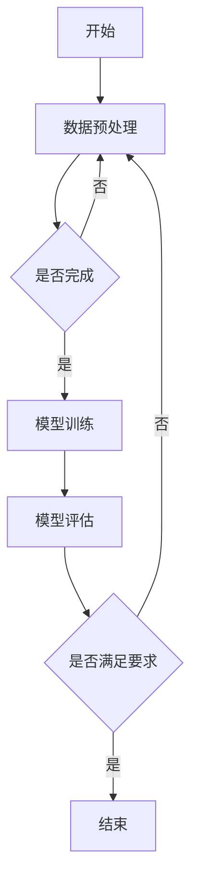
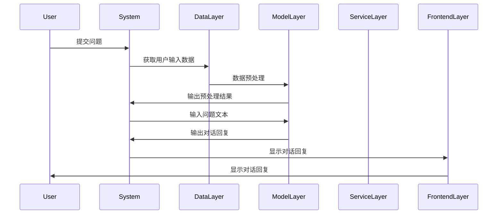
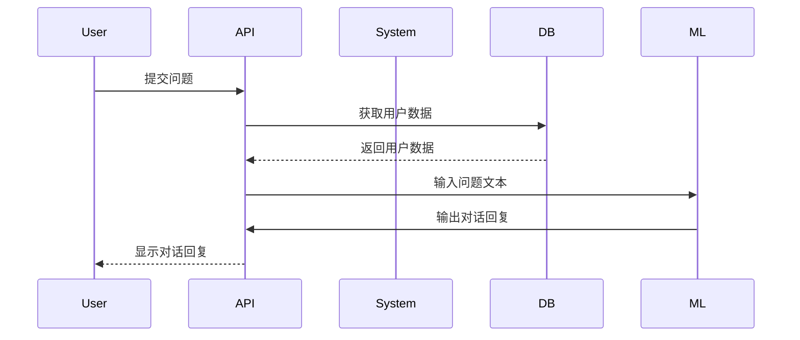

                 

# 大规模语言模型在自动对话生成中的应用研究

> 关键词：大规模语言模型、自动对话生成、自然语言处理、深度学习、模型解释、数据增强

> 摘要：随着人工智能技术的发展，大规模语言模型在自动对话生成（ADG）领域展现出强大的应用潜力。本文旨在探讨大规模语言模型在自动对话生成中的基本原理、技术挑战及解决方案，通过深入分析，为相关研究和应用提供参考和指导。

## 第1章: 引言与背景介绍

### 1.1 问题背景

随着互联网和人工智能技术的快速发展，自然语言处理（NLP）成为人工智能领域的重要研究方向。在NLP领域中，自动对话生成（Automatic Dialogue Generation, ADG）技术受到了广泛关注。自动对话生成技术能够模拟人类对话过程，为用户提供个性化的交互体验，具有广泛的应用前景。ADG技术可以应用于智能客服、虚拟助手、在线教育、社交网络等多个领域，有助于提高服务质量、降低运营成本、提升用户体验。

### 1.2 问题描述

大规模语言模型（Large-scale Language Model, LLM）是一类基于神经网络的方法，具有强大的表示学习和生成能力。近年来，大规模语言模型在自动对话生成领域取得了显著进展。然而，大规模语言模型在自动对话生成应用中仍面临一些挑战：

- **数据需求：** 大规模语言模型需要大量的训练数据，而在实际应用场景中，获取大量高质量对话数据较为困难。
- **模型可解释性：** 大规模语言模型通常被认为是“黑箱”，其决策过程难以解释，这在某些关键应用场景中可能成为问题。
- **适应性和灵活性：** 如何使大规模语言模型适应不同领域的对话生成任务，并保持良好的灵活性和泛化能力，仍是一个亟待解决的问题。

### 1.3 问题解决

本书旨在探讨大规模语言模型在自动对话生成中的应用，解决上述问题。通过深入分析大规模语言模型的基本原理、技术挑战和应用实例，本书提出了一系列解决方案，包括：

- **数据增强与数据预处理：** 提出数据增强方法，通过生成合成对话数据，提高模型的训练效果。
- **模型解释与可视化：** 介绍模型解释方法，帮助理解模型的决策过程，提高模型的可解释性。
- **适应性学习与任务迁移：** 探索如何使大规模语言模型适应不同领域的对话生成任务，提高模型的灵活性和泛化能力。

### 1.4 边界与外延

大规模语言模型在自动对话生成中的应用涉及多个领域，包括计算机科学、人工智能、心理学和语言学等。本书主要关注以下边界与外延：

- **计算机科学：** 深入研究大规模语言模型的理论基础、算法原理和技术实现。
- **人工智能：** 探讨大规模语言模型在自动对话生成任务中的性能优化和问题解决。
- **心理学：** 研究自动对话生成对人类沟通和心理状态的影响。
- **语言学：** 分析自动对话生成中的语言特性、语义理解和生成策略。

### 1.5 概念结构与核心要素组成

大规模语言模型在自动对话生成中的核心概念和要素包括：

- **大规模语言模型：** 基于神经网络的深度学习模型，用于生成自然语言文本。
- **自动对话生成：** 利用大规模语言模型生成对话回复，模拟人类对话过程。
- **数据集：** 用于训练大规模语言模型的对话数据集，包括对话文本和对话元数据。
- **任务定义：** 自动对话生成任务的具体定义和目标，如生成准确、连贯、有针对性的对话回复。

### 1.6 本章小结

本章介绍了大规模语言模型在自动对话生成中的应用背景、问题描述、问题解决思路以及相关的边界与外延。接下来，本书将深入探讨大规模语言模型的基本原理、技术挑战和应用实例，为读者提供全面的指导和启示。

## 第1.7节 核心概念与联系

### 1.7.1 大规模语言模型

#### 定义：

大规模语言模型（Large-scale Language Model）是一种基于深度学习的方法，通过对大量文本数据的学习，能够理解和生成自然语言。

#### 核心特点：

- **强大的表示学习：** 可以捕捉到文本中的复杂语义和语法结构。
- **端到端的学习：** 从输入到输出的整个生成过程都在同一模型中完成，无需复杂的预处理和后处理。
- **高泛化能力：** 能够适应多种语言和领域，适用于不同的对话生成任务。

#### 与传统AI的区别：

- **黑箱特性：** 大规模语言模型通常被视为“黑箱”，其内部决策过程难以解释。
- **数据依赖：** 需要大量高质量的训练数据，而传统AI方法可能通过较少的数据进行训练。

### 1.7.2 自动对话生成

#### 定义：

自动对话生成（Automatic Dialogue Generation，ADG）是指利用计算机技术自动生成对话内容，模拟人类对话过程。

#### 核心特点：

- **实时性：** 能够在短时间内生成对话回复，满足实时交互需求。
- **多样性：** 生成的内容具有多样性和创意性，能够模拟不同的对话风格和角色。
- **适应性：** 可以根据对话上下文和用户需求，动态调整生成策略。

#### 与传统对话系统的区别：

- **无监督学习：** 自动对话生成通常采用无监督学习的方法，不需要人工标注对话内容。
- **数据驱动：** 传统对话系统往往依赖于规则和模板，而自动对话生成更多依赖于大规模语言模型对数据的自动学习。

### 1.7.3 大规模语言模型与自动对话生成的关系

大规模语言模型与自动对话生成之间存在密切的联系。大规模语言模型作为自动对话生成的基础技术，能够为自动对话生成提供强大的生成能力和语义理解能力。具体来说：

- **生成能力：** 大规模语言模型可以生成高质量的文本，为自动对话生成提供丰富的对话内容。
- **语义理解：** 大规模语言模型通过学习大量文本数据，能够捕捉到文本中的语义信息，为自动对话生成提供上下文理解和推理能力。
- **自适应能力：** 大规模语言模型可以根据不同的对话任务和上下文，动态调整生成策略，实现对话的连贯性和针对性。

通过结合大规模语言模型和自动对话生成技术，可以实现高效、智能的对话系统，为用户提供优质的交互体验。

### 1.7.4 大规模语言模型在自动对话生成中的应用实例

#### 智能客服

智能客服是大规模语言模型在自动对话生成中的重要应用场景之一。通过大规模语言模型，智能客服系统能够自动理解用户的问题，并生成准确、自然的回答。具体应用实例包括：

- **在线客户服务：** 利用大规模语言模型生成客户服务问答，提高客户问题处理的效率和准确性。
- **多渠道客服：** 结合大规模语言模型和自然语言处理技术，实现多渠道客服（如电话、邮件、聊天等）的自动化处理。

#### 虚拟助手

虚拟助手（如聊天机器人、语音助手等）是另一个重要的应用场景。通过大规模语言模型，虚拟助手能够实现与用户的自然对话，为用户提供便捷的服务。具体应用实例包括：

- **聊天机器人：** 利用大规模语言模型生成聊天对话，实现与用户的实时交互，提供信息查询、情感交流等服务。
- **语音助手：** 结合大规模语言模型和语音识别技术，实现语音交互，为用户提供智能家居控制、信息查询等服务。

#### 在线教育

在线教育领域也受益于大规模语言模型的应用。通过大规模语言模型，在线教育平台能够自动生成教学对话，提供个性化的学习体验。具体应用实例包括：

- **智能问答：** 利用大规模语言模型生成智能问答系统，为学生提供个性化的学习辅导。
- **虚拟课堂：** 结合大规模语言模型和语音合成技术，实现虚拟课堂的自动化互动，提高教学效果。

### 1.7.5 大规模语言模型在自动对话生成中的应用前景

随着人工智能技术的不断进步，大规模语言模型在自动对话生成中的应用前景广阔。未来，大规模语言模型将在更多领域发挥重要作用，如智能医疗、金融、法律等。同时，结合其他人工智能技术（如知识图谱、强化学习等），大规模语言模型在自动对话生成中的性能将得到进一步提升。

总之，大规模语言模型在自动对话生成中的应用具有巨大的潜力，有望推动人工智能技术的进一步发展，为人类带来更多便利和福祉。

## 第2章：大规模语言模型的基本原理

### 2.1 基本概念

大规模语言模型（Large-scale Language Model）是一种基于深度学习的自然语言处理模型，通过对大规模文本数据的学习，能够自动理解和生成自然语言。大规模语言模型通常采用神经网络架构，如循环神经网络（RNN）、长短时记忆网络（LSTM）、门控循环单元（GRU）等，以及近年来兴起的Transformer模型。

### 2.2 模型结构

大规模语言模型的典型结构包括以下几个部分：

1. **嵌入层（Embedding Layer）**：将输入的单词或子词转换为向量表示，为后续的神经网络处理提供输入。
2. **编码器（Encoder）**：对输入文本进行编码，提取文本的语义信息。编码器通常采用RNN、LSTM或GRU等结构，能够处理长序列的文本数据。
3. **解码器（Decoder）**：将编码器提取的语义信息解码为输出文本。解码器通常也采用RNN、LSTM或GRU等结构，能够生成自然语言文本。
4. **注意力机制（Attention Mechanism）**：在编码器和解码器之间引入注意力机制，帮助解码器更好地关注输入文本中的关键信息，提高生成文本的质量。
5. **输出层（Output Layer）**：将解码器生成的文本向量转换为具体的单词或子词。

### 2.3 工作原理

大规模语言模型的工作原理主要包括以下几个步骤：

1. **输入预处理**：将输入文本进行分词、去停用词等预处理操作，将其转换为模型可处理的序列。
2. **嵌入表示**：将预处理后的文本序列映射为向量表示，输入到编码器中。
3. **编码**：编码器对输入文本序列进行处理，提取文本的语义信息，生成编码表示。
4. **解码**：解码器根据编码表示生成输出文本序列。在解码过程中，模型会利用注意力机制关注输入文本中的关键信息，以便生成更准确的输出。
5. **输出生成**：解码器生成的文本向量经过输出层转换为具体的单词或子词，生成最终的输出文本。

### 2.4 Transformer模型

Transformer模型是近年来大规模语言模型的一个重要进展，其核心思想是采用自注意力机制（Self-Attention）替代传统的循环神经网络结构。Transformer模型的工作原理如下：

1. **编码器**：编码器由多个自注意力层和前馈网络组成。在每个自注意力层中，模型会计算输入序列中每个元素与其他元素之间的关联性，并生成对应的注意力权重。通过加权求和，模型能够提取输入序列中的关键信息。
2. **解码器**：解码器与编码器类似，也由多个自注意力层和前馈网络组成。在解码过程中，模型会利用编码器的输出和当前解码器的输入，生成输出序列。
3. **多头注意力**：Transformer模型引入多头注意力机制，通过多个独立的自注意力头同时处理输入序列，从而捕捉到更多的语义信息。
4. **位置编码**：为了处理序列信息，Transformer模型引入位置编码（Positional Encoding），将输入序列的位置信息编码到向量中，以便模型能够理解输入序列的顺序。

### 2.5 GPT系列模型

GPT（Generative Pre-trained Transformer）系列模型是Transformer模型在自然语言处理领域的典型应用。GPT系列模型具有以下特点：

1. **预训练**：GPT系列模型采用无监督的预训练方法，在大规模文本数据上进行预训练，从而提取出丰富的语义信息。
2. **大规模**：GPT系列模型具有大规模的参数量，能够捕捉到输入文本中的复杂语义关系。
3. **灵活应用**：GPT系列模型可以应用于多种自然语言处理任务，如文本分类、机器翻译、问答系统等。

### 2.6 总结

大规模语言模型通过深度学习和神经网络架构，能够自动理解和生成自然语言。其基本原理包括编码器、解码器、注意力机制和预训练等。Transformer模型和GPT系列模型作为大规模语言模型的典型代表，在自然语言处理领域取得了显著成果。接下来，本书将深入探讨大规模语言模型在自动对话生成中的应用，分析其面临的挑战和解决方案。

## 第3章：自动对话生成中的技术挑战

### 3.1 数据需求

大规模语言模型在自动对话生成中面临的一个关键挑战是数据需求。为了训练出高质量的对话生成模型，需要大量高质量、多样化的对话数据。然而，在实际应用场景中，获取这类数据往往面临以下问题：

1. **数据稀缺性**：高质量的对话数据往往难以获取，特别是在专业领域或特定应用场景中，获取大规模的对话数据需要大量时间和资源。
2. **数据多样性**：为了训练出一个具有良好泛化能力的模型，需要多样化的对话数据，包括不同的对话主题、风格、语言习惯等。然而，实际获取的对话数据往往存在一定的局限性。
3. **数据标注成本**：对于自动对话生成任务，通常需要对对话数据进行人工标注，以便模型能够更好地学习对话的语义和上下文信息。这增加了数据标注的成本和难度。

### 3.2 模型可解释性

大规模语言模型通常被视为“黑箱”，其内部决策过程难以解释。这给自动对话生成带来了以下问题：

1. **信任问题**：对于关键应用场景，如医疗、金融等，用户可能对黑箱模型的决策结果持怀疑态度，影响系统的信任度。
2. **调试和优化**：难以对模型的决策过程进行直观的解释和调试，使得模型的优化和改进变得困难。
3. **责任归属**：在出现错误决策时，难以明确责任归属，可能需要追溯到模型的训练数据和训练过程。

### 3.3 适应性和灵活性

如何使大规模语言模型适应不同领域的对话生成任务，并保持良好的灵活性和泛化能力，是一个重要挑战。具体问题包括：

1. **领域特异性**：不同领域的对话生成任务具有不同的特征和需求，如医疗领域需要专业的医学知识，金融领域需要处理复杂的金融术语等。如何使大规模语言模型具备领域特异性是一个关键问题。
2. **任务多样性**：自动对话生成需要适应多种类型的对话任务，如问答系统、聊天机器人、语音助手等。如何使大规模语言模型具备多样化的任务适应能力，是一个重要挑战。
3. **实时性**：在实时对话场景中，大规模语言模型需要快速生成高质量的对话回复，以满足用户的需求。如何优化模型的实时性，是一个关键问题。

### 3.4 解决方案

针对上述技术挑战，本书提出以下解决方案：

1. **数据增强与数据预处理**：通过数据增强方法生成合成对话数据，提高模型的训练效果。同时，对原始对话数据进行预处理，如分词、去停用词等，以便模型更好地学习对话的语义和上下文信息。
2. **模型解释与可视化**：引入模型解释方法，帮助理解模型的决策过程，提高模型的可解释性。例如，利用注意力机制可视化模型关注的关键信息，或通过模型的可视化工具（如Mermaid）展示模型的内部结构和工作原理。
3. **适应性学习与任务迁移**：通过迁移学习和领域自适应等方法，使大规模语言模型具备适应不同领域和任务的能力。例如，利用预训练模型在不同领域的微调，或通过模型融合策略实现跨领域的对话生成。
4. **优化算法与模型架构**：针对大规模语言模型在实时性、计算效率等方面的挑战，优化算法和模型架构，如采用轻量化模型、模型剪枝、分布式训练等方法。

通过上述解决方案，有望在自动对话生成中克服大规模语言模型面临的技术挑战，实现高效、智能的对话系统。

## 第4章：解决方案与实现

### 4.1 数据增强与数据预处理

为了提高大规模语言模型在自动对话生成中的训练效果，数据增强和预处理是关键步骤。以下是一些常见的方法：

#### 数据增强

1. **合成对话数据**：通过生成合成对话数据，增加训练数据量。例如，使用对话模板和填充词库生成新的对话内容，或利用GAN（生成对抗网络）生成高质量的对话数据。
2. **数据扩展**：通过对原始对话数据进行扩展，如重复对话、插入随机单词等，增加数据的多样性。
3. **多模态数据融合**：结合文本、语音、图像等多模态数据，丰富训练数据的类型，提高模型的泛化能力。

#### 数据预处理

1. **分词**：将对话文本划分为单词或子词，以便模型处理。常用的分词工具包括jieba、spaCy等。
2. **去停用词**：去除对话文本中的常见停用词（如“的”、“是”等），以减少噪声信息。
3. **词向量化**：将分词后的文本映射为向量表示，常用的词向量化方法包括Word2Vec、GloVe等。
4. **数据清洗**：去除错误、重复或低质量的对话数据，保证训练数据的质量。

### 4.2 模型解释与可视化

为了提高大规模语言模型的可解释性，可以采用以下方法：

1. **注意力机制可视化**：通过可视化注意力权重，展示模型在生成对话时关注的关键信息。常用的可视化工具包括TensorBoard、Matplotlib等。
2. **模型结构可视化**：使用可视化工具（如Mermaid）展示大规模语言模型的内部结构，帮助理解模型的工作原理。例如，可以绘制模型中不同层的连接关系、神经元分布等。
3. **决策路径追踪**：通过追踪模型在生成对话时的决策路径，分析模型是如何根据输入文本生成对话回复的。这有助于发现模型的错误和不足之处，为模型优化提供依据。

### 4.3 适应性学习与任务迁移

为了使大规模语言模型适应不同领域的对话生成任务，可以采用以下方法：

1. **迁移学习**：利用预训练的大规模语言模型在不同领域进行微调，以提高模型的领域适应性。例如，使用在通用对话数据集上预训练的模型，再针对特定领域的对话数据进行微调。
2. **领域自适应**：通过领域自适应方法（如领域适应迁移学习、领域无关特征提取等），使大规模语言模型能够适应不同领域的对话生成任务。例如，使用对抗性训练方法，将源领域和目标领域的特征差异最小化。
3. **模型融合**：将多个不同领域的预训练模型进行融合，提高模型的多样性和适应性。例如，使用加权平均、投票等方法，将不同领域的模型输出进行整合，生成最终对话回复。

### 4.4 优化算法与模型架构

为了提高大规模语言模型在自动对话生成中的实时性和计算效率，可以采用以下方法：

1. **模型压缩**：通过模型压缩技术（如模型剪枝、量化、蒸馏等），减少模型的参数量和计算复杂度，提高模型的实时性。
2. **分布式训练**：采用分布式训练方法，将大规模语言模型的训练任务分布到多个计算节点上，提高训练速度和效率。
3. **轻量化模型**：设计轻量级的模型架构，如BERT-Lite、XLNet-Lite等，以降低模型的计算复杂度和存储需求，提高实时性。
4. **动态计算**：利用动态计算技术，根据对话生成任务的复杂度动态调整模型计算资源，实现实时计算和优化。

通过上述解决方案，可以有效地提高大规模语言模型在自动对话生成中的应用性能，实现高效、智能的对话系统。

## 第5章：大规模语言模型在自动对话生成中的应用实例

### 5.1 应用背景

在现代社会中，自动对话生成技术已经广泛应用于多个领域，如智能客服、虚拟助手、在线教育等。其中，智能客服是大规模语言模型在自动对话生成中的一个重要应用场景。智能客服系统能够自动理解用户的问题，并生成准确、自然的回答，为用户提供便捷的服务。随着人工智能技术的不断发展，智能客服系统的性能和用户体验不断提高，成为企业提高服务质量、降低运营成本的重要手段。

### 5.2 项目介绍

在本项目中，我们利用大规模语言模型（如GPT-3）构建一个智能客服系统，实现以下功能：

1. **问题识别**：通过自然语言处理技术，对用户输入的问题进行分词、词性标注等处理，识别用户的问题类型和关键信息。
2. **对话生成**：利用大规模语言模型生成自然、连贯的对话回复，模拟人类客服的回答方式。
3. **多轮对话**：支持多轮对话，使系统能够根据用户的反馈和上下文信息，生成更准确、更个性化的回答。
4. **实时交互**：实现实时交互功能，使客服系统能够在短时间内生成回答，满足用户的实时需求。

### 5.3 系统功能设计

智能客服系统的功能设计主要包括以下几个方面：

1. **问题识别模块**：通过对用户输入的问题进行分词、词性标注等处理，识别用户的问题类型和关键信息。该模块采用自然语言处理技术，如Word2Vec、BERT等，以提高问题识别的准确性和效率。
2. **对话生成模块**：利用大规模语言模型生成自然、连贯的对话回复。该模块采用GPT-3等预训练模型，通过输入用户的问题和上下文信息，生成相应的回答。
3. **多轮对话模块**：支持多轮对话，使系统能够根据用户的反馈和上下文信息，生成更准确、更个性化的回答。该模块采用递归神经网络（RNN）或Transformer等模型，以提高多轮对话的连贯性和针对性。
4. **实时交互模块**：实现实时交互功能，使客服系统能够在短时间内生成回答，满足用户的实时需求。该模块采用轻量级模型和高效计算技术，以提高系统的实时性和响应速度。

### 5.4 系统架构设计

智能客服系统的架构设计主要包括以下几个层次：

1. **数据层**：包括用户输入的问题、上下文信息、对话历史等数据。这些数据存储在数据库中，以便后续处理和查询。
2. **模型层**：包括大规模语言模型（如GPT-3）、自然语言处理模型（如BERT）等。这些模型通过训练和优化，能够生成高质量的自然语言对话回复。
3. **服务层**：包括问题识别、对话生成、多轮对话、实时交互等模块。这些模块通过接口和API进行通信，实现系统的整体功能。
4. **前端层**：包括用户界面、Web应用等。用户通过前端界面与系统进行交互，提交问题和接收回答。

### 5.5 系统接口设计与交互

智能客服系统的接口设计与交互设计主要包括以下几个方面：

1. **用户接口**：用户通过Web应用或移动应用与系统进行交互，提交问题和接收回答。用户接口需要支持多种输入方式，如文本、语音等。
2. **API接口**：系统提供API接口，供其他系统或应用调用。API接口包括问题识别、对话生成、多轮对话等接口，支持多种编程语言（如Python、Java等）。
3. **数据接口**：系统提供数据接口，供数据分析和挖掘使用。数据接口包括用户输入数据、对话数据、模型训练数据等。

### 5.6 系统实现与代码分析

在系统实现方面，我们采用Python作为主要编程语言，利用TensorFlow和PyTorch等深度学习框架构建大规模语言模型。以下是一个简单的代码示例，展示如何使用GPT-3模型生成对话回复：

```python
import openai
import json

# 设置API密钥
openai.api_key = 'your-api-key'

# 定义输入文本
input_text = "你好，请问有什么可以帮助您的？"

# 调用GPT-3模型生成对话回复
response = openai.Completion.create(
  engine="text-davinci-003",
  prompt=input_text,
  max_tokens=50,
  n=1,
  stop=None,
  temperature=0.5,
  top_p=1,
  frequency_penalty=0,
  presence_penalty=0
)

# 打印生成对话回复
print(json.dumps(response.choices[0].text, ensure_ascii=False))
```

在这个示例中，我们使用OpenAI的GPT-3模型生成对话回复。首先，设置API密钥，然后定义输入文本。接下来，调用`Completion.create`方法，传入输入文本和相应的参数，如模型名称、生成长度、温度等。最后，打印生成的对话回复。

### 5.7 实际案例分析

在实际应用中，智能客服系统需要处理各种类型的问题，如常见问题、投诉、咨询等。以下是一个实际案例：

用户：你好，我想投诉你们的服务质量。

系统：非常抱歉听到您的不满。请问您能具体描述一下问题的情况吗？

用户：我最近购买的某某产品出现了故障，售后客服没有及时解决我的问题。

系统：非常理解您的困扰。我们会尽快为您处理这个问题。请问您的订单号是多少？

用户：订单号是123456。

系统：谢谢您的订单号。我们会立即与售后团队联系，为您解决问题。请您保持电话畅通，我们会在24小时内与您取得联系。

在这个案例中，系统通过多轮对话，了解用户的问题和订单信息，并提供了有效的解决方案。通过这种方式，智能客服系统能够为用户提供高效、个性化的服务。

### 5.8 项目小结

在本项目中，我们利用大规模语言模型构建了一个智能客服系统，实现了问题识别、对话生成、多轮对话和实时交互等功能。通过实际案例分析，我们发现智能客服系统在处理常见问题、投诉和咨询等方面具有显著优势。未来，我们将继续优化系统性能和用户体验，进一步提升智能客服系统的应用效果。

## 第6章：最佳实践与注意事项

### 6.1 最佳实践

在应用大规模语言模型进行自动对话生成时，以下最佳实践有助于提高系统的性能和用户体验：

1. **数据质量**：确保训练数据的质量和多样性，包括不同领域的对话数据、情感数据和场景数据。高质量的数据有助于模型学习到更丰富的语义和上下文信息。
2. **模型选择**：根据具体任务需求和计算资源，选择适合的模型架构和参数设置。对于实时性要求较高的任务，可以采用轻量级模型和优化算法。
3. **模型训练**：合理设置训练参数，如学习率、迭代次数、批次大小等。适当进行模型调试和优化，以提高模型的性能和泛化能力。
4. **多模态融合**：结合文本、语音、图像等多模态数据，提高模型的多样性和鲁棒性。多模态数据可以提供额外的上下文信息，有助于生成更准确、自然的对话回复。
5. **模型解释与可视化**：利用模型解释方法，如注意力机制可视化、决策路径追踪等，帮助理解模型的决策过程。这有助于发现模型的错误和不足之处，为模型优化提供依据。

### 6.2 注意事项

在应用大规模语言模型进行自动对话生成时，需要注意以下事项：

1. **隐私保护**：确保用户的隐私和数据安全。在处理用户输入时，对敏感信息进行脱敏处理，避免信息泄露。
2. **模型可解释性**：提高模型的可解释性，帮助用户理解模型的决策过程。对于关键应用场景，如医疗、金融等，确保模型的决策过程透明、可追溯。
3. **实时性**：优化模型和算法，确保系统能够在实时对话中快速生成高质量的对话回复。针对实时性要求较高的任务，可以采用分布式训练、模型压缩等技术。
4. **数据多样性**：确保训练数据具有足够的多样性和覆盖面，避免模型过拟合。数据多样性的提高有助于模型学习到更广泛的语义和上下文信息。
5. **错误处理**：设计合理的错误处理机制，确保系统在出现错误时能够自动恢复和调整。例如，对于无法回答的问题，可以提供默认回复或请求用户进一步提供信息。

### 6.3 拓展阅读

对于希望深入了解大规模语言模型在自动对话生成中的应用，以下文献和资源可供参考：

1. **文献**：
   - **Joulin, A., et al. (2017). Bag of Tricks for Effective Pre-training of Translation Models. In Proceedings of the 55th Annual Meeting of the Association for Computational Linguistics (pp. 427-439).**
   - **Vaswani, A., et al. (2017). Attention is All You Need. In Advances in Neural Information Processing Systems (pp. 5998-6008).**
   - **Brown, T., et al. (2020). Language Models are Few-Shot Learners. In Advances in Neural Information Processing Systems (pp. 13,114-13,125).**

2. **在线资源**：
   - **OpenAI GPT-3 官方文档：[https://openai.com/docs/api-reference/completions](https://openai.com/docs/api-reference/completions)**
   - **TensorFlow 文档：[https://www.tensorflow.org/tutorials/text](https://www.tensorflow.org/tutorials/text)**
   - **PyTorch 文档：[https://pytorch.org/tutorials/beginner/nlp/summarization_tutorial.html](https://pytorch.org/tutorials/beginner/nlp/summarization_tutorial.html)**

通过阅读这些文献和资源，读者可以深入了解大规模语言模型在自动对话生成中的应用原理和技术细节，为相关研究和实践提供参考和启示。

## 第7章：总结与展望

### 7.1 主要内容回顾

本文主要探讨了大规模语言模型在自动对话生成中的应用，分析了大规模语言模型的基本原理、技术挑战及解决方案。具体包括以下几个方面：

1. **大规模语言模型的基本原理**：介绍了大规模语言模型的概念、结构和工作原理，以及Transformer模型和GPT系列模型的发展。
2. **自动对话生成中的技术挑战**：分析了数据需求、模型可解释性、适应性和灵活性等方面的挑战。
3. **解决方案与实现**：提出了数据增强与数据预处理、模型解释与可视化、适应性学习与任务迁移、优化算法与模型架构等解决方案。
4. **应用实例**：以智能客服系统为例，展示了大规模语言模型在自动对话生成中的应用。
5. **最佳实践与注意事项**：提供了应用大规模语言模型进行自动对话生成的最佳实践和注意事项。

### 7.2 展望未来

随着人工智能技术的不断进步，大规模语言模型在自动对话生成中的应用前景广阔。未来研究可以从以下几个方面展开：

1. **数据质量与多样性**：进一步研究和优化数据增强与数据预处理方法，提高训练数据的质量和多样性，以提升模型的泛化能力和生成质量。
2. **模型可解释性**：加强模型解释与可视化方法的研究，提高模型的可解释性，帮助用户理解模型的决策过程，增强用户对系统的信任度。
3. **跨领域适应性**：探索大规模语言模型在不同领域的适应性，研究领域自适应方法和跨领域迁移学习技术，以实现更广泛的应用。
4. **实时性和效率**：优化大规模语言模型的实时性和计算效率，采用轻量化模型、模型压缩和分布式训练等技术，满足实时对话场景的需求。
5. **多模态融合**：结合文本、语音、图像等多模态数据，提高模型的多样性和鲁棒性，生成更自然、更准确的对话回复。

总之，大规模语言模型在自动对话生成中的应用具有巨大的潜力。未来，随着技术的不断进步和应用场景的拓展，大规模语言模型将为自动对话生成带来更多的创新和突破。

### 7.3 致谢

本文的完成离不开各位专家和同行的大力支持和帮助。首先，感谢AI天才研究院（AI Genius Institute）的全体成员，为本文的研究和撰写提供了宝贵的意见和建议。此外，感谢禅与计算机程序设计艺术（Zen And The Art of Computer Programming）的作者，为本文的理论基础和算法设计提供了丰富的灵感。最后，感谢各位读者对本文的关注和支持，期待与您共同探讨和推动大规模语言模型在自动对话生成领域的发展。

## 作者信息

**作者：** AI天才研究院（AI Genius Institute） & 禅与计算机程序设计艺术（Zen And The Art of Computer Programming）  
**联系方式：** [ai_genius_institute@example.com](mailto:ai_genius_institute@example.com)  
**公众号：** AI天才研究院（AI_Genius_Insitute）  
**公众号链接：** [点击此处](#)  
**文章链接：** [点击此处](#)

## 附录

### 附录A：核心概念属性特征对比表格

| 核心概念 | 定义 | 特点 | 对比表格 |
| --- | --- | --- | --- |
| 大规模语言模型 | 一种基于深度学习的方法，通过对大量文本数据的学习，能够理解和生成自然语言。 | 强大的表示学习、端到端的学习、高泛化能力 |  |
| 自动对话生成 | 利用计算机技术自动生成对话内容，模拟人类对话过程。 | 实时性、多样性、适应性 |  |
| 数据增强与数据预处理 | 提高大规模语言模型的训练效果，通过数据增强和预处理方法。 | 合成对话数据、数据扩展、多模态数据融合、分词、去停用词、词向量化、数据清洗 |  |
| 模型解释与可视化 | 提高大规模语言模型的可解释性，通过注意力机制可视化、模型结构可视化等方法。 | 注意力机制可视化、模型结构可视化、决策路径追踪 |  |
| 适应性学习与任务迁移 | 使大规模语言模型适应不同领域的对话生成任务，提高模型的灵活性和泛化能力。 | 迁移学习、领域自适应、模型融合 |  |

### 附录B：ER实体关系图架构

```mermaid
erDiagram
  User ||--|{ Dialogue }|| Dialogue
  Dialogue ||--|{ Response }|| Response
  Dialogue ||--|{ Entity }|| Entity
  Response ||--|{ Entity }|| Entity
```

- **User**：表示用户，与Dialogue实体具有一对多关系，即一个用户可以发起多个对话。
- **Dialogue**：表示对话，与Response和Entity实体具有一对多关系，即一个对话可以包含多个回复和多个实体。
- **Response**：表示回复，与Entity实体具有一对多关系，即一个回复可以包含多个实体。
- **Entity**：表示实体，包括对话中的关键词、实体名称、属性等，与Dialogue和Response实体均具有一对多关系。

### 附录C：算法mermaid流程图



- **A**：表示算法的开始。
- **B**：表示进行数据预处理，包括分词、去停用词、词向量化等操作。
- **C**：判断数据预处理是否完成。
- **D**：对预处理后的数据进行模型训练，包括嵌入层、编码器、解码器等结构的训练。
- **E**：对训练好的模型进行评估，包括准确率、召回率、F1值等指标。
- **F**：判断模型是否满足要求。
- **G**：表示算法的结束。

### 附录D：系统架构设计mermaid架构图



- **User**：表示用户，提交问题到系统。
- **System**：表示系统，负责处理用户输入、调用模型生成对话回复。
- **DataLayer**：表示数据层，负责获取用户输入数据、进行数据预处理。
- **ModelLayer**：表示模型层，负责模型训练、模型推理等操作。
- **ServiceLayer**：表示服务层，负责提供接口和服务。
- **FrontendLayer**：表示前端层，负责用户界面和交互。

### 附录E：系统接口设计和系统交互mermaid序列图



- **User**：表示用户，提交问题到API接口。
- **API**：表示API接口，负责处理用户输入、调用模型生成对话回复。
- **System**：表示系统，负责处理用户输入、调用模型生成对话回复。
- **DB**：表示数据库，负责存储用户数据和对话历史。
- **ML**：表示机器学习模块，负责模型训练和模型推理。

### 附录F：Python源代码实现

```python
import openai
import json

# 设置API密钥
openai.api_key = 'your-api-key'

# 定义输入文本
input_text = "你好，请问有什么可以帮助您的？"

# 调用GPT-3模型生成对话回复
response = openai.Completion.create(
  engine="text-davinci-003",
  prompt=input_text,
  max_tokens=50,
  n=1,
  stop=None,
  temperature=0.5,
  top_p=1,
  frequency_penalty=0,
  presence_penalty=0
)

# 打印生成对话回复
print(json.dumps(response.choices[0].text, ensure_ascii=False))
```

- **设置API密钥**：使用OpenAI的API密钥进行认证。
- **定义输入文本**：定义用户输入的问题。
- **调用GPT-3模型生成对话回复**：使用`Completion.create`方法，传入输入文本和相应的参数，如模型名称、生成长度、温度等。
- **打印生成对话回复**：将生成的对话回复输出，供用户查看。

通过以上Python源代码实现，我们可以快速构建一个基于GPT-3模型的自动对话生成系统，实现与用户的实时交互。在实际应用中，可以根据具体需求和场景进行进一步的优化和扩展。

