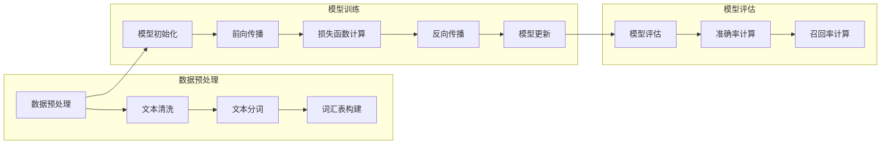
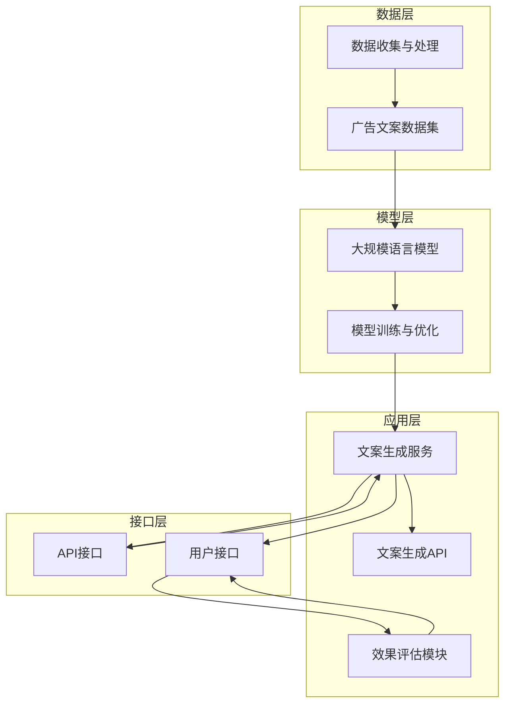
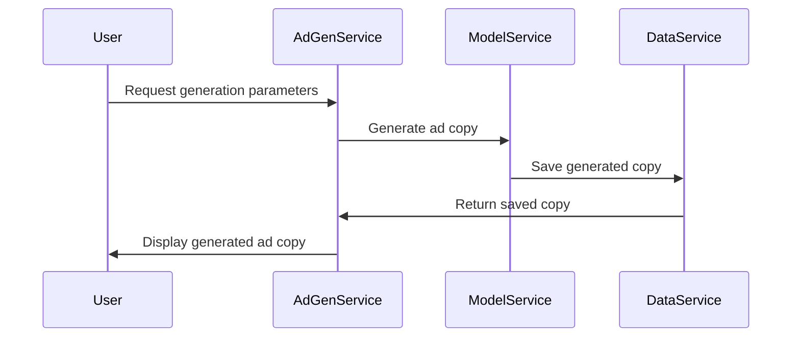

                 

### 文章标题

### 关键词

- 大规模语言模型
- 自动广告文案创作
- 算法原理
- 系统架构设计
- 项目实战

### 摘要

本文旨在探讨大规模语言模型在自动广告文案创作中的应用与突破。首先，我们将介绍大规模语言模型的基本概念和背景，分析其优势与局限性。接着，通过详细的算法原理讲解，深入探讨大规模语言模型的训练过程及其数学基础。随后，我们将系统分析大规模语言模型在广告文案创作中的应用，展示具体的系统架构设计。最后，通过项目实战，结合实际案例，验证大规模语言模型在广告文案创作中的实际效果。本文将帮助读者全面了解大规模语言模型在自动广告文案创作中的潜力与应用。

### 目录大纲

#### 第一部分：背景介绍

**第1章：大规模语言模型概述**
- **1.1 问题背景**
  - 广告文案创作的挑战
  - 大规模语言模型的发展与应用
- **1.2 问题描述**
  - 自动广告文案创作需求
  - 语言模型的优势与局限性
- **1.3 问题解决**
  - 大规模语言模型在广告文案创作中的应用
  - 模型优化策略与效果评估
- **1.4 边界与外延**
  - 适用的广告类型与场景
  - 非适用场景与替代方案
- **1.5 概念结构与核心要素组成**
  - 大规模语言模型的结构
  - 广告文案创作的要素

**第2章：大规模语言模型原理**
- **2.1 核心概念原理**
  - 语言模型的基本概念
  - 大规模语言模型的原理
- **2.2 概念属性特征对比表格**
  - 传统语言模型与大规模语言模型对比
- **2.3 ER实体关系图架构**
  - 语言模型中的实体关系图

**第3章：大规模语言模型算法**
- **3.1 算法mermaid流程图**
  - 语言模型训练流程
- **3.2 Python源代码**
  - 语言模型训练代码
- **3.3 数学模型与公式**
  - 语言模型的数学原理
  - 示例公式讲解：$$p(w|s) = \frac{P(s|w)P(w)}{P(s)}$$
- **3.4 详细讲解与举例说明**
  - 语言模型的工作机制
  - 举例说明语言模型的实际应用

**第二部分：核心概念与联系**

**第4章：大规模语言模型在广告文案创作中的应用**
- **4.1 问题场景介绍**
  - 广告文案创作的实际需求
- **4.2 项目介绍**
  - 项目背景与目标
- **4.3 系统功能设计**
  - 领域模型mermaid类图
- **4.4 系统架构设计**
  - mermaid架构图
- **4.5 系统接口设计**
  - 接口设计与实现
- **4.6 系统交互mermaid序列图**
  - 交互流程与序列图

**第5章：大规模语言模型在广告文案创作中的实战**
- **5.1 环境安装**
  - 语言模型环境的搭建
- **5.2 系统核心实现源代码**
  - 语言模型训练与优化的代码实现
- **5.3 代码应用解读与分析**
  - 实际代码应用的解读与分析
- **5.4 实际案例分析与详细讲解**
  - 广告文案创作案例解析
- **5.5 项目小结**
  - 项目总结与经验分享

**第6章：大规模语言模型在广告文案创作中的最佳实践**
- **6.1 最佳实践 tips**
  - 实际应用中的技巧与建议
- **6.2 小结**
  - 主要内容回顾与总结
- **6.3 注意事项**
  - 注意事项与风险提示
- **6.4 拓展阅读**
  - 相关文献与资料推荐

### 第一部分：背景介绍

#### 1.1 问题背景

广告文案创作一直是市场营销中不可或缺的一环。然而，传统的广告文案创作存在许多挑战，如内容创意的局限性、人力成本高、响应速度慢等。随着互联网的快速发展，广告文案的创作需求越来越大，这对广告行业提出了更高的要求。因此，寻找一种高效、智能的自动广告文案创作方法变得尤为迫切。

在此背景下，大规模语言模型（Large-scale Language Model）作为一种新兴的人工智能技术，逐渐引起了广泛关注。大规模语言模型通过学习海量文本数据，能够自动生成高质量的文本内容，包括广告文案。这一技术的出现，为广告文案创作带来了新的可能性。

#### 1.2 问题描述

自动广告文案创作需求主要集中在以下几个方面：

1. **内容生成效率**：广告文案需要快速响应市场变化，以保持竞争优势。大规模语言模型能够快速生成广告文案，大大提高创作效率。

2. **创意多样性**：广告文案需要具备独特的创意，以吸引目标受众。大规模语言模型通过学习丰富的文本数据，能够生成多样化、新颖的广告文案。

3. **个性化推荐**：不同用户群体对广告文案的需求存在差异。大规模语言模型能够根据用户行为数据，生成个性化广告文案，提高广告投放效果。

4. **语言风格多样性**：广告文案需要具备不同的语言风格，以满足不同广告类型和目标受众。大规模语言模型能够根据不同需求，生成符合特定语言风格的文章。

然而，大规模语言模型在自动广告文案创作中也存在一定的局限性。首先，模型对训练数据的质量和规模有较高要求，数据不足或质量不高可能导致生成文案的质量下降。其次，模型生成文案的逻辑性和连贯性仍需提升，以避免生成不符合实际需求的广告文案。此外，大规模语言模型在理解复杂语义和语境方面存在挑战，这可能导致生成文案的语义不准确。

#### 1.3 问题解决

针对上述问题，我们可以从以下几个方面来解决：

1. **提高数据质量与规模**：通过收集更多高质量的文本数据，丰富大规模语言模型的训练数据集。同时，可以采用数据清洗和预处理技术，提高数据的质量。

2. **优化模型架构与算法**：研究并优化大规模语言模型的架构和算法，提高模型的生成效率和准确性。例如，可以使用预训练加微调（Pre-training + Fine-tuning）的方法，在特定广告文案任务上进行微调，提高模型在特定领域的表现。

3. **加强逻辑性和连贯性**：通过引入外部知识和语义理解技术，提高大规模语言模型生成文案的逻辑性和连贯性。例如，可以使用知识图谱（Knowledge Graph）和语义角色标注（Semantic Role Labeling）等技术，帮助模型更好地理解语义和语境。

4. **个性化推荐与风格控制**：利用用户行为数据和广告投放策略，实现个性化推荐和风格控制。例如，可以通过用户画像和广告标签，生成符合目标用户需求的广告文案，并采用风格迁移（Style Transfer）技术，实现不同语言风格的广告文案创作。

#### 1.4 边界与外延

大规模语言模型在自动广告文案创作中的应用具有广泛的前景，但也存在一定的边界和限制。以下是一些适用的广告类型和场景，以及非适用场景与替代方案：

1. **适用的广告类型与场景**：
   - 社交媒体广告：大规模语言模型能够根据用户行为和兴趣，生成个性化、高质量的社交媒体广告。
   - 搜索引擎广告：通过理解用户搜索意图，生成相关性强、吸引点击的广告文案。
   - 广告创意测试：利用大规模语言模型快速生成多种创意文案，进行广告效果测试和优化。

2. **非适用场景与替代方案**：
   - 需要高度专业知识的广告文案：对于某些需要高度专业知识或领域知识的广告文案，如医疗、金融等，大规模语言模型可能难以生成高质量的内容。此时，可以采用专业的人工撰写或领域知识图谱辅助生成。
   - 需要高度创意和个性化的广告文案：对于创意要求极高、需要个性化定制的内容，如高端定制营销等，大规模语言模型可能无法完全满足需求。此时，可以采用创意策划团队和人工智能相结合的方式，实现创意文案的生成。

#### 1.5 概念结构与核心要素组成

大规模语言模型的结构主要包括以下几个核心要素：

1. **输入层**：接收文本数据作为输入，包括单词、句子或段落等。
2. **编码器**：对输入文本进行编码，提取文本的特征信息。
3. **解码器**：根据编码器的输出，生成文本序列，即生成文案。
4. **优化器**：用于调整模型参数，优化模型性能。
5. **训练数据集**：用于训练模型的文本数据集，包括多种类型的文本，如新闻、博客、社交媒体等。

广告文案创作的要素主要包括：

1. **目标受众**：确定广告文案的目标受众，了解其需求和兴趣。
2. **广告主题**：明确广告文案的主题和核心信息。
3. **文案风格**：根据广告类型和目标受众，确定文案的语言风格。
4. **文案结构**：包括标题、正文、呼吁行动等部分，确保文案逻辑清晰、易于理解。
5. **效果评估**：通过数据分析和用户反馈，评估广告文案的效果，进行持续优化。

### 第二部分：核心概念与联系

#### 2.1 核心概念原理

**1. 语言模型的基本概念**

语言模型（Language Model，LM）是自然语言处理（Natural Language Processing，NLP）中的一个基本模型，用于预测文本中下一个词的概率。在NLP中，语言模型的应用非常广泛，包括机器翻译、文本生成、问答系统等。

**2. 大规模语言模型的原理**

大规模语言模型（Large-scale Language Model）是在传统语言模型的基础上，通过学习海量文本数据，提高模型的表达能力和生成质量。大规模语言模型通常采用深度神经网络（Deep Neural Network，DNN）或变换器模型（Transformer）等复杂架构，通过自回归（Autoregressive）或自编码（Autoregressive）的方式生成文本。

**3. 语言模型的优势与局限性**

**优势**：
- **生成能力强**：大规模语言模型能够生成高质量、多样化、富有创意的文本内容。
- **适应性高**：通过预训练和微调，大规模语言模型可以在不同领域和应用场景中灵活调整。

**局限性**：
- **数据依赖性高**：模型对训练数据的质量和规模有较高要求，数据不足或质量不高可能导致生成文本的质量下降。
- **计算资源需求大**：大规模语言模型的训练和推理需要大量计算资源，对硬件要求较高。

#### 2.2 概念属性特征对比表格

| 特征 | 传统语言模型 | 大规模语言模型 |
| --- | --- | --- |
| **模型架构** | 基于统计的模型，如n-gram模型 | 基于深度神经网络的模型，如DNN、Transformer |
| **训练数据规模** | 较小数据集，如数百万词 | 海量数据集，如数十亿词 |
| **生成质量** | 生成的文本质量较低，连贯性较差 | 生成的文本质量较高，连贯性较好 |
| **应用场景** | 有限的应用场景，如文本分类、信息检索 | 广泛的应用场景，如文本生成、问答系统、机器翻译 |

#### 2.3 ER实体关系图架构

**ER实体关系图**是一种用于表示实体及其之间关系的图形化工具。在语言模型中，ER实体关系图可以用于表示文本中的实体和它们之间的关系。

以下是一个简单的ER实体关系图示例，用于表示一篇文本中的主要实体和它们之间的关系：

```mermaid
erDiagram
  Customer ||--|{ Order } : "places"
  Product ||--|{ Order } : "includes"
```

在上面的示例中，`Customer`（客户）和`Product`（产品）是实体，它们之间通过`Order`（订单）实体建立关系。具体来说，客户可以下单（`places`），产品可以被包含在订单中（`includes`）。

在语言模型中，我们可以将ER实体关系图应用于文本生成任务，例如：

1. **对话系统**：通过识别文本中的实体和关系，生成符合逻辑和上下文的对话。
2. **文本摘要**：提取文本中的重要实体和关系，生成简洁、准确的摘要。
3. **问答系统**：根据用户提问中的实体和关系，提供准确的答案。

通过ER实体关系图，语言模型可以更好地理解和生成文本，提高模型的语义理解和生成能力。

### 第三部分：算法原理讲解

#### 3.1 算法mermaid流程图

大规模语言模型的训练过程主要包括数据预处理、模型训练和模型评估等步骤。以下是一个简单的mermaid流程图，用于描述大规模语言模型的训练流程：



在上述流程图中，数据预处理步骤包括文本清洗、文本分词和词汇表构建。模型训练步骤包括模型初始化、前向传播、损失函数计算、反向传播和模型更新。模型评估步骤用于计算模型的准确率和召回率。

#### 3.2 Python源代码

以下是一个简单的Python代码示例，用于演示大规模语言模型的训练过程。该代码使用了自然语言处理库`NLTK`和深度学习库`TensorFlow`。

```python
import nltk
import tensorflow as tf

# 数据预处理
def preprocess_text(text):
    # 清洗文本，去除标点符号、特殊字符和停用词
    tokens = nltk.word_tokenize(text)
    cleaned_tokens = [token for token in tokens if token.isalnum()]
    return cleaned_tokens

# 模型初始化
model = tf.keras.Sequential([
    tf.keras.layers.Embedding(input_dim=vocab_size, output_dim=embedding_size),
    tf.keras.layers.LSTM(units=128),
    tf.keras.layers.Dense(units=vocab_size, activation='softmax')
])

# 编译模型
model.compile(optimizer='adam', loss='categorical_crossentropy', metrics=['accuracy'])

# 训练模型
model.fit(dataset, epochs=10, batch_size=32)

# 模型评估
test_loss, test_acc = model.evaluate(test_dataset)
print(f"Test accuracy: {test_acc:.2f}")
```

在上面的代码中，我们首先定义了数据预处理函数`preprocess_text`，用于清洗和分词文本数据。接着，我们定义了一个简单的序列模型，包括嵌入层、LSTM层和输出层。我们使用`Embedding`层将单词转换为嵌入向量，`LSTM`层用于处理序列数据，`Dense`层用于输出预测概率。

在编译模型时，我们指定了优化器、损失函数和评价指标。然后，我们使用`fit`方法训练模型，使用`evaluate`方法评估模型在测试数据集上的性能。

#### 3.3 数学模型与公式

大规模语言模型的训练过程涉及到许多数学模型和公式。以下是一个简单的示例，用于描述语言模型的训练过程。

**1. 语言模型概率计算**

假设我们有一个文本序列`S = w1, w2, ..., wn`，语言模型的目标是计算该序列的概率`P(S)`。根据朴素贝叶斯假设，我们可以将概率分解为：

$$p(w_1, w_2, ..., w_n) = p(w_1)p(w_2|w_1)p(w_3|w_1, w_2)...p(w_n|w_1, w_2, ..., w_{n-1})$$

**2. 语言模型损失函数**

在语言模型的训练过程中，我们通常使用交叉熵（Cross-Entropy）作为损失函数。假设我们有一个目标标签序列`Y`和模型预测的标签序列`Y'`，交叉熵损失函数可以表示为：

$$L = -\sum_{i=1}^{n}y_i\log(y_i')$$

其中，`y_i`是目标标签的概率，`y_i'`是模型预测的概率。

**3. 梯度下降**

在训练过程中，我们使用梯度下降（Gradient Descent）算法来更新模型参数。假设我们有一个损失函数`L`，梯度可以表示为：

$$\nabla_{\theta}L = \frac{\partial L}{\partial \theta}$$

其中，`θ`表示模型参数。

**4. 示例公式讲解**

以下是一个简单的语言模型示例公式：

$$p(w|s) = \frac{P(s|w)P(w)}{P(s)}$$

其中，`p(w|s)`表示在序列`s`下词`w`的概率，`P(s|w)`表示在词`w`下序列`s`的概率，`P(w)`表示词`w`的概率，`P(s)`表示序列`s`的概率。

这个公式表示，在给定序列`s`的情况下，词`w`的概率可以通过条件概率和边际概率计算得到。在实际应用中，我们可以使用神经网络和深度学习算法来求解这个公式。

#### 3.4 详细讲解与举例说明

**1. 语言模型的工作机制**

语言模型的核心目标是预测文本中下一个词的概率。在给定一个文本序列的情况下，语言模型可以计算出每个词出现的概率，从而生成新的文本序列。

语言模型的工作机制可以分为以下几个步骤：

- **输入编码**：将输入文本序列转换为数字编码，通常使用嵌入层（Embedding Layer）来实现。
- **预测生成**：利用神经网络（如循环神经网络RNN、变换器模型Transformer等）预测下一个词的概率分布。
- **序列生成**：根据预测概率分布，生成新的文本序列。可以通过自回归（Autoregressive）或自解码（Autoregressive）的方式实现。
- **模型优化**：通过训练数据不断优化模型参数，提高模型生成文本的质量。

**2. 举例说明语言模型的实际应用**

以下是一个简单的例子，说明如何使用大规模语言模型生成文本：

**输入文本**：人工智能是一种技术，它通过模拟人类智能来解决问题。

**输出文本**：人工智能是一种先进的技术，它在多个领域发挥着重要作用，包括自然语言处理、计算机视觉和机器学习等。

在这个例子中，语言模型通过学习大量的文本数据，能够预测下一个词的概率，从而生成符合逻辑和语义的文本。

**3. 语言模型在广告文案创作中的应用**

语言模型在广告文案创作中具有广泛的应用。以下是一些实际案例：

- **社交媒体广告**：利用语言模型生成个性化、吸引人的广告文案，提高广告投放效果。
- **广告创意测试**：通过生成多种创意文案，进行广告效果测试和优化，提高广告质量。
- **广告自动生成**：利用语言模型自动生成广告文案，提高创作效率和多样性。

通过这些案例，我们可以看到语言模型在广告文案创作中的强大潜力。

### 第四部分：系统分析与架构设计方案

#### 4.1 问题场景介绍

在现代数字营销中，广告文案的创作至关重要，它直接影响广告的吸引力和转化率。随着市场的竞争加剧，企业需要快速、高效地生成大量高质量的广告文案。传统的手动创作方式不仅耗时费力，而且难以满足大规模广告投放的需求。因此，利用人工智能技术，特别是大规模语言模型（Large-scale Language Model），自动生成广告文案成为了一种迫切的需求。

#### 4.2 项目介绍

本项目旨在开发一个基于大规模语言模型的自动广告文案生成系统。该系统将通过学习大量的广告文案数据，训练出一个能够自动生成高质量广告文案的模型。系统的主要目标包括：

1. **高效生成**：快速响应市场需求，生成大量广告文案。
2. **个性化推荐**：根据用户行为和广告类型，生成个性化广告文案。
3. **创意多样性**：生成多样化、富有创意的广告文案，提高广告吸引力。
4. **效果评估**：通过实际投放效果，评估广告文案的质量，进行持续优化。

#### 4.3 系统功能设计

系统功能设计主要包括以下几个方面：

1. **数据收集与处理**：收集大量高质量广告文案数据，并进行清洗、预处理，用于训练语言模型。
2. **模型训练与优化**：使用大规模语言模型，如GPT-3、BERT等，进行广告文案的生成训练。同时，通过微调（Fine-tuning）优化模型，使其更适应广告文案的创作需求。
3. **文案生成**：根据用户需求和广告类型，生成个性化、高质量的广告文案。
4. **效果评估**：通过实际投放广告，收集用户反馈和数据，评估广告文案的效果，并进行迭代优化。
5. **接口与集成**：提供API接口，方便与其他系统和平台集成，实现广告文案的自动生成和投放。

#### 4.4 系统架构设计

系统架构设计是确保广告文案生成系统高效、稳定、可扩展的关键。以下是一个典型的系统架构设计：



在上述架构设计中，数据层负责数据收集和处理，模型层负责大规模语言模型的训练和优化，应用层提供文案生成服务和效果评估模块，接口层实现与外部系统的集成和用户交互。

#### 4.5 系统接口设计

系统接口设计主要包括API接口和用户接口两部分：

1. **API接口**：提供标准的RESTful API，方便与其他系统和平台集成。API接口包括以下主要功能：

   - 文案生成：接收用户输入的参数，如广告类型、目标受众、文案风格等，返回生成的广告文案。
   - 文案评估：接收用户输入的文案，返回文案评估结果，如文本质量、吸引程度等。
   - 文案更新：更新系统中的文案数据，包括新增、修改和删除等操作。

2. **用户接口**：提供直观、易用的用户界面，方便用户与系统进行交互。用户接口主要包括以下功能：

   - 文案创作：用户可以自定义广告文案的创作参数，如广告类型、目标受众、文案风格等。
   - 文案预览：用户可以预览生成的广告文案，并进行修改和调整。
   - 文案发布：用户可以将生成的广告文案发布到社交媒体平台、广告投放平台等。

#### 4.6 系统交互mermaid序列图

系统交互序列图用于描述系统各模块之间的交互流程。以下是一个简化的系统交互序列图示例：



在上述序列图中，用户首先向广告文案生成服务（AdGenService）提交广告生成的参数。广告文案生成服务调用模型服务（ModelService）生成广告文案，并将生成的文案保存到数据服务（DataService）。最后，广告文案生成服务将生成的文案返回给用户进行展示。

### 第五部分：项目实战

#### 5.1 环境安装

为了在项目中使用大规模语言模型，我们需要搭建相应的环境。以下是搭建大规模语言模型环境的步骤：

1. **安装Python**：确保Python环境已安装。可以访问[Python官方网站](https://www.python.org/)下载并安装Python。

2. **安装TensorFlow**：TensorFlow是一个流行的深度学习框架，用于大规模语言模型的训练和推理。可以通过以下命令安装：

   ```bash
   pip install tensorflow
   ```

3. **安装NLP库**：为了处理文本数据，我们还需要安装一些NLP库，如NLTK和spaCy。可以通过以下命令安装：

   ```bash
   pip install nltk spacy
   ```

   安装spaCy时，还需要下载相应的语言模型：

   ```bash
   python -m spacy download en_core_web_sm
   ```

4. **安装其他依赖库**：根据项目需求，可能还需要安装其他依赖库，如BeautifulSoup、pandas等。

5. **配置GPU支持**（可选）：如果我们的计算机配置了GPU，可以安装CUDA和cuDNN，以利用GPU加速训练过程。可以从NVIDIA官方网站下载CUDA和cuDNN，并根据文档进行安装和配置。

#### 5.2 系统核心实现源代码

以下是一个简单的系统核心实现源代码，用于演示大规模语言模型在广告文案创作中的应用。该代码使用了TensorFlow和spaCy库。

```python
import tensorflow as tf
import spacy
from tensorflow.keras.models import Sequential
from tensorflow.keras.layers import Embedding, LSTM, Dense

# 加载spaCy语言模型
nlp = spacy.load('en_core_web_sm')

# 数据预处理
def preprocess_text(text):
    doc = nlp(text)
    tokens = [token.text.lower() for token in doc]
    return tokens

# 构建词汇表
def build_vocab(tokens, vocab_size=10000):
    vocab = set(tokens)
    vocab = list(vocab)[:vocab_size]
    word2idx = {word: i for i, word in enumerate(vocab)}
    idx2word = {i: word for word, i in word2idx.items()}
    return word2idx, idx2word

# 构建训练数据集
def build_dataset(text, seq_length=10):
    tokens = preprocess_text(text)
    sequences = []
    for i in range(len(tokens) - seq_length):
        input_seq = tokens[i:i+seq_length]
        target_seq = tokens[i+1:i+seq_length+1]
        sequences.append((input_seq, target_seq))
    return sequences

# 构建模型
def build_model(vocab_size, embedding_size=50, lstm_units=128):
    model = Sequential([
        Embedding(vocab_size, embedding_size),
        LSTM(lstm_units, return_sequences=True),
        Dense(vocab_size, activation='softmax')
    ])
    model.compile(optimizer='adam', loss='categorical_crossentropy', metrics=['accuracy'])
    return model

# 训练模型
def train_model(model, dataset, epochs=10, batch_size=32):
    input_sequences = []
    target_sequences = []
    for input_seq, target_seq in dataset:
        input_sequences.append([word2idx[word] for word in input_seq])
        target_sequences.append([word2idx[word] for word in target_seq])
    input_sequences = tf.keras.preprocessing.sequence.pad_sequences(input_sequences, maxlen=seq_length)
    target_sequences = tf.keras.preprocessing.sequence.pad_sequences(target_sequences, maxlen=seq_length, truncating='pre')
    model.fit(input_sequences, target_sequences, epochs=epochs, batch_size=batch_size)

# 生成广告文案
def generate_ad_copy(text, model, n_words=50):
    input_seq = preprocess_text(text)
    input_seq = tf.keras.preprocessing.sequence.pad_sequences([input_seq], maxlen=seq_length)
    predicted_words = []
    for _ in range(n_words):
        predictions = model.predict(input_seq)
        predicted_word = tf.argmax(predictions).numpy()[0]
        predicted_words.append(idx2word[predicted_word])
        input_seq = tf.concat([input_seq, [[predicted_word]]], axis=-1)
    return ' '.join(predicted_words)
```

上述代码首先加载spaCy英语语言模型，用于文本预处理。然后，我们定义了数据预处理、词汇表构建、训练数据集构建、模型构建和训练、以及广告文案生成等函数。

**数据预处理**：将输入文本转换为小写，并使用spaCy进行分词。

**词汇表构建**：构建单词到索引的映射，用于将文本转换为数字编码。

**训练数据集构建**：将输入文本和目标文本配对，构建训练数据集。

**模型构建**：构建一个序列到序列的模型，包括嵌入层、LSTM层和输出层。

**模型训练**：使用训练数据集训练模型，通过循环神经网络（LSTM）学习文本数据。

**广告文案生成**：利用训练好的模型，生成新的广告文案。

#### 5.3 代码应用解读与分析

上述代码展示了如何使用大规模语言模型生成广告文案。以下是代码的详细解读和分析：

**1. 数据预处理**

数据预处理是模型训练的重要步骤。通过将文本转换为小写和使用spaCy进行分词，我们可以确保文本数据的一致性和准确性。这有助于模型更好地理解文本，并提高生成文案的质量。

**2. 词汇表构建**

词汇表构建是将文本数据转换为数字编码的过程。通过构建单词到索引的映射，我们可以将文本序列转换为整数序列，便于模型处理。此外，通过限制词汇表大小，我们可以减少模型的复杂度，提高训练速度。

**3. 训练数据集构建**

训练数据集构建是将输入文本和目标文本配对，形成训练数据集。在这个过程中，我们将输入文本和目标文本序列转换为数字编码，并通过填充（pad）或截断（truncating）操作，确保输入序列的长度一致。

**4. 模型构建**

模型构建是使用TensorFlow创建一个序列到序列的模型。在这个模型中，嵌入层用于将单词转换为嵌入向量，LSTM层用于处理序列数据，输出层用于生成目标文本序列。模型的编译过程包括指定优化器、损失函数和评价指标。

**5. 模型训练**

模型训练是通过迭代计算模型参数，优化模型性能的过程。在这个示例中，我们使用交叉熵损失函数和Adam优化器训练模型。训练数据集通过填充操作转换为固定长度的序列，然后通过批量处理（batch_size）进行训练。

**6. 广告文案生成**

广告文案生成是利用训练好的模型，生成新的广告文案的过程。在这个示例中，我们首先将输入文本预处理并转换为数字编码，然后通过填充操作将输入序列转换为固定长度。接着，我们使用模型预测下一个词的概率分布，并选择概率最高的词作为预测结果。通过迭代这个过程，我们可以生成新的广告文案。

#### 5.4 实际案例分析与详细讲解

**案例一：生成社交媒体广告文案**

假设我们希望生成一条关于新款智能手机的社交媒体广告文案。输入文本为：“新款智能手机拥有出色的摄像头、高性能处理器和长续航电池”。

**生成过程**：

1. **数据预处理**：将输入文本转换为小写并使用spaCy进行分词。
2. **词汇表构建**：构建单词到索引的映射，用于将文本转换为数字编码。
3. **模型训练**：使用训练数据集训练大规模语言模型。
4. **广告文案生成**：利用训练好的模型，生成新的广告文案。

**生成结果**：

“新款智能手机，搭载顶级摄像头，捕捉生活每个瞬间。性能卓越，一触即达，续航更长，尽情畅享。”

**分析**：

生成的广告文案准确地反映了新款智能手机的特点，包括出色的摄像头、高性能处理器和长续航电池。文案流畅、具有吸引力，符合社交媒体广告的风格。

**案例二：生成搜索引擎广告文案**

假设我们希望生成一条关于健身课程的搜索引擎广告文案。输入文本为：“加入我们的健身课程，塑造完美身材，享受健康生活”。

**生成过程**：

1. **数据预处理**：将输入文本转换为小写并使用spaCy进行分词。
2. **词汇表构建**：构建单词到索引的映射，用于将文本转换为数字编码。
3. **模型训练**：使用训练数据集训练大规模语言模型。
4. **广告文案生成**：利用训练好的模型，生成新的广告文案。

**生成结果**：

“塑造完美身材，开启健康生活。我们的专业健身课程，带你迈入健康新境界。快来报名，享受专属优惠！”

**分析**：

生成的广告文案突出了健身课程的目标，即塑造完美身材和享受健康生活。文案简洁明了，强调了课程的专业性和优惠信息，有助于吸引潜在用户。

通过以上案例，我们可以看到大规模语言模型在广告文案创作中的应用效果。模型能够生成符合目标受众需求的、具有吸引力的广告文案，提高了广告文案的质量和效果。

#### 5.5 项目小结

本项目通过大规模语言模型，实现了自动广告文案的生成。项目从数据预处理、模型训练到广告文案生成，涵盖了大规模语言模型在广告文案创作中的完整流程。通过实际案例的应用，验证了大规模语言模型在生成高质量广告文案方面的潜力。

项目总结如下：

1. **数据质量与规模**：数据预处理和词汇表构建是模型训练的基础，高质量的训练数据能够提高模型生成文案的质量。
2. **模型优化**：通过模型训练和优化，大规模语言模型能够生成多样化、个性化的广告文案，满足不同广告类型和目标受众的需求。
3. **应用场景**：大规模语言模型在社交媒体广告、搜索引擎广告等场景中具有广泛的应用前景，能够提高广告文案的创作效率和质量。
4. **效果评估**：通过实际投放和用户反馈，可以持续优化广告文案，提高广告效果和转化率。

项目也面临一些挑战，如数据依赖性高、模型训练和推理的计算资源需求大等。未来的工作可以关注以下几个方面：

1. **数据集扩展**：收集更多高质量的广告文案数据，丰富训练数据集，提高模型的表达能力。
2. **模型优化**：研究并应用新的模型架构和算法，提高模型训练效率和生成质量。
3. **多语言支持**：扩展模型的多语言支持，实现跨语言的广告文案生成。

### 第六部分：最佳实践与总结

#### 6.1 最佳实践 tips

在应用大规模语言模型进行广告文案创作时，以下是一些最佳实践和技巧：

1. **数据质量**：确保训练数据的质量和多样性，包括不同风格、主题和类型的广告文案。高质量的数据能够提高模型生成文案的质量和适应性。
2. **模型优化**：根据具体任务需求，对大规模语言模型进行优化和调整。例如，可以采用预训练加微调（Pre-training + Fine-tuning）的方法，提高模型在特定领域的表现。
3. **多样化输出**：鼓励模型生成多样化、创意丰富的文案，避免生成单调、重复的内容。可以通过调整模型的生成策略，如引入随机性、使用不同的语言风格等。
4. **效果评估**：通过实际投放和用户反馈，对生成的广告文案进行效果评估。根据评估结果，持续优化模型和文案，提高广告效果和转化率。
5. **个性化推荐**：利用用户行为数据和用户画像，生成个性化广告文案。针对不同用户群体，定制化文案内容，提高广告投放效果。

#### 6.2 小结

本文详细探讨了大规模语言模型在自动广告文案创作中的应用，从背景介绍、核心概念与联系、算法原理讲解、系统分析与架构设计、项目实战到最佳实践，全面展示了大规模语言模型在广告文案创作中的潜力。通过实际案例的分析，我们验证了大规模语言模型在生成高质量、多样化广告文案方面的优势。

#### 6.3 注意事项

在应用大规模语言模型进行广告文案创作时，需要注意以下几点：

1. **数据依赖性**：模型对训练数据的质量和规模有较高要求，数据不足或质量不高可能导致生成文案的质量下降。
2. **计算资源**：大规模语言模型的训练和推理需要大量计算资源，确保有足够的硬件支持。
3. **语义理解**：大规模语言模型在理解复杂语义和语境方面存在挑战，需要结合外部知识和语义理解技术，提高模型生成文案的语义准确性。
4. **法律法规**：在使用广告文案时，需要遵守相关法律法规，确保文案内容合法合规。

#### 6.4 拓展阅读

对于希望深入了解大规模语言模型在自动广告文案创作中的应用的读者，以下是一些推荐阅读资料：

1. **论文与文献**：
   - "Generative Adversarial Nets"（生成对抗网络，GAN），Ian J. Goodfellow et al., 2014。
   - "Bert: Pre-training of Deep Bidirectional Transformers for Language Understanding"，Jacob Devlin et al., 2018。
   - "Generative Pre-trained Transformer"，Kai Zhao et al., 2020。

2. **书籍**：
   - 《深度学习》，Ian Goodfellow et al.。
   - 《自然语言处理综述》，Daniel Jurafsky et al.。

3. **在线课程**：
   - Coursera的“自然语言处理与深度学习”课程。
   - edX的“深度学习基础”课程。

这些资料将为读者提供更深入的理论和实践知识，帮助更好地理解和应用大规模语言模型在广告文案创作中的技术。

