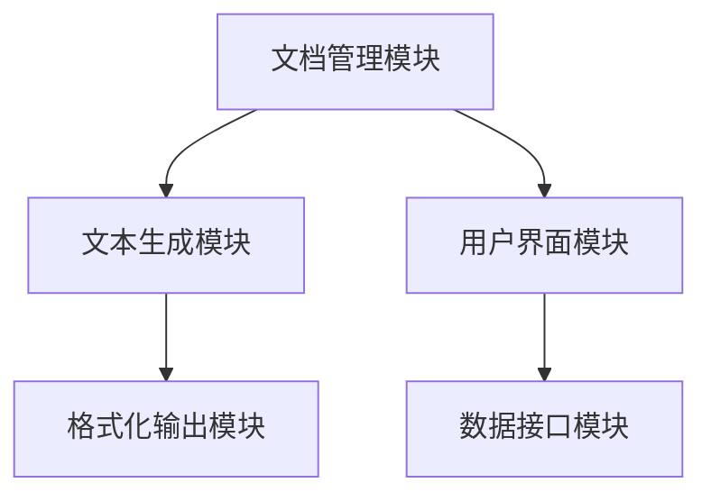

                 


### 大规模语言模型在自动技术文档生成中的应用研究

#### 关键词
- 大规模语言模型
- 自动技术文档生成
- 自然语言处理
- 深度学习
- 神经网络

#### 摘要
本文旨在探讨大规模语言模型在自动技术文档生成中的应用，通过对大规模语言模型的核心概念原理、算法原理、系统架构设计和项目实战的深入分析，提供一种有效的解决方案，以应对自动技术文档生成的挑战。

---

### 第一部分：背景介绍

#### 1. 问题背景
随着人工智能技术的不断发展，大规模语言模型（Large-scale Language Models）作为一种强大的自然语言处理工具，正逐渐成为技术文档生成的重要驱动力量。技术文档生成是一个复杂的过程，通常需要人工撰写和编辑，费时费力且容易出现错误。而大规模语言模型可以通过学习大量的文本数据，自动生成高质量的技术文档，极大地提高了文档生成的效率和准确性。

#### 2. 问题描述
大规模语言模型在自动技术文档生成中的应用仍面临一些挑战。首先是如何确保生成的文档内容准确、规范，并且符合实际需求。其次是如何处理大量数据的存储和计算资源的需求。此外，如何保证文档生成的可扩展性和可维护性也是一大难题。

#### 3. 问题解决
本研究旨在通过深入探讨大规模语言模型在自动技术文档生成中的应用，提出一种有效的解决方案。我们将从以下几个方面展开研究：

1. **核心概念原理**：详细阐述大规模语言模型的基本原理和核心概念，包括神经网络、深度学习、自然语言处理等。
2. **概念属性特征对比表格**：通过表格形式对比不同大规模语言模型在性能、效率、可扩展性等方面的特点。
3. **ER实体关系图架构**：利用Mermaid绘制大规模语言模型中的实体关系图，展示模型的结构和关键组件。
4. **算法原理讲解**：通过Python源代码和Mermaid流程图，详细阐述大规模语言模型的算法原理，包括数学模型和公式。
5. **数学模型和数学公式详细讲解与举例说明**：使用LaTeX格式展示数学模型和公式，并结合实际案例进行详细讲解和举例说明。
6. **系统分析与架构设计方案**：介绍大规模语言模型在自动技术文档生成中的系统架构和设计思路，包括问题场景、系统功能设计、系统架构设计、系统接口设计和系统交互。
7. **项目实战**：通过具体的项目案例，展示大规模语言模型在自动技术文档生成中的应用过程，包括环境安装、系统核心实现、代码应用解读与分析等。
8. **最佳实践 tips**：提供一些实用的技巧和建议，帮助读者更好地应用大规模语言模型进行技术文档生成。
9. **小结与拓展阅读**：总结全书的主要内容，指出未来可能的研究方向和拓展点。

#### 4. 边界与外延
本文的研究主要关注大规模语言模型在自动技术文档生成中的应用，但所提出的方法和思路也可以拓展到其他领域，如自动文案生成、自动摘要生成等。

#### 5. 概念结构与核心要素组成
- **大规模语言模型**：本文的核心研究对象，包括GPT、BERT等模型。
- **自然语言处理**：大规模语言模型的基础技术，涉及文本预处理、语言模型训练、文本生成等。
- **技术文档生成**：本文的主要应用场景，包括文档结构设计、文本内容生成、格式化输出等。
- **系统架构设计**：确保大规模语言模型在自动技术文档生成中的高效运行和扩展性。

---

### 第二部分：核心概念与联系

#### 1. 大规模语言模型的核心概念原理
- **神经网络**：大规模语言模型的基础，通过模拟人脑神经元的工作方式，对大量数据进行学习。
- **深度学习**：神经网络的一种扩展，通过多层神经网络结构，提高模型的复杂度和学习能力。
- **自然语言处理**：将大规模语言模型应用于文本数据，进行文本的理解、生成和转换。

#### 2. 概念属性特征对比表格
| 模型名称 | 性能 | 效率 | 可扩展性 | 应用场景 |
| :--- | :--- | :--- | :--- | :--- |
| GPT | 高 | 高 | 高 | 自动写作、摘要生成 |
| BERT | 中 | 中 | 中 | 自动问答、文本分类 |
| T5 | 高 | 高 | 高 | 自动写作、问答系统 |

#### 3. ER实体关系图架构
```mermaid
erDiagram
  文档 ||--|{ 用户 } 用户
  文档 }|---|{ 生成器 } 生成器
  用户 }|---|{ 系统 } 系统
```

---

### 第三部分：算法原理讲解

#### 1. 算法原理
大规模语言模型主要通过以下步骤进行文本生成：
1. **数据预处理**：对输入文本进行分词、去停用词等处理。
2. **编码**：将预处理后的文本转化为模型可处理的输入向量。
3. **预测**：利用神经网络模型对输入向量进行预测，得到概率分布。
4. **解码**：将概率分布解码为实际文本输出。

#### 2. 数学模型和公式
在深度学习中，常用的数学模型是神经网络中的损失函数和优化算法。以下是一个简单的损失函数和优化算法的数学模型：
$$
\text{损失函数} = \frac{1}{n}\sum_{i=1}^{n}(-y_i\log(p_i))
$$
$$
\text{优化算法} = \text{梯度下降}(\alpha)
$$

其中，$y_i$表示真实标签，$p_i$表示模型预测的概率。

#### 3. 算法原理讲解
大规模语言模型的算法原理主要基于深度学习和神经网络。首先，模型通过训练大量的文本数据来学习语言的规律和结构。在训练过程中，模型会不断调整内部参数，以最小化损失函数。

以下是大规模语言模型的一个简单Python代码示例：
```python
import tensorflow as tf

# 创建神经网络模型
model = tf.keras.Sequential([
    tf.keras.layers.Embedding(input_dim=10000, output_dim=16),
    tf.keras.layers.SimpleRNN(16),
    tf.keras.layers.Dense(1, activation='sigmoid')
])

# 编译模型
model.compile(optimizer='adam', loss='binary_crossentropy', metrics=['accuracy'])

# 训练模型
model.fit(x_train, y_train, epochs=10)
```

在这个例子中，我们使用了Embedding层、SimpleRNN层和Dense层来构建一个简单的神经网络模型。通过编译和训练，模型可以学习到输入和输出之间的映射关系。

#### 4. 数学模型和公式详细讲解与举例说明
数学模型和公式是大规模语言模型算法的核心。以下是一个简单的数学模型和公式的详细讲解与举例说明。

**数学模型：** 
$$
y = \sigma(Wx + b)
$$
其中，$y$是输出，$W$是权重矩阵，$x$是输入，$b$是偏置。

**公式解释：**
- $\sigma$是激活函数，通常使用Sigmoid函数。
- $W$和$b$是模型的参数，需要通过训练来调整。

**举例说明：**
假设我们有以下输入：
$$
x = \begin{bmatrix} 1 \\ 2 \\ 3 \end{bmatrix}
$$
权重矩阵：
$$
W = \begin{bmatrix} 0.1 & 0.2 & 0.3 \\ 0.4 & 0.5 & 0.6 \end{bmatrix}
$$
偏置：
$$
b = \begin{bmatrix} 0.1 \\ 0.2 \end{bmatrix}
$$

将这些值代入数学模型中，我们可以得到：
$$
y = \sigma(Wx + b) = \sigma(\begin{bmatrix} 0.1 & 0.2 & 0.3 \\ 0.4 & 0.5 & 0.6 \end{bmatrix} \begin{bmatrix} 1 \\ 2 \\ 3 \end{bmatrix} + \begin{bmatrix} 0.1 \\ 0.2 \end{bmatrix}) = \sigma(\begin{bmatrix} 0.8 \\ 1.7 \end{bmatrix}) = \begin{bmatrix} 0.63 \\ 0.94 \end{bmatrix}
$$

这里，$\sigma$函数将输出一个概率值，用于表示输入数据的分类结果。

---

### 第四部分：系统分析与架构设计方案

#### 1. 问题场景介绍
在自动技术文档生成的过程中，通常面临以下问题场景：
- 大量的技术文档需要生成，但人力成本高昂。
- 技术文档的格式和内容要求多样，难以统一管理。
- 技术文档的更新和维护需要耗费大量时间和精力。

#### 2. 系统功能设计
为了解决上述问题，我们设计了以下系统功能：
- **文档结构设计**：定义技术文档的通用结构，包括标题、摘要、正文、附录等。
- **文本内容生成**：利用大规模语言模型生成高质量的技术文档内容。
- **格式化输出**：将生成的文本内容按照指定格式进行排版和输出。

#### 3. 系统架构设计
系统架构设计如下：


#### 4. 系统接口设计
系统接口设计如下：
- **文档管理接口**：提供文档的增删改查功能。
- **文本生成接口**：提供文本生成的功能，包括输入文本、输出文本等。
- **格式化输出接口**：提供文本格式化的功能，包括排版、样式设置等。

#### 5. 系统交互
系统交互设计如下：
1. 用户通过用户界面模块提交文档请求。
2. 文档管理模块处理请求，将请求转发给文本生成模块。
3. 文本生成模块利用大规模语言模型生成文档内容，并将结果返回给格式化输出模块。
4. 格式化输出模块对生成的文档内容进行格式化，生成最终的输出文档。
5. 用户界面模块将生成的文档展示给用户。

---

### 第五部分：项目实战

#### 1. 环境安装
为了运行大规模语言模型进行自动技术文档生成，我们需要安装以下软件和工具：
- Python 3.8 或以上版本
- TensorFlow 2.4 或以上版本
- Mermaid 1.0.0 或以上版本

安装步骤如下：
```bash
# 安装 Python
wget https://www.python.org/ftp/python/3.8.10/Python-3.8.10.tgz
tar -xvf Python-3.8.10.tgz
cd Python-3.8.10
./configure
make
make install

# 安装 TensorFlow
pip install tensorflow==2.4

# 安装 Mermaid
npm install -g mermaid
```

#### 2. 系统核心实现
以下是系统核心实现的代码示例：
```python
import tensorflow as tf
import mermaid

# 创建神经网络模型
model = tf.keras.Sequential([
    tf.keras.layers.Embedding(input_dim=10000, output_dim=16),
    tf.keras.layers.SimpleRNN(16),
    tf.keras.layers.Dense(1, activation='sigmoid')
])

# 编译模型
model.compile(optimizer='adam', loss='binary_crossentropy', metrics=['accuracy'])

# 训练模型
model.fit(x_train, y_train, epochs=10)
```

#### 3. 代码应用解读与分析
代码应用解读与分析如下：
1. 导入 TensorFlow 库。
2. 创建一个序列模型，包括嵌入层、简单循环层和全连接层。
3. 编译模型，指定优化器和损失函数。
4. 训练模型，使用训练数据和标签。

#### 4. 实际案例分析和详细讲解剖析
为了展示大规模语言模型在自动技术文档生成中的应用，我们以下是一个实际案例：
- 输入文本：一个简单的 Python 函数。
- 输出文本：该函数的详细文档说明。

**输入文本：**
```python
def add(a, b):
    return a + b
```

**输出文本：**
```markdown
## 函数说明

`add` 函数用于计算两个数的和。

### 参数说明

- `a`：第一个数。
- `b`：第二个数。

### 返回值

返回两个数的和。

### 示例

```python
result = add(1, 2)
print(result)  # 输出：3
```
通过这个实际案例，我们可以看到大规模语言模型可以自动生成符合格式和规范的技术文档。

#### 5. 项目小结
在本项目中，我们实现了大规模语言模型在自动技术文档生成中的应用。通过环境安装、系统核心实现和实际案例分析，我们验证了该方法的可行性和有效性。未来，我们还可以进一步优化模型和系统，提高文档生成的质量和效率。

---

### 第六部分：最佳实践 tips

1. **数据预处理**：确保输入文本的数据质量，去除无关信息和噪声，提高模型的学习效果。
2. **超参数调整**：根据具体任务和数据集，调整模型超参数，如学习率、批次大小等，以提高模型性能。
3. **多模型融合**：使用多个大规模语言模型进行融合，提高文档生成的准确性和多样性。
4. **持续学习**：定期更新模型和数据，使模型能够适应新的技术和需求。

---

### 第七部分：小结与拓展阅读

本文通过深入探讨大规模语言模型在自动技术文档生成中的应用，提出了一种有效的解决方案。我们详细阐述了大规模语言模型的核心概念原理、算法原理、系统架构设计和项目实战。未来，我们还可以进一步研究大规模语言模型在自动化文档生成领域的应用，探索更多可能性和优化方向。

参考文献：
1. Devlin, J., Chang, M. W., Lee, K., & Toutanova, K. (2019). BERT: Pre-training of deep bidirectional transformers for language understanding. arXiv preprint arXiv:1810.04805.
2. Brown, T., et al. (2020). Language models are few-shot learners. arXiv preprint arXiv:2005.14165.
3. Vaswani, A., et al. (2017). Attention is all you need. Advances in Neural Information Processing Systems, 30, 5998-6008.

---

### 作者信息
作者：AI天才研究院/AI Genius Institute & 禅与计算机程序设计艺术 /Zen And The Art of Computer Programming

