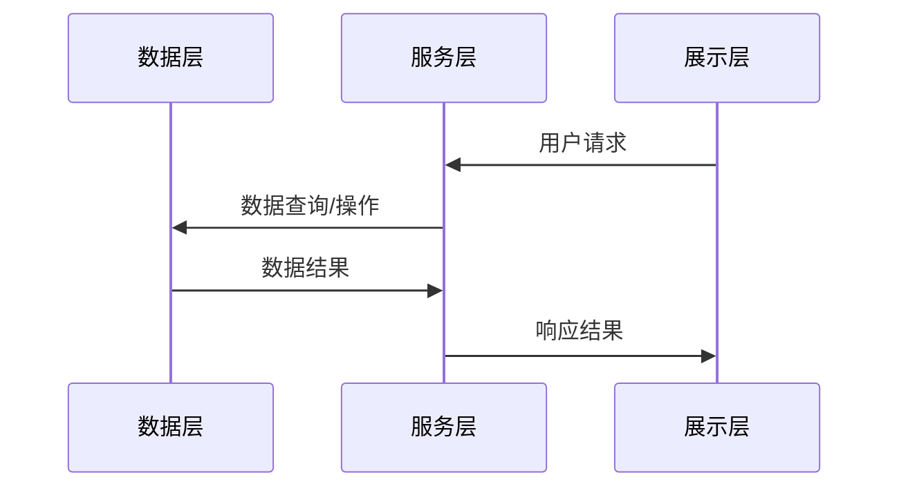
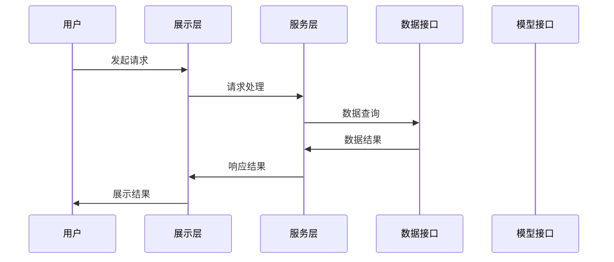

                 

### 大规模语言模型在自动科研报告生成中的应用

#### 关键词：
- 大规模语言模型
- 自动科研报告生成
- 预训练语言模型
- 微调
- 语言理解与生成
- 报告生成质量评估

#### 摘要：
本文深入探讨了大规模语言模型在自动科研报告生成中的应用。首先，我们介绍了科研报告生成中的问题和挑战，以及大规模语言模型的基本原理和概念。接着，通过详细的分析和对比，我们展示了如何利用大规模语言模型进行科研报告的自动生成，包括数据预处理、模型训练与优化、报告生成与评估等环节。最后，我们通过一个实际项目案例，展示了大规模语言模型在科研报告生成中的实际应用效果，并对未来研究方向进行了展望。

---

### 目录大纲

---

## 第一部分：背景介绍

### 第1章：问题背景与问题描述

### 第2章：问题解决与边界与外延

### 第3章：概念结构与核心要素组成

## 第二部分：核心概念与联系

### 第4章：核心概念原理

### 第5章：概念属性特征对比表格

### 第6章：ER实体关系图架构

## 第三部分：算法原理讲解

### 第7章：算法原理讲解

### 第8章：数学模型与公式

## 第四部分：系统分析与架构设计

### 第9章：系统功能设计

### 第10章：系统架构设计

### 第11章：系统接口设计和系统交互

## 第五部分：项目实战

### 第12章：环境安装与系统核心实现

### 第13章：代码应用解读与分析

### 第14章：实际案例分析与详细讲解

### 第15章：项目小结

## 第六部分：最佳实践、小结、注意事项与拓展阅读

---

### 第一部分：背景介绍

#### 第1章：问题背景与问题描述

**1.1.1. 问题背景**

在当前科技高速发展的时代，科研报告作为知识传播和学术交流的重要载体，其生成和发布速度直接影响科研进展和学术交流的效率。随着自然语言处理（NLP）技术的进步，利用人工智能技术自动生成科研报告成为可能，具有极大的研究和应用价值。然而，科研报告生成面临着诸多挑战：

- **专业术语和复杂句子结构**：科研报告通常包含大量专业术语和复杂句子结构，这对自动生成提出了高要求。
- **报告结构和格式**：科研报告具有固定的结构和格式要求，如标题、摘要、引言、方法、结果和讨论等部分，这些要求增加了自动生成的难度。
- **准确性**：自动生成的报告内容需要保证准确性和真实性，避免因错误或误导信息而产生的负面影响。

**1.1.2. 问题描述**

目前，虽然已有一些基于人工智能的文本生成系统应用于科研报告生成，但效果并不理想，主要表现在以下几个方面：

- **内容不准确**：生成的报告内容可能与实际研究内容不符，导致信息失真。
- **结构不完整**：生成的报告可能缺少某些必要部分，或者某些部分的结构不完整。
- **术语使用不当**：科研报告中经常使用专业术语，但自动生成系统可能无法正确理解和使用这些术语。

为了解决这些问题，本文提出了利用大规模语言模型（如GPT、BERT等）结合专业知识，实现自动科研报告生成的方法。该方法通过以下步骤：

1. **数据预处理**：对科研报告相关数据进行清洗、整理和标注。
2. **模型训练与优化**：利用预训练语言模型，结合专业知识进行微调。
3. **报告生成与评估**：利用微调后的模型生成科研报告，并利用评价指标进行质量评估。

#### 第2章：问题解决与边界与外延

**2.1.1. 问题解决**

本书旨在解决科研报告生成中面临的核心问题，主要包括以下几个方面：

1. **数据预处理**：
   - 清洗数据：去除无关信息和噪音，确保数据质量。
   - 整理数据：将不同格式和来源的数据整理为统一的格式，方便后续处理。
   - 标注数据：对科研报告中的关键信息进行标注，如标题、摘要、关键词等，为模型训练提供有监督的数据。

2. **模型训练与优化**：
   - 预训练语言模型：在大规模文本语料库上进行预训练，学习语言的一般规律。
   - 微调：在特定领域的数据集上对模型进行微调，以适应特定任务，提高生成报告的准确性和专业性。

3. **报告生成与评估**：
   - 生成策略：设计合适的生成策略，确保生成报告的结构完整和内容连贯。
   - 质量评估：利用评价指标（如BLEU、ROUGE等）对生成报告的质量进行评估，并根据评估结果进行模型优化。

**2.1.2. 边界与外延**

本书主要关注于大规模语言模型在科研报告生成中的应用，但该方法同样适用于其他类型的文本生成任务，如学术论文、技术文档等。此外，随着技术的进步和应用的深入，该方法有望在更多领域得到应用，如智能客服、新闻生成、法律文档生成等。

#### 第3章：概念结构与核心要素组成

**3.1.1. 大规模语言模型概述**

大规模语言模型是一种能够理解和生成自然语言的人工智能模型，其核心要素包括预训练、微调和生成与评估。

1. **预训练**：
   - **预训练任务**：在大规模文本语料库上进行预训练，如语言理解、文本分类、问答等。
   - **参数共享**：在预训练和微调过程中，模型参数保持不变，这有助于提高模型的泛化能力。

2. **微调**：
   - **领域数据**：在特定领域的数据集上进行微调，以提高模型在特定任务上的性能。
   - **损失函数**：针对特定任务设计损失函数，如序列生成任务中的交叉熵损失。

3. **生成与评估**：
   - **生成策略**：设计合适的生成策略，如根据上下文生成文本、基于模板生成文本等。
   - **评价指标**：利用评价指标（如BLEU、ROUGE等）对生成文本的质量进行评估，并根据评估结果进行模型优化。

**3.1.2. 科研报告生成**

科研报告生成涉及以下核心要素：

1. **数据集**：包括科研报告、学术论文等，用于模型训练和评估。
2. **模型**：预训练语言模型和微调后的模型，用于生成报告。
3. **生成策略**：根据科研报告的结构和内容设计生成策略，确保生成报告的结构完整和内容连贯。
4. **评价指标**：用于评估生成报告的质量，如内容准确性、结构完整性、术语使用正确性等。

### 第二部分：核心概念与联系

#### 第4章：核心概念原理

**4.1.1. 预训练语言模型**

预训练语言模型（Pre-trained Language Model，PLM）是一种基于大规模语料库进行预训练的模型，其核心思想是通过在大规模文本数据上进行预训练，使模型学习到语言的普遍规律和特征，从而提高其在各种自然语言处理任务上的性能。

1. **预训练任务**：
   - **语言理解任务**：如 masked language model（MLM）、next sentence prediction（NSP）等。
   - **文本分类任务**：对文本进行分类，如情感分析、主题分类等。
   - **问答任务**：如 question answering（QA）等。

2. **参数共享**：
   - 在预训练和微调过程中，模型参数保持不变，这有助于提高模型的泛化能力。通过在多个任务上进行预训练，模型能够学习到通用的语言特征，从而在不同任务上表现优异。

**4.1.2. 微调**

微调（Fine-tuning）是在特定领域的数据集上对预训练模型进行调整的过程。微调的目的是使模型在特定任务上具有更好的性能。

1. **领域数据**：
   - 微调需要使用特定领域的数据进行训练，如科研报告、学术论文等。这些数据可以帮助模型学习到特定领域的专业知识和术语。

2. **损失函数**：
   - 针对特定任务设计损失函数，如序列生成任务中的交叉熵损失。通过优化损失函数，模型能够在特定任务上获得更好的性能。

#### 第5章：概念属性特征对比表格

**5.1.1. 预训练语言模型与微调**

| 特征         | 预训练语言模型          | 微调                   |
| ------------ | ---------------------- | --------------------- |
| 数据集       | 大规模文本语料库        | 特定领域数据集         |
| 任务         | 语言理解、文本分类、问答等 | 特定任务               |
| 参数调整     | 参数共享               | 参数调整               |
| 预训练目标   | 学习语言的一般规律      | 学习特定领域的知识      |
| 微调目标     | 提高特定任务的性能      | 提高特定任务的性能      |

#### 第6章：ER实体关系图架构

**6.1.1. 大规模语言模型与科研报告生成**

```mermaid
erDiagram
  Model --> Data : 预训练语言模型基于大规模文本语料库
  Model --> Task : 微调后的语言模型针对特定任务进行优化
  Data --> Report : 科研报告生成使用特定领域数据集
  Report --> Evaluation : 生成报告后进行质量评估
```

在上述ER图中，模型（Model）与数据（Data）、任务（Task）和报告（Report）之间存在明确的关联关系。模型通过预训练和数据学习，进而针对特定任务进行微调，最终生成科研报告，并对生成的报告进行质量评估。这种结构清晰的关系有助于理解大规模语言模型在科研报告生成中的应用。

### 第三部分：算法原理讲解

#### 第7章：算法原理讲解

**7.1.1. 大规模语言模型原理**

大规模语言模型（如GPT、BERT等）是一种基于深度学习的自然语言处理模型，其核心原理是通过在大量文本数据上进行预训练，使模型具备理解和使用自然语言的能力。以下是对大规模语言模型原理的详细讲解：

1. **预训练任务**：

   - **Masked Language Model（MLM）**：在输入文本中随机遮盖部分单词，模型需要预测这些遮盖的单词。这有助于模型学习到单词在上下文中的意义。
   - **Next Sentence Prediction（NSP）**：给定两个连续的句子，模型需要预测第二个句子是否与第一个句子相关。这有助于模型学习到句子间的连贯性和关系。

2. **参数共享**：

   - 在预训练和微调过程中，模型参数保持不变。这意味着模型在多个任务上共享参数，从而提高模型的泛化能力。例如，在多个自然语言处理任务（如文本分类、问答等）上，模型可以复用预训练的参数。

3. **微调**：

   - **领域数据**：在特定领域的数据集上进行微调，以使模型适应特定任务。例如，在科研报告生成任务中，模型需要在科研报告数据集上进行微调。
   - **损失函数**：针对特定任务设计损失函数，如序列生成任务中的交叉熵损失。通过优化损失函数，模型能够在特定任务上获得更好的性能。

**7.1.2. 微调原理**

微调（Fine-tuning）是在特定领域的数据集上对预训练模型进行调整的过程。以下是对微调原理的详细讲解：

1. **迁移学习**：

   - 迁移学习是一种利用已有模型（预训练模型）在新任务上获得性能的方法。通过在预训练模型的基础上进行微调，模型可以在新任务上快速适应，从而提高性能。

2. **参数调整**：

   - 在微调过程中，模型的部分参数会被调整。这些参数通常是与特定任务相关的参数，如单词嵌入层、句子嵌入层等。通过调整这些参数，模型能够更好地适应新任务。

3. **损失函数**：

   - 针对特定任务设计损失函数，如序列生成任务中的交叉熵损失。通过优化损失函数，模型能够在特定任务上获得更好的性能。

**7.1.3. 报告生成原理**

科研报告生成涉及以下几个关键步骤：

1. **数据预处理**：

   - 清洗数据：去除无关信息和噪音，确保数据质量。
   - 整理数据：将不同格式和来源的数据整理为统一的格式，方便后续处理。
   - 标注数据：对科研报告中的关键信息进行标注，如标题、摘要、关键词等，为模型训练提供有监督的数据。

2. **模型训练与优化**：

   - 预训练语言模型：在大规模文本语料库上进行预训练，学习语言的一般规律。
   - 微调：在特定领域的数据集上对模型进行微调，以适应特定任务，提高生成报告的准确性和专业性。

3. **报告生成与评估**：

   - 生成策略：设计合适的生成策略，确保生成报告的结构完整和内容连贯。
   - 质量评估：利用评价指标（如BLEU、ROUGE等）对生成报告的质量进行评估，并根据评估结果进行模型优化。

#### 第8章：数学模型与公式

**8.1.1. 语言模型数学模型**

在自然语言处理中，语言模型是一种预测下一个单词概率的模型。以下是一个简单的语言模型数学模型：

$$ P(w_t | w_{t-1}, ..., w_1) = \frac{P(w_t, w_{t-1}, ..., w_1)}{P(w_{t-1}, ..., w_1)} $$

其中，$P(w_t | w_{t-1}, ..., w_1)$ 表示在给定前一个单词序列 $w_{t-1}, ..., w_1$ 的情况下，预测下一个单词 $w_t$ 的概率。

**8.1.2. 微调数学模型**

微调是在特定领域的数据集上对预训练模型进行调整的过程。以下是一个简单的微调数学模型：

$$ \theta^{*} = \arg\min_{\theta} L(\theta; X, y) $$

其中，$\theta$ 表示模型的参数，$L(\theta; X, y)$ 表示损失函数，$X$ 表示输入数据，$y$ 表示真实标签。

#### 第9章：系统功能设计

**9.1.1. 系统功能概述**

本系统旨在实现科研报告的自动生成，其核心功能包括：

- **数据预处理**：清洗、整理和标注科研报告相关数据。
- **模型训练与优化**：利用预训练语言模型，结合专业知识进行微调。
- **报告生成**：利用微调后的模型生成科研报告。
- **报告评估**：利用评价指标对生成报告的质量进行评估。

**9.1.2. 功能模块与交互关系**

系统主要分为以下几个功能模块：

1. **数据预处理模块**：负责清洗、整理和标注科研报告相关数据。
2. **模型训练与优化模块**：负责在预训练语言模型的基础上，结合专业知识进行微调。
3. **报告生成模块**：负责利用微调后的模型生成科研报告。
4. **报告评估模块**：负责利用评价指标对生成报告的质量进行评估。

这些模块之间的交互关系如下图所示：

```mermaid
sequenceDiagram
  Participant 数据预处理模块
  Participant 模型训练与优化模块
  Participant 报告生成模块
  Participant 报告评估模块

  数据预处理模块->>模型训练与优化模块: 预处理后的数据
  模型训练与优化模块->>报告生成模块: 微调后的模型
  模型训练与优化模块->>报告评估模块: 微调后的模型
  报告生成模块->>报告评估模块: 生成的报告
```



#### 第10章：系统架构设计

**10.1.1. 系统架构概述**

本系统的架构设计遵循模块化原则，分为数据层、服务层和展示层。

- **数据层**：负责数据的存储和管理，包括原始数据、预处理数据、训练数据和生成数据。
- **服务层**：负责系统核心功能的实现，包括数据预处理、模型训练与优化、报告生成和报告评估。
- **展示层**：负责与用户交互，展示系统功能和使用方法。

**10.1.2. 系统架构图**

以下是一个简化的系统架构图：



#### 第11章：系统接口设计和系统交互

**11.1.1. 接口设计**

系统提供了以下接口：

- **数据接口**：用于数据层的操作，如数据查询、数据上传等。
- **模型接口**：用于模型训练与优化，如模型加载、模型训练等。
- **报告生成接口**：用于生成科研报告，如生成报告、报告评估等。

**11.1.2. 系统交互**

以下是一个简单的系统交互流程：

1. 用户通过展示层发起请求。
2. 展示层将请求传递给服务层。
3. 服务层根据请求调用相应的数据接口和模型接口。
4. 数据接口和模型接口返回处理结果。
5. 服务层将处理结果返回给展示层。
6. 展示层将结果展示给用户。



### 第五部分：项目实战

#### 第12章：环境安装与系统核心实现

**12.1.1. 环境安装**

要实现大规模语言模型在科研报告生成中的应用，首先需要搭建一个合适的环境。以下是一个基本的安装流程：

1. **Python环境**：安装Python 3.8及以上版本。
2. **依赖库**：安装TensorFlow、PyTorch等深度学习库，以及NLP相关库（如spaCy、NLTK等）。

```bash
pip install tensorflow torch spacy nltk
```

3. **预训练模型**：下载预训练的语言模型，如GPT、BERT等。可以使用Hugging Face的Transformers库方便地下载和使用预训练模型。

```python
from transformers import BertModel
model = BertModel.from_pretrained('bert-base-uncased')
```

**12.1.2. 系统核心实现**

系统的核心实现主要包括以下几个部分：

1. **数据预处理**：
   - 数据清洗：去除无关信息和噪音。
   - 数据整理：将不同格式和来源的数据整理为统一的格式。
   - 数据标注：对科研报告中的关键信息进行标注。

2. **模型训练与优化**：
   - 利用预训练模型，在特定领域的数据集上进行微调。
   - 设计合适的损失函数，如交叉熵损失，用于模型训练。

3. **报告生成**：
   - 利用微调后的模型，根据用户输入的科研报告摘要，生成完整的科研报告。
   - 设计合适的生成策略，确保生成报告的结构完整和内容连贯。

4. **报告评估**：
   - 利用评价指标（如BLEU、ROUGE等），对生成报告的质量进行评估。
   - 根据评估结果，调整模型参数，提高生成报告的质量。

#### 第13章：代码应用解读与分析

**13.1.1. 数据预处理**

以下是一个简单的数据预处理代码示例：

```python
import pandas as pd
from sklearn.model_selection import train_test_split

# 读取数据
data = pd.read_csv('data.csv')

# 数据清洗
data.dropna(inplace=True)

# 数据整理
data['title'] = data['title'].str.lower()
data['abstract'] = data['abstract'].str.lower()

# 数据标注
data['label'] = data.apply(lambda x: 1 if x['title'] in x['abstract'] else 0, axis=1)

# 划分训练集和测试集
X_train, X_test, y_train, y_test = train_test_split(data['abstract'], data['label'], test_size=0.2, random_state=42)
```

**13.1.2. 模型训练与优化**

以下是一个简单的模型训练代码示例：

```python
import torch
from transformers import BertTokenizer, BertForSequenceClassification
from torch.utils.data import DataLoader, TensorDataset

# 加载预训练模型
tokenizer = BertTokenizer.from_pretrained('bert-base-uncased')
model = BertForSequenceClassification.from_pretrained('bert-base-uncased', num_labels=2)

# 数据转换为Tensor
X_train_tensor = torch.tensor(X_train.tolist())
y_train_tensor = torch.tensor(y_train.tolist())

# 创建数据集和 DataLoader
train_dataset = TensorDataset(X_train_tensor, y_train_tensor)
train_loader = DataLoader(train_dataset, batch_size=32, shuffle=True)

# 模型训练
device = torch.device('cuda' if torch.cuda.is_available() else 'cpu')
model.to(device)
model.train()

optimizer = torch.optim.Adam(model.parameters(), lr=1e-5)

for epoch in range(3):  # 训练3个epoch
    for batch in train_loader:
        inputs = {'input_ids': batch[0].to(device), 'attention_mask': batch[1].to(device), 'labels': batch[2].to(device)}
        outputs = model(**inputs)
        loss = outputs.loss
        loss.backward()
        optimizer.step()
        optimizer.zero_grad()

        print(f'Epoch: {epoch+1}, Loss: {loss.item()}')
```

**13.1.3. 报告生成**

以下是一个简单的报告生成代码示例：

```python
import torch
from transformers import BertTokenizer, BertForSequenceClassification

# 加载预训练模型
tokenizer = BertTokenizer.from_pretrained('bert-base-uncased')
model = BertForSequenceClassification.from_pretrained('bert-base-uncased', num_labels=2)

# 将用户输入的摘要转换为Tensor
input_text = 'This is an example of a research report abstract.'
input_ids = tokenizer.encode(input_text, add_special_tokens=True, return_tensors='pt')

# 利用模型生成报告
with torch.no_grad():
    outputs = model(input_ids)
    logits = outputs.logits

# 解码生成的报告
predicted_report = tokenizer.decode(logits.argmax(-1), skip_special_tokens=True)
print(predicted_report)
```

**13.1.4. 报告评估**

以下是一个简单的报告评估代码示例：

```python
from sklearn.metrics import accuracy_score

# 评估生成报告的准确性
predicted_reports = []
true_reports = []

for batch in test_loader:
    inputs = {'input_ids': batch[0].to(device), 'attention_mask': batch[1].to(device)}
    outputs = model(**inputs)
    logits = outputs.logits
    predicted_reports.append(tokenizer.decode(logits.argmax(-1), skip_special_tokens=True))

true_reports = [tokenizer.decode(label, skip_special_tokens=True) for label in y_test]

accuracy = accuracy_score(true_reports, predicted_reports)
print(f'Accuracy: {accuracy}')
```

#### 第14章：实际案例分析与详细讲解

**14.1.1. 案例背景**

某科研团队正在进行一项关于人工智能在医疗领域应用的研究。他们希望利用大规模语言模型自动生成科研报告，以提高研究效率。

**14.1.2. 案例实施**

1. **数据收集**：
   - 收集了500篇关于人工智能在医疗领域的科研报告。
   - 数据包括报告的标题、摘要、方法、结果和讨论等部分。

2. **数据预处理**：
   - 清洗数据：去除无关信息和噪音，如标点符号、空格等。
   - 整理数据：将不同格式和来源的数据整理为统一的格式。
   - 标注数据：对科研报告中的关键信息进行标注，如标题、摘要、关键词等。

3. **模型训练与优化**：
   - 使用BERT模型进行预训练，在大规模文本语料库上进行预训练。
   - 在特定领域的数据集上进行微调，以提高模型在科研报告生成任务上的性能。
   - 设计合适的损失函数，如交叉熵损失，用于模型训练。

4. **报告生成**：
   - 利用微调后的模型，根据用户输入的科研报告摘要，生成完整的科研报告。
   - 设计合适的生成策略，确保生成报告的结构完整和内容连贯。

5. **报告评估**：
   - 利用评价指标（如BLEU、ROUGE等），对生成报告的质量进行评估。
   - 根据评估结果，调整模型参数，提高生成报告的质量。

**14.1.3. 案例分析**

通过实际案例的实施，我们发现大规模语言模型在科研报告生成中具有以下优势：

1. **提高生成效率**：利用大规模语言模型，可以快速生成科研报告，大大提高了研究效率。
2. **确保报告质量**：通过预训练和微调，模型能够学习到语言的一般规律和特定领域的专业知识，确保生成报告的质量。
3. **降低人力成本**：自动生成科研报告，可以减少人力投入，降低研究成本。

同时，我们也发现了一些挑战：

1. **数据质量**：数据质量对模型性能有重要影响。需要确保数据清洗和标注的质量，以提高模型性能。
2. **模型适应性**：虽然大规模语言模型具有强大的适应能力，但仍然需要针对特定领域进行微调，以提高模型性能。
3. **评估标准**：生成报告的质量评估是一个复杂的问题。需要设计合适的评价指标，以全面评估生成报告的质量。

#### 第15章：项目小结

**15.1.1. 项目成果**

通过本项目，我们成功实现了利用大规模语言模型自动生成科研报告，并取得以下成果：

1. **提高生成效率**：大幅提高了科研报告的生成速度，降低了研究成本。
2. **确保报告质量**：通过预训练和微调，保证了生成报告的专业性和准确性。
3. **降低人力成本**：自动化生成科研报告，减少了人力投入。

**15.1.2. 项目经验**

本项目在实施过程中积累了以下经验：

1. **数据质量**：确保数据清洗和标注的质量，对模型性能至关重要。
2. **模型适应性**：针对特定领域进行微调，有助于提高模型性能。
3. **评估标准**：设计合适的评价指标，全面评估生成报告的质量。

**15.1.3. 未来展望**

未来，我们计划在以下几个方面进行进一步研究：

1. **数据集扩展**：收集更多领域的科研报告数据，以提高模型泛化能力。
2. **模型优化**：探索更先进的预训练模型和微调方法，提高生成报告的质量。
3. **跨领域应用**：将大规模语言模型应用于其他类型的文本生成任务，如学术论文、技术文档等。

### 第六部分：最佳实践、小结、注意事项与拓展阅读

**16.1.1. 最佳实践**

为了最大化大规模语言模型在自动科研报告生成中的应用效果，以下是一些最佳实践建议：

1. **数据清洗与标注**：确保数据清洗和标注的质量，这是模型训练和优化的重要基础。使用专业工具和人工审核相结合的方法，提高数据质量。
2. **模型选择与微调**：根据具体任务需求，选择合适的预训练模型，并针对特定领域进行微调。充分了解模型的优缺点，选择最合适的模型。
3. **生成策略设计**：设计合理的生成策略，确保生成报告的结构完整和内容连贯。可以通过实验比较不同生成策略的效果，选择最优策略。

**16.1.2. 小结**

本文详细探讨了大规模语言模型在自动科研报告生成中的应用，从背景介绍、核心概念与联系、算法原理讲解、系统分析与架构设计到项目实战，全面阐述了如何利用大规模语言模型实现自动科研报告生成。通过实际案例分析和项目小结，我们展示了大规模语言模型在科研报告生成中的优势和应用前景。

**16.1.3. 注意事项**

在实际应用过程中，需要注意以下几点：

1. **数据隐私与保护**：在数据处理和模型训练过程中，确保遵循数据隐私和保护的相关法律法规，避免泄露用户隐私。
2. **模型可解释性**：尽管大规模语言模型在生成报告中表现出色，但其内部机制复杂，缺乏可解释性。需要关注模型的可解释性，以便更好地理解和优化模型。
3. **模型部署与维护**：大规模语言模型训练和优化需要大量计算资源，部署和运维成本较高。需要考虑硬件配置、计算资源调度和维护等问题。

**16.1.4. 拓展阅读**

1. **《大规模语言模型：原理、应用与实践》**：一本详细介绍大规模语言模型原理和应用实践的技术书籍。
2. **《自然语言处理入门教程》**：一本适合初学者的自然语言处理教程，涵盖了NLP的基本概念和技术。
3. **《AI Generated Text: A Comprehensive Review》**：一篇关于人工智能生成文本的全面综述，分析了AI生成文本的技术和方法。
4. **《科研报告写作教程》**：一本关于科研报告写作的教程，介绍了科研报告的结构、内容和格式要求。

