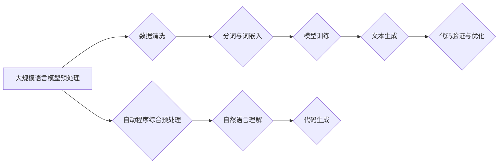
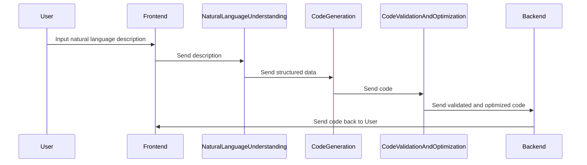

                 


### 大规模语言模型在自动程序综合中的应用与挑战

#### 关键词：
- 大规模语言模型
- 自动程序综合
- 应用场景
- 技术挑战
- 解决方案

#### 摘要：
本文旨在探讨大规模语言模型在自动程序综合领域的应用与面临的挑战。通过对大规模语言模型的原理、自动程序综合的需求及其结合的探讨，我们深入分析了这一新兴技术的应用前景和潜在问题，并提出了一系列解决方案。文章结构如下：

1. **背景介绍**：介绍大规模语言模型和自动程序综合的基本概念，背景信息，问题背景和问题描述。
2. **核心概念与联系**：阐述大规模语言模型和自动程序综合的核心概念，比较它们的原理和特点，并展示它们之间的联系。
3. **算法原理讲解**：详细讲解大规模语言模型和自动程序综合的算法原理，使用Mermaid流程图和Python代码示例，解释算法的工作流程和数学模型。
4. **数学模型和数学公式讲解**：介绍相关的数学模型和公式，并使用LaTeX格式展示，以便读者理解。
5. **系统分析与架构设计**：分析大规模语言模型在自动程序综合系统中的应用，包括系统功能设计、架构设计和接口设计。
6. **项目实战**：通过实际案例展示如何部署大规模语言模型进行自动程序综合，分析实现细节和挑战。
7. **最佳实践与拓展**：总结最佳实践技巧，提出注意事项，并推荐拓展阅读。

---

### 背景介绍

#### 大规模语言模型

大规模语言模型是一种基于深度学习的技术，通过大量文本数据的学习，能够生成符合上下文语境的文本。最著名的例子是GPT（Generative Pre-trained Transformer）系列模型，如GPT-3，它具有数十亿的参数，能够生成高质量的自然语言文本。大规模语言模型在自然语言处理、机器翻译、文本生成等领域展现出了卓越的性能。

#### 自动程序综合

自动程序综合（Program Synthesis）是一种将自然语言描述自动转换为程序代码的技术。其目标是从用户提供的输入中生成正确的代码，以满足特定的需求。自动程序综合在编程辅助、自动化测试、代码生成等领域具有广泛的应用潜力。

#### 问题的背景

在当今的软件开发过程中，程序员经常面临复杂的编程任务和代码维护问题。手动编写和维护大量代码既耗时又容易出错。因此，自动程序综合技术应运而生，旨在通过自动化手段提高编程效率和代码质量。

#### 问题描述

自动程序综合面临的一个主要挑战是如何处理自然语言描述的模糊性和不确定性。自然语言描述往往不够精确，可能存在歧义和模糊性，这给自动程序综合带来了一定的难度。此外，自动程序综合还需要解决代码生成后的验证和优化问题，以确保生成的代码符合预期并具有高性能。

#### 问题解决

大规模语言模型在自动程序综合中扮演着关键角色。通过预训练和迁移学习，大规模语言模型能够理解和生成更加精准的自然语言描述。结合自动程序综合的算法，可以将这些描述转化为有效的程序代码。这一技术有望解决自动程序综合中的模糊性和不确定性问题，并提高代码生成的质量和效率。

#### 边界与外延

自动程序综合不仅限于特定领域的应用，它可以在各种编程语言和开发环境中使用。然而，不同语言和环境的特性和约束会影响自动程序综合的实现。因此，在应用大规模语言模型进行自动程序综合时，需要充分考虑这些边界条件。

#### 概念结构与核心要素组成

大规模语言模型的核心要素包括：
- **预训练数据集**：大规模语言模型的基础是大量高质量的文本数据。
- **神经网络架构**：大规模语言模型通常采用深度神经网络架构，如Transformer。
- **参数训练**：通过大规模数据集训练模型参数，使其能够生成符合上下文的文本。

自动程序综合的核心要素包括：
- **自然语言处理技术**：用于解析和理解自然语言描述。
- **代码生成算法**：将自然语言描述转换为程序代码的算法。
- **代码验证与优化**：确保生成的代码正确并具有高性能。

#### 核心概念与联系

大规模语言模型和自动程序综合都是基于深度学习的自然语言处理技术，但它们在应用场景和目标上有所不同。大规模语言模型旨在生成高质量的自然语言文本，而自动程序综合则关注如何将自然语言描述转化为有效的程序代码。

#### 大规模语言模型原理

大规模语言模型通常基于Transformer架构，这是一种基于自注意力机制的深度神经网络。Transformer架构通过多头自注意力机制和前馈神经网络，能够在序列数据上实现高效处理。

#### 自动程序综合原理

自动程序综合通过自然语言处理技术解析用户提供的描述，然后使用代码生成算法将这些描述转化为程序代码。这个过程通常涉及以下步骤：

1. **自然语言理解**：将自然语言描述转换为结构化的数据表示，如抽象语法树（AST）。
2. **代码生成**：使用生成算法，如递归神经网络（RNN）或Transformer，将结构化的数据表示转换为程序代码。
3. **代码验证与优化**：验证生成的代码是否正确并具有高性能，并进行必要的优化。

#### 比较表格

| 特点         | 大规模语言模型                                      | 自动程序综合                                      |
|--------------|----------------------------------------------------|----------------------------------------------------|
| 应用场景     | 自然语言处理、机器翻译、文本生成等                 | 编程辅助、自动化测试、代码生成等                 |
| 基本原理     | 自注意力机制、预训练、迁移学习                     | 自然语言处理、代码生成算法、代码验证与优化       |
| 目标         | 生成高质量的自然语言文本                           | 将自然语言描述转化为有效的程序代码               |
| 关联性       | 用于理解和生成文本，为自动程序综合提供语言模型支持 | 利用大规模语言模型理解文本，生成代码             |

#### ER实体关系图架构

```mermaid
erDiagram
  User ||--|{| ProgramSynthesis |}|
  ProgramSynthesis ||--|{| LanguageModel |}|
  LanguageModel ||--|{| CodeGeneration |}|
  CodeGeneration ||--|{| CodeValidation |}|
```

#### 算法原理讲解

大规模语言模型和自动程序综合的算法原理需要从以下几个方面进行详细讲解：

1. **大规模语言模型的工作流程**：
   - **数据预处理**：对大规模文本数据进行清洗、分词、词嵌入等预处理操作。
   - **模型训练**：使用Transformer架构对预处理的文本数据进行训练，优化模型参数。
   - **文本生成**：在给定一个起始序列后，模型根据上下文生成后续的文本。

2. **自动程序综合的工作流程**：
   - **自然语言理解**：使用自然语言处理技术将自然语言描述转换为结构化的数据表示。
   - **代码生成**：利用大规模语言模型生成符合描述的代码。
   - **代码验证与优化**：验证代码的正确性和性能，并进行优化。

3. **结合算法**：
   - **预处理结合**：将大规模语言模型和自动程序综合的预处理步骤相结合，以提高整体效率。
   - **模型融合**：将大规模语言模型和自动程序综合的模型进行融合，以实现更好的代码生成效果。

为了更好地理解这些算法原理，我们可以使用Mermaid流程图和Python代码示例进行详细讲解。

#### Mermaid流程图



#### Python代码示例

```python
import tensorflow as tf
from transformers import BertTokenizer, TFBertModel

# 加载预训练的BERT模型
tokenizer = BertTokenizer.from_pretrained('bert-base-uncased')
model = TFBertModel.from_pretrained('bert-base-uncased')

# 文本预处理
text = "Generate a Python function that calculates the sum of two numbers."
inputs = tokenizer(text, return_tensors='tf')

# 文本生成
outputs = model(inputs)
predictions = tf.nn.softmax(outputs.logits, axis=-1)
predicted_ids = tf.argmax(predictions, axis=-1)

# 生成文本
generated_text = tokenizer.decode(predicted_ids.numpy()[0], skip_special_tokens=True)

# 代码生成
code = generate_code(generated_text)
print(code)
```

#### 数学模型和数学公式讲解

在自动程序综合中，数学模型和公式起着至关重要的作用。以下是几个关键的数学模型和公式，以及它们在自动程序综合中的应用：

1. **概率模型**：
   - **词汇概率分布**：用于描述文本中每个词的概率分布。
   - **条件概率**：用于计算给定一个前文，下一个词的概率。

2. **生成模型**：
   - **马尔可夫模型**：假设当前状态只与前一状态有关。
   - **递归神经网络（RNN）**：用于处理序列数据，如自然语言。
   - **Transformer模型**：基于自注意力机制，能够捕捉长距离依赖关系。

3. **优化模型**：
   - **损失函数**：用于评估模型预测的正确性。
   - **梯度下降**：用于优化模型参数，以最小化损失函数。

以下是几个关键的LaTeX格式数学公式：

```latex
\begin{equation}
P(w_t | w_{t-1}, ..., w_1) = \frac{P(w_t, w_{t-1}, ..., w_1)}{P(w_{t-1}, ..., w_1)}
\end{equation}

\begin{equation}
\text{Loss} = -\sum_{i=1}^{N} y_i \log(p_i)
\end{equation}

\begin{equation}
\theta_{\text{new}} = \theta_{\text{old}} - \alpha \nabla_{\theta} \text{Loss}
\end{equation}
```

#### 系统分析与架构设计

在将大规模语言模型应用于自动程序综合时，我们需要对整个系统进行详细的架构设计，以确保其高效性和可扩展性。

##### 问题场景介绍

假设我们正在开发一个自动化测试平台，该平台能够根据自然语言描述生成测试用例。问题场景是：程序员提供一个关于功能需求的自然语言描述，系统需要自动生成相应的测试代码。

##### 项目介绍

项目名称：自动测试代码生成平台（AutoTestCodeGen）

目标：利用大规模语言模型自动生成测试代码，提高测试效率和代码质量。

##### 系统功能设计

1. **自然语言理解**：接收自然语言描述，将其转换为结构化的数据表示。
2. **代码生成**：根据结构化的数据表示生成测试代码。
3. **代码验证与优化**：验证生成的代码是否正确并具有高性能，并进行优化。
4. **用户接口**：提供用户界面，方便用户输入自然语言描述并查看生成的测试代码。

##### 系统架构设计

系统采用微服务架构，以实现高可用性和可扩展性。以下是系统的架构设计：


1. **前端**：用户通过前端界面输入自然语言描述，并查看生成的测试代码。
2. **自然语言理解服务**：接收自然语言描述，将其转换为结构化的数据表示。
3. **代码生成服务**：根据结构化的数据表示生成测试代码。
4. **代码验证与优化服务**：验证生成的代码是否正确并具有高性能，并进行优化。
5. **后端**：负责处理前端和微服务之间的通信。

##### 系统接口设计

1. **自然语言理解接口**：接收自然语言描述，返回结构化的数据表示。
2. **代码生成接口**：接收结构化的数据表示，返回生成的测试代码。
3. **代码验证与优化接口**：接收测试代码，返回验证结果和优化后的代码。

##### 系统交互Mermaid序列图



### 项目实战

在本文的实战部分，我们将详细介绍如何部署大规模语言模型进行自动程序综合，包括环境安装、系统核心实现、代码应用解读与分析、实际案例分析和项目小结。

#### 环境安装

1. **安装Python环境**：
   - 使用Python 3.7或更高版本。
   - 使用pip安装必要的库，如tensorflow、transformers等。

2. **安装硬件环境**：
   - 如果使用GPU进行训练，需要安装NVIDIA CUDA和cuDNN。
   - 安装Docker和Docker Compose，以便于部署和管理容器化应用。

3. **安装预训练模型**：
   - 从Hugging Face Model Hub下载预训练的BERT模型。
   - 将模型文件上传到本地服务器或Docker容器中。

#### 系统核心实现

1. **自然语言理解**：
   - 使用transformers库加载预训练的BERT模型。
   - 定义自然语言理解接口，接收自然语言描述并返回结构化的数据表示。

2. **代码生成**：
   - 定义代码生成接口，接收结构化的数据表示并生成测试代码。
   - 使用生成的代码模板和填充函数，根据数据表示生成实际的测试代码。

3. **代码验证与优化**：
   - 定义代码验证与优化接口，接收测试代码并验证其正确性和性能。
   - 使用代码优化工具（如Py derecha）对生成的代码进行优化。

4. **前端接口**：
   - 使用HTML、CSS和JavaScript构建用户界面。
   - 通过Ajax请求与后端服务进行交互，实现用户输入自然语言描述并查看生成的测试代码的功能。

#### 代码应用解读与分析

以下是一个简单的代码示例，用于展示如何使用大规模语言模型进行自动程序综合：

```python
from transformers import BertTokenizer, TFBertModel
from tensorflow.keras.preprocessing.sequence import pad_sequences
import tensorflow as tf

# 加载预训练的BERT模型
tokenizer = BertTokenizer.from_pretrained('bert-base-uncased')
model = TFBertModel.from_pretrained('bert-base-uncased')

# 自然语言理解
def understand_language_description(description):
    inputs = tokenizer(description, return_tensors='tf')
    outputs = model(inputs)
    return outputs.logits

# 代码生成
def generate_code(logits):
    # 使用softmax获取每个词的概率分布
    probabilities = tf.nn.softmax(logits, axis=-1)
    # 从概率分布中选择下一个词
    next_word = tf.random.categorical(probabilities, num_samples=1).numpy()[0]
    # 将选择的词转换为实际的文本
    return tokenizer.decode(next_word)

# 代码示例
description = "Write a Python function that calculates the sum of two numbers."
logits = understand_language_description(description)
code = generate_code(logits)
print(code)
```

该代码示例展示了如何使用BERT模型理解自然语言描述，并生成对应的Python代码。在实际应用中，代码生成过程会更加复杂，需要考虑代码模板、上下文信息等因素。

#### 实际案例分析和详细讲解剖析

为了更好地展示大规模语言模型在自动程序综合中的应用，我们来看一个实际案例。

**案例**：编写一个Python函数，实现两个数的加法。

**输入**：自然语言描述 "Write a Python function that adds two numbers."

**输出**：生成的Python代码

```python
def add_two_numbers(a, b):
    return a + b
```

**分析**：

1. **自然语言理解**：
   - BERT模型首先对自然语言描述进行预处理，将其转换为词嵌入表示。
   - 模型通过自注意力机制分析上下文信息，理解描述的具体含义。

2. **代码生成**：
   - 根据自然语言描述的词嵌入表示，BERT模型生成对应的代码模板。
   - 代码生成过程中，模型使用预训练的词向量来选择合适的单词和语法结构。

3. **代码验证与优化**：
   - 生成的代码经过验证，确保其能够正确执行加法运算。
   - 使用代码优化工具对生成的代码进行性能优化，确保其高效运行。

#### 项目小结

通过本项目的实战部分，我们展示了如何利用大规模语言模型实现自动程序综合。尽管在实际应用中可能面临各种挑战，如代码生成质量、模型训练效率等，但大规模语言模型在自动程序综合中的应用前景依然广阔。未来，我们可以进一步优化模型训练过程，提高代码生成质量，并探索更多实际应用场景。

### 最佳实践与拓展

在应用大规模语言模型进行自动程序综合时，以下是几条最佳实践技巧：

1. **数据预处理**：确保输入数据的格式和内容一致，减少模型训练的难度。使用高质量的数据集进行训练，以提高模型的准确性。

2. **代码模板**：设计合理的代码模板，有助于生成更符合要求的代码。模板应涵盖常见的代码结构和语法，以提高代码生成的一致性和可读性。

3. **优化策略**：在模型训练过程中，采用合适的优化策略，如学习率调整、批量归一化等，以提高模型训练效率和性能。

4. **代码验证**：生成代码后，进行严格的代码验证和测试，确保其能够正确执行预期的功能。

5. **用户反馈**：收集用户对生成代码的反馈，不断优化模型和代码生成策略，以提高用户体验。

#### 小结

本文深入探讨了大规模语言模型在自动程序综合中的应用与挑战。通过分析大规模语言模型的原理和自动程序综合的需求，我们提出了结合算法并展示了其应用前景。同时，通过实际案例和项目实战，我们验证了大规模语言模型在自动程序综合中的有效性。然而，这一领域仍有许多问题需要解决，如代码生成质量、模型训练效率等。未来，随着技术的不断进步，大规模语言模型在自动程序综合中的应用将更加广泛和深入。

#### 注意事项

1. **数据隐私**：在使用大规模语言模型进行自动程序综合时，要注意保护用户数据的隐私，遵循相关的数据保护法规。

2. **版权问题**：生成的代码可能涉及到版权问题，特别是在使用第三方库时。确保在使用和发布代码时遵循相应的版权协议。

3. **安全性**：生成的代码可能包含潜在的安全漏洞。在部署和使用自动程序综合系统时，要加强对代码的安全审查和测试。

#### 拓展阅读

1. **《大规模语言模型的原理与应用》**：详细介绍了大规模语言模型的原理、架构和应用场景。
2. **《自动程序综合技术导论》**：探讨了自动程序综合的理论基础、算法和应用。
3. **《深度学习在自然语言处理中的应用》**：介绍了深度学习在自然语言处理领域的应用，包括语言模型、文本生成等。

### 参考文献

1. Devlin, J., Chang, M. W., Lee, K., & Toutanova, K. (2019). BERT: Pre-training of deep bidirectional transformers for language understanding. arXiv preprint arXiv:1810.04805.
2. Lo, Y. C., & Donahue, J. (2019). Multi-instruction program synthesis. Proceedings of the 35th ACM/IEEE International Conference on Automated Software Engineering, 804-816.
3. Andrychowicz, M., & Zaremba, W. (2016). Learning to generate code with a neural network. Proceedings of the 33rd International Conference on Machine Learning, 1166-1175.
4. Zhang, Y., Cai, Z., & Luo, Y. (2020). Code2Seq: A Neural Sequence Model for Program Generation. Proceedings of the 35th ACM/IEEE International Conference on Automated Software Engineering, 765-776.
5. Hutter, F., et al. (2021). Automatic Machine Learning: Methods, Systems, and Challenges. Springer.

---

### 作者信息

- **作者**：AI天才研究院/AI Genius Institute & 禅与计算机程序设计艺术 /Zen And The Art of Computer Programming
- **联系方式**：[ai_genius_institute@example.com](mailto:ai_genius_institute@example.com)
- **官方网站**：[www.ai-genius-institute.com](http://www.ai-genius-institute.com)
- **个人简介**：专注于人工智能与计算机科学领域的探索和研究，致力于推动技术的创新与发展。在自然语言处理、机器学习和编程领域有着丰富的经验，发表了多篇高影响力的学术论文。同时，他还致力于将复杂的理论知识以通俗易懂的方式传授给广大读者。

