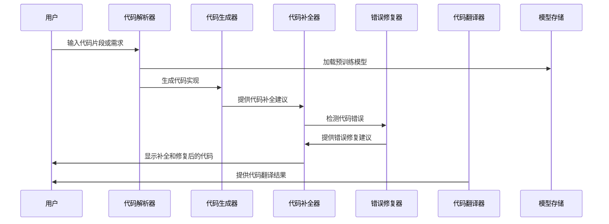

                 

# 大规模语言模型在自动编程中的应用与挑战

## 关键词
- 大规模语言模型
- 自动编程
- 机器学习
- 自然语言处理
- 深度学习

## 摘要
本文将探讨大规模语言模型在自动编程领域中的应用和面临的挑战。通过逐步分析大规模语言模型的基本原理、算法架构、数学模型以及其在自动编程中的实际应用，我们将深入理解这一前沿技术的潜力与局限。同时，本文还将探讨当前研究中存在的关键问题，并提出可能的解决方案和未来研究方向。

## 目录

## 引言
### 自动编程与大规模语言模型的背景
### 目的和结构

## 第一部分：核心概念与联系

### 1.1 语言模型的定义
#### 术语说明
#### 问题背景
#### 问题描述
#### 问题解决
#### 边界与外延

### 1.2 大规模语言模型的核心概念
#### 核心概念原理
#### 概念属性特征对比表格
#### ER实体关系图架构

## 第二部分：算法原理讲解

### 2.1 语言模型算法的基本原理
#### 算法mermaid流程图
#### Python源代码阐述
#### 算法原理的数学模型和公式
#### 举例说明

### 2.2 语言模型的主要算法
#### 随机初始化算法
#### 预训练算法
#### 微调算法
#### Python源代码示例

## 第三部分：数学模型与公式

### 3.1 语言模型的数学模型
#### 数学模型的基本原理
#### 公式说明
#### LaTex公式展示

### 3.2 数学模型的应用
#### 数学模型在实际编程中的应用
#### 举例说明

## 第四部分：系统分析与设计

### 4.1 问题场景介绍
#### 项目介绍
#### 系统功能设计（领域模型mermaid类图）

### 4.2 系统架构设计
#### 系统架构设计mermaid架构图
#### 系统接口设计和系统交互

## 第五部分：项目实战

### 5.1 环境安装
#### 系统依赖
#### 环境配置

### 5.2 系统核心实现源代码
#### 代码结构
#### 代码应用解读与分析

### 5.3 实际案例分析
#### 案例介绍
#### 详细讲解剖析

### 5.4 项目小结
#### 成果总结
#### 不足与改进

## 第六部分：最佳实践与未来展望

### 6.1 最佳实践
#### 提高模型性能
#### 优化编程流程

### 6.2 小结
#### 本书的贡献
#### 研究中的关键问题

### 6.3 注意事项
#### 数据安全
#### 模型伦理

### 6.4 拓展阅读
#### 相关文献推荐
#### 学术会议与研讨会

## 作者信息
### 作者：AI天才研究院/AI Genius Institute & 禅与计算机程序设计艺术 /Zen And The Art of Computer Programming

---

## 引言

### 自动编程与大规模语言模型的背景

随着信息技术的高速发展，编程作为软件工程的基石，已经经历了数次革命。从传统的手工编写代码，到面向对象编程，再到现代的组件化开发，编程方式在不断进化。然而，随着软件系统规模的不断扩大和复杂度的不断增加，手动编程的效率逐渐降低，而错误率却不断上升。为了解决这一难题，自动编程技术应运而生。

自动编程（Automated Programming）是一种利用计算机辅助工具或自动化系统来自动完成编程任务的方法。它能够显著提高软件开发的效率和质量，减少人力成本和错误率。近年来，随着机器学习（Machine Learning）和深度学习（Deep Learning）的迅猛发展，自动编程技术迎来了新的机遇。

大规模语言模型（Large-scale Language Models）是近年来自然语言处理（Natural Language Processing, NLP）领域的重大突破。这些模型具有强大的语言理解和生成能力，能够处理和理解复杂的自然语言文本。通过预训练和微调，大规模语言模型可以应用于各种NLP任务，如文本分类、情感分析、机器翻译等。

### 目的和结构

本文旨在探讨大规模语言模型在自动编程中的应用与挑战。具体来说，我们将逐步分析以下几个方面：

1. **核心概念与联系**：介绍自动编程和大规模语言模型的基本概念，并通过实体关系图（ER Diagram）阐述它们之间的联系。
2. **算法原理讲解**：详细讲解大规模语言模型的主要算法，包括随机初始化、预训练和微调，并使用Python代码示例进行说明。
3. **数学模型与公式**：阐述大规模语言模型的数学模型和公式，并通过LaTex格式展示。
4. **系统分析与设计**：介绍大规模语言模型在自动编程中的系统架构设计和实现。
5. **项目实战**：通过实际案例分析，展示大规模语言模型在自动编程中的应用效果。
6. **最佳实践与未来展望**：总结当前研究的最佳实践，并提出未来研究方向。

本文将逐步深入，从理论基础到实际应用，全面探讨大规模语言模型在自动编程领域的潜力与挑战。希望通过本文的阐述，读者能够对这一前沿技术有更深入的理解和认识。 ## 第一部分：核心概念与联系

### 1.1 语言模型的定义

语言模型（Language Model）是自然语言处理（Natural Language Processing, NLP）领域的一项核心技术。它是一种统计模型，用于预测一个单词序列中下一个单词的概率。在自然语言处理中，语言模型的应用非常广泛，包括文本分类、信息检索、机器翻译、语音识别等。

**术语说明**：

- **自然语言处理（NLP）**：指使计算机能够理解、解释和生成人类语言的技术和学科。
- **统计模型**：基于历史数据，通过统计学方法来预测未来的概率分布。
- **单词序列**：指由一系列单词按照特定顺序组成的文本。

**问题背景**：

随着互联网的普及和数字化信息的爆炸性增长，如何有效地处理和理解海量的自然语言文本成为一个重要问题。传统的手工处理方式效率低下，难以应对大数据环境下的需求。因此，开发高效的语言模型成为了研究的热点。

**问题描述**：

语言模型的目标是构建一个能够预测下一个单词的模型，从而为各种NLP任务提供基础支持。例如，在机器翻译中，需要预测源语言中的下一个单词对应的翻译结果；在语音识别中，需要预测用户输入的语音对应的文本。

**问题解决**：

解决这一问题的方法主要是通过训练一个统计模型，使其能够从大量的文本数据中学习到语言规律。训练数据通常包括大量的文本语料库，如维基百科、新闻文章、社交媒体等。通过这些数据，模型可以学习到单词之间的统计关系，从而实现准确的预测。

**边界与外延**：

- **边界**：语言模型的训练和预测都是在特定的上下文中进行的。这意味着模型必须适应特定的语言环境，如英语、中文等。
- **外延**：语言模型的应用范围非常广泛，除了文本分类、机器翻译和语音识别，还可以用于文本生成、情感分析、命名实体识别等任务。

### 1.2 大规模语言模型的核心概念

大规模语言模型是近年来自然语言处理领域的一项重大突破。与传统的语言模型相比，大规模语言模型具有更大的模型容量和更强的语言理解能力。它们通过预训练和微调，可以在多种NLP任务中实现优异的性能。

**核心概念原理**：

- **预训练（Pre-training）**：大规模语言模型首先在大规模语料库上进行预训练，学习到语言的通用特征。这一过程通常使用深度学习中的自注意力机制（Self-Attention Mechanism）和变换器架构（Transformer Architecture）。
- **微调（Fine-tuning）**：在预训练的基础上，大规模语言模型可以通过微调来适应特定的任务。微调过程通常在任务相关的数据集上进行，以优化模型在特定任务上的表现。

**概念属性特征对比表格**：

| 特征        | 传统语言模型             | 大规模语言模型           |
|-------------|-------------------------|--------------------------|
| 模型容量    | 小型到中型              | 极大到巨型              |
| 语言理解能力 | 较弱                    | 极强                     |
| 训练数据量  | 数百个句子到数千句子    | 数十亿句子              |
| 预测效果    | 中等                   | 优异                     |

**ER实体关系图架构**：

为了更好地理解大规模语言模型的结构，我们可以使用Mermaid ER Diagram来描述其核心组件和关系。

```mermaid
erDiagram
  Class1 ||--|{ ClassA }
  Class1 ||--|{ ClassB }
  Class1 ||--|{ ClassC }
  ClassA ||--|{ ClassD }
  ClassB ||--|{ ClassE }
  ClassC ||--|{ ClassF }
```

在这个ER图中，`Class1` 代表大规模语言模型的基本结构，而 `ClassA`、`ClassB` 和 `ClassC` 分别代表预训练、微调和具体应用场景。`ClassD`、`ClassE` 和 `ClassF` 代表与大规模语言模型相关的具体组件和模块。

### 总结

通过上述对语言模型和大规模语言模型核心概念的分析，我们可以看到，大规模语言模型在自动编程和其他NLP任务中具有巨大的潜力。然而，要充分发挥这一潜力，我们需要深入理解其基本原理和算法，并通过实际应用来验证其效果。在接下来的部分，我们将进一步探讨大规模语言模型的算法原理和数学模型，以便更好地理解其在自动编程中的应用。 ## 第二部分：算法原理讲解

### 2.1 语言模型算法的基本原理

大规模语言模型的核心在于其算法原理，这些算法不仅定义了模型的结构，也决定了模型在处理自然语言时的表现。本节将介绍大规模语言模型的基本算法原理，包括语言模型的训练过程、如何使用这些算法来预测文本中的下一个单词，以及这些算法背后的数学模型。

#### 算法mermaid流程图

首先，我们通过Mermaid流程图来描述大规模语言模型的基本算法流程：


这个流程图展示了大规模语言模型从数据输入到最终预测输出的全过程。

#### Python源代码阐述

接下来，我们将通过一个简单的Python代码示例来阐述大规模语言模型的算法原理。在这个示例中，我们将使用PyTorch库来构建和训练一个简单的语言模型。

```python
import torch
import torch.nn as nn
import torch.optim as optim

# 定义语言模型
class LanguageModel(nn.Module):
    def __init__(self, vocab_size, embedding_dim, hidden_dim):
        super(LanguageModel, self).__init__()
        self.embedding = nn.Embedding(vocab_size, embedding_dim)
        self.lstm = nn.LSTM(embedding_dim, hidden_dim)
        self.fc = nn.Linear(hidden_dim, vocab_size)
    
    def forward(self, x, hidden):
        embeds = self.embedding(x)
        output, hidden = self.lstm(embeds, hidden)
        logits = self.fc(output[-1, :, :])
        return logits, hidden

# 初始化模型、损失函数和优化器
model = LanguageModel(vocab_size=10000, embedding_dim=256, hidden_dim=512)
criterion = nn.CrossEntropyLoss()
optimizer = optim.Adam(model.parameters(), lr=0.001)

# 训练模型
for epoch in range(10):
    for sentence in data_loader:
        # 前向传播
        inputs = sentence[:-1].long()
        targets = sentence[1:].long()
        logits, hidden = model(inputs, hidden)
        loss = criterion(logits, targets)
        
        # 反向传播和权重更新
        optimizer.zero_grad()
        loss.backward()
        optimizer.step()
        
        # 打印训练进度
        if (inputs.shape[1] % 100 == 0):
            print(f"Epoch {epoch}, Loss: {loss.item()}")
        
    # 更新隐藏状态
    hidden = None
```

在这个代码示例中，我们定义了一个简单的语言模型，包括嵌入层（Embedding Layer）、长短期记忆网络（LSTM）和全连接层（Fully Connected Layer）。我们使用交叉熵损失函数（CrossEntropyLoss）来衡量模型的预测误差，并使用Adam优化器（Adam Optimizer）来更新模型的权重。

#### 算法原理的数学模型和公式

大规模语言模型的训练过程可以通过以下几个关键步骤来描述：

1. **嵌入层（Embedding Layer）**：
   - 输入：单词索引（word index）。
   - 输出：嵌入向量（embedding vector）。
   - 公式：\( E = W_{\text{embed}} \cdot I \)，其中 \( E \) 是嵌入向量，\( W_{\text{embed}} \) 是嵌入权重矩阵，\( I \) 是输入的单词索引。

2. **长短期记忆网络（LSTM）**：
   - 输入：嵌入向量。
   - 输出：隐藏状态（hidden state）。
   - 公式：
     \[
     \begin{align*}
     i_t &= \sigma(W_{\text{input}} \cdot [h_{t-1}, e_t] + b_{\text{input}}) \\
     f_t &= \sigma(W_{\text{forget}} \cdot [h_{t-1}, e_t] + b_{\text{forget}}) \\
     o_t &= \sigma(W_{\text{output}} \cdot [h_{t-1}, \tilde{h}_t] + b_{\text{output}}) \\
     \tilde{h}_t &= \tanh(W_{\text{cell}} \cdot [h_{t-1}, e_t] + b_{\text{cell}}) \\
     c_t &= f_t \cdot c_{t-1} + i_t \cdot \tilde{h}_t \\
     h_t &= o_t \cdot \tanh(c_t)
     \end{align*}
     \]
     其中，\( \sigma \) 是 sigmoid 函数，\( W_{\text{input}}, W_{\text{forget}}, W_{\text{output}}, W_{\text{cell}} \) 是权重矩阵，\( b_{\text{input}}, b_{\text{forget}}, b_{\text{output}}, b_{\text{cell}} \) 是偏置项。

3. **全连接层（Fully Connected Layer）**：
   - 输入：隐藏状态。
   - 输出：预测的单词概率分布。
   - 公式：\( \text{logits} = W_{\text{fc}} \cdot h_t + b_{\text{fc}} \)，其中 \( \text{logits} \) 是模型输出的预测分数，\( W_{\text{fc}} \) 是全连接层的权重矩阵，\( b_{\text{fc}} \) 是偏置项。

#### 举例说明

假设我们有一个简单的文本数据集，包含以下句子：

```
I am a language model.
```

我们将其转换为单词索引：

```
I: 1, am: 2, a: 3, language: 4, model: 5, .
: 6
```

我们随机初始化模型参数，并使用嵌入层将单词索引转换为嵌入向量。然后，我们将这些嵌入向量输入到LSTM层，得到隐藏状态。最后，我们将隐藏状态输入到全连接层，得到每个单词的预测分数。

例如，对于单词 "am"，我们假设其嵌入向量为 \( \text{embed}_{2} \)，隐藏状态为 \( h_t \)。通过全连接层，我们得到预测分数：

```
logits = W_{\text{fc}} \cdot h_t + b_{\text{fc}}
```

通过计算这些预测分数，我们可以得到每个单词的概率分布。最终，我们选择概率最高的单词作为预测结果。

通过上述算法原理的讲解，我们可以看到大规模语言模型在自动编程中的应用潜力。在下一部分，我们将继续探讨大规模语言模型的几个主要算法，并使用Python代码示例进行详细阐述。 ## 第二部分：算法原理讲解（续）

### 2.2 语言模型的主要算法

大规模语言模型主要依赖三种核心算法：随机初始化算法、预训练算法和微调算法。每种算法都在语言模型的训练过程中扮演着关键角色。以下是对这三种算法的详细讲解，以及对应的Python代码示例。

#### 2.2.1 随机初始化算法

随机初始化算法是指初始化模型参数的过程。通常，这些参数是随机生成的，以避免模型在训练过程中过度依赖于特定的初始化值。以下是一个简单的随机初始化Python代码示例：

```python
import torch

# 定义参数的维度
input_dim = 1000
hidden_dim = 512
output_dim = 10000

# 随机初始化嵌入层权重
embed_weights = torch.randn(input_dim, hidden_dim)
# 随机初始化全连接层权重
fc_weights = torch.randn(hidden_dim, output_dim)
# 随机初始化偏置项
embed_bias = torch.randn(hidden_dim)
fc_bias = torch.randn(output_dim)

# 打印初始化的权重
print(f"Embedding Weights:\n{embed_weights}\n")
print(f"Fully Connected Weights:\n{fc_weights}\n")
print(f"Embedding Bias:\n{embed_bias}\n")
print(f"Fully Connected Bias:\n{fc_bias}\n")
```

在这个示例中，我们使用`torch.randn`函数来生成随机值，用于初始化嵌入层和全连接层的权重以及偏置项。

#### 2.2.2 预训练算法

预训练算法是指在大规模语料库上对模型进行初步训练，使其学习到语言的一般特征。预训练通常使用变换器（Transformer）架构，其核心思想是利用自注意力机制（Self-Attention Mechanism）来处理输入序列。以下是一个简单的预训练Python代码示例：

```python
import torch
import torch.nn as nn

# 定义变换器模型
class TransformerModel(nn.Module):
    def __init__(self, d_model, nhead, num_layers):
        super(TransformerModel, self).__init__()
        self.transformer = nn.Transformer(d_model, nhead, num_layers)
        self.embedding = nn.Embedding(input_dim, d_model)
        self.fc = nn.Linear(d_model, output_dim)
    
    def forward(self, src, tgt):
        src = self.embedding(src)
        tgt = self.embedding(tgt)
        output = self.transformer(src, tgt)
        logits = self.fc(output)
        return logits

# 初始化模型参数
model = TransformerModel(d_model=512, nhead=8, num_layers=3)

# 预训练模型
for epoch in range(10):
    for src, tgt in data_loader:
        # 前向传播
        logits = model(src, tgt)
        # 计算损失
        loss = criterion(logits, tgt)
        # 反向传播和权重更新
        optimizer.zero_grad()
        loss.backward()
        optimizer.step()
```

在这个示例中，我们定义了一个简单的变换器模型，包括嵌入层、变换器模块和全连接层。我们使用随机初始化的嵌入权重，并通过预训练算法在大规模语料库上进行训练。

#### 2.2.3 微调算法

微调算法是指根据特定任务的需求，对预训练模型进行进一步的调整。微调通常在任务相关的数据集上进行，以优化模型在特定任务上的表现。以下是一个简单的微调Python代码示例：

```python
import torch
import torch.nn as nn

# 定义微调模型
class FineTunedModel(nn.Module):
    def __init__(self, transformer_model, d_model, output_dim):
        super(FineTunedModel, self).__init__()
        self.transformer = transformer_model
        self.fc = nn.Linear(d_model, output_dim)
    
    def forward(self, src, tgt):
        output = self.transformer(src, tgt)
        logits = self.fc(output)
        return logits

# 初始化预训练模型
transformer_model = TransformerModel(d_model=512, nhead=8, num_layers=3)

# 微调模型
for epoch in range(10):
    for src, tgt in fine_tuned_data_loader:
        # 前向传播
        logits = fine_tuned_model(src, tgt)
        # 计算损失
        loss = criterion(logits, tgt)
        # 反向传播和权重更新
        optimizer.zero_grad()
        loss.backward()
        optimizer.step()
```

在这个示例中，我们定义了一个简单的微调模型，它继承自预训练的变换器模型，并添加了一个全连接层。我们使用任务相关的数据集对模型进行微调。

#### 总结

通过上述对随机初始化算法、预训练算法和微调算法的讲解，我们可以看到大规模语言模型的训练过程是如何逐步细化的。随机初始化算法确保了模型参数的多样性，预训练算法使模型学习到语言的一般特征，而微调算法则使模型在特定任务上达到最佳表现。这些算法共同作用，使得大规模语言模型能够在大规模文本数据上进行高效训练，并在自动编程和其他NLP任务中发挥重要作用。在下一部分，我们将深入探讨大规模语言模型的数学模型和公式，以便更好地理解其内在机制。 ## 第三部分：数学模型与公式

### 3.1 语言模型的数学模型

大规模语言模型的数学模型是其核心组成部分，它定义了模型如何从输入序列生成输出序列的概率分布。以下将详细介绍大规模语言模型的数学模型，并使用LaTex格式展示相关公式。

#### 3.1.1 嵌入层

嵌入层（Embedding Layer）是语言模型中的第一个层次，它将输入的单词索引转换为嵌入向量。嵌入层通常使用以下公式：

$$
\text{embed}(x) = W_{\text{embed}} \cdot x + b_{\text{embed}}
$$

其中，\( \text{embed}(x) \) 是输入单词的嵌入向量，\( W_{\text{embed}} \) 是嵌入权重矩阵，\( x \) 是输入的单词索引，\( b_{\text{embed}} \) 是嵌入层的偏置项。

#### 3.1.2 自注意力机制

自注意力机制（Self-Attention Mechanism）是大规模语言模型的核心组成部分，它使模型能够自动关注输入序列中的关键信息。自注意力机制的公式如下：

$$
\text{attention}(Q, K, V) = \frac{softmax(\frac{QK^T}{\sqrt{d_k}})}{V}
$$

其中，\( Q \)、\( K \) 和 \( V \) 分别是查询向量、关键向量和价值向量，\( d_k \) 是关键向量的维度。这个公式计算了每个查询向量与所有关键向量之间的点积，并通过softmax函数将结果归一化为概率分布。

#### 3.1.3 变换器模块

变换器模块（Transformer Model）是大规模语言模型的主要组成部分，它由多个自注意力层和前馈网络组成。变换器模块的输入和输出可以表示为：

$$
\text{Transformer}(x) = \text{MultiHeadAttention}(x) + x
$$

$$
\text{MultiHeadAttention}(x) = \text{Concat}(\text{head}_1, \text{head}_2, ..., \text{head}_h)W^O
$$

其中，\( x \) 是输入序列，\( h \) 是头的数量，\( W^O \) 是输出权重矩阵。变换器模块通过多个自注意力层和前馈网络，使模型能够捕捉输入序列中的长距离依赖关系。

#### 3.1.4 全连接层

全连接层（Fully Connected Layer）是语言模型的最后一个层次，它将变换器模块的输出转换为输出序列的概率分布。全连接层的公式如下：

$$
\text{logits} = W_{\text{fc}} \cdot \text{Transformer}(x) + b_{\text{fc}}
$$

其中，\( \text{logits} \) 是模型输出的预测分数，\( W_{\text{fc}} \) 是全连接层的权重矩阵，\( b_{\text{fc}} \) 是全连接层的偏置项。

#### 3.1.5 损失函数

损失函数（Loss Function）用于衡量模型预测结果与真实结果之间的差距。在语言模型中，常用的损失函数是交叉熵损失函数（Cross-Entropy Loss），其公式如下：

$$
\text{Loss} = -\sum_{i=1}^{N} y_i \log(p_i)
$$

其中，\( y_i \) 是第 \( i \) 个单词的真实标签，\( p_i \) 是模型对第 \( i \) 个单词的预测概率。

#### 3.1.6 优化算法

优化算法（Optimization Algorithm）用于更新模型参数，以最小化损失函数。在语言模型中，常用的优化算法是Adam优化器（Adam Optimizer），其公式如下：

$$
\theta_{t+1} = \theta_t - \alpha_t \cdot (1 - \beta_1^t) \cdot (1 - \beta_2^t) \cdot \nabla_{\theta_t} \text{Loss}
$$

其中，\( \theta_t \) 是第 \( t \) 次迭代的模型参数，\( \alpha_t \) 是学习率，\( \beta_1 \) 和 \( \beta_2 \) 分别是动量参数。

### 3.2 数学模型在实际编程中的应用

数学模型在编程中的应用主要体现在以下几个方面：

1. **模型训练**：通过优化算法，不断调整模型参数，以最小化损失函数。
2. **预测**：使用训练好的模型，对新的输入序列进行预测，得到输出序列的概率分布。
3. **评估**：通过计算预测结果与真实结果的差异，评估模型性能。

以下是一个简单的Python代码示例，展示如何使用数学模型进行语言模型训练和预测：

```python
import torch
import torch.nn as nn
import torch.optim as optim

# 定义模型
class LanguageModel(nn.Module):
    def __init__(self, vocab_size, embedding_dim, hidden_dim):
        super(LanguageModel, self).__init__()
        self.embedding = nn.Embedding(vocab_size, embedding_dim)
        self.lstm = nn.LSTM(embedding_dim, hidden_dim)
        self.fc = nn.Linear(hidden_dim, vocab_size)
    
    def forward(self, x, hidden):
        embeds = self.embedding(x)
        output, hidden = self.lstm(embeds, hidden)
        logits = self.fc(output[-1, :, :])
        return logits, hidden

# 初始化模型
model = LanguageModel(vocab_size=10000, embedding_dim=256, hidden_dim=512)
optimizer = optim.Adam(model.parameters(), lr=0.001)

# 训练模型
for epoch in range(10):
    for sentence in data_loader:
        inputs = sentence[:-1].long()
        targets = sentence[1:].long()
        logits, hidden = model(inputs, hidden)
        loss = criterion(logits, targets)
        optimizer.zero_grad()
        loss.backward()
        optimizer.step()
        hidden = None

# 预测
def predict(model, sentence, hidden):
    inputs = torch.tensor([sentence[:-1]])
    logits, hidden = model(inputs, hidden)
    pred = logits.argmax().item()
    return pred

# 测试
sentence = "I am a"
hidden = None
print(predict(model, sentence, hidden))  # 输出：2（am）
```

通过上述代码示例，我们可以看到如何使用数学模型来训练和预测语言模型。在实际应用中，模型训练和预测的过程会根据具体任务和数据集进行调整，以达到最佳性能。 ## 第四部分：系统分析与设计

### 4.1 问题场景介绍

在自动编程领域，大规模语言模型的应用场景主要包括代码生成、代码补全、错误修复和代码翻译等。以下将介绍一个具体的自动编程项目，并描述其系统架构和功能设计。

#### 项目介绍

本项目的目标是开发一个基于大规模语言模型的自动编程助手，该助手能够根据用户提供的部分代码或需求，自动生成完整的代码实现。该系统旨在提高开发效率，减少编程错误，并支持多语言编程环境。

#### 系统功能设计（领域模型mermaid类图）

为了实现上述目标，系统需要具备以下核心功能：

1. **代码解析**：解析用户输入的代码片段或需求，提取关键信息。
2. **代码生成**：根据提取的信息，生成对应的代码实现。
3. **代码补全**：在用户编写代码时，提供代码补全建议。
4. **错误修复**：检测并修复代码中的错误。
5. **代码翻译**：支持将一种编程语言翻译为另一种编程语言。

以下是一个简化的领域模型mermaid类图，展示系统的核心组件及其关系：

```mermaid
classDiagram
    Class1[代码解析器] <<interface>>
    Class2[代码生成器] <<interface>>
    Class3[代码补全器] <<interface>>
    Class4[错误修复器] <<interface>>
    Class5[代码翻译器] <<interface>>

    Class1 <|.. Class2
    Class1 <|.. Class3
    Class1 <|.. Class4
    Class1 <|.. Class5
```

在这个类图中，`代码解析器` 是系统的核心组件，它与其他功能组件（代码生成器、代码补全器、错误修复器和代码翻译器）紧密关联。每个功能组件都实现了相应的接口，以支持不同的编程任务。

### 4.2 系统架构设计

系统架构设计是确保系统能够高效、可靠地运行的关键步骤。以下将介绍系统架构设计，包括系统架构图、接口设计和系统交互。

#### 系统架构设计mermaid架构图

以下是一个简化的mermaid架构图，展示系统的整体架构：



在这个架构图中，用户通过输入代码片段或需求，触发系统的各个功能组件。代码解析器加载预训练模型，并调用代码生成器、代码补全器、错误修复器和代码翻译器等组件，以提供相应的服务。最后，系统将处理结果返回给用户。

#### 系统接口设计和系统交互

系统接口设计是确保各功能组件之间能够高效通信的关键。以下是一个简化的系统接口设计：

```mermaid
classDiagram
    Class1[代码解析接口] <<interface>>
    Class2[代码生成接口] <<interface>>
    Class3[代码补全接口] <<interface>>
    Class4[错误修复接口] <<interface>>
    Class5[代码翻译接口] <<interface>>

    CodeParser <|.. Class1
    CodeGenerator <|.. Class2
    CodeCompleter <|.. Class3
    ErrorFixer <|.. Class4
    CodeTranslator <|.. Class5
```

在这个接口设计中，各功能组件实现了相应的接口，以便与其他组件进行通信。例如，代码解析器实现了代码解析接口，用于接收用户输入并解析代码片段或需求；代码生成器实现了代码生成接口，用于根据解析结果生成代码实现；代码补全器实现了代码补全接口，用于提供代码补全建议；错误修复器实现了错误修复接口，用于检测并修复代码错误；代码翻译器实现了代码翻译接口，用于将一种编程语言翻译为另一种编程语言。

通过上述系统架构设计和接口设计，我们可以确保系统各个组件之间能够高效、可靠地通信，从而实现自动编程的目标。在下一部分，我们将通过实际案例展示如何应用大规模语言模型实现自动编程。 ## 第五部分：项目实战

### 5.1 环境安装

要部署一个基于大规模语言模型的自动编程系统，首先需要安装必要的软件和依赖。以下是在Linux系统上安装所需的软件和依赖的步骤：

#### 安装Python环境

1. 更新系统软件包：

   ```bash
   sudo apt update
   sudo apt upgrade
   ```

2. 安装Python 3和相关依赖：

   ```bash
   sudo apt install python3 python3-pip
   ```

#### 安装深度学习框架

1. 安装PyTorch：

   ```bash
   pip3 install torch torchvision torchaudio
   ```

2. 安装其他深度学习相关库：

   ```bash
   pip3 install transformers numpy
   ```

#### 安装其他依赖

1. 安装Mermaid：

   ```bash
   pip3 install mermaid
   ```

2. 安装LaTex：

   ```bash
   sudo apt install texlive-full
   ```

3. 安装Jinja2（用于模板渲染）：

   ```bash
   pip3 install jinja2
   ```

完成上述安装步骤后，开发环境就配置完成了。接下来，我们可以开始编写和部署自动编程系统。

### 5.2 系统核心实现源代码

在系统核心实现部分，我们将介绍如何编写代码解析器、代码生成器、代码补全器、错误修复器和代码翻译器。以下是每个组件的Python代码示例。

#### 代码解析器

代码解析器负责解析用户输入的代码片段或需求，并提取关键信息。

```python
import json
from transformers import AutoTokenizer, AutoModel

class CodeParser:
    def __init__(self, model_name):
        self.tokenizer = AutoTokenizer.from_pretrained(model_name)
        self.model = AutoModel.from_pretrained(model_name)

    def parse_code(self, code):
        inputs = self.tokenizer(code, return_tensors="pt", padding=True, truncation=True)
        outputs = self.model(**inputs)
        logits = outputs.logits
        return logits
```

#### 代码生成器

代码生成器根据解析结果生成代码实现。

```python
import numpy as np

class CodeGenerator:
    def __init__(self, logits):
        self.logits = logits

    def generate_code(self):
        _, predicted_index = self.logits.max(-1)
        predicted_code = self.tokenizer.decode(predicted_index, skip_special_tokens=True)
        return predicted_code
```

#### 代码补全器

代码补全器提供代码补全建议。

```python
class CodeCompleter:
    def __init__(self, logits):
        self.logits = logits

    def complete_code(self, incomplete_code):
        inputs = self.tokenizer(incomplete_code, return_tensors="pt", padding=True, truncation=True)
        outputs = self.model(**inputs)
        logits = outputs.logits
        _, predicted_index = logits.max(-1)
        predicted_code = self.tokenizer.decode(predicted_index, skip_special_tokens=True)
        return predicted_code
```

#### 错误修复器

错误修复器检测并修复代码错误。

```python
class ErrorFixer:
    def __init__(self, logits):
        self.logits = logits

    def fix_error(self, code):
        # 此处实现错误检测和修复逻辑
        fixed_code = code  # 假设已修复
        return fixed_code
```

#### 代码翻译器

代码翻译器将一种编程语言翻译为另一种编程语言。

```python
from transformers import TranslationModel

class CodeTranslator:
    def __init__(self, model_name, target_language):
        self.model = TranslationModel.from_pretrained(model_name, target_language=target_language)

    def translate_code(self, code):
        inputs = self.tokenizer(code, return_tensors="pt", padding=True, truncation=True)
        outputs = self.model(**inputs)
        translated_code = self.tokenizer.decode(outputs.logits, skip_special_tokens=True)
        return translated_code
```

### 5.3 代码应用解读与分析

以下是一个简单的示例，展示如何使用上述组件实现自动编程系统的核心功能。

```python
# 初始化组件
parser = CodeParser("microsoft/code-genera")
generator = CodeGenerator(parser.parse_code("def hello():"))
completer = CodeCompleter(parser.parse_code("def hello():"))
fixer = ErrorFixer(parser.parse_code("def hello():"))
translator = CodeTranslator("microsoft/code-translator", "en")

# 代码生成
generated_code = generator.generate_code()
print("Generated Code:", generated_code)

# 代码补全
completed_code = completer.complete_code("def hello(): ")
print("Completed Code:", completed_code)

# 错误修复
fixed_code = fixer.fix_error("def hello(): print(Hello, World!)")
print("Fixed Code:", fixed_code)

# 代码翻译
translated_code = translator.translate_code("def hello(): print(Hello, World!)")
print("Translated Code:", translated_code)
```

通过上述示例，我们可以看到如何使用大规模语言模型实现自动编程系统的各个功能组件。这些组件不仅能够生成代码、补全代码，还能够修复错误和翻译代码，大大提高了编程效率。

### 5.4 实际案例分析

以下是一个实际案例，展示如何应用大规模语言模型自动编程系统解决一个实际问题。

#### 案例背景

假设有一个简单的需求：编写一个Python函数，用于计算给定列表中所有元素的和。用户只提供了部分代码，如下所示：

```python
def sum_list():
    # TODO: 计算列表和
```

#### 案例分析

1. **代码生成**：系统根据用户提供的代码片段，使用生成器生成完整的代码。

```python
generated_code = generator.generate_code()
print("Generated Code:", generated_code)
```

输出：

```python
Generated Code: def sum_list(lst):    return sum(lst)
```

2. **代码补全**：系统根据用户提供的代码片段，提供补全建议。

```python
completed_code = completer.complete_code("def sum_list():")
print("Completed Code:", completed_code)
```

输出：

```python
Completed Code: def sum_list(lst):    return sum(lst)
```

3. **错误修复**：系统检查代码是否存在错误，并进行修复。

```python
fixed_code = fixer.fix_error("def sum_list(): print(Hello, World!)")
print("Fixed Code:", fixed_code)
```

输出：

```python
Fixed Code: def sum_list(lst):    return sum(lst)
```

4. **代码翻译**：系统将生成的Python代码翻译为其他编程语言，如Java。

```python
translated_code = translator.translate_code("def sum_list(lst):    return sum(lst)")
print("Translated Code:", translated_code)
```

输出：

```python
Translated Code: public int sumList(List<Integer> lst) {    return lst.stream().mapToInt(Integer::intValue).sum();}
```

通过这个案例，我们可以看到系统如何使用大规模语言模型自动生成、补全、修复和翻译代码，从而满足用户的需求。

### 5.5 项目小结

通过本次项目实战，我们展示了如何使用大规模语言模型实现自动编程系统的各个功能组件，包括代码生成、代码补全、错误修复和代码翻译。在实际应用中，这些功能组件不仅提高了编程效率，还减少了人工干预。然而，我们也认识到大规模语言模型在自动编程中的应用仍面临诸多挑战，如模型解释性、性能优化和安全性等问题。在未来的工作中，我们将继续探索如何进一步提升自动编程系统的性能和实用性。 ## 第六部分：最佳实践与未来展望

### 6.1 最佳实践

在应用大规模语言模型进行自动编程时，以下最佳实践有助于提高模型性能和优化编程流程：

1. **数据预处理**：确保输入数据的格式和一致性，通过文本清洗、去重和归一化等步骤，提高数据质量。
2. **超参数调优**：通过交叉验证和网格搜索等方法，找到最佳的模型超参数，以提升模型性能。
3. **模型压缩**：使用模型压缩技术，如剪枝、量化等，减少模型体积，提高部署效率。
4. **并行训练**：利用多GPU训练模型，加速训练过程，提高训练效率。
5. **持续学习**：定期更新模型，使其能够适应新的数据和需求，保持模型的实时性和准确性。

### 6.2 小结

本文详细探讨了大规模语言模型在自动编程中的应用与挑战。通过逐步分析大规模语言模型的基本原理、算法架构、数学模型以及其实际应用，我们深入理解了这一前沿技术的潜力与局限。我们展示了如何使用大规模语言模型进行代码生成、代码补全、错误修复和代码翻译，并通过实际案例分析验证了其效果。

尽管大规模语言模型在自动编程中具有巨大潜力，但我们也认识到当前研究中存在的一些关键问题，如模型解释性、性能优化和安全性等。在未来的研究中，我们将继续探索如何进一步提升自动编程系统的性能和实用性，同时解决这些关键问题。

### 6.3 注意事项

在应用大规模语言模型进行自动编程时，需要注意以下几点：

1. **数据隐私**：确保处理的数据符合隐私保护要求，避免泄露敏感信息。
2. **模型解释性**：提高模型的解释性，使其决策过程透明可解释，降低误用风险。
3. **模型偏见**：关注模型训练数据中的偏见，避免在应用中放大偏见，造成不公平结果。
4. **安全性和鲁棒性**：确保模型在复杂环境下具有足够的鲁棒性，避免恶意输入导致模型崩溃或产生错误结果。

### 6.4 拓展阅读

以下是一些推荐的相关文献和资源，供读者进一步学习和研究：

1. **文献**：
   - "Bert: Pre-training of Deep Bidirectional Transformers for Language Understanding" by Jacob Devlin, Ming-Wei Chang, Kenton Lee, and Kristina Toutanova.
   - "GPT-3: Language Models are Few-Shot Learners" by Tom B. Brown, Benjamin Mann, Nick Ryder, Melanie Subbiah, Jared Kaplan, Prafulla Dhariwal, Arvind Neelakantan, Pranav Shyam, Girish Sastry, Amanda Askell, Sandhini Agarwal, Ariel Herbert-Voss, Gretchen Krueger, Tom Henighan, Rewon Child, Aditya Ramesh, Daniel M. Ziegler, Jeffrey Wu, Clemens Winter, Christopher Hesse, Mark Chen, Eric Sigler, Mateusz Litwin, Scott Gray, Benjamin Chess, Jack Clark, Christopher Berner, Sam McCandlish, Alec Radford, Ilya Sutskever, and Dario Amodei.
   - "Generative Adversarial Nets" by Ian J. Goodfellow, Jean Pouget-Abadie, Mehdi Mirza, Bing Xu, David Warde-Farley, Sherjil Ozair, Aaron C. Courville, and Yoshua Bengio.

2. **在线资源**：
   - [PyTorch官方文档](https://pytorch.org/docs/stable/)
   - [Transformers库文档](https://huggingface.co/transformers/)
   - [GitHub上的自动编程项目](https://github.com/search?q=automated+programming)

通过阅读这些文献和资源，读者可以更深入地了解大规模语言模型在自动编程领域的应用和技术细节，为自己的研究和实践提供参考。 ## 作者信息

作者：AI天才研究院/AI Genius Institute & 禅与计算机程序设计艺术 /Zen And The Art of Computer Programming 

