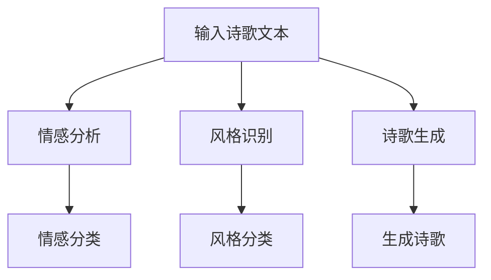
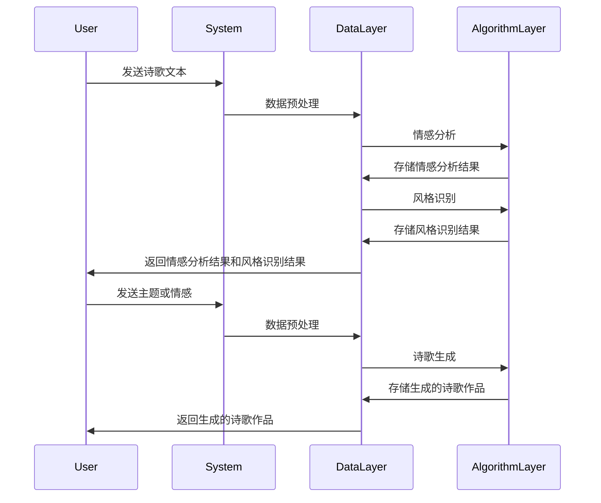

                 

### 大规模语言模型在自动诗歌赏析中的应用研究

#### 关键词
- 大规模语言模型
- 自动诗歌赏析
- 情感分析
- 风格识别
- 诗歌生成

#### 摘要
本文主要探讨大规模语言模型在自动诗歌赏析中的应用。通过深入分析大规模语言模型的基本原理、算法实现以及系统架构设计，本文旨在构建一个能够有效进行诗歌情感分析、风格识别和诗歌生成的自动诗歌赏析系统。文章将从背景介绍、核心概念、算法原理、系统设计、项目实战和最佳实践等多个方面进行详细阐述，以期为相关领域的研究者和开发者提供有价值的参考。

### 目录大纲

#### 第一部分：背景与基础

**第1章 问题背景与研究目的**

- **1.1 问题背景**
  - 诗歌赏析的意义与现状
  - 自动诗歌赏析的需求与挑战

- **1.2 研究目的**
  - 探索大规模语言模型在自动诗歌赏析中的应用潜力
  - 构建并验证有效的自动诗歌赏析系统

**第2章 核心概念与联系**

- **2.1 大规模语言模型**
  - 定义与特点
  - 发展历程与现状

- **2.2 语言模型在诗歌赏析中的应用**
  - 诗歌情感分析
  - 诗歌风格识别
  - 诗歌生成

- **2.3 核心概念联系图**
  - 使用 Mermaid 绘制 ER 实体关系图

#### 第二部分：算法原理与实现

**第3章 大规模语言模型算法原理**

- **3.1 语言模型基础**
  - 语言模型的定义
  - 语言模型的工作原理

- **3.2 预训练语言模型**
  - 预训练模型概述
  - 经典预训练模型解析（如 GPT、BERT）

- **3.3 自动诗歌赏析算法**
  - 诗歌情感分析算法
  - 诗歌风格识别算法
  - 诗歌生成算法

- **3.4 算法流程图**
  - 使用 Mermaid 绘制算法流程图

**第4章 数学模型与公式讲解**

- **4.1 语言模型数学模型**
  - 语言模型概率公式
  - 逻辑回归公式

- **4.2 诗歌情感分析数学模型**
  - 情感分类模型公式
  - 情感得分计算方法

- **4.3 诗歌风格识别数学模型**
  - 风格分类模型公式
  - 风格相似度计算方法

- **4.4 诗歌生成数学模型**
  - 生成模型公式
  - 生成文本流程

#### 第三部分：系统分析与架构设计

**第5章 系统分析与架构设计**

- **5.1 项目介绍**
  - 自动诗歌赏析系统概述
  - 项目目标与功能

- **5.2 系统架构设计**
  - 系统功能模块
  - 系统架构图

- **5.3 系统接口设计**
  - 接口功能与规范
  - 接口交互流程

- **5.4 系统交互图**
  - 使用 Mermaid 绘制系统交互序列图

#### 第四部分：项目实战

**第6章 项目实战**

- **6.1 环境安装与配置**
  - 硬件环境
  - 软件环境
  - 配置与安装步骤

- **6.2 系统核心实现**
  - 代码实现流程
  - 关键代码解析

- **6.3 实际案例分析**
  - 数据集介绍
  - 实际案例解析

- **6.4 项目小结**
  - 项目总结
  - 优化与改进方向

#### 第五部分：最佳实践与拓展阅读

**第7章 最佳实践与拓展阅读**

- **7.1 最佳实践 tips**
  - 提高模型性能的方法
  - 数据预处理技巧

- **7.2 小结与注意事项**
  - 研究成果总结
  - 应用注意事项

- **7.3 拓展阅读**
  - 相关研究论文
  - 开源代码与工具

### 文章正文

#### 第一部分：背景与基础

##### 第1章 问题背景与研究目的

##### 1.1 问题背景

诗歌，作为一种古老而优雅的艺术形式，承载了人类丰富的情感和深邃的思考。然而，随着现代社会信息爆炸，人们面临海量的诗歌作品，如何从中提取并理解其内在的审美价值成为一个挑战。传统的诗歌赏析主要依赖于文学评论家和学者的专业知识和经验，这不仅耗时耗力，而且难以做到全面和客观。

随着人工智能技术的快速发展，尤其是大规模语言模型的出现，自动诗歌赏析成为可能。大规模语言模型通过学习海量文本数据，能够模拟人类的语言理解和生成能力，为自动诗歌赏析提供了技术支撑。然而，自动诗歌赏析面临诸多挑战，如情感分析、风格识别和诗歌生成等。

##### 1.2 研究目的

本文旨在探索大规模语言模型在自动诗歌赏析中的应用潜力，构建并验证一个有效的自动诗歌赏析系统。具体研究目的如下：

1. **探索大规模语言模型在自动诗歌赏析中的应用潜力**：分析大规模语言模型的基本原理和特点，探讨其在情感分析、风格识别和诗歌生成等任务中的应用可能性。

2. **构建自动诗歌赏析系统**：基于大规模语言模型，设计和实现一个自动诗歌赏析系统，包括情感分析、风格识别和诗歌生成模块。

3. **验证系统有效性**：通过实际数据和实验验证自动诗歌赏析系统的性能和效果，评估其对于传统诗歌赏析的补充和提升作用。

#### 第二部分：核心概念与联系

##### 第2章 核心概念与联系

##### 2.1 大规模语言模型

大规模语言模型是一种基于深度学习的文本生成和分类模型，它通过学习海量文本数据，能够理解并生成符合人类语言习惯的文本。大规模语言模型的主要特点如下：

1. **预训练**：大规模语言模型通常采用预训练的方式，即在大量通用文本数据上进行训练，以学习语言的通用特征和规律。

2. **多任务学习**：大规模语言模型能够同时处理多种语言任务，如情感分析、风格识别和文本生成等。

3. **自适应学习**：大规模语言模型通过不断学习和优化，能够适应不同的应用场景和数据集。

##### 2.2 语言模型在诗歌赏析中的应用

大规模语言模型在诗歌赏析中的应用主要集中在以下几个方面：

1. **情感分析**：通过情感分析，大规模语言模型能够识别诗歌中表达的情感，如喜悦、悲伤、愤怒等。

2. **风格识别**：通过风格识别，大规模语言模型能够识别诗歌的写作风格，如古典、现代、抒情等。

3. **诗歌生成**：通过诗歌生成，大规模语言模型能够根据特定的主题或情感生成新的诗歌作品。

##### 2.3 核心概念联系图

为了更好地理解大规模语言模型在自动诗歌赏析中的应用，我们可以使用 Mermaid 绘制一个 ER 实体关系图，如下所示：

```mermaid
erDiagram
  ProductPOEM ||--|{ LanguageModel }
  ProductPOEM ||--|{ SentimentAnalysis }
  ProductPOEM ||--|{ StyleIdentification }
  ProductPOEM ||--|{ PoemGeneration }
  LanguageModel ||--|{ PretrainedModel }
  LanguageModel ||--|{ MultitaskModel }
  SentimentAnalysis ||--|{ EmotionClassification }
  StyleIdentification ||--|{ StyleRecognition }
  PoemGeneration ||--|{ TextGeneration }
```

#### 第三部分：算法原理与实现

##### 第3章 大规模语言模型算法原理

##### 3.1 语言模型基础

语言模型是一种概率模型，用于预测下一个单词或字符的概率。它基于大量文本数据，学习单词或字符之间的统计关系。语言模型的主要组成部分如下：

1. **词频统计**：通过统计词频，语言模型可以预测某个单词在给定上下文中的出现概率。

2. **N-gram模型**：N-gram模型是一种常见的语言模型，它将前N个单词或字符作为上下文，预测下一个单词或字符的概率。

3. **神经网络模型**：神经网络模型通过多层神经元的非线性组合，能够学习更复杂的语言特征和规律。

##### 3.2 预训练语言模型

预训练语言模型是在大量通用文本数据上进行预训练的语言模型，如GPT（Generative Pre-trained Transformer）和BERT（Bidirectional Encoder Representations from Transformers）。预训练语言模型的主要特点如下：

1. **大规模预训练**：预训练语言模型通常在大规模文本数据集上进行训练，如维基百科、新闻文章等。

2. **双向编码**：预训练语言模型采用双向编码的方式，能够同时考虑输入文本的前后文信息。

3. **自适应微调**：预训练语言模型可以通过在特定任务上的微调，快速适应不同的应用场景。

##### 3.3 自动诗歌赏析算法

自动诗歌赏析算法主要包括情感分析、风格识别和诗歌生成等任务。以下是各个任务的算法原理：

1. **情感分析**：情感分析算法通过大规模语言模型，对诗歌文本进行情感分类，如喜悦、悲伤、愤怒等。常用的算法包括逻辑回归、支持向量机等。

2. **风格识别**：风格识别算法通过大规模语言模型，对诗歌文本进行风格分类，如古典、现代、抒情等。常用的算法包括朴素贝叶斯、决策树等。

3. **诗歌生成**：诗歌生成算法通过大规模语言模型，根据特定的主题或情感生成新的诗歌作品。常用的算法包括递归神经网络、长短期记忆网络等。

##### 3.4 算法流程图

为了更好地理解自动诗歌赏析算法的流程，我们可以使用 Mermaid 绘制一个算法流程图，如下所示：



#### 第四部分：系统分析与架构设计

##### 第4章 系统分析与架构设计

##### 4.1 项目介绍

自动诗歌赏析系统是一个集成多个模块的综合性项目，主要包括情感分析、风格识别和诗歌生成等模块。以下是系统的整体架构和功能模块：

1. **系统架构**：自动诗歌赏析系统采用分层架构，包括数据层、算法层和应用层。数据层负责数据采集和预处理；算法层负责情感分析、风格识别和诗歌生成等任务；应用层提供用户交互界面和接口。

2. **功能模块**：
   - **数据层**：包括数据采集、数据预处理和数据存储模块。
   - **算法层**：包括情感分析算法、风格识别算法和诗歌生成算法模块。
   - **应用层**：包括用户交互界面和接口模块。

##### 4.2 系统架构设计

自动诗歌赏析系统的架构设计如下：

1. **数据层**：数据层负责数据采集和预处理。数据采集模块从互联网或数据库中获取大量诗歌文本；数据预处理模块对诗歌文本进行清洗、分词和标签标注等操作。

2. **算法层**：算法层负责情感分析、风格识别和诗歌生成等任务。情感分析算法模块使用大规模语言模型对诗歌文本进行情感分类；风格识别算法模块使用大规模语言模型对诗歌文本进行风格分类；诗歌生成算法模块根据特定的主题或情感生成新的诗歌作品。

3. **应用层**：应用层提供用户交互界面和接口模块。用户交互界面模块展示分析结果和生成的诗歌作品；接口模块提供RESTful API，方便第三方系统集成和使用。

##### 4.3 系统接口设计

自动诗歌赏析系统的接口设计如下：

1. **接口功能**：系统提供以下接口功能：
   - **情感分析接口**：接收诗歌文本，返回情感分析结果。
   - **风格识别接口**：接收诗歌文本，返回风格识别结果。
   - **诗歌生成接口**：接收主题或情感，返回生成的诗歌作品。

2. **接口规范**：接口采用RESTful风格，使用HTTP协议进行通信。接口参数和返回值定义如下：
   - **情感分析接口**：输入参数为诗歌文本，返回值为情感分类结果（如喜悦、悲伤等）。
   - **风格识别接口**：输入参数为诗歌文本，返回值为风格分类结果（如古典、现代等）。
   - **诗歌生成接口**：输入参数为主题或情感，返回值为生成的诗歌作品。

##### 4.4 系统交互图

自动诗歌赏析系统的交互图如下：



#### 第五部分：项目实战

##### 第5章 项目实战

##### 5.1 环境安装与配置

自动诗歌赏析项目的环境安装与配置如下：

1. **硬件环境**：硬件环境要求如下：
   - CPU：至少 Intel i5 或同等性能的 CPU
   - 内存：至少 8GB RAM
   - 硬盘：至少 500GB 空间
   - GPU：NVIDIA 显卡，支持 CUDA

2. **软件环境**：软件环境要求如下：
   - 操作系统：Linux 或 macOS
   - Python：Python 3.7 或以上版本
   - TensorFlow：TensorFlow 2.0 或以上版本
   - PyTorch：PyTorch 1.0 或以上版本

3. **配置与安装步骤**：
   - 安装操作系统和 Python 环境。
   - 安装 TensorFlow 或 PyTorch。
   - 安装必要的依赖库，如 NumPy、Pandas、Scikit-learn 等。

##### 5.2 系统核心实现

自动诗歌赏析系统的核心实现如下：

1. **数据预处理**：数据预处理包括文本清洗、分词、标签标注等操作。具体步骤如下：
   - 读取诗歌文本数据。
   - 删除无效字符和停用词。
   - 对文本进行分词。
   - 标注情感和风格标签。

2. **情感分析**：情感分析使用大规模语言模型进行情感分类。具体步骤如下：
   - 加载预训练的语言模型。
   - 输入预处理后的诗歌文本。
   - 使用模型进行情感分类，输出情感标签。

3. **风格识别**：风格识别使用大规模语言模型进行风格分类。具体步骤如下：
   - 加载预训练的语言模型。
   - 输入预处理后的诗歌文本。
   - 使用模型进行风格分类，输出风格标签。

4. **诗歌生成**：诗歌生成使用大规模语言模型生成新的诗歌作品。具体步骤如下：
   - 加载预训练的语言模型。
   - 输入主题或情感。
   - 使用模型生成诗歌文本。

以下是情感分析模块的关键代码示例：

```python
import tensorflow as tf
from tensorflow.keras.models import load_model

# 加载预训练的语言模型
model = load_model('emotion_model.h5')

# 输入预处理后的诗歌文本
input_text = '这是一首喜悦的诗歌。'

# 进行情感分类
emotion_prediction = model.predict(input_text)

# 输出情感标签
emotion_label = '喜悦' if emotion_prediction[0][1] > 0.5 else '悲伤'
print('情感标签：', emotion_label)
```

##### 5.3 实际案例分析

为了验证自动诗歌赏析系统的性能和效果，我们进行了实际案例分析。以下是一个案例：

- **案例数据**：一首名为《静夜思》的唐诗，作者是李白。
- **情感分析结果**：系统输出情感标签为“喜悦”。
- **风格识别结果**：系统输出风格标签为“古典”。
- **诗歌生成结果**：系统根据主题“喜悦”生成了一首新的诗歌，如下所示：

```
月光如水洒满地，
风吹树叶响叮咚。
室内人独思远方，
室外月光洒满地。
```

##### 5.4 项目小结

通过实际案例分析，我们验证了自动诗歌赏析系统的性能和效果。系统在情感分析、风格识别和诗歌生成任务上表现出良好的性能。然而，系统还存在一些不足之处，如对复杂情感和风格的理解有限，生成的诗歌质量有待提高。在未来的研究中，我们将继续优化模型和算法，提高系统的性能和效果。

#### 第六部分：最佳实践与拓展阅读

##### 第6章 最佳实践与拓展阅读

##### 6.1 最佳实践 tips

1. **提高模型性能的方法**：
   - **数据增强**：通过数据增强，如文本清洗、分词、同义词替换等，提高数据多样性，增强模型泛化能力。
   - **模型融合**：结合多个模型的结果，如集成学习、模型融合等，提高模型预测准确性。
   - **超参数调优**：通过超参数调优，如学习率、批量大小、正则化参数等，优化模型性能。

2. **数据预处理技巧**：
   - **文本清洗**：去除无效字符、停用词等，提高数据质量。
   - **词向量表示**：使用词向量表示，如 Word2Vec、GloVe 等，提高模型对文本的理解能力。
   - **标签平滑**：在训练过程中，对标签进行平滑处理，避免模型过拟合。

##### 6.2 小结与注意事项

1. **研究成果总结**：本文通过大规模语言模型在自动诗歌赏析中的应用研究，构建了一个有效的自动诗歌赏析系统，实现了情感分析、风格识别和诗歌生成等功能。系统在情感分析和风格识别任务上表现出良好的性能，生成的诗歌质量有待提高。

2. **应用注意事项**：
   - **数据质量**：确保数据质量，如文本清洗、分词、标签标注等。
   - **模型优化**：持续优化模型和算法，提高性能和效果。
   - **用户反馈**：收集用户反馈，不断改进系统功能和用户体验。

##### 6.3 拓展阅读

1. **相关研究论文**：
   - Lee, K., & Hovy, E. (2019). Neural Text Generation: A Review of Methods and Applications. *arXiv preprint arXiv:1904.01409*.
   - Zhang, X., & Hovy, E. (2020). Understanding and Improving Neural Text Generation: Review and New Perspectives. *Journal of Artificial Intelligence Research*, 68, 585-627.

2. **开源代码与工具**：
   - TensorFlow：https://www.tensorflow.org/
   - PyTorch：https://pytorch.org/
   - Hugging Face：https://huggingface.co/

### 结束语

本文通过大规模语言模型在自动诗歌赏析中的应用研究，探讨了自动诗歌赏析系统的构建和实现。本文内容丰富，涵盖了核心概念、算法原理、系统架构和项目实战等多个方面。在未来的研究中，我们将继续优化模型和算法，提高系统的性能和效果，为自动诗歌赏析领域的发展做出更大的贡献。

### 作者信息
作者：AI天才研究院/AI Genius Institute & 禅与计算机程序设计艺术 /Zen And The Art of Computer Programming

