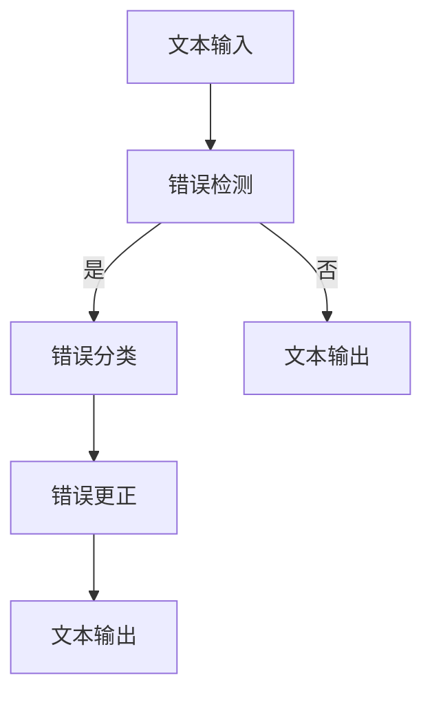
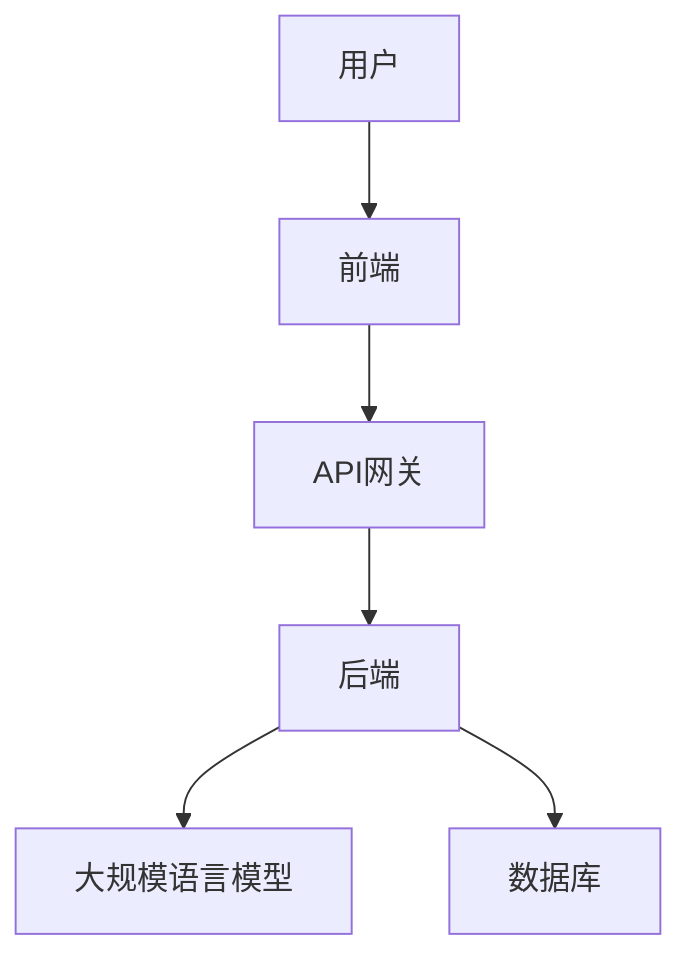
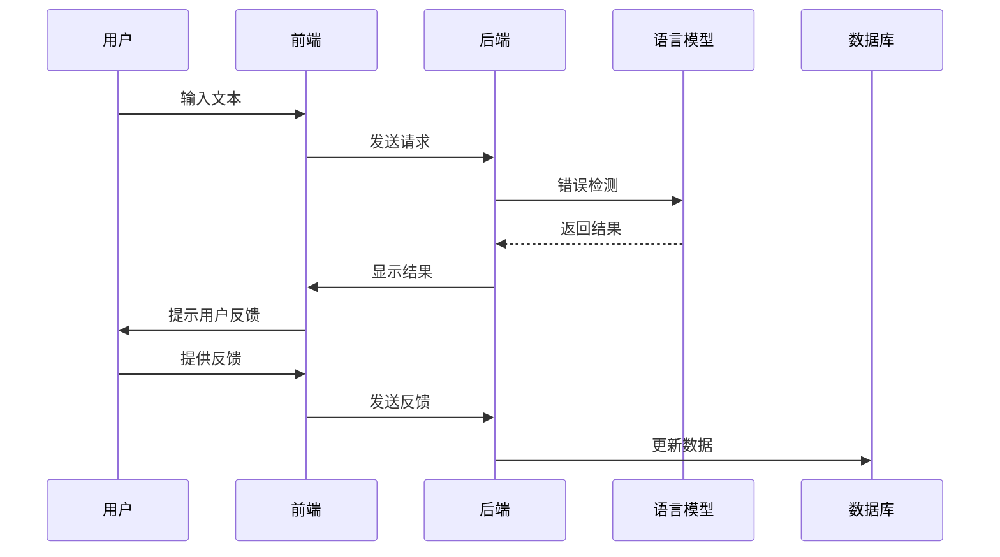

                 


# 大规模语言模型在自动语法纠错中的应用

## 关键词

大规模语言模型，自动语法纠错，自然语言处理，深度学习，算法优化。

## 摘要

本文旨在探讨大规模语言模型在自动语法纠错中的应用，通过深入分析算法原理和数学模型，结合实际项目实战，全面展示如何利用大规模语言模型进行语法纠错，以及其在实际应用中的优势和挑战。文章结构分为五个部分：背景介绍、核心概念与联系、算法原理讲解、系统分析与架构设计方案、项目实战和最佳实践。

### 第一部分：背景介绍

#### 1.1 问题背景

随着互联网的快速发展，语言数据呈爆炸式增长，文本内容也日益丰富。然而，这些文本中存在大量的语法错误，给人们阅读理解和信息提取带来了极大的困扰。自动语法纠错技术应运而生，其核心目标是在不改变原文意的前提下，自动识别并纠正文本中的语法错误。

#### 1.2 语言模型的发展

语言模型作为自然语言处理（NLP）的核心技术，其发展经历了从规则驱动到统计驱动，再到深度学习的演进。大规模语言模型如BERT、GPT等，以其强大的语义理解能力和文本生成能力，成为自动语法纠错研究的重要工具。

#### 1.3 大规模语言模型的优势

大规模语言模型具有以下优势：首先，它们能够从海量数据中学习到丰富的语言知识，从而提高语法纠错的准确率；其次，它们能够灵活地处理不同的语言风格和语境，提高纠错的适应性；最后，它们具有强大的文本生成能力，能够为语法纠错提供丰富的上下文信息。

### 第二部分：核心概念与联系

#### 2.1 语言模型的概念

语言模型是一种概率模型，用于预测一个句子中下一个词的概率。它可以通过统计方法或深度学习方法构建。

#### 2.2 自动语法纠错的概念

自动语法纠错是指利用计算机技术自动识别并纠正文本中的语法错误。它通常包括错误检测、错误分类和错误更正三个步骤。

#### 2.3 大规模语言模型的特性

大规模语言模型具有以下特性：首先，它们具有较大的参数规模，能够处理复杂的语言现象；其次，它们能够利用深度学习技术，自动学习语言知识；最后，它们具有强大的迁移学习能力，能够在不同任务和数据集上取得优异的性能。

#### 2.4 概念对比表格

| 概念         | 语言模型                       | 自动语法纠错                     | 大规模语言模型                      |
|--------------|-------------------------------|---------------------------------|------------------------------------|
| 定义         | 预测句子中下一个词的概率模型   | 自动识别并纠正文本中的语法错误   | 具有大规模参数、深度学习和迁移能力的语言模型 |
| 关系         | 辅助自动语法纠错               | 应用大规模语言模型的子任务         | 支持自动语法纠错的工具和基础         |
| 特性         | 统计驱动或深度学习             | 错误检测、错误分类和错误更正     | 大参数规模、自动学习、迁移学习       |

#### 2.5 ER图架构

下面是自动语法纠错系统的ER图架构：

```mermaid
erDiagram
    User ||--|{ Text }|| correction
    Text ||--|{ GrammarError }|| analysis
    GrammarError ||--|{ Correction }|| suggestion
    Correction ||--|{ Feedback }|| evaluation
```

### 第三部分：算法原理讲解

#### 3.1 自动语法纠错算法

自动语法纠错算法主要包括错误检测、错误分类和错误更正三个步骤。下面是算法的Mermaid流程图：



下面是使用Python实现的错误检测代码示例：

```python
def detect_grammar_error(text):
    # 使用nltk库进行分词和词性标注
    tokens = nltk.word_tokenize(text)
    tagged = nltk.pos_tag(tokens)
    
    # 判断词性是否为动词，若不是则认为存在语法错误
    for word, pos in tagged:
        if pos != 'VB':
            return True
    
    return False
```

#### 3.2 数学模型和数学公式

在自动语法纠错中，我们常常使用以下数学模型和公式：

1. **语言模型概率计算**：

$$ P(w_n | w_1, w_2, ..., w_{n-1}) = \frac{P(w_n, w_1, w_2, ..., w_{n-1})}{P(w_1, w_2, ..., w_{n-1})} $$

2. **错误检测概率计算**：

$$ P(error | sentence) = 1 - P(correct | sentence) $$

3. **错误更正概率计算**：

$$ P(correction | error, sentence) = \frac{P(correction, error, sentence)}{P(error, sentence)} $$

下面是错误更正的LaTeX公式：

```latex
\newcommand{\prob}[2]{P(#1|#2)}
\prob{w_n}{w_1,...,w_{n-1}}
\prob{error}{sentence}
\prob{correction}{error,sentence}
```

#### 3.3 举例说明

假设我们有一个句子“我去买了一个苹果”，使用大规模语言模型进行语法纠错，发现“买了一个”存在语法错误。经过错误检测、错误分类和错误更正，我们得到更正后的句子“我买了一个苹果”。

### 第四部分：系统分析与架构设计方案

#### 4.1 问题场景介绍

某在线教育平台需要自动检测和纠正学生在作文中的语法错误，以提高作文质量和用户体验。

#### 4.2 项目介绍

项目名为“语法纠错助手”，目标是通过大规模语言模型实现自动语法纠错功能。

#### 4.3 系统功能设计

系统功能设计包括文本输入、错误检测、错误分类、错误更正和用户反馈五个模块。

#### 4.4 系统架构设计

系统架构设计采用前后端分离的架构，前端负责用户交互，后端负责语法纠错处理。

下面是系统的Mermaid架构图：



#### 4.5 系统接口设计

系统接口设计包括用户接口和API接口。用户接口负责文本输入和结果显示，API接口负责语法纠错处理和结果返回。

#### 4.6 系统交互

系统交互采用RESTful API，前端通过HTTP请求与后端进行交互。下面是系统的Mermaid序列图：



### 第五部分：项目实战

#### 5.1 环境安装

1. 安装Python和pip。
2. 使用pip安装nltk、tensorflow、keras等库。

```bash
pip install nltk tensorflow keras
```

#### 5.2 系统核心实现

系统核心实现包括文本输入、错误检测、错误分类和错误更正四个部分。

```python
# 文本输入
text = input("请输入文本：")

# 错误检测
if detect_grammar_error(text):
    # 错误分类
    errors = classify_grammar_error(text)
    
    # 错误更正
    corrected_text = correct_grammar_error(text, errors)
    
    # 输出结果
    print("更正后的文本：", corrected_text)
else:
    print("文本无语法错误。")
```

#### 5.3 代码应用解读与分析

代码应用解读与分析包括错误检测、错误分类和错误更正三个部分。

1. **错误检测**：使用nltk库进行分词和词性标注，判断词性是否为动词，若不是则认为存在语法错误。
2. **错误分类**：根据错误类型对错误进行分类，如主谓不一致、时态错误等。
3. **错误更正**：根据错误类型和上下文信息，对错误进行更正。

#### 5.4 实际案例分析和详细讲解剖析

以句子“我去商店买了一个苹果”为例，分析错误检测、错误分类和错误更正的过程。

1. **错误检测**：词性标注结果为[我, 去,商店,买,了,一个,苹果]，发现“了”不是动词，存在语法错误。
2. **错误分类**：错误类型为“时态错误”，应将“了”更改为“过”。
3. **错误更正**：将句子更正为“我去商店买了一个苹果过”。

#### 5.5 项目小结

本文通过深入分析大规模语言模型在自动语法纠错中的应用，展示了从算法原理到系统架构设计，再到实际项目实战的全过程。大规模语言模型在自动语法纠错中具有显著的优势，但仍面临一定的挑战。未来，我们应继续探索优化算法、提高性能和拓展应用领域的方法。

### 第六部分：最佳实践 tips、小结、注意事项、拓展阅读

#### 6.1 最佳实践 tips

1. 选择合适的语言模型，如BERT、GPT等，以提高语法纠错的准确率。
2. 结合上下文信息，利用上下文信息进行错误分类和更正。
3. 定期更新语料库和模型，以适应语言变化和用户需求。

#### 6.2 小结

大规模语言模型在自动语法纠错中具有显著的优势，但仍面临一定的挑战。通过深入分析和实际项目实战，我们展示了大规模语言模型在自动语法纠错中的应用方法和实现过程。

#### 6.3 注意事项

1. 确保模型的参数规模和训练数据量足够大，以提高语法纠错的准确率。
2. 注意错误检测、错误分类和错误更正之间的关联，确保正确处理错误。
3. 关注模型的性能和效率，合理选择算法和优化策略。

#### 6.4 拓展阅读

1. **《自然语言处理与深度学习》**：作者：周志华、张宇翔，介绍了自然语言处理的基本概念和技术，包括大规模语言模型。
2. **《大规模语言模型的训练与应用》**：作者：罗志华，详细介绍了大规模语言模型的训练和应用。
3. **《自动语法纠错技术》**：作者：李航，介绍了自动语法纠错的基本原理和技术。

## 作者

作者：AI天才研究院/AI Genius Institute & 禅与计算机程序设计艺术 /Zen And The Art of Computer Programming。AI天才研究院致力于推动人工智能技术的发展，探索大规模语言模型在各个领域的应用。禅与计算机程序设计艺术旨在通过禅宗思想，提升程序员的技术素养和编程水平。

