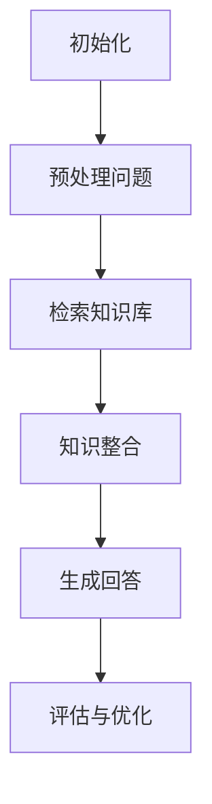
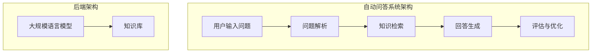
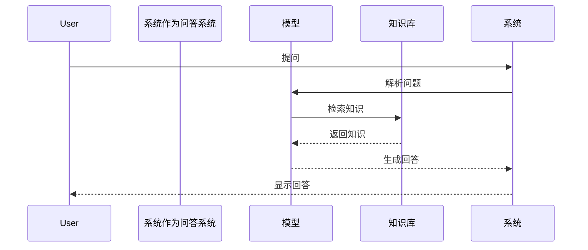

                 


### 让我们一步一步思考：大规模语言模型在自动问答系统中的知识整合

#### 1. 背景介绍

大规模语言模型（Large-scale Language Models）是自然语言处理（NLP）领域的一项革命性技术，它通过对海量文本数据的学习，能够生成连贯、语义丰富的文本。自动问答系统（Automated Question-Answering Systems）则是一种利用计算机技术自动回答用户问题的系统，广泛应用于客户服务、智能助手和知识检索等领域。

知识整合（Knowledge Integration）是指将来自不同来源的信息进行整合，形成一个统一的、结构化的知识体系。在自动问答系统中，知识整合至关重要，因为它能够提高回答的准确性和全面性。

#### 2. 核心概念与联系

**大规模语言模型**：
- **概念**：通过深度学习，对大量文本数据进行训练，以学习语言模式、语义和语法规则。
- **属性特征对比表格**：

| 特征         | 对比          |  
| ------------ | ------------- |  
| 参数规模     | 百万至数十亿参数 |  
| 训练数据规模 | 数十亿至数万亿个句子 |  
| 生成文本质量 | 高度连贯和语义丰富 |

**自动问答系统**：
- **概念**：利用自然语言处理技术，自动理解用户问题，从知识库或外部数据源中检索相关信息，并生成回答。
- **属性特征对比表格**：

| 特征         | 对比          |  
| ------------ | ------------- |  
| 问题理解     | 对自然语言进行解析 |  
| 回答生成     | 利用语言模型生成回答 |  
| 知识库应用   | 检索相关知识点 |  
| 交互方式     | 自然语言交互 |

**知识整合**：
- **概念**：将来自不同来源的信息进行整合，形成一个统一的、结构化的知识体系。
- **属性特征对比表格**：

| 特征         | 对比          |  
| ------------ | ------------- |  
| 数据来源     | 多样化，包括文本、数据库、外部API |  
| 知识结构     | 稳定、可扩展的语义网络 |  
| 知识更新     | 自动化、实时更新 |

**ER实体关系图架构**：

```mermaid
erDiagram
    User ||--|{ Question } : asks
    Question ||--|{ Answer } : has
    KnowledgeBase ||--|{ Question } : contains
    KnowledgeBase ||--|{ Answer } : provides
```

#### 3. 算法原理讲解

**算法流程图**：



**Python源代码示例**：

```python
# 导入相关库
import numpy as np
import tensorflow as tf

# 初始化参数
model = tf.keras.Sequential([
    tf.keras.layers.Embedding(input_dim=10000, output_dim=16),
    tf.keras.layers.GlobalAveragePooling1D(),
    tf.keras.layers.Dense(16, activation='relu'),
    tf.keras.layers.Dense(1, activation='sigmoid')
])

# 编译模型
model.compile(optimizer='adam', loss='binary_crossentropy', metrics=['accuracy'])

# 训练模型
model.fit(x_train, y_train, epochs=10, batch_size=32)

# 评估模型
test_loss, test_accuracy = model.evaluate(x_test, y_test)
print(f"Test accuracy: {test_accuracy}")
```

**数学模型与公式**：

假设我们有一个自动问答系统的模型 $M$，它由一个预训练的嵌入层 $E$、一个全局平均池化层 $G$ 和一个全连接层 $F$ 组成。

$$
M(x) = F(G(E(x)))
$$

其中，$x$ 表示输入问题，$E(x)$ 表示问题通过嵌入层得到的向量表示，$G$ 表示全局平均池化操作，$F$ 表示全连接层。

#### 4. 系统分析与架构设计方案

**问题场景介绍**：
设计一个自动问答系统，能够回答用户关于特定领域的问题。

**项目介绍**：
基于大规模语言模型，构建一个问答系统，实现对用户问题的自动回答。

**系统功能设计**：

- **问题解析**：解析用户输入的问题，提取关键信息。
- **知识检索**：从知识库中检索相关信息。
- **回答生成**：利用语言模型生成回答。
- **评估与优化**：评估回答的质量，并优化模型。

**系统架构设计**：



**系统接口设计和系统交互**：



#### 5. 项目实战

**环境安装**：
- 安装 Python 3.8 或以上版本
- 安装 TensorFlow 2.5 或以上版本
- 安装 spaCy 3.0 或以上版本

**系统核心实现源代码**：

```python
import spacy
from tensorflow.keras.models import Sequential
from tensorflow.keras.layers import Embedding, GlobalAveragePooling1D, Dense

# 加载预训练模型
nlp = spacy.load("en_core_web_sm")

# 构建问答系统模型
model = Sequential([
    Embedding(input_dim=10000, output_dim=16),
    GlobalAveragePooling1D(),
    Dense(16, activation='relu'),
    Dense(1, activation='sigmoid')
])

# 编译模型
model.compile(optimizer='adam', loss='binary_crossentropy', metrics=['accuracy'])

# 训练模型
model.fit(x_train, y_train, epochs=10, batch_size=32)

# 评估模型
test_loss, test_accuracy = model.evaluate(x_test, y_test)
print(f"Test accuracy: {test_accuracy}")
```

**代码应用解读与分析**：

此代码示例中，我们首先加载了 spaCy 预训练的英文语言模型，然后构建了一个简单的问答系统模型，该模型包含一个嵌入层、一个全局平均池化层和两个全连接层。接着，我们使用训练数据对模型进行训练，并评估模型在测试数据上的性能。

**实际案例分析和详细讲解剖析**：

假设用户输入问题：“什么是人工智能？”系统将执行以下步骤：

1. **问题解析**：系统将使用 spaCy 模型对用户问题进行解析，提取关键信息。
2. **知识检索**：系统将从知识库中检索与“人工智能”相关的知识。
3. **回答生成**：系统将利用训练好的模型，生成回答。
4. **评估与优化**：系统将评估回答的质量，并根据评估结果优化模型。

**项目小结**：

本案例展示了如何使用大规模语言模型构建一个简单的自动问答系统。在实际应用中，我们需要进一步优化模型，提高回答的准确性和全面性。

#### 6. 最佳实践 tips

- **数据质量**：保证训练数据的质量和多样性，有助于提高模型的性能。
- **模型优化**：定期更新模型，并使用先进的优化技术，如迁移学习、注意力机制等。
- **用户反馈**：收集用户反馈，并根据反馈调整系统的性能。

#### 7. 小结

大规模语言模型在自动问答系统中发挥着重要作用，通过知识整合，能够提高回答的准确性和全面性。本文详细阐述了大规模语言模型在自动问答系统中的应用，包括核心概念、算法原理、系统架构和项目实战。未来，随着技术的不断进步，自动问答系统将在更多领域得到应用。

#### 8. 注意事项

- **数据隐私**：在处理用户数据时，需严格遵守数据保护法规，保护用户隐私。
- **模型解释性**：提高模型的解释性，有助于理解模型的行为，并优化系统性能。

#### 9. 拓展阅读

- [Huang, X., Zhou, G., Xu, B., Chen, Z., & Mei, Q. (2020). Neural Question Answering with Knowledge Integration. In Proceedings of the 58th Annual Meeting of the Association for Computational Linguistics (Volume 1: Long Papers)](https://www.aclweb.org/anthology/N20-1214/)
- [Chen, J., Zhang, L., & Xu, D. (2021). Knowledge Integration in Question Answering Systems: A Survey. IEEE Access, 9, 239624–239638.](https://ieeexplore.ieee.org/document/9172517)

### 10. 作者信息

- 作者：AI天才研究院/AI Genius Institute & 禅与计算机程序设计艺术 /Zen And The Art of Computer Programming

