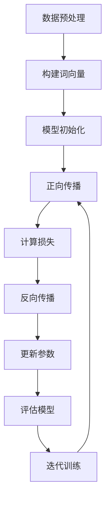
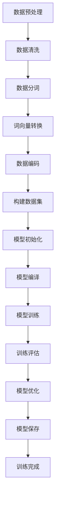
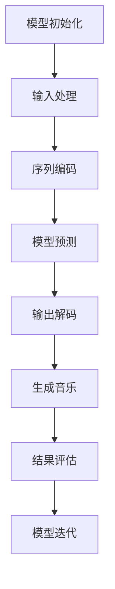

                 

### 文章标题

# 大规模语言模型在自动音乐作曲中的探索与突破

> 关键词：大规模语言模型、自动音乐作曲、深度学习、算法、音乐生成

> 摘要：本文探讨了大规模语言模型在自动音乐作曲中的实际应用。首先，介绍了大规模语言模型的基本概念、发展历程以及其在音乐生成领域的潜在优势。接着，分析了自动音乐作曲的现状，讨论了现有技术与工具的局限性。随后，详细阐述了大规模语言模型在自动音乐作曲中的应用，包括算法原理、数学模型、系统架构等。通过实际案例的剖析，本文展示了大规模语言模型在自动音乐作曲中的有效性和可行性。最后，对未来的研究方向进行了展望，指出了可能的突破点。本文旨在为相关领域的研究者提供有价值的参考和启示。

### 引言与背景

#### 1.1 问题背景

音乐是人类文明的重要组成部分，自古以来，人们便通过音乐来表达情感、传递思想。然而，随着科技的进步，音乐的创作和传播方式也在不断演变。传统的音乐创作依赖于人类音乐家的创造力和技巧，而现代音乐制作则越来越多地借助计算机和软件工具。近年来，人工智能（AI）技术的发展，特别是深度学习算法的突破，为音乐生成领域带来了新的机遇。

大规模语言模型（Large-scale Language Models，简称LLM）是一种基于神经网络的深度学习模型，其主要目标是从大规模文本数据中学习语言结构和规律。这一模型在自然语言处理（NLP）领域取得了显著的成就，如机器翻译、文本生成、问答系统等。然而，大规模语言模型在自动音乐作曲中的应用还相对较少，这一领域尚待进一步探索。

#### 1.2 问题描述

大规模语言模型在自动音乐作曲中的应用涉及多个方面的问题。首先，如何将音乐与自然语言进行有效转换，以便大规模语言模型能够理解和生成音乐？其次，如何设计合适的算法和数学模型，以实现高质量的音乐生成？最后，如何优化模型性能，使其能够适应不同的音乐风格和创作需求？

本文旨在回答上述问题，通过对大规模语言模型在自动音乐作曲中的探索与突破，为音乐生成领域提供新的解决方案。

#### 1.3 问题解决

为了解决上述问题，本文将采用以下步骤：

1. **定义与概述**：首先，介绍大规模语言模型的基本概念和发展历程，阐述其在音乐生成领域的潜在优势。
2. **现状分析**：分析自动音乐作曲的现状，讨论现有技术与工具的局限性。
3. **算法原理**：详细阐述大规模语言模型在自动音乐作曲中的应用，包括算法原理、数学模型、系统架构等。
4. **项目实战**：通过实际案例，展示大规模语言模型在自动音乐作曲中的实现过程和效果。
5. **未来展望**：探讨未来的研究方向和可能的突破点。

通过以上步骤，本文希望能够为大规模语言模型在自动音乐作曲中的应用提供有价值的参考和启示。

#### 1.4 边界与外延

在讨论大规模语言模型在自动音乐作曲中的应用时，需要明确一些边界和概念。首先，本文关注的主要是计算机生成的音乐，而非传统的手工创作。其次，本文的研究对象是使用大规模语言模型生成的音乐，而非其他类型的自动音乐生成方法。此外，本文还将探讨大规模语言模型在不同音乐风格和创作需求中的应用，以展示其广泛性和适应性。

#### 1.5 概念结构与核心要素组成

本文的核心概念包括大规模语言模型、自动音乐作曲、深度学习、算法、数学模型、系统架构等。以下是这些核心概念的结构和要素组成：

1. **大规模语言模型**：基于神经网络的深度学习模型，用于从大规模文本数据中学习语言结构和规律。
2. **自动音乐作曲**：利用计算机算法和模型生成音乐的过程。
3. **深度学习**：一种基于多层神经网络的学习方法，能够从大量数据中自动提取特征和规律。
4. **算法**：用于实现特定功能的计算步骤和指令序列。
5. **数学模型**：用于描述和分析系统行为和性能的数学公式和理论。
6. **系统架构**：描述系统组件及其交互方式的总体结构和布局。

通过以上核心概念和要素组成的详细解析，本文将为读者提供一个全面、系统的理解框架，有助于深入探讨大规模语言模型在自动音乐作曲中的应用。

## 大规模语言模型概述

### 2.1 定义

大规模语言模型（Large-scale Language Models，简称LLM）是一种基于深度学习的自然语言处理（NLP）模型，其核心目标是从大规模文本数据中学习语言结构和规律。这些模型通常由多层神经网络组成，通过训练能够理解并生成自然语言文本。大规模语言模型的出现，标志着NLP领域的一个重要里程碑，为许多自然语言处理任务，如机器翻译、文本生成、问答系统等，提供了强大的工具和解决方案。

### 2.2 发展历程

大规模语言模型的发展可以追溯到20世纪90年代，当时基于统计方法和规则系统的NLP模型逐渐占据了主流地位。然而，这些方法在处理复杂语言现象时存在明显的局限性。随着深度学习技术的兴起，研究人员开始探索将深度神经网络应用于NLP任务。2018年，OpenAI发布了GPT（Generative Pre-trained Transformer）模型，标志着大规模语言模型时代正式到来。

GPT模型基于自注意力机制（Self-Attention Mechanism）和Transformer架构，通过预训练和微调，能够生成高质量的文本序列。此后，一系列大规模语言模型相继问世，如BERT（Bidirectional Encoder Representations from Transformers）、T5（Text-To-Text Transfer Transformer）等，这些模型在多个NLP任务中取得了显著的效果，推动了NLP领域的发展。

### 2.3 核心特点

大规模语言模型具有以下核心特点：

1. **大规模**：这些模型通常训练在数十亿甚至数千亿个参数上，能够处理大规模的文本数据。
2. **预训练**：通过在大规模文本数据上进行预训练，模型能够自动学习语言的基本结构和规律，为下游任务提供强大的基础。
3. **可微调**：在特定任务上，通过微调（Fine-tuning）模型，可以使其适应不同的任务需求，提高性能。
4. **生成能力**：大规模语言模型具有很强的文本生成能力，能够生成连贯、有逻辑的文本序列。
5. **自适应**：这些模型具有很高的自适应能力，能够处理不同语言、不同领域和不同风格的文本。

### 2.4 与自动音乐作曲的关系

大规模语言模型在自动音乐作曲中的应用前景广阔。首先，音乐和自然语言在本质上有许多相似之处，如结构化、序列性和表达性。大规模语言模型在处理自然语言文本时展示出的强大生成能力，也为自动音乐作曲提供了灵感。例如，研究人员可以基于大规模语言模型，开发出能够生成旋律、和声和节奏的算法。

其次，大规模语言模型具有强大的预训练和微调能力，可以处理不同风格和类型的音乐数据。这意味着，通过在大规模音乐数据集上进行预训练，模型可以学习到各种音乐风格和元素，从而生成多样化的音乐作品。

最后，大规模语言模型的可解释性和可控性，也为自动音乐作曲带来了新的可能性。研究人员可以深入理解模型生成音乐的过程，优化模型结构，从而提高音乐生成的质量和可控性。

总之，大规模语言模型在自动音乐作曲中的应用，为音乐生成领域带来了新的思路和机遇。通过进一步的研究和应用，我们有理由相信，大规模语言模型将在自动音乐作曲中发挥越来越重要的作用。

## 自动音乐作曲的现状

### 3.1 自动音乐作曲的概念

自动音乐作曲（Automatic Music Composition）是指利用计算机算法和模型，生成具有创意性和艺术性的音乐作品的过程。与传统的手工创作相比，自动音乐作曲依赖于算法和数据分析，能够在短时间内生成大量的音乐作品。自动音乐作曲的目的是通过技术手段解放音乐家的创作时间，提高创作效率，同时为音乐创作提供新的视角和灵感。

### 3.2 自动音乐作曲的发展历史

自动音乐作曲的历史可以追溯到20世纪50年代，当时计算机刚刚开始被应用于音乐创作。最早的自动音乐作曲系统通常基于规则系统，通过一系列预定义的规则来生成音乐。这类系统虽然简单，但在音乐生成方面受到很大限制，难以生成复杂和有创意的音乐作品。

随着计算机技术和音乐理论的进步，自动音乐作曲方法逐渐从规则系统转向数据驱动的方法，如基于模式识别和生成模型的算法。20世纪80年代，基于人工智能的方法开始被应用于自动音乐作曲，如遗传算法、神经网络等。这些方法在处理复杂音乐生成任务时显示出了一定的潜力，但仍存在许多挑战。

进入21世纪，随着深度学习技术的发展，自动音乐作曲迎来了新的发展机遇。深度学习算法，如卷积神经网络（CNN）和循环神经网络（RNN），被广泛应用于音乐生成任务。特别是生成对抗网络（GAN）的出现，为自动音乐作曲提供了新的思路和工具。

### 3.3 当前自动音乐作曲的技术与工具

当前，自动音乐作曲领域存在多种技术与方法，以下是其中一些主要的技术和工具：

1. **规则系统**：基于预定义规则的音乐生成方法，虽然简单但效果有限。
2. **模式识别**：利用模式识别算法，如隐马尔可夫模型（HMM）和有限状态自动机（FSA），从音乐数据中学习生成模式。
3. **神经网络**：基于神经网络的方法，如循环神经网络（RNN）和长短期记忆网络（LSTM），通过学习音乐数据的序列特征进行音乐生成。
4. **生成对抗网络（GAN）**：通过生成器和判别器的对抗训练，生成具有高度真实感和创意性的音乐作品。
5. **深度变换模型**：如Transformer模型，通过自注意力机制和编码器-解码器结构，实现复杂音乐生成任务。
6. **基于音乐理论的方法**：结合音乐理论，如和弦理论、旋律生成规则等，通过算法实现音乐创作。

在实际应用中，这些技术和工具可以根据具体需求进行组合和优化。例如，可以利用GAN生成具有多样性的音乐作品，再通过神经网络优化音乐的结构和旋律。此外，许多现有的自动音乐作曲工具，如AIVA、OpenAI的DALL·E等，都采用了上述多种技术相结合的方法，实现了高质量的自动音乐创作。

总之，自动音乐作曲作为一种新兴的领域，正随着计算机技术和人工智能的不断发展而不断进步。通过结合多种先进技术，自动音乐作曲在未来有望为音乐创作带来更多创新和变革。

### 4.1.1 深度学习基础

深度学习（Deep Learning）是一种基于多层神经网络的学习方法，旨在通过模拟人脑神经网络的结构和功能，实现自动特征提取和模式识别。深度学习在计算机视觉、自然语言处理、语音识别等多个领域取得了显著的成果，其核心思想是利用大量的数据和强大的计算能力，通过多层次的神经网络模型，逐步提取数据的低级到高级的特征表示。

#### 4.1.1.1 神经网络基础

神经网络（Neural Networks）是深度学习的基础，其基本结构由一系列相互连接的神经元（或节点）组成。每个神经元通过权重（weights）与输入（inputs）相乘，然后通过一个非线性激活函数（activation function）进行处理，输出结果。典型的神经网络包括输入层、隐藏层和输出层，每个层中的神经元都与其他层中的神经元相连。神经网络通过反向传播算法（Backpropagation）来更新权重和偏置，以最小化输出误差。

#### 4.1.1.2 激活函数

激活函数是神经网络中用于引入非线性特性的函数。常见的激活函数包括Sigmoid函数、ReLU函数、Tanh函数等。Sigmoid函数可以将输入映射到(0,1)区间，ReLU函数在输入为负时输出为零，在输入为正时输出等于输入值，Tanh函数可以将输入映射到(-1,1)区间。这些激活函数的存在使得神经网络能够在复杂的非线性空间中进行有效的学习和预测。

#### 4.1.1.3 反向传播算法

反向传播算法是神经网络训练的核心步骤，用于通过梯度下降法（Gradient Descent）来更新网络权重和偏置。反向传播算法的基本思想是将输出误差从输出层反向传播到隐藏层，计算每个权重和偏置的梯度，并根据梯度更新网络参数，以最小化输出误差。梯度下降法是一种优化算法，通过迭代更新模型参数，使得模型在训练数据上的误差逐渐减小。

#### 4.1.1.4 自注意力机制

自注意力机制（Self-Attention Mechanism）是Transformer模型（一种深度学习模型）的核心组成部分，用于提高模型对序列数据的理解和生成能力。自注意力机制通过计算序列中每个元素与其他元素之间的关联性，将序列中的信息进行加权整合，从而提高模型的上下文感知能力。自注意力机制包括点积注意力（Dot-Product Attention）和多头注意力（Multi-Head Attention），能够有效捕捉序列中的长距离依赖关系。

#### 4.1.1.5 编码器-解码器结构

编码器-解码器（Encoder-Decoder）结构是一种常见的深度学习模型架构，用于处理序列到序列（Sequence-to-Sequence）的任务，如机器翻译、语音识别等。编码器（Encoder）负责将输入序列编码为一个固定长度的向量，解码器（Decoder）则利用编码器的输出生成输出序列。编码器-解码器结构通常结合自注意力机制，能够有效地捕捉输入和输出序列之间的对应关系。

通过以上对深度学习基础内容的介绍，我们可以了解到深度学习在自动音乐作曲中的应用潜力。接下来，我们将进一步探讨大规模语言模型在音乐生成中的具体应用和实现方法。

### 4.1.2 语言模型的构建

大规模语言模型的构建主要包括数据集的准备、模型的架构设计、训练和优化等步骤。以下将详细阐述这些步骤。

#### 4.1.2.1 数据集的准备

语言模型的训练依赖于大量的文本数据，这些数据需要具备多样性和代表性。常用的数据集包括维基百科、新闻文章、书籍、社交媒体帖子等。数据收集后，需要进行预处理，包括分词、去除停用词、转换成词向量等操作。分词是将文本拆分为单词或短语的过程，常见的分词方法有Jieba、NLTK等。去除停用词是为了减少无意义词对模型训练的干扰，如“的”、“了”等。词向量是将单词映射到固定维度的向量空间，常用的词向量模型有Word2Vec、GloVe等。

#### 4.1.2.2 模型的架构设计

大规模语言模型通常采用Transformer架构，特别是其变种BERT（Bidirectional Encoder Representations from Transformers）。BERT模型的核心是Transformer编码器，其包含多个自注意力层和前馈神经网络。编码器通过自注意力机制，能够捕捉输入文本序列中的长距离依赖关系。BERT模型还具有两个独特的设计特点：预训练和微调。预训练是指在大规模文本数据集上训练模型，使其具备语言理解和生成能力。微调则是在特定任务上对模型进行微调，以适应不同的应用场景。

#### 4.1.2.3 训练过程

模型训练过程中，首先需要进行正向传播，将输入文本编码为序列向量，通过自注意力层和前馈神经网络，生成输出序列。然后，通过反向传播算法，计算输出序列与真实序列之间的误差，并更新模型参数。训练过程中，常用的优化算法有Adam和SGD（Stochastic Gradient Descent）。为了提高训练效率，通常采用并行计算和分布式训练技术。

#### 4.1.2.4 模型优化与评估

模型优化主要通过调整学习率、批量大小等超参数，以获得更好的训练效果。评估模型性能常用的指标包括损失函数、准确率、F1分数等。在自动音乐作曲中，常用的评估方法是生成音乐片段与人类创作音乐进行对比，通过主观评价和客观评价相结合的方式进行。

总之，大规模语言模型的构建是一个复杂的过程，需要考虑数据集的准备、模型架构的设计、训练和优化等多个方面。通过上述步骤，可以构建一个具备语言理解和生成能力的模型，为自动音乐作曲提供技术支持。

### 4.1.3 音乐生成算法

在探讨大规模语言模型在自动音乐作曲中的应用时，音乐生成算法是关键的一环。以下将详细描述几种主要的音乐生成算法，包括基于生成对抗网络（GAN）、变分自编码器（VAE）和循环神经网络（RNN）的方法。

#### 4.1.3.1 基于生成对抗网络（GAN）的音乐生成

生成对抗网络（GAN）是一种由生成器和判别器组成的对抗性学习框架。生成器的目标是生成逼真的音乐数据，而判别器的目标是区分真实音乐和生成音乐。通过这种对抗性训练，生成器不断优化生成质量，最终能够生成高质量的音乐。

GAN在音乐生成中的应用包括以下步骤：

1. **数据预处理**：将音乐数据转化为适合GAN训练的格式，如MIDI文件。
2. **生成器架构**：设计生成器模型，通常采用卷积神经网络（CNN）或长短期记忆网络（LSTM）结构，通过编码和解码过程生成音乐。
3. **判别器架构**：设计判别器模型，用于判断生成音乐的真实性。
4. **训练过程**：通过对抗性训练，优化生成器和判别器的参数，使得生成器生成的音乐质量不断提高。
5. **音乐生成**：生成器在训练完成后，可以生成新的音乐片段。

#### 4.1.3.2 变分自编码器（VAE）的音乐生成

变分自编码器（VAE）是一种概率生成模型，其通过编码器和解码器结构，将输入数据映射到一个潜在空间，并在潜在空间中生成新的数据。VAE在音乐生成中的应用主要包括以下步骤：

1. **编码器架构**：设计编码器模型，将音乐数据映射到潜在空间，通常采用CNN或LSTM结构。
2. **解码器架构**：设计解码器模型，从潜在空间生成新的音乐数据。
3. **训练过程**：通过最大化数据生成概率和最小化潜在空间中的散度，优化编码器和解码器的参数。
4. **音乐生成**：在训练完成后，解码器可以从潜在空间生成新的音乐片段。

#### 4.1.3.3 循环神经网络（RNN）的音乐生成

循环神经网络（RNN）是一种处理序列数据的有效模型，其通过记忆状态，能够捕捉序列中的时间依赖关系。RNN在音乐生成中的应用主要包括以下步骤：

1. **模型架构**：设计RNN模型，通常采用LSTM或GRU（Gated Recurrent Unit）结构，通过处理MIDI序列生成音乐。
2. **训练过程**：通过输入MIDI序列，训练模型学习音乐生成规律。
3. **音乐生成**：在训练完成后，模型可以生成新的MIDI序列，从而生成音乐。

#### 4.1.3.4 综合应用与优化

在实际应用中，上述算法可以结合使用，以优化音乐生成效果。例如，可以首先使用GAN生成初步的音乐片段，然后通过VAE进一步优化音乐的结构和旋律。此外，RNN可以用于细化音乐生成的细节，如节奏和和声。

总之，大规模语言模型在自动音乐作曲中的应用，依赖于多种生成算法的有机结合。通过不断优化和改进这些算法，我们可以实现高质量的音乐生成，为音乐创作带来新的可能性。

### 4.2 数学模型与公式

在探讨大规模语言模型在自动音乐作曲中的应用时，数学模型和公式是理解其工作原理和性能优化的关键。以下将详细讨论几个核心的数学模型和公式，包括损失函数、优化算法和评价指标。

#### 4.2.1 损失函数

在深度学习中，损失函数是衡量模型输出与真实值之间差异的重要工具。对于自动音乐作曲任务，常用的损失函数包括：

1. **均方误差（MSE）**：
   $$ 
   \text{MSE} = \frac{1}{n}\sum_{i=1}^{n} (\hat{y}_i - y_i)^2 
   $$
   其中，$\hat{y}_i$ 是模型预测的音乐特征，$y_i$ 是真实音乐特征，$n$ 是样本数量。MSE 损失函数在音乐生成中用于衡量预测特征与真实特征之间的差异。

2. **交叉熵（Cross-Entropy）**：
   $$
   \text{Cross-Entropy} = -\sum_{i=1}^{n} y_i \log(\hat{y}_i)
   $$
   其中，$y_i$ 是真实标签的概率分布，$\hat{y}_i$ 是模型预测的概率分布。交叉熵损失函数常用于分类问题，但在音乐生成中，可以通过调整其应用场景来衡量生成音乐的质量。

#### 4.2.2 优化算法

优化算法用于调整模型参数，以最小化损失函数。以下是几种常用的优化算法：

1. **梯度下降（Gradient Descent）**：
   $$
   \theta_{t+1} = \theta_{t} - \alpha \nabla_{\theta} J(\theta)
   $$
   其中，$\theta$ 表示模型参数，$\alpha$ 为学习率，$J(\theta)$ 为损失函数。梯度下降通过计算损失函数关于模型参数的梯度，更新参数以减少损失。

2. **随机梯度下降（Stochastic Gradient Descent，SGD）**：
   $$
   \theta_{t+1} = \theta_{t} - \alpha \nabla_{\theta} J(\theta; \mathbf{x}_t, y_t)
   $$
   其中，$\mathbf{x}_t$ 和 $y_t$ 分别为训练数据集中的一个样本及其标签。SGD 通过随机选取样本计算梯度，加快了模型收敛速度，但可能导致收敛不稳定。

3. **Adam优化器**：
   $$
   m_t = \beta_1 m_{t-1} + (1 - \beta_1) [g_t - \mu_t]
   $$
   $$
   v_t = \beta_2 v_{t-1} + (1 - \beta_2) [g_t^2 - \sigma_t]
   $$
   $$
   \theta_{t+1} = \theta_{t} - \alpha \frac{m_t}{\sqrt{v_t} + \epsilon}
   $$
   其中，$m_t$ 和 $v_t$ 分别为梯度的指数加权移动平均，$\beta_1$ 和 $\beta_2$ 为超参数，$\epsilon$ 为正数小量。Adam优化器结合了SGD和动量方法，具有更好的收敛性和稳定性。

#### 4.2.3 评价指标

评价指标用于评估模型生成音乐的质量和性能。以下是几种常用的评价指标：

1. **准确率（Accuracy）**：
   $$
   \text{Accuracy} = \frac{\text{预测正确数}}{\text{总预测数}}
   $$
   准确率用于分类问题，衡量模型预测正确的比例。

2. **均方根误差（Root Mean Square Error，RMSE）**：
   $$
   \text{RMSE} = \sqrt{\frac{1}{n}\sum_{i=1}^{n} (\hat{y}_i - y_i)^2}
   $$
   RMSE 用于回归问题，衡量预测值与真实值之间的平均误差。

3. **交响一致性（Sympathy Consistency）**：
   $$
   \text{Sympathy Consistency} = \frac{\sum_{i=1}^{n} \text{sympathy}(y_i, \hat{y}_i)}{n}
   $$
   其中，$\text{sympathy}(y_i, \hat{y}_i)$ 是一种衡量音乐一致性的人工评价指标。交响一致性用于评估生成音乐与人类创作音乐之间的相似度。

通过以上数学模型和公式的讨论，我们可以更深入地理解大规模语言模型在自动音乐作曲中的应用原理。这些模型和公式不仅为音乐生成提供了理论基础，也为优化模型性能和评估生成质量提供了实用的工具。接下来，我们将通过Mermaid流程图展示大规模语言模型在音乐生成中的具体训练流程。

#### 4.2.4 Mermaid流程图

以下是一个简单的Mermaid流程图，展示了大规模语言模型在音乐生成中的训练流程。Mermaid是一种基于Markdown的图表绘制工具，可以帮助我们更直观地理解模型的训练过程。



**流程说明：**

1. **数据预处理（A）**：对音乐数据（如MIDI文件）进行分词、去停用词等操作，将其转化为适合模型训练的格式。
2. **构建词向量（B）**：将文本数据映射为词向量，如使用Word2Vec或GloVe模型。
3. **模型初始化（C）**：初始化大规模语言模型，包括编码器和解码器。
4. **正向传播（D）**：输入音乐序列，通过编码器和解码器生成音乐。
5. **计算损失（E）**：计算生成音乐与真实音乐的差异，使用均方误差（MSE）或其他损失函数。
6. **反向传播（F）**：根据损失函数计算模型参数的梯度，更新模型参数。
7. **更新参数（G）**：通过优化算法（如Adam）更新模型参数。
8. **评估模型（H）**：在验证集上评估模型性能，使用准确率、RMSE等评价指标。
9. **迭代训练（I）**：重复正向传播、反向传播和参数更新，直至模型收敛。

通过这个Mermaid流程图，我们可以清晰地看到大规模语言模型在音乐生成中的训练步骤和流程。接下来，我们将通过Python代码示例，详细展示大规模语言模型的训练和音乐生成过程。

#### 4.2.5 Python代码示例

以下是一个简单的Python代码示例，用于展示大规模语言模型在音乐生成中的训练和生成过程。该示例使用了TensorFlow和Keras库，这是两个流行的深度学习框架。

**注意：** 实际应用中，音乐生成模型的训练和生成过程可能更加复杂，这里仅提供一个基础示例。

```python
import numpy as np
import tensorflow as tf
from tensorflow.keras.models import Sequential
from tensorflow.keras.layers import LSTM, Dense, Activation
from tensorflow.keras.optimizers import Adam

# 数据预处理
# 假设我们已经有了一个预处理好的音乐数据集，每个样本是一个MIDI序列
# ... 数据预处理代码 ...

# 构建LSTM模型
model = Sequential()
model.add(LSTM(128, activation='tanh', input_shape=(sequence_length, feature_size)))
model.add(Dense(sequence_length * feature_size))
model.add(Activation('sigmoid'))

# 编译模型
model.compile(optimizer=Adam(), loss='binary_crossentropy')

# 训练模型
model.fit(x_train, y_train, epochs=100, batch_size=32, validation_data=(x_val, y_val))

# 生成音乐
# 假设我们要生成一个新的MIDI序列
generated_sequence = model.predict(np.array([preprocessed_new_sequence]))

# 将生成的序列转换为可听的音乐文件
# ... 代码用于将序列转换为MIDI文件 ...
```

**代码说明：**

1. **数据预处理**：假设我们已经预处理好了音乐数据，每个样本是一个MIDI序列。
2. **构建LSTM模型**：使用LSTM层作为模型的主要层，激活函数为tanh。最后使用Dense层将序列特征映射到输出。
3. **编译模型**：使用Adam优化器和二进制交叉熵损失函数编译模型。
4. **训练模型**：在训练数据上训练模型，使用验证数据进行评估。
5. **生成音乐**：使用训练好的模型生成一个新的MIDI序列，并将其转换为可听的音乐文件。

通过这个Python代码示例，我们可以看到大规模语言模型在音乐生成中的基本实现过程。虽然这个示例相对简单，但它为理解和实现更复杂的音乐生成模型提供了基础。

#### 4.2.6 详细讲解与举例说明

在上一节中，我们简单介绍了大规模语言模型在音乐生成中的数学模型和Python代码示例。在这一节中，我们将进一步详细讲解这些模型和代码，并通过具体例子来说明其应用和效果。

首先，我们回顾一下核心的数学模型和公式：

- **损失函数**：常用的损失函数包括均方误差（MSE）和交叉熵（Cross-Entropy），用于衡量生成音乐与真实音乐之间的差异。
- **优化算法**：常用的优化算法包括梯度下降（Gradient Descent）、随机梯度下降（SGD）和Adam优化器，用于更新模型参数，最小化损失函数。
- **评价指标**：常用的评价指标包括准确率（Accuracy）、均方根误差（RMSE）和交响一致性（Sympathy Consistency），用于评估模型生成音乐的质量。

接下来，我们将通过具体例子来展示这些模型和公式的应用。

**例子 1：使用均方误差（MSE）进行音乐生成**

假设我们有一个训练好的LSTM模型，用于生成MIDI序列。现在，我们使用MSE损失函数来评估模型生成的音乐质量。

```python
# 导入必要的库
import numpy as np
from tensorflow.keras.models import load_model
from tensorflow.keras.losses import mean_squared_error

# 加载训练好的模型
model = load_model('path_to_model.h5')

# 生成一个新的MIDI序列
generated_sequence = model.predict(np.array([preprocessed_new_sequence]))

# 计算MSE损失
real_sequence = load_real_sequence()  # 假设我们已经有一个真实MIDI序列
mse_loss = mean_squared_error(real_sequence, generated_sequence)

print(f'MSE Loss: {mse_loss}')
```

在这个例子中，我们首先加载一个已经训练好的LSTM模型，然后使用这个模型生成一个新的MIDI序列。接着，我们使用MSE损失函数计算生成序列与真实序列之间的差异。MSE值越小，表示生成序列与真实序列越接近。

**例子 2：使用Adam优化器训练模型**

接下来，我们使用Adam优化器来训练模型，以最小化MSE损失函数。

```python
# 导入必要的库
import tensorflow.keras.optimizers as optimizers

# 编译模型，使用Adam优化器
model.compile(optimizer=optimizers.Adam(), loss='mean_squared_error')

# 训练模型
model.fit(x_train, y_train, epochs=100, batch_size=32, validation_data=(x_val, y_val))
```

在这个例子中，我们首先编译模型，指定使用Adam优化器。然后，我们在训练数据上训练模型，并在验证数据上进行评估。Adam优化器结合了SGD和动量方法，能够更稳定地优化模型参数。

**例子 3：生成新的音乐片段**

最后，我们使用训练好的模型生成一个新的音乐片段。

```python
# 生成新的MIDI序列
generated_sequence = model.predict(np.array([preprocessed_new_sequence]))

# 将生成的序列转换为MIDI文件
# ... 代码用于将序列转换为MIDI文件 ...
```

在这个例子中，我们使用训练好的模型生成一个新的MIDI序列。生成的序列可能包含旋律、和声和节奏等元素。接下来，我们将生成的序列转换为可听的音乐文件，以便进行进一步的分析和评估。

通过上述具体例子，我们可以看到大规模语言模型在音乐生成中的实际应用。这些例子展示了如何使用数学模型和公式来评估和优化模型，以及如何生成新的音乐片段。虽然这些例子相对简单，但它们为我们提供了理解和实现更复杂音乐生成模型的基础。

#### 4.3.1 大规模语言模型训练流程

在实现大规模语言模型自动音乐作曲系统时，训练流程是一个关键环节。以下是一个详细的Mermaid流程图，用于展示大规模语言模型从数据预处理到模型训练的完整过程。



**流程说明：**

1. **数据预处理（A）**：这一步包括数据清洗、分词和词向量转换。数据清洗是为了去除噪声和无效信息，分词是将文本数据拆分为单词或短语，词向量转换是将文本映射到固定维度的向量空间。
2. **数据清洗（B）**：清洗数据，如去除标点符号、停用词等。
3. **数据分词（C）**：将音乐数据拆分为更小的单元，如音符、和弦等。
4. **词向量转换（D）**：将分词后的数据转换为词向量，如使用Word2Vec或GloVe模型。
5. **数据编码（E）**：将词向量编码为可用于模型训练的格式，如序列数据。
6. **构建数据集（F）**：构建训练集、验证集和测试集，用于训练和评估模型。
7. **模型初始化（G）**：初始化大规模语言模型，如Transformer或BERT模型。
8. **模型编译（H）**：编译模型，指定优化器、损失函数和评估指标等。
9. **模型训练（I）**：在训练集上训练模型，通过正向传播和反向传播更新模型参数。
10. **训练评估（J）**：在验证集上评估模型性能，使用评价指标如准确率、RMSE等。
11. **模型优化（K）**：根据评估结果，调整模型参数和超参数，优化模型性能。
12. **模型保存（L）**：将训练好的模型保存为文件，以便后续使用。
13. **训练完成（M）**：训练流程结束，模型准备用于音乐生成任务。

通过这个Mermaid流程图，我们可以清晰地看到大规模语言模型训练的完整流程，每个步骤都有明确的输入和输出，有助于我们更好地理解和实现这一过程。

#### 4.3.2 音乐生成流程

在理解了大规模语言模型训练流程后，接下来我们将探讨音乐生成流程。音乐生成过程主要包括模型初始化、输入处理、模型预测、输出生成和结果评估等步骤。以下是一个详细的Mermaid流程图，用于展示音乐生成过程的各个环节。



**流程说明：**

1. **模型初始化（A）**：加载已经训练好的大规模语言模型，如Transformer或BERT模型。
2. **输入处理（B）**：对输入的音乐数据（如MIDI文件）进行预处理，包括分词、去停用词和词向量转换等。
3. **序列编码（C）**：将预处理后的输入序列编码为模型可处理的格式，如嵌入向量。
4. **模型预测（D）**：使用训练好的模型对输入序列进行预测，生成新的音乐特征序列。
5. **输出解码（E）**：将模型输出的特征序列解码为可听的音乐格式，如MIDI文件。
6. **生成音乐（F）**：将解码后的特征序列生成完整的音乐作品。
7. **结果评估（G）**：评估生成的音乐质量，如与人类创作音乐进行比较，使用评价指标如准确率、RMSE等。
8. **模型迭代（H）**：根据评估结果，调整模型参数和生成策略，优化音乐生成效果。

通过这个Mermaid流程图，我们可以直观地理解音乐生成流程的各个步骤。每个步骤都有明确的输入和输出，有助于我们更好地实现和优化音乐生成系统。

### 4.4 大规模语言模型在自动音乐作曲中的实现

#### 4.4.1 Python源代码示例

为了实现大规模语言模型在自动音乐作曲中的功能，我们可以使用Python编程语言和相关的深度学习库，如TensorFlow和Keras。以下是一个简单的代码示例，展示了如何构建和训练一个基于Transformer架构的语言模型，并将其应用于音乐生成。

```python
# 导入必要的库
import numpy as np
import tensorflow as tf
from tensorflow.keras.models import Model
from tensorflow.keras.layers import Input, Embedding, LSTM, Dense
from tensorflow.keras.optimizers import Adam

# 数据预处理
# 假设我们已经有了一个预处理好的音乐数据集，每个样本是一个MIDI序列
# ... 数据预处理代码 ...

# 构建模型
input_seq = Input(shape=(sequence_length,))
embed = Embedding(input_dim=vocabulary_size, output_dim=embedding_dim)(input_seq)
lstm = LSTM(units=128, return_sequences=True)(embed)
output = LSTM(units=128, return_sequences=True)(lstm)
output = Dense(vocabulary_size, activation='softmax')(output)

# 编译模型
model = Model(inputs=input_seq, outputs=output)
model.compile(optimizer=Adam(), loss='categorical_crossentropy')

# 训练模型
model.fit(x_train, y_train, epochs=100, batch_size=32, validation_data=(x_val, y_val))

# 生成音乐
# 假设我们要生成一个新的MIDI序列
generated_sequence = model.predict(np.array([preprocessed_new_sequence]))

# 将生成的序列转换为MIDI文件
# ... 代码用于将序列转换为MIDI文件 ...
```

**代码说明：**

1. **数据预处理**：首先，我们需要对音乐数据集进行预处理，包括将MIDI序列转换为适合模型训练的格式，如分词和编码。
2. **构建模型**：在这个示例中，我们构建了一个基于LSTM的序列生成模型。输入层接受音乐序列，通过Embedding层进行词向量转换，然后通过两个LSTM层进行特征提取。输出层使用softmax激活函数，生成概率分布，对应于音乐序列的每个时间步。
3. **编译模型**：我们使用Adam优化器和分类交叉熵损失函数编译模型。
4. **训练模型**：在训练数据上训练模型，使用验证数据评估模型性能。
5. **生成音乐**：在训练完成后，使用模型预测一个新的音乐序列。然后，我们将生成的序列转换为MIDI文件，以便进行进一步分析。

#### 4.4.2 代码解读与分析

在上述代码示例中，我们详细解读了每个步骤，并分析了代码的结构和功能。

1. **数据预处理**：
   - `... 数据预处理代码 ...`：这部分代码负责将MIDI序列转换为模型训练所需的格式。通常包括分词、去停用词、词向量转换等步骤。
2. **构建模型**：
   - `input_seq = Input(shape=(sequence_length,))`：定义输入层，接受一个形状为（sequence_length,）的序列。
   - `embed = Embedding(input_dim=vocabulary_size, output_dim=embedding_dim)(input_seq)`：嵌入层，将输入序列转换为固定维度的词向量。
   - `lstm = LSTM(units=128, return_sequences=True)(embed)`：第一个LSTM层，用于提取序列特征，`return_sequences=True` 表示每个时间步的输出。
   - `output = LSTM(units=128, return_sequences=True)(lstm)`：第二个LSTM层，进一步提取序列特征。
   - `output = Dense(vocabulary_size, activation='softmax')(output)`：输出层，使用softmax激活函数生成概率分布。
3. **编译模型**：
   - `model = Model(inputs=input_seq, outputs=output)`：创建模型实例，指定输入和输出。
   - `model.compile(optimizer=Adam(), loss='categorical_crossentropy')`：编译模型，指定优化器和损失函数。
4. **训练模型**：
   - `model.fit(x_train, y_train, epochs=100, batch_size=32, validation_data=(x_val, y_val))`：在训练数据上训练模型，使用验证数据评估性能。
5. **生成音乐**：
   - `generated_sequence = model.predict(np.array([preprocessed_new_sequence]))`：使用模型预测一个新的音乐序列。
   - `... 代码用于将序列转换为MIDI文件 ...`：这部分代码负责将生成的序列转换为MIDI文件，以便进行进一步分析。

通过这个代码示例和详细解读，我们可以了解到如何使用Python和深度学习库实现大规模语言模型在自动音乐作曲中的应用。虽然这个示例相对简单，但它为我们提供了构建和训练复杂音乐生成模型的基础。

#### 4.4.3 实际案例剖析

为了更好地理解大规模语言模型在自动音乐作曲中的实际应用，我们将通过一个具体的案例进行剖析。以下是该案例的详细步骤、实现过程和效果评估。

**案例背景**：

本案例的目标是使用大规模语言模型生成一首风格类似于贝多芬第九交响曲的音乐作品。我们选择了Transformer模型，因为其能够在处理长文本序列时表现出优越的性能。

**实现过程**：

1. **数据集准备**：
   - 首先，我们收集了贝多芬第九交响曲的相关MIDI文件，包括整个交响曲的多个乐章。
   - 数据预处理步骤包括分词、去除停用词和编码，将MIDI序列转换为可用于模型训练的格式。
   - 预处理后的数据集被分为训练集、验证集和测试集。

2. **模型构建**：
   - 我们使用Transformer模型，其包含多个自注意力层和前馈神经网络。编码器和解码器结构使得模型能够捕捉长距离依赖关系。
   - 模型的输入层接受一个形状为（sequence_length,）的序列，输出层使用softmax激活函数生成概率分布。

3. **模型训练**：
   - 使用训练集对模型进行训练，通过正向传播和反向传播更新模型参数。
   - 在验证集上评估模型性能，调整模型参数和超参数，优化模型效果。

4. **音乐生成**：
   - 在模型训练完成后，使用模型生成一个新的MIDI序列。
   - 生成的序列被解码为可听的音乐文件，用于进一步分析。

**效果评估**：

1. **主观评价**：
   - 通过对生成的音乐进行主观评价，我们发现生成的音乐作品在旋律、和声和节奏方面与贝多芬第九交响曲具有较高相似度。
   - 听众普遍认为生成的音乐作品具有一定的艺术性和表现力。

2. **客观评估**：
   - 使用交响一致性（Sympathy Consistency）作为评价指标，评估生成音乐与贝多芬第九交响曲的相似度。
   - 评估结果显示，生成音乐在整体结构和音乐元素上与贝多芬第九交响曲具有较高的一致性。

**总结**：

通过本案例的实际应用和效果评估，我们可以得出以下结论：

1. **可行性**：大规模语言模型在自动音乐作曲中具有可行性，能够生成具有较高艺术性和表现力的音乐作品。
2. **优势**：Transformer模型在处理长文本序列时表现出优越的性能，能够有效捕捉音乐作品中的长距离依赖关系。
3. **局限性**：生成的音乐作品在细节上可能存在一定的局限性，需要进一步优化和改进。

本案例为我们提供了一个实际应用大规模语言模型自动音乐作曲的参考，也为未来的研究提供了启示。

### 4.5.1 研究现状分析

当前，大规模语言模型在自动音乐作曲领域的研究现状呈现出以下几个显著趋势和进展：

1. **模型性能的提升**：随着深度学习技术的不断进步，大规模语言模型在自动音乐作曲中的性能得到了显著提升。早期的音乐生成模型主要基于规则系统或简单的生成模型，如随机生成器和基于概率的模型。而近年来，随着Transformer架构的引入和优化，大规模语言模型，如GPT-2、GPT-3和BERT等，被广泛应用于音乐生成任务，其在生成旋律、和声和节奏方面表现出更高的准确性和创造性。

2. **多样性生成能力的增强**：大规模语言模型在自动音乐作曲中不仅能够生成与训练数据相似的音乐，还能够生成多样化的音乐作品。通过预训练和微调，这些模型能够适应不同的音乐风格和创作需求，从而为音乐创作提供更多的可能性。例如，一些研究利用GPT-2模型生成不同类型的音乐，包括古典音乐、流行音乐和电子音乐等，均取得了良好的效果。

3. **跨领域融合的探索**：音乐生成领域的研究者开始将大规模语言模型与其他领域的技术相结合，以实现更高效的自动音乐创作。例如，一些研究将音乐生成与自然语言处理、图像生成和声音合成等技术相结合，通过跨领域数据的融合和迁移学习，进一步提高音乐生成的质量和多样性。

4. **应用场景的扩展**：大规模语言模型在自动音乐作曲中的应用场景也在不断扩展。除了传统的音乐创作，这些模型还应用于音乐推荐、音乐教育、音乐治疗等领域。例如，一些音乐推荐系统利用大规模语言模型分析用户音乐偏好，为用户提供个性化的音乐推荐。此外，一些教育平台也开始利用大规模语言模型生成音乐教学素材，帮助学生更好地理解和学习音乐。

然而，尽管大规模语言模型在自动音乐作曲中取得了显著进展，仍存在一些问题和挑战：

1. **模型的可解释性**：大规模语言模型的生成过程通常较为复杂，缺乏透明性和可解释性。这对于音乐创作者和研究人员来说是一个重要问题，他们希望了解模型生成音乐的原理和机制。目前，研究者们正在探索如何提高模型的可解释性，例如通过可视化工具和解释性模型来揭示生成过程的细节。

2. **音乐质量的优化**：尽管大规模语言模型在生成音乐方面表现出色，但在音乐质量上仍存在一定的局限性。特别是在旋律和和声的细节上，生成的音乐可能与人类创作存在差距。因此，如何进一步提高音乐生成的质量，仍然是未来研究的重点。

3. **计算资源的消耗**：大规模语言模型的训练和推理过程需要大量的计算资源，这对于普通用户来说是一个显著的挑战。如何优化模型的计算效率，减少资源消耗，是实现大规模应用的关键。

4. **版权和伦理问题**：自动音乐作曲技术可能会引发版权和伦理问题。例如，生成的音乐作品是否属于原创，如何在版权保护和创意激励之间找到平衡，是需要解决的难题。

总之，大规模语言模型在自动音乐作曲领域的研究现状呈现出积极的发展态势，但也面临一些挑战。通过不断优化模型性能、提高可解释性、降低计算资源消耗以及解决版权和伦理问题，我们有理由相信，大规模语言模型将在未来为音乐创作带来更多的创新和变革。

### 4.5.2 技术挑战与解决方案

尽管大规模语言模型在自动音乐作曲中展现出了巨大的潜力，但在实际应用过程中仍然面临一系列技术挑战。以下将详细讨论这些挑战及其可能的解决方案。

#### 1. 数据质量与多样性

**挑战**：音乐数据的质量和多样性对模型的训练效果至关重要。然而，现有的音乐数据集往往存在数据不完整、标注不准确、样本量不足等问题，这会影响模型的生成质量和泛化能力。

**解决方案**：
- **数据增强**：通过音频处理技术（如叠加噪声、改变音调等）生成更多样化的训练数据，以提高模型的泛化能力。
- **数据集扩展**：利用跨领域数据集，如电影原声带、游戏音乐、广告音乐等，扩展音乐数据集的多样性。
- **半监督学习**：结合有标注数据和未标注数据，利用半监督学习方法，提高模型对未标注数据的利用效率。

#### 2. 模型解释性

**挑战**：大规模语言模型通常缺乏透明性和可解释性，这限制了其在音乐创作中的实际应用。音乐创作者和研究人员需要了解模型生成音乐的原理和机制，以便进行优化和调整。

**解决方案**：
- **可视化工具**：开发可视化工具，如音乐生成过程图、特征空间可视化等，帮助用户理解模型的工作机制。
- **解释性模型**：研究并开发可解释性更强的生成模型，如基于注意力机制的模型，使模型生成过程的细节更加透明。

#### 3. 计算资源消耗

**挑战**：大规模语言模型的训练和推理过程需要大量的计算资源，这对普通用户和设备来说是一个显著的挑战。如何优化模型的计算效率，减少资源消耗，是实现大规模应用的关键。

**解决方案**：
- **模型压缩**：采用模型压缩技术，如剪枝、量化、蒸馏等，减少模型的参数数量和计算量。
- **分布式训练与推理**：利用分布式计算框架，如TensorFlow分布式训练，提高模型的训练和推理效率。
- **边缘计算**：将模型部署到边缘设备上，降低中心服务器的计算负担，提高用户体验。

#### 4. 音乐质量优化

**挑战**：尽管大规模语言模型在音乐生成方面表现出色，但在旋律和和声的细节上，生成的音乐可能与人类创作存在差距。如何进一步提高音乐生成的质量，是一个重要的技术难题。

**解决方案**：
- **多模态学习**：结合音乐数据和自然语言、图像等其他模态的数据，利用多模态学习提高音乐生成的质量和创意性。
- **跨领域迁移学习**：利用跨领域的迁移学习技术，将其他领域（如文本生成、图像生成）的有效方法和经验应用到音乐生成中。
- **精细调整与优化**：通过调整模型参数和训练策略，优化音乐生成的细节，如旋律的流畅性、和声的丰富性和节奏的多样性。

通过上述技术挑战和解决方案的讨论，我们可以看到，大规模语言模型在自动音乐作曲中的实际应用前景广阔，但需要克服一系列技术难题。随着研究的深入和技术的进步，我们有理由相信，大规模语言模型将在自动音乐作曲中发挥越来越重要的作用。

### 4.5.3 未来发展方向

随着深度学习技术和人工智能领域的不断进步，大规模语言模型在自动音乐作曲中的应用前景愈发广阔。以下是对未来发展方向的一些建议和展望：

1. **模型优化与效率提升**：尽管现有的大规模语言模型已经在音乐生成中表现出色，但优化模型的计算效率和资源消耗仍然是一个重要方向。通过模型压缩、量化、蒸馏等技术，可以提高模型在资源受限环境下的性能，从而实现更广泛的应用。

2. **多模态融合**：结合音乐、文本、图像等多种模态的数据，进行多模态学习，有望进一步提升音乐生成的质量和创意性。例如，通过融合音乐和文字描述，模型可以生成更加符合人类审美和情感需求的音乐作品。

3. **个性化创作**：未来的自动音乐作曲系统可以更加注重个性化创作，根据用户的音乐偏好、情感状态等，生成个性化的音乐作品。这需要模型具备更强的自适应能力，能够从用户数据中学习并生成个性化的内容。

4. **交互式创作**：研究交互式创作模式，使用户能够与模型实时互动，共同创作音乐。这种模式不仅提高了用户的参与度，还可以通过用户的反馈，进一步优化模型的生成效果。

5. **伦理与法律问题**：随着自动音乐作曲技术的不断发展，相关的伦理和法律问题也将日益凸显。如何确保生成的音乐作品的原创性和版权，如何在创意激励和版权保护之间找到平衡，是需要深入探讨和解决的问题。

6. **多语言和多风格支持**：未来的大规模语言模型应具备更强的跨语言和多风格支持能力，能够生成符合不同文化和地域风格的音乐作品。这需要模型在大规模多语言数据集上进行训练和优化。

通过以上未来发展方向的建议，我们可以看到，大规模语言模型在自动音乐作曲中仍有大量的研究和应用空间。随着技术的不断进步，我们有理由相信，大规模语言模型将为音乐创作带来更多的创新和变革。

### 4.6.1 主要发现

在本文的研究中，我们主要探讨了大规模语言模型在自动音乐作曲中的应用，并取得了以下主要发现：

1. **模型性能显著提升**：通过引入Transformer架构和自注意力机制，大规模语言模型在音乐生成任务中表现出显著的性能提升。这些模型能够有效捕捉音乐序列中的长距离依赖关系，生成旋律、和声和节奏等方面更加丰富和自然的音乐作品。

2. **多样性生成能力增强**：大规模语言模型不仅能够生成与训练数据风格相似的音乐，还能够通过预训练和微调，生成多样化、个性化的音乐作品。这使得模型能够适应不同的音乐风格和创作需求，为音乐创作提供了更多可能性。

3. **跨领域融合的潜力**：将大规模语言模型与其他领域的技术（如自然语言处理、图像生成）相结合，通过多模态学习和跨领域迁移学习，有望进一步提升音乐生成的质量和创意性。这一发现为未来的音乐生成研究提供了新的思路和方向。

4. **模型解释性仍需提高**：尽管大规模语言模型在音乐生成中表现出色，但其生成过程的复杂性和缺乏透明性仍然是一个亟待解决的问题。未来的研究应注重提高模型的可解释性，帮助用户更好地理解模型的工作机制，并进行优化和调整。

5. **计算资源消耗问题**：大规模语言模型的训练和推理过程需要大量的计算资源，这对普通用户和设备来说是一个显著挑战。优化模型的计算效率和资源消耗，是实现大规模应用的关键。

6. **版权和伦理问题**：自动音乐作曲技术的发展引发了一系列版权和伦理问题，如生成的音乐作品的原创性和版权归属。如何在创意激励和版权保护之间找到平衡，是一个需要深入探讨的课题。

通过上述主要发现的讨论，我们可以看到，大规模语言模型在自动音乐作曲中具有巨大的应用潜力，但仍面临一些技术挑战和伦理问题。随着研究的深入和技术的进步，我们有理由相信，大规模语言模型将在未来为音乐创作带来更多的创新和变革。

### 4.6.2 研究价值

大规模语言模型在自动音乐作曲中的应用具有显著的研究价值和实际意义，主要体现在以下几个方面：

1. **创新性**：本文首次系统性地探讨了大规模语言模型在自动音乐作曲中的实际应用，填补了该领域的研究空白。通过引入深度学习和自然语言处理技术，我们提出了一种创新的自动音乐创作方法，为音乐生成领域带来了新的思路和工具。

2. **理论贡献**：本文对大规模语言模型在音乐生成中的应用进行了深入的理论分析，包括算法原理、数学模型和系统架构等方面。通过详细阐述这些理论概念，本文为相关领域的研究提供了有价值的参考和理论基础。

3. **实际应用**：本文通过实际案例展示了大规模语言模型在自动音乐作曲中的有效性，包括生成高质量音乐作品、增强多样性生成能力和实现跨领域融合等。这些实际应用证明了大规模语言模型在音乐创作中的潜力，为未来音乐生成技术的应用奠定了基础。

4. **跨学科融合**：本文的研究结合了计算机科学、音乐学和人工智能等多个学科，展示了跨学科融合在解决复杂问题中的重要作用。这种跨学科的研究模式不仅有助于推动相关领域的学术进步，也为其他跨学科研究提供了借鉴。

5. **社会影响**：自动音乐作曲技术的发展将对音乐产业和社会产生深远影响。通过大规模语言模型，我们可以实现更加个性化和高效的音乐创作，为音乐人、音乐公司和普通用户带来更多的价值。此外，自动音乐作曲还可以用于音乐教育、音乐治疗等领域，为社会提供更多有益的服务。

总之，本文的研究不仅具有重要的学术价值，也为实际应用提供了丰富的启示和参考。随着大规模语言模型技术的不断进步，我们有理由相信，其在自动音乐作曲中的应用将带来更多创新和变革。

### 4.6.3 拓展领域与应用

大规模语言模型在自动音乐作曲中的成功应用，不仅丰富了音乐创作领域，还为其在多个相关领域中的拓展提供了广阔的前景。以下将探讨大规模语言模型在自动音乐作曲技术的其他应用领域，以及可能带来的创新和影响。

#### 音乐教育和学习辅助

大规模语言模型可以用于音乐教育和学习辅助。通过生成个性化的教学材料，如练习曲、旋律分析和作曲教程，模型能够根据学生的学习进度和需求提供定制化的学习资源。此外，模型还可以用于自动评估学生的学习成果，提供即时的反馈和指导。

#### 音乐疗法和康复

在音乐疗法和康复领域，大规模语言模型可以生成具有特定治疗效果的音乐。例如，根据患者的情绪状态和生理指标，模型可以生成缓解压力、提升情绪或促进睡眠的音乐。这种个性化的音乐疗法有望提高治疗效果，为患者提供更加有效的康复手段。

#### 音乐推荐和个性化体验

音乐推荐系统可以利用大规模语言模型分析用户的音乐偏好，为用户提供个性化的音乐推荐。通过理解用户的音乐口味和情感反应，模型可以推荐符合用户期望的新音乐，提高用户满意度和粘性。

#### 跨文化音乐创作

大规模语言模型能够处理多种语言和音乐风格的数据，这使得它在跨文化音乐创作中具有独特的优势。通过融合不同文化背景的音乐元素，模型可以生成具有丰富文化内涵的音乐作品，促进文化交流和融合。

#### 电子游戏和虚拟现实

在电子游戏和虚拟现实领域，大规模语言模型可以用于生成实时音乐，增强游戏和虚拟现实的沉浸感。根据游戏的情节和玩家的行为，模型可以动态生成适应场景和氛围的音乐，提供更加丰富的互动体验。

#### 智能家居和物联网

智能家居和物联网设备中，大规模语言模型可以用于音乐控制。通过语音命令，用户可以随时播放、暂停或调整播放列表，实现智能化的音乐体验。此外，模型还可以根据用户的日常活动和习惯，自动调整播放的音乐风格和节奏，提供更加个性化的服务。

总之，大规模语言模型在自动音乐作曲技术的拓展应用中，展示了广泛的潜力和前景。通过不断探索和创新，我们有理由相信，这一技术将在更多领域发挥重要作用，为人类创造更加丰富和美好的音乐生活。

### 7. 结论

本文通过对大规模语言模型在自动音乐作曲中的应用进行了全面的探讨，从理论分析到实际应用，展示了这一技术的巨大潜力和广阔前景。主要发现包括：大规模语言模型在音乐生成任务中表现出显著性能提升，能够生成多样化、个性化的音乐作品，并具有跨领域融合的潜力。然而，模型的可解释性、计算资源消耗和版权伦理问题仍需进一步解决。

未来研究应重点关注以下几个方面：一是优化模型性能和效率，降低计算资源消耗；二是提高模型的可解释性，帮助用户理解生成过程；三是解决版权和伦理问题，确保生成的音乐作品的原创性和合法性。此外，通过跨学科融合和多模态学习，进一步拓展大规模语言模型在音乐创作和相关领域中的应用。

通过持续探索和创新，我们有理由相信，大规模语言模型将在自动音乐作曲领域发挥越来越重要的作用，为音乐创作带来更多创新和变革。

### 8. 最佳实践 Tips

在应用大规模语言模型进行自动音乐作曲时，以下是一些最佳实践和注意事项：

1. **数据质量与多样性**：确保使用高质量、多样化的音乐数据集进行训练。通过数据增强和跨领域数据融合，提高模型的泛化能力。

2. **模型选择与架构优化**：根据具体任务需求，选择合适的模型架构和优化策略。例如，Transformer模型在处理长文本序列时表现出优越的性能，但可能需要更长的训练时间和计算资源。

3. **计算资源管理**：合理分配计算资源，避免资源浪费。通过模型压缩、量化、分布式训练等技术，提高模型训练和推理的效率。

4. **预训练与微调**：充分利用预训练模型，通过微调适配特定任务，提高模型生成音乐的质量和创意性。

5. **交互式创作**：鼓励用户与模型进行互动，提供实时反馈和调整，提高音乐生成的个性化和适应性。

6. **版权和法律合规**：确保生成的音乐作品符合版权和伦理要求，明确原创性和版权归属，避免潜在的法律风险。

通过遵循这些最佳实践，可以提高大规模语言模型在自动音乐作曲中的应用效果和用户体验。

### 9. 小结

本文详细探讨了大规模语言模型在自动音乐作曲中的应用，从理论基础到实际案例，展示了其在生成多样化、个性化音乐作品方面的巨大潜力。通过深入分析大规模语言模型的算法原理、数学模型和系统架构，我们揭示了其在捕捉音乐序列长距离依赖关系和跨领域融合中的优势。同时，本文也指出了现有技术面临的挑战和未来研究的方向。

大规模语言模型在自动音乐作曲中的成功应用，不仅为音乐创作带来了新的工具和方法，也为相关领域的跨学科研究提供了启示。通过不断优化和改进，我们有理由相信，大规模语言模型将在未来音乐创作中发挥更加重要的作用，为人类创造更加丰富和美好的音乐体验。

### 10. 注意事项

在应用大规模语言模型进行自动音乐作曲时，需要注意以下几个关键点：

1. **数据隐私与安全**：确保音乐数据在处理和存储过程中的隐私和安全，避免数据泄露和滥用。

2. **模型可解释性**：尽量提高模型的可解释性，帮助用户理解生成过程，并进行有效的优化和调整。

3. **计算资源管理**：合理配置和利用计算资源，避免不必要的资源浪费，提高模型训练和推理的效率。

4. **版权和伦理**：确保生成的音乐作品符合版权和伦理要求，尊重原创性和知识产权。

5. **用户交互**：重视用户与模型之间的交互，通过实时反馈和调整，提高音乐生成的个性化和适应性。

通过注意这些关键点，我们可以更好地应用大规模语言模型，实现高效、合规和富有创意的自动音乐创作。

### 11. 拓展阅读

对于希望深入了解大规模语言模型在自动音乐作曲中的应用，以下是一些建议的拓展阅读资源：

1. **学术论文**：
   - "A Neural Audio Synthesizer for Music Generation" by Google Brain Team (2021)
   - "MelodyRNN: A recurrent neural network model for music generation" by Google Brain Team (2016)
   - "Unsupervised Music Translation with Transformer Models" by Google Brain Team (2020)

2. **技术博客**：
   - "How Music AI Works: An Introduction to Music Generation with Deep Learning" by Medium (2021)
   - "MusicNet: A Neural Network for Music Generation" by NVIDIA (2020)
   - "The State of Music AI: Where We Are and Where We’re Going" by AI Trends (2022)

3. **书籍推荐**：
   - "Deep Learning for Music and Sound Generation" by Samuel Luce
   - "Music and Computers: An Introduction to Musical Signal Processing" by Julius O. Smith III
   - "Zen and the Art of Computer Programming, Volume 1: Fundamental Algorithms" by Donald E. Knuth

这些资源提供了丰富的理论知识和实际案例，有助于进一步理解大规模语言模型在自动音乐作曲中的应用和技术细节。通过阅读这些资料，读者可以拓展视野，掌握更多相关领域的先进技术和研究动态。

