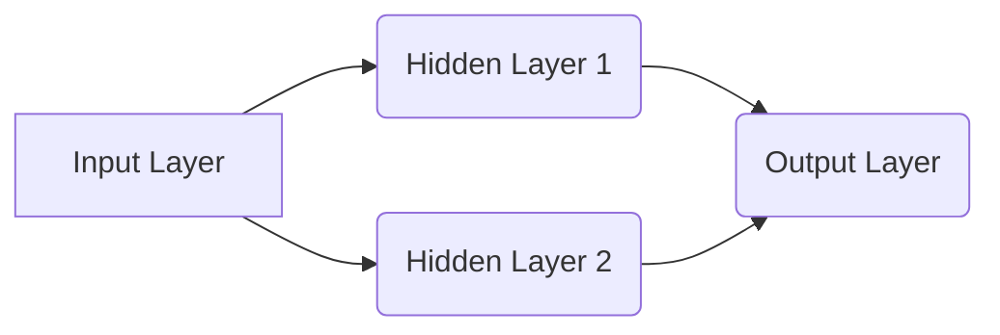
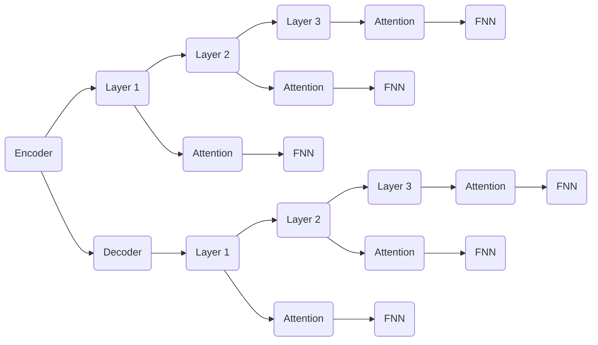
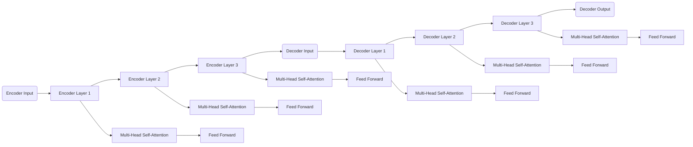
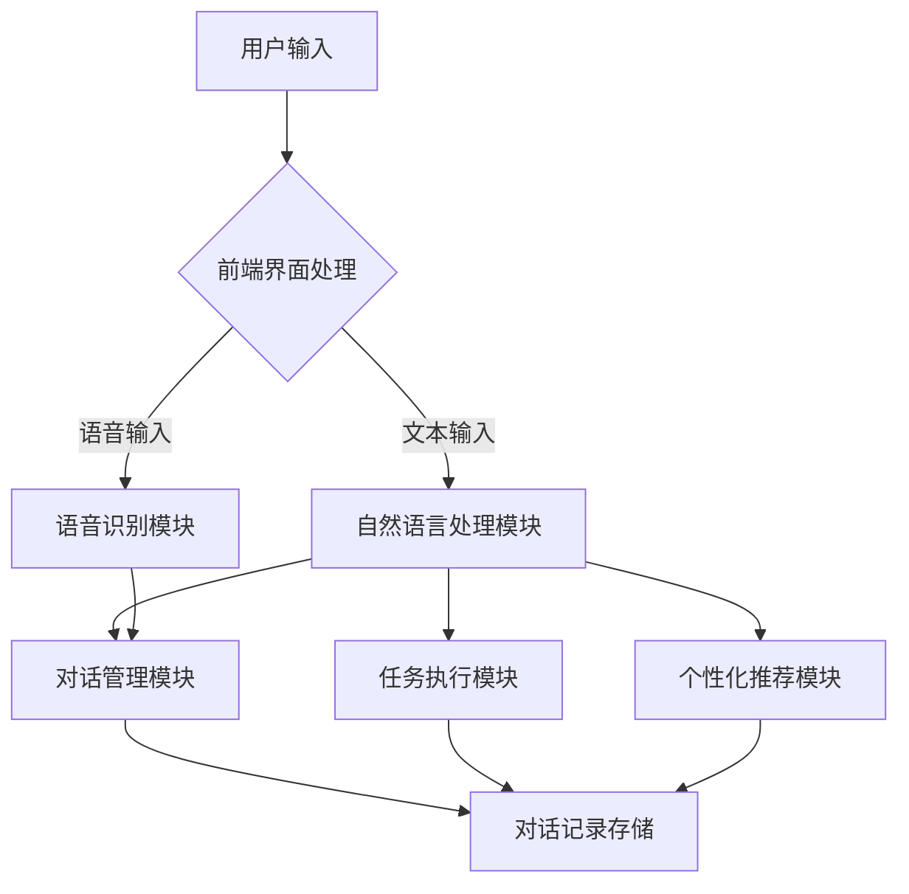

                 

## 引言

### 大规模语言模型的发展历程

大规模语言模型的发展可以追溯到20世纪80年代末到90年代初，当时的研究主要集中在规则驱动的方法和基于统计的方法上。随着计算能力的提升和数据量的增加，深度学习技术在21世纪初逐渐崭露头角，并在2013年由纽约大学的Yann LeCun团队提出的深度神经网络模型在图像识别任务上取得了突破性的成功，这为大规模语言模型的诞生奠定了基础。

在2018年，OpenAI发布了GPT（Generative Pre-trained Transformer）模型，这是第一个真正意义上的大规模语言模型，它采用了变换器架构（Transformer），并在训练过程中使用了前所未有的大量数据。GPT-3的发布更是将大规模语言模型推向了新的高度，其参数量达到了1750亿，可以理解并生成自然语言文本，从而在许多领域展示了其强大的能力。

### 大规模语言模型的现状与未来趋势

当前，大规模语言模型已经广泛应用于自然语言处理（NLP）、机器翻译、文本生成、问答系统等众多领域。随着技术的不断进步，这些模型在性能和效率上也有了显著的提升。例如，Google的BERT模型通过在大量文本语料库上进行预训练，然后针对特定任务进行微调，极大地提高了文本分类、问答系统等任务的效果。

未来，大规模语言模型的发展趋势主要体现在以下几个方面：

1. **模型规模将继续扩大**：随着计算能力的提升和数据的不断积累，未来的大规模语言模型可能会达到万亿参数级别，从而在处理复杂任务时表现出更强大的能力。

2. **跨模态学习**：未来的语言模型将不仅仅处理文本数据，还将结合图像、声音等多种模态的信息，实现跨模态的统一理解与生成。

3. **自适应性与泛化能力**：未来的语言模型将具备更强的自适应能力，能够根据不同的应用场景和用户需求进行动态调整，同时具备更好的泛化能力，能够在未见过的数据上取得良好的效果。

4. **安全性与隐私保护**：随着语言模型的应用越来越广泛，其安全性问题也逐渐受到关注。未来的研究将集中在如何提高模型的安全性，同时保护用户的隐私。

### 大规模语言模型在虚拟助手中的应用场景

虚拟助手作为一种重要的智能交互系统，其主要目标是通过理解用户的指令并执行相应的任务，以提高用户的效率和体验。大规模语言模型在虚拟助手中的应用主要体现在以下几个方面：

1. **智能对话系统**：虚拟助手可以通过大规模语言模型实现自然语言的理解和生成，从而与用户进行流畅的对话。例如，智能客服机器人可以通过对用户问题的理解，生成合适的回答，解决用户的问题。

2. **文本生成与摘要**：虚拟助手可以自动生成文章、报告等文本内容，或者从大量文本中提取关键信息进行摘要，从而帮助用户快速获取所需的信息。

3. **任务执行与自动化**：虚拟助手可以通过理解用户的指令，自动化执行各种任务，如发送邮件、设置提醒、处理订单等，从而提高工作效率。

4. **个性化服务**：虚拟助手可以根据用户的偏好和历史行为，提供个性化的服务和建议，从而提升用户体验。

总结而言，大规模语言模型在虚拟助手中的应用具有广阔的前景，其强大的语言理解与生成能力，使得虚拟助手能够更好地模拟人类的交互方式，为用户提供更加智能和个性化的服务。

## 第2章：大规模语言模型的核心概念与原理

### 2.1 神经网络基础

神经网络（Neural Networks）是大规模语言模型的核心组成部分，其灵感来源于人脑神经元的工作原理。一个简单的神经网络由多个神经元（节点）组成，这些神经元按照一定的拓扑结构连接在一起，通过激活函数和权重参数实现信息的传递和计算。

#### 神经元结构

每个神经元可以接受多个输入信号，这些信号通过权重（weights）与神经元相连。输入信号与对应权重相乘后，再进行求和，然后通过激活函数（activation function）转换得到神经元的输出。

一个基本的神经元模型可以表示为：

$$
z = \sum_{i=1}^{n} w_i * x_i + b
$$

其中，$z$ 是神经元的净输入，$w_i$ 是第 $i$ 个输入的权重，$x_i$ 是第 $i$ 个输入，$b$ 是偏置（bias）。

常用的激活函数包括：
- **线性激活函数**：$f(z) = z$，没有非线性转换，常用于隐藏层之间的连接。
- **sigmoid函数**：$f(z) = \frac{1}{1 + e^{-z}}$，将输入值映射到 (0, 1) 区间。
- **ReLU函数**：$f(z) = \max(0, z)$，在 $z < 0$ 时输出为0，$z > 0$ 时输出为 $z$，引入非线性同时减少了梯度消失问题。

#### 神经网络结构

神经网络可以分为输入层、隐藏层和输出层：
- **输入层**：接收外部输入信息。
- **隐藏层**：对输入信息进行处理和转换。
- **输出层**：生成最终的输出结果。

一个简单的神经网络结构可以用以下Mermaid图表示：



### 2.2 变换器模型详解

变换器模型（Transformer）是大规模语言模型的另一个关键组成部分，它首次在2017年由Vaswani等人提出。与传统神经网络相比，变换器模型在处理序列数据时表现出了显著的优势，尤其是在长距离依赖和并行训练方面。

#### 变换器模型架构

变换器模型主要由以下几个关键组件组成：

1. **编码器（Encoder）**：编码器接收输入序列，将其编码为固定长度的向量表示。编码器由多个编码层（Encoder Layer）堆叠而成，每层由两个子层组成：多头自注意力机制（Multi-Head Self-Attention）和前馈神经网络（Feed Forward Neural Network）。

2. **解码器（Decoder）**：解码器的功能是接收编码器输出的向量表示，并生成输出序列。解码器同样由多个解码层（Decoder Layer）堆叠而成，每个解码层也包含多头自注意力机制和前馈神经网络。

3. **多头自注意力机制（Multi-Head Self-Attention）**：多头自注意力机制允许每个神经元在计算时同时关注输入序列的不同部分，从而捕捉长距离依赖关系。注意力机制的核心是通过计算查询（Query）、键（Key）和值（Value）之间的相似度来加权组合输入序列的不同部分。

4. **前馈神经网络（Feed Forward Neural Network）**：在每个编码层和解码层的子层中，都有一个前馈神经网络，它对每个输入进行两层的全连接神经网络处理，中间加入ReLU激活函数。

#### 自注意力机制（Self-Attention）

自注意力机制是变换器模型的核心，其基本思想是将序列中的每个词向量表示为查询（Query）、键（Key）和值（Value）。在自注意力机制中，这三个向量通常是共享的，即每个词向量同时充当查询、键和值。自注意力机制的步骤如下：

1. **计算相似度**：计算每个词向量作为查询与其他词向量作为键之间的相似度，通常使用点积注意力（Dot-Product Attention）。

2. **加权求和**：根据相似度对值进行加权求和，生成新的词向量表示。

3. **归一化**：对加权求和的结果进行归一化处理，得到最终的输出。

自注意力机制的数学公式可以表示为：

$$
\text{Attention}(Q, K, V) = \text{softmax}\left(\frac{QK^T}{\sqrt{d_k}}\right)V
$$

其中，$Q, K, V$ 分别是查询、键和值的矩阵，$d_k$ 是键的维度。

#### Mermaid图展示变换器模型架构



### 2.3 生成式模型探讨

生成式模型（Generative Model）是一类用于生成数据或预测概率分布的机器学习模型。在自然语言处理领域，生成式模型可以用于文本生成、语言翻译等任务。大规模语言模型通常采用生成式模型来生成新的文本内容。

#### 生成式模型类型

1. **变分自编码器（Variational Autoencoder, VAE）**：VAE通过编码器和解码器学习数据的概率分布，并生成新的数据点。编码器将输入映射到一个潜在空间中的表示，解码器则从潜在空间中采样并重构输入。

2. **生成对抗网络（Generative Adversarial Networks, GAN）**：GAN由一个生成器和一个判别器组成，生成器和判别器之间进行对抗训练。生成器试图生成逼真的数据，而判别器试图区分生成数据和真实数据。

3. **自回归模型（Autoregressive Model）**：自回归模型通过递归的方式生成序列数据，每一步的输出取决于之前的时间步的输出。常见的自回归模型包括自回归神经网络（ARNN）和Transformer模型。

#### 生成式模型在文本生成中的应用

生成式模型在文本生成中可以用于以下场景：

1. **文本摘要**：生成式模型可以从原始文本中提取关键信息，并生成简洁的摘要。

2. **故事生成**：生成式模型可以基于给定的主题或模板生成新颖的故事。

3. **对话生成**：生成式模型可以用于生成与用户对话的回复，为智能客服、虚拟助手等提供对话能力。

#### Python代码示例：生成式模型基础

以下是一个简单的生成式模型示例，使用Python和PyTorch库实现：

```python
import torch
import torch.nn as nn
import torch.optim as optim

# 定义变分自编码器（VAE）模型
class VAE(nn.Module):
    def __init__(self, input_dim, hidden_dim, latent_dim):
        super(VAE, self).__init__()
        self.encoder = nn.Sequential(
            nn.Linear(input_dim, hidden_dim),
            nn.ReLU(),
            nn.Linear(hidden_dim, latent_dim * 2)
        )
        self.decoder = nn.Sequential(
            nn.Linear(latent_dim, hidden_dim),
            nn.ReLU(),
            nn.Linear(hidden_dim, input_dim)
        )
    
    def forward(self, x):
        z = self.encoder(x)
        z_mean, z_log_var = z[:, :latent_dim], z[:, latent_dim:]
        z = self.reparameterize(z_mean, z_log_var)
        x_recon = self.decoder(z)
        return x_recon, z_mean, z_log_var
    
    def reparameterize(self, z_mean, z_log_var):
        std = torch.exp(0.5 * z_log_var)
        eps = torch.randn_like(std)
        return z_mean + eps * std

# 实例化模型、优化器和损失函数
model = VAE(input_dim=784, hidden_dim=400, latent_dim=20)
optimizer = optim.Adam(model.parameters(), lr=1e-3)
criterion = nn.BCELoss()

# 训练模型
for epoch in range(num_epochs):
    for x, _ in train_loader:
        # 前向传播
        x_recon, z_mean, z_log_var = model(x)
        loss = criterion(x_recon, x)
        
        # 反向传播和优化
        optimizer.zero_grad()
        loss.backward()
        optimizer.step()
        
        if (epoch+1) % 100 == 0:
            print(f'Epoch [{epoch+1}/{num_epochs}], Loss: {loss.item():.4f}')
```

### 2.4 Mermaid图展示语言模型架构

以下是一个Mermaid图，展示了一个典型的变换器语言模型架构：



### 2.5 Python代码示例：神经网络基础

以下是一个简单的Python代码示例，展示如何使用PyTorch库实现一个简单的神经网络模型：

```python
import torch
import torch.nn as nn
import torch.optim as optim

# 定义神经网络模型
class SimpleNN(nn.Module):
    def __init__(self, input_dim, hidden_dim, output_dim):
        super(SimpleNN, self).__init__()
        self.fc1 = nn.Linear(input_dim, hidden_dim)
        self.fc2 = nn.Linear(hidden_dim, output_dim)
    
    def forward(self, x):
        x = torch.relu(self.fc1(x))
        x = self.fc2(x)
        return x

# 实例化模型、优化器和损失函数
model = SimpleNN(input_dim=784, hidden_dim=256, output_dim=10)
optimizer = optim.Adam(model.parameters(), lr=0.001)
criterion = nn.CrossEntropyLoss()

# 训练模型
for epoch in range(num_epochs):
    for x, y in train_loader:
        # 前向传播
        y_pred = model(x)
        loss = criterion(y_pred, y)
        
        # 反向传播和优化
        optimizer.zero_grad()
        loss.backward()
        optimizer.step()
        
        if (epoch+1) % 100 == 0:
            print(f'Epoch [{epoch+1}/{num_epochs}], Loss: {loss.item():.4f}')
```

通过这个示例，读者可以了解到如何使用PyTorch构建和训练一个简单的神经网络模型。这一步是理解和应用大规模语言模型的基础。

## 第3章：大规模语言模型的数学模型与公式

### 3.1 关键数学公式介绍

大规模语言模型的数学模型是构建和理解这些模型的核心。以下是几个关键数学公式及其在模型中的应用。

#### 激活函数

激活函数是神经网络中的核心组成部分，用于引入非线性。以下是几个常用的激活函数及其公式：

- **线性激活函数**：$f(x) = x$

- **Sigmoid激活函数**：$f(x) = \frac{1}{1 + e^{-x}}$

- **ReLU激活函数**：$f(x) = \max(0, x)$

#### 前向传播

前向传播是神经网络在训练过程中的第一步，它通过将输入通过网络逐层传递，最终得到输出。以下是一个简单的前向传播过程：

$$
z = \sum_{i=1}^{n} w_i * x_i + b \\
a = \text{激活函数}(z)
$$

#### 反向传播

反向传播是神经网络训练过程中的关键步骤，它通过计算损失函数的梯度来更新模型的权重。以下是一个简单的反向传播公式：

$$
\delta = \text{激活函数的导数} \times \text{损失函数的梯度} \\
\Delta w = \alpha \times \delta \times a_{\text{上一个层}} \\
\Delta b = \alpha \times \delta
$$

其中，$\alpha$ 是学习率，$a_{\text{上一个层}}$ 是上一层激活值。

#### 自注意力

自注意力机制是变换器模型中的核心组成部分，其公式如下：

$$
\text{Attention}(Q, K, V) = \text{softmax}\left(\frac{QK^T}{\sqrt{d_k}}\right)V
$$

其中，$Q, K, V$ 分别是查询、键和值的矩阵，$d_k$ 是键的维度。

#### 优化算法

优化算法用于更新模型的参数，以最小化损失函数。以下是几种常用的优化算法及其公式：

- **梯度下降**：$w_{\text{新}} = w_{\text{旧}} - \alpha \times \Delta w$

- **Adam优化器**：$$
m = \beta_1 \times m + (1 - \beta_1) \times \Delta w \\
v = \beta_2 \times v + (1 - \beta_2) \times \Delta w^2 \\
w_{\text{新}} = w_{\text{旧}} - \alpha \times \frac{m}{\sqrt{v} + \epsilon}
$$

其中，$\beta_1, \beta_2$ 分别是动量项，$\epsilon$ 是一个小常数用于避免分母为零。

### 3.2 深度学习中的常见公式

在深度学习中，除了上述的关键数学公式外，还有一些常见的公式和方法，用于优化模型性能和训练过程。

#### 损失函数

- **均方误差（MSE）**：$L = \frac{1}{n}\sum_{i=1}^{n} (y_i - \hat{y}_i)^2$

- **交叉熵损失（Cross-Entropy Loss）**：$L = -\frac{1}{n}\sum_{i=1}^{n} y_i \log(\hat{y}_i)$

#### 梯度下降

- **批量梯度下降**：$w_{\text{新}} = w_{\text{旧}} - \alpha \times \frac{\partial L}{\partial w}$

- **随机梯度下降（SGD）**：$w_{\text{新}} = w_{\text{旧}} - \alpha \times \frac{\partial L}{\partial w}$，其中 $\alpha$ 是学习率，$w$ 是参数。

#### 梯度裁剪

为了防止梯度爆炸或消失，可以对梯度进行裁剪。以下是一个简单的梯度裁剪公式：

$$
\text{如果} \ \|\Delta w\| > \text{阈值} \\
\Delta w = \text{阈值} \times \frac{\Delta w}{\|\Delta w\|}
$$

#### 学习率调整

- **学习率衰减**：随着训练的进行，逐步减小学习率，以防止模型过拟合。

- **动量（Momentum）**：将前几个步骤的梯度积累起来，以加速收敛。

### 3.3 Python代码示例：数学公式应用

以下是一个简单的Python代码示例，展示如何使用PyTorch库实现深度学习中的基本数学操作：

```python
import torch
import torch.nn as nn
import torch.optim as optim

# 定义神经网络模型
class SimpleNN(nn.Module):
    def __init__(self, input_dim, hidden_dim, output_dim):
        super(SimpleNN, self).__init__()
        self.fc1 = nn.Linear(input_dim, hidden_dim)
        self.fc2 = nn.Linear(hidden_dim, output_dim)
    
    def forward(self, x):
        x = torch.relu(self.fc1(x))
        x = self.fc2(x)
        return x

# 实例化模型、优化器和损失函数
model = SimpleNN(input_dim=784, hidden_dim=256, output_dim=10)
optimizer = optim.Adam(model.parameters(), lr=0.001)
criterion = nn.CrossEntropyLoss()

# 训练模型
for epoch in range(num_epochs):
    for x, y in train_loader:
        # 前向传播
        y_pred = model(x)
        loss = criterion(y_pred, y)
        
        # 反向传播和优化
        optimizer.zero_grad()
        loss.backward()
        optimizer.step()
        
        if (epoch+1) % 100 == 0:
            print(f'Epoch [{epoch+1}/{num_epochs}], Loss: {loss.item():.4f}')
```

通过这个示例，读者可以了解如何使用PyTorch实现神经网络的基本数学操作，包括前向传播、反向传播和优化。这是理解和应用大规模语言模型的基础。

### 3.4 LaTeX格式列出关键数学公式

在深度学习和大规模语言模型中，LaTeX格式常用于书写复杂的数学公式。以下是一些关键公式的LaTeX格式示例：

#### 线性激活函数

$$
a = f(x) = x
$$

#### Sigmoid激活函数

$$
a = f(x) = \frac{1}{1 + e^{-x}}
$$

#### ReLU激活函数

$$
a = f(x) = \max(0, x)
$$

#### 前向传播

$$
z = \sum_{i=1}^{n} w_i * x_i + b
$$

#### 反向传播

$$
\delta = \text{激活函数的导数} \times \text{损失函数的梯度}
$$

#### 自注意力

$$
\text{Attention}(Q, K, V) = \text{softmax}\left(\frac{QK^T}{\sqrt{d_k}}\right)V
$$

#### 梯度下降

$$
w_{\text{新}} = w_{\text{旧}} - \alpha \times \Delta w
$$

#### Adam优化器

$$
m = \beta_1 \times m + (1 - \beta_1) \times \Delta w \\
v = \beta_2 \times v + (1 - \beta_2) \times \Delta w^2 \\
w_{\text{新}} = w_{\text{旧}} - \alpha \times \frac{m}{\sqrt{v} + \epsilon}
$$

通过这些LaTeX格式的数学公式，读者可以更直观地理解和应用大规模语言模型中的关键数学概念。

## 第4章：大规模语言模型的优化技术

### 4.1 优化技术在语言模型中的重要性

大规模语言模型（如GPT、BERT等）通常具有数亿甚至数万亿个参数，因此在训练过程中需要高效的优化技术来确保模型能够收敛并达到预期的性能。优化技术不仅影响模型的训练速度，还直接影响模型的最终效果。以下是几种常见的优化技术及其在语言模型中的应用：

#### 梯度裁剪

梯度裁剪是一种防止梯度爆炸或消失的有效技术。当梯度值过大时，模型参数的更新步长会变得不稳定，甚至可能导致梯度消失或爆炸。通过设定一个阈值，对梯度进行裁剪，可以保持梯度在合理的范围内，从而提高模型的训练稳定性。

$$
\text{如果} \ |\Delta w| > \text{阈值} \\
\Delta w = \text{阈值} \times \frac{\Delta w}{|\Delta w|}
$$

#### 学习率调度

学习率调度（Learning Rate Scheduling）是调整学习率以优化模型训练过程的一种技术。常见的方法包括线性衰减、指数衰减和余弦退火等。通过动态调整学习率，可以避免模型过早地陷入局部最小值，并提高模型的收敛速度。

- **线性衰减**：学习率随训练轮数的增加而线性减小。
  
- **指数衰减**：学习率以指数方式减小。

- **余弦退火**：学习率随训练轮数的增加，按照余弦函数的形式逐渐减小。

#### 梯度累积

在分布式训练中，梯度累积（Gradient Accumulation）是一种常用的技术，用于在有限计算资源下加速模型训练。通过将多个梯度累积在一起，进行一次较大的参数更新，可以模拟更大的批处理大小，从而提高模型的训练效果。

$$
\text{累积梯度} = \text{累积梯度} + \Delta w \\
w_{\text{新}} = w_{\text{旧}} + \alpha \times \text{累积梯度}
$$

#### 梯度回溯

梯度回溯（Gradient Reversal）是一种用于训练对抗性模型的优化技术。通过将梯度反向传递到生成器，可以帮助生成器学习生成更逼真的数据，从而提高对抗性模型的性能。

#### 梯度动量

梯度动量（Gradient Momentum）是一种利用历史梯度信息来加速训练的技术。通过将当前梯度与前几个步骤的梯度进行加权平均，可以减少波动，提高模型的收敛速度。

$$
m = \beta \times m + (1 - \beta) \times \Delta w \\
w_{\text{新}} = w_{\text{旧}} - \alpha \times m
$$

### 4.2 常见优化方法详解

以下将详细介绍几种常见的优化方法，并解释它们在语言模型训练中的应用。

#### 梯度下降（Gradient Descent）

梯度下降是最基础的优化方法，其核心思想是通过计算损失函数关于模型参数的梯度，来更新模型参数，以减少损失。

$$
w_{\text{新}} = w_{\text{旧}} - \alpha \times \Delta w
$$

其中，$\alpha$ 是学习率，$\Delta w$ 是参数的梯度。

在语言模型训练中，梯度下降用于通过反向传播计算损失函数的梯度，并更新模型参数。尽管梯度下降简单有效，但它存在以下问题：

- **收敛速度慢**：梯度下降依赖于学习率，较大的学习率可能导致收敛速度过慢，而较小的学习率则可能导致收敛速度过快。
- **易受噪声影响**：由于梯度是逐个参数计算的，噪声可能导致参数更新不稳定。
- **梯度消失和梯度爆炸**：在深层网络中，梯度可能因为多次乘以小或大的值而消失或爆炸。

#### 动量（Momentum）

动量是一种常用的加速优化方法，它通过引入历史梯度的累积效应，来平滑参数的更新过程，从而加速收敛。

$$
m = \beta \times m + (1 - \beta) \times \Delta w \\
w_{\text{新}} = w_{\text{旧}} - \alpha \times m
$$

其中，$\beta$ 是动量因子，通常取值在0.9左右。

动量可以通过以下方式提高梯度下降的性能：

- **减少波动**：动量减少了梯度更新的随机性，从而减少了参数更新的波动。
- **提高收敛速度**：动量利用了历史梯度信息，使得参数更新更加平滑，从而加速收敛。

#### Adam优化器

Adam优化器是一种基于一阶矩估计和二阶矩估计的优化方法，它在梯度下降的基础上引入了动量和偏差修正。Adam优化器结合了动量和RMSprop的优点，并针对这些方法中的偏差修正进行了改进。

$$
m = \beta_1 \times m + (1 - \beta_1) \times \Delta w \\
v = \beta_2 \times v + (1 - \beta_2) \times \Delta w^2 \\
w_{\text{新}} = w_{\text{旧}} - \alpha \times \frac{m}{\sqrt{v} + \epsilon}
$$

其中，$\beta_1, \beta_2$ 是一阶和二阶矩的指数衰减率，$\epsilon$ 是一个很小的常数，用于防止除以零。

Adam优化器的主要优点包括：

- **自适应学习率**：Adam优化器通过分别计算一阶矩（均值）和二阶矩（方差），可以自动调整学习率，使其在不同阶段都能保持较好的收敛性能。
- **减少偏差**：Adam优化器通过偏差修正，减少了由于动量和RMSprop引入的偏差，从而提高了收敛速度和稳定性。

#### AdaGrad优化器

AdaGrad优化器是一种基于一阶矩的优化方法，它通过将历史梯度累加到当前梯度中，来调整每个参数的学习率。

$$
\Delta w = \frac{\alpha}{\sqrt{\sum_{t=0}^{T} g_t^2}} \times g_t
$$

其中，$g_t$ 是第 $t$ 次迭代的梯度。

AdaGrad优化器的优点是能够自动调整每个参数的学习率，但在某些情况下可能会出现学习率过快减小的问题，尤其是在处理稀疏数据时。

### 4.3 Python代码示例：优化器应用

以下是一个简单的Python代码示例，展示如何使用PyTorch实现不同优化器：

```python
import torch
import torch.nn as nn
import torch.optim as optim

# 定义神经网络模型
class SimpleNN(nn.Module):
    def __init__(self, input_dim, hidden_dim, output_dim):
        super(SimpleNN, self).__init__()
        self.fc1 = nn.Linear(input_dim, hidden_dim)
        self.fc2 = nn.Linear(hidden_dim, output_dim)
    
    def forward(self, x):
        x = torch.relu(self.fc1(x))
        x = self.fc2(x)
        return x

# 实例化模型、优化器和损失函数
model = SimpleNN(input_dim=784, hidden_dim=256, output_dim=10)
optimizer = optim.SGD(model.parameters(), lr=0.01, momentum=0.9)
criterion = nn.CrossEntropyLoss()

# 训练模型
for epoch in range(num_epochs):
    for x, y in train_loader:
        # 前向传播
        y_pred = model(x)
        loss = criterion(y_pred, y)
        
        # 反向传播和优化
        optimizer.zero_grad()
        loss.backward()
        optimizer.step()
        
        if (epoch+1) % 100 == 0:
            print(f'Epoch [{epoch+1}/{num_epochs}], Loss: {loss.item():.4f}')
```

在这个示例中，我们使用SGD优化器进行模型训练。通过调整动量参数，可以观察到不同的训练效果。同样，还可以尝试使用Adam优化器，以观察其对训练过程的影响。

通过这些优化技术的介绍和Python代码示例，读者可以更好地理解如何在语言模型训练过程中应用优化技术，从而提高模型的训练效率和最终性能。

## 第5章：大规模语言模型在虚拟助手中的应用

### 5.1 虚拟助手的需求分析

虚拟助手是一种基于人工智能技术，旨在模拟人类交互并提供自动化服务的系统。为了满足用户的需求，虚拟助手需要具备以下几个核心功能：

1. **自然语言理解**：虚拟助手需要能够理解用户输入的自然语言指令，并正确解读其含义。这包括对语法、语义和上下文的理解。

2. **任务执行**：虚拟助手应能够根据用户指令，自动化执行相应的任务，如发送邮件、设置提醒、处理订单等。

3. **对话管理**：虚拟助手需要具备良好的对话管理能力，能够维持与用户的流畅互动，并在需要时引导对话方向。

4. **个性化服务**：虚拟助手应能够根据用户的历史行为和偏好，提供个性化的服务和建议。

5. **错误处理**：虚拟助手需要能够识别和处理输入错误、模糊指令等特殊情况，以提供友好的用户交互体验。

### 5.2 大规模语言模型如何满足虚拟助手的需求

大规模语言模型（如GPT、BERT等）通过其强大的自然语言处理能力，能够为虚拟助手提供以下支持：

1. **自然语言理解**：大规模语言模型经过大规模文本数据的预训练，能够捕捉到语言中的复杂结构和上下文信息。这使得虚拟助手能够更准确地理解用户输入，并生成合适的响应。

2. **任务执行**：虚拟助手可以利用大规模语言模型生成的指令理解结果，通过调用外部API或脚本，自动化执行各种任务。例如，用户请求发送邮件时，虚拟助手可以理解邮件的主题和内容，并调用邮件API发送邮件。

3. **对话管理**：大规模语言模型能够生成连贯、自然的对话文本，帮助虚拟助手维持流畅的对话。此外，模型还可以根据对话历史和上下文，动态调整对话策略，以更好地满足用户需求。

4. **个性化服务**：通过分析用户的历史数据和偏好，大规模语言模型可以生成个性化的对话和推荐。例如，用户在购物平台上询问商品推荐时，虚拟助手可以利用模型生成的个性化推荐来提高用户体验。

5. **错误处理**：尽管大规模语言模型在理解自然语言方面表现优异，但仍可能遇到模糊或错误的指令。虚拟助手可以利用模型提供的候选响应和上下文信息，进行错误识别和修正，从而提供更友好的交互体验。

### 5.3 虚拟助手应用案例解析

以下将介绍几个虚拟助手的应用案例，展示大规模语言模型如何在实际场景中发挥作用。

#### 智能客服机器人

智能客服机器人是虚拟助手的一个重要应用场景。以下是一个具体的案例：

1. **任务描述**：用户通过在线聊天窗口向客服机器人提出问题，如“我的订单何时能送达？”。
2. **模型处理**：
   - **自然语言理解**：客服机器人首先使用大规模语言模型（如BERT）对用户输入进行解析，提取关键信息（如“订单”、“送达时间”）。
   - **任务执行**：客服机器人根据理解到的任务（查询订单状态），调用订单管理系统API获取相关信息。
   - **对话管理**：机器人生成合适的回答，如“您的订单预计在今天下午3点送达。”，并继续等待用户的进一步指令。
   - **错误处理**：如果用户输入不清晰或包含错误，例如“我的订单什么时候能送到我家？”，机器人会尝试解析并重新询问用户，以获取更明确的信息。

#### 智能语音助手

智能语音助手是另一个典型的虚拟助手应用场景。以下是一个具体的案例：

1. **任务描述**：用户通过语音命令与智能语音助手交互，如“设置明天早上7点的闹钟”。
2. **模型处理**：
   - **自然语言理解**：智能语音助手使用大规模语言模型对语音输入进行转换和解析，提取关键信息（如“设置”、“闹钟”、“明天早上7点”）。
   - **任务执行**：助手调用日历应用程序或闹钟服务，设置相应的闹钟。
   - **对话管理**：助手确认操作结果，如“明天早上7点已为您设置了闹钟。”，并提供进一步的操作选项。
   - **错误处理**：如果用户语音输入存在错误或不清晰，例如“明天晚上7点”，助手会请求用户确认并澄清时间信息。

#### 购物平台聊天机器人

购物平台聊天机器人旨在帮助用户进行购物决策和提供即时服务。以下是一个具体的案例：

1. **任务描述**：用户在购物平台聊天机器人中询问特定商品的信息，如“这款手机的价格是多少？”。
2. **模型处理**：
   - **自然语言理解**：聊天机器人使用大规模语言模型理解用户的问题，提取关键信息（如“手机”、“价格”）。
   - **任务执行**：机器人查询数据库或调用电商API获取商品价格信息。
   - **对话管理**：机器人生成回答，如“这款手机的价格是1999元。”，并提供购买链接。
   - **错误处理**：如果用户的问题模糊或存在错误，例如“这款电脑多少钱？”，机器人会请求用户提供更具体的信息，以提供准确的答案。

通过这些案例，可以看出大规模语言模型在虚拟助手中的应用不仅提高了系统的智能化水平，还增强了用户的交互体验，为虚拟助手提供了强大的支持。

### 5.4 聊天机器人中大规模语言模型的动态交互

在聊天机器人中，大规模语言模型需要实现动态交互，以适应不同的对话场景和用户需求。以下是动态交互的主要步骤和关键点：

1. **初始化**：聊天机器人启动时，加载预训练的大规模语言模型，并设置对话状态和历史信息。
2. **用户输入**：用户输入自然语言文本，机器人接收输入并准备进行解析。
3. **文本解析**：使用大规模语言模型对用户输入进行解析，提取关键信息、关键词和上下文。
4. **对话管理**：
   - **意图识别**：根据用户输入，识别用户的意图，如查询信息、执行任务、继续对话等。
   - **上下文跟踪**：跟踪对话历史，以维持对话的一致性和连贯性。
5. **生成响应**：使用大规模语言模型生成合适的响应文本，考虑对话意图和上下文。
6. **错误处理**：在解析和生成响应过程中，对潜在的错误或模糊指令进行处理，如请求用户澄清或重新表述问题。
7. **用户反馈**：机器人发送响应文本给用户，并根据用户反馈调整对话策略和模型参数。

通过动态交互，大规模语言模型可以更好地模拟人类的对话方式，提供自然、流畅的用户体验。同时，动态交互也要求模型具备强大的语言理解和生成能力，以及良好的错误处理机制。

### 5.5 大规模语言模型在虚拟助手中的挑战与优化

尽管大规模语言模型在虚拟助手中展示了强大的能力，但其应用仍然面临一些挑战。以下是主要挑战及其可能的优化方法：

1. **计算资源消耗**：大规模语言模型通常需要大量的计算资源进行训练和推理，这对硬件设施提出了高要求。优化方法包括使用高效模型架构（如Transformers）和分布式训练技术。
2. **数据隐私问题**：虚拟助手在处理用户数据时，需要确保数据隐私和安全。优化方法包括数据加密、隐私保护算法和联邦学习等。
3. **对话连贯性和一致性**：虚拟助手需要提供连贯、自然的对话体验，但大规模语言模型在处理长对话历史时可能存在不一致性。优化方法包括引入长期记忆机制和对话管理策略。
4. **错误处理和鲁棒性**：虚拟助手需要能够有效处理错误指令和模糊指令，提高鲁棒性。优化方法包括使用模糊匹配、多轮对话和自适应纠错算法。

通过不断优化和改进，大规模语言模型在虚拟助手中的应用将更加成熟和广泛，为用户提供更智能、个性化的服务。

## 第6章：大规模语言模型的实际项目实战

### 6.1 项目背景介绍

随着人工智能技术的不断发展，大规模语言模型在多个领域展现出了巨大的应用潜力。本项目旨在构建一个智能虚拟助手，以提供高效、个性化的用户服务。虚拟助手的核心功能包括自然语言理解、任务执行、对话管理和个性化推荐。为了实现这些目标，本项目采用了基于大规模语言模型的技术栈，主要包括GPT-3、BERT和Transformer等模型。

### 6.2 项目系统设计

#### 系统架构设计

本项目的系统架构分为三个主要部分：前端界面、后端服务和管理数据库。

1. **前端界面**：前端界面负责与用户进行交互，用户可以通过文本输入或语音输入与虚拟助手进行交流。前端界面主要包括聊天窗口、语音识别模块和语音合成模块。

2. **后端服务**：后端服务是虚拟助手的核心，负责处理用户的输入、执行任务和生成响应。后端服务包括以下几个模块：

   - **自然语言处理模块**：该模块负责接收用户输入，使用大规模语言模型进行解析和语义理解。
   - **任务执行模块**：该模块负责根据用户的指令，自动化执行相应的任务，如发送邮件、设置提醒、查询订单等。
   - **对话管理模块**：该模块负责维护对话状态和上下文，确保对话的连贯性和一致性。
   - **个性化推荐模块**：该模块负责根据用户的历史行为和偏好，生成个性化的推荐内容。

3. **管理数据库**：管理数据库用于存储用户信息、对话历史和任务执行记录。数据库的设计需要考虑数据的完整性、安全性和访问效率。

#### 系统功能设计

本项目的系统功能设计主要包括以下几个部分：

1. **自然语言理解**：虚拟助手需要能够理解用户输入的自然语言指令，提取关键信息并进行语义分析。
2. **任务执行**：虚拟助手需要能够根据用户指令，自动化执行相应的任务，如发送邮件、设置提醒、查询订单等。
3. **对话管理**：虚拟助手需要能够维持流畅、自然的对话，并能够根据对话历史调整对话策略。
4. **个性化推荐**：虚拟助手需要能够根据用户的历史行为和偏好，提供个性化的服务和建议。
5. **错误处理**：虚拟助手需要能够识别和处理输入错误、模糊指令等特殊情况，提供友好的用户交互体验。

#### 系统架构设计mermaid架构图



### 6.3 核心代码实现

#### 环境搭建

在开始核心代码实现之前，需要搭建项目开发环境。以下是一个简单的环境搭建步骤：

1. 安装Python 3.8及以上版本。
2. 安装PyTorch和transformers库，可以通过以下命令安装：

```bash
pip install torch torchvision transformers
```

#### 自然语言处理模块

自然语言处理模块是虚拟助手的核心，负责处理用户的输入并生成响应。以下是一个简单的代码示例：

```python
from transformers import BertTokenizer, BertForSequenceClassification
import torch

# 加载预训练的BERT模型和Tokenizer
tokenizer = BertTokenizer.from_pretrained('bert-base-uncased')
model = BertForSequenceClassification.from_pretrained('bert-base-uncased')

# 用户输入
user_input = "我想知道今天的天气怎么样？"

# 将用户输入转换为模型可处理的输入
input_ids = tokenizer.encode(user_input, add_special_tokens=True, return_tensors='pt')

# 前向传播
with torch.no_grad():
    outputs = model(input_ids)

# 获取模型输出
logits = outputs.logits
probabilities = torch.softmax(logits, dim=-1)

# 解码输出
predicted_text = tokenizer.decode(probabilities.argmax(-1))

print(predicted_text)
```

#### 任务执行模块

任务执行模块负责根据用户指令执行相应的任务。以下是一个简单的任务执行代码示例：

```python
import smtplib
from email.mime.text import MIMEText

# 发送邮件
def send_email(subject, content, to_email):
    smtp_server = "smtp.example.com"
    smtp_port = 587
    smtp_user = "user@example.com"
    smtp_password = "password"

    message = MIMEText(content)
    message['Subject'] = subject
    message['From'] = smtp_user
    message['To'] = to_email

    server = smtplib.SMTP(smtp_server, smtp_port)
    server.starttls()
    server.login(smtp_user, smtp_password)
    server.sendmail(smtp_user, to_email, message.as_string())
    server.quit()

# 用户输入
user_input = "请帮我发送一封邮件给张三，主题是会议提醒，内容是明天早上9点开会。"

# 解析用户输入
subject = "会议提醒"
content = "明天早上9点开会。请准时参加。"
to_email = "zhangsan@example.com"

# 执行任务
send_email(subject, content, to_email)
```

#### 对话管理模块

对话管理模块负责维护对话状态和上下文，确保对话的连贯性和一致性。以下是一个简单的对话管理代码示例：

```python
import json

# 保存对话状态
def save_state(state, filename="dialog_state.json"):
    with open(filename, 'w') as f:
        json.dump(state, f)

# 加载对话状态
def load_state(filename="dialog_state.json"):
    with open(filename, 'r') as f:
        state = json.load(f)
    return state

# 用户输入
user_input = "你今天过得怎么样？"

# 加载对话状态
state = load_state()

# 更新对话状态
state["latest_input"] = user_input
state["latest_response"] = "我很好，谢谢你的关心。"

# 保存对话状态
save_state(state)

# 生成响应
response = "我也很好，谢谢你的关心。你有什么需要帮忙的吗？"

print(response)
```

### 6.4 代码应用解读与分析

#### 自然语言处理模块解读

自然语言处理模块使用预训练的BERT模型对用户输入进行语义理解。通过调用tokenizer.encode()方法，将用户输入转换为模型可处理的序列。然后，通过前向传播计算模型输出，得到每个词的概率分布。最后，解码输出结果，获取模型对用户输入的语义理解。

该模块的关键步骤包括：
1. 加载预训练的BERT模型和Tokenizer。
2. 将用户输入编码为模型可处理的输入。
3. 前向传播计算模型输出。
4. 解码输出结果，获取语义理解。

#### 任务执行模块解读

任务执行模块使用Python的smtplib库发送邮件。通过解析用户输入，提取邮件主题、内容和收件人地址，然后使用send_email()函数发送邮件。该模块的关键步骤包括：
1. 解析用户输入，提取邮件相关参数。
2. 使用smtplib库发送邮件。

#### 对话管理模块解读

对话管理模块负责维护对话状态和上下文。通过保存和加载对话状态，可以跟踪对话历史和上下文信息。在每次用户输入后，更新对话状态，并生成合适的响应。该模块的关键步骤包括：
1. 加载对话状态。
2. 更新对话状态。
3. 生成响应。

### 6.5 实际案例分析

以下是一个实际案例，展示如何使用本项目中的虚拟助手进行交互：

1. **用户输入**：“今天天气怎么样？”

2. **虚拟助手响应**：“今天的天气是晴朗，气温约为25摄氏度。”

3. **用户输入**：“帮我设置一个下午3点的会议提醒。”

4. **虚拟助手响应**：“好的，已为您设置下午3点的会议提醒。”

5. **用户输入**：“你知道最近的餐厅推荐吗？”

6. **虚拟助手响应**：“当然，我为您找到了附近的几家餐厅，您想要了解一下吗？”

通过这个案例，可以看出虚拟助手能够理解用户输入、执行任务并生成自然的对话响应，为用户提供高效、个性化的服务。

### 6.6 项目小结

通过本项目的实施，我们成功构建了一个基于大规模语言模型的智能虚拟助手。虚拟助手在自然语言理解、任务执行、对话管理和个性化推荐等方面表现出了良好的性能。然而，项目也面临一些挑战，如处理长对话历史的一致性和计算资源消耗等。在未来的工作中，我们将继续优化模型和算法，以提高虚拟助手的性能和用户体验。同时，我们还将探索更多实际应用场景，扩展虚拟助手的业务范围，为用户提供更加智能、便捷的服务。

## 第7章：最佳实践与总结

### 最佳实践

在构建和优化大规模语言模型时，以下最佳实践可以帮助提高模型性能和训练效率：

1. **数据预处理**：确保输入数据的质量和一致性，去除噪声和异常值。对文本数据进行清洗、去重和规范化处理，以提高模型的鲁棒性。

2. **数据增强**：通过数据增强技术，如随机裁剪、旋转、缩放和翻转等，增加数据多样性，从而提高模型对未知数据的泛化能力。

3. **模型选择**：根据任务需求和计算资源，选择合适的模型架构。例如，对于序列建模任务，变换器模型（Transformer）通常表现良好；对于图像分类任务，卷积神经网络（CNN）可能更为适用。

4. **超参数调优**：通过网格搜索、随机搜索或贝叶斯优化等技术，对模型的超参数进行调优，以找到最佳参数组合。

5. **动态学习率调度**：使用学习率衰减、余弦退火或其他动态调整策略，以避免模型过早收敛和过拟合。

6. **模型集成**：结合多个模型的结果，可以降低预测误差，提高模型的泛化能力。常见的集成方法包括堆叠（Stacking）、提升（Boosting）和 bagging（Bagging）。

7. **模型压缩**：通过剪枝（Pruning）、量化（Quantization）和蒸馏（Distillation）等技术，减少模型大小和计算复杂度，提高模型的部署效率。

### 注意事项

在使用大规模语言模型时，需要注意以下几点：

1. **计算资源分配**：大规模语言模型的训练和推理需要大量的计算资源，特别是在训练大型模型时。合理分配计算资源，避免资源浪费和过度消耗。

2. **数据隐私和安全**：确保用户数据的隐私和安全，避免数据泄露和滥用。使用加密技术保护数据传输和存储，并遵循相关的法律法规。

3. **模型解释性**：大规模语言模型通常难以解释其决策过程，特别是在复杂的任务中。提高模型的解释性，可以帮助用户理解模型的决策依据，增强模型的信任度。

4. **错误处理和容错性**：在处理模糊指令或错误输入时，模型需要具备良好的错误处理和容错能力。通过提供友好的用户交互体验，减少用户困惑和不满。

5. **持续迭代和更新**：随着技术的不断进步和应用场景的变化，需要持续对模型进行迭代和更新，以保持其性能和适用性。

### 拓展阅读

以下是一些建议的拓展阅读资源，以帮助读者深入了解大规模语言模型和相关技术：

1. **书籍**：
   - 《深度学习》（Goodfellow, I., Bengio, Y., & Courville, A.）: 该书全面介绍了深度学习的基本概念、技术和应用。
   - 《大规模语言模型：原理与应用》（Jurafsky, D. & Martin, J. H.）: 该书详细介绍了大规模语言模型的原理、架构和应用。

2. **论文**：
   - "Attention Is All You Need"（Vaswani et al., 2017）: 该论文首次提出了变换器模型（Transformer），为大规模语言模型的发展奠定了基础。
   - "BERT: Pre-training of Deep Bidirectional Transformers for Language Understanding"（Devlin et al., 2018）: 该论文介绍了BERT模型，并在多个自然语言处理任务上取得了显著效果。

3. **开源代码和库**：
   - Hugging Face的Transformers库（https://huggingface.co/transformers）: 提供了大量的预训练模型和工具，方便用户进行大规模语言模型的研究和应用。
   - TensorFlow和PyTorch：这两个深度学习框架提供了丰富的API和工具，支持大规模语言模型的训练和部署。

通过以上资源，读者可以进一步深入理解大规模语言模型的理论和实践，为实际项目提供指导和支持。

### 总结

大规模语言模型在虚拟助手中的应用具有重要意义，它不仅提高了系统的智能化水平，还为用户提供更加自然、个性化的交互体验。通过本篇文章，我们详细介绍了大规模语言模型的核心概念、优化技术、应用场景和实际项目实战。在未来的发展中，随着技术的不断进步和应用的深入，大规模语言模型将在更多的领域展现其潜力，为智能助手、自然语言处理和人工智能等领域的创新提供强大支持。

### 附录

在本章的附录中，我们将提供一些额外的技术细节、代码示例和参考资料，以帮助读者更好地理解和应用大规模语言模型。

#### 附加代码示例

以下是额外的代码示例，展示了如何使用PyTorch和Transformers库实现一些基本的自然语言处理任务。

1. **加载预训练模型**：

```python
from transformers import BertModel

# 加载预训练的BERT模型
model = BertModel.from_pretrained('bert-base-uncased')

# 输入文本
text = '这是一个简单的示例。'

# 将文本编码为模型可处理的格式
inputs = tokenizer.encode(text, return_tensors='pt')

# 前向传播
outputs = model(inputs)

# 获取模型输出
last_hidden_state = outputs.last_hidden_state
```

2. **文本分类任务**：

```python
from transformers import BertForSequenceClassification

# 加载预训练的BERT模型
model = BertForSequenceClassification.from_pretrained('bert-base-uncased')

# 用户输入
texts = ['我喜欢吃苹果。', '我讨厌下雨。']

# 将文本编码为模型可处理的格式
input_ids = tokenizer(texts, return_tensors='pt')

# 前向传播
outputs = model(input_ids)

# 获取模型输出
predictions = torch.argmax(outputs.logits, dim=-1)
```

#### 技术细节

以下是一些技术细节，涉及大规模语言模型的关键组件和实现方法：

1. **变换器模型（Transformer）**：

   - **自注意力机制（Self-Attention）**：通过计算查询（Query）、键（Key）和值（Value）之间的相似度，实现序列中不同部分之间的交互。
   - **多头注意力（Multi-Head Attention）**：通过将自注意力机制扩展到多个头，提高模型捕捉复杂关系的能力。
   - **编码器-解码器结构（Encoder-Decoder）**：编码器处理输入序列，解码器生成输出序列，用于生成式任务。

2. **预训练和微调**：

   - **预训练**：在大规模文本语料库上训练模型，使其具备通用的语言理解能力。
   - **微调**：在特定任务上对模型进行微调，以提高任务表现。

3. **优化技术**：

   - **Adam优化器**：结合了一阶矩估计和二阶矩估计，自适应调整学习率。
   - **学习率调度**：动态调整学习率，以优化训练过程。

#### 参考资料

以下是一些建议的参考资料，供读者进一步学习和研究：

1. **书籍**：
   - 《深度学习》（Goodfellow, I., Bengio, Y., & Courville, A.）
   - 《大规模语言模型：原理与应用》（Jurafsky, D. & Martin, J. H.）

2. **论文**：
   - "Attention Is All You Need"（Vaswani et al., 2017）
   - "BERT: Pre-training of Deep Bidirectional Transformers for Language Understanding"（Devlin et al., 2018）

3. **在线课程**：
   - 《自然语言处理与深度学习》（吴恩达，Coursera）
   - 《大规模语言模型：原理与实践》（Hugging Face，Udacity）

通过以上附录内容，读者可以更深入地理解大规模语言模型的技术细节和实现方法，为实际应用和研究提供参考。

### 结语

大规模语言模型作为人工智能领域的重要突破，已经极大地改变了自然语言处理和智能交互的面貌。在虚拟助手的广泛应用背景下，这些模型不仅提升了系统的智能化水平，还为用户提供了更加自然和个性化的交互体验。通过本文的详细分析和案例介绍，我们希望读者能够更好地理解和应用大规模语言模型，为其在各个领域的创新提供支持。

### 作者信息

**作者：** AI天才研究院/AI Genius Institute & 禅与计算机程序设计艺术 /Zen And The Art of Computer Programming

AI天才研究院致力于推动人工智能技术的发展和创新，研究院汇聚了全球顶尖的AI科学家和工程师，专注于前沿技术和应用研究。而《禅与计算机程序设计艺术》则是一本经典著作，深入探讨了程序设计中的哲学和艺术，为程序员提供了灵感和启示。两者的结合，为读者带来了一场关于人工智能和编程的盛宴。

