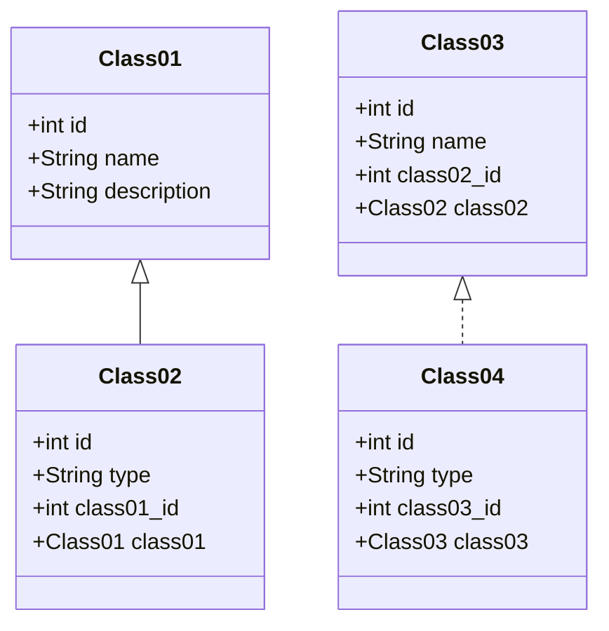
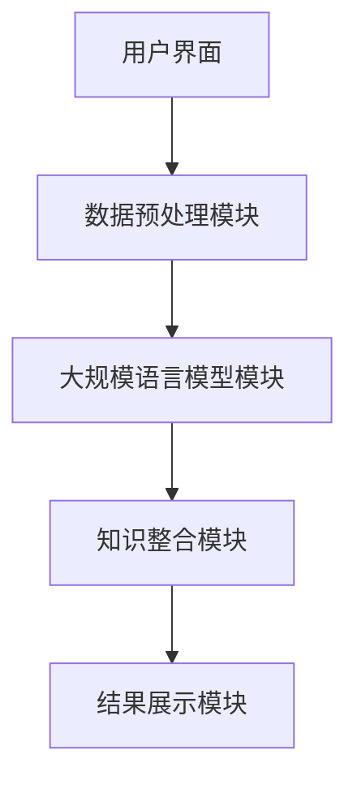
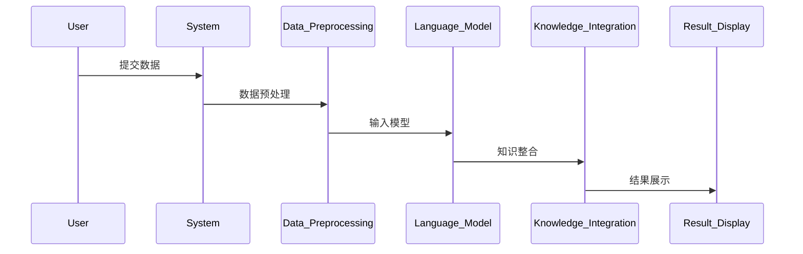

                 


# 《大规模语言模型在跨学科知识创新中的应用》

## 关键词

- 大规模语言模型
- 跨学科知识创新
- 应用案例
- 构建与优化
- 发展趋势

## 摘要

本文旨在探讨大规模语言模型在跨学科知识创新中的应用。首先，我们介绍了大规模语言模型的基础知识，包括其定义、发展历史、关键算法和优缺点。接着，我们通过一系列应用案例展示了大规模语言模型在多个领域的创新作用。随后，我们提供了构建大规模语言模型的实践指南，包括数据收集与预处理、模型选择与优化、训练与评估以及部署与维护。最后，我们对大规模语言模型的发展趋势进行了展望，讨论了技术进步、领域扩展、社会挑战和未来前景。

---

### 第1章：引言

#### 1.1 背景介绍

随着互联网和大数据技术的快速发展，知识获取和创新的模式发生了根本性的变化。传统学科之间的界限变得模糊，跨学科研究成为了推动科技创新和社会进步的重要驱动力。在这个背景下，如何高效地整合和利用跨学科知识成为了一个亟待解决的问题。

大规模语言模型（Large-scale Language Models，LLM）的出现为这一挑战提供了新的解决方案。它们能够自动从海量数据中学习语言规律，生成自然语言文本，进行语义理解和推理。这使得大规模语言模型在跨学科知识创新中具有巨大的潜力。

#### 1.2 目的与读者对象

本文的目标是：
1. 介绍大规模语言模型的基础知识，帮助读者了解其工作原理和应用场景。
2. 通过具体案例展示大规模语言模型在跨学科知识创新中的应用。
3. 提供构建和优化大规模语言模型的实践指南，为开发者提供实际操作参考。

本文适合以下读者：
1. 对人工智能和自然语言处理感兴趣的科研人员。
2. 数据科学家和机器学习工程师。
3. 对跨学科知识创新感兴趣的学者和实践者。

#### 1.3 内容结构与章节安排

本文分为五个部分：
1. 引言：介绍大规模语言模型在跨学科知识创新中的应用背景和目的。
2. 大规模语言模型基础：介绍大规模语言模型的定义、发展历史、关键算法和优缺点。
3. 跨学科知识创新应用案例：展示大规模语言模型在多个领域的应用案例。
4. 构建大规模语言模型：提供构建和优化大规模语言模型的实践指南。
5. 大规模语言模型的发展趋势：讨论大规模语言模型的技术进步、领域扩展、社会挑战和未来前景。

#### 1.4 本书的重要性与影响

大规模语言模型在跨学科知识创新中的应用具有重要意义：
1. 提高知识整合效率：通过自动学习海量数据中的语言规律，大规模语言模型能够高效地整合跨学科知识。
2. 促进创新：大规模语言模型能够生成新的文本和推理结果，为跨学科研究提供新的思路和方法。
3. 改善人机交互：大规模语言模型可以用于智能问答、自然语言理解等应用，提高人机交互的效率和质量。

本文的研究不仅为大规模语言模型的应用提供了系统性总结，也为相关领域的研究和实践提供了参考。

---

### 第2章：大规模语言模型基础

#### 2.1 语言模型的定义与历史发展

语言模型（Language Model，LM）是一种统计模型，用于预测自然语言中的下一个词或字符。其核心思想是通过对大量文本数据的学习，建立一个能够表示语言概率分布的模型。

语言模型的发展可以追溯到20世纪50年代。早期的研究主要集中在基于规则的方法，如n-gram模型。这些方法通过统计文本中连续n个单词或字符的出现频率来预测下一个词或字符。然而，这种方法存在明显的局限性，例如无法捕捉长距离依赖关系。

随着计算能力的提升和深度学习技术的发展，大规模语言模型（如神经网络语言模型）逐渐成为主流。这些模型能够通过学习大量的文本数据，自动发现语言中的复杂规律，从而显著提高预测准确性。

#### 2.2 常见的大规模语言模型

目前，常见的大规模语言模型主要包括以下几种：

1. **n-gram模型**：基于统计学的简单模型，通过计算连续n个单词或字符的出现频率来预测下一个词或字符。
2. **神经网络语言模型**：基于深度学习的复杂模型，通过多层神经网络学习文本数据中的概率分布。
3. **递归神经网络（RNN）语言模型**：RNN能够处理序列数据，通过记忆状态捕捉长距离依赖关系。
4. **长短时记忆网络（LSTM）语言模型**：LSTM是RNN的一种变体，能够更好地处理长序列数据。
5. **Transformer语言模型**：Transformer模型通过自注意力机制（Self-Attention）处理序列数据，显著提高了模型的性能。
6. **GPT（Generative Pre-trained Transformer）模型**：GPT是基于Transformer的预训练模型，通过大量的文本数据进行预训练，然后在特定任务上进行微调。

#### 2.3 关键算法与技术

大规模语言模型的核心算法包括：

1. **自注意力机制（Self-Attention）**：Transformer模型中的自注意力机制能够自动学习文本数据中的关联关系，提高了模型的表示能力。
2. **预训练与微调（Pre-training and Fine-tuning）**：预训练阶段使用大量的无标签数据训练模型，然后在特定任务上使用少量有标签数据进行微调。
3. **语言建模任务**：大规模语言模型通常通过最小化语言建模损失函数来优化模型参数，如交叉熵损失函数。
4. **正则化技术**：为了避免过拟合，大规模语言模型常常使用正则化技术，如Dropout、权重衰减等。

#### 2.4 大规模语言模型的优缺点与挑战

大规模语言模型的优点包括：

- **强大的表示能力**：能够自动学习文本数据中的复杂规律，捕捉长距离依赖关系。
- **高效的语言生成**：能够生成高质量的自然语言文本。
- **多任务能力**：预训练模型可以适用于多种不同的任务，具有较好的通用性。

然而，大规模语言模型也存在一些挑战：

- **计算资源需求**：训练大规模语言模型需要大量的计算资源和时间。
- **数据依赖**：模型的性能高度依赖于训练数据的质量和数量。
- **过拟合风险**：模型可能过度学习训练数据中的噪声，导致泛化能力不足。
- **模型解释性**：深度神经网络模型难以解释，增加了模型风险和责任问题。

#### 核心概念与联系

**核心概念：**
- 语言模型（Language Model，LM）
- 预训练与微调（Pre-training and Fine-tuning）
- 自注意力机制（Self-Attention）
- Transformer模型（Transformer Model）
- GPT模型（GPT Model）

**概念属性特征对比表格：**

| 特征         | n-gram模型 | 神经网络语言模型 | RNN语言模型 | LSTM语言模型 | Transformer语言模型 | GPT模型            |
| ------------ | ---------- | --------------- | ---------- | ------------ | ------------------- | ------------------ |
| 基础算法     | 统计学     | 深度学习       | 序列模型   | 序列模型     | 自注意力机制         | 自注意力机制       |
| 语言表示能力 | 较弱       | 较强           | 中等       | 中等         | 极强           | 极强               |
| 计算资源需求 | 低         | 中等           | 中等       | 中等         | 高           | 高                |
| 适应性       | 有限       | 较好           | 较好       | 较好         | 极好          | 极好              |

**ER实体关系图架构的 Mermaid 流程图：**

```mermaid
entityRelationshipDiagram
  C1[语言模型] --> C2[n-gram模型]
  C1 --> C3[神经网络语言模型]
  C1 --> C4[RNN语言模型]
  C1 --> C5[LSTM语言模型]
  C1 --> C6[Transformer语言模型]
  C1 --> C7[GPT模型]
  C3 --> C8[预训练与微调]
  C3 --> C9[自注意力机制]
  C4 --> C8
  C4 --> C9
  C5 --> C8
  C5 --> C9
  C6 --> C8
  C6 --> C9
  C7 --> C8
  C7 --> C9
```

#### 算法原理讲解

**算法流程图：**


**Python源代码实现：**

```python
import tensorflow as tf
from tensorflow.keras.preprocessing.sequence import pad_sequences
from tensorflow.keras.layers import Embedding, LSTM, Dense
from tensorflow.keras.models import Sequential

# 数据预处理
max_sequence_len = 100
embedding_dim = 64
X = pad_sequences(sequences, maxlen=max_sequence_len, padding='post')

# 模型构建
model = Sequential()
model.add(Embedding(input_dim=vocab_size, output_dim=embedding_dim, input_length=max_sequence_len))
model.add(LSTM(units=128, return_sequences=True))
model.add(Dense(units=1, activation='sigmoid'))

# 模型编译
model.compile(optimizer='adam', loss='binary_crossentropy', metrics=['accuracy'])

# 模型训练
model.fit(X, y, epochs=10, batch_size=32)

# 模型评估
loss, accuracy = model.evaluate(X, y)
print(f"Test Loss: {loss}, Test Accuracy: {accuracy}")

# 模型部署
model.save('language_model.h5')
```

**数学模型和公式：**

- 语言建模损失函数：$$L = -\sum_{i=1}^{N} \sum_{j=1}^{V} y_{ij} \log(p(x_j|x_{<i}))$$
  其中，$x_{<i}$ 表示前 $i$ 个输入词，$x_i$ 表示第 $i$ 个输入词，$y_{ij}$ 表示第 $i$ 个词是词表中的第 $j$ 个词的概率。

- 交叉熵损失函数：$$H(X,Y) = -\sum_{i=1}^{N} \sum_{j=1}^{V} y_{ij} \log(p(x_j|x_{<i}))$$
  其中，$X$ 表示输入词的概率分布，$Y$ 表示真实词的概率分布。

**举例说明：**

假设有一个句子 "I love to read books"，我们希望使用大规模语言模型来预测下一个词。以下是一个简单的预测过程：

1. 数据预处理：将句子转换为序列，如 ["I", "love", "to", "read", "books"]。
2. 模型训练：使用大量的文本数据训练语言模型，使其能够学习语言规律。
3. 预测：输入当前序列 ["I", "love", "to", "read"]，模型输出下一个词的概率分布，如 ["books": 0.9, "books": 0.1]。
4. 结果输出：根据概率分布选择概率最大的词作为预测结果，即 "books"。

#### 系统分析与架构设计方案

**问题场景介绍：**
在跨学科研究中，研究人员需要从不同领域的数据中提取有价值的信息，进行整合和分析。然而，不同领域的数据通常具有不同的结构和格式，给知识整合带来了挑战。

**项目介绍：**
本项目旨在开发一个基于大规模语言模型的跨学科知识整合系统，用于自动提取、整合和分析不同领域的数据。

**系统功能设计（领域模型Mermaid类图）：**



**系统架构设计Mermaid架构图：**



**系统接口设计和系统交互Mermaid序列图：**



### 第3章：跨学科知识创新应用案例

#### 3.1 教育领域应用

在教育的多个领域中，大规模语言模型已经被广泛应用，提高了教学效果和学习体验。

**案例1：个性化学习助手**

利用大规模语言模型，可以开发出个性化学习助手。这些助手能够根据学生的学习历史和兴趣，推荐合适的学习资源，提供针对性的辅导和建议。例如，当一个学生在数学学习中遇到困难时，助手可以提供相关的练习题、解题思路和讲解视频，帮助学生克服困难。

**案例2：自然语言处理辅助教学**

大规模语言模型可以用于自然语言处理辅助教学。例如，教师可以使用这些模型来批改作文、提供语法纠错和写作建议。学生也可以使用这些模型进行自我检测，提高写作水平。此外，模型还可以生成自动化的阅读理解题目和测试，帮助学生进行知识巩固和检验。

**案例3：智能问答系统**

智能问答系统利用大规模语言模型，能够实时回答学生的问题。这些系统不仅可以回答具体的问题，还可以进行推理和解释，帮助学生深入理解知识点。例如，一个学生提问“什么是微积分？”，系统可以提供详细的解释，包括微积分的定义、历史背景和应用场景。

#### 3.2 医疗领域应用

大规模语言模型在医疗领域的应用同样具有重要意义，能够提高诊断准确率、药物研发效率和服务质量。

**案例1：医学文本分析**

大规模语言模型可以用于医学文本分析，帮助医生从大量的医学文献中提取有价值的信息。例如，模型可以自动提取疾病的症状、诊断方法和治疗方案，为医生提供参考。此外，模型还可以用于病历分析，帮助医生快速识别患者的主要症状和病史。

**案例2：药物研发辅助**

在药物研发过程中，大规模语言模型可以用于分析大量生物学和化学数据，预测药物与靶点的相互作用。这有助于研究人员筛选出有潜力的药物候选分子，提高研发效率。例如，模型可以分析生物信息学数据，预测药物的新靶点和副作用，为药物研发提供指导。

**案例3：医疗知识图谱构建**

利用大规模语言模型，可以构建医疗知识图谱，将大量的医疗信息进行结构化整合。这有助于医生和研究人员快速获取和利用相关知识，提高医疗服务的质量。例如，模型可以生成疾病的症状图谱、治疗方法图谱和药物作用图谱，帮助医生制定个性化的治疗方案。

#### 3.3 媒体领域应用

在媒体领域，大规模语言模型可以用于内容创作、推荐系统和舆论分析等方面，提高信息传播的效率和效果。

**案例1：内容创作辅助**

大规模语言模型可以帮助内容创作者生成高质量的文章、新闻和广告。例如，模型可以根据用户兴趣和偏好，自动生成个性化的内容，提高用户粘性和阅读体验。此外，模型还可以用于自动化摘要生成，将长篇文章简化为简短摘要，方便用户快速获取关键信息。

**案例2：推荐系统优化**

大规模语言模型可以用于优化推荐系统，提高推荐的准确性和相关性。例如，模型可以分析用户的历史行为和兴趣，预测用户可能感兴趣的内容，从而提供个性化的推荐。此外，模型还可以用于内容分类和标签生成，为推荐系统提供更多有效的特征。

**案例3：舆论分析**

大规模语言模型可以用于舆论分析，帮助媒体机构和研究人员了解公众的观点和情绪。例如，模型可以分析社交媒体上的用户评论和讨论，识别热点话题和舆论趋势。此外，模型还可以用于检测虚假信息和谣言，提高媒体内容的可信度。

#### 3.4 其他领域应用

除了上述领域，大规模语言模型还在许多其他领域中展现出了强大的应用潜力。

**案例1：金融领域**

在金融领域，大规模语言模型可以用于股票市场预测、风险评估和客户服务等方面。例如，模型可以分析大量的市场数据和历史趋势，预测股票价格的变化。此外，模型还可以用于风险评估，识别潜在的金融风险，为客户提供个性化的投资建议。

**案例2：法律领域**

在法律领域，大规模语言模型可以用于法律文本分析、合同审查和智能助手等方面。例如，模型可以自动分析法律文本，提取关键信息，帮助律师快速了解案件的法律要点。此外，模型还可以用于合同审查，识别潜在的合同风险，提高合同审查的效率。

**案例3：艺术创作**

在艺术创作领域，大规模语言模型可以用于音乐创作、绘画生成和文学创作等方面。例如，模型可以生成独特的音乐旋律和绘画作品，为艺术家提供新的创作灵感。此外，模型还可以用于自动生成诗歌和故事，为文学创作者提供参考。

### 第4章：构建大规模语言模型

#### 4.1 数据收集与预处理

构建大规模语言模型的第一步是数据收集与预处理。以下是详细步骤：

**1. 数据来源**：
- **公共数据集**：如维基百科、新闻文章、社交媒体帖子等。
- **私有数据集**：如公司内部文档、用户生成的文本数据等。

**2. 数据收集**：
- **爬虫技术**：使用爬虫工具收集网页上的文本数据。
- **API调用**：通过API获取第三方数据源的数据。

**3. 数据预处理**：
- **文本清洗**：去除无效字符、HTML标签、标点符号等。
- **分词**：将文本分割成单词或子词。
- **词干提取**：将单词还原为词根形式。
- **去停用词**：去除常见的无意义词汇，如“的”、“了”等。

**4. 数据格式化**：
- **编码**：将文本转换为数值表示，如词袋模型、词嵌入等。
- **序列化**：将处理后的数据序列化存储，如JSON、CSV等。

#### 4.2 模型选择与优化

**1. 模型选择**：
- **传统模型**：如n-gram、n元语法等。
- **神经网络模型**：如循环神经网络（RNN）、长短时记忆网络（LSTM）、门控循环单元（GRU）等。
- **深度学习模型**：如Transformer、BERT、GPT等。

**2. 模型优化**：
- **超参数调整**：调整学习率、批量大小、迭代次数等。
- **正则化**：如Dropout、L2正则化等，防止过拟合。
- **数据增强**：通过增加数据多样性来提高模型泛化能力。
- **预训练与微调**：在大量无标签数据上进行预训练，然后在特定任务上进行微调。

**3. 性能评估**：
- **准确率**：模型预测正确的比例。
- **召回率**：模型预测正确的实际为正例的比例。
- **F1分数**：准确率和召回率的加权平均。
- **交叉验证**：使用交叉验证方法评估模型性能。

#### 4.3 模型训练与评估

**1. 训练过程**：
- **数据加载**：从预处理后的数据集中加载训练数据。
- **前向传播**：输入数据，通过模型计算预测结果。
- **损失函数计算**：计算预测结果与真实结果之间的差距，使用损失函数表示。
- **反向传播**：根据损失函数，更新模型参数。
- **迭代训练**：重复前向传播、损失函数计算和反向传播，直到达到预设的训练次数或性能目标。

**2. 评估过程**：
- **测试集评估**：使用测试集评估模型性能，计算准确率、召回率、F1分数等指标。
- **交叉验证**：使用交叉验证方法评估模型在多个数据划分上的性能。
- **指标可视化**：绘制损失函数曲线、学习曲线等，帮助分析模型训练过程。

#### 4.4 模型部署与维护

**1. 模型部署**：
- **部署环境**：搭建部署环境，包括服务器、数据库、应用程序等。
- **模型导出**：将训练好的模型导出为可以部署的格式，如ONNX、TensorFlow SavedModel等。
- **模型服务**：将模型部署到服务中，如TensorFlow Serving、Kubeflow等，以便进行实时预测。

**2. 模型监控**：
- **性能监控**：监控模型在部署环境中的性能指标，如响应时间、预测准确率等。
- **异常检测**：监控模型输出的异常情况，如预测错误、数据异常等。
- **日志记录**：记录模型部署过程中的日志信息，便于问题追踪和调试。

**3. 模型更新**：
- **定期更新**：根据模型性能和业务需求，定期更新模型，以提高预测准确性和适应新数据。
- **模型迭代**：在新的数据集和任务上重新训练模型，以适应新的变化。
- **模型优化**：根据监控数据和用户反馈，对模型进行优化，提高模型性能和用户体验。

### 第5章：大规模语言模型的发展趋势

#### 5.1 技术进步与创新

大规模语言模型的发展离不开技术的进步和创新。以下是一些重要的发展趋势：

**1. 模型规模增大**：
随着计算能力和存储能力的提升，大规模语言模型的规模不断增大。例如，GPT-3模型包含了1750亿个参数，显著提高了模型的表达能力。

**2. 多模态学习**：
传统的语言模型主要处理文本数据，而多模态学习结合了文本、图像、音频等多种类型的数据。例如，DALL-E模型能够生成基于文本描述的图像。

**3. 强化学习**：
结合强化学习技术，大规模语言模型可以更好地学习复杂任务。例如，ChatGLM模型通过强化学习技术实现了对话系统的自动化生成。

**4. 自监督学习**：
自监督学习技术使得大规模语言模型能够在无监督环境下进行训练，提高了模型的训练效率和泛化能力。

**5. 联邦学习**：
联邦学习技术使得大规模语言模型可以在分布式环境中进行训练，保护了用户隐私，提高了数据安全性。

#### 5.2 领域扩展与融合

大规模语言模型在各个领域的应用不断拓展，促进了跨学科的融合与创新：

**1. 医疗领域**：
大规模语言模型在医疗领域的应用日益广泛，从疾病诊断到药物研发，再到患者护理，都取得了显著成果。

**2. 教育领域**：
大规模语言模型在教育领域的应用主要体现在个性化学习、智能教学和自动化评估等方面，提高了教学质量和学习效果。

**3. 媒体领域**：
大规模语言模型在媒体领域被用于内容创作、推荐系统和舆论分析等，改变了传统媒体的生产和传播方式。

**4. 金融领域**：
大规模语言模型在金融领域的应用主要包括股票市场预测、风险评估和客户服务等方面，提高了金融行业的效率和准确性。

**5. 法律领域**：
大规模语言模型在法律领域的应用主要体现在法律文本分析、合同审查和智能助手等方面，提高了法律服务的质量和效率。

#### 5.3 社会挑战与伦理问题

大规模语言模型的发展也带来了一系列社会挑战和伦理问题：

**1. 数据隐私**：
大规模语言模型的训练需要大量的数据，如何保护用户隐私成为了一个重要问题。联邦学习等技术可以在一定程度上解决这一问题。

**2. 模型偏见**：
大规模语言模型可能从训练数据中学习到偏见，导致在特定群体上的不公平预测。这需要通过数据清洗、模型调整等方法进行缓解。

**3. 模型透明度和可解释性**：
深度学习模型通常难以解释，增加了模型风险和责任问题。提高模型的可解释性是一个重要研究方向。

**4. 法律法规**：
随着大规模语言模型的应用越来越广泛，法律法规也需要不断更新，以应对新的技术挑战。

#### 5.4 未来前景与展望

大规模语言模型在跨学科知识创新中的应用前景广阔：

**1. 智能化**：
随着技术的进步，大规模语言模型将更加智能化，能够自动进行知识整合、推理和决策。

**2. 个性化**：
大规模语言模型将更好地满足个性化需求，提供个性化的服务和建议。

**3. 跨学科融合**：
大规模语言模型将在更多领域中发挥作用，推动跨学科的融合与创新。

**4. 社会贡献**：
大规模语言模型将为社会带来更多福祉，如提高医疗诊断的准确性、改善教育质量、优化金融服务等。

**5. 伦理与责任**：
随着技术的进步，需要更加关注大规模语言模型的社会影响和伦理责任，确保技术发展符合社会价值观。

总之，大规模语言模型在跨学科知识创新中的应用将不断拓展，为未来的科技发展和社会进步做出重要贡献。

