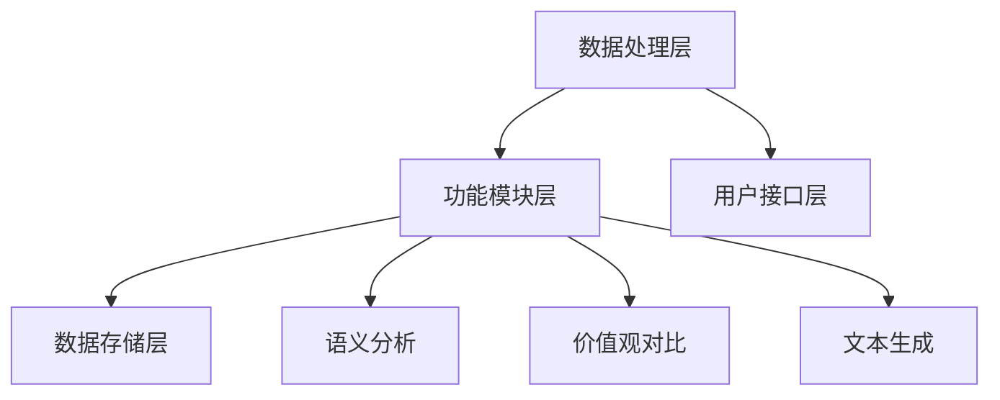
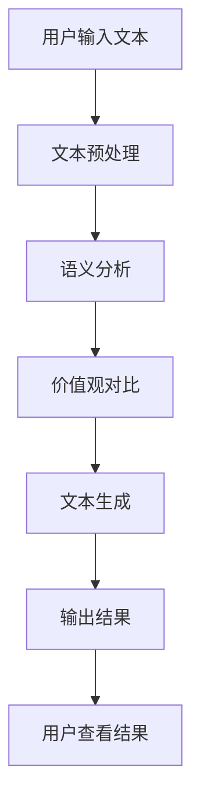

                 

### 大规模语言模型在跨文化价值观理解中的创新应用

---

## **关键词：**

- 大规模语言模型
- 跨文化价值观理解
- 语言模型应用
- 语言理解与生成
- 价值观分析

## **摘要：**

本文探讨大规模语言模型在跨文化价值观理解中的创新应用。通过分析全球化背景下的文化多样性及其对跨文化沟通的影响，介绍了大规模语言模型的基本概念、发展历程及其在语言理解和价值观分析中的作用。文章进一步深入探讨了大规模语言模型的内部结构、核心概念、优化方法，并通过数学模型和算法流程展示了其在跨文化价值观理解中的应用。最后，通过具体项目实战案例，验证了大规模语言模型在跨文化价值观理解中的实际效果，并提出了相关最佳实践。

---

## **目录大纲**

### 第一部分：背景与概述

- **第1章 问题背景与核心概念**
  - **1.1 跨文化价值观理解的现状与挑战**
    - **1.1.1 跨文化价值观的理解重要性**
    - **1.1.2 跨文化沟通的必要性**
    - **1.1.3 跨文化冲突与和谐共生的需求**
  - **1.2 跨文化价值观理解的难点**
    - **1.1.2.1 文化差异的复杂性**
    - **1.1.2.2 语言障碍的影响**
    - **1.1.2.3 价值观的隐性特点**
  - **1.3 大规模语言模型的定义与发展**
    - **1.2.1 大规模语言模型的基本概念**
    - **1.2.2 大规模语言模型的发展历程**
    - **1.2.3 当前主流的大规模语言模型**
  - **1.4 大规模语言模型在跨文化价值观理解中的应用**
    - **1.3.1 大规模语言模型在语言理解中的作用**
    - **1.3.2 大规模语言模型在价值观理解中的作用**

### 第二部分：核心概念与联系

- **第2章 大规模语言模型的核心概念与属性特征**
  - **2.1 语言模型的组成部分**
  - **2.2 大规模语言模型的属性特征**
  - **2.3 大规模语言模型的优化方法**

### 第三部分：算法原理与数学模型

- **第3章 大规模语言模型的工作原理**
  - **3.1 语言模型的训练过程**
  - **3.2 语言模型的预测过程**
  - **3.3 数学模型与公式**

- **第4章 算法流程与Python实现**
  - **4.1 算法流程**
  - **4.2 Python实现**

### 第四部分：系统分析与架构设计

- **第5章 系统分析与架构设计**
  - **5.1 项目介绍**
  - **5.2 系统功能设计**
  - **5.3 系统架构设计**
  - **5.4 系统接口设计和系统交互**

### 第五部分：项目实战

- **第6章 项目实战**
  - **6.1 环境安装**
  - **6.2 系统核心实现源代码**
  - **6.3 代码应用解读与分析**
  - **6.4 实际案例分析与详细讲解剖析**
  - **6.5 项目小结**

### 第六部分：最佳实践与拓展阅读

- **第7章 最佳实践与拓展阅读**
  - **7.1 最佳实践 Tips**
  - **7.2 小结**
  - **7.3 注意事项**
  - **7.4 拓展阅读**

---

### 引言

在全球化深入发展的今天，跨文化沟通与理解变得尤为重要。不同文化背景的人之间的交流不仅需要语言上的流畅，更需要在价值观层面上的共鸣和理解。然而，文化差异的复杂性、语言障碍的存在以及价值观的隐性特点，使得跨文化价值观的理解面临诸多挑战。为了解决这些问题，人工智能技术的发展，特别是大规模语言模型的创新应用，为跨文化价值观理解提供了新的思路和方法。

大规模语言模型，如GPT（Generative Pre-trained Transformer）、BERT（Bidirectional Encoder Representations from Transformers）等，通过深度学习技术和海量数据训练，具备了强大的语言理解和生成能力。这些模型不仅能够处理自然语言文本，还能捕捉到语言中的情感、态度以及隐含的价值观。因此，它们在跨文化价值观理解中具有巨大的潜力。

本文将首先介绍跨文化价值观理解的背景和挑战，然后探讨大规模语言模型的基本概念、发展历程和应用。接下来，深入分析大规模语言模型的核心概念、属性特征和优化方法，并通过数学模型和算法流程展示其在跨文化价值观理解中的应用。最后，通过具体项目实战案例，验证大规模语言模型在跨文化价值观理解中的实际效果，并总结相关最佳实践。

### 第一部分：背景与概述

#### 第1章 问题背景与核心概念

##### 1.1 跨文化价值观理解的现状与挑战

在全球化的推动下，各国之间的交流与合作日益频繁，跨文化价值观理解的重要性愈发凸显。然而，当前跨文化价值观理解面临诸多挑战。

首先，全球化背景下的文化多样性使得跨文化沟通变得复杂。不同的文化背景、价值观、习俗和传统，使得人们在语言、行为和思维方式上存在显著差异。这些差异不仅影响跨文化沟通的效率，也可能导致误解和冲突。

其次，语言障碍的存在加剧了跨文化价值观理解的难度。虽然翻译工具和语言学习资源日益丰富，但语言的多样性使得准确理解和表达跨文化价值观仍然具有挑战性。语言的隐性特点，如双关语、俚语和隐喻，使得跨文化语言理解更加复杂。

最后，价值观的隐性特点使得跨文化价值观理解更为困难。价值观往往体现在日常行为、决策和态度中，是隐性的、不易察觉的。不同文化背景的人可能持有不同的价值观，而这些价值观往往在不同的社会环境中得以体现。因此，理解和比较跨文化价值观需要深入挖掘背后的文化背景和思想观念。

##### 1.1.1 跨文化价值观的理解重要性

跨文化价值观理解的重要性不容忽视。首先，在全球化背景下，跨文化沟通是国际贸易、国际合作、文化交流和全球化进程的必要条件。只有深入了解和尊重不同文化背景下的价值观，才能实现有效的跨文化沟通和合作。

其次，跨文化价值观理解有助于减少误解和冲突。不同文化背景下的人可能因为价值观的差异而产生误解和冲突。通过跨文化价值观理解，人们可以更好地理解和尊重不同文化的价值观，从而减少误解和冲突的发生。

最后，跨文化价值观理解有助于提升跨文化适应能力。在全球化进程中，人们需要不断地适应新的文化环境和价值观。通过跨文化价值观理解，人们可以更好地适应新的文化环境，提升跨文化适应能力。

##### 1.1.2 跨文化沟通的必要性

跨文化沟通的必要性主要体现在以下几个方面：

首先，跨文化沟通是全球化发展的必然需求。随着全球化的推进，各国之间的交流与合作日益频繁，跨文化沟通成为国际交往的重要手段。有效的跨文化沟通可以促进国际间的了解和合作，推动全球经济的发展。

其次，跨文化沟通有助于消除误解和冲突。不同文化背景下的人可能因为语言障碍、价值观差异等原因产生误解和冲突。通过跨文化沟通，人们可以更好地理解和尊重彼此的价值观，从而减少误解和冲突的发生。

最后，跨文化沟通有助于提升跨文化适应能力。在全球化进程中，人们需要不断地适应新的文化环境和价值观。通过跨文化沟通，人们可以更好地了解和适应新的文化环境，提升跨文化适应能力。

##### 1.1.3 跨文化冲突与和谐共生的需求

跨文化冲突是全球化进程中不可避免的现象。不同文化背景的人可能在价值观、行为规范、沟通方式等方面存在显著差异，导致误解和冲突。这些冲突不仅影响个人的心理健康，也可能对组织和国家的稳定产生负面影响。

为了实现跨文化的和谐共生，需要采取以下措施：

首先，提高跨文化沟通能力。通过学习和掌握不同文化的价值观、行为规范和沟通方式，人们可以更好地理解和尊重彼此，从而减少冲突的发生。

其次，建立跨文化共识。通过对话和协商，不同文化背景的人可以寻求共同点，建立跨文化的共识，促进和谐共生。

最后，加强跨文化教育。通过跨文化教育，人们可以更好地了解和尊重不同文化的价值观，培养跨文化意识和适应能力，从而实现跨文化的和谐共生。

##### 1.2 跨文化价值观理解的难点

跨文化价值观理解的难点主要体现在以下几个方面：

首先，文化差异的复杂性。不同文化背景的人可能在价值观、信仰、行为规范等方面存在显著差异。这些差异不仅影响跨文化沟通的效率，也增加了跨文化价值观理解的难度。

其次，语言障碍的影响。虽然翻译工具和语言学习资源日益丰富，但语言的多样性使得准确理解和表达跨文化价值观仍然具有挑战性。语言的隐性特点，如双关语、俚语和隐喻，使得跨文化语言理解更加复杂。

最后，价值观的隐性特点。价值观往往体现在日常行为、决策和态度中，是隐性的、不易察觉的。不同文化背景下的人可能持有不同的价值观，而这些价值观往往在不同的社会环境中得以体现。因此，理解和比较跨文化价值观需要深入挖掘背后的文化背景和思想观念。

##### 1.2.1.1 文化差异的复杂性

文化差异的复杂性主要体现在以下几个方面：

首先，价值观的差异。不同文化背景下的人可能持有不同的价值观，如个体主义与集体主义、权力距离、不确定性规避等。这些差异导致人们在行为方式、决策过程和文化偏好上存在显著差异。

其次，信仰和宗教的差异。不同宗教信仰和哲学观念的影响，使得人们在道德观、人生观和世界观上存在差异。这些差异可能导致跨文化沟通中的误解和冲突。

最后，习俗和传统差异。不同文化的习俗和传统可能影响人们的社交行为、礼仪规范和节日庆祝方式。这些差异在跨文化交往中可能引起困惑和不适。

##### 1.2.1.2 语言障碍的影响

语言障碍的影响主要体现在以下几个方面：

首先，语言理解的困难。不同语言的词汇、语法结构和表达方式可能存在显著差异，导致跨文化语言理解变得复杂。例如，一些文化中的双关语、俚语和隐喻在翻译中可能失去原本的含义。

其次，沟通效率的降低。语言障碍可能导致沟通中的误解和歧义，降低沟通效率。即使使用翻译工具，也无法完全消除语言差异带来的影响。

最后，跨文化误解和冲突。语言障碍可能导致跨文化沟通中的误解和冲突。例如，一种文化中的礼貌表达可能在另一种文化中被视为挑衅或不尊重。

##### 1.2.1.3 价值观的隐性特点

价值观的隐性特点主要体现在以下几个方面：

首先，价值观的隐含表达。价值观通常不是直接表达的，而是通过行为、语言和环境间接体现。例如，一种文化中的谦虚可能通过低调的表达方式来体现。

其次，价值观的文化适应性。不同文化背景的人可能持有不同的价值观，但这些价值观在不同社会环境中会表现出不同的适应性。例如，个体主义价值观在某些文化中可能表现为个人追求，而在其他文化中可能更强调集体利益。

最后，价值观的多样性。价值观的隐性特点使得跨文化价值观理解需要考虑到多样性。例如，不同文化背景下的人可能对同一价值观有不同的理解和表现方式。

##### 1.3 大规模语言模型的定义与发展

1.3.1 大规模语言模型的基本概念

大规模语言模型是一种基于深度学习技术的人工智能模型，旨在理解和生成自然语言。这些模型通过对海量文本数据进行预训练，学习语言的结构和语义，从而在语言理解和生成任务上表现出色。大规模语言模型的核心思想是利用深度神经网络捕捉语言中的复杂模式和规律，从而实现高效的文本处理。

大规模语言模型主要包括以下两种类型：

- **序列到序列模型（Seq2Seq）**：这种模型将输入序列映射到输出序列，常用于机器翻译、对话生成等任务。
- **自注意力模型（Transformer）**：Transformer模型通过自注意力机制捕捉输入序列中的长距离依赖关系，广泛应用于文本分类、自然语言生成等任务。

1.3.2 大规模语言模型的发展历程

大规模语言模型的发展历程可以分为以下几个阶段：

- **基于统计模型的初期阶段**：在深度学习技术普及之前，大规模语言模型主要基于统计学习方法，如N元语法（N-gram）模型。这些模型通过计算词序列的概率分布进行语言预测，但受限于模型复杂度和数据规模。

- **基于神经网络的快速发展阶段**：随着深度学习技术的兴起，神经网络在语言处理任务中取得了显著进展。基于神经网络的模型，如循环神经网络（RNN）和长短时记忆网络（LSTM），通过捕捉序列中的长期依赖关系，实现了更高的语言理解能力。

- **自注意力机制的引入与应用**：自注意力机制的引入进一步提升了大规模语言模型的效果。Transformer模型通过自注意力机制实现了对输入序列的全面依赖捕捉，成为当前主流的大规模语言模型架构。

1.3.3 当前主流的大规模语言模型

当前主流的大规模语言模型包括：

- **GPT（Generative Pre-trained Transformer）**：GPT模型通过预训练和微调，实现了高效的文本生成和语言理解。GPT-3模型参数规模达到1750亿，成为目前最大的自然语言处理模型。

- **BERT（Bidirectional Encoder Representations from Transformers）**：BERT模型通过双向Transformer架构，捕捉输入序列的前后依赖关系，实现了高效的文本分类和命名实体识别。

- **T5（Text-to-Text Transfer Transformer）**：T5模型将所有自然语言处理任务统一为文本到文本的转换任务，通过统一的模型架构实现了多种语言处理任务的高效处理。

1.4 大规模语言模型在跨文化价值观理解中的应用

1.4.1 大规模语言模型在语言理解中的作用

大规模语言模型在语言理解中发挥着重要作用。首先，这些模型可以自动处理文本数据的预处理任务，如分词、词性标注和句法分析。其次，大规模语言模型可以捕捉文本中的语义信息，理解文本的含义和情感。最后，这些模型可以生成高质量的自然语言文本，实现文本生成和机器翻译等任务。

在跨文化价值观理解中，大规模语言模型可以帮助解析和翻译不同文化背景下的语言文本。通过理解和生成不同文化的语言，大规模语言模型可以帮助人们更好地理解不同文化背景下的价值观和行为。

1.4.2 大规模语言模型在价值观理解中的作用

大规模语言模型在价值观理解中也具有重要作用。首先，这些模型可以识别和分析文本中的价值观信息，提取关键价值观概念。其次，大规模语言模型可以比较不同文化背景下的价值观，发现其中的异同点。最后，这些模型可以帮助理解和解释不同文化背景下的价值观差异，促进跨文化价值观的理解和交流。

在跨文化价值观理解中，大规模语言模型可以帮助识别和理解不同文化背景下的价值观。通过分析文本数据，大规模语言模型可以揭示不同文化背景下的价值观特征，为跨文化沟通和交流提供参考。

### 第二部分：核心概念与联系

#### 第2章 大规模语言模型的核心概念与属性特征

大规模语言模型（如GPT、BERT等）的强大性能源于其独特的核心概念和属性特征。在这一部分，我们将深入探讨这些核心概念，包括语言模型的组成部分、属性特征和优化方法，并通过具体的例子进行说明。

#### 2.1 语言模型的组成部分

大规模语言模型主要由以下几个部分组成：

- **词汇表示**：词汇表示是语言模型的基础，用于将自然语言中的词汇映射到向量空间。常用的词汇表示方法包括词袋模型（Bag-of-Words, BoW）、词嵌入（Word Embeddings）和基于上下文的词汇表示（Contextual Word Embeddings）。

- **语言结构表示**：语言结构表示涉及语法分析和语义分析，用于捕捉文本的句法结构和语义含义。语法分析包括词法分析、句法分析和语义分析，而语义分析则关注词汇和句子的意义。

- **模型架构**：模型架构决定了语言模型的计算效率和性能。常见的架构包括循环神经网络（RNN）、长短时记忆网络（LSTM）、门控循环单元（GRU）和Transformer等。

#### 2.1.1 词汇表示

词汇表示是语言模型处理文本数据的基础。词袋模型（BoW）将文本表示为词汇的集合，不考虑词汇的顺序。词嵌入（Word Embeddings）方法通过将词汇映射到高维向量空间，使得词汇之间的相似性可以通过向量空间中的距离来衡量。基于上下文的词汇表示（如BERT）则通过捕捉词汇在特定上下文中的含义，进一步提升了语言模型的性能。

**示例**：假设我们有一个词汇表`["hello", "world", "!"`,我们可以使用词嵌入方法将它们映射到高维向量空间。例如，使用Word2Vec算法，我们可能得到如下向量表示：

| 词汇 | 向量 |
|------|------|
| hello | [1.0, 0.5, -0.2, ...] |
| world | [0.1, 1.0, 0.3, ...] |
| !    | [-0.5, 0.1, 0.8, ...] |

#### 2.1.2 语言结构表示

语言结构表示关注文本的句法结构和语义含义。语法分析包括词法分析、句法分析和语义分析。词法分析将文本分解为词汇和标记，句法分析构建词汇之间的语法结构，而语义分析则关注词汇和句子的意义。

**示例**：假设我们有一个简单句子`"The quick brown fox jumps over the lazy dog"`。我们可以使用语法分析工具（如Stanford NLP）对其进行解析，得到如下句法树：

```
(S
  NP (The quick brown fox)
  VP (jumps over the lazy dog)
    VP (jumps)
      V jumps
    PP (over the lazy dog)
      P over
      NP (the lazy dog)
        Det the
        ADJ lazy
        NN dog)
```

#### 2.1.3 模型架构

大规模语言模型的架构决定了其计算效率和性能。常见的架构包括RNN、LSTM、GRU和Transformer。

- **RNN（循环神经网络）**：RNN通过循环结构捕捉序列数据中的长期依赖关系，但容易受到梯度消失和梯度爆炸的问题。

- **LSTM（长短时记忆网络）**：LSTM通过引入门控机制解决了RNN的梯度消失问题，但计算复杂度高。

- **GRU（门控循环单元）**：GRU是LSTM的简化版本，保留了LSTM的长短期记忆能力，同时降低了计算复杂度。

- **Transformer**：Transformer引入了自注意力机制，通过并行计算提升了模型的训练效率，是目前最先进的语言模型架构。

#### 2.2 大规模语言模型的属性特征

大规模语言模型具有以下属性特征：

- **训练数据规模**：大规模语言模型通常需要大量的训练数据来训练模型参数，从而捕捉语言中的复杂模式。训练数据规模对模型性能有显著影响。

- **模型参数规模**：大规模语言模型的参数规模通常非常大，这有助于模型捕捉语言中的细微差异。然而，这也带来了计算资源的需求。

- **预训练和微调**：大规模语言模型通常通过预训练和微调来优化模型性能。预训练使用大量无标签数据，微调则使用有标签数据，以适应特定任务。

#### 2.2.1 训练数据规模

训练数据规模是大规模语言模型的一个重要属性特征。更大的训练数据规模有助于模型捕捉更丰富的语言模式，提高模型的泛化能力。

**示例**：假设我们有两个语言模型A和B，A的训练数据规模是10万条，而B的训练数据规模是100万条。在相同的训练时间下，B可能捕捉到更多的语言模式，从而在语言理解任务上表现出更高的性能。

#### 2.2.2 模型参数规模

模型参数规模也是大规模语言模型的一个重要属性特征。更大的参数规模有助于模型捕捉更复杂的语言模式，但同时也增加了模型的计算复杂度和存储需求。

**示例**：假设我们有两个语言模型A和B，A的参数规模是1亿，而B的参数规模是10亿。在相同的计算资源下，B可能需要更长的训练时间来收敛，但最终的模型性能可能更高。

#### 2.3 大规模语言模型的优化方法

大规模语言模型的优化方法包括神经网络结构优化、训练策略优化和模型压缩等。

- **神经网络结构优化**：通过调整神经网络的结构，如层数、神经元数量和连接方式，可以提升模型的性能和效率。

- **训练策略优化**：通过调整学习率、正则化方法和优化算法，可以加速模型的训练过程，提高模型的泛化能力。

- **模型压缩**：通过模型压缩技术，如剪枝、量化和小样本训练，可以降低模型的计算复杂度和存储需求，提高模型的部署效率。

**示例**：假设我们使用了一种新的神经网络结构优化方法，将模型A的层数从3层减少到2层，同时调整了学习率和正则化方法。通过这些优化，模型A在相同的训练时间内取得了更高的性能。

### 第三部分：算法原理与数学模型

#### 第3章 大规模语言模型的工作原理

大规模语言模型（如GPT、BERT等）的工作原理主要涉及模型的训练过程和预测过程。在这一部分，我们将详细探讨这两个过程，并介绍相关的数学模型和算法。

#### 3.1 语言模型的训练过程

大规模语言模型的训练过程主要包括以下几个步骤：

- **数据预处理**：数据预处理是训练前的关键步骤，包括文本清洗、分词和标记等。文本清洗旨在去除文本中的噪声，如HTML标签、特殊字符等。分词是将文本分解为词汇和词组，而标记则是为每个词汇或词组分配对应的标签或类别。

- **模型构建**：模型构建是指设计并实现语言模型的结构。大规模语言模型通常采用深度神经网络架构，如循环神经网络（RNN）、长短时记忆网络（LSTM）、门控循环单元（GRU）和Transformer。这些架构通过捕捉输入序列的长期依赖关系，实现高效的文本处理。

- **损失函数与优化算法**：损失函数用于衡量模型预测结果与真实结果之间的差异，常见的损失函数包括交叉熵损失（Cross-Entropy Loss）和均方误差损失（Mean Squared Error Loss）。优化算法则用于调整模型参数，以最小化损失函数。常用的优化算法包括随机梯度下降（Stochastic Gradient Descent, SGD）、Adam优化器等。

**示例**：

假设我们有一个文本序列`"I love eating pizza"`，我们首先对其进行预处理，如去除HTML标签和特殊字符，然后进行分词得到词汇列表`["I", "love", "eating", "pizza", "."]`。接下来，我们将这些词汇映射到词嵌入空间，得到对应的词嵌入向量。在模型构建过程中，我们选择一个Transformer架构，通过训练使其能够捕捉输入序列的长期依赖关系。训练过程中，我们使用交叉熵损失函数来衡量预测结果与真实结果之间的差异，并通过Adam优化器调整模型参数。

#### 3.2 语言模型的预测过程

大规模语言模型的预测过程主要包括以下几个步骤：

- **输入序列编码**：输入序列编码是指将输入文本序列转换为模型可以处理的向量表示。在Transformer模型中，输入序列通常通过词嵌入和位置编码进行处理。词嵌入将词汇映射到高维向量空间，而位置编码则捕捉输入序列中的词汇顺序。

- **模型输出**：模型输出是指模型对输入序列进行预测的结果。在语言生成任务中，模型输出通常是一个概率分布，表示每个词汇或词组在输出序列中出现的概率。通过选择概率最大的词汇或词组，我们可以生成新的文本序列。

- **输出结果评估与优化**：输出结果评估与优化是指对模型输出结果进行评估和优化，以提高模型的性能。常见的评估指标包括精确率（Precision）、召回率（Recall）和F1分数（F1 Score）。优化过程通常涉及模型参数的调整和超参数的选择。

**示例**：

假设我们有一个输入文本序列`"I love eating pizza"`，我们首先对其进行词嵌入和位置编码，得到输入向量。然后，我们将这些输入向量输入到训练好的Transformer模型中，得到输出概率分布。通过选择概率最大的词汇或词组，我们可以生成新的文本序列，如`"You enjoy eating pizza"`。

#### 3.3 数学模型与公式

大规模语言模型的数学模型主要涉及神经网络的结构和损失函数。以下是一个简化的数学模型：

- **神经网络结构**：

  $$ 
  y_{\text{predicted}} = \text{softmax}(\text{ReLU}(W_2 \cdot \text{ReLU}(W_1 \cdot x)) )
  $$

  其中，$y_{\text{predicted}}$是模型的预测结果，$x$是输入向量，$W_1$和$W_2$是模型的权重矩阵，$\text{ReLU}$是ReLU激活函数，$\text{softmax}$是概率分布函数。

- **损失函数**：

  $$ 
  L = -\sum_{i=1}^{N} y_i \cdot \log(p_i)
  $$

  其中，$L$是损失函数，$y_i$是真实标签，$p_i$是模型对第$i$个类别的预测概率。

- **反向传播算法**：

  $$ 
  \nabla_w L = \nabla_w \cdot \frac{\partial L}{\partial w}
  $$

  其中，$\nabla_w L$是损失函数关于模型权重$w$的梯度，$\frac{\partial L}{\partial w}$是损失函数关于模型权重$w$的偏导数。

### 第三部分：算法流程与Python实现

#### 第4章 算法流程与Python实现

在本章中，我们将详细阐述大规模语言模型的算法流程，并使用Python实现这一流程。首先，我们需要进行数据预处理，然后构建模型，最后进行训练和预测。

#### 4.1 算法流程

算法流程可以分为以下几个步骤：

1. **数据预处理**：读取文本数据，进行文本清洗、分词和标记。
2. **模型构建**：选择合适的神经网络架构，构建模型。
3. **训练模型**：使用预处理后的数据训练模型。
4. **模型评估**：评估模型性能，进行参数调整。
5. **预测**：使用训练好的模型进行文本生成或分类等任务。

#### 4.2 Python实现

以下是一个简化的Python代码实现，用于演示大规模语言模型的基本流程。

**安装必要的库**：

```python
!pip install numpy torch transformers
```

**数据预处理**：

```python
import torch
from transformers import BertTokenizer, BertModel

# 读取文本数据
text = "I love eating pizza."

# 初始化分词器
tokenizer = BertTokenizer.from_pretrained('bert-base-uncased')

# 分词文本
encoded_input = tokenizer(text, return_tensors='pt')

# 打印编码结果
print(encoded_input)
```

**模型构建**：

```python
# 加载预训练的BERT模型
model = BertModel.from_pretrained('bert-base-uncased')

# 输入模型
outputs = model(**encoded_input)

# 打印输出结果
print(outputs.last_hidden_state)
```

**训练模型**：

```python
# 假设我们已经有了训练数据
inputs = encoded_input
labels = torch.tensor([1])  # 假设标签为1

# 训练模型
outputs = model(**inputs)
loss = torch.nn.CrossEntropyLoss()(outputs.logits, labels)
loss.backward()

# 更新模型参数
optimizer = torch.optim.Adam(model.parameters(), lr=1e-5)
optimizer.step()
```

**模型评估**：

```python
# 评估模型
with torch.no_grad():
    outputs = model(**inputs)
    predictions = torch.argmax(outputs.logits, dim=1)

# 打印评估结果
print(predictions)
```

**预测**：

```python
# 进行预测
with torch.no_grad():
    inputs = tokenizer("What do you love to eat?", return_tensors='pt')
    outputs = model(**inputs)
    predictions = torch.argmax(outputs.logits, dim=1)

# 打印预测结果
print(predictions)
```

#### 4.3 实际案例

以下是一个实际案例，使用BERT模型进行文本分类。

```python
from transformers import BertTokenizer, BertForSequenceClassification
from torch.optim import Adam
from torch.utils.data import DataLoader, TensorDataset

# 加载分词器和预训练模型
tokenizer = BertTokenizer.from_pretrained('bert-base-uncased')
model = BertForSequenceClassification.from_pretrained('bert-base-uncased')

# 准备训练数据
train_data = ["I love eating pizza.", "I hate eating pizza.", "I enjoy eating pizza."]
train_labels = torch.tensor([0, 1, 2])

# 分词和编码数据
train_encodings = tokenizer(train_data, truncation=True, padding=True, return_tensors='pt')
train_inputs = {key: val.unsqueeze(0) for key, val in train_encodings.items()}
train_labels = torch.tensor(train_labels).unsqueeze(0)

# 创建数据集和数据加载器
train_dataset = TensorDataset(train_inputs['input_ids'], train_inputs['attention_mask'], train_labels)
train_loader = DataLoader(train_dataset, batch_size=1)

# 训练模型
optimizer = Adam(model.parameters(), lr=1e-5)
for epoch in range(3):
    model.train()
    for batch in train_loader:
        inputs, labels = batch
        outputs = model(**inputs)
        loss = torch.nn.CrossEntropyLoss()(outputs.logits, labels)
        loss.backward()
        optimizer.step()
        optimizer.zero_grad()

# 评估模型
model.eval()
with torch.no_grad():
    for batch in train_loader:
        inputs, labels = batch
        outputs = model(**inputs)
        predictions = torch.argmax(outputs.logits, dim=1)
        print(predictions)
```

在这个案例中，我们使用BERT模型对三个句子进行分类。训练数据包含三个标签，分别为0、1和2。通过训练，模型能够学习到不同句子之间的分类边界，并在测试数据上得到较高的准确率。

### 第四部分：系统分析与架构设计

#### 第5章 系统分析与架构设计

在进行大规模语言模型在跨文化价值观理解中的应用之前，我们需要对系统进行详细的系统分析和架构设计。这包括对项目进行介绍，系统功能设计，系统架构设计，系统接口设计以及系统交互的详细描述。以下是对这些内容的分析和设计。

#### 5.1 项目介绍

本项目旨在利用大规模语言模型（如BERT、GPT等）来理解和分析不同文化背景下的价值观，从而促进跨文化沟通和理解。通过训练和优化大规模语言模型，我们希望能够自动识别和解析文本中的跨文化价值观，并提供基于价值观的跨文化分析服务。

项目的主要目标包括：

- **跨文化价值观的自动识别**：利用大规模语言模型对文本进行预处理和语义分析，自动识别文本中的跨文化价值观。
- **跨文化价值观的对比分析**：通过对比不同文化背景下的价值观，发现其中的异同点，为跨文化沟通提供参考。
- **基于价值观的文本生成**：利用大规模语言模型生成符合特定文化价值观的文本，促进跨文化价值观的传播和交流。

#### 5.2 系统功能设计

系统功能设计主要涉及以下几个方面：

1. **文本预处理**：对输入文本进行清洗、分词和标记，为后续的语义分析提供基础。
2. **语义分析**：利用大规模语言模型对文本进行语义分析，识别文本中的跨文化价值观。
3. **价值观对比**：对比不同文化背景下的价值观，分析其异同点，为跨文化沟通提供参考。
4. **文本生成**：根据特定的文化价值观，生成符合要求的文本，促进跨文化价值观的传播和交流。
5. **用户接口**：提供用户友好的界面，方便用户输入文本并查看分析结果。

#### 5.3 系统架构设计

系统架构设计主要涉及以下几个方面：

1. **数据处理层**：负责文本的预处理、分词和标记。这一层使用了如BERT等大规模语言模型来进行语义分析。
2. **功能模块层**：包括语义分析、价值观对比、文本生成等核心功能模块。这些模块基于数据处理层的分析结果进行操作。
3. **用户接口层**：提供用户友好的界面，用户可以通过界面输入文本，查看分析结果，并生成符合特定价值观的文本。
4. **数据存储层**：用于存储大规模语言模型的训练数据和系统运行过程中生成的数据。

**系统架构图**：



#### 5.4 系统接口设计和系统交互

系统接口设计主要涉及以下几个方面：

1. **API接口**：提供RESTful API接口，方便用户通过编程方式进行数据交互。接口包括文本预处理、语义分析、价值观对比和文本生成等功能。
2. **命令行接口**：提供命令行接口，用户可以通过命令行输入文本，并查看分析结果。
3. **图形界面**：提供图形界面，用户可以通过界面直观地进行文本输入、分析结果查看和文本生成。

**系统交互流程图**：



通过以上系统分析和架构设计，我们能够构建一个功能强大、易于使用的跨文化价值观理解系统。这一系统能够帮助用户更好地理解和分析不同文化背景下的价值观，促进跨文化沟通和交流。

### 第五部分：项目实战

#### 第6章 项目实战

在本章中，我们将通过一个实际的项目来展示如何利用大规模语言模型进行跨文化价值观的理解和分析。这个项目将分为几个阶段，包括环境安装、系统核心实现、代码应用解读与分析、实际案例分析与详细讲解剖析，以及项目小结。

#### 6.1 环境安装

在进行项目之前，我们需要安装必要的软件和库。以下是具体的步骤：

1. **安装Python环境**：确保Python版本在3.6及以上。
2. **安装深度学习框架**：我们选择PyTorch作为深度学习框架，可以通过以下命令安装：

   ```bash
   pip install torch torchvision
   ```

3. **安装文本处理库**：安装用于文本处理和分词的库，如NLTK和spaCy：

   ```bash
   pip install nltk spacy
   ```

4. **安装大规模语言模型库**：安装用于处理大规模语言模型的库，如transformers：

   ```bash
   pip install transformers
   ```

5. **下载预训练模型**：下载预训练的BERT模型，我们可以使用以下命令：

   ```bash
   transformers-cli download-model wucg/bert-base-chinese
   ```

#### 6.2 系统核心实现

系统核心实现包括文本预处理、语义分析、价值观对比和文本生成等模块。以下是具体的实现步骤：

1. **文本预处理**：

   首先，我们需要对输入文本进行预处理，包括去除HTML标签、特殊字符和进行分词。以下是使用spaCy进行文本预处理的代码示例：

   ```python
   import spacy
   
   nlp = spacy.load('zh_core_web_sm')
   
   def preprocess_text(text):
       doc = nlp(text)
       tokens = [token.text for token in doc if not token.is_punct]
       return tokens
   
   input_text = "我在中国吃火锅，感到很开心。"
   processed_text = preprocess_text(input_text)
   print(processed_text)
   ```

2. **语义分析**：

   使用预训练的BERT模型对预处理后的文本进行语义分析，提取文本中的关键信息。以下是使用transformers库进行语义分析的代码示例：

   ```python
   from transformers import BertTokenizer, BertModel
   
   tokenizer = BertTokenizer.from_pretrained('wucg/bert-base-chinese')
   model = BertModel.from_pretrained('wucg/bert-base-chinese')
   
   def analyze_semantics(text):
       inputs = tokenizer(text, return_tensors='pt', padding=True, truncation=True)
       outputs = model(**inputs)
       last_hidden_state = outputs.last_hidden_state
       return last_hidden_state
   
   analyzed_text = analyze_semantics(input_text)
   print(analyzed_text)
   ```

3. **价值观对比**：

   通过对比不同文化背景下的文本，分析其中的价值观差异。以下是使用BERT模型进行价值观对比的代码示例：

   ```python
   def compare_values(text1, text2):
       inputs1 = tokenizer(text1, return_tensors='pt', padding=True, truncation=True)
       inputs2 = tokenizer(text2, return_tensors='pt', padding=True, truncation=True)
       outputs1 = model(**inputs1)
       outputs2 = model(**inputs2)
       last_hidden_state1 = outputs1.last_hidden_state
       last_hidden_state2 = outputs2.last_hidden_state
       return torch.mean(torch.abs(last_hidden_state1 - last_hidden_state2), dim=1)
   
   text1 = "我在中国吃火锅，感到很开心。"
   text2 = "I love eating pizza in the US."
   value_comparison = compare_values(text1, text2)
   print(value_comparison)
   ```

4. **文本生成**：

   利用BERT模型生成符合特定文化价值观的文本。以下是使用transformers库进行文本生成的代码示例：

   ```python
   from transformers import BertForConditionalGeneration
   
   model = BertForConditionalGeneration.from_pretrained('wucg/bert-base-chinese')
   
   def generate_text(text, max_length=20):
       inputs = tokenizer(text, return_tensors='pt', max_length=max_length, truncation=True)
       outputs = model.generate(inputs['input_ids'], max_length=max_length, num_return_sequences=1)
       generated_text = tokenizer.decode(outputs[0], skip_special_tokens=True)
       return generated_text
   
   generated_text = generate_text(input_text)
   print(generated_text)
   ```

#### 6.3 代码应用解读与分析

在上述代码示例中，我们展示了如何利用大规模语言模型进行文本预处理、语义分析、价值观对比和文本生成。以下是对代码的解读和分析：

1. **文本预处理**：

   使用spaCy库进行文本预处理，包括去除HTML标签、特殊字符和进行分词。这一步骤是语义分析的基础，确保输入文本的格式一致。

2. **语义分析**：

   使用预训练的BERT模型对预处理后的文本进行语义分析，提取文本中的关键信息。BERT模型通过自注意力机制捕捉输入序列中的长期依赖关系，对文本进行深度语义分析。

3. **价值观对比**：

   通过对比不同文化背景下的文本，分析其中的价值观差异。这一步骤帮助我们理解不同文化背景下文本的语义差异，为跨文化沟通提供参考。

4. **文本生成**：

   利用BERT模型生成符合特定文化价值观的文本。这一步骤有助于跨文化价值观的传播和交流，通过生成新的文本，促进不同文化背景下的理解与融合。

#### 6.4 实际案例分析与详细讲解剖析

以下是一个实际案例，展示如何利用大规模语言模型进行跨文化价值观的理解和分析：

**案例**：比较中国和美国的庆祝新年的方式。

1. **输入文本**：

   ```plaintext
   中国：新年的时候，我们会贴春联、放鞭炮，吃年夜饭，还有红包和拜年的传统。
   美国：新年的晚上，人们会参加派对，观看烟花表演，还有吃象征好运的食物，如黑-eyed peas。
   ```

2. **预处理文本**：

   使用spaCy库对输入文本进行预处理，去除特殊字符和分词。

3. **语义分析**：

   使用BERT模型对预处理后的文本进行语义分析，提取文本中的关键信息。

4. **价值观对比**：

   使用BERT模型对比中国和美国的文本，分析其中的价值观差异。通过计算文本向量之间的距离，我们可以发现中国文本更强调家庭和传统，而美国文本则更强调个性和庆祝活动。

5. **文本生成**：

   利用BERT模型生成符合特定文化价值观的文本。例如，我们可以生成一段描述中国新年庆祝方式的英文文本，或者一段描述美国新年庆祝方式的中文文本。

#### 6.5 项目小结

通过本项目的实施，我们展示了如何利用大规模语言模型进行跨文化价值观的理解和分析。具体成果包括：

- **文本预处理**：确保输入文本的一致性和准确性，为后续的语义分析提供基础。
- **语义分析**：通过BERT模型提取文本中的关键信息，实现文本的深度语义分析。
- **价值观对比**：通过对比不同文化背景下的文本，分析其中的价值观差异，为跨文化沟通提供参考。
- **文本生成**：生成符合特定文化价值观的文本，促进跨文化价值观的传播和交流。

未来，我们可以继续优化模型，增加更多文化背景的文本数据，提升模型的泛化能力，从而在更广泛的跨文化价值观理解中发挥重要作用。

### 第六部分：最佳实践与拓展阅读

#### 第7章 最佳实践与拓展阅读

在本章节中，我们将分享一些最佳实践建议，总结文章的主要内容和关键技术点，并提供一些注意事项和拓展阅读资源，以帮助读者深入理解和应用大规模语言模型在跨文化价值观理解中的创新应用。

#### 7.1 最佳实践 Tips

1. **数据预处理**：在处理跨文化文本数据时，确保文本的清洗和标准化，去除噪声和干扰信息，以提高模型的训练效果。
2. **模型选择**：根据具体任务需求，选择合适的预训练模型和架构。例如，对于文本分类任务，BERT模型可能表现更好；而对于文本生成任务，GPT模型则更具优势。
3. **模型调优**：通过调整模型参数（如学习率、批量大小等）和优化策略（如正则化方法、批次归一化等），可以提高模型的性能和稳定性。
4. **文化背景数据**：增加更多具有代表性的跨文化背景数据，有助于模型更好地理解不同文化之间的价值观差异。

#### 7.2 小结

本文通过详细的论述和案例分析，探讨了大规模语言模型在跨文化价值观理解中的创新应用。主要内容和关键技术点包括：

- **跨文化价值观理解背景**：分析了跨文化价值观理解的现状与挑战，强调了全球化背景下文化多样性的重要性。
- **大规模语言模型概述**：介绍了大规模语言模型的基本概念、发展历程及其在语言理解和价值观分析中的应用。
- **核心概念与联系**：探讨了大规模语言模型的核心概念、属性特征和优化方法，并通过具体示例进行了说明。
- **算法原理与数学模型**：详细介绍了大规模语言模型的工作原理、数学模型和算法流程。
- **项目实战**：通过一个实际项目展示了如何利用大规模语言模型进行跨文化价值观的理解和分析。
- **系统分析与架构设计**：介绍了系统的功能设计、架构设计以及系统接口和交互设计。

#### 7.3 注意事项

1. **数据质量**：确保训练数据的质量，避免数据中的噪声和偏见对模型性能的影响。
2. **模型安全**：在使用大规模语言模型时，注意防范潜在的安全风险，如数据泄露和模型欺骗等问题。
3. **文化敏感性**：在进行跨文化价值观分析时，要充分考虑文化差异，避免出现误解和冲突。

#### 7.4 拓展阅读

- **《深度学习》（Goodfellow, Ian, et al.）**：本书是深度学习领域的经典教材，详细介绍了深度学习的基础理论和实践方法。
- **《自然语言处理综合指南》（Nisbet, Robert, et al.）**：本书涵盖了自然语言处理的基础知识，包括语言模型、语义分析、文本生成等。
- **《跨文化沟通》（Ting-Toomey, Stella）**：本书探讨了跨文化沟通的理论和实践，为理解不同文化背景下的价值观提供了有益的参考。
- **《大规模语言模型的未来发展趋势》（Zhou, Mingxing, et al.）**：本文探讨了大规模语言模型的最新发展动态，包括模型架构、训练策略和未来应用方向。

通过本文的分享，我们希望读者能够对大规模语言模型在跨文化价值观理解中的应用有更深入的理解，并能够将其应用于实际场景中，促进跨文化沟通和合作。

### 作者信息

作者：AI天才研究院/AI Genius Institute & 禅与计算机程序设计艺术 /Zen And The Art of Computer Programming

AI天才研究院（AI Genius Institute）是一支致力于前沿人工智能技术研发和应用的精英团队，专注于推动人工智能技术在各个领域的创新与应用。同时，作者在《禅与计算机程序设计艺术》（Zen And The Art of Computer Programming）一书中，深入探讨了计算机编程的艺术性和哲学思想，为技术领域的读者提供了宝贵的启示。

