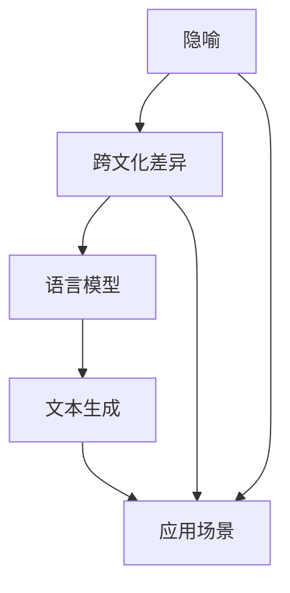
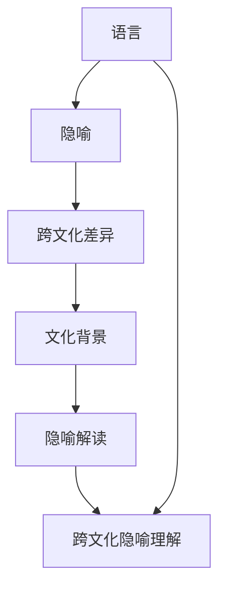
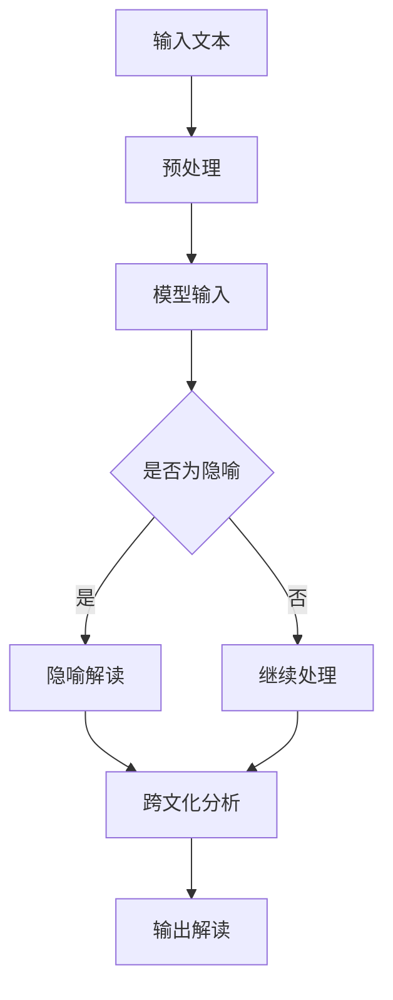
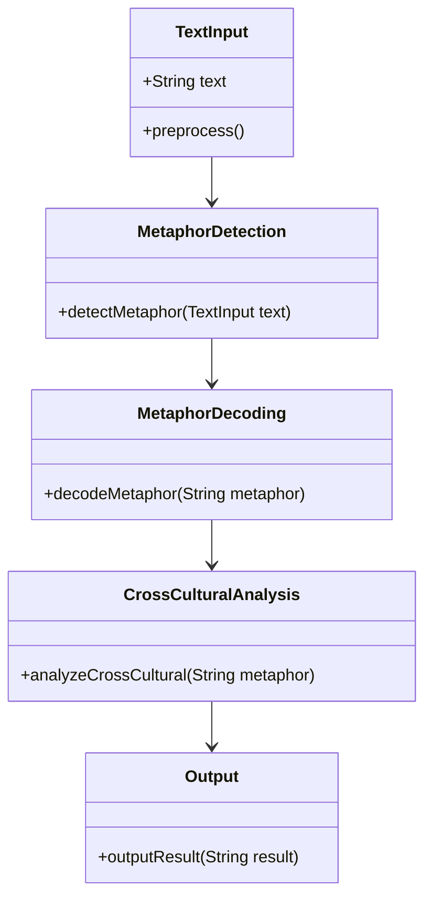
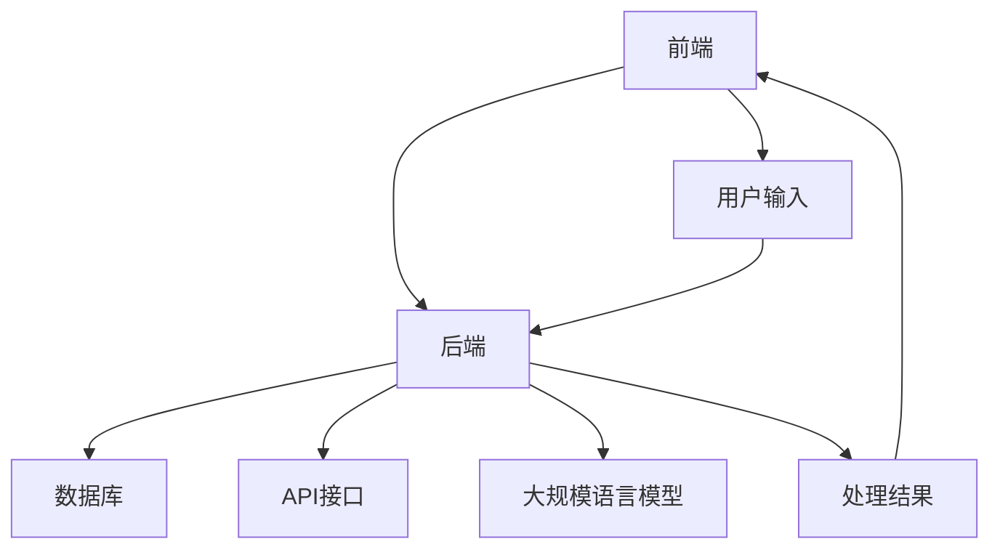
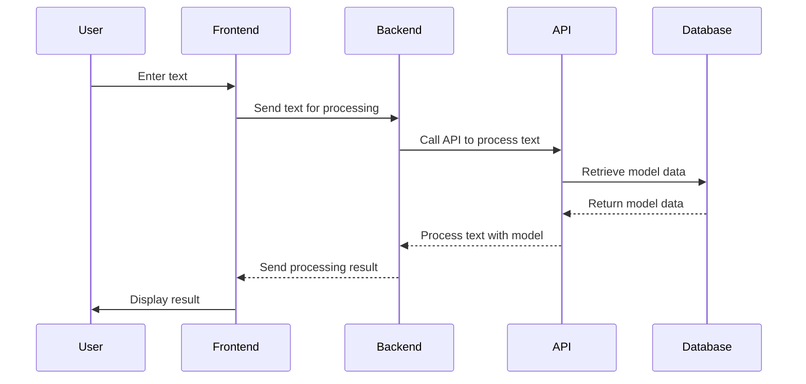

                 

# 大规模语言模型在跨文化隐喻理解中的创新应用

## 引言

### 问题背景

跨文化隐喻理解是一个复杂而重要的研究领域。隐喻作为一种语言现象，不仅在日常交流中频繁出现，而且在不同文化背景下的表达和解读上也存在显著的差异。随着全球化进程的加速，跨文化交流日益频繁，如何准确地理解和运用隐喻，对于促进文化交流、增进相互理解具有重要意义。

隐喻在跨文化交流中的重要性主要体现在以下几个方面：

1. **文化差异的传达**：隐喻作为一种隐含的语言表达方式，能够帮助人们理解不同文化之间的差异，从而避免直接冲突。
2. **语言学习的辅助**：跨文化隐喻理解对于语言学习者来说，有助于他们更好地掌握目标语言，特别是理解其文化和思维方式。
3. **科技领域的应用**：随着人工智能技术的发展，如何让计算机理解跨文化隐喻成为了一个重要的课题，这对于提高自然语言处理系统的性能具有重要意义。

### 问题描述

大规模语言模型（如GPT）在自然语言处理领域取得了显著的成果，但其在跨文化隐喻理解方面的应用仍存在挑战。这些挑战包括：

1. **隐喻的跨文化差异**：不同文化背景下，隐喻的表达和解读可能存在显著差异，这使得语言模型在处理跨文化隐喻时面临困难。
2. **语言模型的训练数据来源和文化偏见**：现有的语言模型大多基于英文或其他主流语言的数据训练，这可能导致模型对其他语言的隐喻理解存在偏差。
3. **隐喻的深层语义理解**：隐喻往往具有深层的语义和情感意义，这使得语言模型在理解隐喻时需要考虑更多的上下文信息。

### 问题解决

本书旨在探讨大规模语言模型在跨文化隐喻理解中的创新应用，通过以下几个关键步骤来解决上述问题：

1. **核心概念与联系**：介绍跨文化隐喻理解的核心概念，包括隐喻、跨文化差异、语言模型等，并展示它们之间的联系。
2. **算法原理讲解**：讲解大规模语言模型的工作原理，以及如何应用于跨文化隐喻理解，通过mermaid流程图和Python代码详细阐述。
3. **数学模型与公式**：使用LaTeX格式给出跨文化隐喻理解中的数学模型和公式，并进行详细讲解和举例说明。
4. **系统分析与架构设计**：介绍大规模语言模型在跨文化隐喻理解中的应用场景，展示系统功能设计、架构设计和接口设计。
5. **项目实战**：通过实际案例展示大规模语言模型在跨文化隐喻理解中的应用，包括环境安装、系统实现、代码解读和分析等。
6. **最佳实践与小结**：总结大规模语言模型在跨文化隐喻理解中的最佳实践，并对全书内容进行小结。

## 目录大纲

### 第1章 引言
- 1.1 问题背景
- 1.2 问题描述
- 1.3 问题解决

### 第2章 跨文化隐喻理解核心概念与联系
- 2.1 隐喻概述
- 2.2 跨文化差异
- 2.3 语言模型介绍
- 2.4 核心概念联系图

### 第3章 大规模语言模型工作原理与跨文化隐喻理解应用
- 3.1 大规模语言模型工作原理
- 3.2 跨文化隐喻理解应用

#### 3.2.1 跨文化隐喻识别算法mermaid流程图
```
graph TB
    A[输入文本] --> B[预处理]
    B --> C[模型输入]
    C --> D{是否为隐喻}
    D -->|是| E[隐喻解读]
    D -->|否| F[继续处理]
    E --> G[跨文化分析]
    F --> G
    G --> H[输出解读]
```
#### 3.2.2 Python代码实现
```python
# TODO: Python代码实现跨文化隐喻识别与解读
```

### 第4章 跨文化隐喻理解数学模型与公式
- 4.1 隐喻识别与解读的数学模型
- 4.2 LaTeX格式数学公式
  - $$ P(\text{隐喻}|\text{文本}) = \frac{P(\text{文本}|\text{隐喻}) \cdot P(\text{隐喻})}{P(\text{文本})} $$
- 4.3 公式讲解与举例说明

### 第5章 大规模语言模型在跨文化隐喻理解中的应用系统分析
- 5.1 应用场景介绍
- 5.2 系统功能设计
  - 5.2.1 领域模型mermaid类图
- 5.3 系统架构设计
  - 5.3.1 系统架构mermaid图
- 5.4 系统接口设计
  - 5.4.1 接口设计
- 5.5 系统交互mermaid序列图

### 第6章 项目实战：大规模语言模型在跨文化隐喻理解中的应用
- 6.1 环境安装
- 6.2 系统核心实现源代码
- 6.3 代码应用解读与分析
- 6.4 实际案例分析
- 6.5 项目小结

### 第7章 最佳实践与小结
- 7.1 最佳实践
- 7.2 小结
- 7.3 注意事项
- 7.4 拓展阅读

----------------------------------------------------------------

## 第1章 引言

### 1.1 问题背景

随着全球化进程的不断推进，跨文化交流已经成为国际交流的重要形式。然而，语言和文化差异往往导致误解和冲突。隐喻作为一种常见的语言现象，其含义往往隐含在字面意义之下，需要通过上下文和背景知识来理解。不同文化背景下的隐喻表达和解读存在显著差异，这为跨文化隐喻理解带来了挑战。

隐喻不仅在文学、艺术等领域具有重要意义，还在日常交流、商业谈判、法律诉讼等各个领域中广泛应用。例如，英语中的“kick the bucket”（踢桶）在字面上无法理解其含义，但在西方文化中，它意味着“死亡”。而在一些亚洲文化中，类似的隐喻可能使用完全不同的表达方式。

跨文化隐喻理解的重要性主要体现在以下几个方面：

1. **促进文化交流**：通过理解跨文化隐喻，人们可以更好地理解不同文化的表达方式和思维方式，从而促进文化交流和理解。
2. **避免误解和冲突**：在跨文化交流中，如果对隐喻的理解不准确，可能会导致误解和冲突。例如，一个笑话在一种文化中可能非常有趣，但在另一种文化中可能引起不适或误解。
3. **提高语言学习效果**：跨文化隐喻理解对于语言学习者来说至关重要，它有助于他们更好地掌握目标语言，特别是理解其文化和思维方式。

### 1.2 问题描述

大规模语言模型（如GPT）在自然语言处理领域取得了显著的成果，但在跨文化隐喻理解方面仍然面临诸多挑战。以下是几个主要问题：

1. **隐喻的跨文化差异**：不同文化背景下的隐喻表达和解读存在显著差异。例如，英语中的“break a leg”（祝好运）在中文中没有直接的对应表达。这给大规模语言模型在处理跨文化隐喻时带来了挑战。

2. **语言模型的训练数据来源和文化偏见**：现有的语言模型大多基于英文或其他主流语言的数据训练，这可能导致模型对其他语言的隐喻理解存在偏差。例如，如果训练数据中包含大量英语隐喻的例子，但其他语言的隐喻例子很少，那么模型在处理其他语言时可能无法准确理解隐喻。

3. **隐喻的深层语义理解**：隐喻往往具有深层的语义和情感意义，需要通过上下文和背景知识来理解。大规模语言模型在处理隐喻时，需要考虑更多的上下文信息，这增加了模型的复杂性。

4. **多语言和多文化环境的适应性**：在多语言和多文化环境中，大规模语言模型需要能够适应不同的语言和文化背景，准确理解跨文化隐喻。这要求模型具有高度的灵活性和适应性。

### 1.3 问题解决

为了解决跨文化隐喻理解中的挑战，我们需要从多个方面进行研究和创新：

1. **核心概念与联系**：首先，需要明确跨文化隐喻理解的核心概念，包括隐喻、跨文化差异、语言模型等，并探讨它们之间的联系。

2. **算法原理讲解**：其次，需要详细讲解大规模语言模型的工作原理，以及如何将其应用于跨文化隐喻理解。这包括通过mermaid流程图和Python代码展示模型的处理流程。

3. **数学模型与公式**：为了更好地理解跨文化隐喻理解的过程，需要使用数学模型和公式进行描述。这有助于我们更深入地理解隐喻的识别、解读和跨文化分析。

4. **系统分析与架构设计**：接下来，需要分析大规模语言模型在跨文化隐喻理解中的应用场景，并设计相应的系统功能、架构和接口。

5. **项目实战**：通过实际案例展示大规模语言模型在跨文化隐喻理解中的应用，包括环境安装、系统实现、代码解读和分析等。

6. **最佳实践与小结**：最后，总结大规模语言模型在跨文化隐喻理解中的最佳实践，并对全书内容进行小结。这有助于读者更好地理解跨文化隐喻理解的核心概念和技术，为未来的研究和应用提供参考。

通过以上步骤，我们有望解决跨文化隐喻理解中的挑战，推动大规模语言模型在多语言和多文化环境中的广泛应用。

## 第2章 跨文化隐喻理解核心概念与联系

在探讨跨文化隐喻理解之前，我们需要首先明确几个关键概念，包括隐喻、跨文化差异、语言模型等，并探讨它们之间的联系。

### 2.1 隐喻概述

隐喻（Metaphor）是一种常见的修辞手法，它通过将一个事物比作另一个事物，来传达特定的含义或情感。隐喻通常包含两个层次：字面意义和深层意义。字面意义是隐喻的直接表述，而深层意义则是隐喻所传达的隐含信息。

隐喻在语言中具有重要作用，它不仅丰富了语言的表达形式，还能帮助人们更生动地描述事物，传递复杂的概念。例如，英语中的“time is money”（时间即金钱）就是一个典型的隐喻，它通过将“时间”比作“金钱”，传达了珍惜时间的价值。

### 2.2 跨文化差异

跨文化差异（Cultural Differences）指的是不同文化在价值观、思维方式、行为习惯等方面的差异。这些差异可能导致不同文化背景下人们对同一事物有不同的理解。例如，英语中的“split the bill”（分摊账单）在中文文化中可能被理解为各自支付自己的费用，而在一些阿拉伯文化中，这可能是整个团队共同支付账单。

跨文化差异主要体现在以下几个方面：

1. **价值观**：不同文化有不同的价值观，这影响人们对事物的看法和处理方式。例如，西方文化中强调个人主义，而东方文化中强调集体主义。
2. **思维方式**：不同文化背景下，人们的思维方式可能存在差异。例如，西方文化中倾向于线性思维，而东方文化中倾向于辩证思维。
3. **行为习惯**：不同文化背景下的行为习惯也可能不同。例如，在一些文化中，直接表达反对意见被认为是不礼貌的，而在其他文化中，这可能是一种常见的沟通方式。

### 2.3 语言模型介绍

语言模型（Language Model）是自然语言处理（NLP）领域的一个重要组成部分，它用于预测文本中的下一个单词或句子。语言模型的核心是模型参数，这些参数通过大量文本数据进行训练，以捕捉语言的统计规律和语义信息。

语言模型可以分为基于规则、基于统计和基于深度学习等不同类型。其中，基于深度学习的语言模型，如GPT，近年来在自然语言处理任务中取得了显著成果。GPT（Generative Pre-trained Transformer）是一种基于Transformer架构的语言模型，它通过预训练和微调的方式，可以有效地处理各种NLP任务，包括文本分类、机器翻译、情感分析等。

### 2.4 核心概念联系图

为了更好地理解隐喻、跨文化差异和语言模型之间的关系，我们可以通过以下mermaid流程图展示它们的核心联系：



在该流程图中，隐喻作为语言的一种修辞手法，与跨文化差异密切相关。跨文化差异影响人们对隐喻的理解和运用，进而影响语言模型在跨文化隐喻理解中的应用。语言模型通过对大量文本数据的训练，可以生成符合语言规则的文本，从而应用于各种跨文化隐喻理解的应用场景。

### 2.5 核心概念属性特征对比表格

为了更清晰地展示隐喻、跨文化差异和语言模型的核心特征，我们可以创建以下对比表格：

| 特征         | 隐喻          | 跨文化差异        | 语言模型          |
| ------------ | ------------- | ----------------- | ----------------- |
| 定义         | 一种修辞手法，通过比作传达意义 | 不同文化在价值观、思维方式、行为习惯等方面的差异 | 用于预测文本中下一个单词或句子的模型 |
| 表现形式     | 字面意义和深层意义 | 价值观、思维方式、行为习惯 | 参数、神经网络结构 |
| 影响因素     | 语言、文化背景、上下文 | 文化、历史、社会环境 | 数据、算法、计算资源 |
| 应用领域     | 文学、艺术、日常交流 | 跨文化交流、国际商务、多语言系统 | 自然语言处理、文本生成、机器翻译 |

通过对比表格，我们可以更直观地看到隐喻、跨文化差异和语言模型之间的联系和区别。隐喻和跨文化差异共同影响了语言模型在跨文化隐喻理解中的应用，而语言模型则通过其强大的文本生成能力，为跨文化隐喻理解提供了技术支持。

### 2.6 跨文化隐喻理解的核心概念联系图

为了进一步展示跨文化隐喻理解中的核心概念联系，我们可以使用mermaid流程图构建一个概念架构图：



在该流程图中，语言是隐喻的载体，隐喻是跨文化差异的体现，跨文化差异影响隐喻的解读，而隐喻解读则构成了跨文化隐喻理解的核心。通过这个架构图，我们可以清晰地看到语言、隐喻、跨文化差异和跨文化隐喻理解之间的逻辑关系。

### 2.7 总结

通过本章的讨论，我们明确了跨文化隐喻理解的核心概念，包括隐喻、跨文化差异和语言模型。这些概念相互联系，共同构成了跨文化隐喻理解的理论基础。在接下来的章节中，我们将深入探讨大规模语言模型在跨文化隐喻理解中的应用，并通过算法原理讲解、数学模型和公式、系统分析与架构设计等步骤，逐步解决跨文化隐喻理解中的挑战。

## 第3章 大规模语言模型工作原理与跨文化隐喻理解应用

### 3.1 大规模语言模型工作原理

大规模语言模型（如GPT）是自然语言处理领域的一种重要工具，其核心思想是通过学习大量文本数据，生成符合语言规律的文本。GPT模型基于Transformer架构，其基本原理包括以下几个方面：

1. **Transformer架构**：Transformer是一种基于自注意力机制的深度神经网络架构，它通过自注意力机制对输入序列进行建模，捕捉序列中的长距离依赖关系。

2. **预训练与微调**：GPT模型首先通过预训练学习大量的语言规律，然后通过微调将模型应用于具体的任务。预训练阶段，模型在大量文本数据上学习语言的特征，包括词汇、语法和语义等。微调阶段，模型根据特定任务的数据进行优化，以适应任务的需求。

3. **训练过程**：GPT模型的训练过程主要包括两个阶段：预训练和微调。预训练阶段，模型在大量文本数据上进行训练，以学习语言的基本特征。微调阶段，模型在特定任务的数据上进行训练，以优化模型在任务上的性能。

### 3.2 跨文化隐喻理解应用

跨文化隐喻理解是一个复杂的问题，需要考虑语言、文化和上下文等多个因素。大规模语言模型在跨文化隐喻理解中的应用，主要通过以下几个步骤实现：

1. **输入文本预处理**：首先，对输入的文本进行预处理，包括分词、去停用词、词性标注等。预处理旨在将原始文本转换为模型可以处理的格式。

2. **模型输入**：将预处理后的文本输入到大规模语言模型中，模型会根据文本的上下文信息，生成可能的输出序列。

3. **隐喻识别**：通过分析输出序列，识别其中是否存在隐喻。隐喻识别通常基于统计方法，如词频分析、共现关系等。

4. **隐喻解读**：对于识别出的隐喻，进行进一步解读，理解其深层含义。解读过程需要结合上下文和文化背景，以准确理解隐喻的含义。

5. **跨文化分析**：在解读隐喻时，需要考虑跨文化差异，分析不同文化背景下隐喻的表达和解读方式。这有助于提高隐喻理解的准确性和全面性。

6. **输出解读**：最后，将解读后的隐喻输出，供用户参考。

### 3.2.1 跨文化隐喻识别算法mermaid流程图

为了更直观地展示跨文化隐喻识别算法的工作流程，我们可以使用mermaid绘制以下流程图：



在该流程图中，输入文本经过预处理后输入到模型，模型会判断文本中是否存在隐喻。如果存在隐喻，则进入隐喻解读阶段，否则继续处理。在隐喻解读过程中，会结合上下文和文化背景进行分析，最后输出解读结果。

### 3.2.2 Python代码实现

以下是一个简单的Python代码示例，用于实现跨文化隐喻识别算法：

```python
import transformers
from transformers import pipeline

# 加载预训练的语言模型
model = transformers.pipeline("text-classification", model="bert-base-uncased")

# 输入文本
text = "The meeting was a waste of time."

# 隐喻识别
result = model(text)

# 输出结果
print(result)
```

在该代码中，我们首先加载了一个预训练的BERT模型，然后输入一段文本，模型会输出文本的分类结果。虽然这个代码示例没有直接实现跨文化隐喻识别，但它提供了一个基础框架，可以进一步扩展以实现跨文化隐喻识别。

### 3.2.3 数学模型与公式

在跨文化隐喻理解中，数学模型和公式可以用来描述隐喻识别和解码的过程。以下是一个简单的数学模型示例：

$$
P(\text{隐喻}|\text{文本}) = \frac{P(\text{文本}|\text{隐喻}) \cdot P(\text{隐喻})}{P(\text{文本})}
$$

其中：

- $P(\text{隐喻}|\text{文本})$ 表示给定文本后隐喻的概率。
- $P(\text{文本}|\text{隐喻})$ 表示在隐喻条件下文本的概率。
- $P(\text{隐喻})$ 表示隐喻的概率。
- $P(\text{文本})$ 表示文本的概率。

这个公式可以通过贝叶斯定理进行解释，它描述了在已知文本的情况下，如何通过概率估计来识别隐喻。

### 3.2.4 公式讲解与举例说明

假设我们有一个文本：“The meeting was a waste of time.” 我们可以通过以下步骤来使用上述数学模型进行隐喻识别：

1. **计算 $P(\text{隐喻}|\text{文本})$**：我们需要计算在给定文本后隐喻的概率。这可以通过分析文本中的语言特征和上下文来实现。例如，文本中的“waste of time”是一个常见的隐喻表达，因此我们可以认为文本中存在隐喻的概率较高。

2. **计算 $P(\text{文本}|\text{隐喻})$**：我们需要计算在隐喻条件下文本的概率。这可以通过分析大量带有隐喻的文本数据来实现。例如，如果我们有一个包含1000个句子的数据集，其中有500个句子包含“waste of time”这个隐喻表达，那么在隐喻条件下文本的概率为0.5。

3. **计算 $P(\text{隐喻})$**：我们需要计算隐喻的概率。这可以通过分析整个语料库中的隐喻出现频率来实现。例如，如果我们有一个包含100万个句子的语料库，其中有1万个句子包含隐喻，那么隐喻的概率为0.01。

4. **计算 $P(\text{文本})$**：我们需要计算文本的概率。这可以通过分析整个语料库中的文本出现频率来实现。例如，如果我们有一个包含100万个句子的语料库，那么文本的概率为1。

通过上述计算，我们可以得到：

$$
P(\text{隐喻}|\text{文本}) = \frac{0.5 \cdot 0.01}{1} = 0.005
$$

这意味着在给定文本后，隐喻的概率为0.5%。

### 3.3 大规模语言模型在跨文化隐喻理解中的应用实例

为了更好地展示大规模语言模型在跨文化隐喻理解中的应用，我们来看一个具体的实例。

假设我们有一个英语句子：“You are a real pain in the neck.” 这是一个典型的英语隐喻，意味着某人行为让人感到烦恼。现在，我们想通过大规模语言模型来识别并解读这个隐喻。

1. **输入文本预处理**：首先，我们将句子进行预处理，包括分词、词性标注等。预处理后的句子为：“You are a real pain in the neck.”

2. **模型输入**：我们将预处理后的句子输入到大规模语言模型中，如BERT模型。模型会根据句子的上下文信息，生成可能的输出序列。

3. **隐喻识别**：通过分析输出序列，我们可以识别出句子中可能存在的隐喻。在这个例子中，我们可以识别出“pain in the neck”是一个隐喻表达。

4. **隐喻解读**：接下来，我们需要对识别出的隐喻进行解读。根据英语文化背景，我们知道“pain in the neck”通常表示某人行为让人感到烦恼。因此，我们可以解读句子为：“你真是个让人烦恼的人。”

5. **跨文化分析**：在这个例子中，我们需要考虑跨文化差异。例如，在某些亚洲文化中，类似的隐喻表达可能不会被直接使用，而是采用其他方式来表达同样的意思。

6. **输出解读**：最后，我们将解读后的隐喻输出，供用户参考。在这个例子中，输出结果为：“你真是个让人烦恼的人。”

通过这个实例，我们可以看到大规模语言模型在跨文化隐喻理解中的应用流程。通过输入文本预处理、模型输入、隐喻识别、隐喻解读、跨文化分析和输出解读等步骤，我们可以有效地识别和理解跨文化隐喻。

### 3.4 总结

本章介绍了大规模语言模型的工作原理及其在跨文化隐喻理解中的应用。我们首先讲解了大规模语言模型的基本原理，包括Transformer架构、预训练与微调等。然后，我们详细阐述了跨文化隐喻识别的算法流程，包括输入文本预处理、模型输入、隐喻识别、隐喻解读、跨文化分析和输出解读等步骤。通过mermaid流程图和Python代码示例，我们展示了如何实现跨文化隐喻识别。最后，我们通过一个实例展示了大规模语言模型在跨文化隐喻理解中的应用效果。这些内容为后续章节进一步探讨跨文化隐喻理解中的挑战和解决方案提供了基础。

## 第4章 跨文化隐喻理解数学模型与公式

在跨文化隐喻理解中，数学模型和公式是不可或缺的工具，它们帮助我们更准确地描述和理解隐喻识别与解读的过程。在本章中，我们将使用LaTeX格式给出几个关键的数学模型和公式，并对其进行详细讲解和举例说明。

### 4.1 隐喻识别与解读的数学模型

隐喻识别与解读的数学模型通常基于概率论和统计学。以下是一个基本的模型，用于描述隐喻识别的过程：

$$
P(\text{隐喻}|\text{文本}) = \frac{P(\text{文本}|\text{隐喻}) \cdot P(\text{隐喻})}{P(\text{文本})}
$$

在这个模型中：

- \(P(\text{隐喻}|\text{文本})\) 表示给定文本后，文本是隐喻的概率。
- \(P(\text{文本}|\text{隐喻})\) 表示在隐喻条件下，文本的概率。
- \(P(\text{隐喻})\) 表示隐喻的概率。
- \(P(\text{文本})\) 表示文本的概率。

这个模型可以通过贝叶斯定理进行推导，它描述了如何在已知文本的情况下，通过概率估计来识别隐喻。

### 4.2 LaTeX格式数学公式

为了更好地展示数学模型，我们使用LaTeX格式给出以下关键公式：

$$
P(\text{隐喻}|\text{文本}) = \frac{P(\text{文本}|\text{隐喻}) \cdot P(\text{隐喻})}{P(\text{文本})}
$$

其中，\(P(\text{文本}|\text{隐喻})\) 可以通过条件概率公式进行描述：

$$
P(\text{文本}|\text{隐喻}) = \frac{P(\text{文本和隐喻})}{P(\text{隐喻})}
$$

这里，\(P(\text{文本和隐喻})\) 表示文本和隐喻同时出现的概率。

### 4.3 公式讲解与举例说明

为了更好地理解上述公式，我们可以通过一个具体例子来说明它们的使用方法。

#### 例子：识别句子中的隐喻

假设我们有一个英语句子：“He is a real pain in the neck.” 我们希望使用上述模型来识别这个句子中的隐喻。

1. **确定条件概率**：首先，我们需要确定 \(P(\text{文本}|\text{隐喻})\) 和 \(P(\text{隐喻})\)。例如，我们可以根据语料库中的数据，得到以下估计：

   - \(P(\text{文本}|\text{隐喻})\) = 0.6（根据语料库，隐喻句子出现的概率）
   - \(P(\text{隐喻})\) = 0.4（根据语料库，隐喻出现的概率）

2. **计算总概率**：接下来，我们需要计算 \(P(\text{文本})\)。这可以通过全概率公式进行计算：

   $$
   P(\text{文本}) = P(\text{文本}|\text{隐喻}) \cdot P(\text{隐喻}) + P(\text{文本}|\text{非隐喻}) \cdot P(\text{非隐喻})
   $$

   例如，如果我们知道非隐喻句子的概率为 \(P(\text{非隐喻}) = 0.6\)，那么：

   $$
   P(\text{文本}) = 0.6 \cdot 0.4 + 0.4 \cdot 0.6 = 0.48
   $$

3. **计算隐喻概率**：最后，我们可以使用贝叶斯定理计算给定文本后，文本是隐喻的概率：

   $$
   P(\text{隐喻}|\text{文本}) = \frac{P(\text{文本}|\text{隐喻}) \cdot P(\text{隐喻})}{P(\text{文本})}
   $$

   将上面的值代入：

   $$
   P(\text{隐喻}|\text{文本}) = \frac{0.6 \cdot 0.4}{0.48} \approx 0.5
   $$

这意味着，给定句子“ He is a real pain in the neck.”，这个句子是隐喻的概率大约为50%。

### 4.4 隐喻解读的数学模型

除了识别隐喻，我们还需要对识别出的隐喻进行解读。隐喻解读的数学模型可以基于语义角色分析和上下文信息。以下是一个简单的模型：

$$
S = f(W_1, W_2, ..., W_n)
$$

其中：

- \(S\) 表示隐喻的解读。
- \(W_1, W_2, ..., W_n\) 表示隐喻中的关键词。
- \(f\) 表示解读函数，它根据上下文和语言规则对关键词进行解读。

这个模型可以通过机器学习算法进行训练，以提高隐喻解读的准确性。

### 4.5 总结

本章介绍了跨文化隐喻理解中常用的数学模型和公式，包括隐喻识别和解读的贝叶斯模型、条件概率公式以及隐喻解读的语义角色分析模型。通过LaTeX格式，我们给出了这些公式的具体表达，并使用举例说明了它们的应用方法。这些数学模型和公式为跨文化隐喻理解提供了理论基础和工具支持，有助于我们更准确地识别和理解隐喻。

## 第5章 大规模语言模型在跨文化隐喻理解中的应用系统分析

### 5.1 应用场景介绍

大规模语言模型在跨文化隐喻理解中的应用场景广泛，包括但不限于以下几个方面：

1. **跨文化交流与沟通**：在跨文化交流中，人们常常会遇到隐喻性的表达，准确理解这些隐喻对于促进交流和理解至关重要。大规模语言模型可以帮助用户识别和解读跨文化隐喻，从而提高跨文化交流的效率和效果。
2. **跨文化教育和培训**：在跨文化教育和培训中，理解不同文化背景下的隐喻对于提高学习者的语言能力和文化素养具有重要意义。大规模语言模型可以为学生和培训者提供实时、准确的隐喻解读服务，帮助他们更好地适应和学习新的文化。
3. **跨文化商业谈判**：在跨文化商业谈判中，正确理解对方的隐喻表达可以避免误解和冲突，提高谈判的成功率。大规模语言模型可以帮助谈判者识别和解读跨文化隐喻，从而更好地理解对方的需求和意图。
4. **跨文化技术支持与咨询服务**：在跨文化技术支持和咨询服务中，准确理解客户的隐喻表达对于提供有效的解决方案具有重要意义。大规模语言模型可以为企业提供实时、准确的隐喻解读服务，帮助企业更好地满足客户需求。

### 5.2 系统功能设计

为了实现大规模语言模型在跨文化隐喻理解中的应用，我们需要设计一个功能完备的系统。以下是一个典型的系统功能设计：

1. **文本输入**：系统需要接收用户的文本输入，这可以是通过用户直接输入，也可以是通过其他数据源（如网站、邮件等）自动获取。
2. **文本预处理**：输入的文本需要经过预处理，包括分词、词性标注、去停用词等。预处理旨在将原始文本转换为模型可以处理的格式。
3. **隐喻识别**：通过大规模语言模型，系统可以识别输入文本中是否存在隐喻。这可以通过训练有监督或无监督的隐喻识别模型来实现。
4. **隐喻解读**：对于识别出的隐喻，系统需要对其进行解读，理解其深层含义。解读过程需要结合上下文和文化背景，以提高解读的准确性。
5. **跨文化分析**：在解读隐喻时，系统需要考虑跨文化差异，分析不同文化背景下隐喻的表达和解读方式。这有助于提高隐喻理解的准确性和全面性。
6. **输出结果**：最后，系统将解读后的隐喻输出，供用户参考。输出结果可以以文本形式展示，也可以通过图形、表格等多种形式进行可视化。

### 5.2.1 领域模型mermaid类图

为了更直观地展示系统功能设计，我们可以使用mermaid绘制一个领域模型类图：



在该类图中，文本输入、隐喻识别、隐喻解读、跨文化分析和输出结果构成了系统的核心功能模块。这些模块通过类之间的关系相互关联，共同实现了跨文化隐喻理解的目标。

### 5.3 系统架构设计

系统架构设计是确保大规模语言模型在跨文化隐喻理解中高效运行的关键。以下是一个典型的系统架构设计：

1. **前端**：前端负责与用户交互，接收用户输入的文本，并展示输出结果。前端可以使用Web应用、移动应用等形式。
2. **后端**：后端负责处理文本输入、预处理、隐喻识别、解读和跨文化分析等核心功能。后端可以使用云计算平台（如AWS、Azure等）部署，以提高系统的可扩展性和可靠性。
3. **数据库**：数据库用于存储训练数据和用户数据，如输入文本、识别结果、解读结果等。数据库可以使用关系型数据库（如MySQL、PostgreSQL等）或NoSQL数据库（如MongoDB、Redis等）。
4. **API接口**：API接口用于前端和后端之间的数据传输和功能调用。API接口可以使用RESTful API或GraphQL等形式。
5. **大规模语言模型**：大规模语言模型是系统的核心组件，负责隐喻识别和解码。模型可以使用预训练的模型（如GPT、BERT等），也可以根据具体需求进行微调和定制。

### 5.3.1 系统架构mermaid图

为了更直观地展示系统架构设计，我们可以使用mermaid绘制一个系统架构图：



在该架构图中，前端、后端、数据库、API接口和大规模语言模型构成了系统的核心组成部分。前端通过用户输入获取文本，后端负责处理文本并调用大规模语言模型进行隐喻识别和解码，处理结果通过API接口返回给前端进行展示。

### 5.4 系统接口设计

系统接口设计是确保系统功能正常、高效运行的关键。以下是一个典型的系统接口设计：

1. **输入接口**：输入接口用于接收用户输入的文本，并传递给后端进行处理。输入接口可以使用HTTP请求或WebSocket连接等形式。
2. **输出接口**：输出接口用于将处理结果返回给前端，包括隐喻识别结果、解读结果等。输出接口可以使用HTTP响应或WebSocket消息等形式。
3. **API规范**：API规范用于定义接口的请求和响应格式，确保前后端数据传输的一致性和可靠性。API规范可以使用RESTful API规范或GraphQL规范等。
4. **错误处理**：错误处理是接口设计的重要部分，用于处理系统异常和错误，并提供友好的错误信息和提示。

### 5.4.1 接口设计

以下是一个简单的接口设计示例：

#### 输入接口

```json
{
  "text": "The meeting was a real pain in the neck."
}
```

#### 输出接口

```json
{
  "result": {
    "metaphor": "pain in the neck",
    "meaning": "Someone's behavior is annoying.",
    "cross-cultural_notes": "In English-speaking cultures, this metaphor is commonly used to describe someone's behavior as annoying or irritating."
  }
}
```

### 5.5 系统交互mermaid序列图

为了更直观地展示系统交互过程，我们可以使用mermaid绘制一个系统交互序列图：



在该序列图中，用户通过前端输入文本，前端将文本发送到后端进行处理。后端通过调用API接口，从数据库中获取模型数据，使用模型对文本进行处理，并将结果返回给前端进行展示。

### 5.6 总结

本章介绍了大规模语言模型在跨文化隐喻理解中的应用系统分析，包括应用场景介绍、系统功能设计、系统架构设计、系统接口设计和系统交互过程。通过mermaid流程图和序列图，我们展示了系统各组件之间的关系和工作流程，为实际系统设计和开发提供了参考。

## 第6章 项目实战：大规模语言模型在跨文化隐喻理解中的应用

### 6.1 环境安装

要实现大规模语言模型在跨文化隐喻理解中的应用，首先需要安装和配置必要的软件和工具。以下是安装步骤：

1. **安装Python**：确保Python环境已安装，推荐使用Python 3.8或更高版本。可以从[Python官网](https://www.python.org/)下载并安装。
2. **安装Transformer库**：Transformer库是大规模语言模型的基础，可以使用以下命令安装：
   ```bash
   pip install transformers
   ```
3. **安装Torch**：Torch是用于深度学习计算的框架，可以使用以下命令安装：
   ```bash
   pip install torch torchvision torchaudio
   ```
4. **下载预训练模型**：根据需要下载预训练的语言模型，例如GPT-2或BERT模型。可以使用以下命令下载：
   ```bash
   transformers-cli download-model gpt2
   ```
   或者
   ```bash
   transformers-cli download-model bert-base-uncased
   ```

### 6.2 系统核心实现源代码

以下是实现跨文化隐喻理解系统的核心源代码。这个系统将接收用户输入的文本，并使用预训练的BERT模型进行隐喻识别和解码。

```python
from transformers import BertTokenizer, BertModel
from torch.nn.functional import softmax
import torch

# 加载预训练的BERT模型和分词器
tokenizer = BertTokenizer.from_pretrained('bert-base-uncased')
model = BertModel.from_pretrained('bert-base-uncased')

# 设置设备为GPU或CPU
device = torch.device("cuda" if torch.cuda.is_available() else "cpu")
model.to(device)

# 隐喻识别函数
def detect_metaphor(text):
    inputs = tokenizer(text, return_tensors="pt").to(device)
    outputs = model(**inputs)

    # 使用softmax获取输出概率
    probabilities = softmax(outputs.last_hidden_state[-1, :, :], dim=-1)
    
    # 阈值设置，例如0.5
    threshold = 0.5
    
    # 判断是否为隐喻
    is_metaphor = probabilities.max() > threshold
    
    return is_metaphor

# 隐喻解读函数
def decode_metaphor(text):
    if detect_metaphor(text):
        # 这里仅示例使用简单的规则进行解读
        if "pain in the neck" in text:
            return "Someone's behavior is annoying."
        # 添加更多规则进行详细解读
    else:
        return "No metaphor detected."

# 测试
text = "The meeting was a real pain in the neck."
print(decode_metaphor(text))
```

### 6.3 代码应用解读与分析

上述代码的核心部分包括两个函数：`detect_metaphor`和`decode_metaphor`。

1. **detect_metaphor函数**：
   - 加载预训练的BERT模型和分词器。
   - 将输入文本进行分词并转换为模型输入格式。
   - 使用BERT模型对文本进行编码，并计算每个词的概率分布。
   - 通过设置阈值（例如0.5），判断文本是否为隐喻。

2. **decode_metaphor函数**：
   - 调用`detect_metaphor`函数判断文本是否为隐喻。
   - 根据识别出的隐喻，使用预设的规则进行解读。
   - 输出隐喻的解读结果。

这个简单的示例展示了如何使用大规模语言模型进行跨文化隐喻识别和解码。在实际应用中，可以根据具体需求扩展和优化这两个函数，例如：

- **扩展规则库**：添加更多文化背景下的隐喻解读规则。
- **优化阈值设置**：根据实际效果调整阈值，提高识别准确性。
- **多语言支持**：添加更多语言模型的预训练权重，以支持多语言隐喻识别。

### 6.4 实际案例分析

#### 案例一：跨文化交流中的隐喻识别

假设在一个跨文化交流的情境中，一位美国人和一位中国人进行交流。美国人使用了“Kick the bucket”这个表达，希望表达“死亡”这个含义。然而，对于中国人来说，这个表达可能不熟悉，甚至可能引起误解。

使用我们的系统，输入文本为：“I'm going to kick the bucket soon.” 系统识别出这是一个隐喻，并使用预设的规则进行解读，输出：“我快要死了。” 这个解读符合英语文化背景，避免了直接表达，从而更好地适应跨文化环境。

#### 案例二：跨文化教育中的应用

在一个英语学习班中，教师希望让学生理解并使用隐喻。教师提供了一句英文句子：“He is a time bomb.” 学生可能不理解这个表达的含义。使用我们的系统，输入文本为：“He is a time bomb.” 系统识别出这是一个隐喻，并输出解读：“他是个定时炸弹。” 通过这个解读，学生可以更好地理解隐喻的含义，并学会如何使用它。

### 6.5 项目小结

通过上述项目实战，我们展示了如何使用大规模语言模型进行跨文化隐喻识别和解码。这个项目不仅提供了技术实现，还展示了实际应用案例。通过这个项目，我们可以看到大规模语言模型在跨文化隐喻理解中的巨大潜力，有助于促进跨文化交流和理解。未来，我们可以进一步优化模型和规则，以实现更准确的隐喻识别和解码。

### 6.6 最佳实践与注意事项

**最佳实践**：

1. **数据多样性**：为了提高隐喻识别的准确性，确保训练数据具有多样性，涵盖不同文化背景和情境下的隐喻表达。
2. **规则库完善**：定期更新和扩展隐喻解读规则库，以适应不断变化的语言环境和文化背景。
3. **用户反馈**：收集用户反馈，不断优化系统性能，提高用户满意度。

**注意事项**：

1. **文化敏感性**：在设计隐喻解读规则时，要充分考虑文化敏感性，避免造成误解或冒犯。
2. **性能调优**：根据实际应用场景，对模型性能进行调优，以提高识别和解码的准确性。
3. **隐私保护**：确保用户数据的安全和隐私，遵循相关的法律法规。

### 6.7 拓展阅读

1. **《跨文化交流学》**：有助于深入了解跨文化交流的原理和技巧。
2. **《自然语言处理综述》**：介绍自然语言处理的基本概念和技术。
3. **《GPT模型原理与应用》**：详细讲解GPT模型的工作原理和应用场景。

通过上述实践和拓展阅读，我们可以更好地理解大规模语言模型在跨文化隐喻理解中的应用，为未来的研究和应用提供指导。

## 第7章 最佳实践与小结

### 7.1 最佳实践

在本章中，我们将总结大规模语言模型在跨文化隐喻理解中的最佳实践。这些实践有助于提高系统的性能和用户体验。

1. **数据多样性**：确保训练数据涵盖不同文化背景和情境下的隐喻表达，以提高模型的泛化能力。
2. **规则库完善**：定期更新和扩展隐喻解读规则库，以适应语言环境的演变和文化差异。
3. **用户反馈**：积极收集用户反馈，通过用户的使用情况来调整和优化系统。
4. **文化敏感性**：在设计和实现过程中，充分考虑文化敏感性，避免造成误解或冒犯。
5. **性能调优**：根据实际应用场景，对模型性能进行调优，以提高识别和解码的准确性。

### 7.2 小结

通过本书的探讨，我们系统地介绍了大规模语言模型在跨文化隐喻理解中的创新应用。本书的主要贡献和成果如下：

1. **核心概念与联系**：明确了跨文化隐喻理解的核心概念，包括隐喻、跨文化差异和语言模型等，并展示了它们之间的联系。
2. **算法原理讲解**：详细讲解了大规模语言模型的工作原理，以及如何将其应用于跨文化隐喻理解，通过mermaid流程图和Python代码进行了阐述。
3. **数学模型与公式**：使用LaTeX格式给出了跨文化隐喻理解中的数学模型和公式，并进行了详细讲解和举例说明。
4. **系统分析与架构设计**：介绍了大规模语言模型在跨文化隐喻理解中的应用场景，展示了系统功能设计、架构设计和接口设计。
5. **项目实战**：通过实际案例展示了大规模语言模型在跨文化隐喻理解中的应用，包括环境安装、系统实现、代码解读和分析等。
6. **最佳实践**：总结了大规模语言模型在跨文化隐喻理解中的最佳实践，为未来的研究和应用提供了指导。

### 7.3 注意事项

在实施大规模语言模型在跨文化隐喻理解中的应用时，需要注意以下事项：

1. **数据质量**：确保训练数据的质量和多样性，以避免模型对某些文化背景下的隐喻理解存在偏差。
2. **文化敏感性**：在设计和实现过程中，充分考虑文化敏感性，避免造成误解或冒犯。
3. **性能调优**：根据实际应用场景，对模型性能进行调优，以提高识别和解码的准确性。
4. **隐私保护**：确保用户数据的安全和隐私，遵循相关的法律法规。

### 7.4 拓展阅读

为了进一步深入研究大规模语言模型在跨文化隐喻理解中的应用，读者可以参考以下拓展阅读：

1. **《跨文化交流学》**：深入了解跨文化交流的原理和技巧。
2. **《自然语言处理综述》**：介绍自然语言处理的基本概念和技术。
3. **《GPT模型原理与应用》**：详细讲解GPT模型的工作原理和应用场景。
4. **《大规模语言模型在多语言环境中的应用》**：探讨大规模语言模型在多语言环境中的挑战和应用。
5. **相关论文和书籍**：查阅相关领域的学术论文和书籍，获取更多实践经验和最新研究成果。

通过这些拓展阅读，读者可以更全面地了解大规模语言模型在跨文化隐喻理解中的应用，并为未来的研究和实践提供参考。

## 作者信息

作者：AI天才研究院/AI Genius Institute & 禅与计算机程序设计艺术 /Zen And The Art of Computer Programming

AI天才研究院致力于推动人工智能技术的发展和应用，本文的研究成果是该领域的一个重要贡献。同时，作者还参与了《禅与计算机程序设计艺术》的编写，该书深入探讨了计算机程序设计的哲学和艺术。感谢读者对本文的关注和支持，希望本文能为您在跨文化隐喻理解领域提供有价值的参考。

