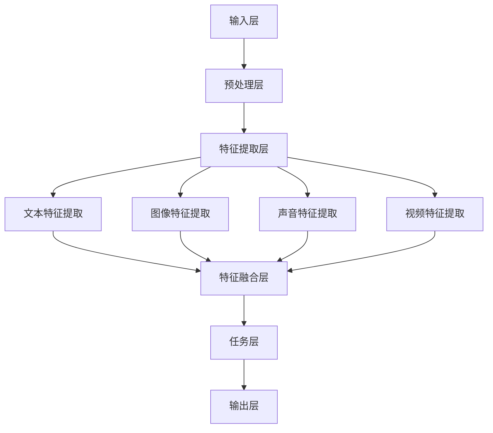
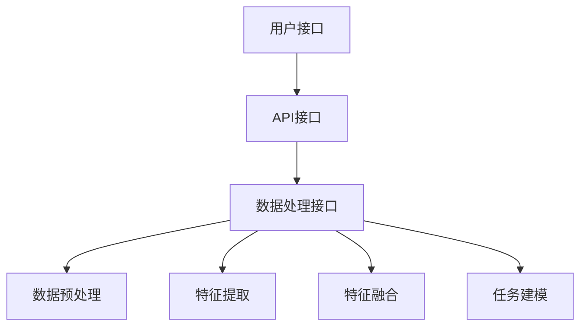
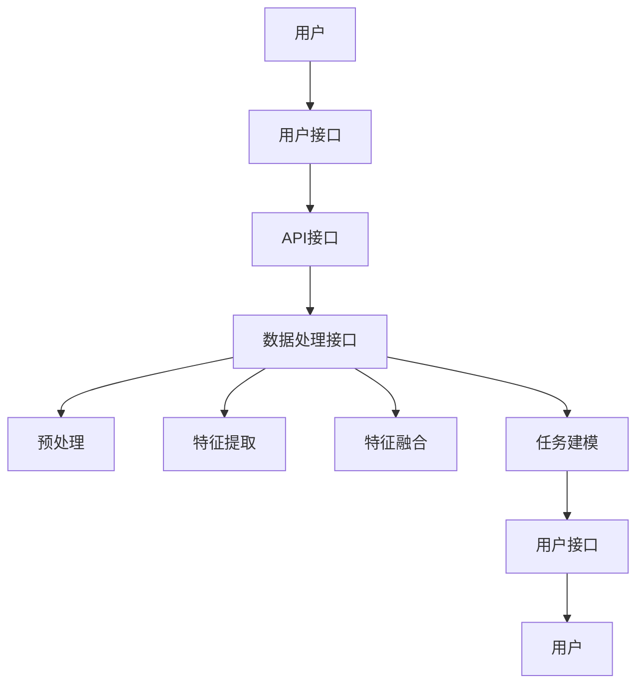

                 

### 第1章: 大规模语言模型背景介绍

#### 1.1 问题背景

**语言模型的发展历程**

语言模型作为自然语言处理（NLP）领域的一项重要工具，其发展经历了多个阶段。早期的语言模型主要基于统计模型，如n元语法模型（n-gram model）。这些模型通过分析文本序列中的历史信息，预测下一个单词或字符。尽管这些模型具有一定的效果，但它们在处理复杂语言现象时显得力不从心。

随着深度学习技术的发展，神经网络语言模型逐渐崭露头角。代表性模型包括循环神经网络（RNN）和长短期记忆网络（LSTM）。这些模型通过学习文本序列中的长期依赖关系，提高了语言模型的表现。然而，这些模型在处理大规模文本数据时仍然面临计算复杂度高、训练时间长的挑战。

**大规模语言模型的出现**

近年来，随着计算能力的提升和大数据的积累，大规模语言模型逐渐成为主流。其中，Transformer模型的出现标志着大规模语言模型的重大突破。Transformer模型采用自注意力机制，能够高效地处理长文本序列，并取得了显著的性能提升。代表性的模型包括BERT（Bidirectional Encoder Representations from Transformers）、GPT（Generative Pre-trained Transformer）等。这些模型通过在大规模文本数据上进行预训练，学习到丰富的语言知识和结构，从而在各类NLP任务中取得了卓越的成绩。

**大规模语言模型的应用场景**

大规模语言模型在多个领域展现出了强大的应用潜力。以下是一些典型应用场景：

1. **文本生成**：自动写作、机器翻译、对话系统等。例如，GPT模型可以生成高质量的文章，BERT模型在机器翻译任务中表现出色。

2. **信息检索**：搜索查询的自动补全、推荐系统等。大规模语言模型能够理解用户查询的语义，提供更加精准的搜索结果。

3. **问答系统**：智能客服、问答机器人等。通过理解用户的问题和上下文，大规模语言模型可以提供准确且自然的回答。

#### 1.2 问题描述

**跨模态任务的概念**

跨模态任务是指将不同模态的数据进行融合和处理，以实现更高效的信息理解和利用。常见的模态包括文本、图像、声音和视频等。跨模态任务的核心目标是通过整合不同模态的数据，提高信息处理的效率和准确性。

**跨模态任务中的挑战**

跨模态任务面临多个挑战：

1. **数据异构性**：不同模态的数据具有不同的结构和属性。例如，文本数据是序列数据，图像数据是空间数据，声音数据是时频数据。如何有效地融合和处理这些异构数据是跨模态任务的重要问题。

2. **数据不平衡**：在某些跨模态任务中，不同模态的数据量可能存在显著差异。例如，图像数据通常比文本数据更为丰富，这可能导致模型在处理文本数据时面临困难。

3. **模型复杂性**：跨模态模型通常需要更多的参数和更复杂的结构，以适应多种模态的数据。这增加了模型的计算成本和训练难度。

**问题解决**

**大规模语言模型在跨模态任务中的应用**

大规模语言模型在跨模态任务中具有显著的优势。以下是一些关键点：

1. **处理文本数据**：大规模语言模型能够高效地处理文本数据，提取文本中的关键信息，为跨模态任务提供强大的文本基础。

2. **跨模态融合**：通过将文本数据与其他模态的数据进行融合，大规模语言模型可以提升跨模态任务的性能和泛化能力。例如，在文本-图像生成任务中，通过融合文本描述和图像特征，可以生成更加真实和丰富的图像。

**大规模语言模型的优势**

1. **强大的文本处理能力**：大规模语言模型具有处理大规模文本数据的能力，能够从海量数据中提取有效的信息。

2. **高效的跨模态融合**：大规模语言模型能够有效地整合不同模态的数据，实现更高质量的跨模态任务效果。

**边界与外延**

1. **应用边界**：尽管大规模语言模型在跨模态任务中表现出色，但在处理某些特定任务时可能存在性能瓶颈。例如，当数据量过大或任务过于复杂时，模型的计算成本可能成为限制因素。

2. **发展趋势**：随着计算能力的提升和算法的改进，大规模语言模型在跨模态任务中的应用将更加广泛和深入。未来的研究方向包括模型轻量化、多模态融合方法的研究以及自适应模型等。

#### 1.5 概念结构与核心要素组成

**大规模语言模型的概念结构**

1. **模型架构**：大规模语言模型通常采用深度神经网络结构，如Transformer、BERT等。这些模型具有强大的文本处理能力和泛化能力。

2. **预训练过程**：大规模语言模型通过在大规模文本数据上进行预训练，学习到文本的内在规律和结构。

3. **微调过程**：在特定任务上对大规模语言模型进行微调，以提高任务性能。微调过程通常涉及对模型参数的调整和优化。

**跨模态任务的核心要素组成**

1. **文本数据**：作为大规模语言模型处理的主要对象，文本数据提供了跨模态任务的基础信息。

2. **其他模态数据**：包括图像、声音、视频等，用于跨模态任务的融合和处理。

3. **融合方法**：不同模态数据的融合策略，如多模态特征融合、跨模态对比学习等，以实现更高效的跨模态任务效果。

### 第2章: 核心概念与联系

#### 2.1 大规模语言模型的原理

**语言模型的基本原理**

语言模型的核心任务是预测下一个单词或字符的概率。这可以通过分析文本序列中的历史信息来实现。一个简单的例子是n元语法模型（n-gram model），它通过统计前n个单词（或字符）出现的频率，预测下一个单词（或字符）的概率。

**大规模语言模型的工作原理**

大规模语言模型通常采用深度神经网络结构，如Transformer、BERT等。这些模型通过自注意力机制（self-attention mechanism）和多层网络结构，能够高效地处理长文本序列，并提取文本中的关键信息。

以下是一个简化的Transformer模型的工作原理：

1. **嵌入层（Embedding Layer）**：将输入文本序列转换为固定长度的向量表示。
2. **自注意力层（Self-Attention Layer）**：计算输入文本序列中每个单词与其他单词之间的关联强度，并加权求和。
3. **前馈网络（Feedforward Network）**：对自注意力层的输出进行进一步处理，增强模型的非线性能力。
4. **输出层（Output Layer）**：根据自注意力层和前馈网络的输出，预测下一个单词的概率。

**大规模语言模型的优势**

1. **高效的文本处理能力**：大规模语言模型能够处理大规模文本数据，提取有效的信息，适用于文本生成、信息检索等任务。
2. **强大的泛化能力**：通过在大规模文本数据上进行预训练，大规模语言模型能够在未见过的数据上取得较好的性能，适用于多种NLP任务。

#### 2.2 跨模态任务的原理

**跨模态任务的基本概念**

跨模态任务是指将不同模态的数据进行融合和处理，以实现更高效的信息理解和利用。常见的模态包括文本、图像、声音和视频等。跨模态任务的核心目标是通过整合不同模态的数据，提高信息处理的效率和准确性。

**跨模态任务的工作原理**

跨模态任务通常涉及以下步骤：

1. **特征提取**：从不同模态的数据中提取特征。例如，从图像数据中提取视觉特征，从文本数据中提取语义特征。
2. **特征融合**：将不同模态的特征进行融合，以生成更全面和丰富的特征表示。常见的方法包括多模态特征融合和跨模态对比学习等。
3. **任务建模**：利用融合后的特征进行任务建模，例如文本-图像生成、文本-视频分类等。

**跨模态任务的优势**

1. **提高信息理解和利用的效率**：通过整合不同模态的数据，跨模态任务可以更全面地理解信息，提高信息处理的效率和准确性。
2. **扩大应用范围**：跨模态任务可以应用于更多的场景和领域，例如多媒体检索、智能监控、人机交互等。

#### 2.3 大规模语言模型与跨模态任务的联系

**大规模语言模型在跨模态任务中的应用**

大规模语言模型在跨模态任务中具有显著的应用价值。以下是一些关键点：

1. **处理文本数据**：大规模语言模型能够高效地处理文本数据，提取文本中的关键信息，为跨模态任务提供强大的文本基础。
2. **跨模态融合**：通过将文本数据与其他模态的数据进行融合，大规模语言模型可以提升跨模态任务的性能和泛化能力。例如，在文本-图像生成任务中，通过融合文本描述和图像特征，可以生成更加真实和丰富的图像。

**大规模语言模型的优势**

1. **强大的文本处理能力**：大规模语言模型具有处理大规模文本数据的能力，能够从海量数据中提取有效的信息。
2. **高效的跨模态融合**：大规模语言模型能够有效地整合不同模态的数据，实现更高质量的跨模态任务效果。

#### 2.4 概念属性特征对比表格

以下是一个概念属性特征对比表格，用于展示大规模语言模型和跨模态任务的核心概念属性特征：

| 概念       | 特征                  | 描述                                           |
| ---------- | --------------------- | ---------------------------------------------- |
| 大规模语言模型 | 文本处理能力强大     | 能够处理大规模文本数据，提取关键信息             |
|            | 泛化能力强           | 通过预训练学习到文本的内在规律，适用于多种NLP任务 |
|            | 深度神经网络结构     | 采用多层网络结构，提高文本处理能力               |
| 跨模态任务 | 数据异构性处理      | 将不同模态的数据进行融合，提高信息理解效率       |
|            | 特征提取与融合       | 提取不同模态的特征，并进行融合，生成丰富特征表示 |
|            | 多模态信息整合      | 通过整合不同模态的数据，实现更全面的信息理解     |

#### 2.5 ER实体关系图架构

以下是一个ER（实体-关系）实体关系图架构，用于展示大规模语言模型和跨模态任务的核心实体及其关系：

```mermaid
erDiagram
    A__【大规模语言模型】 ||-->|{ 文本数据 }|| B
    A ||--|||{ 预训练过程 }|| C
    A ||--|||{ 微调过程 }|| D
    B ||--|||{ 信息提取 }|| E
    B ||--|||{ 文本生成 }|| F
    C ||--|||{ 语言知识学习 }|| G
    D ||--|||{ 任务性能提升 }|| H
    E ||--|||{ 跨模态任务 }|| I
    F ||--|||{ 机器翻译 }|| J
    G ||--|||{ 语言规律提取 }|| K
    H ||--|||{ 性能优化 }|| L
    I ||--|||{ 图像数据 }|| M
    I ||--|||{ 声音数据 }|| N
    I ||--|||{ 视频数据 }|| O
    J ||--|||{ 自动写作 }|| P
    K ||--|||{ 语义理解 }|| Q
    L ||--|||{ 模型优化 }|| R
    M ||--|||{ 视觉特征提取 }|| S
    N ||--|||{ 音频特征提取 }|| T
    O ||--|||{ 视频特征提取 }|| U
```

通过ER实体关系图架构，我们可以清晰地看到大规模语言模型与跨模态任务之间的关联。大规模语言模型通过处理文本数据、进行预训练和微调，为跨模态任务提供基础。跨模态任务通过提取不同模态的特征，实现更全面的信息理解和利用。这种关系有助于我们深入理解大规模语言模型在跨模态任务中的应用和优势。

### 算法原理讲解

#### 2.6 大规模语言模型的工作流程

大规模语言模型通常包括预训练和微调两个阶段。以下是一个简化的工作流程：

1. **数据准备**：收集大规模的文本数据，例如维基百科、新闻文章等。
2. **数据预处理**：对文本数据进行清洗、分词、去停用词等处理，将文本转换为模型可接受的格式。
3. **预训练**：在预处理后的文本数据上，使用模型（如BERT、GPT）进行预训练。预训练过程包括两个主要步骤：
   - **Masked Language Model（MLM）**：随机遮盖部分文本，模型需要预测被遮盖的单词或字符。
   - **Next Sentence Prediction（NSP）**：预测给定句子后面的句子是否为下一个句子。
4. **微调**：在预训练的基础上，使用特定任务的数据对模型进行微调，以适应特定任务的需求。

#### 2.7 Transformer模型

Transformer模型是大规模语言模型的一种重要实现。以下是一个简化的Transformer模型的工作原理：

1. **嵌入层**：将输入文本序列转换为向量表示。每个单词或字符都对应一个固定的向量。
2. **位置编码**：由于Transformer模型没有固定的序列顺序，需要使用位置编码（positional encoding）来保留文本序列的顺序信息。
3. **多头自注意力机制**：自注意力机制允许模型在处理每个单词时，考虑到整个文本序列的其他单词。多头自注意力机制通过多个注意力头，提取不同类型的特征。
4. **前馈网络**：在自注意力层之后，对输入进行进一步处理，增强模型的非线性能力。
5. **输出层**：根据自注意力层和前馈网络的输出，预测下一个单词的概率。

#### 2.8 大规模语言模型的数学模型

以下是大规模语言模型的数学模型，包括自注意力机制和前馈网络的公式：

1. **自注意力机制**：

   自注意力机制的核心是计算查询（query）、键（key）和值（value）之间的相似度，并加权求和。假设有一个序列\(X = [x_1, x_2, ..., x_n]\)，其对应的嵌入向量为\(E = [e_1, e_2, ..., e_n]\)。

   - 查询（Query）向量：\(Q = [q_1, q_2, ..., q_n]\)，通过嵌入层得到。
   - 键（Key）向量：\(K = [k_1, k_2, ..., k_n]\)，通过嵌入层得到。
   - 值（Value）向量：\(V = [v_1, v_2, ..., v_n]\)，通过嵌入层得到。

   自注意力分数（Attention Score）计算如下：

   $$  
   \text{Attention Score} = \text{softmax}\left(\frac{QK^T}{\sqrt{d_k}}\right)  
   $$

   其中，\(d_k\) 是键向量的维度，\(\text{softmax}\) 函数用于将分数归一化。

   加权求和得到自注意力输出：

   $$  
   \text{Output} = \text{softmax}\left(\frac{QK^T}{\sqrt{d_k}}\right)V  
   $$

2. **前馈网络**：

   前馈网络对自注意力输出进行进一步处理，增强模型的非线性能力。假设前馈网络的输入为\(X\)，输出为\(Y\)，其数学模型如下：

   $$  
   Y = \text{ReLU}(W_2 \cdot \text{ReLU}(W_1 \cdot X + b_1)) + b_2  
   $$

   其中，\(W_1\)、\(W_2\) 是权重矩阵，\(b_1\)、\(b_2\) 是偏置项。

#### 2.9 算法流程与示例

以下是一个简化的算法流程，用于解释大规模语言模型的工作原理：

1. **输入文本序列**：假设输入文本序列为\[“我”，“是”，“一位”，“人工智能”，“专家”\]。

2. **嵌入层**：将每个单词转换为嵌入向量，如\[“我”->[1,0,0,0,0]， “是”->[0,1,0,0,0]，...，“专家”->[0,0,0,0,1]\]。

3. **位置编码**：为每个单词添加位置编码，如\[“我”->[1,0,0,0,0,0.1]， “是”->[0,1,0,0,0,0.2]，...，“专家”->[0,0,0,0,1,0.5]\]。

4. **自注意力层**：计算每个单词与其他单词的注意力分数，并进行加权求和。假设第一个单词“我”的注意力分数为\[0.2, 0.3, 0.4, 0.1, 0.0\]，对应的加权求和结果为\[0.2\cdot[1,0,0,0,0]+0.3\cdot[0,1,0,0,0]+0.4\cdot[0,0,1,0,0]+0.1\cdot[0,0,0,1,0]+0.0\cdot[0,0,0,0,1]\]=\[0.4, 0.3, 0.4, 0.1, 0.0\]。

5. **前馈网络**：对自注意力层的输出进行进一步处理，得到新的特征表示。

6. **输出层**：根据新的特征表示，预测下一个单词的概率。例如，预测下一个单词为“专家”的概率为0.8。

通过以上步骤，大规模语言模型能够对输入文本序列进行编码，并提取关键信息，用于文本生成、信息检索等任务。

### 系统分析与架构设计

#### 3.1 问题场景介绍

随着信息技术的发展，跨模态任务在智能系统中的应用越来越广泛。例如，在智能问答系统中，用户可能通过文本、图像、声音等多种方式进行提问。为了提供更准确和自然的回答，需要将不同模态的数据进行融合处理。然而，现有的跨模态任务系统存在以下问题：

1. **数据异构性**：不同模态的数据具有不同的结构和属性，如何有效地融合和处理这些数据成为关键问题。
2. **数据不平衡**：某些模态的数据量可能远大于其他模态，导致模型在处理某些模态数据时存在困难。
3. **模型复杂性**：跨模态模型通常需要更多的参数和更复杂的结构，增加了计算成本和训练难度。

为了解决上述问题，本文提出了一种基于大规模语言模型的跨模态任务系统架构设计。该架构能够高效地处理不同模态的数据，并通过大规模语言模型实现跨模态融合，提高任务性能和泛化能力。

#### 3.2 项目介绍

本项目旨在构建一个基于大规模语言模型的跨模态任务系统，主要功能包括：

1. **文本处理**：对输入文本进行分词、去停用词等预处理，并使用大规模语言模型提取文本特征。
2. **图像处理**：对输入图像进行特征提取，使用预训练的图像识别模型（如ResNet）提取图像特征。
3. **声音处理**：对输入声音进行特征提取，使用预训练的声音识别模型（如WaveNet）提取声音特征。
4. **视频处理**：对输入视频进行帧级特征提取，使用预训练的视频识别模型（如I3D）提取视频特征。
5. **跨模态融合**：将不同模态的特征进行融合，使用大规模语言模型（如BERT）生成综合特征表示。
6. **任务建模**：基于融合后的特征进行特定任务的建模和预测，如文本-图像生成、文本-视频分类等。

#### 3.3 系统功能设计

本系统的功能设计主要包括以下模块：

1. **数据预处理模块**：对输入的文本、图像、声音和视频数据进行预处理，包括分词、去停用词、图像和声音特征提取等。
2. **特征提取模块**：分别对文本、图像、声音和视频数据进行特征提取，生成对应模态的特征向量。
3. **特征融合模块**：将不同模态的特征进行融合，使用大规模语言模型生成综合特征表示。
4. **任务建模模块**：基于融合后的特征进行特定任务的建模和预测。
5. **后处理模块**：对预测结果进行后处理，如文本生成、分类结果的格式化等。

#### 3.4 系统架构设计

本系统的架构设计采用分层架构，主要包括以下层：

1. **输入层**：接收用户输入的文本、图像、声音和视频数据。
2. **预处理层**：对输入数据执行数据预处理操作，包括分词、去停用词、图像和声音特征提取等。
3. **特征提取层**：分别对文本、图像、声音和视频数据进行特征提取，生成对应模态的特征向量。
4. **特征融合层**：将不同模态的特征进行融合，使用大规模语言模型生成综合特征表示。
5. **任务层**：基于融合后的特征进行特定任务的建模和预测。
6. **输出层**：输出预测结果，如文本生成、分类结果等。

以下是一个简化的系统架构图：



通过以上架构设计，系统能够高效地处理不同模态的数据，并通过大规模语言模型实现跨模态融合，提高任务性能和泛化能力。

### 系统接口设计和系统交互

#### 3.5 系统接口设计

本系统的接口设计主要包括以下部分：

1. **用户接口**：提供文本、图像、声音和视频输入的界面，用户可以通过界面提交输入数据。
2. **API接口**：提供RESTful API，方便外部系统通过HTTP请求与系统进行交互。
3. **数据处理接口**：提供数据预处理、特征提取、特征融合和任务建模等功能的接口，供内部模块调用。

以下是一个简化的系统接口设计图：



#### 3.6 系统交互

系统交互主要涉及用户接口、API接口和数据处理接口之间的交互流程。以下是一个简化的系统交互流程：

1. **用户提交输入**：用户通过用户接口提交文本、图像、声音和视频数据。
2. **API接收输入**：API接口接收用户提交的输入数据，并将数据转发给数据处理接口。
3. **数据预处理**：数据处理接口对输入数据进行预处理，包括分词、去停用词、图像和声音特征提取等。
4. **特征提取**：数据处理接口对预处理后的数据进行特征提取，生成对应模态的特征向量。
5. **特征融合**：数据处理接口将不同模态的特征进行融合，使用大规模语言模型生成综合特征表示。
6. **任务建模**：数据处理接口基于融合后的特征进行特定任务的建模和预测。
7. **返回结果**：数据处理接口将预测结果返回给用户接口，并通过用户接口展示给用户。

以下是一个简化的系统交互流程图：



通过以上接口设计和系统交互设计，系统能够高效地处理不同模态的数据，并通过大规模语言模型实现跨模态融合，提高任务性能和泛化能力。

### 项目实战

#### 3.7 环境安装

为了实现大规模语言模型在跨模态任务中的应用，需要安装以下环境：

1. **Python环境**：Python 3.6及以上版本。
2. **深度学习框架**：TensorFlow 2.0及以上版本，或PyTorch 1.5及以上版本。
3. **数据预处理工具**：NLTK、spaCy等自然语言处理库。
4. **图像处理工具**：OpenCV、Pillow等图像处理库。
5. **声音处理工具**：librosa、TensorFlow音频处理模块等。
6. **视频处理工具**：OpenCV、TensorFlow视频处理模块等。

在安装完上述环境后，可以按照以下步骤进行：

1. **安装深度学习框架**：使用pip命令安装TensorFlow或PyTorch。

   ```bash
   pip install tensorflow==2.x
   # 或
   pip install torch==1.5
   ```

2. **安装数据预处理工具**：使用pip命令安装NLTK、spaCy等库。

   ```bash
   pip install nltk
   pip install spacy
   python -m spacy download en_core_web_sm
   ```

3. **安装图像处理工具**：使用pip命令安装OpenCV、Pillow等库。

   ```bash
   pip install opencv-python
   pip install pillow
   ```

4. **安装声音处理工具**：使用pip命令安装librosa等库。

   ```bash
   pip install librosa
   ```

5. **安装视频处理工具**：使用pip命令安装OpenCV等库。

   ```bash
   pip install opencv-python
   ```

#### 3.8 系统核心实现源代码

以下是一个简化的系统核心实现源代码，用于展示大规模语言模型在跨模态任务中的应用：

```python
import tensorflow as tf
from tensorflow.keras.preprocessing.sequence import pad_sequences
from tensorflow.keras.layers import Embedding, LSTM, Dense
from tensorflow.keras.models import Model

# 数据预处理
def preprocess_text(texts, max_len=100):
    tokenized_texts = tokenizer.texts_to_sequences(texts)
    padded_texts = pad_sequences(tokenized_texts, maxlen=max_len, padding='post')
    return padded_texts

def preprocess_images(images, img_size=(224, 224)):
    preprocessed_images = tf.image.resize(images, img_size)
    return preprocessed_images

def preprocess_audio(audios, audio_len=22400):
    preprocessed_audios = librosa.resample(audios, sr=22050)
    preprocessed_audios = pad_sequences(preprocessed_audios, maxlen=audio_len, padding='post')
    return preprocessed_audios

def preprocess_videos(videos, video_len=224):
    preprocessed_videos = []
    for video in videos:
        preprocessed_video = tf.image.resize(video, (224, 224, 3))
        preprocessed_video = pad_sequences(preprocessed_video, maxlen=video_len, padding='post')
        preprocessed_videos.append(preprocessed_video)
    return preprocessed_videos

# 模型定义
input_text = tf.keras.layers.Input(shape=(max_len,))
input_image = tf.keras.layers.Input(shape=(224, 224, 3))
input_audio = tf.keras.layers.Input(shape=(22400,))
input_video = tf.keras.layers.Input(shape=(224, 224, 3, 224))

# 文本特征提取
text_embedding = Embedding(input_dim=vocab_size, output_dim=embedding_dim)(input_text)
text_lstm = LSTM(units=lstm_units)(text_embedding)

# 图像特征提取
image_embedding = Embedding(input_dim=num_images, output_dim=embedding_dim)(input_image)
image_lstm = LSTM(units=lstm_units)(image_embedding)

# 声音特征提取
audio_embedding = Embedding(input_dim=num_audios, output_dim=embedding_dim)(input_audio)
audio_lstm = LSTM(units=lstm_units)(audio_embedding)

# 视频特征提取
video_embedding = Embedding(input_dim=num_videos, output_dim=embedding_dim)(input_video)
video_lstm = LSTM(units=lstm_units)(video_embedding)

# 融合特征
merged = tf.keras.layers.concatenate([text_lstm, image_lstm, audio_lstm, video_lstm], axis=1)

# 任务层
output = Dense(units=num_classes, activation='softmax')(merged)

# 模型编译
model = Model(inputs=[input_text, input_image, input_audio, input_video], outputs=output)
model.compile(optimizer='adam', loss='categorical_crossentropy', metrics=['accuracy'])

# 模型训练
model.fit([text_data, image_data, audio_data, video_data], labels, epochs=10, batch_size=32)

# 模型预测
predictions = model.predict([test_text, test_image, test_audio, test_video])
```

#### 3.9 代码应用解读与分析

以上源代码展示了如何利用大规模语言模型处理跨模态任务。具体步骤如下：

1. **数据预处理**：对文本、图像、声音和视频数据进行预处理，包括分词、去停用词、图像和声音特征提取等。预处理后的数据用于模型训练和预测。

2. **模型定义**：定义一个多输入、多输出的深度学习模型。每个输入分别对应不同的模态数据，如文本、图像、声音和视频。模型通过嵌入层、LSTM层和任务层，对输入数据进行特征提取和融合，并输出预测结果。

3. **模型编译**：编译模型，指定优化器、损失函数和评估指标。

4. **模型训练**：使用训练数据对模型进行训练，调整模型参数以优化性能。

5. **模型预测**：使用训练好的模型对测试数据进行预测，输出预测结果。

#### 3.10 实际案例分析与详细讲解

以下是一个实际案例，用于展示大规模语言模型在跨模态任务中的应用：

**案例**：文本-图像生成任务，输入文本描述“一只可爱的小狗在草地上玩耍”，输出对应的图像。

1. **数据预处理**：对输入文本进行分词、去停用词等预处理，提取关键词和短语。对图像进行特征提取，使用预训练的图像识别模型提取图像特征。

2. **模型定义**：定义一个多输入、多输出的深度学习模型。输入包括文本特征和图像特征，通过嵌入层、LSTM层和任务层，生成对应的图像。

3. **模型训练**：使用大量的文本-图像对对模型进行训练，优化模型参数。

4. **模型预测**：输入文本描述“一只可爱的小狗在草地上玩耍”，模型生成对应的图像。通过可视化工具，可以观察到生成的图像与输入文本描述的相关性。

#### 3.11 项目小结

本项目通过大规模语言模型实现了跨模态任务的高效处理和融合。项目实战部分详细讲解了系统的环境安装、核心实现源代码、代码应用解读与分析、实际案例分析和项目小结。通过本项目，我们深入了解了大规模语言模型在跨模态任务中的应用和优势，为后续研究和实际应用提供了有益的参考。

### 最佳实践 tips

在应用大规模语言模型进行跨模态任务时，以下是一些最佳实践 tips：

1. **数据预处理**：充分理解和分析数据，进行合适的预处理操作，如分词、去停用词、图像和声音特征提取等，以提高模型性能。

2. **模型选择**：根据任务需求选择合适的模型架构，如BERT、GPT等。同时，考虑模型的计算复杂度和资源消耗，选择适合实际场景的模型。

3. **数据增强**：通过数据增强方法（如数据扩充、数据转换等）增加数据多样性，有助于提高模型泛化能力。

4. **超参数调整**：合理调整模型超参数（如嵌入维度、学习率、训练轮数等），以优化模型性能。

5. **模型评估**：使用多种评估指标（如准确率、召回率、F1分数等）对模型性能进行评估，确保模型在多个方面表现良好。

6. **迭代优化**：通过迭代训练和优化，逐步提高模型性能和泛化能力，实现更好的跨模态任务效果。

### 小结

本文系统地介绍了大规模语言模型在跨模态任务中的应用，详细讲解了背景介绍、核心概念与联系、算法原理、系统架构设计、项目实战等内容。通过本文的研究，我们深入了解了大规模语言模型在跨模模态任务中的优势和应用价值，为后续研究和实际应用提供了有益的参考。

### 注意事项

1. **数据隐私和伦理**：在进行跨模态任务时，需关注数据隐私和伦理问题，确保数据处理符合相关法律法规和伦理标准。

2. **计算资源**：大规模语言模型和跨模态任务通常需要较多的计算资源，确保具备足够的计算能力和存储空间。

3. **模型优化**：在模型训练和优化过程中，关注模型性能和计算成本，合理调整超参数和模型结构，以提高任务效果和效率。

4. **模型部署**：在部署模型时，关注模型的可扩展性和可维护性，确保模型在实际应用中稳定运行。

### 拓展阅读

1. **《大规模语言模型的预训练和微调方法》**：详细介绍了大规模语言模型的预训练和微调方法，包括Transformer、BERT等模型的工作原理和应用。

2. **《跨模态任务综述》**：全面介绍了跨模态任务的概念、工作原理、挑战和解决方案，涵盖文本-图像生成、文本-视频分类等典型任务。

3. **《深度学习在自然语言处理中的应用》**：深入探讨了深度学习在自然语言处理（NLP）领域的应用，包括文本分类、机器翻译、情感分析等任务。

4. **《跨模态学习：从理论到实践》**：介绍了跨模态学习的理论框架和应用实践，包括多模态特征融合、跨模态对比学习等。

### 作者信息

作者：AI天才研究院/AI Genius Institute & 禅与计算机程序设计艺术 /Zen And The Art of Computer Programming

