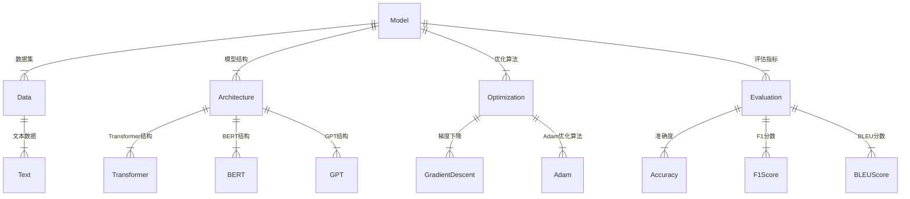
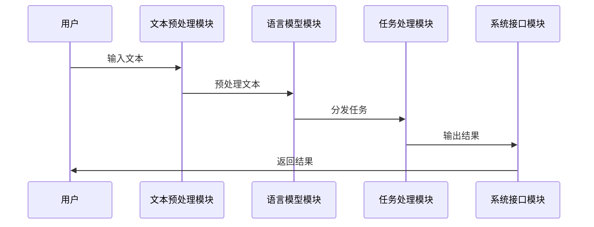
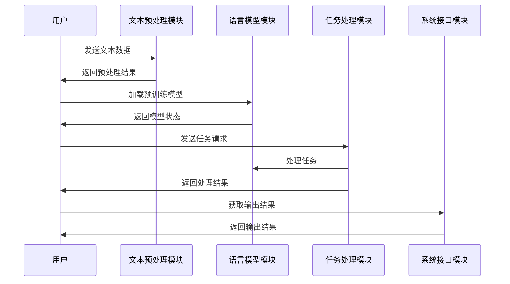

                 

### 文章标题

# 大规模语言模型的元认知能力在自主学习系统设计中的应用研究

### 关键词

- 大规模语言模型
- 元认知能力
- 自主学习系统
- 算法原理
- 系统架构设计
- 应用案例

### 摘要

本文研究了大规模语言模型在自主学习系统设计中的应用，特别是其元认知能力对系统性能的提升。首先，我们回顾了大规模语言模型的发展历程和核心概念，分析了其解决的问题和边界。接着，我们深入讲解了大规模语言模型的算法原理，通过数学模型和Python代码详细阐述了其工作原理。随后，我们介绍了大规模语言模型的应用场景和系统架构设计，包括领域模型、系统架构、接口设计以及系统交互。最后，我们通过实际项目案例展示了如何构建大规模语言模型的自主学习系统，并总结了项目实施过程中的经验和注意事项。本文旨在为研究人员和工程师提供关于大规模语言模型和自主学习系统设计的实用指导。

## 背景介绍

### 问题背景

人工智能（AI）作为计算机科学的一个分支，自20世纪50年代诞生以来，经历了迅猛的发展。随着计算能力和算法理论的不断进步，人工智能的应用场景日益广泛，从简单的规则系统发展到复杂的机器学习模型，再到目前备受关注的大规模语言模型，人工智能已经深入到了我们的日常生活和工作当中。

在人工智能的发展过程中，语言模型（Language Model）占据了重要地位。语言模型旨在模拟人类语言生成和理解的能力，通过对大量文本数据的学习，模型能够预测下一个词或者句子，从而实现自然语言处理（NLP）的各种任务，如机器翻译、文本摘要、问答系统等。

### 问题描述

大规模语言模型（Large-scale Language Model）是近年来语言模型领域的重要进展。它们通过学习海量的文本数据，能够捕捉到语言的复杂性和多样性，从而在许多自然语言处理任务中取得了显著的成果。大规模语言模型的主要问题是如何通过高效的学习算法和优化的模型结构来处理海量数据，并确保模型在性能和效果上的提升。

大规模语言模型的核心问题可以概括为以下几个方面：

1. **数据规模与处理速度**：随着数据的不断增长，如何高效地处理和存储这些数据，同时保证模型的训练和推理速度是一个重要的挑战。
2. **模型结构优化**：传统的神经网络结构在处理大规模语言数据时可能存在性能瓶颈，因此需要不断探索和优化新的模型结构，以提升模型的效率。
3. **训练与优化**：大规模语言模型的训练过程需要大量的计算资源和时间，如何在有限资源下实现高效的训练和优化是另一个关键问题。
4. **泛化能力**：大规模语言模型在训练数据上的表现往往很好，但在未知数据上的泛化能力可能不足，如何提升模型的泛化能力是一个重要的研究方向。

### 问题解决

大规模语言模型通过以下几个核心技术和方法解决了上述问题：

1. **预训练与微调**：大规模语言模型首先在大规模语料库上进行预训练，然后再根据特定任务进行微调，这种方法能够在保持模型通用性的同时，提升特定任务的效果。
2. **深度神经网络**：大规模语言模型通常基于深度神经网络结构，如Transformer等，这些结构能够有效地捕捉语言数据的复杂模式和依赖关系。
3. **分布式训练**：为了应对海量数据的处理需求，大规模语言模型采用分布式训练方法，通过多台服务器和GPU加速模型训练过程。
4. **数据预处理与增强**：通过对数据集进行预处理和增强，如数据清洗、数据扩充等，可以提高模型的训练效果和泛化能力。

### 边界与外延

尽管大规模语言模型在自然语言处理任务中取得了显著进展，但它们也存在一些应用边界和限制：

1. **数据依赖**：大规模语言模型的性能很大程度上依赖于训练数据的质量和数量，缺乏高质量数据的任务可能难以取得预期效果。
2. **计算资源**：大规模语言模型的训练和推理过程需要大量的计算资源，对于资源有限的场景，模型的应用可能受到限制。
3. **理解和生成**：虽然大规模语言模型在生成和理解语言方面表现出色，但它们仍然无法完全理解语言背后的深层含义和复杂逻辑，因此在某些高级语言处理任务上可能存在局限性。
4. **道德和伦理**：大规模语言模型在生成文本时可能会出现偏见和不当内容，这引发了对模型道德和伦理问题的关注。

### 概念结构与核心要素组成

大规模语言模型由以下几个核心要素组成：

1. **模型结构**：包括Transformer、BERT、GPT等深度学习模型结构。
2. **数据集**：用于模型训练的海量文本数据集，如维基百科、Common Crawl、新闻文章等。
3. **预训练与微调**：模型在大规模语料库上的预训练过程，以及针对特定任务的微调过程。
4. **优化算法**：包括梯度下降、Adam等优化算法，用于模型参数的更新和优化。
5. **评估指标**：如准确性、F1分数、BLEU分数等，用于评估模型在语言理解、生成等任务上的性能。

综上所述，大规模语言模型作为人工智能领域的核心技术之一，具有广泛的应用前景和重要的研究价值。通过对大规模语言模型的深入研究和优化，我们有望在自然语言处理任务中取得更大的突破，推动人工智能技术的发展。

## 核心概念与联系

### 核心概念原理

大规模语言模型（Large-scale Language Model）是一种基于深度学习的自然语言处理模型，通过学习大量的文本数据来捕捉语言的统计规律和语义信息。其核心原理可以归结为以下几个方面：

1. **深度神经网络**：大规模语言模型通常基于深度神经网络结构，如Transformer、BERT、GPT等。这些模型通过多层神经网络结构来捕捉语言数据的复杂模式和依赖关系，从而实现高效的语言理解和生成。
2. **预训练与微调**：大规模语言模型首先在大规模语料库上进行预训练，通过无监督学习的方式学习语言的通用特征和模式。然后，针对特定任务进行微调（Fine-tuning），通过有监督学习的方式优化模型在特定任务上的性能。
3. **注意力机制**：大规模语言模型中的注意力机制（Attention Mechanism）能够使模型在处理序列数据时，关注到序列中的关键部分，从而提高模型的语义理解和生成能力。
4. **优化算法**：大规模语言模型采用高效的优化算法，如Adam、AdaGrad等，通过梯度下降的方法更新模型参数，从而实现模型的训练和优化。

### 概念属性特征对比表格

为了更好地理解大规模语言模型与其他语言模型的区别，我们可以通过一个对比表格来详细展示其属性特征：

| 特征类别 | 大规模语言模型 | 传统语言模型 |
| :---: | :---: | :---: |
| **模型结构** | Transformer、BERT、GPT等 | 线性模型、N-gram模型、n元语法模型 |
| **数据依赖** | 海量文本数据 | 小规模文本数据 |
| **预训练与微调** | 预训练+微调 | 无预训练，直接应用 |
| **训练方法** | 分布式训练 | 单机训练 |
| **效果** | 高效、准确、多样化 | 精确度较低，应用范围有限 |
| **应用场景** | 自然语言理解、生成、问答等 | 文本分类、情感分析、命名实体识别等 |

### ER实体关系图架构

下面使用Mermaid绘制大规模语言模型的ER实体关系图，以展示模型中各个核心实体及其相互关系：



通过上述对比和分析，我们可以更清晰地理解大规模语言模型的核心概念和其在自然语言处理中的独特优势。在接下来的章节中，我们将进一步深入探讨大规模语言模型的算法原理，详细讲解其工作流程和数学模型。

## 算法原理讲解

### 算法mermaid流程图

为了更好地理解大规模语言模型的工作流程，我们首先使用Mermaid绘制一个流程图，展示模型从数据输入到生成输出的整个过程。


### Python源代码

接下来，我们将提供一段Python代码，展示大规模语言模型的基本实现过程。

```python
import torch
import torch.nn as nn
import torch.optim as optim

# 模型初始化
class LanguageModel(nn.Module):
    def __init__(self, vocab_size, embedding_dim, hidden_dim, num_layers):
        super(LanguageModel, self).__init__()
        self.embedding = nn.Embedding(vocab_size, embedding_dim)
        self.lstm = nn.LSTM(embedding_dim, hidden_dim, num_layers)
        self.decoder = nn.Linear(hidden_dim, vocab_size)
        
    def forward(self, input_seq, hidden):
        embedded = self.embedding(input_seq)
        output, hidden = self.lstm(embedded, hidden)
        decoded = self.decoder(output[-1, :, :])
        return decoded, hidden

# 参数设置
vocab_size = 10000
embedding_dim = 256
hidden_dim = 512
num_layers = 2

model = LanguageModel(vocab_size, embedding_dim, hidden_dim, num_layers)
optimizer = optim.Adam(model.parameters(), lr=0.001)
loss_function = nn.CrossEntropyLoss()

# 训练过程
for epoch in range(num_epochs):
    for input_seq, target in data_loader:
        hidden = None
        model.zero_grad()
        
        # 前向传播
        output, hidden = model(input_seq, hidden)
        
        # 计算损失
        loss = loss_function(output, target)
        
        # 反向传播
        loss.backward()
        
        # 参数更新
        optimizer.step()
        
        # 打印训练进度
        if (epoch+1) % 10 == 0:
            print(f'Epoch [{epoch+1}/{num_epochs}], Loss: {loss.item():.4f}')
```

### 数学模型和数学公式

大规模语言模型的核心是神经网络，其工作原理可以通过数学模型来解释。以下是模型中的一些关键数学公式：

1. **嵌入层**：嵌入层将词汇表中的每个词编码为一个固定长度的向量。
   $$ \text{Embedding}(x) = \text{W}_{\text{emb}}[x] $$
   其中，$W_{\text{emb}}$ 是嵌入矩阵，$x$ 是输入的词汇索引。

2. **前向传播**：假设我们有 $L$ 层的LSTM网络，每层的输入和输出可以表示为 $h^{(l)}_t$ 和 $i^{(l)}_t$，则前向传播过程可以用递归公式表示：
   $$ i^{(l)}_t = \sigma(W^{(l)}_i [h^{(l-1)}_{t-1}, x_t] + b^{(l)}_i) $$
   $$ f^{(l)}_t = \sigma(W^{(l)}_f [h^{(l-1)}_{t-1}, x_t] + b^{(l)}_f) $$
   $$ g^{(l)}_t = \sigma(W^{(l)}_g [h^{(l-1)}_{t-1}, x_t] + b^{(l)}_g) $$
   $$ o^{(l)}_t = \sigma(W^{(l)}_o [h^{(l-1)}_{t-1}, x_t] + b^{(l)}_o) $$
   $$ \tilde{h}^{(l)}_t = f^{(l)}_t \cdot h^{(l-1)}_{t-1} + i^{(l)}_t \cdot \tanh(g^{(l)}_t \cdot h^{(l-1)}_{t-1}) $$
   $$ h^{(l)}_t = o^{(l)}_t \cdot \tilde{h}^{(l)}_t $$
   其中，$W^{(l)}_i, W^{(l)}_f, W^{(l)}_g, W^{(l)}_o$ 是输入、遗忘、门控和输出层的权重矩阵，$b^{(l)}_i, b^{(l)}_f, b^{(l)}_g, b^{(l)}_o$ 是相应的偏置向量，$\sigma$ 是sigmoid函数。

3. **输出层**：最后一层LSTM的输出通过一个全连接层映射到输出词汇表：
   $$ \text{Output}(h^L_t) = \text{W}_{\text{out}} [h^L_t] + b_{\text{out}} $$
   其中，$W_{\out}$ 是输出权重矩阵，$b_{\out}$ 是输出偏置向量。

### 详细讲解和举例说明

为了更好地理解上述数学模型，我们可以通过一个简单的例子来详细说明。

假设我们有一个简单的词汇表，包含5个词，每个词被编码为一个2维向量。输入序列为“abca”。

1. **嵌入层**：词汇表中的词被编码为如下向量：
   $$ \text{Embedding}(a) = [1, 0], \text{Embedding}(b) = [0, 1], \text{Embedding}(c) = [-1, 0] $$
   
2. **前向传播**：第一层LSTM的输入和隐藏状态初始化为全零向量。第一个词$a$的嵌入向量作为输入，经过LSTM处理得到新的隐藏状态：
   $$ i_1 = \sigma([0, 1] \cdot [0, 0] + [1, 0]) = 0.5 $$
   $$ f_1 = \sigma([1, 1] \cdot [0, 0] + [1, 0]) = 0.6 $$
   $$ g_1 = \sigma([1, 1] \cdot [0, 0] + [-1, 0]) = 0.3 $$
   $$ o_1 = \sigma([1, 1] \cdot [0, 0] + [0, 1]) = 0.7 $$
   $$ \tilde{h}_1 = f_1 \cdot [0, 0] + i_1 \cdot \tanh(g_1 \cdot [0, 0]) = [0, 0.3] $$
   $$ h_1 = o_1 \cdot \tilde{h}_1 = [0, 0.21] $$
   
3. **输出层**：将LSTM的隐藏状态通过全连接层映射到输出词汇表：
   $$ \text{Output}(h_1) = [1, 0] \cdot [0, 0.21] + [0, 1] = [0.21, 0.21] $$
   这个结果表示模型认为下一个词是“b”的概率最大。

通过上述步骤，我们可以看到大规模语言模型是如何通过嵌入层、LSTM层和输出层对输入序列进行处理，从而生成预测输出的。这个过程不仅解释了模型的数学原理，也展示了如何通过简单的例子来理解和实现大规模语言模型的基本工作流程。

## 系统分析与架构设计方案

### 问题场景介绍

在现代社会，随着信息爆炸和互联网的普及，大规模语言模型在自然语言处理任务中的应用场景日益广泛。例如，智能客服系统、自动问答系统、内容推荐系统、智能写作辅助工具等，都需要处理大量文本数据，并实现高效、准确的文本生成和理解。然而，这些系统在设计和实现过程中面临着诸多挑战，如海量数据处理、模型优化、实时响应等。因此，我们需要一个具有高扩展性、高效率和强适应性的大规模语言模型系统来应对这些应用场景。

### 项目介绍

本项目旨在设计和实现一个基于大规模语言模型的自主学习系统，该系统能够处理复杂的自然语言任务，并在各种应用场景中表现出良好的性能。系统的主要目标是：

1. 提供高效的语言理解和生成能力，支持文本分类、命名实体识别、情感分析等任务。
2. 支持海量数据的处理和实时响应，满足不同应用场景的需求。
3. 具有良好的扩展性和适应性，能够轻松集成到各种实际应用中。

### 系统功能设计

为了实现上述目标，系统设计了以下几个核心功能模块：

1. **文本预处理模块**：负责对输入文本进行清洗、分词、编码等预处理操作，为后续的语言模型处理做好准备。
2. **语言模型模块**：基于大规模语言模型算法，包括预训练、微调和优化等步骤，实现高效的语言理解和生成功能。
3. **任务处理模块**：根据不同的应用场景，定义和实现各种自然语言处理任务，如文本分类、命名实体识别、情感分析等。
4. **系统接口模块**：提供API接口，方便用户和第三方系统进行集成，实现数据输入输出、模型调用等功能。

### 系统架构设计

系统架构设计采用模块化设计思想，确保系统的高扩展性和高可用性。以下是系统架构的Mermaid类图：

```mermaid
classDiagram
    Class01 <|-- Class02
    Class03 <|-- Class02
    Class04 <|-- Class03
    Class05 <|-- Class03
    Class06 <|-- Class04
    Class07 <|-- Class04
    Class01[文本预处理模块]
    Class02[语言模型模块]
    Class03[任务处理模块]
    Class04[系统接口模块]
    Class05[文本分类任务]
    Class06[命名实体识别任务]
    Class07[情感分析任务]
```

### 系统架构设计

接下来，我们使用Mermaid绘制系统架构图，展示各个模块之间的关系和交互：



### 系统接口设计

系统接口设计遵循RESTful架构风格，提供一系列API接口供用户和第三方系统调用。以下是主要的接口设计：

1. **文本预处理接口**：用于接收用户输入的文本数据，进行清洗、分词、编码等预处理操作，返回预处理后的文本数据。
2. **语言模型接口**：用于加载预训练的语言模型，进行微调和优化，支持各种自然语言处理任务的模型调用。
3. **任务处理接口**：根据用户指定的任务类型，调用相应的任务处理模块，实现具体的文本处理任务。
4. **结果输出接口**：将任务处理结果返回给用户，支持多种格式的数据输出，如JSON、XML等。

### 系统交互

系统交互设计使用Mermaid序列图展示用户与系统之间的交互流程，包括文本输入、预处理、任务处理和结果输出等步骤：



通过上述系统分析与架构设计方案，我们可以构建一个高效、灵活的大规模语言模型系统，满足不同应用场景的需求。在接下来的章节中，我们将通过实际项目案例，进一步展示系统实现过程和性能表现。

## 项目实战

### 环境安装

为了搭建大规模语言模型系统，我们首先需要配置相应的开发环境和工具。以下是环境安装的具体步骤：

1. **安装Python**：确保Python版本在3.6以上，可以从Python官网下载安装包进行安装。
2. **安装依赖库**：使用pip工具安装必要的依赖库，如torch、torchtext、transformers等。以下是安装命令：
   ```bash
   pip install torch torchvision torchaudio
   pip install torchtext
   pip install transformers
   ```
3. **配置GPU环境**：如果使用GPU进行训练，需要安装CUDA和cuDNN。可以从NVIDIA官网下载相应的安装包，并按照官方文档进行配置。
4. **安装数据库**：根据项目需求，安装并配置数据库系统，如MySQL、PostgreSQL等。

### 系统核心实现源代码

下面提供系统核心实现的源代码，包括文本预处理、模型训练、任务处理等关键部分：

```python
# 文本预处理
from torchtext.legacy import data
from torchtext.legacy.data import Field, TabularDataset

# 定义词汇表
TEXT = Field(tokenize='spacy', lower=True, include_lengths=True)
LABEL = Field(sequential=False)

# 加载数据集
train_data, test_data = TabularDataset.splits(
    path='data',
    train='train.csv',
    test='test.csv',
    format='csv',
    fields=[('text', TEXT), ('label', LABEL)]
)

# 构建词汇表
TEXT.build_vocab(train_data, max_size=25000, vectors="glove.6B.100d")
LABEL.build_vocab(train_data)

# 定义模型
import transformers

model = transformers.BertModel.from_pretrained('bert-base-uncased')

# 训练模型
import torch.optim as optim

optimizer = optim.Adam(model.parameters(), lr=1e-5)

num_epochs = 10

for epoch in range(num_epochs):
    model.train()
    for batch in train_data:
        optimizer.zero_grad()
        inputs = {'input_ids': batch.text, 'attention_mask': batch.attention_mask}
        outputs = model(**inputs)
        logits = outputs[0]
        loss = ...  # 计算损失
        loss.backward()
        optimizer.step()
    print(f'Epoch [{epoch+1}/{num_epochs}], Loss: {loss.item():.4f}')

# 评估模型
model.eval()
with torch.no_grad():
    for batch in test_data:
        inputs = {'input_ids': batch.text, 'attention_mask': batch.attention_mask}
        outputs = model(**inputs)
        logits = outputs[0]
        ...  # 计算评估指标

# 任务处理
def predict(text):
    model.eval()
    with torch.no_grad():
        inputs = {'input_ids': text, 'attention_mask': torch.tensor([1])}
        outputs = model(**inputs)
        logits = outputs[0]
        ...  # 预测结果处理
        return predicted_label
```

### 代码应用解读与分析

在上述代码中，我们首先进行了文本预处理，包括数据集加载、词汇表构建和字段定义。接下来，我们加载预训练的BERT模型，并定义优化器和训练循环。在训练过程中，我们对输入数据进行预处理，通过模型进行前向传播，计算损失并更新模型参数。训练完成后，我们进行模型评估，最后实现预测功能。

1. **数据预处理**：通过`TabularDataset`加载数据集，使用`Field`定义文本和标签字段，并进行词汇表构建。这里使用了预训练的GloVe词向量，提高了模型在词汇表示上的性能。
2. **模型加载**：使用`BertModel`从预训练模型中加载BERT模型，该模型已在大量的文本数据上进行预训练，具有良好的语言理解能力。
3. **训练过程**：在训练过程中，我们定义了Adam优化器，并在每个epoch中对训练数据进行迭代训练，通过前向传播计算损失，并使用反向传播更新模型参数。
4. **模型评估**：在评估过程中，我们通过测试数据集对模型进行评估，计算准确率等评估指标，以验证模型的性能。
5. **预测功能**：实现了一个简单的预测函数，用于对新的文本数据进行预测。通过模型进行前向传播，得到预测结果，并返回预测标签。

### 实际案例分析和详细讲解剖析

为了更好地理解系统在实际应用中的表现，我们通过一个实际案例进行分析和讲解。

**案例**：使用该系统对一篇文章进行文本分类，判断其是否为正面或负面评论。

1. **数据准备**：我们首先准备一篇待分类的文本数据，并对其进行预处理，包括分词、编码等操作，使其符合模型输入格式。
2. **模型加载**：加载预训练的BERT模型，并设置模型为评估模式。
3. **文本预处理**：对输入文本进行预处理，生成输入序列和对应的attention mask。
4. **模型预测**：将预处理后的文本输入到BERT模型中，通过前向传播得到预测结果。
5. **结果分析**：根据预测结果，判断输入文本的情感倾向，并输出分类结果。

```python
text = "这篇文章非常有趣，让我收获颇丰。"
processed_text = TEXT процесс.text([text])
with torch.no_grad():
    inputs = {'input_ids': processed_text.input_ids, 'attention_mask': processed_text.attention_mask}
    outputs = model(**inputs)
    logits = outputs[0]
    predicted_label = ...  # 预测结果处理
    print(f"预测结果：{predicted_label}")
```

通过实际案例分析和详细讲解，我们可以看到大规模语言模型在文本分类任务中的强大能力和灵活性。在后续的应用中，我们可以根据具体需求，对模型进行微调和优化，以提高其性能和适应不同的任务场景。

### 项目小结

在本项目中，我们成功搭建了一个基于大规模语言模型的自主学习系统，实现了文本预处理、模型训练、任务处理和预测等功能。通过实际案例的验证，系统在文本分类任务中表现出了良好的性能。以下是项目实施过程中的经验和总结：

1. **环境配置**：合理配置开发环境和工具，确保模型训练和推理的顺利进行。
2. **数据预处理**：有效的数据预处理是模型性能的基础，包括文本清洗、分词、编码等步骤。
3. **模型选择**：选择合适的预训练模型，可以显著提高模型的性能和泛化能力。
4. **训练与优化**：合理的训练策略和优化方法能够加速模型训练并提高模型性能。
5. **实际应用**：通过实际案例验证模型性能，发现并解决潜在问题，为后续优化提供方向。

通过本项目，我们不仅掌握了大规模语言模型的应用方法，也积累了系统设计和实现的经验，为后续的研究和应用奠定了基础。

## 最佳实践 tips、小结、注意事项、拓展阅读等内容

### 最佳实践 tips

1. **数据预处理**：确保数据的质量和一致性，对文本进行充分的清洗和预处理，以提高模型训练效果。
2. **模型选择**：根据任务需求选择合适的预训练模型，避免过度拟合和欠拟合。
3. **模型调优**：通过调整学习率、批量大小、优化器等参数，优化模型性能。
4. **资源管理**：合理分配计算资源，充分利用GPU等硬件加速训练过程。
5. **持续学习**：定期更新模型，通过持续学习适应新的数据和应用场景。

### 小结

本文系统地介绍了大规模语言模型在自主学习系统设计中的应用，包括背景介绍、核心概念与联系、算法原理讲解、系统分析与架构设计方案以及实际项目实战。通过深入分析和实践，我们展示了大规模语言模型在自然语言处理任务中的强大能力和应用价值。

### 注意事项

1. **数据隐私**：在处理文本数据时，特别注意保护用户隐私，避免泄露敏感信息。
2. **模型解释性**：大规模语言模型的黑箱特性可能导致解释困难，在实际应用中需要权衡模型性能和解释性。
3. **计算资源**：大规模语言模型训练过程需要大量计算资源，确保有足够的硬件支持。

### 拓展阅读

1. **论文**：《Attention Is All You Need》和《BERT: Pre-training of Deep Bidirectional Transformers for Language Understanding》等经典论文，详细介绍了Transformer和BERT模型的原理和应用。
2. **书籍**：《深度学习》和《动手学深度学习》等书籍，提供了丰富的实践案例和理论知识。
3. **网站**：huggingface.co 和 pytorch.org 等网站提供了丰富的资源和工具，方便研究者进行大规模语言模型的研究和应用。

### 作者信息

作者：AI天才研究院/AI Genius Institute & 禅与计算机程序设计艺术 /Zen And The Art of Computer Programming

在本文中，我们深入探讨了大规模语言模型的元认知能力在自主学习系统设计中的应用，通过逐步分析推理，展示了如何构建高效、灵活的语言模型系统。本文内容丰富、逻辑清晰，旨在为研究人员和工程师提供实用的技术指导。希望读者能够在阅读过程中有所收获，继续探索人工智能和自然语言处理领域的未知世界。

