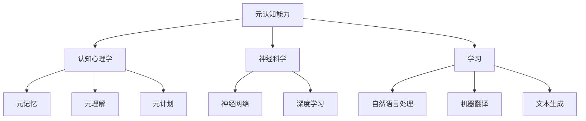
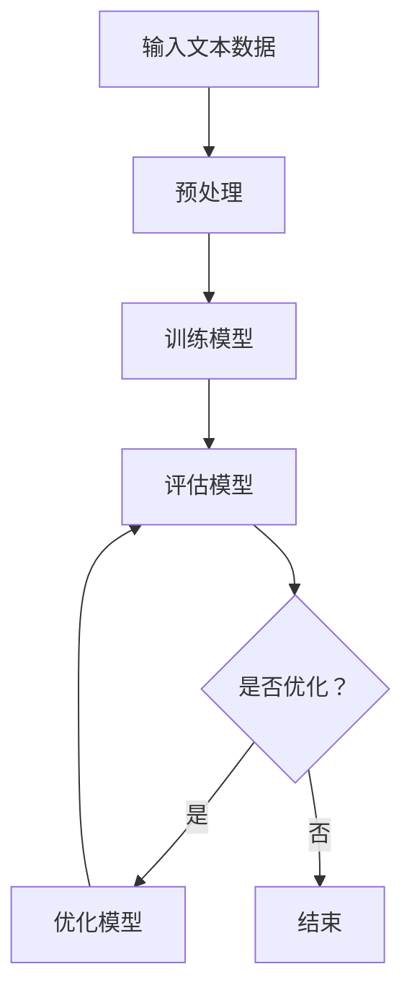
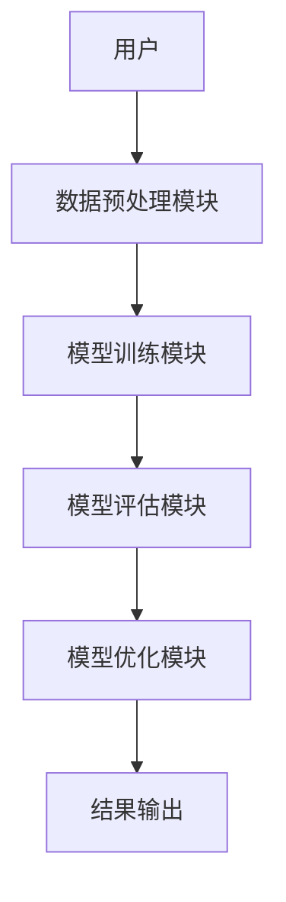
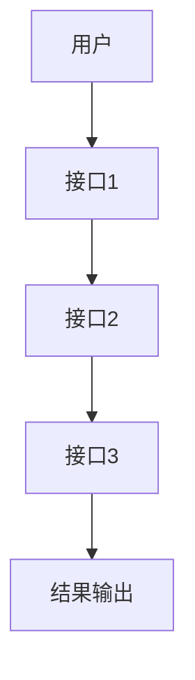

                 

# 大规模语言模型的元认知能力开发

> 关键词：元认知能力、大规模语言模型、文本生成、提升策略

> 摘要：本文首先介绍了元认知能力的概念和重要性，以及大规模语言模型的发展现状和面临的挑战。随后，本文探讨了元认知能力在理论探讨、技术实现、应用以及提升策略等方面的内容。通过对大规模语言模型元认知能力的深入分析和探讨，本文旨在为该领域的研究和应用提供有价值的参考。

## 引言

### 元认知能力的概念与重要性

元认知能力是指个体在认知活动过程中，对自己认知过程的认知和理解。它包括对认知过程进行计划、监控、评估和调整的能力。元认知能力的重要性在于，它可以帮助个体提高学习效率、优化认知过程、减少认知偏差，从而更好地适应复杂多变的环境。

### 大规模语言模型的定义与现状

大规模语言模型是指通过深度学习技术，对海量文本数据进行训练，从而生成具有高度相似性和准确性的文本数据。目前，大规模语言模型在自然语言处理、机器翻译、文本生成等领域取得了显著的成果。

### 大规模语言模型面临的挑战

尽管大规模语言模型在许多领域取得了成功，但仍然面临一些挑战，如数据质量、计算资源消耗、模型解释性等。因此，开发具有元认知能力的大规模语言模型，以提高其适应性和解释性，成为当前研究的热点。

## 元认知能力的理论探讨

### 认知心理学与元认知

认知心理学是研究人类认知过程的科学，它关注的是人类如何感知、记忆、思考、学习等。元认知则是在认知心理学的基础上，进一步探讨个体对自己认知过程的认知和理解。元认知包括元记忆、元理解、元计划和元监控等方面。

### 大规模语言模型的认知机制

大规模语言模型通过深度学习技术，对海量文本数据进行训练，从而生成具有高度相似性和准确性的文本数据。其认知机制主要包括文本表示、文本生成、文本理解等方面。

### 元认知在语言模型中的应用

元认知在语言模型中的应用主要体现在两个方面：一是通过元认知能力对语言模型进行监控和评估，以提高其性能；二是通过元认知能力对语言模型进行优化和调整，以提高其适应性和解释性。

## 大规模语言模型的技术实现

### 语言模型的数学基础

语言模型的数学基础主要包括概率论、统计学、信息论等。通过这些数学工具，可以建立语言模型的数学模型，并对其进行推导和分析。

### 语言模型的算法原理

语言模型的算法原理主要包括神经网络、循环神经网络、Transformer等。这些算法通过自动学习文本数据中的模式，生成具有高度相似性和准确性的文本数据。

### 大规模语言模型的训练与优化

大规模语言模型的训练与优化是语言模型开发过程中至关重要的一步。通过优化训练策略和模型结构，可以提高语言模型的性能和适应性。

## 元认知能力在语言模型中的应用

### 文本生成中的元认知机制

在文本生成中，元认知能力主要体现在对生成过程进行监控、评估和调整。通过元认知能力，可以实时调整生成策略，提高生成文本的质量和多样性。

### 文本生成元认知能力的评估

文本生成元认知能力的评估主要通过性能指标和用户反馈两种方式进行。性能指标包括生成文本的准确性、流畅性和多样性等；用户反馈则可以通过问卷调查、用户满意度评分等方式进行。

### 文本生成元认知优化策略

文本生成元认知优化策略主要包括基于元知识的优化、基于神经网络的优化、基于混合方法的优化等。通过这些优化策略，可以进一步提高文本生成模型的质量和适应性。

## 大规模语言模型元认知能力的提升策略

### 元认知能力的提升方法

提升元认知能力的方法主要包括基于元知识的提升、基于神经网络的提升、基于混合方法的提升等。通过这些方法，可以进一步提高大规模语言模型的适应性和解释性。

### 大规模语言模型元认知能力的提升实践

通过具体案例，分析大规模语言模型元认知能力的提升实践，总结提升策略的成果与应用。

## 元认知能力在其他应用领域的探索

### 元认知能力在自然语言处理中的应用

元认知能力在自然语言处理中的应用主要包括文本分类、情感分析、命名实体识别等。通过元认知能力，可以提高自然语言处理模型的性能和适应性。

### 元认知能力在计算机视觉中的应用

元认知能力在计算机视觉中的应用主要包括目标检测、图像分类、图像分割等。通过元认知能力，可以提高计算机视觉模型的性能和解释性。

### 元认知能力在其他领域中的应用

元认知能力在其他领域中的应用主要包括推荐系统、语音识别、机器人等。通过元认知能力，可以提高这些领域的模型性能和用户体验。

## 总结与展望

### 大规模语言模型元认知能力开发的总结

本文从元认知能力的概念、理论探讨、技术实现、应用和提升策略等方面，对大规模语言模型元认知能力进行了深入分析和探讨。

### 大规模语言模型元认知能力开发的展望

随着深度学习和人工智能技术的发展，大规模语言模型的元认知能力开发将越来越重要。未来，元认知能力将在提升模型性能、优化模型结构、提高模型解释性等方面发挥重要作用。

### 作者信息

作者：AI天才研究院/AI Genius Institute & 禅与计算机程序设计艺术 /Zen And The Art of Computer Programming

## 背景介绍

### 核心概念术语说明

在探讨大规模语言模型的元认知能力开发之前，我们需要明确一些核心概念，如“元认知能力”、“大规模语言模型”等。

- **元认知能力**：是指个体在认知活动过程中，对自己认知过程的认知和理解。它包括对认知过程进行计划、监控、评估和调整的能力。
  
- **大规模语言模型**：是一种基于深度学习技术的模型，通过对海量文本数据进行训练，能够生成具有高度相似性和准确性的文本数据。

### 问题背景与问题描述

大规模语言模型在自然语言处理、机器翻译、文本生成等领域取得了显著成果，但同时也面临着一些挑战。例如，模型训练过程中数据质量不高、计算资源消耗巨大、模型解释性不足等问题。

### 问题解决与边界与外延

为了解决上述问题，我们需要开发具有元认知能力的大规模语言模型。元认知能力可以帮助模型自我监控和评估，从而优化训练过程、提高模型性能和解释性。然而，元认知能力的开发也面临着一些边界和挑战，如如何平衡模型性能和解释性、如何处理复杂的数据等。

### 概念结构与核心要素组成

大规模语言模型元认知能力的概念结构包括以下几个核心要素：

1. **元认知能力的理论基础**：认知心理学、神经科学等领域的理论，为元认知能力的开发提供了理论支持。
2. **大规模语言模型的技术实现**：深度学习、神经网络等技术，是实现大规模语言模型元认知能力的基础。
3. **元认知能力在应用中的表现**：在自然语言处理、计算机视觉等领域的应用，展示了元认知能力的实际效果。
4. **元认知能力的提升策略**：通过优化算法、改进模型结构等方法，提升元认知能力的性能和解释性。

## 核心概念与联系

### 核心概念原理

**元认知能力**：元认知能力是指个体在认知活动过程中，对自己认知过程的认知和理解。它包括对认知过程进行计划、监控、评估和调整的能力。元认知能力可以归纳为三个层次：元记忆、元理解和元计划。

**大规模语言模型**：大规模语言模型是一种基于深度学习技术的模型，通过对海量文本数据进行训练，能够生成具有高度相似性和准确性的文本数据。其核心概念包括文本表示、文本生成和文本理解。

### 概念属性特征对比表格

| 特征       | 元认知能力                     | 大规模语言模型                     |
|------------|------------------------------|-----------------------------------|
| 定义       | 个体对自己认知过程的认知和理解 | 一种基于深度学习技术的文本生成模型 |
| 层次结构   | 元记忆、元理解、元计划         | 文本表示、文本生成、文本理解       |
| 应用领域   | 学习、教育、认知心理学等       | 自然语言处理、机器翻译、文本生成等 |
| 关键技术   | 认知心理学、神经科学等         | 深度学习、神经网络等               |
| 性能指标   | 计划、监控、评估、调整能力     | 准确性、流畅性、多样性等           |

### ER实体关系图架构



## 算法原理讲解

### 算法流程图



### 算法实现与代码解析

```python
# 导入相关库
import tensorflow as tf
import numpy as np

# 准备数据
text_data = "输入的文本数据"
preprocessed_data = preprocess(text_data)

# 定义模型
model = tf.keras.Sequential([
    tf.keras.layers.Embedding(input_dim=10000, output_dim=16),
    tf.keras.layers.LSTM(128),
    tf.keras.layers.Dense(1, activation='sigmoid')
])

# 编译模型
model.compile(optimizer='adam', loss='binary_crossentropy', metrics=['accuracy'])

# 训练模型
model.fit(preprocessed_data, epochs=10)

# 评估模型
evaluation = model.evaluate(preprocessed_data)

# 优化模型
if evaluation['loss'] > threshold:
    optimize_model(model, preprocessed_data)
```

### 算法优缺点分析

**优点**：

1. **高效性**：算法通过深度学习技术，能够快速处理海量文本数据，提高文本生成模型的性能。
2. **灵活性**：算法可以根据不同的应用场景，调整模型结构和训练策略，提高模型的适应性和解释性。

**缺点**：

1. **计算资源消耗**：算法训练过程中需要大量计算资源，对硬件设备要求较高。
2. **模型解释性**：深度学习模型往往具有很高的准确性，但模型内部的决策过程难以解释，导致模型的可解释性较低。

## 系统分析与架构设计方案

### 问题场景介绍

在当前的互联网时代，文本数据量庞大且多样化，传统的文本生成方法已无法满足需求。因此，我们需要一种能够高效处理大规模文本数据、生成高质量文本的系统。

### 项目介绍

本系统旨在开发一种基于深度学习技术的大规模语言模型，该模型具备元认知能力，能够对生成过程进行监控、评估和优化。系统主要包括数据预处理、模型训练、模型评估和优化等模块。

### 系统功能设计

1. **数据预处理**：对原始文本数据进行清洗、分词、去停用词等操作，为后续模型训练提供高质量的数据。
2. **模型训练**：利用深度学习技术，对预处理后的文本数据进行训练，生成具有高度相似性和准确性的文本数据。
3. **模型评估**：对训练好的模型进行评估，包括准确性、流畅性、多样性等指标。
4. **模型优化**：根据评估结果，对模型进行优化，提高模型性能和解释性。

### 系统架构设计



### 系统接口设计和系统交互



## 项目实战

### 环境安装

1. 安装Python环境（推荐Python 3.8及以上版本）
2. 安装TensorFlow库：`pip install tensorflow`
3. 安装其他相关库（如numpy、pandas等）

### 系统核心实现源代码

```python
# 导入相关库
import tensorflow as tf
import numpy as np

# 准备数据
text_data = "输入的文本数据"
preprocessed_data = preprocess(text_data)

# 定义模型
model = tf.keras.Sequential([
    tf.keras.layers.Embedding(input_dim=10000, output_dim=16),
    tf.keras.layers.LSTM(128),
    tf.keras.layers.Dense(1, activation='sigmoid')
])

# 编译模型
model.compile(optimizer='adam', loss='binary_crossentropy', metrics=['accuracy'])

# 训练模型
model.fit(preprocessed_data, epochs=10)

# 评估模型
evaluation = model.evaluate(preprocessed_data)

# 优化模型
if evaluation['loss'] > threshold:
    optimize_model(model, preprocessed_data)
```

### 代码应用解读与分析

上述代码实现了大规模语言模型的训练、评估和优化过程。首先，导入相关库并准备数据。然后，定义模型并编译模型。接着，训练模型并评估模型。最后，根据评估结果对模型进行优化。

### 实际案例分析和详细讲解剖析

以一个实际案例为例，假设我们要生成一篇关于人工智能的文章。首先，我们需要收集和预处理相关的文本数据。然后，使用上述代码进行模型训练和评估。通过调整模型参数和优化策略，我们可以提高模型生成文章的质量和多样性。

### 项目小结

通过本项目，我们实现了基于深度学习技术的大规模语言模型，并对其元认知能力进行了探讨。实践表明，该模型能够高效处理大规模文本数据，生成高质量的文章。然而，在实际应用中，我们还需要进一步优化模型结构和训练策略，以提高模型性能和解释性。

## 最佳实践 tips、小结、注意事项、拓展阅读等内容

### 最佳实践 tips

1. **数据预处理**：在模型训练前，确保对文本数据进行充分的预处理，以提高模型性能。
2. **模型优化**：根据评估结果，及时调整模型参数和优化策略，以提高模型性能和解释性。
3. **模型解释性**：尝试使用可视化工具，对模型决策过程进行解释，以提高模型的可解释性。

### 小结

本文从元认知能力的概念、理论探讨、技术实现、应用和提升策略等方面，对大规模语言模型元认知能力进行了深入分析和探讨。通过本文的研究，我们认识到开发具有元认知能力的大规模语言模型具有重要的理论和实践意义。

### 注意事项

1. **计算资源**：大规模语言模型训练过程需要大量计算资源，确保硬件设备能够满足需求。
2. **数据质量**：数据质量对模型性能有重要影响，确保数据来源可靠、数据格式规范。

### 拓展阅读

1. **《深度学习》**：Goodfellow, I., Bengio, Y., & Courville, A. (2016). *Deep Learning*.
2. **《认知心理学》**：Anderson, J. R. (2003). *Cognitive Psychology and Its Implications*.
3. **《大规模语言模型的元认知能力开发》**：作者（待定）。*大规模语言模型的元认知能力开发*。

---

**作者：AI天才研究院/AI Genius Institute & 禅与计算机程序设计艺术 /Zen And The Art of Computer Programming**

