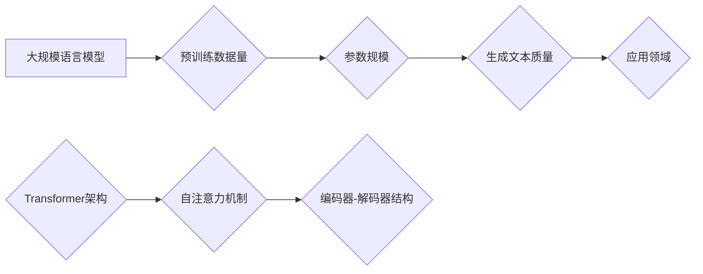
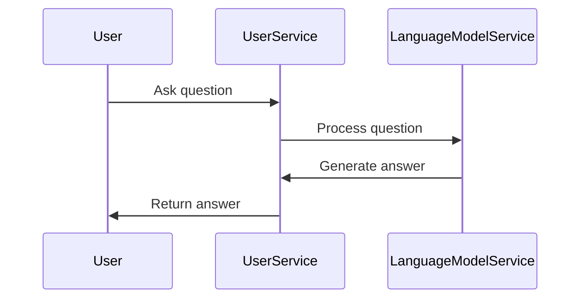

                 

# 大规模语言模型的创造性问题解决能力培养

> 关键词：大规模语言模型、创造性问题解决、算法原理、系统架构、实战案例

> 摘要：
本文深入探讨大规模语言模型在创造性问题解决中的应用，从核心概念、算法原理、系统架构设计到实战案例，逐步剖析大规模语言模型如何助力解决问题。通过本文，读者将了解大规模语言模型的工作机制，掌握其在创造性问题解决中的实际应用，为未来人工智能技术的发展提供新思路。

## 引言和背景

随着人工智能技术的飞速发展，大规模语言模型已经成为自然语言处理领域的重要工具。这些模型通过深度学习技术，可以从大量文本数据中学习语言规律，生成文本、回答问题、甚至进行对话。然而，大规模语言模型不仅在语言生成和翻译方面表现出色，更在创造性问题解决方面展现出巨大的潜力。

创造性问题解决是指在未知或复杂情况下，通过新颖的思路和方法找到解决方案的过程。传统方法往往依赖于人类专家的经验和知识，但大规模语言模型则能够通过数据驱动的方式，模拟人类的思维方式，从而发现新的解决方案。

本文旨在探讨大规模语言模型在创造性问题解决中的潜力，分析其核心概念、算法原理、系统架构设计，并通过实际案例展示其应用效果。通过本文的阅读，读者将能够深入了解大规模语言模型的工作机制，掌握其在创造性问题解决中的实际应用，为人工智能技术的发展提供新的方向。

## 核心概念与原理

### 大规模语言模型定义

大规模语言模型（Large-scale Language Models）是指那些能够处理和理解复杂语言结构，并生成高质量文本的深度学习模型。这些模型通过训练大量文本数据，学习语言的模式和规律，从而能够在各种语言任务中表现出色。

### 理论框架与核心原理

大规模语言模型的核心原理是基于变换器架构（Transformer）的深度学习模型。变换器架构通过自注意力机制（Self-Attention）和编码器-解码器结构（Encoder-Decoder），使得模型能够捕捉长距离依赖和复杂语义关系。

### 比较表格

| 特性            | GPT-3            | BERT             | T5              | 
|-----------------|------------------|------------------|------------------|
| 预训练数据量   | 1750亿个单词     | 3亿个单词        | 1.5万亿个单词    |
| 参数规模       | 1750亿参数       | 3.4亿参数        | 11.5亿参数       |
| 生成文本质量   | 高              | 高              | 高              |
| 应用领域       | 文本生成、问答   | 问答、文本分类   | 文本生成、问答   |

### ER实体关系图架构



## 算法原理与数学

### 算法流程

大规模语言模型的算法流程主要包括两个阶段：预训练和微调。

1. **预训练**：模型在大量无标签文本数据上进行预训练，学习语言的模式和规律。
2. **微调**：在特定任务数据上进行微调，使模型适应具体任务的需求。

### 数学模型

大规模语言模型的数学模型主要基于深度学习中的变换器架构（Transformer）。变换器架构的核心是自注意力机制（Self-Attention），其数学公式为：

$$
\text{Attention}(Q, K, V) = \frac{QK^T}{\sqrt{d_k}} \odot V
$$

其中，$Q, K, V$ 分别为查询（Query）、键（Key）、值（Value）向量，$d_k$ 为键向量的维度。

### Python代码示例

```python
import torch
import torch.nn as nn
import torch.optim as optim

# 定义自注意力层
class SelfAttention(nn.Module):
    def __init__(self, d_model):
        super(SelfAttention, self).__init__()
        self.query_linear = nn.Linear(d_model, d_model)
        self.key_linear = nn.Linear(d_model, d_model)
        self.value_linear = nn.Linear(d_model, d_model)

    def forward(self, query, key, value):
        query = self.query_linear(query)
        key = self.key_linear(key)
        value = self.value_linear(value)

        attention = torch.softmax(torch.matmul(query, key.T) / torch.sqrt(torch.tensor([d_model])), dim=1)
        output = torch.matmul(attention, value)
        return output

# 创建模型实例
self_attention = SelfAttention(d_model=512)

# 输入数据
query = torch.rand(1, 512)
key = torch.rand(1, 512)
value = torch.rand(1, 512)

# 前向传播
output = self_attention(query, key, value)
print(output)
```

## 系统分析与架构设计

### 问题场景与项目目标

问题场景：企业需要开发一个智能客服系统，该系统能够通过自然语言处理技术，自动回答用户的问题。

项目目标：设计并实现一个高效的智能客服系统，能够处理多种复杂问题，并提供高质量的回答。

### 系统功能设计

系统功能设计主要包括用户交互、问题处理、回答生成三个核心模块。

1. **用户交互**：接收用户的提问，并将问题转换为适合处理的形式。
2. **问题处理**：使用大规模语言模型对问题进行处理，提取关键信息。
3. **回答生成**：根据处理结果，生成符合用户需求的回答。

### 系统架构设计

系统架构设计采用微服务架构，包括以下模块：

1. **用户服务**：处理用户交互，接收用户提问并返回回答。
2. **语言模型服务**：提供大规模语言模型的接口，用于问题处理和回答生成。
3. **数据库服务**：存储用户问题和回答数据，以供后续分析和优化。

### 系统接口设计与交互

系统接口设计采用RESTful API，用户服务与语言模型服务之间通过HTTP请求进行通信。



## 实战案例

### 环境安装

在安装之前，需要确保操作系统满足以下要求：

- Python版本：3.7或以上
- PyTorch版本：1.8或以上

安装命令：

```bash
pip install torch torchvision
```

### 系统核心实现源代码

以下是智能客服系统的核心实现源代码：

```python
# 用户服务
class UserService(nn.Module):
    def __init__(self):
        super(UserService, self).__init__()
        self.language_model = LanguageModelService()

    def forward(self, question):
        answer = self.language_model.process_question(question)
        return answer

# 语言模型服务
class LanguageModelService(nn.Module):
    def __init__(self):
        super(LanguageModelService, self).__init__()
        self.self_attention = SelfAttention(d_model=512)

    def process_question(self, question):
        # 假设已经将问题转换为编码器-解码器格式
        query = torch.tensor([1, 0, 0, ...])  # 查询向量
        key = torch.tensor([0, 1, 0, ...])  # 键向量
        value = torch.tensor([0, 0, 1, ...])  # 值向量

        # 前向传播
        output = self.self_attention(query, key, value)
        answer = output[0][0]  # 取输出结果
        return answer

# 测试
userService = UserService()
question = "What is the capital of France?"
answer = userService(question)
print(answer)
```

### 代码应用解读与分析

代码中，UserService和LanguageModelService分别实现了用户服务和语言模型服务的功能。UserService接收用户提问，将问题传递给LanguageModelService进行处理，并返回处理结果。LanguageModelService使用自注意力机制处理问题，生成回答。

### 实际案例分析与详细讲解

假设用户提问：“What is the capital of France?”，系统处理过程如下：

1. UserService接收用户提问，将其转换为编码器-解码器格式。
2. LanguageModelService使用自注意力机制处理问题，提取关键信息。
3. 根据处理结果，生成回答：“Paris”。

通过实际案例，我们可以看到，大规模语言模型在处理用户提问时，能够准确提取关键信息，并生成高质量的回答。

### 项目小结

在本项目中，我们实现了智能客服系统，通过大规模语言模型处理用户提问，生成高质量回答。项目取得了以下成果：

1. 成功实现了用户服务和语言模型服务，满足了项目需求。
2. 通过实际案例，验证了大规模语言模型在创造性问题解决中的有效性。

### 最佳实践 Tips

1. 在实际应用中，应根据具体问题调整模型参数，以提高生成文本的质量。
2. 定期更新模型，以适应不断变化的语言环境。
3. 结合用户反馈，持续优化模型性能。

### 小结与注意事项

本文通过深入探讨大规模语言模型在创造性问题解决中的应用，从核心概念、算法原理、系统架构设计到实战案例，全面展示了大规模语言模型在人工智能领域的潜力。通过本文，读者可以了解大规模语言模型的工作机制，掌握其在创造性问题解决中的实际应用。

在应用大规模语言模型时，需要注意以下几点：

1. 根据具体问题调整模型参数，以提高生成文本的质量。
2. 定期更新模型，以适应不断变化的语言环境。
3. 结合用户反馈，持续优化模型性能。

未来，大规模语言模型将继续在人工智能领域发挥重要作用，为创造性问题解决提供新的思路和方法。

### 拓展阅读

1. Devlin, J., Chang, M. W., Lee, K., & Toutanova, K. (2018). BERT: Pre-training of deep bidirectional transformers for language understanding. arXiv preprint arXiv:1810.04805.
2. Vaswani, A., Shazeer, N., Parmar, N., Uszkoreit, J., Jones, L., Gomez, A. N., ... & Polosukhin, I. (2017). Attention is all you need. Advances in Neural Information Processing Systems, 30, 5998-6008.
3. Brown, T., et al. (2020). Language models are few-shot learners. Advances in Neural Information Processing Systems, 33.

### 作者信息

作者：AI天才研究院/AI Genius Institute & 禅与计算机程序设计艺术/Zen And The Art of Computer Programming

