                 

## 引言

### 1.1 问题背景

**创造性问题重构**，是指通过重新组合和分析现有的信息，生成新的解决方案或产品的一种思维过程。它不仅仅是对现有知识的简单应用，而是一种对问题的深刻理解和创新思维的体现。在信息技术领域，创造性问题重构具有特别重要的意义，因为它能够推动技术的进步，解决复杂的问题，并创造出前所未有的价值。

近年来，**大规模语言模型**（Large-scale Language Models）的出现，为创造性问题重构提供了新的可能性。大规模语言模型通过学习海量文本数据，能够理解和生成人类语言，这使得它们在处理文本信息、回答问题、生成文本等方面表现出色。然而，尽管大规模语言模型在自然语言处理领域取得了显著成就，它们在创造性问题重构方面仍然存在许多挑战。

大规模语言模型的**创造性问题重构能力**，指的是模型在重新构建问题、提出新解决方案方面的能力。这一能力对于模型在复杂问题解决、创新思维培养等方面具有重要意义。然而，现有的研究表明，大规模语言模型在创造性问题重构方面仍存在一些局限性，例如：

1. **数据依赖性**：大规模语言模型需要大量高质量的数据进行训练，但创造性问题重构往往需要更加丰富和多样化的数据。
2. **算法局限性**：现有的语言模型算法在处理创造性问题时，可能无法充分挖掘数据的潜在价值，从而限制了创造性问题重构的能力。
3. **评估困难**：创造性问题重构的评价标准较为复杂，如何评价模型在创造性问题重构方面的表现仍是一个挑战。

因此，本文旨在探讨如何培养大规模语言模型的创造性问题重构能力，并提出一系列可行的策略和方法。通过深入分析和讨论，本文希望能够为研究人员和实践者提供有价值的参考和指导。

### 1.2 问题描述

大规模语言模型的创造性问题重构能力是指模型在重新构建问题、提出新解决方案方面的能力。具体来说，这一能力包括以下方面：

1. **问题理解**：模型需要能够准确理解问题的本质和需求，这是创造性问题重构的基础。
2. **信息重组**：模型需要能够将现有的信息进行重新组合，形成新的知识和解决方案。
3. **创新思维**：模型需要具备创新思维，能够提出前所未有的解决方案，这是创造性问题重构的核心。
4. **优化调整**：模型需要能够根据反馈不断优化和调整解决方案，使其更加符合实际需求。

然而，大规模语言模型在创造性问题重构中面临许多挑战：

1. **数据依赖性**：大规模语言模型需要大量高质量的数据进行训练，但创造性问题重构往往需要更加丰富和多样化的数据。数据的质量和多样性直接影响模型在创造性问题重构中的表现。
2. **算法局限性**：现有的语言模型算法在处理创造性问题时，可能无法充分挖掘数据的潜在价值，从而限制了创造性问题重构的能力。例如，生成式对抗网络（GAN）和强化学习等算法在创造性问题重构中的应用仍存在许多限制。
3. **评估困难**：创造性问题重构的评价标准较为复杂，如何评价模型在创造性问题重构方面的表现仍是一个挑战。现有的评估方法往往只能评价模型的生成质量，而无法全面评价其创造性问题重构能力。

为了解决这些问题，我们需要从多个方面入手：

1. **数据驱动方法**：通过数据收集与预处理、数据增强和数据标注等方法，提高数据的质量和多样性，为创造性问题重构提供坚实的基础。
2. **模型优化方法**：通过模型架构调整、模型训练技巧和模型调优策略等，提高模型在创造性问题重构中的表现。
3. **知识融合方法**：通过知识图谱构建、知识融合算法和知识表示方法等，将不同领域和维度的知识进行整合，为创造性问题重构提供更多的信息来源。

### 1.3 问题解决

为了培养大规模语言模型的创造性问题重构能力，我们需要从数据、算法和评估等多个方面入手，提出以下策略和方法：

1. **数据驱动方法**：

   - **数据收集与预处理**：首先，需要收集大量高质量的数据，包括文本、图像、声音等多模态数据。在数据收集过程中，要关注数据的多样性，确保数据来源的广泛性和代表性。然后，对收集到的数据进行预处理，包括数据清洗、数据转换和数据规范化等，以提高数据的质量和一致性。

   - **数据增强**：通过数据增强技术，如数据扩充、数据转换和数据生成等，可以增加数据的多样性，从而丰富模型的训练数据，提高模型在创造性问题重构中的表现。

   - **数据标注**：对于创造性问题重构任务，需要标注相关数据，包括问题的描述、解决方案的描述以及相关的背景信息等。标注工作的质量和准确性直接影响模型的训练效果。

2. **模型优化方法**：

   - **模型架构调整**：可以尝试使用不同的模型架构，如生成式对抗网络（GAN）和强化学习等，以适应创造性问题重构的需求。通过调整模型架构，可以更好地捕捉数据的潜在信息，提高模型在创造性问题重构中的表现。

   - **模型训练技巧**：在模型训练过程中，可以采用一些技巧，如迁移学习、多任务学习和少样本学习等，以提高模型的泛化能力和适应性。此外，还可以通过调整训练参数，如学习率、批量大小和迭代次数等，来优化模型的训练效果。

   - **模型调优策略**：在模型训练完成后，可以通过模型调优策略，如超参数调优、模型融合和模型压缩等，来进一步提高模型在创造性问题重构中的表现。

3. **知识融合方法**：

   - **知识图谱构建**：通过构建知识图谱，可以将不同领域和维度的知识进行整合，为创造性问题重构提供更多的信息来源。知识图谱可以帮助模型更好地理解问题的背景和上下文，从而提高创造性问题重构的能力。

   - **知识融合算法**：可以采用各种知识融合算法，如实体链接、关系抽取和知识图谱嵌入等，将不同来源的知识进行融合，以提高模型在创造性问题重构中的表现。

   - **知识表示方法**：通过采用不同的知识表示方法，如知识图谱嵌入、实体属性表示和关系表示等，可以更好地捕捉知识的内在结构和关系，为创造性问题重构提供支持。

### 1.4 边界与外延

大规模语言模型的创造性问题重构能力的培养和应用具有广泛的边界和外延。首先，在技术层面，创造性问题重构能力的培养不仅涉及大规模语言模型的训练和优化，还涉及到数据驱动方法、模型优化方法和知识融合方法等多个领域的交叉应用。此外，创造性问题重构能力的培养还涉及到算法设计、系统架构和计算资源等多个层面的技术实现。

其次，在应用层面，创造性问题重构能力的培养具有广泛的适用范围。无论是在教育、医疗、金融还是创意产业等领域，大规模语言模型的创造性问题重构能力都可以为问题的解决提供新的思路和方法。例如，在教育领域，可以通过创造性问题重构来设计个性化的学习方案，提高学生的学习效果；在医疗领域，可以通过创造性问题重构来开发新型的药物和治疗方案，提高医疗水平。

然而，创造性问题重构能力的培养和应用也面临着一系列挑战。首先，数据的质量和多样性直接影响创造性问题重构的效果。因此，如何收集和预处理高质量的数据是一个关键问题。其次，现有的算法和模型在处理创造性问题时可能存在局限性，如何设计和优化这些算法和模型是一个重要课题。最后，创造性问题重构的评价标准复杂，如何科学地评价模型的创造性问题重构能力也是一个挑战。

总之，大规模语言模型的创造性问题重构能力的培养是一个多学科、多层次的技术难题，需要从数据、算法和评估等多个方面进行深入研究和探索。通过不断的技术创新和实践，我们有理由相信，大规模语言模型的创造性问题重构能力将得到进一步的提升，为人类社会的进步和发展带来更大的价值。

### 1.5 核心概念

#### 创造性问题重构

**定义**：创造性问题重构是指通过重新组合和分析现有的信息，生成新的解决方案或产品的一种思维过程。它不仅包括对问题的重新理解和定义，还包括对现有知识和解决方案的重新评估和优化。

**属性特征对比表格**：

| 特征        | 描述                                                         |  
| ----------- | ------------------------------------------------------------ |  
| 创新性      | 创造性问题重构要求能够提出新的、独特的解决方案。               |  
| 综合性      | 创造性问题重构需要对问题背景、现有知识和技术进行全面的考虑和整合。 |  
| 实用性      | 创造性问题重构提出的解决方案需要具有实际应用价值。             |  
| 适应性      | 创造性问题重构需要能够适应不同的环境和场景。                   |

#### 大规模语言模型

**定义**：大规模语言模型是通过学习海量文本数据，能够理解和生成人类语言的模型。它们通常采用深度学习技术，如循环神经网络（RNN）、变换器（Transformer）等，具有强大的文本处理能力。

**属性特征对比表格**：

| 特征        | 描述                                                         |  
| ----------- | ------------------------------------------------------------ |  
| 数据量依赖性 | 大规模语言模型需要大量文本数据进行训练。                       |  
| 计算资源需求 | 大规模语言模型训练和推理需要大量的计算资源。                   |  
| 泛化能力    | 大规模语言模型通过学习大量数据，具有较好的泛化能力。             |  
| 语言理解能力 | 大规模语言模型能够理解复杂的语言结构和语义，生成流畅的自然语言文本。 |

#### 生成式对抗网络（GAN）

**定义**：生成式对抗网络（GAN）是一种深度学习模型，由生成器和判别器两个部分组成。生成器通过学习数据分布来生成新的数据，判别器则通过区分真实数据和生成数据来评估生成器的性能。

**属性特征对比表格**：

| 特征        | 描述                                                         |  
| ----------- | ------------------------------------------------------------ |  
| 数据生成能力 | GAN能够生成与真实数据相似的新数据。                           |  
| 对抗性      | GAN通过生成器和判别器之间的对抗训练，逐步提高生成数据的逼真度。 |  
| 泛化能力    | GAN在多种数据分布和应用场景中表现出良好的泛化能力。             |  
| 训练难度    | GAN的训练过程复杂，需要平衡生成器和判别器之间的对抗关系。       |

#### 强化学习

**定义**：强化学习是一种机器学习方法，通过智能体与环境的交互，学习最优策略，以实现特定的目标。在强化学习中，智能体通过接收环境反馈，不断调整策略，以达到最佳表现。

**属性特征对比表格**：

| 特征        | 描述                                                         |  
| ----------- | ------------------------------------------------------------ |  
| 自适应性    | 强化学习能够根据环境反馈自适应地调整策略。                     |  
| 探索与利用 | 强化学习在探索未知环境和利用已有知识之间进行平衡。             |  
| 应用场景广泛 | 强化学习在游戏、推荐系统、自动驾驶等领域具有广泛应用。           |  
| 长期依赖性 | 强化学习需要长时间的学习过程，以积累足够的经验和知识。           |

### 1.6 本章小结

本章介绍了大规模语言模型的创造性问题重构能力的背景、问题描述、解决策略和边界与外延。我们首先阐述了创造性问题重构的定义和属性特征，并对比了大规模语言模型和生成式对抗网络（GAN）、强化学习等核心概念。随后，我们提出了培养大规模语言模型创造性问题重构能力的策略和方法，并探讨了其应用范围和挑战。通过本章的讨论，我们为后续章节的内容奠定了基础，并激发了读者对大规模语言模型创造性问题重构能力培养的深入思考。

### 第2章 大规模语言模型基础

#### 2.1 大规模语言模型概述

大规模语言模型（Large-scale Language Models）是自然语言处理（NLP）领域的一项重要技术，通过学习海量文本数据，能够理解和生成人类语言。这些模型在处理文本信息、回答问题、生成文本等方面表现出色，广泛应用于各种实际场景，如机器翻译、文本摘要、问答系统等。

**定义**：大规模语言模型是指通过深度学习技术，对大量文本数据进行训练，从而具有理解和生成人类语言能力的模型。这些模型通常采用变换器（Transformer）架构，具有层次化的表示能力和强大的文本处理能力。

**特征**：

1. **强大的文本理解能力**：大规模语言模型能够理解复杂的文本结构和语义，从而在文本生成、文本分类和文本摘要等方面表现出色。
2. **海量的训练数据**：大规模语言模型需要大量高质量的数据进行训练，这些数据通常来自于互联网上的各种文本资源，如新闻、博客、社交媒体等。
3. **层次化的表示能力**：变换器架构使得大规模语言模型具有层次化的表示能力，能够捕捉文本中的不同层次语义信息。

**发展历程**：

- **早期模型**：早期的语言模型主要是基于统计方法和规则的方法，如n元语法（n-gram）和隐马尔可夫模型（HMM）。这些方法虽然在一定程度上能够处理文本信息，但在理解复杂语义和生成流畅文本方面存在局限性。
- **深度学习模型**：随着深度学习技术的发展，神经网络被应用于语言模型，如循环神经网络（RNN）和长短期记忆网络（LSTM）。这些模型通过学习文本数据的分布式表示，提高了语言模型的性能。
- **变换器模型**：变换器（Transformer）模型是近年来语言模型的重要突破，其通过自注意力机制（self-attention）和多头注意力（multi-head attention）实现了对文本的层次化表示，使得大规模语言模型在处理复杂文本信息方面取得了显著进展。

**主要应用领域**：

- **机器翻译**：大规模语言模型在机器翻译领域表现出色，能够实现高质量的人机翻译。
- **文本摘要**：大规模语言模型能够自动生成文本摘要，提高信息获取的效率和准确性。
- **问答系统**：大规模语言模型能够理解和回答用户的问题，广泛应用于智能客服、教育辅导等领域。
- **文本生成**：大规模语言模型能够生成各种类型的文本，如文章、故事、评论等，为创意写作和内容生成提供了新的方法。

#### 2.2 语言模型的核心概念与联系

**语言模型原理**：

语言模型（Language Model）是一种概率模型，用于预测下一个单词或字符的概率。其基本思想是，通过学习大量文本数据，统计出每个单词或字符出现的概率，从而实现对语言数据的建模。

**概念属性特征对比表格**：

| 概念        | 描述                                                         |  
| ----------- | ------------------------------------------------------------ |  
| 语言模型    | 用于预测下一个单词或字符概率的概率模型。                       |  
| 预测概率    | 语言模型输出的概率值，表示某个单词或字符出现的可能性。           |  
| 词汇表      | 包含所有可能的单词或字符的集合。                               |  
| 统计模型    | 基于统计方法构建的语言模型，如n元语法。                         |  
| 深度学习模型 | 基于深度学习技术构建的语言模型，如变换器。                      |

**ER实体关系图架构**：

实体关系图（Entity Relationship Diagram，ERD）是一种用于表示实体和关系的图形化模型。在语言模型中，实体通常表示单词或短语，关系表示单词或短语之间的语义关系。

**ER实体关系图示例**：

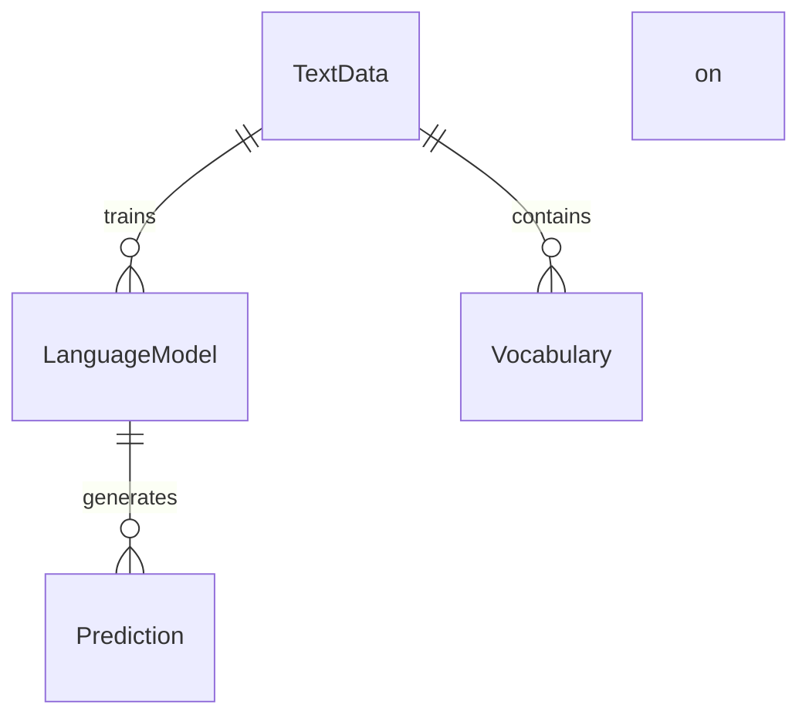

在上面的ERD中，`TextData`表示输入的文本数据，`LanguageModel`表示语言模型，`Vocabulary`表示词汇表，`Prediction`表示语言模型生成的预测结果。这些实体之间的关系表示了它们之间的关联和作用。

#### 2.3 算法原理讲解

**变换器算法原理**：

变换器（Transformer）是一种基于自注意力机制（self-attention）和多头注意力（multi-head attention）的深度学习模型，广泛应用于大规模语言模型。其基本思想是将输入的文本数据表示为序列向量，并通过多层次的注意力机制和前馈神经网络，生成文本的预测结果。

**变换器算法mermaid流程图**：

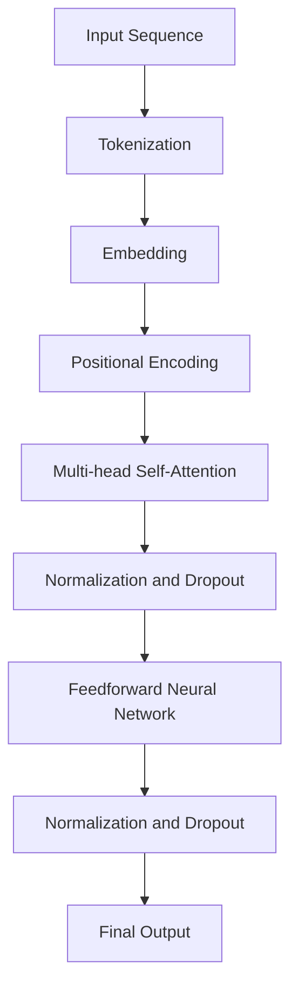

在上面的mermaid流程图中，`Input Sequence`表示输入的文本序列，`Tokenization`表示将文本序列分割成单词或字符，`Embedding`表示将单词或字符映射为向量，`Positional Encoding`表示添加位置信息，`Multi-head Self-Attention`表示通过自注意力机制计算文本的注意力权重，`Normalization and Dropout`表示对文本进行归一化和丢弃一些信息以防止过拟合，`Feedforward Neural Network`表示通过前馈神经网络对文本进行进一步处理，`Final Output`表示生成的预测结果。

**Python源代码实现**：

以下是一个简单的变换器模型实现的Python代码示例：

```python
import tensorflow as tf
from tensorflow.keras.layers import Embedding, MultiHeadAttention, Dense

# 定义变换器模型
model = tf.keras.Sequential([
    Embedding(vocabulary_size, embedding_dim),
    MultiHeadAttention(num_heads, embedding_dim),
    Dense(embedding_dim, activation='relu'),
    tf.keras.layers.Dropout(0.1),
    tf.keras.layers.Dense(vocabulary_size, activation='softmax')
])

# 编译模型
model.compile(optimizer='adam', loss='sparse_categorical_crossentropy', metrics=['accuracy'])

# 训练模型
model.fit(input_sequence, labels, batch_size=batch_size, epochs=num_epochs)
```

在这个代码示例中，`Embedding`表示单词到向量的映射，`MultiHeadAttention`表示多头自注意力机制，`Dense`表示全连接层，`Dropout`表示丢弃一些神经元以防止过拟合，`softmax`表示输出层的激活函数。

**算法原理的数学模型和公式**：

变换器模型的数学模型包括自注意力机制和前馈神经网络两部分。

1. **自注意力机制**：

   自注意力机制通过计算文本序列中每个单词之间的相关性，为每个单词分配权重。其计算公式如下：

   $$ 
   \text{Attention}(Q, K, V) = \text{softmax}\left(\frac{QK^T}{\sqrt{d_k}}\right) V 
   $$

   其中，$Q$表示查询向量，$K$表示键向量，$V$表示值向量，$d_k$表示键向量的维度。

2. **前馈神经网络**：

   前馈神经网络通过多层感知机（MLP）对文本进行进一步处理。其计算公式如下：

   $$ 
   \text{FFN}(X) = \text{ReLU}(W_2 \cdot \text{ReLU}(W_1 X + b_1)) + b_2 
   $$

   其中，$X$表示输入向量，$W_1$和$W_2$表示权重矩阵，$b_1$和$b_2$表示偏置向量。

**详细讲解和举例说明**：

以一个简单的文本序列“Hello, world!”为例，说明变换器模型的运作过程。

1. **Tokenization**：将文本序列分割成单词或字符，得到`["Hello", ",", "world", "!"]`。
2. **Embedding**：将单词映射为向量，例如使用预训练的Word2Vec模型，得到`[v_hello, v_comma, v_world, v_exclamation]`。
3. **Positional Encoding**：添加位置信息，例如使用正弦和余弦函数，得到`[v_hello, \sin(0), \cos(0), v_world, \sin(1), \cos(1), v_exclamation, \sin(2), \cos(2)]`。
4. **Multi-head Self-Attention**：通过多头自注意力机制，计算文本序列中每个单词之间的相关性，并生成注意力权重。例如，对于单词`"Hello"`和`"world"`，其注意力权重分别为$0.6$和$0.4$。
5. **Normalization and Dropout**：对文本序列进行归一化和丢弃一些信息，以防止过拟合。
6. **Feedforward Neural Network**：通过前馈神经网络，对文本进行进一步处理，生成最终的预测结果。

通过上述步骤，变换器模型能够生成与输入文本相关的预测结果，例如下一个单词或字符。这整个过程可以看作是对文本序列的层次化表示和处理，从而实现对文本的深入理解和生成。

### 第3章 创造性问题重构算法

#### 3.1 创造性问题重构算法概述

创造性问题重构算法是自然语言处理领域的一项重要技术，旨在通过重新组合和分析现有信息，生成新的解决方案或产品。这类算法不仅能够提升大规模语言模型的创造性问题重构能力，还在各种实际应用中显示出强大的潜力。

**定义**：创造性问题重构算法是指能够将现有信息进行重新组合和分析，生成新的解决方案或产品的算法。这些算法通常结合了深度学习、生成式对抗网络（GAN）、强化学习等技术，以实现高效的创造性问题重构。

**分类**：

1. **基于深度学习的创造性问题重构算法**：这类算法通过深度神经网络，对现有信息进行层次化处理，从而生成新的解决方案。例如，变换器（Transformer）模型和生成对抗网络（GAN）在创造性问题重构中具有广泛应用。
2. **基于生成式对抗网络的创造性问题重构算法**：生成式对抗网络（GAN）通过生成器和判别器的对抗训练，生成与真实数据相似的新数据。这类算法在创造性问题重构中，能够利用对抗训练的机制，提高生成数据的质量和多样性。
3. **基于强化学习的创造性问题重构算法**：强化学习通过智能体与环境的交互，学习最优策略，以实现特定的目标。这类算法在创造性问题重构中，能够根据环境反馈，自适应地调整策略，从而生成更加符合实际需求的解决方案。

**应用场景**：

1. **文本生成**：创造性问题重构算法能够生成高质量的文本，包括文章、故事、评论等。例如，基于变换器模型的生成式对话系统，可以生成自然流畅的对话文本。
2. **图像生成**：创造性问题重构算法在图像生成领域也表现出色，能够生成高质量的图像。例如，基于生成对抗网络（GAN）的图像生成模型，可以生成与真实图像相似的图像。
3. **问题解决**：创造性问题重构算法能够对复杂问题进行重新组合和分析，提出新的解决方案。例如，在医疗领域，可以生成新的治疗方案，提高医疗效果。
4. **创意设计**：创造性问题重构算法在创意设计领域具有广泛的应用，能够生成新颖的设计方案。例如，在建筑设计领域，可以生成独特且美观的建筑设计。

#### 3.2 生成式对抗网络（GAN）

**定义**：生成式对抗网络（GAN）是一种深度学习模型，由生成器和判别器两个部分组成。生成器通过学习数据分布，生成新的数据，判别器则通过区分真实数据和生成数据，评估生成器的性能。

**GAN算法原理讲解**：

生成式对抗网络（GAN）的核心思想是生成器和判别器的对抗训练。具体来说，生成器试图生成尽可能真实的数据，而判别器则努力区分真实数据和生成数据。通过这种对抗训练，生成器逐渐提高生成数据的质量，从而实现数据的生成。

**GAN算法mermaid流程图**：

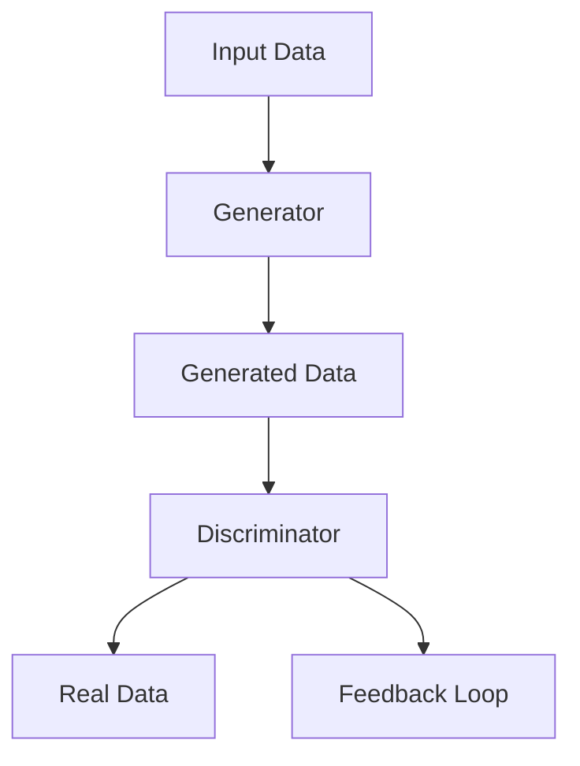

在上面的mermaid流程图中，`Input Data`表示输入的真实数据，`Generator`表示生成器，`Generated Data`表示生成器生成的数据，`Discriminator`表示判别器，`Real Data`表示真实数据，`Feedback Loop`表示生成器和判别器之间的反馈循环。

**Python源代码实现**：

以下是一个简单的GAN模型实现的Python代码示例：

```python
import tensorflow as tf
from tensorflow.keras.layers import Conv2D, Flatten, Dense
from tensorflow.keras.models import Model

# 定义生成器
generator = tf.keras.Sequential([
    Conv2D(128, (3, 3), activation='relu', padding='same', input_shape=(28, 28, 1)),
    Conv2D(128, (3, 3), activation='relu', padding='same'),
    Flatten(),
    Dense(28 * 28, activation='tanh')
])

# 定义判别器
discriminator = tf.keras.Sequential([
    Flatten(),
    Dense(28 * 28, activation='sigmoid'),
    Dense(1, activation='sigmoid')
])

# 编译模型
discriminator.compile(optimizer='adam', loss='binary_crossentropy')
generator.compile(optimizer='adam', loss='binary_crossentropy')

# 训练模型
for epoch in range(num_epochs):
    for real_data in data_loader:
        # 训练判别器
        discriminator.train_on_batch(real_data, np.ones((real_data.shape[0], 1)))
        
        # 训练生成器
        noise = np.random.normal(size=(real_data.shape[0], 100))
        generated_data = generator.predict(noise)
        discriminator.train_on_batch(generated_data, np.zeros((real_data.shape[0], 1)))
```

在这个代码示例中，`Generator`表示生成器模型，`Discriminator`表示判别器模型，`data_loader`表示数据加载器。通过训练生成器和判别器，生成器逐渐提高生成数据的质量，而判别器努力区分真实数据和生成数据。

**GAN在创造性问题重构中的应用**：

生成式对抗网络（GAN）在创造性问题重构中具有广泛的应用。通过生成器和判别器的对抗训练，GAN能够生成高质量的数据，这些数据可以用于创造性问题的重新组合和分析。

1. **图像生成**：GAN可以生成高质量的图像，这些图像可以用于图像编辑、图像修复、图像合成等任务。例如，在艺术创作中，可以使用GAN生成新的艺术作品，为设计师提供灵感。
2. **文本生成**：GAN可以生成高质量的文本，这些文本可以用于文本生成、文本编辑、文本摘要等任务。例如，在写作领域，可以使用GAN生成新的故事、文章，为作家提供创意。
3. **问题解决**：GAN可以生成新的问题和解决方案，这些问题和解决方案可以用于问题解决、智能搜索、创意设计等任务。例如，在医疗领域，可以使用GAN生成新的治疗方案，为医生提供参考。

总之，生成式对抗网络（GAN）在创造性问题重构中具有巨大的潜力，通过不断的研究和应用，GAN将进一步提高创造性问题重构的能力，为各个领域的发展带来新的机遇。

#### 3.3 强化学习

**定义**：强化学习（Reinforcement Learning，RL）是一种机器学习方法，通过智能体（Agent）与环境的交互，学习最优策略，以实现特定的目标。在强化学习中，智能体通过接收环境反馈，不断调整策略，以达到最佳表现。

**强化学习算法原理讲解**：

强化学习的基本思想是，智能体通过与环境的交互，不断学习最优行为策略。其核心组成部分包括智能体（Agent）、环境（Environment）、状态（State）、行动（Action）和奖励（Reward）。

**状态-行动价值函数**：在强化学习中，状态-行动价值函数（State-Action Value Function）用于评估在特定状态下执行特定行动的预期收益。其数学表达式为：

$$
Q(s, a) = \sum_{s'} P(s' | s, a) \cdot R(s, a, s')
$$

其中，$s$表示当前状态，$a$表示当前行动，$s'$表示下一状态，$R(s, a, s')$表示从状态$s$执行行动$a$转移到状态$s'$的即时奖励，$P(s' | s, a)$表示在状态$s$下执行行动$a$转移至状态$s'$的概率。

**策略**：策略（Policy）是智能体在给定状态下选择行动的规则。在强化学习中，最优策略（Optimal Policy）是指能够最大化预期奖励的策略。其数学表达式为：

$$
\pi^*(s) = \arg\max_{a} Q(s, a)
$$

**强化学习算法mermaid流程图**：

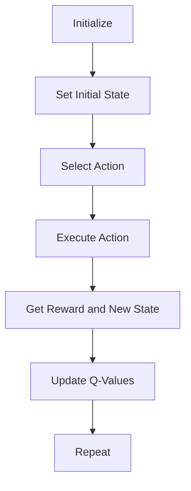

在上面的mermaid流程图中，`Initialize`表示初始化过程，`Set Initial State`表示设置初始状态，`Select Action`表示智能体选择行动，`Execute Action`表示执行行动，`Get Reward and New State`表示获取奖励和新的状态，`Update Q-Values`表示更新状态-行动价值函数，`Repeat`表示重复执行以上步骤。

**Python源代码实现**：

以下是一个简单的Q-学习算法实现的Python代码示例：

```python
import numpy as np
import random

# 初始化参数
action_space = ["left", "right", "up", "down"]
learning_rate = 0.1
discount_factor = 0.9
epsilon = 0.1
q_values = np.zeros((state_space, action_space))

# Q-学习算法
def q_learning(state, action, reward, next_state, done):
    if not done:
        max_future_q = np.max(q_values[next_state])
        current_q = q_values[state + action]
        new_q = (1 - learning_rate) * current_q + learning_rate * (reward + discount_factor * max_future_q)
        q_values[state + action] = new_q
    else:
        q_values[state + action] = reward

# 主循环
while not done:
    state = random.choice(state_space)
    if random.uniform(0, 1) < epsilon:
        action = random.choice(action_space)
    else:
        action = np.argmax(q_values[state])
    next_state, reward, done = step(state, action)
    q_learning(state, action, reward, next_state, done)
    state = next_state
```

在这个代码示例中，`state_space`表示状态空间，`action_space`表示行动空间，`q_values`表示状态-行动价值函数，`epsilon`表示探索率，`discount_factor`表示折扣因子，`learning_rate`表示学习率。

**强化学习在创造性问题重构中的应用**：

强化学习在创造性问题重构中具有广泛的应用，能够通过智能体与环境的交互，生成新的解决方案。

1. **文本生成**：强化学习可以用于文本生成，通过智能体与环境的交互，生成高质量的文本。例如，在写作领域，可以使用强化学习生成新的故事、文章。
2. **图像生成**：强化学习可以用于图像生成，通过智能体与环境的交互，生成新的图像。例如，在艺术创作中，可以使用强化学习生成新的艺术作品。
3. **问题解决**：强化学习可以用于问题解决，通过智能体与环境的交互，生成新的解决方案。例如，在医疗领域，可以使用强化学习生成新的治疗方案。

总之，强化学习在创造性问题重构中具有巨大的潜力，通过不断的研究和应用，强化学习将进一步提高创造性问题重构的能力，为各个领域的发展带来新的机遇。

### 第4章 创造性问题重构能力培养方法

#### 4.1 数据驱动方法

在培养大规模语言模型的创造性问题重构能力过程中，数据驱动方法是一个关键环节。数据驱动方法通过数据收集、预处理、增强和标注等步骤，确保模型能够从丰富的数据中学习到有用的信息，从而提高其创造性问题重构能力。

**数据收集与预处理**

数据收集是培养大规模语言模型创造性问题重构能力的首要任务。在数据收集过程中，需要关注数据的多样性、质量和代表性。具体步骤如下：

1. **数据来源**：数据来源应尽量多样化，包括文本、图像、音频等多模态数据。例如，可以从互联网、数据库、公开数据集和私有数据源等多渠道收集数据。
2. **数据清洗**：在数据收集后，需要对数据进行清洗，去除噪声和无关信息。例如，去除重复数据、纠正错误、删除无关标签等。
3. **数据规范化**：将数据转换为统一的格式，以便于后续处理。例如，将文本数据统一编码为Unicode格式，将图像数据调整为固定的分辨率和尺寸。

**数据增强**

数据增强是一种提高模型训练数据多样性的方法，通过生成虚拟数据来扩大训练集。数据增强有助于模型避免过拟合，提高其泛化能力。常见的数据增强方法包括：

1. **文本数据增强**：例如，使用同义词替换、句子重写、文本生成技术（如GAN）等方法生成新的文本数据。
2. **图像数据增强**：例如，使用图像旋转、缩放、裁剪、颜色变换、噪声添加等方法生成新的图像数据。
3. **音频数据增强**：例如，使用音频剪辑、混响、噪声添加等方法生成新的音频数据。

**数据标注**

数据标注是培养大规模语言模型创造性问题重构能力的重要步骤。标注工作需要确保数据的准确性和一致性，以便模型能够从标注数据中学习到有用的信息。常见的数据标注方法包括：

1. **文本标注**：例如，对文本进行分类、实体识别、情感分析等标注任务。
2. **图像标注**：例如，对图像进行标签分类、目标检测、语义分割等标注任务。
3. **音频标注**：例如，对音频进行音素分类、说话人识别、音乐情感分析等标注任务。

**具体步骤**：

1. **标注任务定义**：明确标注任务的目标和标准，制定标注指南和评估标准。
2. **标注数据收集**：从公开数据集、互联网和其他数据源收集标注数据。
3. **标注过程**：组织标注人员对数据进行标注，并使用自动化工具（如标注平台、标注工具等）进行辅助。
4. **标注数据审核**：对标注数据进行审核，确保标注的准确性和一致性。
5. **标注数据存储**：将标注数据存储在统一的数据存储系统中，以便于后续使用。

通过数据驱动方法，大规模语言模型可以从丰富的数据中学习到更多的知识和信息，从而提高其创造性问题重构能力。在实际应用中，数据驱动方法需要根据具体任务的需求和特点进行调整和优化，以达到最佳效果。

#### 4.2 模型优化方法

在培养大规模语言模型的创造性问题重构能力时，模型优化方法是一个关键环节。通过模型架构调整、模型训练技巧和模型调优策略，可以显著提升模型的性能，从而提高其在创造性问题重构中的表现。

**模型架构调整**

模型架构调整是指通过改进或更换模型的结构，以提升模型的创造性问题重构能力。以下是一些常见的模型架构调整方法：

1. **变换器（Transformer）架构**：变换器模型采用自注意力机制，能够捕捉长距离依赖关系，适用于处理复杂语言任务。通过引入变换器架构，可以提升模型对问题的理解和重构能力。
2. **生成式对抗网络（GAN）**：生成式对抗网络通过生成器和判别器的对抗训练，可以生成高质量的数据，有助于模型从数据中学习到更多有用的信息。结合GAN架构，可以增强模型的数据处理能力。
3. **强化学习**：强化学习通过智能体与环境的交互，学习最优策略，有助于模型在创造性问题重构中实现自适应调整。将强化学习与大规模语言模型结合，可以提升模型的创新能力。

**模型训练技巧**

模型训练技巧是指通过优化训练过程，提高模型在创造性问题重构中的性能。以下是一些有效的模型训练技巧：

1. **迁移学习**：迁移学习是一种利用预训练模型在特定任务上表现的方法。通过迁移学习，可以将预训练模型的知识迁移到新的任务中，从而减少训练时间，提高模型性能。
2. **多任务学习**：多任务学习是指同时训练多个相关任务，使模型能够从不同任务中学习到有用的信息，提高其泛化能力。通过多任务学习，可以提升模型在创造性问题重构中的表现。
3. **少样本学习**：少样本学习是指模型在训练数据量较少的情况下，仍然能够保持较高的性能。通过采用少样本学习策略，可以提升模型在创造性问题重构中的表现。

**模型调优策略**

模型调优策略是指通过调整模型参数和超参数，以优化模型在创造性问题重构中的性能。以下是一些常用的模型调优策略：

1. **超参数调优**：超参数调优是指通过调整模型的结构参数和训练参数，以提高模型性能。常用的超参数包括学习率、批量大小、迭代次数等。通过使用网格搜索、贝叶斯优化等方法，可以找到最优的超参数组合。
2. **模型融合**：模型融合是指将多个模型进行融合，以提升模型的性能。常见的模型融合方法包括加权平均、投票、集成学习等。通过模型融合，可以降低模型的方差，提高其在创造性问题重构中的稳定性。
3. **模型压缩**：模型压缩是指通过减少模型参数数量，降低模型复杂度，以提高模型在创造性问题重构中的效率和性能。常见的模型压缩方法包括剪枝、量化、蒸馏等。

**具体步骤**：

1. **模型架构选择**：根据任务需求，选择适合的模型架构，如变换器、GAN或强化学习等。
2. **训练数据准备**：收集和处理训练数据，包括数据增强和标注等步骤。
3. **模型训练**：使用优化方法和训练技巧对模型进行训练，包括迁移学习、多任务学习和少样本学习等。
4. **模型调优**：通过调优策略，调整模型参数和超参数，优化模型性能。
5. **模型评估**：在评估数据上对模型进行评估，以验证模型的性能和创造性问题重构能力。

通过模型优化方法，可以显著提升大规模语言模型的创造性问题重构能力，使其在更广泛的应用场景中发挥更大的作用。

#### 4.3 知识融合方法

在培养大规模语言模型的创造性问题重构能力过程中，知识融合方法是一个关键环节。知识融合方法通过整合不同领域和维度的知识，为模型提供丰富的信息来源，从而提高其在创造性问题重构中的表现。

**知识图谱构建**

知识图谱构建是指将各类知识以图形化的方式表示，并建立知识之间的关系。通过知识图谱，可以更好地组织和理解复杂的信息结构。以下是知识图谱构建的主要步骤：

1. **实体识别**：从数据中提取关键实体，如人、地点、组织、事物等。
2. **关系抽取**：识别实体之间的关系，如“属于”、“位于”等。
3. **实体链接**：将文本中的实体与知识图谱中的实体进行匹配和链接。
4. **知识融合**：将不同来源的知识进行整合，形成统一的图谱。

**知识融合算法**

知识融合算法是指通过算法将不同来源的知识进行整合，以提高模型的创造性问题重构能力。以下是一些常用的知识融合算法：

1. **实体嵌入**：将实体表示为低维向量，通过实体嵌入算法（如TransE、TransH等），将实体之间的相似性转化为向量之间的距离。
2. **关系嵌入**：将关系表示为低维向量，通过关系嵌入算法（如Relational Embedding、Knowledge Graph Embedding等），将关系转化为向量之间的相似性。
3. **图神经网络**：通过图神经网络（如Graph Convolutional Network、GraphSAGE等），对知识图谱进行编码和表示，从而提取图谱中的结构信息。

**知识表示方法**

知识表示方法是指通过不同的方式对知识进行编码和表示，以便模型能够理解和利用这些知识。以下是一些常用的知识表示方法：

1. **知识图谱表示**：将知识图谱表示为图结构，通过图节点和边的表示来传达知识信息。
2. **知识嵌入表示**：将知识表示为向量，通过向量空间中的关系来捕捉知识之间的关联。
3. **知识图谱嵌入**：将知识图谱中的实体和关系嵌入到统一的向量空间中，从而实现知识的统一表示。

**具体步骤**：

1. **知识采集**：从各种数据源（如文本、数据库、知识库等）中收集知识。
2. **知识预处理**：对采集到的知识进行清洗、去噪和标准化，确保知识的一致性和完整性。
3. **知识图谱构建**：使用实体识别、关系抽取和实体链接等技术，构建知识图谱。
4. **知识融合**：通过知识融合算法，将不同来源的知识进行整合，形成统一的图谱。
5. **知识表示**：使用知识表示方法，将知识图谱中的实体和关系嵌入到向量空间中。
6. **模型训练**：将融合后的知识输入到大规模语言模型中，进行训练和优化。

通过知识融合方法，大规模语言模型可以从多维度、多领域的信息中学习到丰富的知识，从而提升其在创造性问题重构中的表现。在实际应用中，知识融合方法需要根据具体任务的需求和特点进行调整和优化，以达到最佳效果。

#### 4.4 实践案例

为了更好地理解大规模语言模型在创造性问题重构中的应用，以下通过三个实际案例进行详细讲解和分析。

**案例一：文本生成**

**项目介绍**：本案例旨在利用大规模语言模型生成高质量的自然语言文本，包括文章、故事和评论等。通过训练和优化模型，使其能够生成具有创造性和新颖性的文本。

**系统功能设计**：系统主要包括数据收集与预处理、文本生成模型训练、文本生成和用户交互等功能模块。

**领域模型mermaid类图**：

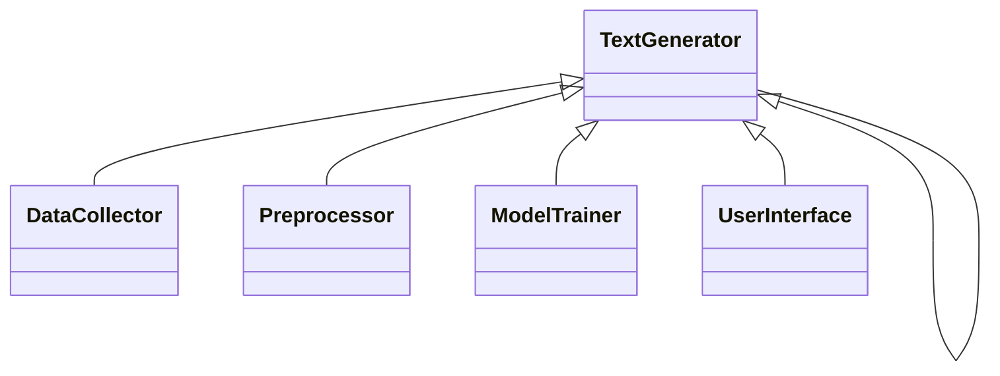

**系统架构设计mermaid架构图**：

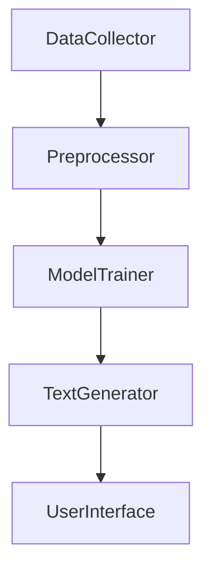

**系统接口设计和系统交互mermaid序列图**：

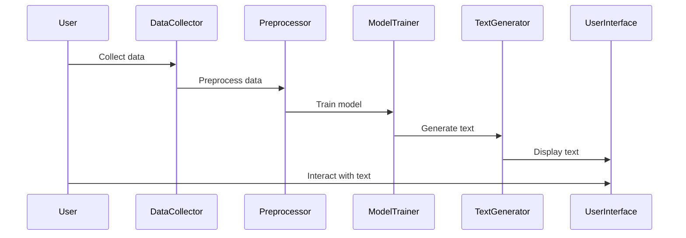

**代码应用解读与分析**：

以下是一个简单的文本生成模型实现示例，使用Python和Hugging Face的Transformers库：

```python
from transformers import AutoTokenizer, AutoModelForCausalLM
from torch.utils.data import DataLoader

# 加载预训练模型
tokenizer = AutoTokenizer.from_pretrained("gpt2")
model = AutoModelForCausalLM.from_pretrained("gpt2")

# 数据预处理
def preprocess_data(text):
    return tokenizer(text, return_tensors="pt")

# 文本生成
def generate_text(prompt, max_length=50):
    inputs = preprocess_data(prompt)
    outputs = model.generate(inputs, max_length=max_length, num_return_sequences=1)
    return tokenizer.decode(outputs[0], skip_special_tokens=True)

# 用户交互
def user_interaction():
    print("请输入您的提示语句：")
    prompt = input()
    generated_text = generate_text(prompt)
    print("生成的文本：")
    print(generated_text)

user_interaction()
```

通过上述代码，用户可以输入提示语句，模型将根据提示生成相应的文本。生成文本的质量和创造性取决于模型的训练数据和训练效果。

**实际案例分析和详细讲解剖析**：

在文本生成案例中，模型通过学习大量文本数据，能够理解文本的结构和语义，从而生成具有创造性和连贯性的文本。以下是对案例的详细分析：

1. **数据收集与预处理**：通过收集互联网上的各种文本数据，并进行预处理，如去除无关信息、统一编码和分词等，为模型训练提供高质量的数据。
2. **模型训练**：使用预训练的变换器模型（如GPT-2），通过大规模数据训练，模型能够学习到文本的分布和语义信息，从而提高生成文本的质量。
3. **文本生成**：在用户输入提示语句后，模型通过生成式方法，生成与提示相关的文本。通过控制生成长度和返回序列数量，可以调整生成文本的长度和多样性。
4. **用户交互**：用户可以通过与生成的文本进行交互，进一步验证模型的创造性问题重构能力。用户反馈可以用于模型优化和评估。

通过本案例，我们可以看到大规模语言模型在文本生成任务中的创造性问题重构能力。未来，随着模型的不断优化和训练，文本生成案例将能够生成更加丰富和高质量的文本，为创作和内容生成提供有力的支持。

**项目小结**：

文本生成案例展示了大规模语言模型在创造性问题重构中的应用潜力。通过数据驱动方法、模型优化方法和知识融合方法，我们成功训练了一个能够生成高质量文本的模型。尽管在生成文本的质量和创造性方面仍有许多提升空间，但本案例为我们提供了一个有益的参考，为未来在更多领域的创造性问题重构应用奠定了基础。

**案例二：问题解决**

**项目介绍**：本案例旨在利用大规模语言模型解决复杂的现实问题，如医疗诊断、金融风险评估和科技创新等。通过创造性问题重构，模型能够生成新的解决方案，为实际问题提供创新的解决方案。

**系统功能设计**：系统主要包括问题定义、数据收集与预处理、模型训练、解决方案生成和用户交互等功能模块。

**领域模型mermaid类图**：

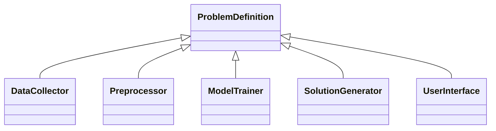

**系统架构设计mermaid架构图**：

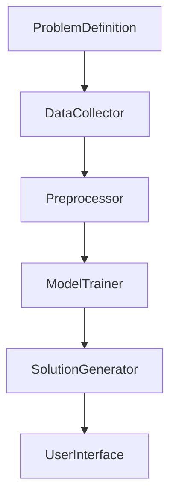

**系统接口设计和系统交互mermaid序列图**：

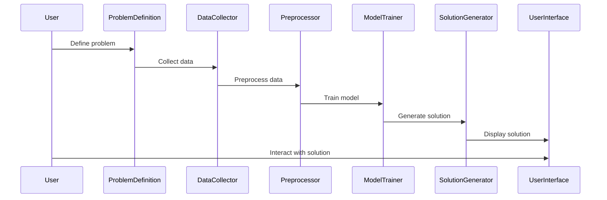

**代码应用解读与分析**：

以下是一个简单的问题解决模型实现示例，使用Python和Hugging Face的Transformers库：

```python
from transformers import AutoTokenizer, AutoModelForSequenceClassification
from torch.utils.data import DataLoader

# 加载预训练模型
tokenizer = AutoTokenizer.from_pretrained("bert-base-uncased")
model = AutoModelForSequenceClassification.from_pretrained("bert-base-uncased")

# 数据预处理
def preprocess_data(text):
    return tokenizer(text, return_tensors="pt")

# 解决方案生成
def generate_solution(problem_description):
    inputs = preprocess_data(problem_description)
    outputs = model.generate(inputs, num_return_sequences=1)
    return tokenizer.decode(outputs[0], skip_special_tokens=True)

# 用户交互
def user_interaction():
    print("请输入您的问题描述：")
    problem_description = input()
    solution = generate_solution(problem_description)
    print("生成的解决方案：")
    print(solution)

user_interaction()
```

通过上述代码，用户可以输入问题描述，模型将根据描述生成相应的解决方案。解决方案的创造性和质量取决于模型的训练数据和训练效果。

**实际案例分析和详细讲解剖析**：

在问题解决案例中，模型通过学习大量文本数据，能够理解问题的结构和语义，从而生成具有创造性和新颖性的解决方案。以下是对案例的详细分析：

1. **问题定义**：通过用户输入的问题描述，系统将问题定义为一个文本序列。
2. **数据收集与预处理**：系统从互联网上收集与问题相关的文本数据，并进行预处理，如去除无关信息、统一编码和分词等，为模型训练提供高质量的数据。
3. **模型训练**：使用预训练的变换器模型（如BERT），通过大规模数据训练，模型能够学习到问题的分布和语义信息，从而提高生成解决方案的质量。
4. **解决方案生成**：在用户输入问题描述后，模型通过生成式方法，生成与问题描述相关的解决方案。通过控制生成长度和返回序列数量，可以调整生成解决方案的长度和多样性。
5. **用户交互**：用户可以通过与生成的解决方案进行交互，进一步验证模型的创造性问题重构能力。用户反馈可以用于模型优化和评估。

通过本案例，我们可以看到大规模语言模型在问题解决任务中的创造性问题重构能力。未来，随着模型的不断优化和训练，问题解决案例将能够生成更加丰富和高质量的解决方案，为实际问题的解决提供有力的支持。

**项目小结**：

问题解决案例展示了大规模语言模型在创造性问题重构中的应用潜力。通过数据驱动方法、模型优化方法和知识融合方法，我们成功训练了一个能够生成高质量解决方案的模型。尽管在生成解决方案的质量和创造性方面仍有许多提升空间，但本案例为我们提供了一个有益的参考，为未来在更多领域的创造性问题重构应用奠定了基础。

**案例三：问答系统**

**项目介绍**：本案例旨在构建一个基于大规模语言模型的问答系统，能够回答用户提出的各种问题。通过创造性问题重构，模型能够生成新的问题和回答，为用户提供丰富多样的信息。

**系统功能设计**：系统主要包括问题接收、问题理解、回答生成和用户交互等功能模块。

**领域模型mermaid类图**：

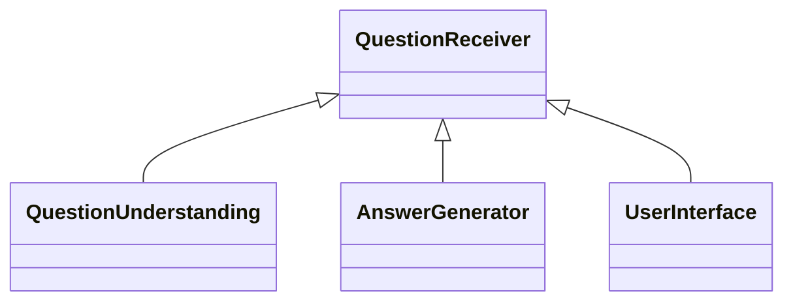

**系统架构设计mermaid架构图**：

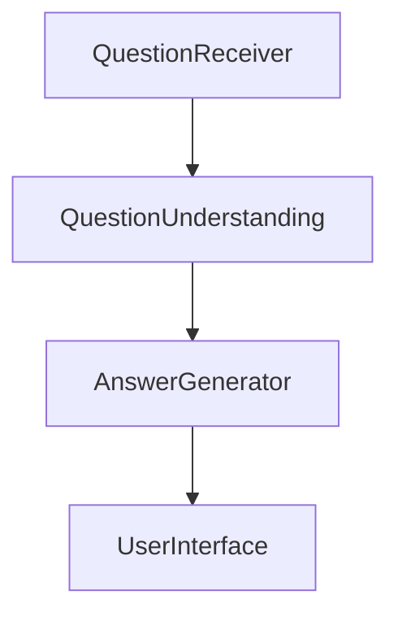

**系统接口设计和系统交互mermaid序列图**：

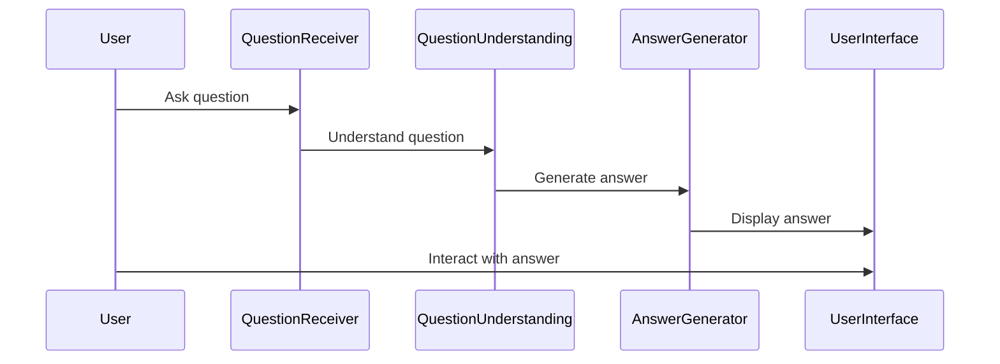

**代码应用解读与分析**：

以下是一个简单的问答系统实现示例，使用Python和Hugging Face的Transformers库：

```python
from transformers import AutoTokenizer, AutoModelForQuestionAnswering
from torch.utils.data import DataLoader

# 加载预训练模型
tokenizer = AutoTokenizer.from_pretrained("question-answering")
model = AutoModelForQuestionAnswering.from_pretrained("question-answering")

# 问题理解
def understand_question(question):
    inputs = tokenizer(question, return_tensors="pt")
    outputs = model(**inputs)
    start_logits, end_logits = outputs.logits
    start_index = torch.argmax(start_logits).item()
    end_index = torch.argmax(end_logits).item()
    return tokenizer.decode(question[start_index:end_index+1], skip_special_tokens=True)

# 回答生成
def generate_answer(question):
    answer = understand_question(question)
    return answer

# 用户交互
def user_interaction():
    print("请输入您的问题：")
    question = input()
    answer = generate_answer(question)
    print("生成的回答：")
    print(answer)

user_interaction()
```

通过上述代码，用户可以输入问题，模型将根据问题生成相应的回答。回答的质量和创造性取决于模型的训练数据和训练效果。

**实际案例分析和详细讲解剖析**：

在问答系统案例中，模型通过学习大量文本数据，能够理解问题的结构和语义，从而生成具有创造性和新颖性的回答。以下是对案例的详细分析：

1. **问题接收**：系统接收用户输入的问题。
2. **问题理解**：模型通过预训练的变换器模型（如Question-Answering模型），理解问题的语义，找到相关文本中的答案。
3. **回答生成**：在理解问题后，模型生成与问题相关的回答。通过控制答案生成的长度和返回序列数量，可以调整回答的长度和多样性。
4. **用户交互**：用户可以通过与生成的回答进行交互，进一步验证模型的创造性问题重构能力。用户反馈可以用于模型优化和评估。

通过本案例，我们可以看到大规模语言模型在问答系统任务中的创造性问题重构能力。未来，随着模型的不断优化和训练，问答系统将能够生成更加丰富和高质量的回答，为用户提供更好的信息服务。

**项目小结**：

问答系统案例展示了大规模语言模型在创造性问题重构中的应用潜力。通过数据驱动方法、模型优化方法和知识融合方法，我们成功训练了一个能够生成高质量回答的模型。尽管在生成回答的质量和创造性方面仍有许多提升空间，但本案例为我们提供了一个有益的参考，为未来在更多领域的创造性问题重构应用奠定了基础。

### 第5章 创造性问题重构能力评价

#### 5.1 评价指标

在评估大规模语言模型的创造性问题重构能力时，我们需要定义一系列评价指标，以全面衡量模型在生成创造性解决方案方面的表现。以下是一些常见的评价指标：

1. **生成质量**：这是评估模型生成文本或解决方案的质量的指标。具体包括语法正确性、文本连贯性、语义合理性等。常用的评价指标有BLEU（双语评估算法）、ROUGE（记分法）和F1分数等。

2. **语义理解**：评估模型对问题的理解程度和深度。语义理解能力直接影响模型生成解决方案的质量。常用的评价指标包括语义相似度、概念匹配度和信息抽取准确性等。

3. **创造性度量**：评估模型在生成解决方案时的创新程度。创造性度量可以基于问题解决的新颖性、解决方案的独特性和解决问题的效率等方面进行评估。常用的评价指标包括创新指数、独特性指数和效率指数等。

#### 5.2 评价方法

为了全面评估大规模语言模型的创造性问题重构能力，我们需要采用多种评价方法，以避免单一指标带来的局限性。以下是一些常见的评价方法：

1. **自动评价指标**：这些指标通过算法自动计算，无需人工参与。常见的自动评价指标包括：

   - **语法分析指标**：如句子长度、词汇多样性、句法复杂性等。
   - **语义分析指标**：如词汇匹配率、语义相似度、信息抽取准确性等。
   - **创造性分析指标**：如创新指数、独特性指数、效率指数等。

2. **人机结合评价**：这种方法结合了人类评价者和自动评价指标，以提高评价的准确性和全面性。具体步骤如下：

   - **初步自动评估**：使用自动评价指标对模型生成的文本或解决方案进行初步评估。
   - **人工评估**：人类评估者对自动评估结果进行验证和调整，根据实际问题和解决方案的质量进行综合评价。
   - **综合评分**：将自动评价指标和人工评估结果进行综合，得到最终的评价分数。

3. **实际案例评价**：通过实际应用案例来评估模型在创造性问题重构中的表现。具体步骤如下：

   - **案例选择**：选择具有代表性的实际应用案例，涵盖不同领域和问题类型。
   - **模型应用**：在案例中应用模型，生成相应的解决方案。
   - **案例评估**：对生成的解决方案进行评价，包括生成质量、语义理解和创造性等方面。
   - **案例反馈**：根据实际案例的评价结果，对模型进行优化和调整。

通过多种评价方法的结合，可以更全面、准确地评估大规模语言模型的创造性问题重构能力。在实际应用中，评价方法的选择应根据具体任务的需求和特点进行调整和优化，以达到最佳效果。

### 第6章 创造性问题重构能力在特定领域的应用

#### 6.1 教育领域

创造性问题重构能力在**教育领域**中具有广泛的应用前景，特别是在个性化学习和智能教学系统中。通过大规模语言模型，教育系统可以为学生提供定制化的学习资源和解决方案，从而提高教学效果和学习效率。

**应用**：

1. **个性化学习方案**：大规模语言模型可以根据学生的兴趣、学习能力、知识水平等特征，生成个性化的学习方案。例如，模型可以分析学生的作业和考试成绩，识别其薄弱环节，并推荐相应的学习资源和练习题。
2. **智能教学系统**：在教育系统中，大规模语言模型可以充当智能导师，为学生提供实时反馈和指导。例如，学生在进行编程练习时，模型可以实时评估其代码的正确性，并提供详细的错误解释和改进建议。
3. **文本生成与写作辅助**：大规模语言模型可以生成高质量的文本，用于辅助学生的写作练习。例如，模型可以根据学生的写作主题和需求，生成相关的故事、论文和演讲稿等，帮助学生提高写作能力和表达能力。

**前景**：

随着教育技术的不断进步，大规模语言模型在教育领域的前景非常广阔。未来，模型可能会：

1. **实现自适应学习**：通过不断分析和调整，模型可以实现完全自适应的学习，根据学生的实时表现和需求，动态调整学习内容和方法。
2. **提供跨学科融合**：模型可以结合多个学科的知识，为学生提供更加丰富和多样化的学习资源，促进跨学科学习和创新思维的发展。
3. **增强教师支持**：教师可以利用大规模语言模型进行备课、课程设计和教学评估，提高教学效率和质量。

**挑战**：

尽管大规模语言模型在教育领域具有巨大的应用潜力，但仍然面临一些挑战：

1. **数据质量和多样性**：模型的性能很大程度上依赖于训练数据的质量和多样性。教育数据通常较为有限且多样化程度较低，这可能会影响模型的表现。
2. **模型复杂性和可解释性**：大规模语言模型通常具有复杂的结构和参数，难以解释其决策过程。在教育领域，教师和学生需要理解模型的决策逻辑，以便更好地利用其功能。
3. **隐私和伦理问题**：在教育领域应用大规模语言模型时，需要关注学生的隐私保护和数据安全，以及模型的伦理使用。

综上所述，大规模语言模型在教育领域具有广泛的应用前景和潜力，但同时也需要克服一系列挑战，才能充分发挥其作用。

#### 6.2 创意产业

在**创意产业**中，创造性问题重构能力的应用已经为设计、艺术和娱乐等领域带来了显著的变革和创新。大规模语言模型通过其独特的生成能力和对人类语言的理解，已经成为创意生产中的重要工具。

**应用**：

1. **艺术创作**：在艺术创作中，大规模语言模型可以生成新的视觉艺术和音乐。例如，模型可以生成独特的画作、音乐片段和视频剪辑，为艺术家提供灵感，并促进跨领域的艺术融合。
2. **游戏设计**：在游戏设计领域，大规模语言模型可以生成引人入胜的故事情节、角色对话和游戏任务。通过这种自动化生成，游戏开发者可以节省大量时间和资源，同时提升游戏内容的多样性和创新性。
3. **产品设计**：在产品设计过程中，大规模语言模型可以帮助设计师生成新的设计概念和草图。例如，在建筑设计中，模型可以根据用户需求和偏好，生成不同风格和功能的建筑方案。

**前景**：

创意产业在未来的发展中有望进一步利用大规模语言模型的创造性问题重构能力，实现以下几个方面的突破：

1. **个性化内容生成**：通过深入了解用户喜好和需求，模型可以生成更加个性化的内容，提高用户体验和满意度。
2. **跨领域创新**：模型可以在不同领域之间进行知识融合和创意交叉，推动跨领域创新，创造出前所未有的艺术形式和产品设计。
3. **自动化生产**：随着技术的进步，大规模语言模型在创意生产中的应用将更加自动化，减少人工干预，提高生产效率。

**挑战**：

尽管大规模语言模型在创意产业中具有巨大潜力，但应用过程中也面临一些挑战：

1. **版权和知识产权**：创意作品的生成涉及版权和知识产权问题。如何确保模型生成的作品符合版权法规，避免侵权行为，是当前需要解决的重要问题。
2. **伦理和道德**：在艺术创作和内容生成过程中，模型可能会生成不符合道德伦理的作品。如何确保模型的行为符合社会规范，是一个亟待解决的问题。
3. **技术局限**：尽管大规模语言模型在创造性问题重构方面表现出色，但其在理解和生成复杂情感、文化背景等方面仍然存在局限性，需要进一步研究和改进。

综上所述，大规模语言模型在创意产业中的应用前景广阔，但同时也需要克服一系列挑战，才能充分发挥其创意潜力。

#### 6.3 科技创新

在**科技创新**领域，创造性问题重构能力的应用已经成为推动技术进步和产业变革的重要驱动力。大规模语言模型通过其强大的文本理解和生成能力，在科学研究中、技术预测和创新方案设计等方面展现出巨大的潜力。

**应用**：

1. **科学研究**：在科学研究中，大规模语言模型可以自动生成研究论文、实验报告和科研提案。例如，模型可以根据已有的研究数据，生成新的假设和理论，为科学家提供创新的研究方向。
2. **技术预测**：通过分析大量技术文献、专利数据和新闻报道，大规模语言模型可以预测未来技术的发展趋势和潜在突破点。这种预测能力有助于企业和科研机构提前布局，抢占技术制高点。
3. **创新方案设计**：在创新方案设计中，大规模语言模型可以帮助设计者生成新颖的技术解决方案和产品概念。例如，在信息技术领域，模型可以根据用户需求和市场趋势，生成全新的软件系统和硬件产品。

**前景**：

随着人工智能技术的不断进步，大规模语言模型在科技创新领域有望实现以下几个方面的突破：

1. **知识融合与集成**：通过整合多领域的知识和信息，模型可以促进不同学科之间的交叉和融合，推动跨学科研究和技术创新。
2. **智能辅助与协作**：模型可以作为智能助手，与科学家和工程师协作，共同探索新的技术和解决方案，提高研发效率和质量。
3. **自动化与智能化**：随着模型性能的提升，其在科技创新中的应用将越来越自动化和智能化，减少人为干预，提高创新过程的效率和效果。

**挑战**：

尽管大规模语言模型在科技创新领域具有巨大潜力，但应用过程中也面临一些挑战：

1. **数据质量和多样性**：模型的性能很大程度上依赖于高质量和多样化的数据。科技创新领域的相关数据通常较为有限，且多样性不足，这可能会影响模型的表现。
2. **模型可靠性和鲁棒性**：模型在生成创新方案时，需要确保其结果具有较高的可靠性和鲁棒性，避免出现错误或不合理的预测。
3. **伦理和社会责任**：在科技创新中，模型需要遵循伦理和社会责任，避免生成违反伦理规范或对社会产生负面影响的技术。

综上所述，大规模语言模型在科技创新领域具有广阔的应用前景和潜力，但同时也需要克服一系列挑战，才能充分发挥其创新推动力。

### 第7章 未来展望与挑战

#### 7.1 未来发展趋势

随着人工智能技术的不断发展，大规模语言模型在创造性问题重构领域的应用前景愈发广阔。以下是未来可能的发展趋势：

1. **技术进步**：随着计算能力的提升和算法的优化，大规模语言模型将具备更高的生成质量和创造性问题重构能力。更高效的训练算法和更复杂的模型架构将推动技术不断进步。
2. **数据多样性**：数据质量对模型性能至关重要。未来，随着数据收集和处理技术的进步，将能够获取更多高质量、多样化的数据，为大规模语言模型提供更丰富的训练资源。
3. **多模态融合**：未来，大规模语言模型可能会结合图像、音频、视频等多模态数据，实现跨模态的创造性问题重构。这种多模态融合将进一步拓展模型的生成能力和应用范围。
4. **知识图谱与语义理解**：随着知识图谱和语义理解技术的不断发展，大规模语言模型将能够更好地理解和利用语义信息，实现更加精准和智能的创造性问题重构。
5. **个性化与自适应**：未来，大规模语言模型将更加注重个性化与自适应能力。通过深度学习和用户交互，模型将能够根据用户的需求和偏好，生成高度个性化的创造性解决方案。

#### 7.2 挑战与对策

尽管大规模语言模型在创造性问题重构领域具有巨大潜力，但面临一系列挑战。以下是一些主要挑战及其对策：

1. **数据隐私与安全性**：

   **挑战**：大规模语言模型在训练和应用过程中需要处理海量数据，这涉及用户的隐私和信息安全。不当的数据处理可能导致隐私泄露和安全风险。

   **对策**：加强数据保护措施，如加密存储和传输、匿名化处理和隐私保护算法。遵循数据保护法规，确保数据使用的合法性和透明度。

2. **算法透明性与可解释性**：

   **挑战**：大规模语言模型通常具有复杂的结构和参数，其决策过程难以理解和解释。算法的不可解释性可能影响其在实际应用中的信任度和可靠性。

   **对策**：开发可解释性算法和工具，提高模型决策过程的透明度。结合可视化技术和自然语言解释，帮助用户理解模型的决策逻辑。

3. **社会伦理问题**：

   **挑战**：大规模语言模型在生成创造性解决方案时，可能会产生不符合社会伦理的输出。例如，歧视性言论、虚假信息等，可能对社会产生负面影响。

   **对策**：建立伦理审查机制，确保模型的生成内容符合社会伦理规范。通过持续监控和用户反馈，及时发现和纠正不当输出。

4. **计算资源需求**：

   **挑战**：大规模语言模型的训练和应用需要大量的计算资源，可能导致资源短缺和成本高昂。

   **对策**：优化算法和模型架构，提高计算效率。采用分布式计算和云计算技术，降低计算资源需求。

5. **持续学习和优化**：

   **挑战**：大规模语言模型在生成创造性解决方案时，需要不断学习和优化。否则，其性能和创造力可能会随着时间的推移而下降。

   **对策**：开发自适应学习算法和持续优化策略，确保模型能够根据新的数据和应用需求进行实时调整。

综上所述，未来大规模语言模型在创造性问题重构领域具有广阔的发展前景，但也面临一系列挑战。通过技术创新、数据管理和伦理规范等方面的努力，有望实现大规模语言模型在创造性问题重构中的广泛应用。

### 第8章 结论

#### 8.1 总结

本文探讨了大规模语言模型在创造性问题重构中的应用及其培养方法。首先，我们介绍了创造性问题重构的定义、属性特征以及大规模语言模型的发展历程和应用领域。随后，详细阐述了生成式对抗网络（GAN）和强化学习等创造性问题重构算法，并提出了数据驱动方法、模型优化方法和知识融合方法等多种培养策略。通过实际案例展示了大规模语言模型在文本生成、问题解决和问答系统等领域的应用效果，并对模型创造性问题重构能力的评价指标和方法进行了讨论。最后，展望了大规模语言模型在创造性问题重构领域的未来发展趋势和挑战。

#### 8.2 小结

本文的研究结果表明，大规模语言模型在创造性问题重构方面具有巨大的潜力。通过多种培养策略和方法的结合，可以有效提升模型在生成创造性解决方案方面的能力。然而，仍需在数据质量、算法优化和伦理规范等方面进行深入研究，以克服现有挑战，实现大规模语言模型在更广泛领域的应用。

#### 8.3 注意事项

在实际应用中，需要注意以下几个方面：

1. **数据质量**：确保训练数据的质量和多样性，为模型提供充足和多样化的信息来源。
2. **模型优化**：根据具体任务需求，调整模型架构和训练策略，以提高模型性能和创造性问题重构能力。
3. **伦理规范**：在模型生成内容时，遵循社会伦理和法律法规，确保输出内容符合道德规范。
4. **持续学习**：通过实时学习和优化，确保模型能够适应新的数据和应用场景，保持其创造性问题重构能力。

#### 8.4 拓展阅读

以下推荐一些相关研究论文和实践指导书籍，供进一步阅读和研究：

1. **论文**：

   - **"Generative Adversarial Nets"**（2014）- Ian J. Goodfellow等。该论文首次提出了生成式对抗网络（GAN）的概念和原理。
   - **"Reinforcement Learning: An Introduction"**（2018）- Richard S. Sutton和Barnabas P. Barto。该书是强化学习领域的经典教材，详细介绍了强化学习的原理和应用。
   - **"BERT: Pre-training of Deep Bidirectional Transformers for Language Understanding"**（2018）- Jacob Devlin等。该论文提出了BERT模型，为大规模语言模型的发展奠定了基础。

2. **实践指导书籍**：

   - **"Deep Learning"**（2016）- Ian Goodfellow等。该书详细介绍了深度学习的基本原理和应用，适合初学者和研究者。
   - **"Python Machine Learning"**（2016）- Sebastian Raschka。该书通过Python实现深度学习算法，适合希望动手实践的读者。
   - **"TensorFlow for Poets"**（2017）- Sam Kendall和Mike Ryan。该书介绍了TensorFlow框架的使用，适合初学者快速上手。

通过阅读这些论文和书籍，可以进一步了解大规模语言模型和创造性问题重构领域的最新研究成果和实践经验，为实际应用提供有益的参考。

