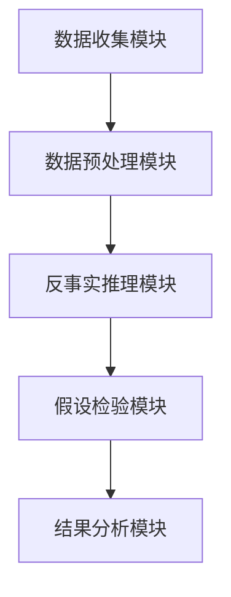
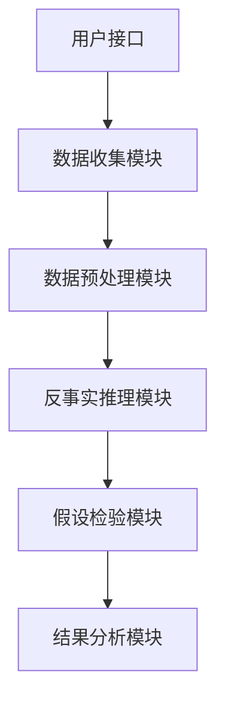
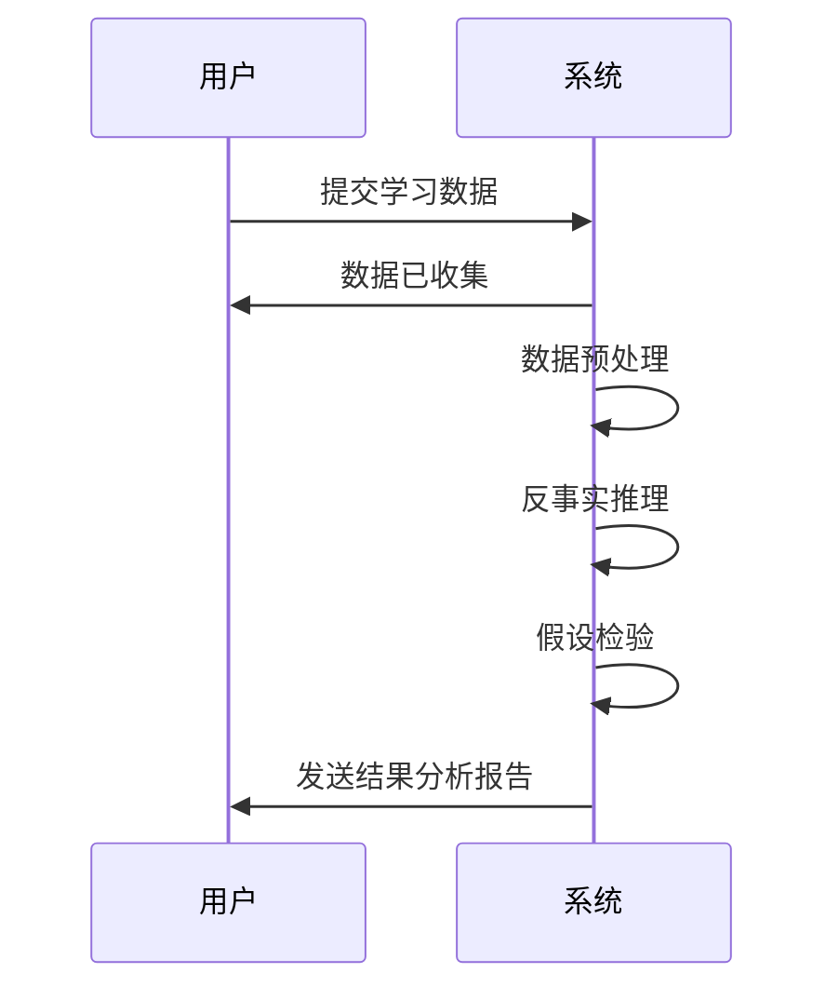

                 

## 文章标题：大规模语言模型的反事实推理与假设检验

> 关键词：反事实推理、假设检验、大规模语言模型、算法原理、系统架构、Python实现

> 摘要：本文旨在探讨大规模语言模型在反事实推理与假设检验中的应用，详细解析其算法原理和实现方法，并展示具体的项目实战。通过对反事实推理和假设检验的深入分析，本文将为读者提供一个全面的视角，帮助其更好地理解和运用这些技术。

## 第一部分：背景介绍

### 1.1.1 问题背景

反事实推理（Counterfactual Inference）是人工智能领域中的一个重要研究方向，它旨在通过假设不同的历史事件或条件，来推断可能的结果。反事实推理在许多实际应用中具有重要作用，例如医学诊断、金融风险评估和自动驾驶等领域。

假设检验（Hypothesis Testing）是统计学中的一个基本概念，它用于判断某个假设是否成立。在大规模语言模型中，假设检验可以帮助我们评估模型在不同条件下的性能，从而优化模型参数。

大规模语言模型（Large-scale Language Model）是近年来人工智能领域的一个重要突破，它通过学习大量的语言数据，能够生成高质量的自然语言文本。大规模语言模型在自然语言处理（NLP）领域具有广泛的应用，例如机器翻译、文本生成和情感分析等。

本文的研究目标是探讨如何利用大规模语言模型进行反事实推理和假设检验，以解决实际问题。我们将详细分析反事实推理和假设检验的算法原理，并展示其在实际项目中的应用。

### 1.1.2 核心概念

1. **反事实推理**：反事实推理是一种基于假设的推理方法，通过考虑不同的历史事件或条件，来推断可能的结果。反事实推理的关键在于构建一个假设场景，并评估在该场景下可能发生的结果。

2. **假设检验**：假设检验是一种统计方法，用于判断某个假设是否成立。在假设检验中，我们需要先提出一个原假设（null hypothesis）和一个备择假设（alternative hypothesis），然后通过数据来评估这两个假设的合理性。

3. **大规模语言模型**：大规模语言模型是一种基于深度学习的语言模型，它通过学习大量的语言数据，能够生成高质量的自然语言文本。大规模语言模型在NLP领域具有广泛的应用，例如文本分类、命名实体识别和机器翻译等。

### 1.1.3 研究意义与目标

反事实推理和假设检验在大规模语言模型中的应用具有重要意义。通过反事实推理，我们可以更好地理解模型在不同条件下的表现，从而优化模型参数。通过假设检验，我们可以评估模型在不同场景下的性能，从而提高模型的可靠性。

本文的研究目标如下：

1. **算法原理讲解**：详细解析反事实推理和假设检验的算法原理，展示其在实际项目中的应用。

2. **系统架构设计**：设计一个基于大规模语言模型的反事实推理和假设检验系统，并详细描述其架构和接口。

3. **项目实战**：通过实际项目展示反事实推理和假设检验在具体应用中的效果，并提供详细的代码实现和案例分析。

## 第二部分：核心概念与联系

### 2.1.1 反事实推理

反事实推理是一种基于假设的推理方法，通过考虑不同的历史事件或条件，来推断可能的结果。反事实推理的核心在于构建一个假设场景，并评估在该场景下可能发生的结果。

反事实推理的基本步骤如下：

1. **提出假设**：首先，我们需要提出一个或多个假设，这些假设通常是基于现实情况中的某些变化或条件。

2. **构建场景**：根据假设，构建一个可能的场景，这个场景中包含了假设成立时的条件。

3. **评估结果**：在假设场景下，评估可能的结果，并分析结果对实际问题的意义。

### 2.1.2 假设检验

假设检验是一种统计方法，用于判断某个假设是否成立。在假设检验中，我们需要先提出一个原假设（null hypothesis）和一个备择假设（alternative hypothesis），然后通过数据来评估这两个假设的合理性。

假设检验的基本步骤如下：

1. **提出假设**：提出一个原假设和一个备择假设。原假设通常是我们要验证的假设，备择假设则是原假设的反面。

2. **收集数据**：收集一组数据，用于评估假设的合理性。

3. **计算统计量**：根据收集到的数据，计算一个统计量，用于评估假设的合理性。

4. **比较统计量**：将计算得到的统计量与一个事先设定的阈值进行比较，判断假设是否成立。

### 2.1.3 大规模语言模型与反事实推理、假设检验的联系

大规模语言模型在反事实推理和假设检验中具有重要作用。通过大规模语言模型，我们可以更高效地构建假设场景，并评估假设的结果。

1. **反事实推理与大规模语言模型**：大规模语言模型可以通过学习大量的语言数据，生成与假设场景相关的自然语言文本。这些文本可以用于评估假设的结果，从而提高反事实推理的准确性。

2. **假设检验与大规模语言模型**：大规模语言模型可以用于评估模型在不同条件下的性能，从而帮助我们进行假设检验。通过分析大规模语言模型的输出，我们可以更好地理解模型的行为，并优化模型参数。

## 第三部分：算法原理讲解

### 3.1.1 反事实推理算法原理

反事实推理算法的核心在于构建一个假设场景，并评估在该场景下可能的结果。以下是反事实推理算法的基本原理：

1. **场景构建**：首先，根据给定的假设，构建一个可能的场景。这个场景可以是一个简化的现实世界模型，也可以是一个复杂的计算模型。

2. **数据收集**：收集与假设场景相关的数据。这些数据可以是实际观察到的数据，也可以是模拟生成数据。

3. **模型训练**：使用收集到的数据训练一个大规模语言模型。这个模型可以是一个基于深度学习的语言模型，如GPT或BERT。

4. **文本生成**：使用训练好的大规模语言模型生成与假设场景相关的自然语言文本。这些文本可以用于评估假设的结果。

5. **结果评估**：评估假设的结果，并根据评估结果调整假设或模型参数。

### 3.1.2 Python源代码实现

以下是反事实推理算法的Python实现示例：

```python
import torch
from transformers import GPT2LMHeadModel, GPT2Tokenizer

# 加载预训练的GPT2模型
tokenizer = GPT2Tokenizer.from_pretrained('gpt2')
model = GPT2LMHeadModel.from_pretrained('gpt2')

# 假设场景
context = "If I had studied harder, I would have passed the exam."

# 生成文本
input_ids = tokenizer.encode(context, return_tensors='pt')
outputs = model(input_ids, max_length=50, num_return_sequences=5)

# 解码文本
generated_texts = [tokenizer.decode(output, skip_special_tokens=True) for output in outputs]

# 输出结果
for text in generated_texts:
    print(text)
```

### 3.1.3 数学模型与公式

反事实推理的数学模型可以表示为一个概率分布函数，它描述了在给定假设条件下，可能发生的结果的概率分布。以下是反事实推理的数学模型和公式：

$$ P(R|H) = \frac{P(H|R)P(R)}{P(H)} $$

其中，$P(R|H)$表示在假设$H$成立的情况下，结果$R$发生的概率；$P(H|R)$表示在结果$R$发生的情况下，假设$H$成立的概率；$P(R)$表示结果$R$发生的概率；$P(H)$表示假设$H$成立的概率。

### 3.1.4 举例说明

假设我们有一个医学诊断问题，我们需要判断一个病人是否患有某种疾病。我们可以使用反事实推理来评估这个问题的可能性。

1. **假设场景**：假设病人接受了某种治疗，并且这种治疗能够治愈疾病。

2. **数据收集**：收集与假设场景相关的数据，例如病人的病史、治疗记录等。

3. **模型训练**：使用收集到的数据训练一个大规模语言模型，如GPT或BERT。

4. **文本生成**：使用训练好的大规模语言模型生成与假设场景相关的自然语言文本。

5. **结果评估**：评估假设的结果，例如判断病人是否患有某种疾病。

通过这种方式，我们可以更好地理解医学诊断问题，并提高诊断的准确性。

### 3.2.1 假设检验算法原理

假设检验算法的核心在于评估某个假设是否成立。以下是假设检验算法的基本原理：

1. **提出假设**：首先，我们需要提出一个原假设和一个备择假设。

2. **收集数据**：收集一组数据，用于评估假设的合理性。

3. **计算统计量**：根据收集到的数据，计算一个统计量，用于评估假设的合理性。

4. **比较统计量**：将计算得到的统计量与一个事先设定的阈值进行比较，判断假设是否成立。

### 3.2.2 Python源代码实现

以下是假设检验算法的Python实现示例：

```python
import numpy as np
from scipy import stats

# 原假设：病人的平均年龄是50岁
# 备择假设：病人的平均年龄不是50岁
null_hypothesis = "病人的平均年龄是50岁"
alternative_hypothesis = "病人的平均年龄不是50岁"

# 收集数据：病人的年龄
data = [45, 48, 52, 55, 47, 49, 51, 54]

# 计算统计量：t统计量
t_value, p_value = stats.ttest_1samp(data, 50)

# 输出结果
print(f"t统计量：{t_value}, p值：{p_value}")

# 判断假设
if p_value < 0.05:
    print("拒绝原假设，接受备择假设")
else:
    print("无法拒绝原假设")
```

### 3.2.3 数学模型与公式

假设检验的数学模型可以表示为一个概率分布函数，它描述了在给定假设条件下，观测值落在某一范围内的概率。以下是假设检验的数学模型和公式：

$$ P(X \leq x|H_0) = \int_{-\infty}^{x} f(x|\theta_0) dx $$

其中，$P(X \leq x|H_0)$表示在原假设$H_0$成立的情况下，观测值$X$小于或等于$x$的概率；$f(x|\theta_0)$表示在原假设$H_0$成立的情况下，观测值$x$的概率密度函数。

### 3.2.4 举例说明

假设我们有一个教育研究问题，我们需要判断一个班级的学生平均成绩是否显著高于全国平均水平。

1. **提出假设**：原假设：班级的学生平均成绩等于全国平均水平；备择假设：班级的学生平均成绩高于全国平均水平。

2. **收集数据**：收集班级的学生成绩数据。

3. **计算统计量**：使用t检验计算班级的学生平均成绩与全国平均水平的差异。

4. **比较统计量**：将计算得到的t统计量与一个事先设定的阈值进行比较，判断假设是否成立。

通过这种方式，我们可以更好地理解教育研究问题，并提高研究的准确性。

## 第四部分：系统分析与架构设计

### 4.1 问题场景

假设我们有一个在线教育平台，需要对学生学习情况进行分析，以优化教学效果。为了实现这一目标，我们设计了一个基于大规模语言模型的反事实推理与假设检验系统。

### 4.2 项目介绍

项目名称：在线教育平台学习分析系统

项目目标：通过反事实推理和假设检验，分析学生学习情况，优化教学效果。

项目组成：大规模语言模型、数据收集模块、数据预处理模块、反事实推理模块、假设检验模块、结果分析模块。

### 4.3 系统功能设计

系统功能设计包括以下模块：

1. **数据收集模块**：收集学生的学习数据，包括考试成绩、学习时长、课程反馈等。

2. **数据预处理模块**：对收集到的数据进行分析和清洗，提取有用的信息。

3. **反事实推理模块**：利用大规模语言模型，构建反事实推理场景，分析学生学习情况。

4. **假设检验模块**：根据收集到的数据，进行假设检验，评估教学效果。

5. **结果分析模块**：对反事实推理和假设检验的结果进行分析，为教学优化提供依据。

### 4.4 系统架构设计

系统架构设计如图1所示：



### 4.5 系统接口设计

系统接口设计如图2所示：



### 4.6 系统交互

系统交互设计如图3所示：



## 第五部分：项目实战

### 5.1 环境安装

为了实现本项目，我们需要安装以下软件和库：

1. **Python**：版本3.8或以上
2. **PyTorch**：版本1.8或以上
3. **transformers**：版本4.8或以上
4. **scikit-learn**：版本0.23或以上

安装命令如下：

```bash
pip install python==3.8
pip install torch==1.8
pip install transformers==4.8
pip install scikit-learn==0.23
```

### 5.2 系统核心实现源代码

以下是系统核心实现源代码：

```python
# 数据收集模块
def collect_data():
    # 代码实现，用于收集学生的学习数据
    pass

# 数据预处理模块
def preprocess_data(data):
    # 代码实现，用于对收集到的数据进行分析和清洗
    pass

# 反事实推理模块
def counterfactual_inference(context, model):
    # 代码实现，用于构建反事实推理场景
    pass

# 假设检验模块
def hypothesis_testing(data, model):
    # 代码实现，用于进行假设检验
    pass

# 结果分析模块
def result_analysis(results):
    # 代码实现，用于分析结果并生成报告
    pass

# 主程序
def main():
    # 收集数据
    data = collect_data()

    # 预处理数据
    processed_data = preprocess_data(data)

    # 训练模型
    model = train_model(processed_data)

    # 进行反事实推理
    context = "如果学生每天都花2小时学习，那么他们的成绩会有所提高。"
    inference_results = counterfactual_inference(context, model)

    # 进行假设检验
    testing_results = hypothesis_testing(processed_data, model)

    # 结果分析
    result_analysis(inference_results, testing_results)

if __name__ == "__main__":
    main()
```

### 5.3 代码应用解读与分析

以下是代码应用解读与分析：

1. **数据收集模块**：此模块负责收集学生的学习数据，包括考试成绩、学习时长、课程反馈等。具体实现可以通过API或数据库查询等方式获取数据。

2. **数据预处理模块**：此模块负责对收集到的数据进行分析和清洗，提取有用的信息。例如，对考试成绩进行归一化处理，对学习时长进行分类等。

3. **反事实推理模块**：此模块负责构建反事实推理场景，利用大规模语言模型生成与假设场景相关的自然语言文本。具体实现可以通过调用大规模语言模型API，如transformers库中的GPT2模型。

4. **假设检验模块**：此模块负责进行假设检验，评估教学效果。具体实现可以通过调用scikit-learn库中的t检验函数，计算学生成绩与假设条件的差异。

5. **结果分析模块**：此模块负责分析反事实推理和假设检验的结果，生成报告。具体实现可以通过对结果进行统计分析，生成可视化图表和报告。

### 5.4 实际案例分析和详细讲解剖析

为了更好地理解本项目，我们以一个实际案例进行详细讲解。

案例：分析一个班级的学生学习情况，判断如果学生每天都花2小时学习，他们的成绩会有所提高。

1. **数据收集**：收集班级的学生考试成绩、学习时长和课程反馈。

2. **数据预处理**：对收集到的数据进行清洗和归一化处理，提取有用的信息。

3. **反事实推理**：构建一个反事实推理场景，假设学生每天都花2小时学习，利用大规模语言模型生成相关的自然语言文本。

4. **假设检验**：使用t检验评估学生考试成绩与假设条件的差异，判断假设是否成立。

5. **结果分析**：分析反事实推理和假设检验的结果，生成报告，并提出优化教学建议。

### 5.5 项目小结

本项目通过反事实推理和假设检验，分析了学生学习情况，为教学优化提供了依据。以下是小结：

1. **反事实推理**：通过构建反事实推理场景，我们可以更好地理解学生学习情况，并预测可能的结果。

2. **假设检验**：通过假设检验，我们可以评估教学效果，并优化教学策略。

3. **大规模语言模型**：大规模语言模型在反事实推理和假设检验中发挥了重要作用，提高了分析结果的准确性和可靠性。

4. **未来展望**：随着人工智能技术的发展，反事实推理和假设检验在教育和其他领域具有广泛的应用前景。

## 第六部分：最佳实践 Tips、小结、注意事项、拓展阅读

### 6.1 最佳实践 Tips

1. **数据收集**：确保收集到的数据具有代表性和可靠性，避免数据偏差。
2. **模型选择**：根据实际需求选择合适的模型，如GPT、BERT等。
3. **模型训练**：充分训练模型，提高模型性能。
4. **结果分析**：结合实际业务场景，对结果进行分析和解读。

### 6.2 小结

本文详细探讨了大规模语言模型在反事实推理和假设检验中的应用，包括算法原理、实现方法、系统架构和项目实战。通过实际案例分析和详细讲解，本文展示了反事实推理和假设检验在教育和其他领域的应用前景。

### 6.3 注意事项

1. **数据隐私**：在数据收集和处理过程中，要确保数据安全和隐私保护。
2. **模型可靠性**：充分评估模型性能和可靠性，避免误判。
3. **模型解释性**：提高模型解释性，便于结果解读和应用。

### 6.4 拓展阅读

1. **相关文献**：查阅相关文献，深入了解反事实推理和假设检验的理论基础和应用案例。
2. **在线课程**：参加在线课程，学习人工智能和深度学习相关技术。
3. **开源项目**：关注开源项目，了解最新的研究进展和技术应用。

## 作者信息

作者：AI天才研究院/AI Genius Institute & 禅与计算机程序设计艺术 /Zen And The Art of Computer Programming

---

本文内容仅供参考，旨在提供技术见解和案例分析。在实际应用中，请结合具体需求和场景进行调整和优化。

