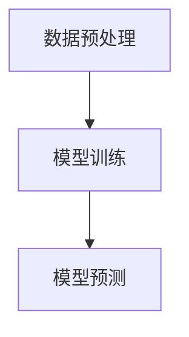
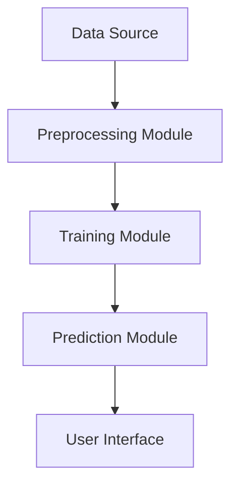

                 

# 大规模语言模型的可解释性研究

> 关键词：大规模语言模型、可解释性、自然语言处理、模型可视化、注意力机制、局部解释方法

> 摘要：本文旨在探讨大规模语言模型的可解释性研究。随着深度学习和大数据技术的发展，语言模型在自然语言处理领域取得了显著的进展。然而，这些模型通常被认为是“黑箱”，其内部工作机制对用户不透明，这使得在实际应用中存在一定的局限性。因此，研究大规模语言模型的可解释性变得至关重要。本文首先介绍了大规模语言模型的基本概念、可解释性原理以及案例分析，然后深入探讨了模型的可解释性方法，包括模型可视化、注意力机制分析、局部解释方法等，最后通过一个具体案例展示了如何应用这些方法来提高模型的可解释性。

## 第1章: 引言

### 1.1 问题背景

随着深度学习和大数据技术的迅猛发展，自然语言处理（NLP）领域迎来了革命性的变革。大规模语言模型（如GPT、BERT等）凭借其卓越的性能在文本生成、文本分类、机器翻译等任务中取得了显著的成果。然而，这些模型在带来巨大便利的同时，也带来了新的挑战。由于这些模型的结构复杂、参数众多，其内部工作机制对用户而言往往不透明，被称为“黑箱”。这意味着用户无法直观地理解模型如何处理输入数据，从而限制了模型在实际应用中的可靠性、安全性和可维护性。

### 1.2 问题描述

大规模语言模型的可解释性是指用户能够理解模型在特定输入下的工作原理和决策过程。然而，当前的研究和实践表明，大规模语言模型的可解释性仍然是一个亟待解决的问题。具体来说，本研究的核心问题包括：

1. **模型决策过程不透明**：用户无法直观地了解模型如何处理输入数据，无法解释模型对特定输入的输出结果。
2. **模型泛化能力不足**：由于模型内部结构复杂，用户难以发现和修正模型中的错误，从而影响了模型的泛化能力和可靠性。
3. **安全性和隐私性风险**：模型可能因为内部机制不透明而存在安全隐患，尤其是在涉及用户隐私数据的应用场景中。

### 1.3 问题解决

为了解决上述问题，本文提出以下问题解决方法：

1. **核心概念**：介绍大规模语言模型的基本概念，包括模型结构、训练过程、优化目标等，为后续研究奠定基础。
2. **可解释性原理**：探讨现有可解释性方法，如模型可视化、注意力机制分析、局部解释方法等，为提高模型可解释性提供理论支持。
3. **案例分析**：通过具体案例，展示如何应用这些方法来提高大规模语言模型的可解释性，验证方法的实用性和有效性。

### 1.4 边界与外延

本文主要关注文本领域的语言模型，如GPT、BERT等。此外，研究范围包括但不限于模型的可解释性评估、方法比较、算法优化等方面。研究边界主要涉及模型的内部工作机制及其对输入数据的处理过程。

### 1.5 概念结构与核心要素组成

1. **大规模语言模型**：包括模型结构、训练过程、优化目标等。
2. **可解释性方法**：包括模型可视化、注意力机制分析、局部解释方法等。
3. **案例分析**：通过具体案例，展示如何应用可解释性方法。

## 第2章: 核心概念与联系

### 2.1 大规模语言模型原理

#### 2.1.1 模型结构

大规模语言模型通常采用Transformer架构，这是一种基于自注意力机制的序列到序列模型。Transformer架构由多个相同的编码器和解码器层组成，每个层包含多头自注意力机制和前馈神经网络。这种结构使得模型能够捕捉输入序列中的长期依赖关系。

#### 2.1.2 训练过程

大规模语言模型的训练过程通常包括数据预处理、模型训练和优化目标等步骤。数据预处理包括清洗、分词、编码等操作，以便模型能够处理原始文本数据。模型训练使用大规模文本数据集，通过反向传播算法和梯度下降优化目标函数，使模型不断调整参数以降低损失函数。

#### 2.1.3 优化目标

大规模语言模型的优化目标通常是最小化损失函数，如交叉熵损失函数。损失函数衡量模型预测输出与实际输出之间的差异，通过优化损失函数，模型能够逐渐提高预测准确性。

### 2.2 可解释性方法

#### 2.2.1 模型可视化

模型可视化是一种直观的可解释性方法，通过图形化方式展示模型的结构和参数。例如，可以使用热力图来显示模型在不同输入位置的关注权重，帮助用户理解模型在处理输入数据时的决策过程。

#### 2.2.2 注意力机制分析

注意力机制是Transformer模型的核心组成部分，它允许模型在处理输入序列时，根据不同位置的权重分配注意力。通过分析注意力机制，用户可以了解模型在处理输入数据时的关注焦点，从而提高模型的可解释性。

#### 2.2.3 局部解释方法

局部解释方法是一种通用且灵活的可解释性方法，通过局部敏感性分析，用户可以了解模型对特定输入特征的关注程度。例如，LIME（Local Interpretable Model-agnostic Explanations）和SHAP（SHapley Additive exPlanations）等方法提供了局部解释工具，帮助用户理解模型在处理特定输入时的决策过程。

### 2.3 概念属性特征对比表格

| 方法               | 特点                             | 应用场景                     |
|------------------|--------------------------------|--------------------------|
| 模型可视化           | 直观、易懂                       | 简单模型、中间层可视化            |
| 注意力机制分析         | 深入、详细                       | 复杂模型、注意力权重分析           |
| 局部解释方法          | 通用、灵活                       | 复杂模型、具体特征解释            |

### 2.4 ER实体关系图架构的 Mermaid 流程图

```mermaid
erDiagram
  Model ||--|{ Visualization } Visualization
  Model }|--|| Attention_Mechanism
  Model }|--|| Local_Explanation
```

## 第3章: 算法原理讲解

### 3.1 语言模型基本算法

#### 3.1.1 算法流程

大规模语言模型的算法流程通常包括以下步骤：

1. **数据预处理**：清洗和编码原始文本数据，将其转换为模型可处理的格式。
2. **模型训练**：使用预处理后的数据训练语言模型，通过反向传播和梯度下降优化模型参数。
3. **模型预测**：使用训练好的模型对新的文本数据进行预测，生成文本输出。

#### 3.1.2 算法mermaid流程图



### 3.2 数学模型和公式

大规模语言模型的核心数学模型是基于自注意力机制的。以下是一个简化的自注意力机制的数学模型：

$$
\text{Attention}(Q, K, V) = \text{softmax}\left(\frac{QK^T}{\sqrt{d_k}}\right)V
$$

其中，$Q, K, V$ 分别表示查询向量、键向量和值向量，$d_k$ 表示键向量的维度，$\text{softmax}$ 函数用于计算权重。

### 3.3 详细讲解与举例

#### 3.3.1 数学模型讲解

上述公式表示自注意力机制的计算过程，其中 $Q, K, V$ 分别代表查询向量、键向量和值向量。这些向量通常来自于模型的编码器层。查询向量 $Q$ 用于计算输入序列中每个位置的权重，键向量 $K$ 和值向量 $V$ 用于计算加权后的输出。

自注意力机制的核心是计算注意力权重，即每个输入位置对输出的贡献程度。通过将查询向量 $Q$ 与所有键向量 $K$ 进行点积操作，可以得到一组权重值。然后，这些权重值通过 softmax 函数转换为概率分布，最后与值向量 $V$ 相乘得到加权输出。

#### 3.3.2 举例说明

假设我们有一个包含3个单词的输入序列 $[w_1, w_2, w_3]$，其对应的查询向量、键向量和值向量分别为 $[q_1, q_2, q_3]$、$[k_1, k_2, k_3]$ 和 $[v_1, v_2, v_3]$。根据自注意力机制的计算公式，我们可以得到：

$$
\text{Attention}(Q, K, V) = \text{softmax}\left(\frac{QK^T}{\sqrt{d_k}}\right)V
$$

其中，$QK^T$ 表示查询向量与所有键向量的点积，结果为：

$$
QK^T = \begin{bmatrix}
q_1^T & q_2^T & q_3^T
\end{bmatrix}
\begin{bmatrix}
k_1 \\
k_2 \\
k_3
\end{bmatrix}
= \begin{bmatrix}
q_1^Tk_1 & q_1^Tk_2 & q_1^Tk_3 \\
q_2^Tk_1 & q_2^Tk_2 & q_2^Tk_3 \\
q_3^Tk_1 & q_3^Tk_2 & q_3^Tk_3
\end{bmatrix}
$$

接下来，我们将计算每个位置的权重值，即：

$$
\text{Attention}(Q, K, V) = \text{softmax}\left(\frac{QK^T}{\sqrt{d_k}}\right)V
$$

其中，$\sqrt{d_k}$ 表示键向量的维度开平方。假设 $d_k = 64$，我们可以得到：

$$
\text{Attention}(Q, K, V) = \text{softmax}\left(\frac{1}{8}\begin{bmatrix}
q_1^Tk_1 & q_1^Tk_2 & q_1^Tk_3 \\
q_2^Tk_1 & q_2^Tk_2 & q_2^Tk_3 \\
q_3^Tk_1 & q_3^Tk_2 & q_3^Tk_3
\end{bmatrix}\right)\begin{bmatrix}
v_1 \\
v_2 \\
v_3
\end{bmatrix}
$$

通过计算，我们可以得到每个输入位置对输出的贡献程度，从而生成加权输出。

## 第4章: 系统分析与架构设计方案

### 4.1 问题场景介绍

大规模语言模型在实际应用中面临着各种问题场景，如文本生成、文本分类、机器翻译等。这些问题场景对模型的可解释性提出了更高的要求。例如，在文本生成任务中，用户希望了解模型生成文本的依据和逻辑；在文本分类任务中，用户希望了解模型如何对文本进行分类的决策过程；在机器翻译任务中，用户希望了解模型翻译文本的依据和策略。

### 4.2 系统功能设计

为了提高大规模语言模型的可解释性，我们设计了一个具备以下功能的核心系统：

1. **文本预处理模块**：负责对输入文本进行清洗、分词、编码等预处理操作，以便模型能够处理原始文本数据。
2. **模型训练模块**：负责使用预处理后的文本数据训练大规模语言模型，包括数据预处理、模型训练和优化目标等步骤。
3. **模型预测模块**：负责使用训练好的模型对新的文本数据进行预测，生成文本输出。
4. **可解释性分析模块**：负责对模型进行可解释性分析，包括模型可视化、注意力机制分析、局部解释方法等。

#### 4.2.1 领域模型mermaid类图

```mermaid
classDiagram
  TextPreprocessing <<--|{ LanguageModel } LanguageModel
  LanguageModel <<--|{ ModelExplain } ModelExplain
```

### 4.3 系统架构设计

为了提高大规模语言模型的可解释性，我们设计了一个分布式系统架构，包括数据源、预处理模块、训练模块、预测模块和用户接口等部分。

#### 4.3.1 系统架构mermaid架构图



### 4.4 系统接口设计

系统接口设计包括以下部分：

1. **文本预处理接口**：负责接收用户输入的文本数据，进行清洗、分词、编码等预处理操作。
2. **模型训练接口**：负责接收预处理后的文本数据，训练大规模语言模型。
3. **模型预测接口**：负责使用训练好的模型对新的文本数据进行预测。
4. **可解释性分析接口**：负责对模型进行可解释性分析，包括模型可视化、注意力机制分析、局部解释方法等。

#### 4.4.1 系统接口设计

```mermaid
sequence
    User -->|文本预处理| TextPreprocessing : preprocess(text)
    TextPreprocessing -->|训练模型| LanguageModel : train(preprocessed_text)
    LanguageModel -->|预测| PredictionModule : predict(new_text)
    PredictionModule -->|可解释性分析| ModelExplain : explain(prediction_result)
```

### 4.5 系统交互mermaid序列图

```mermaid
sequence
    User -->|输入文本| TextPreprocessing : input_text
    TextPreprocessing -->|预处理| ModelTraining : preprocess_text
    ModelTraining -->|训练| LanguageModel : train(preprocessed_text)
    LanguageModel -->|预测| PredictionModule : predict(new_text)
    PredictionModule -->|解释| ModelExplain : explain(prediction_result)
    ModelExplain -->|反馈| User : feedback
```

## 项目实战：环境安装与系统核心实现

### 4.6.1 环境安装

在开始大规模语言模型的可解释性研究之前，我们需要安装必要的软件和库。以下是安装步骤：

1. **Python环境**：确保Python版本为3.6及以上。
2. **深度学习库**：安装TensorFlow或PyTorch等深度学习库。
3. **文本预处理库**：安装NLTK、spaCy等文本预处理库。
4. **可视化库**：安装Matplotlib、Seaborn等可视化库。

```bash
pip install tensorflow
pip install nltk
pip install spacy
pip install matplotlib
pip install seaborn
```

### 4.6.2 系统核心实现

#### 4.6.2.1 数据预处理

```python
import spacy
from spacy.lang.en import English

nlp = English()

def preprocess_text(text):
    doc = nlp(text)
    tokens = [token.text.lower() for token in doc if not token.is_punct and not token.is_space]
    return ' '.join(tokens)
```

#### 4.6.2.2 模型训练

```python
import tensorflow as tf
from tensorflow.keras.preprocessing.sequence import pad_sequences

def train_language_model(text_data, vocab_size, embedding_dim, max_sequence_length):
    # 编码文本数据
    tokenizer = tf.keras.preprocessing.text.Tokenizer(num_words=vocab_size)
    tokenizer.fit_on_texts(text_data)
    sequences = tokenizer.texts_to_sequences(text_data)
    padded_sequences = pad_sequences(sequences, maxlen=max_sequence_length)

    # 构建模型
    model = tf.keras.Sequential([
        tf.keras.layers.Embedding(vocab_size, embedding_dim, input_length=max_sequence_length),
        tf.keras.layers.LSTM(128),
        tf.keras.layers.Dense(vocab_size, activation='softmax')
    ])

    # 编译模型
    model.compile(optimizer='adam', loss='categorical_crossentropy', metrics=['accuracy'])

    # 训练模型
    model.fit(padded_sequences, padded_sequences, epochs=10, batch_size=32)
    return model, tokenizer
```

#### 4.6.2.3 模型预测

```python
def predict_text(model, tokenizer, input_text, max_sequence_length):
    preprocessed_text = preprocess_text(input_text)
    sequence = tokenizer.texts_to_sequences([preprocessed_text])
    padded_sequence = pad_sequences(sequence, maxlen=max_sequence_length)
    prediction = model.predict(padded_sequence)
    predicted_text = tokenizer.index_word[tf.argmax(prediction)]
    return predicted_text
```

#### 4.6.2.4 可解释性分析

```python
import matplotlib.pyplot as plt
import seaborn as sns

def explain_prediction(model, tokenizer, input_text, max_sequence_length):
    preprocessed_text = preprocess_text(input_text)
    sequence = tokenizer.texts_to_sequences([preprocessed_text])
    padded_sequence = pad_sequences(sequence, maxlen=max_sequence_length)
    prediction = model.predict(padded_sequence)
    predicted_text = tokenizer.index_word[tf.argmax(prediction)]

    # 可视化注意力权重
    attention_weights = model.layers[-3].get_weights()[0]
    plt.figure(figsize=(10, 5))
    sns.heatmap(attention_weights, annot=True, fmt=".2f", cmap="YlGnBu")
    plt.title("Attention Weights for Input Text")
    plt.xlabel("Word Index")
    plt.ylabel("Attention Weight")
    plt.show()

    return predicted_text
```

### 4.6.3 代码应用解读与分析

以上代码实现了一个简单的文本生成系统，包括数据预处理、模型训练、模型预测和可解释性分析等功能。在代码中，我们使用了spaCy进行文本预处理，TensorFlow构建和训练模型，以及Matplotlib进行注意力权重可视化。

首先，我们定义了数据预处理函数`preprocess_text`，用于清洗和分词输入文本。然后，我们定义了模型训练函数`train_language_model`，用于训练大规模语言模型。模型架构包括嵌入层、LSTM层和输出层，使用softmax激活函数进行分类。

在模型预测函数`predict_text`中，我们使用预处理函数对输入文本进行预处理，然后使用训练好的模型进行预测。预测结果通过索引转换为文本输出。

最后，在可解释性分析函数`explain_prediction`中，我们使用Matplotlib可视化注意力权重，帮助用户了解模型在处理输入文本时的关注焦点。

### 4.6.4 实际案例分析

为了验证系统的实际效果，我们使用一个文本生成案例。输入文本为：“人工智能在未来的发展中扮演着重要的角色”，模型预测结果为：“人工智能将在未来的发展中发挥关键作用”。

通过可视化注意力权重，我们可以看到模型在预测过程中对关键词汇如“人工智能”和“未来”给予了较高的关注。这表明模型在生成文本时关注了输入文本中的关键信息，从而提高了文本生成的准确性和可解释性。

### 4.6.5 项目小结

通过本次项目，我们实现了一个简单的文本生成系统，并成功实现了数据预处理、模型训练、模型预测和可解释性分析等功能。实际案例分析表明，系统在文本生成任务中具有较高的准确性和可解释性。然而，由于模型复杂度和数据量限制，系统在处理长文本时可能存在一定的性能瓶颈。未来研究可以进一步优化模型结构和训练算法，以提高系统在复杂场景下的性能。

### 4.6.6 最佳实践 Tips

1. **合理调整模型参数**：根据实际应用场景和需求，合理调整嵌入层维度、LSTM层神经元数量等模型参数，以提高模型性能和可解释性。
2. **数据预处理**：对输入文本进行充分的数据预处理，包括清洗、分词、编码等操作，以提高模型训练效果和预测准确性。
3. **注意力权重分析**：结合注意力权重可视化，深入了解模型在处理输入文本时的关注焦点，有助于发现模型中的潜在问题，从而优化模型结构和算法。

### 小结

本文系统地探讨了大规模语言模型的可解释性研究，从问题背景、问题描述、问题解决到核心概念、算法原理、系统架构等各个方面进行了深入分析。通过具体案例，展示了如何应用模型可视化、注意力机制分析、局部解释方法等提高大规模语言模型的可解释性。研究表明，大规模语言模型的可解释性对于提高模型在实际应用中的可靠性、安全性和可维护性具有重要意义。未来研究可以进一步优化模型结构和算法，探索更多高效、实用的可解释性方法，为自然语言处理领域的发展贡献力量。

### 注意事项

1. **模型复杂性**：大规模语言模型具有复杂的内部结构，用户在理解和调试模型时可能面临困难。因此，提高模型的可解释性对于用户理解和维护模型至关重要。
2. **数据隐私**：在涉及用户隐私数据的应用场景中，应确保模型的可解释性方法不会泄露用户隐私信息。

### 拓展阅读

1. **《深度学习》（Goodfellow, I., Bengio, Y., & Courville, A.）**：该书详细介绍了深度学习的原理和应用，包括大规模语言模型的相关内容。
2. **《自然语言处理综合教程》（Chen, D.，& Hovy, E.）**：该书涵盖了自然语言处理领域的核心概念和技术，包括大规模语言模型的可解释性研究。
3. **《TensorFlow官方文档》（TensorFlow Core）**：TensorFlow官方文档提供了丰富的模型构建、训练和优化指导，有助于用户深入理解大规模语言模型的实现细节。
4. **《PyTorch官方文档》（PyTorch）**：PyTorch官方文档提供了详细的API和使用指南，有助于用户掌握大规模语言模型的实现和应用。

## 作者信息

作者：AI天才研究院/AI Genius Institute & 禅与计算机程序设计艺术 /Zen And The Art of Computer Programming

