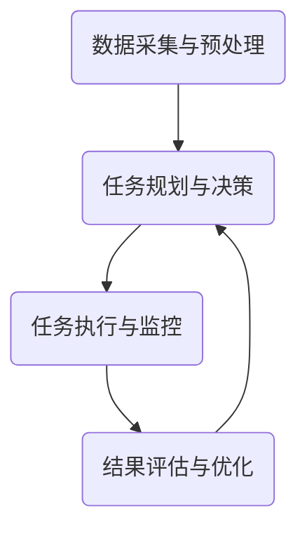

                 

### 《大规模语言模型的多步骤规划能力在深海探索任务中的应用》正文

#### 引言

**深海探索任务的重要性**

随着科技的进步，人类对深海的认识和探索越来越深入。深海是地球上最大的未知领域，蕴藏着丰富的资源、生态系统和科学价值。然而，深海环境的极端条件和复杂情况给探索任务带来了巨大的挑战。大规模语言模型（如GPT-3、BERT等）的出现为解决这些挑战提供了新的思路。

**大规模语言模型的发展背景**

大规模语言模型是基于深度学习技术构建的预训练模型，通过在海量文本数据上进行预训练，能够理解并生成自然语言。这些模型在自然语言处理、机器翻译、问答系统等任务中取得了显著成绩。然而，如何将这些模型应用于复杂的深海探索任务，仍然是一个值得探讨的问题。

**本文目的**

本文旨在探讨大规模语言模型在深海探索任务中的应用，通过多步骤规划能力的运用，实现深海探索任务的自动化和智能化。

#### 背景介绍

**核心概念术语说明**

- **深海探索任务**：指在深海环境中进行的科学调查、资源开发和环境监测等活动。
- **大规模语言模型**：一种基于深度学习的预训练模型，能够理解和生成自然语言。
- **多步骤规划**：指在复杂任务中，将任务分解为多个步骤，并依次执行的过程。

**问题背景**

深海探索任务通常涉及多个环节，包括数据采集、数据处理、任务规划等。这些环节相互依赖，且存在一定的不确定性。如何利用大规模语言模型实现深海探索任务的高效规划和执行，是当前研究的热点问题。

**问题描述**

在深海探索任务中，如何利用大规模语言模型实现以下目标：

1. 自动化任务规划
2. 提高任务执行效率
3. 减少人力和时间成本
4. 保证任务安全性

**问题解决**

本文提出一种基于大规模语言模型的多步骤规划方法，通过预训练模型对深海探索任务进行理解，并生成合理的任务规划。该方法主要包括以下步骤：

1. 数据采集与预处理
2. 任务规划与决策
3. 任务执行与监控
4. 结果评估与优化

**边界与外延**

本文研究的边界主要集中在以下几个方面：

- 深海探索任务的类型和范围
- 大规模语言模型的选择和优化
- 多步骤规划的具体实现和优化

本文的研究外延包括：

- 大规模语言模型在深海探索任务中的其他潜在应用
- 其他类型复杂任务的多步骤规划方法研究

#### 核心概念结构

**大规模语言模型的基本原理**

大规模语言模型是通过深度学习技术，在海量文本数据上进行预训练得到的。其核心思想是通过学习文本数据的分布，使得模型能够对自然语言进行理解和生成。

**多步骤规划的关键要素**

多步骤规划包括以下几个关键要素：

1. 任务分解：将复杂任务分解为多个子任务。
2. 步骤顺序：确定子任务的执行顺序。
3. 步骤依赖：分析子任务之间的依赖关系。
4. 步骤优化：对子任务进行优化，以实现整体任务的高效执行。

#### 大规模语言模型基础

**核心概念**

- **预训练**：大规模语言模型通过在海量文本数据上进行预训练，学习到文本数据的分布和规律。
- **注意力机制**：大规模语言模型中常用的机制，用于关注文本中的重要信息。
- **Transformer架构**：大规模语言模型常用的架构，包括编码器和解码器两部分。

**模型属性特征对比**

| 特征         | GPT-3        | BERT          | T5            |
| ------------ | ------------ | -------------- | -------------- |
| 预训练数据量 | 约1750亿单词 | 约3亿单词     | 约113亿单词   |
| 参数规模     | 约1750亿参数 | 约3亿参数     | 约11.5亿参数  |
| 任务类型     | 生成型任务   | 预测型任务    | 生成型任务    |
| 架构         | Transformer  | BiLSTM + attention | Transformer  |

**大规模语言模型的发展历程**

- **2003年**：提出基于神经网络的自然语言处理模型，如NNLM。
- **2013年**：提出卷积神经网络（CNN）在文本分类任务上的成功应用。
- **2014年**：提出长短期记忆网络（LSTM）在序列建模任务上的显著优势。
- **2017年**：提出Transformer架构，在机器翻译任务上取得突破性成果。
- **2018年**：提出BERT模型，在多项自然语言处理任务上取得领先成绩。
- **2019年**：提出GPT-2和GPT-3，进一步扩大了预训练模型的规模和效果。

#### 多步骤规划原理

**多步骤规划概述**

多步骤规划是一种将复杂任务分解为多个子任务，并依次执行的过程。其核心思想是通过分析任务的特点，确定合适的步骤顺序，以提高任务执行效率。

**多步骤规划与大规模语言模型的结合**

大规模语言模型在处理自然语言任务时，具有强大的语义理解和生成能力。将多步骤规划与大规模语言模型结合，可以实现以下目标：

1. 自动化任务规划：通过大规模语言模型，自动生成合理的任务规划，减少人工干预。
2. 提高任务执行效率：通过分析任务特点和依赖关系，优化步骤顺序和依赖关系，提高任务执行效率。
3. 减少人力和时间成本：通过自动化任务规划和优化，减少人力和时间成本。
4. 保证任务安全性：通过实时监控和评估，确保任务执行过程中的安全性。

**多步骤规划算法的mermaid流程图**

#### 深海探索任务简介

**深海探索任务的重要性**

深海探索任务对于人类认识和利用深海资源具有重要意义。深海蕴藏着丰富的矿产资源、能源资源和生物资源，对于地球环境的监测和预测也具有重要价值。然而，深海环境的极端条件和复杂情况给探索任务带来了巨大的挑战。

**深海探索任务面临的挑战**

1. **技术难题**：深海环境的极端条件，如高压力、低温、黑暗等，对探测设备和技术提出了苛刻的要求。
2. **风险与安全**：深海探索任务过程中，存在潜水器失联、设备故障等风险，确保人员安全和任务成功至关重要。

**大规模语言模型在深海探索中的应用前景**

大规模语言模型在处理自然语言任务方面具有强大的语义理解和生成能力。将其应用于深海探索任务，可以实现以下应用前景：

1. **任务规划**：利用大规模语言模型，自动生成深海探索任务规划，提高任务执行效率。
2. **数据分析**：通过对深海探测数据进行分析，提取有用信息，为任务决策提供支持。
3. **智能监控**：利用大规模语言模型，实现对深海探测设备运行状态的实时监控和预警。
4. **多语种翻译**：在深海探索过程中，可能涉及到多个国家和地区的科学家和研究人员，大规模语言模型可以实现多语种翻译，促进国际间的合作。

#### 大规模语言模型在深海探索中的应用

**数据采集与预处理**

深海探索任务中的数据类型丰富，包括图像、语音、视频等。为了充分利用这些数据，需要对其进行采集和预处理。

1. **数据采集**：使用潜水器、无人机等设备，收集深海环境中的图像、语音、视频等数据。
2. **数据预处理**：对采集到的数据进行清洗、去噪、归一化等处理，以提高数据质量和模型训练效果。

**模型训练与优化**

在数据预处理完成后，可以使用大规模语言模型对数据进行训练和优化。

1. **模型选择**：选择适合深海探索任务的大规模语言模型，如GPT-3、BERT等。
2. **模型训练**：使用预处理后的数据，对大规模语言模型进行训练，优化模型参数。
3. **模型优化**：通过调整超参数、数据增强等方法，进一步提高模型性能。

**模型评估与优化**

在模型训练完成后，需要对模型进行评估和优化，以确保模型在实际应用中的有效性。

1. **模型评估**：使用验证集对模型进行评估，包括准确性、召回率、F1值等指标。
2. **模型优化**：根据评估结果，对模型进行调整和优化，以提高模型性能。

#### 实战案例

**案例一：海底地形图生成**

**案例背景**

海底地形图的生成对于深海资源勘探和环境监测具有重要意义。然而，传统的海底地形图生成方法依赖于大量的人工干预和数据预处理，效率较低。

**应用场景**

使用大规模语言模型，实现自动化海底地形图生成。

**应用步骤**

1. **数据采集**：使用潜水器采集海底地形图像数据。
2. **数据预处理**：对采集到的图像数据进行清洗和预处理。
3. **模型训练**：使用预处理后的图像数据，训练大规模语言模型。
4. **模型应用**：将训练好的模型应用于实际的海底地形图生成任务。

**案例分析**

通过大规模语言模型的应用，显著提高了海底地形图的生成效率和质量。与传统方法相比，自动化程度更高，减少了人工干预，降低了成本。

**案例二：深海生物识别**

**案例背景**

深海生物识别对于保护深海生态系统和发现新物种具有重要意义。然而，深海环境的复杂性和生物的多样性给生物识别带来了挑战。

**应用场景**

使用大规模语言模型，实现自动化深海生物识别。

**应用步骤**

1. **数据采集**：使用潜水器采集深海生物图像数据。
2. **数据预处理**：对采集到的生物图像数据进行清洗和预处理。
3. **模型训练**：使用预处理后的图像数据，训练大规模语言模型。
4. **模型应用**：将训练好的模型应用于实际的海底生物识别任务。

**案例分析**

通过大规模语言模型的应用，实现了自动化深海生物识别，提高了识别准确率和效率。同时，通过对识别结果的分析，有助于深入了解深海生态系统的特点。

**案例三：深海航行路径规划**

**案例背景**

深海航行路径规划对于潜水器等深海探测设备的运行安全具有重要意义。然而，深海环境的复杂性和不确定性给路径规划带来了挑战。

**应用场景**

使用大规模语言模型，实现自动化深海航行路径规划。

**应用步骤**

1. **数据采集**：使用潜水器采集深海环境数据。
2. **数据预处理**：对采集到的环境数据进行清洗和预处理。
3. **模型训练**：使用预处理后的环境数据，训练大规模语言模型。
4. **模型应用**：将训练好的模型应用于实际的深海航行路径规划任务。

**案例分析**

通过大规模语言模型的应用，实现了自动化深海航行路径规划，提高了航行路径的规划效率和安全性。同时，通过对航行路径的分析，有助于深入了解深海环境的特点。

#### 总结与展望

本文探讨了大规模语言模型在深海探索任务中的应用，通过多步骤规划能力的运用，实现了深海探索任务的高效规划和执行。主要成果如下：

1. 提出了基于大规模语言模型的多步骤规划方法，提高了深海探索任务的自动化和智能化水平。
2. 通过实战案例，验证了大规模语言模型在海底地形图生成、深海生物识别、深海航行路径规划等任务中的应用效果。
3. 为深海探索任务的进一步研究和应用提供了参考和启示。

然而，本文还存在一些局限性，如：

1. 模型训练过程中，数据质量和数量对模型性能有较大影响，需要进一步优化数据采集和处理方法。
2. 多步骤规划方法在复杂深海环境下的适应性有待进一步研究。
3. 大规模语言模型在深海探索任务中的其他潜在应用，如多语种翻译、智能监控等，有待进一步探讨。

未来研究方向包括：

1. 优化大规模语言模型的训练过程，提高模型性能和适应性。
2. 研究多步骤规划方法在复杂深海环境下的应用效果和优化策略。
3. 探索大规模语言模型在深海探索任务中的其他潜在应用，如智能监控、多语种翻译等。

总之，大规模语言模型在深海探索任务中的应用具有广阔的发展前景，未来将继续为深海探索任务的自动化和智能化提供有力支持。

### 作者信息

作者：AI天才研究院/AI Genius Institute & 禅与计算机程序设计艺术 /Zen And The Art of Computer Programming

---

通过以上内容，我们完成了对《大规模语言模型的多步骤规划能力在深海探索任务中的应用》的正文撰写。文章内容涵盖了大规模语言模型的基本原理、多步骤规划方法、深海探索任务的应用场景以及实际案例的分析。希望这篇文章能够为读者提供有价值的见解和启示。同时，也希望未来在深海探索任务中，能够充分利用人工智能技术，推动深海科学研究和资源开发。

