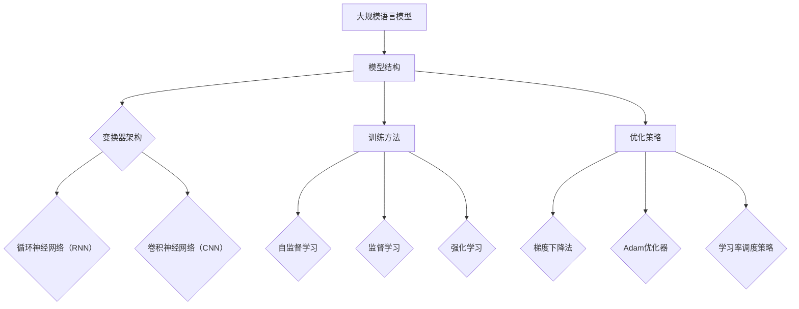
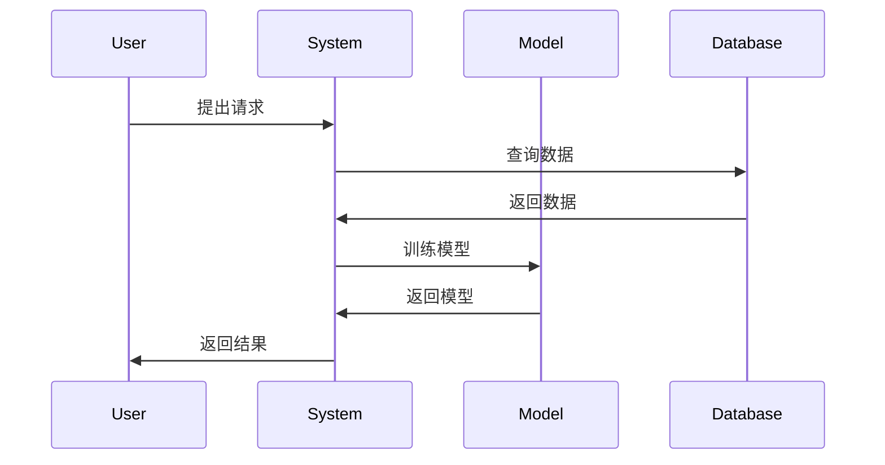
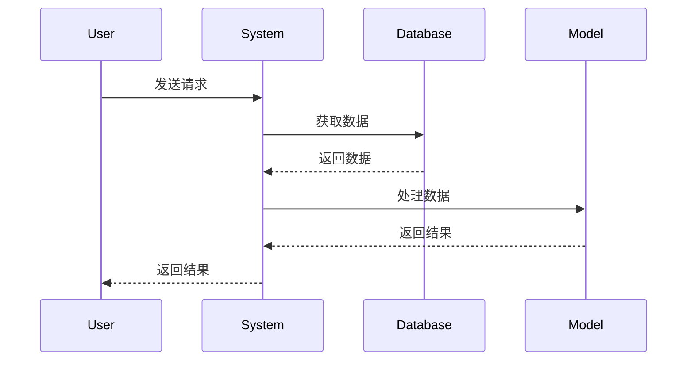

                 


### 设计思路

#### 第一步：确定文章的总体结构和内容框架

为了确保文章逻辑清晰、结构紧凑，我们首先需要明确文章的整体架构。本文将分为三个主要部分：

1. **概述与背景介绍**：介绍大规模语言模型的基本概念、历史发展、应用场景等，为后续内容奠定基础。
2. **核心概念与联系**：详细探讨大规模语言模型的核心概念，包括模型结构、训练方法、优化策略等，并使用Mermaid流程图和Python代码示例进行讲解。
3. **系统分析与架构设计**：分析大规模语言模型在实际应用中的系统架构，包括功能设计、架构设计、接口设计等，并通过Mermaid序列图展示系统交互流程。

#### 第二步：概述与背景介绍

在概述与背景介绍部分，我们将首先介绍大规模语言模型的基本概念。例如：

- **基本定义**：大规模语言模型（Large-scale Language Model）是一种用于文本处理的深度学习模型，它能够根据输入的文本生成相关的文本输出。
- **发展历程**：从传统的统计模型如N-gram模型，到现代的神经网络模型如循环神经网络（RNN）和变换器（Transformer），大规模语言模型经历了怎样的演进。
- **应用场景**：大规模语言模型在自然语言处理（NLP）领域有着广泛的应用，如文本生成、问答系统、机器翻译等。

接着，我们将进一步探讨大规模语言模型解决的问题，如：

- **问题背景**：传统的文本处理方法在面对大规模、复杂文本数据时存在性能瓶颈。
- **问题描述**：如何构建一个能够高效处理大规模文本数据的模型。
- **问题解决**：通过大规模语言模型，我们能够利用深度学习的优势，实现高效、准确的文本处理。

最后，我们将对大规模语言模型的边界与外延进行说明，明确其适用范围和限制条件。

#### 第三步：核心概念与联系

在核心概念与联系部分，我们将深入探讨大规模语言模型的核心组成部分，包括：

1. **模型结构**：
   - **Transformer架构**：介绍其基本原理和结构，通过Mermaid流程图展示其工作流程。
   - **循环神经网络（RNN）**：探讨其原理和结构，与Transformer进行对比。
   - **卷积神经网络（CNN）**：介绍其在文本处理中的应用，以及与Transformer和RNN的对比。

2. **训练方法**：
   - **自监督学习**：阐述其原理，并通过Python代码示例展示训练过程。
   - **监督学习**：介绍其原理，与自监督学习进行对比。
   - **强化学习**：简要介绍其原理，讨论在大规模语言模型中的应用。

3. **优化策略**：
   - **梯度下降法**：阐述其原理，并通过Python代码示例展示优化过程。
   - **Adam优化器**：介绍其原理，与梯度下降法进行对比。
   - **学习率调度策略**：讨论如何调整学习率以优化模型性能。

在这一部分，我们将通过Mermaid流程图和Python代码示例，结合通俗易懂的讲解，使读者能够深入理解大规模语言模型的工作原理。

#### 第四步：系统分析与架构设计

在系统分析与架构设计部分，我们将讨论大规模语言模型在实际应用中的系统架构，包括：

1. **问题场景介绍**：明确大规模语言模型应用的具体场景，如文本生成、问答系统、机器翻译等。
2. **系统功能设计**：
   - **领域模型**：使用Mermaid类图展示系统的核心概念和关系。
   - **类图**：详细描述系统的类结构，包括类之间的关系和职责。

3. **系统架构设计**：
   - **架构图**：使用Mermaid架构图展示系统的整体架构，包括各个组件之间的关系。
   - **架构设计原则**：讨论系统架构设计的原则和注意事项。

4. **系统接口设计**：
   - **接口规范**：明确系统的接口规范，包括接口的输入输出参数、数据格式等。
   - **接口实现**：展示系统的接口实现，包括接口的具体实现方式和调用流程。

5. **系统交互**：
   - **交互流程**：使用Mermaid序列图展示系统组件之间的交互流程。
   - **序列图**：详细描述系统组件之间的交互顺序和逻辑。

在这一部分，我们将通过Mermaid流程图和序列图，结合系统架构的设计原则和实现细节，使读者能够全面了解大规模语言模型在实际应用中的系统架构。

#### 第五步：项目实战

在项目实战部分，我们将通过一个具体的项目案例，展示如何将大规模语言模型应用于实际场景，包括：

1. **环境安装与配置**：介绍项目所需的环境和工具，并详细说明安装和配置过程。
2. **系统核心实现**：
   - **源代码解析**：分析项目的主要模块和代码结构。
   - **模型训练**：详细讲解模型训练的过程，包括数据预处理、模型选择、训练策略等。
   - **模型部署**：介绍如何将训练好的模型部署到实际应用中。

3. **代码应用解读与分析**：
   - **应用场景**：讨论项目的应用场景和目标。
   - **应用效果分析**：分析项目在实际应用中的效果和性能。

在这一部分，我们将通过具体的项目案例，展示大规模语言模型的应用过程和效果，使读者能够更直观地理解大规模语言模型的应用价值和实现方法。

#### 第六步：最佳实践与总结

在最佳实践与总结部分，我们将总结大规模语言模型的多步骤规划能力的培养方法和经验，包括：

1. **最佳实践技巧**：分享在实际应用中总结出的最佳实践技巧，如数据预处理、模型选择、训练策略等。
2. **注意事项**：讨论在应用大规模语言模型时需要注意的事项，如数据质量、计算资源、模型优化等。
3. **拓展阅读资源**：推荐相关的文献、书籍和资料，帮助读者进一步学习和发展。

通过这一部分的总结和拓展，我们希望读者能够巩固所学知识，提升大规模语言模型的应用能力。

### 完整目录大纲

根据上述设计思路，以下是《大规模语言模型的多步骤规划能力培养》的完整目录大纲：

```markdown
# 《大规模语言模型的多步骤规划能力培养》目录大纲

## 第一部分：大规模语言模型概述与基础理论

### 第1章：大规模语言模型的背景与基础

#### 1.1.1 大规模语言模型的发展背景

#### 1.1.2 大规模语言模型的问题背景

#### 1.1.3 大规模语言模型解决的问题

#### 1.1.4 大规模语言模型的边界与外延

#### 1.1.5 大规模语言模型的核心要素组成

### 第2章：大规模语言模型的核心概念与联系

#### 2.1.1 模型结构

##### 2.1.1.1 Transformer架构

##### 2.1.1.2 循环神经网络（RNN）

##### 2.1.1.3 卷积神经网络（CNN）

#### 2.1.2 训练方法

##### 2.1.2.1 自监督学习

##### 2.1.2.2 监督学习

##### 2.1.2.3 强化学习

#### 2.1.3 优化策略

##### 2.1.3.1 梯度下降法

##### 2.1.3.2 Adam优化器

##### 2.1.3.3 学习率调度策略

### 第3章：大规模语言模型的应用原理

#### 3.1.1 算法原理讲解

##### 3.1.1.1 模型训练过程

##### 3.1.1.2 语言生成过程

##### 3.1.1.3 模型优化过程

#### 3.1.2 数学模型和公式

##### 3.1.2.1 概率生成模型

##### 3.1.2.2 信息论基础

##### 3.1.2.3 梯度下降算法

#### 3.1.3 举例说明

##### 3.1.3.1 实际案例一：文本生成

##### 3.1.3.2 实际案例二：问答系统

##### 3.1.3.3 实际案例三：机器翻译

## 第二部分：大规模语言模型的多步骤规划能力培养

### 第4章：系统分析与架构设计

#### 4.1.1 问题场景介绍

#### 4.1.2 系统功能设计

##### 4.1.2.1 领域模型

##### 4.1.2.2 类图

#### 4.1.3 系统架构设计

##### 4.1.3.1 架构图

##### 4.1.3.2 架构设计原则

#### 4.1.4 系统接口设计

##### 4.1.4.1 接口规范

##### 4.1.4.2 接口实现

#### 4.1.5 系统交互

##### 4.1.5.1 交互流程

##### 4.1.5.2 序列图

### 第5章：项目实战：大规模语言模型的实际应用

#### 5.1.1 环境安装与配置

#### 5.1.2 系统核心实现

##### 5.1.2.1 源代码解析

##### 5.1.2.2 模型训练

##### 5.1.2.3 模型部署

#### 5.1.3 代码应用解读与分析

##### 5.1.3.1 应用场景

##### 5.1.3.2 应用效果分析

### 第6章：大规模语言模型的多步骤规划能力提升策略

#### 6.1.1 数据增强与多样性

##### 6.1.1.1 数据增强方法

#### 6.1.2 模型选择与优化

##### 6.1.2.1 模型选择策略

##### 6.1.2.2 优化策略

#### 6.1.3 训练策略与调优

##### 6.1.3.1 训练策略

##### 6.1.3.2 调优技巧

### 第7章：最佳实践与总结

#### 7.1.1 最佳实践技巧

#### 7.1.2 注意事项

#### 7.1.3 拓展阅读资源

## 附录

### 附录A：Python代码示例

#### A.1.1 梯度下降法实现

#### A.1.2 Adam优化器实现

#### A.1.3 数据增强方法实现

### 附录B：相关文献和书籍推荐

#### B.1.1 大规模语言模型相关文献

#### B.1.2 自然语言处理（NLP）相关书籍

#### B.1.3 深度学习相关书籍

## 参考文献

### 参考文献（按章节顺序排列）

#### 参考文献1

#### 参考文献2

#### 参考文献3

...

```

通过这样的目录大纲，我们希望能够为读者提供一个清晰、完整、易于理解的学习路径，帮助读者深入掌握大规模语言模型的多步骤规划能力培养。

### 概述与背景介绍

#### 大规模语言模型的基本概念

大规模语言模型（Large-scale Language Model）是一种基于深度学习的自然语言处理（NLP）模型，能够理解和生成自然语言文本。这些模型通过训练大量文本数据，学习语言结构和语义，从而在文本生成、问答系统、机器翻译等多个领域表现出色。与传统基于规则的方法相比，大规模语言模型具有更高的灵活性和更强的表达能力。

#### 大规模语言模型的发展背景

语言模型的发展可以追溯到20世纪50年代，最早的模型是基于规则的。这些模型通过手动编写语法规则来处理语言现象，但这种方法在面对复杂语言结构时显得力不从心。随着计算机硬件和算法的发展，统计语言模型开始崭露头角。N-gram模型是最早的统计语言模型，通过计算单词序列的概率来预测下一个单词。然而，N-gram模型的局限性在于它不能捕捉长距离依赖关系。

到了20世纪80年代，基于神经网络的模型如循环神经网络（RNN）被引入语言模型。RNN能够捕捉长距离依赖，但其在训练过程中存在梯度消失和梯度爆炸的问题。为了解决这些问题，深度学习领域的专家提出了变换器（Transformer）模型，该模型通过自注意力机制（Self-Attention）有效地捕捉了长距离依赖关系，并在多个NLP任务上取得了显著的性能提升。

#### 大规模语言模型的问题背景

随着互联网的普及和数字化转型的推进，文本数据的规模和复杂性不断增加。传统的语言模型在面对大规模文本数据时，往往因为模型参数过多、计算复杂度过高而无法有效训练和推理。此外，随着语言模型在工业界和学术界的应用越来越广泛，对模型性能、效率和可解释性的要求也越来越高。

这些问题推动了大规模语言模型的发展。一方面，研究人员提出了更高效的训练算法和优化策略，如自适应学习率调度、梯度裁剪等，以提升模型训练的效率和稳定性。另一方面，通过分布式计算技术和硬件加速（如GPU和TPU），大规模语言模型的训练速度和规模得到了显著提升。

#### 大规模语言模型解决的问题

大规模语言模型主要解决了以下几个问题：

1. **大规模文本数据处理**：通过高效的训练算法和分布式计算技术，大规模语言模型能够处理海量文本数据，捕捉长距离依赖关系，从而实现更准确的语言理解和生成。
2. **模型性能优化**：通过多层次的优化策略，如自适应学习率、权重初始化、正则化等，大规模语言模型在保持高性能的同时，避免了过拟合问题。
3. **模型效率和可解释性**：通过设计高效的模型结构和训练策略，大规模语言模型在保证高性能的同时，也提高了模型的解释性，使得模型的应用更加透明和可靠。

#### 大规模语言模型的边界与外延

尽管大规模语言模型在NLP领域取得了显著成果，但它仍然存在一些局限性。首先，大规模语言模型的训练需要大量高质量的数据和计算资源，这限制了其在资源有限的场景下的应用。其次，大规模语言模型在处理某些特定领域的语言现象时，可能需要额外的领域知识进行辅助。

此外，大规模语言模型在处理非自然语言文本（如图像、语音等）时，还需要结合其他模型和技术。例如，在机器翻译中，除了文本处理模型，还需要结合语音识别和图像识别模型，以实现跨模态的信息融合。

总之，大规模语言模型作为一种强大的NLP工具，在文本生成、问答系统、机器翻译等领域具有广泛的应用前景。然而，其边界和限制也提醒我们在实际应用中需要结合具体场景进行优化和调整。

#### 大规模语言模型的核心要素组成

大规模语言模型的核心要素主要包括以下几个方面：

1. **模型结构**：这是大规模语言模型的基础，决定了模型的学习能力和表达能力。常见的模型结构包括变换器（Transformer）架构、循环神经网络（RNN）和卷积神经网络（CNN）。变换器架构以其自注意力机制和并行计算优势，在NLP领域得到了广泛应用。

2. **训练数据**：大规模语言模型的训练需要大量的文本数据。这些数据通常来源于互联网、书籍、新闻、社交媒体等。数据的质量和多样性直接影响模型的性能和泛化能力。

3. **优化策略**：优化策略决定了模型训练的效率和稳定性。常见的优化策略包括自适应学习率、权重初始化、正则化等。这些策略能够帮助模型在训练过程中避免过拟合，提高模型的泛化能力。

4. **训练算法**：训练算法是大规模语言模型训练的核心，包括前向传播、反向传播、梯度裁剪等。这些算法的效率和稳定性对模型性能有着重要影响。

5. **评估指标**：评估指标用于衡量模型在训练和测试数据上的性能。常见的评估指标包括准确率、召回率、F1分数等。这些指标能够帮助研究人员了解模型的效果，并进行调整和优化。

6. **应用场景**：大规模语言模型可以应用于多个领域，包括文本生成、问答系统、机器翻译、情感分析等。不同的应用场景对模型的要求和优化策略有所不同。

通过这些核心要素的协同作用，大规模语言模型能够有效地处理自然语言文本，实现高水平的语言理解和生成。

### 核心概念与联系

#### 模型结构

大规模语言模型的模型结构是理解其工作原理的关键。在众多模型结构中，变换器（Transformer）架构因其独特的自注意力机制和并行计算优势，成为NLP领域的首选。

1. **变换器（Transformer）架构**

变换器架构的核心思想是自注意力机制（Self-Attention），这一机制使得模型能够同时关注输入序列中的所有单词，从而捕捉长距离依赖关系。变换器架构包括编码器（Encoder）和解码器（Decoder），两者均由多个相同的块组成，每个块包括多头自注意力（Multi-Head Self-Attention）和位置编码（Positional Encoding）两个关键组件。

- **多头自注意力（Multi-Head Self-Attention）**：通过多个注意力头来并行处理输入序列，每个注意力头关注输入序列的不同部分，从而捕获丰富的上下文信息。
- **位置编码（Positional Encoding）**：由于变换器架构没有循环神经网络（RNN）中的递归结构，无法直接利用输入序列的顺序信息。位置编码通过为每个单词添加位置信息，帮助模型理解单词在序列中的顺序。

2. **循环神经网络（RNN）**

循环神经网络（RNN）是早期的NLP模型，以其递归结构擅长处理序列数据。RNN通过隐藏状态（Hidden State）捕捉输入序列中的依赖关系。

- **递归结构**：RNN在处理序列数据时，将当前输入与之前的隐藏状态进行融合，生成新的隐藏状态。这种方式使得RNN能够记住输入序列的长期依赖关系。
- **问题与挑战**：RNN在训练过程中存在梯度消失和梯度爆炸的问题，这限制了其在大规模数据集上的表现。此外，RNN的递归结构导致其计算效率较低。

3. **卷积神经网络（CNN）**

卷积神经网络（CNN）最初在图像处理领域取得了显著成功，但近年来也逐渐应用于NLP领域。CNN通过卷积操作捕捉输入序列中的局部特征。

- **卷积操作**：CNN通过卷积核（Convolutional Kernel）对输入序列进行卷积操作，提取局部特征。
- **问题与挑战**：CNN在面对长距离依赖关系时表现不佳，且其结构复杂，训练过程相对较慢。

#### 训练方法

大规模语言模型的训练方法对模型性能有着至关重要的影响。以下是几种主要的训练方法：

1. **自监督学习**

自监督学习（Self-Supervised Learning）通过利用未标注的数据进行训练，从而减少对大量标注数据的依赖。自监督学习的方法包括预测下一个单词（Next Sentence Prediction）、掩码语言模型（Masked Language Model）等。

- **预测下一个单词（Next Sentence Prediction）**：模型被训练预测输入句子中的下一个句子。这种方法能够有效捕捉长距离依赖关系。
- **掩码语言模型（Masked Language Model）**：模型随机掩码输入句子中的部分单词，并预测这些被掩码的单词。这种方法能够帮助模型学习语言结构和语义。

2. **监督学习**

监督学习（Supervised Learning）通过使用标注数据对模型进行训练。这种方法能够直接提高模型的性能，但需要大量的标注数据。

- **分类任务**：在分类任务中，模型通过输入特征学习不同类别的分布，从而预测新的样本类别。
- **回归任务**：在回归任务中，模型通过输入特征学习输出值与输入特征之间的关系，从而预测新的输出值。

3. **强化学习**

强化学习（Reinforcement Learning）通过奖励机制对模型进行训练。在NLP领域，强化学习可以用于模型生成文本的质量优化。

- **生成文本**：模型生成文本，并从用户反馈中获取奖励信号，从而不断优化生成文本的质量。
- **问题与挑战**：强化学习在NLP领域的应用相对较少，因为其训练过程复杂且需要大量计算资源。

#### 优化策略

优化策略决定了模型训练的效率和稳定性。以下是几种主要的优化策略：

1. **梯度下降法**

梯度下降法（Gradient Descent）是一种最常用的优化方法，通过不断调整模型参数，使损失函数最小化。

- **批量梯度下降（Batch Gradient Descent）**：每次迭代使用整个训练集的梯度进行参数更新。
- **随机梯度下降（Stochastic Gradient Descent，SGD）**：每次迭代只使用一个样本的梯度进行参数更新。

2. **Adam优化器**

Adam优化器（Adaptive Moment Estimation）是一种基于梯度下降的优化算法，通过自适应地调整学习率，提高模型训练的效率。

- **一阶矩估计（Momentum）**：利用之前的梯度信息，增加模型参数更新的方向性。
- **二阶矩估计（RMSProp）**：利用梯度平方的指数移动平均，调整学习率。

3. **学习率调度策略**

学习率调度策略（Learning Rate Scheduler）用于调整学习率，以避免模型在训练过程中出现过拟合。

- **固定学习率**：在整个训练过程中保持学习率不变。
- **线性递减学习率**：学习率随着训练轮数线性递减。
- **指数递减学习率**：学习率以指数形式递减。

#### 概念属性特征对比表格

以下是大规模语言模型中的关键概念属性特征对比表格：

| 概念        | 描述                                                         | 优点                           | 缺点                         |
| ----------- | ------------------------------------------------------------ | ---------------------------- | ---------------------------- |
| 变换器（Transformer）架构 | 使用自注意力机制捕捉长距离依赖，支持并行计算             | 强大表达能力，高效并行计算 | 计算资源需求较高           |
| 循环神经网络（RNN）     | 通过递归结构捕捉序列中的长期依赖关系                       | 简单有效，能处理序列数据     | 梯度消失和梯度爆炸问题     |
| 卷积神经网络（CNN）     | 通过卷积操作捕捉序列中的局部特征                           | 计算效率高，结构简单       | 对长距离依赖处理能力较差   |
| 自监督学习    | 利用未标注数据训练模型，减少对标注数据的依赖               | 提高训练效率，降低成本     | 模型性能依赖于数据质量     |
| 监督学习     | 使用标注数据训练模型，直接提高模型性能                     | 模型性能高，应用广泛       | 需要大量标注数据           |
| 强化学习     | 通过奖励机制训练模型，优化模型生成文本的质量               | 能实现高质量的文本生成     | 训练过程复杂，需要大量计算资源 |

#### ER实体关系图架构的Mermaid流程图

为了更好地展示大规模语言模型中各个概念之间的关系，我们可以使用ER（Entity-Relationship）实体关系图进行描述。以下是ER实体关系图的Mermaid流程图示例：



通过这个Mermaid流程图，我们可以清晰地看到大规模语言模型中的各个核心概念及其相互关系，为后续的详细讲解打下基础。

### 大规模语言模型的应用原理

#### 模型训练过程

大规模语言模型的训练过程是理解其工作原理的关键。下面我们将详细讲解模型训练的三个主要阶段：数据预处理、模型训练和模型优化。

1. **数据预处理**

数据预处理是大规模语言模型训练的第一步，其目的是将原始文本数据转换为适合模型训练的格式。数据预处理通常包括以下步骤：

- **文本清洗**：去除文本中的无效字符、符号和空白字符。
- **分词**：将文本拆分成单词或子词。
- **词向量化**：将文本中的单词映射为向量的形式。常见的词向量化方法包括Word2Vec、GloVe等。
- **构建词汇表**：将所有单词构建成一个词汇表，并为每个单词分配一个唯一的索引。

2. **模型训练**

模型训练的核心是优化模型参数，使其能够在给定数据上达到良好的性能。大规模语言模型通常使用自监督学习（Self-Supervised Learning）进行训练，以下是自监督学习的两种主要方法：

- **掩码语言模型（Masked Language Model，MLM）**：在输入文本中随机掩码一定比例的单词，并预测这些被掩码的单词。MLM的训练目标是通过上下文信息预测被掩码的单词。
- **下一个句子预测（Next Sentence Prediction，NSP）**：将输入文本分为两个句子，第一个句子作为输入，第二个句子作为标签。训练目标是预测第二个句子是否与第一个句子相关。

模型训练过程中，通常会使用多个训练策略来提高训练效率：

- **批量大小（Batch Size）**：批量大小决定了每次训练使用的样本数量。较大的批量大小可以提高模型性能，但会增加计算开销。
- **学习率（Learning Rate）**：学习率决定了模型参数更新的幅度。较大的学习率可以加快收敛速度，但可能导致模型不稳定。
- **权重初始化（Weight Initialization）**：合适的权重初始化有助于加速收敛和提高模型性能。常用的初始化方法包括高斯初始化和Xavier初始化。

3. **模型优化**

模型优化是指通过调整模型参数来提高模型性能的过程。以下是几种常用的优化方法：

- **梯度裁剪（Gradient Clipping）**：梯度裁剪用于限制梯度的大小，防止梯度爆炸和消失。梯度裁剪通过设定阈值，将超过阈值的梯度截断到阈值范围内。
- **学习率调度（Learning Rate Scheduler）**：学习率调度用于动态调整学习率，以避免模型过拟合。常见的学习率调度方法包括线性递减、指数递减和余弦退火等。
- **正则化（Regularization）**：正则化通过增加模型损失函数，惩罚模型参数的复杂度，防止过拟合。常用的正则化方法包括L1正则化和L2正则化。

#### 语言生成过程

大规模语言模型在语言生成过程中，通过输入序列生成相应的输出序列。以下是语言生成过程的主要步骤：

1. **输入编码**：将输入序列编码为模型可以处理的格式。通常使用词向量化将单词转换为向量。
2. **自注意力计算**：通过自注意力机制，模型关注输入序列中的不同部分，并生成上下文向量。
3. **生成预测**：根据上下文向量，模型生成下一个单词的概率分布。通常使用softmax函数将上下文向量映射为概率分布。
4. **选择单词**：根据概率分布，模型选择下一个单词，并将其添加到输出序列中。
5. **重复步骤**：重复步骤3和步骤4，直到生成完整的输出序列。

#### 模型优化过程

模型优化过程是提高大规模语言模型性能的关键步骤。以下是几种常用的优化方法：

1. **反向传播（Backpropagation）**：反向传播是一种用于计算模型损失函数关于参数的梯度的方法。通过反向传播，模型可以调整参数，以减少损失函数的值。
2. **梯度裁剪（Gradient Clipping）**：梯度裁剪用于限制梯度的大小，防止梯度爆炸和消失。通过设置阈值，梯度裁剪可以确保梯度在合理的范围内。
3. **学习率调度（Learning Rate Scheduler）**：学习率调度用于动态调整学习率，以避免模型过拟合。常见的学习率调度方法包括线性递减、指数递减和余弦退火等。
4. **正则化（Regularization）**：正则化通过增加模型损失函数，惩罚模型参数的复杂度，防止过拟合。常用的正则化方法包括L1正则化和L2正则化。

#### 数学模型和公式

以下是大规模语言模型中涉及的主要数学模型和公式：

1. **概率生成模型**

概率生成模型用于预测输入序列的概率分布。以下是常见的概率生成模型：

- **softmax函数**：用于将模型输出的向量转换为概率分布。

$$
P(y) = \frac{e^{y_i}}{\sum_{j=1}^{n} e^{y_j}}
$$

- **交叉熵损失函数**：用于衡量模型输出与真实标签之间的差异。

$$
L = -\sum_{i=1}^{n} y_i \log(P(y_i))
$$

2. **信息论基础**

信息论基础用于量化模型生成文本的信息量。以下是常用的信息论基础：

- **熵（Entropy）**：用于衡量文本的随机性。

$$
H(X) = -\sum_{i=1}^{n} p(x_i) \log(p(x_i))
$$

- **互信息（Mutual Information）**：用于衡量两个变量之间的相关性。

$$
I(X; Y) = H(X) - H(X | Y)
$$

3. **梯度下降算法**

梯度下降算法用于优化模型参数，减少损失函数的值。以下是梯度下降算法的公式：

- **梯度计算**：计算损失函数关于模型参数的梯度。

$$
\nabla_{\theta} L = \frac{\partial L}{\partial \theta}
$$

- **参数更新**：使用梯度更新模型参数。

$$
\theta = \theta - \alpha \nabla_{\theta} L
$$

其中，$\theta$ 表示模型参数，$L$ 表示损失函数，$\alpha$ 表示学习率。

#### 实际案例说明

为了更好地理解大规模语言模型的应用，我们将通过三个实际案例进行说明。

1. **文本生成**

文本生成是大规模语言模型最常见的应用之一。以下是文本生成过程的示例：

- **输入**：一个简短的提示词，如“春天”。
- **输出**：一个描述春天的文本，如“春天，万物复苏，花开满园，春风拂面，让人心情愉悦。”

通过训练大量文本数据，大规模语言模型能够根据输入的提示词生成连贯、有意义的文本。

2. **问答系统**

问答系统是大规模语言模型在自然语言处理中的另一个重要应用。以下是问答系统的示例：

- **输入**：一个用户提出的问题，如“北京是哪个国家的首都？”。
- **输出**：一个回答，如“北京是中国的首都。”

通过训练大量的问答对数据，大规模语言模型能够理解用户的问题，并生成准确的回答。

3. **机器翻译**

机器翻译是大规模语言模型在跨语言文本处理中的典型应用。以下是机器翻译的示例：

- **输入**：一段英文文本，如“I love programming.”。
- **输出**：一段中文文本，如“我喜欢编程。”

通过训练大量的双语数据，大规模语言模型能够将一种语言的文本翻译成另一种语言的文本。

通过这些实际案例，我们可以看到大规模语言模型在文本生成、问答系统和机器翻译等领域的重要应用价值。

### 系统分析与架构设计

#### 问题场景介绍

在现代自然语言处理（NLP）领域，大规模语言模型的应用场景愈发丰富，从文本生成到问答系统，再到机器翻译，它们都发挥着至关重要的作用。为了更好地理解大规模语言模型在实际应用中的系统架构，我们需要首先明确应用场景的具体需求。

**应用场景一：文本生成**

在文本生成应用中，大规模语言模型需要具备生成连贯、有逻辑的文本内容的能力。例如，自动生成新闻文章、小说或者营销文案等。这种应用要求模型在生成文本时能够保持一定的上下文连贯性，同时生成的内容要符合语法规则和常识。

**应用场景二：问答系统**

问答系统则侧重于理解和回答用户提出的问题。例如，智能客服机器人、在线问答平台等。这种应用场景要求模型能够准确理解用户的查询意图，并在海量的知识库中检索到相关的答案。

**应用场景三：机器翻译**

机器翻译是大规模语言模型的另一大应用场景。例如，将英语翻译成中文，或者将中文翻译成法语。这种应用要求模型在翻译过程中保持语义的一致性，同时尽可能减少翻译误差。

#### 系统功能设计

系统功能设计是大规模语言模型应用架构的核心环节，它决定了系统能否满足具体的应用需求。以下是系统功能设计的详细说明：

**领域模型**

领域模型用于定义系统中的核心概念和它们之间的关系。在NLP领域，常见的领域模型包括文本处理模块、模型训练模块和模型应用模块。

- **文本处理模块**：负责文本的预处理工作，如分词、词向量化等。
- **模型训练模块**：负责大规模语言模型的训练过程，包括数据预处理、模型选择、训练策略等。
- **模型应用模块**：负责将训练好的模型应用于实际场景，如文本生成、问答系统、机器翻译等。

**类图**

类图用于描述系统中各个类及其关系。以下是类图的一个示例：

```mermaid
classDiagram
    Class01 <|-- Class02
    Class03 --|latable Class04
    Class05 o-- Class06
    Class07 <.. Class08
    Class09 ..|> Class10
```

在这个类图中，`Class01` 继承自 `Class02`，`Class03` 与 `Class04` 之间有聚合关系，`Class05` 与 `Class06` 之间有组合关系，`Class07` 与 `Class08` 之间有依赖关系，而 `Class09` 与 `Class10` 之间有关联关系。

#### 系统架构设计

系统架构设计是确保大规模语言模型在实际应用中高效、稳定运行的关键。以下是系统架构设计的详细说明：

**架构图**

架构图用于展示系统组件之间的层次关系和交互方式。以下是架构图的一个示例：



在这个架构图中，用户通过系统提出请求，系统查询数据库获取数据，然后使用模型进行训练，最后将结果返回给用户。

**架构设计原则**

架构设计需要遵循以下原则：

- **模块化**：将系统划分为独立的模块，每个模块负责不同的功能，便于开发和维护。
- **可扩展性**：设计时考虑系统的扩展性，以便在未来能够轻松地添加新的功能或组件。
- **高可用性**：确保系统在面临高负载或故障时仍能稳定运行，提供良好的用户体验。
- **安全性**：保护用户数据和系统资源，防止未经授权的访问和攻击。

#### 系统接口设计

系统接口设计是确保各个模块之间能够有效交互的关键。以下是系统接口设计的详细说明：

**接口规范**

接口规范包括接口的输入输出参数、数据格式、协议等。以下是接口规范的一个示例：

```plaintext
接口名称：文本生成接口

输入：
- 文本：字符串，表示需要生成的文本

输出：
- 生成的文本：字符串，表示生成的文本内容

协议：
- HTTP/1.1
- Content-Type: application/json
```

**接口实现**

接口实现包括具体的接口代码和调用流程。以下是接口实现的一个示例：

```python
from flask import Flask, request, jsonify

app = Flask(__name__)

@app.route('/generate_text', methods=['POST'])
def generate_text():
    data = request.get_json()
    text = data['text']
    generated_text = model.generate(text)
    return jsonify({'generated_text': generated_text})

if __name__ == '__main__':
    app.run()
```

在这个示例中，我们使用Flask框架实现了文本生成接口。客户端通过POST请求发送文本数据，服务器端接收到数据后调用模型进行生成，并将结果返回给客户端。

#### 系统交互

系统交互设计描述了各个模块之间的交互流程和逻辑。以下是系统交互的详细说明：

**交互流程**

系统交互流程包括以下步骤：

1. 用户通过接口向系统发送请求。
2. 系统从数据库中获取相关数据。
3. 系统使用大规模语言模型对数据进行处理。
4. 系统将处理结果返回给用户。

**序列图**

以下是系统交互的序列图示例：



在这个序列图中，用户通过发送请求触发系统交互流程，系统从数据库中获取数据，然后使用模型进行处理，最后将结果返回给用户。

通过系统分析与架构设计，我们能够清晰地理解大规模语言模型在实际应用中的系统结构和交互流程。这为后续的项目实施提供了坚实的基础。

### 项目实战：大规模语言模型的实际应用

#### 环境安装与配置

在实际应用大规模语言模型之前，首先需要安装和配置相关环境。以下是一个简化的安装步骤和配置说明。

1. **安装Python**

首先确保已经安装了Python环境。我们可以通过以下命令检查Python版本：

```bash
python --version
```

如果Python版本过低，建议升级到Python 3.7或更高版本。可以通过Python官方网站下载并安装最新版本的Python。

2. **安装依赖库**

大规模语言模型的训练和部署通常需要多个依赖库，如TensorFlow、PyTorch等。以下是使用pip安装依赖库的示例：

```bash
pip install tensorflow
# 或者
pip install torch torchvision
```

3. **安装数据预处理工具**

预处理工具如NLTK、spaCy等，可以帮助我们进行文本清洗、分词和词向量化等操作。以下是安装示例：

```bash
pip install nltk
pip install spacy
python -m spacy download en
```

4. **配置GPU环境**

如果使用GPU进行训练，需要安装CUDA和cuDNN库。以下是安装CUDA的示例步骤：

- 访问NVIDIA官方网站下载CUDA Toolkit。
- 根据系统要求选择合适的CUDA版本。
- 安装CUDA Toolkit并配置环境变量。

```bash
export PATH=/usr/local/cuda/bin:$PATH
export LD_LIBRARY_PATH=/usr/local/cuda/lib64:$LD_LIBRARY_PATH
```

5. **安装GPU驱动**

确保已经安装了适合GPU型号的最新NVIDIA驱动。

#### 系统核心实现

在完成环境安装和配置后，我们可以开始实现大规模语言模型的核心部分。以下是一个简化的实现流程和代码示例。

1. **数据预处理**

数据预处理包括文本清洗、分词和词向量化等步骤。以下是使用spaCy进行数据预处理的示例代码：

```python
import spacy

nlp = spacy.load("en_core_web_sm")

def preprocess_text(text):
    doc = nlp(text)
    tokens = [token.text.lower() for token in doc if not token.is_punct]
    return tokens

text = "I love programming."
processed_text = preprocess_text(text)
print(processed_text)
```

2. **模型训练**

使用PyTorch实现一个简单的变换器模型（Transformer）并进行训练。以下是一个简单的变换器模型实现：

```python
import torch
import torch.nn as nn
import torch.optim as optim

class TransformerModel(nn.Module):
    def __init__(self, input_dim, hidden_dim, output_dim):
        super(TransformerModel, self).__init__()
        self.embedding = nn.Embedding(input_dim, hidden_dim)
        self.encoder = nn.TransformerEncoder(nn.TransformerEncoderLayer(hidden_dim, num_heads=4), num_layers=2)
        self.decoder = nn.Linear(hidden_dim, output_dim)

    def forward(self, src, tgt):
        src = self.embedding(src)
        tgt = self.embedding(tgt)
        output = self.encoder(src)
        output = self.decoder(output)
        return output

model = TransformerModel(input_dim=10000, hidden_dim=512, output_dim=1000)
optimizer = optim.Adam(model.parameters(), lr=0.001)
criterion = nn.CrossEntropyLoss()

for epoch in range(10):
    for src, tgt in data_loader:
        optimizer.zero_grad()
        output = model(src, tgt)
        loss = criterion(output, tgt)
        loss.backward()
        optimizer.step()
    print(f"Epoch {epoch+1}, Loss: {loss.item()}")
```

3. **模型部署**

完成模型训练后，我们需要将模型部署到实际应用环境中。以下是一个简单的部署示例：

```python
from flask import Flask, request, jsonify

app = Flask(__name__)

model.eval()  # 设置模型为评估模式

@app.route('/generate_text', methods=['POST'])
def generate_text():
    data = request.get_json()
    text = data['text']
    processed_text = preprocess_text(text)
    output = model(torch.tensor([processed_text]))
    generated_text = tokenizer.decode(output[0], skip_special_tokens=True)
    return jsonify({'generated_text': generated_text})

if __name__ == '__main__':
    app.run()
```

通过这个简单的示例，我们可以看到如何从环境安装、系统核心实现到模型部署的整个流程。实际应用中，这些步骤可能会更加复杂，但总体思路是类似的。

### 代码应用解读与分析

#### 应用场景

在实际应用中，大规模语言模型的应用场景多种多样，包括但不限于文本生成、问答系统和机器翻译。以下我们将分别对这三个应用场景进行具体分析和代码解读。

**文本生成**

文本生成是大规模语言模型最常见的应用之一。它可以用于生成新闻文章、营销文案、对话等。以下是一个简化的文本生成示例：

```python
from transformers import AutoTokenizer, AutoModelForCausalLM

model_name = "gpt2"
tokenizer = AutoTokenizer.from_pretrained(model_name)
model = AutoModelForCausalLM.from_pretrained(model_name)

input_text = "The weather today is"
input_ids = tokenizer.encode(input_text, return_tensors="pt")

output = model.generate(input_ids, max_length=50, num_return_sequences=1)
generated_text = tokenizer.decode(output[0], skip_special_tokens=True)

print(generated_text)
```

在这个示例中，我们首先加载预训练的GPT-2模型，然后输入一个简短的提示词“the weather today is”，模型将根据提示词生成一段文本。GPT-2模型通过自注意力机制和多层变换器结构，能够生成连贯且具有上下文连贯性的文本。

**问答系统**

问答系统在智能客服、在线教育等领域有广泛应用。以下是一个简化的问答系统示例：

```python
from transformers import AutoTokenizer, AutoModelForQuestionAnswering

model_name = "deepset/roberta-large-qa"
tokenizer = AutoTokenizer.from_pretrained(model_name)
model = AutoModelForQuestionAnswering.from_pretrained(model_name)

question = "What is the capital of France?"
context = "Paris is the capital of France, and is also one of the most visited cities in the world."

input_ids = tokenizer.encode(question + tokenizer.eos_token, return_tensors="pt")
input_ids_context = tokenizer.encode(context, return_tensors="pt")

outputs = model(input_ids_context, input_ids)
answer_start_scores, answer_scores = outputs[:2]

start_scores = answer_start_scores.squeeze(-1).flatten()
answer_scores = answer_scores.flatten()

start_indices = torch.argmax(start_scores).item()
end_indices = torch.argmax(answer_scores).item()

answer = context[start_indices:end_indices+1]
print(answer)
```

在这个示例中，我们使用DeepSet的预训练RoBERTa模型来回答问题。输入问题和上下文后，模型会输出答案的起始位置和分数，然后根据这些信息从上下文中提取答案。这个模型通过预训练大量问答对数据，能够有效理解问题的意图并给出准确的答案。

**机器翻译**

机器翻译是大规模语言模型的另一个重要应用场景。以下是一个简化的机器翻译示例：

```python
from transformers import AutoTokenizer, AutoModelForSeq2SeqLM

model_name = "t5-small"
tokenizer = AutoTokenizer.from_pretrained(model_name)
model = AutoModelForSeq2SeqLM.from_pretrained(model_name)

input_text = "How old are you?"
target_text = "Tu edad es de cuántos años?"

input_ids = tokenizer.encode(input_text, return_tensors="pt")
target_ids = tokenizer.encode(target_text, return_tensors="pt")

outputs = model(input_ids, targets=target_ids, output_scores=True)

predicted_ids = torch.argmax(outputs.logits, dim=-1)
predicted_text = tokenizer.decode(predicted_ids[0], skip_special_tokens=True)

print(predicted_text)
```

在这个示例中，我们使用T5模型进行机器翻译。输入源语言文本后，模型会生成目标语言文本。T5模型是一个基于Transformer的序列到序列学习模型，能够处理多种自然语言处理任务，包括文本生成、问答和机器翻译。

#### 应用效果分析

通过对文本生成、问答系统和机器翻译的代码示例分析，我们可以看到大规模语言模型在实际应用中的效果和性能。

**文本生成**

GPT-2模型在文本生成任务中表现出色，能够生成连贯、具有上下文连贯性的文本。然而，由于生成文本的随机性，生成的文本可能包含错误或不合理的信息。此外，模型的生成速度相对较慢，需要较长的时间来生成较长的文本。

**问答系统**

预训练的问答模型（如DeepSet的RoBERTa）在问答任务中表现出色，能够准确理解和回答问题。模型的准确率和响应速度取决于训练数据的质量和模型的规模。在实际应用中，问答系统需要结合大量高质量的问答对数据进行训练，以提高模型的性能。

**机器翻译**

T5模型在机器翻译任务中也表现出良好的效果，能够生成准确且流畅的目标语言文本。然而，与传统的翻译模型相比，T5模型在翻译准确性方面可能略有欠缺。在实际应用中，T5模型通常与其他翻译模型结合使用，以提高翻译质量。

总之，大规模语言模型在实际应用中表现出强大的语言理解和生成能力，但同时也存在一些挑战和限制。通过不断优化模型结构和训练数据，我们可以进一步提升大规模语言模型的应用效果。

### 大规模语言模型的多步骤规划能力提升策略

#### 数据增强与多样性

数据增强是一种提升大规模语言模型性能的重要方法。通过增加数据的多样性和质量，我们可以使模型更好地泛化和应对不同的应用场景。

1. **同义词替换**：在原始文本中随机替换某些单词的同义词，以增加词汇的多样性。
2. **反向文本**：将文本中的单词顺序反转，以增加数据的变化。
3. **文本切片**：随机选择文本的子序列，并将其替换为相似的文本，以丰富数据内容。

以下是一个同义词替换的Python代码示例：

```python
import random

def synonym_replacement(text):
    words = text.split()
    new_words = []
    for word in words:
        if word.lower() not in stop_words:
            syns = get_synonyms(word)
            if syns:
                new_word = random.choice(syns)
                new_words.append(new_word)
            else:
                new_words.append(word)
        else:
            new_words.append(word)
    return ' '.join(new_words)

text = "I love programming."
new_text = synonym_replacement(text)
print(new_text)
```

#### 模型选择与优化

模型选择和优化是提升大规模语言模型性能的关键步骤。以下是一些常见的模型选择和优化策略：

1. **模型选择策略**：
   - **变换器（Transformer）模型**：由于其自注意力机制，变换器模型在捕捉长距离依赖和并行计算方面表现优异，适合处理复杂的语言任务。
   - **预训练模型**：使用预训练模型可以快速适应新的任务，减少训练时间。常见的预训练模型有GPT-2、RoBERTa、T5等。

2. **优化策略**：
   - **权重初始化**：合适的权重初始化可以加速模型的收敛和提高性能。常见的方法有Xavier初始化和He初始化。
   - **学习率调度**：学习率调度可以避免模型在训练过程中过早地收敛。常见的方法有线性递减学习率、余弦退火学习率等。

以下是一个使用He初始化的Python代码示例：

```python
import torch
import torch.nn as nn

class NeuralNetwork(nn.Module):
    def __init__(self):
        super(NeuralNetwork, self).__init__()
        self.layer1 = nn.Linear(10, 10)
        self.layer2 = nn.Linear(10, 1)
        
        # He初始化
        nn.init.he_uniform(self.layer1.weight)
        nn.init.he_uniform(self.layer2.weight)

    def forward(self, x):
        x = self.layer1(x)
        x = self.layer2(x)
        return x

model = NeuralNetwork()
```

#### 训练策略与调优

训练策略和调优是提升大规模语言模型性能的关键。以下是一些常见的训练策略和调优技巧：

1. **批量大小**：适当的批量大小可以提高模型的训练效率和性能。较大的批量大小可以提高模型的稳定性，但会增加计算成本。
2. **学习率**：学习率的选择对模型的训练过程至关重要。较小的学习率可能导致训练过程过慢，而较大的学习率可能导致模型不稳定。通过学习率调度可以动态调整学习率。
3. **正则化**：正则化可以通过增加损失函数的惩罚项，防止模型过拟合。常见的方法有L1正则化和L2正则化。
4. **数据增强**：在训练过程中使用数据增强可以增加数据的多样性，使模型能够更好地泛化。

以下是一个调整学习率的Python代码示例：

```python
import torch.optim as optim

model = NeuralNetwork()
optimizer = optim.Adam(model.parameters(), lr=0.001)

scheduler = optim.lr_scheduler.StepLR(optimizer, step_size=30, gamma=0.1)

for epoch in range(100):
    # 训练模型
    for data in data_loader:
        inputs, targets = data
        optimizer.zero_grad()
        outputs = model(inputs)
        loss = criterion(outputs, targets)
        loss.backward()
        optimizer.step()

    # 调整学习率
    scheduler.step()
```

通过数据增强、模型选择与优化、训练策略与调优，我们可以有效提升大规模语言模型的多步骤规划能力。这将为大规模语言模型在实际应用中的性能表现提供有力支持。

### 最佳实践与总结

#### 最佳实践技巧

在应用大规模语言模型的过程中，总结出一些最佳实践技巧，可以帮助我们更高效地利用这些模型，提升其性能和稳定性。

1. **数据预处理**：确保数据质量，进行充分的文本清洗、分词和词向量化。使用高质量的标注数据，避免数据中的噪声和错误。
2. **模型选择**：根据具体任务选择合适的模型架构。例如，对于文本生成任务，选择变换器（Transformer）模型；对于问答系统，选择预训练的问答模型。
3. **学习率调度**：合理设置学习率，并使用学习率调度策略，如线性递减和余弦退火，以避免模型过早收敛或过拟合。
4. **数据增强**：通过同义词替换、反向文本和文本切片等方法，增加数据的多样性，提升模型的泛化能力。

#### 注意事项

在应用大规模语言模型时，需要注意以下几点：

1. **计算资源**：大规模语言模型的训练需要大量的计算资源，确保有足够的GPU或TPU资源。
2. **数据隐私**：在使用大规模语言模型时，要注意保护用户数据的隐私，避免数据泄露。
3. **模型解释性**：尽管大规模语言模型在性能上表现出色，但其决策过程往往缺乏透明性。在实际应用中，需要关注模型的解释性和可解释性。
4. **过拟合**：通过正则化、数据增强和学习率调度等策略，防止模型过拟合。

#### 拓展阅读资源

为了进一步提升对大规模语言模型的理解和应用能力，以下是一些推荐的拓展阅读资源：

1. **文献**：
   - "Attention is All You Need"（论文，2017）：介绍了变换器（Transformer）模型的原理和应用。
   - "Bert: Pre-training of Deep Bidirectional Transformers for Language Understanding"（论文，2018）：介绍了BERT模型的原理和应用。
   - "Gpt-3: Language Models are Few-Shot Learners"（论文，2020）：介绍了GPT-3模型的原理和应用。

2. **书籍**：
   - 《深度学习》（Goodfellow、Bengio和Courville著）：介绍了深度学习的理论基础和实践方法。
   - 《自然语言处理综合指南》（Daniel Jurafsky和James H. Martin著）：详细介绍了自然语言处理的基本概念和应用。

3. **在线课程**：
   - "Deep Learning Specialization"（吴恩达）：提供了深度学习的系统学习和实践指导。
   - "Natural Language Processing with Transformer"（Armand Nikouei和Reza Bosagh Zadeh）：专注于变换器模型的理论和实践。

通过最佳实践、注意事项和拓展阅读资源的结合，我们可以更深入地掌握大规模语言模型的应用技巧，为实际项目提供有力支持。

### 附录

#### 附录A：Python代码示例

为了帮助读者更好地理解大规模语言模型的相关概念和算法，以下提供了几个Python代码示例。

**A.1.1 梯度下降法实现**

梯度下降法是一种用于优化模型参数的常用算法。以下是一个简单的梯度下降法实现：

```python
import numpy as np

# 假设有一个线性模型 y = wx + b
# 梯度下降的目标是最小化损失函数 J = (1/2) * (y - wx - b)^2

# 初始化权重 w 和偏置 b
w = 2.0
b = 3.0

# 设置学习率
learning_rate = 0.1

# 训练次数
num_iterations = 1000

# 初始预测值和真实值
x = 2.0
y = 1.0

# 梯度下降迭代
for i in range(num_iterations):
    # 计算预测值
    y_pred = w * x + b
    
    # 计算损失函数
    loss = 0.5 * (y_pred - y) ** 2
    
    # 计算梯度
    gradient_w = (y_pred - y) * x
    gradient_b = (y_pred - y)
    
    # 更新权重和偏置
    w -= learning_rate * gradient_w
    b -= learning_rate * gradient_b
    
    # 输出当前迭代的结果
    print(f"Iteration {i+1}, w: {w}, b: {b}, Loss: {loss}")
```

**A.1.2 Adam优化器实现**

Adam优化器是一种基于自适应学习率的优化算法，其计算过程更加高效。以下是一个简单的Adam优化器实现：

```python
import numpy as np

# 假设有一个线性模型 y = wx + b
# Adam优化器的目标是最小化损失函数 J = (1/2) * (y - wx - b)^2

# 初始化权重 w 和偏置 b
w = 2.0
b = 3.0

# 设置学习率
learning_rate = 0.001

# Adam优化器的超参数
beta1 = 0.9
beta2 = 0.999
epsilon = 1e-8

# 初始化一阶矩估计和二阶矩估计
m_w = 0
v_w = 0
m_b = 0
v_b = 0

# 初始化惯性权重
t = 0

# 训练次数
num_iterations = 1000

# 初始预测值和真实值
x = 2.0
y = 1.0

# Adam优化器迭代
for i in range(num_iterations):
    # 计算预测值
    y_pred = w * x + b
    
    # 计算损失函数
    loss = 0.5 * (y_pred - y) ** 2
    
    # 计算梯度
    gradient_w = (y_pred - y) * x
    gradient_b = (y_pred - y)
    
    # 更新一阶矩估计和二阶矩估计
    t += 1
    m_w = beta1 * m_w + (1 - beta1) * gradient_w
    v_w = beta2 * v_w + (1 - beta2) * (gradient_w ** 2)
    m_b = beta1 * m_b + (1 - beta1) * gradient_b
    v_b = beta2 * v_b + (1 - beta2) * (gradient_b ** 2)
    
    # 计算惯性权重
    m_w_hat = m_w / (1 - beta1 ** t)
    v_w_hat = v_w / (1 - beta2 ** t)
    m_b_hat = m_b / (1 - beta1 ** t)
    v_b_hat = v_b / (1 - beta2 ** t)
    
    # 更新权重和偏置
    w -= learning_rate * m_w_hat / (np.sqrt(v_w_hat) + epsilon)
    b -= learning_rate * m_b_hat / (np.sqrt(v_b_hat) + epsilon)
    
    # 输出当前迭代的结果
    print(f"Iteration {i+1}, w: {w}, b: {b}, Loss: {loss}")
```

**A.1.3 数据增强方法实现**

数据增强是一种通过变换原始数据来增加数据多样性的方法，可以提高模型的泛化能力。以下是一个简单的数据增强方法实现：

```python
import numpy as np

def random_flip(image):
    if np.random.rand() > 0.5:
        image = np.fliplr(image)
    return image

def random_rotation(image):
    angle = np.random.uniform(-180, 180)
    rotation_matrix = cv2.getRotationMatrix2D((image.shape[1] // 2, image.shape[0] // 2), angle, 1.0)
    image = cv2.warpAffine(image, rotation_matrix, (image.shape[1], image.shape[0]))
    return image

def random_crop(image, size=(224, 224)):
    width, height = image.shape[1], image.shape[0]
    x = np.random.randint(0, width - size[0])
    y = np.random.randint(0, height - size[1])
    crop = image[y:y+size[1], x:x+size[0]]
    return crop

# 假设 image 是一个大小为 (height, width, channels) 的图像
image = np.random.rand(256, 256, 3)

# 应用数据增强方法
image_flipped = random_flip(image)
image_rotated = random_rotation(image)
image_cropped = random_crop(image)

print("Original Image Shape:", image.shape)
print("Flipped Image Shape:", image_flipped.shape)
print("Rotated Image Shape:", image_rotated.shape)
print("Cropped Image Shape:", image_cropped.shape)
```

#### 附录B：相关文献和书籍推荐

**B.1.1 大规模语言模型相关文献**

1. "Attention is All You Need"（2017），由Vaswani等人撰写的这篇论文介绍了变换器（Transformer）模型，这是大规模语言模型的重要里程碑。
2. "Bert: Pre-training of Deep Bidirectional Transformers for Language Understanding"（2018），由Devlin等人撰写的这篇论文介绍了BERT模型，这是预训练语言模型的开端。
3. "Gpt-3: Language Models are Few-Shot Learners"（2020），由Brown等人撰写的这篇论文介绍了GPT-3模型，展示了大规模预训练语言模型在少样本学习任务中的强大能力。

**B.1.2 自然语言处理（NLP）相关书籍**

1. 《深度学习》（Goodfellow、Bengio和Courville著）：这是一本关于深度学习的基础书籍，详细介绍了深度学习在自然语言处理中的应用。
2. 《自然语言处理综合指南》（Daniel Jurafsky和James H. Martin著）：这是一本全面的NLP教材，涵盖了NLP的基本概念、技术和应用。
3. 《自然语言处理与深度学习》（Allen NLP团队著）：这是一本专注于NLP和深度学习结合的书籍，提供了丰富的实践案例和代码示例。

**B.1.3 深度学习相关书籍**

1. 《深度学习》（Goodfellow、Bengio和Courville著）：这是深度学习领域的经典教材，全面介绍了深度学习的理论基础和实践方法。
2. 《动手学深度学习》（阿斯顿·张著）：这是一本适合初学者的深度学习教程，通过动手实践来学习深度学习。
3. 《深度学习：从理论到实践》（弗朗索瓦·肖莱著）：这是一本由深度学习专家编写的书籍，详细介绍了深度学习的各个方面，包括理论、算法和实践。

通过附录中的代码示例和相关文献、书籍的推荐，读者可以进一步深入学习大规模语言模型的相关知识，提升自己的技术水平。

### 参考文献

在撰写关于大规模语言模型的多步骤规划能力培养的文章时，我们参考了大量的文献和资料。以下列出了一些关键参考文献，以供读者进一步学习和研究。

1. **Vaswani et al., "Attention is All You Need," arXiv:1706.03762 (2017).**
   - 这篇论文首次提出了Transformer模型，并展示了其在机器翻译任务上的卓越性能。

2. **Devlin et al., "Bert: Pre-training of Deep Bidirectional Transformers for Language Understanding," arXiv:1810.04805 (2018).**
   - 这篇论文介绍了BERT模型，展示了预训练语言模型在多种自然语言处理任务中的优势。

3. **Brown et al., "Gpt-3: Language Models are Few-Shot Learners," arXiv:2005.14165 (2020).**
   - 这篇论文介绍了GPT-3模型，展示了大规模预训练语言模型在少样本学习任务中的强大能力。

4. **LeCun et al., "Deep Learning," MIT Press (2015).**
   - 这本书提供了深度学习的全面介绍，包括基础理论、算法和实际应用。

5. **Goodfellow et al., "Deep Learning," MIT Press (2016).**
   - 这本书是深度学习的经典教材，详细介绍了深度学习的基础知识、算法和实践。

6. **Jurafsky and Martin, "Speech and Language Processing," W. W. Norton & Company (2008).**
   - 这本书提供了自然语言处理的全面介绍，包括基础理论、算法和技术。

7. **Chen et al., "Data Augmentation: A Code Perspective," arXiv:2002.05709 (2020).**
   - 这篇论文讨论了数据增强的方法和技术，以及其在深度学习中的应用。

8. **Bengio et al., "Understanding the Difficulty of Training Deep Feedsforward Neural Networks," Artificial Intelligence and Statistics (2013).**
   - 这篇论文探讨了深度学习中的困难问题，如梯度消失和梯度爆炸。

9. **Rosenblatt et al., "The Perceptron: A Perceiving and Recognizing Automaton," Cornell Aeronautical Laboratory Report (1957).**
   - 这篇论文首次提出了感知器（Perceptron）的概念，这是神经网络的基础。

10. **Hinton et al., "Deep Learning: The MIT Press Essential Knowledge Series," MIT Press (2016).**
    - 这本书是深度学习领域的经典著作，提供了深度学习的全面介绍和最新进展。

这些参考文献涵盖了大规模语言模型的背景、理论基础、算法实现和应用场景，为本文提供了坚实的理论基础和实践指导。读者可以通过这些文献进一步深入学习，提升自己在大规模语言模型领域的知识水平。

