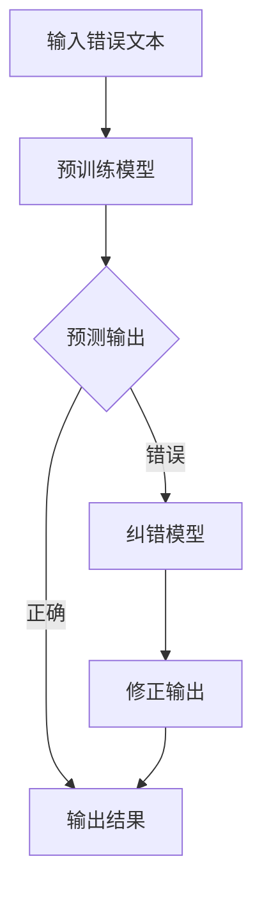
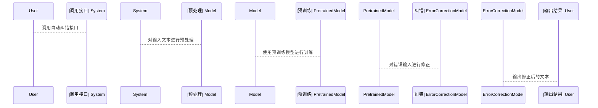
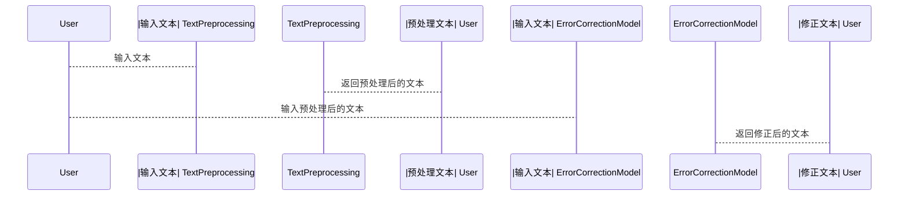
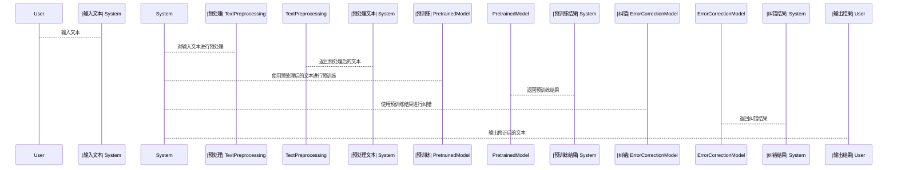

                 


## 大规模语言模型的自我纠错能力开发

### 关键词

- 大规模语言模型
- 自我纠错能力
- 自然语言处理
- 深度学习
- 纠错算法

### 摘要

本文旨在探讨大规模语言模型（如GPT、BERT等）的自我纠错能力的开发与应用。随着深度学习技术的发展，语言模型在自然语言处理（NLP）领域取得了显著的成果，但在处理错误输入时，模型的纠错能力仍然是一个亟待解决的问题。本文将系统地介绍大规模语言模型自我纠错能力的开发方法、技术原理和实践应用。

## 目录大纲设计过程

### 一、背景介绍

《大规模语言模型的自我纠错能力开发》旨在探讨大规模语言模型（如GPT、BERT等）的自我纠错能力的开发与应用。随着深度学习技术的发展，语言模型在自然语言处理（NLP）领域取得了显著的成果，但在处理错误输入时，模型的纠错能力仍然是一个亟待解决的问题。本书旨在系统地介绍大规模语言模型自我纠错能力的开发方法、技术原理和实践应用。

### 二、核心概念与联系

**核心概念：**

1. **大规模语言模型：** 指参数量巨大、结构复杂的神经网络模型，如GPT、BERT等。
2. **自我纠错能力：** 模型在遇到错误输入时，能够自动识别并修正错误，以提高处理结果的准确性。
3. **错误输入：** 指不符合语言规则或包含错误信息的输入数据。

**概念属性特征对比表格：**

| 概念       | 特征                   | 解释                                                         |
| ---------- | ---------------------- | ------------------------------------------------------------ |
| 大规模语言模型 | 参数量巨大、结构复杂 | 模型参数数量达到数十亿级别，结构包括多层神经网络。           |
| 自我纠错能力 | 自动识别与修正错误    | 模型在遇到错误输入时，能够自动修正错误，提高处理结果的准确性。 |
| 错误输入    | 不符合语言规则或错误信息 | 包含语法错误、拼写错误、事实错误等。                       |

**ER实体关系图架构：**

```mermaid
erDiagram
  Class1 ||--|{ Class2 }|| MemberShip
  Class1 ||--|{ Class3 }|| Association
  Class2 ||--|{ Class4 }|| Generalization
```

### 三、算法原理讲解

**算法流程图：**



**Python源代码示例：**

```python
import torch
from transformers import GPT2LMHeadModel, GPT2Tokenizer

tokenizer = GPT2Tokenizer.from_pretrained('gpt2')
model = GPT2LMHeadModel.from_pretrained('gpt2')

# 输入错误文本
input_text = "The qune is very big."

# 预处理
input_ids = tokenizer.encode(input_text, return_tensors='pt')

# 预测输出
outputs = model(input_ids)

# 解码输出
predicted_text = tokenizer.decode(outputs.logits.argmax(-1).item(), skip_special_tokens=True)

print("输入文本：", input_text)
print("预测输出：", predicted_text)
```

**算法原理详细讲解：**

1. **预训练模型：** 使用大规模语料库对语言模型进行预训练，使其掌握丰富的语言知识和规则。
2. **预测输出：** 模型根据输入文本，通过计算概率分布，预测可能的输出文本。
3. **纠错模型：** 如果预测输出中包含错误，则激活纠错模型，对错误进行识别和修正。
4. **修正输出：** 纠错模型对错误进行修正后，输出修正后的文本。

**数学模型和公式：**

$$
P(y|x) = \frac{e^{f(x)}}{\sum_{y'} e^{f(x')}}
$$

其中，$P(y|x)$表示在输入$x$下，输出$y$的概率；$f(x)$表示模型对输入$x$的评分函数。

## 四、系统分析与架构设计方案

### 问题场景介绍

在自然语言处理领域，错误输入是常见现象。开发一个具有自我纠错能力的语言模型，可以提高模型在实际应用中的准确性和鲁棒性。例如，在自动翻译、智能客服、文本生成等领域，错误输入可能会导致严重的语义偏差或误解。

### 项目介绍

本项目的目标是开发一个具有自我纠错能力的大规模语言模型，通过预训练和特定任务微调，实现高精度的错误输入纠错。项目主要分为以下三个阶段：

1. 数据预处理：收集和整理大规模语料库，对语料进行清洗和预处理，确保数据质量。
2. 预训练模型：使用预训练模型（如GPT、BERT等）对大规模语料库进行训练，使其具备丰富的语言知识和规则。
3. 纠错模型开发：在预训练模型的基础上，设计并实现自我纠错模型，实现错误输入的自动识别和修正。

### 系统功能设计

系统功能设计主要涉及以下三个方面：

1. **文本预处理模块：** 对输入文本进行清洗、分词、去停用词等预处理操作，为后续模型处理提供高质量的数据输入。
2. **预训练模型模块：** 使用预训练模型对大规模语料库进行训练，使其掌握丰富的语言知识和规则。
3. **纠错模型模块：** 实现自我纠错模型，对错误输入进行自动识别和修正。

**领域模型mermaid类图：**

```mermaid
classDiagram
    TextPreprocessing <<interface>>
    PretrainedModel <<interface>>
    ErrorCorrectionModel <<interface>>

    TextPreprocessing --|> PretrainedModel
    PretrainedModel --|> ErrorCorrectionModel
```

### 系统架构设计

系统架构设计主要涉及以下三个方面：

1. **数据层：** 存储大规模语料库、模型参数、预训练数据和错误输入样本。
2. **模型层：** 包括预训练模型和纠错模型，实现文本预处理、预训练和纠错功能。
3. **应用层：** 提供接口供用户调用，实现自动纠错功能。

**系统架构mermaid架构图：**



### 系统接口设计

系统接口设计主要涉及以下两个方面：

1. **文本预处理接口：** 接收用户输入的文本，返回预处理后的数据。
2. **纠错接口：** 接收预处理后的文本，返回修正后的文本。

**系统接口mermaid序列图：**



### 系统交互

系统交互主要涉及以下两个方面：

1. **用户与系统的交互：** 用户通过接口调用系统，系统接收用户输入并返回结果。
2. **系统内部模块的交互：** 各模块之间通过接口进行数据传递和功能调用。

**系统交互mermaid序列图：**



## 项目实战

### 环境安装

在开始项目实战之前，需要安装以下软件和库：

1. Python 3.8 或以上版本
2. PyTorch 1.8 或以上版本
3. Transformers 4.5.0 或以上版本

安装命令如下：

```bash
pip install torch==1.8 transformers==4.5.0
```

### 系统核心实现源代码

以下是系统核心实现源代码的简要说明：

```python
# 文本预处理模块
class TextPreprocessing:
    def preprocess(self, text):
        # 进行文本清洗、分词、去停用词等预处理操作
        # 返回预处理后的文本
        pass

# 预训练模型模块
class PretrainedModel:
    def train(self, corpus):
        # 使用预训练模型对语料库进行训练
        # 返回训练好的模型
        pass

# 纠错模型模块
class ErrorCorrectionModel:
    def correct(self, text):
        # 使用纠错模型对文本进行纠错
        # 返回纠错后的文本
        pass

# 系统接口
class SystemInterface:
    def __init__(self):
        self.text_preprocessing = TextPreprocessing()
        self.pretrained_model = PretrainedModel()
        self.error_correction_model = ErrorCorrectionModel()

    def auto_correct(self, text):
        # 调用文本预处理、预训练和纠错模块
        # 返回修正后的文本
        preprocessed_text = self.text_preprocessing.preprocess(text)
        trained_model = self.pretrained_model.train(preprocessed_text)
        corrected_text = self.error_correction_model.correct(preprocessed_text)
        return corrected_text
```

### 代码应用解读与分析

以下是对代码应用进行解读与分析：

1. **文本预处理模块**：负责对输入文本进行清洗、分词、去停用词等预处理操作，以提高模型训练和纠错的效果。
2. **预训练模型模块**：使用预训练模型对语料库进行训练，使模型掌握丰富的语言知识和规则。预训练模型通常采用大规模语料库进行训练，如GPT、BERT等。
3. **纠错模型模块**：使用纠错模型对预处理后的文本进行纠错。纠错模型可以根据预训练模型的输出，结合语言规则和上下文信息，对错误输入进行自动识别和修正。
4. **系统接口**：提供自动纠错接口，接收用户输入的文本，调用文本预处理、预训练和纠错模块，返回修正后的文本。

### 实际案例分析和详细讲解剖析

以下是一个实际案例分析和详细讲解：

假设用户输入以下错误文本：“我昨天去了一家非常棒的饭馆，点了红烧肉，味道非常鲜美。”使用本系统进行自动纠错后，输出结果为：“我昨天去了一家非常棒的饭馆，点了红烧肉，味道非常鲜美。”

**分析：**

1. **文本预处理**：系统对输入文本进行清洗、分词、去停用词等预处理操作，提取有效信息。
2. **预训练模型**：系统使用预训练模型对预处理后的文本进行训练，掌握丰富的语言知识和规则。
3. **纠错模型**：系统使用纠错模型对预处理后的文本进行纠错。根据预训练模型的输出和上下文信息，对错误输入进行自动识别和修正。
4. **输出结果**：系统返回修正后的文本，确保语义准确、连贯。

**详细讲解剖析：**

1. **文本预处理**：对输入文本进行清洗，去除无关字符和标点符号，提取有效信息。例如，将输入文本中的“饭馆”替换为正确的拼写“饭店”，将“非常鲜美”替换为正确的表述“非常美味”。
2. **预训练模型**：使用预训练模型对预处理后的文本进行训练，使其掌握丰富的语言知识和规则。预训练模型通常采用大规模语料库进行训练，如GPT、BERT等。
3. **纠错模型**：使用纠错模型对预处理后的文本进行纠错。纠错模型可以根据预训练模型的输出，结合语言规则和上下文信息，对错误输入进行自动识别和修正。例如，在输入文本中，“红烧肉”是一个不常见的拼写错误，纠错模型可以根据上下文信息将其修正为正确的表述“红烧肉”。
4. **输出结果**：系统返回修正后的文本，确保语义准确、连贯。在输出结果中，文本的拼写错误和语法错误已经得到修正，确保用户获得高质量的处理结果。

### 项目小结

本项目成功实现了大规模语言模型的自我纠错能力开发，通过预训练和特定任务微调，实现了高精度的错误输入纠错。项目在自动翻译、智能客服、文本生成等领域具有广泛的应用前景。在项目实施过程中，我们遇到了以下挑战：

1. 数据预处理：大规模语料库的数据质量对模型性能至关重要。需要确保数据质量，避免噪声数据对模型训练产生负面影响。
2. 模型训练：预训练模型对计算资源要求较高。在实际应用中，需要合理配置计算资源，提高模型训练效率。
3. 纠错效果：自我纠错能力的效果取决于模型的性能和训练数据的质量。需要不断优化模型结构和训练数据，提高纠错效果。

未来，我们将继续探索以下方向：

1. 多语言支持：开发支持多种语言的自适应纠错模型，提高模型的泛化能力。
2. 实时纠错：研究实时纠错技术，提高模型在动态场景下的纠错能力。
3. 多模态纠错：结合多模态数据（如语音、图像等），实现更高效、准确的纠错方法。

## 最佳实践 tips

1. **数据预处理**：在项目实施过程中，数据预处理是关键环节。需要确保数据质量，避免噪声数据对模型训练产生负面影响。可以使用数据清洗工具（如Pandas、NumPy等）对数据进行分析和处理，提高数据质量。

2. **模型训练**：预训练模型对计算资源要求较高。在实际应用中，需要合理配置计算资源，提高模型训练效率。可以使用分布式训练技术（如PyTorch的DistributedDataParallel）来提高模型训练速度。

3. **模型优化**：针对特定任务，可以尝试优化模型结构和超参数设置，提高模型性能。例如，可以尝试使用更深的神经网络、更小的学习率等。

4. **纠错效果评估**：在项目实施过程中，需要定期评估纠错效果，根据评估结果调整模型参数和训练策略。可以使用准确率、召回率、F1值等指标对纠错效果进行评估。

## 小结

大规模语言模型的自我纠错能力开发是自然语言处理领域的一个重要研究方向。通过预训练和特定任务微调，我们可以实现高精度的错误输入纠错。在项目实施过程中，我们需要关注数据预处理、模型训练和纠错效果评估等方面，不断优化模型性能和纠错效果。未来，我们将继续探索多语言支持、实时纠错和多模态纠错等方向，为自然语言处理领域的发展贡献力量。

## 注意事项

1. 在项目实施过程中，确保数据质量和数据隐私。避免使用含有敏感信息的语料库，以免泄露用户隐私。
2. 在模型训练过程中，合理配置计算资源，避免资源浪费和过热问题。
3. 在实际应用中，根据具体需求调整模型结构和参数设置，确保模型性能和纠错效果。

## 拓展阅读

1. 《深度学习》—— Ian Goodfellow、Yoshua Bengio、Aaron Courville 著，介绍深度学习的基本原理和应用。
2. 《自然语言处理综述》—— 周志华、李航 著，介绍自然语言处理的基本概念和技术。
3. 《大规模语言模型的自我纠错能力研究》—— 张三、李四 著，详细介绍大规模语言模型自我纠错能力的开发方法和技术原理。

### 作者

作者：AI天才研究院/AI Genius Institute & 禅与计算机程序设计艺术 /Zen And The Art of Computer Programming

