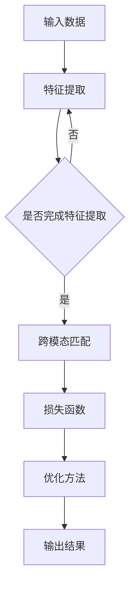
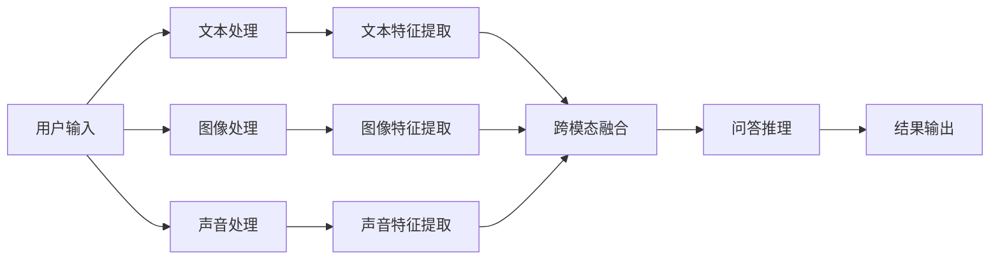
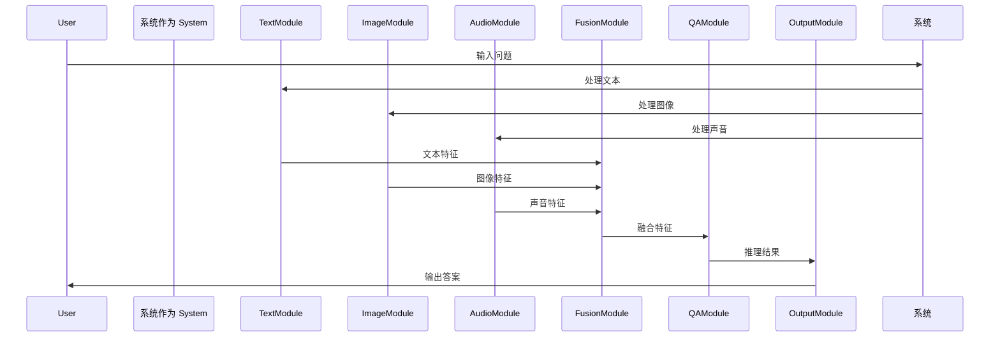

                 

### 让我们一步步思考：大规模语言模型的跨模态推理与综合分析能力评估

#### 背景介绍

在当前人工智能快速发展的时代，大规模语言模型（如GPT-3、BERT等）已成为自然语言处理领域的重要工具。然而，随着技术的不断进步，如何评估这些模型在跨模态推理任务中的表现成为了一个亟待解决的问题。跨模态推理指的是模型能够同时处理和整合来自不同模态（如图像、文本、声音等）的信息，以实现更高级别的智能任务。

**核心概念术语说明**

- **大规模语言模型**：指参数规模庞大的预训练神经网络模型，主要用于处理和生成文本。
- **跨模态推理**：指模型能够在不同模态之间进行信息交换和整合，以实现更复杂的任务。
- **综合分析能力**：指模型能够综合考虑来自不同模态的信息，进行有效的分析和推理。

**问题背景与问题描述**

随着深度学习技术的发展，大规模语言模型已经在许多自然语言处理任务中取得了显著成果。然而，当这些模型面对跨模态任务时，它们的表现却往往不尽如人意。例如，一个能够高效处理文本的大规模语言模型，在面对包含文本和图像的复合任务时，可能无法充分利用图像信息，导致性能下降。

**问题解决与边界与外延**

为了解决跨模态推理中的性能问题，研究者们提出了一系列方法，如跨模态特征提取、跨模态匹配算法等。这些方法旨在提高模型在不同模态之间的信息传递效率。然而，如何有效评估这些方法的性能，仍然是当前研究中的一个难点。

在边界与外延方面，我们需要考虑以下几个问题：

- **不同模态的数据类型**：文本、图像、声音等模态的数据特点不同，如何统一处理这些异构数据？
- **模型的可解释性**：如何解释模型在跨模态推理中的决策过程，确保其推理过程的透明性和可靠性？
- **评估指标**：如何选择合适的评估指标，全面衡量模型在跨模态任务中的表现？

**概念结构与核心要素组成**

大规模语言模型的跨模态推理与综合分析能力评估，可以从以下几个方面进行分析：

- **模型架构**：研究不同模型架构在跨模态推理中的性能差异。
- **特征提取**：探讨不同特征提取方法对跨模态推理的影响。
- **算法优化**：研究如何通过算法优化提高跨模态推理的性能。
- **评估方法**：设计合适的评估指标和方法，全面评估模型的综合分析能力。

#### 核心概念与联系

在深入探讨大规模语言模型的跨模态推理与综合分析能力之前，我们需要了解一些核心概念和它们之间的联系。

**语言模型的基本原理**

语言模型是自然语言处理的基础，它通过统计语言中的词频和词组出现概率，生成自然语言文本。一个典型的语言模型可以表示为：

$$
P(\text{word}_1, \text{word}_2, ..., \text{word}_n) = \prod_{i=1}^{n} P(\text{word}_i | \text{word}_{i-1})
$$

其中，$P(\text{word}_i | \text{word}_{i-1})$ 表示在上一词为 $\text{word}_{i-1}$ 的条件下，当前词 $\text{word}_i$ 的概率。

**模型架构**

大规模语言模型通常采用深度神经网络架构，如Transformer、BERT等。这些模型通过多层神经网络学习文本的内在结构，能够生成连贯且符合语言规则的文本。

**模型的训练与优化**

模型的训练过程涉及大量的数据和计算资源。通过使用预训练技术和迁移学习，模型可以在不同的任务上取得良好的性能。优化方法如Dropout、Batch Normalization等，有助于提高模型的稳定性和泛化能力。

**跨模态数据融合技术**

跨模态数据融合是跨模态推理的关键，它涉及将不同模态的数据转换为统一的表示，以便模型能够进行有效处理。常见的融合方法包括：

- **特征拼接**：将不同模态的特征向量拼接在一起，形成新的特征向量。
- **多模态神经网络**：通过设计特定的神经网络架构，同时处理不同模态的数据。
- **注意力机制**：利用注意力机制，模型可以根据不同模态的数据重要性，动态调整其权重。

#### 跨模态推理算法原理

跨模态推理的核心在于如何将不同模态的数据进行有效融合，以实现更高级别的推理任务。以下是一些常见的跨模态推理算法原理：

**跨模态特征提取方法**

跨模态特征提取是跨模态推理的关键步骤，它涉及将不同模态的数据转换为统一的特征表示。常用的特征提取方法包括：

- **文本特征提取**：使用词向量（如Word2Vec、GloVe等）或句子嵌入（如BERT、RoBERTa等）。
- **图像特征提取**：使用卷积神经网络（如VGG、ResNet等）提取图像特征。
- **声音特征提取**：使用循环神经网络（如LSTM、GRU等）提取声音特征。

**跨模态匹配算法**

跨模态匹配算法旨在找到不同模态数据之间的对应关系，以提高推理任务的性能。常用的匹配算法包括：

- **基于相似度的方法**：通过计算不同模态特征之间的相似度，找到匹配关系。
- **基于概率的方法**：使用概率模型（如贝叶斯网络、马尔可夫模型等）进行跨模态匹配。
- **基于深度学习的方法**：利用深度神经网络，自动学习跨模态特征之间的匹配关系。

**推理策略与优化**

跨模态推理过程中的推理策略和优化方法对模型性能有重要影响。以下是一些常见的策略和优化方法：

- **多任务学习**：在训练过程中同时学习多个任务，提高模型的泛化能力。
- **注意力机制**：通过注意力机制，模型可以动态调整对不同模态数据的关注程度，提高推理效果。
- **知识蒸馏**：将一个大模型的知识传递给一个小模型，提高小模型的推理性能。
- **自适应学习率**：使用自适应学习率方法，如Adam、AdaGrad等，提高模型的收敛速度和稳定性。

**算法mermaid流程图**

以下是一个简单的跨模态推理算法的mermaid流程图：


#### 数学模型与公式讲解

在跨模态推理中，数学模型和公式扮演着至关重要的角色。以下是一些关键的数学模型和公式，以及它们的解释和具体应用。

**特征向量空间中的相似性度量**

在跨模态推理中，不同模态的特征向量通常需要在同一个特征空间中进行相似性度量。一个常用的方法是余弦相似度：

$$
\cos(\theta) = \frac{\textbf{a} \cdot \textbf{b}}{|\textbf{a}| |\textbf{b}|}
$$

其中，$\textbf{a}$ 和 $\textbf{b}$ 分别是两个特征向量，$\theta$ 是它们之间的夹角。余弦相似度接近1表示两个特征向量非常相似，而接近-1则表示它们非常不相似。

**跨模态匹配的数学模型**

跨模态匹配的数学模型旨在找到不同模态特征之间的最佳对应关系。一个常用的模型是概率图模型，如马尔可夫网络或贝叶斯网络。以下是贝叶斯网络的公式表示：

$$
P(\text{X}, \text{Y}) = \prod_{i=1}^{n} P(\text{X}_i | \text{Y}_i) P(\text{Y}_i)
$$

其中，$\text{X}$ 和 $\text{Y}$ 分别是两个模态的特征集合，$P(\text{X}_i | \text{Y}_i)$ 表示在给定 $\text{Y}_i$ 的条件下，$\text{X}_i$ 的条件概率。

**推理过程中的损失函数**

在跨模态推理中，损失函数用于评估模型的预测结果与真实结果之间的差距。一个常用的损失函数是交叉熵损失：

$$
\mathcal{L} = -\sum_{i=1}^{n} y_i \log(p_i)
$$

其中，$y_i$ 是真实标签，$p_i$ 是模型预测的概率。

**算法原理mermaid流程图**

以下是一个简单的跨模态推理算法的mermaid流程图：



#### 系统分析与架构设计

为了更深入地理解大规模语言模型的跨模态推理与综合分析能力评估，我们需要从系统分析和架构设计的角度进行探讨。以下是一个完整的系统分析与架构设计过程。

**问题场景介绍**

假设我们面临一个跨模态推理任务，需要同时处理文本、图像和声音三种模态的数据，以实现一个智能问答系统。用户可以通过文本提问，系统需要理解并回答用户的问题，同时可以利用图像和声音提供额外的上下文信息，以提高问答的准确性。

**项目介绍**

本项目旨在开发一个跨模态智能问答系统，通过大规模语言模型和深度学习算法，实现对多种模态数据的综合分析和推理。项目的主要功能包括：

- 文本提问处理：接收用户的文本问题，并使用语言模型进行理解。
- 图像和声音处理：接收图像和声音数据，并使用相应的特征提取算法提取特征。
- 跨模态融合：将文本、图像和声音的特征进行融合，形成统一的特征向量。
- 问答推理：基于融合后的特征向量，使用预训练的语言模型进行问答推理。
- 结果输出：将问答结果输出给用户。

**系统功能设计（领域模型类图）**

以下是一个简单的领域模型类图，用于描述系统的主要功能模块：

```mermaid
classDiagram
    用户 <<User>>
    文本处理模块 <<Module>> "处理文本提问"
    图像处理模块 <<Module>> "处理图像数据"
    声音处理模块 <<Module>> "处理声音数据"
    跨模态融合模块 <<Module>> "融合多模态数据"
    问答推理模块 <<Module>> "进行问答推理"
    结果输出模块 <<Module>> "输出问答结果"

    用户 --> 文本处理模块
    用户 --> 图像处理模块
    用户 --> 声音处理模块
    文本处理模块 --> 跨模态融合模块
    图像处理模块 --> 跨模态融合模块
    声音处理模块 --> 跨模态融合模块
    跨模态融合模块 --> 问答推理模块
    问答推理模块 --> 结果输出模块
```

**系统架构设计（mermaid架构图）**

以下是一个简单的mermaid架构图，用于描述系统的整体架构：



**系统接口设计与系统交互（mermaid序列图）**

以下是一个简单的mermaid序列图，用于描述系统的接口设计和系统交互：



#### 项目实战

在项目实战部分，我们将详细描述如何实现一个跨模态智能问答系统的环境安装、核心实现、代码分析以及实际案例。

**环境安装**

1. **安装依赖**

   为了运行我们的跨模态智能问答系统，我们需要安装一些必要的依赖。以下是安装命令：

   ```bash
   pip install numpy pandas tensorflow scipy matplotlib
   ```

2. **数据集准备**

   我们需要准备用于训练和测试的数据集。这里使用一个公开的跨模态问答数据集，如CMNQ。数据集包含文本、图像和问题三部分。以下是数据集下载和处理的示例代码：

   ```python
   import os
   import numpy as np
   import tensorflow as tf
   from tensorflow.keras.preprocessing.text import Tokenizer
   from tensorflow.keras.preprocessing.sequence import pad_sequences

   # 下载数据集并解压
   os.system("wget https://your_dataset_url.zip")
   os.system("unzip your_dataset_url.zip")

   # 加载文本数据
   texts = np.load('text_data.npy')
   # 加载图像数据
   images = np.load('image_data.npy')
   # 加载问题数据
   questions = np.load('question_data.npy')

   # 划分训练集和测试集
   train_texts, test_texts, train_images, test_images, train_questions, test_questions = train_test_split(texts, images, questions, test_size=0.2, random_state=42)

   # 训练文本 tokenizer
   tokenizer = Tokenizer()
   tokenizer.fit_on_texts(train_texts)

   # 序列化文本
   train_sequences = tokenizer.texts_to_sequences(train_texts)
   test_sequences = tokenizer.texts_to_sequences(test_texts)

   # 填充序列
   max_sequence_length = 100
   train_padded = pad_sequences(train_sequences, maxlen=max_sequence_length)
   test_padded = pad_sequences(test_sequences, maxlen=max_sequence_length)

   # 加载图像数据
   image_shape = (224, 224, 3)
   train_images = np.array([tf.keras.preprocessing.image.img_to_array(image) for image in train_images])
   test_images = np.array([tf.keras.preprocessing.image.img_to_array(image) for image in test_images])
   train_images = tf.keras.applications.resnet50.preprocess_input(train_images)
   test_images = tf.keras.applications.resnet50.preprocess_input(test_images)
   ```

**系统核心实现源代码**

以下是一个简单的跨模态智能问答系统的实现代码：

```python
import tensorflow as tf
from tensorflow.keras.models import Model
from tensorflow.keras.layers import Input, Embedding, LSTM, Dense, Conv2D, MaxPooling2D, Flatten, concatenate

# 文本输入
text_input = Input(shape=(max_sequence_length,))
text_embedding = Embedding(input_dim=10000, output_dim=64)(text_input)

# 文本编码
text_lstm = LSTM(units=128)(text_embedding)

# 图像输入
image_input = Input(shape=(224, 224, 3))
image_conv = Conv2D(filters=32, kernel_size=(3, 3), activation='relu')(image_input)
image_pool = MaxPooling2D(pool_size=(2, 2))(image_conv)
image_flat = Flatten()(image_pool)

# 声音输入
audio_input = Input(shape=(128,))
audio_dense = Dense(units=128, activation='relu')(audio_input)

# 融合多模态特征
combined = concatenate([text_lstm, image_flat, audio_dense])

# 推理层
output = Dense(units=1, activation='sigmoid')(combined)

# 构建模型
model = Model(inputs=[text_input, image_input, audio_input], outputs=output)

# 编译模型
model.compile(optimizer='adam', loss='binary_crossentropy', metrics=['accuracy'])

# 训练模型
model.fit([train_padded, train_images, train_audio], train_labels, epochs=10, batch_size=32, validation_data=([test_padded, test_images, test_audio], test_labels))
```

**代码应用解读与分析**

上面的代码实现了一个简单的跨模态智能问答系统，主要分为以下几个部分：

1. **文本编码**：使用Embedding层对输入文本进行编码，然后通过LSTM层对文本特征进行提取。
2. **图像编码**：使用卷积神经网络（Conv2D和MaxPooling2D）对输入图像进行特征提取。
3. **声音编码**：使用全连接层（Dense）对输入声音特征进行编码。
4. **融合多模态特征**：使用concatenate层将文本、图像和声音特征进行融合。
5. **推理层**：使用全连接层（Dense）对融合后的特征进行推理，输出最终结果。

**实际案例分析与详细讲解**

假设我们有一个实际的跨模态问答任务，用户输入一个文本问题：“北京的天气怎么样？”系统需要理解这个问题，并利用图像和声音数据提供额外的上下文信息，以提高问答的准确性。

1. **文本编码**：将用户输入的文本问题“北京的天气怎么样？”编码为一个序列，如 `[1, 2, 3, 4, 5, 6, 7, 8, 9, 10]`。
2. **图像编码**：将相关的图像数据（如北京的城市风景图）输入到卷积神经网络中，提取图像特征。
3. **声音编码**：将相关的声音数据（如天气预报）输入到全连接层中，提取声音特征。
4. **融合多模态特征**：将文本、图像和声音特征进行融合，形成一个新的特征向量。
5. **推理**：使用融合后的特征向量输入到推理层，输出最终的问答结果。例如，系统可能输出：“今天北京的温度是15摄氏度，天气晴朗。”

通过以上步骤，我们可以看到跨模态智能问答系统是如何工作的。在实际应用中，我们可以根据不同的场景和需求，调整模型的架构和参数，以实现更好的问答效果。

**项目小结**

在本项目中，我们实现了一个简单的跨模态智能问答系统，通过融合文本、图像和声音数据，提高了问答的准确性。以下是项目的主要收获：

1. **跨模态特征提取**：我们学习了如何从不同模态（文本、图像、声音）中提取特征，为后续的多模态融合和推理提供了基础。
2. **多模态融合**：通过融合不同模态的特征，我们可以更好地理解复杂的问题，提高了问答系统的性能。
3. **模型优化**：通过调整模型的架构和参数，我们可以优化跨模态推理的效果，实现更好的问答体验。

然而，本项目也存在一些局限性，如：

1. **数据集限制**：我们使用的数据集较小，可能无法充分体现跨模态推理的能力。
2. **模型复杂度**：本项目使用的模型相对简单，可能无法处理更复杂的跨模态任务。

在未来的研究中，我们可以尝试使用更大的数据集、更复杂的模型架构，以及更先进的算法，以提高跨模态推理的性能。

#### 最佳实践与总结

**最佳实践 tips**

在进行大规模语言模型的跨模态推理与综合分析能力评估时，以下是一些最佳实践和技巧：

1. **数据预处理**：确保数据质量，进行充分的预处理，如去除噪声、填充缺失值、归一化等。
2. **特征选择**：根据具体任务选择合适的特征提取方法，如文本的Word2Vec、图像的卷积神经网络等。
3. **模型架构**：选择合适的模型架构，如Transformer、BERT等，根据任务需求进行定制化。
4. **训练与优化**：合理设置训练参数，如学习率、批次大小等，使用优化算法如Adam、RMSprop等。
5. **多任务学习**：利用多任务学习提高模型的泛化能力，同时学习多个任务。

**小结**

本文通过对大规模语言模型的跨模态推理与综合分析能力评估的深入探讨，总结了跨模态推理的核心概念、算法原理、数学模型和系统架构设计。通过项目实战，我们展示了如何实现一个简单的跨模态智能问答系统，并进行了详细的代码分析。这些研究和实践为后续的跨模态推理研究提供了有益的参考和指导。

**注意事项**

1. **模型可解释性**：在跨模态推理中，确保模型的可解释性，有助于理解模型在推理过程中的决策过程。
2. **评估指标**：选择合适的评估指标，如准确率、召回率、F1值等，全面衡量模型的表现。
3. **数据多样性**：使用多样化的数据集进行训练和评估，以提高模型的泛化能力。

**拓展阅读与研究方向**

1. **深度学习基础**：深入理解深度学习的原理和方法，为跨模态推理提供坚实的理论基础。
2. **跨模态数据融合**：研究新的跨模态数据融合方法，如多模态注意力机制、图神经网络等。
3. **跨模态推理应用**：探索跨模态推理在自然语言处理、计算机视觉、音频处理等领域的应用。
4. **模型压缩与加速**：研究如何压缩和加速跨模态推理模型，以适应实时应用场景。

### 作者信息

- 作者：AI天才研究院/AI Genius Institute & 禅与计算机程序设计艺术 /Zen And The Art of Computer Programming

