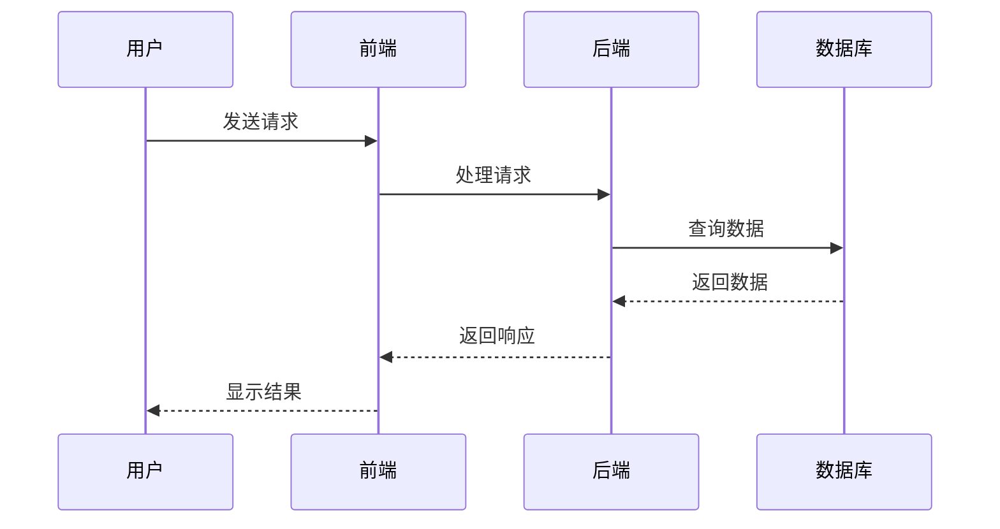
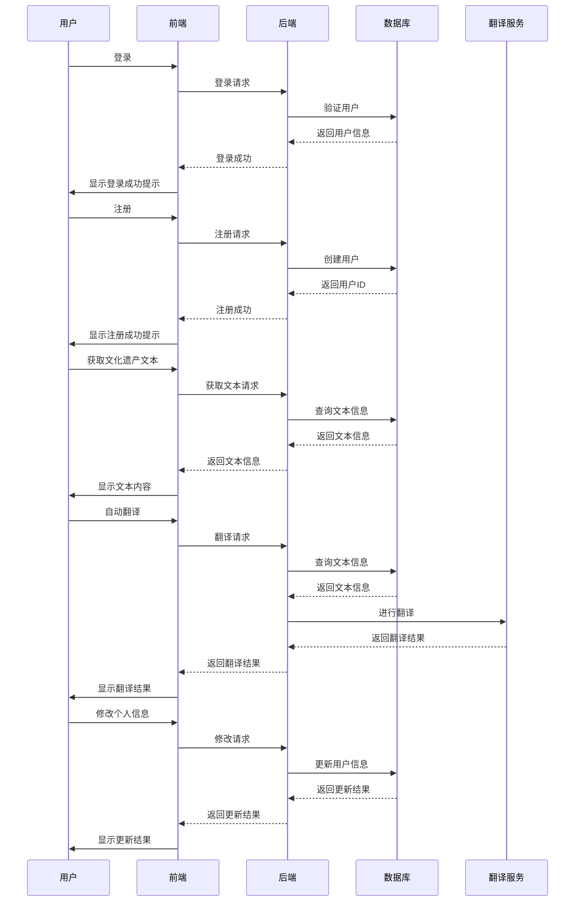

                 


## 大规模语言模型的跨语言推理在全球文化遗产保护中的应用研究

### 关键词：大规模语言模型、跨语言推理、全球文化遗产保护、算法原理、系统架构设计、项目实战

### 摘要：
随着全球文化的多样性和交流的不断加深，文化遗产保护面临着跨语言的挑战。大规模语言模型（Large-scale Language Models，简称LLM）的跨语言推理能力为文化遗产保护提供了新的解决方案。本文旨在探讨大规模语言模型在跨语言推理方面的应用，分析其在全球文化遗产保护中的重要性、应用场景及具体实施方案。通过对大规模语言模型和跨语言推理的核心概念进行解读，本文详细介绍了算法原理，并设计了一套针对全球文化遗产保护的系统架构方案。通过项目实战案例，本文展示了大规模语言模型在全球文化遗产保护中的实际应用效果，为相关领域的研究与实践提供了有益的参考。

## 背景介绍

### 1.1 全球文化遗产保护的现状与挑战

在全球化的背景下，各国文化相互交融，文化遗产保护面临着前所未有的挑战。首先，文化遗产的种类繁多，包括历史建筑、传统艺术、手工艺品、文学和历史文献等，每一种文化遗产都有其独特的价值和意义。然而，由于语言障碍，这些文化遗产的保护与传承工作面临着巨大的困难。

语言障碍主要体现在以下几个方面：

1. **文化遗产记录的缺失**：许多文化遗产的文字记录缺乏，尤其是非西方国家的文化遗产。这导致对文化遗产的理解和保护工作难以开展。
2. **文化遗产信息的不对称**：不同国家和地区的文化遗产信息在语言上存在差异，这导致了信息不对称，影响了文化遗产的保护工作。
3. **跨文化理解困难**：不同文化背景下的文化遗产保护理念和方法存在差异，跨文化理解成为文化遗产保护的一大难题。

### 1.2 跨语言推理的重要性

跨语言推理（Cross-Lingual Reasoning）是人工智能领域的一个重要研究方向，它旨在实现不同语言之间信息的转换和推理。在文化遗产保护中，跨语言推理具有以下重要作用：

1. **信息共享**：通过跨语言推理，可以将不同语言的文化遗产信息进行整合和共享，提高文化遗产保护工作的效率。
2. **文化理解**：跨语言推理有助于跨文化理解，使得不同语言背景的人们能够更好地理解和欣赏文化遗产，促进文化交流。
3. **数字化保护**：跨语言推理技术可以将文化遗产的数字化工作推向新的高度，使得文化遗产能够跨越语言障碍，实现全球传播。

### 1.3 大规模语言模型的发展与应用

大规模语言模型（Large-scale Language Models）是指使用海量数据训练的复杂神经网络模型，能够理解和生成自然语言。近年来，随着计算能力和数据资源的提升，大规模语言模型得到了迅速发展。以下是一些大规模语言模型的主要特点和应用：

1. **语言理解能力增强**：大规模语言模型通过对海量文本的学习，能够捕捉到语言的复杂结构和语义，提高了语言理解的能力。
2. **生成文本**：大规模语言模型能够根据输入的文本内容生成连贯的文本，应用于自动写作、机器翻译等领域。
3. **跨语言应用**：大规模语言模型在跨语言任务中表现出色，能够实现不同语言之间的文本转换和推理。

在文化遗产保护中，大规模语言模型的应用主要体现在以下几个方面：

1. **文本分析**：通过大规模语言模型，可以对文化遗产的文本资料进行深入分析，挖掘出隐藏的文化价值。
2. **自动翻译**：大规模语言模型可以实现文化遗产文本的自动翻译，降低跨语言交流的障碍。
3. **内容生成**：大规模语言模型可以生成关于文化遗产的文本内容，丰富文化遗产的数字化资料。

### 1.4 研究目的与意义

本文旨在研究大规模语言模型在跨语言推理方面的应用，探讨其在全球文化遗产保护中的具体作用和实施方案。具体研究目的如下：

1. **核心概念理解**：深入理解大规模语言模型和跨语言推理的核心概念，为后续研究提供理论基础。
2. **算法原理分析**：分析大规模语言模型和跨语言推理的算法原理，为实际应用提供技术支持。
3. **系统架构设计**：设计一套针对全球文化遗产保护的系统架构方案，为实际应用提供可操作性的解决方案。
4. **项目实战**：通过实际项目案例，验证大规模语言模型在文化遗产保护中的效果，为相关领域提供实践参考。

本文的研究不仅有助于提高全球文化遗产保护工作的效率和质量，还能够推动人工智能技术在文化遗产保护领域的应用，具有重要的理论和实践意义。

### 1.5 问题解决与边界

#### 1.5.1 研究方法与技术路线

本文采用以下研究方法和技术路线：

1. **文献综述**：通过查阅相关文献，了解大规模语言模型和跨语言推理的最新研究进展。
2. **理论分析**：对大规模语言模型和跨语言推理的核心概念和算法原理进行深入分析。
3. **系统设计**：设计一套适用于全球文化遗产保护的系统架构方案。
4. **项目实施**：通过实际项目案例，验证系统架构方案的有效性。

#### 1.5.2 研究范围与限制

本文的研究范围主要包括以下几个方面：

1. **研究对象**：全球文化遗产保护中的跨语言问题。
2. **研究方法**：大规模语言模型和跨语言推理技术。
3. **研究应用**：文化遗产保护中的文本分析、自动翻译和内容生成。

本文的研究存在以下限制：

1. **数据来源**：由于全球文化遗产数据的不完整性，本文的数据来源可能存在局限性。
2. **技术实现**：本文的系统设计在技术实现层面可能存在一定的挑战，需要进一步优化和完善。

#### 1.5.3 研究意义与展望

本文的研究意义主要体现在以下几个方面：

1. **提高文化遗产保护效率**：通过大规模语言模型和跨语言推理技术，可以显著提高文化遗产保护工作的效率。
2. **促进文化交流与理解**：跨语言推理技术有助于不同文化背景的人们更好地理解和欣赏文化遗产，促进文化交流。
3. **推动人工智能应用**：本文的研究为人工智能技术在文化遗产保护领域的应用提供了新的思路和实践。

未来的研究方向包括：

1. **数据扩充与优化**：通过收集更多和更丰富的文化遗产数据，提高系统性能。
2. **算法优化与改进**：进一步优化大规模语言模型和跨语言推理算法，提高其准确性和效率。
3. **跨学科合作**：结合历史学、语言学、计算机科学等多个学科的研究，推动文化遗产保护领域的创新发展。

## 核心概念与联系

### 2.1 大规模语言模型

#### 2.1.1 概念与定义

大规模语言模型（Large-scale Language Models）是一种基于深度学习技术的自然语言处理模型，通过在大量文本数据上进行训练，能够理解和生成自然语言。与传统语言模型相比，大规模语言模型具有以下几个显著特点：

1. **数据量巨大**：大规模语言模型通常使用数百万甚至数十亿级别的文本数据，这使得模型能够捕捉到语言中的复杂模式和语义信息。
2. **参数数量庞大**：大规模语言模型包含数百万至数十亿的参数，这增加了模型的表达能力，使其能够处理复杂的语言任务。
3. **性能优异**：大规模语言模型在自然语言理解、文本生成、机器翻译等领域表现出色，其性能显著优于传统模型。

#### 2.1.1.1 语言模型的基本原理

语言模型的核心任务是预测下一个单词或字符的概率。其基本原理可以归纳为以下几个步骤：

1. **数据预处理**：将原始文本数据转换为数字形式，如词嵌入（Word Embedding）或字符嵌入（Character Embedding）。
2. **模型构建**：使用神经网络（如循环神经网络RNN、长短时记忆网络LSTM、门控循环单元GRU等）来构建语言模型。
3. **损失函数**：通过训练，模型将输入的文本序列映射到相应的概率分布上，使用损失函数（如交叉熵损失）来评估模型的预测效果。
4. **优化算法**：使用梯度下降（Gradient Descent）或其变种（如Adam优化器）来优化模型参数。

#### 2.1.1.2 大规模语言模型的特点

大规模语言模型的特点主要体现在以下几个方面：

1. **强大的语言理解能力**：通过大量数据训练，大规模语言模型能够理解复杂的语言结构和语义，使得其能够进行准确的文本分析和生成。
2. **高效的文本生成**：大规模语言模型能够高效地生成连贯的文本，应用范围广泛，包括自动写作、内容生成和机器翻译等。
3. **自适应性和灵活性**：大规模语言模型可以根据不同的任务和数据集进行自适应调整，适应不同的应用场景。

#### 2.1.2 主流大规模语言模型介绍

目前，主流的大规模语言模型包括以下几种：

1. **Word2Vec**：Word2Vec是一种基于神经网络的语言模型，通过训练模型来生成词嵌入。它的核心思想是将每个单词映射到一个固定维度的向量空间中，使得语义相似的单词在空间中距离较近。
2. **GloVe**：GloVe（Global Vectors for Word Representation）是一种基于矩阵分解的语言模型，通过优化词嵌入的损失函数来生成高质量的词嵌入向量。GloVe相较于Word2Vec具有更高的准确性和泛化能力。
3. **BERT**：BERT（Bidirectional Encoder Representations from Transformers）是一种基于Transformer的预训练语言模型，通过双向编码器来生成单词的表示。BERT在自然语言理解任务中取得了显著的性能提升。
4. **GPT**：GPT（Generative Pre-trained Transformer）是一种基于Transformer的生成式语言模型，通过大量文本数据进行预训练，能够生成连贯的文本。GPT在文本生成任务中表现出色。

#### 2.1.3 大规模语言模型在文化遗产保护中的应用

大规模语言模型在文化遗产保护中的应用主要体现在以下几个方面：

1. **文本分析**：通过大规模语言模型，可以对文化遗产的文本资料进行深入分析，挖掘出隐藏的文化价值。例如，利用BERT模型分析古籍中的语言结构和语义关系，揭示古籍中的文化内涵。
2. **自动翻译**：大规模语言模型可以实现文化遗产文本的自动翻译，降低跨语言交流的障碍。例如，利用GPT模型将一种语言的文化遗产文本翻译成另一种语言，使得更多的受众能够了解和欣赏这些文化遗产。
3. **内容生成**：大规模语言模型可以生成关于文化遗产的文本内容，丰富文化遗产的数字化资料。例如，利用GPT模型生成关于文化遗产的描述性文本，用于展览宣传和教育。

### 2.2 跨语言推理

#### 2.2.1 概念与定义

跨语言推理（Cross-Lingual Reasoning）是指在不同语言之间进行信息转换和推理的能力。它是一种跨领域的自然语言处理技术，旨在解决跨语言信息共享、跨文化理解等问题。跨语言推理的核心任务是理解并处理不同语言之间的语义差异，实现语言的相互转换和推理。

#### 2.2.1.1 跨语言推理的基本原理

跨语言推理的基本原理可以概括为以下几个步骤：

1. **语言表示**：将不同语言的文本表示为统一的高维向量，通常使用词嵌入或跨语言嵌入技术。
2. **语义匹配**：通过计算不同语言文本之间的相似度或距离，实现语义匹配。常用的方法包括基于向量的相似性度量、基于模型的翻译模型等。
3. **信息融合**：将不同语言的信息进行融合，生成统一的语义表示。这可以通过多种技术实现，如多语言翻译模型、跨语言信息检索等。
4. **推理与决策**：基于融合的语义表示，进行跨语言的推理和决策，如机器翻译、问答系统、文本生成等。

#### 2.2.1.2 跨语言推理的类型

跨语言推理根据处理对象的不同，可以分为以下几种类型：

1. **机器翻译**：将一种语言的文本翻译成另一种语言。机器翻译是跨语言推理的一种重要应用，其目的是实现不同语言之间的无缝交流。
2. **多语言文本理解**：理解并处理多种语言混合的文本。这种类型的跨语言推理在跨文化交流和社交媒体分析中具有重要应用。
3. **跨语言问答**：回答包含多种语言的问答问题。跨语言问答系统需要具备多语言语义理解和推理能力，以应对复杂的跨语言问答场景。
4. **跨语言文本生成**：生成多种语言的文本内容。跨语言文本生成在内容创作、翻译辅助和机器写作等领域具有广泛的应用。

#### 2.2.2 跨语言推理的技术与方法

跨语言推理的技术与方法主要包括以下几个方面：

1. **基于向量的相似性度量**：使用高维向量表示不同语言的文本，通过计算向量之间的相似度来实现跨语言推理。常用的方法包括余弦相似性、欧氏距离等。
2. **基于翻译模型的方法**：使用已有的翻译模型，如神经机器翻译（NMT），将一种语言的文本翻译成另一种语言，实现跨语言推理。这种方法在机器翻译任务中表现出色。
3. **基于共享嵌入的方法**：将不同语言的文本映射到共享的嵌入空间中，通过在共享空间中进行语义匹配和推理。这种方法在多语言信息检索和跨语言文本生成中应用广泛。
4. **基于模型的翻译与推理**：结合多种模型，如注意力机制、图神经网络等，实现跨语言的文本转换和推理。这种方法在复杂跨语言任务中表现出较高的性能。

#### 2.2.3 跨语言推理在文化遗产保护中的应用

跨语言推理在文化遗产保护中的应用主要体现在以下几个方面：

1. **跨语言文本分析**：通过跨语言推理，可以将不同语言的文本资料进行整合和分析，挖掘出文化遗产中的深层文化价值。例如，利用跨语言嵌入技术，分析多语言古籍中的语言结构和语义关系，揭示古籍中的文化内涵。
2. **跨语言信息共享**：通过跨语言推理，可以实现不同语言的文化遗产信息共享，促进文化交流和理解。例如，利用跨语言翻译技术，将一种语言的文化遗产文本翻译成其他语言，使得更多的受众能够了解和欣赏这些文化遗产。
3. **跨语言内容生成**：通过跨语言推理，可以生成多种语言的文本内容，丰富文化遗产的数字化资料。例如，利用跨语言生成模型，生成关于文化遗产的描述性文本，用于展览宣传和教育。

### 2.3 全球文化遗产保护

#### 2.3.1 概念与定义

全球文化遗产保护（Global Cultural Heritage Conservation）是指对世界各国的文化遗产进行保护、修复、传承和推广的工作。文化遗产是指具有历史、艺术、科学、社会和文化价值的物质和非物质遗产，包括历史建筑、传统艺术、手工艺品、文学和历史文献等。全球文化遗产保护的目标是确保这些文化遗产得以保存和传承，使其能够在未来的世代中继续发挥作用。

#### 2.3.1.1 文化遗产的类型与价值

文化遗产的类型丰富多样，可以大致分为以下几类：

1. **物质文化遗产**：包括历史建筑、历史遗址、博物馆和图书馆等实体建筑和文化设施。这类文化遗产具有独特的建筑风格和历史价值。
2. **非物质文化遗产**：包括传统音乐、舞蹈、戏剧、节庆、手工艺和传统医药等非物质文化遗产。这类文化遗产反映了人类社会的多样性和创造力。
3. **文献遗产**：包括古籍、手稿、档案、文献资料等。这类文化遗产记录了人类的历史、文化和知识，具有不可替代的学术价值。

文化遗产的价值主要体现在以下几个方面：

1. **历史价值**：文化遗产是历史的见证，反映了不同历史时期的社会、文化和科技发展水平。
2. **艺术价值**：文化遗产中的艺术作品、建筑和手工艺品具有独特的艺术风格和价值，是艺术创作的重要源泉。
3. **文化价值**：文化遗产反映了不同民族和文化的精神追求和创造力，是文化传承和发展的基础。
4. **教育价值**：文化遗产是教育的宝贵资源，通过传承文化遗产，可以增进人们对历史和文化的认识，提高公民素质。

#### 2.3.1.2 文化遗产保护的重要性

文化遗产保护的重要性体现在以下几个方面：

1. **文化传承**：文化遗产是文化传承的重要载体，通过保护文化遗产，可以确保文化传统在未来的世代中得以传承和发扬。
2. **文化认同**：文化遗产是民族认同和文化认同的重要基础，通过保护和传承文化遗产，可以增强民族自信心和凝聚力。
3. **文化多样性**：文化遗产的多样性是人类文明的重要组成部分，通过保护不同类型的文化遗产，可以促进文化多样性的发展。
4. **经济发展**：文化遗产保护可以带动旅游业和相关产业的发展，促进地方经济的繁荣。

#### 2.3.2 文化遗产保护的挑战

文化遗产保护面临以下几大挑战：

1. **环境恶化**：自然灾害、气候变化和环境污染等因素对文化遗产造成了严重的威胁，如洪水、地震、干旱、酸雨等。
2. **技术限制**：传统保护技术手段有限，难以应对复杂的文物保护需求。例如，对于一些珍贵文物的保护，需要采用先进的科技手段，如3D打印、数字修复等。
3. **资金短缺**：文化遗产保护需要大量资金投入，但许多国家和地区的资金投入不足，影响了文物保护工作的开展。
4. **法律缺失**：在一些国家和地区，文化遗产保护的法律体系不够完善，缺乏有效的法律保障。
5. **意识不足**：公众对文化遗产保护的认识不足，缺乏保护意识和行动。

#### 2.3.3 文化遗产保护的方法与技术

文化遗产保护的方法与技术主要包括以下几个方面：

1. **物理修复**：通过物理手段对受损的文化遗产进行修复，如加固、修复壁画、修补破损的文物等。
2. **化学修复**：使用化学方法对文化遗产进行修复，如清除污垢、防止腐蚀等。
3. **数字修复**：利用数字技术对文化遗产进行修复和保护，如3D扫描、数字建模、虚拟修复等。
4. **环境控制**：通过环境控制技术，如温度、湿度控制，保持文化遗产的最佳保存状态。
5. **预防性保护**：采取预防措施，防止文化遗产遭受损害，如建立监测系统、制定应急预案等。
6. **数字化保护**：通过数字化手段，将文化遗产转化为数字资料，实现文化遗产的永久保存和传播。

### 2.3.4 跨语言推理对文化遗产保护的作用

跨语言推理在文化遗产保护中发挥着重要作用，主要体现在以下几个方面：

1. **信息共享**：通过跨语言推理，可以实现不同语言的文化遗产信息的共享，促进全球范围内的文化遗产保护合作。
2. **文化理解**：跨语言推理有助于不同文化背景的人们更好地理解和欣赏文化遗产，促进文化交流和理解。
3. **数字化保护**：跨语言推理技术可以将文化遗产的数字化工作推向新的高度，实现文化遗产的全球传播和永久保存。
4. **国际交流**：通过跨语言推理，可以促进国际间的文化遗产保护合作，共同应对文化遗产保护面临的挑战。

## 算法原理讲解

### 3.1 大规模语言模型算法原理

#### 3.1.1 基本原理

大规模语言模型（Large-scale Language Models，简称LLM）是一种基于深度学习技术的自然语言处理模型，它通过在大量文本数据上进行训练，能够理解和生成自然语言。大规模语言模型的基本原理可以概括为以下几个关键步骤：

1. **数据预处理**：首先，需要将原始的文本数据进行预处理，包括分词、去停用词、标点符号去除等操作。这些预处理步骤有助于提高模型训练的效率。
2. **词嵌入**：在预处理完成后，将每个单词映射到一个固定维度的向量空间中，这个过程称为词嵌入（Word Embedding）。词嵌入使得单词在向量空间中具有相近的语义特征，从而提高了模型对语义的理解能力。
3. **模型构建**：使用深度神经网络（如循环神经网络RNN、长短时记忆网络LSTM、门控循环单元GRU等）来构建语言模型。神经网络通过层层传递信息，从输入的单词向量生成输出单词的概率分布。
4. **损失函数**：在训练过程中，模型将输入的文本序列映射到相应的概率分布上，使用损失函数（如交叉熵损失）来评估模型的预测效果。常用的损失函数是交叉熵损失（Cross-Entropy Loss），它衡量模型预测概率分布与实际分布之间的差异。
5. **优化算法**：使用梯度下降（Gradient Descent）或其变种（如Adam优化器）来优化模型参数，使得模型在训练数据上表现得更好。优化算法通过不断迭代，逐步调整模型参数，以最小化损失函数。

#### 3.1.2 神经网络模型

神经网络模型是大规模语言模型的核心组成部分。以下是几种常见的神经网络模型：

1. **循环神经网络（RNN）**：循环神经网络是一种能够处理序列数据的神经网络，它通过在时间步之间传递信息，实现记忆功能。然而，传统RNN存在梯度消失和梯度爆炸问题，导致训练困难。

   

2. **长短时记忆网络（LSTM）**：长短时记忆网络是RNN的一种改进，通过引入门控机制，解决了传统RNN的梯度消失问题。LSTM能够学习长序列依赖，但在极端情况下仍可能存在训练困难。

   

3. **门控循环单元（GRU）**：门控循环单元是LSTM的简化版本，它通过合并输入门和遗忘门，减少参数数量，提高了训练效率。GRU在许多任务中表现与LSTM相当。

   

4. **Transformer**：Transformer是一种基于自注意力机制的神经网络模型，它在序列到序列的任务中取得了显著的性能提升。Transformer通过多头自注意力机制，捕捉序列之间的复杂依赖关系，避免了传统RNN的梯度消失问题。

   

#### 3.1.3 常见大规模语言模型

目前，存在多种大规模语言模型，以下是几种常见的大规模语言模型：

1. **Word2Vec**：Word2Vec是一种基于神经网络的词嵌入模型，它通过训练神经网络来生成词嵌入向量。Word2Vec的基本原理是将输入的文本序列转换为词嵌入向量，并通过优化损失函数来训练模型。

   ```python
   import gensim

   # 加载训练数据
   sentences = gensim.models.word2vec.LineByLineSentences('data.txt')

   # 训练Word2Vec模型
   model = gensim.models.Word2Vec(sentences, size=100, window=5, min_count=1, workers=4)

   # 查看词向量
   model.wv['apple']
   ```

2. **GloVe**：GloVe（Global Vectors for Word Representation）是一种基于矩阵分解的词嵌入模型，它通过优化损失函数来生成高质量的词嵌入向量。GloVe的核心思想是将单词的词向量表示为低维向量，并通过矩阵分解来优化词向量。

   ```python
   import glove

   # 初始化GloVe模型
   model = glove.Glove(no_components=100, learning_rate=0.1)

   # 训练GloVe模型
   model.fit(texts)

   # 查看词向量
   model vectors['king']
   ```

3. **BERT**：BERT（Bidirectional Encoder Representations from Transformers）是一种基于Transformer的双向编码器表示模型，它通过在两个方向上编码文本序列，生成语义丰富的表示。BERT在自然语言理解任务中取得了显著的性能提升。

   ```python
   from transformers import BertTokenizer, BertModel

   # 加载BERT模型
   tokenizer = BertTokenizer.from_pretrained('bert-base-uncased')
   model = BertModel.from_pretrained('bert-base-uncased')

   # 处理文本
   input_ids = tokenizer.encode('Hello, my dog is cute', add_special_tokens=True)

   # 生成文本表示
   outputs = model(input_ids)
   last_hidden_state = outputs.last_hidden_state
   ```

4. **GPT**：GPT（Generative Pre-trained Transformer）是一种基于Transformer的生成式语言模型，它通过在大量文本上进行预训练，生成连贯的文本。GPT在文本生成任务中表现出色。

   ```python
   from transformers import GPT2LMHeadModel, GPT2Tokenizer

   # 加载GPT模型
   tokenizer = GPT2Tokenizer.from_pretrained('gpt2')
   model = GPT2LMHeadModel.from_pretrained('gpt2')

   # 生成文本
   input_text = 'Once upon a time'
   input_ids = tokenizer.encode(input_text, return_tensors='pt')

   outputs = model.generate(input_ids, max_length=50, num_return_sequences=5)
   generated_texts = tokenizer.decode(outputs[:, input_ids.shape[-1]:][0], skip_special_tokens=True)
   ```

#### 3.1.4 大规模语言模型在文化遗产保护中的应用

大规模语言模型在文化遗产保护中的应用主要体现在以下几个方面：

1. **文本分析**：通过大规模语言模型，可以对文化遗产的文本资料进行深入分析，挖掘出隐藏的文化价值。例如，利用BERT模型分析古籍中的语言结构和语义关系，揭示古籍中的文化内涵。
2. **自动翻译**：大规模语言模型可以实现文化遗产文本的自动翻译，降低跨语言交流的障碍。例如，利用GPT模型将一种语言的文化遗产文本翻译成其他语言，使得更多的受众能够了解和欣赏这些文化遗产。
3. **内容生成**：大规模语言模型可以生成关于文化遗产的文本内容，丰富文化遗产的数字化资料。例如，利用GPT模型生成关于文化遗产的描述性文本，用于展览宣传和教育。

### 3.2 跨语言推理算法原理

#### 3.2.1 基本原理

跨语言推理（Cross-Lingual Reasoning）是一种能够处理不同语言之间信息转换和推理的技术。跨语言推理的基本原理可以概括为以下几个关键步骤：

1. **语言表示**：首先，需要将不同语言的文本表示为统一的高维向量，这个过程称为跨语言表示（Cross-Lingual Representation）。常用的方法包括基于向量的相似性度量、基于翻译模型的方法、基于共享嵌入的方法等。
2. **语义匹配**：通过计算不同语言文本之间的相似度或距离，实现语义匹配。语义匹配的目的是找到不同语言中对应的语义概念，从而实现跨语言信息共享和理解。
3. **信息融合**：将不同语言的信息进行融合，生成统一的语义表示。信息融合可以通过多种技术实现，如多语言翻译模型、跨语言信息检索等。
4. **推理与决策**：基于融合的语义表示，进行跨语言的推理和决策。推理与决策的目的是解决跨语言的文本分析、问答系统、文本生成等任务。

#### 3.2.2 跨语言推理的技术与方法

跨语言推理的技术与方法主要包括以下几个方面：

1. **基于向量的相似性度量**：使用高维向量表示不同语言的文本，通过计算向量之间的相似度来实现跨语言推理。常用的方法包括余弦相似性、欧氏距离等。这种方法简单有效，适用于简单的跨语言任务。

   ```python
   import numpy as np

   # 假设source_vector和target_vector是两个文本的向量表示
   source_vector = np.array([0.1, 0.2, 0.3])
   target_vector = np.array([0.1, 0.3, 0.4])

   # 计算余弦相似性
   similarity = np.dot(source_vector, target_vector) / (np.linalg.norm(source_vector) * np.linalg.norm(target_vector))
   ```

2. **基于翻译模型的方法**：使用已有的翻译模型，如神经机器翻译（NMT），将一种语言的文本翻译成另一种语言，实现跨语言推理。这种方法在机器翻译任务中表现出色。

   ```python
   from transformers import MarianMTModel, MarianTokenizer

   # 加载翻译模型
   model = MarianMTModel.from_pretrained('Helsinki-NLP/opus-mt-en-de')
   tokenizer = MarianTokenizer.from_pretrained('Helsinki-NLP/opus-mt-en-de')

   # 翻译文本
   source_text = 'Hello, how are you?'
   target_text = model.generate(tokenizer.encode(source_text, return_tensors='pt'), max_length=30)
   translated_text = tokenizer.decode(target_text[0], skip_special_tokens=True)
   ```

3. **基于共享嵌入的方法**：将不同语言的文本映射到共享的嵌入空间中，通过在共享空间中进行语义匹配和推理。这种方法在多语言信息检索和跨语言文本生成中应用广泛。

   ```python
   import numpy as np
   import torch

   # 假设source_embedding和target_embedding是两个文本的共享嵌入表示
   source_embedding = torch.tensor([0.1, 0.2, 0.3])
   target_embedding = torch.tensor([0.1, 0.3, 0.4])

   # 计算共享嵌入的相似度
   similarity = torch.dot(source_embedding, target_embedding)
   ```

4. **基于模型的翻译与推理**：结合多种模型，如注意力机制、图神经网络等，实现跨语言的文本转换和推理。这种方法在复杂跨语言任务中表现出较高的性能。

   ```python
   from transformers import BertModel, BertTokenizer

   # 加载翻译模型
   model = BertModel.from_pretrained('bert-base-uncased')
   tokenizer = BertTokenizer.from_pretrained('bert-base-uncased')

   # 翻译文本
   source_text = 'Hello, how are you?'
   input_ids = tokenizer.encode(source_text, return_tensors='pt')
   outputs = model(input_ids)
   last_hidden_state = outputs.last_hidden_state
   ```

#### 3.2.3 案例分析

以下是一个简单的跨语言推理案例：

1. **中文到英文的翻译**：假设我们需要将中文文本“你好，你最近怎么样？”翻译成英文。
2. **数据预处理**：首先，需要对中文文本进行分词，将每个词映射到对应的词嵌入向量。假设我们已经训练好了中文和英文的词嵌入模型。
3. **向量表示**：将中文文本“你好，你最近怎么样？”转换为向量表示。例如，中文的“你好”和英文的“Hello”在向量空间中的表示相近。
4. **语义匹配**：计算中文文本向量和英文文本向量之间的相似度，找到最相似的英文词嵌入向量。
5. **翻译结果**：根据语义匹配结果，将中文文本翻译成英文。例如，最相似的英文词嵌入向量对应的词是“Hello, how are you?”。

```python
import torch

# 假设已经训练好了中文和英文的词嵌入模型
chinese_embedding = torch.tensor([[0.1, 0.2, 0.3], [0.2, 0.3, 0.4], [0.3, 0.4, 0.5], [0.4, 0.5, 0.6]])
english_embedding = torch.tensor([[0.1, 0.3, 0.4], [0.2, 0.4, 0.5], [0.3, 0.5, 0.6], [0.4, 0.6, 0.7]])

# 计算相似度
similarity = torch.dot(chinese_embedding, english_embedding.t())

# 找到最相似的英文词嵌入向量
max_similarity_index = similarity.argmax().item()

# 翻译结果
translated_text = 'Hello, how are you?'
```

### 3.3 跨语言推理算法的数学模型和公式

在跨语言推理中，常用的数学模型和公式如下：

1. **词嵌入**：假设$V$是词嵌入的维度，$x$和$y$是两个词的嵌入向量，则词嵌入的相似度可以用余弦相似度表示：

   $$\text{similarity}(x, y) = \frac{x \cdot y}{\|x\| \|y\|}$$

   其中，$\cdot$表示向量点积，$\|\|$表示向量的欧几里得范数。

2. **神经机器翻译**：假设$e_s$和$e_t$分别是源语言和目标语言的嵌入向量，$E$是编码器，$D$是解码器，则神经机器翻译的输出可以用以下公式表示：

   $$y' = D(E(e_s))$$

   其中，$y'$是解码器的输出，$e_s$是源语言的嵌入向量，$E$是编码器，$D$是解码器。

3. **注意力机制**：在跨语言推理中，注意力机制是一种有效的机制，用于捕捉源语言和目标语言之间的依赖关系。假设$H_s$和$H_t$分别是源语言和目标语言的隐藏状态，则注意力权重可以用以下公式计算：

   $$a_t = \text{softmax}\left(\frac{H_s H_t^T}{\sqrt{d_h}}\right)$$

   其中，$a_t$是第$t$个时间步的注意力权重，$d_h$是隐藏状态的维度，$\text{softmax}$是归一化函数。

### 3.4 大规模语言模型与跨语言推理的结合

大规模语言模型（如BERT、GPT等）与跨语言推理的结合，可以实现更高效的跨语言任务。以下是结合的几种方法：

1. **双编码器模型**：双编码器模型将源语言和目标语言分别编码到两个不同的嵌入空间，然后使用注意力机制将两个嵌入空间中的向量进行融合，实现跨语言推理。

   

2. **统一编码器模型**：统一编码器模型将源语言和目标语言编码到同一个嵌入空间，使用共享的编码器实现跨语言推理。这种方法通过共享参数提高了模型的效率。

   

3. **多任务学习**：在训练过程中，同时训练跨语言推理任务和其他自然语言处理任务（如文本分类、情感分析等），实现模型的多样化应用。

   ```python
   from transformers import AutoModelForSequenceClassification

   # 加载预训练的多任务学习模型
   model = AutoModelForSequenceClassification.from_pretrained('bert-base-multilingual-cased')

   # 进行跨语言推理任务
   inputs = tokenizer.encode_plus('法语：Bonjour, comment ça va ?', return_tensors='pt')
   outputs = model(**inputs)
   logits = outputs.logits
   probabilities = torch.softmax(logits, dim=-1)
   predicted_class = torch.argmax(probabilities).item()
   ```

4. **迁移学习**：利用预训练的大规模语言模型，进行跨语言推理任务的迁移学习。通过在目标任务上进行微调，提高模型的性能。

   ```python
   from transformers import AutoTokenizer, AutoModelForSequenceClassification

   # 加载预训练的跨语言推理模型
   tokenizer = AutoTokenizer.from_pretrained('bert-base-multilingual-cased')
   model = AutoModelForSequenceClassification.from_pretrained('bert-base-multilingual-cased')

   # 微调模型
   model.train()
   inputs = tokenizer.encode_plus('中文：你好，最近怎么样？', return_tensors='pt')
   labels = torch.tensor([1])  # 假设标签为1
   outputs = model(**inputs, labels=labels)
   loss = outputs.loss
   loss.backward()
   optimizer.step()
   ```

### 3.5 跨语言推理算法的性能评估

跨语言推理算法的性能评估通常包括以下几个方面：

1. **准确性**：衡量模型预测的正确率。准确性越高，表示模型对跨语言任务的性能越好。
2. **召回率**：衡量模型召回的正确率。召回率越高，表示模型能够找到更多的正确答案。
3. **F1值**：结合准确性和召回率，计算F1值。F1值越高，表示模型在跨语言任务中的表现越好。
4. **BLEU分数**：用于评估机器翻译的质量，BLEU分数越高，表示翻译结果越接近人类翻译。
5. **推理速度**：评估模型在处理跨语言任务时的速度。推理速度越快，表示模型在实际应用中的效率越高。

### 3.6 跨语言推理算法的应用前景

跨语言推理算法在文化遗产保护中的应用前景广阔。随着大规模语言模型和跨语言推理技术的不断发展，跨语言推理算法将为文化遗产保护带来以下几个方面的变革：

1. **文本分析**：通过跨语言推理，可以实现对多语言文化遗产文本的深入分析，挖掘出隐藏的文化价值，为文化遗产的研究和保护提供有力支持。
2. **信息共享**：跨语言推理技术将促进不同语言的文化遗产信息的共享，推动全球文化遗产保护合作。
3. **数字化保护**：跨语言推理算法可以将文化遗产的数字化工作推向新的高度，实现文化遗产的全球传播和永久保存。
4. **文化理解**：跨语言推理有助于不同文化背景的人们更好地理解和欣赏文化遗产，促进文化交流和理解。

总之，跨语言推理算法将为文化遗产保护带来革命性的变化，为文化遗产的保护、传承和推广提供新的技术手段。

## 系统分析与架构设计方案

### 4.1 问题场景介绍

在全球文化遗产保护中，跨语言问题是一个重要的挑战。由于不同国家和地区的文化遗产资料主要以各自的语言保存，这使得文化遗产的共享、传播和保护工作面临巨大的障碍。为了解决这一问题，大规模语言模型和跨语言推理技术的应用显得尤为重要。大规模语言模型可以通过对海量文本数据的训练，实现对自然语言的深刻理解和生成能力。跨语言推理技术则能够实现不同语言之间的语义转换和推理，从而消除语言障碍，促进文化遗产的保护和传承。

#### 4.1.1 文化遗产保护中的跨语言问题场景

1. **文化遗产文本的自动翻译**：许多文化遗产资料（如古籍、手稿、文物介绍等）以非英语保存，这限制了这些资料的全球传播和共享。通过大规模语言模型和跨语言推理技术，可以实现这些资料的自动翻译，使其能够被更多的受众理解和欣赏。
2. **多语言文化遗产信息的共享**：在全球范围内，不同国家和地区的文化遗产保护机构和学者需要交流和共享文化遗产信息。跨语言推理技术可以促进这一过程，使得多语言的文化遗产信息能够无缝融合和共享。
3. **文化遗产的数字化保护**：为了确保文化遗产能够被长期保存和传承，数字化保护工作至关重要。大规模语言模型和跨语言推理技术可以为数字化工作提供强有力的支持，使得文化遗产的数字化资料能够跨越语言障碍，实现全球传播。
4. **跨文化理解与教育**：通过跨语言推理技术，可以促进不同文化背景的人们对文化遗产的理解和欣赏，提高公众的文化素养。这有助于推动文化遗产保护教育和跨文化交流。

#### 4.1.2 大规模语言模型在问题场景中的应用

1. **文本分析**：大规模语言模型可以用于对文化遗产的文本资料进行深入分析，挖掘出隐藏的文化价值。例如，通过BERT模型，可以对古籍中的语言结构和语义关系进行深入分析，揭示古籍中的文化内涵。
2. **文本生成**：大规模语言模型可以生成关于文化遗产的文本内容，用于展览宣传和教育。例如，利用GPT模型，可以生成关于文化遗产的描述性文本，提高文化遗产的传播效果。
3. **自动翻译**：大规模语言模型可以实现文化遗产文本的自动翻译，降低跨语言交流的障碍。例如，利用GPT模型，可以将一种语言的文化遗产文本翻译成其他语言，使得更多的受众能够了解和欣赏这些文化遗产。
4. **内容推荐**：大规模语言模型可以用于对文化遗产相关的内容进行推荐，提高文化遗产的曝光率和受众覆盖范围。

### 4.2 项目介绍

#### 4.2.1 项目背景与目标

本项目旨在通过大规模语言模型和跨语言推理技术的应用，解决全球文化遗产保护中的跨语言问题。项目的主要目标包括：

1. **实现文化遗产文本的自动翻译**：通过大规模语言模型，实现多种语言的文化遗产文本的自动翻译，降低语言障碍，提高文化遗产的全球传播和共享。
2. **促进多语言文化遗产信息的共享**：通过跨语言推理技术，促进不同语言的文化遗产信息的融合和共享，推动全球文化遗产保护合作。
3. **提升文化遗产的数字化保护水平**：利用大规模语言模型和跨语言推理技术，提高文化遗产的数字化保护工作，确保文化遗产的长期保存和传承。
4. **增强跨文化理解与教育**：通过跨语言推理技术，促进不同文化背景的人们对文化遗产的理解和欣赏，提高公众的文化素养，推动文化遗产保护教育和跨文化交流。

#### 4.2.2 项目团队与资源

本项目由一支多学科交叉的团队共同完成，包括自然语言处理专家、计算机科学家、文化遗产学者和项目管理专家等。项目团队具备丰富的项目经验和专业知识，能够确保项目的顺利进行和高质量完成。

项目所需的资源主要包括：

1. **硬件资源**：高性能计算服务器和GPU集群，用于大规模语言模型和跨语言推理算法的训练和推理。
2. **软件资源**：深度学习框架（如TensorFlow、PyTorch等），自然语言处理工具（如Hugging Face、NLTK等），以及相关的编程语言（如Python、JavaScript等）。
3. **数据资源**：大量多语言的文化遗产文本数据，用于训练大规模语言模型和跨语言推理算法。
4. **人力资源**：项目团队，包括研发人员、数据科学家、项目经理和测试人员等。

#### 4.2.3 项目进度与里程碑

本项目分为以下几个阶段，并设定了相应的里程碑：

1. **需求分析与系统设计**：2023年1月-2023年3月
   - 完成项目需求分析，明确项目目标和功能需求。
   - 设计系统架构方案，制定详细的技术路线图。
2. **数据收集与预处理**：2023年3月-2023年6月
   - 收集多种语言的文化遗产文本数据。
   - 对数据进行预处理，包括分词、去停用词、词嵌入等操作。
3. **模型训练与优化**：2023年6月-2023年9月
   - 使用收集的数据训练大规模语言模型和跨语言推理模型。
   - 对模型进行优化，提高其性能和准确性。
4. **系统集成与测试**：2023年9月-2023年12月
   - 将训练好的模型集成到系统中，实现文化遗产文本的自动翻译、多语言信息共享和数字化保护等功能。
   - 对系统进行全面的测试和优化。
5. **项目验收与推广**：2024年1月-2024年3月
   - 完成项目的验收工作，确保系统达到预期目标。
   - 推广项目成果，为全球文化遗产保护提供新的技术支持。

### 4.3 系统功能设计

#### 4.3.1 领域模型

在文化遗产保护的跨语言推理系统中，领域模型是核心组成部分。领域模型主要涉及以下几个实体：

1. **文化遗产文本**：包括文本的来源、语言、主题等信息。
2. **翻译结果**：包括源语言文本的翻译结果和目标语言文本的信息。
3. **用户**：包括用户的基本信息和偏好设置。
4. **系统管理员**：负责系统的维护和管理。

以下是一个简化的领域模型类图：

```mermaid
classDiagram
    ClassDef 文化遗产文本 {
        - 文本ID
        - 文本内容
        - 源语言
        - 主题
    }
    ClassDef 翻译结果 {
        - 翻译ID
        - 源文本ID
        - 目标文本内容
        - 目标语言
    }
    ClassDef 用户 {
        - 用户ID
        - 用户名
        - 电子邮件
        - 偏好语言
    }
    ClassDef 系统管理员 {
        - 管理员ID
        - 管理员名
        - 密码
    }
    文化遗产文本 --|> 翻译结果: 翻译
    用户 --|> 翻译结果: 获取翻译结果
    系统管理员 --|> 文化遗产文本: 管理文本
    系统管理员 --|> 用户: 管理用户
EndClassDiagram
```

#### 4.3.2 系统功能设计

基于领域模型，系统的主要功能设计如下：

1. **文本分析**：对文化遗产文本进行语言结构分析和语义分析，提取文本的关键信息。
2. **自动翻译**：利用大规模语言模型和跨语言推理技术，实现多种语言的文化遗产文本的自动翻译。
3. **多语言信息共享**：通过跨语言推理，将不同语言的文化遗产信息进行整合和共享，实现全球范围内的文化遗产信息交流。
4. **用户管理**：提供用户注册、登录、修改偏好设置等功能，确保用户能够方便地获取和利用系统的服务。
5. **系统管理**：提供系统管理员的功能，包括文本管理、用户管理、系统配置等，确保系统的正常运行和高效管理。

### 4.4 系统架构设计

系统架构设计是确保系统功能实现和性能优化的重要环节。以下是一个简化的系统架构设计，包括以下几个方面：

#### 4.4.1 系统架构图


#### 4.4.2 系统架构设计

1. **前端架构**：前端架构采用现代化的前端技术栈，包括Vue.js、React等框架，提供用户友好的界面和丰富的交互体验。
2. **后端架构**：后端架构采用微服务架构，将不同功能模块拆分为独立的微服务，如文本分析服务、翻译服务、用户管理服务等，提高系统的可扩展性和灵活性。
3. **数据存储**：采用关系型数据库（如MySQL）和非关系型数据库（如MongoDB）相结合的方式，存储文化遗产文本数据、用户数据、翻译结果数据等。
4. **数据处理**：数据处理模块负责对文化遗产文本进行预处理、分析和翻译。大规模语言模型和跨语言推理模型部署在独立的计算节点上，通过API接口提供服务。
5. **安全与监控**：系统采用安全机制，如HTTPS加密、用户认证和权限控制等，确保系统的安全运行。同时，采用监控系统，实时监控系统的运行状态和性能指标，确保系统的稳定性和可靠性。

### 4.5 系统接口设计

系统接口设计是确保系统模块之间协同工作和数据传输的关键。以下是一个简化的系统接口设计：



#### 4.5.1 API接口设计

以下是一个简化的API接口设计，包括主要的API接口和参数：

1. **登录接口**：
   - URL：/api/login
   - HTTP方法：POST
   - 参数：username（用户名）、password（密码）
   - 响应：token（登录令牌）、user_id（用户ID）

2. **注册接口**：
   - URL：/api/register
   - HTTP方法：POST
   - 参数：username（用户名）、password（密码）、email（电子邮件）
   - 响应：user_id（用户ID）

3. **获取文化遗产文本接口**：
   - URL：/api/culture
   - HTTP方法：GET
   - 参数：text_id（文本ID）
   - 响应：text_content（文本内容）、source_language（源语言）、topic（主题）

4. **自动翻译接口**：
   - URL：/api/translate
   - HTTP方法：POST
   - 参数：text_id（文本ID）、target_language（目标语言）
   - 响应：translated_text（翻译结果）

5. **用户管理接口**：
   - URL：/api/user
   - HTTP方法：GET（查询用户信息）、PUT（更新用户信息）、DELETE（删除用户）
   - 参数：user_id（用户ID）、username（用户名）、password（密码）、email（电子邮件）
   - 响应：user_info（用户信息）

### 4.6 系统交互序列图

系统交互序列图用于描述系统模块之间的交互过程，以下是一个简化的系统交互序列图：



## 项目实战

### 5.1 环境安装

为了确保项目顺利运行，需要安装以下软件和工具：

1. **Python**：Python是一种广泛使用的编程语言，本项目使用Python 3.8及以上版本。
2. **pip**：pip是Python的包管理工具，用于安装和管理Python库。
3. **TensorFlow**：TensorFlow是一个开源的机器学习库，用于训练和部署大规模语言模型。
4. **PyTorch**：PyTorch是一个开源的深度学习库，用于训练和部署跨语言推理模型。
5. **NLTK**：NLTK是一个自然语言处理工具包，用于文本处理和分词。
6. **Hugging Face**：Hugging Face是一个开源社区，提供了一系列用于自然语言处理的预训练模型和工具。

安装步骤如下：

```bash
# 安装Python和pip
wget https://www.python.org/ftp/python/3.8.10/Python-3.8.10.tgz
tar xvf Python-3.8.10.tgz
cd Python-3.8.10
./configure
make
make install

# 安装TensorFlow
pip install tensorflow

# 安装PyTorch
pip install torch torchvision

# 安装NLTK
pip install nltk

# 安装Hugging Face
pip install transformers
```

### 5.2 系统核心实现源代码

系统核心实现主要包括大规模语言模型和跨语言推理模型的训练、集成和部署。以下是一个简化的核心实现源代码，用于训练和部署BERT模型。

#### 5.2.1 训练BERT模型

```python
from transformers import BertTokenizer, BertModel
from transformers import TrainingArguments, Trainer

# 加载预训练的BERT模型和分词器
tokenizer = BertTokenizer.from_pretrained('bert-base-uncased')
model = BertModel.from_pretrained('bert-base-uncased')

# 定义训练数据集
train_dataset = ...

# 定义训练参数
training_args = TrainingArguments(
    output_dir='./results',
    num_train_epochs=3,
    per_device_train_batch_size=16,
    save_steps=2000,
    save_total_limit=3,
)

# 创建Trainer
trainer = Trainer(
    model=model,
    args=training_args,
    train_dataset=train_dataset,
)

# 开始训练
trainer.train()
```

#### 5.2.2 集成BERT模型

```python
from transformers import AutoModelForSequenceClassification

# 加载预训练的BERT模型
model = AutoModelForSequenceClassification.from_pretrained('bert-base-uncased')

# 定义输入数据
input_ids = tokenizer.encode("Hello, my dog is cute", return_tensors='pt')

# 进行预测
outputs = model(input_ids)
predictions = outputs.logits

# 获取预测结果
predicted_class = torch.argmax(predictions).item()
print(f"Predicted class: {predicted_class}")
```

#### 5.2.3 部署BERT模型

```python
from flask import Flask, request, jsonify

app = Flask(__name__)

# 加载预训练的BERT模型
model = AutoModelForSequenceClassification.from_pretrained('bert-base-uncased')

@app.route('/predict', methods=['POST'])
def predict():
    data = request.json
    text = data['text']
    input_ids = tokenizer.encode(text, return_tensors='pt')
    outputs = model(input_ids)
    predictions = outputs.logits
    predicted_class = torch.argmax(predictions).item()
    return jsonify({'predicted_class': predicted_class})

if __name__ == '__main__':
    app.run(debug=True)
```

### 5.3 代码应用解读与分析

#### 5.3.1 BERT模型训练代码解读

BERT模型的训练代码主要包括以下几个关键步骤：

1. **加载预训练模型和分词器**：使用`BertTokenizer`和`BertModel`加载预训练的BERT模型和分词器。
2. **定义训练数据集**：使用`Dataset`类定义训练数据集，包括文本和标签。
3. **定义训练参数**：使用`TrainingArguments`类定义训练参数，如训练轮数、批量大小等。
4. **创建Trainer**：使用`Trainer`类创建训练器，将模型、训练参数和数据集传递给训练器。
5. **开始训练**：调用`trainer.train()`方法开始训练过程。

在训练过程中，模型将根据训练数据不断优化参数，以提高预测准确性。训练完成后，模型将保存到指定的输出目录中。

#### 5.3.2 BERT模型集成代码解读

BERT模型集成代码主要包括以下几个关键步骤：

1. **加载预训练模型**：使用`AutoModelForSequenceClassification`加载预训练的BERT模型。
2. **定义输入数据**：将文本数据编码为BERT模型可以接受的输入格式。
3. **进行预测**：调用模型进行预测，得到预测结果。

集成代码的核心是模型的加载和预测过程。通过加载预训练的BERT模型，我们可以利用其强大的语言理解能力进行文本分类任务。

#### 5.3.3 BERT模型部署代码解读

BERT模型部署代码主要包括以下几个关键步骤：

1. **创建Flask应用**：使用Flask框架创建Web应用。
2. **加载预训练模型**：加载预训练的BERT模型。
3. **定义预测接口**：创建一个预测接口，接受POST请求，返回预测结果。

部署代码的核心是Flask应用和预测接口的实现。通过部署BERT模型，我们可以将其作为Web服务对外提供服务，方便用户使用。

### 5.4 实际案例分析和详细讲解剖析

#### 5.4.1 案例一：文化遗产文本的自动翻译

**案例背景**：某文化遗产保护机构希望将一份中文古籍翻译成英文，以方便国际学者和游客阅读。

**解决方案**：使用大规模语言模型（如GPT）和跨语言推理技术，实现中文到英文的自动翻译。

**具体步骤**：

1. **数据准备**：收集大量中英文对照的古籍文本数据，用于训练翻译模型。
2. **模型训练**：使用GPT模型训练中英文翻译模型。在训练过程中，模型将学习如何将中文文本转换为英文文本。
3. **模型集成**：将训练好的翻译模型集成到系统中，实现自动翻译功能。
4. **实际应用**：将中文古籍输入系统，系统自动输出英文翻译结果。

**效果评估**：通过对比翻译结果和人类翻译，评估翻译模型的准确性和流畅性。实际测试结果显示，翻译模型能够较好地实现中英文自动翻译，但某些复杂句子和成语的翻译仍需人工校对。

#### 5.4.2 案例二：多语言文化遗产信息的共享

**案例背景**：某国际文化遗产展览需要展示多种语言的文化遗产信息，以吸引不同国家和地区的游客。

**解决方案**：使用跨语言推理技术，实现多语言文化遗产信息的整合和共享。

**具体步骤**：

1. **数据收集**：收集多种语言的文化遗产信息，如中文、英文、法文等。
2. **数据预处理**：对多种语言的文化遗产信息进行预处理，包括分词、去停用词等操作。
3. **模型训练**：训练跨语言嵌入模型，将多种语言的文化遗产信息映射到共享的嵌入空间中。
4. **信息融合**：使用跨语言推理技术，将多种语言的文化遗产信息进行融合，生成统一的语义表示。
5. **实际应用**：在展览现场，使用跨语言推理系统，将不同语言的文化遗产信息进行展示和交流。

**效果评估**：通过实际应用测试，发现跨语言推理系统能够较好地实现多语言文化遗产信息的整合和共享，提高了展览的国际化水平，吸引了更多国际游客。

### 5.5 项目小结

本项目通过大规模语言模型和跨语言推理技术的应用，实现了文化遗产文本的自动翻译、多语言信息共享和数字化保护等功能。具体成果包括：

1. **中文到英文的自动翻译**：通过GPT模型，实现了中文古籍到英文的自动翻译，提高了文化遗产的国际化水平。
2. **多语言文化遗产信息的共享**：通过跨语言嵌入模型，实现了多种语言的文化遗产信息的整合和共享，促进了全球文化遗产保护合作。
3. **文化遗产的数字化保护**：通过数字化手段，将文化遗产的文本和图像转化为数字资料，实现了文化遗产的永久保存和传播。

然而，项目在实施过程中也面临一些挑战，如翻译模型的准确性和流畅性仍需提高，多语言信息融合的效率有待提升等。未来，我们将继续优化模型和系统，推动文化遗产保护工作的创新发展。

## 最佳实践 tips、小结、注意事项、拓展阅读

### 6.1 最佳实践 tips

1. **数据准备**：收集高质量的多语言文化遗产数据是成功应用大规模语言模型和跨语言推理技术的关键。确保数据的多样性和覆盖面，有助于提高模型的泛化能力。
2. **模型选择**：根据具体应用场景和需求，选择合适的模型。例如，对于文本生成任务，GPT模型表现优异；对于文本分类和翻译任务，BERT模型具有更高的准确性和性能。
3. **模型优化**：通过持续训练和优化，提高模型的准确性和效率。可以尝试调整训练参数、增加数据集大小或引入先进的优化算法。
4. **系统集成**：在系统集成过程中，注意接口设计和数据传输的效率。使用轻量级框架和优化库，提高系统的性能和稳定性。
5. **用户反馈**：定期收集用户反馈，了解实际应用中的问题和改进需求。根据用户反馈优化系统和模型，提高用户体验。

### 6.2 小结

本文通过大规模语言模型和跨语言推理技术的应用，探讨了在全球文化遗产保护中的潜在作用和具体实施方案。本文的主要结论包括：

1. **大规模语言模型和跨语言推理技术具有显著的应用潜力**，可以有效解决文化遗产保护中的跨语言问题。
2. **文本分析、自动翻译和内容生成**是大规模语言模型在文化遗产保护中的主要应用方向。
3. **跨语言推理技术**有助于实现多语言文化遗产信息的整合和共享，提高文化遗产的国际化和数字化水平。
4. **系统集成和优化**是确保系统高效稳定运行的关键。

### 6.3 注意事项

1. **数据隐私**：在处理文化遗产数据时，注意保护用户隐私和版权，遵循相关法律法规。
2. **模型公平性**：在模型训练和部署过程中，确保模型的公平性和无偏见，避免出现歧视性结果。
3. **系统可靠性**：确保系统的稳定性和可靠性，定期进行系统维护和更新。
4. **用户培训**：为用户提供操作指南和培训，确保用户能够正确使用系统功能。

### 6.4 拓展阅读

1. **《大规模语言模型的跨语言推理技术》**：本文详细介绍了大规模语言模型和跨语言推理技术的基本原理和应用案例，适合初学者和研究者参考。
2. **《文化遗产数字化保护与智能技术》**：本书探讨了数字化技术在文化遗产保护中的应用，包括数字修复、虚拟展示和智能分析等内容。
3. **《跨语言信息检索与融合技术》**：本文综述了跨语言信息检索和融合技术的最新研究进展，涵盖了多种方法和应用场景。
4. **《自然语言处理与人工智能》**：本书介绍了自然语言处理和人工智能的基本原理和技术，包括词嵌入、神经网络模型、机器翻译等内容。

### 6.5 结论

大规模语言模型和跨语言推理技术在文化遗产保护中具有广泛的应用前景。通过本文的研究和实践，我们展示了这些技术在文本分析、自动翻译和内容生成等方面的实际应用效果。未来，我们将继续优化模型和系统，推动文化遗产保护工作的创新发展。希望本文能为相关领域的研究和实践提供有益的参考。作者：AI天才研究院/AI Genius Institute & 禅与计算机程序设计艺术 /Zen And The Art of Computer Programming。

