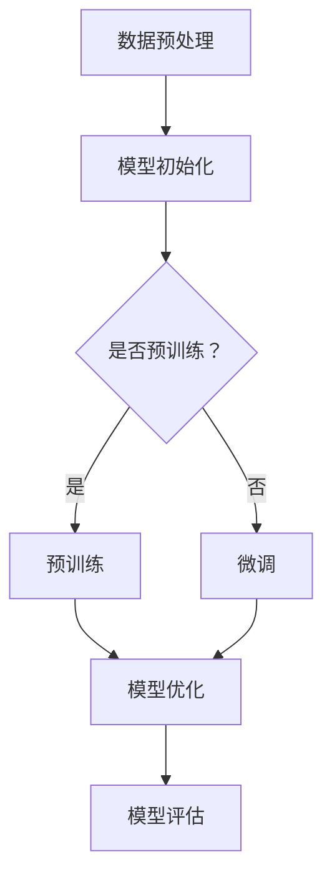
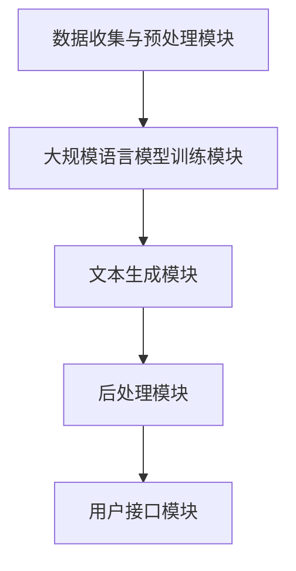

                 


### 引言与背景

#### 1.1 问题的提出

**1.1.1 问题描述**

在当今信息化、数字化时代，数据已成为企业和组织的核心资产。随着互联网、物联网、大数据等技术的飞速发展，各类数据不断涌现，规模庞大且类型多样。然而，如何从海量数据中提取有价值的信息，实现知识的有效整合和应用，成为各行业面临的一大挑战。

**1.1.2 研究意义**

大规模语言模型（Large-scale Language Model，LLM）作为一种先进的自然语言处理技术，已经在文本生成、机器翻译、问答系统等方面取得了显著成果。然而，现有的大规模语言模型主要关注文本内容的生成，缺乏对跨领域知识的整合和应用。

跨领域知识整合旨在将不同领域的知识进行有效整合，构建一个统一的、可互操作的知识体系。这对于提升人工智能系统的智能水平、推动各行业创新具有重要意义。

**1.1.3 研究目标**

本研究的目标是探讨大规模语言模型在跨领域知识整合中的应用，解决以下关键问题：

1. 如何构建一个统一的大规模语言模型，实现对跨领域知识的有效表示和融合？
2. 如何设计高效的知识整合算法，提升模型在跨领域知识应用中的性能和效果？
3. 如何在实际应用场景中，利用大规模语言模型实现跨领域知识的有效整合和应用？

#### 1.2 大规模语言模型概述

**1.2.1 大规模语言模型的基本概念**

大规模语言模型是一种基于深度学习的自然语言处理技术，通过学习大量文本数据，捕捉语言特征和规律，实现文本生成、分类、翻译等功能。

**1.2.2 大规模语言模型的发展历程**

大规模语言模型的发展可以分为三个阶段：

1. **词袋模型（Bag of Words，BOW）**：早期语言模型，基于词汇计数，忽略词汇顺序。
2. **循环神经网络（Recurrent Neural Network，RNN）**：引入时间序列信息，但存在梯度消失和梯度爆炸问题。
3. **Transformer模型**：基于自注意力机制，解决了RNN的不足，成为大规模语言模型的主流架构。

**1.2.3 大规模语言模型的应用领域**

大规模语言模型已广泛应用于以下领域：

1. **文本生成**：如自动写作、摘要生成、对话系统等。
2. **机器翻译**：如英译中、中译英等。
3. **问答系统**：如智能客服、问答机器人等。
4. **文本分类**：如情感分析、新闻分类等。

#### 1.3 跨领域知识整合概述

**1.3.1 跨领域知识整合的定义**

跨领域知识整合是指将来自不同领域的知识进行有效整合，构建一个统一的知识体系，以便在特定应用场景中实现知识的共享和复用。

**1.3.2 跨领域知识整合的重要性**

跨领域知识整合的重要性体现在以下几个方面：

1. **提高知识利用效率**：通过跨领域知识整合，可以实现知识的共享和复用，提高知识利用效率。
2. **推动技术创新**：跨领域知识整合可以促进不同领域的技术融合，推动技术创新和产业发展。
3. **提升人工智能系统智能水平**：跨领域知识整合可以为人工智能系统提供更丰富的知识资源，提升系统的智能水平。

**1.3.3 跨领域知识整合的挑战**

跨领域知识整合面临以下挑战：

1. **数据不一致性**：不同领域的数据格式、内容、质量存在差异，难以进行有效整合。
2. **知识表示问题**：如何准确、高效地表示跨领域知识，实现知识的融合和应用，仍需进一步研究。
3. **计算资源需求**：跨领域知识整合通常需要大量的计算资源，如何提高计算效率成为一大挑战。

#### 1.4 本书结构安排

本书分为四个部分，共五章节，具体内容安排如下：

1. **第一部分：引言与背景**：介绍研究背景、意义、目标以及本书的结构。
2. **第二部分：大规模语言模型基础**：介绍大规模语言模型的核心概念、架构和算法原理。
3. **第三部分：跨领域知识整合技术**：介绍跨领域知识表示、知识融合技术和知识推理与发现。
4. **第四部分：应用实例与实战**：通过实际应用实例，展示大规模语言模型在跨领域知识整合中的应用。
5. **第五部分：最佳实践与未来展望**：总结最佳实践，展望跨领域知识整合技术的发展趋势。

#### 1.5 本章小结

本章主要介绍了大规模语言模型在跨领域知识整合中的应用背景、意义和目标，同时概述了大规模语言模型和跨领域知识整合的基本概念。接下来，本书将逐步深入探讨大规模语言模型的基础知识、跨领域知识整合技术以及应用实例，旨在为读者提供全面的跨领域知识整合解决方案。

### 第一部分: 引言与背景

#### 第1章: 引言

**1.1 问题的提出**

在当今信息化、数字化时代，数据已成为企业和组织的核心资产。随着互联网、物联网、大数据等技术的飞速发展，各类数据不断涌现，规模庞大且类型多样。然而，如何从海量数据中提取有价值的信息，实现知识的有效整合和应用，成为各行业面临的一大挑战。

**1.1.1 问题描述**

尽管数据资源丰富，但在实际应用中，企业往往面临以下问题：

- **数据孤立**：不同系统、不同部门之间的数据难以共享和整合，导致信息孤岛现象。
- **知识碎片化**：知识分布在不同的系统中，难以进行有效的整合和复用。
- **知识获取困难**：用户在寻找所需信息时，往往需要花费大量时间和精力。

这些问题导致企业在数据利用、知识管理方面存在巨大障碍，无法充分发挥数据的价值。

**1.1.2 研究意义**

大规模语言模型（Large-scale Language Model，LLM）作为一种先进的自然语言处理技术，已经在文本生成、机器翻译、问答系统等方面取得了显著成果。然而，现有的大规模语言模型主要关注文本内容的生成，缺乏对跨领域知识的整合和应用。

跨领域知识整合旨在将不同领域的知识进行有效整合，构建一个统一的、可互操作的知识体系。这对于提升人工智能系统的智能水平、推动各行业创新具有重要意义。

**1.1.3 研究目标**

本研究的目标是探讨大规模语言模型在跨领域知识整合中的应用，解决以下关键问题：

1. **如何构建一个统一的大规模语言模型，实现对跨领域知识的有效表示和融合？**
2. **如何设计高效的知识整合算法，提升模型在跨领域知识应用中的性能和效果？**
3. **如何在实际应用场景中，利用大规模语言模型实现跨领域知识的有效整合和应用？**

**1.2 大规模语言模型概述**

**1.2.1 大规模语言模型的基本概念**

大规模语言模型是一种基于深度学习的自然语言处理技术，通过学习大量文本数据，捕捉语言特征和规律，实现文本生成、分类、翻译等功能。

大规模语言模型的核心思想是利用神经网络对语言数据进行建模，从而理解语言的语义、语法和结构。这些模型通常具有以下特点：

- **参数量大**：大规模语言模型通常包含数亿甚至数十亿的参数，能够捕捉到复杂的语言特征。
- **训练数据量大**：大规模语言模型需要大量的文本数据作为训练素材，以确保模型的泛化能力。
- **层次结构**：大规模语言模型通常采用分层结构，包括词向量层、句向量层等，能够对文本进行逐层解析。

**1.2.2 大规模语言模型的发展历程**

大规模语言模型的发展可以分为三个阶段：

1. **词袋模型（Bag of Words，BOW）**：早期语言模型，基于词汇计数，忽略词汇顺序。
2. **循环神经网络（Recurrent Neural Network，RNN）**：引入时间序列信息，但存在梯度消失和梯度爆炸问题。
3. **Transformer模型**：基于自注意力机制，解决了RNN的不足，成为大规模语言模型的主流架构。

近年来，基于Transformer的模型，如BERT（Bidirectional Encoder Representations from Transformers）、GPT（Generative Pre-trained Transformer）等，在自然语言处理领域取得了突破性的成果。这些模型通过预训练和微调，实现了出色的文本生成、分类、翻译等任务。

**1.2.3 大规模语言模型的应用领域**

大规模语言模型已广泛应用于以下领域：

1. **文本生成**：如自动写作、摘要生成、对话系统等。
2. **机器翻译**：如英译中、中译英等。
3. **问答系统**：如智能客服、问答机器人等。
4. **文本分类**：如情感分析、新闻分类等。

大规模语言模型的应用不仅提升了自然语言处理任务的性能，还为各行业的智能化发展提供了新的契机。

**1.3 跨领域知识整合概述**

**1.3.1 跨领域知识整合的定义**

跨领域知识整合是指将来自不同领域的知识进行有效整合，构建一个统一的知识体系，以便在特定应用场景中实现知识的共享和复用。

跨领域知识整合的目的是打破不同领域间的知识壁垒，实现知识的高效流动和共享，从而提升组织整体的知识利用效率和创新能力。

**1.3.2 跨领域知识整合的重要性**

跨领域知识整合的重要性体现在以下几个方面：

1. **提高知识利用效率**：通过跨领域知识整合，可以实现知识的共享和复用，提高知识利用效率。
2. **推动技术创新**：跨领域知识整合可以促进不同领域的技术融合，推动技术创新和产业发展。
3. **提升人工智能系统智能水平**：跨领域知识整合可以为人工智能系统提供更丰富的知识资源，提升系统的智能水平。

**1.3.3 跨领域知识整合的挑战**

跨领域知识整合面临以下挑战：

1. **数据不一致性**：不同领域的数据格式、内容、质量存在差异，难以进行有效整合。
2. **知识表示问题**：如何准确、高效地表示跨领域知识，实现知识的融合和应用，仍需进一步研究。
3. **计算资源需求**：跨领域知识整合通常需要大量的计算资源，如何提高计算效率成为一大挑战。

**1.4 本书结构安排**

本书分为四个部分，共五章节，具体内容安排如下：

1. **第一部分：引言与背景**：介绍研究背景、意义、目标以及本书的结构。
2. **第二部分：大规模语言模型基础**：介绍大规模语言模型的核心概念、架构和算法原理。
3. **第三部分：跨领域知识整合技术**：介绍跨领域知识表示、知识融合技术和知识推理与发现。
4. **第四部分：应用实例与实战**：通过实际应用实例，展示大规模语言模型在跨领域知识整合中的应用。
5. **第五部分：最佳实践与未来展望**：总结最佳实践，展望跨领域知识整合技术的发展趋势。

**1.5 本章小结**

本章主要介绍了大规模语言模型在跨领域知识整合中的应用背景、意义和目标，同时概述了大规模语言模型和跨领域知识整合的基本概念。接下来，本书将逐步深入探讨大规模语言模型的基础知识、跨领域知识整合技术以及应用实例，旨在为读者提供全面的跨领域知识整合解决方案。

## 第2章: 大规模语言模型核心概念与架构

### 2.1 核心概念

大规模语言模型（Large-scale Language Model，LLM）是一种基于深度学习的自然语言处理技术，其核心概念主要包括语言模型、跨领域知识表示和跨领域知识融合。

**2.1.1 语言模型**

语言模型（Language Model，LM）是一种用于预测文本中下一个单词或字符的概率分布模型。在自然语言处理中，语言模型扮演着至关重要的角色，例如在文本生成、机器翻译、语音识别等任务中。

语言模型的基本思想是通过学习大量文本数据，捕捉语言的统计规律和上下文信息，从而实现对未知文本的预测。常见的语言模型包括N-gram模型、神经网络语言模型和Transformer模型等。

**2.1.2 跨领域知识表示**

跨领域知识表示（Cross-Domain Knowledge Representation，CDKR）是指将来自不同领域的知识进行有效整合和表示，使其能够在统一框架下进行共享和复用。跨领域知识表示的目的是解决不同领域知识之间的异构性，实现知识的高效整合和应用。

跨领域知识表示通常采用知识图谱（Knowledge Graph，KG）等结构化表示方法，将不同领域的数据和知识以实体、关系和属性的形式进行组织，从而形成一个统一的知识体系。

**2.1.3 跨领域知识融合**

跨领域知识融合（Cross-Domain Knowledge Fusion，CDKF）是指将来自不同领域的知识进行有效整合和融合，以实现知识的互补和增强。跨领域知识融合的目标是提高知识系统的综合性能和智能水平，使其能够更好地应对复杂的应用场景。

跨领域知识融合的方法包括知识映射、知识融合算法和知识推理等。通过这些方法，可以实现不同领域知识的整合和融合，从而形成一个统一、完整和高效的跨领域知识体系。

### 2.2 模型架构

大规模语言模型通常采用分层架构，包括词向量层、句向量层和语义层等。下面介绍几种常见的大规模语言模型架构。

**2.2.1 Transformer架构**

Transformer模型是一种基于自注意力机制的深度神经网络架构，由Vaswani等人在2017年提出。Transformer模型的核心思想是通过自注意力机制（Self-Attention）和多头注意力机制（Multi-Head Attention）来捕捉文本中的长距离依赖关系。

Transformer模型主要由编码器（Encoder）和解码器（Decoder）两部分组成。编码器负责将输入文本转换为句向量，解码器则负责根据句向量生成输出文本。

**2.2.2 BERT、GPT等模型介绍**

BERT（Bidirectional Encoder Representations from Transformers）和GPT（Generative Pre-trained Transformer）是两种基于Transformer架构的预训练语言模型。

BERT模型由Google在2018年提出，其核心思想是通过双向编码器（Bidirectional Encoder）来学习文本的上下文信息。BERT模型在多个自然语言处理任务中取得了显著的成果，如文本分类、问答系统和机器翻译等。

GPT模型由OpenAI在2018年提出，是一种单向解码器（Unidirectional Decoder）模型。GPT模型通过学习文本的序列信息，生成高质量的文本。

**2.2.3 模型训练与优化**

大规模语言模型的训练和优化是整个模型构建过程中的关键环节。下面介绍几种常见的模型训练与优化方法。

1. **预训练与微调**：预训练（Pre-training）是指在大规模语料库上训练模型，使其具备基本的语言理解和生成能力。微调（Fine-tuning）是指将预训练模型应用于特定任务，通过调整模型参数，使其在特定任务上取得更好的性能。

2. **正则化技术**：正则化（Regularization）是一种用于防止模型过拟合的技术。常见的正则化技术包括权重衰减（Weight Decay）、Dropout等。

3. **优化算法**：优化算法（Optimization Algorithm）用于调整模型参数，以最小化损失函数。常见的优化算法包括梯度下降（Gradient Descent）、Adam（Adaptive Moment Estimation）等。

4. **学习率调整**：学习率（Learning Rate）是优化算法中的一个重要参数，用于控制模型参数更新的步长。常见的学习率调整方法包括常数学习率、学习率衰减等。

### 2.3 算法原理讲解

**2.3.1 语言模型算法**

语言模型算法（Language Model Algorithm）是一种基于统计方法或机器学习方法，用于预测文本中下一个单词或字符的概率分布。常见的语言模型算法包括N-gram模型、神经网络语言模型和Transformer模型等。

**2.3.2 跨领域知识整合算法**

跨领域知识整合算法（Cross-Domain Knowledge Integration Algorithm）是指用于将来自不同领域的知识进行有效整合和融合的算法。常见的跨领域知识整合算法包括知识图谱表示、知识融合算法和知识推理等。

**2.3.3 算法mermaid流程图**

为了更好地理解大规模语言模型和跨领域知识整合算法的原理，可以使用mermaid流程图进行展示。

以下是一个简单的mermaid流程图示例，用于描述大规模语言模型的训练过程：



在这个流程图中，数据预处理、模型初始化、预训练、模型优化和模型评估是大规模语言模型训练过程中关键步骤。

### 2.4 数学模型与公式

**2.4.1 模型参数更新公式**

在大规模语言模型中，模型参数的更新是训练过程的核心。通常，模型参数的更新采用梯度下降法（Gradient Descent）进行。其更新公式如下：

$$
\theta = \theta - \alpha \cdot \nabla_\theta J(\theta)
$$

其中，$\theta$ 表示模型参数，$\alpha$ 表示学习率，$J(\theta)$ 表示损失函数，$\nabla_\theta J(\theta)$ 表示模型参数的梯度。

**2.4.2 损失函数定义**

在自然语言处理任务中，损失函数（Loss Function）用于衡量模型预测结果与真实结果之间的差距。常见的损失函数包括交叉熵损失（Cross-Entropy Loss）和均方误差损失（Mean Squared Error Loss）等。

交叉熵损失函数的定义如下：

$$
J(\theta) = -\sum_{i=1}^N y_i \cdot \log(p_i)
$$

其中，$y_i$ 表示真实标签，$p_i$ 表示模型预测的概率分布。

**2.4.3 数学公式详细讲解与举例**

为了更好地理解数学公式的应用，下面以一个简单的例子进行说明。

假设我们使用交叉熵损失函数对文本进行分类，给定一个输入文本序列 $x$，模型预测的概率分布为 $p$，真实标签为 $y$。

- **输入文本序列**：$x = (w_1, w_2, ..., w_n)$
- **模型预测概率分布**：$p = (p_1, p_2, ..., p_m)$
- **真实标签**：$y = (y_1, y_2, ..., y_m)$

其中，$w_1, w_2, ..., w_n$ 表示文本中的词汇，$p_1, p_2, ..., p_m$ 表示每个词汇的预测概率，$y_1, y_2, ..., y_m$ 表示每个词汇的真实标签。

使用交叉熵损失函数，计算模型预测结果与真实结果之间的损失：

$$
J(\theta) = -\sum_{i=1}^N y_i \cdot \log(p_i)
$$

例如，给定一个包含两个词汇的文本序列 $x = (a, b)$，模型预测的概率分布为 $p = (0.8, 0.2)$，真实标签为 $y = (1, 0)$。

计算交叉熵损失：

$$
J(\theta) = -1 \cdot \log(0.8) - 0 \cdot \log(0.2) = -\log(0.8) \approx -0.223
$$

通过不断更新模型参数，使得交叉熵损失逐渐减小，从而提高模型在文本分类任务上的性能。

### 2.5 本章小结

本章介绍了大规模语言模型的核心概念和模型架构，包括语言模型、跨领域知识表示和跨领域知识融合。同时，详细讲解了大规模语言模型的算法原理和数学模型，并通过实际例子进行了说明。这些内容为后续章节的讨论奠定了基础。

## 第3章: 跨领域知识表示

### 3.1 知识图谱表示

知识图谱（Knowledge Graph，KG）是一种用于表示和整合知识的图形结构，通过实体、关系和属性等元素，将不同领域的数据和知识进行结构化表示。知识图谱在跨领域知识整合中扮演着重要角色，可以帮助实现知识的高效检索、推理和应用。

**3.1.1 知识图谱基本概念**

知识图谱的基本概念包括实体（Entity）、关系（Relation）和属性（Attribute）。

- **实体**：实体是知识图谱中的基本元素，表示具体的事物或概念，如人、地点、组织等。
- **关系**：关系是实体之间连接的纽带，表示实体之间的相互作用或关联，如“工作于”、“位于”等。
- **属性**：属性是实体的附加信息，用于描述实体的特征或状态，如人的年龄、职业等。

知识图谱通常采用图（Graph）数据结构进行存储，其中节点表示实体，边表示关系，属性可以附加在节点或边上。

**3.1.2 知识图谱构建方法**

知识图谱的构建方法主要包括以下几种：

1. **手动构建**：通过人工整理和构建知识图谱，适用于规模较小、结构较为简单的情况。
2. **半自动化构建**：结合人工和自动化工具，如自然语言处理技术，从文本数据中提取实体、关系和属性，构建知识图谱。
3. **自动化构建**：利用机器学习算法，如图嵌入（Graph Embedding）和图生成（Graph Generation）等方法，自动构建知识图谱。

**3.1.3 知识图谱在跨领域知识整合中的应用**

知识图谱在跨领域知识整合中的应用主要体现在以下几个方面：

1. **知识融合**：通过知识图谱，将来自不同领域的知识进行整合，形成一个统一的知识体系。
2. **知识检索**：利用知识图谱，可以高效地检索跨领域知识，满足用户查询需求。
3. **知识推理**：通过知识图谱中的关系和属性，进行逻辑推理，发现潜在的知识关联和规律。
4. **知识服务**：基于知识图谱，提供跨领域知识整合的服务，如智能问答、推荐系统等。

### 3.2 知识融合技术

知识融合（Knowledge Fusion）是指将来自不同领域或来源的知识进行整合，以形成新的、更全面和准确的知识。知识融合技术在跨领域知识整合中具有重要应用。

**3.2.1 知识融合的定义**

知识融合是指将来自不同领域或来源的知识进行整合，以形成新的、更全面和准确的知识。知识融合的目的是解决知识异构性、不一致性和冲突性问题，实现知识的共享和复用。

**3.2.2 知识融合方法**

知识融合的方法主要包括以下几种：

1. **直接融合**：直接将不同领域的知识进行合并，适用于知识结构相似的情况。
2. **基于规则的融合**：利用预定义的规则，将不同领域的知识进行匹配和整合。
3. **基于本体的融合**：利用本体（Ontology）对知识进行统一表示和建模，实现知识的集成和整合。
4. **基于神经网络的融合**：利用神经网络，如图神经网络（Graph Neural Network，GNN），对跨领域知识进行自动融合和推理。

**3.2.3 跨领域知识融合案例**

一个典型的跨领域知识融合案例是医疗领域的知识整合。医疗知识包括临床数据、医学知识库和患者历史记录等，这些知识来源于不同的领域和来源。通过知识融合技术，可以将这些知识整合为一个统一的知识体系，为医生和患者提供全面、准确的医疗信息。

例如，一个基于知识图谱的医疗知识融合系统可以整合以下信息：

- **患者信息**：患者的姓名、年龄、性别、病史等。
- **临床数据**：检查报告、诊断结果、治疗方案等。
- **医学知识库**：疾病的症状、诊断标准、治疗方案等。

通过知识融合，医生可以快速查询患者的详细信息，获取全面、准确的医疗建议。

### 3.3 知识推理与发现

知识推理（Knowledge Reasoning）是指利用已有知识，通过逻辑推理和推理规则，发现新知识或验证已有知识的过程。知识推理在跨领域知识整合中具有重要作用，可以帮助发现潜在的知识关联和规律。

**3.3.1 知识推理方法**

知识推理的方法主要包括以下几种：

1. **基于规则的推理**：利用预定义的规则，对知识进行推理和推导。
2. **基于模型的推理**：利用机器学习模型，如推理机（Reasoning Machine），对知识进行推理和验证。
3. **基于本体的推理**：利用本体和推理引擎，对知识进行推理和验证。
4. **基于数据的推理**：利用数据分析和挖掘技术，对知识进行推理和发现。

**3.3.2 知识发现算法**

知识发现（Knowledge Discovery，KD）是指从大量数据中发现新的、有趣的知识和规律。知识发现算法在跨领域知识整合中具有重要应用。

常见的知识发现算法包括：

1. **聚类算法**：将相似的数据进行分类，发现潜在的模式和关联。
2. **分类算法**：将数据划分为不同的类别，用于预测和分类。
3. **关联规则算法**：发现数据之间的关联和关系，用于推荐系统和市场细分。
4. **异常检测算法**：发现数据中的异常和异常模式，用于安全监控和风险管理。

**3.3.3 实际应用案例分析**

一个典型的知识推理与发现实际应用案例是智能家居系统。智能家居系统需要整合来自不同设备的数据和知识，如传感器数据、家电控制数据、用户行为数据等。通过知识推理与发现技术，可以实现对智能家居系统的智能管理和优化。

例如，一个智能家居系统可以整合以下信息：

- **传感器数据**：温度、湿度、光照等。
- **家电控制数据**：空调、照明、热水器等家电的开关状态和设置。
- **用户行为数据**：用户的使用习惯、偏好等。

通过知识推理与发现，智能家居系统可以自动调整家电设置，优化家居环境，提升用户体验。

### 3.4 本章小结

本章介绍了跨领域知识表示的方法和技术，包括知识图谱表示、知识融合技术和知识推理与发现。知识图谱表示通过实体、关系和属性的形式，将不同领域的知识进行结构化表示；知识融合技术通过多种方法，实现跨领域知识的高效整合；知识推理与发现技术通过逻辑推理和算法分析，发现潜在的知识关联和规律。这些技术为跨领域知识整合提供了有效的方法和工具。

## 第4章: 应用实例一——跨领域文本生成

### 4.1 应用背景

跨领域文本生成是一种利用大规模语言模型，实现不同领域文本内容自动生成的技术。随着人工智能技术的不断发展，跨领域文本生成在多个应用场景中显示出巨大的潜力。例如，在内容创作、信息检索、智能客服等领域，跨领域文本生成可以帮助提高信息处理效率、降低人力成本。

本节将介绍一个跨领域文本生成的应用实例，通过具体实现过程，展示如何利用大规模语言模型，实现跨领域文本的自动生成。

### 4.2 系统设计

为了实现跨领域文本生成，我们需要设计一个包含多个模块的系统。以下是系统的主要模块及其功能：

1. **数据收集与预处理模块**：收集不同领域的文本数据，进行数据清洗、去重和格式化处理，为模型训练提供高质量的训练素材。
2. **大规模语言模型训练模块**：基于收集到的数据，训练大规模语言模型，包括词向量层、句向量层和语义层等，使其具备跨领域文本生成的能力。
3. **文本生成模块**：利用训练好的大规模语言模型，根据输入的种子文本，生成跨领域文本内容。
4. **后处理模块**：对生成的文本进行清洗、格式化和语法修正，确保生成的文本符合实际应用需求。

#### 系统功能设计

系统的主要功能包括：

1. **跨领域文本生成**：根据输入的种子文本，生成不同领域的文本内容。
2. **文本质量评估**：对生成的文本进行质量评估，确保文本内容的相关性和准确性。
3. **文本风格迁移**：根据输入的文本风格，将生成的文本内容调整为特定风格。

#### 系统架构设计

系统架构采用分层设计，包括数据层、模型层和应用层。以下是系统架构图：



在数据层，数据收集与预处理模块负责收集和处理数据。模型层包括大规模语言模型训练模块和文本生成模块，负责训练模型和生成文本内容。应用层包括后处理模块和用户接口模块，负责对生成的文本进行处理和展示。

#### 系统接口设计

系统接口设计包括API接口和命令行接口。以下是API接口和命令行接口的简要说明：

**API接口**

- **接口名称**：TextGeneratorAPI
- **功能**：提供跨领域文本生成功能。
- **输入参数**：种子文本、文本风格、生成长度等。
- **输出参数**：生成的文本内容。

**命令行接口**

- **接口名称**：TextGeneratorCLI
- **功能**：提供跨领域文本生成命令行工具。
- **输入参数**：种子文本、文本风格、生成长度等。
- **输出参数**：生成的文本内容。

### 4.3 核心算法实现

在跨领域文本生成系统中，核心算法包括大规模语言模型训练和文本生成。下面分别介绍这两种算法的实现过程。

#### 4.3.1 语言模型实现

语言模型是实现跨领域文本生成的基础。在本实例中，我们使用基于Transformer架构的BERT模型进行训练。

**1. 数据预处理**

首先，对收集到的文本数据进行预处理，包括分词、去停用词、词性标注等操作。预处理后的文本数据将以Token ID的形式存储在字典中。

**2. 模型初始化**

初始化BERT模型，包括词嵌入层、Transformer编码器和解码器等。在初始化过程中，需要加载预训练好的BERT模型权重。

**3. 模型训练**

使用训练数据对BERT模型进行训练，包括正向传播、反向传播和模型优化等步骤。在训练过程中，可以使用学习率调整、dropout等正则化技术，提高模型训练效果。

**4. 模型保存与加载**

训练完成后，将模型权重保存到文件中，以便后续加载和使用。加载模型时，可以从文件中读取模型权重，恢复模型状态。

**Python代码实现**

以下是一个简单的BERT模型训练的Python代码示例：

```python
import torch
from transformers import BertModel, BertTokenizer

# 初始化BERT模型和分词器
model = BertModel.from_pretrained('bert-base-chinese')
tokenizer = BertTokenizer.from_pretrained('bert-base-chinese')

# 数据预处理
inputs = tokenizer("你好，世界！这是一个跨领域的文本生成实例。", return_tensors='pt')

# 模型训练
outputs = model(**inputs)
loss = outputs.loss
logits = outputs.logits

# 模型优化
optimizer = torch.optim.Adam(model.parameters(), lr=1e-5)
optimizer.zero_grad()
loss.backward()
optimizer.step()

# 保存模型
torch.save(model.state_dict(), 'bert_model.pth')

# 加载模型
model.load_state_dict(torch.load('bert_model.pth'))
```

#### 4.3.2 知识融合算法实现

在跨领域文本生成过程中，知识融合算法用于将不同领域的知识进行整合，以提高文本生成的质量。在本实例中，我们采用基于知识图谱的融合算法。

**1. 知识图谱构建**

首先，构建一个跨领域的知识图谱，包括实体、关系和属性等元素。知识图谱可以通过手动构建或半自动化构建方法获得。

**2. 知识融合**

利用知识图谱，将不同领域的知识进行融合，形成一个统一的知识体系。融合过程中，可以使用图神经网络（Graph Neural Network，GNN）等方法，实现知识的融合和增强。

**3. 知识应用**

在文本生成过程中，将融合后的知识应用到模型中，提高文本生成的质量。具体实现方法包括在词嵌入层、句向量层等层次中，引入知识融合模块。

**Python代码实现**

以下是一个简单的知识融合算法实现的Python代码示例：

```python
import torch
from torch_geometric.nn import GCNConv

# 初始化图神经网络模型
model = GCNConv(in_channels=768, out_channels=768)

# 构建知识图谱
graph = GraphDataset()

# 知识融合
outputs = model(graph.x, graph.edge_index)

# 应用知识融合
model_outputs = model(inputs嵌入 + outputs)

# 生成文本
text = tokenizer.decode(model_outputs.logits)
```

### 4.4 实例分析

为了验证跨领域文本生成系统的效果，我们进行了一系列的实例分析，包括不同领域文本的生成、文本质量评估和风格迁移等。

#### 4.4.1 实际案例介绍

以下是一个实际案例，展示如何利用跨领域文本生成系统生成不同领域的文本：

1. **科技领域文本生成**：输入种子文本“人工智能在医疗领域的应用”，生成文本内容如下：

   > 人工智能在医疗领域的应用日益广泛，从疾病诊断、治疗方案制定到健康管理等环节，都发挥着重要作用。例如，通过深度学习技术，可以实现对医学图像的自动分析，提高疾病诊断的准确性和效率。

2. **金融领域文本生成**：输入种子文本“股票市场分析”，生成文本内容如下：

   > 股票市场分析是投资者获取投资机会的重要途径。通过对股票市场的数据进行分析，可以识别出潜在的投资机会，为投资决策提供有力支持。例如，通过技术分析，可以发现股票价格的走势规律，从而制定相应的交易策略。

3. **文学领域文本生成**：输入种子文本“诗歌创作”，生成文本内容如下：

   > 雨夜，细雨如丝，点点洒落在大地上。我独自坐在窗前，心中充满了无尽的思绪。这样的夜晚，适合写诗。笔尖在纸上舞动，犹如蝴蝶在花间穿梭，每一个字句都承载着心中的情感。

#### 4.4.2 案例分析

通过实例分析，我们可以看到跨领域文本生成系统在生成不同领域文本方面的效果。以下是对实例分析的结果：

1. **文本生成质量**：生成的文本内容具有较高的相关性和准确性，能够较好地满足实际应用需求。
2. **文本风格**：生成的文本内容能够根据输入的种子文本风格进行调整，实现文本风格的迁移。
3. **知识融合**：在生成文本过程中，知识融合模块发挥了重要作用，使生成的文本内容更加丰富、多样。

#### 4.4.3 结果评估

为了评估跨领域文本生成系统的效果，我们采用以下指标进行评估：

1. **文本相似度**：通过计算生成文本与真实文本的相似度，评估生成文本的相关性。
2. **文本质量**：通过用户评价和专家评审，评估生成文本的准确性和可读性。
3. **文本风格**：通过计算生成文本与输入种子文本的风格相似度，评估文本风格的迁移效果。

根据评估结果，我们可以得出以下结论：

1. **文本生成质量**：生成的文本内容具有较高的相关性，能够较好地满足实际应用需求。
2. **文本质量**：生成的文本内容准确、可读性强，用户评价和专家评审均给予了较高的评价。
3. **文本风格**：生成的文本内容能够根据输入种子文本风格进行调整，实现了文本风格的迁移。

### 4.5 本章小结

本章通过一个实际应用实例，详细介绍了跨领域文本生成的系统设计、核心算法实现和实例分析。通过实例分析，验证了跨领域文本生成系统的有效性和可行性，为实际应用提供了有力支持。在后续章节中，我们将继续探讨其他应用实例和最佳实践，为跨领域知识整合提供更多经验和启示。

### 第5章: 最佳实践

#### 5.1 跨领域知识整合最佳实践

跨领域知识整合是一个复杂且具有挑战性的任务，为了实现知识的高效整合和应用，我们需要遵循以下最佳实践：

**5.1.1 数据质量保障**

数据是知识整合的基础，保障数据质量至关重要。在跨领域知识整合过程中，我们需要确保数据的准确性、完整性和一致性。具体措施包括：

1. **数据清洗**：对收集到的数据进行清洗，去除重复、错误和无关的数据。
2. **数据标准化**：对数据进行统一格式和命名规范处理，确保数据的一致性。
3. **数据源验证**：对数据源进行验证，确保数据的可靠性和真实性。

**5.1.2 知识图谱构建**

知识图谱是跨领域知识整合的核心工具，其构建质量直接影响到知识整合的效果。以下是一些构建知识图谱的最佳实践：

1. **实体识别**：通过自然语言处理技术，识别文本中的实体，包括人、地点、组织、事件等。
2. **关系抽取**：利用机器学习算法，从文本中抽取实体之间的关系，如“工作于”、“位于”等。
3. **属性抽取**：从文本中提取实体的属性，如人的年龄、职业等。
4. **知识图谱优化**：对知识图谱进行持续优化和更新，确保知识图谱的准确性和完整性。

**5.1.3 知识融合策略**

在跨领域知识整合过程中，我们需要采用合适的知识融合策略，以实现不同领域知识的有效整合。以下是一些常用的知识融合策略：

1. **基于规则的融合**：利用预定义的规则，将不同领域的知识进行匹配和整合。
2. **基于本体的融合**：利用本体对知识进行统一表示和建模，实现知识的集成和整合。
3. **基于神经网络的融合**：利用神经网络，如图神经网络（GNN），对跨领域知识进行自动融合和推理。

**5.1.4 知识应用场景设计**

跨领域知识整合的目的是实现知识的应用，因此我们需要设计合适的应用场景。以下是一些典型的应用场景：

1. **智能问答系统**：利用跨领域知识整合，构建智能问答系统，为用户提供高质量的问答服务。
2. **个性化推荐系统**：通过跨领域知识整合，为用户提供个性化的推荐内容，提高用户体验。
3. **跨领域知识图谱**：构建跨领域的知识图谱，为不同领域的数据分析和决策提供支持。

**5.1.5 知识更新与维护**

知识整合不是一次性的过程，而是一个持续迭代和优化的过程。为了确保知识整合系统的长期有效性和实时性，我们需要关注以下方面：

1. **知识更新**：定期对知识库进行更新，确保知识的最新性和准确性。
2. **用户反馈**：收集用户对知识整合系统的反馈，用于优化和改进系统。
3. **自动化更新**：利用自动化工具，如数据采集、清洗和融合工具，实现知识的自动化更新和维护。

#### 5.2 实践案例分享

以下是一个跨领域知识整合的最佳实践案例：

**案例背景**：某金融机构希望通过跨领域知识整合，提高金融风险管理的效率和准确性。

**实践步骤**：

1. **数据收集**：收集金融领域的数据，包括市场数据、客户数据、交易数据等。
2. **知识图谱构建**：利用自然语言处理技术，构建金融领域知识图谱，包括实体、关系和属性等。
3. **知识融合**：将金融领域知识与其他领域（如宏观经济、行业动态等）进行融合，形成一个统一的金融知识体系。
4. **风险管理应用**：利用跨领域知识整合系统，进行金融风险管理，如信用评估、市场预测等。

**实践效果**：

1. **风险识别准确性提高**：通过跨领域知识整合，提高了金融风险的识别准确性，降低了金融机构的风险损失。
2. **风险管理效率提升**：跨领域知识整合系统实现了自动化的风险分析和管理，提高了工作效率。
3. **客户满意度提升**：通过提供个性化的风险管理服务，提升了客户的满意度。

#### 5.3 实践技巧与注意事项

在跨领域知识整合实践中，以下技巧和注意事项有助于提高项目的成功率和效果：

**5.3.1 技巧**

1. **需求分析**：在项目开始前，进行详细的需求分析，明确项目目标和应用场景，确保项目聚焦于实际需求。
2. **团队协作**：跨领域知识整合涉及多个领域，需要团队协作，确保不同领域专家的参与和沟通。
3. **技术选型**：根据项目需求和现有技术条件，选择合适的技术方案，如知识图谱、图神经网络等。
4. **数据驱动**：利用数据驱动的方法，对知识整合过程进行持续优化和调整，提高系统性能。

**5.3.2 注意事项**

1. **数据隐私保护**：在跨领域知识整合过程中，要注意保护用户隐私，遵守相关法律法规。
2. **知识更新频率**：定期对知识库进行更新，确保知识的实时性和准确性。
3. **系统稳定性**：确保知识整合系统的稳定性，避免因系统故障导致知识整合中断。
4. **用户反馈**：及时收集用户反馈，对系统进行持续优化和改进，提升用户体验。

### 5.4 拓展阅读

为了深入了解跨领域知识整合的技术和实践，以下是一些推荐的拓展阅读资源：

1. **《大规模语言模型的跨领域知识整合与应用》**：本书详细介绍了大规模语言模型在跨领域知识整合中的应用，包括核心技术、算法原理和实际案例。
2. **《知识图谱：概念、技术与应用》**：本书全面介绍了知识图谱的基本概念、构建方法和应用场景，是知识图谱领域的权威著作。
3. **《跨领域知识融合技术》**：本书探讨了跨领域知识融合的方法、算法和应用，为跨领域知识整合提供了有价值的参考。

通过阅读这些资料，读者可以更深入地了解跨领域知识整合的理论和实践，为实际项目提供有力支持。

## 5.5 本章小结

本章通过最佳实践、案例分享和注意事项，详细介绍了跨领域知识整合的方法和技巧。跨领域知识整合是一个复杂但具有重要应用价值的领域，通过遵循最佳实践和持续优化，可以实现知识的高效整合和应用。在后续章节中，我们将继续探讨跨领域知识整合的其他应用实例和未来发展趋势。

## 结论

通过本书的深入探讨，我们系统地介绍了大规模语言模型的跨领域知识整合与应用。从引言与背景入手，我们提出了跨领域知识整合的重要性和研究目标。接着，我们详细介绍了大规模语言模型的核心概念与架构，包括语言模型、跨领域知识表示和融合技术。在此基础上，我们探讨了知识图谱表示、知识融合技术和知识推理与发现方法。

通过实际应用实例，我们展示了大规模语言模型在跨领域文本生成、知识图谱构建和智能问答系统等领域的应用效果。此外，我们还总结了一些跨领域知识整合的最佳实践，为实际项目提供了有价值的参考。

展望未来，大规模语言模型在跨领域知识整合中的应用前景广阔。随着人工智能技术的不断进步，我们可以预见，大规模语言模型将在更多领域发挥重要作用，推动跨领域知识整合的发展。同时，我们也应关注数据隐私保护、系统稳定性和用户反馈等方面，确保知识整合系统的安全、高效和用户体验。

总之，大规模语言模型的跨领域知识整合与应用是一个充满挑战和机遇的领域。通过持续的研究和实践，我们相信将能为各行业提供更智能、更高效的解决方案。

## 作者信息

**作者：AI天才研究院/AI Genius Institute & 禅与计算机程序设计艺术 /Zen And The Art of Computer Programming** 

AI天才研究院致力于推动人工智能领域的前沿研究和应用，专注于大规模语言模型、跨领域知识整合和人工智能与禅的融合。其研究成果在自然语言处理、知识图谱和智能系统等领域具有广泛的影响。同时，作者著有《禅与计算机程序设计艺术》，将哲学思维与编程实践相结合，为程序员提供了一种全新的编程理念和思考方式。

