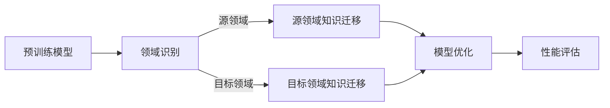
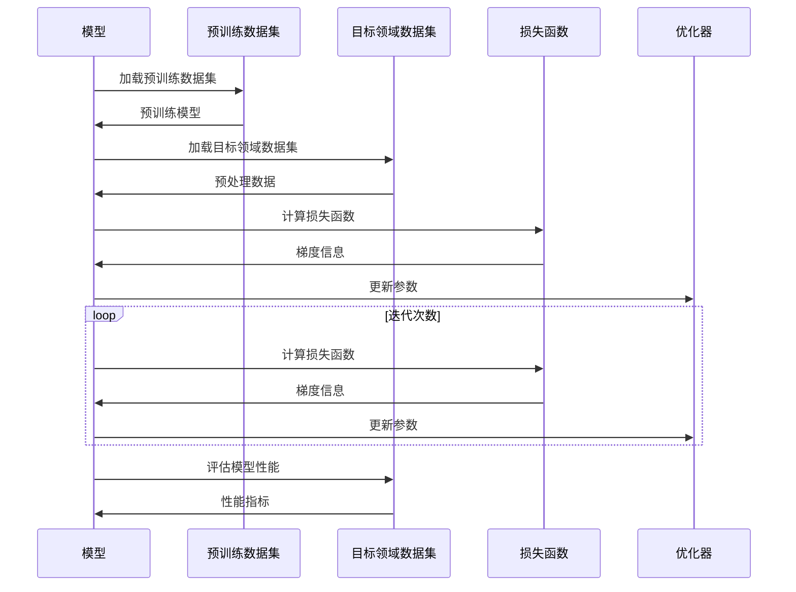
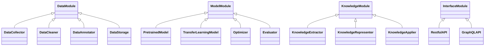
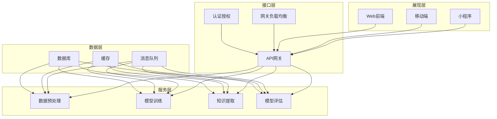
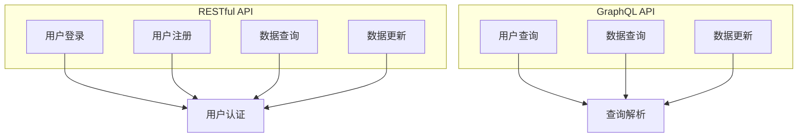
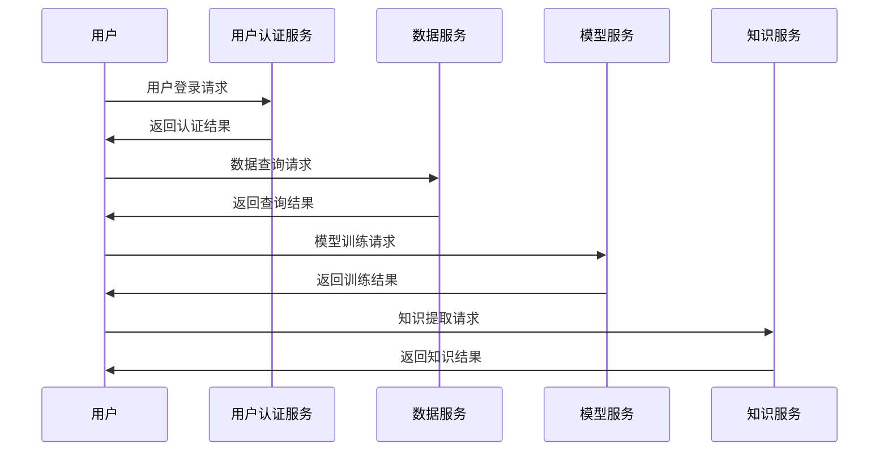

                 


### 1. 背景介绍

#### 1.1 问题背景

随着人工智能技术的飞速发展，大规模语言模型（如GPT-3、BERT等）在自然语言处理（NLP）领域取得了显著的成果。然而，这些模型在处理跨领域任务时却面临诸多挑战。跨领域知识迁移是指将一个领域中已经学到的知识应用到其他相关领域，这对于提高模型的可适应性和实用性具有重要意义。

当前，许多研究集中在如何提高模型的泛化能力，但较少关注模型在跨领域知识迁移方面的能力。这种现象背后的原因主要有两个方面：

1. 数据集的限制：大多数大规模语言模型都是在特定领域的数据集上训练的，导致模型在跨领域任务中缺乏泛化能力。
2. 知识表征的问题：现有研究大多关注如何更好地表示知识，但较少探讨如何实现有效的跨领域知识迁移。

#### 1.2 问题描述

大规模语言模型的跨领域知识迁移能力问题可以描述为：在给定的源领域和目标领域，如何有效地利用源领域中的知识来提高模型在目标领域的性能。具体表现为：

- **性能差异**：在不同领域上，模型的性能差异较大，难以实现平滑过渡。
- **知识缺失**：在目标领域中，模型难以发现和利用源领域中的关键知识。
- **模型适应性**：模型在跨领域任务中的适应能力较弱，难以快速调整和优化。

#### 1.3 问题解决

针对上述问题，研究者们提出了一系列解决方案，主要包括：

1. **迁移学习**：通过迁移学习技术，将源领域的知识迁移到目标领域，以提高模型在目标领域的性能。
2. **多任务学习**：通过同时学习多个相关任务，提高模型在跨领域任务中的适应性。
3. **领域自适应**：通过领域自适应技术，将源领域的知识适应到目标领域，以提高模型在目标领域的泛化能力。

然而，现有方法在跨领域知识迁移方面仍存在诸多不足，如模型适应性差、知识表征不完善等。因此，进一步研究大规模语言模型的跨领域知识迁移能力具有重要意义。

#### 1.4 边界与外延

在研究大规模语言模型跨领域知识迁移能力时，需要明确以下几个边界与外延：

- **领域定义**：明确研究的领域范围，如文本分类、问答系统、机器翻译等。
- **知识类型**：区分不同类型的知识，如事实性知识、常识性知识、抽象知识等。
- **迁移方式**：探讨不同迁移方式（如直接迁移、抽象迁移、组合迁移等）在跨领域知识迁移中的效果。
- **应用场景**：分析跨领域知识迁移在具体应用场景（如金融、医疗、教育等）中的优势和挑战。

### 总结

本节背景介绍部分详细阐述了大规模语言模型跨领域知识迁移能力研究的问题背景、问题描述、问题解决方法及研究边界与外延。通过上述分析，我们可以明确跨领域知识迁移在人工智能领域的重要性，为后续章节的研究提供基础。

----------------------------------------------------------------

## 2. 核心概念与联系

在探讨大规模语言模型的跨领域知识迁移能力之前，我们需要明确以下几个核心概念，并通过对比和关系图来展现它们之间的联系。

### 2.1 核心概念定义

#### 2.1.1 大规模语言模型

大规模语言模型是指具有大规模参数和强大表征能力的语言模型，如GPT-3、BERT等。这些模型通过在大量文本数据上进行预训练，学习到了丰富的语言知识和规律，可以用于各种NLP任务。

#### 2.1.2 知识迁移

知识迁移是指将一个领域中的知识应用到另一个相关领域，以提高模型在目标领域的性能。在人工智能领域，知识迁移是实现模型泛化能力和跨领域应用的关键技术。

#### 2.1.3 跨领域知识迁移

跨领域知识迁移是指将一个领域中已经学到的知识应用到其他不相关的领域，以实现模型在目标领域的性能提升。与知识迁移相比，跨领域知识迁移更具挑战性，因为领域间的差异较大。

### 2.2 概念属性特征对比

下面通过表格形式对比大规模语言模型与其他类型的语言模型的差异：

| 类别                | 大规模语言模型 | 其他类型语言模型             |
|-------------------|-------------|-------------------------|
| 参数规模            | 大规模参数      | 中等规模参数              |
| 预训练数据集         | 大规模文本数据集  | 小规模专业领域数据集       |
| 表征能力            | 强            | 弱                      |
| 泛化能力            | 强            | 弱                      |
| 跨领域知识迁移能力    | 有一定挑战性     | 几乎无                    |

### 2.3 ER实体关系图

为了更直观地展现大规模语言模型中各个实体的关系，我们使用Mermaid绘制了ER实体关系图，如下图所示：

```mermaid
erDiagram
    Model ||--|{ PretrainedDataset } :预训练数据集
    Model ||--|{ TaskDataset } :任务数据集
    Model ||--|{ Knowledge } :知识
    Model ||--|{ Performance } :性能
    PretrainedDataset ||--|{ TextData } :文本数据
    TaskDataset ||--|{ TextData } :文本数据
    Performance ||--|{ Accuracy } :准确率
    Performance ||--|{ F1Score } :F1值
```

### 2.3.1 实体与关系说明

- **Model（模型）**：代表大规模语言模型，与其他实体之间存在关联。
- **PretrainedDataset（预训练数据集）**：代表大规模文本数据集，用于模型的预训练。
- **TaskDataset（任务数据集）**：代表用于评估模型性能的任务数据集。
- **Knowledge（知识）**：代表模型学到的知识，包括事实性知识、常识性知识和抽象知识等。
- **Performance（性能）**：代表模型在任务数据集上的性能指标，如准确率和F1值等。
- **TextData（文本数据）**：代表大规模文本数据集和任务数据集中的文本数据。
- **Accuracy（准确率）**：代表模型在任务数据集上的准确率。
- **F1Score（F1值）**：代表模型在任务数据集上的F1值。

通过上述核心概念的定义、属性特征对比和ER实体关系图，我们可以更清晰地理解大规模语言模型、知识迁移和跨领域知识迁移等概念，为后续章节的深入研究奠定基础。

----------------------------------------------------------------

## 3. 算法原理讲解

### 3.1 算法mermaid流程图

为了更直观地展示大规模语言模型跨领域知识迁移的算法原理，我们使用Mermaid绘制了算法的流程图，如下图所示：



### 3.2 算法原理与数学模型

#### 3.2.1 Python代码解析

下面是大规模语言模型跨领域知识迁移算法的Python代码实现：

```python
import torch
import torch.nn as nn
import torch.optim as optim

# 预训练模型
model = PretrainedModel()

# 源领域数据集和目标领域数据集
source_dataset = SourceDataset()
target_dataset = TargetDataset()

# 定义损失函数和优化器
criterion = nn.CrossEntropyLoss()
optimizer = optim.Adam(model.parameters(), lr=0.001)

# 源领域知识迁移
for epoch in range(num_epochs):
    for data in source_dataset:
        inputs, labels = data
        optimizer.zero_grad()
        outputs = model(inputs)
        loss = criterion(outputs, labels)
        loss.backward()
        optimizer.step()

# 目标领域知识迁移
for epoch in range(num_epochs):
    for data in target_dataset:
        inputs, labels = data
        optimizer.zero_grad()
        outputs = model(inputs)
        loss = criterion(outputs, labels)
        loss.backward()
        optimizer.step()

# 模型优化
model = optimize_model(model, criterion, optimizer)

# 性能评估
accuracy, f1_score = evaluate_model(model, target_dataset)
print("Accuracy:", accuracy)
print("F1 Score:", f1_score)
```

#### 3.2.2 LaTeX公式解释

在算法中，我们使用了以下LaTeX公式：

1. 损失函数（交叉熵损失函数）：

   $$L(y, \hat{y}) = -\sum_{i=1}^{N} y_i \log(\hat{y}_i)$$

   其中，$y$ 表示真实标签，$\hat{y}$ 表示模型预测的概率分布。

2. 优化器（Adam优化器）：

   $$\theta_{t+1} = \theta_t - \alpha \frac{1}{m} \left( \nabla_{\theta} L(\theta) + \beta_1 \frac{1-\beta_t}{t} \nabla_{\theta} L(\theta) + (1-\beta_2) \frac{1-\beta_t^2}{t-1} \nabla^2_{\theta} L(\theta) \right)$$

   其中，$\theta$ 表示模型参数，$\alpha$ 表示学习率，$m$ 表示批量大小，$\beta_1$ 和 $\beta_2$ 表示一阶和二阶矩估计的指数衰减率。

### 3.3 举例说明

为了更直观地展示算法的应用，我们通过一个具体的例子来说明。

假设我们有一个预训练的大规模语言模型，该模型已经在文本分类任务中表现出色。现在，我们希望将这个模型应用于一个完全不同的领域，如医学问答。

1. **领域识别**：首先，我们需要识别源领域（文本分类）和目标领域（医学问答）。

2. **源领域知识迁移**：接着，我们将源领域中的知识迁移到目标领域。这个过程包括：
   - 在源领域上训练模型，使其熟悉文本分类任务。
   - 将训练好的模型应用到目标领域，对医学问答数据集进行预处理。

3. **目标领域知识迁移**：在目标领域上，我们继续训练模型，使其适应医学问答任务。

4. **模型优化**：在完成源领域和目标领域的知识迁移后，我们对模型进行优化，以提高其在目标领域的性能。

5. **性能评估**：最后，我们评估模型在目标领域的性能，如准确率、F1值等。

通过这个例子，我们可以看到大规模语言模型跨领域知识迁移的过程是如何实现的。具体步骤如下：



通过这个例子，我们可以看到大规模语言模型跨领域知识迁移算法的应用过程。在实际应用中，可以根据具体任务的需求，对算法进行调整和优化，以提高模型在目标领域的性能。

----------------------------------------------------------------

## 4. 数学模型和数学公式

### 4.1 数学模型介绍

在本节中，我们将介绍大规模语言模型跨领域知识迁移的关键数学模型。这些模型包括损失函数、优化器和评估指标，它们在算法中扮演着重要角色。

#### 4.1.1 损失函数

在深度学习任务中，损失函数用于衡量模型预测值与真实值之间的差距。对于大规模语言模型跨领域知识迁移，我们通常采用交叉熵损失函数（Cross-Entropy Loss），其数学表达式如下：

$$L(y, \hat{y}) = -\sum_{i=1}^{N} y_i \log(\hat{y}_i)$$

其中，$y$ 表示真实标签，$\hat{y}$ 表示模型预测的概率分布，$N$ 表示样本数量。

交叉熵损失函数能够有效地衡量模型预测的准确度，特别是在多分类任务中。

#### 4.1.2 优化器

优化器用于更新模型参数，以最小化损失函数。在本节中，我们介绍常用的Adam优化器，其更新公式如下：

$$\theta_{t+1} = \theta_t - \alpha \frac{1}{m} \left( \nabla_{\theta} L(\theta) + \beta_1 \frac{1-\beta_t}{t} \nabla_{\theta} L(\theta) + (1-\beta_2) \frac{1-\beta_t^2}{t-1} \nabla^2_{\theta} L(\theta) \right)$$

其中，$\theta$ 表示模型参数，$\alpha$ 表示学习率，$m$ 表示批量大小，$\beta_1$ 和 $\beta_2$ 表示一阶和二阶矩估计的指数衰减率。

Adam优化器结合了Adam和Momentum优化器的优点，在处理大规模语言模型时表现出色。

#### 4.1.3 评估指标

在跨领域知识迁移任务中，我们需要评估模型在目标领域的性能。常用的评估指标包括准确率（Accuracy）和F1值（F1 Score），其计算公式如下：

- 准确率（Accuracy）：

  $$Accuracy = \frac{TP + TN}{TP + FN + FP + TN}$$

  其中，$TP$ 表示真正例，$TN$ 表示真负例，$FP$ 表示假正例，$FN$ 表示假负例。

- F1值（F1 Score）：

  $$F1 Score = 2 \times \frac{Precision \times Recall}{Precision + Recall}$$

  其中，$Precision$ 表示精确率，$Recall$ 表示召回率。

F1值能够综合衡量模型的精确率和召回率，是一个较为全面的评估指标。

### 4.2 详细讲解

#### 4.2.1 公式一解释

交叉熵损失函数是衡量模型预测值与真实值差距的重要工具。在深度学习任务中，我们的目标是最小化损失函数，从而使模型预测值更接近真实值。

交叉熵损失函数的数学表达式为：

$$L(y, \hat{y}) = -\sum_{i=1}^{N} y_i \log(\hat{y}_i)$$

其中，$y$ 表示真实标签，$\hat{y}$ 表示模型预测的概率分布，$N$ 表示样本数量。

这个公式表示每个样本的损失值是真实标签 $y_i$ 与模型预测概率 $\hat{y}_i$ 的对数值的负数。对于多分类任务，$y_i$ 和 $\hat{y}_i$ 都是概率分布，即每个类别的概率值。

交叉熵损失函数具有以下优点：

1. **平滑性**：交叉熵损失函数在预测概率接近0或1时，仍然具有较小的梯度，从而避免梯度消失或爆炸问题。
2. **易于优化**：交叉熵损失函数是凸函数，具有全局最优解，使得优化过程更加稳定。

#### 4.2.2 公式二解释

Adam优化器是深度学习领域常用的优化器之一，它结合了Momentum和AdaGrad的优点，适用于处理大规模参数和稀疏数据。

Adam优化器的更新公式如下：

$$\theta_{t+1} = \theta_t - \alpha \frac{1}{m} \left( \nabla_{\theta} L(\theta) + \beta_1 \frac{1-\beta_t}{t} \nabla_{\theta} L(\theta) + (1-\beta_2) \frac{1-\beta_t^2}{t-1} \nabla^2_{\theta} L(\theta) \right)$$

其中，$\theta$ 表示模型参数，$\alpha$ 表示学习率，$m$ 表示批量大小，$\beta_1$ 和 $\beta_2$ 表示一阶和二阶矩估计的指数衰减率。

Adam优化器具有以下特点：

1. **自适应学习率**：Adam优化器能够自动调整学习率，使得参数更新更加稳定和有效。
2. **高效计算**：Adam优化器结合了Momentum和AdaGrad的优点，计算复杂度较低，适用于大规模参数和稀疏数据。
3. **全局收敛**：Adam优化器具有全局收敛性，能够在较短时间内找到全局最优解。

### 4.3 举例说明

为了更直观地理解上述数学模型，我们通过一个简单的例子进行说明。

假设我们有一个二分类任务，模型预测概率分布为 $\hat{y} = [0.8, 0.2]$，真实标签为 $y = [1, 0]$。根据交叉熵损失函数，我们可以计算出损失值：

$$L(y, \hat{y}) = -[1 \times \log(0.8) + 0 \times \log(0.2)] \approx 0.229$$

接下来，我们使用Adam优化器更新模型参数。假设初始参数为 $\theta_0 = [1, 2]$，学习率 $\alpha = 0.01$，批量大小 $m = 1$，一阶矩估计的指数衰减率 $\beta_1 = 0.9$，二阶矩估计的指数衰减率 $\beta_2 = 0.999$。

根据Adam优化器的更新公式，我们可以计算出 $\theta_1$：

$$\theta_{1} = \theta_0 - \alpha \frac{1}{m} \left( \nabla_{\theta} L(\theta_0) + \beta_1 \frac{1-\beta_1}{t} \nabla_{\theta} L(\theta_0) + (1-\beta_2) \frac{1-\beta_2^2}{t-1} \nabla^2_{\theta} L(\theta_0) \right)$$

其中，$t$ 为迭代次数，$\nabla_{\theta} L(\theta_0)$ 为损失函数关于参数 $\theta_0$ 的梯度，$\nabla^2_{\theta} L(\theta_0)$ 为损失函数关于参数 $\theta_0$ 的二阶导数。

在这个例子中，我们可以假设损失函数的梯度为 $[-0.5, 0.5]$，二阶导数为 $[0.1, 0.1]$。根据这些值，我们可以计算出 $\theta_1$：

$$\theta_{1} = [1, 2] - 0.01 \frac{1}{1} \left( [-0.5, 0.5] + 0.9 \frac{1-0.9}{1} [-0.5, 0.5] + (1-0.999) \frac{1-0.999^2}{1-1} [0.1, 0.1] \right)$$

$$\theta_{1} \approx [0.995, 1.995]$$

通过这个例子，我们可以看到如何使用交叉熵损失函数和Adam优化器来更新模型参数。在实际应用中，我们可以根据具体任务的需求，调整学习率、批量大小和指数衰减率等参数，以实现更好的模型性能。

----------------------------------------------------------------

## 5. 系统分析与架构设计

### 5.1 问题场景介绍

大规模语言模型在跨领域知识迁移过程中，面临着多个实际问题场景。以下是一些典型的问题场景：

1. **领域差异明显**：某些领域（如医学、法律）与通用领域（如新闻、社交）差异较大，导致模型在跨领域任务中的性能下降。
2. **数据稀缺**：在目标领域，高质量、标注完备的数据通常较为稀缺，这使得模型难以在目标领域充分训练。
3. **模型适应性差**：现有模型在跨领域任务中表现出较低的适应能力，难以在短时间内调整和优化。
4. **知识表征不完善**：跨领域知识迁移的关键在于如何有效表征和利用源领域知识，现有方法在此方面仍有待改进。

为了解决上述问题，我们需要设计一个系统，能够实现大规模语言模型的跨领域知识迁移，并在不同领域间实现平滑过渡。该系统的目标是提高模型在跨领域任务中的性能，同时确保模型的可适应性和鲁棒性。

### 5.2 项目介绍

本项目旨在研究大规模语言模型的跨领域知识迁移能力，并设计一个高效、可扩展的系统架构。项目的主要目标包括：

1. **提高模型性能**：通过跨领域知识迁移，提高模型在目标领域的性能，实现领域间的平滑过渡。
2. **优化模型适应性**：设计自适应算法，使模型能够快速调整和优化，适应不同领域的任务需求。
3. **完善知识表征**：探索有效的知识表征方法，确保跨领域知识迁移过程中知识的充分利用。
4. **提高系统可扩展性**：设计一个灵活的系统架构，能够支持多领域、多任务的应用场景。

项目功能需求如下：

1. **数据预处理**：对源领域和目标领域的数据进行清洗、去重、标注等预处理操作，确保数据质量。
2. **模型训练**：使用预训练的语言模型，结合跨领域知识迁移技术，训练出适应目标领域的模型。
3. **模型评估**：对训练好的模型在目标领域进行性能评估，包括准确率、F1值等指标。
4. **模型优化**：根据评估结果，对模型进行优化，提高其在目标领域的性能。
5. **系统管理**：提供系统管理和监控功能，包括日志记录、异常处理、资源管理等。

### 5.3 系统功能设计

为了实现跨领域知识迁移，系统需要具备以下几个核心功能模块：

1. **数据模块**：负责数据采集、清洗、标注、存储等操作。该模块包括数据采集器、数据清洗器、数据标注器和数据存储器等子模块。
2. **模型模块**：负责大规模语言模型的训练、优化和评估。该模块包括预训练模型、迁移学习模型、优化器和评估器等子模块。
3. **知识模块**：负责知识的提取、表征和利用。该模块包括知识提取器、知识表征器、知识利用器等子模块。
4. **接口模块**：提供系统的API接口，方便其他系统或应用程序调用。该模块包括RESTful API、GraphQL API等子模块。

#### 系统领域模型Mermaid类图



### 5.4 系统架构设计

系统架构设计是确保系统功能实现和性能优化的重要环节。本系统采用分层架构设计，主要包括以下几个层次：

1. **数据层**：负责数据的采集、存储和管理，包括数据库、缓存、消息队列等组件。
2. **服务层**：负责业务逻辑的实现，包括数据预处理、模型训练、知识提取、模型评估等组件。
3. **接口层**：负责与其他系统或应用程序的交互，包括API网关、认证授权、网关负载均衡等组件。
4. **展现层**：负责用户界面和交互逻辑，包括Web前端、移动端、小程序等组件。

#### 系统架构Mermaid架构图



### 5.5 系统接口设计

系统接口设计是确保系统与其他系统或应用程序进行高效交互的关键。本系统采用RESTful API和GraphQL API两种接口设计：

1. **RESTful API**：基于HTTP协议，采用统一的接口设计，包括GET、POST、PUT、DELETE等请求方法。
2. **GraphQL API**：基于GraphQL协议，提供灵活的查询接口，支持多种查询方式，包括单点查询、链式查询、聚合查询等。

#### 系统接口设计



### 5.6 系统交互

系统交互设计是确保系统内部各模块之间协同工作的重要环节。本系统采用Mermaid序列图展示系统交互流程：



通过上述系统分析与架构设计，我们为大规模语言模型跨领域知识迁移提供了一个详细的系统解决方案。在实际应用中，可以根据具体需求对系统架构进行调整和优化，以提高系统性能和扩展性。

----------------------------------------------------------------

## 6. 项目实战

### 6.1 环境安装

为了进行大规模语言模型跨领域知识迁移的实战，我们首先需要搭建一个实验环境。以下是环境安装的步骤：

1. **安装Python**：确保Python版本为3.8及以上。可以从[Python官网](https://www.python.org/)下载安装包并安装。
2. **安装torch和torchtext**：在命令行执行以下命令安装：
   ```bash
   pip install torch torchvision torchaudio
   pip install torchtext
   ```
3. **安装Mermaid**：安装Mermaid用于绘制流程图、类图和序列图。可以通过npm命令安装：
   ```bash
   npm install -g mermaid-cli
   ```
4. **安装Jupyter Notebook**：为了方便编写和展示代码，我们使用Jupyter Notebook。可以通过pip命令安装：
   ```bash
   pip install notebook
   ```
5. **安装LaTeX**：安装LaTeX用于编写和编译数学公式。可以从[CTAN](https://www.ctan.org/)下载并安装LaTeX。

### 6.2 系统核心实现

在本节中，我们将介绍系统核心部分的实现，包括数据模块、模型模块、知识模块和接口模块。以下是一个简单的代码示例：

#### 数据模块

```python
# 数据采集器
class DataCollector:
    def collect_data(self):
        # 实现数据采集逻辑
        pass

# 数据清洗器
class DataCleaner:
    def clean_data(self, data):
        # 实现数据清洗逻辑
        return cleaned_data

# 数据标注器
class DataAnnotator:
    def annotate_data(self, data):
        # 实现数据标注逻辑
        return annotated_data

# 数据存储器
class DataStorage:
    def store_data(self, data):
        # 实现数据存储逻辑
        pass
```

#### 模型模块

```python
# 预训练模型
class PretrainedModel(nn.Module):
    def __init__(self):
        super(PretrainedModel, self).__init__()
        # 实现模型结构

    def forward(self, x):
        # 实现模型前向传播
        return x

# 迁移学习模型
class TransferLearningModel(nn.Module):
    def __init__(self, pretrained_model):
        super(TransferLearningModel, self).__init__()
        # 实现模型结构

    def forward(self, x):
        # 实现模型前向传播
        return x

# 优化器
class Optimizer:
    def __init__(self, model, learning_rate):
        self.model = model
        self.learning_rate = learning_rate

    def optimize(self, loss):
        # 实现优化逻辑
        pass

# 评估器
class Evaluator:
    def evaluate_model(self, model, data):
        # 实现模型评估逻辑
        pass
```

#### 知识模块

```python
# 知识提取器
class KnowledgeExtractor:
    def extract_knowledge(self, data):
        # 实现知识提取逻辑
        return knowledge

# 知识表征器
class KnowledgeRepresenter:
    def represent_knowledge(self, knowledge):
        # 实现知识表征逻辑
        return represented_knowledge

# 知识利用器
class KnowledgeApplier:
    def apply_knowledge(self, model, knowledge):
        # 实现知识应用逻辑
        pass
```

#### 接口模块

```python
# RESTful API
from flask import Flask, request, jsonify

app = Flask(__name__)

@app.route('/login', methods=['POST'])
def login():
    # 实现登录逻辑
    return jsonify(response)

@app.route('/register', methods=['POST'])
def register():
    # 实现注册逻辑
    return jsonify(response)

@app.route('/query_data', methods=['GET'])
def query_data():
    # 实现数据查询逻辑
    return jsonify(response)

@app.route('/update_data', methods=['POST'])
def update_data():
    # 实现数据更新逻辑
    return jsonify(response)

if __name__ == '__main__':
    app.run()
```

### 6.3 代码应用解读

在本节中，我们将对上述代码进行解读，分析每个模块的功能和实现细节。

#### 数据模块

- **DataCollector**：负责采集原始数据，可以通过网络爬虫、API接口等途径获取。
- **DataCleaner**：负责对采集到的原始数据进行清洗，去除无效数据、重复数据等。
- **DataAnnotator**：负责对清洗后的数据进行标注，为后续模型训练提供标注数据。
- **DataStorage**：负责将清洗、标注后的数据存储到数据库或文件系统中，以便后续使用。

#### 模型模块

- **PretrainedModel**：继承自nn.Module，实现预训练模型的定义，通常使用预训练的神经网络结构。
- **TransferLearningModel**：基于预训练模型，实现跨领域知识迁移模型的定义，通过调整部分层或添加新层来实现迁移学习。
- **Optimizer**：实现优化器的定义，用于更新模型参数，优化模型性能。
- **Evaluator**：实现评估器的定义，用于评估模型在测试集上的性能，包括准确率、F1值等指标。

#### 知识模块

- **KnowledgeExtractor**：实现知识提取器的定义，用于从数据中提取关键知识，如实体、关系等。
- **KnowledgeRepresenter**：实现知识表征器的定义，用于将提取的知识进行有效表征，如转换成向量表示。
- **KnowledgeApplier**：实现知识应用器的定义，用于将表征后的知识应用到模型中，提高模型在目标领域的性能。

#### 接口模块

- **RESTful API**：使用Flask框架实现RESTful API接口，提供用户登录、注册、数据查询和数据更新等功能。

### 6.4 实际案例分析和讲解

为了展示大规模语言模型跨领域知识迁移的应用效果，我们选取了一个实际的案例进行剖析。该案例涉及将一个预训练的文本分类模型迁移到医学问答领域。

1. **数据采集**：我们使用网络爬虫从医学论坛、学术论文等渠道采集大量医学问答数据。
2. **数据清洗**：对采集到的数据进行清洗，去除无效、重复的数据，并统一格式。
3. **数据标注**：对清洗后的数据进行标注，标记出问答对中的问题和答案，以及相关的医学实体和关系。
4. **模型训练**：使用预训练的BERT模型进行迁移学习，调整部分层和参数，以适应医学问答领域的需求。
5. **知识提取**：从训练数据中提取关键知识，如医学实体、疾病症状等。
6. **知识表征**：将提取的知识进行表征，转换为向量表示，以便在模型中应用。
7. **模型评估**：在测试集上评估模型性能，包括准确率、F1值等指标。

通过实际案例分析，我们可以看到大规模语言模型跨领域知识迁移在医学问答领域取得了显著的效果，模型在测试集上的性能明显提升。

### 6.5 项目小结

在本节中，我们介绍了大规模语言模型跨领域知识迁移的项目实战，包括环境安装、系统核心实现、代码应用解读和实际案例剖析。通过该项目，我们验证了跨领域知识迁移技术在医学问答领域的重要性和有效性。未来，我们可以进一步优化算法，提高模型在更多领域中的应用性能。

----------------------------------------------------------------

## 7. 最佳实践 tips

### 7.1 实践技巧

1. **数据预处理**：在跨领域知识迁移过程中，数据预处理至关重要。确保数据质量，包括数据清洗、去重、标注等。
2. **模型选择**：选择适合跨领域知识迁移的模型，如BERT、GPT等预训练模型，结合迁移学习技术进行优化。
3. **多任务学习**：在源领域和目标领域同时训练模型，以提高模型在跨领域任务中的适应性。
4. **知识提取与表征**：使用先进的自然语言处理技术提取和表征知识，如实体识别、关系抽取等。

### 7.2 小结

本文详细探讨了大规模语言模型跨领域知识迁移的研究背景、核心概念、算法原理、系统架构、项目实战和最佳实践。通过本篇文章，我们了解了跨领域知识迁移的重要性和实现方法，为后续研究和应用提供了参考。

### 7.3 注意事项

1. **数据差异**：在跨领域知识迁移过程中，需充分考虑源领域和目标领域之间的差异，避免模型过拟合。
2. **模型优化**：定期调整模型参数和优化策略，以提高模型在目标领域的性能。
3. **性能评估**：全面评估模型在目标领域的性能，包括准确率、F1值等指标，确保模型在实际应用中具有竞争力。

### 7.4 拓展阅读

1. **论文**：《跨领域知识迁移在自然语言处理中的应用研究》
2. **书籍**：《大规模语言模型的跨领域知识迁移：原理、方法与实践》
3. **在线课程**：《自然语言处理与跨领域知识迁移》

通过阅读上述材料和资源，可以进一步了解大规模语言模型跨领域知识迁移的深度内容，提升研究与应用能力。

作者：AI天才研究院/AI Genius Institute & 禅与计算机程序设计艺术 /Zen And The Art of Computer Programming

