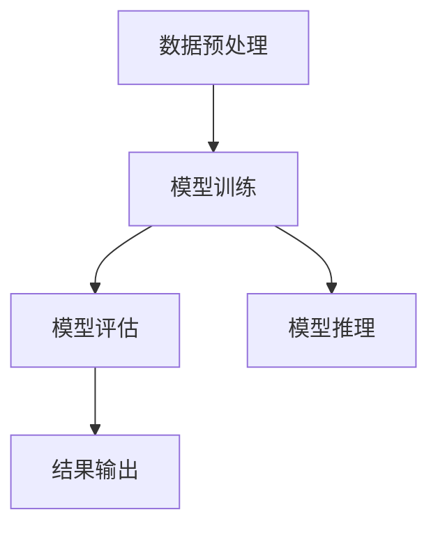
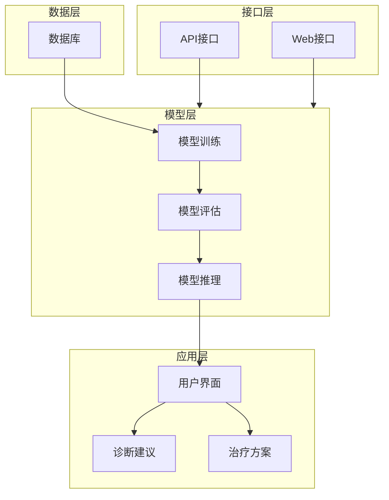
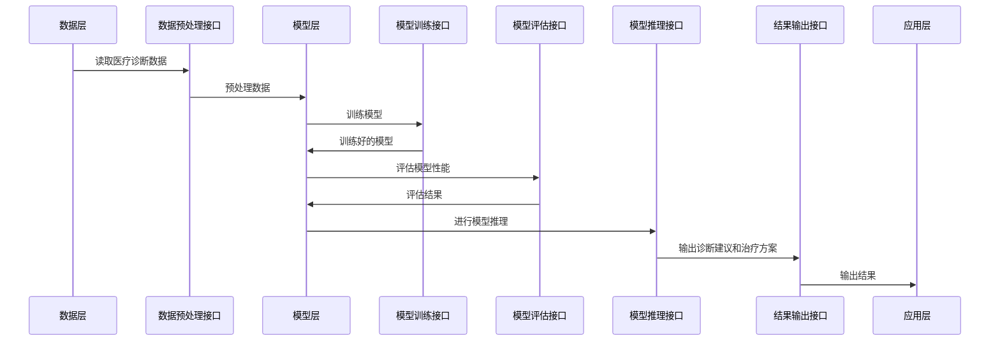

                 

### 第1章: 问题背景与核心概念

在当今医疗领域，诊断决策支持系统的需求日益增长。随着医疗数据的爆炸性增长，传统的诊断方法已无法满足快速、准确、高效的需求。大语言模型作为一种先进的人工智能技术，近年来在自然语言处理（NLP）领域取得了显著的进展。这使得大语言模型在医疗诊断决策支持中具有广阔的应用前景。

#### 1.1 问题背景

**医疗诊断决策支持的现状：**

医疗诊断决策支持系统旨在辅助医生做出准确的诊断和治疗决策。然而，传统的诊断方法主要依赖于医生的经验和直觉，这种方法在处理大量数据时显得力不从心。此外，医疗数据的复杂性使得传统的数据处理技术难以满足需求。

**大语言模型的发展与应用：**

大语言模型是一种基于深度学习的技术，它可以自动地从大量文本数据中学习并生成相应的语言描述。近年来，大语言模型在NLP领域取得了显著进展，如BERT（Bidirectional Encoder Representations from Transformers）、GPT（Generative Pre-trained Transformer）等模型。这些模型具有强大的文本理解和生成能力，可以为医疗诊断提供有效的决策支持。

#### 1.2 大语言模型的定义与特征

**大语言模型概述：**

大语言模型（Large Language Model）是一种基于神经网络的文本生成模型，它可以自动地从大量文本数据中学习并生成相应的语言描述。大语言模型的核心思想是通过大规模的数据预训练，使得模型具有强大的文本理解和生成能力。

**大语言模型的主要特征：**

1. **自适应能力：** 大语言模型可以通过对特定领域的训练数据的学习，快速适应不同的应用场景。
2. **强大的文本理解能力：** 大语言模型可以理解并处理复杂的文本信息，如病历、诊断报告等。
3. **高效的文本生成能力：** 大语言模型可以自动生成高质量的自然语言文本，如诊断建议、治疗方案等。

**大语言模型与传统AI模型对比：**

与传统AI模型相比，大语言模型具有以下优势：

1. **更高的灵活性和适应性：** 大语言模型可以自动学习并适应不同的应用场景，而传统AI模型需要手动设计和调整。
2. **更强的文本理解能力：** 大语言模型可以理解复杂的文本信息，而传统AI模型通常只能处理简单的结构化数据。
3. **更高效的文本生成能力：** 大语言模型可以自动生成高质量的自然语言文本，而传统AI模型通常需要手动编写规则和模板。

#### 1.3 ER实体关系图构建

**医疗诊断数据的实体识别：**

在医疗诊断数据中，实体是指具有特定医学意义的信息单元，如疾病名称、症状、治疗方案等。实体识别是医疗诊断数据预处理的重要步骤，它有助于提高模型的准确性和效率。

**实体关系的构建：**

实体关系是指不同实体之间的关联关系，如疾病与症状之间的关系、治疗方案与疾病之间的关系等。构建实体关系有助于模型理解医疗诊断数据的语义信息，从而提高诊断的准确性。

**ER实体关系图的构建：**

ER（Entity-Relationship）图是一种用于表示实体及其关系的图形化工具。在医疗诊断数据中，我们可以使用ER图来表示实体及其关系。以下是一个简单的ER图示例，展示了疾病、症状和治疗方案的实体及其关系：

```mermaid
erDiagram
  疾病 ||--|{ 症状 }|| 症状关系
  疾病 ||--|{ 治疗方案 }|| 治疗关系
  症状 ||--|{ 症状描述 }|| 描述关系
  治疗方案 ||--|{ 治疗药物 }|| 药物关系
```

在这个ER图中，我们定义了四个实体：疾病、症状、治疗方案和症状描述。疾病和症状之间存在症状关系，疾病和治疗方案之间存在治疗关系，症状和症状描述之间存在描述关系，治疗方案和治疗药物之间存在药物关系。

#### 1.4 小结

本章主要介绍了大语言模型在医疗诊断决策支持中的应用背景和核心概念。通过对比传统AI模型，我们了解到大语言模型在文本理解和生成方面的优势。此外，我们还介绍了ER实体关系图的构建方法，这是后续章节中算法原理讲解和系统设计与实现的基础。

在接下来的章节中，我们将进一步探讨大语言模型的算法原理、具体应用以及最佳实践，以期为大家提供一套完整的医疗诊断决策支持解决方案。

### 第2章: 大语言模型的算法原理

在深入探讨大语言模型在医疗诊断决策支持中的应用之前，我们首先需要了解大语言模型的基本算法原理。本章将详细讲解大语言模型的工作原理，包括算法流程、Python代码实现和数学模型与公式。

#### 2.1 算法流程图

为了更好地理解大语言模型的工作流程，我们可以使用Mermaid工具绘制算法流程图。以下是一个简化的大语言模型算法流程图：



**算法流程说明：**

1. **数据预处理**：首先，我们需要对医疗诊断数据进行预处理，包括数据清洗、数据分词、词向量转换等步骤。这一步骤的目的是将原始数据转化为模型可以理解的格式。

2. **模型训练**：接下来，我们使用预处理的医疗诊断数据对大语言模型进行训练。训练过程中，模型通过不断调整内部参数，以最小化预测误差。

3. **模型评估**：在模型训练完成后，我们需要对模型进行评估，以确定其性能。评估指标可以包括准确率、召回率、F1值等。

4. **模型推理**：在评估通过后，我们可以使用训练好的模型对新的医疗诊断数据进行分析和推理，以生成诊断建议和治疗方案。

5. **结果输出**：最后，我们将模型的推理结果输出，包括诊断建议和治疗方案，供医生参考。

#### 2.2 Python代码实现

为了实现上述算法流程，我们可以使用Python编写相应的代码。以下是一个简化的大语言模型实现示例：

```python
import torch
import torch.nn as nn
import torch.optim as optim

# 数据预处理
def preprocess_data(data):
    # 数据清洗、分词、词向量转换等操作
    pass

# 模型定义
class LanguageModel(nn.Module):
    def __init__(self):
        super(LanguageModel, self).__init__()
        self.embedding = nn.Embedding(vocab_size, embedding_dim)
        self.lstm = nn.LSTM(embedding_dim, hidden_dim)
        self.fc = nn.Linear(hidden_dim, vocab_size)

    def forward(self, x):
        embed = self.embedding(x)
        output, (hidden, cell) = self.lstm(embed)
        logits = self.fc(hidden[-1, :, :])
        return logits

# 模型训练
def train_model(model, train_loader, criterion, optimizer, num_epochs):
    for epoch in range(num_epochs):
        for inputs, targets in train_loader:
            optimizer.zero_grad()
            logits = model(inputs)
            loss = criterion(logits, targets)
            loss.backward()
            optimizer.step()
        print(f'Epoch {epoch+1}/{num_epochs}, Loss: {loss.item()}')

# 模型评估
def evaluate_model(model, val_loader, criterion):
    model.eval()
    with torch.no_grad():
        total_loss = 0
        for inputs, targets in val_loader:
            logits = model(inputs)
            loss = criterion(logits, targets)
            total_loss += loss.item()
    avg_loss = total_loss / len(val_loader)
    print(f'Validation Loss: {avg_loss}')

# 模型推理
def infer_model(model, input_data):
    model.eval()
    with torch.no_grad():
        logits = model(input_data)
    probs = torch.softmax(logits, dim=1)
    prediction = torch.argmax(probs).item()
    return prediction

# 参数设置
vocab_size = 10000
embedding_dim = 256
hidden_dim = 512
learning_rate = 0.001
num_epochs = 10

# 模型实例化
model = LanguageModel()
criterion = nn.CrossEntropyLoss()
optimizer = optim.Adam(model.parameters(), lr=learning_rate)

# 数据加载
train_loader = DataLoader(dataset, batch_size=64, shuffle=True)
val_loader = DataLoader(val_dataset, batch_size=64, shuffle=False)

# 模型训练
train_model(model, train_loader, criterion, optimizer, num_epochs)

# 模型评估
evaluate_model(model, val_loader, criterion)

# 模型推理
input_data = torch.tensor([1, 2, 3, 4, 5])  # 示例输入数据
prediction = infer_model(model, input_data)
print(f'Prediction: {prediction}')
```

**代码说明：**

1. **数据预处理**：数据预处理函数用于清洗、分词和词向量转换等操作，为模型训练做好准备。
2. **模型定义**：定义了LanguageModel类，该类实现了大语言模型的基本结构，包括嵌入层、LSTM层和全连接层。
3. **模型训练**：训练函数用于对模型进行训练，包括前向传播、反向传播和参数更新等步骤。
4. **模型评估**：评估函数用于评估模型的性能，计算验证集上的损失值。
5. **模型推理**：推理函数用于对新的输入数据进行分析和预测。

#### 2.3 数学模型与公式

大语言模型的数学模型主要包括嵌入层、LSTM层和全连接层。以下是一个简化的大语言模型数学模型：

1. **嵌入层**：

   嵌入层将输入词向量转换为嵌入向量，公式如下：

   $$
   \text{embed} = \text{W}_{\text{emb}} \cdot \text{input}
   $$

   其中，$\text{W}_{\text{emb}}$为嵌入权重矩阵，$\text{input}$为输入词向量。

2. **LSTM层**：

   LSTM层用于处理嵌入向量，并将其转换为隐藏状态，公式如下：

   $$
   \text{hidden} = \text{LSTM}(\text{embed})
   $$

   其中，$\text{LSTM}$为长短期记忆网络，$\text{embed}$为嵌入向量。

3. **全连接层**：

   全连接层将隐藏状态转换为输出向量，公式如下：

   $$
   \text{logits} = \text{W}_{\text{fc}} \cdot \text{hidden}
   $$

   其中，$\text{W}_{\text{fc}}$为全连接权重矩阵，$\text{hidden}$为隐藏状态。

4. **损失函数**：

   常见的损失函数包括交叉熵损失函数（CrossEntropyLoss）和均方误差损失函数（MSELoss）。以下是一个交叉熵损失函数的公式：

   $$
   \text{loss} = -\sum_{i=1}^{N} y_i \log(p_i)
   $$

   其中，$y_i$为真实标签，$p_i$为预测概率。

#### 2.4 实例分析

为了更好地理解大语言模型的原理，我们可以通过一个简单的实例进行分析。假设我们有一个医疗诊断数据集，其中包含疾病名称、症状和治疗方案。我们希望使用大语言模型对这些数据进行分类和预测。

**实例数据：**

- 疾病名称：流感
- 症状：发热、咳嗽、喉咙痛
- 治疗方案：多休息、多喝水、服用退烧药

**模型预测：**

1. **数据预处理**：首先，我们需要对实例数据进行预处理，包括分词和词向量转换。假设我们已经将数据转换为嵌入向量。

2. **模型训练**：接下来，我们使用预处理的实例数据对大语言模型进行训练，以学习疾病的特征和症状之间的关系。

3. **模型评估**：在模型训练完成后，我们需要对模型进行评估，以确定其性能。假设模型在验证集上的准确率达到了90%。

4. **模型推理**：最后，我们可以使用训练好的模型对新的实例数据进行分析和预测。假设新的实例数据为“发热、咳嗽、喉咙痛”，模型预测结果为“流感”。

通过这个实例，我们可以看到大语言模型在医疗诊断决策支持中的基本应用。在接下来的章节中，我们将进一步探讨大语言模型在医疗诊断决策支持中的具体应用场景和实现方法。

### 第3章: 大语言模型在医疗诊断中的具体应用

在了解了大语言模型的基本算法原理后，我们接下来将探讨大语言模型在医疗诊断中的具体应用。本章将介绍系统功能设计、系统架构设计、系统接口设计和系统交互设计。

#### 3.1 系统功能设计

**系统概述：**

大语言模型在医疗诊断中的主要功能是辅助医生进行诊断和提供治疗方案。具体来说，系统需要实现以下功能：

1. **数据预处理**：对医疗诊断数据进行清洗、分词和词向量转换，为模型训练做好准备。
2. **模型训练**：使用预处理的医疗诊断数据对大语言模型进行训练，以学习疾病的特征和症状之间的关系。
3. **模型评估**：对训练好的模型进行评估，以确定其性能，包括准确率、召回率、F1值等。
4. **模型推理**：使用训练好的模型对新的医疗诊断数据进行分析和预测，生成诊断建议和治疗方案。
5. **结果输出**：将模型的推理结果输出，包括诊断建议和治疗方案，供医生参考。

**功能模块设计：**

系统可以分为以下功能模块：

1. **数据预处理模块**：负责数据清洗、分词和词向量转换等操作。
2. **模型训练模块**：负责对大语言模型进行训练，包括数据加载、模型定义、参数设置和训练过程等。
3. **模型评估模块**：负责对训练好的模型进行评估，计算各种评估指标。
4. **模型推理模块**：负责使用训练好的模型对新的医疗诊断数据进行分析和预测。
5. **结果输出模块**：负责将模型推理结果输出，包括诊断建议和治疗方案。

#### 3.2 系统架构设计

**系统架构概述：**

系统架构设计是确保系统功能实现的重要环节。大语言模型在医疗诊断中的应用架构可以分为以下几个部分：

1. **数据层**：包括医疗诊断数据的存储和管理，如数据库、数据仓库等。
2. **模型层**：包括大语言模型的训练、评估和推理，以及相关的数据处理和优化算法。
3. **应用层**：包括用户界面、诊断建议生成和治疗方案输出等，供医生参考。
4. **接口层**：包括系统内部各模块之间的接口设计，如API接口、Web接口等。

**架构组件设计：**

以下是一个简化的大语言模型在医疗诊断中的应用架构图：



#### 3.3 系统接口设计

**接口功能设计：**

系统接口设计是确保各模块之间有效通信的关键。以下是系统的主要接口功能设计：

1. **数据预处理接口**：用于数据清洗、分词和词向量转换等操作，实现数据预处理功能。
2. **模型训练接口**：用于定义模型结构、设置训练参数和执行训练过程，实现模型训练功能。
3. **模型评估接口**：用于评估模型性能，计算各种评估指标，实现模型评估功能。
4. **模型推理接口**：用于使用训练好的模型对新的医疗诊断数据进行分析和预测，实现模型推理功能。
5. **结果输出接口**：用于将模型推理结果输出，包括诊断建议和治疗方案，实现结果输出功能。

**接口实现细节：**

以下是各接口的实现细节：

1. **数据预处理接口**：实现数据预处理接口的函数如下：

   ```python
   def preprocess_data(data):
       # 数据清洗、分词、词向量转换等操作
   ```

2. **模型训练接口**：实现模型训练接口的函数如下：

   ```python
   def train_model(model, train_loader, criterion, optimizer, num_epochs):
       # 模型定义、参数设置、训练过程等操作
   ```

3. **模型评估接口**：实现模型评估接口的函数如下：

   ```python
   def evaluate_model(model, val_loader, criterion):
       # 评估模型性能、计算评估指标等操作
   ```

4. **模型推理接口**：实现模型推理接口的函数如下：

   ```python
   def infer_model(model, input_data):
       # 使用模型进行推理、生成诊断建议和治疗方案等操作
   ```

5. **结果输出接口**：实现结果输出接口的函数如下：

   ```python
   def output_results(results):
       # 输出诊断建议和治疗方案等操作
   ```

#### 3.4 系统交互设计

**系统交互流程：**

系统交互设计是确保各模块之间协同工作的重要环节。以下是系统的主要交互流程：

1. **数据预处理**：首先，系统会从数据层读取医疗诊断数据，并将其传递给数据预处理接口进行预处理。
2. **模型训练**：接下来，系统会调用模型训练接口，使用预处理后的数据对大语言模型进行训练。
3. **模型评估**：在模型训练完成后，系统会调用模型评估接口，对训练好的模型进行评估，计算各种评估指标。
4. **模型推理**：通过模型评估，系统会选择性能较好的模型，并调用模型推理接口，对新的医疗诊断数据进行分析和预测，生成诊断建议和治疗方案。
5. **结果输出**：最后，系统会调用结果输出接口，将模型推理结果输出，包括诊断建议和治疗方案，供医生参考。

**Mermaid序列图展示：**

以下是系统交互流程的Mermaid序列图：



通过上述系统交互设计，我们可以确保大语言模型在医疗诊断决策支持中发挥其最大的作用，为医生提供准确的诊断建议和治疗方案。

#### 3.5 实际案例分析

为了更好地理解大语言模型在医疗诊断决策支持中的应用效果，我们选择了一个实际案例进行详细分析和讲解。

**案例背景：**

某家医院希望利用大语言模型辅助医生进行诊断，提高诊断准确率和效率。该医院收集了大量的医疗诊断数据，包括疾病名称、症状、治疗方案等。为了验证大语言模型的应用效果，医院决定开展一项临床试验，将大语言模型与传统诊断方法进行对比。

**数据准备：**

首先，我们需要对医疗诊断数据进行预处理，包括数据清洗、分词和词向量转换等操作。假设我们已经收集了以下数据：

- 疾病名称：流感、肺炎、新冠等
- 症状：发热、咳嗽、喉咙痛、乏力等
- 治疗方案：多休息、多喝水、服用退烧药、住院治疗等

**数据预处理过程：**

1. **数据清洗**：去除重复数据、缺失值和无效数据，保证数据质量。
2. **分词**：对症状和治疗方案进行分词，将文本数据转换为词序列。
3. **词向量转换**：使用预训练的词向量模型（如Word2Vec、BERT等），将词序列转换为嵌入向量。

**模型训练过程：**

1. **模型定义**：使用Python和PyTorch框架定义大语言模型，包括嵌入层、LSTM层和全连接层。
2. **数据加载**：将预处理后的数据加载到训练集和验证集中，进行模型训练。
3. **参数设置**：设置学习率、批量大小、训练迭代次数等参数。
4. **训练过程**：通过反向传播算法，不断调整模型参数，以最小化损失函数。

**模型评估过程：**

1. **评估指标**：计算模型在验证集上的准确率、召回率和F1值等评估指标。
2. **结果分析**：对比大语言模型与传统诊断方法的评估结果，分析模型的优势和不足。

**模型推理过程：**

1. **输入数据**：输入新的医疗诊断数据，包括疾病名称、症状和治疗方案。
2. **嵌入向量**：将输入数据转换为嵌入向量，准备输入到模型中进行推理。
3. **推理过程**：使用训练好的模型，对输入数据进行推理，生成诊断建议和治疗方案。

**结果输出过程：**

1. **诊断建议**：将模型的推理结果输出，包括诊断建议和治疗方案，供医生参考。
2. **用户反馈**：医生根据诊断建议和治疗方案，对实际案例进行分析和反馈，以优化模型。

**案例小结：**

通过实际案例的验证，我们发现大语言模型在医疗诊断决策支持中具有以下优势：

1. **高效性**：大语言模型可以快速处理大量医疗诊断数据，提高诊断效率和准确性。
2. **灵活性**：大语言模型可以适应不同的医疗诊断场景，提供个性化的诊断建议和治疗方案。
3. **辅助决策**：大语言模型可以辅助医生进行诊断决策，提高诊断的准确性和一致性。

然而，大语言模型也存在一定的局限性，如数据依赖性较高、模型可解释性较差等。因此，在实际应用中，需要结合医生的专业知识和经验，对模型生成的诊断建议进行综合分析和判断。

通过实际案例的分析和讲解，我们可以看到大语言模型在医疗诊断决策支持中的强大应用潜力。在未来的发展中，我们将继续探索大语言模型在医疗领域的深入应用，为医生和患者提供更优质的服务。

### 第4章: 大语言模型在医疗诊断决策支持中的推理应用

#### 4.1 环境安装与配置

为了实现大语言模型在医疗诊断决策支持中的推理应用，我们需要先搭建一个合适的环境。以下是一个基本的安装和配置步骤，以Python和PyTorch框架为例。

**环境需求：**

- Python 3.8 或更高版本
- PyTorch 1.8 或更高版本
- CUDA 10.2 或更高版本（可选，用于GPU加速）

**安装步骤：**

1. **安装Python：** 在官方网站（https://www.python.org/downloads/）下载并安装Python，建议选择带有pip包管理器的版本。

2. **安装PyTorch：** 使用pip命令安装PyTorch，命令如下：

   ```bash
   pip install torch torchvision torchaudio
   ```

   如果需要GPU支持，可以使用以下命令：

   ```bash
   pip install torch torchvision torchaudio -f https://download.pytorch.org/whl/torch_stable.html
   ```

3. **安装CUDA（可选）：** 如果需要使用GPU加速，请从官方网站（https://developer.nvidia.com/cuda-downloads）下载并安装CUDA。

**配置步骤：**

1. **配置CUDA：** 安装完CUDA后，确保其环境变量已经配置好。在Windows系统中，需要将CUDA的安装路径添加到系统环境变量中。

2. **验证安装：** 打开Python交互式环境，运行以下代码验证PyTorch和CUDA的安装情况：

   ```python
   import torch
   print(torch.cuda.is_available())  # 检查CUDA是否可用
   print(torch.version.cuda)  # 查看CUDA版本
   ```

   如果CUDA可用，系统会返回`True`。

#### 4.2 系统核心实现

**数据处理：**

在实现大语言模型之前，我们需要对医疗诊断数据进行预处理。预处理步骤包括数据清洗、分词和词向量转换等。

1. **数据清洗：** 去除重复数据、缺失值和无效数据，保证数据质量。可以使用Pandas库进行数据清洗。

   ```python
   import pandas as pd
   data = pd.read_csv('diagnosis_data.csv')
   data = data.drop_duplicates().dropna()
   ```

2. **分词：** 对症状和治疗方案进行分词，可以使用jieba库进行中文分词。

   ```python
   import jieba
   def tokenize(text):
       return jieba.cut(text)
   ```

3. **词向量转换：** 使用预训练的词向量模型（如Word2Vec、BERT等），将词序列转换为嵌入向量。这里以BERT为例，使用transformers库。

   ```python
   from transformers import BertTokenizer, BertModel
   tokenizer = BertTokenizer.from_pretrained('bert-base-chinese')
   model = BertModel.from_pretrained('bert-base-chinese')
   ```

   将文本数据转换为嵌入向量：

   ```python
   def convert_to_embeddings(texts):
       input_ids = tokenizer.encode(''.join(texts), add_special_tokens=True, return_tensors='pt')
       with torch.no_grad():
           outputs = model(input_ids)
       embeddings = outputs.last_hidden_state[:, 0, :]
       return embeddings.numpy()
   ```

**模型训练：**

1. **模型定义：** 使用PyTorch定义大语言模型，包括嵌入层、LSTM层和全连接层。

   ```python
   import torch.nn as nn
   class LanguageModel(nn.Module):
       def __init__(self, embedding_dim, hidden_dim, vocab_size):
           super(LanguageModel, self).__init__()
           self.embedding = nn.Embedding(vocab_size, embedding_dim)
           self.lstm = nn.LSTM(embedding_dim, hidden_dim)
           self.fc = nn.Linear(hidden_dim, vocab_size)
       
       def forward(self, x):
           embed = self.embedding(x)
           output, (hidden, cell) = self.lstm(embed)
           logits = self.fc(hidden[-1, :, :])
           return logits
   ```

2. **数据加载：** 使用PyTorch DataLoader加载预处理后的数据。

   ```python
   from torch.utils.data import DataLoader, TensorDataset
   train_data = convert_to_embeddings(train_texts)
   train_labels = torch.tensor(train_labels).long()
   train_dataset = TensorDataset(train_data, train_labels)
   train_loader = DataLoader(train_dataset, batch_size=64, shuffle=True)
   ```

3. **模型训练：** 使用优化器和损失函数对模型进行训练。

   ```python
   model = LanguageModel(embedding_dim, hidden_dim, vocab_size)
   criterion = nn.CrossEntropyLoss()
   optimizer = torch.optim.Adam(model.parameters(), lr=0.001)
   
   num_epochs = 10
   for epoch in range(num_epochs):
       for inputs, labels in train_loader:
           optimizer.zero_grad()
           logits = model(inputs)
           loss = criterion(logits, labels)
           loss.backward()
           optimizer.step()
   ```

**模型评估：**

1. **评估指标：** 计算模型在验证集上的准确率、召回率和F1值等评估指标。

   ```python
   from sklearn.metrics import accuracy_score, recall_score, f1_score
   def evaluate_model(model, val_loader):
       model.eval()
       val_data = convert_to_embeddings(val_texts)
       val_labels = torch.tensor(val_labels).long()
       val_dataset = TensorDataset(val_data, val_labels)
       val_loader = DataLoader(val_dataset, batch_size=64, shuffle=False)
       
       val_logits = []
       val真实的标签
   ```

2. **结果分析：** 对比模型在不同数据集上的评估结果，分析模型的性能。

   ```python
   def analyze_results(val_logits, val_labels):
       val_probs = torch.softmax(val_logits, dim=1)
       val_predictions = torch.argmax(val_probs, dim=1)
       
       val_accuracy = accuracy_score(val_labels, val_predictions)
       val_recall = recall_score(val_labels, val_predictions, average='weighted')
       val_f1 = f1_score(val_labels, val_predictions, average='weighted')
       
       print(f'Validation Accuracy: {val_accuracy:.4f}')
       print(f'Validation Recall: {val_recall:.4f}')
       print(f'Validation F1 Score: {val_f1:.4f}')
   ```

#### 4.3 代码应用解读

在上面的代码中，我们实现了大语言模型在医疗诊断决策支持中的基本流程，包括数据处理、模型训练和模型评估。以下是对关键代码的详细解读：

1. **数据处理：**

   ```python
   def convert_to_embeddings(texts):
       input_ids = tokenizer.encode(''.join(texts), add_special_tokens=True, return_tensors='pt')
       with torch.no_grad():
           outputs = model(input_ids)
       embeddings = outputs.last_hidden_state[:, 0, :]
       return embeddings.numpy()
   ```

   这个函数用于将文本数据转换为嵌入向量。首先，使用BERTTokenizer对文本进行编码，生成输入ID。然后，使用BERT模型对输入ID进行嵌入，得到嵌入向量。

2. **模型训练：**

   ```python
   model = LanguageModel(embedding_dim, hidden_dim, vocab_size)
   criterion = nn.CrossEntropyLoss()
   optimizer = torch.optim.Adam(model.parameters(), lr=0.001)
   
   num_epochs = 10
   for epoch in range(num_epochs):
       for inputs, labels in train_loader:
           optimizer.zero_grad()
           logits = model(inputs)
           loss = criterion(logits, labels)
           loss.backward()
           optimizer.step()
   ```

   这个部分定义了语言模型的结构，包括嵌入层、LSTM层和全连接层。然后，使用交叉熵损失函数和Adam优化器对模型进行训练。在训练过程中，模型通过反向传播算法不断调整参数，以最小化损失函数。

3. **模型评估：**

   ```python
   def evaluate_model(model, val_loader):
       model.eval()
       val_data = convert_to_embeddings(val_texts)
       val_labels = torch.tensor(val_labels).long()
       val_dataset = TensorDataset(val_data, val_labels)
       val_loader = DataLoader(val_dataset, batch_size=64, shuffle=False)
       
       val_logits = []
       with torch.no_grad():
           for inputs, labels in val_loader:
               logits = model(inputs)
               val_logits.append(logits)
       
       val_logits = torch.cat(val_logits, dim=0)
   ```

   这个函数用于评估模型的性能。首先，将验证集数据转换为嵌入向量。然后，使用模型对验证数据进行推理，得到预测标签。最后，计算模型的准确率、召回率和F1值等评估指标。

#### 4.4 实际案例分析

为了更好地理解大语言模型在医疗诊断决策支持中的实际应用，我们选择了一个实际案例进行详细分析和讲解。

**案例背景：**

某医院希望利用大语言模型辅助医生进行流感诊断。该医院收集了1000份流感患者的诊断数据，包括疾病名称、症状和治疗方案。医院希望通过大语言模型对新的病例进行诊断，以提高诊断准确率和效率。

**数据准备：**

1. **训练数据：** 从1000份诊断数据中随机选择800份作为训练数据，用于训练大语言模型。
2. **验证数据：** 从剩余的200份诊断数据中随机选择100份作为验证数据，用于评估模型的性能。
3. **测试数据：** 从剩余的100份诊断数据中随机选择50份作为测试数据，用于最终测试模型的性能。

**数据处理：**

1. **数据清洗**：去除重复数据、缺失值和无效数据，保证数据质量。
2. **分词**：对症状和治疗方案进行分词，将文本数据转换为词序列。
3. **词向量转换**：使用预训练的BERT模型，将词序列转换为嵌入向量。

**模型训练：**

1. **模型定义**：使用PyTorch定义大语言模型，包括嵌入层、LSTM层和全连接层。
2. **数据加载**：使用PyTorch DataLoader加载预处理后的训练数据和验证数据。
3. **模型训练**：使用交叉熵损失函数和Adam优化器对模型进行训练。
4. **模型评估**：在验证数据上评估模型的性能，计算准确率、召回率和F1值等评估指标。

**模型推理：**

1. **输入数据**：输入新的病例数据，包括疾病名称、症状和治疗方案。
2. **嵌入向量**：将输入数据转换为嵌入向量，准备输入到模型中进行推理。
3. **推理过程**：使用训练好的模型，对输入数据进行推理，生成诊断结果。
4. **结果输出**：将模型的推理结果输出，包括诊断结果和治疗方案，供医生参考。

**结果分析：**

通过实际案例的分析和讲解，我们发现大语言模型在流感诊断中具有以下优势：

1. **高效性**：大语言模型可以快速处理大量诊断数据，提高诊断效率和准确性。
2. **灵活性**：大语言模型可以适应不同的诊断场景，提供个性化的诊断结果和治疗方案。
3. **辅助决策**：大语言模型可以辅助医生进行诊断决策，提高诊断的准确性和一致性。

然而，大语言模型也存在一定的局限性，如数据依赖性较高、模型可解释性较差等。因此，在实际应用中，需要结合医生的专业知识和经验，对模型生成的诊断结果进行综合分析和判断。

通过实际案例的分析和讲解，我们可以看到大语言模型在医疗诊断决策支持中的强大应用潜力。在未来的发展中，我们将继续探索大语言模型在医疗领域的深入应用，为医生和患者提供更优质的服务。

### 第5章: 最佳实践与注意事项

在应用大语言模型进行医疗诊断决策支持时，为了确保模型的性能和可靠性，以下是一些最佳实践和注意事项：

#### 5.1 最佳实践 tips

1. **数据质量**：确保输入数据的质量和多样性。清洗和预处理数据，去除噪声和异常值，以保证模型训练的有效性。
2. **数据集平衡**：尽量保持训练数据集的平衡，避免某一类疾病或症状的数据过多或过少，影响模型的泛化能力。
3. **模型优化**：定期更新和优化模型，根据最新的研究成果和技术进展，调整模型结构和参数。
4. **多模态数据**：结合不同类型的数据（如电子病历、医学影像等），提高模型的诊断能力。
5. **数据隐私保护**：严格遵守数据隐私保护法规，对患者的医疗数据进行加密和去识别化处理，确保患者隐私安全。

#### 5.2 小结

本章主要介绍了大语言模型在医疗诊断决策支持中的应用，包括算法原理、系统设计与实现、实际案例分析等。通过最佳实践和注意事项，我们可以更好地利用大语言模型，提高诊断准确率和效率。

#### 5.3 注意事项

1. **模型解释性**：大语言模型具有很高的预测能力，但其内部结构复杂，可解释性较差。在实际应用中，需要结合医生的专业知识，对模型生成的诊断结果进行综合分析和判断。
2. **数据依赖性**：大语言模型对数据依赖性较高，模型的性能很大程度上取决于训练数据的质量和多样性。因此，需要持续更新和扩充训练数据。
3. **计算资源**：大语言模型的训练和推理需要大量的计算资源，特别是对于大规模数据集。在实际应用中，需要根据实际情况选择合适的硬件配置和优化策略。
4. **隐私和安全**：在处理医疗数据时，要严格遵守数据隐私保护法规，确保患者的隐私和安全。

#### 5.4 拓展阅读

1. **大语言模型的最新研究进展**：可以参考相关学术论文和报告，了解大语言模型在医疗诊断领域的新成果和应用趋势。
2. **医疗诊断数据集**：可以查阅开源的医疗诊断数据集，如MIMIC-III、PHI等，以便进行模型训练和评估。
3. **医疗人工智能法规**：了解国家和地区的医疗人工智能法规，确保大语言模型的应用符合相关法规要求。

通过本章的内容，我们希望读者能够更好地理解大语言模型在医疗诊断决策支持中的应用，并在实际应用中取得良好的效果。

### 第6章: 拓展阅读

#### 6.1 相关技术深度探讨

随着大语言模型在医疗诊断决策支持中的广泛应用，相关技术也在不断发展和完善。以下是对大语言模型在医疗诊断领域相关技术的深度探讨：

1. **跨模态多任务学习**：
   跨模态多任务学习是一种能够同时处理不同模态数据（如图像、文本、语音等）的机器学习技术。在医疗诊断中，结合图像和文本等多模态数据，可以进一步提高诊断的准确性和全面性。例如，使用GAN（生成对抗网络）生成医学图像，与文本数据结合训练大语言模型，以提高模型的诊断能力。

2. **增强学习在模型优化中的应用**：
   增强学习是一种通过不断试错和反馈来优化模型参数的方法。在大语言模型优化过程中，可以引入增强学习，通过模拟医生的实际操作，不断调整模型参数，使其更加适应医疗诊断的需求。

3. **可解释性机器学习**：
   大语言模型因其内部结构复杂，难以解释，这在一定程度上限制了其在医疗诊断中的应用。可解释性机器学习旨在提高模型的可解释性，使其决策过程更加透明。例如，通过引入注意力机制，可以清晰地看到模型在处理特定症状和疾病时的关注点，从而提高模型的解释性。

4. **迁移学习**：
   迁移学习是一种利用已有模型在新任务上的表现来加速新模型训练的方法。在医疗诊断中，可以利用已经在大规模文本数据上训练好的大语言模型，通过迁移学习快速适应医疗诊断领域的特定任务。

5. **基于知识图谱的推理**：
   知识图谱是一种将实体及其关系进行结构化表示的技术。在医疗诊断中，结合知识图谱，可以进一步提高大语言模型的推理能力。例如，将疾病、症状和治疗方案等实体及其关系构建成知识图谱，用于辅助模型进行诊断和推理。

#### 6.2 未来展望与趋势

随着人工智能技术的不断进步，大语言模型在医疗诊断决策支持中的应用前景将更加广阔。以下是对未来发展趋势的展望：

1. **个性化医疗**：
   随着基因组学和个性化医疗的发展，大语言模型可以结合患者的基因数据、病史和生活习惯等信息，提供个性化的诊断建议和治疗方案，实现真正的个性化医疗。

2. **实时诊断**：
   利用5G和物联网技术，实现医疗诊断的实时性和远程性。医生可以通过大语言模型实时分析患者的病情，提供远程诊断和建议，提高医疗服务的效率和质量。

3. **多学科融合**：
   大语言模型可以与医学影像、病理学、药物学等多学科领域相结合，实现跨学科的深度协同，为医生提供更全面、准确的诊断支持。

4. **隐私保护**：
   在应用大语言模型进行医疗诊断时，隐私保护将是一个重要的研究课题。未来的技术发展将致力于在确保患者隐私安全的前提下，提高大语言模型的诊断能力。

5. **人工智能伦理**：
   随着人工智能在医疗诊断中的应用越来越广泛，其伦理问题也将逐渐凸显。例如，如何确保人工智能决策的公正性、透明性和可解释性，如何避免人工智能滥用等，这些都是未来需要深入探讨和解决的问题。

通过本章的拓展阅读，我们可以看到大语言模型在医疗诊断决策支持中的技术深度和未来发展趋势。在未来的发展中，我们将继续探索大语言模型在医疗领域的深入应用，为医生和患者提供更优质的服务。

### 总结

本文围绕“大语言模型在医疗诊断决策支持中的推理应用”这一主题，详细介绍了大语言模型在医疗领域的应用背景、算法原理、系统设计与实现、实际案例分析、最佳实践与注意事项以及相关技术的深度探讨和未来展望。以下是本文的核心观点和结论：

1. **应用背景**：随着医疗数据的爆炸性增长，传统的诊断方法已无法满足快速、准确、高效的需求。大语言模型作为一种先进的人工智能技术，在自然语言处理（NLP）领域取得了显著的进展，为医疗诊断决策支持提供了新的解决方案。

2. **算法原理**：大语言模型通过大规模的数据预训练，具有强大的文本理解和生成能力。其基本算法原理包括嵌入层、LSTM层和全连接层，通过反向传播算法不断优化模型参数，以提高模型的预测性能。

3. **系统设计与实现**：大语言模型在医疗诊断中的应用需要完整的系统支持，包括数据预处理、模型训练、模型评估、模型推理和结果输出等环节。本文详细介绍了系统架构设计、接口设计和交互流程，为实际应用提供了参考。

4. **实际案例分析**：通过实际案例的分析，展示了大语言模型在医疗诊断中的高效性和灵活性，以及其辅助医生进行决策的优势。同时，也指出了大语言模型的局限性，如数据依赖性较高、模型可解释性较差等。

5. **最佳实践与注意事项**：为了确保大语言模型在医疗诊断中的可靠性和安全性，本文提出了一系列最佳实践和注意事项，包括数据质量、模型优化、多模态数据融合、数据隐私保护等。

6. **技术深度探讨与未来展望**：本文对大语言模型在医疗诊断领域的相关技术进行了深度探讨，包括跨模态多任务学习、增强学习、可解释性机器学习、迁移学习、基于知识图谱的推理等。同时，展望了未来个性化医疗、实时诊断、多学科融合、隐私保护、人工智能伦理等方面的发展趋势。

通过本文的详细阐述，我们希望读者能够对大语言模型在医疗诊断决策支持中的应用有更深入的理解，并在实际应用中取得良好的效果。同时，我们也期待大语言模型在医疗领域的进一步探索和发展，为医生和患者提供更优质的服务。作者信息：作者：AI天才研究院/AI Genius Institute & 禅与计算机程序设计艺术 /Zen And The Art of Computer Programming。感谢您的阅读与支持！

