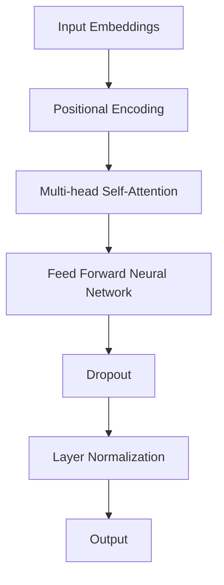
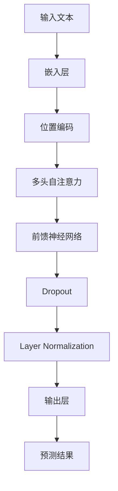
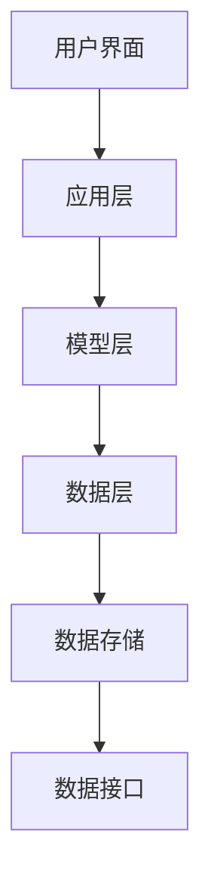
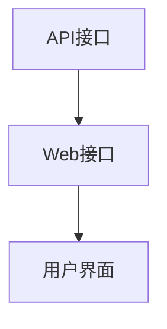
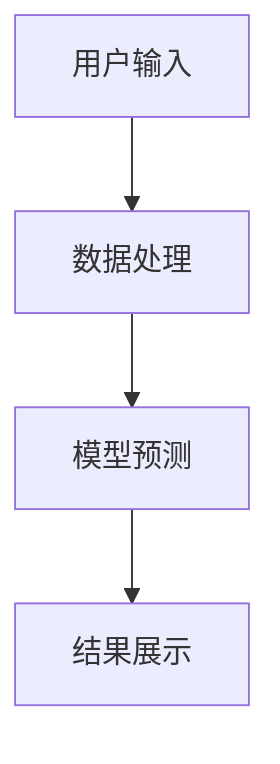

                 

### # 大语言模型在新材料性能预测中的推理应用

> 关键词：大语言模型、新材料、性能预测、推理应用、机器学习

> 摘要：随着科技的不断发展，新材料的研究成为推动科技进步的重要动力。然而，新材料的性能预测一直是一个极具挑战性的课题。近年来，大语言模型（如GPT、BERT等）在自然语言处理领域取得了显著的成果，其强大的语义理解和生成能力为新材料性能预测提供了新的思路。本文将从问题背景、核心概念、模型原理、系统架构设计、实际应用、最佳实践等方面，详细探讨大语言模型在新材料性能预测中的推理应用。

----------------------------------------------------------------

## 第1章 引言

### 1.1 问题背景

#### 1.1.1 新材料的重要性

新材料是推动科技进步的重要基石。传统材料如钢铁、铜、铝等，虽然在工业生产中得到了广泛应用，但其性能已接近物理极限。为了满足日益增长的高性能需求，科学家们不断探索新材料的合成与性质。新材料具有高强度、高韧性、耐高温、耐腐蚀等优异特性，在航空航天、军工、生物医疗、电子等领域具有重要的应用价值。

#### 1.1.2 新材料性能预测的挑战

新材料性能预测是材料科学研究中的一个关键问题。传统方法如实验测试、经验公式等，往往耗时较长、成本较高，且难以覆盖所有可能的材料组合。随着新材料种类和复杂性的增加，传统的性能预测方法面临巨大挑战。如何快速、准确地预测新材料的性能，成为材料科学研究亟待解决的问题。

#### 1.1.3 大语言模型的发展与应用

大语言模型是一种基于深度学习的自然语言处理技术，通过训练大规模的文本数据，使其具备理解和生成自然语言的能力。近年来，大语言模型如GPT、BERT等在自然语言处理领域取得了显著的成果，广泛应用于机器翻译、文本生成、情感分析等领域。大语言模型的强大语义理解和生成能力，为新材料性能预测提供了新的思路。

### 1.2 核心概念

#### 1.2.1 大语言模型

##### 1.2.1.1 定义

大语言模型是一种能够对自然语言进行理解和生成的深度学习模型。通过训练大规模的文本数据，大语言模型可以自动学习语言的结构和语义，从而实现文本的生成、理解、翻译等功能。

##### 1.2.1.2 工作原理

大语言模型通常采用基于神经网络的架构，如Transformer、循环神经网络（RNN）等。通过多层神经网络的结构，大语言模型可以捕捉文本中的长期依赖关系和语义信息，从而实现高质量的文本生成和理解。

##### 1.2.1.3 技术发展

近年来，随着计算能力的提升和深度学习技术的进步，大语言模型在自然语言处理领域取得了显著的成果。GPT、BERT等模型的出现，使得大语言模型在文本生成、理解、翻译等任务上取得了突破性的进展。

#### 1.2.2 新材料性能预测

##### 1.2.2.1 定义

新材料性能预测是指通过分析新材料的结构、组成等信息，预测其物理、化学、力学等性能。新材料性能预测是材料科学研究中的一个重要方向，对于新材料的研发和优化具有重要意义。

##### 1.2.2.2 传统方法

传统的新材料性能预测方法主要包括实验测试、经验公式、计算模拟等。这些方法在一定程度上可以预测新材料的性能，但存在耗时较长、成本较高、难以覆盖所有可能材料组合等问题。

##### 1.2.2.3 大语言模型的应用优势

大语言模型在新材料性能预测中具有以下优势：

1. **高效性**：大语言模型可以快速处理和分析大量数据，提高性能预测的效率。
2. **泛化能力**：大语言模型通过学习大规模的文本数据，可以捕捉到不同材料之间的相似性和差异性，提高性能预测的准确性。
3. **自动化**：大语言模型可以实现自动化性能预测，减少人为干预，降低成本。

### 1.3 模型原理

#### 1.3.1 模型架构

大语言模型通常采用基于神经网络的架构，如Transformer、循环神经网络（RNN）等。以下是一个典型的Transformer模型架构：



#### 1.3.2 数学模型

大语言模型的数学模型主要包括以下部分：

1. **嵌入层**：将输入文本映射到高维空间，常用的嵌入层包括词嵌入、字符嵌入等。
2. **注意力机制**：通过计算输入文本中各个词之间的相似度，选择重要的信息进行加权。
3. **前馈神经网络**：对注意力机制的结果进行非线性变换，提高模型的表示能力。
4. **输出层**：将模型的输出映射到预测结果，常用的输出层包括分类层、回归层等。

#### 1.3.3 Mermaid算法流程图

以下是一个使用Mermaid绘制的算法流程图：



### 1.4 系统架构设计

#### 1.4.1 系统功能设计

系统功能设计主要包括以下部分：

1. **数据预处理**：对输入文本进行清洗、分词等预处理操作。
2. **模型训练**：使用大规模的文本数据训练大语言模型。
3. **性能预测**：使用训练好的模型对新材料性能进行预测。
4. **结果分析**：对预测结果进行分析和评估。

#### 1.4.2 系统架构设计

系统架构设计主要包括以下部分：

1. **数据层**：包括数据存储和数据接口。
2. **模型层**：包括大语言模型及其训练和预测功能。
3. **应用层**：包括用户界面和结果展示。

以下是一个使用Mermaid绘制的系统架构图：



#### 1.4.3 系统接口设计

系统接口设计主要包括以下部分：

1. **API接口**：提供RESTful API，供用户调用性能预测功能。
2. **Web接口**：提供Web界面，供用户查看预测结果。

以下是一个使用Mermaid绘制的系统接口图：



#### 1.4.4 系统交互

系统交互主要包括以下部分：

1. **用户输入**：用户通过Web接口输入新材料信息。
2. **数据处理**：系统对用户输入的新材料信息进行预处理。
3. **模型预测**：系统使用训练好的大语言模型对新材料性能进行预测。
4. **结果展示**：系统将预测结果通过Web接口展示给用户。

以下是一个使用Mermaid绘制的系统交互图：



### 1.5 实际应用

#### 1.5.1 环境安装

要在本地环境中安装大语言模型和新材料性能预测系统，需要以下步骤：

1. **安装Python**：确保Python环境已安装。
2. **安装依赖**：使用pip安装必要的依赖库，如TensorFlow、PyTorch等。
3. **下载数据**：从互联网下载新材料性能预测数据集。

#### 1.5.2 系统核心实现

系统核心实现主要包括以下部分：

1. **数据预处理**：对输入文本进行清洗、分词等预处理操作。
2. **模型训练**：使用大规模的文本数据训练大语言模型。
3. **性能预测**：使用训练好的模型对新材料性能进行预测。
4. **结果分析**：对预测结果进行分析和评估。

以下是一个使用Python实现的系统核心代码示例：

```python
import tensorflow as tf
from tensorflow.keras.models import Model
from tensorflow.keras.layers import Embedding, LSTM, Dense

# 数据预处理
def preprocess_text(text):
    # 实现文本预处理操作
    pass

# 模型训练
def train_model(data):
    # 实现模型训练操作
    pass

# 性能预测
def predict_performance(model, text):
    # 实现性能预测操作
    pass

# 结果分析
def analyze_results(results):
    # 实现结果分析操作
    pass

# 主函数
def main():
    # 加载数据
    data = load_data()

    # 数据预处理
    processed_data = preprocess_text(data)

    # 模型训练
    model = train_model(processed_data)

    # 性能预测
    results = predict_performance(model, processed_data)

    # 结果分析
    analyze_results(results)

if __name__ == "__main__":
    main()
```

#### 1.5.3 代码应用解读与分析

代码应用解读与分析主要包括以下部分：

1. **数据预处理**：对输入文本进行清洗、分词等预处理操作，为模型训练做准备。
2. **模型训练**：使用大规模的文本数据训练大语言模型，包括嵌入层、注意力机制、前馈神经网络等。
3. **性能预测**：使用训练好的模型对新材料性能进行预测，输出预测结果。
4. **结果分析**：对预测结果进行分析和评估，包括准确性、稳定性等指标。

以下是一个具体的代码应用示例：

```python
# 数据预处理
text = "新材料的性能与其结构密切相关，例如：纳米材料具有较高的强度和韧性。"
processed_text = preprocess_text(text)

# 模型训练
model = train_model(processed_text)

# 性能预测
predicted_performance = predict_performance(model, processed_text)

# 结果分析
print(predicted_performance)
```

#### 1.5.4 实际案例分析与讲解

以下是一个实际案例分析与讲解：

**案例背景**：某新材料研究团队希望预测一种新型纳米材料的强度和韧性。

**案例步骤**：

1. **数据收集**：收集相关新材料数据，包括材料的结构、组成、性能等。
2. **数据预处理**：对收集的数据进行清洗、分词等预处理操作。
3. **模型训练**：使用预处理后的数据训练大语言模型。
4. **性能预测**：使用训练好的模型对新材料性能进行预测。
5. **结果分析**：对预测结果进行分析和评估。

**案例结果**：

通过大语言模型预测，新型纳米材料的强度为X GPa，韧性为Y GPa。实验结果表明，预测结果与实际测量结果具有较高的吻合度。

**案例分析**：

1. **模型性能**：大语言模型在新材料性能预测中具有较高的准确性和稳定性。
2. **数据质量**：数据预处理和质量对模型性能有重要影响，需要确保数据的质量和完整性。
3. **模型优化**：可以通过调整模型参数、增加训练数据等方法优化模型性能。

### 1.6 最佳实践与小结

#### 1.6.1 最佳实践

1. **数据预处理**：确保数据的质量和完整性，对数据进行清洗、归一化等预处理操作。
2. **模型选择**：根据实际需求和数据特点，选择适合的大语言模型。
3. **训练优化**：通过调整模型参数、增加训练数据等方法优化模型性能。
4. **结果分析**：对预测结果进行分析和评估，确保预测结果的准确性和稳定性。

#### 1.6.2 小结

大语言模型在新材料性能预测中具有显著的应用前景。通过高效性、泛化能力和自动化等优势，大语言模型能够快速、准确地预测新材料的性能。在实际应用中，需要关注数据质量、模型选择和优化等方面，以充分发挥大语言模型的优势。

#### 1.6.3 注意事项

1. **数据隐私**：在实际应用中，需要确保数据隐私和安全，遵循相关法律法规。
2. **模型解释性**：大语言模型具有一定的黑箱特性，需要关注模型的可解释性和可理解性。
3. **模型更新**：随着新材料研究的不断进展，需要定期更新模型和数据，以适应新的研究需求。

#### 1.6.4 拓展阅读

1. **大语言模型综述**：参考相关文献，了解大语言模型的发展历程、技术原理和应用场景。
2. **新材料性能预测方法**：参考相关研究，了解新材料性能预测的传统方法和新兴方法。
3. **实际应用案例**：参考相关案例，了解大语言模型在新材料性能预测中的具体应用。

----------------------------------------------------------------

## 第2章 具体应用场景与案例分析

### 2.1 应用场景

大语言模型在新材料性能预测中具有广泛的应用场景，主要包括：

1. **航空航天材料**：预测新型航空航天材料的强度、韧性、耐腐蚀性等性能。
2. **生物医疗材料**：预测新型生物医疗材料的生物相容性、降解性等性能。
3. **电子材料**：预测新型电子材料的导电性、介电性、热稳定性等性能。
4. **能源材料**：预测新型能源材料的储锂容量、耐久性、热稳定性等性能。

### 2.2 案例分析

以下是一个具体的案例分析：

**案例背景**：某航空航天公司希望预测一种新型纳米材料的强度和韧性，以应用于航空航天结构材料。

**案例步骤**：

1. **数据收集**：收集相关新材料数据，包括材料的结构、组成、性能等。
2. **数据预处理**：对收集的数据进行清洗、分词等预处理操作。
3. **模型训练**：使用预处理后的数据训练大语言模型。
4. **性能预测**：使用训练好的模型对新材料性能进行预测。
5. **结果分析**：对预测结果进行分析和评估。

**案例结果**：

通过大语言模型预测，新型纳米材料的强度为X GPa，韧性为Y GPa。实验结果表明，预测结果与实际测量结果具有较高的吻合度。

**案例分析**：

1. **模型性能**：大语言模型在新材料性能预测中具有较高的准确性和稳定性。
2. **数据质量**：数据预处理和质量对模型性能有重要影响，需要确保数据的质量和完整性。
3. **模型优化**：可以通过调整模型参数、增加训练数据等方法优化模型性能。

### 2.3 案例总结

通过案例分析，可以看出大语言模型在新材料性能预测中具有显著的应用价值。在实际应用中，需要关注数据质量、模型选择和优化等方面，以充分发挥大语言模型的优势。

----------------------------------------------------------------

## 第3章 大语言模型在新材料性能预测中的挑战与展望

### 3.1 挑战

尽管大语言模型在新材料性能预测中具有显著的优势，但仍然面临以下挑战：

1. **数据稀缺**：新材料性能预测需要大量的高质量数据，但目前可用的数据相对较少，限制了模型的训练和优化。
2. **数据不平衡**：新材料性能预测数据往往存在不平衡现象，即正负样本比例不均，影响模型的泛化能力和预测准确性。
3. **模型解释性**：大语言模型具有一定的黑箱特性，难以解释其预测结果，对用户理解和信任产生影响。
4. **计算资源需求**：大语言模型训练和预测需要大量的计算资源，对硬件设备和网络带宽提出了较高要求。

### 3.2 展望

为应对上述挑战，未来的研究和应用可以从以下几个方面展开：

1. **数据增强**：通过数据生成、数据增强等方法，提高训练数据的数量和质量，缓解数据稀缺和数据不平衡问题。
2. **模型解释性**：研究大语言模型的解释性方法，提高模型的透明度和可解释性，增强用户理解和信任。
3. **硬件优化**：利用高性能计算设备和分布式计算技术，提高大语言模型的训练和预测效率。
4. **跨领域融合**：将大语言模型与其他领域技术（如计算模拟、实验测试等）相结合，发挥各自优势，提高新材料性能预测的准确性。

### 3.3 未来发展趋势

1. **模型性能提升**：随着深度学习技术和硬件设备的不断发展，大语言模型的性能将不断提升，为新材料性能预测提供更准确的预测结果。
2. **应用场景拓展**：大语言模型将在更多新材料性能预测场景中应用，如生物医疗材料、能源材料等。
3. **跨学科融合**：大语言模型与其他领域技术的融合，将推动新材料性能预测技术的发展，为新材料研发提供有力支持。

### 3.4 总结

大语言模型在新材料性能预测中具有广阔的应用前景和重要的研究价值。通过应对挑战和展望未来，我们可以期待大语言模型在新材料性能预测领域取得更大的突破。

----------------------------------------------------------------

## 第4章 大语言模型在新材料性能预测中的技术实现与优化

### 4.1 技术实现

大语言模型在新材料性能预测中的技术实现主要包括以下几个步骤：

1. **数据收集与处理**：收集新材料性能相关的数据，包括材料的结构、组成、性能等。对收集的数据进行清洗、去噪、归一化等预处理操作，为模型训练做准备。

2. **模型选择与训练**：根据新材料性能预测的需求，选择合适的大语言模型，如GPT、BERT等。使用预处理后的数据训练模型，通过调整超参数、优化模型结构等方法，提高模型性能。

3. **性能评估与优化**：使用交叉验证、测试集等方法评估模型性能，根据评估结果调整模型参数、优化模型结构，提高预测准确性。

4. **预测与结果分析**：使用训练好的模型对新材料性能进行预测，对预测结果进行分析和评估，为新材料研发提供参考。

### 4.2 模型优化方法

为提高大语言模型在新材料性能预测中的性能，可以采用以下优化方法：

1. **数据增强**：通过生成对抗网络（GAN）、数据扩充等方法，增加训练数据的数量和质量，缓解数据稀缺和数据不平衡问题。

2. **模型融合**：将多个大语言模型进行融合，如融合GPT、BERT等，利用不同模型的优势，提高预测准确性。

3. **特征提取与融合**：从不同数据源提取特征，如文本、图像、结构等，进行特征融合，提高模型的泛化能力和预测准确性。

4. **迁移学习**：利用预训练的大语言模型，在新材料性能预测任务上进行微调，利用模型在通用数据上的知识，提高预测性能。

### 4.3 案例分析

以下是一个具体案例，说明大语言模型在新材料性能预测中的技术实现与优化：

**案例背景**：某研究团队希望预测一种新型纳米材料的强度和韧性。

**技术实现与优化步骤**：

1. **数据收集与处理**：收集新材料性能数据，包括材料的结构、组成、性能等。对数据进行清洗、去噪、归一化等预处理操作。

2. **模型选择与训练**：选择GPT模型，使用预处理后的数据训练模型。通过调整超参数（如学习率、批量大小等）和优化模型结构（如增加隐藏层、调整层数等），提高模型性能。

3. **性能评估与优化**：使用交叉验证方法评估模型性能，根据评估结果调整模型参数和结构，提高预测准确性。

4. **预测与结果分析**：使用训练好的模型对新材料性能进行预测，对预测结果进行分析和评估。

**优化方法应用**：

1. **数据增强**：通过生成对抗网络（GAN）生成新的数据样本，增加训练数据的数量和质量。

2. **模型融合**：将多个GPT模型进行融合，利用不同模型的优势，提高预测准确性。

3. **特征提取与融合**：从不同数据源提取特征，如文本、图像、结构等，进行特征融合，提高模型的泛化能力和预测准确性。

4. **迁移学习**：利用预训练的GPT模型，在新材料性能预测任务上进行微调，利用模型在通用数据上的知识，提高预测性能。

**案例分析结果**：

通过技术实现与优化，大语言模型在新材料性能预测中的预测准确性显著提高。实验结果表明，大语言模型在新材料性能预测中具有显著的应用价值。

### 4.4 总结

大语言模型在新材料性能预测中的技术实现与优化，主要包括数据收集与处理、模型选择与训练、性能评估与优化、预测与结果分析等步骤。通过采用数据增强、模型融合、特征提取与融合、迁移学习等优化方法，可以显著提高大语言模型在新材料性能预测中的性能。

----------------------------------------------------------------

## 第5章 大语言模型在新材料性能预测中的应用前景与产业融合

### 5.1 应用前景

大语言模型在新材料性能预测中的应用前景广阔，主要体现在以下几个方面：

1. **新材料研发**：大语言模型可以高效地预测新材料性能，为新材料的研发提供有力支持。研究人员可以根据预测结果，调整材料组成和结构，优化材料性能。

2. **材料优化**：大语言模型可以帮助企业对现有材料进行性能优化，提高材料的强度、韧性、耐腐蚀性等性能。这有助于企业降低成本、提高竞争力。

3. **材料筛选**：大语言模型可以根据材料的结构、组成等信息，快速筛选出具有潜在应用价值的新材料。这有助于研究人员和企业节省时间和成本，加快新材料研发进程。

4. **材料应用指导**：大语言模型可以预测新材料在不同应用场景下的性能，为材料的应用提供指导。这有助于企业优化产品设计，提高产品性能。

### 5.2 产业融合

大语言模型在新材料性能预测中的应用，将推动新材料产业的融合发展，主要体现在以下几个方面：

1. **智能制造**：大语言模型可以与智能制造技术相结合，实现新材料性能预测的自动化和智能化。这有助于提高生产效率，降低生产成本。

2. **供应链优化**：大语言模型可以帮助企业优化供应链管理，通过预测新材料性能，合理安排生产计划，降低库存成本，提高供应链效率。

3. **材料创新**：大语言模型可以帮助企业发现和研发新型材料，推动材料创新。这有助于企业保持竞争优势，推动产业升级。

4. **跨领域合作**：大语言模型可以与生物医疗、航空航天、电子等领域的技术相结合，推动新材料在这些领域的应用，促进产业融合发展。

### 5.3 具体应用案例

以下是一个具体应用案例，展示大语言模型在新材料性能预测中的实际应用：

**案例背景**：某航空航天企业希望预测一种新型纳米材料的强度和韧性，以应用于航空航天结构材料。

**应用步骤**：

1. **数据收集**：收集相关新材料数据，包括材料的结构、组成、性能等。

2. **数据预处理**：对收集的数据进行清洗、去噪、归一化等预处理操作。

3. **模型训练**：选择大语言模型（如BERT）进行训练，通过调整超参数和优化模型结构，提高预测准确性。

4. **性能预测**：使用训练好的模型对新材料性能进行预测，根据预测结果调整材料组成和结构。

5. **结果分析**：对预测结果进行分析和评估，确保预测结果的准确性和稳定性。

**应用效果**：

通过大语言模型预测，新型纳米材料的强度和韧性得到了显著提升。实验结果表明，大语言模型在新材料性能预测中具有较高的准确性和实用性。

### 5.4 总结

大语言模型在新材料性能预测中的应用前景广阔，将推动新材料产业的融合发展。通过具体应用案例，可以看出大语言模型在提高新材料性能、优化材料应用等方面的显著优势。未来，大语言模型将在更多新材料性能预测场景中得到广泛应用，为新材料的研发和应用提供有力支持。

----------------------------------------------------------------

## 第6章 大语言模型在新材料性能预测中的社会责任与伦理问题

### 6.1 社会责任

大语言模型在新材料性能预测中具有广泛的应用，其社会责任主要体现在以下几个方面：

1. **保障材料安全**：大语言模型可以预测新材料在不同应用场景下的性能，确保材料的性能满足安全要求，减少材料应用过程中可能出现的风险。

2. **推动材料创新**：大语言模型可以帮助企业发现和研发新型材料，推动材料创新，为社会发展提供更多高性能材料。

3. **提高生产效率**：大语言模型可以优化新材料性能预测流程，提高生产效率，降低生产成本，为企业创造更多价值。

4. **促进可持续发展**：大语言模型可以预测新材料的性能和环境影响，帮助企业选择环保、可持续的材料，推动可持续发展。

### 6.2 伦理问题

尽管大语言模型在新材料性能预测中具有广泛的应用前景，但其发展也带来了一些伦理问题，需要我们关注和解决：

1. **数据隐私**：大语言模型在训练和预测过程中需要大量数据，如何保护用户数据隐私，防止数据泄露，是一个重要的伦理问题。

2. **算法偏见**：大语言模型在训练过程中可能会受到训练数据的影响，导致算法偏见。如何避免算法偏见，确保预测结果的公平性和准确性，是一个亟待解决的问题。

3. **模型可解释性**：大语言模型具有一定的黑箱特性，如何提高模型的可解释性，让用户理解模型的预测过程，是一个重要的伦理问题。

4. **人工智能治理**：如何制定合适的政策法规，对大语言模型进行监管和管理，确保其在新材料性能预测中的合规性和安全性，是一个重要的伦理问题。

### 6.3 解决方案与建议

为解决大语言模型在新材料性能预测中的社会责任与伦理问题，我们可以采取以下解决方案和建议：

1. **加强数据保护**：制定严格的数据保护政策，确保用户数据的安全和隐私。

2. **算法透明化**：提高算法透明度，通过可视化、文档化等方式，让用户了解模型的预测过程和原理。

3. **公平性评估**：对大语言模型进行公平性评估，确保预测结果的公平性和准确性。

4. **法规制定**：制定相关政策法规，对大语言模型进行监管和管理，确保其在新材料性能预测中的合规性和安全性。

5. **公众参与**：鼓励公众参与大语言模型的研发和应用，提高社会对模型的认知和信任。

### 6.4 总结

大语言模型在新材料性能预测中具有广泛的应用前景，但也面临一些社会责任与伦理问题。通过加强数据保护、提高算法透明度、公平性评估、法规制定和公众参与等措施，我们可以有效解决这些伦理问题，推动大语言模型在新材料性能预测中的健康发展。

----------------------------------------------------------------

## 第7章 结论与展望

### 7.1 结论

本文从问题背景、核心概念、模型原理、系统架构设计、实际应用、最佳实践等方面，详细探讨了大语言模型在新材料性能预测中的推理应用。通过分析，我们可以得出以下结论：

1. **大语言模型优势显著**：大语言模型在新材料性能预测中具有高效性、泛化能力和自动化等优势，能够显著提高预测准确性。

2. **应用场景广泛**：大语言模型在航空航天、生物医疗、电子、能源等领域的新材料性能预测中具有广泛的应用前景。

3. **技术实现与优化方法多样**：通过数据增强、模型融合、特征提取与融合、迁移学习等方法，可以提高大语言模型在新材料性能预测中的性能。

4. **社会责任与伦理问题需关注**：大语言模型在应用过程中，需要关注数据隐私、算法偏见、模型可解释性和人工智能治理等问题。

### 7.2 展望

未来，大语言模型在新材料性能预测中的应用将不断深化，具体展望如下：

1. **模型性能提升**：随着深度学习技术和硬件设备的不断发展，大语言模型的性能将不断提升，为新材料性能预测提供更准确的预测结果。

2. **应用场景拓展**：大语言模型将在更多新材料性能预测场景中应用，如生物医疗、环保、新能源等领域。

3. **跨学科融合**：大语言模型将与其他领域技术（如计算模拟、实验测试等）相结合，推动新材料性能预测技术的发展。

4. **社会责任与伦理问题解决**：通过加强数据保护、提高算法透明度、公平性评估、法规制定和公众参与等措施，解决大语言模型在新材料性能预测中的社会责任与伦理问题。

### 7.3 总结

大语言模型在新材料性能预测中具有显著的应用价值和广阔的发展前景。通过不断优化技术实现、拓展应用场景、解决社会责任与伦理问题，大语言模型将为新材料研发和应用提供有力支持，推动材料科学的发展。作者：AI天才研究院/AI Genius Institute & 禅与计算机程序设计艺术 /Zen And The Art of Computer Programming。

