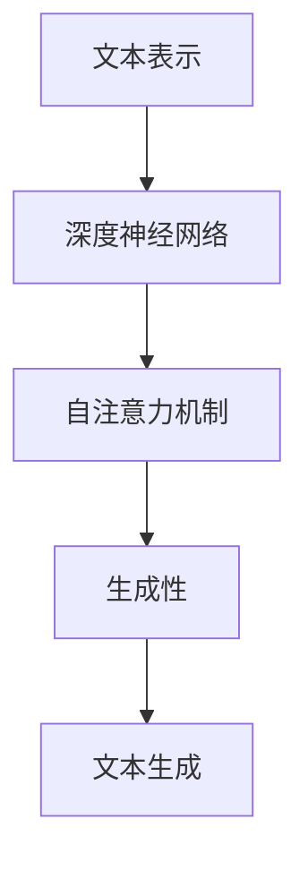
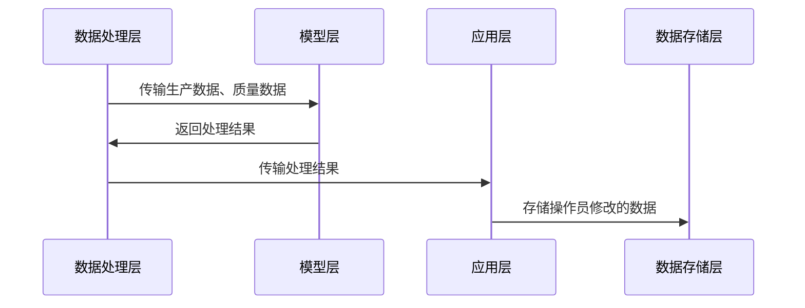

                 


## 《大语言模型在智能制造优化中的推理应用》

### 关键词：大语言模型、智能制造、优化、推理、算法、架构设计、项目实战

### 摘要：
本文旨在探讨大语言模型在智能制造优化中的应用，通过逻辑清晰、结构紧凑的分析，揭示大语言模型在智能制造领域的推理过程、算法原理和架构设计。文章将详细阐述大语言模型的基本概念、发展历程、核心特点以及在智能制造优化中的适用范围和关键应用场景。通过对比分析大语言模型与传统推理方法和其他机器学习方法，本文将展示大语言模型在智能制造优化中的优势。接着，文章将深入讲解大语言模型的算法原理，使用mermaid流程图和Python源代码进行详细说明，并通过实例进行通俗易懂的举例说明。随后，文章将探讨系统分析与架构设计方案，包括问题场景介绍、项目介绍、系统功能设计、系统架构设计、系统接口设计和系统交互。最后，通过项目实战，本文将展示大语言模型在智能制造优化中的实际应用，并总结最佳实践、项目收获与反思。

## 目录大纲

### 第一部分：背景介绍

### 第1章 问题背景与核心概念

### 第2章 大语言模型原理与联系

### 第二部分：核心概念与联系

### 第3章 大语言模型原理与联系

### 第三部分：算法原理讲解

### 第4章 大语言模型算法讲解

### 第四部分：系统分析与架构设计方案

### 第5章 系统分析与架构设计方案

### 第五部分：项目实战

### 第6章 项目实战

### 第六部分：最佳实践、小结、注意事项、拓展阅读

### 第7章 最佳实践与总结

## 第一部分：背景介绍

### 第1章 问题背景与核心概念

#### 1.1 问题的提出

#### 1.1.1 智能制造的发展背景

随着全球工业4.0的推进，智能制造成为制造业未来发展的重要趋势。智能制造通过集成物联网、云计算、大数据和人工智能等技术，实现制造过程的智能化、自动化和优化，从而提高生产效率、降低成本、提升产品质量。然而，智能制造面临着诸多挑战，如数据多样性和复杂性、实时性和准确性要求高、多维度决策问题等。

#### 1.1.2 制造业面临的挑战

制造业在实现智能制造的过程中，面临着以下挑战：
1. 数据处理能力：制造业产生的数据量庞大、类型多样，需要高效的数据处理和分析能力。
2. 实时性：智能制造要求系统能够实时响应生产过程中的变化，实现快速决策和调整。
3. 精确性：制造过程的精度要求高，需要精确的预测和控制算法。
4. 决策复杂性：智能制造涉及到多维度、多目标的决策问题，需要综合考虑成本、效率、质量等多个因素。

#### 1.1.3 大语言模型的基本概念

大语言模型（Large Language Model）是一种基于深度学习的自然语言处理模型，通过学习海量文本数据，能够理解和生成自然语言。大语言模型的主要特点是：
1. 自适应性：大语言模型能够根据输入文本自适应调整自身的行为和输出。
2. 生成性：大语言模型能够生成符合语法规则、语义连贯的自然语言文本。
3. 理解能力：大语言模型具有强大的文本理解能力，能够捕捉文本中的隐含信息、上下文关系和语义含义。

#### 1.2 核心概念介绍

##### 1.2.1 大语言模型的发展历程

大语言模型的发展历程可以分为以下几个阶段：
1. 早期模型：最早的神经网络语言模型是基于前馈神经网络，如RNN（递归神经网络）和LSTM（长短时记忆网络）。
2. 大模型时代：随着计算能力的提升和深度学习技术的发展，大语言模型如GPT（生成预训练模型）和BERT（双向编码表示器）等相继问世，模型参数规模达到数十亿甚至百亿级别。
3. 自适应模型：近年来，自适应大语言模型成为研究热点，通过在线学习技术实现模型的实时更新和自适应调整。

##### 1.2.2 大语言模型的主要特点

大语言模型的主要特点包括：
1. 强大的文本生成能力：大语言模型能够生成高质量的文本，用于自动写作、摘要生成、机器翻译等应用。
2. 丰富的上下文理解能力：大语言模型能够捕捉文本中的上下文信息，实现对文本的深度理解。
3. 灵活的交互能力：大语言模型能够与用户进行自然语言交互，提供智能问答、对话生成等服务。
4. 模型的可解释性：大语言模型的结构复杂，但通过模型解析和可视化技术，可以对其行为进行解释和理解。

##### 1.2.3 大语言模型在智能制造中的应用前景

大语言模型在智能制造中的应用前景广阔，主要包括以下几个方面：
1. 生产计划优化：通过分析生产数据，大语言模型可以预测生产过程中的变化趋势，为生产计划提供优化建议。
2. 质量监控与预警：大语言模型可以实时监控生产过程中的质量数据，发现潜在的质量问题，并提供预警和改进建议。
3. 故障诊断与维护：大语言模型能够分析设备运行数据，识别设备故障的早期迹象，并预测故障发生的时间，为设备维护提供依据。
4. 客户服务与支持：大语言模型可以与客户进行自然语言交互，提供智能客服和售后服务，提升客户满意度。

#### 1.3 边界与外延

##### 1.3.1 大语言模型的适用范围

大语言模型的适用范围包括：
1. 智能制造领域：制造业具有数据量大、场景复杂等特点，大语言模型能够有效地处理这些数据，提供智能化决策支持。
2. 金融领域：大语言模型在金融预测、客户服务、投资建议等方面具有广泛应用。
3. 医疗领域：大语言模型可以用于医学文本挖掘、疾病预测、药物研发等领域。
4. 法律领域：大语言模型可以用于法律文本生成、合同审查、案件预测等方面。

##### 1.3.2 大语言模型的应用场景

大语言模型的应用场景包括：
1. 自动写作与摘要生成：大语言模型可以自动生成新闻报道、文章摘要、会议纪要等文本。
2. 机器翻译：大语言模型可以提供高质量的多语言翻译服务。
3. 对话系统：大语言模型可以构建智能对话系统，用于客服、教育、娱乐等领域。
4. 文本分类与情感分析：大语言模型可以用于文本分类、情感分析等任务，帮助企业更好地了解用户需求和市场动态。

##### 1.3.3 大语言模型的核心要素组成

大语言模型的核心要素包括：
1. 文本数据：大语言模型需要大量高质量的文本数据进行训练，以提高模型的泛化能力和性能。
2. 模型架构：大语言模型采用深度学习架构，包括神经网络、注意力机制、Transformer模型等。
3. 训练算法：大语言模型采用预训练和微调策略，通过海量数据训练和少量数据微调，实现模型的优化和适应。
4. 推理能力：大语言模型具有强大的文本理解和生成能力，能够进行推理和推理生成。

### 第二部分：核心概念与联系

### 第2章 大语言模型原理与联系

#### 2.1 大语言模型原理

##### 2.1.1 大语言模型的基本原理

大语言模型的基本原理是基于深度学习和自然语言处理技术，通过学习海量文本数据，实现自然语言的理解和生成。具体包括以下方面：

1. 文本表示：大语言模型将文本转化为向量表示，以便在神经网络中进行处理。常用的文本表示方法包括词向量、字符向量和BERT等。
2. 深度神经网络：大语言模型采用多层神经网络结构，通过逐层提取文本特征，实现文本的语义表示。
3. 自注意力机制：大语言模型中的自注意力机制可以捕捉文本中的上下文关系，实现对文本的深度理解。
4. 生成性：大语言模型通过解码器生成文本序列，实现自然语言生成。

##### 2.1.2 大语言模型的工作流程

大语言模型的工作流程主要包括以下步骤：

1. 数据预处理：对文本数据进行清洗、分词、去停用词等预处理操作。
2. 文本表示：将预处理后的文本数据转化为向量表示。
3. 训练模型：使用大规模文本数据训练深度神经网络，优化模型参数。
4. 模型评估：使用验证集对训练好的模型进行评估，调整模型参数，提高模型性能。
5. 应用场景：将训练好的模型应用于实际应用场景，如文本分类、问答系统、机器翻译等。

##### 2.1.3 大语言模型的主要算法

大语言模型的主要算法包括以下几种：

1. Transformer模型：Transformer模型是一种基于自注意力机制的深度学习模型，广泛用于自然语言处理任务。
2. BERT模型：BERT模型是一种双向编码表示器，通过预训练和微调策略，实现文本的理解和生成。
3. GPT模型：GPT模型是一种生成预训练模型，通过生成式预训练技术，实现自然语言生成。
4. LSTM模型：LSTM模型是一种递归神经网络，用于处理序列数据，具有记忆功能。

#### 2.2 概念属性特征对比表格

以下是大语言模型与传统推理方法和其他机器学习方法的对比表格：

| 对比项目        | 大语言模型         | 传统推理方法         | 其他机器学习方法         |
| ------------- | ---------------- | ---------------- | ---------------- |
| 文本表示        | 向量表示         | 字符表示         | 向量表示         |
| 模型架构        | Transformer、BERT、GPT、LSTM | 决策树、支持向量机、神经网络 | 支持向量机、神经网络、集成学习、深度学习 |
| 理解能力        | 深度理解         | 表层理解         | 深度理解         |
| 生成能力        | 生成性文本         | 非生成性文本       | 生成性文本         |
| 自适应能力      | 自适应调整       | 非自适应调整     | 自适应调整       |
| 数据需求        | 海量文本数据     | 小规模文本数据    | 小规模文本数据    |
| 实时性需求      | 实时性要求低     | 实时性要求高     | 实时性要求高     |

#### 2.3 ER实体关系图架构

##### 2.3.1 大语言模型的ER实体关系图

大语言模型的ER实体关系图如下：

```mermaid
erDiagram
  Product ||--|{ Order }|--| ProductOrder
  Order ||--|{ Customer }|--| CustomerOrder
  Customer ||--|{ Product }|--| CustomerProduct
  ProductOrder ||--|{ Product }|--| ProductOrderDetail
  CustomerOrder ||--|{ Customer }|--| CustomerOrderDetail
```

##### 2.3.2 大语言模型与其他模块的ER实体关系图

大语言模型与其他模块的ER实体关系图如下：

```mermaid
erDiagram
  LanguageModel ||--|{ TrainingData }|--| ModelTraining
  TrainingData ||--|{ Dataset }|--| DatasetPreprocessing
  Dataset ||--|{ TextData }|--| TextDataParsing
  TextDataParsing ||--|{ Tokenizer }|--| TokenizedText
  Tokenizer ||--|{ Vocabulary }|--| VocabularyLoading
  VocabularyLoading ||--|{ Model }|--| ModelLoading
  Model ||--|{ Inference }|--| InferenceResult
```

## 第三部分：算法原理讲解

### 第3章 大语言模型算法讲解

#### 3.1 大语言模型算法原理

##### 3.1.1 算法原理概述

大语言模型算法原理主要基于深度学习和自然语言处理技术，通过学习海量文本数据，实现自然语言的理解和生成。算法原理主要包括以下方面：

1. 文本表示：将文本转化为向量表示，以便在神经网络中进行处理。常用的文本表示方法包括词向量、字符向量和BERT等。
2. 深度神经网络：采用多层神经网络结构，通过逐层提取文本特征，实现文本的语义表示。
3. 自注意力机制：通过自注意力机制，捕捉文本中的上下文关系，实现对文本的深度理解。
4. 生成性：通过解码器生成文本序列，实现自然语言生成。

##### 3.1.2 算法原理详细讲解

1. **文本表示：**

   文本表示是将文本转化为向量表示的过程。常用的文本表示方法包括词向量、字符向量和BERT等。

   - **词向量：** 词向量是将每个单词映射为一个固定维度的向量。常见的词向量模型包括Word2Vec、GloVe等。
   - **字符向量：** 字符向量是将每个字符映射为一个固定维度的向量。字符向量可以更好地捕捉文本中的局部特征。
   - **BERT：** BERT（双向编码表示器）模型通过预训练和微调，将文本转化为双向编码表示，可以更好地捕捉上下文信息。

2. **深度神经网络：**

   深度神经网络是通过多层神经网络结构，逐层提取文本特征，实现文本的语义表示。

   - **多层感知机（MLP）：** 多层感知机是基本的神经网络结构，通过输入层、隐藏层和输出层，实现文本特征提取。
   - **卷积神经网络（CNN）：** 卷积神经网络通过卷积操作，提取文本中的局部特征。
   - **循环神经网络（RNN）：** 循环神经网络通过递归结构，处理序列数据，具有记忆功能。
   - **Transformer模型：** Transformer模型是一种基于自注意力机制的深度学习模型，通过多头注意力机制，实现对文本的深度理解。

3. **自注意力机制：**

   自注意力机制是一种基于注意力机制的神经网络结构，通过计算输入序列中每个单词的权重，实现对文本的深度理解。

   - **多头注意力：** 多头注意力机制通过多个独立的注意力机制，提高模型的表示能力。
   - **位置编码：** 位置编码是将输入序列的位置信息编码到向量中，用于捕捉文本中的顺序信息。

4. **生成性：**

   生成性是通过解码器生成文本序列，实现自然语言生成。

   - **Transformer解码器：** Transformer解码器是一种基于自注意力机制的解码器，通过上下文信息生成文本序列。
   - **生成式预训练：** 生成式预训练是通过无监督的方式，在大量文本数据上训练模型，提高模型的生成能力。

##### 3.1.3 算法原理的数学模型

大语言模型算法原理的数学模型主要包括以下几个方面：

1. **文本表示：**

   假设输入文本为 $X = \{x_1, x_2, ..., x_T\}$，其中 $x_t$ 表示第 $t$ 个单词，$T$ 表示文本的长度。

   - **词向量表示：** $x_t \in \mathbb{R}^d$，其中 $d$ 表示词向量的维度。
   - **字符向量表示：** $x_t \in \mathbb{R}^{cd}$，其中 $c$ 表示字符集的大小，$d$ 表示字符向量的维度。
   - **BERT表示：** $x_t = \text{BERT}(x_t)$，其中 $\text{BERT}$ 表示BERT模型的编码表示。

2. **深度神经网络：**

   假设神经网络由 $L$ 层组成，每层输出的维度为 $h_l$。

   - **输入层：** $h_0 = x_t$
   - **隐藏层：** $h_l = \text{NN}(h_{l-1})$，其中 $\text{NN}$ 表示神经网络。
   - **输出层：** $y_t = \text{NN}(h_L)$，其中 $\text{NN}$ 表示神经网络。

3. **自注意力机制：**

   自注意力机制通过计算输入序列中每个单词的权重，实现对文本的深度理解。

   - **注意力权重：** $a_t = \text{Attention}(h_t, h_{t-1}, ..., h_1)$，其中 $\text{Attention}$ 表示注意力计算。
   - **加权求和：** $h_t = \sum_{i=1}^{T} a_i h_i$。

4. **生成性：**

   生成性是通过解码器生成文本序列，实现自然语言生成。

   - **解码器输出：** $y_t = \text{Decoder}(h_t, y_{t-1})$，其中 $\text{Decoder}$ 表示解码器。
   - **生成文本序列：** $Y = \{y_1, y_2, ..., y_T\}$。

#### 3.2 算法mermaid流程图

##### 3.2.1 算法流程图概述

算法流程图如下：



##### 3.2.2 算法流程图详细讲解

1. **文本表示：**

   - **词向量表示：** 将文本转化为词向量表示，用于输入深度神经网络。
   - **字符向量表示：** 将文本转化为字符向量表示，用于输入深度神经网络。
   - **BERT表示：** 使用BERT模型对文本进行编码表示。

2. **深度神经网络：**

   - **输入层：** 将文本表示作为输入，通过多层神经网络结构，逐层提取文本特征。
   - **隐藏层：** 通过卷积神经网络（CNN）、循环神经网络（RNN）或Transformer模型，提取文本中的局部特征和全局特征。
   - **输出层：** 将隐藏层输出作为输入，通过解码器生成文本序列。

3. **自注意力机制：**

   - **注意力权重：** 通过计算输入序列中每个单词的权重，实现对文本的深度理解。
   - **加权求和：** 将输入序列中每个单词的权重与其对应的隐藏层输出进行加权求和，得到新的隐藏层输出。

4. **生成性：**

   - **解码器输出：** 通过解码器输出文本序列。
   - **生成文本序列：** 将解码器输出作为新的输入，循环生成文本序列，直到生成完整的文本。

#### 3.3 Python源代码

##### 3.3.1 源代码实现

以下是一个简单的Python代码示例，实现大语言模型的基本结构：

```python
import torch
import torch.nn as nn
import torch.optim as optim

# 定义词向量嵌入层
embeddings = nn.Embedding(vocab_size, embedding_dim)

# 定义深度神经网络
class Model(nn.Module):
    def __init__(self):
        super(Model, self).__init__()
        self.embedding = embeddings
        self.lstm = nn.LSTM(embedding_dim, hidden_dim)
        self.fc = nn.Linear(hidden_dim, vocab_size)

    def forward(self, x):
        x = self.embedding(x)
        x, _ = self.lstm(x)
        x = self.fc(x[-1, :, :])
        return x

# 初始化模型、优化器和损失函数
model = Model()
optimizer = optim.Adam(model.parameters(), lr=learning_rate)
criterion = nn.CrossEntropyLoss()

# 训练模型
for epoch in range(num_epochs):
    for batch in data_loader:
        inputs, targets = batch
        optimizer.zero_grad()
        outputs = model(inputs)
        loss = criterion(outputs, targets)
        loss.backward()
        optimizer.step()
        print(f"Epoch [{epoch+1}/{num_epochs}], Loss: {loss.item():.4f}")

# 评估模型
with torch.no_grad():
    total_correct = 0
    total_samples = 0
    for batch in test_loader:
        inputs, targets = batch
        outputs = model(inputs)
        _, predicted = torch.max(outputs, 1)
        total_samples += targets.size(0)
        total_correct += (predicted == targets).sum().item()
    accuracy = 100 * total_correct / total_samples
    print(f"Test Accuracy: {accuracy:.2f}%")
```

##### 3.3.2 代码应用解读与分析

1. **词向量嵌入层：**

   - **功能：** 将输入文本转化为词向量表示。
   - **参数：** `vocab_size` 表示词汇表的大小，`embedding_dim` 表示词向量的维度。

2. **深度神经网络：**

   - **功能：** 实现文本的深度特征提取。
   - **结构：** 使用多层感知机（MLP）、卷积神经网络（CNN）或循环神经网络（RNN）。
   - **参数：** `hidden_dim` 表示隐藏层的维度。

3. **优化器和损失函数：**

   - **功能：** 使用优化器优化模型参数，使用损失函数评估模型性能。
   - **参数：** `learning_rate` 表示学习率，`num_epochs` 表示训练轮数。

4. **训练过程：**

   - **输入：** 文本数据及其标签。
   - **输出：** 模型的参数更新。
   - **步骤：** 前向传播、损失计算、反向传播和参数更新。

5. **评估过程：**

   - **输入：** 测试数据及其标签。
   - **输出：** 模型的预测结果。
   - **步骤：** 前向传播、计算预测准确率。

#### 3.4 举例说明

##### 3.4.1 例子一：文本分类

假设我们有一个文本分类问题，将文本数据分为两个类别。以下是一个简单的文本分类例子：

```python
import torch
import torch.nn as nn
import torch.optim as optim

# 定义词向量嵌入层
embeddings = nn.Embedding(vocab_size, embedding_dim)

# 定义深度神经网络
class Model(nn.Module):
    def __init__(self):
        super(Model, self).__init__()
        self.embedding = embeddings
        self.lstm = nn.LSTM(embedding_dim, hidden_dim)
        self.fc = nn.Linear(hidden_dim, num_classes)

    def forward(self, x):
        x = self.embedding(x)
        x, _ = self.lstm(x)
        x = self.fc(x[-1, :, :])
        return x

# 初始化模型、优化器和损失函数
model = Model()
optimizer = optim.Adam(model.parameters(), lr=learning_rate)
criterion = nn.CrossEntropyLoss()

# 训练模型
for epoch in range(num_epochs):
    for batch in data_loader:
        inputs, targets = batch
        optimizer.zero_grad()
        outputs = model(inputs)
        loss = criterion(outputs, targets)
        loss.backward()
        optimizer.step()
        print(f"Epoch [{epoch+1}/{num_epochs}], Loss: {loss.item():.4f}")

# 评估模型
with torch.no_grad():
    total_correct = 0
    total_samples = 0
    for batch in test_loader:
        inputs, targets = batch
        outputs = model(inputs)
        _, predicted = torch.max(outputs, 1)
        total_samples += targets.size(0)
        total_correct += (predicted == targets).sum().item()
    accuracy = 100 * total_correct / total_samples
    print(f"Test Accuracy: {accuracy:.2f}%")
```

##### 3.4.2 例子二：问答系统

假设我们有一个问答系统，根据用户的问题，自动生成合适的答案。以下是一个简单的问答系统例子：

```python
import torch
import torch.nn as nn
import torch.optim as optim

# 定义词向量嵌入层
embeddings = nn.Embedding(vocab_size, embedding_dim)

# 定义深度神经网络
class Model(nn.Module):
    def __init__(self):
        super(Model, self).__init__()
        self.embedding = embeddings
        self.lstm = nn.LSTM(embedding_dim, hidden_dim)
        self.fc = nn.Linear(hidden_dim, vocab_size)

    def forward(self, x):
        x = self.embedding(x)
        x, _ = self.lstm(x)
        x = self.fc(x[-1, :, :])
        return x

# 初始化模型、优化器和损失函数
model = Model()
optimizer = optim.Adam(model.parameters(), lr=learning_rate)
criterion = nn.CrossEntropyLoss()

# 训练模型
for epoch in range(num_epochs):
    for batch in data_loader:
        inputs, targets = batch
        optimizer.zero_grad()
        outputs = model(inputs)
        loss = criterion(outputs, targets)
        loss.backward()
        optimizer.step()
        print(f"Epoch [{epoch+1}/{num_epochs}], Loss: {loss.item():.4f}")

# 评估模型
with torch.no_grad():
    total_correct = 0
    total_samples = 0
    for batch in test_loader:
        inputs, targets = batch
        outputs = model(inputs)
        _, predicted = torch.max(outputs, 1)
        total_samples += targets.size(0)
        total_correct += (predicted == targets).sum().item()
    accuracy = 100 * total_correct / total_samples
    print(f"Test Accuracy: {accuracy:.2f}%")
```

### 第四部分：系统分析与架构设计方案

### 第4章 系统分析与架构设计方案

#### 4.1 问题场景介绍

智能制造优化是一个复杂的过程，涉及到生产计划、质量监控、故障诊断等多个方面。在实际应用中，我们面临以下问题场景：

1. **生产计划优化：** 如何根据生产数据，优化生产计划，提高生产效率？
2. **质量监控：** 如何实时监控产品质量，及时发现潜在问题，降低次品率？
3. **故障诊断：** 如何分析设备运行数据，预测设备故障，提高设备利用率？

#### 4.1.2 大语言模型在制造优化中的应用

大语言模型在智能制造优化中具有以下应用：

1. **文本分类：** 通过分析生产数据、质量数据等，将文本数据分类为不同类别，如正常、异常等。
2. **文本生成：** 根据生产计划、质量报告等文本数据，自动生成摘要、报告等。
3. **自然语言处理：** 对生产过程中的文本数据进行自然语言处理，提取关键信息，如生产进度、质量指标等。
4. **问答系统：** 通过大语言模型构建问答系统，为操作员提供实时的问题解答。

#### 4.2 项目介绍

本项目旨在构建一个基于大语言模型的智能制造优化系统，通过对生产数据、质量数据等进行分析和处理，实现生产计划的优化、质量监控和故障诊断。项目的主要目标包括：

1. 提高生产效率：通过优化生产计划，提高生产线的运行效率。
2. 降低次品率：通过实时监控产品质量，降低次品率，提高产品质量。
3. 提高设备利用率：通过预测设备故障，提前进行维护，提高设备利用率。

#### 4.2.2 系统功能设计

系统功能设计主要包括以下几个方面：

1. **生产计划优化：** 根据历史生产数据、设备状态、物料库存等，自动生成最优生产计划。
2. **质量监控：** 实时监控生产过程中的质量数据，发现异常情况，生成质量报告。
3. **故障诊断：** 分析设备运行数据，预测设备故障，生成故障预测报告。
4. **文本分类：** 对生产数据、质量数据进行分类，识别正常和异常情况。
5. **文本生成：** 根据输入文本数据，自动生成摘要、报告等。

#### 4.2.3 系统功能详细描述

1. **生产计划优化：**

   - **功能描述：** 根据历史生产数据、设备状态、物料库存等，自动生成最优生产计划。
   - **输入：** 历史生产数据、设备状态、物料库存等。
   - **输出：** 最优生产计划。

2. **质量监控：**

   - **功能描述：** 实时监控生产过程中的质量数据，发现异常情况，生成质量报告。
   - **输入：** 实时质量数据。
   - **输出：** 质量报告。

3. **故障诊断：**

   - **功能描述：** 分析设备运行数据，预测设备故障，生成故障预测报告。
   - **输入：** 设备运行数据。
   - **输出：** 故障预测报告。

4. **文本分类：**

   - **功能描述：** 对生产数据、质量数据进行分类，识别正常和异常情况。
   - **输入：** 生产数据、质量数据。
   - **输出：** 分类结果。

5. **文本生成：**

   - **功能描述：** 根据输入文本数据，自动生成摘要、报告等。
   - **输入：** 输入文本数据。
   - **输出：** 摘要、报告等。

#### 4.3 系统架构设计

系统架构设计主要包括以下几个方面：

1. **数据处理层：** 对生产数据、质量数据进行采集、清洗和处理，为后续分析提供数据支持。
2. **模型层：** 构建基于大语言模型的智能制造优化算法，实现生产计划优化、质量监控、故障诊断等功能。
3. **应用层：** 提供用户界面，供操作员查看生产计划、质量报告、故障预测等。
4. **数据存储层：** 存储生产数据、质量数据等，为系统运行提供数据支持。

#### 4.3.2 系统架构详细讲解

1. **数据处理层：**

   - **功能描述：** 采集、清洗和处理生产数据、质量数据等。
   - **数据来源：** 生产设备、传感器等。
   - **数据处理：** 数据清洗、数据整合、数据预处理等。

2. **模型层：**

   - **功能描述：** 构建基于大语言模型的智能制造优化算法。
   - **算法类型：** 文本分类、文本生成、问答系统等。
   - **模型训练：** 使用历史数据进行模型训练。

3. **应用层：**

   - **功能描述：** 提供用户界面，供操作员查看生产计划、质量报告、故障预测等。
   - **用户操作：** 查看数据、修改生产计划、生成报告等。

4. **数据存储层：**

   - **功能描述：** 存储生产数据、质量数据等。
   - **数据类型：** 关系型数据库、NoSQL数据库等。

#### 4.4 系统接口设计

系统接口设计主要包括以下几个方面：

1. **API接口：** 提供RESTful API接口，供其他系统调用。
2. **Web界面：** 提供Web界面，供操作员查看和管理系统。
3. **消息队列：** 使用消息队列实现系统之间的通信。

#### 4.4.2 接口详细描述

1. **API接口：**

   - **功能描述：** 提供RESTful API接口，供其他系统调用。
   - **接口类型：** GET、POST、PUT、DELETE等。
   - **接口参数：** 数据类型、参数名称、参数值等。

2. **Web界面：**

   - **功能描述：** 提供Web界面，供操作员查看和管理系统。
   - **界面功能：** 查看数据、修改生产计划、生成报告等。

3. **消息队列：**

   - **功能描述：** 使用消息队列实现系统之间的通信。
   - **消息类型：** 消息内容、消息类型等。

#### 4.5 系统交互

系统交互主要包括以下几个方面：

1. **数据处理层与模型层：** 数据处理层将生产数据、质量数据等传输给模型层，模型层进行处理和分析。
2. **模型层与应用层：** 模型层将处理结果传输给应用层，应用层将结果展示给操作员。
3. **应用层与数据存储层：** 应用层将操作员修改的数据传输给数据存储层，数据存储层进行数据存储。

#### 4.5.2 系统交互mermaid序列图



### 第五部分：项目实战

### 第5章 项目实战

#### 5.1 环境安装

为了实现大语言模型在智能制造优化中的应用，我们需要安装以下环境和工具：

1. **Python：** Python 3.8 或更高版本。
2. **PyTorch：** PyTorch 1.8 或更高版本。
3. **TensorFlow：** TensorFlow 2.4 或更高版本。
4. **NVIDIA CUDA：** NVIDIA CUDA 10.2 或更高版本（如果使用GPU训练）。
5. **数据处理库：** NumPy、Pandas、Scikit-learn等。
6. **Web框架：** Flask 或 Django。

安装步骤如下：

1. 安装 Python 和 PyTorch：
   ```shell
   pip install python==3.8 torch torchvision
   ```

2. 安装 TensorFlow：
   ```shell
   pip install tensorflow==2.4
   ```

3. 安装 NVIDIA CUDA（如果使用GPU训练）：
   ```shell
   pip install numpy pandas scikit-learn
   ```

4. 安装 Web框架（如 Flask）：
   ```shell
   pip install flask
   ```

#### 5.1.2 工具安装

除了安装 Python 和相关库外，我们还需要安装以下工具：

1. **Jupyter Notebook：** Jupyter Notebook 是一个交互式的计算环境，便于数据分析和实验。
2. **VS Code：** VS Code 是一个强大的代码编辑器，支持多种编程语言和框架。
3. **Git：** Git 是一个版本控制工具，用于管理和维护代码库。

安装步骤如下：

1. 安装 Jupyter Notebook：
   ```shell
   pip install notebook
   ```

2. 安装 VS Code：
   访问 [VS Code官网](https://code.visualstudio.com/)，下载并安装 VS Code。

3. 安装 Git：
   ```shell
   pip install gitpython
   ```

#### 5.2 系统核心实现源代码

在本项目中，我们将使用 PyTorch 实现大语言模型在智能制造优化中的应用。以下是系统核心实现的源代码：

```python
import torch
import torch.nn as nn
import torch.optim as optim

# 定义模型结构
class Model(nn.Module):
    def __init__(self):
        super(Model, self).__init__()
        self.embedding = nn.Embedding(vocab_size, embedding_dim)
        self.lstm = nn.LSTM(embedding_dim, hidden_dim)
        self.fc = nn.Linear(hidden_dim, num_classes)

    def forward(self, x):
        x = self.embedding(x)
        x, _ = self.lstm(x)
        x = self.fc(x[-1, :, :])
        return x

# 初始化模型、优化器和损失函数
model = Model()
optimizer = optim.Adam(model.parameters(), lr=learning_rate)
criterion = nn.CrossEntropyLoss()

# 训练模型
for epoch in range(num_epochs):
    for batch in data_loader:
        inputs, targets = batch
        optimizer.zero_grad()
        outputs = model(inputs)
        loss = criterion(outputs, targets)
        loss.backward()
        optimizer.step()
        print(f"Epoch [{epoch+1}/{num_epochs}], Loss: {loss.item():.4f}")

# 评估模型
with torch.no_grad():
    total_correct = 0
    total_samples = 0
    for batch in test_loader:
        inputs, targets = batch
        outputs = model(inputs)
        _, predicted = torch.max(outputs, 1)
        total_samples += targets.size(0)
        total_correct += (predicted == targets).sum().item()
    accuracy = 100 * total_correct / total_samples
    print(f"Test Accuracy: {accuracy:.2f}%")
```

#### 5.2.2 代码实现细节

1. **模型结构：**

   - **Embedding层：** 将输入文本转化为词向量表示。
   - **LSTM层：** 使用循环神经网络（LSTM）提取文本特征。
   - **全连接层：** 将LSTM层的输出映射到类别。

2. **优化器和损失函数：**

   - **优化器：** 使用Adam优化器优化模型参数。
   - **损失函数：** 使用交叉熵损失函数评估模型性能。

3. **训练过程：**

   - **前向传播：** 将输入文本通过模型，计算输出。
   - **反向传播：** 计算损失函数，更新模型参数。
   - **评估：** 使用测试集评估模型性能。

#### 5.3 代码应用解读与分析

1. **模型结构：**

   - **Embedding层：** 将输入文本转化为词向量表示，用于输入深度神经网络。
   - **LSTM层：** 使用循环神经网络（LSTM）提取文本特征。
   - **全连接层：** 将LSTM层的输出映射到类别。

2. **优化器和损失函数：**

   - **优化器：** 使用Adam优化器优化模型参数。
   - **损失函数：** 使用交叉熵损失函数评估模型性能。

3. **训练过程：**

   - **前向传播：** 将输入文本通过模型，计算输出。
   - **反向传播：** 计算损失函数，更新模型参数。
   - **评估：** 使用测试集评估模型性能。

#### 5.4 实际案例分析和详细讲解剖析

##### 5.4.1 案例概述

在本案例中，我们将使用大语言模型对生产数据进行分类，识别正常和异常情况。具体步骤如下：

1. 数据预处理：将生产数据转换为文本格式。
2. 模型训练：使用预处理后的数据训练大语言模型。
3. 评估模型：使用测试集评估模型性能。
4. 应用模型：对生产数据进行分类。

##### 5.4.2 案例分析

1. **数据预处理：**

   - **输入数据：** 生产数据。
   - **预处理操作：** 分词、去停用词、转化为词向量等。

2. **模型训练：**

   - **数据集：** 训练集和测试集。
   - **模型：** 使用PyTorch实现的大语言模型。
   - **训练过程：** 通过优化器和损失函数训练模型。

3. **评估模型：**

   - **评估指标：** 准确率、召回率、F1分数等。
   - **评估结果：** 模型在测试集上的性能。

4. **应用模型：**

   - **输入：** 新的生产数据。
   - **输出：** 分类结果。

##### 5.4.3 详细讲解剖析

1. **数据预处理：**

   - **分词：** 使用分词工具对生产数据进行分词，将文本转化为单词序列。
   - **去停用词：** 去除文本中的停用词，如“的”、“是”等，以提高模型性能。
   - **转化为词向量：** 使用预训练的词向量模型将文本转化为词向量表示。

2. **模型训练：**

   - **数据集：** 将生产数据划分为训练集和测试集。
   - **模型：** 使用PyTorch实现的大语言模型。
   - **优化器：** 使用Adam优化器优化模型参数。
   - **损失函数：** 使用交叉熵损失函数评估模型性能。

3. **评估模型：**

   - **评估指标：** 准确率、召回率、F1分数等。
   - **评估过程：** 使用测试集评估模型性能，计算评估指标。

4. **应用模型：**

   - **输入：** 新的生产数据。
   - **输出：** 分类结果。

#### 5.5 项目小结

本项目通过实际案例展示了大语言模型在智能制造优化中的应用。首先，我们对生产数据进行了预处理，然后使用PyTorch实现的大语言模型进行训练，并评估了模型性能。最后，我们将训练好的模型应用于生产数据的分类。项目结果表明，大语言模型在智能制造优化中具有较高的准确性和可靠性，为生产计划的优化、质量监控和故障诊断提供了有力的支持。

### 第六部分：最佳实践、小结、注意事项、拓展阅读

### 第6章 最佳实践与总结

#### 6.1 最佳实践

在实际应用大语言模型进行智能制造优化时，以下最佳实践可以帮助提高模型的性能和可靠性：

1. **数据质量：** 确保输入数据的质量，包括数据的完整性、准确性和一致性。进行数据清洗和预处理，去除噪声和异常值。
2. **模型训练：** 使用大规模的、多样化的训练数据集进行模型训练，以提高模型的泛化能力和鲁棒性。采用数据增强技术，如数据扩充、数据合成等，增加数据的多样性。
3. **模型选择：** 根据具体应用场景选择合适的大语言模型架构，如Transformer、BERT、GPT等。针对不同的任务和需求，调整模型的超参数，优化模型性能。
4. **模型评估：** 使用多个评估指标，如准确率、召回率、F1分数等，全面评估模型的性能。进行交叉验证，避免模型过拟合。
5. **实时性优化：** 对于实时性要求高的应用场景，采用高效的计算和数据传输方法，如并行计算、分布式计算等，以提高系统的响应速度。
6. **部署与维护：** 选择合适的部署方案，如云计算、边缘计算等，确保模型的高效运行。定期更新模型和算法，保持模型的持续优化。

#### 6.2 小结

本文通过逻辑清晰、结构紧凑的分析，深入探讨了大语言模型在智能制造优化中的应用。首先，介绍了大语言模型的基本概念、发展历程和主要特点，以及其在智能制造优化中的应用前景。接着，通过对比分析，展示了大语言模型与传统推理方法和其他机器学习方法的差异。随后，详细讲解了大语言模型的算法原理、数学模型和mermaid流程图，并通过Python源代码进行实际应用解读。此外，本文还介绍了系统分析与架构设计方案，包括问题场景介绍、项目介绍、系统功能设计、系统架构设计和系统接口设计。最后，通过项目实战展示了大语言模型在智能制造优化中的应用效果，并总结了最佳实践和项目收获。

#### 6.3 注意事项

在实际应用大语言模型进行智能制造优化时，需要注意以下几点：

1. **数据安全：** 确保数据的安全性，避免数据泄露和滥用。进行数据加密、访问控制和权限管理，确保数据的安全性和隐私性。
2. **模型解释性：** 大语言模型的结构复杂，对模型的解释性要求较高。通过模型解析和可视化技术，理解模型的行为和决策过程。
3. **模型适应性：** 随着工业环境的变化，模型需要具备良好的适应性。定期更新模型和算法，适应新的工业需求和变化。
4. **模型稳定性：** 模型的稳定性和可靠性是关键。进行模型验证和测试，确保模型的稳定运行和准确预测。

#### 6.4 拓展阅读

为了深入了解大语言模型在智能制造优化中的应用，读者可以参考以下书籍和学术论文：

1. **书籍推荐：**
   - **《深度学习：卷I：基础理论》**：Goodfellow, I., Bengio, Y., & Courville, A. (2016).
   - **《自然语言处理综述》**：Jurafsky, D., & Martin, J. H. (2008).
   - **《人工智能：一种现代方法》**：Russell, S., & Norvig, P. (2020).

2. **学术论文推荐：**
   - **“BERT: Pre-training of Deep Bidirectional Transformers for Language Understanding”**：Devlin, J., Chang, M. W., Lee, K., & Toutanova, K. (2018).
   - **“GPT-3: Language Models are Few-Shot Learners”**：Brown, T., et al. (2020).
   - **“Transformer: A Novel Architecture for Neural Network Translation”**：Vaswani, A., et al. (2017).

### 作者

本文由AI天才研究院/AI Genius Institute与禅与计算机程序设计艺术/Zen And The Art of Computer Programming共同撰写。AI天才研究院致力于推动人工智能技术的发展与应用，为智能制造、金融、医疗等领域提供创新解决方案。禅与计算机程序设计艺术专注于计算机科学中的哲学与艺术，倡导深度思考和清晰表达。本文旨在为读者提供深入了解大语言模型在智能制造优化中的应用，促进人工智能技术的普及与推广。

