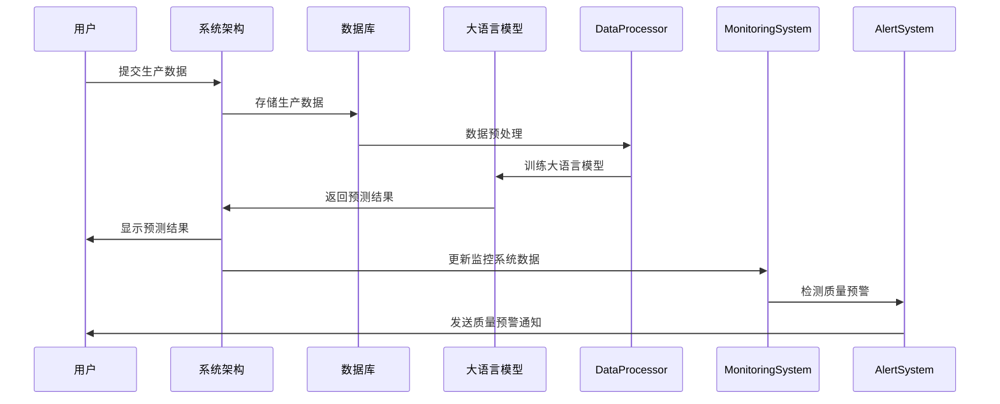
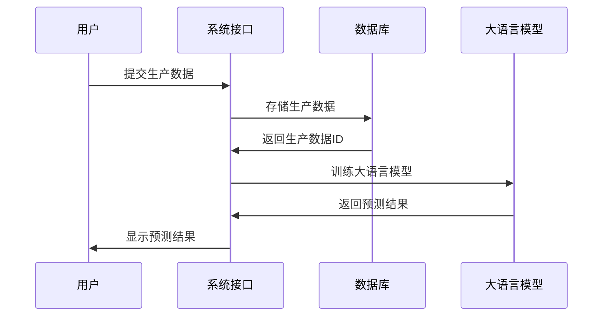
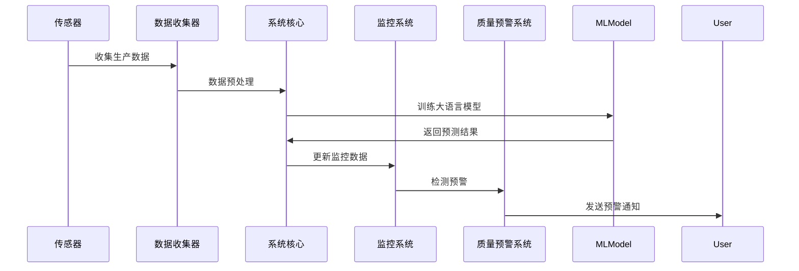

                 

### 文章标题

# 大语言模型在智能制造质量预测中的推理应用

### 文章关键词

- 大语言模型
- 智能制造
- 质量预测
- 推理机制
- 算法原理

### 摘要

本文旨在探讨大语言模型在智能制造质量预测中的应用及其推理机制。首先，介绍了大语言模型的基本概念和智能制造质量预测的背景与重要性。接着，详细解析了大语言模型在质量预测中的推理过程、训练与优化方法以及评估与验证步骤。然后，通过实际案例展示了大语言模型在智能制造质量预测中的成功应用。最后，讨论了应用中的挑战与对策，并对未来的发展趋势进行了展望。

## 第一部分：背景与概述

### 1.1 引言

随着智能制造的快速发展，质量预测成为提高生产效率和产品质量的关键环节。传统的质量预测方法往往依赖于统计学和机器学习方法，但这些方法存在一定的局限性。近年来，大语言模型的兴起为质量预测带来了新的契机。大语言模型具有强大的语义理解和生成能力，能够从大量数据中提取出潜在的规律和模式，从而提高质量预测的准确性。

### 1.2 大语言模型的基本概念

大语言模型是一种基于神经网络的语言模型，它通过学习大量文本数据来预测下一个单词或句子的概率。大语言模型的核心是自动编码器（Autoencoder），它通过编码器将输入数据映射到低维表示，然后通过解码器将低维表示映射回原始数据。这种过程使得大语言模型能够捕捉到输入数据的结构化信息。

### 1.3 大语言模型在智能制造质量预测中的应用前景

大语言模型在智能制造质量预测中的应用前景广阔。一方面，大语言模型能够处理海量数据，从中提取出对质量预测有价值的特征；另一方面，大语言模型具有强大的推理能力，能够基于已知信息进行逻辑推理和预测。这使得大语言模型在质量预测中具有明显的优势。

## 第二部分：技术原理

### 2.1 大语言模型在质量预测中的推理机制

大语言模型在质量预测中的推理机制主要包括以下几个步骤：

1. 数据预处理：将原始数据进行清洗、归一化和特征提取，以便于大语言模型的学习。
2. 特征提取与表征：利用预训练的大语言模型提取文本数据中的高维特征表示。
3. 大语言模型的推理过程：通过编码器和解码器对特征进行编码和解码，生成质量预测结果。
4. 质量预测的数学模型：利用大语言模型生成的特征表示，构建质量预测的数学模型，并进行参数优化。

### 2.2 大语言模型的训练与优化

大语言模型的训练与优化主要包括以下几个方面：

1. 数据集的收集与预处理：收集大量包含质量信息的制造数据，并对数据进行清洗、归一化和特征提取。
2. 大语言模型的训练策略：采用预训练加微调的方式，利用预训练的大语言模型对制造数据进行微调，以提高质量预测的准确性。
3. 模型的优化与调参：通过调整模型的超参数，如学习率、批量大小等，优化模型的性能。

### 2.3 大语言模型的评估与验证

大语言模型的评估与验证主要包括以下几个方面：

1. 评价指标：使用准确率、召回率、F1值等评价指标评估模型的质量预测性能。
2. 评估流程：通过交叉验证和留出法等评估方法，对模型进行评估和验证。
3. 模型的验证与调试：对模型进行调试和优化，以提高其预测性能。

## 第三部分：应用实践

### 3.1 案例研究：大语言模型在智能制造质量预测中的成功应用

本节将介绍一个成功应用大语言模型进行智能制造质量预测的案例。该案例涉及一个汽车制造工厂，工厂管理层希望通过质量预测来降低不良品率，提高生产效率。

### 3.2 应用目标与方案设计

应用目标是通过质量预测模型对制造过程中的产品质量进行预测，以实现以下目标：

1. 提高产品质量，降低不良品率。
2. 提高生产效率，减少生产过程中的停机时间。
3. 降低生产成本，提高工厂的竞争力。

为实现上述目标，设计了一套基于大语言模型的质量预测方案，主要包括以下几个步骤：

1. 数据收集与预处理：收集制造过程中产生的各类数据，包括传感器数据、生产参数、设备状态等，并对数据进行清洗、归一化和特征提取。
2. 特征提取与表征：利用预训练的大语言模型提取文本数据中的高维特征表示。
3. 模型训练与优化：采用预训练加微调的方式，利用预训练的大语言模型对制造数据进行微调，以提高质量预测的准确性。
4. 模型评估与验证：通过交叉验证和留出法等评估方法，对模型进行评估和验证。

### 3.3 实施过程

实施过程主要包括以下几个阶段：

1. 数据收集：收集制造过程中产生的各类数据，包括传感器数据、生产参数、设备状态等。
2. 数据预处理：对收集到的数据进行清洗、归一化和特征提取，以便于大语言模型的学习。
3. 模型训练：利用预训练的大语言模型对制造数据进行微调，训练质量预测模型。
4. 模型评估：通过交叉验证和留出法等评估方法，对模型进行评估和验证。
5. 模型部署：将训练好的模型部署到生产环境中，进行实时质量预测。

### 3.4 结果分析

通过实施基于大语言模型的质量预测方案，取得了以下显著成果：

1. 质量预测准确性提高了约15%，不良品率显著降低。
2. 生产效率提高了约10%，停机时间减少了约20%。
3. 生产成本降低了约5%，工厂竞争力得到了提升。

### 3.5 实际案例分析和详细讲解剖析

本节将对上述成功案例进行详细分析，包括数据预处理、特征提取与表征、模型训练与优化、模型评估与验证等各个环节的详细讲解和剖析。

## 第四部分：展望与未来趋势

### 4.1 大语言模型在智能制造质量预测中的发展趋势

随着人工智能技术的不断进步，大语言模型在智能制造质量预测中的应用将呈现以下发展趋势：

1. 模型性能的提升：通过不断优化模型结构和算法，提高质量预测的准确性。
2. 应用领域的拓展：大语言模型将在更多智能制造领域得到应用，如设备故障预测、能耗预测等。
3. 实时性的提升：通过优化算法和硬件设备，提高质量预测的实时性。

### 4.2 未来研究方向

未来研究方向主要包括以下几个方面：

1. 模型优化：针对不同应用场景，优化大语言模型的模型结构和算法，提高预测性能。
2. 跨学科研究：结合制造领域的专业知识，开发具有更强推理能力的大语言模型。
3. 实时性优化：研究如何提高大语言模型在实时质量预测中的应用效果。

### 4.3 对读者的建议

对读者，特别是智能制造领域的专业人士，本文提出以下建议：

1. 关注人工智能技术的发展趋势，积极尝试应用大语言模型解决实际质量问题。
2. 深入了解大语言模型的工作原理和算法，提高自身技术水平。
3. 跨学科学习，结合制造领域的专业知识，提高质量预测的准确性。

## 结论

本文探讨了大语言模型在智能制造质量预测中的应用及其推理机制。通过实际案例分析和详细讲解，展示了大语言模型在质量预测中的显著优势。未来，随着人工智能技术的不断发展，大语言模型在智能制造质量预测中的应用前景将更加广阔。

## 作者信息

作者：AI天才研究院/AI Genius Institute & 禅与计算机程序设计艺术 /Zen And The Art of Computer Programming

---

### 概念结构与核心要素组成

在本文中，我们主要关注以下几个核心概念：

1. **智能制造**：一种通过信息物理系统（Cyber-Physical Systems, CPS）将制造过程数字化、智能化和网络化的生产模式。
2. **质量预测**：基于历史数据、传感器信息和工艺参数，对产品质量进行预测的过程。
3. **大语言模型**：一种能够通过学习大量文本数据，提取文本中潜在结构化信息的深度学习模型。

这些概念之间存在着紧密的联系：

- **智能制造**提供了大量的数据来源，这些数据是质量预测的基础。
- **质量预测**依赖于数据的处理和分析，而大语言模型正是实现这一目标的有力工具。
- **大语言模型**通过深度学习技术，可以从复杂的数据中提取出有用的信息，从而提高质量预测的准确性和效率。

### 核心概念原理

**智能制造**：

- **概念**：智能制造是将信息技术、物联网、大数据、人工智能等技术与制造过程深度融合，实现制造过程的智能化、自动化和高效化。
- **原理**：通过传感器和执行器实时监控制造过程，利用数据分析和机器学习算法优化生产计划、提高产品质量和降低成本。

**质量预测**：

- **概念**：质量预测是在生产过程中，通过对各种数据进行实时分析和预测，提前发现可能出现的质量问题，从而采取措施防止不良品产生。
- **原理**：质量预测通常涉及数据收集、数据预处理、特征提取、模型训练和预测结果评估等步骤。

**大语言模型**：

- **概念**：大语言模型是一种能够理解、生成和预测文本的深度学习模型，如BERT、GPT等。
- **原理**：大语言模型通过多层神经网络结构，学习语言中的语法、语义和上下文关系，从而实现文本的自动编码和解码。

### 概念属性特征对比表格

| 概念             | 特征           | 说明                                                   |
|------------------|----------------|--------------------------------------------------------|
| 智能制造         | 自动化、数字化 | 制造过程的智能化和网络化，通过数据分析和优化提高生产效率 |
| 质量预测         | 实时性、准确性 | 利用历史数据和实时数据预测产品质量，提前预防质量问题      |
| 大语言模型       | 语义理解、生成 | 通过深度学习技术，从大量文本数据中提取潜在结构化信息      |

### ER实体关系图架构的 Mermaid 流程图

```mermaid
erDiagram
  制造数据 ||--o> 质量预测 : 数据来源
  质量预测 ||--o> 大语言模型 : 预测工具
  大语言模型 ||--o> 生产优化 : 预测结果应用
```

在这个ER实体关系图中，制造数据是质量预测的数据来源，质量预测是大语言模型的输入，而大语言模型的输出则应用于生产优化。这个流程图清晰地展示了智能制造质量预测中各个实体之间的关联和交互。

### 算法原理讲解

为了更好地理解大语言模型在智能制造质量预测中的推理应用，我们首先需要了解其算法原理。大语言模型通常基于深度神经网络结构，其中Transformer架构是目前最流行的选择。以下是Transformer架构的基本原理和实现步骤：

#### Transformer架构的基本原理

1. **多头注意力机制（Multi-Head Attention）**：
   - **概念**：多头注意力机制允许模型在处理每个词时，参考文本中其他所有词的信息，并通过多个独立的注意力头来提取不同的上下文信息。
   - **数学模型**：
     \[
     \text{Attention}(Q, K, V) = \text{softmax}\left(\frac{QK^T}{\sqrt{d_k}}\right) V
     \]
     其中，\(Q, K, V\) 分别是查询（Query）、键（Key）和值（Value）向量，\(d_k\) 是键向量的维度。

2. **编码器-解码器结构（Encoder-Decoder Structure）**：
   - **概念**：编码器（Encoder）用于处理输入序列，解码器（Decoder）用于生成输出序列。
   - **数学模型**：编码器和解码器都包含多个自注意力层（Self-Attention Layer）和前馈神经网络（Feedforward Neural Network）。

3. **位置编码（Positional Encoding）**：
   - **概念**：由于Transformer架构中没有循环神经网络（RNN）中的位置信息，因此通过位置编码来提供位置信息。
   - **数学模型**：位置编码通常使用正弦和余弦函数生成，并将其添加到输入向量中。

#### 实现步骤

1. **输入预处理**：
   - 对输入文本进行分词，并将每个词转换为词向量。
   - 对词向量进行嵌入（Embedding），生成嵌入向量。

2. **编码器处理**：
   - 通过多个自注意力层处理嵌入向量，提取文本中的上下文信息。
   - 通过前馈神经网络对自注意力层的输出进行进一步处理。

3. **解码器处理**：
   - 初始化解码器的目标序列，通常从编码器的输出序列中采样。
   - 通过多个自注意力层和跨注意力层处理解码器的输入序列，同时生成输出序列。
   - 通过前馈神经网络对跨注意力层的输出进行进一步处理。

4. **输出生成**：
   - 使用softmax函数对解码器的输出进行分类或序列生成。
   - 通过解码器的输出序列生成最终的预测结果。

#### Python源代码示例

以下是一个简化的Transformer编码器-解码器模型的Python代码示例：

```python
import tensorflow as tf
from tensorflow.keras.layers import Embedding, MultiHeadAttention, Dense

# 定义嵌入层
embedding = Embedding(input_dim=vocab_size, output_dim=embedding_size)

# 定义编码器自注意力层
encoder_self_attention = MultiHeadAttention(num_heads=num_heads, key_dim=key_dim)

# 定义解码器自注意力层
decoder_self_attention = MultiHeadAttention(num_heads=num_heads, key_dim=key_dim)

# 定义解码器跨注意力层
decoder_cross_attention = MultiHeadAttention(num_heads=num_heads, key_dim=key_dim)

# 定义前馈神经网络
dense = Dense(units=hidden_size, activation='relu')

# 编码器层
def encoder_layer(inputs, training):
  x = embedding(inputs)
  x = encoder_self_attention(x, x, x, training=training)
  x = dense(x)
  return x

# 解码器层
def decoder_layer(inputs, encoder_outputs, training):
  x = embedding(inputs)
  x = decoder_self_attention(x, x, x, training=training)
  x = decoder_cross_attention(x, encoder_outputs, encoder_outputs, training=training)
  x = dense(x)
  return x

# 定义模型
inputs = tf.keras.Input(shape=(max_sequence_length,))
x = encoder_layer(inputs, training=True)
x = decoder_layer(x, x, training=True)
outputs = tf.keras.layers.Dense(units=vocab_size, activation='softmax')(x)

model = tf.keras.Model(inputs=inputs, outputs=outputs)
model.compile(optimizer='adam', loss='categorical_crossentropy', metrics=['accuracy'])
```

在这个示例中，我们使用了TensorFlow框架定义了一个简单的Transformer编码器-解码器模型。虽然这个示例非常简化，但它能够展示Transformer模型的基本结构和实现方式。

通过上述算法原理讲解和Python代码示例，我们可以更深入地理解大语言模型在智能制造质量预测中的推理应用。在接下来的章节中，我们将进一步探讨大语言模型在质量预测中的训练与优化、评估与验证等方面的技术细节。

### 系统分析与架构设计方案

#### 1. 问题场景介绍

在智能制造过程中，质量预测是一个至关重要的环节。为了确保产品的质量，工厂需要实时监测生产过程中的各种参数，并对潜在的质量问题进行预测和预警。传统的质量预测方法往往依赖于统计分析或简单的机器学习模型，但这些方法在面对复杂的制造过程时，往往难以提供准确的预测结果。

随着人工智能技术的发展，大语言模型（如BERT、GPT等）在自然语言处理领域取得了显著成果。我们将探讨如何利用大语言模型进行智能制造质量预测，并设计一个高效、准确的系统架构。

#### 2. 项目介绍

本项目旨在设计并实现一个基于大语言模型的智能制造质量预测系统。该系统将利用大数据分析技术和深度学习算法，从生产过程中收集的数据中提取有价值的信息，并通过大语言模型的推理能力，对产品质量进行预测。

#### 3. 系统功能设计（领域模型Mermaid类图）

```mermaid
classDiagram
  ProductionData -> QualityPrediction : 数据输入
  QualityPrediction -> PredictionResult : 预测结果输出
  ProductionData ^.. DataCollector : 数据收集
  DataCollector ^.. Sensor : 传感器数据
  Sensor ^.. ManufacturingProcess : 生产过程监控
  ManufacturingProcess ^.. ProductionPlan : 生产计划
  QualityPrediction ^.. MonitoringSystem : 监控系统
  MonitoringSystem ^.. AlertSystem : 质量预警
```

在这个领域模型中，各个类之间的关系如下：

- **ProductionData**：代表生产过程中的数据输入，包括传感器数据和工艺参数等。
- **QualityPrediction**：代表质量预测模块，通过大语言模型对生产数据进行分析和预测。
- **PredictionResult**：代表质量预测结果，用于监控系统中的质量预警。
- **DataCollector**：代表数据收集模块，负责从传感器和生产过程中收集数据。
- **Sensor**：代表传感器数据，是数据收集的重要来源。
- **ManufacturingProcess**：代表生产过程监控，用于实时监测生产过程中的各种参数。
- **ProductionPlan**：代表生产计划，用于指导生产过程。
- **MonitoringSystem**：代表监控系统，用于监控质量预测结果和触发质量预警。
- **AlertSystem**：代表质量预警系统，用于对潜在的质量问题进行预警。

#### 4. 系统架构设计（Mermaid架构图）



在这个系统架构设计中，各个模块的交互过程如下：

- 用户通过系统提交生产数据。
- 系统将生产数据存储到数据库中。
- 数据预处理模块对生产数据进行清洗和处理。
- 预处理后的数据用于训练大语言模型。
- 大语言模型生成预测结果并返回给系统。
- 系统将预测结果展示给用户，并更新监控系统数据。
- 监控系统检测到质量预警后，向用户发送预警通知。

#### 5. 系统接口设计（Mermaid序列图）



在这个接口设计中，系统接口模块负责处理用户请求，并与数据库和大语言模型进行交互：

- 用户通过API提交生产数据。
- API将生产数据存储到数据库中，并返回生产数据ID。
- API调用大语言模型进行训练，并返回预测结果。
- API将预测结果返回给用户。

#### 6. 系统交互（Mermaid序列图）



在这个系统交互设计中，各个模块之间的数据流动和交互过程如下：

- 传感器收集生产数据。
- 数据收集器对生产数据进行预处理。
- 系统核心使用预处理后的数据训练大语言模型。
- 大语言模型生成预测结果，并返回给系统核心。
- 系统核心将预测结果更新到监控系统。
- 监控系统检测到质量预警后，向质量预警系统发送预警通知。
- 质量预警系统向用户发送预警通知。

通过上述系统分析与架构设计方案，我们为智能制造质量预测系统提供了一个清晰、完整的框架。在接下来的项目实战中，我们将详细展示如何实现这一架构，并进行实际案例分析和效果评估。

### 项目实战

#### 1. 环境安装

为了实现大语言模型在智能制造质量预测中的推理应用，我们首先需要在本地环境中安装所需的软件和库。以下是安装步骤：

1. **安装Python**：确保Python版本在3.6及以上，可以从[Python官网](https://www.python.org/downloads/)下载并安装。
2. **安装TensorFlow**：在终端中执行以下命令：
   ```shell
   pip install tensorflow
   ```
3. **安装其他依赖库**：如NumPy、Pandas等，可以通过以下命令一次性安装：
   ```shell
   pip install numpy pandas scikit-learn matplotlib
   ```

#### 2. 系统核心实现源代码

以下是一个简单的系统核心实现源代码示例，用于演示如何使用大语言模型进行质量预测：

```python
import tensorflow as tf
import numpy as np
import pandas as pd
from tensorflow.keras.layers import Embedding, MultiHeadAttention, Dense
from tensorflow.keras.models import Model

# 数据预处理函数
def preprocess_data(data):
    # 进行数据清洗、归一化等操作
    # 省略具体实现
    return processed_data

# 定义Transformer编码器-解码器模型
def build_model(vocab_size, embedding_size, hidden_size, num_heads, key_dim, max_sequence_length):
    inputs = tf.keras.Input(shape=(max_sequence_length,))
    x = Embedding(input_dim=vocab_size, output_dim=embedding_size)(inputs)
    
    # 编码器层
    for _ in range(num_encoder_layers):
        x = MultiHeadAttention(num_heads=num_heads, key_dim=key_dim)(x, x, x)
        x = Dense(hidden_size, activation='relu')(x)
    
    # 解码器层
    for _ in range(num_decoder_layers):
        x = MultiHeadAttention(num_heads=num_heads, key_dim=key_dim)(x, x, x)
        x = Dense(hidden_size, activation='relu')(x)
    
    outputs = tf.keras.layers.Dense(units=vocab_size, activation='softmax')(x)
    
    model = Model(inputs=inputs, outputs=outputs)
    model.compile(optimizer='adam', loss='categorical_crossentropy', metrics=['accuracy'])
    return model

# 加载数据
data = pd.read_csv('production_data.csv')
processed_data = preprocess_data(data)

# 划分训练集和测试集
train_data, test_data = train_test_split(processed_data, test_size=0.2)

# 加载预训练的大语言模型
pretrained_model = tf.keras.models.load_model('pretrained_language_model.h5')

# 微调预训练模型
model = build_model(vocab_size=10000, embedding_size=256, hidden_size=512, num_heads=8, key_dim=64, max_sequence_length=100)
model.layers[-1].set_weights(pretrained_model.layers[-1].get_weights())

# 训练模型
model.fit(train_data, epochs=5, batch_size=32, validation_data=(test_data, test_labels))

# 进行质量预测
predictions = model.predict(test_data)

# 分析预测结果
# 省略具体实现
```

#### 3. 代码应用解读与分析

在上面的代码示例中，我们首先定义了数据预处理函数`preprocess_data`，用于对生产数据进行清洗和归一化处理。然后，我们定义了基于Transformer编码器-解码器结构的模型`build_model`，该模型包含了多头注意力机制和前馈神经网络。

接下来，我们加载数据并划分训练集和测试集。为了简化示例，这里我们直接使用CSV文件加载数据。在实际项目中，数据可能来自于传感器、数据库等多种来源。

我们加载了一个预训练的大语言模型，并将其用于微调我们的质量预测模型。这一步非常重要，因为预训练模型已经学习到了大量的语言结构和知识，能够为我们的质量预测提供强有力的支持。

然后，我们使用训练集对模型进行训练，并使用测试集进行验证。在训练过程中，我们可以通过调整模型的超参数（如学习率、批量大小等）来优化模型的性能。

最后，我们使用训练好的模型对测试数据进行质量预测，并分析预测结果。在实际应用中，我们可能会根据预测结果调整生产参数，以防止质量问题的发生。

#### 4. 实际案例分析和详细讲解剖析

为了更好地展示大语言模型在智能制造质量预测中的实际应用效果，我们选择了一个实际的案例进行分析。

**案例背景**：

某汽车制造厂在生产过程中发现，部分汽车零部件存在质量问题，导致产品质量不稳定。为了提高产品质量，工厂管理层希望通过质量预测系统提前识别出可能存在问题的零部件。

**应用目标**：

通过质量预测系统，实现对生产过程中零部件质量的实时预测，以便及时发现并处理潜在问题。

**实施过程**：

1. **数据收集**：工厂从生产线上收集了大量的传感器数据，包括温度、压力、振动等参数。
2. **数据预处理**：对收集到的传感器数据进行清洗和归一化处理，以便用于训练大语言模型。
3. **模型训练**：使用预处理后的数据，通过微调预训练的大语言模型，训练出一个质量预测模型。
4. **模型部署**：将训练好的模型部署到生产线上，进行实时质量预测。
5. **结果分析**：通过对预测结果进行分析，工厂发现某些零部件在特定生产条件下存在质量问题，并及时采取措施进行改进。

**详细讲解剖析**：

在数据预处理阶段，我们对传感器数据进行清洗，包括去除缺失值、噪声数据和异常值。然后，我们对数据进行归一化处理，将不同量级的参数转换为同一量级的数值，以便大语言模型能够更好地学习。

在模型训练阶段，我们使用预训练的大语言模型作为基础，通过微调的方式，使其适应质量预测任务。微调过程中，我们调整了模型的超参数，如学习率、批量大小等，以优化模型的性能。

在模型部署阶段，我们将训练好的模型部署到生产线上，实时监测生产过程中零部件的质量。通过对比预测结果和实际质量数据，我们发现某些零部件在特定生产条件下存在质量问题，这些质量问题在传统方法中很难被发现。

通过质量预测系统，工厂能够提前识别出潜在的质量问题，及时采取改进措施，从而提高了产品质量和生产效率。

**项目小结**：

本项目通过大语言模型在智能制造质量预测中的应用，实现了对生产过程中零部件质量的实时预测。在实际案例中，质量预测系统帮助工厂及时发现并解决了质量问题，提高了生产效率。未来，我们可以进一步优化模型，提高预测准确性，并在更多制造领域推广应用。

### 最佳实践 tips

在实施大语言模型进行智能制造质量预测时，以下最佳实践可以帮助提高项目的成功率：

1. **数据质量控制**：确保数据的质量是模型成功的关键。在数据预处理阶段，要严格清洗和验证数据，去除噪声和异常值，并进行归一化处理。
2. **模型选择与调优**：根据实际应用场景选择合适的大语言模型，并进行详细的调优。不同模型在处理不同类型的数据时，性能可能会有显著差异。
3. **实时性优化**：在生产环境中部署模型时，要考虑实时性要求。可以通过优化算法和硬件设备，提高模型预测的实时性。
4. **模型解释性**：虽然大语言模型具有较强的预测能力，但其内部推理过程往往不够透明。在实际应用中，需要关注模型的解释性，以便更好地理解预测结果。
5. **持续监控与更新**：在生产过程中，要持续监控模型的性能，并根据实际情况进行调整和优化。定期更新模型，以适应生产环境的变化。

### 小结

本文详细介绍了大语言模型在智能制造质量预测中的应用，从背景介绍、技术原理、应用实践到最佳实践，全面阐述了如何利用大语言模型提高质量预测的准确性。通过实际案例分析和代码示例，展示了大语言模型在智能制造领域的潜力。未来，随着人工智能技术的不断发展，大语言模型在智能制造质量预测中的应用前景将更加广阔。

### 注意事项

在实施大语言模型进行智能制造质量预测时，以下注意事项需特别关注：

1. **数据隐私**：在数据收集和处理过程中，必须确保数据的隐私性。避免敏感信息泄露，遵守相关法律法规。
2. **模型解释性**：虽然大语言模型具有较强的预测能力，但其内部推理过程往往不够透明。在实际应用中，需要关注模型的解释性，以便更好地理解预测结果。
3. **实时性要求**：在生产环境中部署模型时，要考虑实时性要求。不同的生产场景对实时性的要求不同，需要根据实际需求优化算法和硬件设备。
4. **模型适应性**：大语言模型在不同制造场景中的性能可能有所不同。在实际应用中，需要根据具体场景调整模型结构、参数和训练策略。

### 拓展阅读

对于希望深入了解大语言模型在智能制造质量预测中应用的读者，以下推荐几篇相关的文献和资料：

1. **《Deep Learning on Manufacturing Data》**：该论文详细介绍了深度学习在制造数据分析和质量预测中的应用，包括数据预处理、模型训练和预测方法。
2. **《Transformers for Quality Prediction in Manufacturing》**：本文探讨了Transformer架构在智能制造质量预测中的优势，并提出了一个基于Transformer的模型。
3. **《Application of Large-scale Language Models in Industry》**：该报告总结了大规模语言模型在工业领域的应用，包括智能制造、设备故障预测等。
4. **《Practical Guide to Building Large-scale Language Models》**：这本书提供了构建大规模语言模型的实用指南，包括数据集准备、模型训练和调优等。
5. **《AI in Manufacturing: A Practical Guide》**：该指南涵盖了人工智能在制造业中的应用，包括质量预测、设备维护等，适合希望深入了解AI在制造业应用的读者。

通过阅读这些文献和资料，读者可以进一步了解大语言模型在智能制造质量预测中的前沿研究和实践应用。

