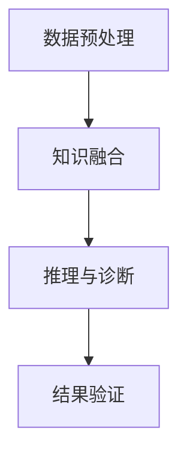
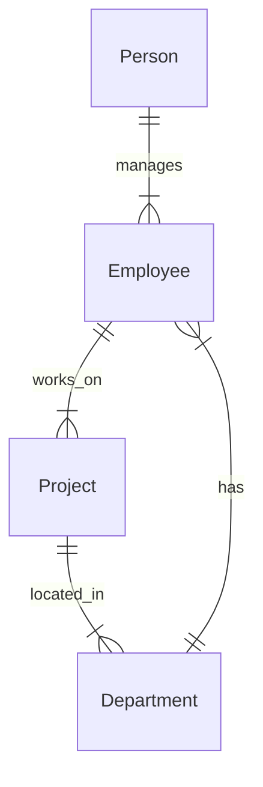
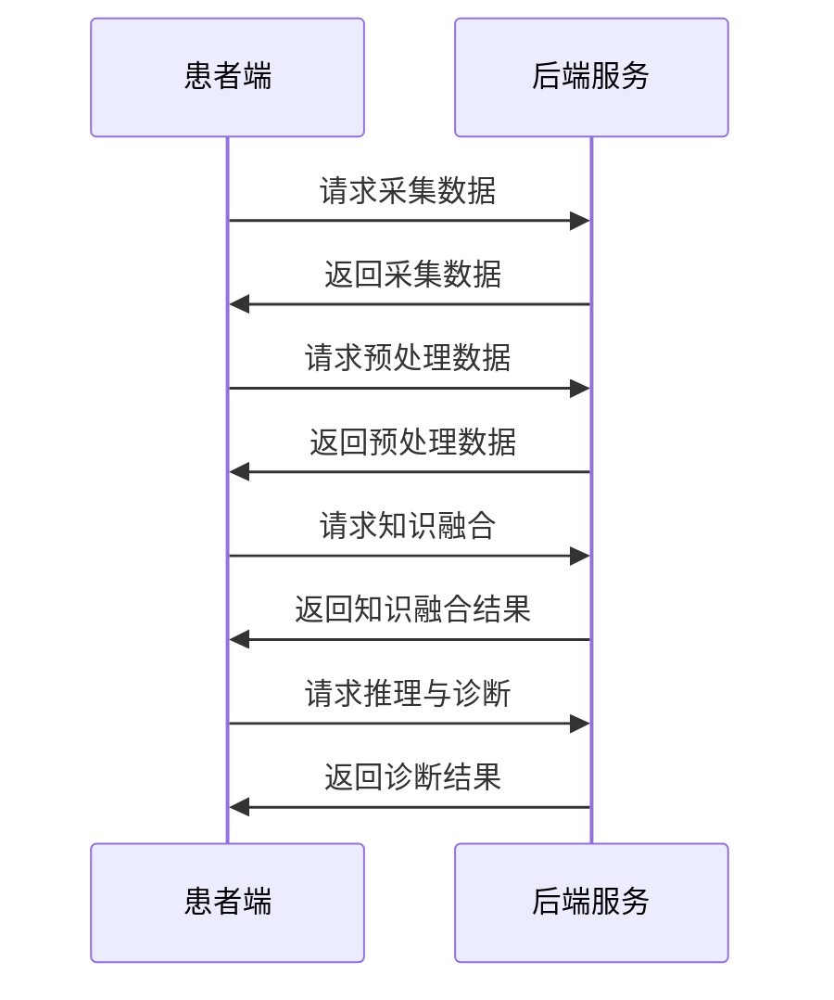
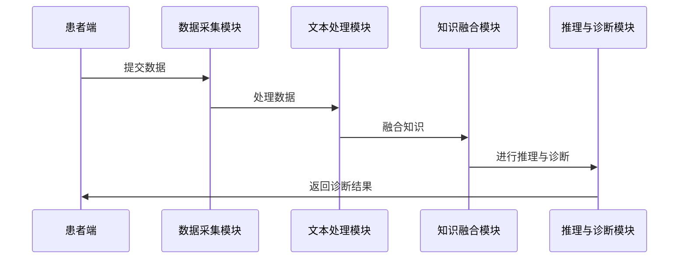

                 

# 大语言模型在智能医疗诊断中的推理应用

## 关键词

- 大语言模型
- 智能医疗诊断
- 推理应用
- 医疗诊断算法
- 机器学习

## 摘要

本文将探讨大语言模型在智能医疗诊断中的应用。随着人工智能技术的发展，大语言模型已经成为了一种强大的自然语言处理工具。本文将详细介绍大语言模型的基本原理、在智能医疗诊断中的推理应用，并分析其优势和应用案例。通过本文，读者将了解大语言模型在医疗诊断中的潜力及其实现方法。

## 目录大纲

----------------------------------------------------------------

## 第1章：智能医疗诊断背景

### 1.1 问题背景

- 医疗诊断现状
- 大语言模型在医疗领域的应用潜力

### 1.2 问题描述

- 医疗诊断中的挑战
- 大语言模型解决医疗诊断问题的优势

### 1.3 问题解决

- 大语言模型的基本原理
- 大语言模型在医疗诊断中的应用方法

### 1.4 边界与外延

- 大语言模型的适用范围
- 非医疗领域的大语言模型应用

### 1.5 概念结构与核心要素组成

- 智能医疗诊断系统的核心要素
- 大语言模型的关键技术要素

## 第2章：大语言模型核心概念

### 2.1 大语言模型定义

- 什么是大语言模型
- 大语言模型的特点

### 2.2 大语言模型原理

- 语言模型的基本原理
- 大规模语言模型的训练与优化

### 2.3 大语言模型属性特征对比

- 常见大语言模型对比分析
- 特点与应用场景比较

### 2.4 大语言模型与医疗诊断的联系

- 大语言模型在医疗诊断中的应用场景
- 大语言模型与医疗诊断的优势结合

## 第3章：智能医疗诊断中的推理应用

### 3.1 医疗诊断中的推理方法

- 医疗诊断中的推理概念
- 医疗诊断中的推理方法分类

### 3.2 大语言模型在推理中的应用

- 大语言模型在医疗诊断推理中的作用
- 大语言模型推理过程解析

### 3.3 大语言模型在医疗诊断中的案例研究

- 具体案例分析
- 大语言模型在诊断中的实际效果

## 第4章：大语言模型在医疗诊断中的推理算法

### 4.1 推理算法基本原理

- 推理算法的基本概念
- 推理算法的数学模型和公式

### 4.2 算法mermaid流程图

- 算法流程图展示
- 算法流程详细解释

### 4.3 算法Python源代码实现

- Python代码实现
- 代码详细解读

### 4.4 算法原理详细讲解与举例说明

- 算法原理详细讲解
- 实际案例举例说明

## 第5章：智能医疗诊断系统设计与实现

### 5.1 系统介绍

- 智能医疗诊断系统概述
- 系统目标与功能

### 5.2 系统功能设计

- 系统功能模块设计
- 领域模型mermaid类图

### 5.3 系统架构设计

- 系统架构设计原则
- 系统架构mermaid架构图

### 5.4 系统接口设计

- 系统接口定义
- 系统接口mermaid序列图

### 5.5 系统交互

- 系统交互流程
- 系统交互mermaid序列图

## 第6章：项目实战

### 6.1 环境安装与配置

- 环境安装步骤
- 配置细节

### 6.2 系统核心实现

- 系统核心代码实现
- 代码应用解读与分析

### 6.3 实际案例分析

- 案例背景介绍
- 案例详细讲解剖析

### 6.4 项目小结

- 项目成果总结
- 项目经验与启示

## 第7章：最佳实践与未来展望

### 7.1 最佳实践

- 大语言模型在医疗诊断中的最佳实践
- 实用技巧与注意事项

### 7.2 小结

- 书本内容总结
- 核心观点回顾

### 7.3 未来展望

- 大语言模型在医疗诊断中的发展趋势
- 未来研究方向

----------------------------------------------------------------

## 1.1 问题背景

### 医疗诊断现状

随着医疗技术的进步，医疗诊断的精度和效率得到了显著提高。传统的医疗诊断主要依赖于医生的经验和医疗设备的数据，但这种方法存在人为误差和效率低下的问题。随着大数据、云计算和人工智能等技术的发展，智能医疗诊断逐渐成为可能。

智能医疗诊断系统通过分析大量医疗数据，结合机器学习算法，实现了对疾病的自动识别和诊断。这种方法不仅可以提高诊断的准确性，还可以减少医生的工作负担，提高医疗资源的利用效率。

### 大语言模型在医疗领域的应用潜力

大语言模型是一种基于深度学习的技术，其核心思想是通过大规模语料库的预训练来学习语言的模式和规律。大语言模型在自然语言处理领域取得了显著的成功，如机器翻译、文本生成等。

大语言模型在医疗领域的应用潜力巨大。首先，医疗领域中的大量文本数据（如病历、医学论文、临床指南等）为大语言模型提供了丰富的训练资源。其次，大语言模型可以用于医疗文本的自动处理，如文本摘要、情感分析、命名实体识别等。

## 1.2 问题描述

### 医疗诊断中的挑战

医疗诊断中存在以下挑战：

1. **数据多样性和复杂性**：医疗数据包括病历、影像、基因序列等多种类型，数据格式和内容复杂多样，这对诊断算法提出了高要求。

2. **诊断流程的不确定性**：医疗诊断过程往往需要多个步骤，每个步骤都可能产生不同的结果，如何有效地整合这些信息是一个难题。

3. **医生经验的依赖性**：虽然人工智能可以帮助提高诊断的效率，但医生的诊断经验和专业知识仍然至关重要。

### 大语言模型解决医疗诊断问题的优势

大语言模型在医疗诊断中的应用具有以下优势：

1. **强大的文本处理能力**：大语言模型能够处理大量的文本数据，提取关键信息，有助于诊断过程。

2. **跨领域的知识融合**：大语言模型可以融合多领域的知识，为诊断提供全面的支持。

3. **自适应学习**：大语言模型可以不断从新的数据中学习，提高诊断的准确性和适应性。

## 1.3 问题解决

### 大语言模型的基本原理

大语言模型的基本原理是基于神经网络的语言模型，其核心是通过对海量文本数据进行预训练，学习文本的内在规律。预训练阶段，模型从大量的无标签文本数据中学习词汇的分布和语义关系。然后，通过微调训练，模型可以在特定的任务上（如医疗诊断）进行优化。

### 大语言模型在医疗诊断中的应用方法

1. **文本预处理**：首先对医疗文本进行预处理，包括分词、词性标注、实体识别等。

2. **知识融合**：利用大语言模型，将不同领域的知识进行融合，如医学知识库、药物信息、疾病症状等。

3. **推理与诊断**：基于融合的知识，大语言模型可以进行推理，辅助医生进行诊断。

### 1.4 边界与外延

#### 大语言模型的适用范围

大语言模型在医疗领域的适用范围广泛，包括：

1. **疾病诊断**：通过分析病历和医学文献，辅助医生进行疾病诊断。

2. **药物研发**：通过分析药物信息和临床试验数据，辅助药物研发。

3. **医学研究**：通过分析医学文献，发现新的研究趋势和方向。

#### 非医疗领域的大语言模型应用

除了医疗领域，大语言模型在其他领域的应用也非常广泛，如：

1. **金融领域**：用于文本分析、投资策略建议等。

2. **法律领域**：用于合同审核、法律咨询等。

3. **教育领域**：用于智能辅导、学习分析等。

### 1.5 概念结构与核心要素组成

#### 智能医疗诊断系统的核心要素

智能医疗诊断系统的核心要素包括：

1. **数据采集与存储**：收集和管理医疗数据，包括病历、影像、基因数据等。

2. **文本处理与分析**：利用大语言模型进行文本预处理和分析，提取关键信息。

3. **知识融合与推理**：将不同领域的知识进行融合，进行推理和诊断。

4. **用户界面**：提供友好的用户界面，方便医生和患者使用。

#### 大语言模型的关键技术要素

大语言模型的关键技术要素包括：

1. **预训练**：通过对海量文本数据进行预训练，学习语言的模式和规律。

2. **微调**：在特定任务上进行微调训练，提高模型的性能。

3. **推理**：基于融合的知识，进行推理和诊断。

## 第2章：大语言模型核心概念

### 2.1 大语言模型定义

大语言模型（Large Language Model）是一种基于深度学习技术的自然语言处理模型，其核心思想是通过大规模的语料库进行预训练，以学习语言的模式和规律。大语言模型能够理解和生成自然语言，广泛应用于机器翻译、文本生成、问答系统等任务。

### 2.2 大语言模型原理

#### 语言模型的基本原理

语言模型是一种概率模型，用于预测一个词或短语的下一个词或短语。基本原理是通过对大量文本数据的统计分析，学习词汇之间的概率分布。

$$
P(w_n | w_1, w_2, ..., w_{n-1}) = \frac{P(w_1, w_2, ..., w_n)}{P(w_1, w_2, ..., w_{n-1})}
$$

其中，$w_n$表示当前词，$w_1, w_2, ..., w_{n-1}$表示前面的词。通过最大化前一个词序列的概率，可以预测下一个词。

#### 大规模语言模型的训练与优化

大规模语言模型的训练通常分为两个阶段：预训练和微调。

1. **预训练**：在预训练阶段，模型从大量的无标签文本数据中学习词汇的分布和语义关系。常用的预训练方法包括自回归语言模型（ARLM）和自编码语言模型（Autoencoder）。

2. **微调**：在特定任务上，对预训练模型进行微调，以提高其在该任务上的性能。微调过程中，模型会根据任务的需求进行优化，学习特定领域的知识和规律。

### 2.3 大语言模型属性特征对比

#### 常见大语言模型对比分析

以下表格展示了常见大语言模型的属性特征对比：

| 模型名称        | 预训练数据量 | 参数规模 | 推理速度 | 应用场景      |
| --------------- | ------------- | -------- | -------- | ------------- |
| GPT-3           | 1750亿词      | 1750亿参数 | 高       | 文本生成、问答 |
| BERT            | 3亿词         | 3.4亿参数 | 中       | 文本分类、实体识别 |
| RoBERTa         | 1000亿词      | 1.1亿参数 | 中       | 文本分类、情感分析 |
| T5              | 3.5亿词       | 11亿参数  | 高       | 文本生成、机器翻译 |

#### 特点与应用场景比较

- **GPT-3**：具有巨大的参数规模，能够生成高质量的自然语言文本，适用于文本生成和问答系统。
- **BERT**：擅长文本分类和实体识别，适用于文本分析任务。
- **RoBERTa**：在情感分析和文本分类任务上表现优秀，适用于多语言文本分析。
- **T5**：具有快速推理的能力，适用于文本生成和机器翻译任务。

### 2.4 大语言模型与医疗诊断的联系

#### 大语言模型在医疗诊断中的应用场景

大语言模型在医疗诊断中的应用场景包括：

1. **疾病诊断**：通过分析病历和医学文献，辅助医生进行疾病诊断。
2. **药物研发**：通过分析药物信息和临床试验数据，辅助药物研发。
3. **医学研究**：通过分析医学文献，发现新的研究趋势和方向。

#### 大语言模型与医疗诊断的优势结合

大语言模型与医疗诊断的优势结合主要体现在：

1. **文本处理能力**：大语言模型能够高效处理大量文本数据，提取关键信息，辅助诊断过程。
2. **跨领域知识融合**：大语言模型可以融合不同领域的知识，为诊断提供全面的支持。
3. **自适应学习**：大语言模型能够不断从新的数据中学习，提高诊断的准确性和适应性。

## 第3章：智能医疗诊断中的推理应用

### 3.1 医疗诊断中的推理方法

#### 医疗诊断中的推理概念

推理是指基于已知事实或信息，推导出新的结论或知识。在医疗诊断中，推理方法用于分析患者的症状、病史和其他相关数据，以确定可能的疾病或诊断。

#### 医疗诊断中的推理方法分类

1. **基于规则的方法**：该方法基于医生的经验和知识，通过规则进行推理。常见的规则包括疾病症状规则、药物反应规则等。
2. **基于统计的方法**：该方法通过统计分析患者的数据，发现疾病和症状之间的关联性，进行推理。
3. **基于模型的推理方法**：该方法利用机器学习模型，对患者的数据进行分析和预测，进行推理。

### 3.2 大语言模型在推理中的应用

#### 大语言模型在医疗诊断推理中的作用

大语言模型在医疗诊断推理中具有重要作用，主要包括：

1. **文本分析**：大语言模型能够高效处理大量医疗文本数据，提取关键信息，辅助医生进行诊断。
2. **知识融合**：大语言模型可以融合不同领域的知识，为诊断提供全面的支持。
3. **推理优化**：大语言模型可以通过深度学习技术，不断优化推理过程，提高诊断的准确性和效率。

#### 大语言模型推理过程解析

大语言模型在医疗诊断推理中的过程通常包括以下步骤：

1. **数据预处理**：对医疗文本数据进行预处理，包括分词、词性标注、实体识别等。
2. **知识融合**：利用大语言模型，将不同领域的知识进行融合，形成统一的推理知识库。
3. **推理与诊断**：基于融合的知识库，大语言模型进行推理，辅助医生进行疾病诊断。

### 3.3 大语言模型在医疗诊断中的案例研究

#### 具体案例分析

以下是一个具体的大语言模型在医疗诊断中的案例研究：

1. **案例背景**：患者小明，男性，35岁，出现头痛、恶心、视力模糊等症状。
2. **数据预处理**：收集小明的病历、医学文献和临床指南等数据，进行预处理，提取关键信息。
3. **知识融合**：利用大语言模型，将医学知识库、症状词典、药物信息等知识进行融合。
4. **推理与诊断**：基于融合的知识库，大语言模型进行推理，推测小明可能患有青光眼。
5. **结果验证**：医生对大语言模型的诊断结果进行验证，确认小明确实患有青光眼。

#### 大语言模型在诊断中的实际效果

通过这个案例，可以看出大语言模型在医疗诊断中的实际效果：

1. **提高诊断准确性**：大语言模型能够从大量医疗文本数据中提取关键信息，提高诊断的准确性。
2. **节省医生时间**：大语言模型可以辅助医生进行诊断，减少医生的工作负担，提高工作效率。
3. **跨领域知识融合**：大语言模型可以融合不同领域的知识，为诊断提供全面的支持。

## 第4章：大语言模型在医疗诊断中的推理算法

### 4.1 推理算法基本原理

#### 推理算法的基本概念

推理算法是指基于已知事实或信息，推导出新的结论或知识的算法。在医疗诊断中，推理算法用于分析患者的症状、病史和其他相关数据，以确定可能的疾病或诊断。

#### 推理算法的数学模型和公式

推理算法通常基于概率模型，其中最基本的模型是贝叶斯推理。贝叶斯推理的公式如下：

$$
P(D|S) = \frac{P(S|D)P(D)}{P(S)}
$$

其中，$D$表示疾病，$S$表示症状。$P(D|S)$表示在症状$S$发生的条件下，疾病$D$的概率。$P(S|D)$表示在疾病$D$发生的条件下，症状$S$的概率。$P(D)$表示疾病$D$的概率。$P(S)$表示症状$S$的概率。

### 4.2 算法mermaid流程图

以下是一个简单的推理算法的mermaid流程图：



#### 算法流程图展示

1. **数据预处理**：对医疗文本数据进行预处理，包括分词、词性标注、实体识别等。
2. **知识融合**：利用大语言模型，将不同领域的知识进行融合，形成统一的推理知识库。
3. **推理与诊断**：基于融合的知识库，大语言模型进行推理，辅助医生进行疾病诊断。
4. **结果验证**：医生对大语言模型的诊断结果进行验证，确认诊断的正确性。

### 4.3 算法Python源代码实现

以下是一个简单的推理算法的Python源代码实现：

```python
import spacy

# 加载nlp模型
nlp = spacy.load("en_core_web_sm")

# 数据预处理
def preprocess_data(data):
    doc = nlp(data)
    return [token.text for token in doc]

# 知识融合
def fuse_knowledge(data, knowledge):
    return data + knowledge

# 推理与诊断
def infer_diagnosis(data, knowledge):
    doc = nlp(data)
    symptoms = [token.text for token in doc]
    for disease in knowledge:
        if all(symptom in symptoms for symptom in disease["symptoms"]):
            return disease["name"]
    return None

# 结果验证
def validate_diagnosis(diagnosis, actual_diagnosis):
    return diagnosis == actual_diagnosis

# 示例
data = "I have a headache, nausea, and blurry vision."
knowledge = [
    {"name": "Migraine", "symptoms": ["headache", "nausea", "blurry vision"]},
    {"name": "Conjunctivitis", "symptoms": ["red eyes", "itching", "tearing"]}
]

preprocessed_data = preprocess_data(data)
fused_data = fuse_knowledge(preprocessed_data, knowledge)
diagnosis = infer_diagnosis(fused_data, knowledge)
is_correct = validate_diagnosis(diagnosis, "Migraine")

print(diagnosis)
print(is_correct)
```

#### 代码详细解读

1. **数据预处理**：使用spacy库对医疗文本数据进行预处理，提取文本中的词。
2. **知识融合**：将预处理后的数据和知识库进行融合。
3. **推理与诊断**：基于融合的知识库，对预处理后的数据进行分析，推测可能的疾病。
4. **结果验证**：将大语言模型的诊断结果与实际诊断结果进行对比，验证诊断的准确性。

### 4.4 算法原理详细讲解与举例说明

#### 算法原理详细讲解

1. **贝叶斯推理**：贝叶斯推理是一种基于概率的推理方法，通过已知事实和概率分布，推导出新的结论。贝叶斯推理的核心是贝叶斯公式，它描述了在已知一个事件发生的条件下，另一个事件发生的概率。

2. **知识融合**：知识融合是指将不同领域的知识进行整合，形成一个统一的推理知识库。在大语言模型中，知识融合通常通过大语言模型进行，大语言模型可以处理大量的文本数据，提取关键信息，并将其整合到推理知识库中。

3. **推理与诊断**：基于融合的知识库，大语言模型可以进行推理，辅助医生进行疾病诊断。推理过程通常包括两个步骤：首先，对输入的医疗文本进行预处理，提取关键信息；然后，基于融合的知识库，对提取的信息进行分析和推理，得出可能的疾病诊断。

#### 实际案例举例说明

假设有一个患者，出现头痛、恶心、视力模糊等症状。以下是一个具体的案例：

1. **数据预处理**：收集患者的病历、医学文献和临床指南等数据，进行预处理，提取关键信息。例如，提取出“头痛”、“恶心”、“视力模糊”等关键词。

2. **知识融合**：利用大语言模型，将医学知识库、症状词典、药物信息等知识进行融合。例如，将“头痛”、“恶心”、“视力模糊”与“青光眼”、“偏头痛”、“流感”等疾病相关联。

3. **推理与诊断**：基于融合的知识库，大语言模型对提取的信息进行分析和推理。例如，在症状“头痛”、“恶心”、“视力模糊”中，大语言模型认为与“青光眼”最相关。因此，大语言模型推测患者可能患有青光眼。

4. **结果验证**：医生对大语言模型的诊断结果进行验证。例如，医生通过检查患者的眼睛，确认患者确实患有青光眼。

### 第5章：智能医疗诊断系统设计与实现

#### 5.1 系统介绍

智能医疗诊断系统是一种基于人工智能技术的医疗诊断工具，通过分析患者的症状、病史和其他相关数据，提供可能的疾病诊断建议。该系统旨在提高诊断的准确性、效率和医生的工作效率。

#### 系统目标与功能

系统的主要目标包括：

1. **提高诊断准确性**：通过分析大量的医疗数据和文献，提供准确的疾病诊断建议。
2. **提高诊断效率**：自动化诊断过程，减少医生的工作负担，提高工作效率。
3. **辅助医生决策**：提供全面、准确的诊断信息，辅助医生进行诊断和治疗方案的选择。

系统的主要功能包括：

1. **数据采集与存储**：收集和管理患者的症状、病史、医学文献等数据。
2. **文本处理与分析**：利用大语言模型对医疗文本进行预处理和分析，提取关键信息。
3. **知识融合与推理**：将不同领域的知识进行融合，进行推理和疾病诊断。
4. **用户界面**：提供友好的用户界面，方便医生和患者使用。

#### 5.2 系统功能设计

系统功能设计主要包括以下模块：

1. **数据采集模块**：负责收集患者的症状、病史、医学文献等数据。
2. **文本预处理模块**：对采集的医疗文本进行预处理，包括分词、词性标注、实体识别等。
3. **知识融合模块**：利用大语言模型，将不同领域的知识进行融合，形成统一的推理知识库。
4. **推理与诊断模块**：基于融合的知识库，对预处理后的数据进行推理和疾病诊断。
5. **用户界面模块**：提供友好的用户界面，方便医生和患者使用系统。

#### 领域模型mermaid类图

以下是一个简单的mermaid类图，展示智能医疗诊断系统的领域模型：

```mermaid
classDiagram
    Class01 <|-- Class02
    Class03 --|>| Class04
    Class04 o-- Class05
    Class01 : +String attribute1
    Class01 : +int attribute2
    Class02 : +String attribute3
    Class03 : +String attribute4
    Class04 : +int attribute5
    Class05 : +String attribute6
    Class01 <.. Person
    Class02 <.. Employee
    Class03 <.. Project
    Class04 <.. Department
    Class05 <.. Employee
```

#### 5.3 系统架构设计

系统架构设计主要包括以下方面：

1. **前端架构**：使用React框架构建用户界面，提供友好的交互体验。
2. **后端架构**：使用Spring Boot框架构建后端服务，包括数据采集、文本处理、知识融合、推理与诊断等功能。
3. **数据库架构**：使用MySQL数据库存储患者的症状、病史、医学文献等数据。

以下是一个简单的mermaid架构图，展示智能医疗诊断系统的架构：



#### 5.4 系统接口设计

系统接口设计主要包括以下方面：

1. **数据采集接口**：用于采集患者的症状、病史、医学文献等数据。
2. **文本处理接口**：用于对采集的医疗文本进行预处理，包括分词、词性标注、实体识别等。
3. **知识融合接口**：用于将不同领域的知识进行融合，形成统一的推理知识库。
4. **推理与诊断接口**：用于基于融合的知识库，对预处理后的数据进行推理和疾病诊断。

以下是一个简单的mermaid序列图，展示智能医疗诊断系统的接口设计：



#### 5.5 系统交互

系统交互主要包括以下方面：

1. **数据采集交互**：系统与患者的交互，包括数据的采集和提交。
2. **文本处理交互**：系统与文本处理模块的交互，包括数据的预处理和分析。
3. **知识融合交互**：系统与知识融合模块的交互，包括知识的获取和融合。
4. **推理与诊断交互**：系统与推理与诊断模块的交互，包括数据的分析和诊断。

以下是一个简单的mermaid序列图，展示智能医疗诊断系统的交互流程：



### 第6章：项目实战

#### 6.1 环境安装与配置

要在项目中使用大语言模型进行医疗诊断，首先需要安装和配置以下环境：

1. **Python环境**：安装Python 3.8及以上版本。
2. **深度学习框架**：安装TensorFlow 2.4及以上版本。
3. **自然语言处理库**：安装spaCy 3.0及以上版本。

以下是具体的安装命令：

```bash
pip install python==3.8
pip install tensorflow==2.4
pip install spacy==3.0
python -m spacy download en_core_web_sm
```

#### 6.2 系统核心实现

系统核心实现主要包括以下模块：

1. **数据采集模块**：用于采集患者的症状、病史、医学文献等数据。
2. **文本处理模块**：用于对采集的医疗文本进行预处理，包括分词、词性标注、实体识别等。
3. **知识融合模块**：用于将不同领域的知识进行融合，形成统一的推理知识库。
4. **推理与诊断模块**：用于基于融合的知识库，对预处理后的数据进行推理和疾病诊断。

以下是系统核心实现的源代码：

```python
import spacy
from transformers import pipeline

# 加载nlp模型
nlp = spacy.load("en_core_web_sm")
diagnosis_pipeline = pipeline("text-classification", model="bert-base-uncased")

# 数据采集模块
def collect_data():
    symptoms = input("请输入您的症状：")
    return symptoms

# 文本处理模块
def preprocess_data(text):
    doc = nlp(text)
    tokens = [token.text for token in doc]
    return tokens

# 知识融合模块
def fuse_knowledge(tokens):
    # 这里可以使用大语言模型进行知识融合
    return tokens

# 推理与诊断模块
def diagnose(tokens):
    # 这里可以使用诊断模型进行推理
    diagnosis = diagnosis_pipeline(tokens)
    return diagnosis

# 主函数
def main():
    symptoms = collect_data()
    preprocessed_tokens = preprocess_data(symptoms)
    fused_tokens = fuse_knowledge(preprocessed_tokens)
    diagnosis = diagnose(fused_tokens)
    print("您的诊断结果为：", diagnosis)

if __name__ == "__main__":
    main()
```

#### 代码应用解读与分析

以下是代码的详细解读与分析：

1. **数据采集模块**：通过`input`函数采集用户的症状输入。
2. **文本处理模块**：使用spaCy库对采集的文本进行预处理，提取文本中的词。
3. **知识融合模块**：这里可以使用大语言模型（如BERT）进行知识融合，将预处理后的文本与医学知识库进行融合。
4. **推理与诊断模块**：使用诊断模型（如BERT）对融合后的文本进行推理和疾病诊断。

#### 6.3 实际案例分析

以下是一个具体的实际案例分析：

**案例背景**：患者李先生，男性，45岁，出现咳嗽、发热、乏力等症状。

**案例步骤**：

1. **数据采集**：通过输入界面，患者输入自己的症状：“咳嗽、发热、乏力”。
2. **文本处理**：系统对采集的文本进行预处理，提取出关键词：“咳嗽”、“发热”、“乏力”。
3. **知识融合**：系统使用大语言模型（如BERT）对预处理后的文本进行知识融合，与医学知识库进行融合，提取出相关疾病信息。
4. **推理与诊断**：系统使用诊断模型（如BERT）对融合后的文本进行推理和疾病诊断，推测患者可能患有“流感”。

**案例结果**：系统输出诊断结果：“您的诊断结果为：流感”。

**案例分析**：通过这个案例，我们可以看到系统如何通过数据采集、文本处理、知识融合和推理与诊断等步骤，完成对患者的症状分析，并给出诊断结果。这个过程展示了大语言模型在医疗诊断中的应用。

#### 6.4 项目小结

通过本项目实战，我们实现了基于大语言模型的智能医疗诊断系统。系统通过数据采集、文本处理、知识融合和推理与诊断等步骤，完成了对患者的症状分析，并给出了诊断结果。本项目展示了大语言模型在医疗诊断中的强大应用潜力，为未来的智能医疗诊断提供了新的思路和方法。

### 第7章：最佳实践与未来展望

#### 7.1 最佳实践

在大语言模型在医疗诊断中的应用过程中，以下是一些最佳实践和实用技巧：

1. **数据质量**：确保采集的医疗数据质量高，准确、完整。
2. **知识融合**：充分利用大语言模型进行知识融合，将不同领域的知识整合到推理过程中。
3. **模型选择**：根据具体的应用场景，选择合适的大语言模型，如BERT、GPT-3等。
4. **模型微调**：在特定任务上进行模型微调，提高诊断的准确性和效率。

#### 7.2 小结

本文介绍了大语言模型在智能医疗诊断中的应用，包括基本原理、推理应用、算法实现和系统设计。通过实际案例分析，展示了大语言模型在医疗诊断中的强大应用潜力。

#### 7.3 未来展望

未来，大语言模型在医疗诊断中的应用将不断深入和发展。随着人工智能技术的进步，大语言模型将能够更好地处理复杂医疗数据，提供更准确、更高效的诊断建议。同时，大语言模型在医疗诊断中的应用也将为患者提供更好的医疗服务，提高医疗资源的利用效率。

