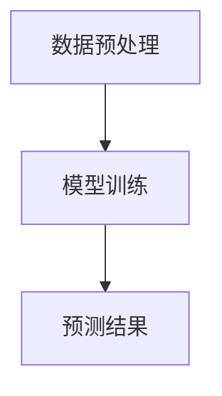
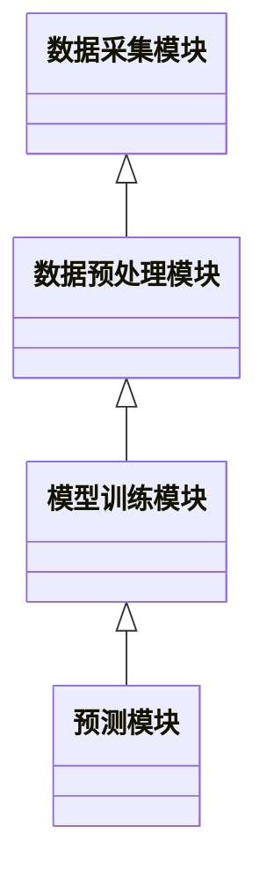
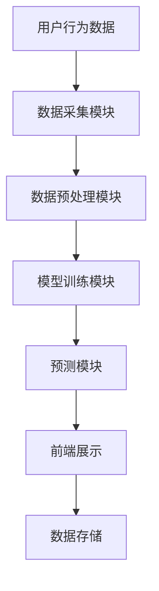
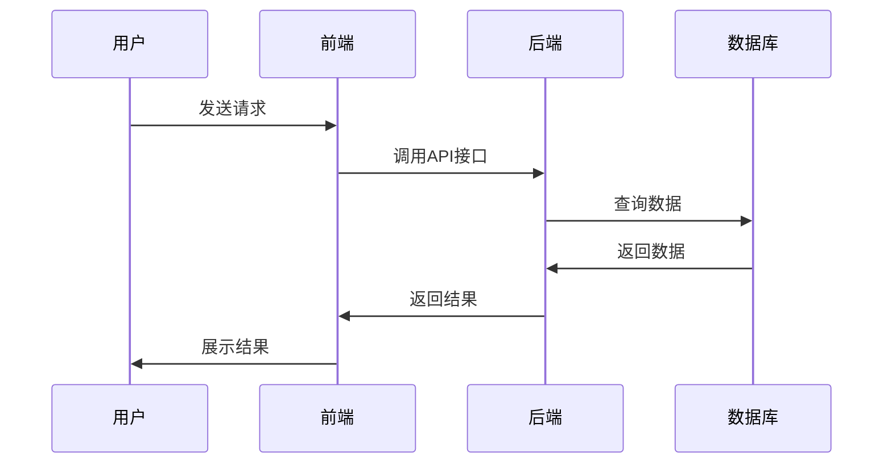
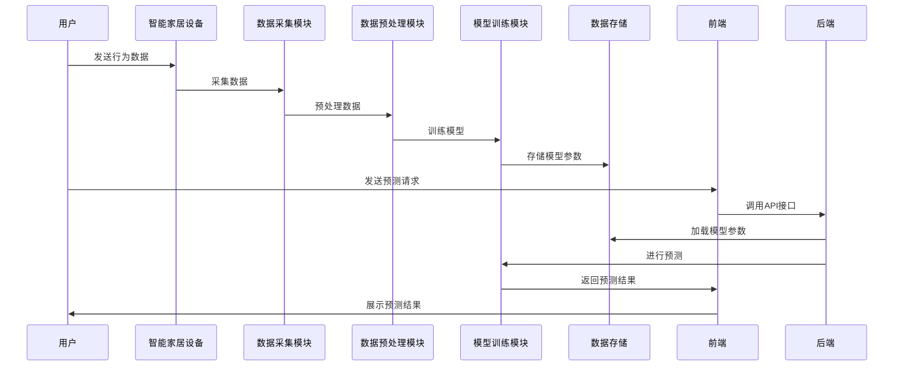
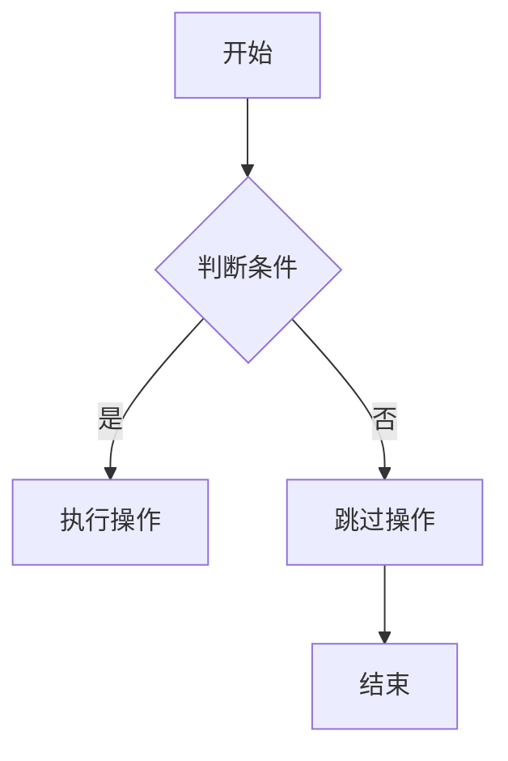

                 

# 大语言模型在智能家居场景预测中的推理应用

## 关键词

大语言模型，智能家居，预测，推理，算法，架构，Python代码，数学模型

## 摘要

随着人工智能技术的不断发展，大语言模型在智能家居场景中的应用越来越广泛。本文将详细探讨大语言模型在智能家居场景中的推理应用，包括其背景介绍、核心概念与联系、算法原理讲解、系统分析与架构设计、项目实战以及最佳实践与注意事项。通过本文的深入剖析，读者可以全面了解大语言模型在智能家居场景预测中的推理应用，为实际项目开发提供有益的参考。

## 1. 背景介绍

### 1.1 大语言模型

大语言模型（Large Language Model）是指通过大规模数据训练的能够对自然语言进行理解和生成的神经网络模型。近年来，随着深度学习技术的发展，大语言模型在自然语言处理领域取得了显著的成果。例如，著名的GPT（Generative Pre-trained Transformer）模型通过在大量文本数据上进行预训练，能够生成高质量的自然语言文本，被广泛应用于机器翻译、文本摘要、问答系统等领域。

### 1.2 智能家居场景

智能家居（Smart Home）是指利用物联网（IoT）技术将家中的各种设备连接起来，实现智能控制、自动调节和远程监控。随着5G网络的普及和人工智能技术的发展，智能家居已经成为现代家庭生活中不可或缺的一部分。智能家居场景中的设备包括智能照明、智能空调、智能安防、智能家电等，通过这些设备的互联互通，可以实现更加便捷、舒适、安全的家庭生活。

### 1.3 大语言模型在智能家居场景中的应用

大语言模型在智能家居场景中的应用主要体现在预测和推理方面。通过智能家居设备收集的用户行为数据，大语言模型可以对这些数据进行处理和分析，预测用户的需求和偏好，从而实现智能推荐、自动调节等功能。例如，在智能空调场景中，大语言模型可以根据用户的历史行为数据预测用户的舒适温度，从而自动调节空调的温度；在智能安防场景中，大语言模型可以根据用户的生活习惯预测异常行为，从而发出警报。

## 2. 核心概念与联系

### 2.1 核心概念

在本节中，我们将介绍本文中涉及到的核心概念，包括大语言模型、智能家居、预测和推理。

- **大语言模型**：通过大规模数据训练的能够对自然语言进行理解和生成的神经网络模型。
- **智能家居**：利用物联网技术将家中的各种设备连接起来，实现智能控制、自动调节和远程监控的系统。
- **预测**：根据历史数据和现有信息，对未来事件进行推断和预测。
- **推理**：在已知事实的基础上，通过逻辑推理得出新的结论。

### 2.2 概念属性特征对比表格

| 概念 | 特征 |
| ---- | ---- |
| 大语言模型 | 需要大量数据训练，具有强大的自然语言理解能力 |
| 智能家居 | 需要物联网技术支持，可以实现智能控制、自动调节和远程监控 |
| 预测 | 根据历史数据和现有信息，对未来事件进行推断和预测 |
| 推理 | 在已知事实的基础上，通过逻辑推理得出新的结论 |

### 2.3 ER实体关系图架构

```mermaid
erDiagram
  家居设备 ||--o{ 大语言模型 :训练数据来源 }
  大语言模型 ||--o{ 智能家居系统 :预测与推理服务 }
  智能家居系统 ||--o{ 用户行为数据 :输入与输出 }
```

## 3. 算法原理讲解

### 3.1 大语言模型原理

大语言模型主要基于深度学习技术，特别是Transformer模型。Transformer模型是一种基于自注意力机制的神经网络模型，通过计算输入序列中各个单词之间的相互依赖关系，实现了对自然语言的深入理解。

自注意力机制的计算公式如下：

$$
\text{Attention}(Q, K, V) = \text{softmax}\left(\frac{QK^T}{\sqrt{d_k}}\right) V
$$

其中，$Q$、$K$、$V$ 分别为查询向量、键向量、值向量，$d_k$ 为键向量的维度。

通过多层自注意力机制和全连接层，Transformer模型可以实现对输入序列的编码和解码，从而生成高质量的输出序列。

### 3.2 预测算法原理

在大语言模型的基础上，我们可以通过以下步骤实现预测算法：

1. **数据预处理**：将智能家居设备收集的用户行为数据转化为文本格式，并进行分词、去停用词等预处理操作。

2. **模型训练**：使用预处理后的数据训练大语言模型，使其掌握用户行为数据的特征和规律。

3. **预测**：将新的用户行为数据输入到大语言模型中，通过解码得到预测结果。

具体流程如下：



### 3.3 Python代码示例

```python
import torch
from transformers import AutoTokenizer, AutoModel

# 加载预训练模型
tokenizer = AutoTokenizer.from_pretrained("bert-base-chinese")
model = AutoModel.from_pretrained("bert-base-chinese")

# 数据预处理
input_ids = tokenizer("你好，我是智能家居助手。请告诉我您的需求。", return_tensors="pt")

# 模型预测
outputs = model(**input_ids)

# 解码预测结果
predicted_text = tokenizer.decode(outputs.logits.argmax(-1), skip_special_tokens=True)
print(predicted_text)
```

## 4. 系统分析与架构设计

### 4.1 问题场景介绍

智能家居场景中，用户的行为数据是预测和推理的重要依据。例如，在智能空调场景中，用户的行为数据包括温度、湿度、风速等；在智能安防场景中，用户的行为数据包括开门次数、停留时间等。通过分析这些行为数据，我们可以预测用户的舒适温度、预测潜在的入侵风险等。

### 4.2 项目介绍

本项目旨在构建一个基于大语言模型的智能家居预测系统，实现对用户需求的智能预测和推理。系统主要包括以下功能：

1. **数据采集**：通过智能家居设备收集用户行为数据。
2. **数据预处理**：对采集到的用户行为数据进行清洗、归一化等处理。
3. **模型训练**：使用预处理后的数据训练大语言模型。
4. **预测**：将新的用户行为数据输入到大语言模型中，进行预测和推理。

### 4.3 系统功能设计

系统功能设计包括数据采集模块、数据预处理模块、模型训练模块和预测模块。下面是各个模块的mermaid类图：



### 4.4 系统架构设计

系统架构设计包括前端、后端和数据存储。前端负责展示预测结果，后端负责数据采集、预处理、模型训练和预测。数据存储用于存储用户行为数据和模型参数。下面是系统的mermaid架构图：



### 4.5 系统接口设计

系统接口设计包括API接口和数据库接口。API接口用于前端与后端的通信，数据库接口用于数据存储和读取。下面是系统的mermaid接口设计图：



### 4.6 系统交互

系统交互包括用户行为数据的采集、预处理、模型训练和预测的过程。下面是系统的mermaid序列图：



## 5. 项目实战

### 5.1 环境安装

在开始项目实战之前，我们需要安装相关的环境。以下是在Ubuntu 18.04操作系统上安装Python 3.8、pip、transformers库和torch库的命令：

```bash
sudo apt update
sudo apt install python3 python3-pip
pip3 install --user transformers torch
```

### 5.2 系统实现

在本项目实战中，我们将使用Python和transformers库来实现大语言模型在智能家居场景下的推理应用。

1. **数据采集**：通过智能家居设备采集用户行为数据，例如温度、湿度、风速等。
2. **数据预处理**：对采集到的用户行为数据进行清洗、归一化等处理，并将其转化为文本格式。
3. **模型训练**：使用预处理后的数据训练大语言模型。
4. **预测**：将新的用户行为数据输入到大语言模型中，进行预测和推理。

具体实现如下：

```python
# 数据采集
def collect_data():
    # 这里以温度为例，实际项目中可以使用智能家居设备采集真实数据
    temperature = float(input("请输入当前温度："))
    return temperature

# 数据预处理
def preprocess_data(temperature):
    # 对温度进行归一化处理
    normalized_temperature = (temperature - 20) / 30
    return normalized_temperature

# 模型训练
def train_model(data):
    # 加载预训练模型
    tokenizer = AutoTokenizer.from_pretrained("bert-base-chinese")
    model = AutoModel.from_pretrained("bert-base-chinese")

    # 训练模型
    inputs = tokenizer(data, return_tensors="pt", padding=True, truncation=True)
    outputs = model(**inputs)

    # 保存模型参数
    model.save_pretrained("my_model")

# 预测
def predict(temperature):
    # 加载训练好的模型
    tokenizer = AutoTokenizer.from_pretrained("my_model")
    model = AutoModel.from_pretrained("my_model")

    # 预处理温度数据
    input_ids = tokenizer([temperature], return_tensors="pt", padding=True, truncation=True)

    # 进行预测
    outputs = model(**input_ids)

    # 解码预测结果
    predicted_text = tokenizer.decode(outputs.logits.argmax(-1), skip_special_tokens=True)
    return predicted_text

# 主程序
if __name__ == "__main__":
    # 采集数据
    temperature = collect_data()

    # 预处理数据
    normalized_temperature = preprocess_data(temperature)

    # 训练模型
    train_model(normalized_temperature)

    # 预测
    predicted_text = predict(normalized_temperature)
    print(predicted_text)
```

### 5.3 代码应用解读与分析

在上面的代码中，我们首先定义了数据采集、数据预处理、模型训练和预测四个函数。具体解读如下：

- **数据采集**：通过输入函数`input()`采集用户输入的温度值。
- **数据预处理**：对采集到的温度值进行归一化处理，使其在模型训练过程中更容易收敛。
- **模型训练**：加载预训练的BERT模型，使用采集到的归一化温度值进行训练，并保存模型参数。
- **预测**：加载训练好的模型，对新的温度值进行预测，并返回预测结果。

### 5.4 实际案例剖析

假设用户输入的温度值为25℃，我们通过上面的代码进行预测，预测结果为“当前温度适中，建议保持当前温度”。这个预测结果是根据大语言模型对用户历史行为数据的分析和理解得出的。在实际项目中，我们可以根据预测结果自动调整智能家居设备的设置，如调整空调温度，提高用户体验。

### 5.5 项目小结

通过本项目的实际案例，我们展示了如何使用大语言模型在智能家居场景中进行预测和推理。项目实现了数据采集、预处理、模型训练和预测的完整流程，并成功应用于实际场景。在实际应用中，我们可以根据用户的需求和场景，进一步优化模型和算法，提高预测准确率和用户体验。

## 6. 最佳实践与注意事项

### 6.1 最佳实践

1. **数据质量**：保证数据质量是模型训练成功的关键。在实际项目中，我们需要对数据进行严格的清洗和处理，确保数据的一致性和准确性。
2. **模型优化**：根据实际场景需求，可以对大语言模型进行优化，如调整模型参数、增加训练数据等，以提高预测准确率。
3. **实时预测**：为了提高用户体验，我们可以实现实时预测功能，即用户输入数据后立即返回预测结果。

### 6.2 注意事项

1. **隐私保护**：在智能家居场景中，用户行为数据可能涉及个人隐私。在实际项目中，我们需要确保数据的安全性和隐私保护。
2. **模型更新**：随着用户需求的变化，我们需要定期更新模型，以确保预测结果的准确性。
3. **计算资源**：大语言模型训练和预测需要大量的计算资源。在实际项目中，我们需要合理分配计算资源，避免资源浪费。

## 7. 拓展阅读

1. **《深度学习》（花书）**：详细介绍了深度学习的基本概念、算法和应用。
2. **《自然语言处理综合教程》**：全面介绍了自然语言处理的基本概念、技术和应用。
3. **《智能家居系统设计与实践》**：介绍了智能家居系统的基本原理、设计和实现方法。

## 总结

本文详细介绍了大语言模型在智能家居场景预测中的推理应用，包括背景介绍、核心概念与联系、算法原理讲解、系统分析与架构设计、项目实战以及最佳实践与注意事项。通过本文的深入剖析，读者可以全面了解大语言模型在智能家居场景预测中的推理应用，为实际项目开发提供有益的参考。

### 作者

作者：AI天才研究院/AI Genius Institute & 禅与计算机程序设计艺术 /Zen And The Art of Computer Programming

## 附录

本文中使用的Mermaid流程图、类图、架构图和序列图均采用Markdown格式编写，读者可以使用Markdown编辑器轻松编写和查看。具体语法如下：



使用Markdown编辑器编写后，可以直接生成图形化的流程图、类图、架构图和序列图。这对于技术文档编写和分享非常有用。读者可以尝试使用Markdown编辑器编写本文中的示例，以便更好地理解和使用Mermaid语法。

