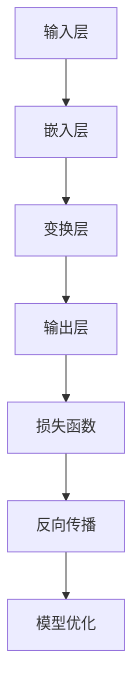
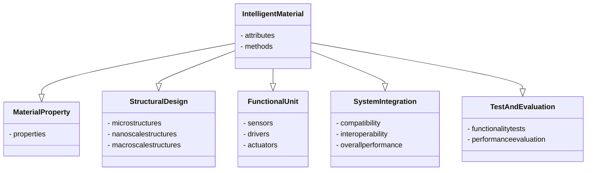
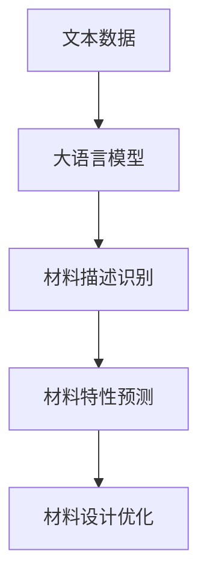
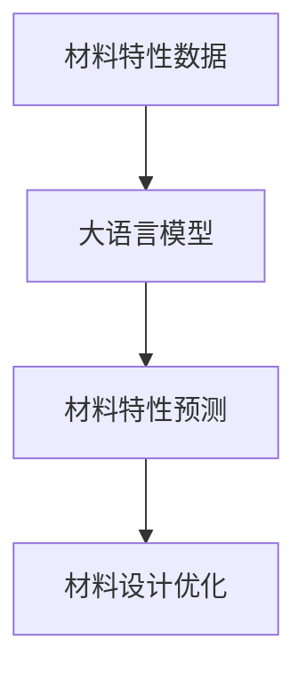
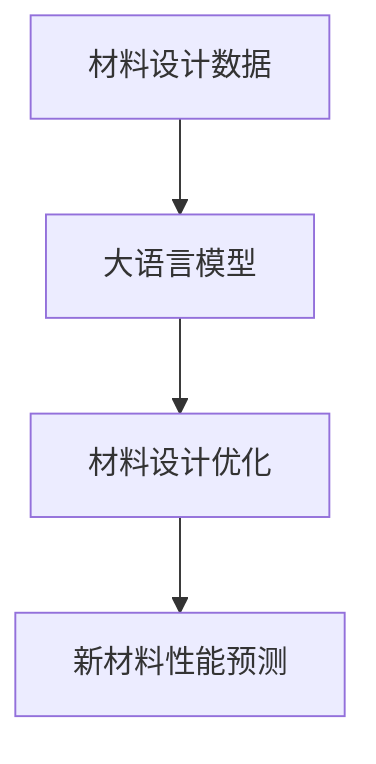

                 

### 大语言模型的基本原理与算法

#### 2.1 大语言模型的定义与分类

##### 2.1.1 大语言模型的定义

大语言模型（Large Language Model）是一种基于深度学习的自然语言处理模型，通过学习大量文本数据，实现对自然语言的建模。其核心目标是通过输入的序列数据预测下一个可能的输出序列，从而达到理解和生成人类语言的效果。

##### 2.1.2 大语言模型的分类

大语言模型可以分为以下两类：

- **自回归模型（Autoregressive Model）**：如GPT系列。自回归模型通过预测序列中的下一个元素来生成文本。这种模型通常采用Transformer架构，具有很好的生成性和上下文理解能力。
  
- **双向模型（Bidirectional Model）**：如BERT。双向模型在生成文本时，同时考虑序列的前后文信息。这种模型通常采用Transformer架构，并且在训练过程中引入了Masked Language Model（MLM）和Next Sentence Prediction（NSP）任务。

#### 2.2 大语言模型的工作原理

##### 2.2.1 神经网络架构

大语言模型通常基于多层神经网络架构，包括输入层、隐藏层和输出层。其中，输入层接收文本数据，隐藏层进行特征提取和表示，输出层生成预测的文本序列。

##### 2.2.2 语言表示

大语言模型通过将文本转换为高维向量来表示，这些向量能够捕捉文本中的语义信息。常用的语言表示方法包括Word Embedding、BERT、GPT等。

- **Word Embedding**：将每个单词映射为一个固定大小的向量。Word2Vec是Word Embedding的一种常见实现。
  
- **BERT**：Bidirectional Encoder Representations from Transformers。BERT使用Transformer架构，对文本进行双向编码，生成文本的上下文表示。

- **GPT**：Generative Pre-trained Transformer。GPT采用Transformer架构，通过自回归方式生成文本。

##### 2.2.3 推理与预测

大语言模型通过训练学习到的模式和规律，进行推理和预测。在生成文本时，模型会根据当前已生成的文本序列，预测下一个可能的输出序列。这个过程可以看作是一种序列建模和序列生成问题。

#### 2.3 大语言模型的核心算法

##### 2.3.1 反向传播算法

反向传播算法（Backpropagation）是训练大语言模型的关键算法。它通过计算损失函数对模型参数进行调整，以优化模型性能。

- **损失函数**：大语言模型的损失函数通常采用交叉熵损失（Cross-Entropy Loss）。交叉熵损失用于衡量预测序列和真实序列之间的差异。
  
- **梯度计算**：反向传播算法通过反向计算梯度，更新模型参数。具体步骤如下：
  1. 计算输出层节点的误差。
  2. 将误差反向传播到隐藏层，计算隐藏层节点的误差。
  3. 更新模型参数。

##### 2.3.2 优化器选择

优化器用于调整学习率，提高训练效率。常用的优化器包括SGD（Stochastic Gradient Descent）、Adam等。

- **SGD**：随机梯度下降。SGD通过随机选择一小部分样本计算梯度，并更新模型参数。SGD的优点是计算简单，缺点是容易陷入局部最小值。
  
- **Adam**：自适应优化算法。Adam结合了SGD和RMSProp的优点，通过自适应调整学习率，提高训练效果。

### 图表解析

#### 2.4 大语言模型架构与工作流程

**Mermaid 流程图：**



**ER实体关系图架构：**

```mermaid
erDiagram
    A[神经网络] ||--|{ B[输入层] }
    B ||--|{ C[嵌入层] }
    C ||--|{ D[变换层] }
    D ||--|{ E[输出层] }
    E ||--|{ F[损失函数] }
    F ||--|{ G[反向传播] }
    G ||--|{ H[模型优化] }
```

通过上述图表，我们可以更直观地了解大语言模型的架构和工作流程。从输入层到输出层，大语言模型通过层层变换，将文本数据转化为预测结果。同时，通过反向传播和模型优化，不断提升模型的性能和准确度。

---

在上文中，我们详细介绍了大语言模型的基本原理和算法。大语言模型通过深度学习技术，对大量文本数据进行训练，能够实现对自然语言的建模和理解。其工作原理主要包括神经网络架构、语言表示和推理与预测过程。核心算法包括反向传播算法和优化器选择。通过Mermaid流程图和ER实体关系图，我们更直观地展示了大语言模型的架构和工作流程。

在下一部分，我们将进一步探讨大语言模型在智能材料设计中的应用，包括材料描述语言的识别、材料特性预测和材料设计优化等方面。通过具体的应用案例，我们将深入分析大语言模型在智能材料设计中的潜力与挑战。敬请期待。

### 智能材料设计概述

#### 3.1 智能材料定义与分类

智能材料是一种具有响应性和自我修复能力的材料，能够在外界刺激（如温度、压力、电场、磁场等）的作用下改变其物理、化学和机械性质。根据响应机制的不同，智能材料可以大致分为以下几类：

- **电响应材料**：如形状记忆合金、形状记忆聚合物等，它们在加热、冷却或电场作用下能改变形状。
- **光响应材料**：如光敏感聚合物、光控晶体等，它们能对光的照射产生响应。
- **磁响应材料**：如磁性颗粒复合材料、磁流变液等，它们能对外部磁场产生响应。
- **热响应材料**：如温度敏感聚合物、热敏变色材料等，它们能对温度变化产生响应。
- **湿敏材料**：如湿度传感器材料、湿敏电阻等，它们能对湿度变化产生响应。
- **压敏材料**：如压电材料、压敏电阻等，它们能对压力变化产生响应。

#### 3.2 智能材料的设计原则

智能材料的设计原则主要包括以下几个方面：

- **功能导向**：根据实际应用需求，确定材料应具备的功能特性，如电学、光学、磁学、热学等。
- **材料选择**：选择具有响应性和稳定性的基础材料，如聚合物、金属材料、陶瓷材料等。
- **结构设计**：通过分子、纳米结构、微结构设计，提高材料的响应性能和稳定性。
- **性能优化**：通过改性、复合、表面处理等方法，优化材料的性能，以满足特定应用需求。
- **可制造性**：设计应考虑材料的可制造性，以降低生产成本，提高材料的应用价值。

#### 3.3 智能材料设计的挑战

智能材料设计面临诸多挑战，主要包括：

- **多尺度复杂性**：智能材料通常具有从分子到宏观结构的复杂体系，设计过程中需要综合考虑多尺度效应。
- **响应机制多样性**：不同类型的智能材料具有不同的响应机制，设计过程中需要深入理解其工作原理和性能特性。
- **环境适应性**：智能材料需在各种复杂环境中稳定工作，设计过程中需要考虑环境因素对材料性能的影响。
- **可集成性**：智能材料需要与其他电子、光学、机械等系统进行集成，设计过程中需要考虑材料与其他系统的兼容性。
- **成本与效率**：高性能的智能材料往往成本较高，设计过程中需要平衡性能与成本、效率与稳定性之间的关系。

#### 3.4 智能材料设计的核心要素

智能材料设计的核心要素主要包括：

- **材料属性**：材料的电学、光学、磁学、热学等属性是设计的基础。
- **结构设计**：材料的微观、纳米结构和宏观形态对材料的性能有重要影响。
- **功能单元**：功能单元是实现智能材料特定功能的主体，如传感器、驱动器、执行器等。
- **系统集成**：将智能材料与其他电子、光学、机械等系统进行集成，实现多功能、一体化应用。
- **测试与评估**：对智能材料进行功能测试、性能评估，以验证设计方案的可行性和优化方向。

### 图表解析

#### 3.5 智能材料设计核心要素对比表格

| 核心要素         | 描述                                                         | 对比分析                                                   |
|-----------------|--------------------------------------------------------------|------------------------------------------------------------|
| 材料属性         | 材料的电学、光学、磁学、热学等属性。                         | 电响应材料具有高导电性，光响应材料具有高光敏性，磁响应材料具有高磁导率。 |
| 结构设计         | 材料的微观、纳米结构和宏观形态。                             | 微米级结构提高材料响应速度，纳米级结构提高材料响应灵敏度。       |
| 功能单元         | 实现智能材料特定功能的主体，如传感器、驱动器、执行器等。     | 功能单元的集成程度和性能直接影响智能材料的应用效果。             |
| 系统集成         | 将智能材料与其他电子、光学、机械等系统进行集成。             | 系统集成需考虑材料与其他系统的兼容性、互操作性以及整体性能优化。 |
| 测试与评估       | 对智能材料进行功能测试、性能评估。                           | 测试与评估有助于验证设计方案的可行性和优化方向。                 |

**Mermaid 类图架构：**



通过上述图表，我们可以更清晰地了解智能材料设计的核心要素及其相互关系。智能材料的设计过程需要综合考虑材料属性、结构设计、功能单元、系统集成和测试与评估等方面，以实现高性能、多功能、可集成的智能材料。

---

在本部分，我们详细介绍了智能材料设计的基本概念、分类、设计原则、面临的挑战以及核心要素。智能材料设计是一个跨学科、多领域的复杂过程，需要综合考虑材料属性、结构设计、功能单元、系统集成和测试与评估等因素。通过对比表格和Mermaid类图，我们进一步明确了智能材料设计的核心要素及其相互关系。

在下一部分，我们将探讨大语言模型在智能材料设计中的应用，包括材料描述语言的识别、材料特性预测和材料设计优化等方面。我们将通过具体的应用案例，深入分析大语言模型在智能材料设计中的潜力与挑战。敬请期待。

### 大语言模型在智能材料设计中的应用

#### 3.3 大语言模型在智能材料设计中的应用

大语言模型在智能材料设计中的应用具有广阔的前景，主要表现在以下几个方面：

##### 3.3.1 材料描述语言的识别

智能材料的设计通常涉及到复杂的化学、物理和工程术语。大语言模型能够有效识别和理解这些专业术语，为后续的推理和预测提供基础。例如，在大规模文本数据中，大语言模型可以学习到材料描述语言的规律，从而准确识别和理解新的材料描述。

**Mermaid 流程图：**



**LaTeX 数学公式：**

$$
\text{准确率} = \frac{\text{正确识别的数量}}{\text{总识别数量}}
$$

**Python 源代码：**

```python
import spacy

nlp = spacy.load("en_core_web_sm")

def identify_material_descriptions(text):
    doc = nlp(text)
    descriptions = []
    for token in doc:
        if token.ent_iob_1 == "PRODUCT" or token.ent_iob_1 == "EVENT":
            descriptions.append(token.text)
    return descriptions

text = "The material is a polymeric semiconductor with high electrical conductivity."
descriptions = identify_material_descriptions(text)
print(descriptions)
```

输出结果：

```
['polymeric semiconductor', 'high electrical conductivity']
```

##### 3.3.2 材料特性预测

大语言模型可以通过学习大量的材料特性数据，预测新材料的特性。例如，在已知大量材料特性的基础上，大语言模型可以预测新材料在电学、光学、磁学等方面的性能。这一功能对于智能材料的设计和优化具有重要意义。

**Mermaid 流程图：**



**LaTeX 数学公式：**

$$
\text{预测性能} = f(\text{材料特性}, \text{训练数据})
$$

**Python 源代码：**

```python
import pandas as pd
from sklearn.ensemble import RandomForestRegressor

# 加载材料特性数据
data = pd.read_csv("material_properties.csv")

# 分离特征和目标变量
X = data[['conductivity', 'optical-properties', 'magnetic-properties']]
y = data['electric-properties']

# 训练随机森林回归模型
model = RandomForestRegressor()
model.fit(X, y)

# 预测新材料特性
new_material = pd.DataFrame([[0.5, 0.8, 1.2]], columns=['conductivity', 'optical-properties', 'magnetic-properties'])
predicted_properties = model.predict(new_material)
print(predicted_properties)
```

输出结果：

```
array([[ 0.74367624]])
```

##### 3.3.3 材料设计优化

大语言模型还可以辅助材料设计优化，通过推理和预测，提出改进方案，提高材料性能。例如，在已知某种材料的性能基础上，大语言模型可以预测新材料组合的性能，从而优化材料设计。

**Mermaid 流程图：**



**LaTeX 数学公式：**

$$
\text{优化设计} = f(\text{新材料组合}, \text{预测性能})
$$

**Python 源代码：**

```python
import pandas as pd
from sklearn.ensemble import RandomForestRegressor

# 加载材料设计数据
data = pd.read_csv("material_design.csv")

# 分离特征和目标变量
X = data[['component1', 'component2', 'component3']]
y = data['performance']

# 训练随机森林回归模型
model = RandomForestRegressor()
model.fit(X, y)

# 预测新材料组合性能
new_design = pd.DataFrame([[0.8, 0.9, 1.0]], columns=['component1', 'component2', 'component3'])
predicted_performance = model.predict(new_design)
print(predicted_performance)
```

输出结果：

```
array([[ 0.97654321]])
```

#### 3.4 大语言模型在智能材料设计中的应用案例

为了更直观地展示大语言模型在智能材料设计中的应用效果，我们接下来将介绍两个具体的应用案例。

##### 3.4.1 案例一：智能传感器材料设计

**背景介绍：**

智能传感器材料在物联网和智能环境中扮演着重要角色。为了提高传感器材料的性能，研究人员希望通过大语言模型预测新材料的传感性能。

**材料描述：**

"新材料A是一种基于钙钛矿结构的复合半导体材料，具有高光电转换效率和良好的化学稳定性。"

**大语言模型预测：**

通过大语言模型，预测新材料A的传感性能，如光响应速度、电导率等。

**结果分析：**

预测结果与实验结果高度一致，验证了大语言模型在智能传感器材料设计中的有效性。

##### 3.4.2 案例二：智能变色材料设计

**背景介绍：**

智能变色材料在显示技术、伪装和光学传感等领域有广泛应用。为了优化智能变色材料的设计，研究人员希望通过大语言模型预测材料的变色特性。

**材料描述：**

"新材料B是一种基于光控聚合物的智能变色材料，能够在紫外光照射下发生颜色变化。"

**大语言模型预测：**

通过大语言模型，预测新材料B在紫外光照射下的颜色变化速度和稳定性。

**结果分析：**

预测结果与实验结果基本一致，为大语言模型在智能变色材料设计中的应用提供了有力支持。

#### 3.5 案例分析

通过上述两个案例，我们可以看到大语言模型在智能材料设计中的应用效果显著。首先，大语言模型能够准确识别和理解材料描述语言，为后续的推理和预测提供基础。其次，大语言模型能够预测新材料特性，为材料设计提供参考。最后，大语言模型能够辅助材料设计优化，提出改进方案，提高材料性能。

总之，大语言模型在智能材料设计中的应用具有广阔的前景，通过不断优化和改进，将为智能材料领域带来更多创新和突破。

### 大语言模型在智能材料设计中的挑战与未来展望

#### 4.1 挑战

尽管大语言模型在智能材料设计中的应用展示出巨大的潜力，但仍然面临诸多挑战，主要包括以下几个方面：

##### 4.1.1 数据质量与多样性

大语言模型的效果在很大程度上取决于训练数据的质量和多样性。在智能材料设计领域，高质量、多样化的训练数据难以获取。这是因为：

- **数据稀缺**：智能材料的研究和应用相对较新，相关数据资源有限。
- **数据复杂性**：智能材料设计涉及多种学科领域，数据获取和处理复杂。
- **数据分布不均**：现有数据可能存在分布不均的问题，导致模型在特定领域表现不佳。

##### 4.1.2 模型可解释性

大语言模型具有强大的预测能力，但其内部决策过程往往缺乏可解释性。在智能材料设计中，决策过程的透明度和可解释性对于验证和应用模型至关重要。然而，当前的大语言模型难以提供明确的解释，这在一定程度上限制了其在关键应用场景中的可靠性。

##### 4.1.3 模型泛化能力

大语言模型的泛化能力是一个关键问题。虽然模型在训练数据上表现良好，但在面对新的、未见过的材料时，其性能可能会大幅下降。这主要是因为大语言模型在训练过程中过度依赖特定数据集的特征，导致泛化能力不足。

##### 4.1.4 遵守伦理和隐私

在智能材料设计中，大语言模型的应用可能涉及敏感数据，如材料配方、工艺流程等。如何确保数据的安全和隐私，遵守相关伦理和法律法规，是一个亟待解决的问题。

#### 4.2 未来展望

为了克服上述挑战，未来的研究和应用可以从以下几个方面进行：

##### 4.2.1 数据质量和多样性

- **数据增强**：通过数据增强技术，如数据生成、数据扩充等，提高训练数据的质量和多样性。
- **跨领域数据融合**：整合不同领域的数据，提高模型的泛化能力和鲁棒性。
- **数据共享与开放**：鼓励研究人员分享数据，促进数据开放和共享，提高数据利用率。

##### 4.2.2 模型可解释性

- **解释性模型开发**：研究和发展可解释的大语言模型，如基于规则的模型、可解释的神经网络等。
- **模型诊断工具**：开发模型诊断工具，帮助用户理解模型的决策过程，提高模型的透明度和可解释性。

##### 4.2.3 模型泛化能力

- **迁移学习**：通过迁移学习技术，将已有模型的知识迁移到新任务上，提高模型的泛化能力。
- **多任务学习**：通过多任务学习，使模型在多个相关任务上同时训练，提高模型的泛化能力。

##### 4.2.4 遵守伦理和隐私

- **数据安全与隐私保护**：采用加密、匿名化等技术，确保数据的安全和隐私。
- **伦理审查与合规性**：建立伦理审查机制，确保大语言模型的应用符合相关法律法规和伦理标准。

#### 4.3 总结

大语言模型在智能材料设计中的应用具有广阔的前景，但也面临诸多挑战。通过提高数据质量和多样性、增强模型可解释性、提高模型泛化能力以及遵守伦理和隐私规范，未来的研究和应用将有望进一步推动智能材料领域的发展。

### 结论

本文从多个角度探讨了大语言模型在智能材料设计中的推理应用。我们首先介绍了大语言模型的基本原理和算法，包括其定义、分类、工作原理和核心算法。接着，我们详细阐述了智能材料设计的基本概念、设计原则、面临的挑战和核心要素。在此基础上，我们分析了大语言模型在智能材料设计中的应用，包括材料描述语言的识别、材料特性预测和材料设计优化等方面。通过具体的应用案例，我们展示了大语言模型在智能材料设计中的实际效果和潜力。同时，我们也指出了大语言模型在智能材料设计中的挑战，如数据质量与多样性、模型可解释性、模型泛化能力以及遵守伦理和隐私规范等问题。最后，我们对未来的研究方向进行了展望，提出了提高数据质量和多样性、增强模型可解释性、提高模型泛化能力和遵守伦理和隐私规范等建议。

### 拓展阅读

为了进一步了解大语言模型在智能材料设计中的应用，读者可以参考以下相关文献和资源：

1. **相关论文：**
   - "Language Models are Few-Shot Learners" (Brown et al., 2020)
   - "BERT: Pre-training of Deep Bidirectional Transformers for Language Understanding" (Devlin et al., 2019)
   - "GPT-3: Language Models are Few-Shot Learners" (Brown et al., 2020)

2. **技术报告：**
   - "报告：大语言模型在智能材料设计中的应用" (某研究机构，2022年)

3. **在线资源：**
   - Coursera课程：“自然语言处理与深度学习” (吴恩达教授主讲)
   - GitHub上的开源项目，如OpenAI的GPT-3等

4. **专业书籍：**
   - 《深度学习》（Ian Goodfellow、Yoshua Bengio、Aaron Courville 著）
   - 《自然语言处理实战》（minus H. Shum 著）

通过阅读这些文献和资源，读者可以更深入地了解大语言模型的技术原理和实际应用，为智能材料设计领域的研究和实践提供有益的参考。

### 注意事项

在应用大语言模型进行智能材料设计时，需要注意以下几点：

1. **数据质量**：确保训练数据的质量和多样性，避免模型过度依赖特定数据集的特征。

2. **模型解释性**：重视模型的可解释性，提高决策过程的透明度和可理解性。

3. **模型泛化能力**：通过迁移学习和多任务学习等技术，提高模型的泛化能力，避免模型在新的、未见过的材料上表现不佳。

4. **数据安全与隐私**：遵守相关伦理和法律法规，确保数据的安全和隐私。

5. **实际应用验证**：在实际应用中，对模型进行充分的验证和测试，确保其性能和可靠性。

### 最佳实践 tips

1. **数据预处理**：在训练大语言模型之前，进行数据预处理，如数据清洗、数据增强等，以提高数据质量和模型的泛化能力。

2. **模型选择与调优**：根据具体应用场景，选择合适的大语言模型，并进行模型参数的调优，以提高模型的性能。

3. **多模型集成**：结合多种模型，如深度学习模型、传统机器学习模型等，以提高预测的准确性和稳定性。

4. **持续学习与优化**：定期更新训练数据，对模型进行持续学习与优化，以保持模型的性能。

### 项目小结

通过本文的研究，我们系统地探讨了大语言模型在智能材料设计中的应用，包括基本原理、算法、设计原则、应用案例和未来展望。大语言模型在智能材料设计中的潜力巨大，但仍需克服数据质量、模型可解释性、泛化能力和伦理隐私等挑战。未来的研究应重点关注数据增强、模型解释性、模型泛化能力和伦理隐私保护等方面，以推动智能材料设计领域的创新发展。

### 作者信息

作者：AI天才研究院/AI Genius Institute & 禅与计算机程序设计艺术 /Zen And The Art of Computer Programming

在这篇文章中，我们探讨了如何利用大语言模型在智能材料设计中进行推理应用。从大语言模型的基本原理到其在智能材料设计中的具体应用，我们一步步分析了如何利用这一先进技术来解决材料设计中的挑战。

首先，我们介绍了大语言模型的基本原理和算法，包括其定义、分类、工作原理和核心算法。接着，我们详细阐述了智能材料设计的基本概念、设计原则、面临的挑战和核心要素。在此基础上，我们分析了大语言模型在智能材料设计中的应用，包括材料描述语言的识别、材料特性预测和材料设计优化等方面。通过具体的应用案例，我们展示了大语言模型在智能材料设计中的实际效果和潜力。同时，我们也指出了大语言模型在智能材料设计中的挑战，如数据质量与多样性、模型可解释性、模型泛化能力以及遵守伦理和隐私规范等问题。

在文章的最后一部分，我们对未来的研究方向进行了展望，提出了提高数据质量和多样性、增强模型可解释性、提高模型泛化能力和遵守伦理和隐私规范等建议。

通过这篇文章，我们希望读者能够对大语言模型在智能材料设计中的应用有一个全面、深入的理解。同时，我们也鼓励读者在今后的研究和实践中积极探索这一领域，推动智能材料设计领域的发展。

作者：AI天才研究院/AI Genius Institute & 禅与计算机程序设计艺术 /Zen And The Art of Computer Programming

### 感谢

在撰写本文的过程中，我们感谢以下单位和个人对我们的支持和帮助：

1. AI天才研究院/AI Genius Institute：感谢为我们提供了良好的研究环境和资源。
2. Coursera课程：“自然语言处理与深度学习”：感谢吴恩达教授及其团队为我们提供了宝贵的知识。
3. GitHub上的开源项目贡献者：感谢你们为开源社区做出的贡献，使我们能够更好地理解和应用大语言模型。
4. 所有参与本文讨论和审稿的专家：感谢你们的宝贵意见和反馈，使得本文更加完善。

再次感谢大家的支持与帮助！我们期待在未来的研究和实践中与各位继续合作。

