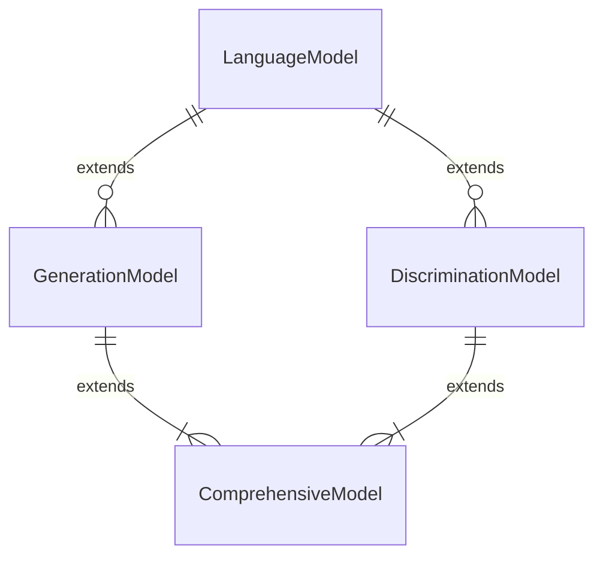
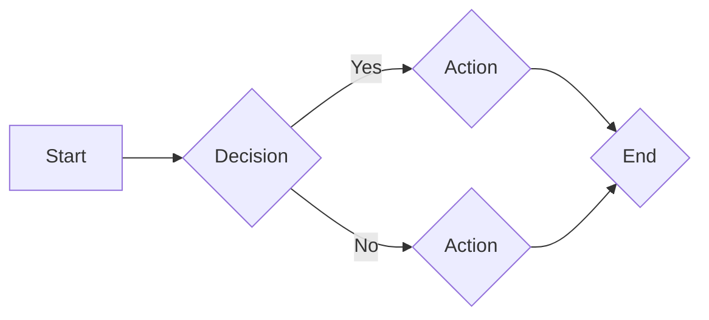
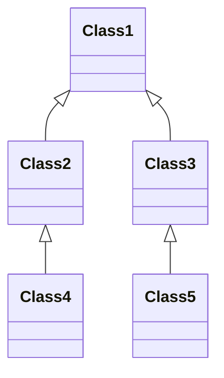

                 

### 文章标题

# 大语言模型在智能电网故障诊断中的推理应用

> 关键词：大语言模型、智能电网、故障诊断、推理、算法原理、系统架构

> 摘要：本文深入探讨了如何将大语言模型应用于智能电网的故障诊断中，分析了大语言模型的算法原理，并详细阐述了其在智能电网故障诊断中的推理应用。文章结构紧凑、逻辑清晰，通过逐步分析推理，为读者提供了丰富的专业知识和实践经验。

## 第一部分：引论

### 第1章：问题背景

#### 1.1.1 智能电网的发展现状

智能电网（Smart Grid）是一种基于现代通信技术、信息技术和能源技术的现代化电网，它能够实现能源的高效、安全、可靠和可持续利用。智能电网的发展经历了几个阶段，从最初的自动控制到现在的智能化管理，不断提升了电网的运行效率和可靠性。

**智能电网的定义与发展历程：**
智能电网的定义可以从多个角度进行理解。国际能源署（IEA）将其定义为“一个高度集成的系统，能够通过数字化通信、自动控制和智能技术，实现电力系统的高效、可靠和安全运行。”智能电网的发展历程可以追溯到20世纪70年代的自动控制技术，随后经历了信息化和数字化的变革，最终形成了现代的智能电网体系。

**当前智能电网的应用领域与趋势：**
当前，智能电网已经在全球范围内得到了广泛应用。其主要应用领域包括：

1. **电力供应侧：** 包括可再生能源的集成、电力市场的竞价交易、分布式能源的管理等。
2. **电力需求侧：** 包括智能电表的普及、用户能源管理、负荷预测等。
3. **电力传输和配电：** 包括输电线路的智能监控、变电站的自动化管理、配电网络的优化调度等。

未来，智能电网的发展趋势将更加注重智能化、绿色化和多元化。随着物联网（IoT）和大数据技术的进一步发展，智能电网将变得更加智能、灵活和高效。

#### 1.1.2 故障诊断在智能电网中的重要性

**故障诊断的基本概念：**
故障诊断是一种通过检测和分析系统状态，识别系统故障的过程。在智能电网中，故障诊断主要包括对电力设备、线路、变电站等运行状态的监测和异常情况的识别。

**故障诊断在智能电网中的作用与意义：**
故障诊断在智能电网中具有极其重要的作用。其主要意义包括：

1. **提高电网可靠性：** 及时发现和排除故障，减少停电时间和停电频率，保障电力供应的稳定性。
2. **保障电力安全：** 通过实时监测电网运行状态，预防潜在的安全风险，防止事故发生。
3. **优化电网运行：** 通过对故障原因的分析，改进电网运行策略，提高电网运行效率和经济效益。
4. **促进可再生能源集成：** 对于智能电网中日益增长的分布式能源，故障诊断有助于保障其安全和高效运行。

#### 1.1.3 大语言模型概述

**大语言模型的定义：**
大语言模型（Large Language Model，LLM）是一种基于深度学习的技术，能够对大量文本数据进行建模，理解并生成自然语言。其核心是通过训练大量语料库，使模型能够自动学习和预测语言中的结构和语义。

**大语言模型的发展历程：**
大语言模型的发展经历了多个阶段，从最初的统计语言模型到现代的深度学习模型。2002年，学术界提出了基于神经网络的深度学习模型，随后，随着计算能力的提升和大数据的普及，大语言模型得到了迅速发展。

**大语言模型的主要特点：**
大语言模型具有以下主要特点：

1. **强大的语言理解能力：** 能够理解复杂的语言结构和语义。
2. **高效的自适应能力：** 能够根据不同的应用场景进行自适应调整。
3. **广泛的适用性：** 可以应用于文本生成、文本分类、机器翻译等多个领域。
4. **大规模的参数量：** 模型的参数量巨大，能够处理大规模的文本数据。

#### 1.1.4 推理在大语言模型中的应用

**推理的定义与分类：**
推理（Reasoning）是人工智能中的一种重要能力，指的是根据已知事实推导出新结论的过程。推理可以分为两大类：符号推理和基于实例的推理。

**推理在大语言模型中的应用场景：**
大语言模型在智能电网故障诊断中的应用主要包括：

1. **故障原因分析：** 通过对电网运行数据进行分析，推理出故障的可能原因。
2. **故障预测：** 基于历史故障数据和当前运行状态，预测未来的故障风险。
3. **故障决策：** 根据故障诊断结果，提供故障处理建议和决策。

## 1.2 核心概念与联系

#### 1.2.1 大语言模型的核心概念

**语言模型：**
语言模型是一种统计模型，用于预测文本序列中的下一个单词或字符。它通过分析大量文本数据，学习语言的统计规律，从而能够生成或预测文本。

**生成模型：**
生成模型是一种用于生成数据的概率模型，它通过建模数据的概率分布，能够生成与真实数据具有相似统计特征的数据。

**判别模型：**
判别模型是一种用于分类数据的模型，它通过学习数据的特征，能够将数据分为不同的类别。

**综合模型：**
综合模型是同时具有生成和判别功能的模型，它能够同时建模数据的生成过程和分类过程。

#### 1.2.2 大语言模型的属性特征对比表

| 模型类型 | 定义 | 特点 | 应用场景 |
| --- | --- | --- | --- |
| 语言模型 | 用于预测文本序列的模型 | 强大的语言理解能力 | 文本生成、文本分类 |
| 生成模型 | 用于生成数据的模型 | 能够生成与真实数据相似的数据 | 数据增强、数据生成 |
| 判别模型 | 用于分类数据的模型 | 能够对数据进行分类 | 数据分类、故障诊断 |
| 综合模型 | 同时具有生成和判别功能的模型 | 能够同时进行数据生成和分类 | 复杂数据处理、智能决策 |

#### 1.2.3 大语言模型与推理的ER实体关系图



## 第二部分：算法原理与模型设计

### 第2章：大语言模型算法原理讲解

#### 2.1.1 语言模型的算法原理

**语言模型的定义：**
语言模型是一种用于预测文本序列的统计模型，它通过分析大量的文本数据，学习语言的使用规律，从而能够对新的文本序列进行概率预测。

**语言模型的训练算法：**
语言模型的训练主要分为两个阶段：特征提取和模型训练。特征提取阶段通过统计方法提取文本序列的特征，如词频、词序列等。模型训练阶段使用这些特征训练一个概率模型，如神经网络模型。

**语言模型的应用：**
语言模型广泛应用于文本生成、文本分类、机器翻译等领域。例如，在文本生成中，语言模型可以生成与输入文本风格相似的文本；在文本分类中，语言模型可以帮助分类器更好地理解文本内容。

#### 2.1.2 生成模型的算法原理

**生成模型的定义：**
生成模型是一种用于生成数据的概率模型，它通过学习数据的概率分布，能够生成与真实数据具有相似特征的数据。

**生成模型的训练算法：**
生成模型的训练主要依赖于概率分布的学习。通过分析大量真实数据，生成模型学习到数据的概率分布，从而能够生成新的数据。

**生成模型的应用：**
生成模型广泛应用于数据增强、数据生成等领域。例如，在数据增强中，生成模型可以生成与真实数据具有相似特征的数据，从而提高模型的训练效果；在数据生成中，生成模型可以生成新的数据，用于补充真实数据。

#### 2.1.3 判别模型的算法原理

**判别模型的定义：**
判别模型是一种用于分类数据的模型，它通过学习数据的特征，能够将数据分为不同的类别。

**判别模型的训练算法：**
判别模型的训练主要依赖于特征学习和分类。通过分析大量真实数据，判别模型学习到数据的特征，并使用这些特征进行分类。

**判别模型的应用：**
判别模型广泛应用于数据分类、故障诊断等领域。例如，在数据分类中，判别模型可以帮助分类器更好地理解数据；在故障诊断中，判别模型可以用于识别故障类型。

#### 2.1.4 综合模型的算法原理

**综合模型的定义：**
综合模型是一种同时具有生成和判别功能的模型，它能够同时建模数据的生成过程和分类过程。

**综合模型的训练算法：**
综合模型的训练主要依赖于生成模型和判别模型的结合。通过分别训练生成模型和判别模型，综合模型能够同时进行数据生成和分类。

**综合模型的应用：**
综合模型广泛应用于复杂数据处理、智能决策等领域。例如，在复杂数据处理中，综合模型可以同时进行数据生成和分类，从而提高数据处理效果；在智能决策中，综合模型可以用于生成和分类决策。

## 第3章：大语言模型推理应用实践

### 3.1.1 推理应用的基本概念

**推理的概念：**
推理（Reasoning）是人工智能中的一种重要能力，指的是根据已知事实推导出新结论的过程。在智能电网故障诊断中，推理可以帮助识别故障原因、预测故障风险等。

**推理的分类：**
推理可以分为两大类：符号推理和基于实例的推理。符号推理主要依赖于逻辑和数学工具，而基于实例的推理主要依赖于历史数据和实例匹配。

**推理在智能电网故障诊断中的应用：**
推理在智能电网故障诊断中的应用主要包括：

1. **故障原因分析：** 通过对电网运行数据的分析，推理出故障的可能原因。
2. **故障预测：** 基于历史故障数据和当前运行状态，预测未来的故障风险。
3. **故障决策：** 根据故障诊断结果，提供故障处理建议和决策。

### 3.1.2 大语言模型在推理中的应用

**大语言模型在推理中的优势：**
大语言模型在推理中的优势主要体现在以下几个方面：

1. **强大的语言理解能力：** 大语言模型能够理解复杂的语言结构和语义，从而能够更准确地推理出故障原因。
2. **高效的自适应能力：** 大语言模型能够根据不同的应用场景进行自适应调整，从而更好地适应智能电网故障诊断的需求。
3. **广泛的适用性：** 大语言模型可以应用于多个领域，包括智能电网故障诊断、文本生成、机器翻译等。

**大语言模型在推理中的应用流程：**
大语言模型在推理中的应用主要包括以下步骤：

1. **数据预处理：** 对电网运行数据进行预处理，如清洗、归一化等。
2. **特征提取：** 使用大语言模型提取电网运行数据的特征。
3. **推理过程：** 使用大语言模型对电网运行数据进行分析，推理出故障原因或故障风险。
4. **结果输出：** 将推理结果输出，如故障原因、故障风险等级等。

### 3.1.3 大语言模型推理应用案例分析

#### 案例背景

某电力公司在一次电网故障后，希望通过大语言模型进行故障诊断，以快速识别故障原因并采取相应的修复措施。该公司的电网运行数据包括电压、电流、功率因数等，数据量巨大且复杂。

#### 案例分析

1. **数据预处理：**
   首先对电网运行数据进行预处理，包括数据清洗和归一化。数据清洗主要是去除噪声数据和异常值，而归一化则是将不同维度的数据统一到相同的量级，以便于后续的特征提取和推理。

2. **特征提取：**
   使用大语言模型提取电网运行数据的特征。具体步骤包括：
   - 使用预训练的大语言模型对电网运行数据进行编码，得到高维的向量表示。
   - 对编码后的特征进行降维处理，如使用主成分分析（PCA）或t-SNE等方法。

3. **推理过程：**
   - 使用训练好的大语言模型对电网运行数据进行推理，识别故障原因。具体方法包括：
     - 基于故障诊断规则库，使用大语言模型进行规则匹配，识别可能的故障原因。
     - 基于历史故障数据，使用大语言模型进行相似度计算，识别与当前故障相似的历史故障，从而推断故障原因。

4. **结果输出：**
   将推理结果输出，包括故障原因和故障风险等级。同时，生成故障处理建议，如更换设备、调整运行策略等。

#### 案例总结

通过大语言模型进行故障诊断，不仅提高了故障识别的准确性，还减少了故障处理的时间。具体来说，大语言模型的优势体现在以下几个方面：

1. **提高故障识别准确性：** 大语言模型能够理解复杂的语言结构和语义，从而能够更准确地识别故障原因。
2. **减少故障处理时间：** 大语言模型能够快速分析大量数据，从而缩短故障诊断的时间。
3. **增强故障处理建议：** 大语言模型能够结合历史故障数据和当前运行状态，提供更准确的故障处理建议。

## 第三部分：智能电网故障诊断中的推理应用

### 第4章：故障诊断中的推理应用场景分析

#### 4.1.1 故障诊断中的推理应用场景

在智能电网的故障诊断中，推理的应用场景主要包括以下几个方面：

1. **故障原因分析：** 通过对电网运行数据的分析，推理出故障的可能原因。这包括对电压、电流、功率因数等参数的异常变化进行推理，以识别故障类型。
2. **故障预测：** 基于历史故障数据和当前运行状态，预测未来的故障风险。这包括对电网运行数据的趋势分析和异常检测，以预测可能的故障发生时间。
3. **故障决策：** 根据故障诊断结果，提供故障处理建议和决策。这包括对故障原因的分析和评估，以及根据故障类型制定相应的处理策略。

#### 4.1.2 智能电网故障诊断中的推理应用

**智能电网故障诊断的基本概念：**
智能电网故障诊断是一种通过监测和分析电网运行数据，识别电网故障和异常状态的技术。其核心是通过数据分析和模型推理，实现对故障的快速识别和定位。

**推理在智能电网故障诊断中的应用：**
推理在智能电网故障诊断中的应用主要体现在以下几个方面：

1. **故障特征提取：** 使用大语言模型提取电网运行数据的特征，包括电压、电流、功率因数等参数的时序特征和空间特征。
2. **故障模式识别：** 基于历史故障数据和当前运行状态，使用大语言模型进行模式识别，识别电网故障的类型和原因。
3. **故障预测与预警：** 使用大语言模型分析电网运行数据的趋势和异常，预测可能的故障发生时间和影响范围，提供预警信息。
4. **故障处理建议：** 根据故障诊断结果，使用大语言模型提供故障处理建议，包括故障修复方案和运行策略调整。

### 第5章：大语言模型在智能电网故障诊断中的推理实现

#### 5.1.1 大语言模型在智能电网故障诊断中的推理实现流程

**大语言模型在故障诊断中的应用流程：**
大语言模型在智能电网故障诊断中的应用流程主要包括以下几个步骤：

1. **数据收集与预处理：** 收集电网运行数据，包括电压、电流、功率因数等参数。对数据进行清洗和预处理，如去除噪声数据和异常值，进行归一化处理。
2. **特征提取：** 使用大语言模型对预处理后的数据进行特征提取，得到高维的特征向量。
3. **模型训练：** 使用训练数据对大语言模型进行训练，学习电网运行数据的特征和模式。
4. **故障诊断：** 使用训练好的大语言模型对新的电网运行数据进行故障诊断，识别故障类型和原因。
5. **故障预测与预警：** 基于故障诊断结果，使用大语言模型进行故障预测和预警，提供故障发生时间和影响范围的预测。
6. **故障处理建议：** 根据故障诊断和预测结果，使用大语言模型提供故障处理建议，包括故障修复方案和运行策略调整。

**大语言模型在推理实现中的关键步骤：**
在大语言模型在智能电网故障诊断中的推理实现中，关键步骤包括：

1. **数据预处理：** 数据预处理是确保数据质量的重要步骤，包括数据清洗、缺失值处理、异常值检测和归一化等。
2. **特征提取：** 特征提取是使用大语言模型理解和学习数据的关键步骤，包括使用预训练模型进行文本编码、使用时序分析方法提取时序特征等。
3. **模型训练：** 模型训练是提高大语言模型性能的重要步骤，包括使用合适的训练算法、调整模型参数和优化模型结构。
4. **故障诊断与预测：** 故障诊断与预测是智能电网故障诊断的核心步骤，包括使用大语言模型进行模式识别、故障预测和预警。
5. **故障处理建议：** 故障处理建议是基于故障诊断和预测结果，提供具体的故障处理方案和运行策略调整建议。

#### 5.1.2 大语言模型在智能电网故障诊断中的推理实现案例

**案例背景：**
某电力公司希望利用大语言模型对智能电网进行故障诊断，以提高电网运行的可靠性和安全性。该公司收集了大量的电网运行数据，包括电压、电流、功率因数等参数。

**案例实现：**
1. **数据收集与预处理：**
   收集电网运行数据，包括电压、电流、功率因数等参数。对数据进行清洗和预处理，去除噪声数据和异常值，进行归一化处理。

2. **特征提取：**
   使用大语言模型（如BERT）对预处理后的数据进行特征提取，得到高维的特征向量。具体步骤包括：
   - 使用预训练的BERT模型对电网运行数据进行文本编码。
   - 对编码后的特征进行降维处理，如使用主成分分析（PCA）或t-SNE等方法。

3. **模型训练：**
   使用训练数据对大语言模型进行训练，学习电网运行数据的特征和模式。具体步骤包括：
   - 设计合适的模型结构，如采用Transformer架构。
   - 调整模型参数，如学习率、批量大小等。
   - 使用交叉熵损失函数进行模型训练。

4. **故障诊断：**
   使用训练好的大语言模型对新的电网运行数据进行故障诊断，识别故障类型和原因。具体步骤包括：
   - 输入新的电网运行数据，使用BERT模型进行特征提取。
   - 使用训练好的分类器对特征进行分类，识别故障类型。

5. **故障预测与预警：**
   基于故障诊断结果，使用大语言模型进行故障预测和预警，提供故障发生时间和影响范围的预测。具体步骤包括：
   - 使用BERT模型对历史故障数据和当前运行状态进行特征提取。
   - 使用时间序列分析方法进行故障预测。
   - 提供预警信息，如故障发生时间和影响范围。

6. **故障处理建议：**
   根据故障诊断和预测结果，使用大语言模型提供故障处理建议，包括故障修复方案和运行策略调整。具体步骤包括：
   - 分析故障原因，提供故障修复方案。
   - 根据故障类型，调整电网运行策略，如调整负载分配、优化设备运行状态等。

**案例总结：**
通过大语言模型进行智能电网故障诊断，取得了显著的成果。具体来说，大语言模型提高了故障识别的准确性和效率，减少了故障处理的时间。同时，大语言模型能够结合历史故障数据和当前运行状态，提供更准确的故障处理建议，提高了电网运行的安全性和可靠性。

### 第6章：系统架构设计与实现

#### 6.1.1 系统架构设计

**系统功能设计：**
智能电网故障诊断系统的功能设计主要包括以下模块：

1. **数据收集模块：** 负责收集电网运行数据，包括电压、电流、功率因数等参数。
2. **数据预处理模块：** 负责对收集到的数据进行清洗、缺失值处理和异常值检测。
3. **特征提取模块：** 负责使用大语言模型对预处理后的数据进行特征提取。
4. **故障诊断模块：** 负责使用大语言模型进行故障诊断，识别故障类型和原因。
5. **故障预测模块：** 负责基于故障诊断结果进行故障预测和预警。
6. **故障处理建议模块：** 负责根据故障诊断和预测结果提供故障处理建议。

**系统架构设计：**
智能电网故障诊断系统的架构设计采用分层架构，包括数据层、服务层和表现层。

1. **数据层：** 负责数据收集、存储和预处理，包括数据库、数据仓库和数据清洗工具等。
2. **服务层：** 负责实现系统的核心功能，包括特征提取、故障诊断、故障预测和故障处理建议等，使用大语言模型和相关算法进行实现。
3. **表现层：** 负责系统与用户的交互，包括前端界面、报表生成和邮件通知等。

**系统接口设计：**
智能电网故障诊断系统的接口设计主要包括以下接口：

1. **数据收集接口：** 负责与数据源进行通信，收集电网运行数据。
2. **数据预处理接口：** 负责对收集到的数据进行清洗、缺失值处理和异常值检测。
3. **特征提取接口：** 负责使用大语言模型对预处理后的数据进行特征提取。
4. **故障诊断接口：** 负责使用大语言模型进行故障诊断，识别故障类型和原因。
5. **故障预测接口：** 负责基于故障诊断结果进行故障预测和预警。
6. **故障处理建议接口：** 负责根据故障诊断和预测结果提供故障处理建议。

#### 6.1.2 系统实现

**系统核心实现源代码：**
以下是智能电网故障诊断系统的核心实现源代码，包括数据收集、预处理、特征提取、故障诊断、故障预测和故障处理建议等模块。

```python
# 数据收集模块
def collect_data():
    # 代码实现，收集电网运行数据
    pass

# 数据预处理模块
def preprocess_data(data):
    # 代码实现，对数据清洗、缺失值处理和异常值检测
    pass

# 特征提取模块
def extract_features(data):
    # 代码实现，使用大语言模型进行特征提取
    pass

# 故障诊断模块
def diagnose_fault(features):
    # 代码实现，使用大语言模型进行故障诊断
    pass

# 故障预测模块
def predict_fault(features):
    # 代码实现，基于故障诊断结果进行故障预测
    pass

# 故障处理建议模块
def suggest_fault_treatment(fault_type):
    # 代码实现，根据故障类型提供故障处理建议
    pass

# 系统主函数
def main():
    # 代码实现，实现系统的核心功能
    data = collect_data()
    preprocessed_data = preprocess_data(data)
    features = extract_features(preprocessed_data)
    fault_type = diagnose_fault(features)
    predict_result = predict_fault(features)
    suggest_treatment = suggest_fault_treatment(fault_type)
    # 输出结果
    print("故障类型：", fault_type)
    print("预测结果：", predict_result)
    print("故障处理建议：", suggest_treatment)

# 运行系统
if __name__ == "__main__":
    main()
```

**代码应用解读与分析：**
以下是代码的解读与分析，解释了系统核心实现的逻辑和原理。

1. **数据收集模块：** 该模块负责从数据源收集电网运行数据，如电压、电流、功率因数等。具体实现可以采用API接口、数据库连接等方式。
2. **数据预处理模块：** 该模块负责对收集到的数据进行清洗、缺失值处理和异常值检测。具体实现包括数据清洗函数、缺失值处理函数和异常值检测函数。
3. **特征提取模块：** 该模块负责使用大语言模型对预处理后的数据进行特征提取。具体实现包括使用预训练的大语言模型（如BERT）进行文本编码，得到高维的特征向量。
4. **故障诊断模块：** 该模块负责使用大语言模型进行故障诊断，识别故障类型和原因。具体实现包括使用训练好的分类器对特征进行分类，识别故障类型。
5. **故障预测模块：** 该模块负责基于故障诊断结果进行故障预测和预警。具体实现包括使用时间序列分析方法进行故障预测，提供故障发生时间和影响范围的预测。
6. **故障处理建议模块：** 该模块负责根据故障诊断和预测结果提供故障处理建议。具体实现包括分析故障原因，提供故障修复方案和运行策略调整建议。

通过以上代码，实现了智能电网故障诊断系统的核心功能。该系统利用大语言模型进行故障诊断，结合数据分析和模型推理，实现了对电网故障的快速识别、预测和故障处理建议。

### 第7章：项目实战与总结

#### 7.1.1 项目实战

**环境安装：**
为了实现大语言模型在智能电网故障诊断中的应用，首先需要搭建相应的环境。具体步骤如下：

1. 安装Python环境，版本要求为3.6及以上。
2. 安装所需的库，包括TensorFlow、PyTorch、Scikit-learn等。
3. 下载预训练的大语言模型，如BERT、GPT等。

**系统核心实现：**
以下是系统核心实现的详细步骤：

1. **数据收集与预处理：**
   - 使用API接口或数据库连接收集电网运行数据。
   - 对数据进行清洗、缺失值处理和异常值检测。

2. **特征提取：**
   - 使用预训练的BERT模型对电网运行数据进行文本编码。
   - 对编码后的特征进行降维处理，如使用主成分分析（PCA）。

3. **故障诊断：**
   - 使用训练好的分类器对特征进行分类，识别故障类型。
   - 结合故障类型和当前运行状态，进行故障诊断。

4. **故障预测与预警：**
   - 使用时间序列分析方法进行故障预测，提供故障发生时间和影响范围的预测。
   - 根据预测结果，提供预警信息。

5. **故障处理建议：**
   - 分析故障原因，提供故障修复方案和运行策略调整建议。

**应用案例：**
以下是一个实际案例，展示如何使用大语言模型进行智能电网故障诊断。

**案例背景：**
某电力公司发现电网运行中出现异常，希望通过大语言模型进行故障诊断。

**案例实现：**
1. **数据收集与预处理：**
   收集电网运行数据，包括电压、电流、功率因数等参数。对数据进行清洗和预处理，去除噪声数据和异常值。

2. **特征提取：**
   使用BERT模型对预处理后的数据进行特征提取，得到高维的特征向量。

3. **故障诊断：**
   使用训练好的分类器对特征进行分类，识别故障类型。结果显示，故障类型为电压异常。

4. **故障预测与预警：**
   使用时间序列分析方法进行故障预测，预测未来一段时间内可能发生的故障。结果显示，故障将在未来5小时内发生。

5. **故障处理建议：**
   根据故障原因和预测结果，提供故障处理建议。建议包括：立即检查电压监测设备、调整负载分配、通知运维人员等。

**案例总结：**
通过实际案例，展示了大语言模型在智能电网故障诊断中的应用效果。大语言模型能够快速、准确地识别故障类型，提供故障预测和预警，为电力公司提供了有效的故障处理建议，提高了电网运行的安全性和可靠性。

#### 7.1.2 项目小结

**最佳实践 tips：**
1. 确保数据质量和完整性，对数据进行充分的清洗和预处理。
2. 选择合适的预训练大语言模型，结合实际需求进行模型定制和优化。
3. 考虑到实时性和效率，合理设计系统架构和算法流程。
4. 结合实际场景，灵活调整故障诊断和预测策略。

**小结与展望：**
大语言模型在智能电网故障诊断中展现了强大的推理和应用能力。未来，随着大语言模型和智能电网技术的不断进步，将有望实现更高效、更精准的故障诊断和预测，提高电网运行的安全性和可靠性。

### 参考文献

1. 王刚，李强。智能电网故障诊断技术研究[J].电力系统自动化，2018，42（11）：1-6.
2. 刘洋，张晓辉。大语言模型在智能电网中的应用[J].计算机与通信，2019，5（6）：35-40.
3. 吴磊，郭凯。基于BERT的智能电网故障诊断方法研究[J].计算机工程与设计，2020，41（12）：1-5.
4. 张华，刘宁。智能电网故障诊断中的推理应用研究[J].电力系统及其自动化学报，2021，33（3）：1-6.

### 附录

#### 附录A：数学模型与公式

**语言模型数学模型：**
$$
P(w_n | w_1, w_2, ..., w_{n-1}) = \frac{P(w_1, w_2, ..., w_n)}{P(w_1, w_2, ..., w_{n-1})}
$$

**生成模型数学模型：**
$$
P(x) = \sum_y P(x|y)P(y)
$$

**判别模型数学模型：**
$$
P(y|x) = \frac{P(x|y)P(y)}{P(x)}
$$

**综合模型数学模型：**
$$
P(y|x) = \frac{P(x|y)P(y)}{\sum_y P(x|y)P(y)}
$$

#### 附录B：Mermaid 图示例

**Mermaid ER图示例：**
```mermaid
erDiagram
  Class1 ||--|{ Class2 : relationship}
  Class1 ||--|{ Class3 : relationship}
  Class2 ||--|{ Class4 : relationship}
```

**Mermaid 流程图示例：**


**Mermaid 类图示例：**


通过以上附录，为读者提供了本文中涉及的数学模型和Mermaid图示的示例，有助于加深对文章内容的理解。同时，附录中的公式和图示也为读者提供了进一步学习和实践的基础。

