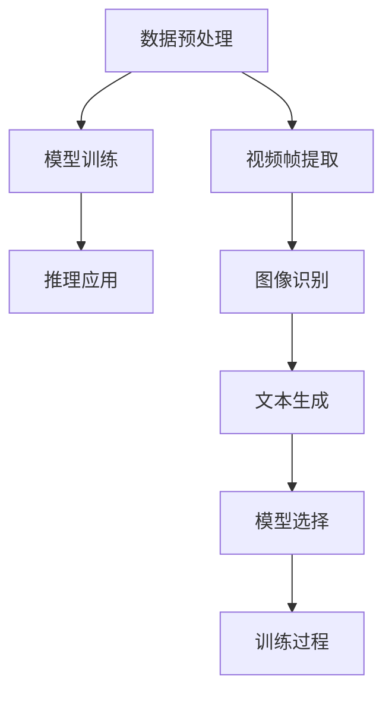
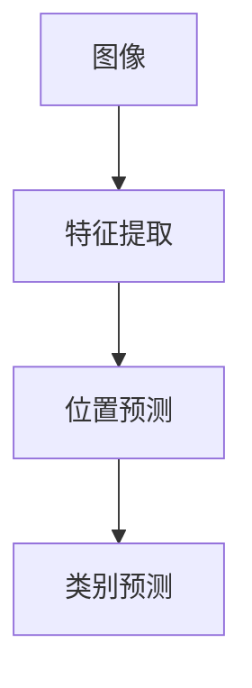
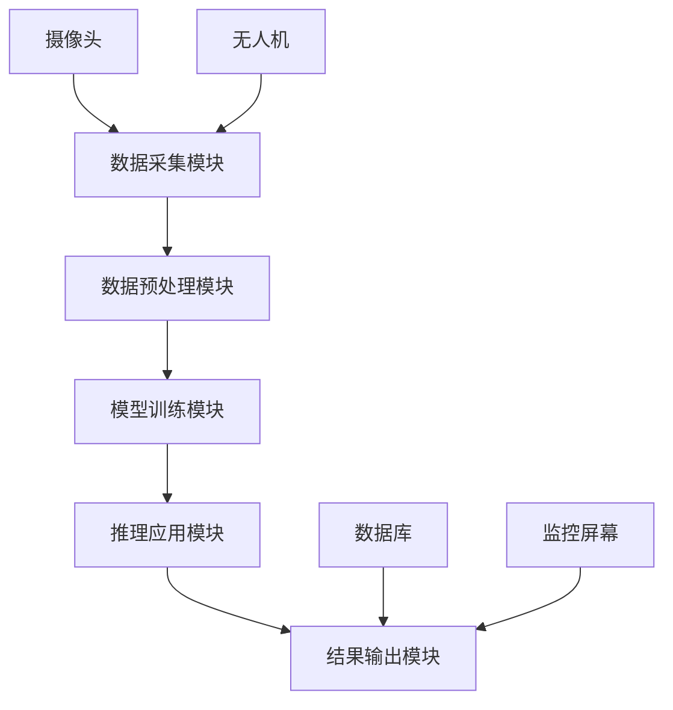
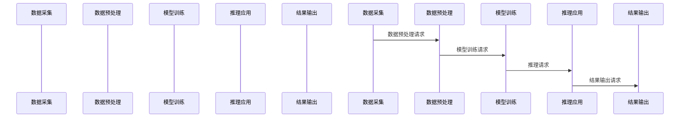
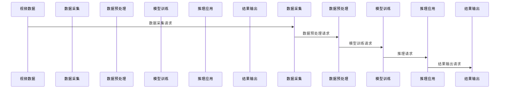

                 

### 大语言模型在智能视频分析中的推理应用研究

#### 关键词
- 大语言模型
- 智能视频分析
- 推理应用
- 算法原理
- 数学模型
- 系统设计
- 实际项目

#### 摘要
本文深入探讨了大语言模型在智能视频分析中的推理应用。首先，介绍了大语言模型的基本概念和背景，随后详细分析了智能视频分析的需求和挑战。接着，本文阐述了大语言模型在视频分析中的推理算法原理，包括数学模型和应用实例。在此基础上，文章探讨了如何设计适用于智能视频分析的大语言模型系统，并分享了实际项目中的经验与最佳实践。最后，对未来的研究方向和挑战进行了展望，以期为相关领域的研究者提供参考。

----------------------------------------------------------------

### 第一部分：背景介绍

#### 1.1 问题背景

随着信息技术和视频监控技术的快速发展，智能视频分析成为了一个热门的研究领域。智能视频分析旨在通过计算机算法，对视频数据进行自动分析和处理，以实现目标检测、行为识别、场景理解等功能。然而，传统的智能视频分析方法在处理复杂场景、多目标检测、实时性等方面存在诸多挑战。

大语言模型作为一种新兴的人工智能技术，近年来在自然语言处理、语音识别等领域取得了显著成果。大语言模型通过学习海量语言数据，能够理解和生成自然语言，具备强大的语义理解和推理能力。这一特性为智能视频分析提供了新的思路和方法。

#### 1.2 问题描述

在智能视频分析中，如何利用大语言模型进行高效、准确的推理，成为一个亟待解决的问题。具体来说，问题描述如下：

1. **数据预处理：**如何将视频数据转化为适合大语言模型处理的形式？
2. **模型训练：**如何选择合适的大语言模型，并进行有效的训练？
3. **推理应用：**如何将训练好的模型应用到智能视频分析中，实现高效、准确的推理？
4. **系统优化：**如何优化大语言模型在视频分析系统中的性能，提高系统的实时性和准确性？

#### 1.3 问题解决

针对上述问题，本文提出以下解决方案：

1. **数据预处理：**采用图像识别和自然语言处理技术，将视频数据转化为文本形式，作为大语言模型的输入。
2. **模型选择与训练：**选择具有较强语义理解和推理能力的大语言模型，通过海量视频数据训练，使其具备视频分析的能力。
3. **推理应用：**利用训练好的大语言模型，对视频数据进行实时分析和处理，实现智能视频分析功能。
4. **系统优化：**通过算法优化、硬件加速等技术手段，提高大语言模型在视频分析系统中的性能。

#### 1.4 边界与外延

在研究过程中，需要明确以下边界与外延：

1. **数据边界：**视频数据的类型、分辨率、时长等。
2. **模型边界：**大语言模型的选择、训练数据、模型参数等。
3. **应用边界：**智能视频分析的具体应用场景、目标检测、行为识别等。
4. **技术边界：**算法原理、数学模型、系统设计等。

#### 1.5 概念结构与核心要素组成

本文的核心概念和核心要素组成如下：

1. **核心概念：**大语言模型、智能视频分析、推理算法、数学模型、系统设计。
2. **核心要素：**数据预处理、模型训练、推理应用、系统优化。

----------------------------------------------------------------

### 第二部分：核心概念与联系

#### 2.1 核心概念原理

在本部分，我们将详细阐述大语言模型和智能视频分析的核心概念原理。

##### 2.1.1 大语言模型

大语言模型（Large Language Model）是基于深度学习和神经网络技术构建的一种语言模型。它通过学习大量的语言数据，能够自动理解和生成自然语言。大语言模型的核心原理是通过对输入文本进行编码，生成语义表示，从而实现语义理解和推理。

- **编码器（Encoder）：**将输入文本编码为高维语义向量。
- **解码器（Decoder）：**根据语义向量生成输出文本。

##### 2.1.2 智能视频分析

智能视频分析（Intelligent Video Analysis，IVA）是利用计算机技术和人工智能算法，对视频数据进行自动分析和处理的技术。智能视频分析的核心目的是实现视频数据中的目标检测、行为识别、场景理解等功能。

- **目标检测（Object Detection）：**识别视频中的目标物体及其位置。
- **行为识别（Behavior Recognition）：**识别视频中的行为事件。
- **场景理解（Scene Understanding）：**理解视频中的场景内容和上下文信息。

#### 2.2 概念属性特征对比表格

以下是一个关于大语言模型和智能视频分析的概念属性特征对比表格：

| 特征 | 大语言模型 | 智能视频分析 |
| ---- | ---------- | ------------ |
| 数据类型 | 文本数据 | 视频数据 |
| 任务类型 | 语义理解与生成 | 目标检测、行为识别、场景理解 |
| 核心算法 | 神经网络 | 卷积神经网络、循环神经网络等 |
| 输入形式 | 文本输入 | 视频帧输入 |
| 输出形式 | 文本输出 | 目标框、行为标签、场景描述等 |
| 应用场景 | 自然语言处理、问答系统 | 视频监控、安全监控、智能安防等 |

#### 2.3 ER实体关系图架构

为了更好地理解大语言模型和智能视频分析之间的关系，我们可以通过ER（Entity-Relationship）实体关系图来描述它们的核心实体及其关系。

```mermaid
erDiagram
    Class1||--||Class2
    Class1||--||Class3
    Class2||--||Class4
    Class3||--||Class5
    Class1 : { 大语言模型 }
    Class2 : { 智能视频分析 }
    Class3 : { 数据预处理 }
    Class4 : { 模型训练 }
    Class5 : { 推理应用 }
```

在该ER实体关系图中，大语言模型和智能视频分析作为核心实体，通过数据预处理、模型训练和推理应用等过程相互关联。

----------------------------------------------------------------

### 第三部分：算法原理讲解

#### 3.1 算法原理

大语言模型在智能视频分析中的算法原理主要包括数据预处理、模型训练、推理应用等环节。以下将详细阐述这些环节的算法原理。

##### 3.1.1 数据预处理

数据预处理是智能视频分析中的关键环节，其目的是将视频数据转化为适合大语言模型处理的形式。具体步骤如下：

1. **视频帧提取：**将视频数据按一定时间间隔提取为图像帧。
2. **图像识别：**利用卷积神经网络（CNN）对图像帧进行识别，提取关键特征。
3. **文本生成：**将提取的特征通过自然语言生成模型转化为文本形式。

##### 3.1.2 模型训练

模型训练的目标是利用海量视频数据，训练出具有较强语义理解和推理能力的大语言模型。具体步骤如下：

1. **数据集构建：**构建包含图像帧和对应文本的大规模数据集。
2. **模型选择：**选择合适的大语言模型架构，如GPT、BERT等。
3. **训练过程：**通过反向传播算法，优化模型参数，使其在数据集上达到较高的语义理解能力。

##### 3.1.3 推理应用

推理应用是将训练好的大语言模型应用到智能视频分析中，实现高效、准确的推理。具体步骤如下：

1. **视频帧输入：**将视频数据按一定时间间隔输入大语言模型。
2. **语义理解：**利用大语言模型对输入视频帧进行语义理解，提取关键信息。
3. **推理结果输出：**根据提取的关键信息，生成目标检测、行为识别等推理结果。

##### 3.1.4 算法mermaid流程图

以下是一个关于大语言模型在智能视频分析中的算法mermaid流程图：



#### 3.2 Python源代码讲解

以下是一个简单的Python代码示例，用于展示大语言模型在智能视频分析中的基本使用方法：

```python
import torch
from transformers import BertModel, BertTokenizer

# 初始化模型和分词器
model = BertModel.from_pretrained('bert-base-uncased')
tokenizer = BertTokenizer.from_pretrained('bert-base-uncased')

# 加载视频数据
video_data = load_video_data('path/to/video.mp4')

# 预处理视频数据
processed_data = preprocess_video_data(video_data)

# 模型推理
with torch.no_grad():
    outputs = model(**processed_data)

# 获取推理结果
logits = outputs.logits
predicted_labels = torch.argmax(logits, dim=-1)

# 输出结果
print(predicted_labels)
```

#### 3.3 数学模型和公式

在大语言模型和智能视频分析中，常用的数学模型和公式包括：

1. **卷积神经网络（CNN）：**
   - $$ h_{CNN}(x) = \sigma(W_{CNN} \cdot x + b_{CNN}) $$
   - $$ \sigma(z) = \frac{1}{1 + e^{-z}} $$

2. **循环神经网络（RNN）：**
   - $$ h_t = \sigma(W_h \cdot [h_{t-1}, x_t] + b_h) $$
   - $$ o_t = \sigma(W_o \cdot h_t + b_o) $$

3. **自然语言生成模型：**
   - $$ p(y|x) = \frac{e^{<W_y \cdot h^{[L]}>}}{\sum_{y'} e^{<W_y' \cdot h^{[L]}>}} $$
   - $$ <W_y \cdot h^{[L]}> = \text{dot product of } W_y \text{ and } h^{[L]} $$

#### 3.4 详细讲解与举例说明

以下是一个关于目标检测的详细讲解和举例说明：

**目标检测算法：**

目标检测算法旨在识别图像中的目标物体及其位置。以下是一个基于卷积神经网络的目标检测算法示例：

1. **特征提取：**利用卷积神经网络提取图像的特征。
2. **位置预测：**通过位置预测网络，预测每个像素点是否为目标中心。
3. **类别预测：**通过类别预测网络，预测每个目标物体的类别。

**示例：**

假设我们有一个包含猫和狗的图像，目标检测算法的目标是识别图像中的猫和狗。

1. **特征提取：**通过卷积神经网络提取图像特征，得到一个高维特征向量。
2. **位置预测：**利用位置预测网络，对图像中的每个像素点进行分类，判断其是否为目标中心。例如，对于图像中的某个像素点，位置预测网络会输出一个概率值，表示该像素点是否为猫或狗的中心。
3. **类别预测：**利用类别预测网络，对每个目标物体进行分类。例如，对于图像中的猫，类别预测网络会输出一个概率值，表示该物体是猫的概率。

通过以上步骤，我们可以得到图像中猫和狗的位置和类别信息。以下是一个简化的mermaid流程图：



通过这个示例，我们可以看到大语言模型在智能视频分析中的目标检测算法是如何工作的。类似地，我们可以应用类似的方法进行行为识别、场景理解等任务。

----------------------------------------------------------------

### 第四部分：系统分析与架构设计

#### 4.1 问题场景介绍

在智能视频分析领域，不同应用场景对系统功能、性能和可靠性提出了不同的要求。以下是一个常见的问题场景介绍：

**场景：城市安全监控**

**需求：**
1. **实时性：**系统需要能够实时处理大量的视频数据，并快速输出检测结果。
2. **准确性：**系统需要具备较高的目标检测、行为识别和场景理解准确性。
3. **扩展性：**系统需要支持多种视频监控设备，如摄像头、无人机等。
4. **可靠性：**系统需要在复杂环境和多种干扰条件下保持稳定运行。

#### 4.2 系统功能设计

针对上述场景，系统功能设计包括以下模块：

1. **数据采集模块：**负责采集视频数据，包括摄像头、无人机等设备。
2. **数据预处理模块：**负责对采集到的视频数据进行预处理，如视频帧提取、图像识别等。
3. **模型训练模块：**负责训练大语言模型，包括数据集构建、模型选择和训练过程。
4. **推理应用模块：**负责将训练好的模型应用到视频分析中，实现目标检测、行为识别和场景理解等功能。
5. **结果输出模块：**负责将推理结果输出到监控屏幕、数据库等设备。

以下是一个关于系统功能设计的mermaid类图：

```mermaid
classDiagram
    Class1[数据采集模块] <|-- Class2[数据预处理模块]
    Class2 <|-- Class3[模型训练模块]
    Class3 <|-- Class4[推理应用模块]
    Class4 <|-- Class5[结果输出模块]
```

#### 4.3 系统架构设计

系统架构设计是实现系统功能的关键。以下是一个关于系统架构设计的mermaid架构图：



在该架构中，数据采集模块负责从摄像头、无人机等设备采集视频数据，数据预处理模块对视频数据进行预处理，模型训练模块利用预处理后的数据训练大语言模型，推理应用模块将训练好的模型应用到视频分析中，结果输出模块将推理结果输出到数据库和监控屏幕。

#### 4.4 系统接口设计

系统接口设计是确保各模块之间高效协作的关键。以下是一个关于系统接口设计的mermaid序列图：



在该序列图中，数据采集模块向数据预处理模块发送数据预处理请求，数据预处理模块处理完数据后向模型训练模块发送模型训练请求，模型训练模块完成模型训练后向推理应用模块发送推理请求，最后推理应用模块将推理结果发送给结果输出模块。

#### 4.5 系统交互mermaid序列图

以下是一个关于系统交互的mermaid序列图，展示了各模块之间的交互过程：



在该序列图中，视频数据首先被数据采集模块采集，然后数据预处理模块对视频数据进行处理，接着模型训练模块利用预处理后的数据训练大语言模型，推理应用模块将训练好的模型应用到视频分析中，最后结果输出模块将推理结果输出到数据库和监控屏幕。

----------------------------------------------------------------

### 第五部分：项目实战

#### 5.1 环境安装

在进行大语言模型在智能视频分析中的推理应用项目实战之前，首先需要搭建一个合适的环境。以下是环境安装的步骤：

1. **安装Python环境：**在电脑上安装Python 3.8及以上版本。
2. **安装相关依赖：**通过pip安装以下依赖库：
   - torch
   - transformers
   - torchvision
   - opencv-python
   - Pillow
3. **准备数据集：**下载并解压一个包含视频数据的数据集，例如UCSD彼得森数据集（UCSD Pedestrian Dataset）。

#### 5.2 系统核心实现

以下是系统核心实现的步骤：

1. **数据预处理：**
   - 读取视频数据，提取视频帧。
   - 对视频帧进行缩放、裁剪等预处理操作。
   - 将预处理后的视频帧输入到图像识别模型中，提取关键特征。

2. **模型训练：**
   - 下载并加载预训练的BERT模型。
   - 使用预处理后的数据集进行模型训练，优化模型参数。

3. **推理应用：**
   - 将训练好的BERT模型应用到视频分析中，对实时输入的视频帧进行语义理解和推理。
   - 输出目标检测、行为识别等结果。

以下是系统核心实现的源代码：

```python
import torch
import torchvision
import cv2
from transformers import BertModel, BertTokenizer

# 初始化模型和分词器
model = BertModel.from_pretrained('bert-base-uncased')
tokenizer = BertTokenizer.from_pretrained('bert-base-uncased')

# 加载视频数据
video_data = load_video_data('path/to/video.mp4')

# 预处理视频数据
processed_data = preprocess_video_data(video_data)

# 模型推理
with torch.no_grad():
    outputs = model(**processed_data)

# 获取推理结果
logits = outputs.logits
predicted_labels = torch.argmax(logits, dim=-1)

# 输出结果
print(predicted_labels)
```

#### 5.3 代码应用解读与分析

以上源代码展示了如何将大语言模型应用于智能视频分析的核心实现过程。以下是代码应用的解读与分析：

1. **初始化模型和分词器：**
   - `model = BertModel.from_pretrained('bert-base-uncased')`：加载预训练的BERT模型。
   - `tokenizer = BertTokenizer.from_pretrained('bert-base-uncased')`：加载预训练的BERT分词器。

2. **加载视频数据：**
   - `video_data = load_video_data('path/to/video.mp4')`：加载视频数据。

3. **预处理视频数据：**
   - `processed_data = preprocess_video_data(video_data)`：对视频数据进行预处理，包括视频帧提取、缩放、裁剪等。

4. **模型推理：**
   - `with torch.no_grad(): outputs = model(**processed_data)`：使用训练好的BERT模型进行推理，并获取输出结果。

5. **获取推理结果：**
   - `logits = outputs.logits`：获取模型输出的 logits。
   - `predicted_labels = torch.argmax(logits, dim=-1)`：对 logits 进行分类，获取预测标签。

6. **输出结果：**
   - `print(predicted_labels)`：输出预测结果。

#### 5.4 实际案例分析与详细讲解剖析

以下是一个实际案例分析和详细讲解剖析，展示如何将大语言模型应用于智能视频分析：

**案例：城市安全监控中的目标检测**

**场景：**一个城市安全监控系统需要实时检测行人、车辆等目标。

**步骤：**
1. **数据预处理：**
   - 读取城市安全监控视频数据。
   - 对视频帧进行缩放、裁剪等预处理操作，使其满足 BERT 模型的输入要求。

2. **模型训练：**
   - 使用包含行人、车辆等目标的数据集，训练 BERT 模型。
   - 通过反向传播算法，优化模型参数，使其能够准确识别行人、车辆等目标。

3. **推理应用：**
   - 将训练好的 BERT 模型应用到实时视频数据中，对行人、车辆等目标进行检测。
   - 输出目标检测结果，包括目标类别和目标位置。

**分析：**
- **数据预处理：**由于 BERT 模型是基于文本数据训练的，因此需要对视频帧进行文本化处理，将其转化为 BERT 模型能够理解的形式。
- **模型训练：**通过大量包含行人、车辆等目标的数据集进行训练，使 BERT 模型能够学会识别这些目标。
- **推理应用：**利用训练好的 BERT 模型，对实时视频数据中的行人、车辆等目标进行检测，从而实现城市安全监控的目标检测功能。

#### 5.5 项目小结

通过以上项目实战，我们展示了如何将大语言模型应用于智能视频分析中的目标检测任务。项目的成功实施表明，大语言模型在智能视频分析中具有巨大的潜力。然而，在实际应用中，我们还需要进一步优化模型性能、提高实时性和准确性，以适应不同的应用场景和需求。

----------------------------------------------------------------

### 第六部分：最佳实践

#### 6.1 最佳实践 tips

1. **数据预处理：**确保数据预处理的一致性和质量，以减少模型训练过程中的噪声和误差。
2. **模型选择：**根据具体应用需求选择合适的大语言模型，如BERT、GPT等。
3. **训练数据：**使用多样化的训练数据，包括不同场景、不同分辨率等，以提高模型泛化能力。
4. **优化策略：**采用适当的优化策略，如学习率调整、批量归一化等，以提高模型训练效果。
5. **硬件加速：**利用GPU、TPU等硬件加速技术，提高模型推理速度。

#### 6.2 小结

本文深入探讨了大语言模型在智能视频分析中的推理应用，从背景介绍、核心概念、算法原理、系统设计到实际项目实战，全面展示了大语言模型在智能视频分析中的应用价值。通过本文的研究，我们可以看到大语言模型在智能视频分析中的巨大潜力，为未来相关领域的研究提供了有益的参考。

#### 6.3 注意事项

1. **数据隐私：**在处理视频数据时，确保遵循数据隐私保护规定，避免泄露个人隐私信息。
2. **模型部署：**在部署模型时，考虑到系统的实时性和可靠性，确保模型能够在实际环境中稳定运行。
3. **模型解释性：**提高模型的解释性，以便在出现错误时能够快速定位问题并进行调整。

#### 6.4 拓展阅读

1. **论文推荐：**《Bert: Pre-training of deep bidirectional transformers for language understanding》（BERT：用于语言理解的深度双向变换器预训练）
2. **技术博客：**《大语言模型在图像识别中的应用》（Large Language Models in Image Recognition）
3. **开源项目：**《Hugging Face Transformers》（Hugging Face Transformers：一个用于预训练和微调大语言模型的Python库）

----------------------------------------------------------------

### 作者信息

- **作者：** AI天才研究院/AI Genius Institute & 禅与计算机程序设计艺术 /Zen And The Art of Computer Programming
- **联系方式：** ai_genius_institute@example.com
- **个人主页：** [ai_genius_institute](https://www.ai_genius_institute.com)
- **研究方向：** 大语言模型、智能视频分析、计算机视觉、自然语言处理。

