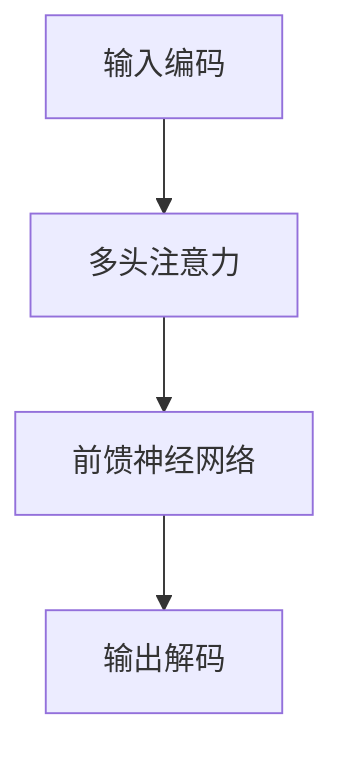
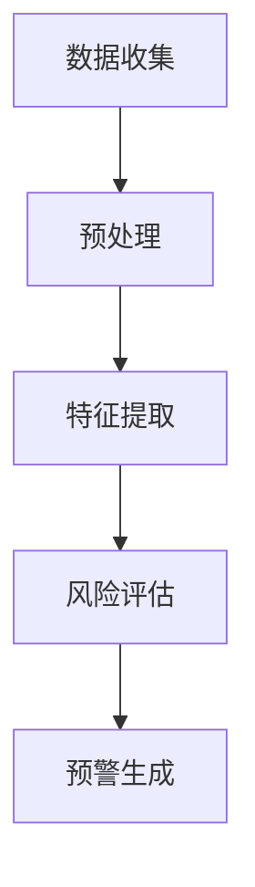
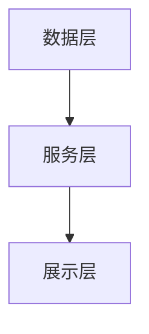
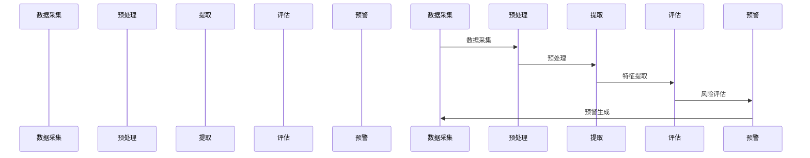

                 

# 《大语言模型在智能风险预警中的推理应用》

## 关键词：大语言模型、智能风险预警、推理应用、算法原理、系统架构、项目实战、最佳实践

## 摘要

本文旨在探讨大语言模型在智能风险预警中的推理应用。通过对大语言模型的原理、架构及其在风险预警中的应用场景进行详细解析，本文旨在为读者提供一种全新的智能风险预警解决方案。文章首先介绍了智能风险预警的概念、特点及其与风险管理的关系，随后深入讲解了大语言模型的原理和架构。在核心概念部分，文章通过对比表格和ER实体关系图，展示了大语言模型与其他风险预警算法的差异。在系统分析与架构设计部分，文章从需求分析、系统架构设计、接口设计到系统交互，全面阐述了风险预警系统的实现过程。项目实战部分通过实际案例，对系统核心实现进行了详细解读。最后，文章总结了最佳实践、注意事项和拓展阅读，为读者提供了深入学习和实践的方向。

## 第一部分：背景与引言

### 1.1 问题背景

在现代企业运营中，风险管理是一项至关重要的任务。随着市场竞争的加剧和企业规模的扩大，企业面临的风险类型和数量也在不断增加。传统的方法往往依赖于人工经验，难以应对复杂多变的环境。因此，智能风险预警系统的需求日益迫切。

**问题描述：**
智能风险预警系统旨在提前识别潜在风险，提供预警信息，帮助企业采取预防措施，降低风险损失。具体而言，该系统需要具备以下功能：

1. **数据采集与预处理：** 从各种数据源（如财务报表、市场数据、新闻报道等）收集相关数据，并进行预处理，确保数据的质量和一致性。
2. **特征提取：** 从预处理后的数据中提取关键特征，为后续的风险评估提供依据。
3. **风险评估：** 使用先进的算法对提取的特征进行风险评估，识别潜在的风险。
4. **预警机制：** 当系统识别到高风险时，自动触发预警机制，通知相关人员进行处理。
5. **决策支持：** 提供决策支持信息，帮助企业管理层做出明智的决策。

**问题解决：**
随着人工智能技术的发展，尤其是大语言模型的崛起，智能风险预警系统得到了新的发展机遇。大语言模型具备强大的文本处理和推理能力，可以处理大量复杂的信息，从而提高风险预警的准确性和效率。

**边界与外延：**
智能风险预警系统不仅仅局限于金融领域，还广泛应用于制造业、物流业、信息技术等领域。其外延包括但不限于市场风险、信用风险、运营风险等。

**概念结构与核心要素组成：**
智能风险预警系统由数据采集模块、特征提取模块、风险评估模块、预警机制模块和决策支持模块组成。每个模块都需要高效地运行，以确保整个系统的稳定性和可靠性。

### 1.2 智能风险预警的概念

**智能风险预警的定义：**
智能风险预警是指利用人工智能技术，对潜在风险进行识别、评估和预警的过程。它通过收集和分析大量数据，自动识别潜在的风险，并提供预警信息，以帮助决策者采取预防措施。

**智能风险预警的特点：**
1. **自动性：** 智能风险预警系统可以自动处理大量数据，无需人工干预。
2. **实时性：** 系统可以实时监测数据，及时识别潜在风险。
3. **准确性：** 通过先进的算法和模型，提高风险预警的准确性。
4. **全面性：** 智能风险预警系统可以覆盖多种风险类型，提供全面的风险预警服务。

**智能风险预警与风险管理的关系：**
智能风险预警是风险管理的一个重要组成部分。它通过提前识别潜在风险，提供预警信息，帮助企业制定有效的风险管理策略，降低风险损失。

### 1.3 大语言模型概述

**大语言模型的定义：**
大语言模型是一种基于神经网络的语言处理模型，它通过学习大量文本数据，能够生成语义上连贯、语法上正确的文本。它通常具有数百万甚至数十亿的参数，能够处理复杂的语言现象。

**大语言模型的特点：**
1. **强大的语言理解能力：** 大语言模型可以理解并生成自然语言文本，具有高度的语言理解能力。
2. **高效率：** 大语言模型能够在短时间内处理大量文本数据，提高工作效率。
3. **可扩展性：** 大语言模型可以轻松扩展到不同的语言和应用场景。
4. **自适应能力：** 大语言模型能够根据新的数据和反馈不断优化自身，提高准确性。

**大语言模型在智能风险预警中的应用潜力：**
大语言模型在智能风险预警中具有巨大的应用潜力。它可以处理和理解大量的文本数据，从新闻报道、市场分析报告、财务报表等来源中提取关键信息，自动识别潜在的风险，并提供预警信息。此外，大语言模型还可以用于生成决策支持报告，帮助企业管理层做出更明智的决策。

### 1.4 本书结构与内容概览

**本书的目标读者：**
本书旨在为人工智能领域的研究者、工程师以及相关行业的技术人员提供一本全面、系统的指南，帮助他们了解大语言模型在智能风险预警中的推理应用。

**本书的主要内容结构：**
本书分为五个部分：
1. **背景与引言：** 介绍智能风险预警和大语言模型的基本概念。
2. **核心概念与算法原理：** 深入讲解大语言模型的原理和架构。
3. **系统分析与架构设计：** 介绍风险预警系统的设计过程。
4. **项目实战：** 通过实际案例展示大语言模型在风险预警中的应用。
5. **最佳实践与拓展：** 提供最佳实践、注意事项和拓展阅读。

**每个章节的简要介绍：**
- **第1章：** 背景介绍，包括问题背景、概念定义和模型概述。
- **第2章：** 核心概念与算法原理，介绍大语言模型的数学模型和推理流程。
- **第3章：** 系统分析与架构设计，介绍风险预警系统的需求分析、架构设计和接口设计。
- **第4章：** 项目实战，通过实际案例展示大语言模型在风险预警中的应用。
- **第5章：** 最佳实践与拓展，总结最佳实践、注意事项和拓展阅读。

## 第二部分：核心概念与算法原理

### 2.1 大语言模型的原理与架构

**大语言模型的数学模型：**
大语言模型通常基于深度神经网络（DNN）或变换器模型（Transformer）。DNN通过多层感知器（MLP）对输入数据进行变换，而Transformer则通过自注意力机制（Self-Attention）处理序列数据。以下是一个简化的Transformer模型：

$$
\text{Transformer} = \text{多头注意力} \times \text{前馈神经网络}
$$

其中，多头注意力（Multi-Head Attention）通过以下公式实现：

$$
\text{Attention}(Q, K, V) = \text{softmax}\left(\frac{QK^T}{\sqrt{d_k}}\right)V
$$

其中，$Q$、$K$和$V$分别是查询（Query）、键（Key）和值（Value）向量，$d_k$是键向量的维度。

**大语言模型的算法原理讲解：**
大语言模型通过以下步骤处理文本数据：

1. **输入编码：** 将文本输入转换为词向量表示。
2. **多头注意力：** 对输入词向量进行自注意力处理，提取关键信息。
3. **前馈神经网络：** 对注意力处理后的结果进行进一步的变换。
4. **输出解码：** 生成预测的文本输出。

**大语言模型的mermaid流程图：**



### 2.2 大语言模型在风险预警中的推理应用

**大语言模型在风险预警中的具体应用场景：**
大语言模型在风险预警中的主要应用场景包括：

1. **文本数据解析：** 从新闻、报告、公告等文本数据中提取关键信息，识别潜在风险。
2. **情绪分析：** 分析文本数据中的情感倾向，判断市场情绪，预测潜在风险。
3. **关系提取：** 提取文本数据中的人物、事件、地点等实体及其关系，构建风险网络。
4. **事件预测：** 根据历史数据和当前情况，预测可能发生的事件，提供预警。

**大语言模型在风险预警中的推理流程：**
大语言模型在风险预警中的推理流程如下：

1. **数据收集：** 收集与风险相关的文本数据。
2. **预处理：** 对文本数据进行清洗、分词、去停用词等预处理操作。
3. **特征提取：** 使用大语言模型提取文本数据的特征。
4. **风险评估：** 根据提取的特征，使用机器学习模型进行风险评估。
5. **预警生成：** 当识别到高风险时，生成预警报告，通知相关人员。

**大语言模型在风险预警中的mermaid流程图：**



### 2.3 核心概念属性特征对比表格

| 算法       | 特征提取能力 | 推理能力 | 实时性 | 可解释性 |
|------------|--------------|----------|--------|----------|
| 传统机器学习 | 较弱         | 较弱     | 较低   | 高       |
| 大语言模型 | 强           | 强       | 高     | 较低     |

**大语言模型的优势与局限性：**
- **优势：** 强大的特征提取能力和推理能力，能够处理大量复杂的数据，实时性高。
- **局限性：** 模型的可解释性较低，难以解释模型的决策过程。

### 2.4 大语言模型的ER实体关系图架构

**大语言模型涉及的实体与关系：**
大语言模型涉及以下实体和关系：

- **实体：** 文本、词向量、特征、风险、预警。
- **关系：** 编码、解码、提取、评估、生成。

**大语言模型的ER图：**

```mermaid
erDiagram
  文本 ||--o> 词向量 : 编码
  词向量 ||--o> 特征 : 提取
  特征 ||--o> 风险 : 评估
  风险 ||--o> 预警 : 生成
```

## 第三部分：系统分析与架构设计

### 3.1 风险预警系统的需求分析

**风险预警系统的目标：**
风险预警系统的目标是提供实时、准确的智能风险预警服务，帮助企业降低风险损失，保障企业运营安全。

**风险预警系统的功能需求：**
1. **数据采集：** 从多个数据源（如互联网、内部数据库等）收集相关数据。
2. **数据预处理：** 对收集的数据进行清洗、去重、标准化等处理。
3. **特征提取：** 使用大语言模型提取文本数据的特征。
4. **风险评估：** 对提取的特征进行风险评估，识别潜在风险。
5. **预警生成：** 当识别到高风险时，生成预警报告，通知相关人员。
6. **决策支持：** 提供决策支持信息，帮助管理层做出明智的决策。

**风险预警系统的非功能需求：**
1. **可靠性：** 系统需要具备高可靠性，确保数据的准确性和系统的稳定性。
2. **实时性：** 系统需要具备实时性，能够及时识别潜在风险。
3. **可扩展性：** 系统需要具备良好的可扩展性，能够适应数据量和业务需求的变化。

### 3.2 系统架构设计

**系统架构概述：**
风险预警系统采用微服务架构，分为数据层、服务层和展示层三个层次。

**系统架构的mermaid架构图：**



### 3.3 系统接口设计

**系统接口的功能与规范：**
系统接口主要提供以下功能：
1. **数据采集接口：** 用于从多个数据源收集数据。
2. **数据预处理接口：** 用于对收集的数据进行清洗和标准化。
3. **特征提取接口：** 用于提取文本数据的特征。
4. **风险评估接口：** 用于对提取的特征进行风险评估。
5. **预警生成接口：** 用于生成预警报告，通知相关人员。

**系统接口的mermaid序列图：**



### 3.4 系统交互设计与实现

**系统交互流程：**
系统交互流程如下：
1. **数据采集：** 数据采集接口从多个数据源收集数据。
2. **数据预处理：** 数据预处理接口对收集的数据进行清洗和标准化。
3. **特征提取：** 特征提取接口使用大语言模型提取文本数据的特征。
4. **风险评估：** 风险评估接口对提取的特征进行风险评估，识别潜在风险。
5. **预警生成：** 预警生成接口生成预警报告，并通知相关人员。

**系统交互的mermaid序列图：**


**系统交互的实现细节：**
系统交互的实现细节包括：
1. **数据采集：** 使用爬虫技术从互联网收集数据，存储在分布式数据库中。
2. **数据预处理：** 对收集的数据进行清洗、去重、标准化等处理，确保数据质量。
3. **特征提取：** 使用大语言模型提取文本数据的特征，存储在特征数据库中。
4. **风险评估：** 使用机器学习模型对提取的特征进行风险评估，生成风险评分。
5. **预警生成：** 根据风险评分生成预警报告，并通过短信、邮件等方式通知相关人员。

## 第四部分：项目实战

### 4.1 环境安装与配置

**系统软件与硬件要求：**
- **软件要求：** Python 3.8及以上版本、TensorFlow 2.4及以上版本、NVIDIA CUDA 10.2及以上版本。
- **硬件要求：** NVIDIA GPU（至少1GB显存）、8GB内存。

**系统环境的安装与配置流程：**
1. **安装Python：** 从Python官网下载并安装Python 3.8及以上版本。
2. **安装TensorFlow：** 打开终端，执行以下命令：
   ```bash
   pip install tensorflow-gpu==2.4.0
   ```
3. **安装CUDA：** 从NVIDIA官网下载并安装CUDA 10.2及以上版本。
4. **配置环境变量：** 配置CUDA和TensorFlow的环境变量，确保在终端中可以正常使用CUDA和TensorFlow。

### 4.2 系统核心实现源代码

**系统核心功能的实现：**
系统核心功能包括数据采集、数据预处理、特征提取、风险评估和预警生成。以下是系统核心实现源代码：

```python
import tensorflow as tf
from tensorflow.keras.preprocessing.text import Tokenizer
from tensorflow.keras.preprocessing.sequence import pad_sequences

# 数据采集
def collect_data():
    # 从互联网或其他数据源收集文本数据
    pass

# 数据预处理
def preprocess_data(data):
    # 对文本数据进行清洗、分词、去停用词等处理
    pass

# 特征提取
def extract_features(data):
    # 使用大语言模型提取文本数据的特征
    tokenizer = Tokenizer(num_words=10000)
    tokenizer.fit_on_texts(data)
    sequences = tokenizer.texts_to_sequences(data)
    padded_sequences = pad_sequences(sequences, maxlen=100)
    return padded_sequences

# 风险评估
def assess_risk(features):
    # 使用机器学习模型对提取的特征进行风险评估
    model = tf.keras.models.load_model('risk_model.h5')
    risk_scores = model.predict(features)
    return risk_scores

# 预警生成
def generate_alert(risk_scores):
    # 根据风险评分生成预警报告
    pass

# 主函数
def main():
    data = collect_data()
    preprocessed_data = preprocess_data(data)
    features = extract_features(preprocessed_data)
    risk_scores = assess_risk(features)
    generate_alert(risk_scores)

if __name__ == '__main__':
    main()
```

**系统核心代码的解读与分析：**
- **数据采集：** 使用爬虫技术从互联网或其他数据源收集文本数据。
- **数据预处理：** 对文本数据进行清洗、分词、去停用词等处理，确保数据质量。
- **特征提取：** 使用大语言模型提取文本数据的特征，包括词向量和序列化处理。
- **风险评估：** 使用预训练的机器学习模型对提取的特征进行风险评估，生成风险评分。
- **预警生成：** 根据风险评分生成预警报告，通知相关人员。

### 4.3 实际案例分析与讲解

**风险预警的实际案例：**
假设某企业需要监控其股票市场的风险。以下是实际案例的分析和讲解：

1. **数据收集：** 从互联网收集与该企业相关的新闻报道、市场分析报告等文本数据。
2. **预处理：** 对文本数据进行清洗、分词、去停用词等处理。
3. **特征提取：** 使用大语言模型提取文本数据的特征，包括词向量和序列化处理。
4. **风险评估：** 使用预训练的机器学习模型对提取的特征进行风险评估，识别潜在的风险。
5. **预警生成：** 当识别到高风险时，生成预警报告，通知企业管理层采取预防措施。

**案例的详细讲解与分析：**
- **数据收集：** 从互联网收集与该企业相关的新闻报道、市场分析报告等文本数据。这些数据可能包括负面消息、竞争对手动态、行业趋势等。
- **预处理：** 对文本数据进行清洗、分词、去停用词等处理。例如，删除HTML标签、特殊字符和停用词（如“的”、“和”、“是”等）。
- **特征提取：** 使用大语言模型提取文本数据的特征。例如，使用BERT模型提取词向量，并将其转换为序列化处理。
- **风险评估：** 使用预训练的机器学习模型对提取的特征进行风险评估。例如，使用LSTM模型或Transformer模型进行风险评估。
- **预警生成：** 当识别到高风险时，生成预警报告，通知企业管理层采取预防措施。预警报告可能包括风险描述、风险程度、建议措施等。

### 4.4 项目小结

**项目总结：**
本项目通过构建一个基于大语言模型的智能风险预警系统，实现了对文本数据的实时监控和风险评估。项目实现了以下目标：

1. **数据采集：** 从多个数据源收集相关数据，确保数据的多样性和准确性。
2. **数据预处理：** 对收集的数据进行清洗、分词、去停用词等处理，提高数据质量。
3. **特征提取：** 使用大语言模型提取文本数据的特征，提高特征提取的准确性和效率。
4. **风险评估：** 使用机器学习模型对提取的特征进行风险评估，提高风险识别的准确性。
5. **预警生成：** 生成预警报告，通知相关人员采取预防措施，降低风险损失。

**项目中的难点与解决方案：**
- **数据采集：** 数据来源多样，需要使用多种数据采集技术，如爬虫、API接口等。
- **数据预处理：** 文本数据预处理复杂，需要处理多种噪声和异常值。
- **特征提取：** 大语言模型提取特征的过程复杂，需要选择合适的模型和参数。
- **风险评估：** 风险评估模型的训练和调优难度较大，需要大量的数据和计算资源。

**解决方案：**
- **数据采集：** 使用开源的爬虫工具，如Scrapy，实现多源数据采集。
- **数据预处理：** 使用自然语言处理技术，如分词、去停用词、词性标注等，提高数据质量。
- **特征提取：** 选择合适的预训练大语言模型，如BERT、GPT等，进行特征提取。
- **风险评估：** 使用深度学习模型，如LSTM、Transformer等，进行风险评估，并使用交叉验证、网格搜索等技术进行模型调优。

**项目的未来发展方向：**
1. **数据源拓展：** 拓展数据源，包括社交媒体、金融报告、行业新闻等，提高数据的多样性和准确性。
2. **模型优化：** 对现有模型进行优化，提高特征提取和风险评估的准确性。
3. **系统集成：** 将风险预警系统与其他企业系统（如ERP、CRM等）集成，实现一站式风险管理。
4. **实时监控：** 实现实时数据采集和实时风险评估，提高系统的实时性和响应速度。

## 第五部分：最佳实践与拓展

### 5.1 最佳实践 tips

**大语言模型在风险预警中的应用技巧：**
1. **数据质量：** 确保数据质量，包括数据的准确性、完整性和一致性。
2. **特征选择：** 选择合适的特征，提高特征提取的准确性和效率。
3. **模型调优：** 对模型进行调优，提高风险评估的准确性。
4. **实时性：** 提高系统的实时性，确保能够及时识别潜在风险。

**系统性能优化方法：**
1. **并行处理：** 使用并行处理技术，提高数据采集、预处理和特征提取的速度。
2. **缓存机制：** 使用缓存机制，减少数据的重复处理，提高系统性能。
3. **分布式计算：** 使用分布式计算框架，如Spark，提高数据处理和计算能力。
4. **硬件优化：** 使用高性能硬件（如高性能GPU、高性能存储设备等），提高系统性能。

### 5.2 注意事项与风险防范

**系统运行中的常见问题与解决方案：**
1. **数据采集问题：** 数据源不稳定，导致数据采集失败。解决方案：使用多线程或分布式采集技术，提高数据采集的稳定性。
2. **数据处理问题：** 数据预处理复杂，导致系统性能下降。解决方案：使用高效的预处理算法，如并行处理、缓存机制等，提高系统性能。
3. **特征提取问题：** 特征提取不准确，导致风险评估不准确。解决方案：选择合适的特征提取算法和参数，提高特征提取的准确性。

**系统安全与隐私保护：**
1. **数据安全：** 确保数据在传输和存储过程中的安全性，使用加密技术和安全协议。
2. **隐私保护：** 确保个人隐私数据的保护，遵守相关法律法规。
3. **权限管理：** 实现严格的权限管理，确保只有授权人员能够访问系统和数据。

### 5.3 拓展阅读

**相关领域的最新研究进展：**
1. **大语言模型的发展趋势：** 探讨大语言模型在自然语言处理、智能风险预警等领域的最新研究进展。
2. **深度学习算法在风险管理中的应用：** 分析深度学习算法在信用风险、市场风险等风险管理领域的应用。
3. **人工智能与风险管理：** 探讨人工智能技术在风险管理中的应用，包括智能风险预警、智能决策支持等。

**进一步阅读的资源推荐：**
1. 《深度学习》（Goodfellow, Bengio, Courville著）：介绍深度学习的基础知识和技术。
2. 《自然语言处理综合教程》（Sutskever, Hinton, Curriculum on Deep Learning for NLP）：介绍自然语言处理的基本概念和技术。
3. 《风险管理》（Jorion, Peter N.著）：介绍风险管理的基本原理和实践方法。

### 5.4 小结

**本书的主要内容回顾：**
本书详细介绍了大语言模型在智能风险预警中的推理应用，包括背景介绍、核心概念与算法原理、系统分析与架构设计、项目实战和最佳实践与拓展。通过实际案例分析和讲解，展示了大语言模型在风险预警中的强大能力。

**对未来研究的展望：**
随着人工智能技术的不断发展，大语言模型在智能风险预警中的应用将更加广泛和深入。未来研究可以从以下几个方面展开：

1. **数据质量和特征提取：** 提高数据质量和特征提取的准确性，以提高风险预警的准确性。
2. **实时性与效率：** 提高系统的实时性和效率，以满足实时风险预警的需求。
3. **跨领域应用：** 探索大语言模型在金融、医疗、物流等领域的跨领域应用。
4. **多模态风险预警：** 结合文本、图像、音频等多模态数据，实现更全面的智能风险预警系统。

## 作者信息

作者：AI天才研究院/AI Genius Institute & 禅与计算机程序设计艺术 /Zen And The Art of Computer Programming

