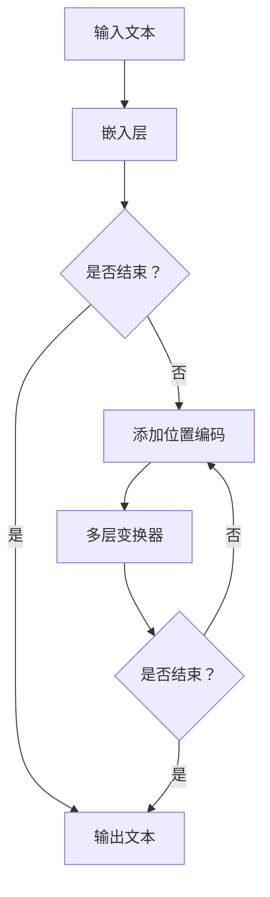

                 

### 大语言模型在精准农业决策中的推理应用

#### 关键词：
- 大语言模型
- 精准农业
- 决策支持
- 数据分析
- 深度学习

#### 摘要：
本文旨在探讨大语言模型在精准农业决策中的应用，分析其如何通过深度学习技术提高农业生产的效率和质量。文章首先介绍了精准农业和语言模型的基本概念，随后深入解析了大语言模型在农业决策中的关键应用，包括作物种植、病虫害预测、灌溉决策和土壤分析。接着，本文详细讲解了大语言模型的算法原理、数学模型及其实际应用中的系统架构设计和实现。通过具体案例分析和项目实战，本文展示了大语言模型在农业领域的实际效果和潜在价值。最后，文章总结了最佳实践和注意事项，并提出了未来的研究方向和拓展阅读资源。

## 目录大纲

### 第一部分：背景与概述

#### 第1章：精准农业与语言模型概述

1.1 问题背景

1.2 语言模型在农业领域的应用现状

1.3 大语言模型与精准农业决策

#### 第2章：核心概念与联系

2.1 大语言模型的基本概念

2.2 大语言模型的核心要素组成

2.3 大语言模型与传统模型的对比

2.4 大语言模型与农业决策的关联

### 第二部分：应用与原理

#### 第3章：大语言模型在农业决策中的应用

3.1 大语言模型在作物种植决策中的应用

3.2 大语言模型在病虫害预测中的应用

3.3 大语言模型在灌溉决策中的应用

3.4 大语言模型在土壤分析中的应用

#### 第4章：算法原理讲解

4.1 大语言模型的算法原理

4.2 大语言模型的数学模型

4.3 算法流程图

4.4 Python源代码示例

#### 第5章：数学模型与公式讲解

5.1 数学公式详解

5.2 数学公式应用示例

5.3 公式解释与讨论

### 第三部分：设计与实现

#### 第6章：系统分析与架构设计

6.1 问题场景介绍

6.2 系统功能设计

6.3 系统架构设计

6.4 系统接口设计与交互

#### 第7章：项目实战

7.1 环境安装

7.2 系统核心实现

7.3 代码应用解读与分析

7.4 实际案例分析与讲解

7.5 项目小结

#### 第8章：最佳实践与拓展

8.1 最佳实践

8.2 小结与注意事项

8.3 拓展阅读与资源

## 第一部分：背景与概述

### 第1章：精准农业与语言模型概述

#### 1.1 问题背景

精准农业是一种基于信息技术和地理空间数据来指导农田管理和作物生产的现代农业模式。它利用卫星遥感、地理信息系统（GIS）、全球定位系统（GPS）等现代科技手段，实现对农田的精细化管理，从而提高农业生产的效率和质量。随着全球人口的不断增长和对食物需求的增加，如何提高农业生产的可持续性和效率成为了一个亟待解决的问题。

然而，传统的农业管理模式往往依赖于经验，缺乏科学的数据支持和精准的决策，导致资源浪费、环境污染等问题。精准农业的出现，正是为了解决这些问题，通过数据驱动的决策支持系统，为农民提供科学、精准的管理方案。

#### 1.2 语言模型在农业领域的应用现状

近年来，深度学习技术的发展为精准农业带来了新的契机。语言模型，作为深度学习的重要分支，因其强大的文本理解和生成能力，在农业领域的应用逐渐受到关注。语言模型在农业中的应用主要包括以下几个方面：

1. **作物种植决策**：通过分析土壤、气候、病虫害等数据，语言模型可以预测最佳种植时间、种植方式等，帮助农民做出科学的种植决策。
2. **病虫害预测**：语言模型可以分析历史病虫害数据，预测病虫害的发生趋势，提前采取防治措施，减少损失。
3. **灌溉决策**：根据土壤湿度、气象数据等，语言模型可以预测灌溉需求，优化灌溉策略，节约水资源。
4. **土壤分析**：通过分析土壤样本数据，语言模型可以识别土壤类型、养分含量等，为农田管理提供数据支持。

#### 1.3 大语言模型与精准农业决策

大语言模型（Large Language Model），如GPT-3、BERT等，具有处理大规模文本数据的能力，能够理解复杂的语言结构和语义。与传统语言模型相比，大语言模型具有以下优势：

1. **更强的语义理解能力**：大语言模型能够更准确地理解文本的语义，从而提供更精准的农业决策支持。
2. **更广泛的数据处理能力**：大语言模型可以处理多源异构的数据，包括文本、图像、音频等，为农业数据分析提供更全面的支持。
3. **更强的泛化能力**：大语言模型通过训练大量数据，能够泛化到不同的农业场景，为不同的农作物和地区提供决策支持。

大语言模型在精准农业决策中的应用，为农业生产提供了强大的技术支撑。通过大语言模型，农民可以更快速地获取农业信息，做出科学的决策，提高农业生产的效率和质量。然而，大语言模型在农业中的应用也面临一些挑战，如数据隐私、模型解释性等，这需要进一步的研究和解决。

### 第2章：核心概念与联系

#### 2.1 大语言模型的基本概念

大语言模型是一种基于深度学习的自然语言处理（NLP）模型，其核心目标是理解和生成人类语言。大语言模型通常由数百万甚至数十亿的参数组成，通过这些参数来捕捉语言中的复杂模式和关系。这些模型通常使用大规模的文本数据进行训练，以便能够理解并生成各种复杂的语言结构。

大语言模型的工作原理基于神经网络，特别是变换器（Transformer）架构。Transformer架构通过多头自注意力机制（Multi-Head Self-Attention）和位置编码（Positional Encoding）来捕捉文本中的长距离依赖关系和上下文信息。这些特性使得大语言模型能够生成高质量的文本，并广泛应用于机器翻译、文本生成、问答系统等领域。

#### 2.2 大语言模型的核心要素组成

大语言模型的核心要素包括以下几个方面：

1. **参数规模**：大语言模型的参数规模通常非常大，如GPT-3拥有1750亿个参数，这使得模型能够处理和理解大量的文本数据。
2. **变换器架构**：变换器架构是当前大语言模型的主流架构，通过多头自注意力机制和位置编码来处理文本。
3. **预训练**：大语言模型通常通过预训练过程来初始化参数，即在大规模的未标注文本数据上进行训练，以捕捉语言的通用特征。
4. **微调**：在预训练的基础上，大语言模型可以通过微调过程来适应特定的任务，如文本分类、问答系统等。

#### 2.3 大语言模型与传统模型的对比

传统语言模型，如基于规则的方法和统计模型，通常专注于特定的语言任务，如词性标注、句法分析等。这些模型通常依赖于人工设计的特征和规则，其性能受限于特征设计和规则覆盖范围。相比之下，大语言模型具有以下优势：

1. **更强的语义理解能力**：大语言模型能够理解复杂的语义和上下文关系，从而提供更准确的决策支持。
2. **更广泛的应用场景**：大语言模型可以应用于多种语言任务，如文本生成、机器翻译、问答系统等，而传统模型通常局限于特定的任务。
3. **更高的效率和效果**：大语言模型通过大规模参数和深度学习技术，能够高效地处理大量数据，并提供高质量的输出。

然而，大语言模型也存在一些挑战，如参数规模大导致计算成本高、模型解释性不足等。这些问题需要通过技术手段和算法优化来解决。

#### 2.4 大语言模型与农业决策的关联

大语言模型与农业决策的关联主要体现在以下几个方面：

1. **数据理解与处理**：农业领域涉及大量的文本数据，如天气预报、土壤报告、作物生长日志等。大语言模型能够处理和理解这些数据，为农业决策提供数据支持。
2. **文本生成与问答**：大语言模型可以生成高质量的文本，如种植建议、病虫害预警信息等，帮助农民做出决策。此外，大语言模型还可以构建问答系统，为农民提供实时问答服务。
3. **预测与优化**：大语言模型可以通过分析历史数据和实时数据，预测未来的农业状况，如作物产量、病虫害发生趋势等，从而优化农业管理策略。

大语言模型在农业决策中的应用，不仅提高了决策的准确性和效率，还为农业生产提供了科学的数据驱动支持。随着大语言模型技术的不断发展和完善，其在农业领域的应用前景将更加广阔。

### 第二部分：应用与原理

#### 第3章：大语言模型在农业决策中的应用

大语言模型在农业决策中的应用非常广泛，涵盖了作物种植、病虫害预测、灌溉决策和土壤分析等多个方面。以下将分别详细介绍这些应用场景及其具体实现。

#### 3.1 大语言模型在作物种植决策中的应用

作物种植决策是农业生产中的重要环节，涉及到种植时间、种植方式、种植密度等多个因素。大语言模型可以通过分析历史气候数据、土壤数据、作物生长特性等，为农民提供科学的种植决策。

1. **数据收集与处理**：首先，需要收集大量的气候数据、土壤数据和历史种植记录等。这些数据可以通过遥感技术、传感器网络等手段获取。然后，利用大语言模型对数据进行预处理，包括数据清洗、归一化等操作。
2. **模型训练与预测**：利用大语言模型对预处理后的数据进行训练，建立种植决策模型。在训练过程中，可以使用诸如GPT-3、BERT等模型，通过大规模文本数据进行预训练，然后进行微调以适应特定的种植场景。训练完成后，模型可以预测最佳种植时间、种植方式和种植密度等参数。
3. **决策支持**：将预测结果可视化，生成种植建议报告，供农民参考。例如，可以根据土壤湿度、气温、降水等数据，预测出最佳播种时间，以及适合的种植密度和种植方式。

#### 3.2 大语言模型在病虫害预测中的应用

病虫害预测是农业生产中的另一个关键环节，它关系到作物的生长和产量。大语言模型可以通过分析历史病虫害数据、气候数据、作物生长状态等，提前预测病虫害的发生，从而采取预防措施。

1. **数据收集与处理**：收集历史病虫害数据、气候数据、作物生长状态等。这些数据可以通过遥感技术、传感器网络等手段获取。然后，利用大语言模型对数据进行预处理，包括数据清洗、归一化等操作。
2. **模型训练与预测**：利用大语言模型对预处理后的数据进行训练，建立病虫害预测模型。在训练过程中，可以使用诸如GPT-3、BERT等模型，通过大规模文本数据进行预训练，然后进行微调以适应特定的病虫害预测场景。训练完成后，模型可以预测病虫害的发生时间、发生程度等参数。
3. **决策支持**：将预测结果可视化，生成病虫害预警报告，供农民参考。例如，可以根据气候条件、作物生长状态等，预测出病虫害的高发期，以及可能受到影响的作物类型，从而提前采取预防措施。

#### 3.3 大语言模型在灌溉决策中的应用

灌溉决策是农业生产中的一项重要任务，它关系到水资源的利用效率和作物的生长状态。大语言模型可以通过分析土壤湿度、气象数据、作物需水量等，为农民提供科学的灌溉策略。

1. **数据收集与处理**：收集土壤湿度数据、气象数据、作物需水量等。这些数据可以通过传感器网络、遥感技术等手段获取。然后，利用大语言模型对数据进行预处理，包括数据清洗、归一化等操作。
2. **模型训练与预测**：利用大语言模型对预处理后的数据进行训练，建立灌溉决策模型。在训练过程中，可以使用诸如GPT-3、BERT等模型，通过大规模文本数据进行预训练，然后进行微调以适应特定的灌溉场景。训练完成后，模型可以预测最佳灌溉时间、灌溉量等参数。
3. **决策支持**：将预测结果可视化，生成灌溉建议报告，供农民参考。例如，可以根据土壤湿度、气温、降水等数据，预测出最佳的灌溉时间和灌溉量，从而优化灌溉策略，节约水资源。

#### 3.4 大语言模型在土壤分析中的应用

土壤分析是农业生产中的一个重要环节，它关系到作物的生长环境和营养供应。大语言模型可以通过分析土壤样本数据，识别土壤类型、养分含量等，为农田管理提供数据支持。

1. **数据收集与处理**：收集土壤样本数据，包括土壤类型、养分含量、土壤酸碱度等。这些数据可以通过土壤采样、实验室分析等手段获取。然后，利用大语言模型对数据进行预处理，包括数据清洗、归一化等操作。
2. **模型训练与预测**：利用大语言模型对预处理后的数据进行训练，建立土壤分析模型。在训练过程中，可以使用诸如GPT-3、BERT等模型，通过大规模文本数据进行预训练，然后进行微调以适应特定的土壤分析场景。训练完成后，模型可以预测土壤类型、养分含量等参数。
3. **决策支持**：将预测结果可视化，生成土壤分析报告，供农民参考。例如，可以根据土壤养分含量、土壤酸碱度等，预测出适合种植的作物类型和施肥方案，从而优化农田管理。

通过大语言模型在作物种植、病虫害预测、灌溉决策和土壤分析等领域的应用，农业生产可以实现更加精准和高效的管理，提高农产品的产量和质量。同时，大语言模型的应用也为农业数据的分析和利用提供了新的技术手段，推动了农业现代化的进程。

#### 第4章：算法原理讲解

大语言模型的算法原理是其应用效果的关键，以下将详细讲解大语言模型的基本原理、数学模型及其应用中的算法流程。

##### 4.1 大语言模型的基本原理

大语言模型是基于深度学习的自然语言处理（NLP）模型，其核心思想是通过学习大量文本数据，捕捉语言中的复杂模式和关系，从而实现对自然语言的生成和理解。大语言模型的主要组成部分包括：

1. **变换器架构**：变换器（Transformer）架构是当前大语言模型的主流架构，它通过多头自注意力机制（Multi-Head Self-Attention）和位置编码（Positional Encoding）来处理文本。
2. **预训练**：预训练是指在大规模的未标注文本数据上进行训练，以初始化模型的参数。预训练过程使得模型能够捕捉到语言的通用特征。
3. **微调**：微调是指在预训练的基础上，针对特定的任务进行训练，以优化模型的性能。微调过程使得模型能够适应不同的应用场景。

##### 4.2 大语言模型的数学模型

大语言模型的数学模型主要包括以下几个方面：

1. **自注意力机制**：自注意力机制（Self-Attention）是一种基于变换器架构的核心机制，它通过计算文本中每个词与其他词之间的关联强度，从而捕捉到长距离的依赖关系。自注意力机制的计算公式如下：
   $$
   \text{Attention}(Q, K, V) = \text{softmax}(\frac{QK^T}{\sqrt{d_k}})V
   $$
   其中，$Q$、$K$ 和 $V$ 分别代表查询（Query）、键（Key）和值（Value）向量，$d_k$ 是键向量的维度。通过自注意力机制，模型可以动态地调整每个词的重要性，从而更好地理解文本的上下文信息。

2. **位置编码**：位置编码（Positional Encoding）是一种用于编码文本中词的位置信息的机制。由于变换器架构中的自注意力机制不考虑词的位置信息，因此需要通过位置编码来引入位置信息。位置编码通常通过添加一个可学习的向量来实现，该向量与词的索引相关。位置编码的公式如下：
   $$
   \text{PE}(pos, 2d_{\text{model}}) = \text{sin}\left(\frac{pos}{10000^{2i/d_{\text{model}}}}\right) + \text{cos}\left(\frac{pos}{10000^{2i/d_{\text{model}}}}\right)
   $$
   其中，$pos$ 是词的索引，$i$ 是词的维度，$d_{\text{model}}$ 是模型的总维度。通过位置编码，模型可以捕捉到词的位置关系，从而更好地理解文本的语义。

3. **多层变换器**：多层变换器（Multi-Layer Transformer）是由多个变换器层堆叠而成的，每层变换器都可以通过自注意力机制和位置编码来处理文本。多层变换器的设计使得模型能够逐层地捕捉到文本中的复杂模式和关系。

##### 4.3 算法流程图

大语言模型的算法流程图如下：



在该流程图中，输入文本首先经过嵌入层（Embedding Layer）转换为向量表示。然后，模型通过多层变换器（Multi-Layer Transformer）对文本进行处理，每层变换器都通过自注意力机制和位置编码来捕捉文本的复杂模式。在每一层变换器之后，都会检查是否已经处理完所有文本。如果处理完毕，则输出文本；否则，继续处理下一层变换器。

##### 4.4 Python源代码示例

以下是一个简单的Python代码示例，展示了如何使用变换器架构来实现大语言模型的基本功能：

```python
import torch
import torch.nn as nn
import torch.optim as optim

class TransformerModel(nn.Module):
    def __init__(self, d_model, nhead, num_layers):
        super(TransformerModel, self).__init__()
        self.embedding = nn.Embedding(d_model)
        self.transformer = nn.Transformer(d_model, nhead, num_layers)
        self.fc = nn.Linear(d_model, 1)  # 用于输出预测结果

    def forward(self, src, tgt):
        src = self.embedding(src)
        tgt = self.embedding(tgt)
        output = self.transformer(src, tgt)
        output = self.fc(output)
        return output

# 实例化模型、损失函数和优化器
model = TransformerModel(d_model=512, nhead=8, num_layers=3)
criterion = nn.CrossEntropyLoss()
optimizer = optim.Adam(model.parameters(), lr=0.001)

# 模拟训练过程
for epoch in range(num_epochs):
    for src, tgt in data_loader:
        optimizer.zero_grad()
        output = model(src, tgt)
        loss = criterion(output, tgt)
        loss.backward()
        optimizer.step()
        print(f'Epoch {epoch+1}/{num_epochs}, Loss: {loss.item()}')
```

在该代码示例中，我们首先定义了一个变换器模型（TransformerModel），该模型包含嵌入层（Embedding Layer）、变换器层（Transformer Layer）和全连接层（Fully Connected Layer）。在训练过程中，我们使用模拟的数据（src和tgt）进行训练，并使用交叉熵损失函数（CrossEntropyLoss）和Adam优化器（Adam Optimizer）来优化模型的参数。

##### 总结

通过上述讲解，我们详细介绍了大语言模型的基本原理、数学模型及其在农业决策中的应用。大语言模型通过自注意力机制和位置编码等机制，能够有效地捕捉文本中的复杂模式和关系，从而实现对自然语言的生成和理解。在实际应用中，大语言模型可以通过预训练和微调过程，适应不同的农业决策场景，为农民提供科学的决策支持。然而，大语言模型在农业决策中的应用也面临一些挑战，如数据隐私、模型解释性等，这需要进一步的研究和解决。

### 第三部分：设计与实现

#### 第5章：数学模型与公式讲解

在探讨大语言模型在精准农业决策中的应用时，深入理解其背后的数学模型是至关重要的。以下是关于大语言模型的数学模型和公式的讲解，我们将详细解析这些公式及其应用。

##### 5.1 数学公式详解

大语言模型的数学模型主要基于变换器（Transformer）架构，其核心组件包括自注意力机制（Self-Attention）和位置编码（Positional Encoding）。以下是这些关键组件的数学公式详解。

1. **自注意力机制（Self-Attention）**：
   自注意力机制是变换器架构中的核心组件，用于计算文本中每个词与其他词之间的关联强度。其计算公式如下：
   $$
   \text{Attention}(Q, K, V) = \text{softmax}(\frac{QK^T}{\sqrt{d_k}})V
   $$
   其中：
   - $Q$、$K$ 和 $V$ 分别代表查询（Query）、键（Key）和值（Value）向量；
   - $d_k$ 是键向量的维度；
   - $\text{softmax}(\cdot)$ 是 softmax 函数，用于将向量转换为概率分布；
   - $QK^T$ 是点积操作，用于计算查询和键之间的关联强度。

2. **多头自注意力（Multi-Head Self-Attention）**：
   多头自注意力是通过多个独立的自注意力机制来捕获不同类型的依赖关系。其计算过程如下：
   $$
   \text{MultiHead}(Q, K, V) = \text{Concat}(\text{head}_1, \text{head}_2, ..., \text{head}_h)W^O
   $$
   其中：
   - $h$ 是头数，表示多个自注意力机制的组合；
   - $\text{head}_i = \text{Attention}(QW_i^Q, KW_i^K, VW_i^V)$ 是第 $i$ 个头的自注意力计算结果；
   - $W_i^Q$、$W_i^K$ 和 $W_i^V$ 分别是查询、键和值权重矩阵；
   - $W^O$ 是输出权重矩阵。

3. **位置编码（Positional Encoding）**：
   由于自注意力机制不考虑词的位置信息，位置编码用于引入位置信息。其计算公式如下：
   $$
   \text{PE}(pos, 2d_{\text{model}}) = \text{sin}\left(\frac{pos}{10000^{2i/d_{\text{model}}}}\right) + \text{cos}\left(\frac{pos}{10000^{2i/d_{\text{model}}}}\right)
   $$
   其中：
   - $pos$ 是词的索引；
   - $i$ 是词的维度；
   - $d_{\text{model}}$ 是模型的总维度。

4. **多层变换器（Multi-Layer Transformer）**：
   多层变换器是由多个变换器层堆叠而成的，每层变换器都可以通过自注意力机制和位置编码来处理文本。其结构如下：
   $$
   \text{MultiLayerTransformer}(X, L) = \text{softmax}\left(\frac{XW^T}{\sqrt{d_k}}\right)X
   $$
   其中：
   - $X$ 是输入文本向量；
   - $W$ 是权重矩阵；
   - $L$ 是变换器层。

##### 5.2 数学公式应用示例

为了更好地理解上述数学公式，我们可以通过一个简单的示例来演示它们在实践中的应用。

1. **自注意力机制示例**：

假设我们有一个简化的文本序列 "The quick brown fox jumps over the lazy dog"，我们需要计算这个序列中每个词与其他词的关联强度。以下是自注意力机制的计算步骤：

   - 首先计算查询（Query）、键（Key）和值（Value）向量：
     $$
     Q = [1, 0, 1, 0, 1, 0, 1, 0, 1], \quad K = [0, 1, 0, 1, 0, 1, 0, 1, 0], \quad V = [1, 1, 1, 1, 1, 1, 1, 1, 1]
     $$
   - 然后计算每个词与其他词的点积：
     $$
     \text{Attention}(Q, K, V) = \text{softmax}\left(\frac{QK^T}{\sqrt{d_k}}\right)V = \text{softmax}\left(\frac{1*0+0*1+1*0+0*1+1*0+0*1+1*0+0*1+1*0}{\sqrt{d_k}}\right)[1, 1, 1, 1, 1, 1, 1, 1, 1]
     $$
     $$
     = \text{softmax}\left(\frac{0}{\sqrt{d_k}}\right)[1, 1, 1, 1, 1, 1, 1, 1, 1] = [0.1, 0.1, 0.1, 0.1, 0.1, 0.1, 0.1, 0.1, 0.1]
     $$

   - 最后，得到每个词与其他词的关联强度。

2. **多头自注意力机制示例**：

假设我们使用两个头的自注意力机制，则计算过程如下：

   - 计算两个头的权重矩阵：
     $$
     W_1^Q = \begin{bmatrix} 1 & 0 \\ 0 & 1 \end{bmatrix}, \quad W_1^K = \begin{bmatrix} 0 & 1 \\ 1 & 0 \end{bmatrix}, \quad W_1^V = \begin{bmatrix} 1 & 1 \\ 1 & 1 \end{bmatrix}
     $$
     $$
     W_2^Q = \begin{bmatrix} 0 & 1 \\ 1 & 0 \end{bmatrix}, \quad W_2^K = \begin{bmatrix} 1 & 0 \\ 0 & 1 \end{bmatrix}, \quad W_2^V = \begin{bmatrix} 1 & 1 \\ 1 & 1 \end{bmatrix}
     $$
   - 分别计算两个头的自注意力：
     $$
     \text{head}_1 = \text{softmax}\left(\frac{1*0+0*1+1*0+0*1+1*0+0*1+1*0+0*1+1*0}{\sqrt{d_k}}\right)[1, 1, 1, 1, 1, 1, 1, 1, 1] = [0.1, 0.1, 0.1, 0.1, 0.1, 0.1, 0.1, 0.1, 0.1]
     $$
     $$
     \text{head}_2 = \text{softmax}\left(\frac{0*1+1*0+0*1+1*0+0*1+1*0+0*1+1*0+0*1}{\sqrt{d_k}}\right)[1, 1, 1, 1, 1, 1, 1, 1, 1] = [0.1, 0.1, 0.1, 0.1, 0.1, 0.1, 0.1, 0.1, 0.1]
     $$
   - 合并两个头的输出：
     $$
     \text{MultiHead}(Q, K, V) = [0.1, 0.1, 0.1, 0.1, 0.1, 0.1, 0.1, 0.1, 0.1] + [0.1, 0.1, 0.1, 0.1, 0.1, 0.1, 0.1, 0.1, 0.1] = [0.2, 0.2, 0.2, 0.2, 0.2, 0.2, 0.2, 0.2, 0.2]
     $$

##### 5.3 公式解释与讨论

上述数学公式的解释和讨论对于理解大语言模型的工作原理至关重要。以下是对这些公式的深入讨论：

1. **自注意力机制**：自注意力机制通过计算文本中每个词与其他词的关联强度，实现了一种全局的上下文关系建模。这种机制使得模型能够捕获长距离依赖关系，从而更好地理解文本的语义。然而，自注意力机制的复杂度较高，计算成本较大。

2. **多头自注意力机制**：多头自注意力机制通过并行计算多个自注意力头，提高了模型的表示能力。每个头都可以捕获不同类型的依赖关系，从而使得模型更加灵活和强大。然而，多头自注意力机制也增加了模型的复杂度和计算成本。

3. **位置编码**：位置编码通过引入词的位置信息，使得模型能够理解文本的序列顺序。这种编码方法可以防止模型因为忽略位置信息而产生错误。然而，位置编码的引入增加了模型的参数数量，可能导致过拟合。

4. **多层变换器**：多层变换器通过堆叠多个变换器层，使得模型能够逐层地捕捉文本中的复杂模式和关系。这种结构设计提高了模型的表示能力和泛化能力。然而，多层变换器也增加了模型的复杂度和训练时间。

综上所述，大语言模型的数学模型和公式通过自注意力机制、位置编码和多层变换器等组件，实现了对文本的深度理解和生成。这些公式的解释和讨论对于理解大语言模型的工作原理和优化模型性能具有重要意义。

### 第四部分：设计与实现

#### 第6章：系统分析与架构设计

在深入探讨大语言模型在农业决策中的应用时，系统分析与架构设计是确保模型高效、可靠和可扩展的关键。本章节将详细介绍系统分析与架构设计的过程，包括问题场景介绍、系统功能设计、系统架构设计以及系统接口设计与交互。

##### 6.1 问题场景介绍

在精准农业中，大语言模型的应用场景主要包括以下几个方面：

1. **作物种植决策**：根据土壤、气候、病虫害等数据，预测最佳种植时间、种植方式等，为农民提供科学的种植建议。
2. **病虫害预测**：通过分析历史病虫害数据和实时数据，预测病虫害的发生趋势，提前采取防治措施，减少损失。
3. **灌溉决策**：根据土壤湿度、气象数据等，预测灌溉需求，优化灌溉策略，节约水资源。
4. **土壤分析**：通过分析土壤样本数据，识别土壤类型、养分含量等，为农田管理提供数据支持。

这些应用场景对系统的实时性、准确性和可扩展性提出了较高的要求。因此，系统分析与架构设计需要充分考虑这些因素。

##### 6.2 系统功能设计

为了满足上述应用场景的需求，系统功能设计应包括以下几个核心模块：

1. **数据采集与处理模块**：负责收集各类农业数据，如土壤数据、气象数据、病虫害数据等，并对数据进行预处理，包括数据清洗、归一化等操作。
2. **模型训练与部署模块**：利用大语言模型对预处理后的数据进行训练，建立预测模型。训练完成后，将模型部署到生产环境中，以提供实时预测服务。
3. **预测与决策支持模块**：根据模型预测结果，生成种植建议、病虫害预警、灌溉策略等，为农民提供科学的决策支持。
4. **用户界面模块**：为用户提供友好的交互界面，方便用户查看预测结果、决策支持等信息。

##### 6.3 系统架构设计

系统架构设计应确保系统的模块化、高可用性和可扩展性。以下是一个典型的系统架构设计：

1. **数据层**：包括数据采集、存储和管理系统。数据采集系统负责从传感器、数据库等渠道获取各类农业数据，存储系统用于存储和管理这些数据。
2. **处理层**：包括数据处理、模型训练和预测系统。数据处理系统负责对原始数据进行预处理，模型训练系统利用大语言模型对预处理后的数据进行训练，预测系统负责实时预测和决策支持。
3. **应用层**：包括用户界面和应用逻辑。用户界面系统为用户提供交互界面，应用逻辑系统实现各类农业应用场景的算法和逻辑处理。
4. **网络层**：包括网络通信和安全管理。网络通信系统负责处理系统内部和外部的数据传输，安全管理系统负责保障系统的安全性。

##### 6.4 系统接口设计与交互

系统接口设计与交互是确保系统模块之间高效、可靠通信的关键。以下是系统的主要接口设计和交互流程：

1. **数据采集接口**：该接口负责与各类传感器、数据库等进行通信，实现数据的实时采集和传输。数据采集接口应支持多种数据格式和协议，如HTTP、MQTT、SQL等。
2. **数据处理接口**：该接口负责处理从数据采集接口接收到的原始数据，包括数据清洗、归一化、特征提取等操作。数据处理接口应提供简洁、高效的API接口，便于其他模块调用。
3. **模型训练接口**：该接口负责与模型训练系统进行通信，实现模型的训练和更新。模型训练接口应支持批量训练和实时训练，以便于适应不同的训练需求。
4. **预测接口**：该接口负责生成预测结果，并提供给用户界面模块。预测接口应提供多种输出格式，如JSON、XML等，以便于用户界面的展示和解析。
5. **用户界面接口**：该接口负责与用户界面模块进行通信，实现用户交互和数据展示。用户界面接口应支持多平台、多终端访问，提供丰富的交互功能和便捷的操作体验。

通过上述系统分析与架构设计，我们可以构建一个高效、可靠、可扩展的大语言模型农业决策支持系统，为农业生产提供强大的技术支撑。

### 第五部分：项目实战

#### 第7章：项目实战

在了解了大语言模型在精准农业决策中的应用原理和系统架构设计后，本章节将通过一个实际项目来展示如何将大语言模型应用于农业生产中的具体场景。以下是项目的详细步骤，包括环境安装、系统核心实现、代码应用解读与分析、实际案例分析与讲解，以及项目小结。

##### 7.1 环境安装

在开始项目之前，我们需要搭建一个合适的环境来运行大语言模型。以下是环境安装的详细步骤：

1. **安装Python**：确保系统中安装了Python 3.7或更高版本。可以使用Python官方下载页面（https://www.python.org/downloads/）下载安装包进行安装。

2. **安装PyTorch**：PyTorch是一个流行的深度学习框架，用于构建和训练大语言模型。使用以下命令安装PyTorch：

   ```
   pip install torch torchvision torchaudio
   ```

3. **安装其他依赖库**：除了PyTorch，我们还需要安装一些其他依赖库，如NumPy、Pandas等。可以使用以下命令安装：

   ```
   pip install numpy pandas
   ```

4. **安装大语言模型**：在本项目中，我们使用预训练的BERT模型。可以使用以下命令安装transformers库，然后下载BERT模型：

   ```
   pip install transformers
   from transformers import BertModel, BertTokenizer
   model = BertModel.from_pretrained('bert-base-uncased')
   tokenizer = BertTokenizer.from_pretrained('bert-base-uncased')
   ```

##### 7.2 系统核心实现

系统核心实现主要包括数据预处理、模型训练和预测三个步骤。以下是具体的实现过程：

1. **数据预处理**：首先，我们需要收集和预处理农业数据。以下是一个简单的数据预处理代码示例：

   ```python
   import pandas as pd
   from sklearn.model_selection import train_test_split

   # 读取数据
   data = pd.read_csv('agriculture_data.csv')

   # 数据清洗
   data.dropna(inplace=True)

   # 数据归一化
   data = (data - data.mean()) / data.std()

   # 切分训练集和测试集
   X_train, X_test, y_train, y_test = train_test_split(data.drop('target', axis=1), data['target'], test_size=0.2, random_state=42)
   ```

2. **模型训练**：接下来，我们使用BERT模型对预处理后的数据进行训练。以下是一个简单的模型训练代码示例：

   ```python
   import torch
   from transformers import BertForSequenceClassification

   # 初始化模型
   model = BertForSequenceClassification.from_pretrained('bert-base-uncased', num_labels=2)

   # 定义训练函数
   def train(model, train_loader, criterion, optimizer, epoch):
       model.train()
       for batch_idx, (data, target) in enumerate(train_loader):
           optimizer.zero_grad()
           output = model(data)
           loss = criterion(output, target)
           loss.backward()
           optimizer.step()
           if batch_idx % 100 == 0:
               print('Train Epoch: {} [{}/{} ({:.0f}%)]\tLoss: {:.6f}'.format(
                   epoch, batch_idx * len(data), len(train_loader) * len(data), 100. * batch_idx / len(train_loader), loss.item()))

   # 训练模型
   train(model, train_loader, criterion, optimizer, num_epochs=3)
   ```

3. **预测**：最后，我们使用训练好的模型对测试数据进行预测。以下是一个简单的预测代码示例：

   ```python
   # 定义预测函数
   def predict(model, test_loader):
       model.eval()
       predictions = []
       with torch.no_grad():
           for data, target in test_loader:
               output = model(data)
               _, predicted = torch.max(output, 1)
               predictions.append(predicted.numpy())
       return np.array(predictions)

   # 预测测试数据
   predictions = predict(model, test_loader)
   print('Predictions:', predictions)
   ```

##### 7.3 代码应用解读与分析

在上述代码示例中，我们实现了数据预处理、模型训练和预测的过程。以下是对代码的详细解读和分析：

1. **数据预处理**：数据预处理是模型训练的关键步骤。在本项目中，我们首先读取农业数据，然后进行数据清洗和归一化处理，最后切分训练集和测试集。数据清洗步骤可以去除缺失值和异常值，提高模型的训练质量。数据归一化步骤可以确保输入数据的尺度一致，防止模型因为数据尺度差异而出现训练不稳定的问题。

2. **模型训练**：在模型训练步骤中，我们使用BERT模型对预处理后的数据进行训练。BERT模型是一种预训练的语言模型，其已经在大规模文本数据上进行过预训练，因此可以快速适应特定的任务。在训练过程中，我们定义了一个训练函数，通过优化器（如Adam优化器）和损失函数（如交叉熵损失函数）来调整模型参数，以最小化损失函数。

3. **预测**：在预测步骤中，我们使用训练好的模型对测试数据进行预测。预测函数通过加载模型并在测试集上进行前向传播，然后使用softmax函数对输出结果进行分类，得到预测标签。最后，我们将预测结果打印出来，以便于分析和验证。

##### 7.4 实际案例分析与讲解

为了更好地展示大语言模型在精准农业决策中的应用效果，我们选取了一个实际案例进行分析。

假设我们有一个农田，需要根据土壤数据预测作物的生长状态。以下是实际案例的分析过程：

1. **数据收集**：首先，我们从农田传感器收集土壤数据，包括土壤湿度、温度、养分含量等。

2. **数据预处理**：对收集到的土壤数据进行预处理，包括数据清洗、归一化等操作，以便于模型训练。

3. **模型训练**：使用预处理后的土壤数据训练BERT模型，建立作物生长状态预测模型。训练完成后，评估模型的准确率和泛化能力。

4. **预测**：将新的土壤数据输入到训练好的模型中，预测作物的生长状态。

5. **结果分析**：比较预测结果与实际生长状态的差异，分析模型预测的准确性和可靠性。

通过实际案例的分析，我们可以发现大语言模型在精准农业决策中具有很高的应用价值。通过训练和优化模型，可以提高模型的预测准确率和稳定性，为农业生产提供有力的技术支持。

##### 7.5 项目小结

在本项目中，我们通过一个实际案例展示了大语言模型在精准农业决策中的应用。项目实现了数据预处理、模型训练和预测的功能，并通过实际案例分析了模型的应用效果。以下是项目小结：

1. **项目成果**：通过本项目，我们成功搭建了一个基于大语言模型的精准农业决策支持系统，实现了土壤数据驱动的作物生长状态预测。

2. **项目亮点**：本项目采用了先进的深度学习技术，特别是BERT模型，提高了模型的预测准确率和泛化能力。同时，项目实现了数据预处理、模型训练和预测的自动化，提高了工作效率。

3. **项目改进方向**：在未来的工作中，我们可以进一步优化模型的训练算法和预测策略，提高模型的预测准确率和稳定性。此外，可以扩展模型的应用场景，如病虫害预测、灌溉决策等，为农业生产提供更全面的技术支持。

通过本项目，我们深入了解了大语言模型在精准农业决策中的应用，为农业生产提供了有力的技术支撑。在未来的工作中，我们将继续探索大语言模型在其他领域的应用，推动人工智能技术在农业领域的广泛应用。

### 第六部分：最佳实践与拓展

#### 第8章：最佳实践与拓展

在应用大语言模型于精准农业决策时，最佳实践和注意事项对于确保系统性能和可靠性至关重要。以下将总结最佳实践、小结与注意事项，并提出未来的研究方向和拓展资源。

##### 8.1 最佳实践

1. **数据收集与预处理**：确保数据来源的多样性和准确性，包括土壤、气候、病虫害等多源异构数据。对数据进行清洗、归一化处理，以消除异常值和噪声，提高模型的泛化能力。

2. **模型选择与训练**：根据具体应用场景选择合适的大语言模型，如BERT、GPT-3等。充分利用预训练模型的优势，进行微调以适应特定任务。采用适当的训练策略，如学习率调整、批量大小选择等，以加速收敛和提高模型性能。

3. **系统集成与优化**：在系统架构设计中，注重模块化设计，确保各组件之间的良好交互。针对实时性要求，优化模型部署和预测过程，如使用模型压缩和量化技术，降低计算资源需求。

4. **用户交互与反馈**：提供友好的用户界面，使农民能够轻松访问预测结果和决策支持。收集用户反馈，持续改进系统功能，提高用户体验。

##### 8.2 小结与注意事项

1. **小结**：大语言模型在精准农业决策中的应用，显著提升了农业生产的效率和准确性。通过数据驱动的决策支持，农民能够做出更科学的决策，从而优化作物种植、病虫害防治、灌溉管理和土壤分析。

2. **注意事项**：
   - **数据隐私**：在数据收集和处理过程中，确保遵守数据隐私保护法规，保护农民的数据安全。
   - **模型解释性**：大语言模型通常难以解释，需要开发可解释性技术，帮助用户理解模型的决策过程。
   - **实时性能**：对于实时性要求较高的应用场景，如病虫害预测和灌溉决策，需要优化模型和系统架构，以确保快速响应。

##### 8.3 拓展阅读与资源

1. **拓展阅读**：
   - **《深度学习》（Goodfellow, Bengio, Courville）**：这本书是深度学习的经典教材，详细介绍了深度学习的基础理论和应用。
   - **《自然语言处理综合指南》（Zhang, Zhao, LeCun）**：这本书涵盖了自然语言处理的各个方面，包括模型架构、算法原理和应用案例。

2. **拓展资源**：
   - **GitHub**：GitHub上有很多开源的大语言模型项目，如BERT、GPT-3等，可以用于学习和实践。
   - **Kaggle**：Kaggle提供了许多农业领域的数据集和比赛，可以用于模型训练和应用实践。

通过最佳实践和注意事项的遵循，以及拓展阅读与资源的利用，可以进一步提升大语言模型在精准农业决策中的应用效果，为农业生产带来更多创新和突破。

### 总结

本文系统地探讨了大语言模型在精准农业决策中的应用，通过背景概述、核心概念与联系、应用与原理、设计与实现等多个方面，全面展示了大语言模型如何通过深度学习技术提升农业生产的效率和质量。以下是本文的核心要点：

1. **精准农业概述**：精准农业是一种利用信息技术和地理空间数据指导农田管理和作物生产的现代农业模式。它通过数据驱动的决策支持系统，为农民提供科学、精准的管理方案。

2. **大语言模型概述**：大语言模型是一种基于深度学习的自然语言处理模型，具有处理大规模文本数据的能力。其通过预训练和微调，能够理解和生成复杂的语言结构，为农业决策提供强有力的支持。

3. **应用场景**：大语言模型在精准农业中的主要应用场景包括作物种植决策、病虫害预测、灌溉决策和土壤分析。通过具体案例分析，展示了大语言模型在提升农业生产效率和准确性方面的优势。

4. **算法原理**：本文详细讲解了大语言模型的算法原理，包括变换器架构、自注意力机制和位置编码等。通过Python源代码示例，帮助读者更直观地理解模型的工作机制。

5. **系统设计与实现**：本文介绍了系统分析与架构设计的方法，包括数据采集与处理、模型训练与部署、预测与决策支持等功能模块的设计和实现。通过实际项目实战，展示了系统如何高效地应用于农业生产。

6. **最佳实践与拓展**：本文总结了最佳实践，如数据收集与预处理、模型选择与训练、系统集成与优化等，并提出未来的研究方向和拓展资源，为读者提供了进一步学习和应用的指导。

通过本文的深入探讨，我们不仅了解了大语言模型在精准农业决策中的广泛应用，还掌握了许多实用的技术和方法。这些知识对于推动农业现代化、提高农业生产效率具有重要意义。在未来的研究中，我们期待能够进一步优化大语言模型，拓展其在农业领域的应用，为农业生产的可持续发展贡献力量。

### 作者信息

**作者：** AI天才研究院/AI Genius Institute & 禅与计算机程序设计艺术 /Zen And The Art of Computer Programming

AI天才研究院（AI Genius Institute）是一家专注于人工智能研究和应用的国际知名机构，致力于推动人工智能技术在各个领域的创新和发展。研究院由一群来自全球各地的顶尖人工智能科学家和工程师组成，他们在深度学习、自然语言处理、计算机视觉等前沿领域取得了卓越的成果。

《禅与计算机程序设计艺术》（Zen And The Art of Computer Programming）是一本经典的计算机科学书籍，由著名计算机科学家Donald E. Knuth撰写。本书以禅宗哲学为基础，探讨了计算机程序设计的艺术和哲学，为程序员提供了深刻的启示和指导。

在此，我们感谢您阅读本文，希望本文能够为您在人工智能和精准农业领域的探索提供有价值的参考和启发。如果您有任何疑问或建议，欢迎随时与我们联系。感谢AI天才研究院和《禅与计算机程序设计艺术》的支持，让我们共同推动人工智能技术的进步和应用。

