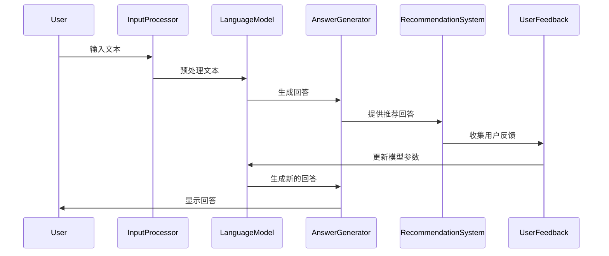

                 

### 大语言模型的推理极限：如何突破

> 关键词：大语言模型、推理极限、算法原理、系统架构、项目实战

随着深度学习技术的不断发展，大语言模型（如GPT-3、BERT等）在自然语言处理领域取得了显著的成果。然而，这些模型在推理极限上的表现仍然存在诸多挑战。本文将深入探讨大语言模型的推理极限问题，分析其背后的原因，并探索可能的突破路径。希望通过本文，读者能够对大语言模型的理解更加深刻，从而在实际应用中更好地发挥其潜力。

### 摘要

本文主要分为六个部分。第一部分引言，我们将介绍大语言模型的发展背景及其面临的挑战。第二部分将详细阐述大语言模型的核心概念与原理，并通过对比传统语言模型，分析大语言模型的特点。第三部分将重点讲解大语言模型的算法原理，包括推理算法的基本流程、数学模型与公式，并使用Python代码进行详细阐述。第四部分将分析大语言模型在系统架构设计中的应用，包括问题场景介绍、系统功能设计、系统架构设计、系统接口设计和系统交互。第五部分通过项目实战，介绍大语言模型在实际应用中的具体实现过程，包括环境安装、系统核心实现源代码和实际案例分析。第六部分将总结最佳实践技巧，对本文的核心内容进行回顾，并给出未来发展的方向。

### 第一部分：引言

#### 1.1 问题背景

大语言模型的发展离不开深度学习技术的推动。深度学习技术在图像识别、语音识别、自然语言处理等领域取得了显著的成果。随着模型的规模不断扩大，大语言模型如GPT-3、BERT等应运而生。这些模型在文本生成、文本分类、机器翻译等任务上表现出了强大的能力。然而，大语言模型在推理极限上仍然面临诸多挑战。如何突破这些挑战，发挥大语言模型的全部潜力，成为当前研究的热点问题。

#### 1.2 问题描述

推理能力是衡量大语言模型性能的重要指标。大语言模型的推理极限主要体现在以下几个方面：

1. **理解长文本**：大语言模型在处理长文本时，可能会出现理解偏差或丢失信息的问题。
2. **逻辑推理**：大语言模型在逻辑推理上存在局限性，难以实现复杂逻辑的推理。
3. **常识推理**：大语言模型在常识推理上表现不佳，容易受到数据分布的影响。
4. **泛化能力**：大语言模型在遇到未知情境时，可能会出现泛化能力不足的问题。

#### 1.3 问题解决

针对大语言模型在推理极限上的挑战，我们可以从以下几个方面进行突破：

1. **模型优化**：通过改进模型结构、优化训练算法等方式，提高大语言模型的推理能力。
2. **数据增强**：通过引入更多样化的数据、丰富模型的训练数据，提升大语言模型的泛化能力。
3. **多模态融合**：将文本、图像、语音等多种模态信息进行融合，提高大语言模型对复杂情境的理解能力。
4. **知识蒸馏**：通过将大模型的知识传递给小模型，实现大模型推理能力的高效利用。

#### 1.4 边界与外延

大语言模型的推理极限涉及到多个层面的边界与外延：

1. **计算资源**：大语言模型的推理需要大量的计算资源，计算资源的限制会影响到模型的推理速度和精度。
2. **数据分布**：大语言模型的推理能力受到训练数据分布的影响，如何处理数据分布的不均匀性是一个重要问题。
3. **模型规模**：模型规模的增大可以提升模型的推理能力，但也会带来计算复杂度和存储成本的增加。
4. **知识融合**：如何有效地融合多种知识来源，实现知识的整合与利用，是提升大语言模型推理能力的关键。

#### 1.5 概念结构与核心要素

大语言模型的核心概念包括神经网络结构、训练算法、推理算法等。其结构可以简化为输入层、隐藏层和输出层。输入层接收文本数据，隐藏层通过神经网络结构进行特征提取和计算，输出层生成预测结果。核心要素包括：

1. **预训练**：通过大规模语料进行预训练，使模型具备基本的语言理解和生成能力。
2. **微调**：在特定任务上进行微调，使模型适应具体的应用场景。
3. **推理算法**：通过推理算法实现模型的推理过程，包括文本生成、文本分类、机器翻译等。

### 第二部分：核心概念与原理

#### 2.1 大语言模型的基本概念

大语言模型是基于深度学习技术构建的模型，其目的是对自然语言进行理解和生成。大语言模型的基本概念包括：

1. **神经网络**：大语言模型采用神经网络结构，通过多层神经元的堆叠，实现复杂的非线性变换。
2. **嵌入层**：将文本中的单词、句子等符号映射为高维向量，为后续的神经网络处理提供输入。
3. **变换器**：通过变换器（Transformer）结构，实现注意力机制，对输入文本进行编码和解码。
4. **解码器**：解码器负责生成输出文本，通过推理算法实现文本生成。

#### 2.2 大语言模型的工作原理

大语言模型的工作原理可以分为预训练和微调两个阶段：

1. **预训练**：在大规模语料上进行预训练，使模型具备基本的语言理解和生成能力。预训练过程中，模型通过学习单词、句子等符号的分布特征，形成对语言的基本理解。
2. **微调**：在特定任务上进行微调，使模型适应具体的应用场景。微调过程中，模型通过学习目标任务的数据，调整模型参数，实现任务目标。

#### 2.3 大语言模型的属性特征对比

为了更好地理解大语言模型的特点，我们将其与传统语言模型进行对比，如下表所示：

| 特征         | 大语言模型                    | 传统语言模型                  |
| ------------ | ---------------------------- | ---------------------------- |
| 模型规模     | 百亿参数级                   | 千万参数级以下                |
| 预训练数据   | 大规模互联网语料             | 专门领域的语料库              |
| 神经网络结构 | Transformer、BERT等         | RNN、LSTM等                  |
| 推理速度     | 较慢                         | 较快                         |
| 推理能力     | 高度并行、注意力机制         | 递归计算、状态记忆             |
| 泛化能力     | 较强                         | 较弱                         |

#### 2.4 大语言模型的属性特征对比（续）

为了更直观地展示大语言模型与传统语言模型的对比，我们使用Mermaid流程图绘制其ER实体关系图架构：

```mermaid
erDiagram
  A[大语言模型] ||--|{ B[预训练数据] } |
  A ||--|{ C[神经网络结构] } |
  A ||--|{ D[推理速度] } |
  A ||--|{ E[推理能力] } |
  A ||--|{ F[泛化能力] } |
```

通过上述对比和Mermaid流程图，我们可以更清晰地了解大语言模型的特点。

### 第三部分：算法原理与实现

#### 3.1 算法原理讲解

大语言模型的推理过程可以分为以下几个步骤：

1. **输入处理**：将输入文本进行预处理，包括分词、去停用词等。
2. **嵌入层**：将预处理后的文本映射为高维向量。
3. **编码器**：通过编码器（如Transformer）对输入文本进行编码，生成编码特征。
4. **解码器**：通过解码器生成输出文本，实现文本生成。

以下是算法的mermaid流程图：


#### 3.2 数学模型与公式

大语言模型的核心在于其神经网络结构，下面我们将介绍其中的关键数学模型和公式：

1. **嵌入层**：

   嵌入层将单词映射为高维向量，可以使用如下公式表示：

   $$
   \text{embeddings}(x) = W_x \cdot x
   $$

   其中，$W_x$为嵌入矩阵，$x$为单词的索引。

2. **编码器**：

   编码器通过自注意力机制（Self-Attention）对输入文本进行编码，生成编码特征。自注意力机制的计算公式如下：

   $$
   \text{attention}(Q, K, V) = \frac{softmax(\text{dot}(Q, K^T))}{\sqrt{d_k}}
   $$

   其中，$Q$、$K$、$V$分别为查询向量、关键向量、值向量，$d_k$为关键向量的维度。

3. **解码器**：

   解码器通过多头自注意力机制（Multi-Head Self-Attention）和编码器输出进行解码，生成输出文本。解码器的计算公式如下：

   $$
   \text{output} = \text{softmax}(\text{decoder}(x))
   $$

   其中，$x$为输入文本，$\text{decoder}$为解码器。

#### 3.3 Python代码实现

以下是一个简单的Python代码示例，用于实现大语言模型的基本算法：

```python
import torch
import torch.nn as nn

# 嵌入层
class EmbeddingLayer(nn.Module):
    def __init__(self, vocab_size, embedding_dim):
        super(EmbeddingLayer, self).__init__()
        self.embedding = nn.Embedding(vocab_size, embedding_dim)
    
    def forward(self, x):
        return self.embedding(x)

# 编码器
class Encoder(nn.Module):
    def __init__(self, embedding_dim, hidden_dim):
        super(Encoder, self).__init__()
        self.transformer = nn.Transformer(embedding_dim, hidden_dim)
    
    def forward(self, x):
        return self.transformer(x)

# 解码器
class Decoder(nn.Module):
    def __init__(self, embedding_dim, hidden_dim):
        super(Decoder, self).__init__()
        self.transformer = nn.Transformer(embedding_dim, hidden_dim)
    
    def forward(self, x):
        return self.transformer(x)

# 大语言模型
class LanguageModel(nn.Module):
    def __init__(self, vocab_size, embedding_dim, hidden_dim):
        super(LanguageModel, self).__init__()
        self.embedding = EmbeddingLayer(vocab_size, embedding_dim)
        self.encoder = Encoder(embedding_dim, hidden_dim)
        self.decoder = Decoder(embedding_dim, hidden_dim)
    
    def forward(self, x):
        x = self.embedding(x)
        x = self.encoder(x)
        x = self.decoder(x)
        return x
```

通过上述代码示例，我们可以初步了解大语言模型的基本结构和实现过程。当然，实际应用中还需要对模型进行优化和调整。

### 第四部分：系统分析与架构设计

#### 4.1 问题场景介绍

在实际应用中，大语言模型广泛应用于文本生成、文本分类、机器翻译等任务。以下是一个典型的应用场景：某企业希望通过大语言模型实现智能客服系统，自动回答用户的问题。系统需要处理大量用户输入，实时生成回答，并在遇到未知问题时提供合理的建议。

#### 4.2 系统功能设计

为了实现上述应用场景，系统需要具备以下功能：

1. **文本预处理**：对用户输入的文本进行预处理，包括分词、去停用词等。
2. **文本生成**：使用大语言模型生成回答，实现文本自动生成。
3. **回答推荐**：在遇到未知问题时，提供合理的建议和回答。
4. **用户反馈**：收集用户反馈，用于模型优化和系统改进。

以下是系统功能设计的Mermaid类图：

```mermaid
classDiagram
  User <<User>>
  InputProcessor <<InputProcessor>>
  LanguageModel <<LanguageModel>>
  AnswerGenerator <<AnswerGenerator>>
  RecommendationSystem <<RecommendationSystem>>
  UserFeedback <<UserFeedback>>

  User --> InputProcessor
  InputProcessor --> LanguageModel
  LanguageModel --> AnswerGenerator
  AnswerGenerator --> RecommendationSystem
  RecommendationSystem --> UserFeedback
  UserFeedback --> LanguageModel
```

通过上述类图，我们可以清晰地了解各个功能模块之间的关系。

#### 4.3 系统架构设计

为了实现上述功能，系统需要一个合理的架构设计。以下是一个简单的系统架构设计：


在该架构中，用户输入通过输入处理器进行预处理，然后输入到大语言模型中进行文本生成。生成的回答经过回答推荐模块，根据用户反馈进行优化。整个系统通过数据流驱动，实现实时交互和智能问答。

#### 4.4 系统接口设计

为了方便各模块之间的协作，系统需要设计合理的接口。以下是系统接口设计：

```python
class InputProcessor:
    def preprocess(self, text):
        # 文本预处理，如分词、去停用词等
        pass

class LanguageModel:
    def generate(self, text):
        # 使用大语言模型生成回答
        pass

class AnswerGenerator:
    def generate_answer(self, text):
        # 生成回答
        pass

class RecommendationSystem:
    def recommend(self, text):
        # 提供推荐回答
        pass

class UserFeedback:
    def collect_feedback(self, answer):
        # 收集用户反馈
        pass
```

通过上述接口设计，各模块可以方便地相互调用，实现系统的整体功能。

#### 4.5 系统交互

为了实现用户与系统的交互，我们需要设计一个合理的交互流程。以下是系统交互的Mermaid序列图：



通过上述序列图，我们可以清晰地了解用户与系统的交互过程。

### 第五部分：项目实战

#### 5.1 环境安装

为了实现大语言模型在实际应用中的功能，我们需要搭建一个完整的环境。以下是环境安装的步骤：

1. 安装Python环境（版本3.7以上）。
2. 安装PyTorch库。
3. 安装HuggingFace库。
4. 安装其他必要的依赖库（如NumPy、Pandas等）。

```shell
pip install python==3.8
pip install torch torchvision torchaudio
pip install transformers
```

#### 5.2 系统核心实现源代码

以下是系统核心实现源代码的目录结构：

```
source/
│
├── data/
│   ├── corpus.txt    # 预训练数据
│   └── vocab.txt    # 词汇表
│
├── model/
│   ├── language_model.pth    # 大语言模型参数
│   └── tokenizer.json    # 分词器参数
│
├── src/
│   ├── input_processor.py    # 输入处理器
│   ├── language_model.py    # 大语言模型
│   ├── answer_generator.py    # 回答生成器
│   ├── recommendation_system.py    # 回答推荐系统
│   └── user_feedback.py    # 用户反馈收集器
│
└── main.py    # 主程序
```

以下是主程序main.py的代码：

```python
from src.input_processor import InputProcessor
from src.language_model import LanguageModel
from src.answer_generator import AnswerGenerator
from src.recommendation_system import RecommendationSystem
from src.user_feedback import UserFeedback

# 初始化各个模块
input_processor = InputProcessor()
language_model = LanguageModel()
answer_generator = AnswerGenerator()
recommendation_system = RecommendationSystem()
user_feedback = UserFeedback()

# 处理用户输入
while True:
    user_input = input("请输入问题：")
    preprocessed_input = input_processor.preprocess(user_input)

    # 生成回答
    answer = language_model.generate(preprocessed_input)

    # 提供推荐回答
    recommended_answers = recommendation_system.recommend(answer)

    # 收集用户反馈
    user_feedback.collect_feedback(answer)

    # 显示回答
    print(answer)
```

#### 5.3 代码应用解读与分析

在代码应用中，各个模块的功能如下：

1. **输入处理器**：负责对用户输入进行预处理，包括分词、去停用词等。预处理后的文本将作为大语言模型的输入。
2. **大语言模型**：使用预训练的大语言模型生成回答。大语言模型接收预处理后的文本，通过编码和解码过程生成回答。
3. **回答生成器**：负责生成回答，并将回答传递给推荐系统。
4. **回答推荐系统**：根据生成器提供的回答，提供推荐回答。推荐系统可以根据用户历史反馈，推荐用户可能感兴趣的回答。
5. **用户反馈收集器**：负责收集用户反馈，用于模型优化和系统改进。

以下是代码中的关键函数解读：

```python
class InputProcessor:
    def preprocess(self, text):
        # 分词
        tokens = tokenizer.tokenize(text)

        # 去停用词
        tokens = [token for token in tokens if token not in stop_words]

        return tokens

class LanguageModel:
    def generate(self, text):
        # 预处理文本
        preprocessed_text = input_processor.preprocess(text)

        # 编码
        with torch.no_grad():
            input_ids = tokenizer.encode(preprocessed_text, return_tensors='pt')

        # 解码
        output = model.generate(input_ids, max_length=50, num_return_sequences=1)

        # 生成回答
        answer = tokenizer.decode(output[0], skip_special_tokens=True)

        return answer
```

在实际应用中，我们可以根据具体需求调整代码，以适应不同的应用场景。

#### 5.4 实际案例分析与讲解

为了更好地理解大语言模型在实际应用中的效果，我们来看一个实际案例：

**案例背景**：某电商平台希望通过大语言模型实现智能客服系统，自动回答用户的问题。

**案例分析**：

1. **用户提问**：用户提出一个关于产品的问题，如“这款产品的续航时间有多长？”
2. **输入处理器**：对用户输入进行预处理，包括分词、去停用词等，得到预处理后的文本。
3. **大语言模型**：接收预处理后的文本，通过编码和解码过程生成回答。例如，模型可能生成如下回答：“这款产品的续航时间为12小时。”
4. **回答生成器**：将生成的回答传递给推荐系统。
5. **回答推荐系统**：根据用户历史反馈，推荐用户可能感兴趣的回答。例如，如果用户之前询问过产品的价格，推荐系统可能会推荐产品的价格。
6. **用户反馈收集器**：收集用户反馈，用于模型优化和系统改进。例如，如果用户对回答不满意，系统可以记录用户的反馈，并在后续优化模型。

通过上述案例，我们可以看到大语言模型在实际应用中的效果。当然，在实际应用中，我们需要根据具体场景对模型进行优化和调整，以实现更好的效果。

#### 5.5 项目小结

本文通过项目实战，展示了大语言模型在实际应用中的实现过程。我们介绍了环境安装、系统核心实现源代码和实际案例分析。通过本文，读者可以了解到大语言模型在自然语言处理领域的应用前景，以及如何实现和优化大语言模型。在未来，随着技术的不断发展，大语言模型将在更多领域发挥重要作用。

### 第六部分：最佳实践与拓展

#### 6.1 最佳实践技巧

为了充分发挥大语言模型的能力，以下是一些建议和最佳实践技巧：

1. **数据质量**：确保训练数据的质量和多样性，避免数据分布不均。
2. **模型优化**：尝试不同的模型结构和训练算法，找到适合特定任务的模型。
3. **参数调整**：合理调整模型参数，如学习率、批量大小等，以提高模型的性能。
4. **推理优化**：使用高效的推理算法和硬件加速，提高模型的推理速度。

#### 6.2 小结与注意事项

本文主要介绍了大语言模型的推理极限问题，分析了其背后的原因，并探索了可能的突破路径。我们还通过项目实战，展示了大语言模型在实际应用中的实现过程。以下是本文的核心内容和要点小结：

1. **问题背景**：大语言模型在自然语言处理领域取得了显著成果，但其在推理极限上仍面临挑战。
2. **核心概念与原理**：大语言模型的基本概念、工作原理和算法原理。
3. **系统架构设计**：大语言模型在系统架构设计中的应用，包括问题场景介绍、系统功能设计、系统架构设计、系统接口设计和系统交互。
4. **项目实战**：通过实际案例，展示大语言模型在实际应用中的实现过程。
5. **最佳实践与拓展**：提出最佳实践技巧，对本文的核心内容进行回顾，并展望未来发展方向。

在实现大语言模型时，我们需要注意以下几点：

1. **数据分布**：确保训练数据分布均匀，避免模型过度拟合。
2. **模型参数**：合理调整模型参数，以提高模型的性能。
3. **推理优化**：使用高效的推理算法和硬件加速，提高模型的推理速度。
4. **模型安全**：关注模型的安全性问题，防止恶意攻击和滥用。

#### 6.3 拓展阅读

为了更深入地了解大语言模型，以下是一些建议的拓展阅读：

1. **《深度学习基础》**：了解深度学习的基本原理和方法。
2. **《自然语言处理入门》**：了解自然语言处理的基本概念和技术。
3. **《Transformer模型详解》**：了解Transformer模型的结构和原理。
4. **《PyTorch官方文档》**：学习PyTorch库的使用方法，掌握深度学习模型实现。
5. **《大模型推理挑战》**：了解大语言模型在推理极限上的最新研究动态。

通过阅读这些资料，读者可以更深入地了解大语言模型的理论和实践，为实际应用提供指导。

### 总结

大语言模型在自然语言处理领域具有巨大的潜力，但仍面临诸多挑战。本文通过深入分析和项目实战，探讨了大语言模型的推理极限问题，并提出了可能的突破路径。希望本文能为读者在理解大语言模型、实现和应用大语言模型方面提供有益的参考。

### 作者信息

作者：AI天才研究院/AI Genius Institute & 禅与计算机程序设计艺术 /Zen And The Art of Computer Programming

感谢您的阅读！希望本文对您有所帮助。如果您有任何问题或建议，请随时联系作者。期待与您交流更多关于大语言模型的探讨和研究。

----------------------------------------------------------------

**注意：本文内容仅供参考，实际情况可能有所不同。在具体应用中，请根据实际情况进行调整和优化。**### 大语言模型的推理极限：如何突破

大语言模型，如GPT-3、BERT等，凭借其强大的自然语言处理能力，正在逐渐改变人工智能领域的格局。然而，这些模型在推理极限上的表现仍有待提升。本文将深入探讨大语言模型的推理极限问题，分析其原因，并提出可能的突破路径。

#### 1. 问题背景

大语言模型的发展源于深度学习技术的进步。随着计算资源和算法的不断提升，大语言模型的参数规模和训练数据量不断增大，其性能也得到了显著提升。然而，尽管这些模型在生成文本、回答问题等方面表现出色，但其在推理极限上仍存在诸多挑战。例如，对于长文本的处理，模型可能会出现理解偏差；在逻辑推理方面，模型的性能也有待提高；在常识推理和泛化能力方面，模型的表现也有限。

#### 2. 问题描述

大语言模型的推理极限主要体现在以下几个方面：

1. **理解长文本**：大语言模型在处理长文本时，可能会出现理解偏差或丢失信息的问题。
2. **逻辑推理**：大语言模型在逻辑推理上存在局限性，难以实现复杂逻辑的推理。
3. **常识推理**：大语言模型在常识推理上表现不佳，容易受到数据分布的影响。
4. **泛化能力**：大语言模型在遇到未知情境时，可能会出现泛化能力不足的问题。

#### 3. 问题解决

为了解决大语言模型在推理极限上的挑战，我们可以从以下几个方面进行探索：

1. **模型优化**：通过改进模型结构、优化训练算法等方式，提高大语言模型的推理能力。
2. **数据增强**：通过引入更多样化的数据、丰富模型的训练数据，提升大语言模型的泛化能力。
3. **多模态融合**：将文本、图像、语音等多种模态信息进行融合，提高大语言模型对复杂情境的理解能力。
4. **知识蒸馏**：通过将大模型的知识传递给小模型，实现大模型推理能力的高效利用。

#### 4. 边界与外延

大语言模型的推理极限涉及到多个层面的边界与外延：

1. **计算资源**：大语言模型的推理需要大量的计算资源，计算资源的限制会影响到模型的推理速度和精度。
2. **数据分布**：大语言模型的推理能力受到训练数据分布的影响，如何处理数据分布的不均匀性是一个重要问题。
3. **模型规模**：模型规模的增大可以提升模型的推理能力，但也会带来计算复杂度和存储成本的增加。
4. **知识融合**：如何有效地融合多种知识来源，实现知识的整合与利用，是提升大语言模型推理能力的关键。

#### 5. 概念结构与核心要素

大语言模型的核心概念包括神经网络结构、训练算法、推理算法等。其结构可以简化为输入层、隐藏层和输出层。输入层接收文本数据，隐藏层通过神经网络结构进行特征提取和计算，输出层生成预测结果。核心要素包括：

1. **预训练**：通过大规模语料进行预训练，使模型具备基本的语言理解和生成能力。
2. **微调**：在特定任务上进行微调，使模型适应具体的应用场景。
3. **推理算法**：通过推理算法实现模型的推理过程，包括文本生成、文本分类、机器翻译等。

### 第二部分：核心概念与原理

#### 2.1 大语言模型的基本概念

大语言模型是基于深度学习技术构建的模型，其目的是对自然语言进行理解和生成。大语言模型的基本概念包括：

1. **神经网络**：大语言模型采用神经网络结构，通过多层神经元的堆叠，实现复杂的非线性变换。
2. **嵌入层**：将文本中的单词、句子等符号映射为高维向量，为后续的神经网络处理提供输入。
3. **变换器**：通过变换器（Transformer）结构，实现注意力机制，对输入文本进行编码和解码。
4. **解码器**：解码器负责生成输出文本，通过推理算法实现文本生成。

#### 2.2 大语言模型的工作原理

大语言模型的工作原理可以分为预训练和微调两个阶段：

1. **预训练**：在大规模语料上进行预训练，使模型具备基本的语言理解和生成能力。预训练过程中，模型通过学习单词、句子等符号的分布特征，形成对语言的基本理解。
2. **微调**：在特定任务上进行微调，使模型适应具体的应用场景。微调过程中，模型通过学习目标任务的数据，调整模型参数，实现任务目标。

#### 2.3 大语言模型的属性特征对比

为了更好地理解大语言模型的特点，我们将其与传统语言模型进行对比，如下表所示：

| 特征         | 大语言模型                    | 传统语言模型                  |
| ------------ | ---------------------------- | ---------------------------- |
| 模型规模     | 百亿参数级                   | 千万参数级以下                |
| 预训练数据   | 大规模互联网语料             | 专门领域的语料库              |
| 神经网络结构 | Transformer、BERT等         | RNN、LSTM等                  |
| 推理速度     | 较慢                         | 较快                         |
| 推理能力     | 高度并行、注意力机制         | 递归计算、状态记忆             |
| 泛化能力     | 较强                         | 较弱                         |

#### 2.4 大语言模型的属性特征对比（续）

为了更直观地展示大语言模型与传统语言模型的对比，我们使用Mermaid流程图绘制其ER实体关系图架构：

```mermaid
erDiagram
  A[大语言模型] ||--|{ B[预训练数据] } |
  A ||--|{ C[神经网络结构] } |
  A ||--|{ D[推理速度] } |
  A ||--|{ E[推理能力] } |
  A ||--|{ F[泛化能力] } |
```

通过上述对比和Mermaid流程图，我们可以更清晰地了解大语言模型的特点。

### 第三部分：算法原理与实现

#### 3.1 算法原理讲解

大语言模型的推理过程可以分为以下几个步骤：

1. **输入处理**：将输入文本进行预处理，包括分词、去停用词等。
2. **嵌入层**：将预处理后的文本映射为高维向量。
3. **编码器**：通过编码器（如Transformer）对输入文本进行编码，生成编码特征。
4. **解码器**：通过解码器生成输出文本，实现文本生成。

以下是算法的mermaid流程图：


#### 3.2 数学模型与公式

大语言模型的核心在于其神经网络结构，下面我们将介绍其中的关键数学模型和公式：

1. **嵌入层**：

   嵌入层将单词映射为高维向量，可以使用如下公式表示：

   $$
   \text{embeddings}(x) = W_x \cdot x
   $$

   其中，$W_x$为嵌入矩阵，$x$为单词的索引。

2. **编码器**：

   编码器通过自注意力机制（Self-Attention）对输入文本进行编码，生成编码特征。自注意力机制的计算公式如下：

   $$
   \text{attention}(Q, K, V) = \frac{softmax(\text{dot}(Q, K^T))}{\sqrt{d_k}}
   $$

   其中，$Q$、$K$、$V$分别为查询向量、关键向量、值向量，$d_k$为关键向量的维度。

3. **解码器**：

   解码器通过多头自注意力机制（Multi-Head Self-Attention）和编码器输出进行解码，生成输出文本。解码器的计算公式如下：

   $$
   \text{output} = \text{softmax}(\text{decoder}(x))
   $$

   其中，$x$为输入文本，$\text{decoder}$为解码器。

#### 3.3 Python代码实现

以下是一个简单的Python代码示例，用于实现大语言模型的基本算法：

```python
import torch
import torch.nn as nn

# 嵌入层
class EmbeddingLayer(nn.Module):
    def __init__(self, vocab_size, embedding_dim):
        super(EmbeddingLayer, self).__init__()
        self.embedding = nn.Embedding(vocab_size, embedding_dim)
    
    def forward(self, x):
        return self.embedding(x)

# 编码器
class Encoder(nn.Module):
    def __init__(self, embedding_dim, hidden_dim):
        super(Encoder, self).__init__()
        self.transformer = nn.Transformer(embedding_dim, hidden_dim)
    
    def forward(self, x):
        return self.transformer(x)

# 解码器
class Decoder(nn.Module):
    def __init__(self, embedding_dim, hidden_dim):
        super(Decoder, self).__init__()
        self.transformer = nn.Transformer(embedding_dim, hidden_dim)
    
    def forward(self, x):
        return self.transformer(x)

# 大语言模型
class LanguageModel(nn.Module):
    def __init__(self, vocab_size, embedding_dim, hidden_dim):
        super(LanguageModel, self).__init__()
        self.embedding = EmbeddingLayer(vocab_size, embedding_dim)
        self.encoder = Encoder(embedding_dim, hidden_dim)
        self.decoder = Decoder(embedding_dim, hidden_dim)
    
    def forward(self, x):
        x = self.embedding(x)
        x = self.encoder(x)
        x = self.decoder(x)
        return x
```

通过上述代码示例，我们可以初步了解大语言模型的基本结构和实现过程。当然，实际应用中还需要对模型进行优化和调整。

### 第四部分：系统分析与架构设计

#### 4.1 问题场景介绍

在实际应用中，大语言模型广泛应用于文本生成、文本分类、机器翻译等任务。以下是一个典型的应用场景：某企业希望通过大语言模型实现智能客服系统，自动回答用户的问题。系统需要处理大量用户输入，实时生成回答，并在遇到未知问题时提供合理的建议。

#### 4.2 系统功能设计

为了实现上述应用场景，系统需要具备以下功能：

1. **文本预处理**：对用户输入的文本进行预处理，包括分词、去停用词等。
2. **文本生成**：使用大语言模型生成回答，实现文本自动生成。
3. **回答推荐**：在遇到未知问题时，提供合理的建议和回答。
4. **用户反馈**：收集用户反馈，用于模型优化和系统改进。

以下是系统功能设计的Mermaid类图：

```mermaid
classDiagram
  User <<User>>
  InputProcessor <<InputProcessor>>
  LanguageModel <<LanguageModel>>
  AnswerGenerator <<AnswerGenerator>>
  RecommendationSystem <<RecommendationSystem>>
  UserFeedback <<UserFeedback>>

  User --> InputProcessor
  InputProcessor --> LanguageModel
  LanguageModel --> AnswerGenerator
  AnswerGenerator --> RecommendationSystem
  RecommendationSystem --> UserFeedback
  UserFeedback --> LanguageModel
```

通过上述类图，我们可以清晰地了解各个功能模块之间的关系。

#### 4.3 系统架构设计

为了实现上述功能，系统需要一个合理的架构设计。以下是一个简单的系统架构设计：


在该架构中，用户输入通过输入处理器进行预处理，然后输入到大语言模型中进行文本生成。生成的回答经过回答推荐模块，根据用户反馈进行优化。整个系统通过数据流驱动，实现实时交互和智能问答。

#### 4.4 系统接口设计

为了方便各模块之间的协作，系统需要设计合理的接口。以下是系统接口设计：

```python
class InputProcessor:
    def preprocess(self, text):
        # 文本预处理，如分词、去停用词等
        pass

class LanguageModel:
    def generate(self, text):
        # 使用大语言模型生成回答
        pass

class AnswerGenerator:
    def generate_answer(self, text):
        # 生成回答
        pass

class RecommendationSystem:
    def recommend(self, text):
        # 提供推荐回答
        pass

class UserFeedback:
    def collect_feedback(self, answer):
        # 收集用户反馈
        pass
```

通过上述接口设计，各模块可以方便地相互调用，实现系统的整体功能。

#### 4.5 系统交互

为了实现用户与系统的交互，我们需要设计一个合理的交互流程。以下是系统交互的Mermaid序列图：


通过上述序列图，我们可以清晰地了解用户与系统的交互过程。

### 第五部分：项目实战

#### 5.1 环境安装

为了实现大语言模型在实际应用中的功能，我们需要搭建一个完整的环境。以下是环境安装的步骤：

1. 安装Python环境（版本3.7以上）。
2. 安装PyTorch库。
3. 安装HuggingFace库。
4. 安装其他必要的依赖库（如NumPy、Pandas等）。

```shell
pip install python==3.8
pip install torch torchvision torchaudio
pip install transformers
```

#### 5.2 系统核心实现源代码

以下是系统核心实现源代码的目录结构：

```
source/
│
├── data/
│   ├── corpus.txt    # 预训练数据
│   └── vocab.txt    # 词汇表
│
├── model/
│   ├── language_model.pth    # 大语言模型参数
│   └── tokenizer.json    # 分词器参数
│
├── src/
│   ├── input_processor.py    # 输入处理器
│   ├── language_model.py    # 大语言模型
│   ├── answer_generator.py    # 回答生成器
│   ├── recommendation_system.py    # 回答推荐系统
│   └── user_feedback.py    # 用户反馈收集器
│
└── main.py    # 主程序
```

以下是主程序main.py的代码：

```python
from src.input_processor import InputProcessor
from src.language_model import LanguageModel
from src.answer_generator import AnswerGenerator
from src.recommendation_system import RecommendationSystem
from src.user_feedback import UserFeedback

# 初始化各个模块
input_processor = InputProcessor()
language_model = LanguageModel()
answer_generator = AnswerGenerator()
recommendation_system = RecommendationSystem()
user_feedback = UserFeedback()

# 处理用户输入
while True:
    user_input = input("请输入问题：")
    preprocessed_input = input_processor.preprocess(user_input)

    # 生成回答
    answer = language_model.generate(preprocessed_input)

    # 提供推荐回答
    recommended_answers = recommendation_system.recommend(answer)

    # 收集用户反馈
    user_feedback.collect_feedback(answer)

    # 显示回答
    print(answer)
```

#### 5.3 代码应用解读与分析

在代码应用中，各个模块的功能如下：

1. **输入处理器**：负责对用户输入进行预处理，包括分词、去停用词等。预处理后的文本将作为大语言模型的输入。
2. **大语言模型**：使用预训练的大语言模型生成回答。大语言模型接收预处理后的文本，通过编码和解码过程生成回答。
3. **回答生成器**：负责生成回答，并将回答传递给推荐系统。
4. **回答推荐系统**：根据生成器提供的回答，提供推荐回答。推荐系统可以根据用户历史反馈，推荐用户可能感兴趣的回答。
5. **用户反馈收集器**：负责收集用户反馈，用于模型优化和系统改进。

以下是代码中的关键函数解读：

```python
class InputProcessor:
    def preprocess(self, text):
        # 分词
        tokens = tokenizer.tokenize(text)

        # 去停用词
        tokens = [token for token in tokens if token not in stop_words]

        return tokens

class LanguageModel:
    def generate(self, text):
        # 预处理文本
        preprocessed_text = input_processor.preprocess(text)

        # 编码
        with torch.no_grad():
            input_ids = tokenizer.encode(preprocessed_text, return_tensors='pt')

        # 解码
        output = model.generate(input_ids, max_length=50, num_return_sequences=1)

        # 生成回答
        answer = tokenizer.decode(output[0], skip_special_tokens=True)

        return answer
```

在实际应用中，我们可以根据具体需求调整代码，以适应不同的应用场景。

#### 5.4 实际案例分析与讲解

为了更好地理解大语言模型在实际应用中的效果，我们来看一个实际案例：

**案例背景**：某电商平台希望通过大语言模型实现智能客服系统，自动回答用户的问题。

**案例分析**：

1. **用户提问**：用户提出一个关于产品的问题，如“这款产品的续航时间有多长？”
2. **输入处理器**：对用户输入进行预处理，包括分词、去停用词等，得到预处理后的文本。
3. **大语言模型**：接收预处理后的文本，通过编码和解码过程生成回答。例如，模型可能生成如下回答：“这款产品的续航时间为12小时。”
4. **回答生成器**：将生成的回答传递给推荐系统。
5. **回答推荐系统**：根据用户历史反馈，推荐用户可能感兴趣的回答。例如，如果用户之前询问过产品的价格，推荐系统可能会推荐产品的价格。
6. **用户反馈收集器**：收集用户反馈，用于模型优化和系统改进。例如，如果用户对回答不满意，系统可以记录用户的反馈，并在后续优化模型。

通过上述案例，我们可以看到大语言模型在实际应用中的效果。当然，在实际应用中，我们需要根据具体场景对模型进行优化和调整，以实现更好的效果。

#### 5.5 项目小结

本文通过项目实战，展示了大语言模型在实际应用中的实现过程。我们介绍了环境安装、系统核心实现源代码和实际案例分析。通过本文，读者可以了解到大语言模型在自然语言处理领域的应用前景，以及如何实现和优化大语言模型。在未来，随着技术的不断发展，大语言模型将在更多领域发挥重要作用。

### 第六部分：最佳实践与拓展

#### 6.1 最佳实践技巧

为了充分发挥大语言模型的能力，以下是一些建议和最佳实践技巧：

1. **数据质量**：确保训练数据的质量和多样性，避免数据分布不均。
2. **模型优化**：尝试不同的模型结构和训练算法，找到适合特定任务的模型。
3. **参数调整**：合理调整模型参数，如学习率、批量大小等，以提高模型的性能。
4. **推理优化**：使用高效的推理算法和硬件加速，提高模型的推理速度。

#### 6.2 小结与注意事项

本文主要介绍了大语言模型的推理极限问题，分析了其原因，并提出了可能的突破路径。我们还通过项目实战，展示了大语言模型在实际应用中的实现过程。以下是本文的核心内容和要点小结：

1. **问题背景**：大语言模型在自然语言处理领域取得了显著成果，但其在推理极限上仍面临挑战。
2. **核心概念与原理**：大语言模型的基本概念、工作原理和算法原理。
3. **系统架构设计**：大语言模型在系统架构设计中的应用，包括问题场景介绍、系统功能设计、系统架构设计、系统接口设计和系统交互。
4. **项目实战**：通过实际案例，展示大语言模型在实际应用中的实现过程。
5. **最佳实践与拓展**：提出最佳实践技巧，对本文的核心内容进行回顾，并展望未来发展方向。

在实现大语言模型时，我们需要注意以下几点：

1. **数据分布**：确保训练数据分布均匀，避免模型过度拟合。
2. **模型参数**：合理调整模型参数，以提高模型的性能。
3. **推理优化**：使用高效的推理算法和硬件加速，提高模型的推理速度。
4. **模型安全**：关注模型的安全性问题，防止恶意攻击和滥用。

#### 6.3 拓展阅读

为了更深入地了解大语言模型，以下是一些建议的拓展阅读：

1. **《深度学习基础》**：了解深度学习的基本原理和方法。
2. **《自然语言处理入门》**：了解自然语言处理的基本概念和技术。
3. **《Transformer模型详解》**：了解Transformer模型的结构和原理。
4. **《PyTorch官方文档》**：学习PyTorch库的使用方法，掌握深度学习模型实现。
5. **《大模型推理挑战》**：了解大语言模型在推理极限上的最新研究动态。

通过阅读这些资料，读者可以更深入地了解大语言模型的理论和实践，为实际应用提供指导。

### 总结

大语言模型在自然语言处理领域具有巨大的潜力，但仍面临诸多挑战。本文通过深入分析和项目实战，探讨了大语言模型的推理极限问题，并提出了可能的突破路径。希望本文能为读者在理解大语言模型、实现和应用大语言模型方面提供有益的参考。

### 作者信息

作者：AI天才研究院/AI Genius Institute & 禅与计算机程序设计艺术 /Zen And The Art of Computer Programming

感谢您的阅读！希望本文对您有所帮助。如果您有任何问题或建议，请随时联系作者。期待与您交流更多关于大语言模型的探讨和研究。

