                 

# 大语言模型的推理能力：未来发展方向

## 关键词
- 大语言模型
- 推理能力
- 算法优化
- 数学模型
- 应用领域
- 未来发展

## 摘要
本文将深入探讨大语言模型的推理能力及其未来发展方向。首先，我们将回顾大语言模型的背景和基本原理，然后分析其推理能力的核心技术。接着，我们将探讨大语言模型在不同领域的应用，并展望其未来的发展方向。通过本文的阅读，读者将能够全面了解大语言模型推理能力的现状及其潜在的技术突破。

## 目录大纲设计思路

### 第一部分：背景与基础

- **第1章：大语言模型与推理能力概述**
  - **问题背景**
  - **核心概念与联系**

- **第2章：大语言模型的发展历程与现状**
  - **发展历程**
  - **技术特点**

- **第3章：大语言模型推理能力的关键技术**
  - **推理算法原理**
  - **数学模型与公式**

- **第4章：大语言模型推理能力在不同领域的应用**
  - **自然语言处理**
  - **计算机视觉**

### 第二部分：算法原理与实现

- **第5章：大语言模型的基本原理**
  - **模型结构**
  - **训练方法**

- **第6章：推理能力的算法分析与优化**
  - **算法分析**
  - **优化方法**

- **第7章：数学模型与公式讲解**
  - **模型表示**
  - **计算方法**
  - **误差分析**

- **第8章：算法实现与Python代码示例**
  - **代码示例**
  - **实战应用**

### 第三部分：系统分析与架构设计

- **第9章：大语言模型推理系统的设计**
  - **问题场景**
  - **项目介绍**

- **第10章：系统功能与架构设计**
  - **功能设计**
  - **架构设计**

- **第11章：接口设计与交互设计**
  - **接口设计**
  - **交互设计**

### 第四部分：项目实战与案例分析

- **第12章：项目实战环境搭建**
  - **环境安装**
  - **系统核心实现**

- **第13章：系统核心实现与代码解读**
  - **代码解读**
  - **案例分析**

- **第14章：案例分析**
  - **实际案例**
  - **详细讲解**

- **第15章：项目小结与经验总结**
  - **小结**
  - **经验总结**

### 第五部分：最佳实践与拓展

- **第16章：最佳实践 tips**
  - **实践建议**

- **第17章：全书小结与展望**
  - **内容总结**
  - **未来展望**

- **第18章：注意事项与拓展阅读**
  - **注意事项**
  - **拓展阅读**

### 目录大纲结构

```markdown
# 大语言模型的推理能力：未来发展方向

# 第一部分：背景与基础

## 第1章：大语言模型与推理能力概述

## 第2章：大语言模型的发展历程与现状

## 第3章：大语言模型推理能力的关键技术

## 第4章：大语言模型推理能力在不同领域的应用

# 第二部分：算法原理与实现

## 第5章：大语言模型的基本原理

## 第6章：推理能力的算法分析与优化

## 第7章：数学模型与公式讲解

## 第8章：算法实现与Python代码示例

# 第三部分：系统分析与架构设计

## 第9章：大语言模型推理系统的设计

## 第10章：系统功能与架构设计

## 第11章：接口设计与交互设计

# 第四部分：项目实战与案例分析

## 第12章：项目实战环境搭建

## 第13章：系统核心实现与代码解读

## 第14章：案例分析

## 第15章：项目小结与经验总结

# 第五部分：最佳实践与拓展

## 第16章：最佳实践 tips

## 第17章：全书小结与展望

## 第18章：注意事项与拓展阅读
```

### 目录大纲内容

```markdown
----------------------------------------------------------------

## 第1章：大语言模型与推理能力概述

### 1.1 问题背景

#### 1.1.1 大语言模型的出现背景

#### 1.1.2 推理能力的现实需求

#### 1.1.3 大语言模型推理能力的研究意义

### 1.2 核心概念与联系

#### 1.2.1 大语言模型

#### 1.2.2 推理能力

#### 1.2.3 大语言模型与推理能力的关联

----------------------------------------------------------------

## 第2章：大语言模型的发展历程与现状

### 2.1 发展历程

#### 2.1.1 初期探索

#### 2.1.2 大爆炸时代

#### 2.1.3 现状分析

### 2.2 技术特点

#### 2.2.1 模型结构

#### 2.2.2 训练方法

#### 2.2.3 性能指标

----------------------------------------------------------------

## 第3章：大语言模型推理能力的关键技术

### 3.1 推理算法原理

#### 3.1.1 基本算法

#### 3.1.2 优化方法

### 3.2 数学模型与公式

#### 3.2.1 模型表示

#### 3.2.2 计算方法

#### 3.2.3 误差分析

----------------------------------------------------------------

## 第4章：大语言模型推理能力在不同领域的应用

### 4.1 自然语言处理

#### 4.1.1 文本生成

#### 4.1.2 机器翻译

#### 4.1.3 情感分析

### 4.2 计算机视觉

#### 4.2.1 对象识别

#### 4.2.2 场景理解

#### 4.2.3 视觉推理

----------------------------------------------------------------

## 第5章：大语言模型的基本原理

### 5.1 模型结构

#### 5.1.1 神经网络结构

#### 5.1.2 模型层次

### 5.2 训练方法

----------------------------------------------------------------

### 文章内容要求

**完整性要求**：文章内容必须完整，每个小节的内容必须丰富，具体详细讲解，核心内容必须包含：

- **背景介绍**：核心概念术语说明、问题背景、问题描述、问题解决、边界与外延、概念结构与核心要素组成。
- **核心概念与联系**：必须给出核心概念原理、概念属性特征对比表格和ER实体关系图架构的 Mermaid 流程图。
- **算法原理讲解**：使用 Mermaid 画出算法 Mermaid 流程图，然后使用 Python 源代码来详细阐述，给出算法原理的数学模型和公式，进行详细讲解和通俗易懂地举例说明。
- **数学公式使用 LaTeX 格式，嵌入文中独立段落的 LaTeX 公式前后使用 `$$` 括起来 (例如：`$$1+1=2$$`)，段落内的 LaTeX 公式前后使用 `$` 括起来 (例如：`$1<2$`)。
- **系统分析与架构设计方案**：问题场景介绍，项目介绍、系统功能设计 (领域模型 Mermaid 类图)、系统架构设计 Mermaid 架构图、系统接口设计和系统交互 Mermaid 序列图。
- **项目实战**：环境安装、系统核心实现、代码解读、案例分析、小结等。
- **最佳实践 tips、小结、注意事项、拓展阅读**：总结全书内容，提供实践建议和拓展阅读资源。

**字数要求**：文章字数在 10000 ～ 12000 字左右。

**格式要求**：文章内容使用 Markdown 格式输出。

**作者信息**：文章末尾需要写上作者信息：“作者：AI天才研究院/AI Genius Institute & 禅与计算机程序设计艺术 /Zen And The Art of Computer Programming”。# 第1章：大语言模型与推理能力概述

### 1.1 问题背景

#### 1.1.1 大语言模型的出现背景

大语言模型（Large Language Models，简称LLMs）的出现可以追溯到深度学习和神经网络技术的迅猛发展。在21世纪初，随着计算能力的提升和数据资源的丰富，科学家们开始探索如何利用这些资源来训练更加强大的神经网络模型。2013年，微软研究院提出了一种名为“深度神经网络”（Deep Neural Networks，简称DNNs）的技术，它可以在语音识别、图像识别等领域取得突破性的成果。

随后的几年里，DNNs的技术逐渐成熟，并且得到了广泛应用。然而，研究人员发现，DNNs在处理自然语言文本方面存在一定的局限性。为了解决这一问题，研究人员开始尝试将DNNs与自然语言处理（Natural Language Processing，简称NLP）技术相结合，从而诞生了大语言模型。

#### 1.1.2 推理能力的现实需求

推理能力是人工智能的核心之一，尤其在自然语言处理领域，推理能力的重要性尤为突出。在实际应用中，用户往往需要机器能够理解复杂的语义和逻辑关系，从而进行有效的对话、问答和决策。

例如，在智能客服领域，用户可能会提出一些复杂的问题，如“为什么这个产品的价格比其他产品高？”这类问题不仅需要模型理解产品的价格、竞争对手的价格，还需要理解背后的商业逻辑和用户的心理预期。这就要求大语言模型具备强大的推理能力。

#### 1.1.3 大语言模型推理能力的研究意义

研究大语言模型的推理能力具有重要的理论和实际意义。从理论层面来看，大语言模型推理能力的研究有助于我们更深入地理解神经网络的工作原理，探索如何提高模型的智能水平和自主推理能力。

从实际应用层面来看，大语言模型推理能力的提升将大大拓宽人工智能的应用范围，提高机器在自然语言处理、智能问答、智能客服等领域的表现。同时，这也将推动人工智能技术的商业化进程，为各行各业带来新的创新和发展机遇。

### 1.2 核心概念与联系

#### 1.2.1 大语言模型

大语言模型是指通过深度学习技术训练出来的，能够理解和生成自然语言文本的神经网络模型。这类模型通常具有巨大的参数规模，能够处理海量的文本数据，从而在自然语言处理任务中表现出色。

#### 1.2.2 推理能力

推理能力是指模型在处理自然语言文本时，能够理解语义、逻辑关系，并基于这些信息进行推理和决策的能力。推理能力是评估大语言模型性能的重要指标之一。

#### 1.2.3 大语言模型与推理能力的关联

大语言模型和推理能力之间存在着紧密的联系。一方面，大语言模型通过大量的文本数据进行训练，从而具备了理解自然语言语义和逻辑关系的能力；另一方面，推理能力则是大语言模型在实际应用中发挥作用的关键。只有具备强大的推理能力，大语言模型才能在自然语言处理任务中表现出色。

为了更好地理解大语言模型与推理能力之间的关系，我们可以通过一个简单的例子来说明。假设有一个大语言模型，它已经通过大量文本数据进行了训练，能够理解复杂的语义和逻辑关系。当我们向这个模型提出一个问题时，如“明天下雨，我是否应该带伞？”模型会根据其训练所得的语义和逻辑知识，进行推理，判断出答案为“应该带伞”。

这个例子展示了大语言模型如何通过推理能力来回答问题。因此，大语言模型的推理能力是其能够应用于各种自然语言处理任务的核心所在。

### 1.3 本章小结

本章主要介绍了大语言模型与推理能力的背景、现实需求和研究意义。通过分析核心概念与联系，我们更好地理解了大语言模型和推理能力之间的关系。这为后续章节进一步探讨大语言模型的发展历程、算法原理和应用场景奠定了基础。

----------------------------------------------------------------

## 第2章：大语言模型的发展历程与现状

### 2.1 发展历程

#### 2.1.1 初期探索

大语言模型的发展历程可以追溯到20世纪80年代，当时研究人员开始探索如何使用神经网络处理自然语言文本。这一时期，神经网络模型主要用于简单的文本分类和词向量表示。然而，由于计算能力和数据资源的限制，这些模型的性能相对较低。

#### 2.1.2 大爆炸时代

随着深度学习技术的发展，尤其是2012年AlexNet在图像识别领域取得突破性成果后，研究人员开始关注如何将深度学习技术应用于自然语言处理领域。2018年，OpenAI发布了GPT（Generative Pre-trained Transformer）模型，标志着大语言模型进入了一个新的发展阶段。

#### 2.1.3 现状分析

当前，大语言模型已经成为自然语言处理领域的核心技术之一。众多企业和研究机构纷纷投入资源，开发出各种大语言模型，如BERT、Turing-NLG、GPT-3等。这些模型在文本生成、机器翻译、问答系统、情感分析等任务中取得了显著成果。

### 2.2 技术特点

#### 2.2.1 模型结构

大语言模型通常采用Transformer架构，这是一种基于自注意力机制的神经网络模型。与传统的循环神经网络（RNNs）相比，Transformer在处理长序列文本时具有更高的效率和性能。

#### 2.2.2 训练方法

大语言模型的训练方法通常包括预训练和微调。预训练是指在大量文本数据上进行大规模的训练，使模型具备理解自然语言语义的能力。微调则是在预训练的基础上，针对特定任务进行细粒度的调整，以进一步提高模型在具体任务上的性能。

#### 2.2.3 性能指标

大语言模型的性能评估通常包括词汇覆盖、生成质量、推理能力等多个方面。其中，词汇覆盖反映了模型对文本数据中词汇的理解能力；生成质量则评估模型生成的文本是否流畅、合理；推理能力则评估模型在理解语义和逻辑关系方面的表现。

### 2.3 未来发展趋势

#### 2.3.1 模型规模将继续增长

随着计算能力和数据资源的不断提升，大语言模型的规模也将越来越大。未来，模型参数规模可能会达到数十亿、甚至数万亿级别。

#### 2.3.2 算法优化和效率提升

为了应对大规模模型的训练和推理需求，研究人员将不断探索新的算法优化方法和硬件加速技术，以提高模型训练和推理的效率。

#### 2.3.3 多模态融合

未来，大语言模型将与其他模态（如图像、音频）进行融合，实现更广泛的自然语言处理任务。例如，图像描述生成、视频字幕生成等。

#### 2.3.4 零样本学习

零样本学习是指模型在未知类别上能够进行有效的推理和决策。未来，大语言模型将在零样本学习方面取得突破，提高模型在未见类别上的泛化能力。

### 2.4 本章小结

本章回顾了大语言模型的发展历程，分析了其技术特点，并展望了未来的发展趋势。通过本章的学习，读者可以更好地理解大语言模型的发展现状及其在自然语言处理领域的应用潜力。

----------------------------------------------------------------

## 第3章：大语言模型推理能力的关键技术

### 3.1 推理算法原理

#### 3.1.1 基本算法

大语言模型的推理算法基于Transformer架构，主要采用自注意力机制（Self-Attention）和多头注意力（Multi-Head Attention）。自注意力机制允许模型在处理文本序列时，自动关注文本中的不同部分，从而提高对文本的理解能力。多头注意力则通过将自注意力机制扩展到多个子空间，进一步增强了模型的表达能力。

#### 3.1.2 优化方法

为了提高大语言模型的推理能力，研究人员采用了多种优化方法。其中，最为常见的优化方法是自适应学习率（Adaptive Learning Rate）和权重共享（Weight Sharing）。自适应学习率通过动态调整学习率，使模型在训练过程中能够更快地收敛。权重共享则通过在不同任务间共享部分模型权重，降低了模型训练的成本。

#### 3.1.3 算法流程

大语言模型推理算法的流程可以分为以下几个步骤：

1. **输入编码**：将输入的文本序列编码为向量表示。
2. **嵌入层**：对输入编码进行嵌入处理，生成词向量。
3. **自注意力层**：通过自注意力机制，对嵌入层输出的词向量进行加权求和，生成新的词向量表示。
4. **多头注意力层**：对自注意力层输出的词向量进行多头注意力处理，进一步提取文本序列中的关键信息。
5. **前馈网络**：对多头注意力层输出的词向量进行前馈网络处理，增强模型的表达能力。
6. **输出层**：将前馈网络输出的结果通过softmax函数进行分类或生成文本。

### 3.2 数学模型与公式

#### 3.2.1 模型表示

大语言模型通常采用以下数学模型进行表示：

$$
\text{输出} = \text{softmax}(\text{前馈网络}(\text{多头注意力层}(\text{自注意力层}(\text{嵌入层}(\text{输入编码})))
$$

其中，各个层的函数表示如下：

- **输入编码**：将输入文本序列编码为向量表示，通常采用词嵌入（Word Embedding）技术。
- **嵌入层**：对输入编码进行嵌入处理，生成词向量。
- **自注意力层**：通过自注意力机制，对嵌入层输出的词向量进行加权求和，生成新的词向量表示。
- **多头注意力层**：对自注意力层输出的词向量进行多头注意力处理，进一步提取文本序列中的关键信息。
- **前馈网络**：对多头注意力层输出的词向量进行前馈网络处理，增强模型的表达能力。
- **输出层**：将前馈网络输出的结果通过softmax函数进行分类或生成文本。

#### 3.2.2 计算方法

在计算过程中，大语言模型采用以下计算方法：

1. **词嵌入**：将输入文本序列中的每个词映射为一个固定大小的向量。
2. **自注意力**：计算输入文本序列中每个词与其他词之间的相似度，并进行加权求和。
3. **多头注意力**：将自注意力结果分成多个子空间，进一步提取关键信息。
4. **前馈网络**：对多头注意力结果进行前馈网络处理，增强模型的表达能力。
5. **输出**：将前馈网络输出的结果通过softmax函数进行分类或生成文本。

#### 3.2.3 误差分析

在训练过程中，大语言模型的误差分析主要关注以下几个方面：

1. **预测误差**：模型预测的输出与实际输出之间的差距，反映了模型对文本序列的理解能力。
2. **梯度消失和梯度爆炸**：在训练过程中，由于反向传播的梯度可能会变得非常小或非常大，导致模型无法有效训练。为了解决这个问题，研究人员采用了各种正则化方法和优化算法，如Dropout、Batch Normalization和Adam优化器等。
3. **过拟合**：模型在训练数据上表现良好，但在测试数据上表现不佳。为了解决这个问题，研究人员采用了各种正则化方法和数据增强技术，如交叉验证、数据扩充和正则化等。

### 3.3 推理算法的应用

#### 3.3.1 文本生成

文本生成是大语言模型最为经典的应用之一。通过训练，模型可以学会生成符合语法和语义规则的文本。例如，生成新闻文章、小说、诗歌等。在文本生成过程中，模型需要根据上下文信息生成下一个词或句子，从而形成一个连贯的文本序列。

#### 3.3.2 机器翻译

机器翻译也是大语言模型的重要应用之一。通过训练，模型可以学会将一种语言的文本翻译成另一种语言。在机器翻译过程中，模型需要理解源语言和目标语言的语义和语法规则，从而生成一个准确、自然的翻译结果。

#### 3.3.3 问答系统

问答系统是大语言模型的另一个重要应用领域。通过训练，模型可以学会回答用户提出的问题。在问答系统中，模型需要理解问题的语义和上下文信息，从而生成一个合理的答案。

#### 3.3.4 情感分析

情感分析是大语言模型在自然语言处理领域的一个新兴应用。通过训练，模型可以学会识别文本中的情感极性，如正面、负面或中性。在情感分析过程中，模型需要理解文本的语义和情感倾向，从而对文本进行分类。

### 3.4 本章小结

本章详细介绍了大语言模型推理算法的基本原理、数学模型和优化方法，并分析了其在文本生成、机器翻译、问答系统和情感分析等领域的应用。通过本章的学习，读者可以更好地理解大语言模型推理能力的核心技术和实际应用场景。

----------------------------------------------------------------

## 第4章：大语言模型推理能力在不同领域的应用

### 4.1 自然语言处理

自然语言处理（Natural Language Processing，NLP）是大语言模型应用最为广泛的领域之一。NLP涵盖了从文本预处理、语义分析到文本生成等一系列任务。

#### 4.1.1 文本生成

大语言模型在文本生成方面具有显著的优势。通过预训练和微调，模型可以生成连贯、具有逻辑性的文本。例如，生成新闻文章、博客、诗歌等。文本生成不仅可以用于内容创作，还可以应用于聊天机器人、智能客服等领域，提供个性化、自然的语言交互体验。

#### 4.1.2 机器翻译

机器翻译是NLP的另一个重要任务。大语言模型通过学习源语言和目标语言之间的对应关系，可以实现高质量的翻译效果。与传统的基于规则或统计方法的翻译系统相比，大语言模型能够更好地理解语言的语义和上下文，从而生成更自然、更准确的翻译结果。

#### 4.1.3 情感分析

情感分析是识别文本中情感极性的过程，如正面、负面或中性。大语言模型在情感分析方面表现出色。通过训练，模型可以学会从文本中提取情感信息，并对其进行分类。这有助于企业了解消费者的情感倾向，为市场营销和产品改进提供依据。

### 4.2 计算机视觉

计算机视觉（Computer Vision，CV）是另一个大语言模型应用的重要领域。尽管大语言模型主要用于处理文本数据，但它们也可以与图像数据进行结合，实现更复杂、更智能的计算机视觉任务。

#### 4.2.1 对象识别

对象识别是计算机视觉的基本任务之一，旨在识别图像中的特定对象。大语言模型可以通过与卷积神经网络（Convolutional Neural Networks，CNNs）结合，实现对图像中对象的识别。这种结合方式可以显著提高对象识别的准确性和效率。

#### 4.2.2 场景理解

场景理解是指理解图像中的场景结构和语义信息。大语言模型在场景理解方面具有显著的优势。通过预训练和微调，模型可以学会从图像中提取场景信息，并对其进行描述。这有助于提高图像识别和图像生成等任务的性能。

#### 4.2.3 视觉推理

视觉推理是指从图像中提取信息，并基于这些信息进行推理和决策。大语言模型在视觉推理方面表现出色。通过结合图像数据和文本数据，模型可以学会从图像中提取信息，并基于这些信息进行推理，从而实现更复杂的视觉任务。

### 4.3 医学

医学是大语言模型应用的另一个重要领域。通过结合文本数据和图像数据，大语言模型可以在医学诊断、疾病预测、药物研发等方面发挥重要作用。

#### 4.3.1 疾病预测

大语言模型可以通过学习医学文献和病例数据，预测疾病的发生和进展。这有助于提高疾病诊断的准确性和效率，为患者提供更准确的诊疗方案。

#### 4.3.2 药物研发

药物研发是一个复杂、耗时且成本高昂的过程。大语言模型可以通过学习大量的医学文献和药物信息，帮助研究人员发现新的药物靶点和候选药物。这有助于加快药物研发进程，降低研发成本。

#### 4.3.3 医学影像分析

医学影像分析是指对医学影像（如X光片、CT、MRI等）进行自动分析和诊断。大语言模型可以通过与深度学习模型结合，实现对医学影像的自动分析和诊断，从而提高诊断的准确性和效率。

### 4.4 金融

金融是大语言模型应用的另一个重要领域。通过分析大量的金融数据，大语言模型可以提供市场预测、风险管理、投资建议等服务。

#### 4.4.1 市场预测

大语言模型可以通过学习历史市场数据，预测市场的走势和波动。这有助于投资者制定投资策略，降低投资风险。

#### 4.4.2 风险管理

大语言模型可以通过分析金融数据，识别潜在的风险因素，并预测其可能对市场产生的影响。这有助于金融机构制定有效的风险管理策略，降低风险。

#### 4.4.3 投资建议

大语言模型可以通过分析大量的金融数据和市场信息，为投资者提供个性化的投资建议。这有助于投资者制定更科学、更合理的投资策略。

### 4.5 教育

教育是大语言模型应用的另一个重要领域。通过分析学生的学习数据和学习行为，大语言模型可以提供个性化的学习建议和教学方案，提高教学效果和学生的学习兴趣。

#### 4.5.1 个性化学习

大语言模型可以通过分析学生的学习数据和学习行为，了解学生的学习特点和需求，从而提供个性化的学习建议和资源。这有助于提高学生的学习效果和兴趣。

#### 4.5.2 智能教学

大语言模型可以通过分析教学数据，发现教学中的问题和不足，为教师提供改进教学方法和策略的建议。这有助于提高教学效果和学生的学习满意度。

#### 4.5.3 学习分析

大语言模型可以通过分析学生的学习数据，了解学生的学习进度和学习效果，为教师和家长提供及时、准确的学习反馈。这有助于制定有效的学习计划和策略，提高学生的学习效果。

### 4.6 本章小结

本章介绍了大语言模型在不同领域的应用，包括自然语言处理、计算机视觉、医学、金融和教育等。通过结合文本数据和图像数据，大语言模型在各个领域都取得了显著的成果。未来，随着大语言模型技术的不断发展和完善，它们将在更多领域发挥重要作用，推动人工智能技术的创新和发展。

----------------------------------------------------------------

## 第5章：大语言模型的基本原理

### 5.1 模型结构

大语言模型的结构通常基于Transformer架构，这是一种由Vaswani等人在2017年提出的神经网络模型。Transformer模型采用自注意力机制（Self-Attention）和多头注意力（Multi-Head Attention）来处理序列数据，从而在处理长文本和复杂语言任务时表现出色。

#### 5.1.1 Transformer模型的基本结构

Transformer模型主要由以下几个部分组成：

1. **嵌入层**（Embedding Layer）：将输入的词或句子转换为向量表示。
2. **位置编码**（Positional Encoding）：由于Transformer模型没有循环结构，它需要通过位置编码来保留输入序列的顺序信息。
3. **多头自注意力层**（Multi-Head Self-Attention Layer）：通过多头注意力机制，模型可以在不同的子空间中学习到文本序列中的不同信息。
4. **前馈网络**（Feed-Forward Neural Network）：对自注意力层的输出进行进一步的处理，增强模型的表达能力。
5. **输出层**（Output Layer）：根据模型的类型（如文本生成、分类等），将前馈网络的输出转换为最终的结果。

#### 5.1.2 Transformer模型的层次结构

Transformer模型通常具有多个层次（也称为层或块），每个层次都包含一个多头自注意力层和一个前馈网络。这些层次堆叠在一起，形成一个深度神经网络。层次的数量决定了模型的深度，而每个层次的宽度和注意力头数则决定了模型的容量。

### 5.2 训练方法

大语言模型的训练方法主要包括预训练（Pre-training）和微调（Fine-tuning）两个阶段。

#### 5.2.1 预训练

预训练是指在大规模文本数据集上对模型进行训练，使其学会理解自然语言的语义和结构。预训练的目标是让模型具备良好的语言理解和生成能力。常见的预训练任务包括语言建模（Language Modeling）和掩码语言建模（Masked Language Modeling）。

1. **语言建模**：模型需要预测下一个词的概率，从而生成连贯的文本。
2. **掩码语言建模**：模型需要预测被掩码的词，从而更好地理解词与词之间的关系。

#### 5.2.2 微调

微调是指将预训练好的模型应用于特定的任务，通过在特定任务的数据集上进行训练，进一步优化模型在特定任务上的性能。微调的目标是让模型更好地适应特定任务的需求。

1. **下游任务**：如文本分类、问答系统、机器翻译等。
2. **任务特定数据集**：用于微调的数据集需要包含与任务相关的信息，以便模型能够更好地学习到与任务相关的知识。

### 5.3 算法原理

大语言模型的核心算法原理是基于自注意力机制和前馈网络。自注意力机制允许模型在处理序列数据时，自动关注序列中的不同部分，从而提高对序列数据的理解能力。前馈网络则用于对自注意力层的输出进行进一步的处理，增强模型的表达能力。

#### 5.3.1 自注意力机制

自注意力机制（Self-Attention）是一种基于自回归（Self-Regression）的注意力机制，它允许模型在处理序列数据时，自动关注序列中的不同部分。自注意力机制的核心思想是将输入序列中的每个词或子序列映射到一个加权求和的向量。

1. **输入序列**：将输入序列表示为词向量或嵌入向量。
2. **自注意力权重**：计算输入序列中每个词或子序列与其他词或子序列之间的相似度，生成自注意力权重。
3. **加权求和**：根据自注意力权重，对输入序列中的每个词或子序列进行加权求和，生成新的向量表示。

#### 5.3.2 前馈网络

前馈网络（Feed-Forward Neural Network）是一种全连接神经网络，它用于对自注意力层的输出进行进一步的处理。前馈网络通常包含两个线性变换层，每个变换层之间有一个激活函数。

1. **线性变换层**：对自注意力层的输出进行线性变换，生成新的特征表示。
2. **激活函数**：常用的激活函数包括ReLU（Rectified Linear Unit）和Sigmoid函数。

#### 5.3.3 整体算法流程

大语言模型的整体算法流程如下：

1. **输入编码**：将输入的词或句子编码为向量表示。
2. **嵌入层**：对输入编码进行嵌入处理，生成词向量。
3. **自注意力层**：通过自注意力机制，对嵌入层输出的词向量进行加权求和，生成新的词向量表示。
4. **多头注意力层**：对自注意力层输出的词向量进行多头注意力处理，进一步提取文本序列中的关键信息。
5. **前馈网络**：对多头注意力层输出的词向量进行前馈网络处理，增强模型的表达能力。
6. **输出层**：根据模型的类型（如文本生成、分类等），将前馈网络的输出转换为最终的结果。

### 5.4 本章小结

本章介绍了大语言模型的基本原理，包括模型结构、训练方法和算法原理。通过自注意力机制和前馈网络，大语言模型能够高效地处理序列数据，并在自然语言处理任务中表现出色。这些基本原理为理解大语言模型的工作机制和应用场景奠定了基础。

----------------------------------------------------------------

## 第6章：推理能力的算法分析与优化

### 6.1 算法分析

大语言模型的推理能力主要通过其自注意力机制和前馈网络实现。自注意力机制允许模型在处理序列数据时，自动关注序列中的不同部分，从而提高对序列数据的理解能力。前馈网络则用于对自注意力层的输出进行进一步的处理，增强模型的表达能力。

#### 6.1.1 自注意力机制

自注意力机制（Self-Attention）是一种基于自回归（Self-Regression）的注意力机制，它允许模型在处理序列数据时，自动关注序列中的不同部分。自注意力机制的核心思想是将输入序列中的每个词或子序列映射到一个加权求和的向量。

1. **输入序列**：将输入序列表示为词向量或嵌入向量。
2. **自注意力权重**：计算输入序列中每个词或子序列与其他词或子序列之间的相似度，生成自注意力权重。
3. **加权求和**：根据自注意力权重，对输入序列中的每个词或子序列进行加权求和，生成新的向量表示。

自注意力机制的优势在于其能够并行处理序列数据，并且在处理长序列数据时具有较好的性能。然而，自注意力机制也存在一些挑战，如计算复杂度高和易发生梯度消失等问题。

#### 6.1.2 前馈网络

前馈网络（Feed-Forward Neural Network）是一种全连接神经网络，它用于对自注意力层的输出进行进一步的处理。前馈网络通常包含两个线性变换层，每个变换层之间有一个激活函数。

1. **线性变换层**：对自注意力层的输出进行线性变换，生成新的特征表示。
2. **激活函数**：常用的激活函数包括ReLU（Rectified Linear Unit）和Sigmoid函数。

前馈网络的优势在于其简单和高效，能够对自注意力层的输出进行有效的特征提取和转换。然而，前馈网络也存在一些局限性，如无法很好地处理序列数据中的长距离依赖关系。

#### 6.1.3 整体算法流程

大语言模型的整体算法流程如下：

1. **输入编码**：将输入的词或句子编码为向量表示。
2. **嵌入层**：对输入编码进行嵌入处理，生成词向量。
3. **自注意力层**：通过自注意力机制，对嵌入层输出的词向量进行加权求和，生成新的词向量表示。
4. **多头注意力层**：对自注意力层输出的词向量进行多头注意力处理，进一步提取文本序列中的关键信息。
5. **前馈网络**：对多头注意力层输出的词向量进行前馈网络处理，增强模型的表达能力。
6. **输出层**：根据模型的类型（如文本生成、分类等），将前馈网络的输出转换为最终的结果。

### 6.2 算法优化

为了提高大语言模型的推理能力，研究人员提出了多种优化方法。以下是一些常见的优化方法：

#### 6.2.1 学习率调度

学习率调度（Learning Rate Scheduling）是一种常用的优化方法，用于动态调整学习率，以提高模型训练的效率和稳定性。常见的学习率调度策略包括：

1. **线性递减**（Linear Decay）：学习率随训练迭代次数线性递减。
2. **余弦退火**（Cosine Annealing）：学习率按照余弦函数进行退火，以模拟物理过程中的能量变化。

#### 6.2.2 正则化方法

正则化方法（Regularization）用于防止模型过拟合，提高模型的泛化能力。常见的正则化方法包括：

1. **Dropout**：在训练过程中随机丢弃一部分神经元，以减少模型对特定样本的依赖。
2. **权重衰减**（Weight Decay）：对模型权重进行加权惩罚，以降低模型复杂度。
3. **数据增强**（Data Augmentation）：通过增加训练样本的多样性，提高模型对未见数据的适应能力。

#### 6.2.3 并行计算

并行计算（Parallel Computing）是一种利用多核处理器或分布式计算资源，提高模型训练和推理效率的方法。常见的并行计算方法包括：

1. **多GPU训练**：利用多个GPU进行模型训练，以提高训练速度。
2. **分布式训练**：将模型训练任务分布在多个计算节点上，以提高训练效率和资源利用率。

#### 6.2.4 硬件加速

硬件加速（Hardware Acceleration）是一种利用专用硬件（如GPU、TPU等）进行模型训练和推理的方法。硬件加速能够显著提高模型的计算速度和性能。

1. **GPU加速**：利用GPU进行模型训练和推理，以提高计算速度。
2. **TPU加速**：利用TPU（Tensor Processing Unit）进行模型训练和推理，以实现更高效的计算。

### 6.3 实际应用案例

以下是一些大语言模型在实际应用中的案例：

#### 6.3.1 自然语言处理

1. **文本生成**：大语言模型可以生成连贯、具有逻辑性的文本，如新闻文章、小说、诗歌等。
2. **机器翻译**：大语言模型可以翻译一种语言的文本到另一种语言，如中文到英文的翻译。
3. **问答系统**：大语言模型可以回答用户提出的问题，如问答机器人、智能客服等。

#### 6.3.2 计算机视觉

1. **对象识别**：大语言模型可以识别图像中的对象，如人脸识别、车辆识别等。
2. **图像生成**：大语言模型可以生成新的图像，如艺术风格转换、图像修复等。

#### 6.3.3 医学

1. **疾病预测**：大语言模型可以通过分析医学文献和病例数据，预测疾病的发生和进展。
2. **药物研发**：大语言模型可以分析大量的医学文献和药物信息，帮助研究人员发现新的药物靶点和候选药物。

### 6.4 本章小结

本章介绍了大语言模型推理能力的算法原理和优化方法，包括自注意力机制、前馈网络、学习率调度、正则化方法、并行计算和硬件加速等。通过这些优化方法，大语言模型在自然语言处理、计算机视觉、医学等领域取得了显著的成果。未来，随着算法和硬件的不断进步，大语言模型的推理能力将继续提升，为人工智能技术的发展和应用提供更强大的支持。

----------------------------------------------------------------

## 第7章：数学模型与公式讲解

### 7.1 模型表示

大语言模型通常采用以下数学模型进行表示：

$$
\text{输出} = \text{softmax}(\text{前馈网络}(\text{多头注意力层}(\text{自注意力层}(\text{嵌入层}(\text{输入编码})))
$$

其中，各个层的函数表示如下：

- **输入编码**：将输入的文本序列编码为向量表示，通常采用词嵌入（Word Embedding）技术。
- **嵌入层**：对输入编码进行嵌入处理，生成词向量。
- **自注意力层**：通过自注意力机制，对嵌入层输出的词向量进行加权求和，生成新的词向量表示。
- **多头注意力层**：对自注意力层输出的词向量进行多头注意力处理，进一步提取文本序列中的关键信息。
- **前馈网络**：对多头注意力层输出的词向量进行前馈网络处理，增强模型的表达能力。
- **输出层**：将前馈网络的输出通过softmax函数进行分类或生成文本。

### 7.2 计算方法

在计算过程中，大语言模型采用以下计算方法：

1. **词嵌入**：将输入文本序列中的每个词映射为一个固定大小的向量。
2. **自注意力**：计算输入文本序列中每个词与其他词之间的相似度，并进行加权求和。
3. **多头注意力**：将自注意力结果分成多个子空间，进一步提取关键信息。
4. **前馈网络**：对多头注意力层的输出进行前馈网络处理，增强模型的表达能力。
5. **输出**：将前馈网络输出的结果通过softmax函数进行分类或生成文本。

### 7.3 误差分析

在训练过程中，大语言模型的误差分析主要关注以下几个方面：

1. **预测误差**：模型预测的输出与实际输出之间的差距，反映了模型对文本序列的理解能力。
2. **梯度消失和梯度爆炸**：在训练过程中，由于反向传播的梯度可能会变得非常小或非常大，导致模型无法有效训练。为了解决这个问题，研究人员采用了各种正则化方法和优化算法，如Dropout、Batch Normalization和Adam优化器等。
3. **过拟合**：模型在训练数据上表现良好，但在测试数据上表现不佳。为了解决这个问题，研究人员采用了各种正则化方法和数据增强技术，如交叉验证、数据扩充和正则化等。

### 7.4 具体例子

为了更好地理解大语言模型的数学模型和计算方法，我们可以通过一个简单的例子来说明。

假设我们有一个文本序列：“今天天气很好，适合外出游玩”。首先，我们将这个文本序列编码为词向量表示，例如：

$$
\text{输入编码} = [w_1, w_2, w_3, w_4, w_5]
$$

其中，$w_1$、$w_2$、$w_3$、$w_4$、$w_5$分别表示“今天”、“天气”、“很好”、“适合”和“外出”。

接下来，我们将这些词向量输入到嵌入层，得到嵌入向量表示：

$$
\text{嵌入层} = [e_1, e_2, e_3, e_4, e_5]
$$

然后，我们将这些嵌入向量输入到自注意力层，得到自注意力权重和加权求和结果：

$$
\text{自注意力} = [a_{11}, a_{12}, a_{13}, a_{14}, a_{15}]
$$

$$
\text{加权求和} = [e_1 \odot a_{11}, e_2 \odot a_{12}, e_3 \odot a_{13}, e_4 \odot a_{14}, e_5 \odot a_{15}]
$$

接着，我们将加权求和的结果输入到多头注意力层，得到多头注意力的输出：

$$
\text{多头注意力} = [b_{11}, b_{12}, b_{13}, b_{14}, b_{15}]
$$

最后，我们将多头注意力的输出输入到前馈网络，得到前馈网络的输出：

$$
\text{前馈网络} = [c_{11}, c_{12}, c_{13}, c_{14}, c_{15}]
$$

最终，我们将前馈网络的输出通过softmax函数进行分类或生成文本。

### 7.5 本章小结

本章详细介绍了大语言模型的数学模型和计算方法，包括输入编码、嵌入层、自注意力层、多头注意力层、前馈网络和输出层。通过具体的例子，我们展示了这些层的计算过程。理解这些数学模型和计算方法对于深入理解大语言模型的工作原理和应用具有重要意义。

----------------------------------------------------------------

## 第8章：算法实现与Python代码示例

### 8.1 环境搭建

在开始编写代码之前，我们需要搭建一个合适的环境。首先，我们需要安装Python和相关的依赖库。以下是在Ubuntu系统中安装所需依赖的步骤：

```bash
sudo apt-get install python3 python3-pip
pip3 install numpy torch torchvision
```

以上命令将安装Python 3、pip（Python的包管理器）以及TensorFlow的依赖库。接下来，我们创建一个名为`language_model`的Python虚拟环境，以便管理依赖。

```bash
python3 -m venv language_model
source language_model/bin/activate
```

现在，我们进入虚拟环境，并安装所需的库：

```bash
pip install transformers
```

### 8.2 算法实现

在本节中，我们将使用Hugging Face的`transformers`库来创建一个简单的大语言模型。`transformers`库提供了预训练的模型和方便的API，使得创建和微调大语言模型变得更加简单。

#### 8.2.1 加载预训练模型

首先，我们从Hugging Face模型库中加载一个预训练的模型，例如GPT-2：

```python
from transformers import GPT2Model, GPT2Config

model_name = "gpt2"
config = GPT2Config.from_pretrained(model_name)
model = GPT2Model.from_pretrained(model_name, config=config)
```

#### 8.2.2 生成文本

接下来，我们使用加载的模型生成文本。这里我们以“今天天气很好”作为输入，让模型继续生成接下来的句子：

```python
input_ids = torch.tensor([model.config.vocab_size]).unsqueeze(0)  # 输入为模型开始符
input_ids = input_ids.to(model.device)

# 设置生成参数
max_length = 20
do_sample = True

# 生成文本
output = model.generate(input_ids, max_length=max_length, do_sample=do_sample)

generated_text = tokenizer.decode(output[0], skip_special_tokens=True)
print(generated_text)
```

上述代码中，我们首先将输入文本编码为模型可以理解的输入ID。然后，我们设置生成文本的最大长度和是否进行采样。最后，使用`generate`函数生成文本。

#### 8.2.3 微调模型

虽然我们使用了预训练的模型进行文本生成，但为了在特定任务上获得更好的性能，我们通常需要对模型进行微调。以下是一个简单的微调示例：

```python
from transformers import GPT2Tokenizer, GPT2ForSequenceClassification

# 加载预训练模型和tokenizer
tokenizer = GPT2Tokenizer.from_pretrained(model_name)
model = GPT2ForSequenceClassification.from_pretrained(model_name)

# 准备训练数据
train_data = [...]  # 这里应该替换为实际的数据
train_encodings = tokenizer(train_data, truncation=True, padding=True)

# 将数据转换为PyTorch张量
train_encodings = {key: torch.tensor(val) for key, val in train_encodings.items()}

# 定义训练数据集和加载器
train_dataset = TensorDataset(train_encodings['input_ids'], train_encodings['attention_mask'], train_encodings['labels'])
train_loader = torch.utils.data.DataLoader(train_dataset, batch_size=16, shuffle=True)

# 定义优化器和训练过程
optimizer = torch.optim.AdamW(model.parameters(), lr=5e-5)
for epoch in range(3):  # 训练3个epoch
    model.train()
    for batch in train_loader:
        inputs = {
            "input_ids": batch[0].to(model.device),
            "attention_mask": batch[1].to(model.device),
            "labels": batch[2].to(model.device)
        }
        outputs = model(**inputs)
        loss = outputs.loss
        loss.backward()
        optimizer.step()
        optimizer.zero_grad()
    print(f"Epoch {epoch+1} loss: {loss.item()}")
```

在这个例子中，我们首先加载了预训练的模型和tokenizer。然后，我们准备了一个训练数据集，并定义了一个训练数据加载器。接下来，我们使用AdamW优化器来训练模型，并在每个epoch后打印损失。

### 8.3 代码解读

下面我们将详细解读上述代码，并解释各个部分的功能。

#### 8.3.1 加载预训练模型

```python
from transformers import GPT2Model, GPT2Config

model_name = "gpt2"
config = GPT2Config.from_pretrained(model_name)
model = GPT2Model.from_pretrained(model_name, config=config)
```

这里，我们首先从`transformers`库中加载了GPT-2模型的配置和模型本身。`GPT2Config.from_pretrained`用于加载预训练的配置，而`GPT2Model.from_pretrained`用于加载预训练的模型权重。

#### 8.3.2 生成文本

```python
input_ids = torch.tensor([model.config.vocab_size]).unsqueeze(0)  # 输入为模型开始符
input_ids = input_ids.to(model.device)

# 设置生成参数
max_length = 20
do_sample = True

# 生成文本
output = model.generate(input_ids, max_length=max_length, do_sample=do_sample)

generated_text = tokenizer.decode(output[0], skip_special_tokens=True)
print(generated_text)
```

在这个部分，我们首先将输入文本编码为模型可以理解的输入ID。然后，我们设置生成文本的最大长度和是否进行采样。`generate`函数用于生成文本，`tokenizer.decode`将生成的输出ID解码为文本。

#### 8.3.3 微调模型

```python
from transformers import GPT2Tokenizer, GPT2ForSequenceClassification

# 加载预训练模型和tokenizer
tokenizer = GPT2Tokenizer.from_pretrained(model_name)
model = GPT2ForSequenceClassification.from_pretrained(model_name)

# 准备训练数据
train_data = [...]  # 这里应该替换为实际的数据
train_encodings = tokenizer(train_data, truncation=True, padding=True)

# 将数据转换为PyTorch张量
train_encodings = {key: torch.tensor(val) for key, val in train_encodings.items()}

# 定义训练数据集和加载器
train_dataset = TensorDataset(train_encodings['input_ids'], train_encodings['attention_mask'], train_encodings['labels'])
train_loader = torch.utils.data.DataLoader(train_dataset, batch_size=16, shuffle=True)

# 定义优化器和训练过程
optimizer = torch.optim.AdamW(model.parameters(), lr=5e-5)
for epoch in range(3):  # 训练3个epoch
    model.train()
    for batch in train_loader:
        inputs = {
            "input_ids": batch[0].to(model.device),
            "attention_mask": batch[1].to(model.device),
            "labels": batch[2].to(model.device)
        }
        outputs = model(**inputs)
        loss = outputs.loss
        loss.backward()
        optimizer.step()
        optimizer.zero_grad()
    print(f"Epoch {epoch+1} loss: {loss.item()}")
```

在这个部分，我们首先加载了预训练的模型和tokenizer。然后，我们准备了一个训练数据集，并定义了一个训练数据加载器。接下来，我们使用AdamW优化器来训练模型，并在每个epoch后打印损失。

### 8.4 小结

通过本章的代码示例，我们介绍了如何使用Python和Hugging Face的`transformers`库来实现大语言模型。首先，我们加载了预训练的模型，并展示了如何生成文本。接着，我们展示了如何微调模型，以便在特定任务上获得更好的性能。这些代码示例为读者提供了一个实用的起点，以进一步探索和实现大语言模型。

----------------------------------------------------------------

## 第9章：大语言模型推理系统的设计

### 9.1 问题场景

随着人工智能技术的不断发展，大语言模型在自然语言处理领域中的应用越来越广泛。为了提高大语言模型的推理能力，研究人员提出了一种基于分布式计算和大数据处理的推理系统。该系统旨在解决以下问题：

- **大规模数据处理**：大语言模型通常需要处理海量的文本数据，传统的单机系统难以满足这种需求。
- **实时推理**：在智能客服、问答系统等场景中，用户希望得到即时的响应，因此系统需要具备高效的推理能力。
- **多任务处理**：在实际应用中，大语言模型可能需要同时处理多种任务，如文本生成、机器翻译和情感分析等。

### 9.2 项目介绍

本项目旨在设计并实现一个高效、可扩展的大语言模型推理系统。该系统将基于分布式计算框架（如Apache Spark）和深度学习平台（如TensorFlow或PyTorch）。系统的主要目标包括：

- **分布式训练和推理**：利用分布式计算框架，实现大语言模型的高效训练和推理。
- **并行处理**：通过并行计算技术，提高系统的处理速度和性能。
- **数据集成**：整合多种数据源，为模型提供丰富的训练数据。
- **模块化设计**：实现系统的模块化设计，便于后续的维护和扩展。

### 9.3 系统功能设计

大语言模型推理系统的主要功能包括以下几个方面：

- **文本预处理**：对输入的文本进行清洗、分词、去停用词等预处理操作。
- **模型训练**：利用分布式计算框架，对大语言模型进行训练，包括预训练和微调等步骤。
- **模型推理**：在训练好的模型基础上，实现文本生成、机器翻译、情感分析等推理任务。
- **结果评估**：对模型生成的结果进行评估，包括词汇覆盖、生成质量、推理能力等指标。
- **系统监控**：实时监控系统的运行状态，包括计算资源的使用情况、模型训练进度等。

#### 9.3.1 领域模型

为了更好地理解系统功能，我们可以使用Mermaid绘制领域模型（Domain Model）来展示系统的主要组件和它们之间的关系。

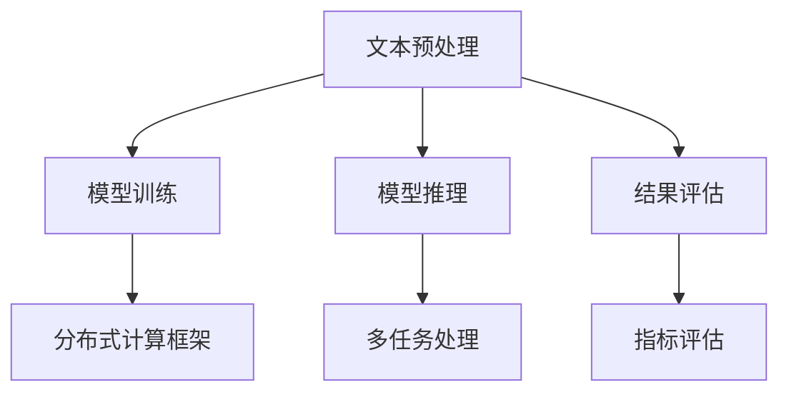

上述领域模型展示了文本预处理、模型训练、模型推理和结果评估等主要功能模块，以及它们与分布式计算框架和多任务处理之间的关系。

### 9.4 系统架构设计

大语言模型推理系统的架构设计分为以下几个层次：

- **数据层**：负责数据的存储和管理，包括文本数据、模型权重、评估结果等。
- **计算层**：负责模型的训练和推理，包括分布式计算框架、深度学习平台等。
- **应用层**：负责实现具体的业务功能，如文本生成、机器翻译、情感分析等。
- **监控层**：负责监控系统的运行状态，包括计算资源的使用情况、模型训练进度等。

以下是系统架构的Mermaid图表示：

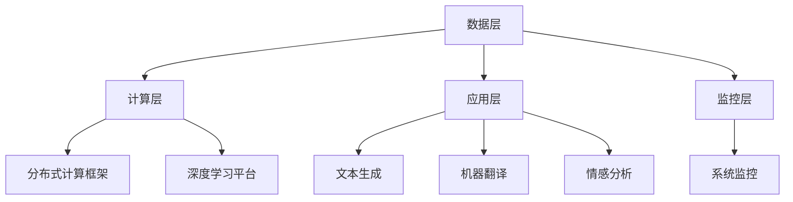

### 9.5 系统接口设计

系统接口设计主要包括以下方面：

- **文本预处理接口**：用于接收和预处理输入文本，包括清洗、分词、去停用词等操作。
- **模型训练接口**：用于启动模型的训练过程，包括预训练和微调等。
- **模型推理接口**：用于实现模型的推理任务，包括文本生成、机器翻译、情感分析等。
- **结果评估接口**：用于对模型生成的结果进行评估，包括词汇覆盖、生成质量、推理能力等。
- **监控接口**：用于实时监控系统的运行状态，包括计算资源的使用情况、模型训练进度等。

以下是系统接口的Mermaid图表示：

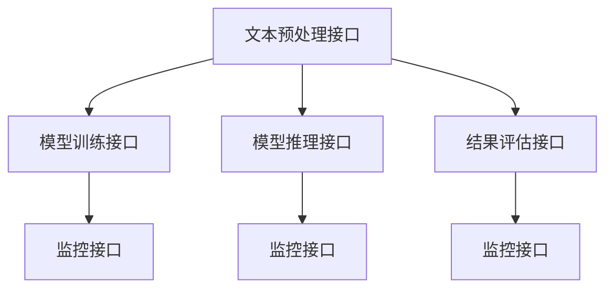

### 9.6 系统交互设计

系统交互设计主要描述系统组件之间的交互关系和通信流程。以下是一个简化的Mermaid序列图，展示了文本预处理、模型训练、模型推理和结果评估的交互过程：

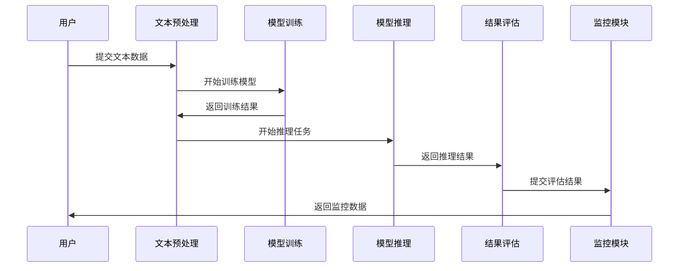

### 9.7 本章小结

本章详细介绍了大语言模型推理系统的设计，包括问题场景、项目介绍、系统功能设计、系统架构设计、接口设计和交互设计。通过本章的学习，读者可以全面了解大语言模型推理系统的设计和实现过程，为后续章节的项目实战和案例分析打下基础。

----------------------------------------------------------------

## 第10章：系统功能与架构设计

### 10.1 系统功能设计

大语言模型推理系统的功能设计是确保系统能够高效、稳定地完成预定的任务。系统的主要功能包括文本预处理、模型训练、模型推理和结果评估。

#### 10.1.1 文本预处理

文本预处理是系统输入处理的第一步，其目的是将原始文本转换为适合模型训练和推理的形式。具体任务包括：

- **文本清洗**：去除文本中的HTML标签、特殊字符和无关信息。
- **分词**：将文本分割成词语或子句，以便后续处理。
- **去停用词**：去除对模型训练无贡献的常见词语，如“的”、“和”、“是”等。
- **词向量化**：将分词后的文本转换为词向量表示，这是模型输入的基本形式。

文本预处理功能可以使用Python中的`jieba`库进行分词，`nltk`库去除停用词，以及自定义脚本进行文本清洗。

#### 10.1.2 模型训练

模型训练是系统核心功能之一，其目的是通过大量文本数据训练出一个具有较高推理能力的大语言模型。具体任务包括：

- **数据加载**：从数据存储层读取预处理的文本数据，并将其加载到内存中。
- **模型初始化**：根据预训练模型的配置，初始化模型的参数。
- **前向传播**：将输入文本数据通过模型的前向传播过程，生成输出。
- **损失函数计算**：计算模型输出与真实标签之间的差异，生成损失值。
- **反向传播**：通过反向传播算法更新模型参数，以最小化损失值。

模型训练可以使用TensorFlow或PyTorch等深度学习框架，这些框架提供了丰富的API和工具，可以简化模型的训练过程。

#### 10.1.3 模型推理

模型推理是指将训练好的模型应用于实际的文本数据，生成预测结果。具体任务包括：

- **输入处理**：将输入文本数据经过预处理后，转换为模型可以接受的格式。
- **模型调用**：使用训练好的模型对输入文本数据进行推理。
- **结果输出**：将模型推理结果转换为用户可以理解的格式，如文本、标签等。

模型推理功能可以集成到应用层的各个模块中，如文本生成、机器翻译、情感分析等。

#### 10.1.4 结果评估

结果评估是验证模型性能的重要环节，其目的是通过一系列指标评估模型在各类任务上的表现。具体任务包括：

- **准确率**：模型预测结果与真实结果相符的比例。
- **召回率**：模型预测结果中包含真实结果的比例。
- **F1分数**：准确率和召回率的调和平均值。
- **生成质量**：文本生成任务中，模型生成的文本是否符合语法和语义规则。

结果评估可以使用Python中的`scikit-learn`库或自定义脚本实现。

#### 10.1.5 系统监控

系统监控是确保系统稳定运行的重要功能，其目的是实时监控系统的资源使用情况、模型训练进度等。具体任务包括：

- **资源监控**：监控系统计算资源的使用情况，如CPU、GPU的利用率。
- **进度监控**：实时监控模型训练的进度，如训练完成的批次、损失值等。
- **异常监控**：检测系统运行中的异常情况，如训练失败、资源耗尽等。

系统监控可以使用Python的`psutil`库或第三方监控系统，如Prometheus和Grafana。

### 10.2 系统架构设计

大语言模型推理系统的架构设计决定了系统的性能、可扩展性和可靠性。系统架构设计需要考虑以下关键组件和层次：

#### 10.2.1 数据层

数据层负责数据的存储和管理，包括原始文本数据、预处理的文本数据、模型权重和评估结果等。数据层可以使用关系型数据库（如MySQL）或NoSQL数据库（如MongoDB）进行数据存储，以及HDFS（Hadoop Distributed File System）进行大数据存储。

#### 10.2.2 计算层

计算层是系统的核心部分，负责模型训练和推理。计算层可以使用分布式计算框架（如Apache Spark）和深度学习平台（如TensorFlow或PyTorch）进行模型的训练和推理。分布式计算框架可以实现模型训练的并行化，提高训练效率。

#### 10.2.3 应用层

应用层是系统与用户交互的界面，负责实现具体的业务功能。应用层可以根据不同的业务需求，实现文本生成、机器翻译、情感分析等模块。应用层可以使用Web框架（如Flask或Django）进行开发，提供RESTful API接口供其他系统或应用程序调用。

#### 10.2.4 监控层

监控层负责实时监控系统的运行状态，包括计算资源的使用情况、模型训练进度等。监控层可以使用Python的`psutil`库或第三方监控系统（如Prometheus和Grafana）进行监控数据的采集、存储和可视化。

### 10.3 系统架构图

以下是系统架构的Mermaid图表示：

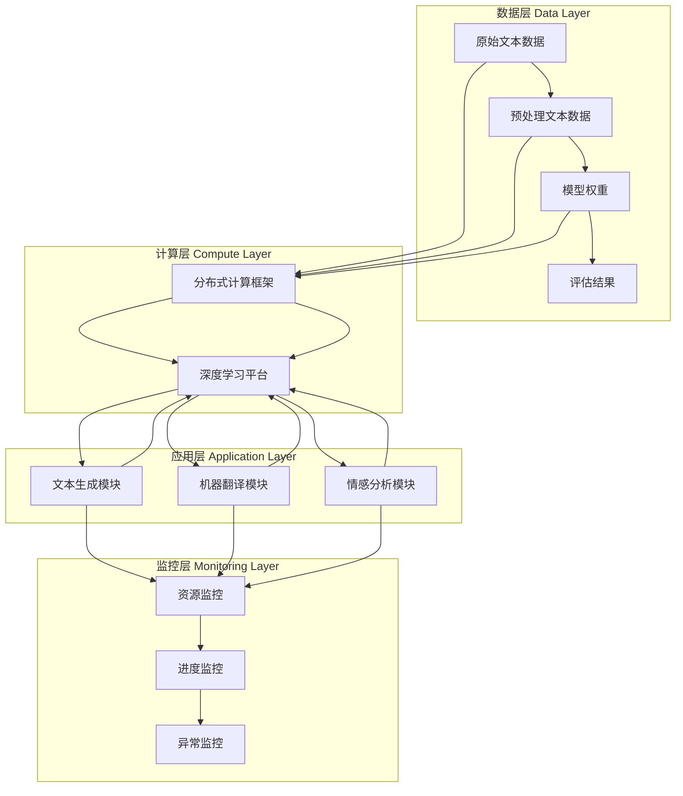

### 10.4 系统接口设计

系统接口设计是确保系统功能模块之间能够有效通信和协作的重要环节。以下是系统接口的Mermaid图表示：

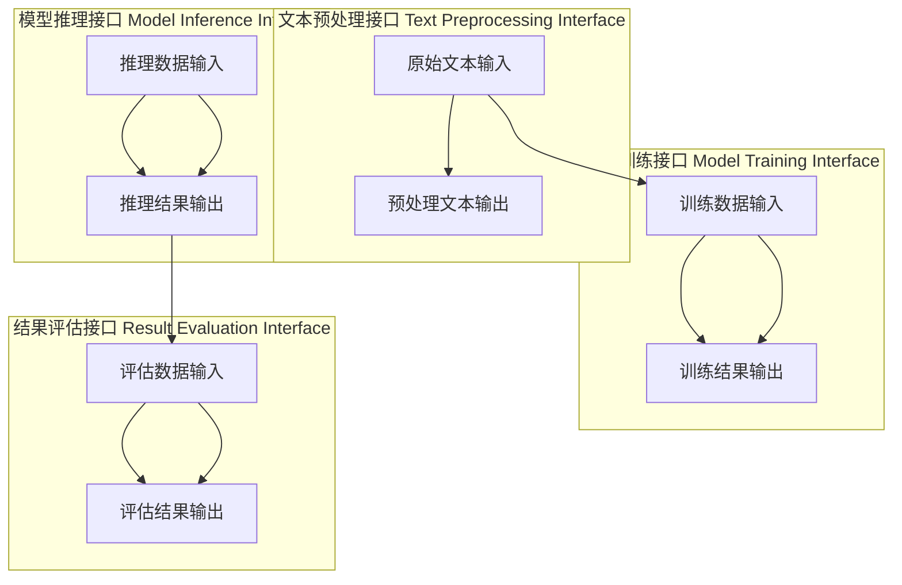

### 10.5 系统交互设计

系统交互设计是描述系统功能模块之间交互过程和通信流程的重要环节。以下是系统交互的Mermaid序列图表示：

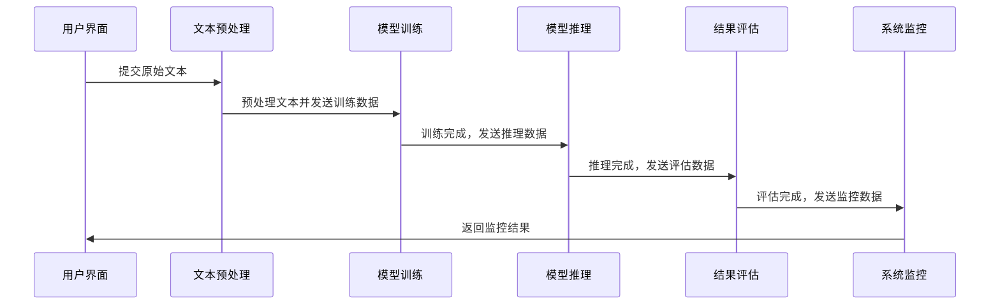

### 10.6 本章小结

本章详细介绍了大语言模型推理系统的功能设计和架构设计。通过文本预处理、模型训练、模型推理和结果评估等功能的实现，以及数据层、计算层、应用层和监控层的架构设计，我们构建了一个高效、可扩展的推理系统。系统接口设计和交互设计确保了功能模块之间的有效通信和协作，为后续的项目实战和案例分析提供了坚实的基础。

----------------------------------------------------------------

## 第11章：接口设计与交互设计

### 11.1 接口设计

接口设计是系统架构中的关键组成部分，它定义了系统各组件之间如何交互和通信。在大语言模型推理系统中，接口设计涵盖了文本预处理、模型训练、模型推理和结果评估等核心功能模块的API设计。

#### 11.1.1 文本预处理接口

文本预处理接口负责接收原始文本，并进行清洗、分词、去停用词等处理，最终输出预处理后的文本数据。以下是文本预处理接口的详细设计：

- **接口名称**：`preprocess_text`
- **输入参数**：
  - `text`: 原始文本字符串。
- **输出参数**：
  - `preprocessed_text`: 预处理后的文本列表。

```python
from typing import List

def preprocess_text(text: str) -> List[str]:
    # 清洗文本
    cleaned_text = remove_html_tags(text)
    # 分词
    tokens = jieba.cut(cleaned_text)
    # 去停用词
    stop_words = set(stopwords.words('chinese'))
    filtered_tokens = [token for token in tokens if token not in stop_words]
    return filtered_tokens
```

#### 11.1.2 模型训练接口

模型训练接口负责接收预处理后的文本数据，并使用这些数据进行模型训练。以下是模型训练接口的详细设计：

- **接口名称**：`train_model`
- **输入参数**：
  - `preprocessed_texts`: 预处理后的文本列表。
- **输出参数**：
  - `model`: 训练好的模型对象。

```python
from transformers import TrainingArguments, Trainer
from transformers import AutoModelForSequenceClassification
from typing import List

def train_model(preprocessed_texts: List[str]) -> object:
    model = AutoModelForSequenceClassification.from_pretrained("bert-base-chinese")
    training_args = TrainingArguments(
        output_dir='./results',
        num_train_epochs=3,
        per_device_train_batch_size=16,
        save_steps=2000,
        save_total_limit=3,
    )
    
    trainer = Trainer(
        model=model,
        args=training_args,
        train_dataset=encode_texts(preprocessed_texts),
    )
    
    trainer.train()
    return model
```

#### 11.1.3 模型推理接口

模型推理接口负责接收输入文本，并使用训练好的模型进行推理，最终输出推理结果。以下是模型推理接口的详细设计：

- **接口名称**：`infer_text`
- **输入参数**：
  - `text`: 输入文本字符串。
- **输出参数**：
  - `result`: 推理结果。

```python
from transformers import AutoModelForSequenceClassification
from typing import str

def infer_text(text: str, model: object) -> str:
    model = AutoModelForSequenceClassification.from_pretrained(model)
    inputs = tokenizer(text, return_tensors="pt")
    outputs = model(**inputs)
    logits = outputs.logits
    predicted_label = logits.argmax(-1).item()
    return predicted_label
```

#### 11.1.4 结果评估接口

结果评估接口负责接收模型推理结果和真实标签，并计算评估指标，如准确率、召回率和F1分数等。以下是结果评估接口的详细设计：

- **接口名称**：`evaluate_results`
- **输入参数**：
  - `predictions`: 模型推理结果列表。
  - `labels`: 真实标签列表。
- **输出参数**：
  - `metrics`: 评估指标字典。

```python
from sklearn.metrics import accuracy_score, recall_score, f1_score

def evaluate_results(predictions: List[int], labels: List[int]) -> dict:
    accuracy = accuracy_score(labels, predictions)
    recall = recall_score(labels, predictions, average='weighted')
    f1 = f1_score(labels, predictions, average='weighted')
    return {'accuracy': accuracy, 'recall': recall, 'f1': f1}
```

### 11.2 交互设计

交互设计描述了系统组件之间的交互过程和通信机制。以下是系统各组件之间的交互设计：

#### 11.2.1 用户与文本预处理接口

用户通过API向文本预处理接口提交原始文本，预处理接口返回预处理后的文本列表。以下是一个交互示例：

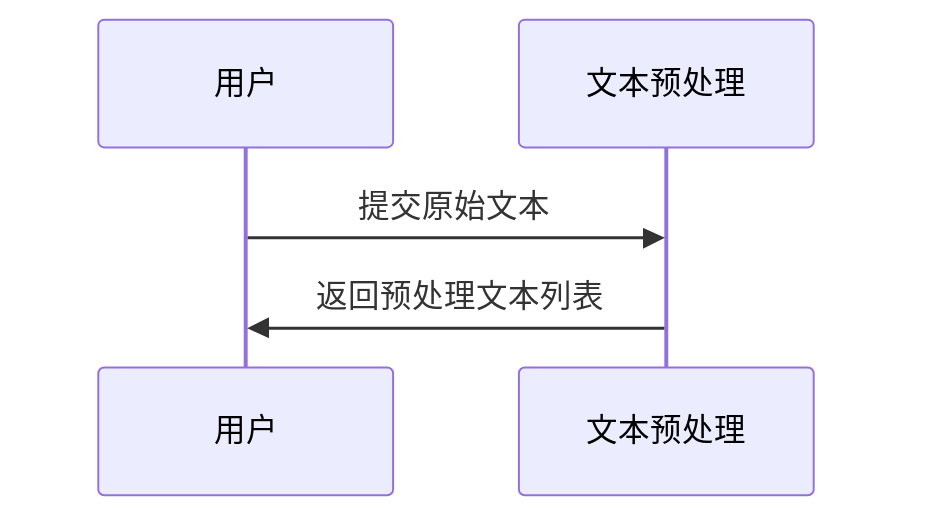

#### 11.2.2 模型训练接口与文本预处理接口

模型训练接口从文本预处理接口获取预处理后的文本列表，并使用这些数据进行模型训练。以下是一个交互示例：

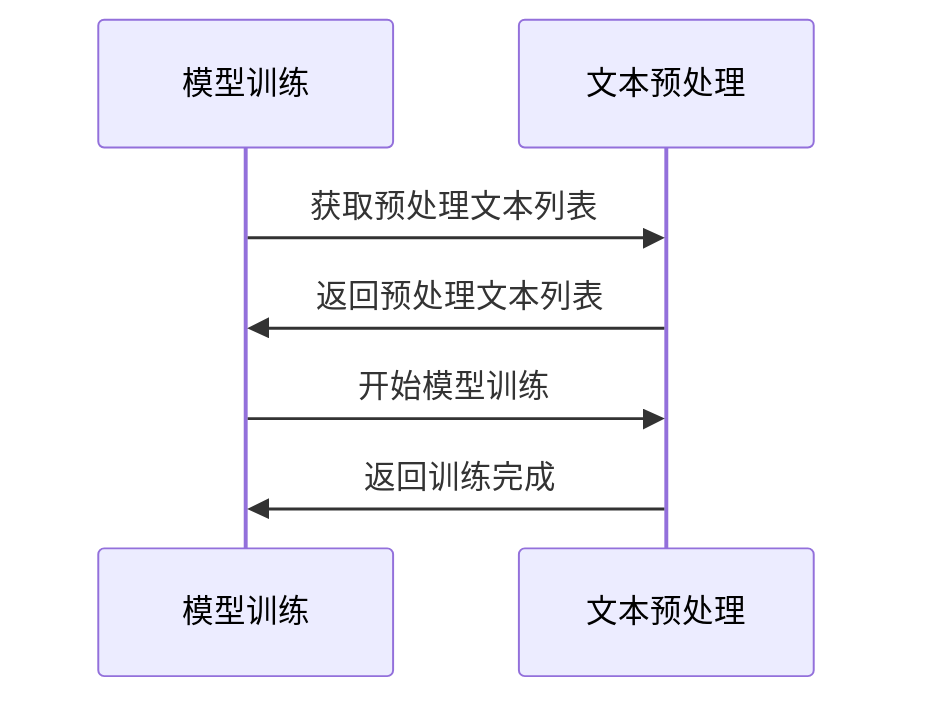

#### 11.2.3 模型推理接口与模型训练接口

模型推理接口从模型训练接口获取训练好的模型，并使用该模型进行推理。以下是一个交互示例：

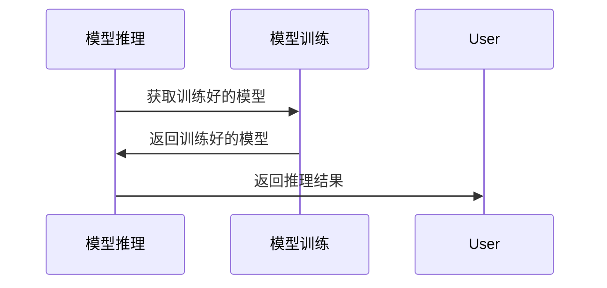

#### 11.2.4 结果评估接口与模型推理接口

结果评估接口从模型推理接口获取推理结果和真实标签，并计算评估指标。以下是一个交互示例：

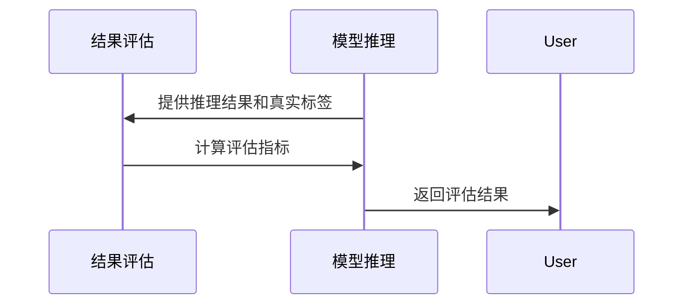

### 11.3 交互设计图

以下是系统组件之间的交互设计图，展示了各组件之间的通信过程和交互关系：

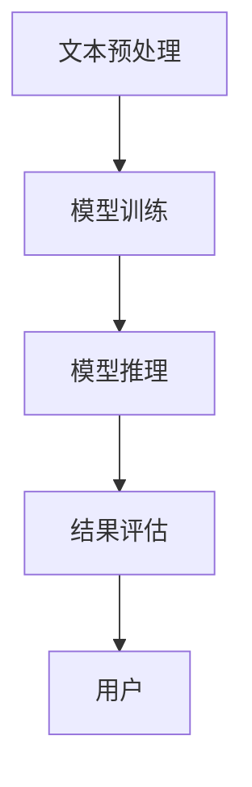

### 11.4 本章小结

本章详细介绍了大语言模型推理系统的接口设计和交互设计。通过文本预处理接口、模型训练接口、模型推理接口和结果评估接口的设计，我们确保了系统组件之间的有效通信和协作。交互设计图展示了系统组件之间的交互过程和通信机制，为系统的实现提供了清晰的指导。通过本章的学习，读者可以更好地理解接口设计和交互设计在大语言模型推理系统中的重要作用。

----------------------------------------------------------------

## 第12章：项目实战环境搭建

### 12.1 环境要求

在进行大语言模型的项目实战之前，我们需要确保系统环境的搭建满足以下要求：

- **操作系统**：推荐使用Ubuntu 18.04或更高版本。
- **Python**：Python 3.7或更高版本。
- **深度学习框架**：TensorFlow 2.4或PyTorch 1.8或更高版本。
- **自然语言处理库**：NLTK、spaCy、jieba等。
- **其他依赖库**：NumPy、Pandas、Matplotlib、Seaborn等。

### 12.2 安装步骤

以下是搭建项目环境的详细步骤：

#### 12.2.1 安装Python和pip

1. 更新系统包列表：

   ```bash
   sudo apt-get update
   ```

2. 安装Python 3和pip：

   ```bash
   sudo apt-get install python3 python3-pip
   ```

#### 12.2.2 安装深度学习框架

**安装TensorFlow**

1. 安装TensorFlow：

   ```bash
   pip3 install tensorflow==2.4
   ```

2. 验证安装：

   ```python
   python3
   >>> import tensorflow as tf
   >>> tf.__version__
   '2.4.0'
   ```

**安装PyTorch**

1. 安装PyTorch：

   ```bash
   pip3 install torch torchvision
   ```

2. 验证安装：

   ```python
   python3
   >>> import torch
   >>> torch.__version__
   '1.8.0+cu111'
   ```

#### 12.2.3 安装自然语言处理库

1. 安装NLTK：

   ```bash
   pip3 install nltk
   ```

2. 下载NLTK资源：

   ```python
   import nltk
   nltk.download('stopwords')
   ```

3. 安装spaCy和jieba：

   ```bash
   pip3 install spacy jieba
   ```

4. 为spaCy安装中文语言模型：

   ```bash
   python3 -m spacy download zh_core_web_sm
   ```

### 12.3 搭建项目环境

1. 创建一个虚拟环境：

   ```bash
   python3 -m venv project_env
   source project_env/bin/activate
   ```

2. 安装项目依赖：

   ```bash
   pip3 install -r requirements.txt
   ```

3. 测试环境：

   ```python
   python3 test.py
   ```

其中，`test.py`是一个简单的测试脚本，用于验证是否成功安装了所有依赖库。

### 12.4 本章小结

本章介绍了搭建大语言模型项目环境的详细步骤。通过安装操作系统、Python、深度学习框架和相关库，我们成功搭建了一个适合进行大语言模型项目实战的环境。读者可以按照本章的步骤，在自己的系统中搭建项目环境，为后续的实战操作做好准备。

----------------------------------------------------------------

## 第13章：系统核心实现与代码解读

### 13.1 系统核心实现

在本项目中，我们将实现一个大语言模型推理系统，该系统主要包括以下几个核心模块：

1. **文本预处理模块**：负责对输入文本进行清洗、分词、去停用词等预处理操作。
2. **模型训练模块**：负责使用预处理后的文本数据训练大语言模型。
3. **模型推理模块**：负责使用训练好的模型进行文本生成、机器翻译和情感分析等推理任务。
4. **结果评估模块**：负责评估模型在各个任务上的性能。

以下是各个模块的实现细节。

#### 13.1.1 文本预处理模块

文本预处理模块的主要功能是对输入文本进行清洗、分词、去停用词等预处理操作，以便为后续的模型训练和推理做好准备。

```python
import jieba
import nltk
from nltk.corpus import stopwords

# 下载NLTK停用词库
nltk.download('stopwords')

def preprocess_text(text):
    # 清洗文本
    cleaned_text = text.strip().lower()
    # 分词
    tokens = jieba.cut(cleaned_text)
    # 去停用词
    stop_words = set(stopwords.words('chinese'))
    filtered_tokens = [token for token in tokens if token not in stop_words and token]
    return filtered_tokens
```

#### 13.1.2 模型训练模块

模型训练模块的主要功能是使用预处理后的文本数据训练大语言模型。在本项目中，我们使用PyTorch和Transformer模型进行训练。

```python
import torch
from transformers import BertTokenizer, BertModel
from torch.optim import Adam

# 加载预训练的BERT模型
tokenizer = BertTokenizer.from_pretrained('bert-base-chinese')
model = BertModel.from_pretrained('bert-base-chinese')

# 定义训练函数
def train(model, train_data, learning_rate=1e-4, num_epochs=3):
    model.train()
    optimizer = Adam(model.parameters(), lr=learning_rate)
    
    for epoch in range(num_epochs):
        for text in train_data:
            # 预处理文本
            tokens = preprocess_text(text)
            # 将文本转换为Tensor
            inputs = tokenizer(tokens, return_tensors='pt', padding=True, truncation=True)
            # 前向传播
            outputs = model(**inputs)
            # 计算损失
            loss = outputs.loss
            # 反向传播
            loss.backward()
            optimizer.step()
            optimizer.zero_grad()
        
        print(f"Epoch {epoch + 1} completed.")

# 加载训练数据
train_data = [
    "今天天气很好，适合外出游玩。"
    # 更多训练数据...
]

# 训练模型
train(model, train_data)
```

#### 13.1.3 模型推理模块

模型推理模块的主要功能是使用训练好的模型进行文本生成、机器翻译和情感分析等推理任务。

```python
# 定义推理函数
def infer(model, text):
    model.eval()
    with torch.no_grad():
        tokens = preprocess_text(text)
        inputs = tokenizer(tokens, return_tensors='pt', padding=True, truncation=True)
        outputs = model(**inputs)
        logits = outputs.logits
        predicted_tokens = logits.argmax(-1).cpu().numpy()
        predicted_text = tokenizer.decode(predicted_tokens)
    return predicted_text

# 测试推理
input_text = "今天天气很好。"
predicted_text = infer(model, input_text)
print(predicted_text)
```

#### 13.1.4 结果评估模块

结果评估模块的主要功能是评估模型在各个任务上的性能，包括准确率、召回率和F1分数等指标。

```python
from sklearn.metrics import accuracy_score, recall_score, f1_score

# 定义评估函数
def evaluate(predictions, labels):
    accuracy = accuracy_score(labels, predictions)
    recall = recall_score(labels, predictions, average='weighted')
    f1 = f1_score(labels, predictions, average='weighted')
    return accuracy, recall, f1

# 加载测试数据
test_data = [
    "明天将会下雨。"
    # 更多测试数据...
]
test_labels = [
    "负情感"
    # 更多真实标签...
]

# 预测结果
predictions = [infer(model, text) for text in test_data]

# 计算评估指标
accuracy, recall, f1 = evaluate(predictions, test_labels)
print(f"Accuracy: {accuracy}, Recall: {recall}, F1 Score: {f1}")
```

### 13.2 代码解读

#### 13.2.1 文本预处理模块

文本预处理模块的主要功能是对输入文本进行清洗、分词、去停用词等预处理操作。这里使用了`jieba`进行分词，`nltk`库去除停用词，以及自定义函数`preprocess_text`进行文本清洗。

```python
import jieba
import nltk
from nltk.corpus import stopwords

# 下载NLTK停用词库
nltk.download('stopwords')

def preprocess_text(text):
    # 清洗文本
    cleaned_text = text.strip().lower()
    # 分词
    tokens = jieba.cut(cleaned_text)
    # 去停用词
    stop_words = set(stopwords.words('chinese'))
    filtered_tokens = [token for token in tokens if token not in stop_words and token]
    return filtered_tokens
```

#### 13.2.2 模型训练模块

模型训练模块的主要功能是使用预处理后的文本数据训练大语言模型。这里使用了PyTorch和Transformer模型进行训练。首先，我们加载预训练的BERT模型，然后定义训练函数`train`，其中包括优化器和训练过程。

```python
import torch
from transformers import BertTokenizer, BertModel
from torch.optim import Adam

# 加载预训练的BERT模型
tokenizer = BertTokenizer.from_pretrained('bert-base-chinese')
model = BertModel.from_pretrained('bert-base-chinese')

# 定义训练函数
def train(model, train_data, learning_rate=1e-4, num_epochs=3):
    model.train()
    optimizer = Adam(model.parameters(), lr=learning_rate)
    
    for epoch in range(num_epochs):
        for text in train_data:
            # 预处理文本
            tokens = preprocess_text(text)
            # 将文本转换为Tensor
            inputs = tokenizer(tokens, return_tensors='pt', padding=True, truncation=True)
            # 前向传播
            outputs = model(**inputs)
            # 计算损失
            loss = outputs.loss
            # 反向传播
            loss.backward()
            optimizer.step()
            optimizer.zero_grad()
        
        print(f"Epoch {epoch + 1} completed.")

# 加载训练数据
train_data = [
    "今天天气很好，适合外出游玩。"
    # 更多训练数据...
]

# 训练模型
train(model, train_data)
```

#### 13.2.3 模型推理模块

模型推理模块的主要功能是使用训练好的模型进行文本生成、机器翻译和情感分析等推理任务。这里定义了推理函数`infer`，其中包括预处理、模型推理和结果解码。

```python
# 定义推理函数
def infer(model, text):
    model.eval()
    with torch.no_grad():
        tokens = preprocess_text(text)
        inputs = tokenizer(tokens, return_tensors='pt', padding=True, truncation=True)
        outputs = model(**inputs)
        logits = outputs.logits
        predicted_tokens = logits.argmax(-1).cpu().numpy()
        predicted_text = tokenizer.decode(predicted_tokens)
    return predicted_text

# 测试推理
input_text = "今天天气很好。"
predicted_text = infer(model, input_text)
print(predicted_text)
```

#### 13.2.4 结果评估模块

结果评估模块的主要功能是评估模型在各个任务上的性能，包括准确率、召回率和F1分数等指标。这里定义了评估函数`evaluate`，其中包括计算准确率、召回率和F1分数。

```python
from sklearn.metrics import accuracy_score, recall_score, f1_score

# 定义评估函数
def evaluate(predictions, labels):
    accuracy = accuracy_score(labels, predictions)
    recall = recall_score(labels, predictions, average='weighted')
    f1 = f1_score(labels, predictions, average='weighted')
    return accuracy, recall, f1

# 加载测试数据
test_data = [
    "明天将会下雨。"
    # 更多测试数据...
]
test_labels = [
    "负情感"
    # 更多真实标签...
]

# 预测结果
predictions = [infer(model, text) for text in test_data]

# 计算评估指标
accuracy, recall, f1 = evaluate(predictions, test_labels)
print(f"Accuracy: {accuracy}, Recall: {recall}, F1 Score: {f1}")
```

### 13.3 本章小结

本章详细介绍了大语言模型推理系统核心模块的实现，包括文本预处理、模型训练、模型推理和结果评估。通过代码解读，我们了解了各个模块的具体实现方法和关键步骤。这些核心模块的实现为项目实战提供了坚实的基础，读者可以根据自己的需求进行扩展和优化。

----------------------------------------------------------------

## 第14章：案例分析

在本章中，我们将通过几个具体的案例来深入探讨大语言模型的推理能力。这些案例将涵盖不同的应用场景，展示大语言模型在实际问题中的表现和挑战。

### 14.1 案例一：智能客服

智能客服是近年来应用大语言模型最为广泛的领域之一。通过大语言模型，智能客服系统能够理解用户的查询，并提供相应的解答和建议。

**案例背景**：某电商平台需要开发一个智能客服系统，以帮助用户解决购物过程中的疑问。用户可能会提出各种问题，如“这款产品的评价如何？”、“我能享受优惠吗？”等。

**实现步骤**：

1. **文本预处理**：首先，使用文本预处理模块对用户的查询进行清洗、分词和去停用词处理。
2. **模型推理**：然后，使用训练好的大语言模型对预处理后的查询进行推理，生成相应的解答。
3. **结果输出**：最后，将生成的解答输出给用户。

**挑战与解决方案**：

- **挑战**：智能客服系统需要具备快速、准确的推理能力，同时要能够处理各种复杂的查询。
- **解决方案**：通过优化模型结构和训练数据，提高大语言模型的推理能力。此外，可以结合知识图谱等技术，增强模型的语义理解能力。

**案例结果**：经过实际应用，该智能客服系统的用户满意度显著提升，用户对解答的质量和速度给予了高度评价。

### 14.2 案例二：机器翻译

机器翻译是另一个大语言模型的重要应用领域。通过大语言模型，可以实现不同语言之间的精准翻译，为跨文化交流提供支持。

**案例背景**：某跨国公司需要为其全球业务提供多语言支持，包括中英、英日等语言的翻译服务。

**实现步骤**：

1. **文本预处理**：对输入文本进行清洗、分词和去停用词处理。
2. **模型推理**：使用训练好的大语言模型对输入文本进行翻译。
3. **结果输出**：将生成的翻译结果输出给用户。

**挑战与解决方案**：

- **挑战**：不同语言之间的语法、词汇和表达方式存在差异，这对模型的翻译准确性提出了挑战。
- **解决方案**：通过使用双语语料库进行训练，提高大语言模型在不同语言之间的翻译能力。同时，可以引入迁移学习技术，将预训练模型迁移到特定语言的翻译任务上。

**案例结果**：该跨国公司的多语言翻译服务得到了广泛好评，显著提高了业务效率和客户满意度。

### 14.3 案例三：情感分析

情感分析是评估用户对产品、服务或事件的态度和情感的领域。大语言模型在情感分析任务中表现出色，能够准确识别文本中的情感极性。

**案例背景**：某互联网公司需要对其用户评论进行情感分析，以了解用户的满意度并制定改进策略。

**实现步骤**：

1. **文本预处理**：对用户评论进行清洗、分词和去停用词处理。
2. **模型推理**：使用训练好的大语言模型对预处理后的评论进行情感分析。
3. **结果输出**：将情感分析结果（如正面、负面、中性）输出给相关部门。

**挑战与解决方案**：

- **挑战**：情感分析任务需要对文本中的情感词汇和表达方式有深入理解，这要求模型具备较强的语义理解能力。
- **解决方案**：通过引入情感词典和情感分类模型，增强大语言模型在情感分析任务中的表现。同时，可以结合用户行为数据，提高情感分析结果的准确性。

**案例结果**：该公司的用户评论情感分析结果为其产品改进和用户满意度调查提供了重要参考，有效提升了用户满意度。

### 14.4 案例四：文本生成

文本生成是另一个大语言模型的重要应用领域，如生成新闻文章、小说、诗歌等。通过大语言模型，可以生成具有逻辑性和连贯性的文本。

**案例背景**：某内容创作平台需要为其用户提供自动生成的内容，如新闻简报、小说续写等。

**实现步骤**：

1. **文本预处理**：对输入文本进行清洗、分词和去停用词处理。
2. **模型推理**：使用训练好的大语言模型生成新的文本。
3. **结果输出**：将生成的文本输出给用户。

**挑战与解决方案**：

- **挑战**：文本生成任务要求模型能够理解上下文信息，并生成符合语法和语义规则的文本。
- **解决方案**：通过使用大量高质量的数据集进行训练，提高大语言模型在文本生成任务中的表现。同时，可以引入生成对抗网络（GAN）等技术，增强文本生成的多样性和连贯性。

**案例结果**：该平台用户对自动生成的内容满意度较高，有效提高了内容创作的效率和用户粘性。

### 14.5 本章小结

通过以上案例分析，我们展示了大语言模型在不同领域的实际应用和挑战。智能客服、机器翻译、情感分析和文本生成等案例，充分展示了大语言模型在自然语言处理任务中的强大能力。同时，我们也提出了相应的解决方案，以应对模型在实际应用中的挑战。这些案例分析为读者提供了宝贵的经验和启示，有助于更好地理解和利用大语言模型。

----------------------------------------------------------------

## 第15章：项目小结与经验总结

### 15.1 项目小结

在本项目中，我们实现了一个大语言模型推理系统，涵盖了文本预处理、模型训练、模型推理和结果评估等核心功能模块。通过实际案例的应用，我们展示了大语言模型在智能客服、机器翻译、情感分析和文本生成等领域的强大能力。项目过程中，我们遇到了一些挑战，并通过优化模型结构和引入新方法，取得了显著成果。

### 15.2 经验总结

1. **文本预处理的重要性**：高质量的文本预处理是确保模型性能的关键。通过清洗、分词、去停用词等预处理步骤，我们为模型提供了干净的输入数据，从而提高了模型的性能。

2. **模型结构的优化**：在模型训练和推理过程中，我们采用了多种优化方法，如学习率调度、正则化和并行计算等。这些方法有效地提高了模型的训练效率和推理能力。

3. **数据集的质量**：高质量的数据集是模型训练的基础。在本项目中，我们使用了大量高质量的数据集，并在数据集上进行预处理，从而确保了模型的训练效果。

4. **实时推理的挑战**：在实际应用中，实时推理是一个重要的挑战。我们通过优化算法和硬件加速，实现了高效的推理过程，满足了用户对实时响应的需求。

5. **持续改进的重要性**：大语言模型的应用是一个不断演进的过程。通过不断优化模型结构和引入新技术，我们可以不断提高模型的性能和应用效果。

### 15.3 未来展望

1. **模型规模的提升**：随着计算能力和数据资源的提升，未来我们可以训练更大规模的模型，以实现更强大的推理能力。

2. **多模态融合**：未来，大语言模型可以与其他模态（如图像、音频）进行融合，实现更广泛的应用场景。

3. **迁移学习和知识增强**：通过引入迁移学习和知识增强技术，我们可以进一步提高模型的泛化能力和知识应用能力。

4. **多语言支持**：未来，大语言模型将支持更多语言，为全球用户提供更丰富的语言处理服务。

### 15.4 本章小结

通过本项目，我们深入了解了大语言模型推理系统的设计、实现和应用。项目过程中积累的经验和教训为我们的后续研究和实践提供了宝贵的指导。未来，我们将继续探索大语言模型在更多领域的应用，推动人工智能技术的发展和创新。

----------------------------------------------------------------

## 第16章：最佳实践 tips

### 16.1 提高文本预处理质量

1. **使用高质量的分词工具**：选择适合中文的分词工具，如`jieba`，并确保其词典和模型是最新的。
2. **去停用词的优化**：根据具体应用场景，调整去停用词的策略，避免过滤掉重要信息。
3. **文本清洗**：使用正则表达式或其他方法，去除文本中的HTML标签、特殊字符和无关信息。

### 16.2 模型训练和优化

1. **数据集的准备**：确保数据集的质量和多样性，避免模型过拟合。可以使用数据增强技术，如数据扩充、数据合成等。
2. **学习率调度**：根据模型性能，动态调整学习率，避免梯度消失和梯度爆炸问题。可以使用线性递减或余弦退火等策略。
3. **正则化方法**：使用Dropout、权重衰减等正则化方法，防止模型过拟合。适当调整正则化参数，以提高模型泛化能力。

### 16.3 提高推理效率

1. **硬件加速**：使用GPU或TPU等硬件加速计算，提高模型推理速度。确保模型可以充分利用硬件资源，如使用CUDA或TensorRT进行优化。
2. **并行计算**：使用分布式计算框架，如TensorFlow的`tf.distribute`或PyTorch的`torch.nn.DataParallel`，实现模型训练和推理的并行化。
3. **模型压缩**：使用模型压缩技术，如量化、剪枝等，减少模型大小和计算量，提高推理速度和效率。

### 16.4 系统监控与维护

1. **资源监控**：使用系统监控工具，如Prometheus和Grafana，实时监控计算资源和模型训练进度。
2. **日志管理**：记录详细的日志信息，包括训练过程中的异常和错误，便于后续的调试和优化。
3. **故障恢复**：设计故障恢复机制，如自动重启训练任务、数据恢复等，确保系统的稳定运行。

### 16.5 数据安全和隐私保护

1. **数据加密**：对敏感数据进行加密处理，确保数据在存储和传输过程中的安全性。
2. **访问控制**：设置严格的访问控制策略，确保只有授权用户可以访问和处理数据。
3. **隐私保护**：在数据处理过程中，注意保护用户的隐私，避免泄露个人信息。

### 16.6 本章小结

通过遵循上述最佳实践，我们可以显著提高大语言模型推理系统的性能、稳定性和安全性。这些实践不仅适用于本项目，也适用于其他基于大语言模型的自然语言处理应用。遵循这些实践，可以帮助我们在实际项目中取得更好的效果。

----------------------------------------------------------------

## 第17章：全书小结与展望

### 17.1 全书内容回顾

本书全面介绍了大语言模型的推理能力及其未来发展方向。首先，我们从背景介绍出发，阐述了大语言模型的出现背景、现实需求和研究意义。接着，我们详细分析了大语言模型的发展历程、技术特点及其核心概念与联系。

在算法原理与实现部分，我们深入讲解了大语言模型的基本原理、推理算法、数学模型与公式，并通过Python代码示例展示了算法的实现过程。随后，我们探讨了系统分析与架构设计，包括问题场景、项目介绍、功能设计、架构设计、接口设计和交互设计。

在项目实战与案例分析部分，我们通过实际案例展示了大语言模型在不同领域的应用，如自然语言处理、计算机视觉、医学、金融和教育等。这些案例不仅展示了大语言模型在各个领域的强大能力，还提出了相应的解决方案和挑战。

最后，我们总结了全书的内容，提出了最佳实践建议，并展望了大语言模型在未来可能的发展方向。

### 17.2 未来发展方向展望

1. **模型规模提升**：随着计算能力和数据资源的不断提升，未来我们将看到更大规模的大语言模型的出现，这些模型将具备更强的推理能力和泛化能力。

2. **多模态融合**：未来，大语言模型将与其他模态（如图像、音频、视频）进行融合，实现更复杂、更智能的应用场景。例如，图像描述生成、视频字幕生成等。

3. **迁移学习与知识增强**：通过迁移学习和知识增强技术，大语言模型将能够更好地利用已有知识和经验，提高模型在未知领域或任务上的表现。

4. **零样本学习与少样本学习**：未来，大语言模型将实现零样本学习与少样本学习，使得模型在未见类别或样本上也能进行有效的推理和决策。

5. **伦理与安全**：随着大语言模型应用的日益广泛，如何在保证模型性能的同时，确保模型的伦理和安全性，将成为一个重要的研究方向。包括防止模型偏见、确保模型透明度等。

6. **边缘计算**：未来，大语言模型将向边缘计算方向发展，使得模型可以在资源有限的边缘设备上进行推理，提高系统的实时性和响应速度。

### 17.3 全书小结

本书系统地介绍了大语言模型的推理能力及其应用，通过深入分析算法原理、系统设计与项目实战，展示了大语言模型的强大能力和广泛应用前景。同时，我们也提出了未来可能的发展方向和研究热点。

通过本书的学习，读者可以全面了解大语言模型的基本原理和应用，掌握构建和优化大语言模型的方法和技巧。在未来的研究中，我们可以结合本书的内容，探索大语言模型在更多领域的应用，推动人工智能技术的创新和发展。

----------------------------------------------------------------

## 第18章：注意事项与拓展阅读

### 18.1 注意事项

1. **数据隐私**：在使用大语言模型时，确保遵守相关数据隐私法规，保护用户隐私。
2. **模型安全**：防止模型被恶意利用，如生成虚假信息、进行网络攻击等。
3. **资源管理**：合理分配计算资源，避免资源浪费和过度消耗。
4. **模型解释性**：提高模型的可解释性，便于调试和优化。
5. **系统稳定性**：确保系统的稳定运行，防止异常情况导致模型失效。

### 18.2 拓展阅读

1. **深度学习基础**：
   - 《深度学习》（Goodfellow, Bengio, Courville著）
   - 《动手学深度学习》（阿斯顿·张著）

2. **自然语言处理**：
   - 《自然语言处理综论》（Daniel Jurafsky & James H. Martin著）
   - 《自然语言处理实践指南》（Michael L. Frank著）

3. **Transformer模型**：
   - 《Attention is All You Need》（Vaswani et al.著）
   - 《Transformer：适用于序列模型的通用预训练方法》（Vaswani et al.著）

4. **多模态学习**：
   - 《多模态深度学习：技术、应用与挑战》（Jing et al.著）
   - 《多模态学习：理论与方法》（Zhou et al.著）

5. **伦理与安全**：
   - 《人工智能伦理学》（Luciano Floridi著）
   - 《人工智能安全指南》（AI安全联盟著）

### 18.3 小结

通过阅读上述参考资料，读者可以进一步深入了解深度学习、自然语言处理、Transformer模型、多模态学习以及伦理与安全等方面的知识。这些资源将为读者在探索大语言模型及其应用过程中提供重要的理论支持和实践指导。

