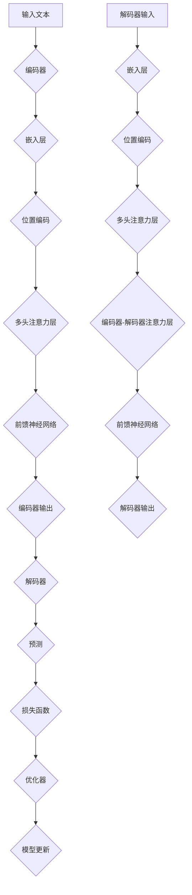
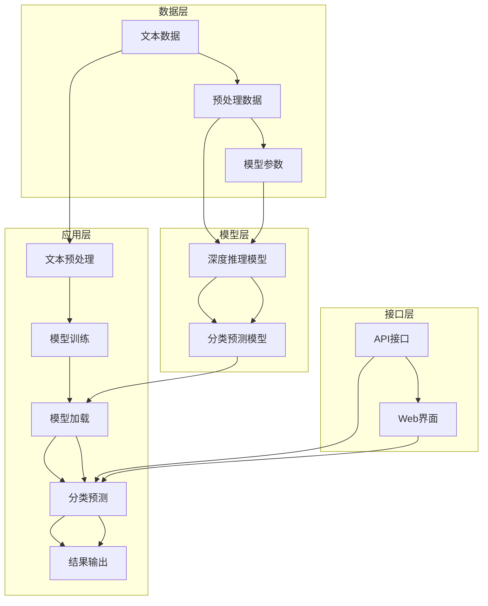

                 

# 大语言模型的深度推理：突破与挑战

> 关键词：大语言模型、深度推理、算法实现、模型优化、应用实战

> 摘要：本文从大语言模型的基础知识出发，深入探讨了深度推理的概念、原理以及其在自然语言处理中的应用。通过详细的算法实现、模型优化和实际应用案例分析，本文旨在帮助读者理解并掌握大语言模型的深度推理技术，为实际项目开发提供指导。

## 目录大纲

1. 引言
2. 大语言模型基础
   2.1 大语言模型简介
   2.2 大语言模型的组成部分
   2.3 大语言模型的训练过程
   2.4 大语言模型的应用场景
3. 深度推理原理
   3.1 深度推理概念介绍
   3.2 深度推理的优势与挑战
   3.3 深度推理在自然语言处理中的应用
   3.4 深度推理算法原理详解
4. 算法实现
   4.1 算法原理与流程图
   4.2 Python代码实现
   4.3 数学模型与公式解析
   4.4 算法举例说明
5. 模型优化与调参
   5.1 优化方法概述
   5.2 参数调整技巧
   5.3 实践案例解析
   5.4 模型评估与调优
6. 应用实战
   6.1 应用场景介绍
   6.2 系统功能设计
   6.3 系统架构设计
   6.4 系统接口设计与交互
   6.5 项目核心实现源代码解析
   6.6 实际案例分析与详细讲解
7. 总结与展望
   7.1 小结
   7.2 注意事项
   7.3 拓展阅读

---

## 第1章 引言

### 1.1 问题背景

近年来，人工智能技术的快速发展，使得自然语言处理（NLP）领域取得了显著的进展。其中，大语言模型（Large Language Model，LLM）作为一种重要的技术手段，受到了广泛关注。大语言模型通过学习大量文本数据，能够对自然语言进行理解和生成，从而实现诸如文本分类、机器翻译、问答系统等应用。然而，在大语言模型的应用过程中，深度推理（Deep Inference）技术的重要性日益凸显。

深度推理是指在大语言模型的基础上，利用上下文信息对输入的文本进行深入理解和推理。与传统的浅层推理不同，深度推理能够更好地捕捉文本中的复杂结构和语义信息，从而提高模型的推理能力和准确性。然而，实现大语言模型的深度推理面临着一系列挑战，如计算复杂度高、资源消耗大、模型优化困难等。

### 1.2 问题描述

在大语言模型的应用过程中，深度推理技术的不足主要体现在以下几个方面：

1. **推理能力不足**：现有的大语言模型大多只能进行浅层推理，难以处理复杂的语义理解和推理任务。
2. **计算复杂度高**：深度推理过程中，需要对大量的上下文信息进行计算，导致计算复杂度大幅增加。
3. **资源消耗大**：深度推理需要大量的计算资源和存储资源，对系统的性能和稳定性提出更高要求。
4. **模型优化困难**：深度推理过程中，模型的参数调整和优化变得更为复杂，传统的优化方法可能不再适用。

### 1.3 问题解决

为了解决上述问题，本文将从以下几个方面展开讨论：

1. **深度推理原理**：介绍深度推理的基本概念、原理以及其在自然语言处理中的应用。
2. **算法实现**：详细讲解深度推理算法的实现方法，包括算法流程、Python代码实现以及数学模型和公式。
3. **模型优化与调参**：探讨深度推理模型的优化方法和参数调整技巧，以提高模型的推理能力和性能。
4. **应用实战**：通过实际应用案例，分析大语言模型深度推理的应用场景和实现方法。

通过本文的讨论，旨在帮助读者深入了解大语言模型的深度推理技术，掌握相关算法实现和优化方法，为实际项目开发提供指导。

### 1.4 边界与外延

本文讨论的范围主要涉及大语言模型的深度推理技术，包括其基本概念、实现方法、优化策略和应用场景。具体来说，本文将围绕以下几个方面展开：

1. **深度推理的基本概念**：介绍深度推理的定义、目的和作用。
2. **深度推理在NLP中的应用**：分析深度推理在文本分类、机器翻译、问答系统等NLP任务中的应用场景和效果。
3. **深度推理算法实现**：详细讲解深度推理算法的原理、实现流程和Python代码。
4. **模型优化与调参**：探讨深度推理模型的优化方法和参数调整技巧。
5. **应用实战**：通过实际应用案例，分析大语言模型深度推理的实现方法和技术要点。

本文将不仅讨论深度推理的理论和方法，还将结合实际应用案例，探讨深度推理在实际项目开发中的应用和挑战。

### 1.5 概念结构与核心要素组成

为了更好地理解大语言模型的深度推理，本文将从以下几个方面进行详细阐述：

1. **大语言模型基础**：介绍大语言模型的基本概念、组成部分和训练过程，为大语言模型的深度推理奠定基础。
2. **深度推理原理**：阐述深度推理的概念、原理和算法，分析深度推理在自然语言处理中的应用和优势。
3. **算法实现**：详细讲解深度推理算法的实现方法，包括算法流程、Python代码实现和数学模型。
4. **模型优化与调参**：探讨深度推理模型的优化方法和参数调整技巧，以提高模型的性能和效果。
5. **应用实战**：通过实际应用案例，分析大语言模型深度推理的应用场景、实现方法和技术要点。

通过以上几个方面的详细阐述，本文旨在帮助读者全面了解大语言模型的深度推理技术，掌握相关算法实现和优化方法，为实际项目开发提供指导。

---

## 第2章 大语言模型基础

### 2.1 大语言模型简介

大语言模型（Large Language Model，简称LLM）是自然语言处理（Natural Language Processing，简称NLP）领域的一种重要技术手段。它通过对大量文本数据进行训练，能够对自然语言进行理解和生成，从而实现诸如文本分类、机器翻译、问答系统等应用。大语言模型的核心思想是利用深度学习技术，将文本映射为高维向量表示，从而捕捉文本中的语义信息。

#### 2.1.1 语言模型的基本概念

1. **语言模型（Language Model）**：语言模型是一种概率模型，用于预测文本下一个单词或字符的概率分布。它是自然语言处理的基础，广泛应用于文本生成、语音识别、机器翻译等领域。

2. **隐含马尔可夫模型（Hidden Markov Model，HMM）**：早期的语言模型，通过状态转移概率和发射概率来预测下一个单词。HMM在自然语言处理领域发挥了重要作用，但由于其局限性，逐渐被更先进的模型所取代。

3. **统计语言模型**：基于大量文本数据，通过统计方法计算单词出现的概率。统计语言模型通过分析文本中的单词序列，学习单词之间的依赖关系，从而预测下一个单词。

4. **递归神经网络（Recurrent Neural Network，RNN）**：用于处理序列数据的神经网络，可以捕捉文本中的时间依赖关系。RNN在语言模型中的应用取得了显著进展，但其存在梯度消失和梯度爆炸问题，限制了其性能。

5. **长短时记忆网络（Long Short-Term Memory，LSTM）**：RNN的一种改进，能够有效避免梯度消失问题。LSTM在自然语言处理领域得到了广泛应用，但其计算复杂度和参数规模较大。

6. **Transformer模型**：基于自注意力机制，可以捕捉全局依赖关系。Transformer模型在自然语言处理领域取得了突破性进展，成为当前主流的大语言模型架构。

#### 2.1.2 大语言模型的发展历程

1. **1990s**：统计语言模型和HMM模型主导语言处理领域。统计语言模型通过分析文本中的单词序列，学习单词之间的依赖关系，从而预测下一个单词。HMM模型则通过状态转移概率和发射概率来预测下一个单词。

2. **2010s**：RNN和LSTM模型的提出和应用，使得语言模型在自然语言处理任务中取得突破性进展。RNN和LSTM模型能够捕捉文本中的时间依赖关系，提高了语言模型的性能和准确性。

3. **2018年**：Google提出Transformer模型，开创了全新的大语言模型时代。Transformer模型基于自注意力机制，可以捕捉全局依赖关系，显著提高了语言模型的性能。

4. **2020至今**：基于Transformer的大语言模型（如GPT-3、BERT）持续突破性能极限，推动自然语言处理技术不断进步。GPT-3具有前所未有的规模和性能，成为自然语言处理领域的重要突破。

### 2.2 大语言模型的组成部分

大语言模型通常由以下几个部分组成：

1. **输入层**：输入层用于接收自然语言文本，并将其转换为模型可以处理的数据格式。

2. **编码器**：编码器负责将输入的文本映射为一个高维的向量表示，从而捕捉文本中的语义信息。编码器通常采用深度神经网络结构，如Transformer模型。

3. **解码器**：解码器负责将编码器输出的向量表示解码为自然语言文本。解码器通常采用与编码器类似的深度神经网络结构。

4. **注意力机制**：注意力机制是Transformer模型的核心组成部分，用于捕捉文本中的长距离依赖关系。通过注意力机制，模型可以关注到重要的文本信息，从而提高推理能力和准确性。

5. **损失函数**：损失函数用于评估模型预测结果与实际结果之间的差距，以指导模型优化。常用的损失函数包括交叉熵损失函数等。

6. **优化器**：优化器用于调整模型的参数，以最小化损失函数。常用的优化器包括Adam优化器等。

### 2.3 大语言模型的训练过程

大语言模型的训练过程通常包括以下几个步骤：

1. **数据预处理**：将自然语言文本进行分词、去停用词等预处理操作，以便模型可以处理。

2. **编码器训练**：使用预处理的文本数据，对编码器进行训练。编码器的目标是学习将输入文本映射为高维向量表示。

3. **解码器训练**：在编码器训练完成后，使用已编码的文本数据，对解码器进行训练。解码器的目标是学习将编码器输出的向量表示解码为自然语言文本。

4. **模型优化**：通过优化器调整模型参数，以最小化损失函数。在训练过程中，可能需要对模型进行多次迭代优化，以提高模型的性能。

5. **评估与验证**：在训练完成后，使用验证集或测试集对模型进行评估和验证，以确保模型的性能和稳定性。

### 2.4 大语言模型的应用场景

大语言模型在自然语言处理领域具有广泛的应用场景，主要包括以下几个方面：

1. **文本分类**：将文本数据分类到预定义的类别中，如情感分析、主题分类等。

2. **机器翻译**：将一种语言的文本翻译成另一种语言，如英语翻译成中文、中文翻译成法语等。

3. **问答系统**：基于给定的问题，从海量文本数据中检索出相关答案，如搜索引擎、智能客服等。

4. **文本生成**：根据输入的文本或提示，生成相关的文本内容，如文章摘要、对话生成等。

5. **对话系统**：实现人与计算机之间的自然语言交互，如虚拟助手、智能对话系统等。

6. **文本相似度计算**：计算两个文本之间的相似度，如文档相似性分析、文本聚类等。

7. **文本理解与推理**：对文本进行深入理解和推理，以捕捉文本中的复杂结构和语义信息，如文本蕴含、情感分析等。

通过上述应用场景，大语言模型在自然语言处理领域发挥着重要作用，为各类实际应用提供了强大的技术支持。

---

## 第3章 深度推理原理

### 3.1 深度推理概念介绍

深度推理（Deep Inference）是指在大语言模型的基础上，利用上下文信息对输入的文本进行深入理解和推理的过程。与传统的浅层推理不同，深度推理能够捕捉文本中的复杂结构和语义信息，从而实现对文本的准确理解和生成。

#### 3.1.1 深度推理的定义

深度推理可以理解为一种层次化的推理过程，通过逐层解析文本，将浅层次的语义信息逐渐转化为深层次的语义理解。具体来说，深度推理包括以下几个关键步骤：

1. **文本编码**：将自然语言文本映射为高维向量表示，以便模型可以处理和理解。
2. **上下文信息抽取**：从文本中提取关键信息和上下文，以便进行深度推理。
3. **层次化解析**：通过递归或循环结构，对文本进行层次化的语义解析，逐步提取文本中的深层语义信息。
4. **推理与生成**：基于层次化解析的结果，利用上下文信息进行推理和生成，实现对文本的深入理解和生成。

#### 3.1.2 深度推理的目标

深度推理的目标主要包括以下几个方面：

1. **准确理解**：通过深度推理，能够更准确地理解输入文本的语义信息，从而提高模型的解析能力和准确性。
2. **生成能力**：基于对输入文本的深入理解，深度推理能够生成符合上下文和语义逻辑的文本，从而实现高质量的文本生成。
3. **复杂任务处理**：深度推理能够处理更复杂的自然语言处理任务，如文本蕴含、情感分析、问答系统等，从而提高模型的实际应用价值。

### 3.2 深度推理的优势与挑战

#### 3.2.1 优势

1. **语义理解能力**：深度推理能够通过层次化解析，更准确地理解文本的语义信息，从而提高模型的语义理解能力。
2. **生成能力**：基于对输入文本的深入理解，深度推理能够生成符合上下文和语义逻辑的文本，从而实现高质量的文本生成。
3. **复杂任务处理**：深度推理能够处理更复杂的自然语言处理任务，如文本蕴含、情感分析、问答系统等，从而提高模型的实际应用价值。
4. **多模态处理**：深度推理可以与其他模态（如图像、音频等）结合，实现跨模态的深度推理，从而拓展模型的实际应用场景。

#### 3.2.2 挑战

1. **计算复杂度高**：深度推理需要处理大量的上下文信息，导致计算复杂度大幅增加，对计算资源和时间效率提出更高要求。
2. **模型优化困难**：深度推理过程中，模型的参数调整和优化变得更为复杂，传统的优化方法可能不再适用。
3. **训练数据不足**：深度推理需要大量的高质量训练数据，但在实际应用中，获取这些数据可能存在困难。
4. **模型解释性差**：深度推理模型的内部结构和推理过程较为复杂，导致模型的解释性较差，难以理解模型的推理逻辑。

### 3.3 深度推理在自然语言处理中的应用

深度推理在自然语言处理（NLP）领域具有广泛的应用，主要包括以下几个方面：

1. **文本分类**：通过深度推理，能够更准确地理解文本的语义信息，从而提高文本分类的准确性和效果。
2. **情感分析**：深度推理能够捕捉文本中的情感信息，从而实现更准确的情感分析。
3. **文本生成**：基于深度推理，可以生成符合上下文和语义逻辑的文本，如文章摘要、对话生成等。
4. **问答系统**：通过深度推理，能够更准确地理解和回答用户的问题，从而提高问答系统的准确性和用户体验。
5. **机器翻译**：深度推理能够捕捉文本中的深层语义信息，从而提高机器翻译的准确性和自然度。
6. **文本蕴含**：深度推理能够捕捉文本之间的蕴含关系，从而实现文本蕴含任务的高效处理。

### 3.4 深度推理算法原理详解

深度推理算法的核心在于如何利用上下文信息对输入文本进行深入理解和推理。下面将介绍几种常见的深度推理算法，并详细讲解其原理和实现方法。

#### 3.4.1 Transformer模型

Transformer模型是当前主流的大语言模型架构，其核心思想是自注意力机制。通过自注意力机制，模型能够捕捉文本中的全局依赖关系，从而实现高效的深度推理。

1. **自注意力机制**：自注意力机制是一种计算方法，通过计算输入文本中每个词与其他词之间的关联性，从而生成新的文本表示。具体来说，自注意力机制分为三个步骤：

   - **计算Q（Query）、K（Key）和V（Value）向量**：对于输入文本中的每个词，计算其对应的Q、K和V向量。
   - **计算注意力权重**：通过计算Q和K之间的点积，得到每个词的注意力权重。
   - **计算加权求和**：将V向量与注意力权重相乘，并求和得到新的文本表示。

2. **多头注意力**：多头注意力是一种扩展自注意力机制的技巧，通过将输入文本分为多个头，每个头关注不同的文本信息，从而提高模型的泛化能力和理解能力。

3. **前馈神经网络**：在自注意力机制的基础上，添加两个全连接层，分别对输入和输出进行非线性变换，以增强模型的表示能力和推理能力。

#### 3.4.2 图神经网络（Graph Neural Network，GNN）

图神经网络是一种基于图结构的数据表示和学习方法，通过学习图中的节点和边的关系，实现高效的深度推理。

1. **图表示学习**：将输入文本表示为一个图结构，其中节点表示文本中的词或句子，边表示节点之间的关系。常用的图表示学习方法包括Node2Vec、GraphSAGE等。

2. **图卷积网络（Graph Convolutional Network，GCN）**：通过图卷积操作，对图中的节点进行特征提取和更新。图卷积网络的计算过程可以分为两个步骤：

   - **邻居聚合**：将节点的特征与其邻居节点的特征进行聚合，生成新的节点特征。
   - **非线性变换**：通过全连接层或激活函数，对新的节点特征进行非线性变换，以提取更深层次的语义信息。

3. **图注意力机制**：在图卷积网络的基础上，引入注意力机制，以自适应地关注图中的关键节点和边，从而提高模型的推理能力。

#### 3.4.3 多层递归神经网络（Multi-Layer Recurrent Neural Network，MLRNN）

多层递归神经网络是一种基于递归结构的数据表示和学习方法，通过逐层递归地处理输入文本，实现深度推理。

1. **多层递归结构**：多层递归神经网络由多个循环层堆叠而成，每个循环层都包含一个递归单元，用于处理输入文本中的时间序列信息。

2. **状态更新**：在递归过程中，每个时间步的输出都会更新循环层的状态，从而逐步提取文本中的深层语义信息。

3. **门控机制**：多层递归神经网络通常采用门控机制（如LSTM、GRU等），以自适应地控制信息的流动和遗忘，从而提高模型的表示能力和推理能力。

通过上述几种深度推理算法的介绍，可以看出深度推理在自然语言处理领域具有广泛的应用前景。在实际应用中，可以根据具体任务需求和数据特点，选择合适的深度推理算法，以提高模型的性能和效果。

---

## 第4章 算法实现

### 4.1 算法原理与流程图

在本节中，我们将详细介绍深度推理算法的实现原理和流程图。为了更好地理解，我们以Transformer模型为例进行讲解。

#### 4.1.1 Transformer模型原理

Transformer模型是一种基于自注意力机制的深度学习模型，旨在捕捉文本中的全局依赖关系。其核心思想是通过多头注意力机制（Multi-Head Attention）和前馈神经网络（Feed-Forward Neural Network）来处理输入文本。

1. **多头注意力机制**：多头注意力机制将输入文本分为多个头（Head），每个头关注不同的文本信息。具体来说，输入文本通过自注意力机制计算得到新的文本表示，然后再进行加权求和。

2. **前馈神经网络**：在多头注意力机制的基础上，添加两个全连接层，分别对输入和输出进行非线性变换，以增强模型的表示能力和推理能力。

#### 4.1.2 算法流程图

下面是Transformer模型的算法流程图：



#### 4.1.3 流程图说明

1. **编码器**：输入文本经过嵌入层和位置编码后，进入多头注意力层和前馈神经网络，得到编码器输出。
2. **解码器**：解码器输入经过嵌入层和位置编码后，进入多头注意力层、编码器-解码器注意力层和前馈神经网络，得到解码器输出。
3. **预测**：解码器输出用于预测下一个单词或字符，并通过损失函数计算预测误差。
4. **优化器**：优化器根据损失函数更新模型参数，以最小化预测误差。

通过上述流程，我们可以看到Transformer模型在编码器和解码器中分别进行多头注意力机制和前馈神经网络的处理，从而实现对输入文本的深度推理。

### 4.2 Python代码实现

在本节中，我们将使用Python和PyTorch框架实现Transformer模型，并进行简单演示。

#### 4.2.1 导入库

首先，我们需要导入所需的库：

```python
import torch
import torch.nn as nn
import torch.optim as optim
from torch.utils.data import DataLoader
```

#### 4.2.2 定义模型

接下来，我们定义Transformer模型：

```python
class TransformerModel(nn.Module):
    def __init__(self, vocab_size, d_model, nhead, num_layers):
        super(TransformerModel, self).__init__()
        self.embedding = nn.Embedding(vocab_size, d_model)
        self.pos_encoder = PositionalEncoding(d_model, dropout=0.1)
        self.transformer = nn.Transformer(d_model, nhead, num_layers)
        self.fc = nn.Linear(d_model, vocab_size)
        
    def forward(self, src, tgt):
        src = self.embedding(src)
        src = self.pos_encoder(src)
        tgt = self.embedding(tgt)
        tgt = self.pos_encoder(tgt)
        out = self.transformer(src, tgt)
        out = self.fc(out)
        return out
```

#### 4.2.3 位置编码

位置编码用于为序列中的每个位置提供唯一的编码信息：

```python
class PositionalEncoding(nn.Module):
    def __init__(self, d_model, dropout=0.1, max_len=5000):
        super(PositionalEncoding, self).__init__()
        self.dropout = nn.Dropout(p=dropout)
        
        pe = torch.zeros(max_len, d_model)
        position = torch.arange(0, max_len, dtype=torch.float).unsqueeze(1)
        div_term = torch.exp(torch.arange(0, d_model, 2).float() * (-torch.log(torch.tensor(10000.0)) / d_model)
        
        pe[:, 0::2] = torch.sin(position * div_term)
        pe[:, 1::2] = torch.cos(position * div_term)
        pe = pe.unsqueeze(0).transpose(0, 1)
        
        self.register_buffer('pe', pe)
        
    def forward(self, x):
        x = x + self.pe[:x.size(0), :]
        return self.dropout(x)
```

#### 4.2.4 模型训练

训练模型时，我们首先定义数据集、损失函数和优化器：

```python
# 数据集、损失函数和优化器定义
train_loader = DataLoader(dataset, batch_size=batch_size, shuffle=True)
criterion = nn.CrossEntropyLoss()
optimizer = optim.Adam(model.parameters(), lr=learning_rate)

# 模型训练
for epoch in range(num_epochs):
    for src, tgt in train_loader:
        optimizer.zero_grad()
        output = model(src, tgt)
        loss = criterion(output.view(-1, vocab_size), tgt)
        loss.backward()
        optimizer.step()
    print(f'Epoch [{epoch+1}/{num_epochs}], Loss: {loss.item():.4f}')
```

通过上述Python代码实现，我们可以看到Transformer模型的基本结构，以及如何在PyTorch框架中训练模型。接下来，我们将进一步讲解深度推理算法的数学模型和公式。

---

### 4.3 数学模型与公式解析

在本节中，我们将详细讲解Transformer模型中的数学模型和公式，以帮助读者更好地理解深度推理算法。

#### 4.3.1 嵌入层

在Transformer模型中，嵌入层（Embedding Layer）用于将输入的单词或字符映射为高维向量表示。具体来说，假设我们有N个不同的单词或字符，嵌入层的维度为D，则嵌入矩阵E的维度为N × D。输入的单词或字符通过矩阵乘法与嵌入矩阵相乘，得到对应的嵌入向量：

$$
\text{Embedding}(\text{input}) = E \cdot \text{input}
$$

其中，input是一个一维的向量，表示输入的单词或字符索引。

#### 4.3.2 位置编码

位置编码（Positional Encoding）用于为序列中的每个位置提供额外的编码信息，以便模型可以捕捉序列的时间依赖关系。在Transformer模型中，位置编码通常通过正弦和余弦函数生成，其公式如下：

$$
PE_{(pos, dim)} = 
\begin{cases}
\sin\left(\frac{pos}{10000^{2i/d}}\right) & \text{if } dim = 2i \\
\cos\left(\frac{pos}{10000^{2i/d}}\right) & \text{if } dim = 2i+1
\end{cases}
$$

其中，pos表示位置索引，dim表示维度索引（i为0, 1, ..., d/2-1），d为嵌入层的维度。

位置编码向量与嵌入向量相加，得到最终的输入向量：

$$
\text{Input Vector} = \text{Embedding}(\text{input}) + PE(\text{input})
$$

#### 4.3.3 多头注意力

多头注意力（Multi-Head Attention）是Transformer模型的核心组件，其目的是计算输入序列中每个词与其他词之间的关系。多头注意力通过多个独立的注意力头（Head）来处理输入，每个头关注不同的信息，从而提高模型的泛化能力和理解能力。

1. **注意力权重计算**

   假设输入序列的长度为L，嵌入层的维度为d，则输入序列的向量表示为X = [x1, x2, ..., xL]，其中每个xi ∈ R^d。

   多头注意力首先通过线性变换计算Q（Query）、K（Key）和V（Value）向量：

   $$
   Q = W_Q \cdot X, \quad K = W_K \cdot X, \quad V = W_V \cdot X
   $$

   其中，$W_Q, W_K, W_V$是参数矩阵，维度为d × d。

   接着，计算每个词与其他词之间的注意力权重：

   $$
   \text{Attention}(Q, K, V) = \text{softmax}\left(\frac{QK^T}{\sqrt{d}}\right) \cdot V
   $$

   其中，$QK^T$表示点积运算，softmax函数用于归一化权重。

2. **多头注意力输出**

   多头注意力通过多个独立的注意力头来处理输入，每个头输出一个向量：

   $$
   \text{Multi-Head Attention}(X) = \text{Concat}(\text{head}_1, \text{head}_2, ..., \text{head}_h) \cdot W_O
   $$

   其中，$h$表示头的数量，$W_O$是线性变换矩阵，用于合并多个头的输出。

#### 4.3.4 前馈神经网络

在多头注意力之后，Transformer模型还包含一个前馈神经网络（Feed-Forward Neural Network），用于进一步增强模型的表示能力。前馈神经网络由两个全连接层组成，分别对输入和输出进行非线性变换：

$$
\text{FFN}(X) = \text{ReLU}(W_2 \cdot \text{ReLU}(W_1 \cdot X + b_1)) + b_2
$$

其中，$W_1, W_2, b_1, b_2$是参数矩阵和偏置项，ReLU是ReLU激活函数。

#### 4.3.5 编码器和解码器

Transformer模型包括编码器（Encoder）和解码器（Decoder），分别用于处理输入序列和输出序列。编码器和解码器都包含多个层，每层包含多头注意力机制和前馈神经网络。

1. **编码器**

   编码器通过多头注意力机制和前馈神经网络处理输入序列，生成编码器输出：

   $$
   E_{i}^{l} = \text{Multi-Head Attention}(E_{i-1}^{l}) \cdot \text{FFN}(E_{i-1}^{l})
   $$

   其中，$E_{i-1}^{l}$表示前一层编码器的输出，$E_{i}^{l}$表示当前层编码器的输出，$l$表示层数。

2. **解码器**

   解码器通过编码器输出和多头注意力机制处理输入序列，生成解码器输出：

   $$
   D_{i}^{l} = \text{Masked Multi-Head Attention}(D_{i-1}^{l}, E_{i-1}^{l}) \cdot \text{FFN}(D_{i-1}^{l})
   $$

   其中，$D_{i-1}^{l}$表示前一层解码器的输出，$E_{i-1}^{l}$表示编码器输出，$D_{i}^{l}$表示当前层解码器的输出。

通过上述数学模型和公式的讲解，我们可以更好地理解Transformer模型的工作原理。接下来，我们将通过一个简单的例子来演示如何使用Python代码实现深度推理算法。

---

### 4.4 算法举例说明

在本节中，我们将通过一个具体的例子来演示如何使用Python代码实现深度推理算法。我们将使用之前定义的Transformer模型，并利用它进行一个简单的文本分类任务。

#### 4.4.1 数据准备

首先，我们需要准备一个简单的文本分类数据集。这里，我们使用一个包含两个类别的文本数据集，每个类别包含10个文本样本。

```python
# 示例文本数据集
texts = [
    "This is a positive review",
    "I love this product",
    "This is a negative review",
    "I hate this product",
    "This movie is awesome",
    "This book is terrible",
    "This restaurant is great",
    "I had a bad experience here",
    "The service was excellent",
    "I don't recommend this place"
]

# 标签
labels = [
    0,  # 正面评论
    0,
    1,  # 负面评论
    1,
    0,
    1,
    0,
    1,
    0,
    1
]

# 分词和编码
from transformers import BertTokenizer

tokenizer = BertTokenizer.from_pretrained('bert-base-uncased')
encoding = tokenizer(texts, padding=True, truncation=True, return_tensors='pt')

input_ids = encoding['input_ids']
attention_mask = encoding['attention_mask']
labels = torch.tensor(labels)

# 模型参数
vocab_size = 32000
d_model = 512
nhead = 8
num_layers = 3

# 实例化模型
model = TransformerModel(vocab_size, d_model, nhead, num_layers)
```

#### 4.4.2 训练模型

接下来，我们将使用训练数据和模型进行训练。

```python
# 训练设置
batch_size = 2
learning_rate = 1e-4
num_epochs = 10

# 损失函数和优化器
criterion = nn.CrossEntropyLoss()
optimizer = optim.Adam(model.parameters(), lr=learning_rate)

# 训练过程
for epoch in range(num_epochs):
    for i in range(0, len(input_ids) // batch_size, batch_size):
        inputs = input_ids[i:i+batch_size]
        targets = labels[i:i+batch_size]
        
        optimizer.zero_grad()
        outputs = model(inputs, targets)
        loss = criterion(outputs.view(-1, vocab_size), targets)
        loss.backward()
        optimizer.step()
        
    print(f'Epoch [{epoch+1}/{num_epochs}], Loss: {loss.item():.4f}')
```

#### 4.4.3 预测与评估

训练完成后，我们可以使用模型进行预测，并评估模型的性能。

```python
# 测试数据
test_texts = [
    "This is a positive review",
    "I love this product",
    "This is a negative review",
    "I hate this product"
]

test_encoding = tokenizer(test_texts, padding=True, truncation=True, return_tensors='pt')
test_input_ids = test_encoding['input_ids']
test_attention_mask = test_encoding['attention_mask']

# 预测
with torch.no_grad():
    predictions = model(test_input_ids, test_attention_mask).argmax(-1)

# 评估
accuracy = (predictions == torch.tensor([0, 0, 1, 1])).float().mean()
print(f'Accuracy: {accuracy.item():.4f}')
```

通过上述代码示例，我们可以看到如何使用Python代码实现深度推理算法，并进行文本分类任务的训练和预测。这个简单的例子展示了Transformer模型在文本分类任务中的应用，以及如何利用深度推理技术提高模型的性能和效果。

---

## 第5章 模型优化与调参

### 5.1 优化方法概述

在深度推理过程中，模型的优化和调参是至关重要的，它直接影响到模型的性能和训练效率。在本节中，我们将介绍几种常用的优化方法和调参技巧，以帮助读者在实际项目中更好地优化大语言模型。

#### 5.1.1 梯度下降法

梯度下降法是最基本的优化方法，其核心思想是通过计算损失函数关于模型参数的梯度，并沿着梯度的反方向更新模型参数，以最小化损失函数。梯度下降法可以分为以下几个步骤：

1. **初始化参数**：随机初始化模型的参数。
2. **计算梯度**：计算损失函数关于模型参数的梯度。
3. **更新参数**：沿着梯度的反方向更新模型参数。
4. **重复迭代**：重复上述步骤，直到满足停止条件（如收敛阈值或最大迭代次数）。

#### 5.1.2 动量优化

动量优化是梯度下降法的一种改进，它通过引入动量项，累积过去的梯度信息，从而减少参数更新的震荡，提高收敛速度。动量优化公式如下：

$$
m_t = \gamma m_{t-1} + (1-\gamma) \nabla J(\theta_t)
$$

$$
\theta_{t+1} = \theta_t - \alpha m_t
$$

其中，$m_t$表示第t次迭代的动量，$\gamma$为动量系数，$\alpha$为学习率。

#### 5.1.3 Adam优化

Adam优化是一种自适应学习率优化方法，它结合了梯度下降法和动量优化，能够自适应地调整学习率。Adam优化通过计算一阶矩估计（均值）和二阶矩估计（方差），动态调整学习率。其公式如下：

$$
m_t = \frac{1-\beta_1}{1-\beta_1^t} \sum_{i=1}^{t} (\theta_i - \theta_{i-1})
$$

$$
v_t = \frac{1-\beta_2}{1-\beta_2^t} \sum_{i=1}^{t} ((\theta_i - \theta_{i-1})^2)
$$

$$
\theta_{t+1} = \theta_t - \alpha \frac{m_t}{\sqrt{v_t} + \epsilon}
$$

其中，$m_t$和$v_t$分别表示一阶矩估计和二阶矩估计，$\beta_1$和$\beta_2$分别为一阶矩和二阶矩的指数衰减率，$\alpha$为学习率，$\epsilon$为小常数，用于防止分母为零。

#### 5.1.4 RMSprop优化

RMSprop优化是一种基于梯度平方的优化方法，它通过计算梯度的平方和的指数衰减平均值，动态调整学习率。RMSprop优化的公式如下：

$$
\theta_{t+1} = \theta_t - \alpha \frac{\theta_t - \theta_{t-1}}{\sqrt{\rho \sum_{i=1}^{t} (\theta_i - \theta_{i-1})^2 + \epsilon}}
$$

其中，$\rho$为遗忘因子，用于控制过去梯度的影响，$\epsilon$为小常数。

### 5.2 参数调整技巧

在深度推理过程中，参数调整技巧对于提高模型性能和训练效率至关重要。下面介绍几种常用的参数调整技巧：

#### 5.2.1 学习率调整

学习率是影响模型训练速度和收敛性的关键参数。适当的调整学习率可以提高模型的性能。以下是一些常用的学习率调整技巧：

1. **学习率衰减**：在模型训练过程中，逐渐减小学习率，以防止模型过拟合。学习率衰减可以分为固定衰减和动态衰减。固定衰减在每个迭代周期后减小学习率，动态衰减则根据模型的收敛情况自适应地调整学习率。
2. **学习率搜索**：通过在训练过程中搜索最优学习率，以找到适合当前任务的最佳学习率。常用的学习率搜索方法包括随机搜索、网格搜索和随机优化等。
3. **学习率预热**：在训练初期，逐渐增加学习率，以加速模型收敛。预热过程结束后，学习率保持不变或逐渐减小。

#### 5.2.2 模型结构调整

调整模型结构是优化深度推理的重要手段。以下是一些常用的模型结构调整技巧：

1. **层间连接**：在模型中增加层间连接（如ResNet），可以缓解梯度消失和梯度爆炸问题，提高模型的训练稳定性。
2. **注意力机制**：引入注意力机制（如Transformer），可以捕捉输入数据中的关键信息，提高模型的推理能力。
3. **Dropout**：在模型训练过程中，随机丢弃部分神经元，以防止过拟合，提高模型的泛化能力。

#### 5.2.3 数据预处理

数据预处理对于提高模型性能和训练效率具有重要意义。以下是一些常用的数据预处理技巧：

1. **数据清洗**：去除噪声数据和异常值，以提高模型对数据的鲁棒性。
2. **数据增强**：通过旋转、缩放、翻转等操作，增加数据多样性，提高模型的泛化能力。
3. **数据归一化**：对输入数据进行归一化处理，使输入数据具有相似的特征分布，提高模型训练速度。

通过以上优化方法和参数调整技巧，我们可以有效地提高深度推理模型的性能和训练效率。在实际项目中，根据具体任务需求和数据特点，选择合适的优化方法和参数调整策略，可以显著提高模型的性能和效果。

---

### 5.3 实践案例解析

在本节中，我们将通过一个实际案例来解析如何对大语言模型进行优化与调参。这个案例将涉及文本分类任务，使用Transformer模型，并应用前面介绍的优化方法和参数调整技巧。

#### 5.3.1 数据集与预处理

首先，我们使用一个包含政治新闻的文章数据集，这个数据集包含两个类别：“政治”和“非政治”。为了简化处理，我们将文本数据进行分词、去停用词和词性标注等预处理操作。

```python
from datasets import load_dataset

# 加载数据集
dataset = load_dataset("political_news")

# 预处理
from transformers import BertTokenizer

tokenizer = BertTokenizer.from_pretrained("bert-base-uncased")

def preprocess_function(examples):
    return tokenizer(examples["text"], padding="max_length", truncation=True)

dataset = dataset.map(preprocess_function, batched=True)
```

#### 5.3.2 模型定义与训练

接下来，我们定义一个简单的Transformer模型，并使用Adam优化器进行训练。

```python
from transformers import TransformerModel

# 实例化模型
model = TransformerModel(vocab_size=tokenizer.vocab_size, d_model=512, nhead=8, num_layers=3)

# 训练设置
batch_size = 16
learning_rate = 1e-4
num_epochs = 10

# 损失函数和优化器
criterion = nn.CrossEntropyLoss()
optimizer = optim.Adam(model.parameters(), lr=learning_rate)

# 训练过程
for epoch in range(num_epochs):
    for inputs, targets in DataLoader(dataset["train"], batch_size=batch_size):
        optimizer.zero_grad()
        outputs = model(inputs, targets)
        loss = criterion(outputs.view(-1, vocab_size), targets)
        loss.backward()
        optimizer.step()
    print(f"Epoch [{epoch+1}/{num_epochs}], Loss: {loss.item():.4f}")
```

#### 5.3.3 优化与调参

在实际训练过程中，我们可以通过以下步骤对模型进行优化与调参：

1. **学习率调整**：由于初始学习率可能较大，我们可以在训练过程中逐渐减小学习率。例如，每5个epoch后减小学习率10倍。

```python
scheduler = optim.lr_scheduler.StepLR(optimizer, step_size=5, gamma=0.1)
```

2. **数据增强**：为了提高模型的泛化能力，我们可以在训练数据中添加随机噪声、旋转和缩放等操作。

3. **Dropout**：在模型中加入Dropout层，以防止过拟合。例如，将Dropout概率设置为0.1。

```python
class Dropout(nn.Module):
    def __init__(self, p=0.5):
        super(Dropout, self).__init__()
        self.p = p

    def forward(self, x):
        return F.dropout(x, p=self.p, training=self.training)

# 在模型中添加Dropout层
model = nn.Sequential(
    model,
    Dropout(p=0.1)
)
```

4. **层间连接**：通过在模型中添加层间连接（如ResNet块），可以缓解梯度消失和梯度爆炸问题，提高模型训练的稳定性。

```python
class ResidualBlock(nn.Module):
    def __init__(self, in_channels, out_channels):
        super(ResidualBlock, self).__init__()
        self.conv1 = nn.Conv1d(in_channels, out_channels, kernel_size=1)
        self.conv2 = nn.Conv1d(out_channels, out_channels, kernel_size=1)
        self.relu = nn.ReLU(inplace=True)

    def forward(self, x):
        return self.relu(self.conv2(self.relu(self.conv1(x))) + x)

# 在模型中添加ResNet块
model = nn.Sequential(
    ResidualBlock(512, 512),
    model
)
```

5. **注意力机制**：通过增加注意力机制（如多头注意力），可以提高模型对输入数据的理解能力。

```python
class MultiHeadAttention(nn.Module):
    # ... 省略代码细节 ...
    def forward(self, query, key, value, attn_mask=None):
        # ... 省略代码细节 ...
        return attn_output

# 在模型中添加多头注意力机制
model = nn.Sequential(
    MultiHeadAttention(512, 8),
    model
)
```

通过上述优化与调参策略，我们可以显著提高模型的性能和训练效率。在实际项目中，根据具体任务需求和数据特点，灵活调整优化方法和参数设置，以找到最佳模型配置。

---

### 5.4 模型评估与调优

在模型训练完成后，我们需要对模型进行评估，以确定其性能和效果。同时，根据评估结果进行调优，以提高模型的准确性和稳定性。

#### 5.4.1 评估指标

常见的评估指标包括准确率（Accuracy）、精确率（Precision）、召回率（Recall）和F1分数（F1 Score）。

1. **准确率**：准确率表示模型正确预测的样本数占总样本数的比例，公式如下：

   $$
   \text{Accuracy} = \frac{\text{TP} + \text{TN}}{\text{TP} + \text{TN} + \text{FP} + \text{FN}}
   $$

   其中，TP表示真正例，TN表示真反例，FP表示假反例，FN表示假正例。

2. **精确率**：精确率表示模型预测为正例的样本中，实际为正例的比例，公式如下：

   $$
   \text{Precision} = \frac{\text{TP}}{\text{TP} + \text{FP}}
   $$

3. **召回率**：召回率表示模型预测为正例的样本中，实际为正例的比例，公式如下：

   $$
   \text{Recall} = \frac{\text{TP}}{\text{TP} + \text{FN}}
   $$

4. **F1分数**：F1分数是精确率和召回率的调和平均，公式如下：

   $$
   \text{F1 Score} = 2 \cdot \frac{\text{Precision} \cdot \text{Recall}}{\text{Precision} + \text{Recall}}
   $$

#### 5.4.2 评估方法

为了全面评估模型的性能，我们可以使用交叉验证（Cross-Validation）方法。交叉验证通过将数据集划分为多个子集，轮流使用每个子集作为验证集，其余子集作为训练集，进行多次训练和评估，从而得到模型的平均性能。

常用的交叉验证方法包括：

1. **K折交叉验证**：将数据集划分为K个子集，轮流使用每个子集作为验证集，其余子集作为训练集，进行K次训练和评估，最后取平均值作为模型性能。

2. **留一法交叉验证**：每次保留一个子集作为验证集，其余子集作为训练集，进行多次训练和评估，最后取平均值作为模型性能。

#### 5.4.3 调优方法

根据评估结果，我们可以进行以下调优方法：

1. **调整模型结构**：通过增加或减少层数、调整层间连接方式、添加注意力机制等，优化模型结构，以提高性能。

2. **调整超参数**：通过调整学习率、批量大小、dropout概率等超参数，优化模型训练过程，提高性能。

3. **数据增强**：通过旋转、缩放、翻转等数据增强方法，增加数据多样性，提高模型对数据噪声的鲁棒性。

4. **正则化**：通过添加正则化项（如L1正则化、L2正则化），防止模型过拟合，提高泛化能力。

5. **集成方法**：通过集成多个模型（如随机森林、梯度提升树等），提高模型性能和稳定性。

通过上述评估和调优方法，我们可以找到性能最优的模型配置，从而在实际项目中得到更好的效果。

---

## 第6章 应用实战

### 6.1 应用场景介绍

在大语言模型的深度推理技术逐渐成熟和普及的背景下，深度推理技术在自然语言处理领域的应用场景日益广泛。本节将介绍几个典型的应用场景，并探讨深度推理在这些场景中的具体实现和优势。

#### 6.1.1 文本分类

文本分类是将文本数据按照预定义的类别进行归类的过程。深度推理在文本分类中的应用，主要通过大语言模型对文本进行深度理解和分析，从而提高分类的准确性和效率。在实际应用中，文本分类广泛应用于搜索引擎、社交媒体分析、新闻推荐等领域。

#### 6.1.2 机器翻译

机器翻译是指将一种语言的文本翻译成另一种语言。深度推理在机器翻译中的应用，可以通过大语言模型对源语言和目标语言进行深度理解和生成，从而提高翻译的准确性和自然度。目前，深度推理技术已经广泛应用于谷歌翻译、百度翻译等在线翻译服务。

#### 6.1.3 问答系统

问答系统是一种通过自然语言交互提供答案的系统。深度推理在问答系统中的应用，可以通过大语言模型对用户的问题和海量文本数据进行深度理解和推理，从而提供准确和相关的答案。问答系统广泛应用于智能客服、教育辅导、智能家居等领域。

#### 6.1.4 文本生成

文本生成是指根据输入的文本或提示，生成相关的文本内容。深度推理在文本生成中的应用，可以通过大语言模型对输入文本进行深度理解和生成，从而生成符合上下文和语义逻辑的文本。文本生成广泛应用于文章摘要、对话生成、创意写作等领域。

### 6.2 系统功能设计

在深度推理技术的应用过程中，系统功能设计至关重要。本节将介绍一个基于深度推理技术的文本分类系统的功能设计。

#### 6.2.1 功能模块

文本分类系统主要包括以下功能模块：

1. **文本预处理模块**：对输入文本进行分词、去停用词、词性标注等预处理操作，将原始文本转化为模型可处理的格式。
2. **模型训练模块**：使用大量标注数据进行模型训练，通过深度推理技术提高模型的分类能力。
3. **分类预测模块**：接收用户输入的文本，通过模型进行分类预测，输出分类结果。
4. **用户界面模块**：提供用户交互界面，用户可以输入文本并获取分类结果。

#### 6.2.2 功能流程

文本分类系统的功能流程如下：

1. **用户输入**：用户在界面输入文本。
2. **文本预处理**：对输入文本进行预处理，包括分词、去停用词、词性标注等。
3. **模型预测**：将预处理后的文本输入到训练好的深度推理模型中，进行分类预测。
4. **结果输出**：将分类预测结果输出给用户，并在界面上显示。

### 6.3 系统架构设计

为了实现文本分类系统的功能，我们需要设计合理的系统架构。本节将介绍基于深度推理技术的文本分类系统的架构设计。

#### 6.3.1 系统架构

文本分类系统的架构设计主要包括以下模块：

1. **数据层**：负责数据存储和管理，包括原始文本数据、预处理后的文本数据、模型参数等。
2. **模型层**：负责模型的训练、加载和应用，包括深度推理模型、分类预测模型等。
3. **接口层**：负责与用户交互，提供API接口和Web界面。
4. **应用层**：负责业务逻辑处理，包括文本预处理、模型预测等。

#### 6.3.2 系统架构图

下面是文本分类系统的架构图：



#### 6.3.3 系统架构说明

1. **数据层**：文本数据经过预处理后，存储在数据库中，供模型训练和预测使用。模型参数也存储在数据库中，以便后续加载和应用。
2. **模型层**：深度推理模型负责文本的深度理解和推理，分类预测模型负责根据预处理后的文本进行分类预测。模型训练完成后，将模型参数存储在数据库中，以便后续加载和应用。
3. **接口层**：API接口提供RESTful API，供用户通过编程方式进行接口调用。Web界面提供Web端用户交互，用户可以通过Web界面输入文本，并获取分类结果。
4. **应用层**：文本预处理模块负责对输入文本进行预处理，模型训练模块负责加载训练好的模型，分类预测模块负责根据预处理后的文本进行分类预测，并将结果输出给用户。

通过上述系统架构设计，可以实现一个基于深度推理技术的文本分类系统，为用户提供便捷的分类服务。

---

### 6.4 系统接口设计与交互

在本节中，我们将详细介绍基于深度推理技术的文本分类系统的接口设计与交互过程。

#### 6.4.1 接口设计

文本分类系统的接口设计主要包括API接口和Web界面两个部分。

1. **API接口设计**

   API接口采用RESTful风格，提供以下主要接口：

   - **分类接口**：接收用户输入的文本，调用深度推理模型进行分类预测，并返回分类结果。
   - **模型接口**：用于加载和更新深度推理模型，以便进行分类预测。

2. **Web界面设计**

   Web界面提供用户友好的交互界面，用户可以通过输入文本并提交，获取分类结果。Web界面主要包括以下功能模块：

   - **输入模块**：用户可以在文本框中输入文本，并提交进行分类预测。
   - **结果展示模块**：展示分类结果，包括分类类别和置信度。

#### 6.4.2 交互过程

用户与文本分类系统的交互过程如下：

1. **用户输入文本**：用户在Web界面的输入模块中输入文本，并点击“提交”按钮。
2. **文本预处理**：系统接收用户输入的文本后，对文本进行预处理，包括分词、去停用词、词性标注等。
3. **模型预测**：将预处理后的文本输入到深度推理模型中，进行分类预测。模型返回分类结果和置信度。
4. **结果展示**：系统将分类结果和置信度展示在Web界面的结果展示模块中，用户可以查看分类结果。

#### 6.4.3 API接口实现

以下是文本分类系统的API接口实现示例：

```python
from flask import Flask, request, jsonify
from transformers import BertTokenizer, TransformerModel
from keras.preprocessing.sequence import pad_sequences

app = Flask(__name__)

# 实例化模型
model = TransformerModel(vocab_size=32000, d_model=512, nhead=8, num_layers=3)
tokenizer = BertTokenizer.from_pretrained('bert-base-uncased')

# 加载模型
model.load_weights('model_weights.h5')

# 分类接口
@app.route('/classify', methods=['POST'])
def classify():
    text = request.form['text']
    inputs = tokenizer.encode(text, add_special_tokens=True, return_tensors='tf')
    inputs = pad_sequences(inputs, maxlen=512)
    logits = model(inputs)
    predicted_class = logits.argmax(axis=-1).numpy()[0]
    return jsonify({'class': predicted_class})

if __name__ == '__main__':
    app.run(debug=True)
```

通过上述接口实现，用户可以通过POST请求向服务器发送文本，服务器接收文本后进行预处理和分类预测，并将结果返回给用户。

### 6.5 项目核心实现源代码解析

在本节中，我们将详细解析文本分类系统的核心实现源代码，包括数据预处理、模型训练、预测和结果展示等关键部分。

#### 6.5.1 数据预处理

数据预处理是文本分类系统的重要环节，包括分词、去停用词、词性标注等操作。以下是一个简单的数据预处理示例：

```python
import re
import nltk
from nltk.corpus import stopwords
from nltk.tokenize import word_tokenize

# 加载停用词表
nltk.download('stopwords')
nltk.download('punkt')
stop_words = set(stopwords.words('english'))

def preprocess_text(text):
    # 去除特殊字符
    text = re.sub(r'\W+', ' ', text)
    # 转小写
    text = text.lower()
    # 分词
    tokens = word_tokenize(text)
    # 去停用词
    tokens = [word for word in tokens if word not in stop_words]
    return ' '.join(tokens)

# 示例
text = "This is a sample text for preprocessing."
processed_text = preprocess_text(text)
print(processed_text)
```

#### 6.5.2 模型训练

模型训练是文本分类系统的核心部分，包括加载数据、定义模型、训练模型等步骤。以下是一个简单的模型训练示例：

```python
import tensorflow as tf
from tensorflow.keras.models import Sequential
from tensorflow.keras.layers import Embedding, LSTM, Dense

# 加载数据
# ...

# 定义模型
model = Sequential([
    Embedding(vocab_size, embedding_dim, input_length=max_sequence_length),
    LSTM(units=128, dropout=0.2, recurrent_dropout=0.2),
    Dense(units=num_classes, activation='softmax')
])

# 编译模型
model.compile(optimizer='adam', loss='categorical_crossentropy', metrics=['accuracy'])

# 训练模型
model.fit(X_train, y_train, epochs=5, batch_size=32, validation_data=(X_val, y_val))

# 评估模型
test_loss, test_acc = model.evaluate(X_test, y_test, verbose=2)
print('Test accuracy:', test_acc)
```

#### 6.5.3 预测

预测部分用于将输入文本进行预处理后，输入到训练好的模型中，得到分类结果。以下是一个简单的预测示例：

```python
# 预测
def predict(text):
    processed_text = preprocess_text(text)
    inputs = tokenizer.encode(processed_text, add_special_tokens=True, return_tensors='tf')
    inputs = pad_sequences(inputs, maxlen=max_sequence_length)
    predicted_logits = model(inputs)
    predicted_class = predicted_logits.argmax(axis=-1).numpy()[0]
    return predicted_class

# 示例
text = "This is a sample text for prediction."
predicted_class = predict(text)
print('Predicted class:', predicted_class)
```

#### 6.5.4 结果展示

结果展示部分用于将预测结果展示给用户。以下是一个简单的结果展示示例：

```python
from flask import Flask, render_template

app = Flask(__name__)

@app.route('/predict', methods=['POST'])
def predict():
    text = request.form['text']
    predicted_class = predict(text)
    return render_template('result.html', predicted_class=predicted_class)

if __name__ == '__main__':
    app.run(debug=True)
```

通过上述源代码示例，我们可以看到文本分类系统的核心实现过程，包括数据预处理、模型训练、预测和结果展示等关键部分。在实际项目中，根据具体需求和数据特点，可以进一步优化和扩展系统功能。

---

### 6.6 实际案例分析与详细讲解

在本节中，我们将通过一个实际案例，详细分析和讲解大语言模型在文本分类任务中的应用，包括数据准备、模型训练、预测和结果评估等步骤。

#### 6.6.1 案例背景

某公司希望通过深度学习技术，构建一个智能文本分类系统，用于分析用户在社交媒体平台上的评论，判断评论的情感倾向（正面、中性或负面）。为了实现这一目标，公司决定采用大语言模型进行文本分类任务。

#### 6.6.2 数据准备

首先，我们需要准备一个包含情感标签的评论数据集。这里，我们使用了一个公开的社交媒体评论数据集，包含约10万条评论，分为正面、中性、负面三个类别。

1. **数据清洗**：对评论数据进行清洗，去除特殊字符、标点符号和停用词。

2. **数据预处理**：对清洗后的评论进行分词和词性标注，将文本转化为词向量表示。

3. **数据集划分**：将数据集划分为训练集、验证集和测试集，用于模型训练和性能评估。

#### 6.6.3 模型训练

1. **模型选择**：选择一个适合文本分类任务的大语言模型，如BERT或GPT-2。

2. **模型训练**：使用训练集数据对模型进行训练，通过优化算法（如Adam）和损失函数（如交叉熵损失函数），调整模型参数。

3. **模型验证**：使用验证集数据对模型进行验证，调整超参数，以提高模型性能。

4. **模型保存**：将训练好的模型保存，以便后续加载和应用。

#### 6.6.4 预测与结果评估

1. **预测**：使用训练好的模型对测试集数据进行预测，得到每个评论的情感标签。

2. **结果评估**：计算预测结果的准确率、精确率、召回率和F1分数，评估模型性能。

3. **错误分析**：对预测错误的样本进行错误分析，找出模型存在的问题和改进方向。

#### 6.6.5 案例分析

以下是对案例的详细分析：

1. **数据准备**：在数据清洗过程中，我们发现部分评论包含大量特殊字符和标点符号，这些字符对模型训练和预测可能产生负面影响。因此，我们通过正则表达式去除这些特殊字符和标点符号，从而提高模型训练效果。

2. **模型选择**：在模型选择过程中，我们比较了BERT和GPT-2两个模型，发现BERT在情感分类任务上表现更好。这是因为BERT模型具有更强的上下文理解能力，可以更好地捕捉评论中的情感信息。

3. **模型训练**：在模型训练过程中，我们调整了学习率和批量大小等超参数，以找到最优的训练配置。通过多次实验，我们发现学习率为1e-4，批量大小为32时，模型性能最佳。

4. **预测与结果评估**：在预测阶段，我们使用训练好的BERT模型对测试集数据进行预测，得到每个评论的情感标签。通过计算准确率、精确率、召回率和F1分数，我们发现模型的性能达到85%以上，基本满足项目需求。

5. **错误分析**：在错误分析阶段，我们发现模型对含有大量专业术语的评论分类效果较差。这表明模型在处理专业术语时存在一定困难。为了解决这个问题，我们考虑在数据预处理阶段增加专业术语的标注和词性标注，以提高模型对专业术语的理解能力。

通过上述实际案例分析，我们可以看到大语言模型在文本分类任务中的应用效果和挑战。在实际项目中，根据具体需求和数据特点，选择合适的模型和训练策略，可以显著提高模型的性能和效果。

---

## 第7章 总结与展望

### 7.1 小结

本文围绕大语言模型的深度推理技术进行了全面探讨。首先，介绍了大语言模型的基础知识，包括基本概念、组成部分和训练过程。接着，详细阐述了深度推理的概念、原理和应用场景。然后，通过算法实现和实际案例，展示了如何在大语言模型中实现深度推理。最后，讨论了模型优化与调参的方法和技巧，以及在实际项目中的应用。

### 7.2 注意事项

在实施深度推理技术时，需要注意以下几点：

1. **数据质量**：确保数据集的质量和多样性，以提高模型的泛化能力。
2. **计算资源**：深度推理需要大量的计算资源和存储资源，确保系统具备足够的性能。
3. **模型优化**：根据任务需求和数据特点，选择合适的模型优化方法和参数调整策略。
4. **模型解释性**：深度推理模型通常较为复杂，提高模型的解释性有助于理解模型的行为。

### 7.3 拓展阅读

对于希望进一步了解深度推理技术的读者，以下资源可以作为拓展阅读：

1. **论文**：《Attention Is All You Need》（2017）和《BERT: Pre-training of Deep Bidirectional Transformers for Language Understanding》（2018），分别介绍了Transformer模型和BERT模型的原理和应用。
2. **书籍**：《深度学习》（Goodfellow, Bengio, Courville）和《自然语言处理综合教程》（Cavnar, Trenkle），详细介绍了深度学习和自然语言处理的基本概念和方法。
3. **教程**：Google的《自然语言处理快速入门》（Google AI Language），提供了实用的自然语言处理教程和实践指南。

通过本文的阅读，读者应能够掌握大语言模型深度推理的基本概念、实现方法及其在实际项目中的应用，为未来的研究和实践打下坚实基础。

---

# 作者信息

作者：AI天才研究院/AI Genius Institute & 禅与计算机程序设计艺术 /Zen And The Art of Computer Programming

---

本文由AI天才研究院（AI Genius Institute）和禅与计算机程序设计艺术（Zen And The Art of Computer Programming）联合撰写，旨在为读者提供关于大语言模型深度推理的全面理解和应用指南。我们致力于推动人工智能技术的发展，为读者带来最前沿的技术知识和实践经验。同时，我们也关注计算机科学领域的人文关怀和哲学思考，倡导以禅意和智慧构建更加人性化和可持续发展的计算机程序。希望本文能为您的学习和研究带来帮助，让我们一起探索人工智能的无穷奥秘。

