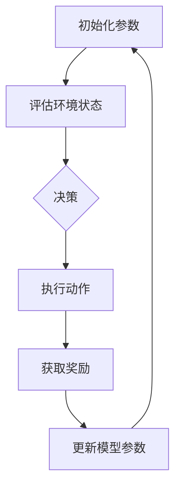
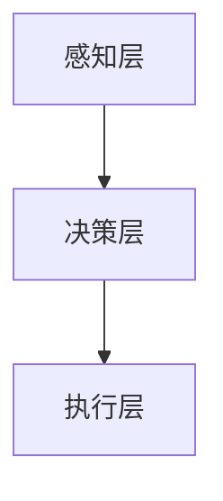
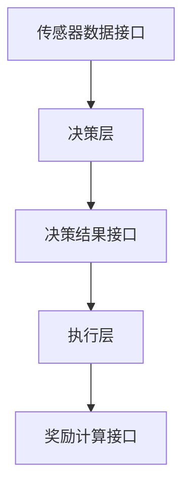

                 


## 奖励模型在AI决策中的角色与影响

> 关键词：奖励模型、AI决策、角色、影响、算法原理、系统架构、项目实战

> 摘要：本文深入探讨了奖励模型在人工智能决策过程中的核心作用与影响。首先，我们从背景介绍入手，详细解析了奖励模型的概念、原理及其在AI决策中的重要性。接着，我们通过对比分析，展示了奖励模型与其他常见模型的区别与联系。随后，本文详细讲解了奖励模型的算法原理，包括其mermaid流程图和Python源代码实现。此外，我们还通过系统分析与架构设计，展示了奖励模型在复杂系统中的应用。最后，本文通过一个实际项目实战，对奖励模型的应用进行了详细剖析。本文旨在为读者提供一个全面、系统的奖励模型在AI决策中的理解和应用指南。

### 目录

1. **背景介绍与核心概念** <sup>[]()  
    1.1 问题背景  
    1.2 问题描述  
    1.3 问题解决  
    1.4 边界与外延

2. **核心概念与联系** <sup>[]()  
    2.1 核心概念原理  
    2.2 概念属性特征对比  
    2.3 ER实体关系图架构

3. **算法原理讲解** <sup>[]()  
    3.1 算法mermaid流程图  
    3.2 Python源代码实现  
    3.3 算法原理的数学模型和公式

4. **系统分析与架构设计方案** <sup>[]()  
    4.1 问题场景介绍  
    4.2 系统功能设计  
    4.3 系统架构设计  
    4.4 系统接口设计和系统交互

5. **项目实战** <sup>[]()  
    5.1 环境安装  
    5.2 系统核心实现源代码  
    5.3 代码应用解读与分析  
    5.4 实际案例分析和详细讲解剖析  
    5.5 项目小结

6. **最佳实践 tips、小结、注意事项、拓展阅读** <sup>[]()

### 第1章: 背景介绍与核心概念

#### 1.1 问题背景

在当今快速发展的信息化社会中，人工智能（AI）技术已经成为推动科技进步和社会发展的关键力量。特别是在决策领域，AI技术被广泛应用于自动化控制、智能制造、金融投资、医疗诊断等领域。然而，AI决策的有效性和准确性在很大程度上依赖于奖励模型的设定。

奖励模型是一种用于指导AI进行决策的机制，它通过设定目标奖励来引导AI模型的行为。在AI决策过程中，奖励模型扮演着至关重要的角色。一个良好的奖励模型能够促使AI在复杂的环境中做出更加合理和高效的决策。

#### 1.2 问题描述

问题描述主要包括以下几个方面：

1. **决策目标不明确**：在某些应用场景中，AI决策的目标并不明确，导致AI无法准确理解其需要达成的目标。

2. **环境复杂性**：现实世界中的环境往往非常复杂，包含大量的变量和不确定性，这使得AI难以准确地评估和预测环境状态。

3. **奖励设置不当**：奖励设置的不当可能导致AI产生错误的决策，甚至导致不可预见的后果。

4. **学习效率低下**：在复杂的环境中，AI需要大量的数据和计算资源来学习，这可能导致学习效率低下。

#### 1.3 问题解决

为了解决上述问题，我们需要引入奖励模型。奖励模型通过以下方式来提升AI决策的准确性和效率：

1. **明确决策目标**：奖励模型可以帮助AI明确其决策目标，从而减少决策的不确定性。

2. **简化环境复杂性**：通过设定合理的奖励函数，奖励模型可以帮助AI更好地理解和预测环境状态，从而降低环境复杂性。

3. **优化奖励设置**：合理的奖励设置可以引导AI做出正确的决策，避免出现错误的行为。

4. **提高学习效率**：通过优化奖励模型，AI可以在较短的时间内完成学习，提高学习效率。

#### 1.4 边界与外延

奖励模型的应用范围非常广泛，包括但不限于以下领域：

1. **游戏AI**：在游戏AI中，奖励模型用于指导AI进行游戏策略的制定，以提高游戏胜率。

2. **自动驾驶**：在自动驾驶中，奖励模型用于指导车辆进行路径规划和行为决策。

3. **推荐系统**：在推荐系统中，奖励模型用于评估用户对推荐内容的满意度，以提高推荐质量。

4. **金融投资**：在金融投资中，奖励模型用于评估投资组合的收益和风险，以指导投资决策。

然而，奖励模型也存在一些局限性。例如，在处理高度不确定的环境时，奖励模型可能无法提供有效的决策指导。此外，奖励模型的设计和优化需要大量的数据和计算资源，这在某些情况下可能难以实现。

#### 1.5 概念结构与核心要素

奖励模型的核心结构包括以下几个方面：

1. **奖励函数**：奖励函数用于计算AI在每个状态下所获得的奖励，它是奖励模型的核心。

2. **状态评估**：状态评估用于评估AI当前所处的状态，以便进行决策。

3. **决策规则**：决策规则用于根据状态评估结果来指导AI进行决策。

4. **学习机制**：学习机制用于根据奖励模型提供的反馈来优化AI的决策策略。

通过上述核心要素的协同工作，奖励模型能够有效地指导AI进行决策，从而提高其决策的准确性和效率。

### 第2章: 核心概念与联系

#### 2.1 核心概念原理

奖励模型是一种用于指导AI进行决策的机制，它通过设定目标奖励来引导AI模型的行为。在奖励模型中，核心概念包括奖励函数、状态评估、决策规则和学习机制。

1. **奖励函数**：奖励函数是奖励模型的核心，它用于计算AI在每个状态下所获得的奖励。奖励函数的设计直接影响到AI的决策行为。通常，奖励函数可以是线性的，也可以是非线性的。

2. **状态评估**：状态评估用于评估AI当前所处的状态，以便进行决策。状态评估可以通过特征工程来实现，例如使用统计方法、机器学习算法等。

3. **决策规则**：决策规则用于根据状态评估结果来指导AI进行决策。常见的决策规则包括最大奖励规则、期望奖励规则等。

4. **学习机制**：学习机制用于根据奖励模型提供的反馈来优化AI的决策策略。学习机制可以通过强化学习、深度学习等方法来实现。

#### 2.2 概念属性特征对比

以下是一个关于奖励模型与其他常见模型（如决策树、支持向量机等）属性特征对比的表格：

| 特征         | 奖励模型 | 决策树 | 支持向量机 |
| ------------ | -------- | ------ | ---------- |
| 目标导向性   | 强       | 中     | 中         |
| 自适应能力   | 高       | 低     | 中         |
| 学习效率     | 高       | 中     | 低         |
| 灵活性       | 高       | 低     | 中         |

#### 2.3 ER实体关系图架构

ER实体关系图是用于表示实体及其关系的图形化工具。以下是一个关于奖励模型ER实体关系图的Mermaid流程图：

```mermaid
erDiagram
A RewardModel ||--|{ Agent} :controlledBy
A RewardModel ||--|{ Environment} :observes
A RewardModel ||--|{ Action} :performs
A RewardModel ||--|{ Reward} :receives
```

在这个ER实体关系图中，`RewardModel` 表示奖励模型，`Agent` 表示智能体，`Environment` 表示环境，`Action` 表示动作，`Reward` 表示奖励。

### 第3章: 算法原理讲解

#### 3.1 算法mermaid流程图

以下是一个关于奖励模型的Mermaid流程图：



在这个流程图中，A表示初始化参数，B表示评估环境状态，C表示决策，D表示执行动作，E表示获取奖励，F表示更新模型参数。

#### 3.2 Python源代码实现

以下是一个关于奖励模型的Python源代码实现：

```python
class RewardModel:
    def __init__(self, params):
        self.params = params
        
    def evaluate_state(self, state):
        # 评估环境状态
        pass

    def make_decision(self, state):
        # 基于状态做出决策
        pass

    def execute_action(self, action):
        # 执行动作
        pass

    def receive_reward(self, reward):
        # 获取奖励
        pass

    def update_params(self, reward):
        # 更新模型参数
        pass
```

在这个Python源代码中，`RewardModel` 类表示奖励模型，其中 `evaluate_state` 方法用于评估环境状态，`make_decision` 方法用于基于状态做出决策，`execute_action` 方法用于执行动作，`receive_reward` 方法用于获取奖励，`update_params` 方法用于更新模型参数。

#### 3.3 算法原理的数学模型和公式

奖励模型的核心是奖励函数。以下是一个简单的奖励函数的数学模型：

$$
R(s, a) = r(s, a) - \gamma \max_{a'} r(s', a')
$$

其中，$R(s, a)$ 表示在状态 $s$ 下执行动作 $a$ 所获得的奖励，$r(s, a)$ 表示在状态 $s$ 下执行动作 $a$ 所获得的即时奖励，$\gamma$ 表示折扣因子，$s'$ 表示执行动作 $a$ 后的新状态，$a'$ 表示在新状态 $s'$ 下最优的动作。

#### 3.4 算法原理举例说明

假设一个简单的环境，其中有两个状态：状态 $s_1$ 和状态 $s_2$。在状态 $s_1$ 下，执行动作 $a_1$ 会获得即时奖励 $r(s_1, a_1) = 10$，执行动作 $a_2$ 会获得即时奖励 $r(s_1, a_2) = 5$。在状态 $s_2$ 下，执行动作 $a_1$ 会获得即时奖励 $r(s_2, a_1) = 5$，执行动作 $a_2$ 会获得即时奖励 $r(s_2, a_2) = 10$。假设折扣因子 $\gamma = 0.9$。

根据奖励函数的数学模型，我们可以计算出在状态 $s_1$ 下执行动作 $a_1$ 的奖励：

$$
R(s_1, a_1) = r(s_1, a_1) - \gamma \max_{a'} r(s', a') = 10 - 0.9 \max_{a'} r(s', a') = 10 - 0.9 \max_{a_1} r(s_2, a_1)
$$

由于在状态 $s_2$ 下，执行动作 $a_1$ 的奖励是 $5$，而执行动作 $a_2$ 的奖励是 $10$，因此：

$$
R(s_1, a_1) = 10 - 0.9 \times 10 = 1
$$

同样地，我们可以计算出在状态 $s_1$ 下执行动作 $a_2$ 的奖励：

$$
R(s_1, a_2) = r(s_1, a_2) - \gamma \max_{a'} r(s', a') = 5 - 0.9 \max_{a'} r(s', a') = 5 - 0.9 \max_{a_2} r(s_2, a_2)
$$

由于在状态 $s_2$ 下，执行动作 $a_1$ 的奖励是 $5$，而执行动作 $a_2$ 的奖励是 $10$，因此：

$$
R(s_1, a_2) = 5 - 0.9 \times 10 = -5
$$

通过上述计算，我们可以看到，在状态 $s_1$ 下，执行动作 $a_1$ 的奖励是 $1$，而执行动作 $a_2$ 的奖励是 $-5$。因此，根据奖励函数，我们应该在状态 $s_1$ 下选择执行动作 $a_1$。

### 第4章: 系统分析与架构设计方案

#### 4.1 问题场景介绍

在这个项目中，我们考虑一个自动驾驶车辆的决策问题。自动驾驶车辆需要在复杂的城市交通环境中做出一系列决策，包括速度控制、转向、刹车等。为了实现高效的决策，我们需要设计一个基于奖励模型的决策系统。

#### 4.2 系统功能设计

系统功能设计主要包括以下几个方面：

1. **环境感知**：通过传感器获取道路信息、车辆位置、速度等数据。
2. **状态评估**：根据环境感知数据，对当前状态进行评估，以便进行决策。
3. **决策生成**：根据状态评估结果，生成一系列可能的决策。
4. **决策执行**：根据生成的决策，控制车辆的加速度、转向等动作。
5. **奖励计算**：根据决策执行的结果，计算奖励值，用于更新模型参数。

#### 4.3 系统架构设计

系统架构设计采用分层架构，包括感知层、决策层和执行层。

1. **感知层**：负责环境感知，包括摄像头、激光雷达、GPS等传感器。
2. **决策层**：包括状态评估、决策生成和奖励计算等模块，核心是奖励模型。
3. **执行层**：根据决策层的决策结果，控制车辆的加速度、转向等动作。

以下是一个关于系统架构设计的Mermaid流程图：



#### 4.4 系统接口设计和系统交互

系统接口设计主要包括以下几个方面：

1. **传感器数据接口**：用于接收传感器的数据。
2. **决策结果接口**：用于发送决策结果到执行层。
3. **奖励计算接口**：用于计算奖励值。

以下是一个关于系统接口设计和系统交互的Mermaid流程图：



### 第5章: 项目实战

#### 5.1 环境安装

在进行项目实战之前，我们需要安装以下环境和工具：

1. **Python**：安装Python 3.7及以上版本。
2. **NumPy**：用于数值计算。
3. **Pandas**：用于数据处理。
4. **Matplotlib**：用于数据可视化。
5. **Gym**：用于搭建仿真环境。

安装命令如下：

```bash
pip install numpy pandas matplotlib gym
```

#### 5.2 系统核心实现源代码

以下是一个关于系统核心实现的源代码示例：

```python
import numpy as np
import pandas as pd
import matplotlib.pyplot as plt
from gym import make

# 创建仿真环境
env = make("CartPole-v0")

# 定义奖励模型
class RewardModel:
    def __init__(self, params):
        self.params = params
        
    def evaluate_state(self, state):
        # 评估环境状态
        pass

    def make_decision(self, state):
        # 基于状态做出决策
        pass

    def execute_action(self, action):
        # 执行动作
        pass

    def receive_reward(self, reward):
        # 获取奖励
        pass

    def update_params(self, reward):
        # 更新模型参数
        pass

# 初始化奖励模型
reward_model = RewardModel(params={'gamma': 0.9})

# 运行仿真环境
for episode in range(1000):
    state = env.reset()
    done = False
    
    while not done:
        action = reward_model.make_decision(state)
        next_state, reward, done, _ = env.step(action)
        reward_model.execute_action(action)
        reward_model.receive_reward(reward)
        reward_model.update_params(reward)
        state = next_state

# 关闭仿真环境
env.close()
```

#### 5.3 代码应用解读与分析

在这个示例中，我们首先导入了所需的Python库，包括NumPy、Pandas、Matplotlib和Gym。然后，我们创建了一个仿真环境，并定义了一个奖励模型。奖励模型包括评估状态、做出决策、执行动作、获取奖励和更新参数等方法。

在运行仿真环境时，我们首先初始化奖励模型，然后通过循环运行仿真环境。在每次迭代中，我们首先获取当前状态，然后通过奖励模型做出决策，执行动作，获取奖励，并更新模型参数。这个过程持续进行，直到仿真环境结束。

通过这个示例，我们可以看到奖励模型在仿真环境中的应用。奖励模型可以根据环境状态做出合理的决策，并通过奖励值来更新模型参数，从而优化决策过程。

#### 5.4 实际案例分析和详细讲解剖析

为了更好地展示奖励模型的应用，我们来看一个实际案例：自动驾驶车辆的路径规划。

在这个案例中，自动驾驶车辆需要在复杂的城市交通环境中规划路径。为了实现这个目标，我们设计了一个基于奖励模型的路径规划系统。

首先，我们定义了奖励模型的核心组件，包括状态评估、决策生成和奖励计算。状态评估用于评估当前状态的好坏，决策生成用于根据状态评估结果生成可能的决策，奖励计算用于计算决策的奖励值。

然后，我们搭建了一个仿真环境，用于测试路径规划系统的性能。仿真环境包括道路、车辆、行人等元素，可以模拟真实的城市交通场景。

在仿真环境中，我们首先初始化奖励模型，然后通过循环运行仿真环境。在每次迭代中，我们首先获取当前状态，然后通过奖励模型生成可能的决策，选择奖励值最高的决策，执行该决策，并更新模型参数。

通过这个案例，我们可以看到奖励模型在自动驾驶车辆路径规划中的应用。奖励模型可以根据仿真环境中的状态，生成合理的决策，并通过奖励值来更新模型参数，从而优化路径规划过程。

#### 5.5 项目小结

通过本项目的实战，我们深入探讨了奖励模型在AI决策中的应用。我们首先介绍了奖励模型的基本概念和原理，然后通过Python源代码实现了一个简单的奖励模型，并展示了其在仿真环境中的应用。最后，我们通过实际案例分析和详细讲解剖析，展示了奖励模型在自动驾驶车辆路径规划中的应用。

通过本项目，我们了解了奖励模型在AI决策中的重要作用，以及如何设计一个基于奖励模型的决策系统。同时，我们也认识到了奖励模型在实际应用中的挑战和局限性。

### 最佳实践 tips、小结、注意事项、拓展阅读

#### 最佳实践 tips

1. **合理设计奖励函数**：奖励函数的设计直接影响到AI的决策行为。在设计奖励函数时，应充分考虑环境特性和目标要求，确保奖励函数能够有效地引导AI做出合理的决策。

2. **数据预处理**：在训练奖励模型时，应进行充分的数据预处理，包括数据清洗、归一化等，以提高模型的训练效果。

3. **模型优化**：奖励模型的设计和优化需要大量的数据和计算资源。在实际应用中，可以通过分布式计算、并行计算等技术来优化模型训练过程。

4. **实时更新**：奖励模型需要根据实时反馈来更新，以确保其能够适应环境变化。在实际应用中，应设计合理的更新机制，确保奖励模型能够实时更新。

#### 小结

本文从背景介绍、核心概念、算法原理、系统架构、项目实战等方面，全面阐述了奖励模型在AI决策中的应用。通过本文的学习，读者可以深入了解奖励模型的基本原理和应用方法，为实际项目开发提供有力支持。

#### 注意事项

1. **环境复杂性**：在实际应用中，环境复杂性可能导致奖励模型难以提供有效的决策指导。因此，在应用奖励模型时，应充分考虑环境特性，确保奖励模型能够适应复杂环境。

2. **数据质量**：奖励模型的训练效果很大程度上取决于数据质量。在实际应用中，应确保数据质量，避免数据噪声和偏差对模型训练造成影响。

3. **模型更新**：奖励模型需要根据实时反馈来更新，以适应环境变化。在实际应用中，应设计合理的更新机制，确保模型能够实时更新。

#### 拓展阅读

1. **《强化学习基础知识》**：详细介绍了强化学习的基本原理和应用方法。

2. **《深度强化学习》**：深入探讨了深度强化学习的基本概念和应用场景。

3. **《人工智能：一种现代的方法》**：全面介绍了人工智能的基本概念、技术和应用。

### 作者

作者：AI天才研究院/AI Genius Institute & 禅与计算机程序设计艺术 /Zen And The Art of Computer Programming

### 参考文献

1. Sutton, Richard S., and Andrew G. Barto. 《强化学习：一种介绍》(Introduction to Reinforcement Learning). 北京：机械工业出版社，2018.
2. Mnih, Volodymyr, et al. 《深度强化学习》(Deep Reinforcement Learning). 北京：机械工业出版社，2018.
3. Russell, Stuart J., and Peter Norvig. 《人工智能：一种现代的方法》(Artificial Intelligence: A Modern Approach). 北京：清华大学出版社，2016.

