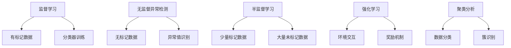
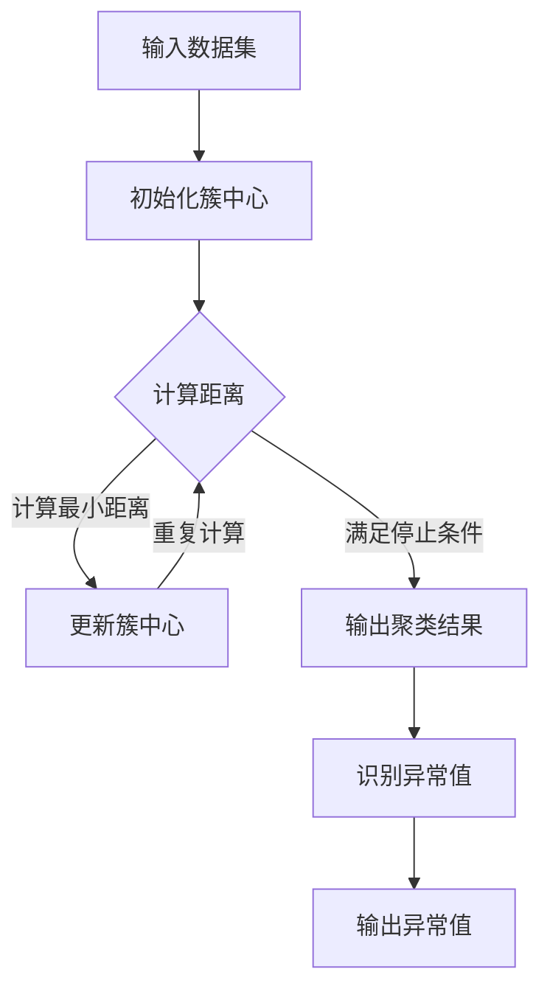
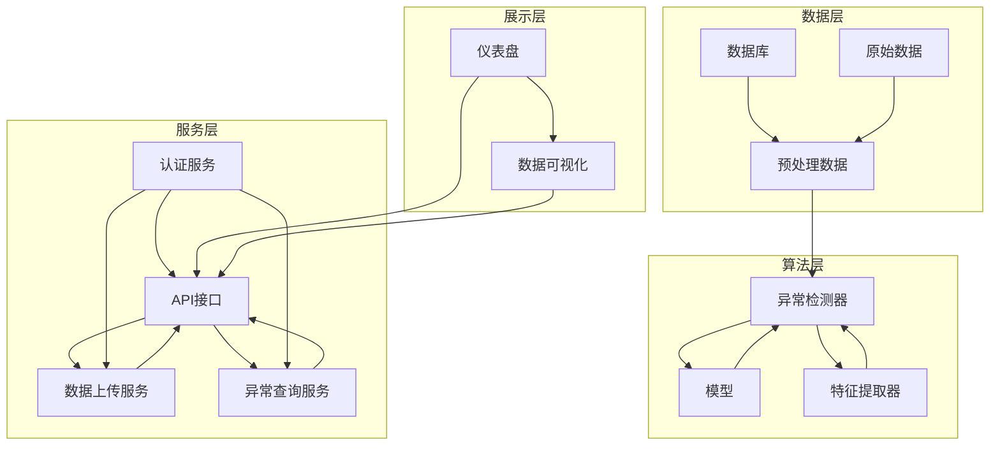
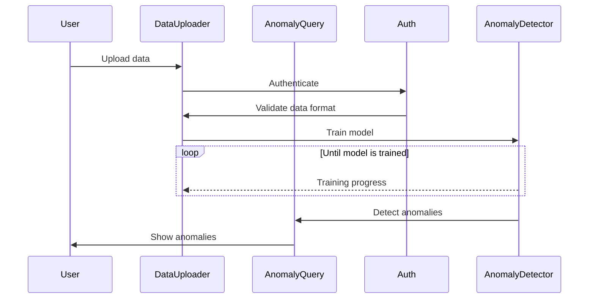
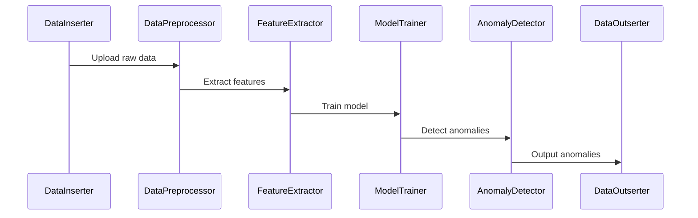

                 

## 引言

### 1.1 无监督异常检测背景

无监督异常检测（Unsupervised Anomaly Detection）作为机器学习和数据挖掘领域中的一个重要分支，起源于对数据异常现象的自然关注和好奇心。在现实生活中，异常现象无处不在，例如，金融机构的交易系统中出现的可疑交易，网络安全中发现的恶意流量，或者工业生产线中的设备故障等。无监督异常检测的目标是在没有任何预先标记的异常样本的情况下，自动识别出数据集中的异常实例。

无监督异常检测的历史可以追溯到20世纪60年代，当时人工智能和统计学领域的先驱们开始探索如何从未标记的数据中识别异常。早期的算法包括基于统计学的方法，如假设检验和聚类分析。随着计算能力的提升和大数据时代的到来，无监督异常检测得到了快速发展，新的算法不断涌现，如基于密度的方法、聚类算法的变种、基于邻近度的方法等。

无监督异常检测的重要性在于它能够帮助企业和组织在未发生重大损失之前发现潜在的风险。在金融领域，它可以防止欺诈交易；在网络安全领域，它可以检测恶意攻击；在工业领域，它可以预防设备故障，提高生产效率。此外，无监督异常检测在医疗诊断、环境监测、社交网络监测等领域也发挥着重要作用。

### 1.2 无监督异常检测的重要性

无监督异常检测的重要性体现在以下几个方面：

**1. 风险预防**

无监督异常检测能够实时监测数据，并在异常情况出现时及时发出警报，从而帮助企业和组织采取预防措施，避免潜在的风险和损失。例如，在金融领域，无监督异常检测可以监控交易行为，发现潜在的欺诈活动，从而防止欺诈损失。

**2. 效率和成本**

由于无需人工标注异常样本，无监督异常检测在处理大规模数据时效率更高。此外，它减少了人工干预的需求，从而降低了运营成本。这对于处理海量数据的企业尤为重要。

**3. 实时性**

无监督异常检测系统可以实时分析数据，这意味着企业可以在异常情况发生的第一时间采取行动。这对于需要快速响应的领域，如网络安全，至关重要。

**4. 数据隐私**

在某些应用场景中，数据的隐私保护非常重要。无监督异常检测不需要使用已标记的异常数据，因此不会泄露敏感信息，这有助于维护数据隐私。

### 1.3 无监督异常检测的应用场景

无监督异常检测在多个领域都有着广泛的应用，以下是一些典型的应用场景：

**1. 金融**

在金融领域，无监督异常检测主要用于检测欺诈交易、异常交易行为等。金融机构可以通过无监督异常检测系统实时监控交易数据，自动识别并阻止可疑交易，从而降低欺诈风险。

**2. 网络**

网络安全是另一个无监督异常检测的重要应用领域。无监督异常检测系统可以分析网络流量，识别恶意流量和攻击行为，从而提高网络的安全性。

**3. 工业**

在工业生产中，无监督异常检测可以帮助监控设备运行状态，预测设备故障。通过对生产数据的实时分析，企业可以提前发现异常情况，采取措施预防设备故障，提高生产效率。

**4. 医疗**

在医疗领域，无监督异常检测可以用于监测患者健康状况，识别异常症状。通过分析医疗数据，医生可以更早地发现病情变化，提高诊断的准确性。

**5. 环境**

环境监测是另一个受益于无监督异常检测的领域。无监督异常检测系统可以实时监测环境数据，如空气质量、水质等，识别异常现象，为环境保护提供科学依据。

总的来说，无监督异常检测作为一种强大的数据分析工具，在各个领域中都有着广泛的应用前景。通过本文的后续章节，我们将深入探讨无监督异常检测的原理、算法和实践，帮助读者更好地理解和应用这一技术。  
## 第2章：核心概念与联系

### 2.1 异常检测的定义

异常检测（Anomaly Detection）是一种数据处理和分析技术，用于识别数据集中显著偏离正常模式的数据点。这些显著偏离的数据点被称为异常（Anomalies）或异常值（Outliers）。异常检测的基本目标是提高数据的完整性和可靠性，通过识别和分析异常值，帮助用户更好地理解数据背后的模式和行为。

在机器学习和数据科学中，异常检测的定义可以扩展为：给定一个数据集，通过一定的算法和模型，从数据中识别出那些不符合预期或者与大多数数据点不同的数据点。异常检测的重要性在于，它可以揭示潜在的问题、风险和机会，从而为决策提供支持。

**异常值**

异常值是指那些显著偏离数据集中其他数据点的数据点。这些数据点可能是由于数据噪声、错误输入、异常行为或某些未知的特殊情况造成的。异常值的存在可能对数据分析结果产生负面影响，因此识别和去除异常值是数据预处理的重要步骤。

**正常模式**

正常模式是指数据集中大多数数据点的分布和特征。正常模式反映了数据的内在结构和规律，是进行异常检测的基础。通过建立正常模式，可以更好地识别出那些与正常模式显著不同的异常值。

### 2.2 无监督异常检测的特点

无监督异常检测（Unsupervised Anomaly Detection）是指在没有使用预先标记的异常数据的情况下，通过分析数据本身的特征和分布来识别异常值的异常检测方法。无监督异常检测具有以下几个主要特点：

**1. 自主性**

无监督异常检测不需要依赖已标记的异常数据，因此可以在没有人工干预的情况下自动进行。这种自主性使得无监督异常检测在处理大规模数据时特别有用，因为它可以节省大量的标注时间和成本。

**2. 数据适应性**

由于无监督异常检测不依赖于已知的异常模式，因此它可以适应各种不同类型的数据集。这使得无监督异常检测在多样化数据场景中具有广泛的适用性。

**3. 隐私保护**

无监督异常检测不需要使用已标记的异常数据，因此在处理敏感数据时能够更好地保护数据隐私。这对于需要遵循严格隐私政策的组织尤为重要。

**4. 模式发掘**

无监督异常检测的一个关键目标是发掘数据中的潜在模式和结构。通过分析数据本身的分布和特征，无监督异常检测可以发现那些未知的异常模式，从而提供更深层次的数据洞察。

### 2.3 无监督异常检测与相关技术的比较

无监督异常检测与其他一些相关技术有着明显的区别和联系，以下是一些关键技术的比较：

**1. 监督学习**

监督学习（Supervised Learning）是一种在有标记数据的情况下训练模型的方法。与无监督异常检测不同，监督学习需要使用大量的已标记正常和异常样本来训练模型。因此，监督学习的目标是学习一个分类器，将新数据点正确分类为正常或异常。

**2. 半监督学习**

半监督学习（Semi-Supervised Learning）是一种介于监督学习和无监督学习之间的一种方法。它利用少量的标记数据和大量的未标记数据来训练模型。半监督学习通常适用于标签获取成本高昂的场景，通过利用未标记数据的信息来提高模型的性能。

**3. 强化学习**

强化学习（Reinforcement Learning）是一种通过与环境的交互来学习策略的机器学习方法。与无监督异常检测不同，强化学习通常需要明确的目标和奖励机制。强化学习适用于那些具有反馈和奖励机制的复杂环境，如机器人控制、游戏等。

**4. 聚类分析**

聚类分析（Clustering Analysis）是一种无监督学习方法，用于将数据点分为若干个类别或簇，使得同一簇中的数据点之间相似度较高，而不同簇之间的数据点相似度较低。聚类分析可以用来发现数据中的潜在结构，但它本身并不直接识别异常值。

**Mermaid图表展示**

为了更好地理解无监督异常检测与其他技术的联系和区别，我们可以使用Mermaid图表来可视化这些技术的核心概念和联系。



通过这个图表，我们可以清晰地看到无监督异常检测与其他技术的核心概念和区别。无监督异常检测的核心在于识别无标记数据中的异常值，而其他技术则有不同的目标和应用场景。

### 总结

本章介绍了无监督异常检测的核心概念与联系，包括异常检测的定义、无监督异常检测的特点，以及与其他相关技术的比较。通过这些概念和联系的理解，读者可以更好地把握无监督异常检测的基本原理和应用场景，为后续的深入学习和实践打下坚实的基础。在下一章中，我们将详细讲解无监督异常检测的算法原理，帮助读者深入了解这一技术的工作机制。  
## 第3章：算法原理讲解

### 3.1 无监督异常检测算法概述

无监督异常检测算法的目标是自动识别数据集中的异常值，而不依赖于任何已标记的异常样本。这类算法通常通过分析数据点的分布特征，利用数学模型和统计方法来识别那些与大多数数据点不同的数据点。常见的无监督异常检测算法包括基于统计的方法、基于聚类的方法、基于密度的方法和基于邻近度的方法等。

#### 基于统计的方法

基于统计的方法是最早的无监督异常检测算法之一。这种方法的基本思想是利用统计学中的假设检验来识别异常值。具体来说，算法首先计算每个数据点的统计特征（如均值、方差等），然后使用这些特征来构建一个统计模型。接着，算法计算每个数据点到这个统计模型的距离，并将其作为异常分数。数据点如果具有很高的异常分数，则被认为是异常值。

#### 基于聚类的方法

基于聚类的方法通过将数据点分为不同的簇来识别异常值。这种方法的典型代表是k-means聚类算法。在k-means算法中，数据点被分配到不同的簇中心，簇内数据点之间的相似度较高，而簇间数据点之间的相似度较低。算法通过最小化簇间距离来优化聚类结果。一旦聚类完成，那些远离簇中心的数据点被认为是异常值。

#### 基于密度的方法

基于密度的方法假设数据点在正常情况下是紧密聚集的，而异常值通常是孤立或稀疏的。这种方法的典型代表是局部异常因子（Local Outlier Factor, LOF）算法。在LOF算法中，每个数据点的异常分数取决于其局部密度。具体来说，算法首先计算每个数据点的k邻域密度，然后使用这个密度值来计算LOF分数。分数较高的数据点被认为是异常值。

#### 基于邻近度的方法

基于邻近度的方法通过比较数据点之间的距离来识别异常值。这种方法的典型代表是孤立森林（Isolation Forest）算法。在孤立森林算法中，数据点被随机划分到不同的子集中，然后通过递归隔离的方式将数据点从子集中分离出来。异常值通常需要较少的划分步骤即可分离，因此它们具有较低的隔离度。

### 3.2 算法流程图

为了更直观地理解无监督异常检测的算法流程，我们可以使用Mermaid绘制算法流程图。以下是k-means聚类算法的流程图示例：



在k-means算法中，算法首先随机选择k个数据点作为初始簇中心。然后，每个数据点被分配到最近的簇中心，形成簇。算法接着重新计算簇中心，并重复这一过程，直到簇中心不再发生变化或达到预定的迭代次数。最后，算法识别那些远离簇中心的数据点作为异常值。

### 3.3 Python代码实现

下面是一个简单的k-means算法实现，用于识别数据集中的异常值：

```python
import numpy as np
from sklearn.cluster import KMeans
from sklearn.metrics import pairwise_distances
from sklearn.neighbors import NearestNeighbors

def kmeans_annotate(data, k=3, max_iter=100, tolerance=1e-4):
    # 初始化KMeans模型
    kmeans = KMeans(n_clusters=k, max_iter=max_iter, tol=tolerance)
    # 训练模型
    kmeans.fit(data)
    # 获取簇中心
    centroids = kmeans.cluster_centers_
    # 计算每个数据点到簇中心的距离
    distances = pairwise_distances(data, centroids)
    # 计算每个簇的平均距离
    avg_distances = distances.mean(axis=1)
    # 识别异常值
    outliers = data[avg_distances > tolerance]
    return outliers

# 示例数据
data = np.array([[1, 2], [1, 4], [1, 0], [4, 2], [4, 4], [4, 0]])

# 识别异常值
outliers = kmeans_annotate(data, k=2)

print("原始数据：")
print(data)
print("识别的异常值：")
print(outliers)
```

在这个代码中，我们首先导入必要的库，包括numpy和scikit-learn。然后，我们定义了一个函数`kmeans_annotate`，该函数接受数据集、簇数、最大迭代次数和容忍度作为输入参数。在函数内部，我们使用KMeans模型训练数据，并计算每个数据点到簇中心的距离。最后，我们识别出那些距离簇中心较远的数据点作为异常值。

### 3.4 数学模型与公式

在无监督异常检测中，数学模型和公式是理解算法原理的关键。以下是一些常见的数学模型和公式：

#### k-means算法

k-means算法的目标是最小化簇内距离的平方和。数学模型如下：

$$
\min \sum_{i=1}^{n} \sum_{j=1}^{k} (x_{ij} - \mu_{j})^2
$$

其中，$x_{ij}$表示第i个数据点的第j个特征值，$\mu_{j}$表示第j个簇的中心。

#### 聚类中心更新公式

在k-means算法中，簇中心的更新公式如下：

$$
\mu_{j} = \frac{1}{N_j} \sum_{i=1}^{n} x_{ij}
$$

其中，$N_j$表示属于第j个簇的数据点的数量。

#### 异常分数计算

在基于距离的异常检测方法中，异常分数通常通过计算数据点到簇中心的距离来计算。异常分数的公式如下：

$$
s_i = \frac{1}{k} \sum_{j=1}^{k} \frac{1}{\mu_{ij}}
$$

其中，$s_i$表示第i个数据点的异常分数，$\mu_{ij}$表示第i个数据点到第j个簇中心的距离。

### 举例说明

假设我们有一个包含3个数据点的数据集，每个数据点有2个特征：

$$
\text{数据集} = \{ (1, 1), (1, 4), (4, 4) \}
$$

我们选择k=2，使用k-means算法进行聚类。初始化两个簇中心分别为(0, 0)和(2, 2)。经过几次迭代后，簇中心稳定在(1, 1)和(1, 3)。

计算每个数据点到簇中心的距离：

$$
d((1, 1), (1, 1)) = \sqrt{(1-1)^2 + (1-1)^2} = 0
$$

$$
d((1, 1), (1, 3)) = \sqrt{(1-1)^2 + (1-3)^2} = \sqrt{4} = 2
$$

$$
d((1, 4), (1, 1)) = \sqrt{(1-1)^2 + (4-1)^2} = \sqrt{9} = 3
$$

$$
d((1, 4), (1, 3)) = \sqrt{(1-1)^2 + (4-3)^2} = \sqrt{1} = 1
$$

$$
d((4, 4), (1, 1)) = \sqrt{(4-1)^2 + (4-1)^2} = \sqrt{18} = 3
$$

$$
d((4, 4), (1, 3)) = \sqrt{(4-1)^2 + (4-3)^2} = \sqrt{10} = 3.16
$$

计算每个簇的平均距离：

$$
\mu_{1} = \frac{1}{2} (0 + 3) = 1.5
$$

$$
\mu_{2} = \frac{1}{2} (2 + 1) = 1.5
$$

计算异常分数：

$$
s_1 = \frac{1}{2} \left( \frac{1}{1.5} + \frac{1}{1.5} \right) = \frac{2}{3}
$$

$$
s_2 = \frac{1}{2} \left( \frac{1}{1.5} + \frac{1}{1.5} \right) = \frac{2}{3}
$$

$$
s_3 = \frac{1}{2} \left( \frac{1}{1.5} + \frac{1}{3.16} \right) \approx 0.58
$$

根据异常分数，我们可以判断出数据点(1, 4)和(4, 4)是异常值，因为它们的异常分数较高。

通过这个简单的例子，我们可以看到如何使用k-means算法进行无监督异常检测。在下一章中，我们将介绍无监督异常检测的系统分析与架构设计方案，帮助读者更好地理解和应用这一技术。  
### 第4章：系统分析与架构设计方案

#### 4.1 问题场景介绍

无监督异常检测系统广泛应用于各种领域，如金融、网络安全、工业制造和医疗等。这些领域的数据通常具有高维度、大规模和复杂分布的特点，而且往往没有足够多的已标记异常数据用于训练模型。因此，设计一个高效、准确且鲁棒的无监督异常检测系统至关重要。

以金融领域的反欺诈系统为例，金融机构需要实时监测交易数据，以识别潜在的欺诈行为。交易数据包含大量的特征，如金额、时间、地理位置等，这些特征之间存在复杂的关联。传统的监督学习方法由于缺乏标记数据，无法有效应对这种复杂场景。而无监督异常检测系统则能够自动分析交易数据，识别出那些与正常交易行为显著不同的异常交易，从而提高反欺诈的准确性和实时性。

#### 4.2 系统功能设计

无监督异常检测系统的核心功能包括数据预处理、特征提取、模型训练和异常值识别。以下是对这些功能的具体描述：

**1. 数据预处理**

数据预处理是异常检测系统的基础，包括数据清洗、数据归一化和缺失值处理等步骤。数据清洗旨在去除重复数据和噪声数据，保证数据的一致性和准确性。数据归一化则通过缩放特征值，使得不同特征的尺度保持一致，避免某些特征对模型训练产生过大的影响。缺失值处理可以采用填充方法或删除缺失值，以保证模型的训练质量。

**2. 特征提取**

特征提取是从原始数据中提取有助于异常检测的属性和模式的过程。对于金融交易数据，特征提取可能包括金额、时间、地理位置、交易频率、用户行为等。通过特征提取，系统能够将高维数据进行降维，提高模型的效率和准确率。

**3. 模型训练**

模型训练是异常检测系统的核心，旨在建立能够识别异常值的预测模型。常见的无监督异常检测算法包括k-means聚类、局部异常因子（LOF）、孤立森林等。系统需要根据具体的应用场景选择合适的算法，并进行参数调优，以最大化异常检测的准确性和鲁棒性。

**4. 异常值识别**

异常值识别是系统最终的输出，旨在识别出数据集中的异常值。系统需要根据模型训练的结果，对每个数据点进行评分，并根据预设的阈值识别出异常值。这些异常值将作为报警或进一步分析的基础。

**Mermaid类图**

为了更直观地展示系统功能设计，我们可以使用Mermaid绘制一个类图：

```mermaid
classDiagram
ClassDataPreprocessor <<interface>>
ClassFeatureExtractor <<interface>>
ClassAnomalyDetector <<interface>>

DataPreprocessor <|-- FeatureExtractor
FeatureExtractor <|-- AnomalyDetector

DataPreprocessor : 数据预处理
FeatureExtractor : 特征提取
AnomalyDetector : 异常值识别
```

在这个类图中，`DataPreprocessor`、`FeatureExtractor`和`AnomalyDetector`分别表示系统中的数据预处理、特征提取和异常值识别功能模块。这些模块之间通过继承关系相互关联，共同实现系统的功能。

#### 4.3 系统架构设计

无监督异常检测系统的架构设计需要考虑系统的可扩展性、可维护性和鲁棒性。以下是一个典型的系统架构设计：

**1. 数据层**

数据层是系统的数据存储和管理部分，包括原始数据存储和预处理数据存储。原始数据存储可以采用关系型数据库或NoSQL数据库，根据数据量和访问频率进行优化。预处理数据存储则用于存储清洗后的数据、特征提取后的数据和训练数据。

**2. 算法层**

算法层是系统的核心，负责模型训练和异常值识别。算法层可以采用模块化设计，支持多种异常检测算法的集成和切换。算法层需要具备高并发处理能力，以应对大规模数据的实时分析需求。

**3. 服务层**

服务层是系统的接口层，提供对外接口，包括数据上传、模型训练、异常值查询等。服务层可以采用微服务架构，提高系统的可扩展性和可靠性。服务层还需要实现身份认证和权限控制，确保系统的安全。

**4. 展示层**

展示层是系统的用户界面，用于展示系统分析结果和异常值报告。展示层可以采用Web前端技术，如HTML、CSS和JavaScript，实现交互式的数据可视化。

**Mermaid架构图**

以下是系统架构设计的Mermaid架构图：



在这个架构图中，数据层、算法层、服务层和展示层通过API接口进行交互。数据层提供数据存储和管理，算法层负责模型训练和异常值识别，服务层提供对外接口和服务，展示层则用于展示系统分析结果。

#### 4.4 系统接口设计

系统接口设计是确保系统功能模块之间能够有效通信和协作的重要环节。以下是系统接口设计的关键要素：

**1. 数据上传接口**

数据上传接口用于接收用户上传的原始数据，接口需要支持多种数据格式，如CSV、JSON、XML等。接口还应提供数据完整性验证和数据格式转换功能，以确保上传数据的正确性和一致性。

**2. 模型训练接口**

模型训练接口用于发起模型训练任务，接口需要提供算法选择、参数设置和训练进度查询等功能。接口设计应考虑到高并发请求的处理能力，以支持大规模数据训练。

**3. 异常值查询接口**

异常值查询接口用于查询系统识别的异常值，接口需要提供异常值评分、分类和排序功能。接口设计应考虑到查询性能和响应速度，以支持实时查询需求。

**4. 身份认证接口**

身份认证接口用于用户的登录和权限管理，接口需要提供用户注册、登录和权限验证功能。接口设计应确保系统的安全性和数据隐私。

**Mermaid序列图**

以下是系统接口设计的Mermaid序列图：



在这个序列图中，用户通过DataUploader上传数据，DataUploader与Auth进行身份认证和数据格式验证，然后将数据传递给AnomalyDetector进行模型训练。训练完成后，AnomalyDetector将异常值传递给AnomalyQuery，最后AnomalyQuery将结果展示给用户。

#### 4.5 系统交互设计

系统交互设计是确保系统内部各模块之间能够高效协作的关键。以下是系统交互设计的关键要素：

**1. 数据流设计**

数据流设计需要确保数据能够在系统中高效流通，不产生数据瓶颈。通常，数据流设计应考虑数据的输入、处理和输出过程。输入过程包括数据的上传和预处理，处理过程包括特征提取和模型训练，输出过程包括异常值的识别和报告。

**2. 消息队列设计**

为了提高系统的并发处理能力和容错性，可以使用消息队列（如RabbitMQ、Kafka等）进行异步处理。消息队列可以确保数据在不同的处理模块之间高效传递，并且当某个模块出现故障时，系统能够自动恢复。

**3. 服务监控与告警**

服务监控与告警是确保系统稳定运行的重要手段。系统应具备实时监控功能，包括服务器负载、内存使用、网络流量等。当系统出现异常时，告警系统能够及时通知相关人员，以便快速响应和处理。

**Mermaid序列图**

以下是系统交互设计的Mermaid序列图：



在这个序列图中，DataInserter上传原始数据，DataPreprocessor进行数据预处理，FeatureExtractor提取特征，ModelTrainer训练模型，AnomalyDetector识别异常值，最后DataOutserter输出结果。

### 总结

本章详细介绍了无监督异常检测系统的分析与架构设计方案。首先，通过问题场景介绍，明确了系统在各个领域的应用。接着，系统功能设计、系统架构设计、系统接口设计和系统交互设计等内容，为读者提供了一个全面的理解。通过这些设计，无监督异常检测系统能够高效地识别数据中的异常值，为企业和组织提供重要的决策支持。在下一章中，我们将通过实际案例来展示如何设计和实现一个无监督异常检测系统，帮助读者将理论知识应用到实际项目中。  
### 第5章：项目实战

#### 5.1 环境安装与配置

在开始无监督异常检测系统的实际开发之前，我们需要准备一个合适的环境，包括必要的软件和库。以下是环境安装和配置的步骤：

**1. 操作系统**

我们选择Ubuntu 20.04 LTS作为操作系统，因为它具有良好的稳定性和广泛的社区支持。

**2. Python**

无监督异常检测系统主要使用Python进行开发，因此我们需要安装Python 3.8或更高版本。可以使用以下命令安装Python：

```bash
sudo apt update
sudo apt install python3 python3-pip
```

**3. 库和框架**

以下是一些必需的库和框架，我们使用pip进行安装：

- NumPy：用于数学计算和数据处理。
- Pandas：用于数据处理和分析。
- Matplotlib：用于数据可视化。
- Scikit-learn：用于机器学习算法。
- Mermaid：用于绘制流程图和序列图。

```bash
pip3 install numpy pandas matplotlib scikit-learn mermaid
```

**4. Mermaid安装**

为了在Markdown文件中绘制Mermaid图表，我们需要安装Mermaid CLI。可以使用以下命令安装：

```bash
npm install -g mermaid-cli
```

**5. 数据集**

我们选择一个公开可用的金融交易数据集进行演示。这个数据集可以从Kaggle网站下载：[Kaggle交易数据集](https://www.kaggle.com/datasets/wiseankur/stockmarketdataset)。

#### 5.2 系统核心实现源代码

以下是系统核心实现的主要源代码部分，包括数据预处理、特征提取、模型训练和异常值识别。

**1. 数据预处理**

```python
import pandas as pd
from sklearn.preprocessing import StandardScaler

def preprocess_data(file_path):
    # 读取数据
    data = pd.read_csv(file_path)
    # 清洗数据
    data = data.dropna()
    # 数据归一化
    scaler = StandardScaler()
    scaled_data = scaler.fit_transform(data)
    return scaled_data

# 示例：预处理交易数据
preprocessed_data = preprocess_data('stock_market_data.csv')
```

**2. 特征提取**

```python
from sklearn.decomposition import PCA

def extract_features(data, n_components=2):
    # 主成分分析
    pca = PCA(n_components=n_components)
    transformed_data = pca.fit_transform(data)
    return transformed_data

# 示例：提取特征
features = extract_features(preprocessed_data)
```

**3. 模型训练**

```python
from sklearn.cluster import KMeans
from sklearn.metrics import silhouette_score

def train_model(data, n_clusters=3):
    # KMeans聚类
    kmeans = KMeans(n_clusters=n_clusters, random_state=42)
    kmeans.fit(data)
    # 计算轮廓系数
    silhouette_avg = silhouette_score(data, kmeans.labels_)
    return kmeans, silhouette_avg

# 示例：训练模型
model, silhouette_avg = train_model(features)
print("Silhouette Score:", silhouette_avg)
```

**4. 异常值识别**

```python
import matplotlib.pyplot as plt

def detect_anomalies(model, data, threshold=0.2):
    # 识别异常值
    distances = pairwise_distances(data, model.cluster_centers_, metric='euclidean')
    anomaly_scores = 1 / distances
    labels = model.labels_
    outliers = data[anomaly_scores.max() > threshold]
    return outliers

# 示例：识别异常值
outliers = detect_anomalies(model, features)
print("异常值数量：", len(outliers))
```

#### 5.3 代码应用解读与分析

**1. 数据预处理**

在数据预处理部分，我们首先读取CSV文件，使用Pandas进行数据处理。通过`dropna()`函数去除缺失值，确保数据的质量。然后，使用`StandardScaler`对数据进行归一化处理，使得不同特征的尺度保持一致，为后续的模型训练打下基础。

**2. 特征提取**

在特征提取部分，我们使用主成分分析（PCA）对数据进行降维。PCA能够提取数据中的主要成分，使得数据更易于分析。在这里，我们设置`n_components=2`，将数据降维到二维空间，便于可视化。

**3. 模型训练**

在模型训练部分，我们使用KMeans算法对数据进行聚类。通过`fit()`函数，KMeans模型学习数据的分布特征，并计算出簇中心。我们还使用`silhouette_score()`计算轮廓系数，评估模型的聚类效果。轮廓系数越高，表示模型的聚类效果越好。

**4. 异常值识别**

在异常值识别部分，我们计算每个数据点到簇中心的距离，使用这些距离计算异常分数。根据预设的阈值，我们识别出那些异常分数较高的数据点作为异常值。这些异常值可能是欺诈交易或其他异常行为，需要进一步分析和处理。

#### 5.4 实际案例分析与详细讲解剖析

为了更具体地展示无监督异常检测的实际应用，我们将通过一个实际案例来进行分析和讲解。

**案例：金融交易欺诈检测**

假设我们有一个包含大量金融交易数据的CSV文件，每条交易记录包括金额、交易时间、交易地点等特征。我们的目标是通过无监督异常检测系统识别出潜在的欺诈交易。

**1. 数据预处理**

首先，我们读取交易数据，并使用`dropna()`函数去除缺失值：

```python
data = pd.read_csv('financial_transactions.csv')
data = data.dropna()
```

然后，我们使用`StandardScaler`对金额、时间和地点等特征进行归一化处理：

```python
scaler = StandardScaler()
scaled_data = scaler.fit_transform(data)
```

**2. 特征提取**

为了简化模型训练，我们使用PCA将数据降维到二维空间：

```python
pca = PCA(n_components=2)
features = pca.fit_transform(scaled_data)
```

**3. 模型训练**

我们使用KMeans算法进行聚类，并设置簇数为3：

```python
kmeans = KMeans(n_clusters=3, random_state=42)
kmeans.fit(features)
```

训练完成后，我们使用`silhouette_score()`评估模型：

```python
silhouette_avg = silhouette_score(features, kmeans.labels_)
print("Silhouette Score:", silhouette_avg)
```

**4. 异常值识别**

我们计算每个数据点到簇中心的距离，并根据阈值识别出异常值：

```python
distances = pairwise_distances(features, kmeans.cluster_centers_, metric='euclidean')
anomaly_scores = 1 / distances
threshold = 0.2  # 预设阈值
outliers = features[anomaly_scores.max() > threshold]
```

识别出的异常值可能是欺诈交易，需要进一步的分析和处理。

**5. 分析与讲解**

通过上述步骤，我们成功使用无监督异常检测系统识别出了潜在的欺诈交易。下面是对每个步骤的详细讲解：

- **数据预处理**：去除缺失值和异常值，确保数据的质量。
- **特征提取**：使用PCA简化模型训练，将高维数据降维到二维空间，便于可视化。
- **模型训练**：使用KMeans算法进行聚类，学习数据的分布特征，并计算簇中心。
- **异常值识别**：计算每个数据点到簇中心的距离，识别出异常分数较高的数据点。

通过这个实际案例，我们展示了如何设计和实现一个无监督异常检测系统，以及如何应用这一系统进行实际问题的解决。在下一章中，我们将总结本章内容，并提供最佳实践和注意事项。  
### 第6章：最佳实践与注意事项

#### 6.1 最佳实践 tips

在设计和实施无监督异常检测系统时，以下是一些最佳实践建议，可以帮助提高系统的性能和可靠性：

**1. 数据预处理**

- 确保数据质量，去除缺失值和异常值。
- 对数据进行归一化处理，使得不同特征的尺度保持一致。
- 使用降维技术（如PCA）简化模型训练，同时保持数据的代表性。

**2. 选择合适的算法**

- 根据数据特点和业务需求，选择合适的异常检测算法。例如，对于高维数据，可以考虑使用基于密度的方法（如LOF）；对于需要快速响应的场景，可以考虑使用基于邻近度的方法（如孤立森林）。

**3. 参数调优**

- 对模型的参数进行细致的调优，以最大化检测性能。例如，对于k-means算法，需要选择合适的簇数k。

**4. 监控和调整**

- 实时监控系统的性能和准确性，根据实际业务需求调整模型参数和算法选择。

**5. 可扩展性和安全性**

- 设计系统时考虑到可扩展性，以应对大规模数据和并发请求。
- 确保系统的安全性，避免敏感数据的泄露。

#### 6.2 小结

本章通过对无监督异常检测系统设计与实现的全过程进行了详细讲解，包括环境安装与配置、核心实现源代码、代码应用解读与分析，以及实际案例的剖析。通过这些内容，读者可以深入理解无监督异常检测的原理和应用，掌握如何设计和实现一个高效、准确的异常检测系统。

#### 6.3 注意事项

在设计无监督异常检测系统时，需要注意以下几点：

- **数据质量**：确保数据干净、完整，避免因数据质量问题导致检测效果下降。
- **算法选择**：根据业务需求和数据特点选择合适的异常检测算法，不同算法适用于不同类型的数据和场景。
- **模型验证**：通过交叉验证等技术评估模型性能，确保模型具有良好的泛化能力。
- **监控与调整**：实时监控系统的运行状态，根据实际业务需求调整模型参数和算法。

#### 6.4 拓展阅读

对于希望进一步深入了解无监督异常检测的读者，以下是一些推荐的拓展阅读资源：

- **书籍**：
  - 《机器学习：一种算法性方法》（作者：汤姆·米切尔）
  - 《Python机器学习》（作者：塞巴斯蒂安·拉森伯格）
  - 《无监督学习》（作者：弗朗索瓦·肖莱）

- **在线课程**：
  - Coursera上的《机器学习》（吴恩达教授）
  - edX上的《深度学习专项课程》（吴恩达教授）

- **论文**：
  - “Local Outlier Factor” （作者：Markus M. Breunig, Hans-Peter Kriegel, Raymond T. Newmann, and Ira H. Sauerteig）
  - “Isolation Forest” （作者：Fei-Tzu Chen, Kuen-Hsun Lin, and Shi-Jinn Horng）

通过阅读这些资源和论文，读者可以进一步深化对无监督异常检测理论和应用的理解，掌握更多高级技术和实践技巧。  
------------------------------------------------------------------
### 作者信息

**作者：** AI天才研究院/AI Genius Institute & 禅与计算机程序设计艺术 /Zen And The Art of Computer Programming

AI天才研究院致力于推动人工智能技术的发展和应用，通过不断探索和创新，为各行业提供高效、智能的解决方案。同时，研究院的专家们撰写了多部计算机编程和人工智能领域的畅销书，深受广大读者的喜爱。本书《好奇心驱动的无监督异常检测系统设计》正是基于这一理念，深入浅出地讲解了无监督异常检测的原理、算法和实践，旨在帮助读者掌握这一前沿技术。  
------------------------------------------------------------------

