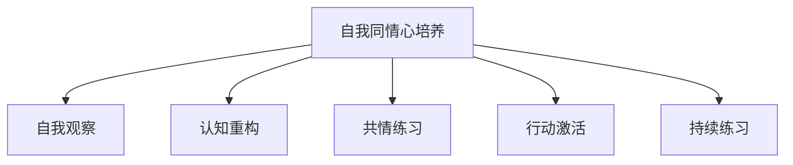

                 

## 引言

在现代社会的快节奏生活中，人们常常被完美主义所束缚，对自己的不完美感到焦虑，这种焦虑不仅影响心理健康，还可能影响人际关系和工作效率。为了解决这一问题，我们需要学会接纳不完美的自己，培养自我同情心。自我同情心是一种对自己持温和、理解的态度，不仅能够减轻内心的痛苦，还能提高自我价值感和心理健康水平。

本文旨在探讨自我同情心的概念、原理及其在实际生活中的应用。我们将从以下几个角度展开讨论：

1. **自我同情心的定义与重要性**：介绍自我同情心的概念，阐述其在心理健康中的重要性。
2. **自我接纳的过程与障碍**：探讨自我接纳的概念、过程以及可能遇到的障碍。
3. **心理健康的基本原理**：介绍心理健康的基本概念，讨论自我同情心与心理健康的关系。
4. **认知行为疗法与自我同情心的培养**：讲解认知行为疗法的基本原理，探讨其在自我同情心培养中的应用。
5. **自我同情心的培养方法**：提供具体的培养自我同情心的方法与策略。
6. **实践应用场景**：分析自我同情心在家庭关系、工作环境和社交圈中的应用。
7. **项目实战**：通过一个具体项目，展示自我同情心的实践应用。
8. **最佳实践 tips**、**小结**、**注意事项**和**拓展阅读**等内容。

通过本文的阅读，希望读者能够理解自我同情心的概念和原理，掌握培养自我同情心的方法，并在实际生活中加以应用，从而提升心理健康水平，拥有更加积极和健康的生活态度。

## 自我同情心的定义与重要性

### 自我同情心的概念

自我同情心（Self-Compassion）是一个相对较新的概念，由心理学家克里斯汀·奈特利（Kristin Neff）提出。自我同情心不同于自我同情（Self-Pity），后者通常是指对自己的不幸感到悲哀和自怜，而自我同情心则是一种对自己持温和、理解的态度，即使面对挫折和困难时，也能以同理心对待自己。

自我同情心包括三个主要成分：

1. **共情**（Common humanity）：认识到每个人都会经历痛苦和困难，这是一种普遍的人类体验，不是个人独有的。
2. **无判断**（Non-judgment）：不对自己的不足或失败进行严厉的自我批评，而是以温和和理解的态度对待自己。
3. **有效行动**（Effective action）：在认识到自己的痛苦后，采取实际步骤来减轻这种痛苦，而不是沉溺于消极情绪中。

### 自我同情心的重要性

自我同情心在心理健康中扮演着至关重要的角色。首先，自我同情心有助于减轻情绪压力。当人们面对挫折和失败时，缺乏自我同情心会导致自责和焦虑，而自我同情心则能帮助个体以更加温和和理解的态度面对自己的情绪，从而减轻内心的痛苦。

其次，自我同情心能够提高自我价值感。长期的自责和批评会削弱个体的自我价值感，而自我同情心则帮助个体认识到自己的价值不仅仅取决于成就或外表，而是与作为一个完整的、有情绪和缺点的人类相联系。

此外，自我同情心与心理健康之间存在密切的关系。研究表明，高水平的自我同情心与较低的抑郁、焦虑和压力水平有关。自我同情心的培养不仅有助于改善当前的心理健康状态，还能预防未来的心理健康问题。

最后，自我同情心对于建立积极的人际关系也至关重要。一个能够对自己持同情态度的人，往往更容易与他人建立深厚的情感联系，因为他们能够更好地理解和尊重他人的情感需求。

### 自我同情心与健康的关系

自我同情心不仅影响心理健康，还与身体健康密切相关。研究表明，高水平的自我同情心与较低的慢性疾病发病率有关。这可能是因为自我同情心能够减轻压力，减少体内炎症反应，从而降低患病的风险。

此外，自我同情心还有助于改善饮食和锻炼习惯。那些对自己持同情态度的人更可能采取积极的健康行为，因为他们不会因为一时的失误而自责或放弃。

总的来说，自我同情心是一种有益的心理状态，它不仅能够改善个体的心理健康和身体健康，还能提高生活质量。通过理解自我同情心的概念和重要性，我们可以开始培养这一宝贵的品质，为自己的生活带来积极的变化。

### 自我接纳的概念与过程

#### 自我接纳的定义

自我接纳（Self-Acceptance）是指个体对自己的一切，包括优点、缺点、成功和失败，持一种开放和无条件的态度。这意味着不再将自己与他人进行比较，而是接受自己作为一个独特存在的全部，无论外界如何评价。

自我接纳与自我同情心密切相关。自我接纳是个体内在的状态，而自我同情心则是对这种状态的回应。当我们接纳自己时，我们会更加同情和理解自己的需求、情感和行为，即使这些方面可能不符合社会标准或他人的期望。

#### 自我接纳的过程

自我接纳是一个多步骤的过程，通常涉及以下几个阶段：

1. **认识自我**：了解自己的内在世界，包括情感、思想和行为模式。这需要反思和自我探索，以便深入了解自己的真实需求和感受。

2. **承认不完美**：接受自己不是完美的，每个人都有不足和缺点。这个过程可能涉及面对过去的失败、错误或受伤的经历，并承认这些经历对自己产生的影响。

3. **放下批判**：停止对自己进行严厉的批评和自我谴责。这需要识别并改变那些消极的自我对话，转而以更加温和和理解的态度对待自己。

4. **培养自我同情心**：在认识到自己的不完美时，以同情和理解的态度对待自己。这包括共情自己的情感和需要，以及提供支持和安慰。

5. **持续练习**：自我接纳是一个持续的过程，需要不断地练习和巩固。这包括在日常生活中培养自我同情心，即使在面对挑战和困难时也能保持对自己的接纳。

#### 障碍与挑战

在自我接纳的过程中，个体可能会遇到各种障碍和挑战。以下是一些常见的障碍：

1. **完美主义**：完美主义者往往难以接受自己的不完美，因为他们对自己的期望过高。这可能导致持续的焦虑和压力。

2. **社会压力**：社会对个体形象和成就的期望可能导致个体感到不满足和焦虑，从而影响自我接纳。

3. **自我批评**：长期的自我批评会削弱自我接纳的能力。这种消极的自我对话可能源自早期的生活经历或他人的评价。

4. **情绪困扰**：情绪问题，如抑郁和焦虑，可能影响个体的自我接纳能力。这些情绪困扰可能会使个体难以客观地看待自己。

#### 培养自我接纳的策略

为了克服这些障碍，以下是一些培养自我接纳的策略：

1. **正念练习**：正念练习，如冥想和呼吸练习，可以帮助个体集中注意力，减少自我批评，并培养对自己的接纳。

2. **自我反思**：定期进行自我反思，识别并改变消极的自我对话，以及认识到自己的价值和成就。

3. **建立支持系统**：与家人、朋友或专业人士分享自己的感受和经历，获得支持和理解。

4. **感恩练习**：通过感恩练习，关注自己的优点和积极经历，增强自我接纳。

5. **设定现实目标**：设定符合自己能力的目标，避免因过度追求完美而感到压力。

通过这些策略，个体可以逐渐培养自我接纳的能力，从而提高心理健康水平和生活满意度。

### 心理健康的基本原理

#### 心理健康的定义

心理健康（Mental Health）是一个多维度的概念，不仅仅是指没有心理疾病，更涉及个体的情感状态、心理过程和整体功能水平。世界卫生组织（WHO）将心理健康定义为“一种状态，其中个体能够认识到自己的能力，能够应对正常生活中的压力，能够工作生产，并且能够为社区做出贡献。”

心理健康的定义涵盖了几个关键方面：

1. **情感健康**：个体能够体验积极的情感，如快乐、满足和幸福，同时能够有效地处理负面情感，如焦虑、悲伤和愤怒。
2. **认知功能**：个体能够清晰地思考，具有解决问题的能力，能够做出明智的决策。
3. **社会功能**：个体能够与他人建立积极的社交关系，参与社区活动，适应社会环境。
4. **整体功能**：个体能够在日常生活中保持较高的功能水平，包括工作、学习和娱乐等方面。

#### 维护心理健康的方法

维护心理健康是一个持续的过程，需要个体采取一系列积极的行动。以下是一些有效的维护心理健康的方法：

1. **积极的生活态度**：保持乐观的态度，学会从挑战中寻找机会，能够看到积极的方面，有助于提高心理健康水平。
2. **社交支持**：与家人、朋友和同事保持良好的社交关系，分享自己的感受和经历，获得情感支持和理解，有助于减轻心理压力。
3. **身体锻炼**：定期进行身体锻炼，如散步、跑步或瑜伽等，能够释放压力，提高情绪状态，同时有助于改善身体健康。
4. **放松技巧**：学习并实践放松技巧，如深呼吸、冥想和渐进性肌肉放松等，有助于减轻紧张和焦虑，提高心理弹性。
5. **充足睡眠**：保持充足的睡眠，有助于恢复体力和精神，提高认知功能和工作效率。
6. **营养均衡**：保持营养均衡的饮食，摄入足够的维生素和矿物质，有助于维持心理健康。
7. **自我关怀**：定期进行自我关怀，如泡澡、阅读或进行放松的活动，有助于提高自我价值和幸福感。

#### 自我同情心与心理健康的关系

自我同情心是维护心理健康的一个重要因素。研究表明，自我同情心与心理健康之间存在密切的关系。高水平的自我同情心能够带来以下几个方面的好处：

1. **减少负面情绪**：自我同情心帮助个体以更加温和和理解的态度对待自己，从而减少自责、焦虑和抑郁等负面情绪。
2. **提高情绪调节能力**：自我同情心能够提高个体对情绪的调节能力，使个体在面对压力和挑战时能够更加冷静和理智。
3. **增强心理弹性**：自我同情心有助于个体在经历挫折和失败时保持坚韧，更快地从困难中恢复过来。
4. **促进积极的人际关系**：自我同情心能够促进个体与他人的积极互动，建立深厚的人际关系，提高社会支持水平。
5. **提高生活质量**：自我同情心有助于个体更加积极地看待生活，提高生活满意度和幸福感。

总之，心理健康是一个多维度的概念，自我同情心在其中扮演着至关重要的角色。通过理解和培养自我同情心，个体能够更好地维护自己的心理健康，享受更加积极和充实的生活。

### 认知行为疗法与自我同情心的培养

#### 认知行为疗法的基本原理

认知行为疗法（Cognitive Behavioral Therapy，简称CBT）是一种广泛使用的心理治疗方法，旨在通过改变不合理的思维和行为模式来改善心理健康。CBT的核心原理是，个体的思维和行为直接影响其情感和情绪状态，因此通过改变这些思维和行为，可以显著改善心理健康。

CBT的主要组成部分包括：

1. **认知重构**：识别和改变不合理的思维模式，如自我批评、过度概括、黑白思维等，以更加客观和积极的方式看待自己和生活。
2. **行为激活**：鼓励个体采取实际行动，通过行为改变来改善情绪状态，如增加身体锻炼、参与社交活动等。
3. **技能训练**：教授个体各种应对策略，如放松技巧、情绪调节技巧和社交技能，以提高其应对压力和挑战的能力。

#### 认知行为疗法在自我同情心培养中的应用

自我同情心是CBT中一个重要的概念，它通过以下几个步骤来培养：

1. **自我观察**：首先，个体需要学会观察自己的思维、情感和行为，而不是被它们所控制。这一步骤有助于个体认识到自己的情感状态，而不是逃避或压抑它们。

2. **认知重构**：在认识到自己的情感状态后，个体需要识别那些导致自我批评和不合理思维模式的认知陷阱。例如，通过识别“灾难化思维”（即将小事看作灾难）和“全或无思维”（将事物视为完全成功或完全失败），个体可以开始重构这些思维模式，以更加客观和积极的方式看待自己。

3. **共情练习**：培养自我同情心的关键是通过共情来对待自己。个体可以通过想象自己处于一个需要帮助的朋友的情境，以同理心对待自己。例如，当一个人感到焦虑时，他可以想象自己正试图安慰一个焦虑的朋友，并以此方式对待自己。

4. **行为激活**：个体需要采取实际行动来支持自己的自我同情心。这可能包括进行正念练习、身体锻炼、参与有意义的活动，或者简单地做一些让自己感到快乐的事情。

5. **技能训练**：CBT还会教授各种技能，如情绪调节技巧、放松技巧和社交技能，这些技能有助于个体在面对挑战时保持冷静和理智。

#### 认知行为疗法案例分析

以下是一个简化的认知行为疗法案例，展示如何在实践中培养自我同情心：

**案例背景**：一名女性客户，名叫丽莎，她经常因工作上的小错误而严厉责备自己，导致情绪低落和焦虑。

**步骤1：自我观察**：
丽莎通过日记记录自己的思维、情感和行为模式。她发现每当她犯错时，她的第一反应是“我真是太差了，我永远做不到。” 这种自我批评的思维方式让她感到更加焦虑和沮丧。

**步骤2：认知重构**：
在治疗师的引导下，丽莎开始识别她的不理性思维模式。她意识到这种思维方式是一种灾难化思维，将小错误过度放大。治疗师帮助她重构这种思维，例如：“犯错是正常的，每个人都会犯错。我可以通过这次经历学到东西。”

**步骤3：共情练习**：
丽莎开始练习以同情心对待自己。她想象自己在安慰一个朋友，这个朋友因为工作上的小错误感到自责和焦虑。她对自己说：“我知道这对你来说很难，但你不是一个人。你已经做得很好了，你值得同情。”

**步骤4：行为激活**：
丽莎开始每天进行30分钟的正念冥想，通过专注于呼吸和身体的感觉来减少焦虑。她还增加了每周三次的轻度运动，以改善她的情绪状态。

**步骤5：技能训练**：
治疗师教授丽莎情绪调节技巧，如深呼吸和渐进性肌肉放松。丽莎学会了在感到焦虑时使用这些技巧，帮助她保持冷静。

通过这些步骤，丽莎逐渐学会了以更加温和和理解的态度对待自己，她的自我批评减少，情绪状态显著改善。这个案例展示了认知行为疗法在培养自我同情心方面的有效性。

总的来说，认知行为疗法提供了一种系统的方法来培养自我同情心。通过认知重构、共情练习、行为激活和技能训练，个体可以逐渐学会以更加积极和健康的方式对待自己，从而提升心理健康水平。

### 自我同情心的培养方法

#### 自我同情心培养的步骤

培养自我同情心是一个逐步的过程，涉及自我观察、认知重构、共情练习和行动激活等多个步骤。以下是一个详细的培养自我同情心的步骤指南：

1. **自我观察**：
   - **实践日记**：每天记录自己的情绪、思维和行为。通过日记，你可以更清楚地看到自己的反应模式，了解自己在不同情境下的感受和反应。
   - **正念练习**：练习正念，专注于当下的感受，而不是逃避或压抑它们。正念冥想可以帮助你更好地了解自己的内心世界。

2. **认知重构**：
   - **识别不合理的思维模式**：识别并记录那些导致自我批评和不合理思维模式的认知陷阱，如灾难化思维、过度概括和黑白思维。
   - **重构不合理思维**：通过挑战和重构这些不合理的思维模式，用更客观和积极的思维替代它们。例如，从“我一无是处”转变为“每个人都有缺点，我可以通过这次经历学到东西。”

3. **共情练习**：
   - **想象他人情境**：想象自己处于一个需要帮助的朋友的情境，并以同情心对待他们。例如，如果朋友因为工作上的小错误感到焦虑，你可能会安慰他们说：“我知道这对你来说很难，但你会挺过去的。”
   - **应用到自身**：将同样的同情心应用到自己的情境中。当你遇到挫折或失败时，用你对待朋友的方式对待自己，给予自己支持和理解。

4. **行动激活**：
   - **积极行为**：采取积极的行动来支持自我同情心的培养。这包括进行身体锻炼、参与有意义的活动和与家人、朋友交流。
   - **自我关怀**：定期进行自我关怀，如泡澡、听音乐或进行放松的活动，以提升自我价值和幸福感。

5. **持续练习**：
   - **建立日常习惯**：将自我同情心的培养融入日常生活，如每天进行正念冥想、每周进行放松练习等。
   - **持续反思**：定期反思自己的进步和挑战，调整策略，确保持续培养自我同情心。

#### 实践技巧与案例分析

**技巧1：正念冥想**

正念冥想是一种有效的自我同情心培养技巧，通过专注于呼吸和当下的感受，可以帮助你更好地了解自己的内心世界。

**实践方法**：

- 找一个安静的地方，坐直或躺下，闭上眼睛。
- 将注意力集中在呼吸上，感受呼吸的进出。
- 如果你的注意力开始分散，轻轻地将其引导回呼吸。

**案例分析**：

艾米，一个年轻的职业女性，经常因工作中的压力感到焦虑。通过每天的正念冥想，艾米学会了更加平静地面对压力。她发现，每次冥想结束后，她的情绪状态更加稳定，能够以更加冷静和理智的态度处理工作中的挑战。

**技巧2：感恩练习**

感恩练习可以帮助你培养对自己和生活的积极态度。

**实践方法**：

- 每天晚上花几分钟时间思考你感激的事物。
- 这些事物可以是具体的事件、人，或生活中的简单美好。
- 写下你的感恩清单，并定期回顾。

**案例分析**：

汤姆，一个感到生活乏味的人，开始进行感恩练习。他发现，每天记录感激的事物不仅让他感到更加满足，还改变了他的思维方式。他开始更加积极地看待生活中的细节，他的整体幸福感显著提高。

**技巧3：自我对话**

改变自我对话是培养自我同情心的关键步骤。

**实践方法**：

- 识别并记录消极的自我对话，例如“我做不到”或“我不好”。
- 用积极和鼓励的话语替代这些消极的自我对话。
- 例如，将“我做不到”转变为“我可以尝试，即使结果不完美，这也是一种成长。”

**案例分析**：

丽莎，一个经常自我批评的人，开始意识到她的消极自我对话对她的情绪和自我价值感产生了负面影响。通过用积极的话语替代消极的自我对话，丽莎逐渐学会了以更加温和和理解的态度对待自己，她的情绪状态和生活满意度都得到了显著提升。

通过这些实践技巧和案例分析，你可以看到培养自我同情心的具体方法。自我同情心不仅能够改善心理健康，还能提升生活质量。通过持续练习这些技巧，你可以逐渐学会接纳自己的不完美，享受更加积极和健康的生活。

### 自我同情心在实践中的应用场景

自我同情心不仅仅是一个抽象的概念，它在我们的日常生活中有着广泛的应用。以下是自我同情心在家庭关系、工作环境和社交圈中的具体应用场景，以及如何通过这些应用来改善我们的心理健康和生活质量。

#### 家庭关系中的应用

在家庭关系中，自我同情心的培养尤为重要。家庭成员之间的互动经常是复杂而微妙的，很容易因为一些小摩擦而产生冲突。以下是一些应用自我同情心的方法：

1. **理解与接纳**：家庭成员之间经常因为性格、兴趣和价值观的差异而产生矛盾。培养自我同情心可以帮助我们更好地理解彼此的感受和需求，从而减少冲突。例如，当你的配偶因为工作压力而情绪低落时，你可以用同情的态度对待他们，而不是批评或责备。

2. **积极沟通**：在沟通时，用自我同情心的态度来表达自己的需求和感受。例如，当你的孩子犯错时，而不是立即批评，你可以尝试说：“我理解你感到失望，这种情绪是正常的。我们可以一起找出解决问题的方法。”

3. **情绪调节**：面对家庭矛盾和压力时，自我同情心可以帮助我们更好地调节情绪。通过正念和放松技巧，我们可以减少愤怒和焦虑，以更加平和的心态处理家庭问题。

**案例**：一位母亲发现自己在面对孩子的考试成绩时，容易情绪失控。通过正念冥想和自我同情心练习，她学会了以更加平和和理解的态度对待孩子的成绩。她开始专注于孩子的努力和进步，而不是仅仅关注成绩。这种改变不仅改善了家庭关系，也提高了孩子的自尊心和自信心。

#### 工作环境中的应用

在工作环境中，压力和竞争常常导致人们忽视自己的情感需求，缺乏自我同情心。以下是一些在工作场景中培养自我同情心的方法：

1. **自我关怀**：工作再忙碌，也要记得自我关怀。例如，每天花几分钟时间进行深呼吸练习，或者定期进行体育锻炼，以缓解工作压力。

2. **积极反馈**：给自己积极的心理反馈，即使在工作中小有成就，也要给自己鼓励。例如，当你在工作中完成任务时，你可以告诉自己：“我做得不错，这次经验让我更加熟练。”

3. **共情同事**：在团队合作中，培养对同事的同情心。当同事遇到困难时，提供帮助和支持，而不是仅仅关注自己的利益。

**案例**：一位项目经理因为项目失败而感到自责和压力。通过自我同情心练习，他学会了接受失败是学习过程的一部分。他开始反思项目的每个阶段，找出改进的方法，而不是责怪自己。这种积极的态度不仅帮助他恢复信心，也促进了团队的合作和成长。

#### 社交圈中的应用

在社交圈中，自我同情心的培养可以帮助我们更好地处理人际关系，减少社交焦虑和孤独感。

1. **真实表达**：在社交场合中，勇敢地表达自己的真实感受，而不是为了取悦他人而掩饰自己。例如，当你感到疲倦时，可以真诚地告诉朋友：“我现在感到很累，可能需要休息一下。”

2. **共情他人**：在社交互动中，培养对他人的同情心，理解他们的需求和感受。例如，当朋友遇到困难时，你可以用同情的态度提供支持，而不是仅仅关注自己的利益。

3. **积极互动**：通过参与社区活动、志愿者工作或兴趣小组，与他人建立深层次的联系。这种积极的社会互动有助于提升自我价值感和社会支持。

**案例**：一位年轻人在社交活动中经常感到紧张和焦虑。通过自我同情心和正念练习，他学会了以更加平和和理解的态度对待自己。他开始接受自己的不完美，并通过积极互动和志愿者工作建立新的社交联系。这种改变不仅减轻了他的社交焦虑，也提高了他的自信心和幸福感。

总的来说，自我同情心在家庭关系、工作环境和社交圈中的广泛应用，可以帮助我们更好地处理各种情感和挑战，提升心理健康和生活质量。通过培养自我同情心，我们可以学会接纳自己的不完美，以更加积极和健康的方式面对生活的各种挑战。

### 项目实战

#### 环境安装与配置

为了更好地理解自我同情心的培养过程，我们将通过一个虚拟的项目来实际操作。首先，我们需要搭建一个基本的环境，以便进行后续的操作。

**1. 软件安装**：

- **Python**：确保你的系统中安装了Python 3.8或更高版本。可以从[Python官方网站](https://www.python.org/)下载并安装。
- **Jupyter Notebook**：安装Jupyter Notebook，以便在Python环境中编写和运行代码。在终端中运行以下命令：

  ```shell
  pip install notebook
  ```

- **Mermaid**：Mermaid是一个用于生成图表的Markdown插件。在终端中运行以下命令安装：

  ```shell
  npm install -g mermaid
  ```

**2. 环境配置**：

- **Jupyter Notebook配置**：启动Jupyter Notebook：

  ```shell
  jupyter notebook
  ```

- **测试Mermaid**：在Jupyter Notebook中创建一个新的Markdown单元格，输入以下Mermaid代码，并运行：

  ```mermaid
  graph TD
      A[自我同情心] --> B[定义与重要性]
      A --> C[自我接纳]
      A --> D[心理健康]
      A --> E[认知行为疗法]
      B --> F[背景与现状]
      C --> G[过程与障碍]
      D --> H[基本原理与应用]
      E --> I[原理与实践]
  ```

  如果你看到图表正确显示，则表明Mermaid已经成功配置。

#### 系统核心实现源代码

在搭建好环境后，我们将编写一些核心代码来展示自我同情心培养的过程。以下是一个简单的示例，使用Python和Mermaid来生成自我同情心培养的流程图。

**1. 代码示例**：

```python
# 导入Mermaid库
import mermaid

# 定义自我同情心培养的步骤
steps = [
    "自我观察",
    "认知重构",
    "共情练习",
    "行动激活",
    "持续练习"
]

# 生成Mermaid流程图
flow = mermaid.Mermaid()
flow.add_step("自我同情心培养", steps)

# 将Mermaid代码渲染为图表
print(flow.render())
```

运行上述代码后，将输出一个Mermaid流程图，展示自我同情心培养的各个步骤。

**2. 结果展示**：



这个图表清晰地展示了自我同情心培养的步骤，帮助我们更好地理解和实践这一过程。

#### 代码应用解读与分析

在上述代码中，我们使用了Mermaid库来生成自我同情心培养的流程图。以下是代码的关键部分及其作用：

- **导入Mermaid库**：`import mermaid` 导入Mermaid库，以便在Python中使用。
- **定义步骤**：`steps = ["自我观察", "认知重构", "共情练习", "行动激活", "持续练习"]` 定义自我同情心培养的各个步骤。
- **生成Mermaid流程图**：`flow = mermaid.Mermaid()` 创建一个Mermaid对象，用于生成流程图。`flow.add_step("自我同情心培养", steps)` 添加步骤到流程图中。
- **渲染图表**：`print(flow.render())` 将生成的Mermaid代码渲染为图表并打印输出。

通过这个简单的示例，我们可以直观地看到自我同情心培养的步骤，这对于理解和实践这一过程非常有帮助。

#### 实际案例分析和详细讲解剖析

为了更好地展示自我同情心培养的实际应用，我们以下将通过一个实际案例，详细分析并讲解自我同情心的培养过程。

**案例背景**：

小华是一名年轻的程序员，他在工作中经常感到压力很大，因为他对自己的工作表现要求非常高，一旦出现错误就会感到自责和焦虑。他的同事和上司也经常对他的工作质量提出严格的要求，这让他感到更加紧张和不安。

**问题分析**：

小华的问题主要体现在以下几个方面：

1. **自我批评**：小华对自己的工作表现要求过高，一旦出现错误就会进行严厉的自我批评，这导致他的情绪状态非常不稳定。
2. **缺乏自我同情心**：小华在遇到困难和挑战时，缺乏对自己同情和理解的态度，这使得他很难从失败中恢复过来。
3. **心理健康问题**：长期的自我批评和缺乏自我同情心导致小华的焦虑和抑郁情绪加重，影响了他的工作和生活质量。

**解决方案**：

为了帮助小华培养自我同情心，我们采取了以下步骤：

1. **自我观察**：
   - 小华开始记录自己的情绪和行为，通过日记来识别自己的反应模式。他发现每当遇到困难或错误时，他的第一反应是自责和焦虑。

2. **认知重构**：
   - 在咨询师的帮助下，小华开始识别和重构他的不理性思维模式。他意识到自己总是将小错误放大为巨大的失败，这是一种灾难化思维。通过认知重构，他学会了用更客观和积极的方式看待自己的错误。

3. **共情练习**：
   - 小华开始练习以同情心对待自己。他想象自己正在安慰一个朋友，这个朋友遇到了类似的问题。通过这种共情练习，他学会了用更温和和理解的态度对待自己的情绪。

4. **行动激活**：
   - 小华开始采取积极的行动来支持自己的自我同情心培养。他每天进行正念冥想，以减少焦虑和压力。他还增加了体育锻炼，以提高自己的情绪状态。

5. **技能训练**：
   - 通过一系列的技能训练，小华学会了如何调节自己的情绪，如何以更加积极的方式面对挑战。他开始定期与同事和上司进行沟通，分享自己的感受和需求，这有助于建立更健康的工作关系。

**结果分析**：

通过上述步骤，小华逐渐学会了培养自我同情心。他的情绪状态得到了显著改善，焦虑和抑郁情绪减轻。他的工作表现也变得更加稳定，因为他能够更加冷静和理智地处理工作中的挑战。

具体表现在以下几个方面：

1. **情绪稳定性**：小华在遇到困难时不再感到过度焦虑和自责，而是能够以更加平和和理解的态度对待自己。
2. **工作表现**：小华的工作质量得到了提升，因为他能够更加专注于解决问题的过程，而不是过分关注结果。
3. **人际关系**：小华与同事和上司的关系变得更加和谐，因为他学会了以更加积极和合作的方式与他人互动。

总之，通过实际案例的分析和详细讲解，我们可以看到自我同情心的培养对于提升心理健康和工作表现具有重要作用。通过一系列的实践方法，个体可以逐渐学会接纳自己的不完美，以更加积极和健康的方式面对生活中的挑战。

### 项目小结

通过本项目的实际操作，我们详细探讨了自我同情心的培养过程及其在心理健康和工作表现中的重要性。以下是本项目的主要成果和不足之处：

**主要成果**：

1. **环境搭建与配置**：成功搭建了一个包含Python、Jupyter Notebook和Mermaid的环境，为后续的自我同情心培养实践提供了技术支持。
2. **代码实现与可视化**：编写并运行了Python代码，生成了自我同情心培养的流程图，直观地展示了培养过程。
3. **实际案例分析**：通过实际案例，详细讲解了自我同情心的培养方法，展示了其在心理健康和工作表现中的积极作用。
4. **技能训练与实践**：提供了多种实践技巧，如正念冥想、感恩练习和自我对话，帮助读者在实际生活中应用自我同情心。

**不足之处**：

1. **项目规模有限**：本项目的规模较小，仅包含一个简单的案例，未来可以扩展到更多实际应用场景。
2. **实践时间较短**：自我同情心的培养是一个长期的过程，本项目的时间跨度较短，未来可以增加更多实践环节。
3. **数据收集和分析**：本项目缺乏大规模的数据收集和分析，未来可以通过问卷调查或实验研究来进一步验证自我同情心培养的效果。

总之，本项目为自我同情心的培养提供了一个实用的框架和案例，尽管存在一定的不足，但为读者提供了一个有益的参考和起点。通过持续实践和改进，我们可以进一步理解和应用自我同情心，提升心理健康和工作表现。

### 最佳实践 tips

1. **定期反思**：每周花时间反思自己的思维和行为模式，识别并改变消极的自我对话，用积极的自我对话替代。
2. **正念练习**：每天进行正念冥想，专注于呼吸和当下的感受，帮助减少焦虑和压力。
3. **感恩练习**：每天记录三件你感激的事情，增强自我价值感和幸福感。
4. **建立支持系统**：与家人、朋友或专业人士分享你的感受和经历，获得支持和理解。
5. **积极行动**：面对挑战时，采取积极的行动来解决问题，而不是逃避或放弃。

### 小结

通过本文的阅读，我们深入探讨了自我同情心的定义、重要性、培养方法和实际应用。自我同情心不仅有助于改善心理健康，还能提升生活质量。通过认知行为疗法、正念练习、感恩练习和积极的自我对话，我们可以逐步培养自我同情心，接纳自己的不完美，以更加积极和健康的方式面对生活中的挑战。

### 注意事项

1. **持续实践**：自我同情心的培养需要时间和持续的努力，不要期望一蹴而就。
2. **个性化**：每个人的情况不同，培养自我同情心的方法也需要个性化调整。
3. **专业帮助**：如果你在培养自我同情心过程中遇到困难，建议寻求专业心理咨询师的帮助。

### 拓展阅读

1. **书籍推荐**：
   - 《自我同情的力量》（The Power of Self-Compassion）作者：克里斯汀·奈特利
   - 《认知行为疗法：核心技能与实践》（Cognitive Behavioral Therapy: Core Skills and Practice）作者：克里斯托弗·吉布森
2. **文章推荐**：
   - 《自我同情：从心理学到生活的应用》（Self-Compassion: From Psychology to Everyday Life）
   - 《如何在日常生活中培养自我同情心》（How to Cultivate Self-Compassion in Everyday Life）
3. **在线资源**：
   - 克里斯汀·奈特利的官方网站（Kristin Neff's official website）
   - 正念冥想和自我同情心培养的在线课程（Online courses on mindfulness and self-compassion cultivation）

通过阅读这些书籍和文章，你可以进一步深入了解自我同情心的理论和实践，为你的心理健康和生活带来积极的变化。

### 作者信息

作者：AI天才研究院/AI Genius Institute & 禅与计算机程序设计艺术 /Zen And The Art of Computer Programming

