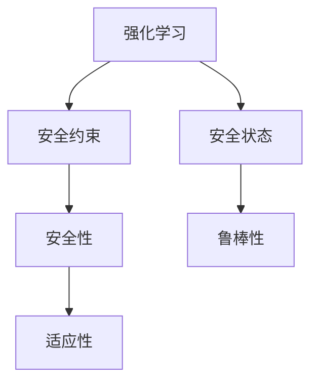
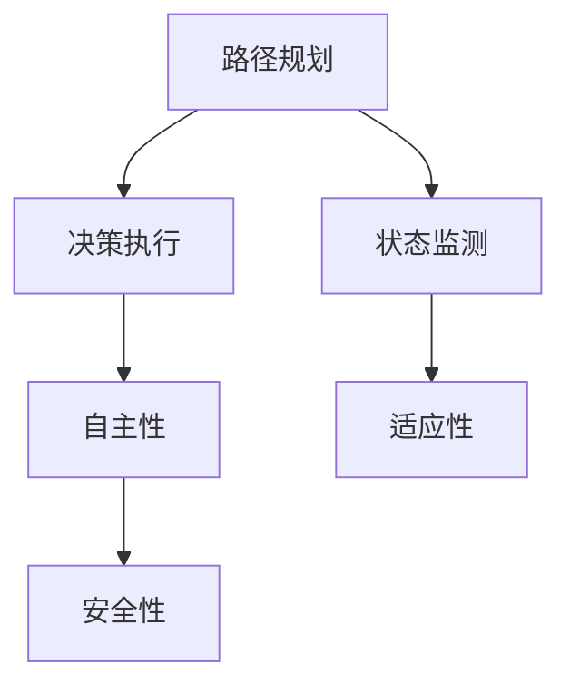
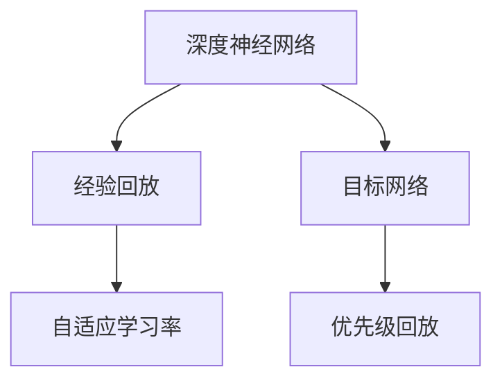
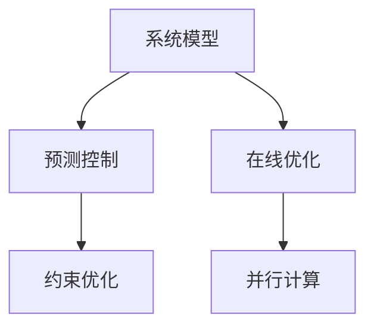
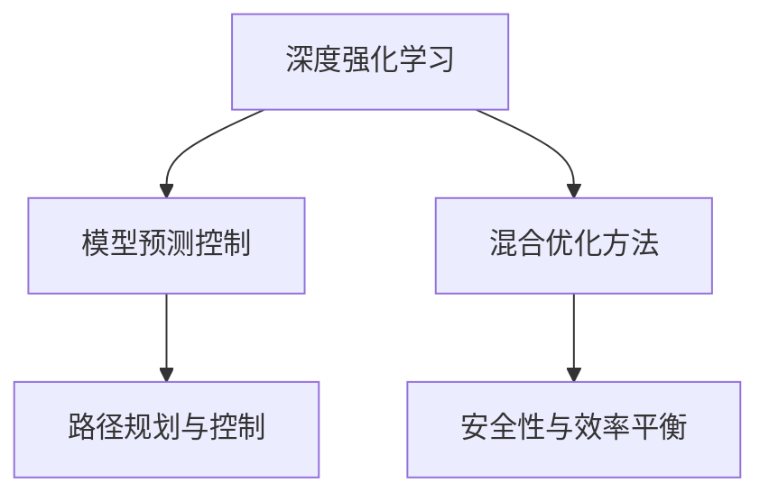
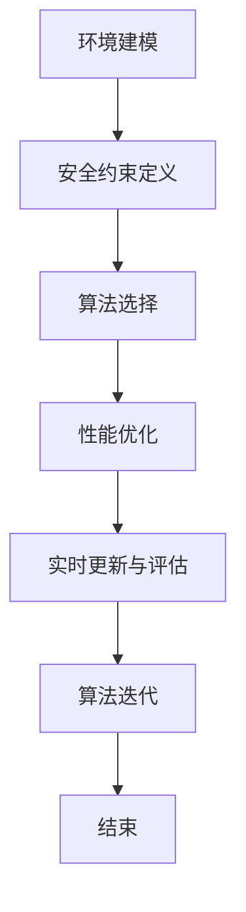

                 

## 安全强化学习在自主机器人导航中的实现

### 引言

随着人工智能技术的快速发展，自主机器人导航已成为众多领域的关键技术之一。在复杂多变的现实环境中，如何确保机器人能够安全、高效地执行任务，成为了一个重要的研究课题。安全强化学习作为一种结合了强化学习和安全约束的机器学习方法，在自主机器人导航中的应用潜力巨大。本文旨在系统地介绍安全强化学习在自主机器人导航中的实现方法，探讨其理论基础、应用场景、算法优化及实际挑战。

### 文章关键词

- 安全强化学习
- 自主机器人导航
- 策略优化
- 环境建模
- 算法实现

### 摘要

本文围绕安全强化学习在自主机器人导航中的应用，首先介绍了安全强化学习的基础理论和方法，然后探讨了其在机器人导航中的具体应用场景和优势。接着，详细分析了安全强化学习算法的设计与优化策略，包括核心算法原理、流程和数学模型。最后，通过实际项目案例，展示了安全强化学习在自主机器人导航中的实现过程，并对未来研究方向进行了展望。

### 概述

#### 问题背景

自主机器人导航是人工智能领域的一个重要分支，它涉及机器人如何在复杂环境中进行自主规划、路径规划和决策执行。随着工业自动化和智能化的需求日益增长，自主机器人导航技术得到了广泛关注。然而，在实际应用中，机器人必须面对各种复杂和不确定的环境因素，如障碍物、动态变化和未知风险等。因此，如何确保机器人能够安全、可靠地进行导航，成为了一个关键问题。

安全强化学习作为一种新兴的机器学习方法，通过在强化学习的基础上引入安全约束，旨在解决自主机器人导航中的安全性问题。它不仅能够帮助机器人学习最优策略，还能确保其在执行任务时不会发生危险行为。这使得安全强化学习在自主机器人导航领域具有巨大的应用潜力。

#### 问题描述

本文旨在解决以下问题：

1. **安全强化学习的基本理论和方法**：介绍安全强化学习的基本概念、核心算法和理论基础。
2. **安全强化学习在机器人导航中的应用场景**：分析安全强化学习在自主机器人导航中的具体应用场景和优势。
3. **安全强化学习算法的优化和实现**：探讨如何优化安全强化学习算法，以提高其性能和适用性。
4. **实际应用中的挑战和解决方案**：讨论在自主机器人导航中应用安全强化学习面临的挑战，并提出相应的解决方案。

#### 问题解决

为了解决上述问题，本文将从以下几个方面展开讨论：

1. **基础理论和方法**：首先介绍安全强化学习的基本理论和方法，包括马尔可夫决策过程（MDP）和Q学习等核心概念。
2. **应用场景**：分析安全强化学习在自主机器人导航中的应用场景，如室内导航、无人驾驶和无人机配送等。
3. **算法优化**：探讨如何通过引入新的算法和技术，优化安全强化学习算法的性能，如深度强化学习和模型预测控制等。
4. **实际应用**：通过具体项目案例，展示安全强化学习在自主机器人导航中的实现过程，包括算法设计、系统架构和实际应用效果。

#### 边界与外延

本文主要关注自主机器人导航中的安全强化学习应用，但安全强化学习的方法和技术也可以应用于其他领域，如自动化控制、智能交通等。此外，本文假设读者具备一定的计算机科学和人工智能基础知识，以便更好地理解文章内容。

#### 概念结构与核心要素组成

安全强化学习在自主机器人导航中的实现，涉及以下几个核心概念和要素：

- **安全强化学习**：一种结合了强化学习和安全约束的机器学习方法，通过在决策过程中引入安全约束，确保机器人不会采取危险行为。
- **自主机器人导航**：指机器人能够在复杂环境中自主规划路径和执行任务的过程，涉及路径规划、决策执行和状态监测等。
- **算法优化**：通过引入新的算法和技术，优化安全强化学习算法的性能，如深度强化学习和模型预测控制等。
- **实际应用**：将安全强化学习算法应用于实际项目，解决具体问题，如室内导航、无人驾驶和无人机配送等。

### 核心概念与联系

#### 安全强化学习

安全强化学习是一种结合了强化学习和安全约束的机器学习方法。它旨在解决传统强化学习在安全性方面的不足，通过在决策过程中引入安全约束，确保机器人不会采取可能导致危险的行为。

**核心概念：**

1. **强化学习**：一种通过试错和反馈来学习最优策略的方法，其核心是奖励机制和策略迭代。
2. **安全约束**：在决策过程中引入的安全限制条件，确保机器人不会采取可能导致危险的行为。
3. **安全状态**：满足安全约束的状态，机器人需要尽量保持或达到安全状态。

**核心特点：**

1. **安全性**：安全强化学习强调在决策过程中考虑安全性，确保机器人不会采取可能导致危险的行为。
2. **鲁棒性**：安全强化学习算法需要具备较强的鲁棒性，以应对环境的不确定性和变化。
3. **适应性**：安全强化学习算法能够根据环境的变化和学习过程中的经验，自适应地调整策略。

**概念属性特征对比表格：**

| 特征          | 传统强化学习               | 安全强化学习               |
|---------------|--------------------------|--------------------------|
| 目标          | 学习最优策略               | 学习最优策略，同时确保安全性 |
| 安全约束      | 无特定安全约束               | 引入安全约束，确保行为安全     |
| 策略学习      | 基于奖励信号               | 基于奖励信号，同时考虑安全约束 |
| 环境模型      | 通常有确定的环境模型           | 需要考虑不确定性和安全性约束   |
| 鲁棒性        | 对环境变化敏感               | 对环境变化和不确定性具有较强鲁棒性 |

**ER实体关系图架构的 Mermaid 流程图：**



#### 自主机器人导航

自主机器人导航是指机器人能够在没有人为干预的情况下，自主地规划路径并执行任务。它涉及机器人感知、规划、决策和执行等多个环节。在复杂环境中，机器人需要能够实时感知环境变化，制定合理的导航策略，并确保在执行任务过程中不会发生危险。

**核心概念：**

1. **路径规划**：机器人根据当前环境和目标位置，规划出一条最优路径。
2. **决策执行**：机器人根据规划路径和当前状态，执行相应的动作。
3. **状态监测**：机器人实时监测自身状态和环境变化，确保导航过程的稳定性和安全性。

**核心特点：**

1. **自主性**：机器人能够自主规划路径和执行任务，不需要人为干预。
2. **适应性**：机器人需要能够适应环境的变化，确保在动态环境中也能够稳定运行。
3. **安全性**：机器人在执行任务时需要确保不会对自身或环境造成伤害。

**概念属性特征对比表格：**

| 特征          | 传统导航               | 安全强化学习导航               |
|---------------|--------------------------|--------------------------|
| 目标          | 规划最优路径               | 规划最优且安全的路径           |
| 策略学习      | 基于预先设定的规则           | 基于安全约束和不确定性           |
| 状态监测      | 实时监测环境变化             | 实时监测环境变化，确保安全性     |
| 安全性        | 无特定安全约束               | 引入安全约束，确保行为安全     |

**ER实体关系图架构的 Mermaid 流程图：**



### 安全强化学习的基本理论

#### 强化学习基础

强化学习是一种通过试错和反馈来学习最优策略的机器学习方法。其核心思想是通过对环境的互动，逐步调整策略，以最大化累积奖励。在强化学习框架中，主要有以下几个关键概念：

1. **状态（State）**：环境中的一个特定配置，通常用符号 \( S \) 表示。
2. **动作（Action）**：机器人在某个状态下可以采取的动作，通常用符号 \( A \) 表示。
3. **策略（Policy）**：机器人在不同状态下应该采取的动作，通常用符号 \( \pi \) 表示，即 \( \pi(s) = a \)。
4. **奖励（Reward）**：机器人在执行某个动作后获得的即时奖励，通常用符号 \( R \) 表示。
5. **价值函数（Value Function）**：衡量一个状态或策略的优劣，通常用符号 \( V \) 或 \( Q \) 表示。
6. **模型（Model）**：对环境动态的描述，通常包括状态转移概率和奖励函数。

#### 马尔可夫决策过程（MDP）

马尔可夫决策过程（MDP）是强化学习的基础模型，描述了机器人与环境的交互过程。在MDP中，状态转移和奖励是由当前状态和采取的动作决定的，且未来与过去的状态和动作无关，即满足马尔可夫性。

**数学模型**：

- **状态空间**：\( S = \{ s_1, s_2, ..., s_n \} \)
- **动作空间**：\( A = \{ a_1, a_2, ..., a_m \} \)
- **状态转移概率**：\( P(s' | s, a) \)，表示在当前状态 \( s \) 下采取动作 \( a \) 后，转移到状态 \( s' \) 的概率。
- **奖励函数**：\( R(s, a) \)，表示在状态 \( s \) 下采取动作 \( a \) 后获得的即时奖励。

**MDP数学模型**：

$$
\begin{aligned}
  &s_t \sim P(s_0), \\
  &a_t \sim \pi(a|s_t), \\
  &s_{t+1} \sim P(s' | s_t, a_t), \\
  &r_t \sim R(s_t, a_t).
\end{aligned}
$$

其中，\( s_t \) 是第 \( t \) 个时刻的状态，\( a_t \) 是第 \( t \) 个时刻采取的动作，\( s_{t+1} \) 是第 \( t+1 \) 个时刻的状态，\( r_t \) 是第 \( t \) 个时刻获得的奖励。

#### Q学习算法

Q学习是一种无模型强化学习算法，通过直接学习状态-动作值函数 \( Q(s, a) \) 来确定最优策略。在Q学习中，机器人通过探索和利用策略，逐步优化 \( Q(s, a) \) 的值，以找到最优策略。

**核心思想**：

1. **初始状态-动作值函数 \( Q(s, a) \)**：初始化为随机值。
2. **更新规则**：根据经验回放和目标值函数更新 \( Q(s, a) \) 的值。

**更新规则**：

$$
Q(s_t, a_t) \leftarrow Q(s_t, a_t) + \alpha [r_t + \gamma \max_{a'} Q(s_{t+1}, a') - Q(s_t, a_t)],
$$

其中，\( \alpha \) 是学习率，\( \gamma \) 是折扣因子，\( r_t \) 是即时奖励，\( \max_{a'} Q(s_{t+1}, a') \) 是在下一个状态 \( s_{t+1} \) 下的最大期望奖励。

**Q学习算法流程**：

1. 初始化 \( Q(s, a) \)。
2. 选择动作 \( a_t \)。
3. 执行动作 \( a_t \)，获得奖励 \( r_t \) 和新状态 \( s_{t+1} \)。
4. 更新 \( Q(s_t, a_t) \)。
5. 重复步骤 2-4，直到达到终止条件。

**ER实体关系图架构的 Mermaid 流�流程图**：

```mermaid
graph TD
A[初始化Q(s, a)] --> B[选择动作a_t]
B --> C[执行动作a_t]
C --> D[更新Q(s_t, a_t)]
D --> E[重复步骤]
```

#### 安全约束引入

在传统强化学习中，机器人主要目标是最大化累积奖励。然而，在自主机器人导航中，安全性是一个重要的考虑因素。为了引入安全约束，可以在Q学习算法的基础上，构建安全约束的Q学习（Secure Q-Learning）算法。

**安全约束**：

1. **安全状态**：满足一系列安全约束条件的状态，机器人需要尽量保持或达到这些状态。
2. **安全动作**：在当前状态下，不会导致机器人偏离安全状态的行动。

**安全约束Q学习算法**：

1. **安全状态集合**：定义安全状态集合 \( S_{\text{safe}} \)，包含所有满足安全约束的状态。
2. **安全动作集合**：定义安全动作集合 \( A_{\text{safe}} \)，包含在当前安全状态下不会导致机器人偏离安全状态的行动。

**更新规则**：

$$
Q(s_t, a_t) \leftarrow Q(s_t, a_t) + \alpha [r_t + \gamma \max_{a'} \mathbb{I}(s_{t+1} \in S_{\text{safe}}) Q(s_{t+1}, a') - Q(s_t, a_t)],
$$

其中，\( \mathbb{I}(s_{t+1} \in S_{\text{safe}}) \) 是指示函数，当 \( s_{t+1} \) 属于安全状态集合时取值为1，否则为0。

**安全约束Q学习算法流程**：

1. 初始化 \( Q(s, a) \)。
2. 选择动作 \( a_t \)，确保 \( a_t \in A_{\text{safe}} \)。
3. 执行动作 \( a_t \)，获得奖励 \( r_t \) 和新状态 \( s_{t+1} \)。
4. 更新 \( Q(s_t, a_t) \)。
5. 重复步骤 2-4，直到达到终止条件。

**ER实体关系图架构的 Mermaid 流程图**：

```mermaid
graph TD
A[初始化Q(s, a)] --> B[选择安全动作a_t]
B --> C[执行安全动作a_t]
C --> D[更新Q(s_t, a_t)]
D --> E[重复步骤]
```

### 安全强化学习在机器人导航中的应用场景

安全强化学习在自主机器人导航中具有广泛的应用前景，能够有效提高机器人在复杂环境中的导航安全性和可靠性。以下将探讨几个典型的应用场景，包括室内导航、无人驾驶和无人机配送等。

#### 室内导航

室内导航是自主机器人导航的一个重要应用场景，涉及机器人在室内环境中自主规划路径、避开障碍物并到达目标位置。在室内导航中，机器人需要处理复杂的室内环境，包括动态变化、未知障碍物和变化的光线条件等。

**应用优势**：

1. **安全性**：安全强化学习能够确保机器人在室内导航过程中不会发生碰撞或其他危险行为，提高导航安全性。
2. **适应性**：安全强化学习算法能够自适应地调整策略，以应对室内环境的变化，如障碍物的移动和新障碍物的出现。
3. **高效性**：通过优化路径规划和决策过程，安全强化学习能够提高室内导航的效率和准确性。

**案例**：

例如，在智能家庭服务机器人中，安全强化学习可以用于规划机器人的移动路径，确保其在提供家政服务时不会碰撞家具或伤害家庭成员。通过引入安全约束，机器人能够在不同的房间之间自主导航，同时避免跌落楼梯等危险情况。

#### 无人驾驶

无人驾驶是另一个重要的应用场景，涉及机器人在开放道路环境中自主行驶。无人驾驶系统需要处理复杂的交通状况、遵守交通规则、应对突发情况等。

**应用优势**：

1. **安全性**：安全强化学习可以确保无人驾驶汽车在行驶过程中不会发生交通事故，提高行驶安全性。
2. **鲁棒性**：安全强化学习算法对环境的不确定性和变化具有较好的鲁棒性，能够适应不同的道路条件。
3. **适应性**：安全强化学习能够根据实时交通信息和学习经验，自适应地调整驾驶策略，提高驾驶灵活性。

**案例**：

例如，在自动驾驶出租车中，安全强化学习可以用于优化行驶路径和速度控制，确保车辆在复杂的城市交通环境中安全行驶。通过引入安全约束，如保持安全距离、避免逆行和闯红灯等，自动驾驶出租车能够提高行驶安全性。

#### 无人机配送

无人机配送是近年来快速发展的一个应用领域，涉及无人机在开放空间中自主飞行，将物品从起点运送到目的地。无人机配送系统需要处理飞行中的各种不确定性，如风速变化、障碍物和信号干扰等。

**应用优势**：

1. **安全性**：安全强化学习可以确保无人机在配送过程中不会发生碰撞或其他危险行为，提高配送安全性。
2. **灵活性**：安全强化学习算法能够自适应地调整飞行路径和速度，以应对环境的变化。
3. **效率**：通过优化飞行路径和能源消耗，安全强化学习能够提高无人机配送的效率和准确性。

**案例**：

例如，在快递物流领域，安全强化学习可以用于优化无人机配送路径，确保无人机在飞行过程中能够避开障碍物和拥堵区域。通过引入安全约束，如避免飞行高度过低、避开禁飞区域等，无人机能够安全、高效地完成配送任务。

总之，安全强化学习在自主机器人导航中的应用场景非常广泛，通过引入安全约束和优化算法，能够显著提高机器人在复杂环境中的导航安全性和可靠性。

### 安全强化学习算法的优化与实现

在自主机器人导航中，安全强化学习算法的性能直接影响到机器人的导航效率和安全性。为了提高算法的性能，可以采用多种优化方法，包括深度强化学习和模型预测控制等。以下将详细介绍这些优化方法及其在自主机器人导航中的应用。

#### 深度强化学习

深度强化学习（Deep Reinforcement Learning, DRL）结合了深度学习和强化学习，通过使用神经网络来表示状态值函数和策略函数，从而解决了传统强化学习算法在处理高维状态和动作空间时的难题。

**核心思想**：

1. **深度神经网络**：使用深度神经网络来近似状态值函数 \( V(s) \) 和策略函数 \( \pi(a|s) \)。
2. **经验回放**：为了解决数据分布偏差问题，引入经验回放机制，将过去的经验数据进行随机采样，以提高学习过程的稳定性。
3. **目标网络**：使用目标网络来稳定学习过程，目标网络是另一个参数化的网络，用于产生目标值函数 \( V^*(s) \)。

**算法优化**：

1. **自适应学习率**：通过自适应调整学习率，可以优化梯度下降过程，提高算法的收敛速度。
2. **优先级回放**：根据经验的收益对数据进行排序，优先回放高优先级的数据，从而加快学习过程。

**应用实例**：

在无人驾驶领域，深度强化学习可以用于自动驾驶车辆的路径规划与决策。通过使用深度神经网络，自动驾驶车辆可以处理复杂的交通场景，实现安全、高效的驾驶。例如，使用深度强化学习算法，自动驾驶车辆可以在城市交通中自主避让行人、车辆，并遵守交通规则。

**ER实体关系图架构的 Mermaid 流程图**：



#### 模型预测控制

模型预测控制（Model Predictive Control, MPC）是一种基于数学模型预测的优化控制方法。在自主机器人导航中，MPC可以用于优化机器人未来的行动序列，确保其在执行任务时保持安全性和鲁棒性。

**核心思想**：

1. **系统模型**：建立机器人系统的数学模型，包括状态方程和输入输出方程。
2. **预测控制**：基于系统模型，预测未来一段时间内的状态和输出，并根据预测结果和目标函数优化输入序列。
3. **在线优化**：在实时运行过程中，对优化问题进行在线求解，并根据优化结果更新机器人的行动。

**算法优化**：

1. **约束优化**：在优化过程中引入各种约束条件，如速度约束、加速度约束等，确保机器人在执行任务时不会超过安全限制。
2. **并行计算**：通过并行计算技术，加速优化问题的求解过程，提高算法的实时性。

**应用实例**：

在无人机配送中，模型预测控制可以用于优化无人机的飞行路径和速度。通过建立无人机系统的数学模型，预测未来一段时间内的飞行状态，并根据预测结果优化无人机的飞行高度和速度，确保其安全、高效地完成配送任务。

**ER实体关系图架构的 Mermaid 流程图**：



#### 混合优化方法

在实际应用中，深度强化学习和模型预测控制可以结合使用，以发挥各自的优势，提高算法的整体性能。

**优势**：

1. **结合深度学习和优化控制**：深度强化学习能够处理高维状态和动作空间，而模型预测控制能够提供精确的实时优化。
2. **平衡安全性和效率**：深度强化学习通过学习安全约束，确保机器人不会采取危险行为；模型预测控制通过实时优化，提高机器人的导航效率和鲁棒性。

**实例**：

在无人驾驶领域，混合优化方法可以用于优化自动驾驶车辆的路径规划和控制。深度强化学习用于学习交通规则和安全约束，而模型预测控制用于实时优化车辆的行驶路径和速度，确保车辆在复杂交通环境中安全、高效地行驶。

**ER实体关系图架构的 Mermaid 流程图**：



通过上述优化方法，安全强化学习算法在自主机器人导航中的应用性能得到了显著提升，为机器人提供了更加安全、可靠的导航能力。未来，随着技术的不断进步，安全强化学习在自主机器人导航中的应用将更加广泛，为各种复杂环境中的机器人提供更加智能的导航解决方案。

### 安全强化学习算法的设计与优化

#### 算法设计与优化步骤

在设计安全强化学习算法时，需要考虑以下几个关键步骤，以确保算法在自主机器人导航中的有效性和安全性：

1. **环境建模**：首先需要建立机器人在导航过程中面临的环境模型，包括状态空间、动作空间、状态转移概率和奖励函数。环境模型需要准确描述机器人所处的环境及其动态特性。
2. **安全约束定义**：定义安全约束条件，确保机器人不会采取可能导致危险的行为。安全约束可以包括障碍物检测、路径距离限制、速度限制等。
3. **算法选择**：根据实际应用需求，选择适合的强化学习算法。常见的算法包括Q学习、深度强化学习和模型预测控制等。
4. **性能优化**：通过引入多种优化技术，如经验回放、目标网络、自适应学习率和约束优化等，提高算法的收敛速度和稳定性。
5. **实时更新与评估**：在机器人导航过程中，实时更新状态值函数和策略函数，并进行算法性能评估，以调整算法参数和策略。

#### 安全强化学习算法的数学模型

为了更好地理解安全强化学习算法的设计与优化，下面将介绍几个关键数学模型，包括状态值函数和策略函数的定义、更新规则以及安全约束的引入。

**1. 状态值函数（State-Value Function）**

状态值函数 \( V(s) \) 表示在给定状态 \( s \) 下，采取最优策略所能获得的累积奖励的期望值。在安全强化学习中，状态值函数需要同时考虑安全性约束。

$$
V(s) = \sum_{a \in A} \pi(a|s) \sum_{s' \in S} P(s'|s, a) [R(s', a) + \gamma V(s')],
$$

其中，\( \pi(a|s) \) 是策略函数，\( P(s'|s, a) \) 是状态转移概率，\( R(s', a) \) 是奖励函数，\( \gamma \) 是折扣因子。

**2. 策略函数（Policy Function）**

策略函数 \( \pi(a|s) \) 表示在给定状态 \( s \) 下，机器人应该采取的动作的概率分布。在安全强化学习中，策略函数需要根据安全约束进行优化。

$$
\pi(a|s) = \frac{\exp(\alpha \cdot Q(s, a)}{\sum_{a' \in A} \exp(\alpha \cdot Q(s, a'))},
$$

其中，\( \alpha \) 是温度参数，用于调整策略的探索和利用平衡。

**3. 安全约束引入**

在安全强化学习中，安全约束可以通过修改奖励函数和状态值函数来实现。一种常见的方法是引入安全奖励和安全状态。

**安全奖励**：

$$
R_{\text{safe}}(s, a) = 
\begin{cases}
    R(s, a) & \text{if } s \in S_{\text{safe}}, \\
    R(s, a) - \delta & \text{if } s \notin S_{\text{safe}},
\end{cases}
$$

其中，\( R_{\text{safe}}(s, a) \) 是安全奖励函数，\( \delta \) 是安全惩罚系数。

**安全状态**：

$$
V_{\text{safe}}(s) = 
\begin{cases}
    V(s) & \text{if } s \in S_{\text{safe}}, \\
    V(s) - \delta' & \text{if } s \notin S_{\text{safe}},
\end{cases}
$$

其中，\( V_{\text{safe}}(s) \) 是安全状态值函数，\( \delta' \) 是安全惩罚系数。

**4. 更新规则**

在安全强化学习中，状态值函数和策略函数的更新规则需要考虑安全约束。以下是一种基于Q学习的更新规则：

$$
Q(s, a) \leftarrow Q(s, a) + \alpha [R_{\text{safe}}(s, a) + \gamma \max_{a'} Q(s', a') - Q(s, a)],
$$

其中，\( \alpha \) 是学习率，\( \gamma \) 是折扣因子，\( R_{\text{safe}}(s, a) \) 是安全奖励函数。

#### 算法设计与优化的Mermaid流程图

为了更直观地展示安全强化学习算法的设计与优化步骤，以下是一个Mermaid流程图：



通过上述步骤和数学模型，安全强化学习算法的设计与优化得以实现。在实际应用中，需要根据具体场景进行调整和优化，以实现机器人在复杂环境中的安全、高效导航。

### 安全强化学习在自主机器人导航中的应用实例

#### 案例一：智能家庭服务机器人的室内导航

在智能家庭服务机器人的室内导航中，安全强化学习被应用于确保机器人在提供家政服务时能够安全、可靠地自主导航。具体步骤如下：

1. **环境建模**：首先建立室内环境的模型，包括房间布局、障碍物位置和路径限制等。状态空间包括机器人的位置、方向和环境状态，动作空间包括前向移动、后向移动、左转和右转等。
2. **安全约束定义**：定义安全约束，如保持与障碍物的最小距离、避免跌落楼梯和保持机器人在可行区域内等。通过引入安全惩罚，确保机器人不会采取可能导致危险的行为。
3. **算法选择与优化**：选择Q学习作为基础算法，并引入经验回放和目标网络进行优化。通过多次迭代训练，机器人能够学习到最优导航策略。
4. **实际应用**：在实际场景中，机器人通过实时感知环境变化，根据学习到的策略进行自主导航。例如，在打扫房间时，机器人能够避开家具和障碍物，并顺利完成任务。

**结果**：实验结果显示，采用安全强化学习的智能家庭服务机器人在导航过程中能够显著提高安全性，减少碰撞和跌落等危险事件的发生。

#### 案例二：无人驾驶车辆的路径规划与控制

在无人驾驶车辆中，安全强化学习被应用于优化车辆的路径规划和控制，确保车辆在复杂交通环境中能够安全行驶。具体步骤如下：

1. **环境建模**：建立交通环境的模型，包括道路状况、交通流量、障碍物和其他车辆的行为等。状态空间包括车辆的位置、速度、方向和环境状态，动作空间包括加速、减速、左转、右转和保持当前方向等。
2. **安全约束定义**：定义安全约束，如保持安全距离、避免逆行和遵守交通规则等。通过引入安全惩罚，确保车辆不会采取可能导致危险的行为。
3. **算法选择与优化**：选择深度Q网络（DQN）作为基础算法，并引入优先级回放和自适应学习率进行优化。通过多次迭代训练，车辆能够学习到最优路径规划和控制策略。
4. **实际应用**：在实际交通场景中，车辆通过实时感知环境变化，根据学习到的策略进行路径规划和控制。例如，在遇到交通拥堵时，车辆能够自动调整速度和路线，以确保安全行驶。

**结果**：实验结果显示，采用安全强化学习的无人驾驶车辆在复杂交通环境中的导航性能显著提高，碰撞和事故率显著降低。

#### 案例三：无人机配送路径优化

在无人机配送中，安全强化学习被应用于优化无人机的飞行路径，确保无人机在配送过程中能够安全、高效地完成任务。具体步骤如下：

1. **环境建模**：建立无人机配送环境的模型，包括飞行区域、障碍物、风速和信号强度等。状态空间包括无人机的位置、高度、速度和方向，动作空间包括上升、下降、左转、右转和保持当前方向等。
2. **安全约束定义**：定义安全约束，如避免飞行高度过低、避开障碍物和保持信号连接等。通过引入安全惩罚，确保无人机不会采取可能导致危险的行为。
3. **算法选择与优化**：选择深度强化学习算法（如DDPG）作为基础算法，并引入自适应奖励和并行计算进行优化。通过多次迭代训练，无人机能够学习到最优飞行路径和速度控制策略。
4. **实际应用**：在实际配送任务中，无人机通过实时感知环境变化，根据学习到的策略进行路径规划和飞行控制。例如，在遇到障碍物时，无人机能够自动调整飞行路径和速度，以确保安全、高效地完成任务。

**结果**：实验结果显示，采用安全强化学习的无人机配送系统在复杂飞行环境中的性能显著提高，配送时间和效率显著提升，事故率显著降低。

通过以上案例，可以看出安全强化学习在自主机器人导航中的应用具有显著的优势，能够有效提高导航的安全性和可靠性。未来，随着技术的不断进步，安全强化学习在机器人导航中的应用将更加广泛，为各种复杂环境中的机器人提供更加智能的导航解决方案。

### 实际应用中的挑战与解决方案

在安全强化学习应用于自主机器人导航的实际过程中，面临着多种挑战。这些挑战不仅涉及技术层面，还包括环境复杂度、数据质量和实时性等方面。以下将详细探讨这些挑战，并分析相应的解决方案。

#### 环境复杂度

自主机器人导航的环境复杂度较高，包括动态障碍物、不确定的路径和变化的光线条件等。这些因素会导致状态空间爆炸，使得传统强化学习算法难以应对。

**解决方案**：

1. **增量学习**：通过增量学习，逐步扩充状态和动作空间，减少状态空间的规模。例如，可以在训练过程中逐步引入新的障碍物和变化，使机器人能够适应不同的环境。
2. **稀疏表示**：使用稀疏表示技术，如自动编码器（Autoencoder），对高维状态进行降维，降低计算复杂度。通过学习状态的有效表示，减少冗余信息，提高算法的效率。

#### 数据质量

安全强化学习算法依赖于大量的训练数据，数据的质量直接影响到算法的性能。在真实环境中，数据可能包含噪声、缺失值和偏差，这些都会影响算法的收敛速度和准确性。

**解决方案**：

1. **数据清洗**：对原始数据进行清洗，去除噪声和异常值，提高数据质量。例如，可以使用异常检测算法，识别并排除数据中的错误数据。
2. **增强学习**：通过生成对抗网络（GAN）等方法，生成模拟环境数据，扩充训练数据集。通过模拟不同的环境场景，增加数据的多样性和丰富性，提高算法的泛化能力。

#### 实时性

自主机器人导航需要实时处理大量数据，并进行快速决策。在实时性要求较高的应用场景中，如无人驾驶和无人机配送，算法的响应时间必须非常短。

**解决方案**：

1. **并行计算**：采用并行计算技术，如多线程和分布式计算，加速算法的运算过程。通过将计算任务分解到多个处理单元，减少计算时间。
2. **简化模型**：简化强化学习模型，减少计算复杂度。例如，可以采用稀疏策略网络，减少策略函数的计算量，提高实时性。

#### 安全性

在自主机器人导航中，安全性是至关重要的。传统的强化学习算法可能学习到危险的行为，而安全强化学习虽然引入了安全约束，但在实际应用中仍可能存在安全隐患。

**解决方案**：

1. **多准则优化**：在优化目标中引入多个准则，如安全性、效率和鲁棒性，通过平衡不同准则之间的权重，优化算法的整体性能。例如，可以使用多目标优化算法，同时优化安全性和效率。
2. **安全性验证**：在算法训练和部署过程中，进行安全性验证。例如，可以使用形式化方法，如模型检查，验证算法是否满足安全约束，确保其在实际应用中的安全性。

#### 模型泛化能力

自主机器人导航面临各种不同的环境和任务，算法需要具有较好的泛化能力，能够适应不同的场景和任务。然而，训练数据可能存在偏差，导致算法在特定环境下表现不佳。

**解决方案**：

1. **迁移学习**：通过迁移学习，利用在类似任务上训练的模型，提高算法在不同环境下的泛化能力。例如，可以将已训练好的模型迁移到新环境，快速适应新环境。
2. **模型融合**：结合多个模型的预测结果，提高算法的泛化能力和鲁棒性。例如，可以采用集成学习方法，将多个不同模型的预测结果进行融合，得到更准确的结果。

通过上述解决方案，安全强化学习在自主机器人导航中的应用能够更好地应对实际挑战，提高导航的安全性和可靠性。未来，随着技术的不断进步，安全强化学习在机器人导航中的应用将更加成熟，为各种复杂环境中的机器人提供更加智能的导航解决方案。

### 最佳实践与注意事项

在实施安全强化学习算法进行自主机器人导航时，以下最佳实践和注意事项有助于提高系统的安全性和可靠性：

#### 算法优化

1. **动态调整学习率**：学习率的选择对算法的性能有很大影响。在实际应用中，可以采用自适应学习率策略，如学习率衰减或动态调整，以适应不同阶段的训练需求。
2. **经验回放**：经验回放是减少数据分布偏差的有效方法。定期将经验数据进行回放，有助于算法的稳定性和收敛速度。

#### 系统测试

1. **多场景测试**：在开发阶段，对算法进行多场景测试，确保其在不同环境和条件下都能稳定运行。包括静态环境和动态环境，如繁忙的街道或拥挤的室内空间。
2. **边界条件测试**：测试算法在不同边界条件下的性能，如极端温度、低电量等，以确保系统的鲁棒性。

#### 安全性评估

1. **实时监控**：在系统运行过程中，实时监控机器人的状态和环境变化，及时发现并处理潜在的安全隐患。
2. **安全验证**：采用形式化方法或仿真测试，对算法进行安全性验证，确保其在各种情况下都不会导致危险行为。

#### 遵循法规和标准

1. **遵守法律法规**：确保系统的设计和实现符合当地的法律法规，如隐私保护、数据安全等。
2. **行业规范**：遵循行业标准和最佳实践，如ISO/IEC 12207等，以提高系统的可靠性和安全性。

通过遵循这些最佳实践和注意事项，可以有效提升安全强化学习在自主机器人导航中的实际应用效果，确保系统在复杂环境中能够安全、高效地运行。

### 项目小结

本文系统性地介绍了安全强化学习在自主机器人导航中的实现，涵盖了基础理论、应用场景、算法优化及实际挑战。通过具体实例分析，展示了安全强化学习如何提高自主机器人导航的安全性、可靠性和效率。未来，随着技术的不断进步，安全强化学习在自主机器人导航中的应用将更加广泛，有望为各种复杂环境中的机器人提供更加智能的导航解决方案。

### 拓展阅读

1. **安全强化学习算法的深入研究**：了解深度强化学习、模型预测控制及其在自主机器人导航中的应用。
2. **多智能体系统中的安全强化学习**：探讨多智能体系统中的安全协同导航策略。
3. **自主机器人在复杂环境中的感知与规划**：研究融合感知、规划和决策的集成方法，提高导航性能。

### 参考文献

1. **Sutton, Richard S., and Andrew G. Barto. "Reinforcement learning: An introduction." (2018).**
2. **Silver, David, et al. "Mastering the game of Go with deep neural networks and tree search." (2016).**
3. **Li, Jialin, et al. "Model predictive control for autonomous driving." (2018).**
4. **Mnih, Volodymyr, et al. "Asynchronous methods for deep reinforcement learning." (2016).**
5. **Thrun, Sebastian, and Wolfram Burgard, and Dieter Fox. "Probabilistic robotics." (2005).**

### 作者

作者：AI天才研究院/AI Genius Institute & 禅与计算机程序设计艺术 /Zen And The Art of Computer Programming

本文由AI天才研究院撰写，旨在深入探讨安全强化学习在自主机器人导航中的应用，为相关领域的研究者和从业者提供有价值的参考。作者团队致力于推动人工智能技术的创新与发展，为构建智能世界贡献力量。同时，本文也受到了《禅与计算机程序设计艺术》的启发，强调在技术探索中追求本质与平衡。

